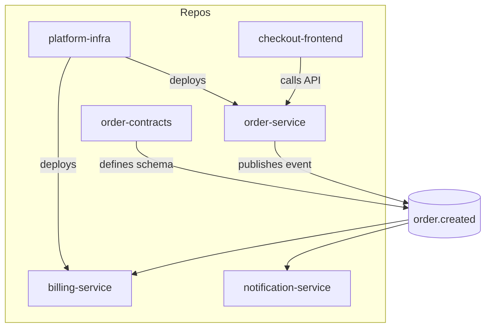
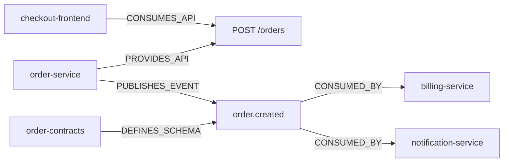
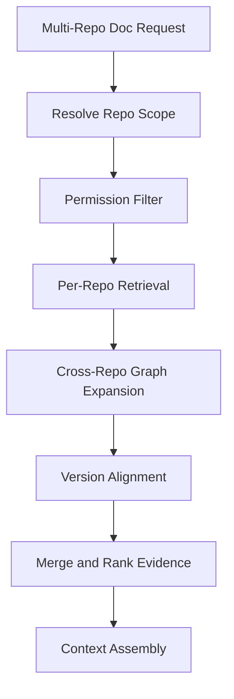
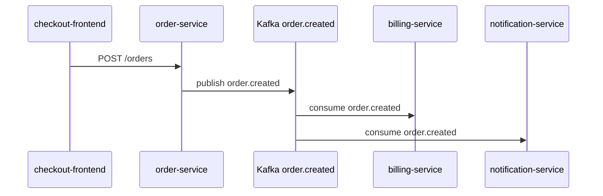
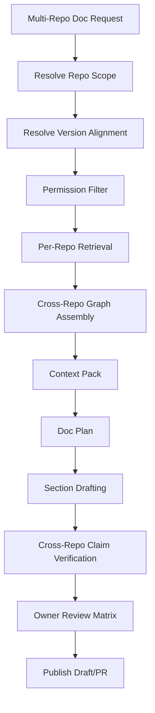

------
title: Learn AI Code Documentation & Agent Memory Platform - Part 020
description: Multi-repository documentation untuk membangun dokumentasi lintas service/repository, dependency, API, event, ownership, platform capability, provenance, permission, dan version alignment.
series: learn-ai-code-documentation-agent-memory
seriesTitle: Learn AI Code Documentation & Agent Memory Platform
order: 20
partTitle: Multi-Repository Documentation
tags:
- ai
- documentation
- multi-repository
- code-intelligence
- service-catalog
- dependency-graph
- platform-engineering
- agent-context
date: 2026-07-02
---

# Part 020 — Multi-Repository Documentation

## 1. Tujuan Part Ini

Part 019 membahas doc quality gates. Sekarang kita membahas salah satu tantangan paling penting di organisasi modern: **multi-repository documentation**.

Banyak sistem bisnis tidak hidup dalam satu repository. Satu capability bisa tersebar di:

- backend services,
- frontend apps,
- shared libraries,
- schema repositories,
- infrastructure repositories,
- workflow/orchestration repositories,
- data pipeline repositories,
- documentation repositories.

Jika dokumentasi hanya melihat satu repo, banyak pertanyaan penting tidak terjawab:

- Service mana yang menjadi upstream/downstream?
- Event ini dipublish dan dikonsumsi siapa?
- API ini dipakai oleh aplikasi mana?
- Shared library ini dipakai repo mana?
- Schema version mana yang aktif?
- Docs lintas service mana yang stale?
- Siapa owner dari end-to-end flow?
- AI agent perlu context dari repo mana saja?

Target part ini:

1. memahami problem multi-repo documentation,
2. mendesain cross-repo source boundary,
3. membuat taxonomy docs lintas repo,
4. membangun cross-repo dependency narrative,
5. menangani version alignment,
6. menjaga permission dan provenance lintas repo,
7. menghasilkan platform/service/capability docs,
8. membuat cross-repo context pack untuk agents,
9. mengelola ownership dan review,
10. menghindari false certainty dalam multi-repo reasoning.

---

## 2. Kenapa Multi-Repo Documentation Sulit

### 2.1 Codebase Tidak Selalu Sesuai Architecture Diagram

Architecture diagram mungkin bilang:

```txt
frontend -> order-service -> billing-service
```

Tetapi realitas bisa:

- frontend memanggil order-service dan pricing-service,
- order-service publish event ke Kafka,
- billing-service consume event,
- notification-service juga consume event,
- shared model library dipakai beberapa service,
- schema repo mendefinisikan contract,
- deployment repo menyimpan runtime wiring.

### 2.2 Tantangan Utama

| Tantangan | Dampak |
|---|---|
| repo version berbeda | docs lintas repo bisa inconsistent |
| permission berbeda | user boleh lihat repo A tapi tidak repo B |
| ownership tersebar | review lambat |
| dependency implicit | static analysis tidak cukup |
| contracts stale | docs salah |
| duplicated knowledge | banyak README tidak sinkron |
| event/API compatibility | sulit dijelaskan |
| cross-repo graph besar | retrieval noise |
| generated docs overclaim | false certainty |

### 2.3 Prinsip Utama

```txt
Multi-repo documentation must be explicit about scope, versions, evidence, and permission.
```

---

## 3. Mental Model Multi-Repo



Multi-repo docs harus menjelaskan graph seperti ini dengan evidence.

---

## 4. Cross-Repo Knowledge Types

### 4.1 API Dependency

```yaml
relation:
  type: api_consumer
  consumer: checkout-frontend
  provider: order-service
  endpoint: POST /orders
```

### 4.2 Event Dependency

```yaml
relation:
  type: event_flow
  producer: order-service
  topic: order.created
  consumers:
    - billing-service
    - notification-service
```

### 4.3 Shared Library Dependency

```yaml
relation:
  type: package_dependency
  consumer: order-service
  package: com.acme:order-model
  providerRepo: order-model-library
```

### 4.4 Schema Dependency

```yaml
relation:
  type: schema_dependency
  consumer: billing-service
  schema: OrderCreated
  schemaRepo: order-contracts
```

### 4.5 Infrastructure Dependency

```yaml
relation:
  type: deployment_dependency
  serviceRepo: order-service
  infraRepo: platform-infra
  deploymentPath: helm/order-service
```

### 4.6 Ownership Dependency

```yaml
relation:
  type: ownership
  repository: order-service
  ownerTeam: team-order-platform
```

---

## 5. Multi-Repo Documentation Taxonomy

### 5.1 Service Catalog Documentation

Purpose:

> Menjelaskan daftar service/repo, owner, purpose, runtime boundary, APIs/events, dependencies, and docs status.

Audience:

- platform engineer,
- tech lead,
- new engineer,
- AI agent.

Structure:

```md
# Service Catalog

## Services

## Ownership

## APIs

## Events

## Dependencies

## Documentation Health

## Evidence
```

### 5.2 Capability Documentation

Purpose:

> Menjelaskan end-to-end business capability yang melintasi banyak repo.

Example:

```txt
Order Creation Capability
```

Structure:

```md
# Capability: Order Creation

## Business Purpose

## Participating Systems

## End-to-End Flow

## APIs and Events

## Data Ownership

## Failure Modes

## Operational Notes

## Ownership

## Evidence and Version Alignment
```

### 5.3 Cross-Service Flow Documentation

Purpose:

> Menjelaskan runtime flow dari frontend/API/event/data.

Structure:

```md
# Flow: Create Order

## Entry Point

## Sequence

## Services

## Events

## Data Writes

## Error Handling

## Observability

## Evidence
```

### 5.4 Event Ecosystem Documentation

Purpose:

> Menjelaskan topic/event, producer, consumer, schema, version, compatibility, ownership.

Structure:

```md
# Event: order.created

## Purpose

## Producers

## Consumers

## Schema

## Versioning

## Compatibility

## Failure Handling

## Evidence
```

### 5.5 API Consumer Documentation

Purpose:

> Menjelaskan siapa yang menggunakan API provider.

Structure:

```md
# API Consumers: Order Service

## Exposed APIs

## Known Consumers

## Contract Version

## Compatibility Notes

## Breaking Change Risk

## Evidence
```

### 5.6 Platform Architecture Documentation

Purpose:

> Menjelaskan architecture lintas repo/platform.

Structure:

```md
# Platform Architecture

## Scope

## System Map

## Service Boundaries

## Dependency Graph

## Shared Capabilities

## Risks

## Ownership

## Evidence
```

### 5.7 Cross-Repo Impact Report

Purpose:

> Menjelaskan dampak perubahan di satu repo terhadap repo lain.

Structure:

```md
# Cross-Repo Impact: <Change>

## Change Summary

## Direct Impact

## Transitive Impact

## Affected APIs/Events/Schemas

## Affected Docs

## Affected Teams

## Recommended Actions

## Evidence and Confidence
```

---

## 6. Source Boundary Multi-Repo

### 6.1 Explicit Repo Scope

Multi-repo docs must specify included repos.

```yaml
scope:
  repositories:
    - order-service
    - billing-service
    - notification-service
    - order-contracts
```

### 6.2 Excluded Repos

Also specify excluded/unknown repos.

```yaml
excluded:
  - fraud-service
    reason: permission_denied
  - analytics-pipeline
    reason: not_indexed
```

If permission prevents revealing repo name, use safe description.

### 6.3 Scope Invariant

```txt
Do not claim global platform truth from partial repository evidence.
```

If only 4 of 10 repos are indexed, say so.

---

## 7. Version Alignment

### 7.1 Problem

Repo A at commit X may depend on repo B at release Y.

If docs combine latest main from every repo, they may describe a state that never existed in production.

### 7.2 Version Alignment Strategies

| Strategy | Description |
|---|---|
| latest-main | use current default branch snapshots |
| release-aligned | use release tags/versions |
| deployment-aligned | use versions currently deployed |
| time-aligned | use snapshots near same timestamp |
| dependency-lock-aligned | use dependency manifests |
| user-selected | user explicitly selects commits |

### 7.3 Alignment Metadata

```yaml
versionAlignment:
  strategy: latest-main
  repositories:
    order-service:
      commit: 6f41ab2
      branch: main
    billing-service:
      commit: a81c20e
      branch: main
    order-contracts:
      commit: 23bb91c
      tag: v1.4.0
  warning: "This view may not represent a deployed production state."
```

### 7.4 Deployment-Aligned Docs

Best for operational docs, but requires deployment metadata.

```yaml
versionAlignment:
  strategy: deployment-aligned
  environment: production
  observedAt: 2026-07-02T00:00:00Z
```

If runtime metadata unavailable, do not pretend.

---

## 8. Permission Model Multi-Repo

### 8.1 Permission Intersection

A doc using evidence from repos A and B has visibility no broader than both.

```txt
doc visibility = intersection(visibility(repo A evidence, repo B evidence))
```

### 8.2 Partial Visibility

If user can see order-service but not billing-service, output should not reveal billing internals.

Possible response:

```md
The indexed evidence shows `order-service` publishes `order.created`. Some downstream consumers are not visible under your current permissions.
```

### 8.3 Derived Relationship Leakage

Even saying "billing-service consumes order.created" may leak info.

Treat cross-repo edges as derived sensitive data.

### 8.4 Permission-Aware Graph Query

```yaml
graphQuery:
  principal: user_123
  allowedRepos:
    - order-service
  result:
    visibleEdgesOnly: true
```

---

## 9. Cross-Repo Provenance

Every cross-repo claim needs multi-source evidence.

### 9.1 Example Claim

```md
`order-service` publishes `order.created`, which is consumed by `billing-service`.
```

Evidence:

```yaml
claimEvidence:
  - repo: order-service
    path: OrderEventPublisher.java
    lines: [31, 52]
  - repo: billing-service
    path: OrderCreatedConsumer.java
    lines: [14, 44]
  - topic: order.created
```

### 9.2 Claim Confidence

If producer evidence exists but consumer inferred from config only, confidence lower.

```yaml
confidence:
  producer: 0.91
  consumer: 0.68
  overall: 0.72
```

### 9.3 Provenance Table

| Claim | Repo Evidence | Confidence |
|---|---|---:|
| order-service publishes order.created | order-service | high |
| billing-service consumes order.created | billing-service | medium |
| notification-service consumes order.created | notification-service | high |

---

## 10. Cross-Repo Graph Model

### 10.1 Canonical Cross-Repo Nodes

| Node | ID Example |
|---|---|
| service | `service:order-service` |
| API operation | `api:http:POST:/orders` |
| event topic | `event:kafka:order.created` |
| schema | `schema:OrderCreated:v1` |
| package | `pkg:maven:com.acme:order-model` |
| team | `team:order-platform` |
| environment | `env:production` |

### 10.2 Cross-Repo Edges

| Edge | Example |
|---|---|
| `PROVIDES_API` | order-service -> POST /orders |
| `CONSUMES_API` | checkout-frontend -> POST /orders |
| `PUBLISHES_EVENT` | order-service -> order.created |
| `CONSUMES_EVENT` | billing-service -> order.created |
| `DEFINES_SCHEMA` | order-contracts -> OrderCreated |
| `USES_SCHEMA` | billing-service -> OrderCreated |
| `DEPENDS_ON_PACKAGE` | order-service -> order-model |
| `DEPLOYED_BY` | order-service -> infra repo |
| `OWNED_BY` | repo -> team |

### 10.3 Graph Example



---

## 11. Multi-Repo Retrieval

### 11.1 Retrieval Flow



### 11.2 Per-Repo Retrieval

Run retrieval within each repo:

- source chunks,
- docs,
- tests,
- API/event/schema evidence,
- memory.

### 11.3 Cross-Repo Ranking

Boost:

- direct cross-repo relation,
- high confidence event/API edges,
- owner-reviewed docs,
- deployment-aligned evidence.

Penalize:

- partial evidence,
- stale contract,
- unknown version alignment,
- permission-limited results.

### 11.4 Avoid Evidence Flood

Multi-repo context can explode.

Use:

- per-repo evidence budget,
- graph-depth limit,
- capability scope,
- doc type-specific buckets.

---

## 12. Multi-Repo Context Pack

### 12.1 Context Pack Schema

```yaml
contextPack:
  task:
    type: generate_capability_doc
    capability: order_creation
  scope:
    repositories:
      - order-service
      - billing-service
      - notification-service
      - order-contracts
    versionAlignment:
      strategy: latest-main
  evidenceByRepository:
    order-service:
      - OrderController.java
      - OrderEventPublisher.java
    billing-service:
      - OrderCreatedConsumer.java
    order-contracts:
      - order-created.proto
  crossRepoGraph:
    - order-service PUBLISHES_EVENT order.created
    - billing-service CONSUMES_EVENT order.created
  warnings:
    - "This context is latest-main aligned, not deployment-aligned."
```

### 12.2 Budget Allocation

Example for 20k token context:

```yaml
budget:
  overview: 1000
  crossRepoGraph: 2500
  orderService: 5000
  billingService: 3500
  notificationService: 2500
  contracts: 2500
  docsAndADR: 2000
  warningsAndEvidence: 1000
```

---

## 13. Generating Capability Docs

### 13.1 Capability Request

```yaml
docRequest:
  docType: capability_doc
  capability: order_creation
  repositories:
    - checkout-frontend
    - order-service
    - billing-service
    - notification-service
    - order-contracts
  versionAlignment:
    strategy: latest-main
```

### 13.2 Capability Doc Structure

```md
# Capability: Order Creation

## Scope

## Participating Repositories

## End-to-End Flow

## APIs

## Events

## Data Ownership

## Failure Modes

## Operational Notes

## Ownership

## Evidence and Version Alignment

## Uncertainties
```

### 13.3 Mermaid Sequence



Only generate this if evidence supports each relation.

---

## 14. Generating Service Catalog Docs

### 14.1 Service Catalog Inputs

- repository inventory,
- ownership metadata,
- APIs/events,
- runtime/deployment metadata if available,
- docs health,
- dependencies.

### 14.2 Service Catalog Entry

```yaml
service:
  name: order-service
  repository: order-service
  owner: team-order-platform
  purpose: "Handles order creation and lifecycle."
  provides:
    apis:
      - POST /orders
    events:
      - order.created
  consumes:
    events: []
  dependencies:
    - order-contracts
  docsHealth:
    overview: present
    runbook: missing
    staleDocs: 1
```

### 14.3 Generated Catalog Section

```md
## order-service

Owner: team-order-platform

Purpose: Handles order creation and order lifecycle.

Provides:
- API: `POST /orders`
- Event: `order.created`

Documentation health:
- Repository overview: present
- Runbook: missing
- Stale docs: 1
```

---

## 15. Generating Event Ecosystem Docs

### 15.1 Event Scope

```yaml
event: order.created
```

### 15.2 Evidence

- producer code,
- consumer code across repos,
- schema repo,
- docs/ADR,
- deployment/event config.

### 15.3 Output

```md
# Event: order.created

## Purpose

## Producers

| Repository | Symbol | Evidence |
|---|---|---|
| order-service | OrderEventPublisher.publishCreated | ... |

## Consumers

| Repository | Symbol | Evidence |
|---|---|---|
| billing-service | OrderCreatedConsumer.onMessage | ... |
| notification-service | OrderCreatedConsumer.handle | ... |

## Schema

## Compatibility

## Uncertainties
```

### 15.4 Consumer Visibility

If some consumers hidden by permission:

```md
Some consumers may be omitted due to repository permissions.
```

Do not list hidden repo names.

---

## 16. Cross-Repo Impact Documentation

### 16.1 Change Example

```yaml
change:
  repository: order-contracts
  file: events/order-created.proto
  symbol: OrderCreated
  changeType: field_removed
```

### 16.2 Impact Query

Find:

- producers using schema,
- consumers using schema,
- API docs affected,
- event docs affected,
- memory grounded in schema,
- owners/reviewers.

### 16.3 Impact Report

```md
# Cross-Repo Impact: OrderCreated Schema Change

## Change Summary

## Directly Affected Repositories

| Repository | Relation | Confidence |
|---|---|---:|
| order-service | publishes order.created | high |
| billing-service | consumes order.created | medium |

## Required Reviews

- team-order-platform
- team-billing-platform

## Documentation Updates

- Event docs for `order.created`
- Billing consumer docs

## Evidence
```

### 16.4 Confidence

Static graph may miss dynamic consumers. Mark uncertainty.

---

## 17. Ownership and Review

Multi-repo docs need multi-owner review.

### 17.1 Reviewer Resolution

Sources:

- CODEOWNERS,
- service catalog,
- repository metadata,
- team ownership graph,
- docs owner frontmatter,
- event/schema ownership.

### 17.2 Review Matrix

```yaml
review:
  required:
    - team-order-platform
    - team-billing-platform
    - team-notification-platform
  reason:
    - "Doc includes evidence from owned repositories"
```

### 17.3 Partial Approval

Multi-repo docs may have sections approved by different teams.

```yaml
sectionReview:
  order-service-flow:
    reviewer: team-order-platform
    state: approved
  billing-consumer:
    reviewer: team-billing-platform
    state: pending
```

### 17.4 Publish Policy

Options:

- publish only approved sections,
- publish draft with pending labels,
- block until all required approvals,
- publish internal generated artifact only.

---

## 18. Multi-Repo Freshness

### 18.1 Freshness Is Per Repo

A capability doc may be fresh for order-service but stale for billing-service.

```yaml
freshness:
  order-service: current
  billing-service: stale
  notification-service: current
```

### 18.2 Section-Level Freshness

```yaml
sections:
  event_consumers:
    staleRisk: medium
    reason: "billing-service consumer changed after doc generation"
```

### 18.3 Graph Diff

Cross-repo graph diff can trigger refresh:

- new consumer added,
- producer changed topic,
- schema changed,
- API path changed,
- owner changed.

### 18.4 Freshness Summary

```md
Freshness:
- order-service evidence: current at `6f41ab2`
- billing-service evidence: stale; consumer changed after generation
- order-contracts evidence: current at tag `v1.4.0`
```

---

## 19. Multi-Repo Security

### 19.1 Cross-Repo Secret Risk

Infra/config repos may contain sensitive operational details.

Do not include:

- secret values,
- private topology beyond permission,
- credential references,
- internal-only service names if forbidden,
- incident details beyond scope.

### 19.2 Sensitivity Escalation

If doc includes confidential repo evidence, doc becomes confidential.

```yaml
effectiveSensitivity: max(sourceSensitivity)
```

### 19.3 Sanitized Cross-Repo Docs

Public/internal docs may use sanitized summaries:

```md
`order-service` emits an order creation event consumed by downstream internal services.
```

Instead of naming private services.

---

## 20. Cross-Repo Memory

### 20.1 Memory Example

```yaml
memory:
  type: cross_repo_flow
  statement: "Order creation publishes order.created, which billing-service consumes for invoice preparation."
  scope:
    repositories:
      - order-service
      - billing-service
  evidence:
    - order-service: OrderEventPublisher.java
    - billing-service: OrderCreatedConsumer.java
```

### 20.2 Memory Scope

Visibility is intersection.

Review should include both owners.

### 20.3 Invalidation

Invalidate if:

- producer changes topic,
- consumer removed,
- schema changes,
- permission changes,
- one repo no longer accessible.

### 20.4 Do Not Over-Broaden

A cross-repo fact from two repos should not become org-wide architecture truth unless reviewed and scoped.

---

## 21. Multi-Repo Documentation Storage

### 21.1 Multi-Repo Document Metadata

```sql
CREATE TABLE multi_repo_documents (
    document_id TEXT PRIMARY KEY,
    tenant_id TEXT NOT NULL,
    doc_type TEXT NOT NULL,
    title TEXT NOT NULL,
    scope_type TEXT NOT NULL,
    version_alignment_strategy TEXT NOT NULL,
    state TEXT NOT NULL,
    visibility_scope TEXT NOT NULL,
    created_at TIMESTAMP NOT NULL
);
```

### 21.2 Document Repositories

```sql
CREATE TABLE document_repositories (
    id TEXT PRIMARY KEY,
    document_id TEXT NOT NULL,
    repository_id TEXT NOT NULL,
    snapshot_id TEXT NOT NULL,
    commit_sha TEXT NOT NULL,
    role TEXT NOT NULL
);
```

### 21.3 Section Repo Evidence

```sql
CREATE TABLE document_section_repository_evidence (
    id TEXT PRIMARY KEY,
    document_id TEXT NOT NULL,
    section_id TEXT NOT NULL,
    repository_id TEXT NOT NULL,
    evidence_id TEXT NOT NULL
);
```

### 21.4 Cross-Repo Review

```sql
CREATE TABLE document_section_reviews (
    review_id TEXT PRIMARY KEY,
    document_id TEXT NOT NULL,
    section_id TEXT NOT NULL,
    reviewer_team TEXT NOT NULL,
    state TEXT NOT NULL,
    reviewed_at TIMESTAMP
);
```

---

## 22. Multi-Repo Generation Pipeline



### 22.1 Key Difference from Single-Repo

- version alignment required,
- permission intersection required,
- cross-owner review required,
- partial evidence more common,
- uncertainty must be visible,
- provenance table per repo required.

---

## 23. Cross-Repo Claim Verification

### 23.1 Claim Example

```md
Order creation triggers billing through the `order.created` event.
```

Verification requires:

1. order-service publishes event,
2. billing-service consumes event,
3. event/schema identity matches,
4. version alignment acceptable.

### 23.2 Verification Result

```yaml
claimVerification:
  claim: "Order creation triggers billing through order.created."
  status: supported_with_medium_confidence
  evidence:
    producer: order-service/OrderEventPublisher.java
    consumer: billing-service/OrderCreatedConsumer.java
    schema: order-contracts/order-created.proto
  caveats:
    - "No deployment-aligned metadata available."
```

### 23.3 Unsupported Cross-Repo Claim

If only producer found:

```yaml
status: partially_supported
message: "Producer found, but no visible consumer evidence found."
```

Draft should say:

```md
The indexed evidence shows `order-service` publishes `order.created`. No visible consumer evidence was found in the selected repository scope.
```

---

## 24. Docs Health Across Repositories

### 24.1 Health Dimensions

- missing README,
- missing runbook,
- stale module docs,
- missing API docs,
- missing event docs,
- unreviewed generated docs,
- no owner,
- conflicting docs,
- missing evidence map.

### 24.2 Health Report

```yaml
docsHealth:
  repositories:
    order-service:
      score: 82
      missing:
        - runbook
      stale:
        - docs/order-validation.md
    billing-service:
      score: 64
      missing:
        - event consumer docs
      stale: []
  platform:
    highRisk:
      - "order.created event docs missing consumer review"
```

### 24.3 Use Cases

- platform docs dashboard,
- engineering manager visibility,
- release readiness,
- onboarding readiness,
- compliance reporting.

---

## 25. Agent Context Across Repos

### 25.1 When Agent Needs Multi-Repo Context

Examples:

- update shared schema and consumers,
- modify API contract and frontend usage,
- migrate event version,
- generate end-to-end docs,
- review cross-service PR impact.

### 25.2 Multi-Repo Agent Context Pack

```yaml
contextPack:
  task: "Assess impact of OrderCreated schema change"
  repositories:
    order-contracts:
      evidence:
        - OrderCreated.proto
    order-service:
      evidence:
        - OrderEventPublisher.java
    billing-service:
      evidence:
        - OrderCreatedConsumer.java
  constraints:
    - "Do not modify repositories outside allowed scope."
    - "Mark hidden consumers as unknown, not absent."
  warnings:
    - "Context is latest-main aligned, not deployment-aligned."
```

### 25.3 Agent Tool Boundary

Agent tools must be repo-scoped.

```yaml
allowedTools:
  order-contracts:
    - read_file
    - propose_patch
  billing-service:
    - read_file
  hiddenRepos:
    - no_access
```

---

## 26. Multi-Repo Anti-Patterns

### 26.1 Assuming Latest Main Represents Production

Often false.

### 26.2 Ignoring Permission

Cross-repo docs can leak architecture.

### 26.3 Overclaiming Global Impact

If only visible repos were analyzed, say so.

### 26.4 No Version Alignment

Combining random commits creates imaginary architecture.

### 26.5 One Giant Platform Doc

It will become stale and unreadable.

### 26.6 No Owner Review

Multi-repo docs need section/owner review.

### 26.7 Treating Event Names as Enough

Same topic name may have versions, environments, or incompatible schemas.

### 26.8 No Confidence

Static discovery of consumers/producers may be incomplete.

---

## 27. Practical Exercise

Build multi-repo documentation for an event flow.

### 27.1 Input Repositories

```txt
order-service
billing-service
notification-service
order-contracts
platform-infra
```

### 27.2 Target

```yaml
docType: event_ecosystem_doc
event: order.created
versionAlignment:
  strategy: latest-main
```

### 27.3 Output

Produce:

```txt
event-order-created.md
cross-repo-evidence.json
version-alignment.yaml
review-matrix.yaml
docs-health-report.yaml
```

### 27.4 Acceptance Criteria

- producer listed with evidence,
- consumers listed with evidence,
- schema source included,
- version alignment stated,
- hidden/inaccessible repos handled safely,
- confidence shown per relation,
- owner review matrix created,
- stale/uncertain evidence marked,
- no unsupported cross-repo claim.

---

## 28. Summary

Multi-repository documentation turns repository intelligence into platform intelligence.

Key points:

1. many real capabilities span multiple repositories,
2. multi-repo docs require explicit scope,
3. version alignment is mandatory,
4. permission must be enforced across derived relationships,
5. cross-repo claims need evidence from each side,
6. capability docs, service catalog docs, event docs, and impact reports are distinct doc types,
7. cross-repo context can explode, so retrieval and token budget must be controlled,
8. freshness is per repo and per section,
9. review often requires multiple owners,
10. multi-repo docs must expose uncertainty instead of pretending complete visibility.

Part berikutnya starts the Agent Tooling and MCP phase with **Agent Tool Contracts**: how to expose repository knowledge, search, graph, docs, and memory as safe, typed, permission-aware tools for AI agents.
