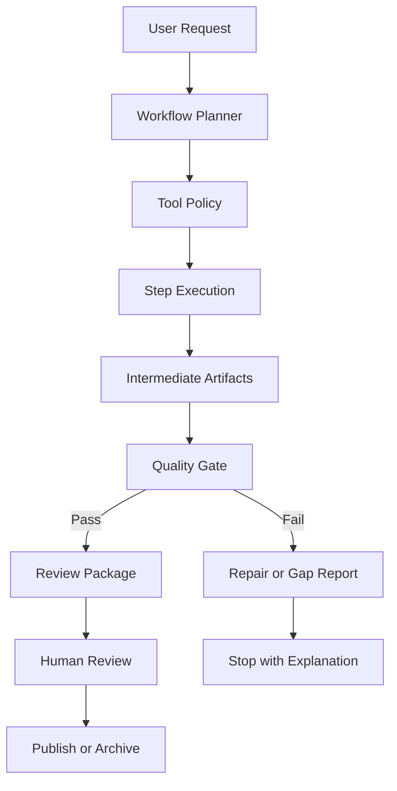
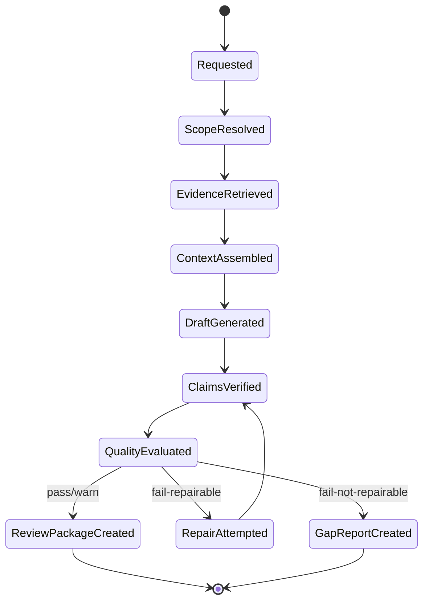
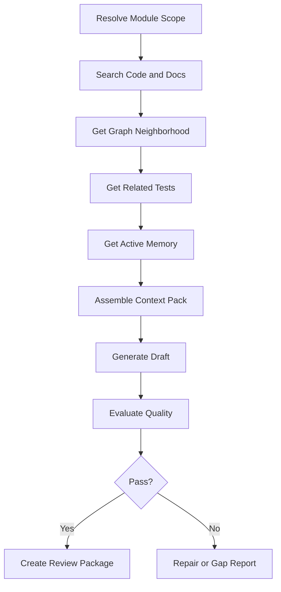
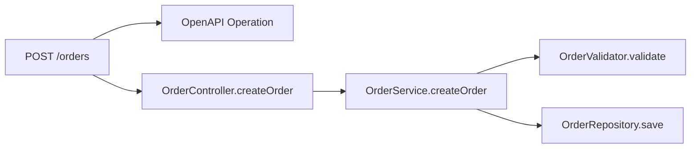
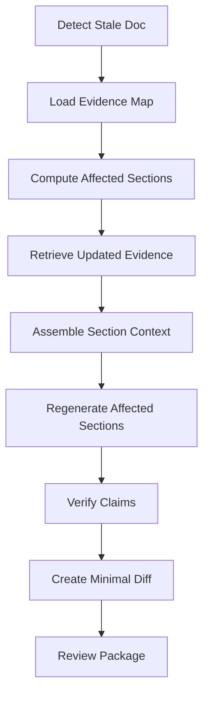

------
title: Learn AI Code Documentation & Agent Memory Platform - Part 023
description: Agent workflows for documentation untuk menjalankan onboarding docs, module docs, API docs, stale-doc refresh, review package, impact docs, dan memory candidate generation secara tool-driven, auditable, dan evidence-based.
series: learn-ai-code-documentation-agent-memory
seriesTitle: Learn AI Code Documentation & Agent Memory Platform
order: 23
partTitle: Agent Workflows for Documentation
tags:
- ai
- agent-workflows
- documentation
- mcp
- code-intelligence
- agent-memory
- workflow-design
- software-architecture
date: 2026-07-02
---

# Part 023 — Agent Workflows for Documentation

## 1. Tujuan Part Ini

Part 021 membahas tool contracts. Part 022 membahas MCP server. Sekarang kita menyusun keduanya menjadi **agent workflows**.

Agent workflow adalah urutan langkah yang dilakukan agent untuk mencapai tujuan dokumentasi tertentu dengan bantuan tools:

- mencari evidence,
- merakit context,
- menghasilkan draft,
- memverifikasi claim,
- menjalankan quality gate,
- membuat review package,
- mengusulkan memory candidate,
- menyegarkan stale docs,
- membuat impact documentation.

Workflow berbeda dari prompt tunggal. Workflow punya state, step, tool call, quality gate, fallback, audit, dan stop condition.

Target part ini:

1. memahami agent workflow sebagai state machine,
2. mendesain workflow untuk documentation generation,
3. mendesain workflow untuk stale-doc refresh,
4. mendesain workflow untuk API docs, module docs, onboarding docs, dan impact docs,
5. membuat workflow yang evidence-first dan permission-aware,
6. memastikan memory hanya dibuat sebagai candidate,
7. mendesain human-in-the-loop review,
8. membuat failure handling dan recovery,
9. mengukur workflow quality.

---

## 2. Kenapa Workflow, Bukan Sekadar Prompt?

Prompt tunggal:

```txt
Generate docs for this repository.
```

Workflow:

```txt
1. resolve scope
2. retrieve evidence
3. assemble context
4. draft outline
5. draft sections
6. verify claims
7. run quality gates
8. create review package
9. propose memory candidates
10. stop before publish
```

Prompt tunggal sulit diaudit. Workflow bisa diaudit.

### 2.1 Perbedaan Prompt dan Workflow

| Aspect | Prompt Tunggal | Agent Workflow |
|---|---|---|
| State | implisit | eksplisit |
| Evidence | sering tidak jelas | tracked |
| Tool usage | ad-hoc | policy-driven |
| Error handling | lemah | structured |
| Quality gate | manual/opsional | built-in |
| Review | tidak terstruktur | artifact-based |
| Audit | sulit | event-based |
| Repeatability | rendah | tinggi |

---

## 3. Agent Workflow Mental Model



Agent tidak hanya "menjawab". Agent mengelola proses.

---

## 4. Workflow Contract

Setiap workflow sebaiknya punya kontrak.

```yaml
workflow:
  name: generate_module_documentation
  version: v1
  trigger:
    type: user_request
  inputs:
    repositoryId: string
    targetModulePath: string
    docType: module_doc
    branch: string?
    commitSha: string?
  outputs:
    - generated_document_draft
    - quality_report
    - review_package
    - optional_memory_candidates
  allowedTools:
    - search_code
    - get_symbol
    - get_graph_neighborhood
    - get_related_tests
    - get_documents
    - get_memory
    - assemble_context_pack
    - generate_document_draft
    - evaluate_document_quality
    - create_memory_candidate
  prohibitedTools:
    - publish_document
    - approve_memory
  stopConditions:
    - quality_gate_passed_and_review_package_created
    - insufficient_evidence_gap_report_created
    - permission_denied
```

Workflow contract membuat agent behavior predictable.

---

## 5. Universal Workflow Principles

### 5.1 Evidence First

Agent harus mencari evidence sebelum menulis.

Bad:

```txt
start writing from general knowledge
```

Good:

```txt
retrieve current repo evidence -> assemble context -> write cited draft
```

### 5.2 Scope First

Jangan retrieve seluruh repo sebelum scope jelas.

### 5.3 Read Before Generate

Agent harus membaca:

- target symbols,
- related tests,
- graph,
- docs,
- memory,
- warnings.

### 5.4 Draft, Do Not Publish

Default workflow menghasilkan draft dan review package.

### 5.5 Memory Candidate, Not Active Memory

Agent boleh mengusulkan memory, bukan langsung mengaktifkan.

### 5.6 Stop on Unsafe or Insufficient Evidence

Jika evidence tidak cukup, buat gap report.

### 5.7 Preserve Provenance

Setiap intermediate artifact harus punya ID:

- retrieval run,
- context pack,
- doc draft,
- quality report,
- review package.

---

## 6. Workflow State Machine



State machine ini bisa disimpan di database agar workflow bisa di-debug.

---

## 7. Workflow Artifact Model

### 7.1 Workflow Run

```yaml
workflowRun:
  workflowRunId: wf_01J...
  workflowName: generate_module_documentation
  version: v1
  status: running
  actor:
    userId: user_123
  scope:
    repositoryId: order-service
    commitSha: 6f41ab2
  startedAt: 2026-07-02T00:00:00Z
```

### 7.2 Workflow Step

```yaml
step:
  stepId: step_01J...
  name: assemble_context
  status: completed
  toolCalls:
    - assemble_context_pack:req_01J
  outputs:
    - context-pack://ctx_01J
```

### 7.3 Workflow Output

```yaml
outputs:
  generatedDocument: docgen_01J
  qualityReport: quality-report://docgen_01J
  reviewPackage: reviewpkg_01J
  memoryCandidates:
    - memcand_01J
```

---

## 8. Workflow 1 — Generate Module Documentation

### 8.1 Use Case

User asks:

```txt
Generate documentation for order validation module.
```

### 8.2 Steps



### 8.3 Tool Calls

1. `search_code`
2. `get_symbol`
3. `get_graph_neighborhood`
4. `get_related_tests`
5. `get_documents`
6. `get_memory`
7. `assemble_context_pack`
8. `generate_document_draft`
9. `evaluate_document_quality`
10. `create_memory_candidate` if useful and allowed

### 8.4 Output

```yaml
outputs:
  - generated_doc_mdx
  - evidence_map
  - quality_report
  - review_checklist
  - memory_candidates
```

### 8.5 Acceptance Criteria

- module scope resolved,
- source and tests included,
- docs/ADR included if relevant,
- memory separated,
- every major claim cited,
- quality report generated,
- review package created,
- no publish action executed.

---

## 9. Workflow 2 — Generate API Documentation

### 9.1 Use Case

```txt
Generate documentation for POST /orders.
```

### 9.2 Steps

1. Resolve API operation.
2. Retrieve contract/OpenAPI.
3. Retrieve route handler.
4. Retrieve request/response schema.
5. Retrieve service flow graph.
6. Retrieve tests.
7. Assemble context.
8. Generate API doc draft.
9. Verify contract-code alignment.
10. Evaluate quality.
11. Create review package.

### 9.3 Special Quality Checks

API docs require:

- method/path correct,
- request schema present or missing reported,
- response schema present or missing reported,
- handler linked,
- contract-code mismatch flagged,
- error behavior cited,
- compatibility notes not invented.

### 9.4 API Workflow Diagram



Only include diagram edges supported by graph evidence.

---

## 10. Workflow 3 — Refresh Stale Documentation

### 10.1 Trigger

Triggered by:

- source change,
- graph diff,
- stale report,
- user request,
- scheduled docs health check.

### 10.2 Steps



### 10.3 Key Requirement

Do not regenerate entire doc if only one section is stale.

### 10.4 Human Edit Preservation

If human edited stale section:

```yaml
warning:
  code: human_edited_section
  action: review_required_before_overwrite
```

### 10.5 Output

- updated sections,
- minimal diff,
- stale reason,
- quality report,
- review package.

---

## 11. Workflow 4 — Generate Onboarding Guide

### 11.1 Use Case

```txt
Create onboarding guide for order-service.
```

### 11.2 Steps

1. Retrieve repository overview evidence.
2. Retrieve service catalog entry.
3. Retrieve main modules.
4. Retrieve README/setup/build/test evidence.
5. Retrieve key flows.
6. Retrieve docs health.
7. Assemble beginner-friendly context.
8. Draft onboarding path.
9. Evaluate for clarity and evidence.
10. Create review package.

### 11.3 Special Constraints

Onboarding docs should not overwhelm.

Prefer:

- repository map,
- first files to read,
- first commands if evidence,
- key concepts,
- next reading.

Avoid:

- full call graph,
- every method,
- advanced trade-offs too early.

---

## 12. Workflow 5 — Generate Impact Documentation

### 12.1 Use Case

```txt
Analyze documentation and agent-memory impact for this change.
```

### 12.2 Input

```yaml
change:
  repositoryId: order-service
  fromCommit: 6f41ab2
  toCommit: 9ab812c
  changedFiles:
    - OrderValidator.java
```

### 12.3 Steps

1. Compute graph diff.
2. Find changed symbols.
3. Find affected tests.
4. Find affected docs.
5. Find affected memory.
6. Find cross-repo affected artifacts if allowed.
7. Generate impact report.
8. Create recommended actions.

### 12.4 Output

```yaml
impact:
  affectedTests:
    - OrderValidatorTest
  affectedDocs:
    - docs/order-validation.md
  affectedMemory:
    - mem_rule_registry
  recommendedActions:
    - refresh docs/order-validation.md
    - revalidate memory mem_rule_registry
```

---

## 13. Workflow 6 — Create Memory Candidates from Documentation

### 13.1 Use Case

After generating/reviewing docs, agent identifies durable knowledge.

### 13.2 Steps

1. Extract candidate statements.
2. Check source evidence.
3. Check scope.
4. Check duplicates.
5. Check conflicts.
6. Create memory candidate.
7. Request review if required.

### 13.3 Candidate Example

```yaml
memoryCandidate:
  type: repo_convention
  statement: "Validation rules are registered through RuleRegistry."
  scope:
    repositoryId: order-service
    modulePath: order.validation
  evidence:
    - RuleRegistry.java
    - OrderValidator.java
  state: candidate
```

### 13.4 Hard Rule

Agent must not approve its own memory unless policy explicitly allows deterministic auto-approval.

---

## 14. Workflow 7 — Review Generated Documentation

### 14.1 Use Case

A reviewer or agent asks:

```txt
Review this generated doc for unsupported claims and missing evidence.
```

### 14.2 Steps

1. Read generated doc.
2. Read evidence map.
3. Read quality report.
4. Verify claims.
5. Check freshness.
6. Check doc type completeness.
7. Produce review checklist.
8. Suggest changes.

### 14.3 Output

```yaml
review:
  decisionSuggestion: request_changes
  findings:
    - unsupported_claim
    - missing_related_tests
  suggestedPatch:
    available: true
```

### 14.4 Review Agent Limitation

Review agent can suggest. Human owner still approves official docs.

---

## 15. Workflow 8 — Multi-Repo Capability Documentation

### 15.1 Use Case

```txt
Generate end-to-end docs for order creation capability.
```

### 15.2 Steps

1. Resolve capability scope.
2. Resolve repository set.
3. Resolve version alignment.
4. Apply permission filter.
5. Retrieve per-repo evidence.
6. Build cross-repo graph.
7. Assemble multi-repo context.
8. Draft capability doc.
9. Verify cross-repo claims.
10. Create multi-owner review matrix.

### 15.3 Special Warnings

Include:

- version alignment strategy,
- hidden/inaccessible repos,
- partial evidence,
- confidence per relation.

---

## 16. Workflow Planning

Agent needs a planner that selects workflow.

### 16.1 Planner Input

```yaml
userRequest:
  text: "Generate docs for POST /orders"
  detectedIntent: api_documentation
  target:
    method: POST
    path: /orders
```

### 16.2 Planner Output

```yaml
selectedWorkflow:
  name: generate_api_documentation
  version: v1
  requiredTools:
    - get_graph_neighborhood
    - get_documents
    - assemble_context_pack
    - generate_document_draft
```

### 16.3 Ambiguity Handling

If target ambiguous, use tools to resolve if possible.

If still ambiguous, produce concise clarification request or ambiguity report.

---

## 17. Tool Policy per Workflow

### 17.1 Documentation Generation Policy

```yaml
allowed:
  - search_code
  - get_symbol
  - get_graph_neighborhood
  - get_related_tests
  - get_documents
  - get_memory
  - assemble_context_pack
  - generate_document_draft
  - evaluate_document_quality
  - create_memory_candidate
denied:
  - publish_document
  - approve_memory
```

### 17.2 Stale Refresh Policy

```yaml
allowed:
  - detect_stale_docs
  - get_documents
  - assemble_context_pack
  - generate_document_draft
  - evaluate_document_quality
  - generate_review_package
denied:
  - overwrite_human_edits_without_review
```

### 17.3 Impact Analysis Policy

```yaml
allowed:
  - analyze_impact
  - get_graph_neighborhood
  - get_related_tests
  - get_documents
  - get_memory
denied:
  - modify_docs
```

---

## 18. Workflow Error Handling

### 18.1 Permission Denied

Stop safely.

```yaml
status: stopped
reason: permission_denied
safeMessage: "The requested repository or evidence is not accessible."
```

### 18.2 Insufficient Evidence

Produce gap report.

```yaml
gapReport:
  missing:
    - API contract
    - related tests
  available:
    - route handler
```

### 18.3 Tool Timeout

Retry if safe, otherwise continue with warning.

```yaml
warning:
  code: graph_query_timeout
  action: partial_context_used
```

### 18.4 Quality Failure

Repair if possible, otherwise stop.

```yaml
quality:
  status: fail
  action: repair_attempted
```

### 18.5 Ambiguous Target

Return candidates.

```yaml
ambiguous:
  target: OrderService
  candidates:
    - com.acme.order.OrderService
    - com.acme.billing.OrderService
```

---

## 19. Workflow Repair Loops

### 19.1 Repairable Failures

| Failure | Repair |
|---|---|
| missing citation | retrieve/attach evidence |
| unsupported claim | remove or mark uncertain |
| too verbose | compress |
| missing tests section | add absence note |
| stale doc used | replace/exclude |
| low graph confidence | add uncertainty wording |

### 19.2 Non-Repairable Failures

| Failure | Action |
|---|---|
| permission denied | stop |
| target not found | stop/clarify |
| security finding | block |
| no primary evidence | gap report |
| repeated generation failure | stop |

### 19.3 Repair Limit

```yaml
repair:
  maxAttempts: 2
  onExhausted: gap_report
```

---

## 20. Workflow Output Discipline

Agent should not output only final prose. It should produce artifacts.

### 20.1 Required Artifacts

For doc generation:

- document draft,
- evidence map,
- quality report,
- review checklist,
- provenance summary.

For stale refresh:

- stale report,
- affected sections,
- patch/diff,
- quality report.

For impact:

- impact report,
- affected docs,
- affected memory,
- recommended actions.

### 20.2 User-Facing Summary

At the end, summarize:

- what was generated,
- quality state,
- warnings,
- next review action,
- links/artifact IDs.

---

## 21. Workflow Observability

Track each step.

### 21.1 Metrics

| Metric | Meaning |
|---|---|
| workflow success rate | reliability |
| average steps per workflow | complexity |
| tool calls per workflow | cost/risk |
| quality pass rate | output quality |
| repair rate | prompt/context issues |
| gap report rate | evidence coverage |
| review approval rate | human acceptance |
| memory candidate approval rate | memory quality |
| stale refresh latency | docs maintenance |

### 21.2 Trace Example

```yaml
trace:
  workflowRunId: wf_01J
  steps:
    - name: resolve_scope
      status: ok
      latencyMs: 90
    - name: retrieval
      status: ok
      toolCalls: 4
    - name: context_assembly
      status: ok
      contextPackId: ctx_01J
    - name: generation
      status: ok
      documentId: docgen_01J
    - name: quality
      status: pass_with_warnings
```

---

## 22. Workflow Audit

Audit events should include:

- workflow started,
- tool invoked,
- context created,
- document draft generated,
- quality evaluated,
- memory candidate created,
- review package created,
- workflow completed/stopped.

Example:

```yaml
auditEvent:
  action: workflow_completed
  workflowRunId: wf_01J
  outputs:
    - docgen_01J
    - quality_report_01J
  status: pass_with_warnings
```

---

## 23. Workflow Storage Schema

### 23.1 Workflow Runs

```sql
CREATE TABLE agent_workflow_runs (
    workflow_run_id TEXT PRIMARY KEY,
    tenant_id TEXT NOT NULL,
    workflow_name TEXT NOT NULL,
    workflow_version TEXT NOT NULL,
    actor_id TEXT NOT NULL,
    status TEXT NOT NULL,
    target_ref TEXT,
    started_at TIMESTAMP NOT NULL,
    completed_at TIMESTAMP
);
```

### 23.2 Workflow Steps

```sql
CREATE TABLE agent_workflow_steps (
    step_id TEXT PRIMARY KEY,
    workflow_run_id TEXT NOT NULL,
    step_name TEXT NOT NULL,
    status TEXT NOT NULL,
    input_ref TEXT,
    output_ref TEXT,
    started_at TIMESTAMP NOT NULL,
    completed_at TIMESTAMP
);
```

### 23.3 Tool Calls

```sql
CREATE TABLE agent_tool_calls (
    tool_call_id TEXT PRIMARY KEY,
    workflow_run_id TEXT NOT NULL,
    step_id TEXT NOT NULL,
    tool_name TEXT NOT NULL,
    tool_version TEXT NOT NULL,
    status TEXT NOT NULL,
    latency_ms INTEGER,
    safe_metadata JSONB NOT NULL,
    created_at TIMESTAMP NOT NULL
);
```

---

## 24. Workflow Quality Gates

### 24.1 Pre-Execution Gates

- valid target,
- allowed workflow,
- tool policy resolved,
- permission check passes.

### 24.2 Mid-Execution Gates

- context quality,
- evidence coverage,
- token budget,
- safety filter.

### 24.3 Post-Execution Gates

- doc quality,
- claim verification,
- memory candidate validation,
- review readiness.

### 24.4 Stop Conditions

Stop if:

- security failure,
- no primary evidence,
- repeated quality failure,
- unauthorized access,
- destructive tool requested without permission.

---

## 25. Agent Workflow Anti-Patterns

### 25.1 Agent Writes Docs Without Evidence

Never allow this as production behavior.

### 25.2 Agent Publishes Directly

Draft and review first.

### 25.3 Agent Approves Its Own Memory

Memory contamination risk.

### 25.4 Agent Ignores Quality Report

Quality gate should be part of workflow state, not optional note.

### 25.5 Agent Retrieves Entire Repo

Use scope and budget.

### 25.6 Agent Treats Stale Docs as Truth

Stale docs must be marked or excluded.

### 25.7 Agent Hides Missing Evidence

Missing evidence should be visible.

---

## 26. Practical Exercise

Design three agent workflows.

### 26.1 Workflows

Create workflow specs for:

1. `generate_module_documentation`
2. `refresh_stale_documentation`
3. `analyze_cross_repo_impact`

### 26.2 Required Output

```txt
workflows/generate-module-doc.yaml
workflows/refresh-stale-docs.yaml
workflows/analyze-cross-repo-impact.yaml
workflow-tool-policy.yaml
workflow-state-machine.md
workflow-quality-gates.yaml
```

### 26.3 Acceptance Criteria

- each workflow has state machine,
- each workflow declares tools,
- write tools disabled by default,
- memory writes create candidates,
- quality gates included,
- stop conditions defined,
- audit events defined,
- failure handling defined.

---

## 27. Summary

Agent workflows turn tools into reliable, auditable documentation processes.

Key points:

1. workflow is more reliable than prompt-only generation,
2. every workflow needs state, tools, artifacts, gates, and stop conditions,
3. evidence retrieval must happen before drafting,
4. context packs are central workflow artifacts,
5. generated docs should be drafts,
6. memory output should be candidate-only by default,
7. stale refresh should be section/diff-aware,
8. multi-repo workflows require version alignment and permission awareness,
9. workflow traces and audit events are mandatory,
10. quality gates decide whether workflow continues, repairs, or stops.

Part berikutnya membahas **Agent Memory Maintenance**: bagaimana memory candidate, active memory, stale memory, conflicts, expiry, revalidation, compaction, and pruning dikelola sebagai lifecycle system, bukan sekadar vector store.
