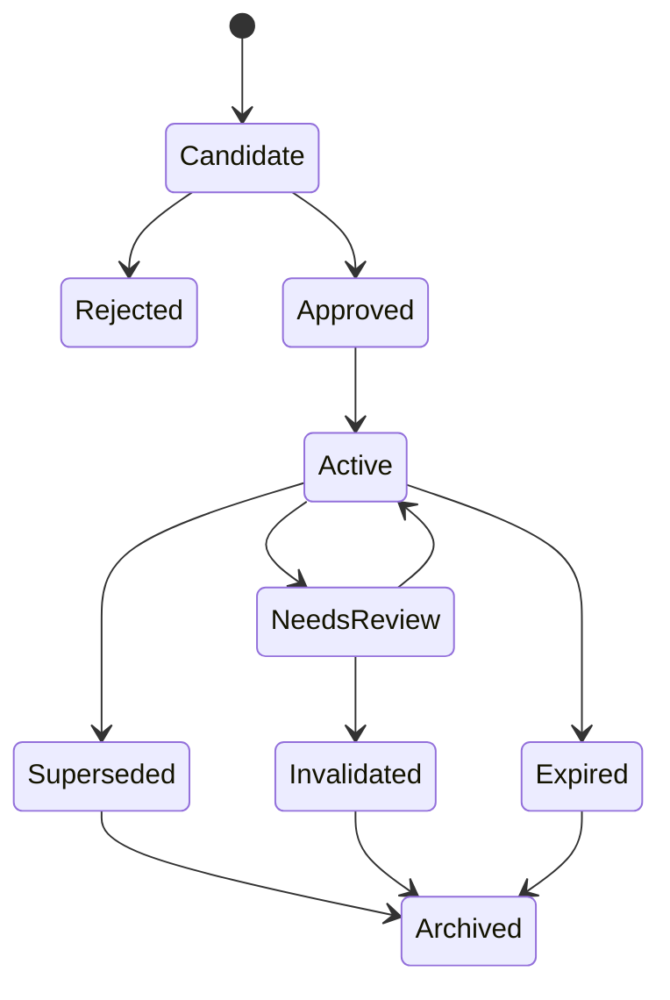
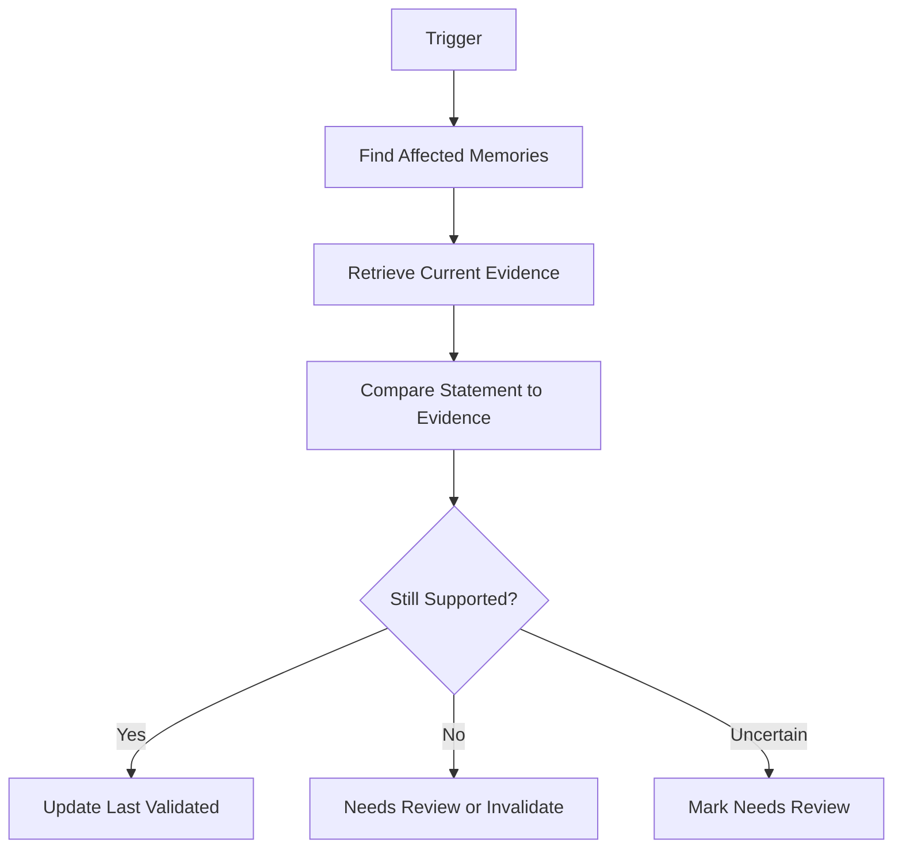
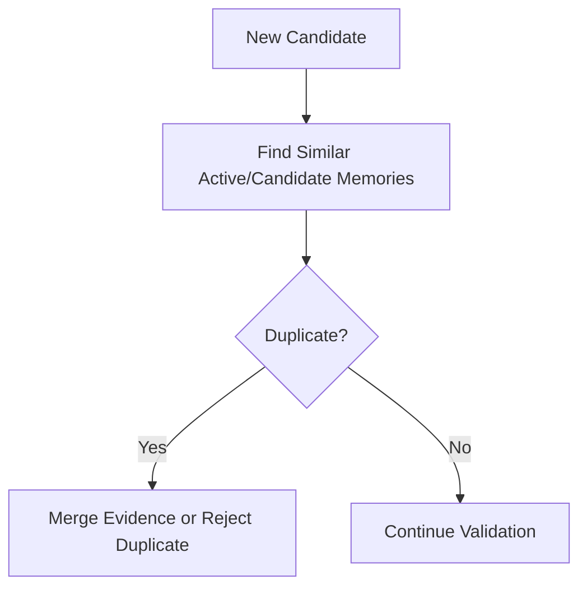
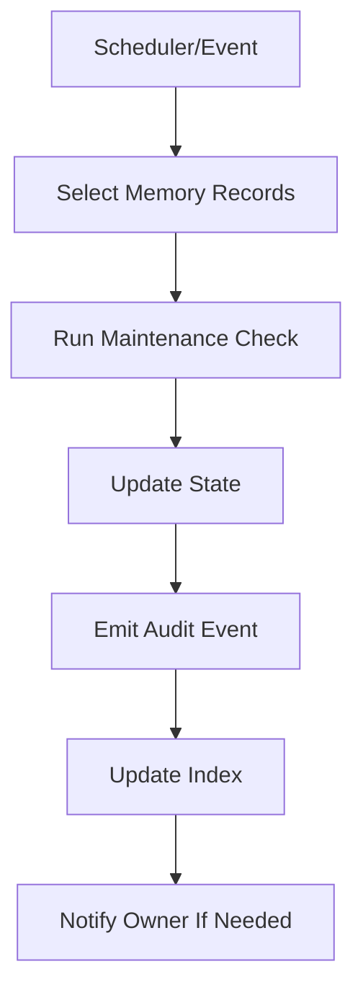

------
title: Learn AI Code Documentation & Agent Memory Platform - Part 024
description: Agent memory maintenance untuk mengelola candidate, active, stale, conflicted, expired, superseded, compacted, and pruned memory secara evidence-based, scoped, permission-aware, dan auditable.
series: learn-ai-code-documentation-agent-memory
seriesTitle: Learn AI Code Documentation & Agent Memory Platform
order: 24
partTitle: Agent Memory Maintenance
tags:
- ai
- agent-memory
- memory-maintenance
- code-intelligence
- governance
- provenance
- agent-context
- software-architecture
date: 2026-07-02
---

# Part 024 — Agent Memory Maintenance

## 1. Tujuan Part Ini

Part 011 membahas model agent context dan memory. Part 023 membahas agent workflows. Sekarang kita fokus ke lifecycle operasional memory: **agent memory maintenance**.

Memory yang tidak dirawat akan menjadi liability.

Ia bisa:

- stale,
- bertentangan dengan source,
- terlalu umum,
- duplikatif,
- bocor antar scope,
- menyimpan secret,
- memperkuat kesalahan agent,
- mengalahkan source terbaru,
- mengisi context dengan noise.

Memory maintenance adalah sistem untuk menjaga memory tetap:

- relevant,
- fresh,
- evidence-backed,
- scoped,
- non-conflicting,
- useful,
- safe,
- auditable.

Target part ini:

1. mendesain lifecycle memory end-to-end,
2. mengelola candidate, active, needs_review, stale, invalidated, superseded, expired, archived,
3. membuat revalidation pipeline berbasis source/graph/doc changes,
4. mendeteksi duplicate dan conflict,
5. melakukan compaction dan pruning,
6. menjaga permission dan sensitivity,
7. mengukur memory usefulness dan harm,
8. membangun memory maintenance jobs dan dashboards.

---

## 2. Memory Bukan Vector Store

Kesalahan umum:

```txt
Memory = embeddings of previous conversations.
```

Dalam platform repository intelligence, memory bukan sekadar vector.

Memory adalah record terstruktur:

```yaml
memory:
  statement: "Validation rules are registered through RuleRegistry."
  scope: repository:order-service
  evidence:
    - RuleRegistry.java
  state: active
  invalidationPolicy:
    - symbolChanged: RuleRegistry
```

Vector index boleh membantu retrieval memory, tetapi source of truth memory tetap record terstruktur.

---

## 3. Memory Lifecycle



### 3.1 Candidate

Memory proposed by agent, human, or system.

### 3.2 Approved

Memory reviewed or auto-approved by deterministic policy.

### 3.3 Active

Memory can be retrieved into context.

### 3.4 Needs Review

Memory may be stale or conflicted.

### 3.5 Invalidated

Memory is wrong or unsupported.

### 3.6 Superseded

Memory replaced by newer better record.

### 3.7 Expired

Memory exceeded time/policy limit.

### 3.8 Archived

Kept for audit, not retrieval.

---

## 4. Memory Maintenance Invariants

### 4.1 Evidence Invariant

```txt
Every active memory must have evidence or approved human source.
```

### 4.2 Scope Invariant

```txt
Memory scope must not be broader than evidence scope.
```

### 4.3 Freshness Invariant

```txt
Memory grounded in changed source must be revalidated.
```

### 4.4 Conflict Invariant

```txt
Conflicted memory must not enter normal context packs silently.
```

### 4.5 Safety Invariant

```txt
Memory must not store secrets or unauthorized derived knowledge.
```

### 4.6 Review Invariant

```txt
High-impact memory requires review before active use.
```

---

## 5. Memory Record Recap

```yaml
memory:
  memoryId: mem_01J...
  logicalMemoryId: memlog_rule_registry_convention
  type: repo_convention
  statement: "Validation rules are registered through RuleRegistry."
  scope:
    tenantId: acme
    repositoryId: order-service
    modulePath: src/main/java/com/acme/order/validation
  evidence:
    - type: file_span
      path: RuleRegistry.java
      commitSha: 6f41ab2
      lines: [10, 88]
  state: active
  confidence: 0.84
  reviewState: approved
  conflictState: none
  lastValidatedAt: 2026-07-02T00:00:00Z
  invalidationPolicy:
    - symbolChanged: RuleRegistry
    - edgeRemoved: OrderValidator.validate CALLS RuleRegistry.resolve
```

---

## 6. Memory Candidate Pipeline

### 6.1 Candidate Sources

Memory candidates can come from:

- documentation generation,
- review feedback,
- human note,
- recurring pattern detection,
- agent workflow,
- eval failure,
- ADR extraction,
- runbook extraction.

### 6.2 Candidate Validation

Before candidate stored:

- statement specificity,
- evidence exists,
- scope valid,
- no secret,
- no duplicate,
- no conflict,
- usefulness score,
- permission scope.

### 6.3 Candidate Schema

```yaml
candidate:
  candidateId: memcand_01J...
  proposedType: repo_convention
  statement: "Validation rules should be added through RuleRegistry."
  proposedScope:
    repositoryId: order-service
    modulePath: order.validation
  evidence:
    - RuleRegistry.java
  proposedBy:
    type: agent_workflow
    workflowRunId: wf_01J
  validation:
    status: pending_review
```

### 6.4 Candidate Rejection Reasons

| Reason | Example |
|---|---|
| vague | "Order service is complex." |
| no evidence | no source/doc support |
| duplicate | same memory exists |
| conflict | contradicts active memory |
| unsafe | contains secret |
| overscoped | repo fact proposed as org fact |
| low usefulness | not actionable |

---

## 7. Memory Approval

### 7.1 Approval Modes

| Mode | Description |
|---|---|
| human_required | reviewer must approve |
| deterministic_auto | safe facts auto-approved |
| policy_auto | approved by configured policy |
| admin_only | only admins approve |
| disabled | no memory activation |

### 7.2 Auto-Approval Candidates

Safe auto-approval only for deterministic facts with low risk.

Example:

```txt
symbol location memory generated from parser
```

Even then, prefer evidence and invalidation.

### 7.3 Human Approval Checklist

Reviewer checks:

- statement correct,
- evidence sufficient,
- scope correct,
- no secret,
- useful,
- not duplicate,
- not conflicting,
- invalidation policy reasonable.

### 7.4 Approval Event

```yaml
memoryEvent:
  type: approved
  memoryId: mem_01J
  reviewer: team-order-platform
  timestamp: 2026-07-02T00:00:00Z
```

---

## 8. Memory Revalidation

Revalidation checks whether memory still holds.

### 8.1 Revalidation Triggers

| Trigger | Example |
|---|---|
| source file changed | RuleRegistry.java changed |
| symbol changed | RuleRegistry.resolve changed |
| graph edge removed | validator no longer calls registry |
| doc superseded | ADR replaced |
| memory conflict detected | new memory contradicts old |
| permission changed | repo access changed |
| age threshold | last validated > 90 days |
| quality policy changed | stricter evidence rule |

### 8.2 Revalidation Flow



### 8.3 Revalidation Result

```yaml
revalidation:
  memoryId: mem_rule_registry
  status: needs_review
  reasons:
    - "Grounding symbol RuleRegistry.resolve changed."
  currentEvidence:
    - RuleRegistry.java@9ab812c
  recommendedAction: human_review
```

---

## 9. Source-Change Driven Maintenance

### 9.1 Graph Diff to Memory

When graph diff says:

```yaml
removed:
  - OrderValidator.validate CALLS RuleRegistry.resolve
```

Find memory grounded in that edge.

```yaml
affectedMemory:
  - mem_rule_registry_convention
```

### 9.2 File Change to Memory

If memory evidence contains file span and file changed:

- compute changed span,
- if span unaffected, update evidence line mapping if possible,
- if span affected, revalidate.

### 9.3 Symbol Deletion

If referenced symbol deleted:

```yaml
memoryState: needs_review
severity: high
reason: referenced_symbol_deleted
```

Often invalidates memory.

---

## 10. Memory Conflict Detection

### 10.1 Conflict Types

| Type | Example |
|---|---|
| memory vs source | memory says RuleRegistry, source no longer has it |
| memory vs memory | two active memories disagree |
| memory vs doc | reviewed ADR supersedes memory |
| memory vs graph | graph edge removed |
| memory vs policy | memory now disallowed |

### 10.2 Conflict Example

Memory A:

```txt
Validation rules are registered through RuleRegistry.
```

Memory B:

```txt
Validation rules are configured directly in OrderValidator.
```

Same scope. Potential conflict.

### 10.3 Conflict Record

```yaml
memoryConflict:
  conflictId: memconf_01J
  severity: high
  scope:
    repositoryId: order-service
    modulePath: order.validation
  memories:
    - mem_rule_registry
    - mem_direct_validator_rules
  status: open
  action: exclude_both_from_default_context
```

### 10.4 Conflict Policy

Default:

- exclude high-conflict memory from context,
- show warning if relevant,
- request review,
- prefer current source evidence.

---

## 11. Duplicate and Near-Duplicate Memory

### 11.1 Duplicate Examples

Memory 1:

```txt
Rules are registered through RuleRegistry.
```

Memory 2:

```txt
Validation uses RuleRegistry as the registry for rules.
```

Same scope and meaning.

### 11.2 Deduplication Flow



### 11.3 Merge Strategy

Merge:

- evidence refs,
- confidence factors,
- review notes,
- usage stats.

Do not merge if:

- scope differs,
- one is stale,
- statements are subtly different,
- memory type differs in meaningful way.

### 11.4 Superseding

If new memory is better:

```yaml
oldMemory:
  state: superseded
  supersededBy: mem_new_rule_registry
```

---

## 12. Memory Compaction

Over time, memory grows.

Compaction combines related low-level memories into a higher-quality memory while preserving evidence.

### 12.1 Example Before

```yaml
- "OrderValidator calls RuleRegistry."
- "RuleRegistry stores validation rules."
- "New validation rules should be added to RuleRegistry."
```

### 12.2 After

```yaml
statement: "Order validation is centralized through RuleRegistry; new validation rules should be added there rather than directly in controllers."
evidence:
  - OrderValidator.java
  - RuleRegistry.java
  - ADR 012
```

### 12.3 Compaction Rules

- keep original evidence,
- preserve narrower memories if still useful,
- mark old memories superseded,
- require review for broadening scope,
- do not compact conflicting memories.

### 12.4 Compaction Risk

Compaction can overgeneralize. It needs quality gate.

---

## 13. Memory Pruning

Pruning removes or archives low-value memory.

### 13.1 Prune Candidates

| Signal | Action |
|---|---|
| never retrieved | consider archive |
| low usefulness | archive |
| stale long time | invalidate/archive |
| duplicate | merge/archive |
| low evidence | reject/archive |
| old task-specific | expire |
| unsafe | delete/blocked archive per policy |

### 13.2 Pruning Policy

```yaml
pruningPolicy:
  archiveIf:
    - state: expired
    - unusedDays: 180
    - confidenceBelow: 0.40
  neverPruneIf:
    - type: architecture_decision
    - reviewState: approved
```

### 13.3 Do Not Delete Audit History

Archive rather than hard delete unless retention/security policy requires deletion.

---

## 14. Memory Expiration

### 14.1 Time-Based Expiry

Examples:

- task memory expires after task completion,
- evaluation memory expires after 90 days unless useful,
- repo convention revalidated every 90 days,
- session memory expires after run.

### 14.2 Source-Based Expiry

Memory expires when source changed.

### 14.3 Policy-Based Expiry

If policy changes:

```txt
unreviewed AI-generated memory no longer allowed
```

Mark affected memory needs review.

### 14.4 Expiry Record

```yaml
expiry:
  memoryId: mem_01J
  expiredAt: 2026-10-01T00:00:00Z
  reason: review_after_days_elapsed
```

---

## 15. Memory Retrieval Maintenance

Memory maintenance affects retrieval.

### 15.1 Retrieval Eligibility

Eligible if:

- state active,
- not conflicted,
- not stale,
- permission-safe,
- scope matches,
- confidence above threshold.

### 15.2 Retrieval Metadata

```yaml
retrievalEligibility:
  eligible: true
  reasons:
    - active
    - scope_match
    - approved
    - fresh
```

### 15.3 Excluded Memory

```yaml
excluded:
  memoryId: mem_old_rule_engine
  reason: stale
```

Context pack may include safe warning:

```txt
One stale memory about old RuleEngine was excluded.
```

---

## 16. Memory Usefulness Measurement

Memory should earn its keep.

### 16.1 Usefulness Signals

| Signal | Meaning |
|---|---|
| retrieved often | potentially useful |
| selected into context | useful |
| cited by generated docs | useful |
| helped task success | strong usefulness |
| reviewer approved | positive |
| caused wrong output | negative |
| ignored often | low usefulness |
| contradicted | harmful |

### 16.2 Usage Event

```yaml
memoryUsage:
  memoryId: mem_rule_registry
  workflowRunId: wf_01J
  usedIn: context_pack
  outcome:
    docQuality: pass
    reviewerFeedback: positive
```

### 16.3 Harm Event

```yaml
memoryHarm:
  memoryId: mem_old_rule_engine
  issue: "Generated doc mentioned removed RuleEngine."
  action: invalidated
```

---

## 17. Memory Quality Score

### 17.1 Dimensions

| Dimension | Meaning |
|---|---|
| evidence strength | quality of source |
| specificity | actionable precision |
| scope correctness | not overbroad |
| freshness | source current |
| review state | approved or not |
| conflict state | no contradiction |
| usefulness | improves workflows |
| safety | no sensitive leak |
| retrieval precision | retrieved when relevant |

### 17.2 Score Example

```yaml
quality:
  evidenceStrength: 0.90
  specificity: 0.85
  scopeCorrectness: 0.88
  freshness: 0.92
  review: 0.80
  usefulness: 0.76
  safety: 1.00
  conflictPenalty: 0.00
  overall: 0.86
```

### 17.3 Bands

| Band | Action |
|---|---|
| strong | active |
| good | active |
| needs_review | review |
| weak | candidate/archive |
| harmful | invalidate |

---

## 18. Memory Maintenance Jobs

### 18.1 Jobs

| Job | Frequency/Trigger |
|---|---|
| revalidate_changed_source_memory | on graph/source diff |
| detect_memory_conflicts | on new candidate/active change |
| deduplicate_memory | daily/weekly |
| expire_old_memory | daily |
| prune_low_value_memory | weekly/monthly |
| compute_memory_quality | daily |
| update_memory_embeddings | on memory content change |
| permission_reconciliation | on authz/policy change |
| memory_health_report | scheduled |

### 18.2 Job Flow



### 18.3 Idempotency

Maintenance jobs must be idempotent.

```txt
same input state + same policy -> same result
```

---

## 19. Memory Maintenance Dashboard

### 19.1 Metrics

| Metric | Meaning |
|---|---|
| active memory count | current corpus size |
| candidates pending review | review backlog |
| stale memory count | risk |
| conflicted memory count | correctness risk |
| invalidated memory count | churn |
| memory usage rate | usefulness |
| memory harm incidents | safety |
| average evidence strength | trust |
| average age since validation | freshness |
| duplicate candidate rate | noise |

### 19.2 Dashboard Sections

- memory health by repo,
- memory review queue,
- stale memory,
- conflict queue,
- high-use memory,
- harmful memory,
- memory growth trend,
- policy violations.

### 19.3 Example Health Report

```yaml
memoryHealth:
  repositoryId: order-service
  active: 84
  candidatesPending: 12
  stale: 7
  conflicted: 2
  expired: 5
  highValue: 18
  actionRequired:
    - review stale validation memories
    - resolve conflict in pricing module
```

---

## 20. Memory and Documentation Maintenance

Memory and docs update each other carefully.

### 20.1 Docs Trigger Memory Review

If doc/ADR superseded, memory based on it needs review.

### 20.2 Memory Triggers Docs Refresh

If active memory changes, generated docs that used it may need refresh.

### 20.3 Avoid Feedback Loop

Never let generated docs create memory that later regenerates docs without original evidence.

Maintenance job should check lineage:

```yaml
lineage:
  originalEvidenceRequired: true
```

---

## 21. Memory and Agent Workflow Maintenance

Agent workflows should report memory usage.

### 21.1 Workflow Memory Events

- memory retrieved,
- memory included in context,
- memory cited,
- memory ignored,
- memory contradicted,
- memory candidate created.

### 21.2 Improving Future Workflows

If memory helped reviewer approval, increase usefulness.

If memory caused quality failure, reduce score or invalidate.

### 21.3 Evaluation Memory

Evaluation lessons must expire or be revalidated.

Example:

```yaml
memory:
  type: evaluation_lesson
  statement: "Module docs for validation should include RuleRegistryTest."
  expiresAfterDays: 90
```

---

## 22. Memory Security Maintenance

### 22.1 Periodic Secret Scan

Even approved memory should be scanned again when detectors improve.

### 22.2 Permission Drift

If repo visibility changes:

- recompute memory visibility,
- remove from unauthorized indexes,
- audit change.

### 22.3 Derived Knowledge Sensitivity

Memory may reveal architecture.

Example:

```txt
Fraud scoring consumes high-risk-payment.created.
```

This may be sensitive even without secrets.

### 22.4 Security Incident Handling

If unsafe memory found:

1. mark blocked,
2. remove from retrieval index,
3. audit,
4. notify owner/security,
5. delete according to policy,
6. invalidate generated docs/context that used it.

---

## 23. Memory Storage Schema Extensions

### 23.1 Memory State History

```sql
CREATE TABLE memory_state_history (
    event_id TEXT PRIMARY KEY,
    memory_id TEXT NOT NULL,
    from_state TEXT,
    to_state TEXT NOT NULL,
    reason TEXT NOT NULL,
    actor_type TEXT NOT NULL,
    actor_id TEXT NOT NULL,
    created_at TIMESTAMP NOT NULL
);
```

### 23.2 Memory Quality

```sql
CREATE TABLE memory_quality_assessments (
    assessment_id TEXT PRIMARY KEY,
    memory_id TEXT NOT NULL,
    overall_score NUMERIC NOT NULL,
    band TEXT NOT NULL,
    factors JSONB NOT NULL,
    assessor_version TEXT NOT NULL,
    created_at TIMESTAMP NOT NULL
);
```

### 23.3 Memory Usage

```sql
CREATE TABLE memory_usage_events (
    usage_id TEXT PRIMARY KEY,
    memory_id TEXT NOT NULL,
    workflow_run_id TEXT,
    context_pack_id TEXT,
    usage_type TEXT NOT NULL,
    outcome JSONB,
    created_at TIMESTAMP NOT NULL
);
```

### 23.4 Memory Maintenance Jobs

```sql
CREATE TABLE memory_maintenance_jobs (
    job_id TEXT PRIMARY KEY,
    job_type TEXT NOT NULL,
    status TEXT NOT NULL,
    selected_count INTEGER NOT NULL,
    updated_count INTEGER NOT NULL,
    started_at TIMESTAMP NOT NULL,
    completed_at TIMESTAMP
);
```

---

## 24. Memory Maintenance API

### 24.1 Review Candidate

```http
POST /memory/candidates/{candidateId}/review
```

Request:

```json
{
  "decision": "approve",
  "comment": "Evidence and scope are correct."
}
```

### 24.2 Revalidate Memory

```http
POST /memory/{memoryId}/revalidate
```

### 24.3 Get Memory Health

```http
GET /repositories/{repositoryId}/memory/health
```

### 24.4 Resolve Conflict

```http
POST /memory/conflicts/{conflictId}/resolve
```

### 24.5 Archive Memory

```http
POST /memory/{memoryId}/archive
```

---

## 25. Memory Maintenance Quality Gates

### 25.1 Candidate Gate

- evidence exists,
- no secret,
- scope valid,
- not duplicate,
- not conflicting,
- useful enough.

### 25.2 Active Gate

- active only if approved or policy allowed,
- freshness current,
- no conflict,
- permission valid.

### 25.3 Revalidation Gate

- if evidence changed and cannot be verified, mark needs review.

### 25.4 Retrieval Gate

- active + fresh + no conflict + permission safe.

### 25.5 Compaction Gate

- original evidence preserved,
- no overgeneralization,
- review if scope broadens.

---

## 26. Practical Exercise

Build memory maintenance for one repository.

### 26.1 Input

Memory records:

```txt
mem_rule_registry_convention
mem_order_validator_entrypoint
mem_old_rule_engine
mem_validation_tests
mem_retry_behavior_unknown
```

Source changes:

```txt
RuleRegistry.java changed
OrderValidator.java unchanged
legacy docs deleted
```

### 26.2 Output

Produce:

```txt
memory-health-report.yaml
memory-revalidation-report.yaml
memory-conflicts.yaml
memory-pruning-plan.yaml
memory-review-queue.yaml
```

### 26.3 Acceptance Criteria

- changed source triggers revalidation,
- old RuleEngine memory invalidated,
- duplicate memories merged or flagged,
- stale memory excluded from retrieval,
- active memory has evidence and scope,
- review queue contains needs_review records,
- audit events generated.

---

## 27. Common Mistakes

### 27.1 Memory Never Expires

Eventually wrong.

### 27.2 Memory Without Evidence

Hallucination seed.

### 27.3 Memory Too Broad

Repo-specific convention becomes org rule incorrectly.

### 27.4 No Conflict Handling

Agent receives contradictory guidance.

### 27.5 Compaction Without Review

Overgeneralization risk.

### 27.6 Pruning by Age Only

Old ADR memory can still be valuable.

### 27.7 No Usage Metrics

Cannot tell useful memory from noise.

### 27.8 Treating Memory as Source Truth

Source and evidence remain primary.

---

## 28. Summary

Agent memory maintenance turns memory from a risky cache into governed knowledge.

Key points:

1. memory is structured knowledge, not just vector embeddings,
2. active memory needs evidence, scope, freshness, and permission,
3. candidates should be validated before activation,
4. source/graph/doc changes must trigger revalidation,
5. conflicted memory should not enter normal context,
6. duplicate memory should be merged or superseded,
7. compaction needs evidence preservation and review,
8. pruning controls memory noise,
9. usage and harm metrics determine usefulness,
10. memory maintenance must be auditable and policy-driven.

Part berikutnya starts the Platform Architecture phase with **Platform Architecture Blueprint**: how all scanners, parsers, graph builders, retrievers, doc generators, memory services, MCP server, queues, storage, and observability fit together into a production architecture.
