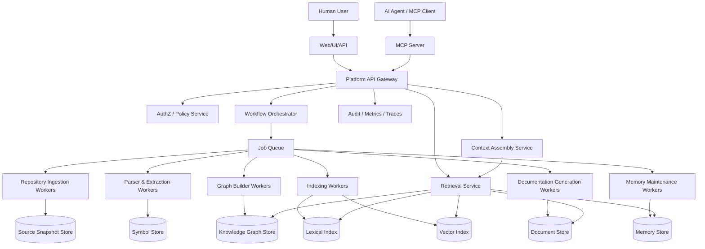
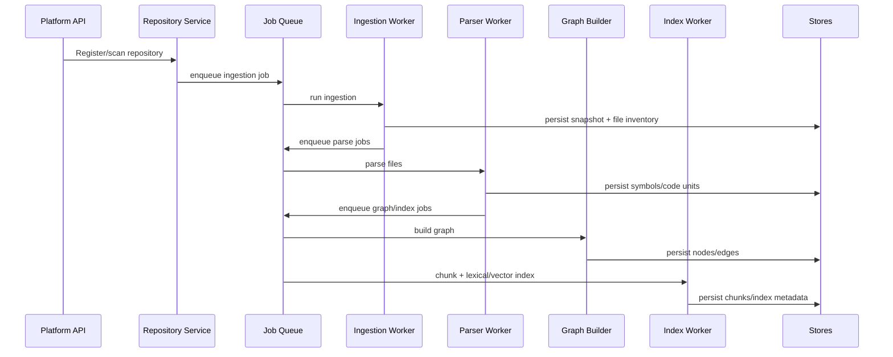
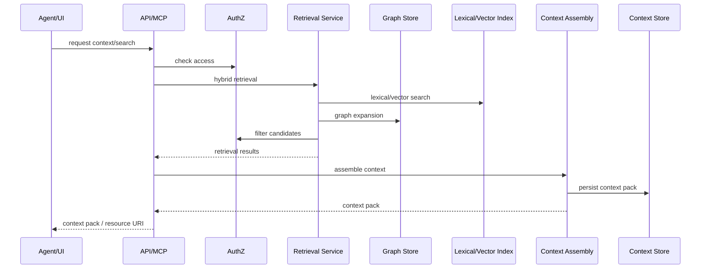
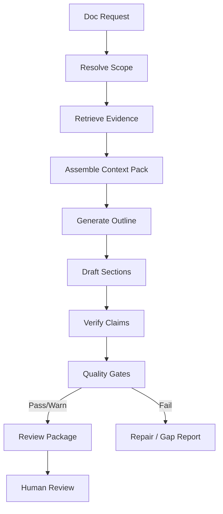
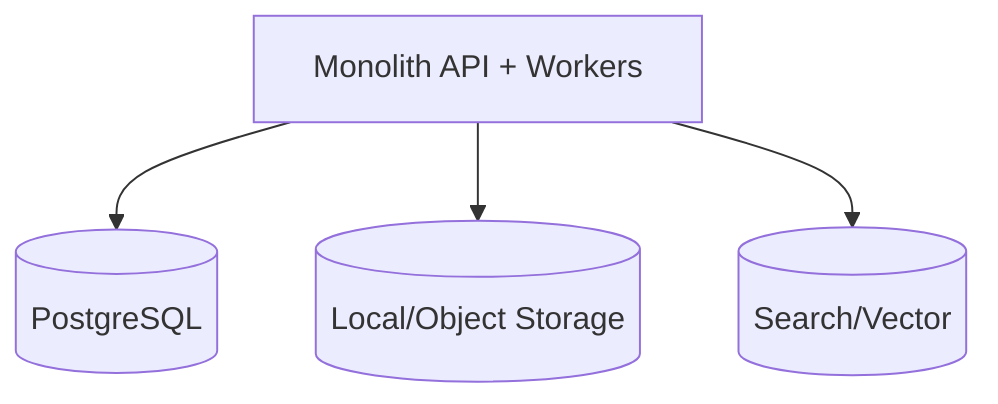
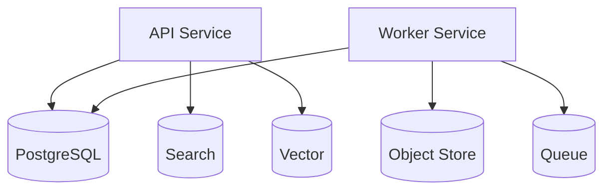
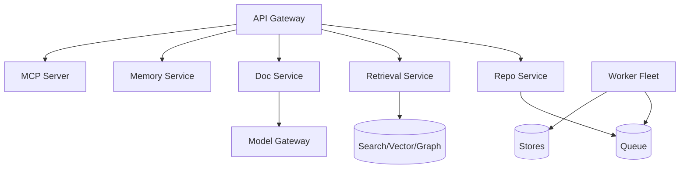
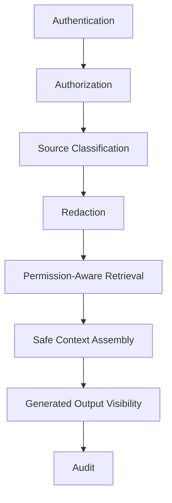

------
title: Learn AI Code Documentation & Agent Memory Platform - Part 025
description: Platform architecture blueprint untuk menyatukan ingestion, parser, symbol extraction, knowledge graph, retrieval, context assembly, documentation generation, memory, MCP server, jobs, observability, dan governance.
series: learn-ai-code-documentation-agent-memory
seriesTitle: Learn AI Code Documentation & Agent Memory Platform
order: 25
partTitle: Platform Architecture Blueprint
tags:
- ai
- platform-architecture
- code-intelligence
- documentation
- agent-memory
- mcp
- distributed-systems
- software-architecture
date: 2026-07-02
---

# Part 025 — Platform Architecture Blueprint

## 1. Tujuan Part Ini

Part 024 menutup fase Agent Tooling & MCP Layer. Sekarang kita masuk ke fase **Platform Architecture**.

Sampai titik ini kita sudah membahas:

- repository ingestion,
- file classification,
- parser strategy,
- symbol extraction,
- dependency/call graph,
- knowledge graph,
- document model,
- memory model,
- chunking,
- embeddings,
- hybrid retrieval,
- context assembly,
- documentation generation,
- quality gates,
- multi-repo docs,
- agent tools,
- MCP server,
- agent workflows,
- memory maintenance.

Part ini menyatukan semuanya menjadi **platform blueprint**.

Target part ini:

1. mendesain arsitektur end-to-end,
2. membedakan control plane dan data plane,
3. memetakan service boundaries,
4. mendesain event/job pipeline,
5. mendesain read path dan write path,
6. membuat deployment topology,
7. menjelaskan data flow dari repository scan sampai AI agent context,
8. menentukan reliability, scalability, security, dan observability boundaries,
9. memberi blueprint MVP dan production-grade.

---

## 2. Platform yang Sedang Kita Bangun

Platform ini bukan sekadar "AI doc generator".

Platform ini adalah:

> Repository intelligence platform yang mengubah source repository menjadi knowledge graph, searchable evidence, documentation drafts, and agent context/memory, dengan provenance, permission, freshness, quality gates, dan MCP tooling.

### 2.1 Core Capabilities

Platform harus bisa:

- scan repository,
- classify files,
- parse code/docs/contracts/config,
- extract symbols/code units,
- build graph,
- chunk and index evidence,
- embed chunks,
- retrieve hybrid evidence,
- assemble context pack,
- generate documentation,
- verify claims,
- maintain memory,
- expose tools to agents,
- audit every important action.

---

## 3. High-Level Architecture



---

## 4. Architecture Principles

### 4.1 Evidence First

All generated outputs must trace back to evidence.

### 4.2 Version Aware

Every artifact must know source snapshot/commit.

### 4.3 Permission Inherited

Derived artifacts inherit source visibility.

### 4.4 Async by Default for Heavy Work

Scanning, parsing, graph building, indexing, generation, and revalidation are asynchronous jobs.

### 4.5 Read Path Optimized Separately from Write Path

Scanning and indexing are write-heavy. Retrieval and context assembly are read-heavy.

### 4.6 Idempotent Workers

Every job can be retried safely.

### 4.7 Observability Built In

Every run, job, tool call, and generated artifact should be traceable.

### 4.8 Human Review Boundary

Generation produces drafts; publishing and memory approval require policy-controlled review.

---

## 5. Control Plane vs Data Plane

### 5.1 Control Plane

Control plane manages:

- repository registration,
- scans,
- job orchestration,
- policies,
- permissions,
- workflow runs,
- review states,
- schedules,
- retention,
- configuration.

### 5.2 Data Plane

Data plane processes and serves:

- source snapshots,
- parse results,
- symbols,
- graph edges,
- chunks,
- vectors,
- documents,
- memory records,
- context packs.

### 5.3 Why Split Mentally

Control plane answers:

> "What should happen?"

Data plane answers:

> "What data exists and how is it queried?"

This distinction helps prevent the platform from becoming a tangled set of workers and tables.

---

## 6. Service Boundaries

### 6.1 API Gateway

Responsibilities:

- expose REST/GraphQL/internal APIs,
- enforce authentication,
- route requests,
- apply rate limits,
- normalize error responses.

Should not:

- parse repositories,
- perform retrieval ranking directly,
- generate docs inline.

### 6.2 Authorization / Policy Service

Responsibilities:

- repository access,
- artifact visibility,
- tool allowlist,
- source boundary,
- sensitivity policy,
- write permissions.

Critical invariant:

```txt
All read and generated output paths must pass policy.
```

### 6.3 Repository Service

Responsibilities:

- repository registration,
- provider metadata,
- branch/commit resolution,
- webhook handling,
- snapshot lifecycle.

### 6.4 Ingestion Service

Responsibilities:

- clone/fetch repository,
- checkout snapshot,
- enumerate files,
- fingerprint files,
- classify file candidates,
- publish downstream parse/index jobs.

### 6.5 Parser and Extraction Service

Responsibilities:

- language detection,
- parsing,
- symbol extraction,
- code unit extraction,
- diagnostics.

### 6.6 Knowledge Graph Service

Responsibilities:

- graph node/edge building,
- graph persistence,
- graph queries,
- graph diff,
- impact analysis.

### 6.7 Chunk and Index Service

Responsibilities:

- chunking source/docs/contracts/config,
- lexical indexing,
- vector embedding jobs,
- vector index upsert/delete,
- indexing status.

### 6.8 Retrieval Service

Responsibilities:

- query understanding,
- hybrid retrieval,
- candidate merge,
- permission filtering,
- reranking,
- explainable results.

### 6.9 Context Assembly Service

Responsibilities:

- task-specific context plan,
- evidence selection,
- memory inclusion,
- token budget,
- citation map,
- context pack persistence.

### 6.10 Documentation Service

Responsibilities:

- doc request,
- doc plan,
- section drafting,
- claim verification,
- quality gates,
- review package,
- publication proposal.

### 6.11 Memory Service

Responsibilities:

- memory candidates,
- active memory retrieval,
- memory review,
- memory invalidation,
- maintenance jobs,
- conflict detection.

### 6.12 MCP Server

Responsibilities:

- expose tools/resources/prompts,
- validate tool input,
- call core services,
- enforce output safety,
- audit tool calls.

---

## 7. Write Path: Repository Scan to Index



### 7.1 Write Path Characteristics

- asynchronous,
- idempotent,
- retryable,
- high volume,
- batch-friendly,
- often CPU/network heavy.

### 7.2 Important States

Repository scan can be:

```txt
requested -> cloning -> enumerating -> parsing -> graph_building -> indexing -> completed -> completed_with_warnings -> failed
```

---

## 8. Read Path: Query to Context



### 8.1 Read Path Characteristics

- latency-sensitive,
- permission-critical,
- ranking-sensitive,
- source/version aware,
- often called by agents repeatedly.

### 8.2 Optimization Goals

- low p95 latency for search,
- correct permission filtering,
- high retrieval relevance,
- small context pack with high utility,
- explainable ranking.

---

## 9. Generation Path: Context to Documentation Draft



### 9.1 Generation Should Be Async

Doc generation can be slow and expensive.

Use:

- workflow run,
- background workers,
- progress state,
- artifacts,
- retry policy.

### 9.2 Avoid Inline Long Generation in API Request

API should start run and return run ID/artifact link.

For interactive UX, stream progress if supported.

---

## 10. Event-Driven Architecture

### 10.1 Key Events

```yaml
events:
  - repository.scan.requested
  - repository.snapshot.created
  - file.inventory.completed
  - file.parse.completed
  - symbols.extracted
  - graph.snapshot.built
  - chunks.created
  - embeddings.updated
  - documentation.draft.generated
  - documentation.quality.evaluated
  - memory.candidate.created
  - memory.revalidation.required
  - doc.stale.detected
```

### 10.2 Event Usage

Events trigger:

- downstream jobs,
- cache invalidation,
- doc stale detection,
- memory revalidation,
- notification,
- audit.

### 10.3 Event Design

Event should include:

- tenantId,
- repositoryId,
- snapshotId,
- commitSha,
- artifact ID,
- correlation ID,
- event version.

Example:

```yaml
event:
  type: symbols.extracted
  version: v1
  tenantId: acme
  repositoryId: order-service
  snapshotId: snap_6f41ab2
  fileId: file_01J
  correlationId: scan_01J
```

---

## 11. Job Orchestration

### 11.1 Job Types

| Job | Trigger |
|---|---|
| repository ingestion | scan request/webhook |
| file parsing | ingestion completed |
| symbol extraction | parse completed |
| graph build | symbol extraction completed |
| chunking | file/symbol/doc changes |
| embedding | chunks changed |
| stale doc detection | graph/chunk diff |
| memory revalidation | source/graph/doc changes |
| doc generation | user/workflow request |
| quality evaluation | doc draft created |
| cleanup/retention | schedule |

### 11.2 Job Envelope

```yaml
job:
  jobId: job_01J
  jobType: parse_file
  tenantId: acme
  repositoryId: order-service
  snapshotId: snap_6f41ab2
  idempotencyKey: parse:file_01J:parser_v2
  attempts: 0
  priority: normal
```

### 11.3 Idempotency Key

```txt
hash(jobType, artifactId, snapshotId, processorVersion)
```

### 11.4 Retry Policy

- retry transient failures,
- dead-letter permanent failures,
- mark artifact diagnostics,
- never duplicate derived artifacts.

---

## 12. Storage Overview

### 12.1 Storage Categories

| Store | Purpose |
|---|---|
| relational metadata | repositories, snapshots, jobs, docs, memory |
| object/blob store | source snapshots, large artifacts, context packs |
| graph store | nodes/edges/graph queries |
| lexical index | exact/keyword retrieval |
| vector index | semantic retrieval |
| audit log | append-only event history |
| cache | hot query/context/cache |

### 12.2 MVP Storage

MVP can use:

- PostgreSQL for metadata/graph edges/chunks,
- filesystem/object store for source snapshots/artifacts,
- OpenSearch/Elasticsearch or PostgreSQL full-text for lexical search,
- vector extension or separate vector DB for embeddings,
- Redis for queues/cache if needed.

### 12.3 Production Storage

Production may split:

- metadata DB,
- source object store,
- graph DB or optimized relational graph,
- dedicated search cluster,
- dedicated vector index,
- durable queue,
- observability stack,
- data warehouse for analytics.

---

## 13. Data Ownership and Boundaries

### 13.1 Source Data

Owned by repository owner. Platform stores indexed representation.

### 13.2 Derived Knowledge

Owned by platform but governed by source visibility.

### 13.3 Generated Docs

Owned by doc workflow/repo owner after review/publish.

### 13.4 Memory

Owned by scope owner or platform governance policy.

### 13.5 Audit

Owned by platform/security/compliance.

---

## 14. Deployment Topology

### 14.1 MVP Single Deployment



Good for:

- local prototype,
- single team,
- low scale.

### 14.2 Modular Monolith



Good next step.

### 14.3 Microservice Production



Use when scale/team boundaries require it.

---

## 15. Model Gateway

### 15.1 Why Model Gateway

Do not let every service call LLM provider directly.

Model gateway handles:

- provider abstraction,
- model selection,
- prompt/template versioning,
- rate limit,
- cost tracking,
- safety filters,
- retries,
- logging,
- redaction,
- eval hooks.

### 15.2 Model Gateway Request

```yaml
modelRequest:
  useCase: documentation_section_drafting
  promptTemplateVersion: module-section-v2
  contextPackId: ctx_01J
  maxOutputTokens: 1500
  temperature: configured
```

### 15.3 Output

```yaml
modelResponse:
  runId: llmrun_01J
  outputRef: blob://...
  tokenUsage:
    input: 9200
    output: 1200
```

---

## 16. Security Architecture

### 16.1 Security Layers



### 16.2 Security Controls

- tenant isolation,
- repository access sync,
- source classification,
- secret detection,
- derived visibility,
- tool allowlist,
- audit,
- retention/deletion,
- prompt injection boundaries.

### 16.3 Important Rule

```txt
Security must be enforced in services, not in prompts.
```

---

## 17. Observability Architecture

### 17.1 Metrics

Track:

- scan duration,
- parse success rate,
- files indexed,
- graph edges count,
- embedding queue lag,
- retrieval latency,
- context pack token count,
- doc quality pass rate,
- memory stale count,
- MCP tool errors,
- cost per doc/run.

### 17.2 Traces

Trace correlation:

```txt
workflowRunId -> retrievalRunId -> contextPackId -> generationRunId -> qualityReportId
```

### 17.3 Logs

Structured logs with safe metadata.

Do not log raw source by default.

### 17.4 Audit

Audit is separate from debug logs.

---

## 18. Reliability and Scaling

### 18.1 Scaling Dimensions

| Component | Scaling Need |
|---|---|
| ingestion | repo size/network |
| parsing | CPU |
| graph build | CPU/memory |
| embeddings | provider rate/cost |
| retrieval | latency/index capacity |
| doc generation | LLM rate/cost |
| memory maintenance | scheduled batch |
| MCP | interactive latency |

### 18.2 Backpressure

Use queues and rate limits for:

- ingestion,
- embeddings,
- generation,
- maintenance.

### 18.3 Isolation

Separate worker pools:

- ingestion workers,
- parser workers,
- embedding workers,
- doc generation workers,
- maintenance workers.

This prevents doc generation traffic from blocking repository indexing.

---

## 19. Caching Strategy

### 19.1 Cache Candidates

- repository metadata,
- branch -> commit resolution,
- file spans,
- symbol lookup,
- graph neighborhoods,
- retrieval results,
- context packs,
- embedding inputs,
- permission decisions short-lived.

### 19.2 Cache Invalidation

Invalidate by:

- new snapshot,
- permission change,
- artifact update,
- policy change,
- index version change.

### 19.3 Cache Safety

Cache key must include:

- tenant,
- principal access version,
- repository,
- snapshot,
- tool/version,
- filters.

---

## 20. Multi-Region / Enterprise Considerations

### 20.1 Data Residency

Repository content may need region-specific storage.

### 20.2 Tenant Isolation

Strong tenants may require:

- separate DB/schema,
- separate vector namespace,
- separate object bucket,
- separate encryption key.

### 20.3 Disaster Recovery

Need backups for:

- metadata DB,
- object store,
- audit log,
- indexes rebuildable from source but expensive.

### 20.4 Index Rebuild

Design indexes as rebuildable from source snapshots and metadata.

---

## 21. MVP Blueprint

### 21.1 MVP Goal

One repo, one language, docs generation for module.

### 21.2 MVP Components

```txt
API
PostgreSQL
local/object source store
job queue
ingestion worker
parser/symbol extractor
chunker
lexical search
vector index
retrieval service
context assembler
doc generator
quality gate
basic MCP server
```

### 21.3 MVP Scope

Support:

- repository scan,
- file classification,
- symbol extraction,
- chunking,
- hybrid retrieval,
- context pack,
- module doc draft,
- evidence table,
- quality report,
- MCP search/get symbol.

Avoid initially:

- multi-repo,
- complex write tools,
- automatic publish,
- full call graph perfection,
- many languages.

---

## 22. Production Blueprint

### 22.1 Production Capabilities

- multi-repo,
- incremental indexing,
- permission sync,
- graph diff,
- stale docs detection,
- memory maintenance,
- doc review workflow,
- MCP tools/resources/prompts,
- observability dashboards,
- cost controls,
- security scanning,
- retention/deletion.

### 22.2 Production Non-Functional Requirements

| Requirement | Target |
|---|---|
| indexing reliability | retry/idempotency/dead-letter |
| retrieval latency | bounded p95 |
| permission correctness | zero known leaks |
| auditability | full artifact lineage |
| quality | gates before review/publish |
| scalability | worker pools |
| cost | budgets and rate limits |
| maintainability | versioned processors/templates |

---

## 23. Architecture Decision Records to Write

Important ADRs:

1. storage strategy for graph,
2. vector index provider,
3. source snapshot retention,
4. permission inheritance model,
5. memory approval policy,
6. doc publication workflow,
7. MCP deployment model,
8. model gateway provider abstraction,
9. event/job orchestration approach,
10. tenant isolation strategy.

---

## 24. Common Architecture Mistakes

### 24.1 Building LLM Wrapper First

Without ingestion/graph/retrieval, docs will be unreliable.

### 24.2 No Versioning

All output becomes stale and unauditable.

### 24.3 Sync Heavy Work in API

API timeouts and bad UX.

### 24.4 No Permission-Aware Index

Security risk.

### 24.5 No Job Idempotency

Retries create duplicates.

### 24.6 No Quality Gate

Generated docs look good but cannot be trusted.

### 24.7 MCP Server with Business Logic

Hard to maintain and secure.

### 24.8 No Cost Controls

Embeddings and generation can explode.

---

## 25. Practical Exercise

Design your architecture blueprint.

### 25.1 Output

Create:

```txt
architecture-blueprint.md
component-boundaries.yaml
event-catalog.yaml
job-catalog.yaml
deployment-topology.mmd
security-boundaries.md
observability-plan.yaml
```

### 25.2 Acceptance Criteria

- all major services named,
- write path documented,
- read path documented,
- generation path documented,
- storage boundaries defined,
- async jobs defined,
- permission boundary defined,
- observability IDs defined,
- MVP and production topology separated.

---

## 26. Summary

Platform architecture blueprint turns individual concepts into a system.

Key points:

1. platform is repository intelligence, not just doc generation,
2. separate control plane and data plane,
3. use async jobs for heavy work,
4. keep API/read path latency-sensitive,
5. every artifact must be versioned and permission-aware,
6. retrieval, context, docs, memory, and MCP are separate but connected services,
7. model gateway centralizes LLM usage,
8. observability and audit are first-class,
9. MVP can start modular-monolith style,
10. production requires incremental indexing, governance, review, and cost controls.

Part berikutnya membahas **Storage Design**: bagaimana mendesain schema dan storage strategy untuk repositories, snapshots, files, symbols, graph, chunks, vectors, docs, memory, context packs, jobs, audit, and retention.
