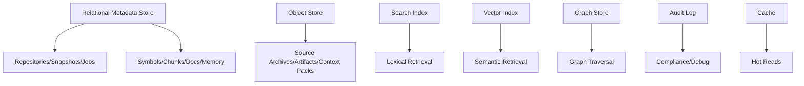

------
title: Learn AI Code Documentation & Agent Memory Platform - Part 026
description: Storage design untuk repository intelligence platform, mencakup repositories, snapshots, files, symbols, code units, graph, chunks, embeddings, docs, memory, context packs, jobs, audit, retention, dan indexing.
series: learn-ai-code-documentation-agent-memory
seriesTitle: Learn AI Code Documentation & Agent Memory Platform
order: 26
partTitle: Storage Design
tags:
- ai
- storage-design
- database
- code-intelligence
- knowledge-graph
- documentation
- agent-memory
- platform-architecture
date: 2026-07-02
---

# Part 026 — Storage Design

## 1. Tujuan Part Ini

Part 025 memberi architecture blueprint. Sekarang kita masuk ke **storage design**.

Storage design dalam platform ini sulit karena data yang disimpan sangat beragam:

- repository metadata,
- source snapshots,
- file inventory,
- parser diagnostics,
- symbols,
- code units,
- graph nodes/edges,
- chunks,
- embeddings,
- documents,
- generated drafts,
- claims,
- memory records,
- context packs,
- workflow runs,
- jobs,
- audit events,
- quality reports,
- permissions,
- retention state.

Kesalahan storage design akan menyebabkan:

- reindex sulit,
- stale docs tidak terdeteksi,
- memory tidak bisa di-invalidate,
- permission leak,
- vector index tidak sinkron,
- graph diff mahal,
- audit tidak lengkap,
- biaya storage membengkak.

Target part ini:

1. mendesain storage categories,
2. membuat schema inti untuk metadata platform,
3. membedakan logical vs instance IDs,
4. mendesain snapshot-aware storage,
5. menyimpan provenance dan evidence,
6. menghubungkan relational store, object store, search index, vector index, graph store, and audit log,
7. membuat retention/deletion model,
8. menyiapkan migration dan indexing strategy.

---

## 2. Storage Principles

### 2.1 Snapshot-Aware

Setiap source-derived artifact harus tahu snapshot/commit.

```txt
No source-derived artifact without snapshotId/commitSha.
```

### 2.2 Evidence-Preserving

Generated docs, memory, and claims must link to evidence.

### 2.3 Permission-Aware

Derived artifacts store effective visibility/sensitivity.

### 2.4 Rebuildable Indexes

Search/vector indexes should be rebuildable from canonical stores.

### 2.5 Append-Only Audit

Audit should be append-only.

### 2.6 Logical + Instance Identity

Use logical ID for continuity and instance ID for snapshot-specific evidence.

### 2.7 Idempotent Writes

Workers should upsert by deterministic IDs or idempotency keys.

---

## 3. Storage Categories



### 3.1 Relational Metadata Store

Canonical structured metadata.

### 3.2 Object Store

Large content and artifacts.

### 3.3 Search Index

Keyword/exact retrieval.

### 3.4 Vector Index

Semantic retrieval.

### 3.5 Graph Store

Graph traversal and impact analysis.

May be relational first.

### 3.6 Audit Log

Append-only event records.

### 3.7 Cache

Performance optimization, not source of truth.

---

## 4. Core Entity Groups

| Group | Examples |
|---|---|
| tenant/security | tenants, principals, access grants |
| repository | repos, snapshots, branches |
| file inventory | files, classifications, fingerprints |
| extraction | parse results, symbols, code units |
| graph | nodes, edges, evidence |
| chunks/index | chunks, spans, links, embeddings |
| docs | documents, sections, generated drafts, claims |
| memory | records, evidence, state history, conflicts |
| context | context packs, items, exclusions |
| jobs/workflows | jobs, workflow runs, tool calls |
| audit | audit events |
| quality | quality reports, evaluations |

---

## 5. ID Strategy

### 5.1 Recommended ID Types

| Entity | Instance ID | Logical ID |
|---|---|---|
| file | fileId per snapshot | repository + path |
| symbol | symbolInstanceId | qualified name/signature |
| graph node | nodeInstanceId | canonical node key |
| graph edge | edgeInstanceId | source/type/target logical |
| chunk | chunkInstanceId | source unit logical |
| document | document version ID | document path/scope |
| memory | memoryId | logicalMemoryId |
| context pack | contextPackId | usually instance only |

### 5.2 Deterministic IDs

For source-derived data:

```txt
id = hash(tenantId, repositoryId, snapshotId, artifactType, canonicalKey)
```

### 5.3 Random IDs

Use random IDs for:

- workflow runs,
- generation runs,
- review records,
- audit events,
- human-created artifacts.

### 5.4 Why It Matters

Deterministic IDs support:

- idempotency,
- diffing,
- reindexing,
- stale detection,
- memory invalidation.

---

## 6. Tenant and Security Tables

### 6.1 Tenants

```sql
CREATE TABLE tenants (
    tenant_id TEXT PRIMARY KEY,
    name TEXT NOT NULL,
    status TEXT NOT NULL,
    created_at TIMESTAMP NOT NULL
);
```

### 6.2 Repository Access Snapshot

Permission often comes from external systems. Store synced snapshot.

```sql
CREATE TABLE repository_access_grants (
    grant_id TEXT PRIMARY KEY,
    tenant_id TEXT NOT NULL,
    repository_id TEXT NOT NULL,
    principal_type TEXT NOT NULL,
    principal_id TEXT NOT NULL,
    permission TEXT NOT NULL,
    source TEXT NOT NULL,
    access_version TEXT NOT NULL,
    created_at TIMESTAMP NOT NULL
);
```

### 6.3 Sensitivity Policy

```sql
CREATE TABLE sensitivity_policies (
    policy_id TEXT PRIMARY KEY,
    tenant_id TEXT NOT NULL,
    policy_version TEXT NOT NULL,
    rules JSONB NOT NULL,
    created_at TIMESTAMP NOT NULL
);
```

---

## 7. Repository Storage

### 7.1 Repositories

```sql
CREATE TABLE repositories (
    repository_id TEXT PRIMARY KEY,
    tenant_id TEXT NOT NULL,
    provider TEXT NOT NULL,
    remote_url_hash TEXT NOT NULL,
    display_name TEXT NOT NULL,
    default_branch TEXT,
    visibility TEXT NOT NULL,
    owner_team TEXT,
    status TEXT NOT NULL,
    created_at TIMESTAMP NOT NULL,
    updated_at TIMESTAMP NOT NULL
);
```

Avoid storing raw remote URL if sensitive unless needed. Use encrypted field if required.

### 7.2 Repository Snapshots

```sql
CREATE TABLE repository_snapshots (
    snapshot_id TEXT PRIMARY KEY,
    tenant_id TEXT NOT NULL,
    repository_id TEXT NOT NULL,
    branch TEXT,
    commit_sha TEXT NOT NULL,
    parent_commit_sha TEXT,
    scan_status TEXT NOT NULL,
    source_archive_ref TEXT,
    scanner_version TEXT NOT NULL,
    started_at TIMESTAMP NOT NULL,
    completed_at TIMESTAMP
);
```

### 7.3 Branch Heads

```sql
CREATE TABLE repository_branch_heads (
    tenant_id TEXT NOT NULL,
    repository_id TEXT NOT NULL,
    branch TEXT NOT NULL,
    commit_sha TEXT NOT NULL,
    snapshot_id TEXT,
    updated_at TIMESTAMP NOT NULL,
    PRIMARY KEY (tenant_id, repository_id, branch)
);
```

---

## 8. File Inventory Storage

### 8.1 Source Files

```sql
CREATE TABLE source_files (
    file_id TEXT PRIMARY KEY,
    logical_file_id TEXT NOT NULL,
    tenant_id TEXT NOT NULL,
    repository_id TEXT NOT NULL,
    snapshot_id TEXT NOT NULL,
    commit_sha TEXT NOT NULL,
    path TEXT NOT NULL,
    extension TEXT,
    language TEXT,
    file_kind TEXT NOT NULL,
    size_bytes BIGINT NOT NULL,
    line_count INTEGER,
    sha256 TEXT NOT NULL,
    git_blob_sha TEXT,
    is_binary BOOLEAN NOT NULL,
    is_generated BOOLEAN NOT NULL,
    is_vendor BOOLEAN NOT NULL,
    sensitivity TEXT NOT NULL,
    visibility_scope TEXT NOT NULL,
    index_policy TEXT NOT NULL,
    created_at TIMESTAMP NOT NULL
);
```

### 8.2 File Classification Diagnostics

```sql
CREATE TABLE file_classification_diagnostics (
    diagnostic_id TEXT PRIMARY KEY,
    file_id TEXT NOT NULL,
    classifier_version TEXT NOT NULL,
    classification TEXT NOT NULL,
    confidence NUMERIC NOT NULL,
    reasons JSONB NOT NULL,
    created_at TIMESTAMP NOT NULL
);
```

### 8.3 Indexes

Recommended:

```sql
CREATE INDEX idx_source_files_snapshot_path
ON source_files (snapshot_id, path);

CREATE INDEX idx_source_files_repo_kind
ON source_files (repository_id, snapshot_id, file_kind);
```

---

## 9. Parse and Extraction Storage

### 9.1 Parse Results

```sql
CREATE TABLE parse_results (
    parse_result_id TEXT PRIMARY KEY,
    file_id TEXT NOT NULL,
    tenant_id TEXT NOT NULL,
    repository_id TEXT NOT NULL,
    snapshot_id TEXT NOT NULL,
    parser_id TEXT NOT NULL,
    parser_version TEXT NOT NULL,
    status TEXT NOT NULL,
    diagnostics JSONB NOT NULL,
    created_at TIMESTAMP NOT NULL
);
```

### 9.2 Code Symbols

```sql
CREATE TABLE code_symbols (
    symbol_instance_id TEXT PRIMARY KEY,
    logical_symbol_id TEXT NOT NULL,
    tenant_id TEXT NOT NULL,
    repository_id TEXT NOT NULL,
    snapshot_id TEXT NOT NULL,
    file_id TEXT NOT NULL,
    language TEXT NOT NULL,
    kind TEXT NOT NULL,
    name TEXT NOT NULL,
    qualified_name TEXT NOT NULL,
    signature TEXT,
    signature_hash TEXT,
    parent_symbol_instance_id TEXT,
    visibility TEXT,
    confidence NUMERIC NOT NULL,
    extractor_id TEXT NOT NULL,
    extractor_version TEXT NOT NULL,
    start_line INTEGER NOT NULL,
    start_column INTEGER NOT NULL,
    end_line INTEGER NOT NULL,
    end_column INTEGER NOT NULL,
    body_start_line INTEGER,
    body_start_column INTEGER,
    body_end_line INTEGER,
    body_end_column INTEGER,
    content_hash TEXT,
    created_at TIMESTAMP NOT NULL
);
```

### 9.3 Code Units

```sql
CREATE TABLE code_units (
    code_unit_id TEXT PRIMARY KEY,
    logical_code_unit_id TEXT NOT NULL,
    tenant_id TEXT NOT NULL,
    repository_id TEXT NOT NULL,
    snapshot_id TEXT NOT NULL,
    file_id TEXT NOT NULL,
    primary_symbol_instance_id TEXT,
    kind TEXT NOT NULL,
    title TEXT NOT NULL,
    confidence NUMERIC NOT NULL,
    start_line INTEGER NOT NULL,
    start_column INTEGER,
    end_line INTEGER NOT NULL,
    end_column INTEGER,
    attributes JSONB NOT NULL,
    created_at TIMESTAMP NOT NULL
);
```

### 9.4 Symbol Attributes

```sql
CREATE TABLE code_symbol_attributes (
    id TEXT PRIMARY KEY,
    symbol_instance_id TEXT NOT NULL,
    attribute_name TEXT NOT NULL,
    attribute_value TEXT NOT NULL,
    created_at TIMESTAMP NOT NULL
);
```

### 9.5 Indexes

```sql
CREATE INDEX idx_symbols_snapshot_qualified
ON code_symbols (snapshot_id, qualified_name);

CREATE INDEX idx_symbols_logical
ON code_symbols (logical_symbol_id);

CREATE INDEX idx_code_units_snapshot_kind
ON code_units (snapshot_id, kind);
```

---

## 10. Evidence Storage

Evidence is shared by docs, graph, memory, claims, and context.

### 10.1 Evidence Refs

```sql
CREATE TABLE evidence_refs (
    evidence_id TEXT PRIMARY KEY,
    tenant_id TEXT NOT NULL,
    evidence_type TEXT NOT NULL,
    repository_id TEXT,
    snapshot_id TEXT,
    commit_sha TEXT,
    source_ref_type TEXT,
    source_ref_id TEXT,
    path TEXT,
    start_line INTEGER,
    start_column INTEGER,
    end_line INTEGER,
    end_column INTEGER,
    content_hash TEXT,
    visibility_scope TEXT NOT NULL,
    sensitivity TEXT NOT NULL,
    created_at TIMESTAMP NOT NULL
);
```

### 10.2 Evidence Usage

```sql
CREATE TABLE artifact_evidence (
    id TEXT PRIMARY KEY,
    artifact_type TEXT NOT NULL,
    artifact_id TEXT NOT NULL,
    evidence_id TEXT NOT NULL,
    usage_type TEXT NOT NULL,
    confidence NUMERIC,
    created_at TIMESTAMP NOT NULL
);
```

Usage examples:

```txt
supports_claim
grounds_memory
generated_from
retrieved_for_context
supports_graph_edge
```

---

## 11. Graph Storage

### 11.1 Graph Nodes

```sql
CREATE TABLE graph_nodes (
    node_instance_id TEXT PRIMARY KEY,
    logical_node_id TEXT NOT NULL,
    tenant_id TEXT NOT NULL,
    repository_id TEXT,
    snapshot_id TEXT,
    commit_sha TEXT,
    node_type TEXT NOT NULL,
    display_name TEXT NOT NULL,
    source_ref_type TEXT,
    source_ref_id TEXT,
    confidence NUMERIC NOT NULL,
    visibility_scope TEXT NOT NULL,
    sensitivity TEXT NOT NULL,
    attributes JSONB NOT NULL,
    created_at TIMESTAMP NOT NULL
);
```

### 11.2 Graph Edges

```sql
CREATE TABLE graph_edges (
    edge_instance_id TEXT PRIMARY KEY,
    logical_edge_id TEXT NOT NULL,
    tenant_id TEXT NOT NULL,
    repository_id TEXT,
    snapshot_id TEXT,
    commit_sha TEXT,
    source_node_instance_id TEXT NOT NULL,
    target_node_instance_id TEXT NOT NULL,
    edge_type TEXT NOT NULL,
    confidence NUMERIC NOT NULL,
    extraction_method TEXT NOT NULL,
    extractor_id TEXT NOT NULL,
    extractor_version TEXT NOT NULL,
    visibility_scope TEXT NOT NULL,
    sensitivity TEXT NOT NULL,
    attributes JSONB NOT NULL,
    created_at TIMESTAMP NOT NULL
);
```

### 11.3 Graph Edge Evidence

```sql
CREATE TABLE graph_edge_evidence (
    id TEXT PRIMARY KEY,
    edge_instance_id TEXT NOT NULL,
    evidence_id TEXT NOT NULL,
    created_at TIMESTAMP NOT NULL
);
```

### 11.4 Graph Diff

```sql
CREATE TABLE graph_diffs (
    graph_diff_id TEXT PRIMARY KEY,
    tenant_id TEXT NOT NULL,
    repository_id TEXT NOT NULL,
    from_snapshot_id TEXT NOT NULL,
    to_snapshot_id TEXT NOT NULL,
    summary JSONB NOT NULL,
    created_at TIMESTAMP NOT NULL
);
```

### 11.5 Indexes

```sql
CREATE INDEX idx_graph_edges_source
ON graph_edges (snapshot_id, source_node_instance_id, edge_type);

CREATE INDEX idx_graph_edges_target
ON graph_edges (snapshot_id, target_node_instance_id, edge_type);

CREATE INDEX idx_graph_nodes_logical
ON graph_nodes (logical_node_id);
```

---

## 12. Chunk Storage

### 12.1 Chunks

```sql
CREATE TABLE chunks (
    chunk_id TEXT PRIMARY KEY,
    logical_chunk_id TEXT NOT NULL,
    tenant_id TEXT NOT NULL,
    repository_id TEXT,
    snapshot_id TEXT,
    commit_sha TEXT,
    source_type TEXT NOT NULL,
    source_ref_id TEXT,
    path TEXT,
    chunk_type TEXT NOT NULL,
    role TEXT NOT NULL,
    title TEXT NOT NULL,
    language TEXT,
    content_ref TEXT,
    content_hash TEXT NOT NULL,
    token_estimate INTEGER NOT NULL,
    visibility_scope TEXT NOT NULL,
    sensitivity TEXT NOT NULL,
    stale_risk TEXT NOT NULL,
    chunker_id TEXT NOT NULL,
    chunker_version TEXT NOT NULL,
    created_at TIMESTAMP NOT NULL
);
```

Store large chunk content in object store if needed. `content_ref` points to object/blob.

### 12.2 Chunk Spans

```sql
CREATE TABLE chunk_spans (
    id TEXT PRIMARY KEY,
    chunk_id TEXT NOT NULL,
    span_type TEXT NOT NULL,
    start_line INTEGER,
    start_column INTEGER,
    end_line INTEGER,
    end_column INTEGER
);
```

### 12.3 Chunk Graph Links

```sql
CREATE TABLE chunk_graph_links (
    id TEXT PRIMARY KEY,
    chunk_id TEXT NOT NULL,
    node_instance_id TEXT NOT NULL,
    link_type TEXT NOT NULL,
    confidence NUMERIC NOT NULL
);
```

### 12.4 Indexes

```sql
CREATE INDEX idx_chunks_snapshot_type
ON chunks (snapshot_id, chunk_type);

CREATE INDEX idx_chunks_logical
ON chunks (logical_chunk_id);

CREATE INDEX idx_chunks_repo_path
ON chunks (repository_id, snapshot_id, path);
```

---

## 13. Embedding Storage

### 13.1 Embedding Records

```sql
CREATE TABLE embedding_records (
    vector_id TEXT PRIMARY KEY,
    tenant_id TEXT NOT NULL,
    chunk_id TEXT NOT NULL,
    logical_chunk_id TEXT NOT NULL,
    repository_id TEXT,
    snapshot_id TEXT,
    commit_sha TEXT,
    embedding_model_id TEXT NOT NULL,
    template_version TEXT NOT NULL,
    input_hash TEXT NOT NULL,
    dimensions INTEGER NOT NULL,
    vector_store_namespace TEXT NOT NULL,
    vector_store_key TEXT NOT NULL,
    visibility_scope TEXT NOT NULL,
    sensitivity TEXT NOT NULL,
    created_at TIMESTAMP NOT NULL
);
```

### 13.2 Embedding Jobs

```sql
CREATE TABLE embedding_jobs (
    job_id TEXT PRIMARY KEY,
    tenant_id TEXT NOT NULL,
    chunk_id TEXT NOT NULL,
    embedding_model_id TEXT NOT NULL,
    template_version TEXT NOT NULL,
    input_hash TEXT NOT NULL,
    status TEXT NOT NULL,
    priority TEXT NOT NULL,
    attempts INTEGER NOT NULL,
    error_code TEXT,
    created_at TIMESTAMP NOT NULL,
    updated_at TIMESTAMP NOT NULL
);
```

### 13.3 Embedding Cache

```sql
CREATE TABLE embedding_cache (
    cache_key TEXT PRIMARY KEY,
    embedding_model_id TEXT NOT NULL,
    template_version TEXT NOT NULL,
    input_hash TEXT NOT NULL,
    dimensions INTEGER NOT NULL,
    vector_ref TEXT NOT NULL,
    created_at TIMESTAMP NOT NULL
);
```

---

## 14. Document Storage

### 14.1 Documents

```sql
CREATE TABLE documents (
    document_id TEXT PRIMARY KEY,
    logical_document_id TEXT NOT NULL,
    tenant_id TEXT NOT NULL,
    repository_id TEXT,
    snapshot_id TEXT,
    commit_sha TEXT,
    path TEXT,
    title TEXT NOT NULL,
    doc_type TEXT NOT NULL,
    source_kind TEXT NOT NULL,
    state TEXT NOT NULL,
    audience JSONB NOT NULL,
    visibility_scope TEXT NOT NULL,
    sensitivity TEXT NOT NULL,
    owner_team TEXT,
    content_ref TEXT,
    content_hash TEXT,
    created_at TIMESTAMP NOT NULL,
    updated_at TIMESTAMP NOT NULL
);
```

### 14.2 Document Sections

```sql
CREATE TABLE document_sections (
    section_id TEXT PRIMARY KEY,
    document_id TEXT NOT NULL,
    section_key TEXT NOT NULL,
    heading TEXT NOT NULL,
    heading_level INTEGER NOT NULL,
    heading_path JSONB NOT NULL,
    start_line INTEGER,
    end_line INTEGER,
    content_hash TEXT,
    stale_risk TEXT NOT NULL,
    quality_score NUMERIC,
    order_index INTEGER NOT NULL
);
```

### 14.3 Generated Document Metadata

```sql
CREATE TABLE generated_document_metadata (
    document_id TEXT PRIMARY KEY,
    generation_run_id TEXT NOT NULL,
    context_pack_id TEXT NOT NULL,
    template_version TEXT NOT NULL,
    generator_version TEXT NOT NULL,
    source_commit_sha TEXT NOT NULL,
    evidence_coverage NUMERIC,
    unsupported_claim_count INTEGER,
    contradicted_claim_count INTEGER,
    review_state TEXT NOT NULL
);
```

### 14.4 Document Claims

```sql
CREATE TABLE document_claims (
    claim_id TEXT PRIMARY KEY,
    document_id TEXT NOT NULL,
    section_id TEXT,
    claim_text TEXT NOT NULL,
    claim_type TEXT NOT NULL,
    verification_status TEXT NOT NULL,
    confidence NUMERIC NOT NULL,
    created_at TIMESTAMP NOT NULL
);
```

### 14.5 Claim Evidence

```sql
CREATE TABLE document_claim_evidence (
    id TEXT PRIMARY KEY,
    claim_id TEXT NOT NULL,
    evidence_id TEXT NOT NULL,
    support_type TEXT NOT NULL,
    confidence NUMERIC
);
```

---

## 15. Memory Storage

### 15.1 Memory Records

```sql
CREATE TABLE memory_records (
    memory_id TEXT PRIMARY KEY,
    logical_memory_id TEXT NOT NULL,
    tenant_id TEXT NOT NULL,
    memory_type TEXT NOT NULL,
    statement TEXT NOT NULL,
    normalized_statement TEXT NOT NULL,
    scope_type TEXT NOT NULL,
    scope_ref TEXT NOT NULL,
    state TEXT NOT NULL,
    confidence NUMERIC NOT NULL,
    review_state TEXT NOT NULL,
    conflict_state TEXT NOT NULL,
    visibility_scope TEXT NOT NULL,
    sensitivity TEXT NOT NULL,
    created_by TEXT NOT NULL,
    created_at TIMESTAMP NOT NULL,
    last_validated_at TIMESTAMP,
    expires_at TIMESTAMP
);
```

### 15.2 Memory Evidence

```sql
CREATE TABLE memory_evidence (
    id TEXT PRIMARY KEY,
    memory_id TEXT NOT NULL,
    evidence_id TEXT NOT NULL,
    usage_type TEXT NOT NULL,
    created_at TIMESTAMP NOT NULL
);
```

### 15.3 Memory Scopes

```sql
CREATE TABLE memory_scopes (
    id TEXT PRIMARY KEY,
    memory_id TEXT NOT NULL,
    scope_dimension TEXT NOT NULL,
    scope_value TEXT NOT NULL
);
```

### 15.4 Memory State History

```sql
CREATE TABLE memory_state_history (
    event_id TEXT PRIMARY KEY,
    memory_id TEXT NOT NULL,
    from_state TEXT,
    to_state TEXT NOT NULL,
    reason TEXT NOT NULL,
    actor_type TEXT NOT NULL,
    actor_id TEXT NOT NULL,
    created_at TIMESTAMP NOT NULL
);
```

### 15.5 Memory Conflicts

```sql
CREATE TABLE memory_conflicts (
    conflict_id TEXT PRIMARY KEY,
    tenant_id TEXT NOT NULL,
    memory_id_a TEXT NOT NULL,
    memory_id_b TEXT NOT NULL,
    scope_ref TEXT NOT NULL,
    severity TEXT NOT NULL,
    status TEXT NOT NULL,
    reason TEXT NOT NULL,
    created_at TIMESTAMP NOT NULL
);
```

---

## 16. Context Pack Storage

### 16.1 Context Packs

```sql
CREATE TABLE context_packs (
    context_pack_id TEXT PRIMARY KEY,
    tenant_id TEXT NOT NULL,
    repository_id TEXT,
    snapshot_id TEXT,
    commit_sha TEXT,
    task_type TEXT NOT NULL,
    target_ref TEXT,
    content_ref TEXT NOT NULL,
    content_hash TEXT NOT NULL,
    max_tokens INTEGER NOT NULL,
    estimated_tokens INTEGER NOT NULL,
    assembler_version TEXT NOT NULL,
    quality_status TEXT NOT NULL,
    visibility_scope TEXT NOT NULL,
    sensitivity TEXT NOT NULL,
    created_at TIMESTAMP NOT NULL
);
```

### 16.2 Context Pack Items

```sql
CREATE TABLE context_pack_items (
    id TEXT PRIMARY KEY,
    context_pack_id TEXT NOT NULL,
    item_type TEXT NOT NULL,
    artifact_type TEXT NOT NULL,
    artifact_id TEXT NOT NULL,
    order_index INTEGER NOT NULL,
    token_estimate INTEGER NOT NULL,
    reason TEXT NOT NULL,
    citation_id TEXT
);
```

### 16.3 Context Pack Exclusions

```sql
CREATE TABLE context_pack_exclusions (
    id TEXT PRIMARY KEY,
    context_pack_id TEXT NOT NULL,
    artifact_type TEXT,
    artifact_id TEXT,
    reason TEXT NOT NULL,
    safe_description TEXT
);
```

---

## 17. Jobs and Workflow Storage

### 17.1 Jobs

```sql
CREATE TABLE jobs (
    job_id TEXT PRIMARY KEY,
    tenant_id TEXT NOT NULL,
    job_type TEXT NOT NULL,
    idempotency_key TEXT NOT NULL,
    status TEXT NOT NULL,
    priority TEXT NOT NULL,
    payload JSONB NOT NULL,
    attempts INTEGER NOT NULL,
    max_attempts INTEGER NOT NULL,
    error_code TEXT,
    error_message TEXT,
    scheduled_at TIMESTAMP NOT NULL,
    started_at TIMESTAMP,
    completed_at TIMESTAMP,
    created_at TIMESTAMP NOT NULL,
    UNIQUE (tenant_id, idempotency_key)
);
```

### 17.2 Workflow Runs

```sql
CREATE TABLE workflow_runs (
    workflow_run_id TEXT PRIMARY KEY,
    tenant_id TEXT NOT NULL,
    workflow_name TEXT NOT NULL,
    workflow_version TEXT NOT NULL,
    actor_id TEXT NOT NULL,
    status TEXT NOT NULL,
    target_ref TEXT,
    started_at TIMESTAMP NOT NULL,
    completed_at TIMESTAMP
);
```

### 17.3 Tool Calls

```sql
CREATE TABLE agent_tool_calls (
    tool_call_id TEXT PRIMARY KEY,
    workflow_run_id TEXT,
    tenant_id TEXT NOT NULL,
    tool_name TEXT NOT NULL,
    tool_version TEXT NOT NULL,
    status TEXT NOT NULL,
    safe_metadata JSONB NOT NULL,
    latency_ms INTEGER,
    created_at TIMESTAMP NOT NULL
);
```

---

## 18. Quality and Evaluation Storage

### 18.1 Quality Reports

```sql
CREATE TABLE quality_reports (
    quality_report_id TEXT PRIMARY KEY,
    tenant_id TEXT NOT NULL,
    artifact_type TEXT NOT NULL,
    artifact_id TEXT NOT NULL,
    status TEXT NOT NULL,
    overall_score NUMERIC,
    report_ref TEXT,
    evaluator_version TEXT NOT NULL,
    created_at TIMESTAMP NOT NULL
);
```

### 18.2 Quality Findings

```sql
CREATE TABLE quality_findings (
    finding_id TEXT PRIMARY KEY,
    quality_report_id TEXT NOT NULL,
    severity TEXT NOT NULL,
    finding_type TEXT NOT NULL,
    message TEXT NOT NULL,
    artifact_ref TEXT,
    recommended_action TEXT,
    created_at TIMESTAMP NOT NULL
);
```

### 18.3 Evaluation Runs

```sql
CREATE TABLE evaluation_runs (
    evaluation_run_id TEXT PRIMARY KEY,
    tenant_id TEXT NOT NULL,
    eval_type TEXT NOT NULL,
    target_ref TEXT NOT NULL,
    metrics JSONB NOT NULL,
    status TEXT NOT NULL,
    created_at TIMESTAMP NOT NULL
);
```

---

## 19. Audit Storage

### 19.1 Audit Events

```sql
CREATE TABLE audit_events (
    event_id TEXT PRIMARY KEY,
    tenant_id TEXT NOT NULL,
    actor_type TEXT NOT NULL,
    actor_id TEXT NOT NULL,
    action TEXT NOT NULL,
    target_type TEXT NOT NULL,
    target_id TEXT NOT NULL,
    event_payload JSONB NOT NULL,
    created_at TIMESTAMP NOT NULL
);
```

### 19.2 Audit Indexes

```sql
CREATE INDEX idx_audit_target
ON audit_events (tenant_id, target_type, target_id, created_at);

CREATE INDEX idx_audit_actor
ON audit_events (tenant_id, actor_id, created_at);
```

### 19.3 Audit Content Policy

Store safe metadata by default.

Full request/response audit only for configured environments and retention policy.

---

## 20. Object Store Layout

### 20.1 Recommended Prefixes

```txt
tenants/{tenantId}/repositories/{repositoryId}/snapshots/{snapshotId}/source.tar.zst
tenants/{tenantId}/chunks/{chunkId}.txt
tenants/{tenantId}/context-packs/{contextPackId}.yaml
tenants/{tenantId}/documents/{documentId}.mdx
tenants/{tenantId}/quality-reports/{qualityReportId}.yaml
tenants/{tenantId}/model-runs/{runId}/output.txt
```

### 20.2 Content Addressing

For immutable artifacts, content-addressed storage is useful.

```txt
blobs/sha256/{hash}
```

Metadata table references blob hash.

### 20.3 Encryption

Use tenant-aware encryption policy if needed.

---

## 21. Lexical Index Design

### 21.1 Indexed Documents

Index:

- chunks,
- symbols,
- docs sections,
- memory statements,
- API operations,
- config keys,
- event topics.

### 21.2 Required Fields

```yaml
fields:
  tenantId
  repositoryId
  snapshotId
  artifactType
  artifactId
  title
  content
  path
  symbolQualifiedName
  chunkType
  language
  visibilityScope
  sensitivity
  staleRisk
```

### 21.3 Index Rebuild

Lexical index should be rebuildable from chunks/symbols/docs/memory.

---

## 22. Vector Index Design

### 22.1 Namespace Strategy

Options:

- per tenant namespace,
- per tenant + sensitivity namespace,
- per repository namespace.

Recommended default:

```txt
tenant-level namespace with mandatory metadata filters
```

For high isolation:

```txt
tenant + sensitivity boundary namespace
```

### 22.2 Metadata Filters

Required:

- tenantId,
- repositoryId,
- snapshotId/commit,
- visibility,
- sensitivity,
- chunkType,
- state.

### 22.3 Deletion

When chunk removed:

- delete vector by vectorId/vectorStoreKey,
- mark embedding record deleted or archive,
- audit deletion if required.

---

## 23. Retention Design

### 23.1 Retention Classes

| Data | Retention |
|---|---|
| latest source snapshot | active |
| old source snapshots | policy-based |
| derived indexes | rebuildable, shorter |
| generated docs | policy/review-based |
| audit events | longer |
| context packs | medium, audit need |
| memory history | long/controlled |
| failed job payloads | short/medium |

### 23.2 Retention Policies

```yaml
retention:
  sourceSnapshots:
    keepLatestPerBranch: 5
    keepDays: 90
  contextPacks:
    keepDays: 180
  auditEvents:
    keepDays: 365
  vectorsForDeletedSnapshots:
    deleteAfterDays: 7
```

### 23.3 Legal/Compliance Holds

Some artifacts may need hold.

```yaml
retentionHold:
  artifactType: audit_event
  reason: compliance_investigation
```

---

## 24. Deletion and Right-to-Erasure

### 24.1 Repository Removal

When repo removed:

- revoke access,
- delete source snapshots,
- delete chunks,
- delete vectors,
- delete docs generated solely from repo if policy,
- invalidate memory grounded solely in repo,
- retain audit metadata if allowed.

### 24.2 Deletion Tombstone

```sql
CREATE TABLE deletion_tombstones (
    tombstone_id TEXT PRIMARY KEY,
    tenant_id TEXT NOT NULL,
    target_type TEXT NOT NULL,
    target_id TEXT NOT NULL,
    reason TEXT NOT NULL,
    status TEXT NOT NULL,
    created_at TIMESTAMP NOT NULL,
    completed_at TIMESTAMP
);
```

### 24.3 Derived Artifacts

If artifact combines multiple repos, remove or redact affected evidence and mark stale/invalid.

---

## 25. Migration Strategy

### 25.1 Schema Migrations

Use versioned migrations.

### 25.2 Processor Version Changes

If parser/chunker/embedding template changes, data may need reprocessing.

Track processor versions in tables.

### 25.3 Backfill Jobs

```yaml
backfill:
  type: re_chunk
  reason: chunker_version_upgrade
  target:
    repositoryId: order-service
  mode: rolling
```

### 25.4 Dual Write / Dual Read

For major schema changes:

- write old + new,
- read new with fallback,
- migrate,
- remove old.

---

## 26. Partitioning and Indexing

### 26.1 Partition Candidates

Partition by:

- tenant,
- repository,
- snapshot,
- created_at.

### 26.2 Large Tables

Likely large:

- source_files,
- code_symbols,
- graph_edges,
- chunks,
- embedding_records,
- audit_events,
- jobs.

### 26.3 Query-Driven Indexing

Create indexes based on query patterns:

- find symbol by qualified name in snapshot,
- graph outgoing/incoming edges,
- chunks by repo/snapshot/type,
- docs by target scope,
- memory by scope/state,
- jobs by status/scheduled_at.

---

## 27. Transaction Boundaries

### 27.1 Ingestion Transaction

File inventory can be batched.

Avoid one giant transaction for huge repo.

### 27.2 Graph Replace

For a snapshot, graph build can write to staging then promote.

```txt
graph_build_staging -> validate -> mark active
```

### 27.3 Index Consistency

Search/vector indexes are eventually consistent with canonical stores.

Expose indexing status.

### 27.4 Generated Docs

Doc draft, claims, evidence, quality report should be created in consistent workflow transaction or with compensating recovery.

---

## 28. Consistency Model

### 28.1 Strong Consistency Needed

- permissions,
- memory state,
- publish/review decisions,
- audit append,
- job idempotency.

### 28.2 Eventual Consistency Acceptable

- search index,
- vector index,
- graph derived edges,
- stale doc detection,
- memory revalidation queue.

### 28.3 User-Facing Status

Show:

```yaml
indexStatus:
  snapshot: indexing
  completedStages:
    - ingestion
    - parsing
  pendingStages:
    - embeddings
```

---

## 29. Storage Anti-Patterns

### 29.1 No Snapshot ID

Impossible to audit.

### 29.2 Storing Only Vector DB

Vector DB is not system of record.

### 29.3 Storing Raw Secrets in Chunks

Security incident.

### 29.4 No Logical IDs

Incremental updates break.

### 29.5 No Evidence Table

Docs/memory cannot be trusted.

### 29.6 No Audit

Cannot investigate.

### 29.7 Treating Index as Canonical

Indexes are serving structures, not source truth.

### 29.8 No Retention Plan

Storage cost and compliance risk grow indefinitely.

---

## 30. Practical Exercise

Design storage for MVP and production.

### 30.1 Output

Create:

```txt
storage-er-diagram.mmd
schema-core.sql
schema-docs-memory.sql
schema-jobs-audit.sql
object-store-layout.md
indexing-strategy.md
retention-policy.yaml
deletion-flow.md
```

### 30.2 Acceptance Criteria

- repositories/snapshots/files modeled,
- symbols/code units modeled,
- graph nodes/edges modeled,
- chunks/embeddings modeled,
- docs/claims/quality modeled,
- memory lifecycle modeled,
- context packs modeled,
- jobs and audit modeled,
- retention and deletion defined,
- indexes match query patterns.

---

## 31. Summary

Storage design is the backbone of repository intelligence.

Key points:

1. canonical storage must be snapshot-aware,
2. use logical and instance IDs,
3. preserve evidence and provenance,
4. derived artifacts inherit permissions,
5. relational metadata store is core,
6. object store handles large immutable artifacts,
7. search/vector indexes are rebuildable serving indexes,
8. graph can start relational and evolve,
9. memory/docs/context need lifecycle tables,
10. retention, deletion, and audit must be designed early.

Part berikutnya membahas **Indexing Workers and Jobs**: bagaimana menjalankan ingestion, parsing, graph build, chunking, embeddings, stale detection, and memory maintenance secara asynchronous, idempotent, scalable, observable, and safe.
