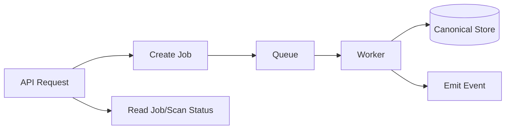
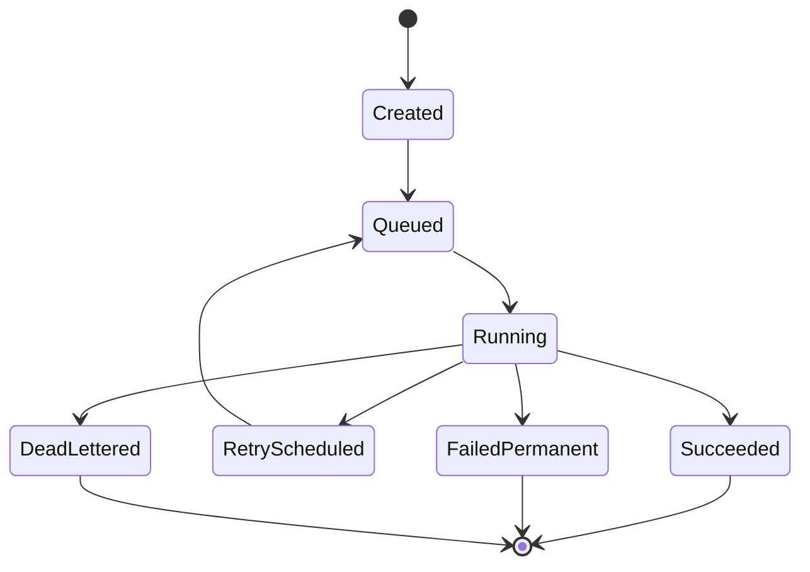
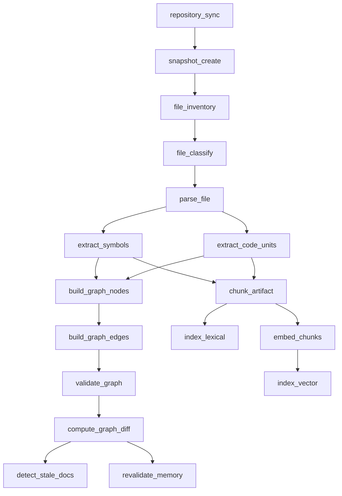
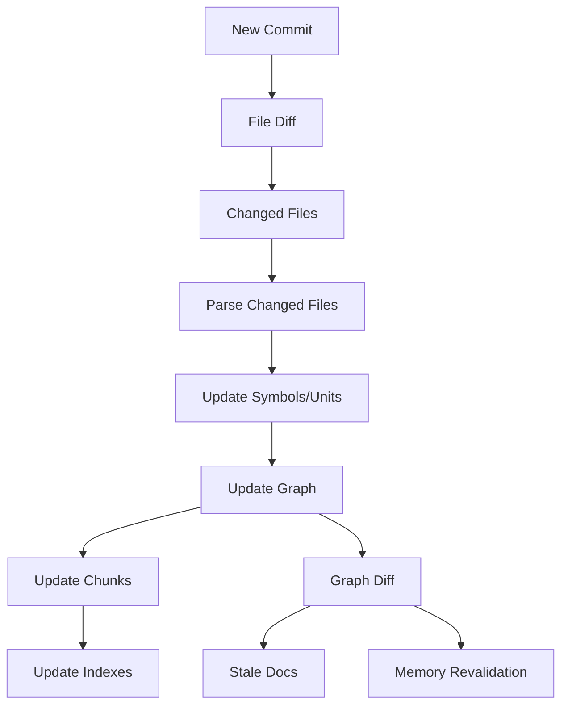

------
title: Learn AI Code Documentation & Agent Memory Platform - Part 027
description: Indexing workers and jobs untuk menjalankan repository ingestion, parsing, graph build, chunking, embeddings, stale detection, memory revalidation, retries, idempotency, backpressure, and observability.
series: learn-ai-code-documentation-agent-memory
seriesTitle: Learn AI Code Documentation & Agent Memory Platform
order: 27
partTitle: Indexing Workers and Jobs
tags:
- ai
- indexing
- workers
- jobs
- queue
- code-intelligence
- platform-architecture
- distributed-systems
date: 2026-07-02
---

# Part 027 — Indexing Workers and Jobs

## 1. Tujuan Part Ini

Part 026 membahas storage design. Sekarang kita membahas mesin yang mengisi storage itu: **indexing workers and jobs**.

Repository intelligence platform sangat bergantung pada proses asynchronous:

- clone/fetch repository,
- enumerate files,
- classify files,
- parse code,
- extract symbols,
- build graph,
- chunk source/docs,
- generate embeddings,
- update lexical/vector indexes,
- detect stale docs,
- revalidate memory,
- compute quality metrics.

Semua ini tidak cocok dijalankan sebagai request-response biasa. Kita butuh job system yang:

- idempotent,
- retryable,
- observable,
- scalable,
- priority-aware,
- cost-aware,
- safe,
- incremental,
- version-aware.

Target part ini:

1. mendesain job taxonomy,
2. membuat job lifecycle,
3. menentukan worker boundaries,
4. mendesain dependency antar jobs,
5. menerapkan idempotency dan retry,
6. menangani backpressure,
7. mendesain incremental indexing,
8. mengelola poison jobs dan dead-letter queue,
9. membuat observability dan audit,
10. menyiapkan foundation untuk API/workflow layer.

---

## 2. Kenapa Indexing Harus Asynchronous

Repository scanning dan indexing bisa lambat karena:

- repo besar,
- banyak file,
- clone/fetch network bound,
- parsing CPU bound,
- graph build memory-heavy,
- embedding rate-limited,
- vector upsert latency,
- document generation expensive,
- multi-repo indexing kompleks.

Jika semua dilakukan dalam API call:

- request timeout,
- user experience buruk,
- retries sulit,
- partial failure tidak jelas,
- scale terbatas.

### 2.1 Async Model



API menerima request, membuat job, lalu user/agent membaca status/artifact setelah job selesai.

---

## 3. Job Taxonomy

### 3.1 Repository Jobs

| Job | Purpose |
|---|---|
| `repository_sync` | fetch/clone repository metadata |
| `snapshot_create` | checkout commit and create snapshot |
| `file_inventory` | enumerate and fingerprint files |
| `file_classify` | classify source/docs/generated/vendor/sensitive |

### 3.2 Extraction Jobs

| Job | Purpose |
|---|---|
| `language_detect` | detect language |
| `parse_file` | parse source/doc/contract |
| `extract_symbols` | extract classes/functions/types |
| `extract_code_units` | extract routes/events/config/schema |
| `extract_dependencies` | extract imports/calls/uses |

### 3.3 Graph Jobs

| Job | Purpose |
|---|---|
| `build_graph_nodes` | create graph nodes |
| `build_graph_edges` | create graph edges |
| `validate_graph` | validate graph integrity |
| `compute_graph_diff` | compare snapshots |
| `impact_analysis_prepare` | prepare downstream impact |

### 3.4 Indexing Jobs

| Job | Purpose |
|---|---|
| `chunk_artifact` | create chunks |
| `index_lexical` | update keyword/exact index |
| `embed_chunks` | create embeddings |
| `index_vector` | upsert vectors |
| `delete_stale_vectors` | cleanup old vectors |

### 3.5 Documentation and Memory Jobs

| Job | Purpose |
|---|---|
| `detect_stale_docs` | mark stale documents/sections |
| `generate_document_draft` | generate docs |
| `evaluate_document_quality` | run quality gates |
| `revalidate_memory` | check memory freshness |
| `detect_memory_conflicts` | find conflicts |
| `prune_memory` | archive low-value memory |

### 3.6 Maintenance Jobs

| Job | Purpose |
|---|---|
| `retention_cleanup` | delete expired artifacts |
| `index_rebuild` | rebuild serving indexes |
| `backfill_processor_version` | reprocess after version change |
| `health_snapshot` | compute health reports |
| `permission_reconciliation` | update visibility after access changes |

---

## 4. Job Lifecycle



### 4.1 Job States

| State | Meaning |
|---|---|
| `created` | job record created |
| `queued` | waiting for worker |
| `running` | worker executing |
| `retry_scheduled` | transient failure |
| `succeeded` | completed |
| `failed_permanent` | will not retry |
| `dead_lettered` | exceeded retries/manual review |
| `cancelled` | intentionally stopped |
| `superseded` | replaced by newer job |

### 4.2 Job Record

```yaml
job:
  jobId: job_01J...
  jobType: parse_file
  tenantId: acme
  repositoryId: order-service
  snapshotId: snap_6f41ab2
  artifactType: file
  artifactId: file_01J
  processorVersion: java-parser-v2
  idempotencyKey: parse:file_01J:java-parser-v2
  status: queued
  priority: normal
  attempts: 0
```

---

## 5. Job Dependency Graph

Indexing is a DAG.



### 5.1 DAG Principle

A job should have clear prerequisites.

Example:

```yaml
parse_file requires file_inventory completed
build_graph_edges requires symbols and code units completed
embed_chunks requires chunks created
```

### 5.2 Avoid One Giant Job

Bad:

```txt
index_repository_everything
```

Problems:

- hard to retry,
- hard to parallelize,
- no partial progress,
- failure expensive.

Better:

- split by stages,
- split per file/module,
- aggregate after stage completion.

---

## 6. Worker Types

### 6.1 Ingestion Worker

Responsibilities:

- clone/fetch repo,
- checkout commit,
- enumerate files,
- compute hashes,
- store snapshot archive,
- publish file jobs.

Resource profile:

- network,
- disk,
- moderate CPU.

### 6.2 Parser Worker

Responsibilities:

- parse files,
- extract symbols,
- emit diagnostics.

Resource profile:

- CPU,
- memory.

### 6.3 Graph Worker

Responsibilities:

- build nodes/edges,
- validate graph,
- compute diff.

Resource profile:

- CPU/memory,
- DB write-heavy.

### 6.4 Chunking Worker

Responsibilities:

- build chunks,
- compute content hash,
- store chunk content.

Resource profile:

- CPU,
- storage write.

### 6.5 Embedding Worker

Responsibilities:

- build embedding input,
- call embedding provider,
- cache vectors,
- upsert embedding records.

Resource profile:

- network/provider bound,
- rate-limited,
- cost-sensitive.

### 6.6 Documentation Worker

Responsibilities:

- assemble context if needed,
- call model gateway,
- draft docs,
- run quality gates.

Resource profile:

- LLM-bound,
- cost-sensitive,
- longer-running.

### 6.7 Maintenance Worker

Responsibilities:

- stale detection,
- memory revalidation,
- retention cleanup,
- health reports.

Resource profile:

- scheduled/batch.

---

## 7. Idempotency

Workers must be safe to retry.

### 7.1 Idempotency Key

```txt
idempotencyKey =
hash(jobType, tenantId, repositoryId, snapshotId, artifactId, processorVersion)
```

### 7.2 Upsert Strategy

A worker should write deterministic output IDs.

Example parse output:

```txt
parseResultId = hash(fileId, parserId, parserVersion)
```

If worker retries, it overwrites/upserts same result.

### 7.3 Idempotent Side Effects

For vector upsert:

```txt
vectorId = hash(chunkId, embeddingModelId, templateVersion)
```

For document draft generation, idempotency is trickier. Use:

```txt
generationRunId = random
draftId = hash(docRequest, contextPackId, templateVersion, generatorVersion)
```

But if nondeterministic model output is desired, treat generation as new run while preventing duplicate publication.

### 7.4 Idempotency Anti-Pattern

Bad:

```txt
worker retry inserts new symbol IDs every time
```

This creates duplicate graph/chunks/index entries.

---

## 8. Retry Strategy

### 8.1 Retryable Errors

| Error | Retry |
|---|---|
| network timeout | yes |
| provider rate limit | yes with backoff |
| temporary DB error | yes |
| queue visibility timeout | yes |
| model gateway timeout | yes maybe |
| vector store transient failure | yes |

### 8.2 Non-Retryable Errors

| Error | Retry |
|---|---|
| invalid input | no |
| unsupported language | no, mark unsupported |
| blocked sensitive file | no, mark blocked |
| parser deterministic failure | no or limited |
| permission denied | no |
| file too large by policy | no |

### 8.3 Backoff

```yaml
retryPolicy:
  maxAttempts: 5
  backoff:
    type: exponential
    initialMs: 1000
    maxMs: 60000
    jitter: true
```

### 8.4 Dead Letter

After retries exceeded:

```yaml
job:
  status: dead_lettered
  errorCode: provider_timeout
  requiresManualInspection: true
```

---

## 9. Backpressure and Rate Limits

### 9.1 Why Backpressure

Embedding and doc generation can overload providers or budget.

Parsing can overload CPU.

Graph writes can overload DB.

### 9.2 Backpressure Controls

- worker pool size,
- queue partitioning,
- rate limit per tenant,
- rate limit per provider,
- priority queue,
- budget guards,
- circuit breakers,
- max concurrent scans per repo/tenant.

### 9.3 Tenant Fairness

Avoid one tenant/repo consuming all workers.

```yaml
fairness:
  maxConcurrentJobsPerTenant: 20
  maxConcurrentEmbeddingsPerTenant: 5
```

### 9.4 Priority

Priorities:

| Priority | Use |
|---|---|
| urgent | user-requested interactive context/doc |
| high | active PR / changed critical docs |
| normal | regular indexing |
| low | backfill/old snapshots |
| background | retention/analytics |

---

## 10. Incremental Indexing

### 10.1 Full Indexing

Initial scan indexes everything.

### 10.2 Incremental Indexing

On new commit:

1. compare file inventory,
2. identify added/modified/deleted files,
3. parse changed files,
4. update affected symbols,
5. rebuild affected graph edges,
6. update chunks,
7. update indexes,
8. compute graph diff,
9. trigger stale docs/memory revalidation.

### 10.3 Incremental Flow



### 10.4 Dependency-Aware Incremental Work

If interface changes, affected callers may need re-analysis.

Use graph dependency:

```yaml
affected:
  direct:
    - changed file
  dependent:
    - callers
    - implementors
    - tests
```

Start conservative, then optimize.

---

## 11. Snapshot-Level Completion

A snapshot should expose stage status.

```yaml
snapshotStatus:
  ingestion: completed
  parsing: completed_with_warnings
  graph: completed
  chunks: completed
  embeddings: running
  lexicalIndex: completed
  vectorIndex: partial
```

### 11.1 Partial Indexing

Allow retrieval with warnings if vector index not complete.

```yaml
warnings:
  - "Vector index for this snapshot is still building. Results may be incomplete."
```

### 11.2 Completion Criteria

Snapshot complete when:

- file inventory complete,
- all eligible files parsed or diagnosed,
- graph built/validated,
- chunks created,
- lexical index updated,
- vector index updated or skipped by policy.

---

## 12. Poison Files and Poison Jobs

### 12.1 Poison File

A file that repeatedly fails parsing/chunking.

Examples:

- malformed encoding,
- huge generated file,
- parser crash,
- unsupported syntax.

### 12.2 Handling

```yaml
fileDiagnostics:
  status: parse_failed
  reason: parser_crash
  attempts: 3
  action: mark_unparsed_and_continue
```

Do not block entire repo unless critical policy says so.

### 12.3 Poison Job

A job that repeatedly fails due to deterministic issue.

Move to dead-letter with safe metadata.

### 12.4 User-Facing Diagnostics

```md
Indexing completed with warnings:
- 3 files failed parsing.
- 1 generated file skipped due to size.
```

---

## 13. Job Ordering and Concurrency

### 13.1 Per-Repository Ordering

Avoid overlapping scans for same branch causing inconsistent status.

Options:

- serialize per repo/branch,
- allow concurrent snapshots but mark latest active,
- supersede old jobs when newer commit arrives.

### 13.2 Superseding Jobs

If commit A indexing running, commit B arrives.

Policy:

```yaml
if job priority normal and newer snapshot exists:
  mark old embedding jobs superseded
```

Keep source snapshot if needed but stop expensive downstream work.

### 13.3 Parallelism

Parallelize:

- file parsing,
- chunking,
- embeddings,
- lexical indexing batches.

Aggregate:

- graph validation,
- graph diff,
- snapshot completion.

---

## 14. Worker Leasing

Workers need safe job claiming.

### 14.1 Lease Model

```yaml
lease:
  jobId: job_01J
  workerId: worker_parser_04
  leasedUntil: 2026-07-02T00:05:00Z
```

If worker dies, job becomes available after lease expiry.

### 14.2 Heartbeat

Long jobs update heartbeat.

```yaml
heartbeatAt: 2026-07-02T00:03:00Z
progress:
  filesParsed: 120
  totalFiles: 500
```

### 14.3 Avoid Double Execution

Lease + idempotency handles race.

---

## 15. Progress Reporting

### 15.1 Job Progress

```yaml
progress:
  current: 320
  total: 1000
  unit: files
  message: "Parsing Java files"
```

### 15.2 Scan Progress

```yaml
scanProgress:
  stage: parsing
  files:
    completed: 320
    failed: 2
    total: 1000
  warnings:
    - "12 generated files skipped"
```

### 15.3 User/Agent Use

MCP/API can return:

```yaml
status: indexing
message: "Repository graph is ready; vector index still building."
```

---

## 16. Job Payload Design

### 16.1 Keep Payload Small

Job payload should reference IDs, not contain huge content.

Good:

```yaml
payload:
  fileId: file_01J
  parserVersion: java-parser-v2
```

Bad:

```yaml
payload:
  fullFileContent: "... huge ..."
```

### 16.2 Store Large Inputs in Object Store

Use references:

```yaml
sourceArchiveRef: blob://...
contextPackRef: blob://...
```

### 16.3 Payload Versioning

```yaml
payloadVersion: parse_file.v1
```

---

## 17. Worker Versioning

### 17.1 Processor Version

Every worker writes processor version.

Examples:

- `file-classifier-v2`,
- `java-symbol-extractor-v3`,
- `graph-builder-v1`,
- `chunker-v4`,
- `embedding-template-v2`.

### 17.2 Version Change

When processor changes:

- new jobs use new version,
- existing artifacts marked old version,
- optional backfill job created.

### 17.3 Reprocessing Policy

```yaml
reprocessPolicy:
  parserVersionChanged:
    action: reparse_changed_languages
  chunkerChanged:
    action: rechunk_all_active_snapshots
  embeddingTemplateChanged:
    action: reembed_priority_repos
```

---

## 18. Queue Topology

### 18.1 Single Queue

Good for MVP.

Problems at scale:

- expensive jobs block quick jobs,
- hard priority,
- weak isolation.

### 18.2 Multiple Queues

Recommended production:

```txt
ingestion-queue
parse-queue
graph-queue
index-queue
embedding-queue
generation-queue
maintenance-queue
```

### 18.3 Priority Queues

Each queue can support priority.

### 18.4 Dead Letter Queues

Each queue has DLQ.

```txt
parse-dlq
embedding-dlq
generation-dlq
```

---

## 19. Job Orchestrator

### 19.1 Responsibilities

- create jobs,
- enforce dependencies,
- handle completion events,
- schedule next jobs,
- supersede old jobs,
- expose status,
- handle retries/dead letters.

### 19.2 Orchestrator State

```yaml
pipelineRun:
  pipelineRunId: scan_01J
  repositoryId: order-service
  snapshotId: snap_6f41ab2
  status: running
  stages:
    ingestion: completed
    parsing: running
    graph: pending
```

### 19.3 Event-Driven Orchestration

When `parse_file.completed` count reaches expected count, enqueue graph build.

### 19.4 Avoid Hidden Coupling

Workers should not know the entire pipeline. They emit events. Orchestrator decides next step.

---

## 20. Worker Implementation Pattern

### 20.1 Generic Worker Loop

```java
public final class WorkerLoop {
    public void run() {
        while (running) {
            Job job = queue.leaseNext(workerType);
            if (job == null) {
                sleep();
                continue;
            }

            try {
                handler.handle(job);
                queue.markSucceeded(job.id());
            } catch (RetryableException ex) {
                queue.scheduleRetry(job.id(), ex);
            } catch (PermanentException ex) {
                queue.markFailedPermanent(job.id(), ex);
            } catch (Exception ex) {
                queue.scheduleRetry(job.id(), ex);
            }
        }
    }
}
```

### 20.2 Handler Pattern

```java
public interface JobHandler {
    boolean supports(JobType type);

    void handle(Job job);
}
```

### 20.3 Idempotent Handler

```java
public final class ParseFileJobHandler implements JobHandler {
    public void handle(Job job) {
        ParseFilePayload payload = job.payloadAs(ParseFilePayload.class);

        if (parseStore.exists(payload.fileId(), payload.parserVersion())) {
            return;
        }

        SourceFile file = sourceStore.getFile(payload.fileId());
        ParseResult result = parser.parse(file);
        parseStore.upsert(result);
        eventBus.publish(ParseCompleted.from(result));
    }
}
```

---

## 21. Observability

### 21.1 Metrics

Track:

- queue depth by type,
- queue lag,
- job duration,
- job success/failure rate,
- retry count,
- DLQ count,
- files parsed/sec,
- chunks created/sec,
- embedding tokens/min,
- vector upsert latency,
- doc generation cost,
- stale docs detected,
- memory revalidation count.

### 21.2 Traces

Trace:

```txt
scanRunId -> jobId -> workerId -> artifactIds
```

### 21.3 Logs

Structured logs:

```yaml
event: job_completed
jobType: parse_file
jobId: job_01J
repositoryId: order-service
snapshotId: snap_6f41ab2
durationMs: 84
```

No raw source content in logs by default.

---

## 22. Audit

Not every job needs full audit, but important lifecycle events do.

Audit:

- repository scan requested,
- source snapshot created,
- generated doc created,
- memory candidate created,
- memory invalidated,
- document marked stale,
- publish/review action.

Job telemetry is observability. Audit is accountability.

---

## 23. Cost Control

### 23.1 Costly Jobs

- embeddings,
- documentation generation,
- model-based verification,
- large graph rebuild,
- multi-repo retrieval.

### 23.2 Budget Guards

```yaml
budget:
  maxEmbeddingTokensPerDay: 10000000
  maxDocGenerationsPerRepoPerDay: 50
  maxBackfillCostPerDay: configured
```

### 23.3 Cost-Aware Scheduling

- prioritize user-facing active repos,
- delay old snapshot embeddings,
- skip generated/vendor chunks,
- batch embeddings,
- cache aggressively.

---

## 24. Failure Scenarios

### 24.1 Repository Unavailable

Action:

- retry with backoff,
- mark scan failed if permanent,
- preserve previous snapshot.

### 24.2 Parser Crash

Action:

- mark file parse failed,
- continue repo,
- collect diagnostics,
- create parser bug report if frequent.

### 24.3 Embedding Provider Down

Action:

- pause embedding queue,
- retrieval still works with lexical/graph,
- warn vector index partial.

### 24.4 DB Slow

Action:

- reduce worker concurrency,
- apply circuit breaker,
- backpressure queue.

### 24.5 New Commit Flood

Action:

- coalesce scans,
- supersede old low-priority jobs,
- index latest branch head.

---

## 25. Indexing Quality Gates

### 25.1 Snapshot Gate

Pass if:

- file inventory complete,
- critical file classification complete,
- parse failures below threshold,
- graph valid,
- no security-blocking error.

### 25.2 Graph Gate

Pass if:

- nodes/edges valid,
- no missing endpoints,
- confidence present,
- evidence attached for semantic edges.

### 25.3 Index Gate

Pass if:

- chunks created for eligible files,
- lexical index upsert complete,
- vector records created or skipped by policy,
- permission metadata present.

### 25.4 Quality Report

```yaml
indexQuality:
  status: completed_with_warnings
  files:
    total: 1200
    parsed: 1104
    skippedGenerated: 80
    failed: 16
  graph:
    nodes: 8200
    edges: 15400
  indexes:
    lexical: complete
    vector: partial
```

---

## 26. Practical Exercise

Design job pipeline for repository scan.

### 26.1 Input

Repository:

```txt
order-service
commit: 6f41ab2
languages: Java, YAML, SQL, Markdown
```

### 26.2 Output

Create:

```txt
job-catalog.yaml
pipeline-dag.mmd
queue-topology.md
worker-pool-config.yaml
retry-policy.yaml
indexing-status-api.json
index-quality-report.yaml
```

### 26.3 Acceptance Criteria

- jobs are split by stage,
- dependencies defined,
- idempotency keys defined,
- retry policy defined,
- poison file handling defined,
- vector indexing partial state handled,
- stale docs and memory revalidation triggered,
- observability metrics listed,
- user-facing status available.

---

## 27. Common Mistakes

### 27.1 One Giant Index Job

Hard to retry and scale.

### 27.2 No Idempotency

Retries corrupt data.

### 27.3 No Backpressure

Embedding/generation cost explodes.

### 27.4 Blocking Entire Repo on One File

Bad for large repos.

### 27.5 No Processor Versioning

Cannot know why output changed.

### 27.6 No Partial Status

Users think platform is broken.

### 27.7 Queue Without DLQ

Poison jobs loop forever.

### 27.8 Logging Raw Source

Security risk.

---

## 28. Summary

Indexing workers and jobs are the execution engine of repository intelligence.

Key points:

1. indexing must be asynchronous,
2. job pipeline should be a DAG,
3. split workers by resource profile,
4. every job needs idempotency key,
5. retries need clear retryable/non-retryable semantics,
6. backpressure protects infrastructure and cost,
7. incremental indexing depends on file/graph/chunk diffs,
8. partial indexing status must be visible,
9. observability and audit serve different purposes,
10. worker versioning and backfills are required for evolution.

Part berikutnya membahas **API Design and OpenAPI Contracts**: bagaimana mengekspos repository, search, graph, docs, context, memory, jobs, and admin operations melalui API yang versioned, typed, secure, and agent-friendly.
