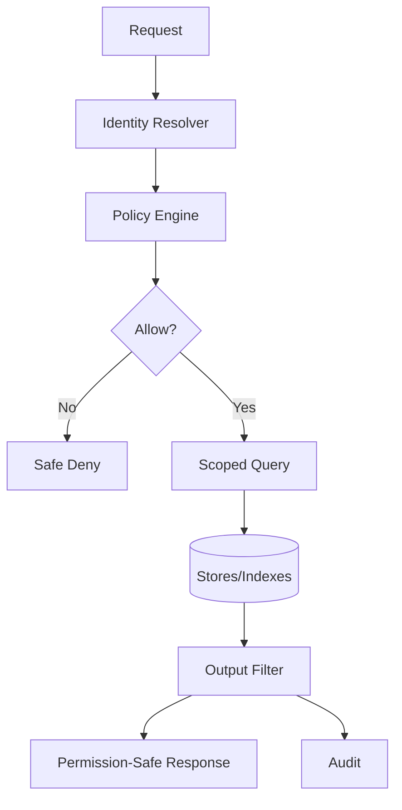
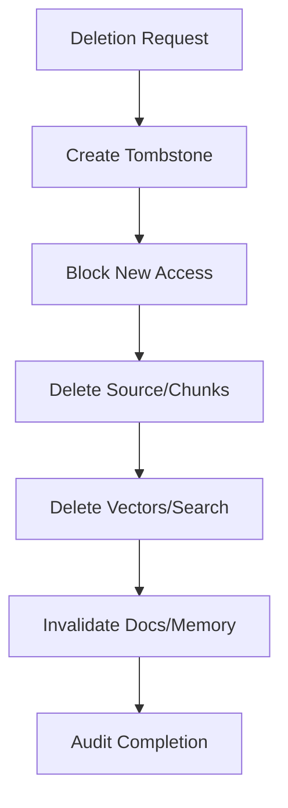

------
title: Learn AI Code Documentation & Agent Memory Platform - Part 030
description: Permissions and data isolation untuk multi-tenant repository intelligence platform, mencakup tenant boundary, repository ACL, derived visibility, search/vector filtering, context isolation, memory scope, MCP resource authorization, deletion, and policy evaluation.
series: learn-ai-code-documentation-agent-memory
seriesTitle: Learn AI Code Documentation & Agent Memory Platform
order: 30
partTitle: Permissions and Data Isolation
tags:
- ai
- permissions
- data-isolation
- multi-tenant
- authorization
- code-intelligence
- agent-memory
- security
date: 2026-07-02
---

# Part 030 — Permissions and Data Isolation

## 1. Tujuan Part Ini

Part 029 membahas security threat model. Sekarang kita masuk ke detail paling kritis untuk production: **permissions and data isolation**.

Platform ini membaca dan menghasilkan knowledge dari banyak repository, banyak team, banyak tenant, dan mungkin banyak sensitivity level. Permission model yang salah dapat menyebabkan:

- user membaca source repo yang tidak boleh diakses,
- generated docs membocorkan architecture private,
- memory dari repo private masuk ke context publik,
- vector search mengembalikan metadata tersembunyi,
- MCP resource URI bisa ditebak,
- cross-repo graph mengungkap dependency rahasia,
- deleted repository masih muncul di memory atau docs.

Target part ini:

1. mendesain multi-tenant isolation,
2. membuat repository permission model,
3. mendesain derived visibility inheritance,
4. menerapkan permission-aware retrieval, graph, vector, docs, memory, and context,
5. menangani cross-repo permissions,
6. membuat data deletion and retention model,
7. mendesain policy evaluation,
8. membuat test plan untuk zero data leak.

---

## 2. Data Isolation Principles

### 2.1 Tenant Isolation First

```txt
Tenant boundary is the strongest boundary.
```

No query, job, index, memory, doc, or context should cross tenant boundary unless explicitly designed as admin/compliance operation.

### 2.2 Source Visibility Propagates

Derived artifacts inherit visibility from source evidence.

```txt
derived visibility <= source visibility
```

### 2.3 Intersection for Multi-Source Artifacts

If artifact uses evidence from multiple sources:

```txt
effective visibility = intersection of all source visibilities
```

### 2.4 Permission Checked at Every Read

Do not rely on "it was checked when created".

Permission can change.

### 2.5 Do Not Leak Existence

If user cannot access a repo, avoid revealing its name/path/result count.

### 2.6 Policy Is Code

Authorization must be implemented as deterministic service logic, not prompt instruction.

---

## 3. Permission Architecture



### 3.1 Main Components

| Component | Responsibility |
|---|---|
| identity resolver | derive user/service identity |
| access sync | sync repo/team permissions |
| policy engine | evaluate access |
| query scoper | restrict DB/index queries |
| output filter | remove unauthorized data |
| audit | record decisions/actions |
| permission cache | speed up decisions safely |

---

## 4. Identity Model

### 4.1 Principal Types

| Principal | Example |
|---|---|
| user | human engineer |
| agent | AI agent session |
| service | internal service |
| worker | background worker |
| admin | platform/security admin |
| reviewer | doc/memory reviewer |

### 4.2 Principal Record

```yaml
principal:
  principalId: user_123
  principalType: user
  tenantId: acme
  teams:
    - team-order-platform
  roles:
    - engineer
  accessVersion: authz_v42
```

### 4.3 Agent Identity

Agent acts on behalf of a user or service.

```yaml
agentPrincipal:
  agentId: agent_01J
  delegatedBy: user_123
  tenantId: acme
  allowedTools:
    - search_code
    - get_symbol
```

Agent should not have broader data access than delegating principal unless explicitly configured.

### 4.4 Do Not Trust Request Body Principal

Never accept this as authority:

```json
{
  "principalId": "admin"
}
```

Principal must come from authenticated session/token.

---

## 5. Tenant Isolation

### 5.1 Tenant Key Everywhere

Every table row should include tenant_id where applicable.

Examples:

- repositories,
- snapshots,
- files,
- symbols,
- graph,
- chunks,
- embeddings,
- docs,
- memory,
- context packs,
- jobs,
- audit events.

### 5.2 Query Pattern

Every query includes tenant:

```sql
SELECT *
FROM chunks
WHERE tenant_id = :tenantId
  AND repository_id = :repositoryId;
```

### 5.3 Physical Isolation Options

| Option | Pros | Cons |
|---|---|---|
| shared DB + tenant_id | simpler, cheaper | strong discipline needed |
| schema per tenant | better isolation | operational complexity |
| DB per tenant | strongest | expensive |
| cluster per tenant | very strong | high ops cost |

### 5.4 Recommended Progression

MVP:

```txt
shared DB with strict tenant_id and tests
```

Enterprise/high-risk:

```txt
schema/DB/index namespace per tenant or sensitivity boundary
```

---

## 6. Repository Permission Model

### 6.1 Permission Types

| Permission | Meaning |
|---|---|
| `repository:read` | read source-derived data |
| `repository:scan` | trigger scan/index |
| `repository:admin` | manage repository config |
| `docs:read` | read docs |
| `docs:generate` | generate draft |
| `docs:review` | review docs |
| `docs:publish` | publish docs |
| `memory:read` | retrieve memory |
| `memory:create_candidate` | propose memory |
| `memory:review` | approve/reject memory |
| `audit:read` | read audit logs |
| `admin:*` | platform admin |

### 6.2 Repository Access Grant

```yaml
grant:
  tenantId: acme
  repositoryId: order-service
  principalType: team
  principalId: team-order-platform
  permission: repository:read
  source: github_team_sync
  accessVersion: authz_v42
```

### 6.3 Access Sources

- repository provider permissions,
- CODEOWNERS,
- team directory,
- internal RBAC,
- manual grants,
- service account policy.

### 6.4 Access Sync

Permissions change. Sync periodically and on webhook if possible.

---

## 7. Artifact Visibility

### 7.1 Visibility Levels

| Level | Meaning |
|---|---|
| public | broadly visible |
| internal | tenant/org visible |
| team | team restricted |
| repository | users with repo access |
| private | narrow access |
| confidential | extra controlled |
| secret | not retrievable content |
| blocked | excluded |

### 7.2 Sensitivity vs Visibility

Visibility: who can access.

Sensitivity: how risky the data is.

Example:

```yaml
visibility: repository
sensitivity: confidential
```

A user may have repo access, but confidential data may require extra role.

### 7.3 Effective Visibility

Derived artifact:

```yaml
effectiveVisibility:
  sourceArtifacts:
    - repo:order-service:repository
    - doc:internal-adr:team
  result: intersection
```

### 7.4 Sensitivity Escalation

```txt
effective sensitivity = max(source sensitivities)
```

---

## 8. Derived Visibility Inheritance

### 8.1 Single Source Artifact

If chunk from private repo:

```txt
chunk visibility = private repo visibility
```

### 8.2 Multi-Source Artifact

If generated doc uses:

- order-service private,
- billing-service team-restricted,

then generated doc visibility is intersection.

### 8.3 Memory

Memory visibility cannot be broader than evidence.

```yaml
memory:
  evidence:
    - private repo span
  visibility: repository_private
```

### 8.4 Context Pack

Context pack often contains many evidence items, so it is usually high sensitivity.

```txt
context pack visibility = intersection of all included evidence
```

### 8.5 Quality Reports

Quality reports can reveal missing docs, stale security-sensitive runbooks, or internal architecture. Treat as derived artifacts.

---

## 9. Permission-Aware Search

### 9.1 Query Scoping

Search must include:

- tenant,
- allowed repositories,
- allowed visibility,
- sensitivity filters,
- snapshot/branch constraints.

### 9.2 Pre-Filter

Search index query:

```yaml
filters:
  tenantId: acme
  repositoryId:
    in:
      - order-service
      - pricing-service
  visibilityScope:
    allowedFor: user_123
```

### 9.3 Post-Filter

Even with pre-filter, apply post-filter before output.

### 9.4 Result Count Leakage

If some results hidden, say:

```txt
Some results were omitted due to permissions.
```

Do not say:

```txt
7 results from fraud-service were hidden.
```

unless user can see fraud-service existence.

### 9.5 Search Metadata

Filter metadata fields too:

- path,
- title,
- repo name,
- symbol name,
- event topic,
- service name.

---

## 10. Permission-Aware Vector Indexing

### 10.1 Required Metadata

Every vector record stores:

```yaml
tenantId
repositoryId
snapshotId
visibilityScope
sensitivity
artifactState
chunkType
```

### 10.2 Namespace Strategy

For stronger isolation:

```txt
tenant namespace
tenant + sensitivity namespace
tenant + repo namespace
```

### 10.3 Query-Time Filter

Vector query must filter by tenant and allowed repositories.

### 10.4 Delete and Revoke

When permission/source removed:

- delete vector or mark inaccessible,
- update metadata,
- clear caches,
- audit.

### 10.5 Embedding Cache Isolation

Do not share embedding cache across tenants for sensitive content.

---

## 11. Permission-Aware Graph

Graph edges can leak architecture.

### 11.1 Node/Edge Visibility

Each graph node/edge has visibility and sensitivity.

```yaml
edge:
  type: CONSUMES_EVENT
  source: billing-service
  target: order.created
  visibility: intersection(order-service, billing-service)
```

### 11.2 Graph Query Filter

Graph traversal must skip unauthorized nodes/edges.

### 11.3 Partial Graph Output

If graph path crosses hidden node:

```md
The visible evidence shows `order-service` publishes `order.created`. Some downstream relationships may be hidden by permissions.
```

### 11.4 Avoid Broken Inference

If hidden node removed from path, do not create misleading direct edge.

Bad:

```txt
order-service -> notification-service
```

if hidden billing-service was in path.

Return partial path with warning or omit.

---

## 12. Permission-Aware Documents

### 12.1 Existing Docs

Docs inherit repository/doc store permissions.

### 12.2 Generated Docs

Generated docs inherit source evidence visibility.

### 12.3 Publishing Checks

Before publishing:

- target location permission,
- doc visibility compatible with evidence,
- reviewer approvals,
- no blocked content.

### 12.4 Public Docs from Private Source

Allowed only if sanitized and approved.

Workflow:

1. generate internal draft,
2. redact/sanitize,
3. security review,
4. publish public version.

Do not automatically publish private-source docs publicly.

---

## 13. Permission-Aware Memory

### 13.1 Memory Scope

Memory has scope:

- tenant,
- repo,
- module,
- team,
- org,
- user,
- task type.

### 13.2 Memory Visibility

Memory visibility no broader than evidence.

### 13.3 Retrieval Gate

Memory eligible if:

- active,
- not stale/conflicted,
- principal can access memory scope,
- principal can access evidence or sanitized approved memory,
- task type allowed.

### 13.4 Cross-Repo Memory

Visibility is intersection of all repos.

### 13.5 User Preference Memory

User memory should not leak to team/org unless explicitly promoted.

---

## 14. Permission-Aware Context Packs

### 14.1 Context Pack Is High Sensitivity

Context pack may contain:

- code snippets,
- docs,
- memory,
- graph paths,
- warnings,
- excluded items.

### 14.2 Context Assembly Checks

Before including item:

```txt
canRead(principal, artifact) == true
```

After building pack:

```txt
effectiveVisibility = intersection(items)
```

### 14.3 Context Pack Access

Reading a saved context pack should re-check permission.

Permission may have changed after pack creation.

### 14.4 Safe Exclusions

If artifact excluded due to permission, do not reveal details.

---

## 15. MCP Resource Authorization

### 15.1 Resource URI Is Not Authorization

Even if user has URI:

```txt
code://order-service/6f41ab2/OrderValidator.java#L12-L144
```

Server must check access.

### 15.2 Guessable URI

Resource URIs are often guessable. Authz required on read.

### 15.3 Resource Types

Check:

- code resource,
- doc resource,
- symbol resource,
- context pack,
- evidence map,
- quality report,
- memory record.

### 15.4 Tool Allowlist

Agent can only call tools allowed for its task/session.

---

## 16. Policy Evaluation

### 16.1 Policy Input

```yaml
policyRequest:
  principal:
    tenantId: acme
    principalId: user_123
    teams:
      - team-order-platform
  action: read
  resource:
    type: chunk
    repositoryId: order-service
    visibilityScope: repository
    sensitivity: internal
  context:
    tool: search_code
    taskType: documentation_generation
```

### 16.2 Policy Decision

```yaml
decision:
  effect: allow
  reasons:
    - "principal has repository:read on order-service"
    - "sensitivity internal allowed"
  policyVersion: authz-policy-v4
```

### 16.3 Deny Decision

```yaml
decision:
  effect: deny
  safeMessage: "You do not have access to the requested resource."
  reasonsForAudit:
    - "missing repository:read"
```

Do not expose internal reasons to user if sensitive.

---

## 17. Policy Models

### 17.1 RBAC

Role-based access.

Example:

```txt
role: docs_reviewer
permission: docs:review
```

Good for platform actions.

### 17.2 ABAC

Attribute-based access.

Example:

```txt
allow if principal.team in repository.allowedTeams
and resource.sensitivity <= principal.clearance
```

Good for fine-grained data.

### 17.3 ReBAC

Relationship-based access.

Example:

```txt
user -> member_of -> team -> owns -> repository
```

Good for organization/repo graphs.

### 17.4 Recommended Approach

Use hybrid:

- RBAC for actions,
- ReBAC for repository/team ownership,
- ABAC for sensitivity and context rules.

---

## 18. Permission Cache

### 18.1 Why Cache

Permission checks are frequent.

### 18.2 Cache Key

```txt
cacheKey = hash(principalId, tenantId, accessVersion, resourceId, action)
```

### 18.3 Invalidation

Invalidate when:

- team membership changes,
- repo permission changes,
- policy version changes,
- sensitivity changes,
- grants revoked.

### 18.4 Safe TTL

Use short TTL for high-risk decisions.

Never cache denies/allows without accessVersion.

---

## 19. Cross-Repo Permission Semantics

### 19.1 User Can Access All Repos

Return full cross-repo doc/graph.

### 19.2 User Can Access Some Repos

Return visible subset and warning.

Do not reveal hidden details.

### 19.3 User Can Access Producer but Not Consumer

Example:

```md
Visible evidence shows `order-service` publishes `order.created`. Some consumers may be omitted due to permissions.
```

### 19.4 User Can Access Consumer but Not Producer

Similar partial output.

### 19.5 Multi-Owner Review

Generated docs with multi-repo evidence require reviewers from each repo or owner group.

---

## 20. Data Deletion and Revocation

### 20.1 Repository Access Revoked

When user loses repo access:

- future reads denied,
- cached context invalid,
- search results filtered,
- saved context rechecked.

### 20.2 Repository Deleted/Removed

Need cleanup:

- source snapshots,
- chunks,
- embeddings,
- graph nodes/edges,
- docs generated solely from repo,
- memory grounded solely in repo,
- context packs,
- search index records.

### 20.3 Derived Multi-Source Artifact

If artifact uses deleted repo plus other repo:

- mark stale/invalid,
- redact deleted evidence,
- require review.

### 20.4 Tombstone Flow



---

## 21. Retention and Isolation

### 21.1 Retention by Data Class

| Data | Retention |
|---|---|
| source snapshots | limited |
| chunks/vectors | tied to source retention |
| context packs | medium/audit-driven |
| generated docs | policy/review-driven |
| memory | lifecycle-driven |
| audit | longer |
| logs | short/medium |

### 21.2 Isolation in Retention

Deletion should not remove other tenant's data.

Use tenant-scoped deletion jobs.

### 21.3 Legal Hold

If audit/legal hold applies, delete access/content according to policy while preserving allowed metadata.

---

## 22. Data Isolation in Jobs

### 22.1 Job Tenant Scope

Every job includes tenantId.

Workers must not process job without tenant scope.

### 22.2 Worker Credentials

Workers should have service permissions but still operate within job tenant/repo scope.

### 22.3 Queue Isolation

Options:

- shared queue with tenant in payload,
- tenant-specific queues,
- sensitivity-specific queues.

### 22.4 Job Payload Safety

Do not include raw source content if avoidable. Store references.

---

## 23. Data Isolation in Logs and Audit

### 23.1 Logs

Logs should include tenant and artifact IDs, not raw content.

### 23.2 Audit Access

Audit logs may reveal sensitive actions. Restrict.

### 23.3 Cross-Tenant Operators

Platform admins may need cross-tenant access. Require:

- elevated role,
- reason,
- audit,
- just-in-time access,
- no broad default access.

---

## 24. Permission Testing

### 24.1 Unit Tests

- canRead repository,
- canRead chunk,
- canRead generated doc,
- canRead memory,
- derived visibility calculation,
- cross-repo intersection.

### 24.2 Integration Tests

Scenarios:

1. user A can access repo A, not repo B,
2. search returns only repo A,
3. graph hides repo B edge,
4. context pack excludes repo B,
5. generated doc from A+B hidden from A-only user,
6. memory from B not retrieved,
7. MCP resource URI to B denied.

### 24.3 Regression Tests for Leakage

Test:

- result counts,
- warnings,
- metadata,
- path,
- title,
- service names,
- event names.

### 24.4 Deletion Tests

After deletion:

- no chunks,
- no vectors,
- no search hits,
- memory invalid,
- docs stale/removed,
- context unavailable or redacted.

---

## 25. Authorization Observability

### 25.1 Metrics

- authz decisions count,
- deny rate,
- permission cache hit rate,
- hidden results count,
- cross-repo partial results,
- resource URI denied,
- policy evaluation latency.

### 25.2 Audit Events

Audit:

- denied sensitive read,
- generated doc from multi-repo sources,
- memory approval,
- publish action,
- admin access,
- deletion.

### 25.3 Alerting

Alert on:

- spike in denied access,
- repeated resource guessing,
- high broad-search activity,
- cross-tenant query attempt,
- permission filter failure.

---

## 26. API Examples

### 26.1 Permission-Aware Search Response

```json
{
  "status": "partial",
  "data": {
    "results": [
      {
        "title": "OrderValidator.validate",
        "repositoryId": "order-service",
        "path": "src/main/java/com/acme/order/OrderValidator.java",
        "evidence": []
      }
    ]
  },
  "warnings": [
    {
      "code": "results_omitted_due_to_permissions",
      "message": "Some results were omitted due to access restrictions."
    }
  ]
}
```

### 26.2 Denied Resource

```json
{
  "status": "error",
  "error": {
    "code": "permission_denied",
    "message": "You do not have access to the requested resource.",
    "retryable": false
  }
}
```

### 26.3 Derived Visibility

```yaml
generatedDoc:
  evidence:
    - order-service
    - billing-service
  effectiveVisibility: intersection
  readableBy:
    requires:
      - repository:read:order-service
      - repository:read:billing-service
```

---

## 27. Common Mistakes

### 27.1 Filtering Only After Retrieval

May leak through result counts or metadata. Use pre-filter + post-filter.

### 27.2 Treating Generated Docs as Public

Generated docs inherit source visibility.

### 27.3 Ignoring Derived Data

Graph/memory/embeddings can reveal architecture.

### 27.4 Trusting Resource URI

URI must be authorized on every read.

### 27.5 No Permission Recheck for Saved Context

Access changes over time.

### 27.6 Cross-Repo Docs Without Intersection

Visibility becomes too broad.

### 27.7 Cache Without Access Version

Permission changes not reflected.

### 27.8 Deleting Source but Not Vectors

Deleted knowledge remains retrievable.

---

## 28. Practical Exercise

Design permission and isolation model.

### 28.1 Required Output

Create:

```txt
permission-model.md
policy-rules.yaml
derived-visibility.md
search-filtering-tests.yaml
graph-permission-tests.yaml
mcp-resource-authz-tests.yaml
deletion-flow.mmd
retention-policy.yaml
```

### 28.2 Required Scenarios

1. user with access to one repo searches multi-repo graph,
2. generated doc uses evidence from two repos,
3. memory candidate from private repo tries to become org memory,
4. vector search attempts to return hidden chunk,
5. context pack saved before permission revocation,
6. MCP URI guessed for hidden file,
7. repository deletion triggers derived cleanup,
8. admin reads audit logs.

### 28.3 Acceptance Criteria

- tenant isolation explicit,
- repository ACL modeled,
- derived visibility rule defined,
- permission checks occur at read time,
- search/vector/graph filters defined,
- memory scope enforced,
- context pack access rechecked,
- deletion removes indexes and derived artifacts,
- tests cover metadata leakage.

---

## 29. Summary

Permissions and data isolation are the foundation of a safe repository intelligence platform.

Key points:

1. tenant boundary is strongest,
2. source visibility propagates to derived artifacts,
3. multi-source artifacts use visibility intersection,
4. permission checks happen on every read,
5. search, vector, graph, docs, memory, and context all need filtering,
6. resource URIs are not authorization,
7. agents inherit delegated user permissions,
8. caches need access versions,
9. deletion must clean source, indexes, docs, memory, and context,
10. test for metadata leakage, not only content leakage.

Part berikutnya membahas **Compliance, Audit, and Defensibility**: bagaimana menyimpan evidence, audit trails, review records, retention, deletion proof, AI run lineage, and governance artifacts agar platform bisa dipertanggungjawabkan.
