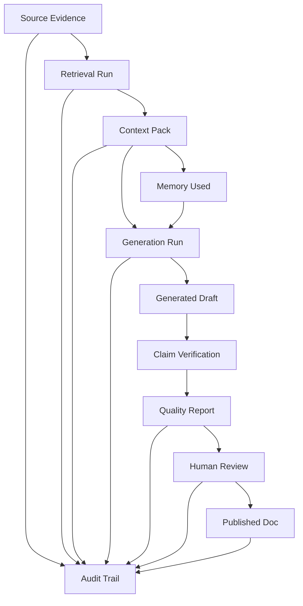
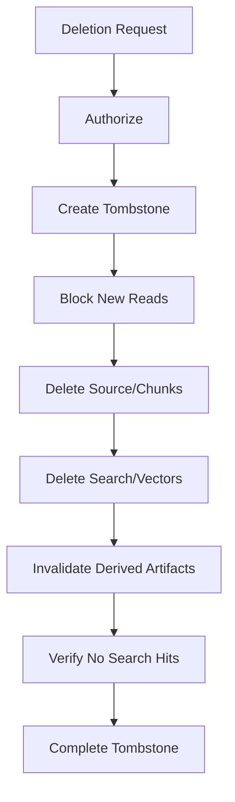

------
title: Learn AI Code Documentation & Agent Memory Platform - Part 031
description: Compliance, audit, and defensibility untuk AI code documentation dan agent memory platform, mencakup lineage, evidence, review records, retention, deletion proof, AI run trace, governance controls, dan audit-ready artifacts.
series: learn-ai-code-documentation-agent-memory
seriesTitle: Learn AI Code Documentation & Agent Memory Platform
order: 31
partTitle: Compliance, Audit, and Defensibility
tags:
- ai
- compliance
- audit
- defensibility
- governance
- provenance
- code-intelligence
- agent-memory
date: 2026-07-02
---

# Part 031 — Compliance, Audit, and Defensibility

## 1. Tujuan Part Ini

Part 029 membahas threat model. Part 030 membahas permissions and data isolation. Sekarang kita menutup fase Safety, Security, and Governance dengan topik **compliance, audit, and defensibility**.

Platform AI code documentation dan agent memory tidak hanya harus bekerja. Ia juga harus bisa dipertanggungjawabkan.

Ketika ada pertanyaan seperti:

- Siapa yang menghasilkan dokumen ini?
- Source commit apa yang dipakai?
- Evidence mana yang mendukung claim ini?
- Model/template/generator versi berapa yang dipakai?
- Apakah user punya permission untuk evidence tersebut?
- Apakah dokumen sudah direview?
- Mengapa memory ini masuk ke context agent?
- Kenapa stale docs masih muncul?
- Apakah data yang dihapus benar-benar hilang dari index/vector/memory?
- Bagaimana membuktikan tidak ada cross-tenant leak?

Platform harus bisa menjawab dengan artifact, bukan opini.

Target part ini:

1. membedakan audit, observability, compliance, and defensibility,
2. mendesain audit events yang berguna,
3. membuat lineage untuk AI runs, docs, context packs, memory, and retrieval,
4. menyimpan review records,
5. mendesain retention dan deletion proof,
6. membuat governance controls,
7. menghasilkan audit-ready reports,
8. mendesain defensible AI behavior untuk engineering organization.

---

## 2. Definisi

### 2.1 Audit

Audit adalah catatan yang menjawab:

```txt
who did what, to which resource, when, under what authorization, and with what result?
```

Audit bukan debug log.

### 2.2 Observability

Observability menjawab:

```txt
how is the system behaving?
```

Contoh:

- latency,
- error rate,
- queue lag,
- token usage,
- retrieval p95,
- generation failures.

### 2.3 Compliance

Compliance adalah kemampuan menunjukkan bahwa proses/platform mengikuti policy, kontrol, dan kewajiban organisasi.

Di materi ini kita tidak mengikat ke satu regulasi spesifik. Kita membangun mekanisme generic yang bisa dipetakan ke kebutuhan internal, enterprise, security review, audit, and governance.

### 2.4 Defensibility

Defensibility adalah kemampuan menjelaskan dan mempertahankan keputusan platform secara reasonable, reproducible, and evidence-backed.

Contoh:

```txt
Generated doc X said Y because context pack C included evidence E1/E2 from commit Z, quality gate passed, and reviewer R approved it.
```

---

## 3. Audit vs Logs vs Traces

| Concept | Purpose | Retention | Audience |
|---|---|---:|---|
| audit event | accountability | long | security/compliance/admin |
| application log | debugging | short/medium | engineer/operator |
| distributed trace | performance flow | short/medium | engineer/operator |
| quality report | artifact trust | medium/long | reviewer/user |
| lineage record | provenance | long for generated artifacts | reviewer/auditor |
| model run record | AI behavior trace | policy-based | AI/platform/security |

### 3.1 Common Mistake

Menganggap logs cukup untuk audit.

Logs sering:

- tidak lengkap,
- tidak immutable,
- terlalu noisy,
- mengandung raw data,
- tidak punya actor/action/resource semantics.

Audit harus didesain sebagai first-class data model.

---

## 4. Defensibility Mental Model



Defensible output bukan hanya "LLM says". Ia adalah chain of evidence, process, and approval.

---

## 5. Audit Event Design

### 5.1 Audit Event Schema

```yaml
auditEvent:
  eventId: audit_01J...
  tenantId: acme
  actor:
    type: user | agent | service | worker | admin
    id: user_123
  action: documentation.draft.generated
  target:
    type: document
    id: doc_01J
  authorization:
    decisionId: authz_01J
    policyVersion: authz-policy-v4
  correlation:
    requestId: req_01J
    workflowRunId: wf_01J
    traceId: trace_01J
  result:
    status: success
  safeMetadata:
    repositoryId: order-service
    commitSha: 6f41ab2
    docType: module_doc
  createdAt: 2026-07-02T00:00:00Z
```

### 5.2 Required Audit Fields

| Field | Why |
|---|---|
| eventId | identity |
| tenantId | isolation |
| actor | accountability |
| action | what happened |
| target | affected resource |
| authorization | policy defensibility |
| correlation | traceability |
| result | success/failure |
| safeMetadata | useful context |
| timestamp | ordering |

### 5.3 Safe Metadata

Audit metadata should be useful but not unnecessarily expose raw source/secrets.

Good:

```yaml
pathHash: sha256:...
fileId: file_01J
repositoryId: order-service
```

Use raw path only if audit audience/policy permits.

---

## 6. Audit Event Categories

### 6.1 Access Events

```yaml
actions:
  - repository.read
  - file_span.read
  - search.executed
  - graph.neighborhood.read
  - context_pack.read
  - memory.read
```

### 6.2 Generation Events

```yaml
actions:
  - context_pack.created
  - documentation.draft.generated
  - document.claims.verified
  - document.quality.evaluated
  - review_package.created
```

### 6.3 Memory Events

```yaml
actions:
  - memory.candidate.created
  - memory.candidate.reviewed
  - memory.activated
  - memory.invalidated
  - memory.conflict.detected
  - memory.revalidated
```

### 6.4 Governance Events

```yaml
actions:
  - document.review.requested
  - document.review.completed
  - document.published
  - document.archived
  - policy.updated
  - permission.sync.completed
```

### 6.5 Data Lifecycle Events

```yaml
actions:
  - repository.deleted
  - snapshot.retention.deleted
  - vector.deleted
  - memory.redacted
  - context_pack.expired
  - deletion_tombstone.completed
```

### 6.6 Admin Events

```yaml
actions:
  - admin.audit.read
  - admin.policy.override
  - admin.retention_hold.created
  - admin.reindex.started
```

Admin events need strong audit.

---

## 7. AI Run Lineage

### 7.1 Why AI Run Lineage Matters

When model output is questioned, you need to know:

- which context,
- which model/generator,
- which prompt template,
- which retrieved evidence,
- which memory,
- which parameters,
- which output,
- which quality gates,
- which reviewer.

### 7.2 AI Run Record

```yaml
aiRun:
  runId: airun_01J...
  tenantId: acme
  useCase: documentation_section_drafting
  workflowRunId: wf_01J
  contextPackId: ctx_01J
  promptTemplate:
    id: module-section-draft
    version: v2
    hash: sha256:...
  generatorVersion: doc-generator-v3
  modelConfig:
    providerAlias: configured-provider
    modelAlias: documentation-model
    configHash: sha256:...
  input:
    contextPackHash: sha256:...
  output:
    artifactId: section_draft_01J
    outputHash: sha256:...
  tokenUsage:
    inputTokens: 9200
    outputTokens: 1300
  status: success
```

### 7.3 Store Raw Prompt?

Policy decision.

Options:

| Option | Pros | Cons |
|---|---|---|
| store full prompt/context | best reproducibility | sensitive storage |
| store hashes + artifact refs | safer | harder debug |
| store redacted prompt | balanced | redaction complexity |
| store no prompt | privacy | weak defensibility |

For sensitive enterprise systems, store context pack as governed artifact with retention and access control.

---

## 8. Context Pack Defensibility

Context pack is the immediate evidence boundary.

### 8.1 Context Pack Must Record

- task,
- scope,
- source commit,
- included evidence,
- included memory,
- warnings,
- exclusions,
- token budget,
- assembler version,
- permission decision summary,
- citation map.

### 8.2 Context Pack Audit Questions

Can we answer?

- Why did the model mention `RuleRegistry`?
- Did context include stale docs?
- Did context include memory?
- Did context include unauthorized content?
- What was omitted due to permissions?
- Which commit was used?

### 8.3 Context Pack as Legal/Engineering Artifact

Do not treat context pack as temporary prompt text. It is central to defensibility.

---

## 9. Retrieval Defensibility

### 9.1 Retrieval Run Record

```yaml
retrievalRun:
  retrievalRunId: ret_01J
  query: "where are validation rules registered?"
  intent: code_location
  scope:
    repositoryId: order-service
    commitSha: 6f41ab2
  retrieversUsed:
    - exact
    - lexical
    - vector
    - graph
  rankerVersion: hybrid-ranker-v1
  results:
    - artifactId: chunk_rule_registry
      rank: 1
      score: 0.91
      reasons:
        - semantic match
        - graph proximity
        - primary evidence
  exclusions:
    - reason: permission_denied
      count: 3
    - reason: stale_high_risk
      count: 1
```

### 9.2 Why Store Ranking Reasons

Ranking reasons support:

- debugging,
- user trust,
- audit,
- eval,
- regression analysis.

### 9.3 Retrieval Reproducibility

Store:

- index versions,
- embedding model/template versions,
- query understanding version,
- ranker version,
- snapshot.

---

## 10. Documentation Defensibility

### 10.1 Generated Document Lineage

```yaml
generatedDocument:
  documentId: doc_01J
  docType: module_doc
  sourceCommit: 6f41ab2
  contextPackId: ctx_01J
  generationRunId: airun_01J
  qualityReportId: qr_01J
  reviewState: approved
  publishedAt: 2026-07-02T00:00:00Z
```

### 10.2 Claim-Level Evidence

Every major claim should have:

- claim ID,
- section,
- text,
- evidence refs,
- verification status,
- confidence,
- source commit.

### 10.3 Review Record

```yaml
review:
  reviewId: review_01J
  documentId: doc_01J
  reviewer:
    type: team
    id: team-order-platform
  decision: approved_with_changes
  comments:
    - "Retry behavior uncertainty is acceptable."
  timestamp: 2026-07-02T00:00:00Z
```

### 10.4 Publication Record

```yaml
publication:
  publicationId: pub_01J
  documentId: doc_01J
  target:
    type: repository
    path: docs/order-validation.md
  approvedReviewId: review_01J
  actor: user_123
```

---

## 11. Memory Defensibility

### 11.1 Memory Lineage

Memory must answer:

- who proposed it,
- from which evidence,
- who approved it,
- when it was last validated,
- why it is active,
- when it expires,
- what invalidates it.

### 11.2 Memory Audit Trail

```yaml
memoryHistory:
  memoryId: mem_rule_registry
  events:
    - candidate_created
    - approved
    - activated
    - retrieved_into_context
    - revalidated
```

### 11.3 Memory Use in Context

When memory affects generation, record:

```yaml
memoryUsage:
  memoryId: mem_rule_registry
  contextPackId: ctx_01J
  useType: guidance
  evidence:
    - E1
```

### 11.4 Memory Defensibility Rule

```txt
No active memory without evidence, scope, state, and lifecycle metadata.
```

---

## 12. Review Governance

### 12.1 Review Types

| Review | Applies To |
|---|---|
| documentation review | generated/published docs |
| memory review | candidate/active memory |
| security review | sensitive docs/public docs |
| architecture review | ADR/architecture docs |
| operational review | runbooks |
| policy review | authz/tool/retention changes |

### 12.2 Review States

```yaml
states:
  - pending
  - approved
  - approved_with_changes
  - rejected
  - needs_work
  - superseded
```

### 12.3 Review Requirements by Artifact

| Artifact | Review |
|---|---|
| generated module doc | recommended/required by policy |
| API docs | required |
| runbook | required |
| ADR | required |
| active memory | required for high-impact |
| public docs from private source | security review required |
| publish action | approval required |

### 12.4 Reviewer Assignment

Use:

- CODEOWNERS,
- repo owner,
- service catalog,
- document owner,
- memory scope owner,
- policy owner.

---

## 13. Retention

### 13.1 Retention Classes

| Artifact | Retention Consideration |
|---|---|
| source snapshots | storage cost + reproducibility |
| chunks | tied to source retention |
| vectors | tied to chunks/source |
| context packs | audit/debug value, sensitive |
| AI run records | defensibility, cost, privacy |
| generated docs | doc lifecycle |
| memory history | governance |
| audit events | accountability |
| logs/traces | ops/debug |

### 13.2 Retention Policy Example

```yaml
retention:
  sourceSnapshots:
    latestPerBranch: 5
    maxDays: 90
  contextPacks:
    maxDays: 180
  aiRunRecords:
    maxDays: 180
    storeRawContext: false
  auditEvents:
    maxDays: 365
  generatedDocs:
    policy: document_lifecycle
  memoryHistory:
    maxDays: 730
```

### 13.3 Retention Must Be Enforced

Policy without deletion jobs is not real.

---

## 14. Deletion Proof

When data is deleted, platform should produce proof-like artifact.

### 14.1 Deletion Tombstone

```yaml
deletionTombstone:
  tombstoneId: del_01J
  tenantId: acme
  target:
    type: repository
    id: order-service
  requestedBy: user_123
  startedAt: 2026-07-02T00:00:00Z
  completedAt: 2026-07-02T00:10:00Z
  actions:
    - source_snapshots_deleted
    - chunks_deleted
    - vectors_deleted
    - search_index_deleted
    - memory_invalidated
    - docs_marked_invalid
  residual:
    auditMetadataRetained: true
```

### 14.2 Deletion Workflow



### 14.3 Deletion Verification

Run checks:

- search returns no deleted chunks,
- vector records removed,
- memory no longer active,
- docs invalidated/redacted,
- context packs expired/redacted,
- audit tombstone complete.

---

## 15. Policy Governance

### 15.1 Policies to Version

- authorization policy,
- source classification policy,
- sensitivity policy,
- retention policy,
- memory approval policy,
- doc review policy,
- MCP tool policy,
- model usage policy,
- publication policy.

### 15.2 Policy Record

```yaml
policy:
  policyId: doc-review-policy
  version: v4
  status: active
  approvedBy: platform-governance
  effectiveFrom: 2026-07-02T00:00:00Z
```

### 15.3 Policy Change Audit

When policy changes:

- audit event,
- impact analysis,
- affected artifacts,
- revalidation jobs if needed.

Example:

```yaml
policyChangeImpact:
  policy: memory-approval-policy
  change: "AI-generated memory now requires human review."
  affectedMemoryRecords: 128
  action: mark_needs_review
```

---

## 16. Defensible AI Behavior

### 16.1 What Makes AI Behavior Defensible?

It is:

- scoped,
- evidence-based,
- permission-safe,
- reproducible enough,
- reviewed when necessary,
- monitored,
- auditable,
- able to say "unknown".

### 16.2 Anti-Defensible Behavior

```txt
The AI generated an answer from some context, but we do not know which files, prompt, model, or memory influenced it.
```

### 16.3 Defensible Response Pattern

When presenting generated docs:

```md
Generated from:
- Repository: order-service
- Commit: 6f41ab2
- Context Pack: ctx_01J
- Evidence Coverage: 88%
- Unsupported Claims: 0
- Review State: pending
```

### 16.4 Defensible Agent Action

Agent action should have:

- task,
- allowed tools,
- tool calls,
- evidence,
- constraints,
- output,
- quality state.

---

## 17. Compliance Artifacts

### 17.1 Artifact Catalog

| Artifact | Purpose |
|---|---|
| audit log | accountability |
| evidence map | claim/source traceability |
| context pack | model input traceability |
| AI run record | generation lineage |
| quality report | gate result |
| review record | human approval |
| policy record | governance |
| deletion tombstone | lifecycle proof |
| access decision record | permission defensibility |
| workflow trace | process traceability |
| memory history | memory governance |

### 17.2 Audit Package

For a generated document:

```yaml
auditPackage:
  documentId: doc_01J
  sourceCommit: 6f41ab2
  contextPack: ctx_01J
  aiRuns:
    - airun_01J
  qualityReport: qr_01J
  evidenceMap: evidence-map://doc_01J
  reviews:
    - review_01J
  auditEvents:
    - audit_...
```

### 17.3 Export Format

Support export as:

- JSON,
- YAML,
- PDF/report if needed,
- evidence bundle,
- signed archive if policy requires.

---

## 18. Audit Query Examples

### 18.1 Who Published This Doc?

```sql
SELECT *
FROM audit_events
WHERE target_type = 'document'
  AND target_id = :documentId
  AND action = 'document.published';
```

### 18.2 Which Context Pack Was Used?

```sql
SELECT context_pack_id
FROM generated_document_metadata
WHERE document_id = :documentId;
```

### 18.3 Which Memory Influenced This Output?

```sql
SELECT *
FROM context_pack_items
WHERE context_pack_id = :contextPackId
  AND artifact_type = 'memory';
```

### 18.4 Was Deleted Repo Still Searchable?

Run post-deletion verification query against search/vector metadata and store result in tombstone.

---

## 19. Audit Storage Design

### 19.1 Audit Table

```sql
CREATE TABLE audit_events (
    event_id TEXT PRIMARY KEY,
    tenant_id TEXT NOT NULL,
    actor_type TEXT NOT NULL,
    actor_id TEXT NOT NULL,
    action TEXT NOT NULL,
    target_type TEXT NOT NULL,
    target_id TEXT NOT NULL,
    authorization_decision_id TEXT,
    policy_version TEXT,
    correlation_id TEXT,
    workflow_run_id TEXT,
    trace_id TEXT,
    result_status TEXT NOT NULL,
    safe_metadata JSONB NOT NULL,
    created_at TIMESTAMP NOT NULL
);
```

### 19.2 Append-Only Discipline

Do not update audit events. Add correction events if needed.

### 19.3 Audit Integrity

Depending risk level:

- append-only table,
- restricted write role,
- periodic export,
- hash chain,
- WORM-like storage,
- signed audit bundles.

---

## 20. Compliance Dashboards

### 20.1 Documentation Governance Dashboard

Shows:

- unreviewed generated docs,
- stale docs,
- docs missing evidence,
- docs with failed quality gate,
- docs pending owner review.

### 20.2 Memory Governance Dashboard

Shows:

- candidate queue,
- stale memory,
- conflicted memory,
- memory without recent validation,
- high-use memory,
- harmful memory.

### 20.3 Security Audit Dashboard

Shows:

- permission denied spikes,
- sensitive retrievals,
- broad cross-repo searches,
- admin accesses,
- deletion tombstone status.

### 20.4 AI Run Dashboard

Shows:

- generation volume,
- token usage,
- model/provider usage,
- quality pass rate,
- unsupported claim rate,
- review approval rate.

---

## 21. Incident Response

### 21.1 Possible Incidents

- secret indexed,
- generated doc leaked private info,
- cross-tenant search leak,
- memory poisoning,
- unauthorized MCP resource access,
- bad docs published,
- deleted data still retrievable.

### 21.2 Response Steps

1. identify affected artifacts,
2. disable access if necessary,
3. remove/delete/redact content,
4. invalidate derived artifacts,
5. reindex,
6. audit timeline,
7. notify owners/security,
8. add regression tests,
9. update policy.

### 21.3 Incident Timeline

Audit and lineage should allow timeline reconstruction.

---

## 22. Common Mistakes

### 22.1 Audit as Afterthought

Retrofitting audit is painful and incomplete.

### 22.2 Only Auditing Writes

Sensitive reads matter too.

### 22.3 No Context Pack Retention

Cannot explain AI output.

### 22.4 No Review Records

Cannot distinguish draft vs approved knowledge.

### 22.5 No Deletion Verification

Deleting source but leaving vectors is not defensible.

### 22.6 No Policy Versioning

Cannot explain old decisions under old rules.

### 22.7 Storing Too Much Raw Sensitive Data

Audit can become another data leak.

### 22.8 No Exportable Audit Package

Auditors/reviewers need coherent bundles, not scattered DB rows.

---

## 23. Practical Exercise

Build compliance and audit design.

### 23.1 Required Output

Create:

```txt
audit-event-catalog.yaml
ai-run-lineage-schema.yaml
review-record-schema.yaml
retention-policy.yaml
deletion-tombstone-flow.mmd
audit-package-format.yaml
governance-dashboard.md
incident-response-playbook.md
```

### 23.2 Required Scenarios

1. generated module doc approved and published,
2. memory candidate created and approved,
3. stale doc regenerated,
4. private repo deleted,
5. prompt injection incident investigated,
6. generated doc leaked sensitive relationship,
7. admin accessed audit logs.

### 23.3 Acceptance Criteria

- every scenario has audit events,
- lineage reconstructs output,
- review state visible,
- deletion proof exists,
- policy versions recorded,
- sensitive audit data minimized,
- incident response can identify affected artifacts.

---

## 24. Summary

Compliance, audit, and defensibility turn the platform into a trustworthy engineering system.

Key points:

1. audit, observability, compliance, and defensibility are different,
2. generated AI output needs lineage from source to context to model to quality to review,
3. context packs are core audit artifacts,
4. memory needs lifecycle and usage audit,
5. review records are required for official knowledge,
6. retention and deletion must be enforceable and verifiable,
7. policy versions must be recorded,
8. derived artifacts need visibility and evidence records,
9. audit packages should be exportable,
10. defensible AI systems can explain what they did and why.

Part berikutnya starts the Evaluation, Observability, and Reliability phase with **Evaluation Framework**: how to measure retrieval quality, documentation accuracy, memory usefulness, agent workflow success, security behavior, and platform-level quality over time.
