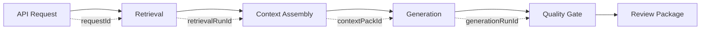

------
title: Learn AI Code Documentation & Agent Memory Platform - Part 033
description: Observability untuk AI code platforms, mencakup metrics, logs, traces, audit, retrieval diagnostics, context quality, model runs, token/cost tracking, job health, quality dashboards, and incident debugging.
series: learn-ai-code-documentation-agent-memory
seriesTitle: Learn AI Code Documentation & Agent Memory Platform
order: 33
partTitle: Observability for AI Code Platforms
tags:
- ai
- observability
- monitoring
- tracing
- metrics
- logs
- code-intelligence
- agent-platform
date: 2026-07-02
---

# Part 033 — Observability for AI Code Platforms

## 1. Tujuan Part Ini

Part 032 membahas evaluation framework. Sekarang kita membahas **observability**.

Evaluation menjawab:

> Apakah kualitas sistem membaik atau menurun?

Observability menjawab:

> Apa yang sedang terjadi di sistem saat ini, di mana bottleneck terjadi, mengapa output tertentu muncul, dan bagaimana kita men-debug failure?

AI code documentation dan agent memory platform memiliki observability yang lebih kompleks daripada aplikasi CRUD biasa karena ia menggabungkan:

- repository ingestion,
- parsing,
- graph building,
- chunking,
- embeddings,
- hybrid retrieval,
- context assembly,
- model calls,
- documentation generation,
- quality gates,
- memory maintenance,
- MCP tools,
- security filters,
- audit and governance.

Target part ini:

1. mendesain observability model end-to-end,
2. membedakan metrics, logs, traces, audit, eval, and lineage,
3. menentukan signal penting per component,
4. membuat correlation ID strategy,
5. menginstrumentasi retrieval diagnostics,
6. mengobservasi context quality dan model runs,
7. melacak token/cost,
8. memonitor jobs dan indexing health,
9. mendesain dashboards,
10. membuat playbook debugging production incidents.

---

## 2. Observability Bukan Logging Banyak-Banyak

Logging banyak tanpa struktur hanya menciptakan noise.

Observability yang baik memungkinkan kita menjawab pertanyaan spesifik:

- Kenapa search query ini tidak menemukan `RuleRegistry`?
- Kenapa generated doc menyebut stale symbol?
- Kenapa context pack terlalu besar?
- Kenapa memory lama masuk ke context?
- Kenapa embedding queue lambat?
- Kenapa token cost naik minggu ini?
- Kenapa satu tenant mengalami retrieval latency tinggi?
- Apakah permission filter menghapus candidate penting?
- Apakah MCP tool dipanggil terlalu sering oleh agent?
- Apakah doc quality turun setelah ranker update?

Untuk menjawab ini, kita butuh signal yang terstruktur.

---

## 3. Observability Primitives

| Primitive | Purpose | Example |
|---|---|---|
| metrics | aggregated numeric signal | retrieval latency p95 |
| logs | structured event detail | job failed due parser timeout |
| traces | request/workflow path | query -> retrieval -> graph -> context |
| audit | accountability | user generated doc draft |
| lineage | artifact provenance | doc -> context -> evidence |
| eval reports | quality measurement | recall@5 regression |
| diagnostics | domain-specific debug | ranker reasons, excluded chunks |

### 3.1 Jangan Campur Semua

- Audit bukan debug log.
- Eval bukan runtime monitoring.
- Trace bukan evidence map.
- Metrics bukan root cause detail.

Masing-masing punya fungsi.

---

## 4. Correlation ID Strategy

Tanpa correlation ID, debugging AI workflow sangat sulit.

### 4.1 ID yang Dibutuhkan

| ID | Scope |
|---|---|
| `requestId` | satu API/MCP request |
| `traceId` | distributed trace |
| `workflowRunId` | workflow agent/doc generation |
| `scanRunId` | repository scan |
| `jobId` | background job |
| `retrievalRunId` | hybrid retrieval execution |
| `contextPackId` | context artifact |
| `generationRunId` | doc/model generation |
| `modelRunId` | model gateway call |
| `qualityReportId` | quality gate result |
| `toolCallId` | MCP/agent tool call |
| `auditEventId` | audit event |

### 4.2 Propagation



### 4.3 Log Example

```yaml
event: context_pack_created
requestId: req_01J
workflowRunId: wf_01J
retrievalRunId: ret_01J
contextPackId: ctx_01J
repositoryId: order-service
commitSha: 6f41ab2
estimatedTokens: 11200
qualityStatus: pass_with_warnings
```

---

## 5. Metrics Taxonomy

### 5.1 Platform Metrics

- request rate,
- error rate,
- latency p50/p95/p99,
- active tenants,
- active repositories,
- indexed snapshots,
- storage usage,
- cost per tenant.

### 5.2 Indexing Metrics

- scan duration,
- files inventoried,
- parse success rate,
- parse failures by language,
- graph nodes/edges count,
- chunk count,
- embedding queue lag,
- vector upsert latency,
- indexing completion time.

### 5.3 Retrieval Metrics

- retrieval latency,
- recall proxy,
- top-k result count,
- empty result rate,
- stale result rate,
- permission-filtered candidate count,
- reranking latency,
- lexical/vector/graph contribution.

### 5.4 Context Metrics

- context pack token count,
- required evidence inclusion rate,
- context quality status,
- memory count in context,
- stale warning count,
- exclusion count,
- context assembly latency.

### 5.5 Generation Metrics

- model run latency,
- token usage,
- generation success/failure rate,
- quality gate pass rate,
- unsupported claim count,
- review approval rate,
- repair loop count.

### 5.6 Memory Metrics

- active memory count,
- candidate count,
- stale memory count,
- conflict count,
- memory usage rate,
- memory harm events,
- memory approval rate.

### 5.7 MCP / Agent Metrics

- tool calls per workflow,
- tool error rate,
- tool budget exceeded,
- disallowed tool attempts,
- resource read denied,
- workflow success rate,
- agent repair rate.

### 5.8 Security Metrics

- permission denied count,
- hidden result count,
- sensitive content blocked,
- prompt injection test detections,
- secret scan findings,
- cross-tenant access attempts,
- deletion verification failures.

---

## 6. RED and USE Applied

### 6.1 RED for Request Services

For API/MCP/retrieval:

- Rate,
- Errors,
- Duration.

Example:

```yaml
metric: retrieval_request_duration_ms
labels:
  tenantId: acme
  repositoryId: order-service
  intent: module_explanation
```

### 6.2 USE for Resources

For workers/storage/queues:

- Utilization,
- Saturation,
- Errors.

Example:

```yaml
queue:
  name: embedding-queue
  utilization: worker busy percent
  saturation: queue depth / lag
  errors: failed jobs
```

### 6.3 AI-Specific Extension

Add:

- Quality,
- Cost,
- Safety.

So for AI workflows, monitor:

```txt
Rate, Errors, Duration, Quality, Cost, Safety
```

---

## 7. Structured Logging

### 7.1 Log Schema

```yaml
timestamp: 2026-07-02T00:00:00Z
level: INFO
event: retrieval_completed
tenantId: acme
requestId: req_01J
retrievalRunId: ret_01J
repositoryId: order-service
snapshotId: snap_6f41ab2
status: ok
latencyMs: 420
safeMetadata:
  intent: module_explanation
  candidatesBeforeFilter: 84
  candidatesAfterFilter: 71
```

### 7.2 What Not to Log

Avoid by default:

- raw source code,
- raw secret-like values,
- full model prompts,
- full context packs,
- access tokens,
- hidden repository names for unauthorized user,
- stack traces in user-facing logs.

### 7.3 Log Levels

| Level | Use |
|---|---|
| DEBUG | local/dev, not raw sensitive content |
| INFO | lifecycle events |
| WARN | recoverable degradation |
| ERROR | failed operation |
| SECURITY | suspicious/blocked events |

---

## 8. Distributed Tracing

### 8.1 Trace Spans

Example retrieval trace:

```txt
API /search
  authz.check
  query_understanding
  exact_lookup
  lexical_search
  vector_search
  graph_expansion
  permission_filter
  rerank
  response_mapping
```

### 8.2 Generation Trace

```txt
workflow.generate_module_doc
  resolve_scope
  retrieve_evidence
  assemble_context
  model.generate_outline
  model.draft_section[purpose]
  model.draft_section[flow]
  claim_verification
  quality_gate
  review_package
```

### 8.3 Trace Attributes

Use safe attributes:

```yaml
attributes:
  repositoryId: order-service
  snapshotId: snap_6f41ab2
  docType: module_doc
  contextTokenEstimate: 11200
  modelUseCase: section_drafting
```

Do not attach raw source to spans.

---

## 9. Retrieval Diagnostics

Retrieval diagnostics are domain-specific observability.

### 9.1 Required Diagnostics

For each retrieval run:

- query understanding,
- detected intent,
- retrievers used,
- raw candidate counts,
- permission exclusions,
- stale exclusions,
- ranker version,
- top result reasons,
- empty-result explanation,
- index versions.

### 9.2 Diagnostic Example

```yaml
retrievalDiagnostics:
  retrievalRunId: ret_01J
  query: "where are validation rules registered?"
  intent: code_location
  retrievers:
    exact:
      candidates: 0
    lexical:
      candidates: 12
    vector:
      candidates: 40
    graph:
      candidates: 8
  merge:
    before: 60
    after: 44
  filters:
    permissionDenied: 3
    staleExcluded: 1
  topResults:
    - artifactId: chunk_rule_registry
      score: 0.91
      reasons:
        - semantic_match
        - same_module
        - primary_source
```

### 9.3 Empty Result Debugging

If no results:

```yaml
emptyResultReason:
  possibleCauses:
    - snapshot_not_fully_indexed
    - query_too_narrow
    - permission_filter_removed_all
    - language_not_supported
```

---

## 10. Context Observability

### 10.1 Context Quality Metrics

- token budget used,
- required evidence included,
- source/test/doc/memory distribution,
- stale warnings,
- missing evidence warnings,
- excluded due permission,
- excluded due token budget,
- memory count and memory type.

### 10.2 Context Pack Summary

```yaml
contextPackSummary:
  contextPackId: ctx_01J
  taskType: generate_module_doc
  estimatedTokens: 11200
  budget: 12000
  items:
    source: 8
    tests: 3
    docs: 2
    memory: 2
    graphPaths: 1
  warnings:
    - missing_adr
```

### 10.3 Debug Question

When generated doc is wrong, ask:

- Was correct evidence retrieved?
- Was it included in context?
- Was it compressed incorrectly?
- Was stale memory included?
- Was warning ignored?
- Did token budget exclude required test?

Context observability answers these.

---

## 11. Model Run Observability

### 11.1 Model Run Metadata

Track:

- use case,
- model alias,
- provider alias,
- prompt template version,
- context pack ID,
- input/output token count,
- latency,
- status,
- error code,
- output artifact ID,
- cost estimate,
- safety filter result.

### 11.2 Example

```yaml
modelRun:
  modelRunId: mr_01J
  useCase: documentation_section_drafting
  promptTemplateVersion: module-section-v2
  contextPackId: ctx_01J
  inputTokens: 9200
  outputTokens: 1300
  latencyMs: 8400
  status: success
```

### 11.3 Cost Attribution

Attribute token/cost to:

- tenant,
- repository,
- workflow,
- use case,
- model alias,
- user/team.

### 11.4 Failure Categories

- timeout,
- rate limited,
- invalid input,
- safety blocked,
- provider unavailable,
- output parse failed,
- quality gate failed.

---

## 12. Documentation Observability

### 12.1 Doc Pipeline Metrics

- docs generated,
- docs approved,
- docs rejected,
- quality pass rate,
- unsupported claim count,
- repair attempts,
- stale docs,
- time to review,
- review comments by category.

### 12.2 Quality Trend

```yaml
docQualityTrend:
  week: 2026-W27
  generatedDocs: 120
  passRate: 0.86
  averageUnsupportedClaims: 0.4
  reviewApprovalRate: 0.72
```

### 12.3 Failure Drilldown

For failed docs:

- unsupported claims,
- missing citations,
- missing sections,
- stale evidence,
- security findings,
- style issues.

---

## 13. Memory Observability

### 13.1 Memory Health

Track:

- active memory by scope,
- candidate backlog,
- stale memory,
- conflicted memory,
- expired memory,
- memory included in context,
- memory helpful/harmful feedback.

### 13.2 Memory Incident Debugging

If bad memory caused output:

1. find generated doc,
2. find context pack,
3. find memory item,
4. inspect memory evidence,
5. inspect memory state history,
6. invalidate if needed,
7. add regression eval.

### 13.3 Memory Dashboard Example

```yaml
memoryHealth:
  repositoryId: order-service
  active: 84
  stale: 7
  conflicted: 2
  pendingCandidates: 12
  harmEventsLast30d: 1
```

---

## 14. Job and Queue Observability

### 14.1 Queue Metrics

- queue depth,
- oldest job age,
- processing rate,
- retry count,
- dead-letter count,
- worker utilization,
- job duration p95.

### 14.2 Pipeline Health

```yaml
indexPipeline:
  repositoryId: order-service
  snapshotId: snap_6f41ab2
  stages:
    ingestion: completed
    parsing: completed_with_warnings
    graph: completed
    chunks: completed
    embeddings: partial
```

### 14.3 Worker Failure Drilldown

Track failures by:

- worker type,
- job type,
- processor version,
- language,
- repository,
- file kind,
- error code.

### 14.4 Alert Examples

- embedding queue lag > threshold,
- parse failure rate spikes after parser release,
- vector upsert failures,
- doc generation queue saturated,
- dead-letter count increasing.

---

## 15. MCP and Agent Observability

### 15.1 MCP Metrics

- tool calls by tool,
- tool latency,
- tool errors,
- resource reads,
- permission denied,
- output truncations,
- budget exceeded,
- disallowed tool attempts.

### 15.2 Agent Workflow Metrics

- workflow success rate,
- steps per workflow,
- tool calls per workflow,
- repair loop rate,
- gap report rate,
- quality pass rate,
- review approval rate.

### 15.3 Suspicious Patterns

- repeated resource URI guessing,
- many broad cross-repo searches,
- tool budget repeatedly exceeded,
- agent trying denied write tools,
- large file span requests.

---

## 16. Security Observability

### 16.1 Security Signals

- permission denied count,
- hidden result count,
- sensitive content blocked,
- secret scan findings,
- prompt injection fixture detections,
- cross-tenant attempt,
- admin audit access,
- deletion verification failures.

### 16.2 Security Alerts

Examples:

```yaml
alert:
  name: repeated_hidden_resource_access
  condition: permission_denied_resource_read > threshold
  severity: high
```

```yaml
alert:
  name: deleted_data_still_searchable
  condition: deletion_verification_failure
  severity: critical
```

### 16.3 Security Dashboards

Show:

- top denied actions,
- sensitive retrieval attempts,
- blocked content,
- deletion status,
- admin actions,
- MCP denied tools.

---

## 17. Cost Observability

### 17.1 Cost Metrics

- embedding tokens,
- generation tokens,
- model calls,
- vector records,
- storage usage,
- search calls,
- cost per generated doc,
- cost per approved doc,
- cost per repository scan,
- cost by tenant/team/repo.

### 17.2 Cost Attribution

```yaml
costEvent:
  tenantId: acme
  repositoryId: order-service
  workflowRunId: wf_01J
  useCase: generate_module_doc
  modelRunId: mr_01J
  inputTokens: 9200
  outputTokens: 1300
```

### 17.3 Cost Anomaly Detection

Alert if:

- embedding cost spikes,
- repeated regeneration loop,
- one tenant consumes unusual quota,
- vector count grows unexpectedly,
- generated/vendor files embedded accidentally.

---

## 18. Dashboards

### 18.1 Executive / Manager Dashboard

- docs coverage,
- stale docs,
- doc debt,
- review backlog,
- cost trend,
- platform adoption.

### 18.2 Platform Engineering Dashboard

- API latency,
- queue lag,
- job failures,
- index health,
- storage usage,
- worker utilization.

### 18.3 AI Quality Dashboard

- retrieval recall eval trend,
- doc quality pass rate,
- unsupported claims,
- memory harm,
- workflow success.

### 18.4 Security Dashboard

- permission denied,
- blocked sensitive content,
- prompt injection eval,
- deletion proof,
- admin actions.

### 18.5 Repository Owner Dashboard

For one repo:

- indexing status,
- docs health,
- memory health,
- recent generated docs,
- stale sections,
- impacted docs after changes.

---

## 19. Alerting Strategy

### 19.1 Alert Categories

| Category | Example |
|---|---|
| availability | API down |
| latency | retrieval p95 high |
| correctness | quality pass rate drops |
| security | permission leak test fails |
| cost | token usage spike |
| indexing | queue lag high |
| data lifecycle | deletion verification failed |

### 19.2 Avoid Alert Fatigue

Alert on symptoms and high-impact conditions.

Dashboard lower-priority signals.

### 19.3 Alert Examples

```yaml
alert: retrieval_latency_high
condition: retrieval_p95_ms > threshold for 10m
severity: medium
```

```yaml
alert: quality_gate_regression
condition: doc_quality_pass_rate drops below baseline
severity: high
```

```yaml
alert: permission_eval_failure
condition: security_eval_unauthorized_result > 0
severity: critical
```

---

## 20. Incident Debugging Playbooks

### 20.1 Bad Generated Doc

Steps:

1. get document ID,
2. read quality report,
3. inspect unsupported claims,
4. inspect context pack,
5. inspect retrieval run,
6. inspect memory included,
7. inspect source evidence,
8. classify root cause,
9. fix and add eval.

### 20.2 Missing Search Result

Steps:

1. check snapshot indexing status,
2. check file classification,
3. check symbol/chunk presence,
4. check lexical/vector index record,
5. inspect retrieval diagnostics,
6. check permission filter,
7. inspect ranker reasons.

### 20.3 Stale Memory Used

Steps:

1. find context pack memory items,
2. check memory state,
3. inspect last validation,
4. inspect source graph diff,
5. invalidate/revalidate memory,
6. add memory eval.

### 20.4 Cost Spike

Steps:

1. identify tenant/repo/workflow,
2. inspect model runs,
3. inspect embedding jobs,
4. check regeneration loops,
5. check chunk explosion,
6. apply budget/backpressure.

### 20.5 Permission Leak Suspected

Steps:

1. freeze relevant audit events,
2. identify user/action/resource,
3. inspect policy decision,
4. inspect retrieval filters,
5. inspect cache access version,
6. invalidate caches,
7. remove exposed artifacts,
8. add regression test.

---

## 21. Observability Data Retention

### 21.1 Retention by Signal

| Signal | Retention |
|---|---|
| metrics | aggregated long-term |
| logs | short/medium |
| traces | short |
| audit | long |
| context packs | medium/policy |
| model run metadata | medium |
| quality reports | medium/long |
| eval results | long |
| cost records | medium/long |

### 21.2 Sensitive Observability

Observability data itself can leak information.

Apply:

- access control,
- redaction,
- aggregation,
- retention,
- tenant isolation.

---

## 22. Observability Implementation Checklist

### 22.1 Instrument Everything

- API,
- workers,
- queues,
- retrieval,
- context,
- generation,
- model gateway,
- memory,
- MCP,
- policy engine.

### 22.2 Standard Labels

Use consistent labels:

```txt
tenantId, repositoryId, snapshotId, workflowName, jobType, toolName, docType, modelUseCase
```

Be careful with high-cardinality labels.

### 22.3 Cardinality Control

Do not label metrics with:

- raw query,
- full path,
- user ID if high-cardinality,
- document ID for high-volume metrics.

Use logs/traces for high-cardinality detail.

---

## 23. Common Mistakes

### 23.1 No Correlation IDs

Impossible to connect doc output to retrieval/context/model.

### 23.2 Logging Raw Source

Security risk.

### 23.3 Metrics Without Dimensions

Cannot isolate tenant/repo/workflow issues.

### 23.4 No Retrieval Diagnostics

Search quality becomes guesswork.

### 23.5 No Cost Attribution

Cost optimization impossible.

### 23.6 Audit and Observability Mixed

Audit needs accountability and retention.

### 23.7 No Context Observability

Generated output cannot be debugged.

### 23.8 Alerts on Every Warning

Alert fatigue.

---

## 24. Practical Exercise

Design observability for this platform.

### 24.1 Required Output

Create:

```txt
observability-plan.md
metrics-catalog.yaml
log-event-catalog.yaml
trace-span-design.md
retrieval-diagnostics.yaml
model-run-observability.yaml
dashboard-spec.md
alert-rules.yaml
incident-playbooks.md
```

### 24.2 Required Dashboards

1. platform health,
2. indexing health,
3. retrieval quality,
4. documentation quality,
5. memory health,
6. MCP/agent usage,
7. cost,
8. security.

### 24.3 Acceptance Criteria

- correlation IDs defined,
- metrics per component defined,
- logs avoid raw source,
- traces cover retrieval/context/generation,
- retrieval diagnostics stored,
- model token/cost tracked,
- dashboards actionable,
- incident playbooks included,
- retention policy defined.

---

## 25. Summary

Observability makes the AI code platform debuggable, governable, and operable.

Key points:

1. observability is not just logs,
2. correlation IDs connect retrieval, context, generation, quality, and review,
3. retrieval diagnostics are mandatory for search quality,
4. context pack observability explains model behavior,
5. model runs need token/cost/latency tracking,
6. jobs and queues need stage-level health,
7. memory observability tracks usefulness and harm,
8. MCP tools need usage, error, and security signals,
9. observability data must also be protected,
10. incident playbooks turn signals into action.

Part berikutnya membahas **Performance, Cost, and Scale**: how to scale ingestion, parsing, graph, search, vector indexing, model usage, context assembly, storage, and multi-tenant workloads without losing quality or safety.
