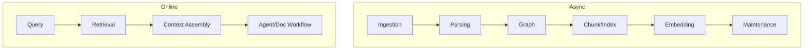

------
title: Learn AI Code Documentation & Agent Memory Platform - Part 034
description: Performance, cost, and scale untuk AI code documentation dan agent memory platform, mencakup ingestion scale, parsing throughput, graph/query performance, vector cost, model usage, caching, multi-tenant fairness, and capacity planning.
series: learn-ai-code-documentation-agent-memory
seriesTitle: Learn AI Code Documentation & Agent Memory Platform
order: 34
partTitle: Performance, Cost, and Scale
tags:
- ai
- performance
- cost-optimization
- scalability
- capacity-planning
- code-intelligence
- vector-search
- platform-architecture
date: 2026-07-02
---

# Part 034 — Performance, Cost, and Scale

## 1. Tujuan Part Ini

Part 033 membahas observability. Sekarang kita membahas **performance, cost, and scale**.

AI code documentation dan agent memory platform memiliki workload yang tidak seragam:

- ingestion repository besar,
- parsing banyak bahasa,
- graph build incremental,
- chunking source/docs/schema,
- embeddings jutaan chunks,
- vector search,
- lexical search,
- context assembly token-heavy,
- model generation expensive,
- memory maintenance,
- multi-repo workflows,
- MCP interactive traffic.

Target part ini:

1. memahami scaling dimension per component,
2. mendesain throughput dan latency goals,
3. mengoptimalkan ingestion/parsing/graph/indexing,
4. mengontrol embedding dan model cost,
5. mendesain caching strategy,
6. menerapkan multi-tenant fairness,
7. membuat capacity planning,
8. menghindari cost explosion,
9. menjaga quality dan security saat scale meningkat,
10. menyiapkan production readiness Part 035.

---

## 2. Scale Mental Model

Platform punya dua workload utama:

### 2.1 Offline / Async Workload

- repository scanning,
- parsing,
- graph building,
- chunking,
- embeddings,
- stale detection,
- memory revalidation,
- doc generation.

Optimization target:

- throughput,
- cost,
- reliability,
- backpressure.

### 2.2 Online / Interactive Workload

- search,
- symbol lookup,
- graph neighborhood,
- context pack assembly,
- MCP tool call,
- reading docs/memory.

Optimization target:

- latency,
- correctness,
- permission safety,
- result quality.



Do not optimize both with the same strategy.

---

## 3. Main Cost Drivers

| Driver | Why Expensive |
|---|---|
| embeddings | token volume and provider/index cost |
| doc generation | model input/output tokens |
| repeated reindex | duplicate work |
| huge chunks | token and vector noise |
| multi-branch indexing | multiplier |
| multi-repo graph | traversal and context cost |
| stale regeneration loops | repeated model calls |
| broad agent searches | interactive cost |
| storing old vectors | storage cost |
| logs/context retention | sensitive storage cost |

### 3.1 Cost Equation

```txt
Total Cost =
  ingestion compute
+ parsing compute
+ graph compute/storage
+ lexical index storage
+ vector embedding + storage + query
+ model generation tokens
+ object storage
+ observability/audit storage
+ operational overhead
```

### 3.2 Quality-Cost Tension

Cheap retrieval that misses evidence causes bad docs. Expensive context that includes everything causes latency and cost.

Optimize for:

```txt
useful evidence per token
```

---

## 4. Performance Goals

### 4.1 Define Workload Classes

| Workload | Goal Type |
|---|---|
| search | low latency |
| get symbol/file | very low latency |
| graph neighborhood | bounded latency |
| context assembly | medium latency |
| doc generation | async completion |
| repository scan | throughput |
| embeddings | throughput/cost |
| stale detection | freshness latency |

### 4.2 Example SLO Style

Do not copy numbers blindly, but define targets like:

```yaml
slo:
  getSymbolP95: low
  searchP95: bounded
  contextAssemblyP95: bounded
  repositoryScanCompletion: within policy
  vectorIndexLag: within policy
  permissionLeak: zero known
```

### 4.3 Quality and Safety Are Non-Negotiable

Never reduce cost by bypassing:

- permission checks,
- redaction,
- evidence requirements,
- quality gates.

---

## 5. Ingestion Scale

### 5.1 Bottlenecks

- Git clone/fetch,
- large repository size,
- many branches,
- submodules,
- LFS,
- file enumeration,
- hashing.

### 5.2 Optimizations

- shallow fetch when possible,
- bare mirror cache,
- incremental fetch,
- branch filtering,
- skip unneeded refs,
- file size limits,
- streaming file inventory,
- batch DB writes,
- content hash cache,
- scan coalescing.

### 5.3 Mirror Strategy

For frequently scanned repos:

```txt
maintain local bare mirror -> checkout snapshots from mirror
```

Benefits:

- faster fetch,
- less provider load,
- better incremental scans.

### 5.4 Coalescing

If many commits arrive quickly:

```txt
index latest commit, supersede old low-priority scans
```

For PR workflows, still index specific PR commit if needed.

---

## 6. Parsing and Extraction Throughput

### 6.1 Bottlenecks

- CPU,
- parser startup,
- large files,
- unsupported syntax,
- memory,
- framework extraction.

### 6.2 Optimizations

- parallel file parsing,
- worker pool per language,
- parser instance reuse,
- skip generated/vendor,
- parse changed files only,
- precompute language detection,
- timeout per file,
- store parser diagnostics,
- batch symbol writes.

### 6.3 Incremental Parsing

If file hash unchanged:

```txt
reuse parse/symbol output
```

If parser version changed:

```txt
reparse only affected languages/snapshots by priority
```

### 6.4 Large File Policy

Options:

- skip,
- metadata-only,
- partial parse,
- chunk by sections,
- require manual config.

Avoid letting one huge file block repo.

---

## 7. Graph Scale

### 7.1 Graph Size Drivers

- symbols,
- call edges,
- imports,
- tests,
- docs links,
- API/event/data edges,
- cross-repo edges,
- snapshot versions.

### 7.2 Optimization Principles

- store graph per snapshot/version,
- use logical IDs for diff,
- build incrementally,
- separate high-confidence edges from inferred edges,
- limit traversal depth,
- precompute common neighborhoods,
- store graph summaries.

### 7.3 Query Performance

Common queries:

- outgoing edges by node/type,
- incoming edges by node/type,
- tests for symbol,
- docs for symbol,
- API flow,
- impact from changed symbol.

Index for these.

### 7.4 Graph Diff Optimization

Do not compare entire graph if only few files changed.

Use affected logical nodes:

```yaml
affectedNodes:
  - OrderValidator.validate
  - RuleRegistry
```

Then compute local diff and downstream impact.

---

## 8. Chunking Scale

### 8.1 Chunk Explosion

Too many chunks cause:

- high embedding cost,
- noisy search,
- large indexes,
- slower retrieval,
- more storage.

### 8.2 Controls

- skip vendor/generated,
- combine tiny related chunks,
- split only huge units,
- avoid block chunks unless needed,
- deduplicate identical chunks,
- chunk by semantic units,
- store metadata-only for low-value files.

### 8.3 Chunk Budget per Repo

Track:

```yaml
chunkStats:
  totalChunks: 12420
  sourceChunks: 7200
  docChunks: 800
  testChunks: 2200
  configChunks: 320
  generatedSkipped: 1800
```

Alert on unexpected chunk growth.

---

## 9. Embedding Cost Optimization

### 9.1 Biggest Cost Risk

Embedding every chunk on every commit.

### 9.2 Required Controls

- content hash cache,
- embedding input hash,
- chunk diff,
- skip unchanged chunks,
- skip low-value chunks,
- batch embeddings,
- priority queues,
- budget guard,
- lazy embedding for cold repos.

### 9.3 Embedding Eligibility

Embed:

- source methods/classes,
- docs sections,
- APIs/schemas,
- memory,
- runbooks.

Skip or deprioritize:

- generated code,
- vendor,
- lockfiles,
- huge configs,
- low-value boilerplate,
- stale/deprecated docs unless needed.

### 9.4 Embedding Cache

```txt
cacheKey = hash(modelId, templateVersion, inputHash)
```

### 9.5 Reembedding Strategy

When model/template changes:

- do not reembed all at once,
- prioritize active repos,
- query both old/new during migration if needed,
- track coverage.

---

## 10. Vector Index Scale

### 10.1 Index Size Drivers

- number of chunks,
- vector dimensions,
- snapshots retained,
- tenants,
- duplicated branches,
- memory/docs versions.

### 10.2 Optimization

- retain latest active snapshots,
- delete vectors for expired snapshots,
- namespace by tenant/sensitivity,
- store metadata carefully,
- compact old docs/memory,
- avoid duplicate chunks.

### 10.3 Query Performance

Vector query cost depends on:

- namespace size,
- filters,
- topK,
- index type,
- metadata filtering efficiency.

### 10.4 TopK Discipline

```yaml
vectorTopK: 50
afterFilter: 20
afterRerank: 8
contextItems: 4-12
```

Huge topK often hides poor retrieval design.

---

## 11. Lexical Search Scale

### 11.1 Strength

Lexical search is cheaper and excellent for:

- identifiers,
- paths,
- endpoints,
- config keys,
- errors,
- event topics.

### 11.2 Optimize

- field boosts,
- analyzers for code identifiers,
- exact fields for qualified names,
- prefix/path indexes,
- per-tenant filters,
- snapshot filters,
- result caching.

### 11.3 Use Lexical to Reduce Vector Cost

Query router should detect exact/identifier queries and avoid vector call when unnecessary.

---

## 12. Retrieval Performance

### 12.1 Latency Components

```txt
query understanding
+ exact lookup
+ lexical search
+ vector search
+ graph expansion
+ permission filtering
+ reranking
+ response mapping
```

### 12.2 Optimization

- parallel lexical/vector search,
- skip vector for exact query,
- cache graph neighborhoods,
- precompute common symbol relations,
- limit graph depth,
- use efficient permission filters,
- rerank fewer candidates,
- return resource URIs instead of full content.

### 12.3 Retrieval Cache

Cache by:

```txt
tenant + principalAccessVersion + scope + query + filters + indexVersion
```

Do not cache across permission contexts unsafely.

### 12.4 Empty Result Handling

Empty result can trigger broad expensive fallback. Limit fallback count and use diagnostics.

---

## 13. Context Assembly Performance

### 13.1 Bottlenecks

- many candidates,
- token estimation,
- reading chunk content,
- compression,
- graph summaries,
- memory selection,
- citation map generation.

### 13.2 Optimization

- rank before reading full content,
- store token estimates,
- use content refs lazily,
- precompute summaries for large chunks,
- limit docs/memory count,
- cache context packs for identical task/scope,
- incremental context refresh.

### 13.3 Context Cost

Context cost is model input cost.

Optimize by:

- selecting fewer but better chunks,
- compressing supporting evidence,
- keeping target evidence raw,
- excluding stale/noisy docs,
- avoiding duplicate chunks.

### 13.4 Quality Guard

Do not compress away evidence needed for citation.

---

## 14. Documentation Generation Cost

### 14.1 Cost Drivers

- context size,
- output length,
- section count,
- repair attempts,
- claim verification,
- repeated regeneration,
- low-quality retrieval causing retries.

### 14.2 Optimization

- generate outline first,
- draft sections independently,
- regenerate only stale sections,
- reuse context packs,
- cap repair loops,
- use cheaper deterministic checks where possible,
- avoid generating docs with insufficient evidence.

### 14.3 Cost per Approved Doc

Track:

```txt
cost per generated doc
cost per approved doc
cost per published doc
```

A high generation count with low approval rate is waste.

### 14.4 Diff-Aware Regeneration

Most cost savings come from updating only affected sections.

---

## 15. Claim Verification Cost

### 15.1 Verification Layers

Cheap checks:

- citation exists,
- evidence ID valid,
- source snapshot matches,
- required sections.

More expensive:

- semantic claim support,
- contradiction detection,
- model-based verification.

### 15.2 Tiered Verification

```yaml
verification:
  tier1: deterministic
  tier2: heuristic
  tier3: model_based_if_needed
```

Only run expensive verification for claims that pass cheaper filters but remain uncertain.

---

## 16. Memory Scale

### 16.1 Memory Growth Risks

- agents create too many candidates,
- duplicate conventions,
- task-specific memory never expires,
- stale memory retained,
- low-value memory retrieved often.

### 16.2 Controls

- candidate review,
- deduplication,
- scope limits,
- expiry,
- pruning,
- usefulness metrics,
- conflict detection,
- retrieval caps.

### 16.3 Memory Retrieval Cost

Memory should be small, indexed, and scoped.

Avoid searching global memory for every task.

Search order:

```txt
task scope -> module -> repository -> team -> org
```

Stop when enough high-quality memory found.

---

## 17. Multi-Tenant Fairness

### 17.1 Problem

One large tenant/repo can consume all resources.

### 17.2 Controls

- per-tenant quotas,
- per-tenant queue concurrency,
- rate limits,
- budget limits,
- priority classes,
- backpressure,
- noisy-neighbor detection.

### 17.3 Fair Scheduling

```yaml
limits:
  maxConcurrentScansPerTenant: 3
  maxEmbeddingJobsPerTenant: 10
  maxGenerationJobsPerTenant: 5
```

### 17.4 Graceful Degradation

If tenant exceeds budget:

- pause low-priority jobs,
- allow read-only search,
- delay embeddings,
- use lexical/graph fallback,
- warn user.

---

## 18. Caching Strategy

### 18.1 Cache Layers

| Cache | Purpose |
|---|---|
| repository metadata | branch/commit resolution |
| file span cache | repeated reads |
| symbol cache | exact lookup |
| graph neighborhood cache | context/retrieval |
| retrieval result cache | repeated queries |
| context pack cache | repeated tasks |
| embedding cache | avoid reembedding |
| model output cache | limited/idempotent generation |
| permission cache | faster authz |

### 18.2 Cache Safety

Cache key must include:

- tenant,
- principal/access version,
- repository,
- snapshot,
- policy version,
- processor/index version.

### 18.3 Cache Invalidation

Invalidate on:

- new snapshot,
- permission change,
- policy change,
- source deletion,
- index rebuild,
- memory state change.

---

## 19. Storage Scale

### 19.1 Growth Areas

- source snapshots,
- chunks,
- vectors,
- graph edges,
- context packs,
- model run artifacts,
- audit logs,
- eval results.

### 19.2 Retention Controls

- expire old snapshots,
- delete vectors for old snapshots,
- compress archives,
- store large artifacts in object store,
- aggregate metrics,
- archive old audit if allowed,
- prune memory.

### 19.3 Partitioning

Partition large relational tables by:

- tenant,
- repository,
- created_at,
- snapshot.

### 19.4 Rebuildability

Indexes should be rebuildable. Audit and review records are not easily rebuildable, so protect them.

---

## 20. Capacity Planning

### 20.1 Inputs

Collect:

- number of tenants,
- repositories per tenant,
- average repo size,
- files per repo,
- commits per day,
- docs generated per day,
- search queries per day,
- agent workflows per day,
- retention period,
- language mix,
- embedding model dimensions,
- average chunks per file.

### 20.2 Estimate Indexing Load

```txt
dailyChangedFiles =
  repos * commitsPerRepoPerDay * avgChangedFilesPerCommit
```

### 20.3 Estimate Embedding Load

```txt
dailyEmbeddingTokens =
  changedChunksPerDay * avgTokensPerEmbeddingInput
```

### 20.4 Estimate Generation Load

```txt
dailyGenerationTokens =
  docsGeneratedPerDay * avgContextTokens + avgOutputTokens
```

### 20.5 Capacity Model Example

```yaml
capacity:
  repos: 500
  avgFilesPerRepo: 3000
  changedFilesPerDay: 25000
  avgChunksPerChangedFile: 3
  avgEmbeddingTokens: 450
  estimatedEmbeddingTokensPerDay: 33750000
```

---

## 21. Performance Testing

### 21.1 Load Tests

Test:

- repository scan throughput,
- parse throughput,
- embedding pipeline,
- search latency,
- graph neighborhood latency,
- context assembly,
- document generation queue.

### 21.2 Stress Tests

Push beyond expected capacity.

Observe:

- queue lag,
- worker saturation,
- DB latency,
- index latency,
- error rate,
- backpressure.

### 21.3 Soak Tests

Run for long duration.

Find:

- memory leaks,
- queue buildup,
- storage growth,
- retry storms,
- cost drift.

### 21.4 Security Under Load

Ensure permission filters remain correct under caching and high concurrency.

---

## 22. Benchmark Fixtures

### 22.1 Repository Sizes

Create fixtures:

| Size | Files | Purpose |
|---|---:|---|
| small | 100 | fast tests |
| medium | 5,000 | normal repo |
| large | 50,000 | scale |
| monorepo | 200,000+ | stress |
| multi-repo | many services | cross-repo graph |

### 22.2 Content Mix

Include:

- source,
- tests,
- docs,
- generated files,
- vendor,
- config,
- contracts,
- large files,
- stale docs.

### 22.3 Benchmark Outputs

Track:

- scan time,
- parse time,
- graph build time,
- chunk count,
- embedding count,
- search latency,
- context assembly latency,
- cost estimate.

---

## 23. Degradation Modes

### 23.1 Vector Index Down

Fallback:

- lexical search,
- exact lookup,
- graph search,
- warning.

### 23.2 Embedding Queue Backlogged

Fallback:

- partial vector search,
- prioritize active repos,
- delay cold repos.

### 23.3 Model Gateway Rate Limited

Fallback:

- queue generation,
- return pending state,
- skip non-critical repair,
- use gap report if needed.

### 23.4 Graph Service Slow

Fallback:

- exact/lexical/vector retrieval,
- cached graph summaries,
- warn graph context partial.

### 23.5 Search Index Rebuilding

Fallback:

- use previous index if safe,
- return indexing status,
- disable affected queries temporarily.

---

## 24. Cost Guardrails

### 24.1 Budget Types

| Budget | Example |
|---|---|
| tenant budget | monthly token limit |
| repo budget | max scans/day |
| workflow budget | max model calls |
| context budget | max tokens |
| embedding budget | max tokens/day |
| eval budget | max eval runs/day |

### 24.2 Guardrail Example

```yaml
budgetGuard:
  type: workflow
  workflow: generate_module_documentation
  maxModelCalls: 8
  maxInputTokens: 60000
  maxRepairAttempts: 2
```

### 24.3 Cost-Aware UX

Tell user:

- generation queued,
- partial index,
- budget exceeded,
- lower-cost alternative available.

### 24.4 Avoid Hidden Cost

Agent loops can silently spend. Tool budgets and workflow budgets are mandatory.

---

## 25. Optimization Roadmap

### 25.1 First Optimize Waste

- skip generated/vendor,
- cache embeddings,
- avoid full reindex,
- cap context,
- avoid repeated generation,
- remove duplicate chunks.

### 25.2 Then Optimize Latency

- parallel retrieval,
- cache graph,
- index fields,
- reduce topK,
- precompute summaries.

### 25.3 Then Optimize Architecture

- separate worker pools,
- split storage,
- tenant isolation,
- advanced graph store,
- dedicated vector cluster.

### 25.4 Do Not Prematurely Overbuild

Start with simple architecture but collect metrics from day one.

---

## 26. Performance Anti-Patterns

### 26.1 Embedding Everything

Most expensive and noisy.

### 26.2 Retaining Every Snapshot Forever

Storage explosion.

### 26.3 Reindexing Whole Repo on Every Commit

Wasteful.

### 26.4 Huge Context Packs

Higher cost and worse model focus.

### 26.5 No Tenant Quotas

Noisy neighbor problem.

### 26.6 Caching Without Permission Version

Security bug.

### 26.7 No Cost Attribution

Cannot optimize.

### 26.8 Optimizing Latency by Removing Safety Checks

Never acceptable.

---

## 27. Practical Exercise

Design performance and cost plan.

### 27.1 Required Output

Create:

```txt
performance-plan.md
capacity-model.yaml
cost-model.yaml
queue-scaling-policy.yaml
embedding-budget-policy.yaml
context-budget-policy.yaml
cache-strategy.md
degradation-modes.md
load-test-plan.md
```

### 27.2 Required Scenarios

1. first full scan of large repo,
2. incremental scan after small commit,
3. embedding provider backlog,
4. high traffic MCP search,
5. generating docs for 100 modules,
6. multi-repo capability doc generation,
7. tenant exceeds budget,
8. vector index down,
9. permission change invalidates caches.

### 27.3 Acceptance Criteria

- async and online workloads separated,
- cost drivers identified,
- budgets defined,
- cache keys include permission/index versions,
- degradation modes safe,
- capacity model includes embeddings and generation,
- load tests defined,
- quality/security not sacrificed.

---

## 28. Summary

Performance, cost, and scale require system-level thinking.

Key points:

1. separate async indexing from online retrieval,
2. biggest cost drivers are embeddings, model generation, and repeated reprocessing,
3. incremental indexing is mandatory,
4. vector search is useful but must be controlled,
5. lexical/exact/graph retrieval reduce vector dependence,
6. context tokens are model cost,
7. memory needs pruning and scope limits,
8. multi-tenant fairness prevents noisy neighbors,
9. caching must be permission-safe,
10. production scale needs capacity planning, load testing, budget guardrails, and degradation modes.

Part berikutnya adalah seri terakhir: **Capstone and Production Readiness**. Kita akan menyatukan seluruh part menjadi build plan end-to-end, production checklist, maturity model, capstone implementation roadmap, and what it takes to operate this platform like top-tier engineering teams.
