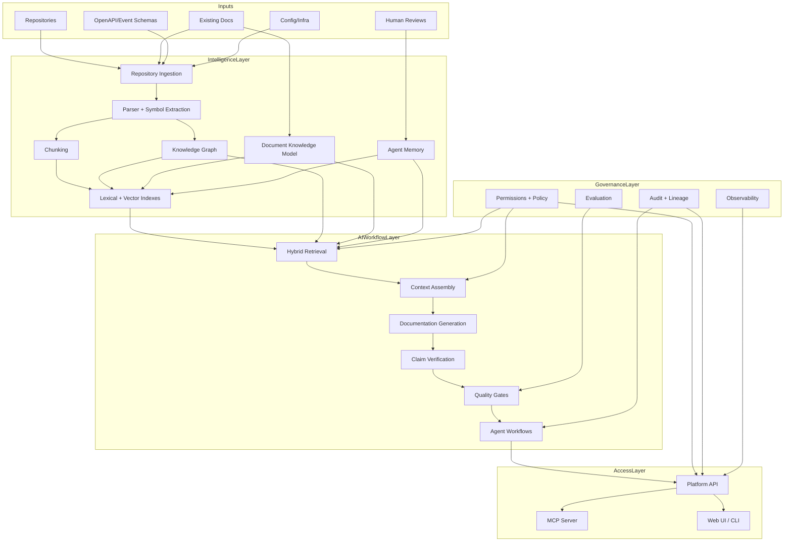
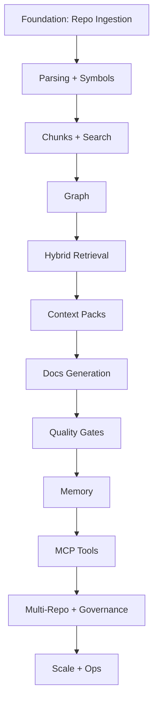

------
title: Learn AI Code Documentation & Agent Memory Platform - Part 035
description: Capstone and production readiness untuk membangun, meluncurkan, mengoperasikan, mengevaluasi, dan menskalakan AI code documentation and agent memory platform secara end-to-end.
series: learn-ai-code-documentation-agent-memory
seriesTitle: Learn AI Code Documentation & Agent Memory Platform
order: 35
partTitle: Capstone and Production Readiness
tags:
- ai
- capstone
- production-readiness
- code-intelligence
- documentation
- agent-memory
- platform-engineering
- software-architecture
date: 2026-07-02
---

# Part 035 — Capstone and Production Readiness

## 1. Tujuan Part Ini

Ini adalah part terakhir dari seri **Build From Scratch: AI Code Documentation and Agent Memory Platform**.

Dari Part 001 sampai Part 034, kita membangun mental model, architecture, storage, retrieval, docs generation, agent memory, MCP, security, evaluation, observability, performance, and scale.

Part ini menyatukan semuanya menjadi capstone:

- bagaimana memulai implementation dari nol,
- bagaimana membangun MVP yang benar,
- bagaimana menaikkan maturity secara bertahap,
- bagaimana menghindari jebakan arsitektur,
- bagaimana memastikan production readiness,
- bagaimana mengukur keberhasilan,
- bagaimana mengoperasikan platform ini sebagai produk internal,
- bagaimana berpikir seperti top-tier software engineer ketika membangun AI developer tooling.

Target part ini:

1. membuat end-to-end build plan,
2. menyusun milestone dari prototype sampai production,
3. mendefinisikan capstone architecture,
4. membuat readiness checklist,
5. membuat maturity model,
6. membuat release strategy,
7. membuat operating model,
8. membuat risk register,
9. membuat decision checklist,
10. menutup seri dengan peta kemampuan yang harus dikuasai.

---

## 2. Apa yang Sebenarnya Kita Bangun

Platform ini bukan sekadar "generate docs from code".

Platform ini adalah:

> Evidence-based repository intelligence platform that turns one or more repositories into searchable, auditable, permission-aware knowledge for humans and AI agents.

Ia memiliki beberapa surface utama:

1. **Human documentation**
   - repository overview,
   - module docs,
   - API docs,
   - event docs,
   - architecture docs,
   - runbooks,
   - impact reports.

2. **Agent context**
   - context packs,
   - exact source evidence,
   - graph paths,
   - tests,
   - constraints,
   - memory,
   - warnings.

3. **Agent memory**
   - conventions,
   - decisions,
   - known pitfalls,
   - evaluation lessons,
   - review feedback,
   - scoped durable knowledge.

4. **Repository intelligence**
   - symbols,
   - chunks,
   - graph,
   - docs model,
   - memory model,
   - provenance.

5. **Governance**
   - permissions,
   - audit,
   - evidence,
   - review,
   - quality gates,
   - retention,
   - deletion.

Jika salah satu bagian ini hilang, platform akan terasa pintar tetapi tidak trustworthy.

---

## 3. Capstone System Diagram



---

## 4. End-to-End User Journeys

### 4.1 Journey 1 — Engineer Generates Module Docs

User asks:

```txt
Generate documentation for order validation module.
```

System flow:

1. resolve module scope,
2. retrieve source/tests/docs/graph/memory,
3. assemble context pack,
4. generate doc outline,
5. draft sections,
6. verify claims,
7. run quality gates,
8. create review package,
9. optionally create memory candidates,
10. wait for human review/publish.

Output:

- generated `.mdx` draft,
- evidence map,
- quality report,
- review checklist,
- stale/freshness metadata.

### 4.2 Journey 2 — AI Agent Needs Context for Code Change

Agent asks:

```txt
I need context to modify OrderValidator.validate.
```

System flow:

1. resolve target symbol,
2. retrieve source span,
3. retrieve related tests,
4. retrieve direct graph neighbors,
5. retrieve active scoped memory,
6. assemble agent context pack,
7. return constraints and warnings.

Output:

- exact file/symbol refs,
- related tests,
- graph paths,
- memory as guidance,
- prohibited actions,
- citations.

### 4.3 Journey 3 — Docs Become Stale After Commit

Commit changes `OrderValidator.java`.

System flow:

1. incremental scan,
2. graph diff,
3. stale doc detection,
4. affected sections identified,
5. memory revalidation triggered,
6. doc refresh workflow proposed,
7. review package created.

Output:

- stale docs report,
- affected sections,
- regeneration patch,
- memory review queue.

### 4.4 Journey 4 — Multi-Repo Event Documentation

User asks:

```txt
Document order.created event ecosystem.
```

System flow:

1. resolve event topic,
2. find producer/consumers,
3. check permissions,
4. resolve schema repo,
5. align versions,
6. assemble multi-repo context,
7. generate event ecosystem doc,
8. verify cross-repo claims,
9. create multi-owner review matrix.

Output:

- event doc,
- evidence per repo,
- version alignment warning,
- hidden repo warning if needed,
- review matrix.

---

## 5. Implementation Strategy Overview

Build in layers.

Do not start with the fanciest agent workflow. Start with evidence and indexing.



This order matters.

If you build generation before evidence, output becomes unverifiable.

If you build memory before scope and provenance, memory becomes poison.

If you build MCP before permission, tools become dangerous.

---

## 6. Phase 0 — Problem and Product Definition

### 6.1 Goal

Define exactly what problem you solve first.

Good MVP problem:

```txt
Given one Java repository, generate evidence-based module documentation with source citations and quality report.
```

Bad MVP problem:

```txt
AI understands all repos and writes all docs automatically.
```

### 6.2 Deliverables

```txt
product-brief.md
target-users.md
non-goals.md
doc-taxonomy.md
quality-bar.md
security-assumptions.md
```

### 6.3 Decisions

Decide:

- first language,
- first repo type,
- first doc type,
- source control provider,
- storage MVP,
- model provider abstraction,
- review workflow.

### 6.4 Exit Criteria

- problem statement clear,
- target workflow clear,
- success metrics defined,
- non-goals explicit,
- security baseline accepted.

---

## 7. Phase 1 — Repository Ingestion Foundation

### 7.1 Goal

Build reliable repo snapshot and file inventory.

### 7.2 Features

- register repository,
- scan branch/commit,
- create snapshot,
- enumerate files,
- compute hashes,
- classify files,
- skip generated/vendor/binary,
- detect sensitive files,
- persist inventory.

### 7.3 Deliverables

```txt
repository-service
ingestion-worker
source-files table
repository-snapshots table
file-classification diagnostics
scan status API
```

### 7.4 Quality Gates

- no path traversal,
- no source execution,
- file inventory complete,
- generated/vendor detection works,
- sensitive files blocked,
- scan is idempotent.

### 7.5 Exit Criteria

You can answer:

```txt
What files exist in this repo at this commit?
Which files are eligible for indexing?
Which files are skipped and why?
```

---

## 8. Phase 2 — Parsing, Symbols, and Code Units

### 8.1 Goal

Extract structural knowledge from code.

### 8.2 Features

- language detection,
- parser abstraction,
- Java symbol extraction,
- classes/methods/interfaces/enums,
- signatures,
- spans,
- comments/docstrings,
- simple framework extraction if relevant,
- diagnostics.

### 8.3 Deliverables

```txt
parser-worker
symbol-store
code-units table
parse-results table
symbol resolve API
```

### 8.4 Quality Gates

- symbol recall on fixture,
- line spans correct,
- parser failures isolated,
- unsupported files diagnosed,
- extractor version stored.

### 8.5 Exit Criteria

You can answer:

```txt
Where is OrderValidator.validate?
What file and line span defines it?
What are the main symbols in this module?
```

---

## 9. Phase 3 — Chunking and Search

### 9.1 Goal

Make repository searchable with evidence-preserving chunks.

### 9.2 Features

- symbol-based code chunks,
- doc section chunks,
- config/schema chunks,
- chunk metadata,
- line spans,
- lexical search,
- exact symbol/path lookup,
- optional vector search MVP.

### 9.3 Deliverables

```txt
chunker
chunks table
chunk_spans table
lexical index
search API
basic retrieval diagnostics
```

### 9.4 Quality Gates

- chunk boundaries align with symbols,
- citations possible,
- no sensitive chunks indexed,
- search returns relevant fixture answers,
- exact lookup works.

### 9.5 Exit Criteria

You can answer:

```txt
Search for validation rules and get RuleRegistry/OrderValidator chunks with citations.
```

---

## 10. Phase 4 — Knowledge Graph

### 10.1 Goal

Build relationships between code, docs, tests, APIs, configs, and memory.

### 10.2 Features

- graph nodes,
- CALLS edges,
- IMPORTS edges,
- CONTAINS edges,
- TESTS edges,
- DOCUMENTED_BY edges,
- HANDLED_BY API route edges if possible,
- graph neighborhood API,
- graph diff MVP.

### 10.3 Deliverables

```txt
graph builder
graph_nodes table
graph_edges table
graph_edge_evidence table
graph neighborhood API
impact analysis MVP
```

### 10.4 Quality Gates

- graph edges have confidence,
- graph edges have evidence where possible,
- graph traversal permission-aware,
- fixture expected edges found.

### 10.5 Exit Criteria

You can answer:

```txt
What tests cover this method?
What calls this method?
What docs mention this module?
What changes if this symbol changes?
```

---

## 11. Phase 5 — Hybrid Retrieval and Context Assembly

### 11.1 Goal

Turn indexed evidence into high-quality task-specific context packs.

### 11.2 Features

- query understanding,
- exact + lexical + vector + graph retrieval,
- candidate merge,
- permission filter,
- reranking,
- task-specific profiles,
- context pack sections,
- token budget,
- citation map,
- warnings/exclusions.

### 11.3 Deliverables

```txt
retrieval-service
context-assembly-service
retrieval-runs table
context-packs table
context-pack-items table
context pack API
```

### 11.4 Quality Gates

- required evidence included,
- unauthorized content excluded,
- stale docs warned,
- memory separated,
- token budget respected,
- context pack persisted.

### 11.5 Exit Criteria

You can create:

```txt
A context pack for generating module docs that includes source, tests, docs, graph, memory, warnings, and citations.
```

---

## 12. Phase 6 — Documentation Generation

### 12.1 Goal

Generate evidence-based documentation drafts.

### 12.2 Features

- documentation request,
- doc taxonomy/templates,
- outline generation,
- section drafting,
- claim extraction,
- claim verification,
- quality gates,
- generated MDX,
- evidence table,
- uncertainty section,
- review package.

### 12.3 Deliverables

```txt
documentation-generation-service
doc templates
generated documents table
document claims table
quality reports
review package API
```

### 12.4 Quality Gates

- every major claim cited,
- unsupported claims removed/marked,
- doc type required sections present,
- source commit present,
- generated status visible,
- no secrets,
- review state pending.

### 12.5 Exit Criteria

You can produce:

```txt
A module doc draft for one repo with evidence map and quality report.
```

---

## 13. Phase 7 — Agent Memory

### 13.1 Goal

Store durable scoped knowledge that improves future agent/human workflows.

### 13.2 Features

- memory candidates,
- evidence-grounded memory,
- scope model,
- review/approval,
- active memory retrieval,
- stale/conflict detection,
- memory usage tracking.

### 13.3 Deliverables

```txt
memory service
memory_records table
memory_evidence table
memory review API
memory search API
memory maintenance jobs
```

### 13.4 Quality Gates

- active memory has evidence,
- scope not broader than evidence,
- no secret,
- no conflict,
- stale memory excluded,
- agent cannot auto-approve high-impact memory.

### 13.5 Exit Criteria

You can answer:

```txt
What conventions should an agent know when editing this module?
```

without treating memory as source truth.

---

## 14. Phase 8 — MCP and Agent Workflows

### 14.1 Goal

Expose platform capabilities safely to AI agents.

### 14.2 Features

- MCP server,
- tool catalog,
- resource URI design,
- prompts/workflows,
- tool allowlist,
- session-derived identity,
- tool audit,
- output limits,
- agent workflow states.

### 14.3 Deliverables

```txt
mcp-server
tool contracts
resource providers
prompt catalog
agent workflow runner
tool call audit
```

### 14.4 Quality Gates

- no tool without schema,
- resource reads authorized,
- repository content labeled untrusted,
- write tools disabled by default,
- tool calls audited,
- tool budget enforced.

### 14.5 Exit Criteria

An agent can:

```txt
Search code, read symbols, assemble context, generate draft docs, and evaluate quality without unsafe writes.
```

---

## 15. Phase 9 — Security, Governance, and Compliance

### 15.1 Goal

Make the platform safe for real organization data.

### 15.2 Features

- permissions,
- tenant isolation,
- derived visibility,
- audit trail,
- policy versions,
- retention,
- deletion tombstones,
- security gates,
- prompt injection mitigations,
- admin controls.

### 15.3 Deliverables

```txt
policy service
audit event catalog
derived visibility engine
retention jobs
deletion workflow
security test suite
governance dashboards
```

### 15.4 Quality Gates

- permission tests zero leak,
- generated docs inherit visibility,
- vector/search filters enforce tenant/repo,
- resource URI authz,
- deletion removes indexes/derived artifacts,
- audit reconstructs lineage.

### 15.5 Exit Criteria

You can answer:

```txt
Who generated this doc, from what evidence, under what permission, and can we prove deleted data is no longer searchable?
```

---

## 16. Phase 10 — Evaluation, Observability, and Scale

### 16.1 Goal

Operate and improve the platform continuously.

### 16.2 Features

- eval framework,
- golden fixtures,
- retrieval metrics,
- doc quality metrics,
- memory usefulness/harm,
- agent workflow success,
- observability dashboards,
- alerting,
- cost tracking,
- performance tuning,
- capacity planning.

### 16.3 Deliverables

```txt
eval suites
fixture repos
metrics catalog
trace design
retrieval diagnostics
cost dashboard
load tests
SLOs
incident playbooks
```

### 16.4 Quality Gates

- CI eval gate,
- security eval zero leak,
- quality regression detected,
- observability covers all workflows,
- cost attribution present,
- degradation modes safe.

### 16.5 Exit Criteria

You can deploy changes with confidence because regression, security, cost, and reliability signals are visible.

---

## 17. MVP Scope Recommendation

A realistic MVP should not attempt everything.

### 17.1 Strong MVP

Build:

- one tenant,
- one repository,
- one language first,
- one doc type,
- source snapshot,
- file classification,
- symbols,
- chunks,
- lexical search,
- basic vector search,
- basic graph,
- context pack,
- module doc draft,
- citations,
- quality report,
- manual review.

### 17.2 MVP Non-Goals

Do not initially build:

- automatic publishing,
- multi-repo graph,
- many languages,
- advanced memory approval,
- deep compliance exports,
- full IDE integration,
- autonomous code modification,
- broad write tools.

### 17.3 MVP Success

MVP succeeds if it can generate a module doc that a real engineer says:

```txt
This is mostly correct, evidence-backed, and useful enough to review.
```

That is much better than generating many beautiful but unreliable docs.

---

## 18. Production Readiness Checklist

### 18.1 Repository Ingestion

- [ ] repository registration works,
- [ ] scan by branch/commit works,
- [ ] file inventory complete,
- [ ] file hashes stored,
- [ ] generated/vendor/binary skipped,
- [ ] sensitive files blocked/redacted,
- [ ] ingestion idempotent,
- [ ] scan status visible,
- [ ] worker cleanup safe.

### 18.2 Parsing and Extraction

- [ ] language detection stable,
- [ ] parser timeouts enforced,
- [ ] parse diagnostics stored,
- [ ] symbol extraction tested,
- [ ] spans correct,
- [ ] extractor version stored,
- [ ] unsupported syntax handled.

### 18.3 Graph

- [ ] graph nodes/edges stored,
- [ ] edge confidence present,
- [ ] edge evidence present where needed,
- [ ] graph traversal bounded,
- [ ] graph diff works,
- [ ] permission-aware graph queries.

### 18.4 Chunks and Indexes

- [ ] chunks are evidence-preserving,
- [ ] chunk spans valid,
- [ ] lexical search works,
- [ ] vector records metadata complete,
- [ ] sensitive chunks not embedded,
- [ ] index status visible,
- [ ] index deletion works.

### 18.5 Retrieval

- [ ] exact lookup works,
- [ ] lexical/vector/graph retrieval combined,
- [ ] candidate merge works,
- [ ] permission filtering before output,
- [ ] stale/generated/vendor penalties,
- [ ] ranking reasons stored,
- [ ] retrieval diagnostics available.

### 18.6 Context Assembly

- [ ] task-specific profiles,
- [ ] token budget,
- [ ] required evidence included,
- [ ] memory separated,
- [ ] warnings and exclusions,
- [ ] citation map,
- [ ] context pack persisted,
- [ ] context access rechecked.

### 18.7 Documentation Generation

- [ ] doc taxonomy/templates,
- [ ] outline before drafting,
- [ ] section drafting,
- [ ] claim verification,
- [ ] quality gates,
- [ ] evidence table,
- [ ] uncertainty section,
- [ ] generated status,
- [ ] review package.

### 18.8 Memory

- [ ] candidate workflow,
- [ ] evidence requirement,
- [ ] scope model,
- [ ] approval workflow,
- [ ] active retrieval gate,
- [ ] stale revalidation,
- [ ] conflict detection,
- [ ] pruning/expiry.

### 18.9 MCP / Agent Tools

- [ ] tool schemas strict,
- [ ] resource URIs designed,
- [ ] resource reads authorized,
- [ ] tool allowlist,
- [ ] write tools disabled by default,
- [ ] output limits,
- [ ] tool audit,
- [ ] prompt injection mitigations.

### 18.10 Security and Governance

- [ ] tenant isolation,
- [ ] repository ACL sync,
- [ ] derived visibility,
- [ ] secret scanning,
- [ ] audit events,
- [ ] policy versions,
- [ ] retention,
- [ ] deletion tombstones,
- [ ] security tests.

### 18.11 Evaluation and Observability

- [ ] golden fixtures,
- [ ] retrieval eval,
- [ ] doc quality eval,
- [ ] memory eval,
- [ ] security eval,
- [ ] metrics dashboards,
- [ ] traces,
- [ ] cost tracking,
- [ ] incident playbooks.

---

## 19. Maturity Model

### 19.1 Level 0 — Manual Documentation

Characteristics:

- docs written manually,
- no code intelligence,
- no freshness tracking,
- no evidence map.

Risk:

- stale docs,
- slow onboarding,
- agent context poor.

### 19.2 Level 1 — Searchable Repository

Capabilities:

- repo scan,
- file inventory,
- lexical search,
- basic symbol lookup.

Still missing:

- graph,
- generated docs,
- context packs,
- quality gates.

### 19.3 Level 2 — Evidence-Based Retrieval

Capabilities:

- chunks,
- symbols,
- docs model,
- vector/lexical hybrid search,
- citations,
- basic context packs.

Still missing:

- generation quality,
- memory,
- review workflows.

### 19.4 Level 3 — Generated Documentation Drafts

Capabilities:

- doc taxonomy,
- context assembly,
- generated docs,
- evidence maps,
- claim verification,
- quality reports.

Still missing:

- multi-repo,
- memory lifecycle,
- full governance.

### 19.5 Level 4 — Agent-Ready Knowledge Platform

Capabilities:

- MCP tools,
- agent workflows,
- agent context packs,
- memory candidates,
- memory maintenance,
- stale refresh.

Still missing:

- deep enterprise governance/scale.

### 19.6 Level 5 — Production Enterprise Platform

Capabilities:

- multi-repo graph,
- permission-aware derived knowledge,
- audit and compliance,
- evaluation framework,
- observability,
- cost controls,
- retention/deletion,
- production SLOs,
- continuous improvement.

This series aims to teach the thinking needed for Level 5.

---

## 20. Capstone Implementation Roadmap

### 20.1 Month 1 — Foundation

Build:

- repository scanner,
- file inventory,
- classifier,
- source snapshot,
- parser abstraction,
- Java symbol extraction,
- basic API.

Deliverable:

```txt
Scan one Java repository and list symbols/files reliably.
```

### 20.2 Month 2 — Search and Graph

Build:

- chunks,
- lexical search,
- vector search MVP,
- graph nodes/edges,
- graph neighborhood,
- retrieval diagnostics.

Deliverable:

```txt
Search module/symbol behavior with evidence and graph context.
```

### 20.3 Month 3 — Context and Documentation

Build:

- context assembly,
- doc templates,
- module doc generation,
- evidence map,
- claim verification,
- quality report,
- review package.

Deliverable:

```txt
Generate evidence-based module docs for one repo.
```

### 20.4 Month 4 — Memory and Agent Tools

Build:

- memory candidate workflow,
- memory retrieval,
- memory revalidation,
- MCP server,
- core tools,
- agent workflows.

Deliverable:

```txt
AI agent can assemble context and generate docs through safe tools.
```

### 20.5 Month 5 — Security and Governance

Build:

- permissions,
- derived visibility,
- audit events,
- retention,
- deletion proof,
- security evals,
- policy engine.

Deliverable:

```txt
Platform safe for internal restricted repos.
```

### 20.6 Month 6 — Scale and Multi-Repo

Build:

- incremental indexing,
- multi-repo graph,
- event/API docs,
- cost dashboards,
- eval dashboards,
- load tests,
- production readiness review.

Deliverable:

```txt
Platform can support multiple repos and teams with governance.
```

This is an aggressive roadmap. Adjust based on team size and risk tolerance.

---

## 21. Technical Decision Checklist

### 21.1 Before Choosing Vector DB

Ask:

- how many chunks?
- metadata filtering needs?
- tenant isolation needs?
- deletion guarantees?
- query latency target?
- cost model?
- rebuild strategy?
- operational expertise?

### 21.2 Before Choosing Graph Store

Ask:

- graph size?
- traversal patterns?
- need cross-repo graph?
- can relational graph work first?
- diff requirements?
- permission filtering complexity?

### 21.3 Before Adding a New Tool

Ask:

- what task needs it?
- is input schema strict?
- what evidence does it return?
- side effect?
- permission?
- audit?
- output size?
- abuse risk?

### 21.4 Before Adding Memory Type

Ask:

- what workflow uses it?
- what evidence grounds it?
- who approves it?
- how does it expire?
- what invalidates it?
- can it conflict?
- how is harm detected?

### 21.5 Before Publishing Generated Docs

Ask:

- are claims verified?
- evidence map present?
- stale risk low?
- review complete?
- visibility compatible?
- no secrets?
- generated metadata visible?

---

## 22. Operating Model

### 22.1 Platform Team Responsibilities

- ingestion/indexing reliability,
- search/retrieval quality,
- graph correctness,
- docs generation pipeline,
- memory governance,
- MCP tools,
- platform security,
- observability,
- cost control.

### 22.2 Repository Owner Responsibilities

- review generated docs,
- approve memory candidates,
- resolve stale docs,
- provide missing evidence,
- maintain CODEOWNERS/ownership,
- report inaccuracies.

### 22.3 Security/Governance Responsibilities

- policy review,
- audit access,
- retention/deletion policy,
- security evals,
- incident response,
- data provider review.

### 22.4 AI/ML Platform Responsibilities

If separate team exists:

- model gateway,
- provider abstraction,
- model evals,
- prompt/template governance,
- token/cost dashboards,
- safety model policies.

---

## 23. Release Strategy

### 23.1 Internal Alpha

Audience:

- platform team,
- one friendly repo owner.

Features:

- search,
- context packs,
- module doc drafts.

Goal:

- prove usefulness and accuracy.

### 23.2 Beta

Audience:

- 3–5 teams,
- multiple repos.

Features:

- quality gates,
- review package,
- basic memory,
- MCP read tools.

Goal:

- validate workflow and governance.

### 23.3 Production Internal

Audience:

- broader engineering org.

Features:

- permissions,
- audit,
- retention,
- deletion,
- eval dashboards,
- cost controls,
- multi-repo docs.

Goal:

- trusted internal platform.

### 23.4 Rollout Guardrails

- start read-only,
- drafts only,
- no automatic publish,
- memory candidate only,
- limited tool catalog,
- strong audit,
- opt-in repos,
- clear generated status.

---

## 24. Risk Register

### 24.1 Top Risks

```yaml
risks:
  - id: R1
    title: Generated docs look correct but contain unsupported claims
    mitigation:
      - claim verification
      - evidence citations
      - quality gates
      - human review

  - id: R2
    title: Permission leak through search or generated docs
    mitigation:
      - derived visibility
      - pre/post filtering
      - security evals
      - audit

  - id: R3
    title: Memory poisoning
    mitigation:
      - candidate-only writes
      - evidence validation
      - approval workflow
      - revalidation

  - id: R4
    title: Cost explosion from embeddings/generation
    mitigation:
      - budgets
      - caching
      - incremental indexing
      - chunk controls

  - id: R5
    title: Low adoption due poor usefulness
    mitigation:
      - human feedback
      - repo-owner workflows
      - review packages
      - eval-driven improvement
```

### 24.2 Risk Review Cadence

Review risks:

- before beta,
- before production,
- after major incidents,
- after adding write tools,
- after expanding to sensitive repos.

---

## 25. Definition of Done for the Whole Platform

The platform is production-ready when:

1. it can index target repositories reliably,
2. it can retrieve source evidence accurately,
3. it can generate documentation with citations,
4. it can verify claims and report uncertainty,
5. it can maintain docs freshness,
6. it can manage agent memory safely,
7. it can expose safe tools to agents,
8. it can enforce permissions on source and derived data,
9. it can audit and explain outputs,
10. it can evaluate quality continuously,
11. it can observe and debug workflows,
12. it can control cost and scale,
13. it can delete data and derived artifacts,
14. it can survive realistic failures,
15. it can earn trust from real engineers.

---

## 26. Skills You Should Have After This Series

### 26.1 Repository Intelligence

You should understand:

- ingestion,
- snapshots,
- file classification,
- parsing,
- symbols,
- code units,
- graph,
- chunks,
- indexes.

### 26.2 Retrieval and Context

You should understand:

- exact search,
- lexical search,
- vector search,
- graph retrieval,
- ranking,
- context assembly,
- token budgets,
- citations.

### 26.3 Documentation Systems

You should understand:

- doc taxonomy,
- doc generation pipeline,
- claim verification,
- quality gates,
- stale detection,
- review workflow.

### 26.4 Agent Memory

You should understand:

- memory types,
- scope,
- evidence,
- lifecycle,
- revalidation,
- conflict,
- pruning,
- retrieval.

### 26.5 Agent Tooling

You should understand:

- tool contracts,
- MCP tools/resources/prompts,
- safe tool execution,
- agent workflows,
- workflow state machines.

### 26.6 Platform Engineering

You should understand:

- storage,
- jobs,
- APIs,
- security,
- governance,
- observability,
- evaluation,
- performance,
- cost,
- scale.

---

## 27. What Top 1% Engineers Do Differently Here

### 27.1 They Do Not Start With the LLM

They start with:

- source of truth,
- evidence,
- boundaries,
- retrieval,
- quality,
- safety.

### 27.2 They Treat AI Output as an Artifact

Not a chat message.

AI output has:

- provenance,
- quality,
- review state,
- lifecycle,
- owner.

### 27.3 They Separate Data, Context, Memory, and Instructions

They avoid mixing:

- source evidence,
- generated summaries,
- memory,
- task instruction,
- policy.

### 27.4 They Build Debuggability Early

They know AI systems fail silently without:

- retrieval diagnostics,
- context packs,
- model run records,
- quality reports,
- evals.

### 27.5 They Design for Governance Before Scaling

They know scale without permission/audit is dangerous.

### 27.6 They Optimize for Trust, Not Demos

A demo can be impressive. A production platform must be defensible.

---

## 28. Final Capstone Project

Build a minimal but real version.

### 28.1 Project Scope

```yaml
project:
  name: ai-code-doc-agent-memory-platform
  firstLanguage: Java
  firstDocType: module_doc
  firstRepo: order-service fixture
  output:
    - repository index
    - hybrid search
    - context pack
    - generated module doc
    - quality report
    - memory candidates
    - MCP tools
```

### 28.2 Required Components

```txt
backend/
  repository-service
  ingestion-worker
  parser-worker
  graph-service
  retrieval-service
  context-service
  documentation-service
  memory-service
  mcp-server

storage/
  schema.sql
  object-store-layout.md

eval/
  fixtures/
  golden-retrieval.yaml
  golden-docs.yaml
  security-evals.yaml

docs/
  architecture.md
  threat-model.md
  api-contract.yaml
```

### 28.3 Required Workflows

1. scan repository,
2. resolve symbol,
3. search code,
4. get graph neighborhood,
5. assemble context pack,
6. generate module doc,
7. evaluate quality,
8. create memory candidate,
9. expose MCP search/get symbol/context tools,
10. run eval suite.

### 28.4 Acceptance Criteria

- source snapshot stored,
- file inventory correct,
- symbols extracted,
- search returns expected evidence,
- graph relations exist,
- context pack includes source/tests/docs/memory,
- generated doc has citations,
- unsupported claims detected,
- memory candidate not auto-active,
- permission tests pass,
- audit lineage exists,
- eval suite runs.

---

## 29. Final Review Checklist

Before saying the capstone is done, answer these.

### 29.1 Correctness

- Can we trace every claim to evidence?
- Can we reproduce the context used?
- Can we detect stale docs?
- Can we find affected docs after source change?

### 29.2 Safety

- Can unauthorized user retrieve hidden source?
- Can generated docs leak private source?
- Can memory cross scope incorrectly?
- Can prompt injection trigger unsafe tool?
- Are secrets blocked?

### 29.3 Reliability

- Can jobs retry safely?
- Can parser failure affect only one file?
- Can vector index be partial without breaking search?
- Can workers scale independently?

### 29.4 Operability

- Can we debug bad output?
- Can we see queue lag?
- Can we track cost?
- Can we audit tool calls?
- Can we delete data?

### 29.5 Usefulness

- Do engineers approve generated docs?
- Does agent context reduce task time?
- Does memory help without harming?
- Do stale docs decrease?
- Does onboarding improve?

---

## 30. Series Summary

Across 35 parts, we covered:

1. Kaufman skill map,
2. product vision,
3. system mental model,
4. repository ingestion,
5. file classification,
6. parser strategy,
7. symbol extraction,
8. dependency/call graph,
9. code knowledge graph,
10. document knowledge model,
11. agent context and memory,
12. metadata/provenance/trust,
13. chunking,
14. embeddings/vector indexing,
15. hybrid retrieval,
16. context assembly,
17. documentation taxonomy,
18. code-to-doc pipeline,
19. doc quality gates,
20. multi-repo documentation,
21. agent tool contracts,
22. MCP server,
23. agent workflows,
24. memory maintenance,
25. platform architecture,
26. storage design,
27. indexing workers/jobs,
28. API/OpenAPI design,
29. security threat model,
30. permissions/data isolation,
31. compliance/audit/defensibility,
32. evaluation framework,
33. observability,
34. performance/cost/scale,
35. capstone/production readiness.

This is not only a documentation generator curriculum. It is a blueprint for building an internal knowledge platform for humans and AI agents.

---

## 31. Final Thought

The strongest AI engineering systems do not rely on model magic.

They rely on:

- well-modeled source evidence,
- strong retrieval,
- careful context assembly,
- explicit provenance,
- verification,
- review,
- governance,
- evaluation,
- observability,
- and disciplined platform engineering.

If you can build this platform from scratch, you are not just using AI tools. You are designing the infrastructure that makes AI tools trustworthy inside real software organizations.

That is the level of engineering this series was designed to train.
