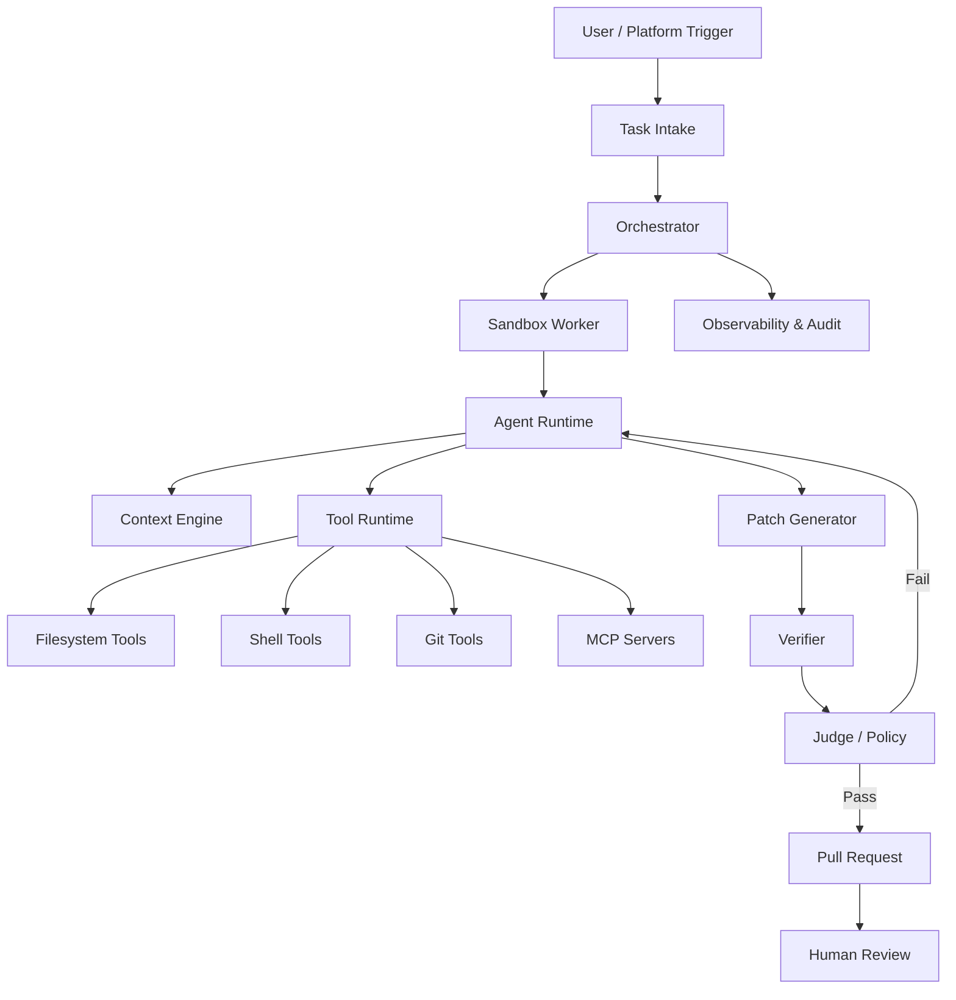
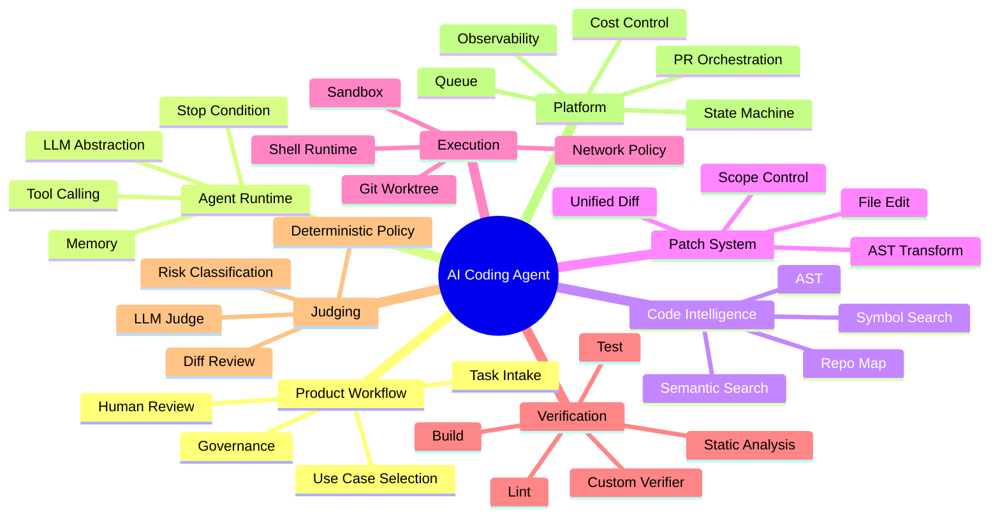
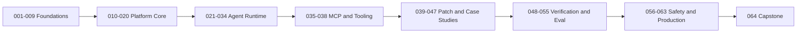
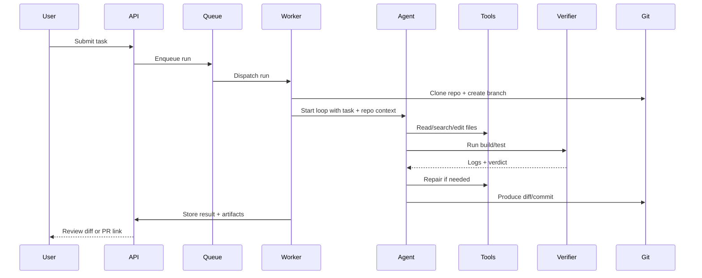
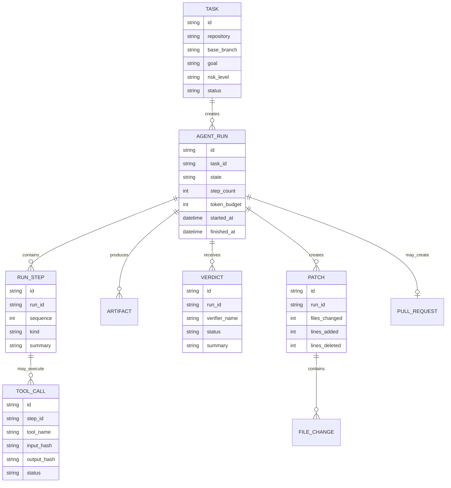

------
title: Learn AI Coding Agent From Scratch - Part 001
description: Skill map, batas sistem, target kemampuan, dan arsitektur pembelajaran untuk membangun Honk-like AI coding agent yang mampu melakukan perubahan kode otomatis secara aman, terukur, dan reviewable.
series: learn-ai-coding-agent
seriesTitle: Learn AI Coding Agent From Scratch
order: 1
partTitle: Skill Map and System Boundary
tags:
- ai-coding-agent
- agentic-ai
- software-engineering
- automation
- sandbox
- verification
date: 2026-07-03
---

# Part 001 — Skill Map and System Boundary

Kita tidak sedang membangun “chatbot yang bisa menulis kode”. Kita akan membangun **sistem perubahan kode otomatis**: menerima tugas, memahami repository, membuat perubahan, menjalankan verifier, memperbaiki kesalahan, menyiapkan pull request, dan meninggalkan jejak audit yang bisa dipercaya manusia.

Itulah bedanya seri ini dari tutorial “pakai LLM untuk generate function”. Target akhirnya adalah **Honk-like AI coding agent**: background agent yang bisa dipanggil untuk mengerjakan perubahan software secara asynchronous, berjalan dalam sandbox, memiliki tool runtime, mengerti repository, menjalankan build/test, membuat diff, dan berhenti ketika sudah cukup aman untuk review manusia.

Spotify mempublikasikan Honk sebagai internal codename untuk background coding agent yang dipakai untuk large-scale software maintenance. Dalam artikel engineering mereka, Honk digambarkan sebagai agent yang terintegrasi dengan workflow PR, memakai verifier/judge, MCP, prompt-driven migrations, dan dibangun di atas platform engineering internal seperti Fleet Management. Kita tidak akan meng-copy sistem internal Spotify, tetapi mengambil **kelas masalah** dan **prinsip arsitekturnya**: coding agent sebagai platform perubahan kode, bukan sekadar fitur editor.

Referensi utama untuk konteks faktual:

- Spotify Engineering — “1,500+ PRs Later: Spotify’s Journey with Our Background Coding Agent (Honk, Part 1)”  
  https://engineering.atspotify.com/2025/11/spotifys-background-coding-agent-part-1
- Model Context Protocol Specification — Tools, Resources, Prompts  
  https://modelcontextprotocol.io/specification/2025-06-18
- Anthropic Claude Code — agent yang membaca codebase, mengedit file, dan menjalankan command  
  https://claude.com/product/claude-code
- OpenAI Codex Cloud — cloud coding agent yang bekerja pada task di background dalam environment sendiri  
  https://developers.openai.com/codex/cloud

---

## 1. Definisi kerja: apa itu AI coding agent?

Dalam seri ini, **AI coding agent** adalah sistem yang mampu menjalankan loop berikut:

1. menerima tujuan perubahan kode;
2. mengambil konteks repository yang relevan;
3. membuat rencana perubahan;
4. memakai tool untuk membaca, mencari, mengedit, menjalankan command, dan berinteraksi dengan sistem eksternal;
5. menghasilkan patch terkontrol;
6. memverifikasi hasil melalui build, test, lint, static check, policy check, atau custom verifier;
7. memperbaiki patch berdasarkan feedback;
8. menghasilkan output reviewable seperti diff, commit, atau pull request;
9. menyimpan trace lengkap: input, step, tool call, log, cost, verdict, dan keputusan final.

Versi paling sederhana adalah script yang memanggil model lalu menulis file. Versi production-grade adalah **orchestrated autonomous change system**.

Perbedaan penting:

| Sistem | Kemampuan | Risiko utama |
|---|---|---|
| Chatbot coding | Memberi saran kode di chat | Tidak tahu repository aktual, tidak memverifikasi |
| IDE autocomplete | Melengkapi kode lokal | Scope sempit, mudah salah konteks |
| CLI coding assistant | Membaca repo, edit file, run command | Butuh permission, sandbox, context control |
| Cloud coding agent | Menjalankan task di environment terpisah | Trust boundary, secret, CI parity |
| Background fleet agent | Mengubah banyak repo/PR otomatis | Blast radius, governance, rollout, audit |

Kita akan bergerak dari bentuk sederhana menuju bentuk terakhir.

---

## 2. Scope seri ini

Seri ini membangun sistem dengan horizon seperti ini:



Sistem minimal yang akan kita bangun secara bertahap:

- **Control plane**: API, task registry, run state machine, queue, scheduler, audit log.
- **Execution plane**: sandbox worker, repository checkout, tool execution, command boundary.
- **Agent runtime**: LLM abstraction, message protocol, tool-calling loop, stop condition.
- **Context engine**: repo map, file selection, semantic search, summarization, compression.
- **Patch engine**: controlled edit, unified diff, AST transform where appropriate.
- **Verifier**: build, test, lint, static analysis, custom task-specific verifier.
- **Judge**: evaluates whether the diff satisfies the task and stays within boundary.
- **PR orchestrator**: branch naming, commit, PR body, labels, reviewers, trace link.
- **Governance layer**: policy, approval, permission, rate limit, cost control, rollout.

Yang tidak menjadi fokus utama:

- training foundation model sendiri;
- membangun IDE dari nol;
- membuat Git hosting platform sendiri;
- mengganti CI/CD platform secara penuh;
- membangun distributed container platform dari nol;
- mengulang Java, Maven, Git, Docker, Kafka, atau PostgreSQL dari basic.

Kita akan memakai teknologi tersebut sebagai bahan bangunan, bukan sebagai topik pengantar ulang.

---

## 3. Kenapa ini masalah arsitektur, bukan hanya masalah prompt?

Prompt memang penting. Tetapi coding agent yang berguna di production bukan lahir dari prompt panjang saja.

Sebuah agent bisa gagal karena:

- salah memilih file;
- membaca konteks terlalu sedikit;
- membaca terlalu banyak sehingga context window penuh;
- menjalankan command destruktif;
- memperbaiki test dengan menghapus assertion;
- membuat diff terlalu luas;
- menambahkan dependency tanpa alasan;
- mengubah generated file manual;
- compile hijau tapi business invariant rusak;
- CI lokal beda dari CI remote;
- prompt injection dari file repository;
- secret bocor ke model context;
- agent loop tidak punya stop condition;
- verifier gagal tapi agent “mengarang” keberhasilan;
- pull request sulit direview karena tidak punya rationale.

Karena itu mental model seri ini adalah:

> AI coding agent adalah **transactional code-change system under uncertainty**.

Kata kuncinya: **transactional**, **code-change**, **system**, **under uncertainty**.

- Transactional: ada input, perubahan, validasi, commit boundary, rollback/failure state.
- Code-change: output utama bukan jawaban natural language, tetapi diff yang bisa diuji.
- System: komponennya banyak: model, tool, sandbox, git, verifier, policy, UI, audit.
- Under uncertainty: model bisa salah, context tidak lengkap, environment tidak selalu deterministik.

---

## 4. Skill map utama

Agar bisa membangun agent seperti ini, kita butuh skill map lintas lapisan.



Kita akan belajar dari luar ke dalam dan dari dalam ke luar:

1. mulai dari peta sistem;
2. bentuk domain model;
3. desain state machine;
4. bangun sandbox;
5. bangun agent loop;
6. tambah tool;
7. tambah context engine;
8. tambah patch engine;
9. tambah verifier;
10. tambah judge;
11. tambah PR orchestration;
12. skalakan ke fleet-wide changes.

Urutan ini sengaja dipilih karena coding agent yang buruk biasanya terlalu cepat mulai dari prompt dan terlalu lambat memikirkan boundary.

---

## 5. Capability levels

Kita akan memakai level kemampuan berikut untuk mengukur progres.

| Level | Nama | Karakteristik | Boleh dipakai production? |
|---:|---|---|---|
| 0 | Suggestion Bot | Agent hanya memberi saran teks | Tidak untuk auto-change |
| 1 | Local Patch Bot | Bisa membaca file dan menulis patch lokal | Hanya eksperimen |
| 2 | Verified Local Agent | Bisa run build/test/lint dan memperbaiki error | Terbatas, low-risk repo |
| 3 | PR Agent | Bisa membuat branch, commit, PR, dan laporan verifikasi | Bisa untuk perubahan kecil dengan review manusia |
| 4 | Policy-Aware Agent | Punya sandbox, approval, policy, secret boundary, audit | Bisa untuk internal controlled rollout |
| 5 | Fleet Change Agent | Bisa menjalankan perubahan ke banyak repo secara batch, dengan governance | Bisa untuk platform engineering matang |

Target akhir seri ini adalah **Level 4 menuju Level 5**.

Kita tidak akan berpura-pura bahwa semua jenis coding task bisa diotomasi penuh. Justru bagian penting dari skill top-tier adalah tahu **mana task yang aman diagentkan** dan **mana task yang harus tetap human-led**.

---

## 6. Use case yang cocok untuk batch awal

AI coding agent paling aman dimulai dari task yang punya spesifikasi jelas dan verifier kuat.

Use case bagus:

1. **dependency upgrade kecil** dengan changelog jelas dan test suite memadai;
2. **API migration berulang** dari old method ke new method;
3. **config migration** dengan schema validasi;
4. **lint/style fix** yang deterministik;
5. **test repair** untuk error mekanis akibat signature berubah;
6. **generated code refresh** via command resmi;
7. **documentation update** berdasarkan diff API;
8. **package rename** dengan compiler sebagai verifier;
9. **security patch adoption** jika perubahan kecil dan verifiable;
10. **fleet-wide boilerplate update** seperti CI config atau policy file.

Use case buruk untuk batch awal:

1. redesign domain model;
2. perubahan authorization policy tanpa oracle kuat;
3. perubahan performa tanpa benchmark stabil;
4. concurrency fix yang sulit direproduksi;
5. migrasi database destructive;
6. perubahan public API tanpa contract owner;
7. perubahan yang membutuhkan product judgement;
8. refactor besar tanpa test coverage;
9. “buat arsitektur baru”;
10. “perbaiki semua bug”.

Rule of thumb:

> Semakin lemah verifier, semakin kecil autonomy yang boleh diberikan ke agent.

---

## 7. Batas sistem yang benar

Batas sistem adalah kontrak kepercayaan. Untuk agent coding, batas sistem lebih penting daripada kemampuan model.

### 7.1 Batas input

Input minimal:

- repository target;
- branch base;
- task description;
- allowed scope;
- forbidden paths;
- verifier command;
- expected output;
- review owner;
- risk level.

Contoh task yang buruk:

```text
Update authentication code to be better.
```

Contoh task yang lebih baik:

```text
In repository payment-api, migrate usage of LegacyTokenVerifier to TokenVerifierV2.
Only modify src/main/java and src/test/java.
Do not change public REST contract.
Run: mvn -q test.
Expected: all existing tests pass and add/adjust tests only where compile errors require it.
```

Agent tidak bisa bekerja baik jika input tidak punya end state yang bisa diverifikasi.

### 7.2 Batas file

Agent harus punya file policy:

| Area | Policy contoh |
|---|---|
| Source code | boleh edit jika dalam allowed path |
| Test code | boleh edit, tapi tidak boleh menghapus coverage penting |
| Build file | butuh approval jika menambah dependency |
| Lockfile | boleh jika package manager command menghasilkan perubahan |
| Generated file | hanya boleh melalui generator command |
| Secret/config prod | read-only atau blocked |
| Migration DB | butuh explicit approval |
| CI config | allowed untuk task tertentu saja |

### 7.3 Batas command

Command yang dijalankan agent harus dikontrol.

Kategori command:

| Kategori | Contoh | Default |
|---|---|---|
| Safe read | `ls`, `cat`, `grep`, `rg`, `git status` | allow |
| Build/test | `mvn test`, `npm test`, `go test` | allow with timeout |
| Package install | `npm install`, `mvn dependency:resolve` | allow with network policy |
| Git write | `git checkout -b`, `git commit` | allow only in workspace branch |
| Network | `curl`, package manager remote fetch | restricted |
| Destructive | `rm -rf`, `git reset --hard`, DB drop | deny by default |
| Secret access | `cat .env`, cloud secret CLI | deny by default |

A production agent tidak boleh diberi shell bebas tanpa policy.

---

## 8. Invariant sistem

Invariant adalah aturan yang harus tetap benar sepanjang agent berjalan.

Core invariants:

1. **Agent tidak boleh mengubah file di luar workspace.**
2. **Agent tidak boleh membaca secret yang tidak diperlukan.**
3. **Setiap tool call harus tercatat.**
4. **Setiap perubahan file harus bisa direkonstruksi dari diff.**
5. **Setiap run punya state final: succeeded, failed, cancelled, blocked, atau needs-human.**
6. **PR hanya dibuat jika verifier minimum sudah dijalankan atau alasan skip tercatat.**
7. **Agent tidak boleh mengklaim test pass tanpa log/verdict.**
8. **Perubahan high-risk membutuhkan approval.**
9. **Task harus punya boundary dan target branch yang jelas.**
10. **Loop harus punya token budget, step budget, dan time budget.**

Invariant ini akan memandu desain database, API, worker, sandbox, dan PR orchestrator.

---

## 9. Failure model awal

Sebelum menulis kode, kita harus tahu kegagalan apa yang akan terjadi.

| Failure | Penyebab | Deteksi | Mitigasi |
|---|---|---|---|
| Wrong file edited | context selection salah | diff review, ownership map | repo map, allowed path |
| Build fails | patch inkompatibel | verifier | iterative repair |
| Test deleted | agent curang menurunkan standar | diff judge, test policy | forbid deletion without rationale |
| Overbroad diff | agent refactor terlalu besar | changed lines threshold | scope policy |
| Secret leak | file secret masuk context | secret scanner | secret boundary |
| Infinite loop | agent terus mencoba | step/time budget | stop condition |
| Hallucinated success | model bilang pass tanpa bukti | verifier artifact required | structured verdict |
| Network abuse | command fetch tidak terkontrol | network log | egress policy |
| Supply chain risk | dependency baru malicious | dependency policy | approval + scan |
| CI mismatch | local pass, remote fail | PR check | CI feedback loop |

Dalam sistem matang, failure bukan exception aneh. Failure adalah **state normal** yang harus direpresentasikan.

---

## 10. Arsitektur pembelajaran seri

Part 001 sampai 064 tidak disusun sebagai ensiklopedia. Urutannya mengikuti cara membangun sistem.



### 10.1 Foundation

Kita mulai dengan memahami:

- definisi agent;
- perbedaan agent vs assistant;
- batas autonomy;
- task yang cocok;
- risk classification;
- state machine;
- end-to-end flow.

### 10.2 Platform core

Lalu membangun:

- repository layout;
- API contract;
- database schema;
- event model;
- worker queue;
- sandbox;
- permission model.

### 10.3 Agent runtime

Kemudian membangun:

- loop agent;
- model provider abstraction;
- message protocol;
- tool runtime;
- file/shell/git tools;
- context management;
- repo map;
- planning layer;
- prompt contracts.

### 10.4 MCP and tooling

Kita akan memperkenalkan MCP bukan sebagai hype, tetapi sebagai cara membuat tool boundary lebih rapi:

- custom verifier server;
- repository context server;
- policy-aware tool exposure.

### 10.5 Patch and case studies

Kita akan menyelesaikan case nyata:

- Java API migration;
- Maven dependency upgrade;
- config/schema migration;
- multi-file cascading change;
- long-horizon change.

### 10.6 Verification and evaluation

Agent harus dibuktikan:

- build/test/lint loop;
- log summarization;
- LLM-as-judge;
- deterministic policy checks;
- CI inner/outer loop;
- benchmark dataset.

### 10.7 Safety and production

Akhirnya kita harden:

- prompt injection;
- malicious repo;
- secret handling;
- approval design;
- observability;
- cost/latency;
- PR orchestration;
- fleet rollout;
- governance.

---

## 11. Minimum viable architecture

Kita tidak langsung membangun semua. Versi awal cukup seperti ini:



MVP tidak perlu fleet-wide rollout dulu. MVP cukup bisa:

1. menerima satu task;
2. checkout satu repo;
3. menjalankan agent loop;
4. membuat patch;
5. menjalankan verifier;
6. menyimpan log;
7. menampilkan diff.

Setelah itu baru PR, policy, MCP, judge, fleet rollout.

---

## 12. Komponen inti dan tanggung jawabnya

### 12.1 Task Intake

Tugasnya mengubah request manusia menjadi object yang bisa dieksekusi.

Fields penting:

```json
{
  "repository": "payment-api",
  "baseBranch": "main",
  "goal": "Migrate LegacyTokenVerifier to TokenVerifierV2",
  "allowedPaths": ["src/main/java", "src/test/java"],
  "forbiddenPaths": ["src/main/resources/prod", ".env"],
  "verificationCommands": ["mvn -q test"],
  "riskLevel": "medium",
  "requiresApprovalBeforePR": false
}
```

Task intake bukan form administratif. Ia adalah **contract generator** untuk agent.

### 12.2 Orchestrator

Tugas orchestrator:

- membuat run;
- mengatur state transition;
- memilih worker;
- mengatur retry;
- mencatat event;
- menghentikan run jika budget habis;
- memutuskan kapan PR dibuat.

Orchestrator tidak boleh berisi detail prompt. Ia mengelola lifecycle.

### 12.3 Worker

Worker bertanggung jawab atas eksekusi fisik:

- clone repo;
- prepare workspace;
- start sandbox;
- menjalankan agent runtime;
- collect artifacts;
- cleanup.

Worker harus disposable. Kalau worker mati, run bisa failed atau retried tanpa merusak state global.

### 12.4 Agent runtime

Agent runtime menjalankan loop:

```text
while not done:
    observe current state
    ask model for next action
    validate action
    execute tool
    record result
    update context
    decide continue/stop
```

Loop ini sederhana. Kompleksitas production ada di sekelilingnya: permission, context, verifier, policy, log, budget, replay.

### 12.5 Tool runtime

Tool runtime adalah pagar antara model dan dunia nyata.

Tool harus punya:

- name;
- schema input;
- schema output;
- timeout;
- permission level;
- side-effect classification;
- audit record;
- error semantics.

Contoh tool:

```json
{
  "name": "edit_file",
  "sideEffect": "write_file",
  "permission": "workspace_write",
  "inputSchema": {
    "path": "string",
    "patch": "string"
  }
}
```

### 12.6 Verifier

Verifier menjawab pertanyaan:

> Apakah patch ini memenuhi minimum evidence bahwa perubahan tidak merusak sistem?

Verifier bukan hanya test. Ia bisa berupa:

- compile;
- unit test;
- integration test;
- OpenAPI compatibility check;
- schema validation;
- static analysis;
- dependency scan;
- custom business invariant check.

### 12.7 Judge

Judge menjawab pertanyaan yang tidak selalu deterministik:

> Apakah diff ini masuk akal terhadap instruksi?

Judge tidak menggantikan test. Judge membantu menemukan hal seperti:

- perubahan terlalu luas;
- test dihapus tanpa alasan;
- task tidak benar-benar diselesaikan;
- public API berubah padahal dilarang;
- agent menambahkan workaround buruk;
- diff mengandung unrelated cleanup.

---

## 13. Arsitektur data awal

Kita akan memakai domain object berikut sepanjang seri.



Kenapa domain model penting? Karena agent yang tidak punya model data akan menjadi script panjang yang sulit diaudit.

---

## 14. Quality bar seri ini

Setiap part harus membawa kita lebih dekat ke sistem yang bisa dibangun, bukan hanya konsep.

Quality bar:

- ada mental model;
- ada desain konkret;
- ada trade-off;
- ada failure mode;
- ada invariant;
- ada contoh struktur data atau flow;
- ada exercise yang bisa dilakukan;
- tidak mengulang materi basic dari seri lain.

Kita akan menulis seperti membangun database dari nol: satu mekanisme demi satu mekanisme, sampai sistemnya masuk akal.

---

## 15. Cara berpikir top-tier untuk sistem seperti ini

Engineer biasa bertanya:

> “Prompt apa yang bagus agar agent bisa coding?”

Engineer kuat bertanya:

> “Apa boundary, evidence, dan rollback model agar perubahan kode dari agent bisa dipercaya?”

Engineer platform bertanya:

> “Bagaimana sistem ini berjalan untuk 1 repo, 100 repo, dan 10.000 run tanpa membuat organisasi kehilangan kontrol?”

Di seri ini, kita akan memakai cara berpikir ketiga.

Prinsip yang akan sering muncul:

1. **Autonomy follows evidence.** Semakin kuat evidence, semakin besar autonomy.
2. **Verifier beats confidence.** Log test lebih bernilai daripada narasi model.
3. **Diff is the product.** Output utama adalah perubahan kode yang reviewable.
4. **Context is a budget.** Membaca semua file bukan solusi.
5. **Tools are capabilities plus liabilities.** Setiap tool memberi kekuatan dan risiko.
6. **Sandbox is not optional.** Agent yang bisa execute command harus dipagari.
7. **Human review is a system feature.** Bukan tanda kegagalan autonomy.
8. **Fleet rollout requires governance.** Skalabilitas tanpa policy adalah blast radius.

---

## 16. Latihan Part 001

Sebelum lanjut ke Part 002, jawab untuk satu repository nyata milikmu:

1. Apa 3 task yang paling cocok diotomasi agent?
2. Apa 3 task yang tidak boleh diotomasi dulu?
3. File mana yang boleh diedit agent?
4. File mana yang harus read-only?
5. Command verifier minimum apa yang valid?
6. Apa sinyal bahwa agent harus berhenti dan meminta manusia?
7. Apa risiko terbesar jika agent salah?
8. Apakah PR dari agent boleh auto-merge? Jika tidak, siapa reviewer minimum?

Tulis jawaban sebagai policy awal:

```yaml
repository: your-service
allowed_paths:
  - src/main/java
  - src/test/java
forbidden_paths:
  - .env
  - src/main/resources/prod
verification_commands:
  - mvn -q test
risk_policy:
  low: may_create_pr
  medium: requires_review
  high: requires_approval_before_run
stop_conditions:
  - verifier_failed_more_than_3_times
  - changed_files_more_than_20
  - touches_forbidden_path
  - asks_for_secret
```

Policy kecil ini akan menjadi seed untuk desain permission model nanti.

---

## 17. Checklist pemahaman

Kamu siap lanjut jika bisa menjelaskan:

- kenapa AI coding agent bukan sekadar LLM wrapper;
- kenapa output utama agent adalah diff, bukan chat response;
- kenapa verifier lebih penting daripada confidence model;
- perbedaan local coding assistant, cloud coding agent, dan background fleet agent;
- komponen minimal Honk-like system;
- invariant yang wajib dijaga;
- failure mode utama agent;
- use case mana yang cocok untuk batch awal;
- mengapa sandbox, policy, dan audit bukan fitur tambahan.

---

## 18. Ringkasan

Part ini menetapkan batas permainan.

Kita akan membangun AI coding agent sebagai **platform perubahan kode otomatis**. Sistem ini memiliki task intake, orchestrator, sandbox worker, agent runtime, tool runtime, context engine, patch generator, verifier, judge, PR orchestration, observability, dan governance.

Di part berikutnya, kita akan membangun mental model yang lebih tajam: bagaimana agent berpikir, mengapa loop sederhana bisa menjadi sistem kompleks, dan bagaimana membedakan “agent yang tampak pintar” dari “agent yang benar-benar bisa dipercaya”.
