------
title: Learn AI Coding Agent From Scratch - Part 003
description: Arsitektur Honk-like background coding agent: bagaimana task masuk, agent berjalan di sandbox, verifier menilai perubahan, judge mengontrol risiko, dan pull request dibuat secara aman.
series: learn-ai-coding-agent
seriesTitle: Learn AI Coding Agent From Scratch
order: 3
partTitle: Honk-like Background Agent Architecture
tags:
- ai-coding-agent
- architecture
- background-agent
- sandbox
- verification
- pull-request
- fleet-management
date: 2026-07-03
---

# Part 003 — Honk-like Background Agent Architecture

Di part sebelumnya kita menetapkan bahwa AI coding agent bukan “LLM yang menulis kode”, melainkan **sistem perubahan kode otomatis**. Sekarang kita mulai menggambar sistemnya.

Target part ini sederhana tetapi penting:

> Kita ingin punya model arsitektur yang cukup konkret untuk membangun background coding agent seperti Honk: task masuk, repository disiapkan, agent bekerja di sandbox, perubahan diverifikasi, hasil dinilai, lalu PR dibuat atau run dihentikan.

Kata “Honk-like” di sini bukan berarti menyalin sistem internal Spotify. Yang kita ambil adalah kelas arsitekturnya: **background agent untuk software maintenance berskala besar**. Spotify mempublikasikan Honk sebagai background coding agent yang tumbuh dari platform Fleet Management, dipakai untuk PR workflow, migration, verifier/judge, MCP, dan large-scale maintenance. Itu memberi kita fakta desain yang penting: agent yang berguna di perusahaan besar biasanya bukan fitur editor; ia adalah **platform orchestration + execution + governance**.

Referensi faktual yang relevan:

- Spotify Engineering — “1,500+ PRs Later: Spotify’s Journey with Our Background Coding Agent (Honk, Part 1)”  
  https://engineering.atspotify.com/2025/11/spotifys-background-coding-agent-part-1
- Model Context Protocol — Tools  
  https://modelcontextprotocol.io/specification/2025-06-18/server/tools
- Claude Code Docs — overview dan tool-based agentic workflow  
  https://code.claude.com/docs/en/overview
- OpenAI Codex Cloud — cloud coding agent, task sandbox, PR proposal  
  https://developers.openai.com/codex/cloud

---

## 1. Arsitektur yang sedang kita bangun

Kita akan membangun sistem dengan bentuk besar seperti ini:

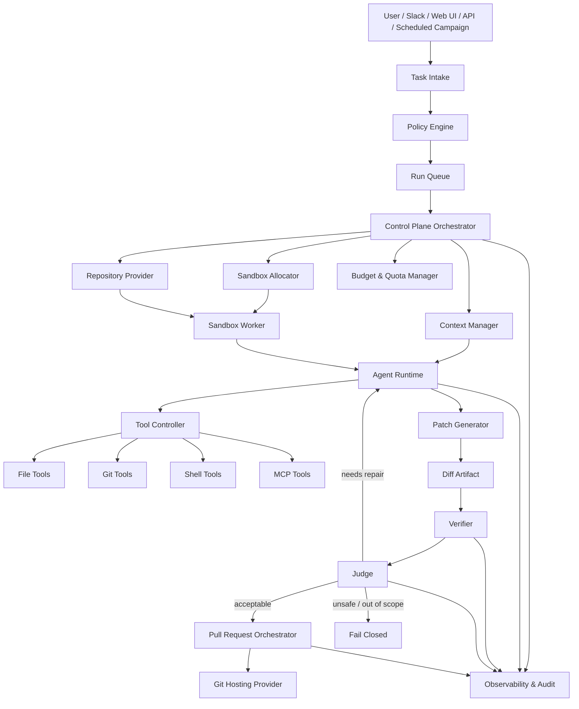

Sistem ini punya dua wilayah besar:

1. **Control plane** — menerima task, membuat run, mengatur state, queue, policy, budget, audit, dan lifecycle.
2. **Execution plane** — menjalankan agent di environment terisolasi, membaca/menulis file, menjalankan command, membuat diff, dan menjalankan verifier.

Pemisahan ini bukan kosmetik. Ini adalah fondasi safety. Agent boleh “berpikir dan bertindak” di sandbox, tetapi tidak boleh bebas mengubah state platform, membuka secret, membuat PR tanpa policy, atau menjalankan command tak terbatas.

---

## 2. Prinsip desain utama

Sebelum menulis modul, kita tetapkan prinsipnya.

### 2.1 Agent harus menjadi worker, bukan pemilik sistem

Agent tidak boleh menjadi pusat otoritas. Ia adalah worker yang diberi konteks, tool terbatas, dan target. Otoritas tetap di control plane.

Mental model yang benar:

```text
User gives intent.
Control plane converts intent into bounded task.
Execution plane lets agent attempt the task.
Verifier checks evidence.
Judge decides acceptability.
PR orchestrator publishes reviewable artifact.
Human or policy decides merge.
```

Mental model yang salah:

```text
User asks model.
Model edits repo.
Model says done.
Trust it.
```

Pada production-grade agent, “done” bukan klaim model. “Done” adalah **verdict berbasis evidence**.

---

### 2.2 Semua aksi harus melewati tool boundary

LLM tidak boleh langsung menulis file, menjalankan shell, atau mengakses repository. Ia harus mengeluarkan permintaan tool yang divalidasi.

Contoh boundary:

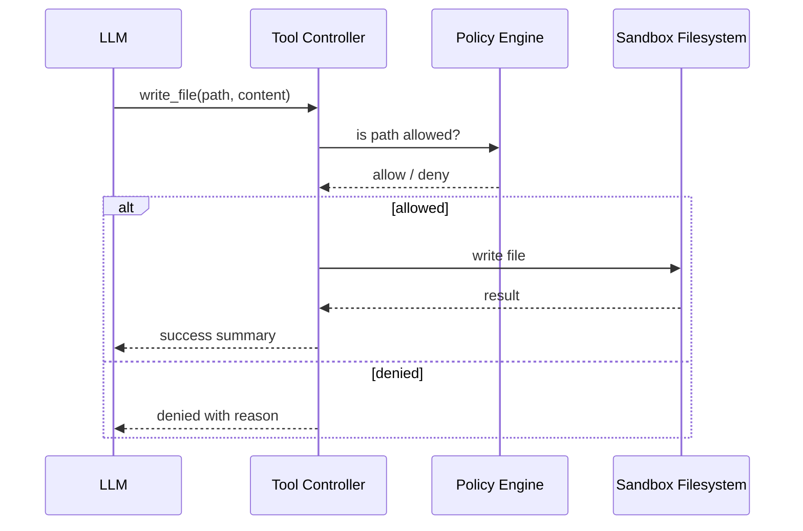

Tool boundary memberi kita:

- validasi input;
- timeout;
- logging;
- permission check;
- policy enforcement;
- replayability;
- observability;
- cost attribution;
- failure semantics yang konsisten.

Tanpa tool boundary, agent menjadi remote code execution dengan kalimat sopan.

---

### 2.3 Sandbox adalah default, bukan fitur tambahan

Coding agent harus mengerjakan perubahan di environment terisolasi karena repository bisa berbahaya dan command build/test bisa menjalankan arbitrary code.

Minimal sandbox harus mengontrol:

| Boundary | Risiko kalau tidak dikontrol |
|---|---|
| Filesystem | Agent membaca/menulis file di luar workspace |
| Network | Build script mengirim secret/token keluar |
| Process | Command runaway, fork bomb, crypto mining, malware |
| Secret | Token GitHub, API key, SSH key bocor ke prompt/log |
| Package manager | Dependency install menjalankan lifecycle script berbahaya |
| Git remote | Agent push ke branch utama atau remote yang salah |
| Resource | CPU/RAM/disk habis karena loop atau build besar |

Untuk fase belajar, sandbox bisa dimulai dari Docker container lokal. Untuk production, sandbox biasanya perlu isolasi lebih kuat, network egress policy, ephemeral credential, dan audit.

---

### 2.4 Verifier lebih penting daripada prompt

Prompt yang bagus membantu agent bekerja. Tetapi verifier yang bagus membuat hasilnya bisa dipercaya.

Verifier bukan satu check. Ia adalah pipeline:

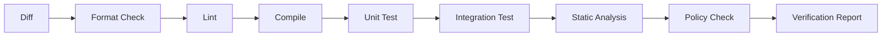

Untuk task tertentu, verifier harus spesifik. Contoh:

- dependency upgrade: `mvn test`, dependency tree, forbidden version check;
- API migration: compile + targeted tests + no old import check;
- config migration: schema validation + backward compatibility check;
- generated file update: generator re-run + diff stability check;
- security fix: regression test + vulnerability scanner if available.

Agent yang tidak diverifikasi hanya menghasilkan teks optimistis.

---

### 2.5 Judge harus memisahkan “build pass” dari “change acceptable”

Build pass tidak sama dengan benar.

Contoh perubahan berbahaya yang bisa tetap build pass:

- menghapus test yang gagal;
- menurunkan assertion;
- mematikan validation;
- mengubah public API tanpa update consumer;
- mengganti dependency ke versi lebih lama;
- menghapus feature flag;
- hardcode nilai agar test hijau;
- mengubah semantics tetapi tidak kena test.

Karena itu kita butuh **judge**. Judge bisa deterministic, LLM-based, atau hybrid.

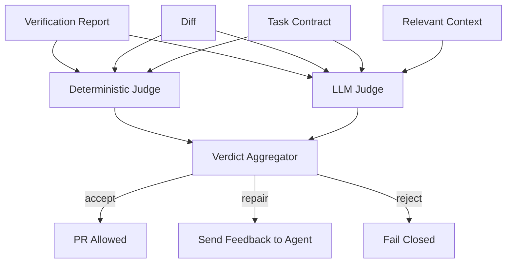

Deterministic judge cocok untuk policy yang jelas:

- tidak boleh mengubah file tertentu;
- tidak boleh menghapus test;
- tidak boleh mengubah lockfile kecuali dependency task;
- tidak boleh menambah dependency GPL;
- tidak boleh menambah secret;
- jumlah file berubah tidak boleh melebihi threshold.

LLM judge cocok untuk penilaian semantik:

- apakah diff sesuai task;
- apakah perubahan terlalu luas;
- apakah PR body menjelaskan risiko;
- apakah patch terlihat seperti workaround;
- apakah test baru benar-benar menguji behavior.

Namun LLM judge tidak boleh menjadi satu-satunya guard. Ia harus menjadi reviewer tambahan, bukan pengganti verifier deterministic.

---

## 3. Komponen inti

Sekarang kita bedah komponen arsitektur satu per satu.

---

## 3.1 Task Intake

Task intake menerima permintaan dari user, scheduler, campaign, issue, Slack, API, atau event platform.

Contoh input mentah:

```text
Upgrade all services using com.acme:legacy-client 2.x to com.acme:modern-client 3.x.
Update imports, constructor usage, and tests. Do not change public API.
Open one PR per repository.
```

Task intake tidak boleh langsung melempar ini ke LLM. Ia harus mengubahnya menjadi **task contract**.

Contoh task contract:

```yaml
taskId: task_20260703_001
type: dependency_migration
target:
  repository: github.com/acme/billing-service
  baseBranch: main
scope:
  allowedPaths:
    - pom.xml
    - src/main/java/**
    - src/test/java/**
  forbiddenPaths:
    - infra/**
    - db/migration/**
constraints:
  mustNotChangePublicApi: true
  mustNotDeleteTests: true
  maxFilesChanged: 20
expectedOutcome:
  oldDependencyAbsent: com.acme:legacy-client
  newDependencyPresent: com.acme:modern-client:3.x
verification:
  commands:
    - mvn -q test
  staticChecks:
    - no_old_imports
    - no_deleted_tests
pr:
  titlePrefix: "Migrate legacy client to modern client"
  labels:
    - ai-generated
    - dependency-migration
```

Kenapa task contract penting?

Karena task contract adalah pegangan semua komponen:

- agent memakainya untuk memahami tujuan;
- tool controller memakainya untuk membatasi path;
- verifier memakainya untuk memilih check;
- judge memakainya untuk menilai diff;
- PR orchestrator memakainya untuk membuat PR body;
- audit log memakainya untuk menjelaskan kenapa run berjalan.

---

## 3.2 Policy Engine

Policy engine menentukan apakah sebuah task boleh dijalankan.

Pertanyaan policy:

- Apakah repository termasuk target yang diizinkan?
- Apakah user punya hak menjalankan agent di repository itu?
- Apakah jenis task diizinkan untuk mode otomatis?
- Apakah task memerlukan approval sebelum run?
- Apakah agent boleh membuat PR?
- Apakah agent boleh menjalankan network?
- Apakah agent boleh mengubah dependency?
- Apakah agent boleh mengubah file generated?
- Apakah agent boleh mengakses secret?

Policy engine sebaiknya menghasilkan keputusan eksplisit:

```json
{
  "decision": "allow",
  "mode": "pr_only",
  "requiresHumanApprovalBeforeRun": false,
  "requiresHumanApprovalBeforePR": false,
  "sandboxProfile": "java-maven-no-egress",
  "maxBudgetUsd": 3.00,
  "maxIterations": 8,
  "maxWallClockMinutes": 45
}
```

Kita tidak ingin policy tersebar sebagai `if` acak di banyak modul. Untuk production, policy harus bisa diaudit.

---

## 3.3 Run Queue

Coding agent bisa mahal dan lambat. Karena itu run perlu queue.

Queue mengontrol:

- concurrency;
- priority;
- retry;
- cancellation;
- rate limit;
- tenant isolation;
- repository lock;
- campaign batching;
- backoff ketika CI/provider bermasalah.

Contoh aturan:

| Rule | Alasan |
|---|---|
| Maksimal 1 active run per repository branch | Menghindari conflict diff |
| Maksimal N run per team | Menghindari kuota habis |
| Campaign migration memakai batch kecil | Mengurangi blast radius |
| Retry hanya untuk error infra | Menghindari agent mengulang patch buruk |
| Cancellation harus graceful | Agar sandbox bisa dibersihkan |

Untuk fase awal, queue bisa sederhana: tabel database `agent_run` dengan status dan worker polling. Untuk skala besar, gunakan message broker atau job scheduler.

---

## 3.4 Control Plane Orchestrator

Orchestrator adalah state machine utama.

Ia tidak menulis kode. Ia mengatur lifecycle.

Tugas orchestrator:

1. membuat run dari task;
2. memilih worker;
3. menyiapkan repository;
4. membuat sandbox;
5. memberikan task contract ke agent runtime;
6. menerima step event;
7. menjalankan verifier;
8. menjalankan judge;
9. memutuskan repair/accept/reject;
10. membuat PR jika layak;
11. menyimpan audit log;
12. membersihkan resource.

State machine awal:

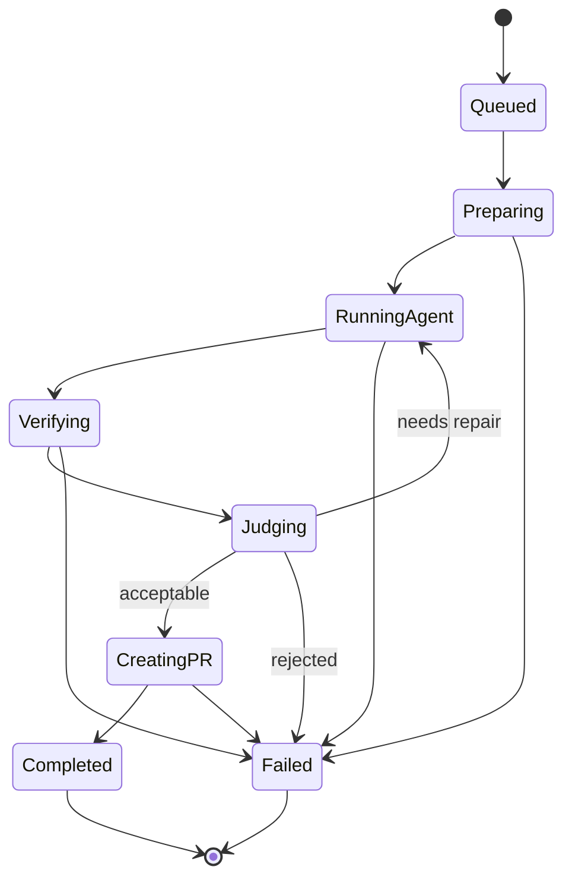

Kenapa state machine penting?

Karena background agent akan gagal dalam banyak cara:

- clone gagal;
- dependency download gagal;
- model timeout;
- tool call invalid;
- shell command hang;
- verifier gagal;
- judge reject;
- PR creation gagal;
- user cancel;
- quota habis;
- sandbox crash.

Tanpa state machine, semua kegagalan ini menjadi “something went wrong”. Dengan state machine, setiap kegagalan punya posisi dan tindakan.

---

## 3.5 Repository Provider

Repository provider bertugas mengambil kode dengan cara terkontrol.

Fungsinya:

- clone repository;
- checkout base branch;
- create working branch;
- handle monorepo path;
- resolve default branch;
- get commit SHA;
- detect build system;
- read ownership metadata;
- fetch PR template;
- optionally read issue context.

Repository provider juga harus menghasilkan metadata:

```json
{
  "repo": "acme/billing-service",
  "baseBranch": "main",
  "baseSha": "abc123",
  "workingBranch": "agent/task_20260703_001",
  "languageHints": ["java"],
  "buildSystems": ["maven"],
  "rootPaths": ["."],
  "ownerTeam": "payments-platform",
  "riskTier": "high"
}
```

Metadata ini penting untuk context engine, verifier, judge, dan PR orchestrator.

---

## 3.6 Sandbox Allocator dan Sandbox Worker

Sandbox allocator memilih profil eksekusi. Sandbox worker menjalankan agent.

Contoh profil:

| Profile | Cocok untuk | Network | Secret | Resource |
|---|---|---:|---:|---:|
| `read-only-analysis` | agent hanya analisis | off | none | low |
| `java-maven-no-egress` | build Maven dengan dependency cache | restricted | none | medium |
| `node-install-restricted` | install package terkontrol | restricted | none | medium |
| `integration-test-with-token` | test butuh service internal | allowlist | ephemeral | high |
| `high-risk-manual` | perubahan sensitif | manual approval | minimal | custom |

Execution plane harus dianggap tidak dipercaya. Repository build script bisa melakukan hal aneh. Agent juga bisa membuat command berisiko. Jadi sandbox worker harus mencatat semua command, environment, exit code, duration, stdout/stderr summary, dan file diff.

---

## 3.7 Context Manager

Context manager memilih informasi apa yang diberikan ke agent.

Masalah utamanya: repository besar, context window terbatas, dan agent mudah tersesat jika diberi terlalu banyak informasi.

Context manager harus bisa menyediakan:

- task contract;
- repository map;
- relevant files;
- build metadata;
- dependency graph ringkas;
- search result;
- previous verifier error;
- policy constraints;
- examples;
- project instructions seperti `AGENTS.md` atau convention file;
- summary dari iterasi sebelumnya.

Context manager bukan “ambil semua file lalu masukkan ke prompt”. Ia adalah retrieval + compression + prioritization layer.

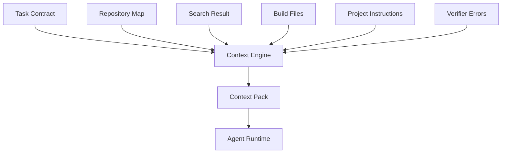

Context pack harus punya provenance: setiap potongan konteks sebaiknya tahu berasal dari file/command mana agar agent dan audit bisa menelusuri asalnya.

---

## 3.8 Agent Runtime

Agent runtime menjalankan loop utama.

Pseudocode konseptual:

```text
while not stop:
    context = context_manager.build_context(run_state)
    model_response = llm.complete(messages + context)

    if model_response.requests_tool:
        result = tool_controller.execute(model_response.tool_call)
        run_state.append_tool_result(result)
        continue

    if model_response.proposes_patch_or_done:
        diff = git_tool.current_diff()
        if diff.empty:
            fail_or_continue("no change produced")
        else:
            break

    if budget_exceeded or iteration_exceeded:
        fail_closed()
```

Kunci yang sering terlewat: agent runtime tidak perlu pintar sendirian. Ia perlu **loop discipline**.

Loop discipline mencakup:

- batas iterasi;
- batas token;
- batas command;
- batas file changed;
- stop condition;
- failure classification;
- structured output;
- retry policy;
- summarization after long logs;
- no hidden side effects.

---

## 3.9 Tool Controller

Tool controller adalah gateway semua aksi agent.

Kategori awal:

| Tool | Fungsi |
|---|---|
| `read_file` | membaca file dalam workspace |
| `list_files` | melihat struktur file |
| `search_text` | grep/ripgrep |
| `write_file` | menulis file dengan policy check |
| `apply_patch` | menerapkan unified diff |
| `run_command` | menjalankan command di sandbox |
| `git_status` | melihat status git |
| `git_diff` | mengambil diff |
| `git_commit` | membuat commit lokal |
| `mcp_call` | memanggil tool eksternal melalui MCP |

Setiap tool harus punya kontrak:

```yaml
name: run_command
input:
  command: string
  workingDirectory: string
  timeoutSeconds: integer
policy:
  requiresPermission: execute
  maxTimeoutSeconds: 600
  forbiddenPatterns:
    - rm -rf /
    - curl * | sh
    - sudo
output:
  exitCode: integer
  stdoutPreview: string
  stderrPreview: string
  outputTruncated: boolean
  durationMs: integer
```

Tool result harus cukup informatif untuk agent, tetapi tidak boleh membocorkan secret atau membanjiri context window.

---

## 3.10 Patch Generator

Patch generator bukan selalu modul terpisah. Kadang patch dihasilkan dari tool edit file. Tetapi secara arsitektur, kita perlu memandang patch sebagai artifact.

Patch artifact minimal berisi:

- file changed;
- hunks;
- line additions/deletions;
- generated vs manual classification;
- risk hints;
- relation to task contract;
- base SHA;
- agent iteration that produced it.

Contoh metadata:

```json
{
  "patchId": "patch_001",
  "baseSha": "abc123",
  "filesChanged": 6,
  "additions": 120,
  "deletions": 54,
  "containsTests": true,
  "containsGeneratedFiles": false,
  "containsDependencyChange": true,
  "riskHints": ["dependency-upgrade", "multi-file-change"]
}
```

Patch artifact membuat verifier dan judge lebih mudah bekerja.

---

## 3.11 Verifier

Verifier menjalankan check berbasis evidence.

Output verifier harus structured, bukan hanya log mentah.

Contoh:

```json
{
  "status": "failed",
  "checks": [
    {
      "name": "maven-test",
      "command": "mvn -q test",
      "status": "failed",
      "durationMs": 42112,
      "summary": "Compilation failed in BillingClientAdapterTest due to constructor signature mismatch.",
      "evidence": [
        "BillingClientAdapterTest.java:42: constructor ModernClient cannot be applied"
      ]
    },
    {
      "name": "no-old-imports",
      "status": "passed"
    }
  ]
}
```

Verifier report harus bisa dipakai agent untuk repair. Karena itu log summarization penting. Jangan hanya kirim 10.000 baris Maven log ke model.

---

## 3.12 Judge

Judge menentukan apa yang terjadi setelah verifier.

Kemungkinan verdict:

| Verdict | Makna | Tindakan |
|---|---|---|
| `needs_repair` | Ada error yang mungkin bisa diperbaiki | kirim feedback ke agent |
| `acceptable` | Evidence cukup untuk PR | buat PR |
| `rejected` | Perubahan tidak sesuai/berbahaya | fail closed |
| `inconclusive` | Tidak cukup evidence | minta verifier tambahan atau manual review |

Judge harus menyimpan alasan:

```json
{
  "verdict": "needs_repair",
  "reason": "Build failed due to two compile errors caused by incomplete constructor migration.",
  "repairHints": [
    "Update BillingClientAdapterTest to use ModernClientConfig",
    "Search for remaining LegacyClientFactory usage"
  ]
}
```

Kita ingin agent belajar dari feedback yang terstruktur, bukan dari log chaos.

---

## 3.13 Pull Request Orchestrator

PR orchestrator menerbitkan artifact reviewable.

Tugasnya:

- membuat branch name konsisten;
- membuat commit message;
- push branch;
- membuat PR title/body;
- menambahkan label;
- menambahkan reviewer jika diketahui;
- menyertakan verification report;
- menyertakan limitation dan risk;
- menautkan task/run ID;
- tidak auto-merge kecuali policy sangat matang.

PR body yang baik:

```md
## Summary
Migrates `com.acme:legacy-client` to `com.acme:modern-client` in billing-service.

## Changes
- Updated Maven dependency.
- Replaced LegacyClientFactory usages.
- Updated adapter tests for ModernClientConfig.

## Verification
- `mvn -q test` passed.
- `no_old_imports` passed.
- `no_deleted_tests` passed.

## Agent Notes
- Scope limited to `pom.xml`, `src/main/java`, and `src/test/java`.
- No public API signature changes detected.

## Risk
Medium: dependency migration touches runtime client initialization.

Agent run: `run_20260703_001`
Base SHA: `abc123`
```

PR bukan “hasil akhir absolut”. PR adalah interface kolaborasi antara agent dan manusia.

---

## 3.14 Observability dan Audit

Agent platform tanpa observability sulit dipercaya.

Yang harus dicatat:

| Data | Kenapa penting |
|---|---|
| task contract | menjelaskan tujuan dan batas |
| model requests | debugging dan audit, dengan redaction |
| tool calls | siapa melakukan apa |
| command logs | evidence build/test |
| diff timeline | kapan file berubah |
| verifier report | bukti correctness minimum |
| judge verdict | alasan accept/reject |
| token/cost | budget dan optimasi |
| sandbox metadata | reproducibility |
| PR metadata | trace ke artifact review |

Observability tidak berarti menyimpan semua raw data tanpa filter. Prompt dan log bisa mengandung secret. Maka audit store butuh redaction, access control, retention policy, dan data minimization.

---

## 4. Empat loop utama dalam sistem

Honk-like agent bukan satu loop. Ia gabungan beberapa loop.

---

## 4.1 Inner Agent Loop

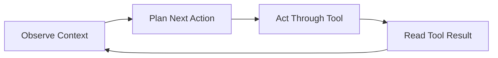

Ini loop yang paling sering dibahas orang. Tetapi ini hanya sebagian kecil.

---

## 4.2 Verification Repair Loop

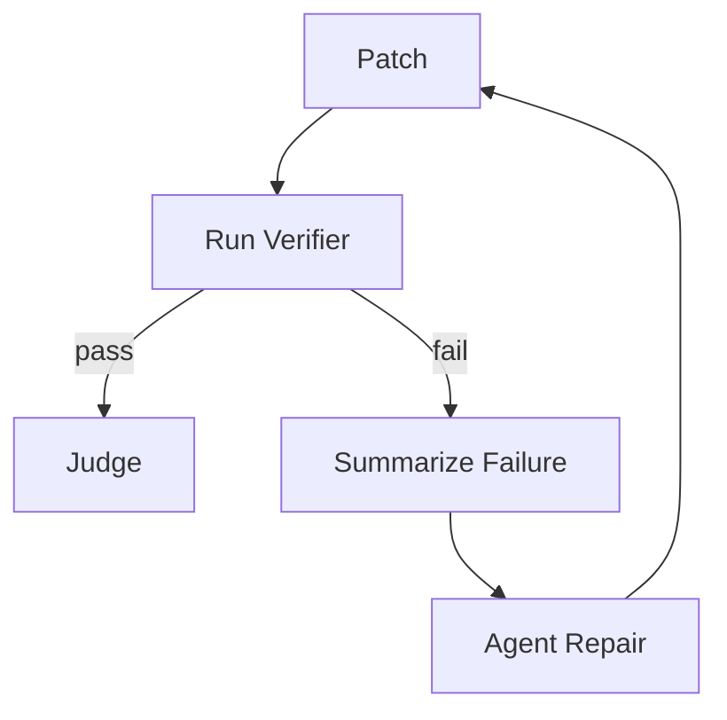

Loop ini membuat agent berguna untuk software nyata. Tanpa loop ini, agent hanya menghasilkan first draft.

---

## 4.3 PR Review Loop

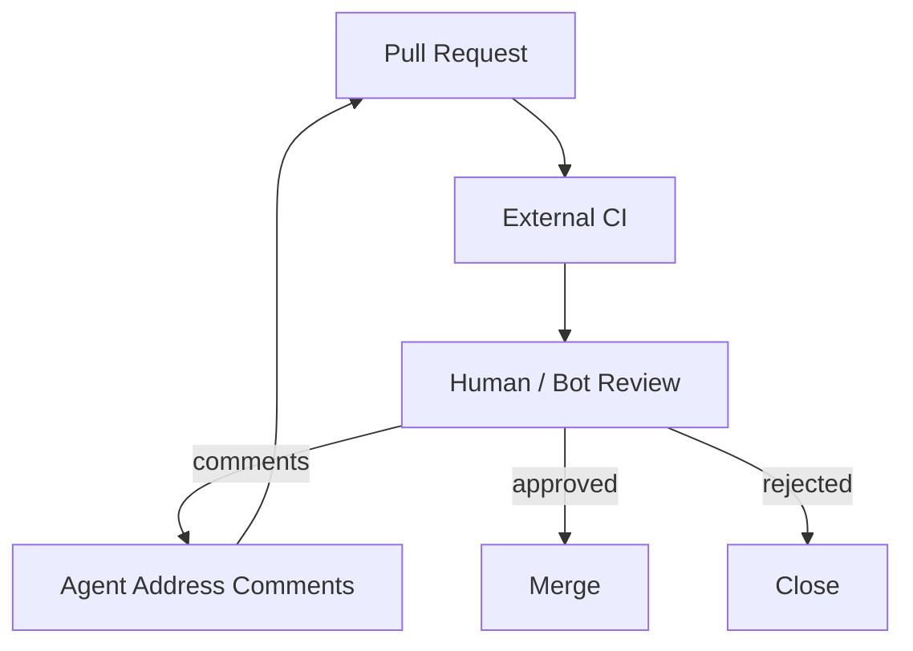

Agent bisa diperluas agar menangani review comments. Tetapi pada tahap awal, cukup membuat PR yang jelas dan aman.

---

## 4.4 Fleet Campaign Loop

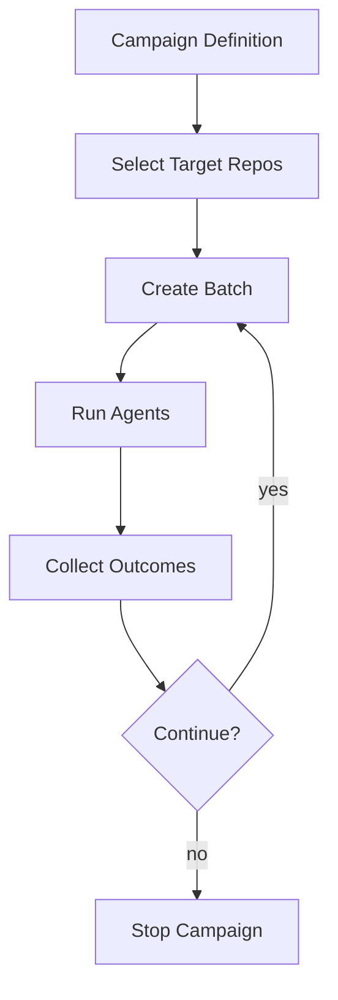

Fleet loop dibutuhkan untuk perubahan banyak repository. Jangan langsung menjalankan 1.000 repo. Jalankan batch kecil, lihat outcome, perbaiki prompt/verifier, lalu scale.

---

## 5. Trust boundary

Kita perlu menggambar garis kepercayaan.

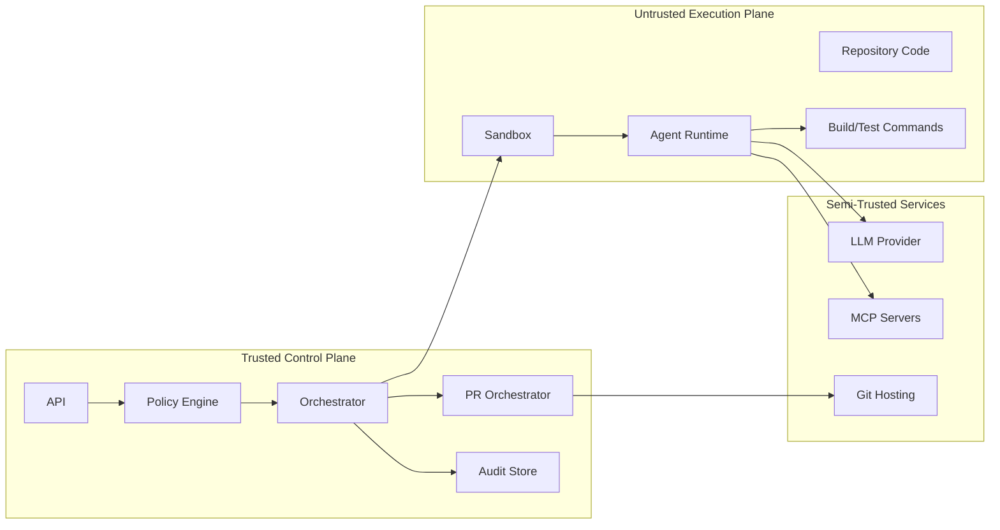

Poin penting:

- Repository code harus dianggap tidak dipercaya.
- Build command harus dianggap tidak dipercaya.
- Tool output harus dianggap bisa mengandung prompt injection.
- MCP server eksternal harus dianggap semi-trusted atau untrusted tergantung kontrol kita.
- LLM provider tidak boleh menerima secret yang tidak perlu.
- Control plane harus tetap menjadi sumber kebenaran state.

---

## 6. Data model konseptual

Nanti kita akan detailkan database schema di part khusus. Untuk sekarang, cukup pahami entity utama:

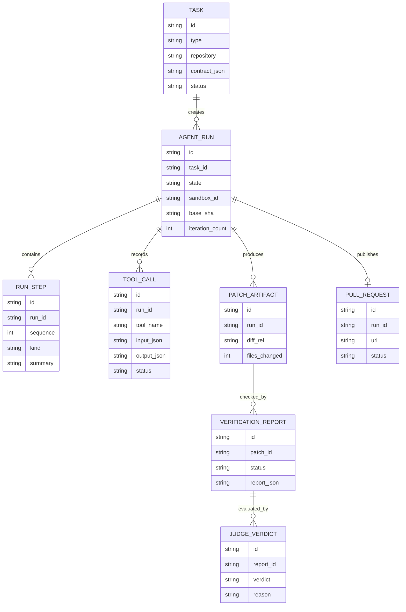

Entity ini bukan sekadar database. Ini mental model. Setiap run harus bisa dijawab:

- task apa yang dikerjakan;
- agent melakukan langkah apa;
- tool apa yang dipakai;
- patch apa yang dihasilkan;
- verifier apa yang lewat/gagal;
- judge memutuskan apa;
- PR apa yang dibuat.

---

## 7. End-to-end scenario: dependency migration

Mari lihat contoh flow konkret.

### Task

```text
Migrate billing-service from legacy-client 2.x to modern-client 3.x.
Keep public API unchanged. Update tests. Open PR only if mvn test passes.
```

### Step 1 — Intake membuat task contract

Task intake mengubah teks menjadi constraint:

- repo: `billing-service`;
- allowed paths: `pom.xml`, `src/main/java/**`, `src/test/java/**`;
- forbidden: `db/**`, `infra/**`;
- verifier: `mvn -q test`, `no_old_imports`, `no_deleted_tests`;
- max iterations: 8.

### Step 2 — Policy memutuskan mode

Policy memberi mode:

```text
allow run, no external network except Maven proxy, PR allowed, no auto-merge
```

### Step 3 — Repository disiapkan

Repository provider:

- clone repo;
- checkout `main`;
- create branch `agent/migrate-modern-client-task-001`;
- detect Maven;
- detect Java version;
- read ownership.

### Step 4 — Agent runtime mulai bekerja

Agent mencari dependency lama:

```text
search_text("legacy-client")
read_file("pom.xml")
search_text("LegacyClient")
```

Agent membuat rencana:

1. update dependency;
2. ganti import;
3. adapt constructor;
4. update tests;
5. run Maven test.

### Step 5 — Agent mengedit file

Tool controller memvalidasi path, lalu mengizinkan edit.

### Step 6 — Verifier gagal

`mvn -q test` gagal karena constructor baru butuh `ModernClientConfig`.

Verifier report merangkum:

```text
Compilation failed in BillingClientAdapterTest and InvoiceClientFactoryTest.
ModernClient constructor now requires ModernClientConfig.
```

### Step 7 — Judge meminta repair

Judge berkata `needs_repair`, bukan `rejected`, karena error relevan dan bisa diperbaiki.

### Step 8 — Agent repair

Agent membaca test, menambahkan config fixture, run test lagi.

### Step 9 — Verifier pass

Semua check pass.

### Step 10 — Judge acceptable

Judge memeriksa:

- dependency lama hilang;
- dependency baru ada;
- tests tidak dihapus;
- public API tidak berubah;
- file changed masih dalam scope.

### Step 11 — PR dibuat

PR body menyertakan summary, verification, risk, dan run ID.

Flow lengkap:

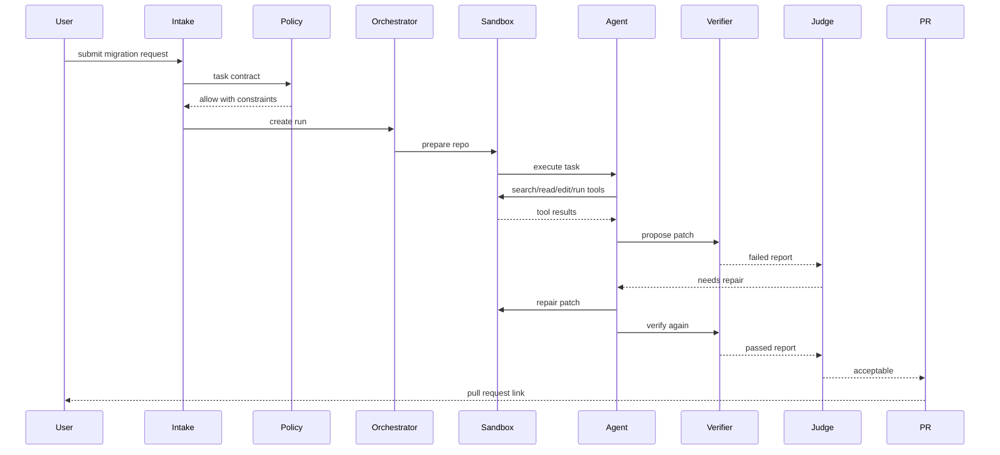

---

## 8. Why not just use an existing coding agent?

Existing tools are useful. Kita tetap belajar membangun dari scratch karena tujuan seri ini bukan hanya “pakai tool”, tetapi memahami **sistem di balik tool**.

Claude Code, Codex, Copilot agent, dan tool sejenis membuktikan pola industri: coding agent membaca repo, mengedit file, menjalankan command, dan/atau bekerja dalam cloud sandbox. Tetapi sebagai engineer yang membangun platform internal, kita perlu memahami:

- bagaimana task dibatasi;
- bagaimana policy diterapkan;
- bagaimana sandbox disiapkan;
- bagaimana verifier dibuat;
- bagaimana PR dinilai;
- bagaimana run diaudit;
- bagaimana agent digunakan untuk ribuan repository;
- bagaimana mencegah blast radius.

Menggunakan agent tanpa memahami arsitekturnya seperti menjalankan migrasi database tanpa memahami transaksi.

---

## 9. Vertical slice pertama yang akan kita bangun

Untuk menghindari sistem terlalu besar di awal, vertical slice pertama adalah:

> Satu repository lokal, satu task, satu sandbox sederhana, satu agent loop, file tools, shell tool terbatas, git diff, verifier command, dan output patch report.

Belum ada:

- multi-tenant;
- fleet campaign;
- real PR creation;
- MCP custom server;
- distributed queue;
- complex permissions;
- multi-provider model fallback.

Tetapi vertical slice harus sudah punya invariant production-grade:

- semua tool call tercatat;
- path write dibatasi;
- command punya timeout;
- diff bisa dilihat;
- verifier berjalan;
- run state jelas;
- failure tidak disembunyikan.

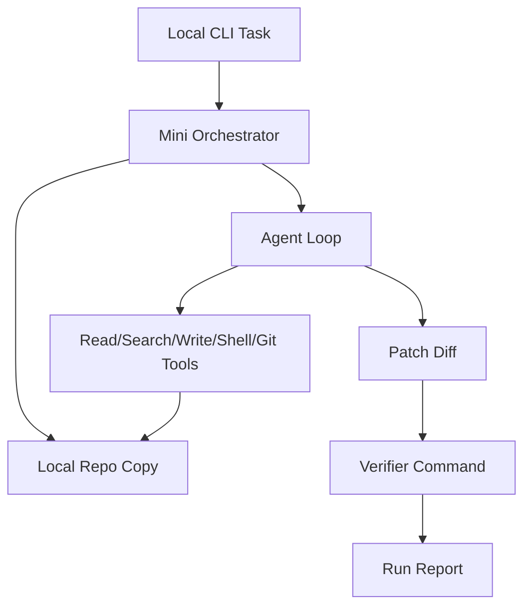

Ini adalah benih dari platform besar. Jangan mulai dari UI cantik. Mulai dari loop yang benar.

---

## 10. Arsitektur folder awal

Kita akan memakai struktur konseptual seperti ini:

```text
ai-coding-agent/
  apps/
    agent-cli/
    control-api/
    worker/
  packages/
    contracts/
    orchestrator/
    agent-runtime/
    tool-runtime/
    repository-provider/
    sandbox/
    verifier/
    judge/
    pr-orchestrator/
    observability/
  examples/
    java-maven-migration/
    node-small-service/
  docs/
    architecture/
    task-contracts/
    runbooks/
```

Penjelasan singkat:

| Module | Tanggung jawab |
|---|---|
| `contracts` | schema task, run, tool call, verdict |
| `orchestrator` | state machine dan lifecycle |
| `agent-runtime` | loop LLM + tool use |
| `tool-runtime` | registry, validation, dispatch |
| `repository-provider` | clone, branch, metadata |
| `sandbox` | environment execution |
| `verifier` | build/test/check pipeline |
| `judge` | verdict accept/repair/reject |
| `pr-orchestrator` | PR branch, body, labels |
| `observability` | logs, traces, metrics, replay |

Bahasa implementasi bisa Java, Go, Node, atau campuran. Dalam seri ini, fokus utama adalah arsitektur dan implementasi followable. Ketika contoh butuh konkret, kita akan memilih implementasi yang membuat konsep paling jelas.

---

## 11. Kesalahan desain yang harus dihindari sejak awal

### 11.1 Membiarkan prompt menjadi satu-satunya policy

Jangan menulis:

```text
Please do not modify dangerous files.
```

lalu berharap agent patuh.

Harus ada enforcement:

```text
write_file("infra/prod.yaml") -> denied by policy
```

Prompt adalah instruksi. Policy adalah batas.

---

### 11.2 Mengirim semua log mentah ke model

Build log besar merusak context. Summarize dulu.

Buruk:

```text
paste 20,000 lines of Maven output
```

Baik:

```json
{
  "errorType": "compilation_error",
  "primaryFiles": ["BillingClientAdapterTest.java"],
  "rootCause": "Constructor signature mismatch after dependency migration",
  "firstErrors": ["line 42: ModernClient requires ModernClientConfig"]
}
```

---

### 11.3 Membuat PR hanya karena agent berkata selesai

PR hanya boleh dibuat setelah evidence minimum terpenuhi.

Evidence bisa berbeda per task, tetapi harus eksplisit.

---

### 11.4 Tidak menyimpan trace

Kalau PR buruk muncul dan tidak ada trace, tim tidak bisa menjawab:

- kenapa file ini berubah;
- prompt apa yang dipakai;
- verifier apa yang dijalankan;
- command apa yang gagal;
- kenapa judge menerima;
- siapa memberi izin.

Tanpa trace, agent platform tidak defensible.

---

### 11.5 Menggunakan agent untuk semua hal

Tidak semua perubahan cocok untuk agentic transform. Sebagian lebih aman memakai deterministic codemod.

Contoh:

| Use case | Lebih cocok |
|---|---|
| Rename import massal | deterministic codemod |
| API migration dengan edge case | hybrid codemod + agent |
| Bug fix unknown root cause | agentic exploration |
| Formatting | formatter |
| Update generated code | generator |
| Refactor semantic besar | agent + human loop |

Top engineer tidak memakai agent untuk semua hal. Top engineer memilih mekanisme perubahan paling aman.

---

## 12. Checklist arsitektur Honk-like

Sebuah sistem mulai pantas disebut Honk-like jika punya minimal:

- task intake berbasis contract;
- background run lifecycle;
- repository preparation;
- sandboxed execution;
- agent loop dengan tool runtime;
- file/search/edit/shell/git tools;
- verifier pipeline;
- repair loop;
- judge/verdict;
- PR artifact;
- audit log;
- policy enforcement;
- batch/fleet path untuk banyak repo.

Bukan Honk-like jika hanya:

- prompt ke model;
- generate patch sekali;
- tidak run test;
- tidak ada sandbox;
- tidak ada run trace;
- tidak ada PR discipline;
- tidak ada policy.

---

## 13. Ringkasan mental model

Simpan model ini:

```text
A Honk-like coding agent is not an LLM feature.
It is a controlled code-change platform.

The LLM proposes actions.
Tools execute actions.
Policy constrains actions.
Sandbox isolates actions.
Verifier produces evidence.
Judge decides acceptability.
PR exposes the result.
Audit preserves trust.
```

Kalau satu kalimat:

> Honk-like agent adalah **background software maintenance system** yang memakai LLM sebagai reasoning engine, tetapi mengandalkan sandbox, tool boundary, verifier, judge, dan PR workflow sebagai trust machinery.

---

## 14. Apa yang akan dilanjutkan di Part 004

Part berikutnya akan mengklasifikasikan jenis coding agent:

- CLI agent;
- IDE agent;
- cloud agent;
- background agent;
- fleet agent;
- PR reviewer agent;
- deterministic codemod bot;
- hybrid migration agent.

Kenapa taxonomy penting?

Karena banyak diskusi AI coding agent rancu. Orang membandingkan autocomplete, terminal agent, background PR agent, dan fleet migration system seolah semuanya sama. Padahal arsitektur, risk, permission, context, dan output artifact-nya berbeda.

Part 004 akan membantu kita menentukan: **agent jenis apa yang sedang kita bangun, apa boundary-nya, dan konsekuensi desainnya.**
