------
title: Learn AI Coding Agent From Scratch - Part 004
description: Taxonomy AI coding agent: CLI agent, IDE agent, cloud agent, background agent, fleet agent, PR reviewer, codemod bot, dan hybrid migration agent beserta konsekuensi arsitekturnya.
series: learn-ai-coding-agent
seriesTitle: Learn AI Coding Agent From Scratch
order: 4
partTitle: Agent Taxonomy CLI IDE Cloud Background Fleet
tags:
- ai-coding-agent
- taxonomy
- cli-agent
- ide-agent
- cloud-agent
- background-agent
- fleet-agent
date: 2026-07-03
---

# Part 004 — Agent Taxonomy: CLI, IDE, Cloud, Background, Fleet

Banyak pembahasan AI coding agent gagal sejak awal karena semua jenis agent dicampur menjadi satu.

Autocomplete di IDE, chatbot yang menjawab pertanyaan kode, CLI agent yang mengedit file lokal, cloud agent yang membuat PR, background agent yang berjalan dari Slack, dan fleet agent yang memigrasi ribuan repository adalah sistem yang berbeda. Mereka sama-sama memakai LLM, tetapi berbeda dalam:

- lokasi eksekusi;
- sumber konteks;
- permission model;
- artifact yang dihasilkan;
- feedback loop;
- risk profile;
- observability;
- governance;
- pola interaksi manusia.

Part ini bertujuan membuat taxonomy yang bersih agar kita tidak salah desain.

Kita sedang membangun **Honk-like background/fleet coding agent**, tetapi untuk membangun itu dengan benar kita perlu tahu batasnya terhadap jenis agent lain.

Referensi faktual yang relevan:

- Claude Code mendeskripsikan dirinya sebagai agentic coding tool yang membaca codebase, mengedit file, menjalankan command, dan terintegrasi dengan development tools.  
  https://code.claude.com/docs/en/overview
- OpenAI Codex Cloud diposisikan sebagai cloud-based software engineering agent yang menjalankan task di cloud sandbox dan dapat membuat PR.  
  https://openai.com/index/introducing-codex/  
  https://developers.openai.com/codex/cloud
- GitHub Copilot cloud agent berjalan di GitHub, membuat branch, mengubah kode, dan dapat menyiapkan PR.  
  https://docs.github.com/en/copilot/concepts/agents/cloud-agent/about-cloud-agent
- Spotify Honk dipublikasikan sebagai background coding agent untuk large-scale software maintenance dan PR workflow.  
  https://engineering.atspotify.com/2025/11/spotifys-background-coding-agent-part-1

---

## 1. Kenapa taxonomy penting?

Tanpa taxonomy, kita mudah membuat kesimpulan salah.

Contoh kesalahan:

```text
"Agent saya aman karena hanya berjalan di terminal developer."
```

Itu mungkin benar untuk local CLI agent, tetapi tidak cukup untuk background fleet agent. Kalau agent berjalan otomatis di 500 repository, masalahnya bukan hanya terminal permission. Masalahnya adalah blast radius, campaign rollout, PR noise, repository lock, reviewer load, dan audit.

Contoh lain:

```text
"Agent saya sudah production-grade karena bisa run test."
```

Run test penting, tetapi cloud/background agent juga butuh sandbox, policy, credential boundary, PR orchestration, run lifecycle, cancellation, quota, dan trace.

Taxonomy membantu kita bertanya:

1. Di mana agent berjalan?
2. Siapa yang memberi izin?
3. Apa yang boleh agent lakukan?
4. Apa output resminya?
5. Apa evidence bahwa output benar?
6. Siapa yang menanggung risiko?
7. Bagaimana agent dihentikan?
8. Bagaimana hasilnya diaudit?
9. Bagaimana sistem scale?

---

## 2. Dimensi klasifikasi agent

Kita klasifikasikan coding agent bukan berdasarkan nama produk, tetapi berdasarkan dimensi desain.

| Dimensi | Pertanyaan desain |
|---|---|
| Interaction mode | Apakah agent interaktif, background, atau scheduled? |
| Execution location | Lokal, IDE, cloud sandbox, CI, Kubernetes worker? |
| Scope | Satu file, satu repo, multi-repo, fleet? |
| Autonomy | Suggestion-only, edit-with-approval, autonomous PR, campaign? |
| Permission | Read-only, write file, run command, network, secret, push branch? |
| Context source | Open files, repo search, issue, docs, build logs, metadata platform? |
| Output artifact | Suggestion, patch, commit, PR, review comment, migration report? |
| Feedback loop | Human chat, compiler, test, CI, reviewer, fleet metrics? |
| Risk model | Local mistake, repo breakage, supply chain, blast radius, governance? |
| Observability | Chat history, local log, trace, replay, audit trail? |

Produk yang terlihat mirip bisa berbeda total di dimensi ini.

---

## 3. Jenis 1 — Chat Coding Assistant

### Definisi

Chat coding assistant menjawab pertanyaan dan menghasilkan kode di chat. Ia tidak punya akses langsung ke repository atau hanya punya konteks yang ditempel user.

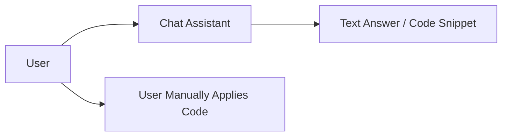

### Ciri utama

| Aspek | Karakteristik |
|---|---|
| Execution | Tidak menjalankan kode |
| Context | Diberikan user secara manual |
| Output | Teks/snippet |
| Verification | User manual |
| Risk | Salah saran, outdated context |
| Strength | Cepat untuk penjelasan, brainstorming, review kecil |

### Cocok untuk

- bertanya konsep;
- menjelaskan error;
- membuat draft function;
- membandingkan opsi desain;
- review snippet kecil;
- menulis test case sederhana.

### Tidak cocok untuk

- migrasi multi-file;
- large refactor;
- dependency upgrade nyata;
- PR otomatis;
- codebase yang butuh build/test;
- perubahan sensitif.

### Mental model

Chat assistant adalah **advisor**, bukan actor.

Masalah utama: ia tidak punya ground truth kecuali yang diberikan user. Karena itu ia sering terlihat meyakinkan tetapi salah konteks.

---

## 4. Jenis 2 — IDE Completion / Inline Assistant

### Definisi

IDE assistant bekerja di dalam editor: autocomplete, inline edit, code action, quick fix, test generation, atau refactor suggestion.

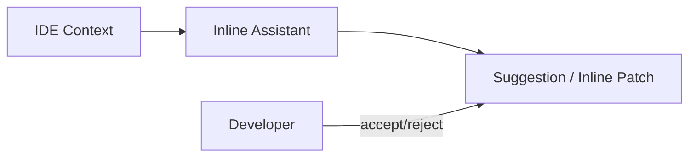

### Ciri utama

| Aspek | Karakteristik |
|---|---|
| Execution | Biasanya tidak menjalankan full workflow |
| Context | Open files, project index, cursor location |
| Output | Inline suggestion atau edit lokal |
| Verification | Developer + IDE checks |
| Risk | Local edit buruk, context sempit |
| Strength | Latency rendah, cocok untuk flow coding harian |

### Cocok untuk

- melengkapi boilerplate;
- menulis mapping sederhana;
- membuat helper function;
- memperbaiki syntax;
- menulis unit test lokal;
- rename atau small refactor dengan kontrol developer.

### Tidak cocok untuk

- task background;
- perubahan lintas banyak repo;
- automated PR;
- campaign migration;
- long-running verification.

### Mental model

IDE assistant adalah **pairing accelerator**. Developer tetap menjadi execution controller.

---

## 5. Jenis 3 — CLI Coding Agent

### Definisi

CLI coding agent berjalan di terminal lokal atau dev container. Ia bisa membaca repository, mencari file, mengedit file, menjalankan command, dan melakukan iterasi.

Claude Code adalah contoh modern yang secara resmi dideskripsikan sebagai agentic coding tool yang membaca codebase, mengedit file, menjalankan command, dan terintegrasi dengan development tools.

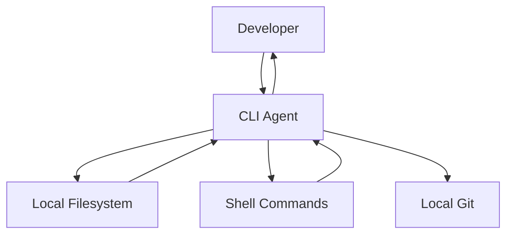

### Ciri utama

| Aspek | Karakteristik |
|---|---|
| Execution | Lokal/dev container |
| Context | Repository lokal + command output |
| Output | Local diff, commit ops optional |
| Verification | Command lokal |
| Permission | Developer approval atau configured mode |
| Risk | Shell command berbahaya, secret lokal, repo damage |
| Strength | Sangat powerful untuk task developer sehari-hari |

### Cocok untuk

- bug fix lokal;
- test repair;
- refactor satu repo;
- dependency upgrade kecil;
- eksplorasi codebase;
- menyiapkan PR manual.

### Tidak cocok untuk

- unattended execution dalam skala besar;
- multi-tenant platform;
- fleet migration tanpa control plane;
- task yang butuh audit enterprise;
- menjalankan untrusted repo tanpa sandbox.

### Design implication

CLI agent butuh:

- permission prompt;
- command approval;
- `.agent` / `AGENTS.md` / project instruction;
- context compaction;
- local session log;
- git diff discipline;
- safe default untuk destructive command.

Tetapi CLI agent tidak otomatis punya:

- queue;
- central audit;
- campaign control;
- PR orchestration;
- repository targeting;
- multi-user policy.

### Mental model

CLI agent adalah **local autonomous pair programmer**. Ia kuat karena dekat dengan dev environment, tetapi boundary-nya adalah mesin/developer yang menjalankannya.

---

## 6. Jenis 4 — Cloud Coding Agent

### Definisi

Cloud coding agent menerima task, menyiapkan repository di cloud sandbox, menjalankan agent di environment terpisah, lalu menghasilkan patch atau PR.

OpenAI Codex Cloud dan GitHub Copilot cloud agent berada di kelas ini: task bisa berjalan di background, repository disiapkan di environment cloud, dan hasilnya bisa menjadi branch/PR.

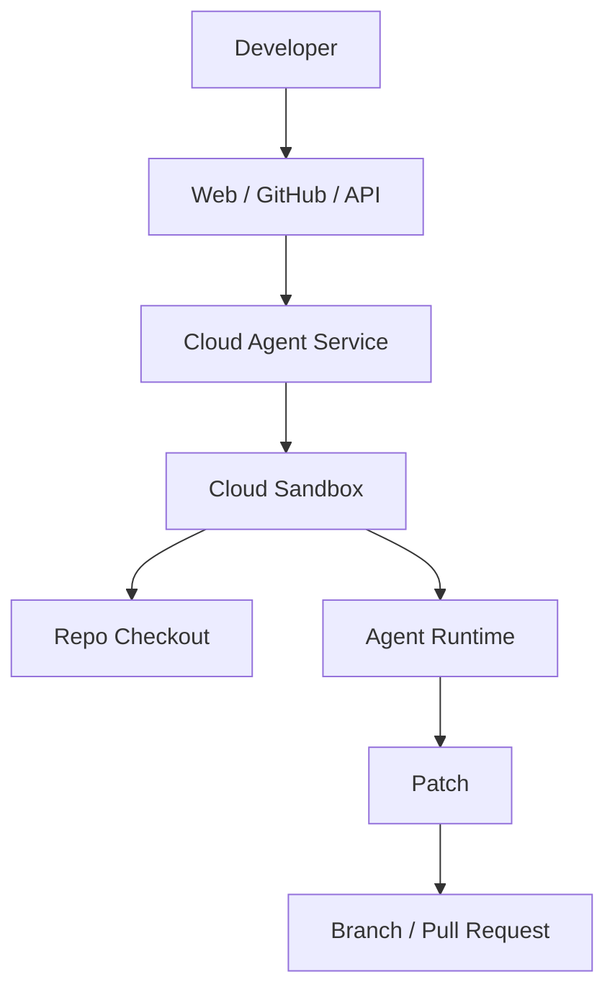

### Ciri utama

| Aspek | Karakteristik |
|---|---|
| Execution | Cloud sandbox |
| Context | Repo checkout + task + optional issue/PR context |
| Output | Patch, branch, PR |
| Verification | Sandbox commands + CI |
| Permission | Connected git account/app installation |
| Risk | Sandbox escape, credential scope, PR spam, supply chain |
| Strength | Bisa berjalan async, tidak mengganggu mesin developer |

### Cocok untuk

- task yang bisa dijelaskan sebagai issue;
- bug fix terisolasi;
- feature kecil/menengah;
- test generation;
- PR review fix;
- background work paralel.

### Tidak cocok untuk

- perubahan lintas banyak repo tanpa campaign layer;
- perubahan high-risk tanpa governance;
- task butuh akses production secret;
- task dengan requirement ambigu tinggi;
- refactor arsitektural yang butuh keputusan produk/organisasi.

### Design implication

Cloud agent butuh:

- sandbox allocator;
- repository provider;
- credential scoping;
- network policy;
- execution timeout;
- run state;
- PR integration;
- secure logging;
- cancellation;
- user-visible progress.

### Mental model

Cloud agent adalah **remote worker yang membuat code artifact**. Ia harus diperlakukan seperti worker tidak dipercaya yang diberi izin minimum.

---

## 7. Jenis 5 — Background Coding Agent

### Definisi

Background coding agent berjalan sebagai service internal yang menerima task dari sistem lain: Slack, ticket, migration campaign, scheduled job, dependency dashboard, developer portal, atau platform engineering workflow.

Honk berada di kelas ini. Yang penting bukan UI-nya, tetapi sifatnya: agent berjalan di belakang layar, membuat perubahan, memverifikasi, lalu membawa hasil ke PR workflow.

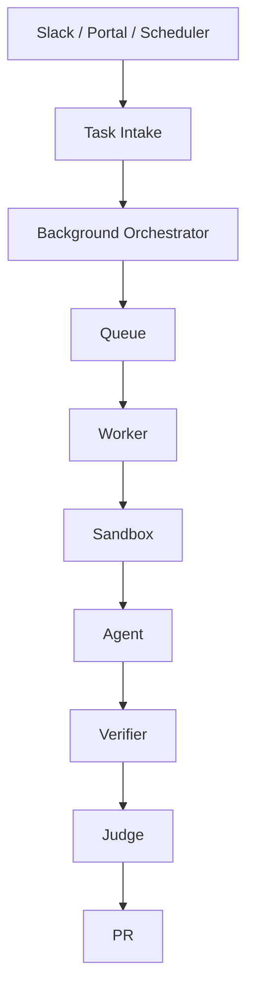

### Ciri utama

| Aspek | Karakteristik |
|---|---|
| Execution | Managed worker/sandbox |
| Context | Task contract + repo + platform metadata |
| Output | PR, report, status update |
| Verification | Custom verifier + CI |
| Permission | Platform policy, not just user prompt |
| Risk | Automation wrong at org scale |
| Strength | Great for maintenance work and async productivity |

### Cocok untuk

- dependency migration;
- build config migration;
- API deprecation cleanup;
- repetitive PR generation;
- test repair campaign;
- small bug from ticket;
- policy-driven code modernization.

### Tidak cocok untuk

- product discovery;
- ambiguous architecture decision;
- changes requiring deep domain negotiation;
- high-risk production behavior change without review;
- no-test legacy system unless additional guard exists.

### Design implication

Background agent butuh semua elemen cloud agent, plus:

- task contract;
- policy engine;
- central run queue;
- observability dashboard;
- audit trail;
- team/repo ownership;
- run cancellation;
- verifier registry;
- judge registry;
- PR conventions;
- notification integration.

### Mental model

Background agent adalah **software maintenance worker**. Ia bukan “developer pengganti”. Ia mengerjakan kelas pekerjaan yang bisa dibatasi, diverifikasi, dan direview.

---

## 8. Jenis 6 — Fleet Coding Agent

### Definisi

Fleet coding agent adalah background agent yang targetnya banyak repository atau banyak service sekaligus.

Inilah kelas yang paling dekat dengan large-scale internal platform.

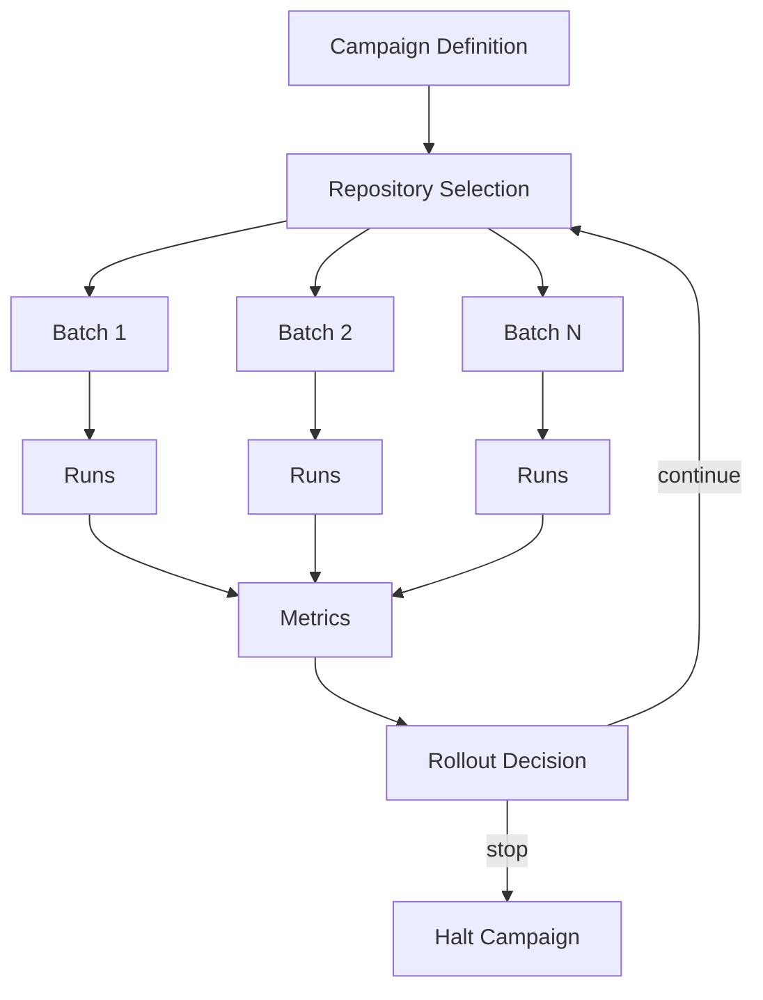

### Ciri utama

| Aspek | Karakteristik |
|---|---|
| Execution | Many workers, many repositories |
| Context | Repo metadata, ownership, dependency inventory |
| Output | Many PRs, campaign report |
| Verification | Per-repo verifier + aggregate metrics |
| Permission | Org-level governance |
| Risk | Blast radius, reviewer overload, systemic bad patch |
| Strength | Massive maintenance leverage |

### Cocok untuk

- framework upgrade across services;
- dependency vulnerability remediation;
- config standardization;
- deprecation removal;
- code ownership metadata migration;
- CI template migration;
- organization-wide API adoption.

### Tidak cocok untuk

- task yang belum terbukti di beberapa repo;
- migration tanpa verifier;
- migration tanpa rollback/stop strategy;
- perubahan semantik besar yang berbeda di tiap domain;
- perubahan yang memerlukan koordinasi release manual di banyak tim.

### Design implication

Fleet agent butuh kemampuan tambahan:

- repository inventory;
- targeting query;
- dry-run mode;
- canary batch;
- prompt/verifier iteration;
- per-team rate limit;
- PR grouping;
- duplicate detection;
- campaign dashboard;
- success/failure taxonomy;
- automatic halt condition.

### Mental model

Fleet agent adalah **migration platform**. LLM membantu adaptasi edge case, tetapi campaign governance menjaga agar kesalahan tidak menyebar.

---

## 9. Jenis 7 — PR Reviewer Agent

### Definisi

PR reviewer agent tidak terutama membuat perubahan. Ia membaca diff, menjalankan analisis, memberi komentar, atau menyarankan patch.

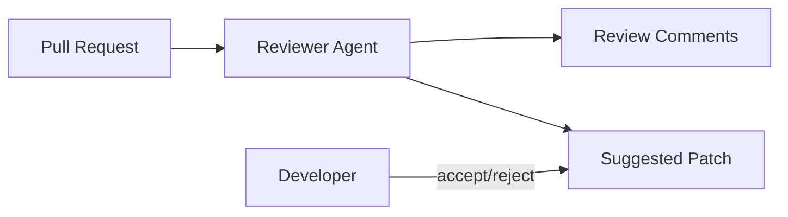

### Ciri utama

| Aspek | Karakteristik |
|---|---|
| Execution | PR context, optional sandbox |
| Context | Diff + surrounding files + CI logs |
| Output | Review comments, suggestions |
| Verification | Static checks, optional test |
| Permission | Usually comment-only or suggestion-only |
| Risk | Noise, false positives, bad advice |
| Strength | Scales review support |

### Cocok untuk

- catching obvious bugs;
- style/policy feedback;
- test gap detection;
- migration compliance;
- summarizing large diff;
- checking generated PRs.

### Tidak cocok untuk

- acting as final authority;
- replacing domain reviewer;
- reviewing unclear business semantics alone;
- blocking PR without deterministic policy.

### Design implication

Reviewer agent should optimize for:

- precision over recall;
- actionable comments;
- low noise;
- citation to file/line;
- severity classification;
- deterministic checks for hard blocks;
- explainable rationale.

### Mental model

PR reviewer agent adalah **review amplifier**, bukan merge authority.

---

## 10. Jenis 8 — Deterministic Codemod Bot

### Definisi

Codemod bot melakukan transformasi deterministik: AST rewrite, regex terkontrol, formatter, generator, atau migration script.

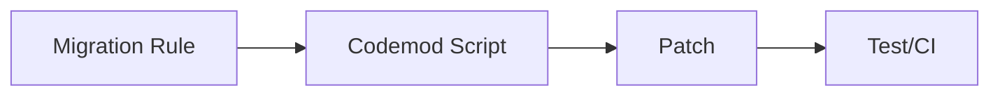

### Ciri utama

| Aspek | Karakteristik |
|---|---|
| Execution | Script/rule-based |
| Context | AST/text/build metadata |
| Output | Deterministic patch |
| Verification | Test + rule checks |
| Permission | Programmatic |
| Risk | Rule bug affects many files |
| Strength | Fast, repeatable, cheap, predictable |

### Cocok untuk

- import rename;
- annotation migration;
- method signature transform yang jelas;
- package rename;
- config key rename;
- generated code update;
- formatting.

### Tidak cocok untuk

- task dengan banyak semantic judgement;
- ambiguous bug fix;
- unknown API usage patterns;
- migration yang butuh adaptasi domain-specific.

### Design implication

Codemod bot harus diutamakan ketika transformasi jelas. Jangan memakai LLM jika AST transform cukup.

Top engineer memilih codemod untuk deterministic work dan agent untuk adaptive work.

### Mental model

Codemod bot adalah **compiler-like transformer**. Ia kurang fleksibel, tetapi lebih predictable.

---

## 11. Jenis 9 — Hybrid Migration Agent

### Definisi

Hybrid migration agent menggabungkan deterministic codemod dan LLM agent.

Pola umum:

1. deterministic codemod melakukan 80% perubahan aman;
2. build/test menemukan edge case;
3. LLM agent memperbaiki kasus yang tidak tertangani;
4. verifier memastikan hasil;
5. judge menilai scope.

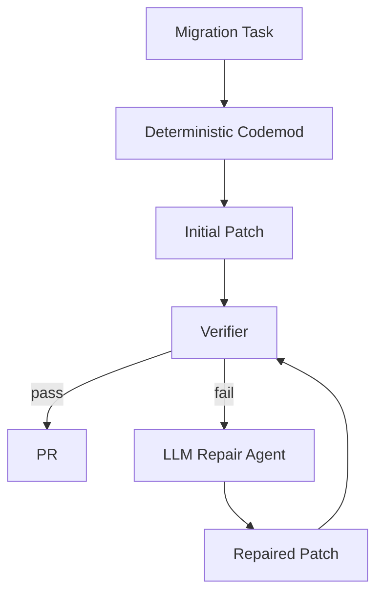

### Ciri utama

| Aspek | Karakteristik |
|---|---|
| Execution | Script + agent loop |
| Context | Rule output + verifier error + targeted files |
| Output | Patch/PR |
| Verification | Strongly required |
| Permission | Constrained to migration scope |
| Risk | Agent overcorrects codemod result |
| Strength | Best of deterministic and adaptive approaches |

### Cocok untuk

- framework migration;
- dependency upgrade with breaking changes;
- API deprecation cleanup;
- test repair after codemod;
- monorepo migration;
- config migration with edge cases.

### Tidak cocok untuk

- migration without clear invariant;
- tasks where no verifier can detect correctness;
- changes that need product decisions.

### Design implication

Hybrid agent butuh:

- clear codemod output;
- verifier feedback;
- strict diff boundary;
- agent repair scope;
- before/after invariant;
- fallback to manual review when repair fails.

### Mental model

Hybrid migration agent adalah **codemod with adaptive repair**. Ini sering lebih aman daripada pure autonomous agent.

---

## 12. Comparative matrix

| Agent type | Runs where | Writes code? | Runs commands? | Creates PR? | Best for | Main risk |
|---|---|---:|---:|---:|---|---|
| Chat assistant | Chat | No | No | No | Explanation, snippets | Wrong context |
| IDE assistant | IDE | With user accept | Rare/limited | No | Inline productivity | Local bad edit |
| CLI agent | Local terminal | Yes | Yes | Optional | Single-repo work | Local secret/shell risk |
| Cloud agent | Cloud sandbox | Yes | Yes | Yes | Async task PR | Credential/sandbox risk |
| Background agent | Managed service | Yes | Yes | Yes | Maintenance automation | Bad autonomous PRs |
| Fleet agent | Managed fleet | Yes | Yes | Many PRs | Org-wide migrations | Blast radius |
| PR reviewer | PR workflow | Usually no | Optional | No | Review assist | Noisy comments |
| Codemod bot | Script runner | Yes | Optional | Optional | Deterministic migration | Rule bug |
| Hybrid migration | Script + agent | Yes | Yes | Yes | Adaptive migration | Overrepair |

---

## 13. Taxonomy by autonomy level

Autonomy matters more than product name.

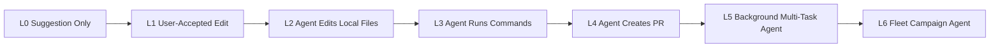

### L0 — Suggestion only

Agent suggests code. Human applies.

Risk low, leverage limited.

### L1 — User-accepted edit

Agent proposes edit inside IDE. Human accepts.

Good for local productivity.

### L2 — Agent edits files

Agent writes to workspace. Need diff review.

### L3 — Agent runs commands

Now risk increases sharply. Shell command can be dangerous. Need permissions, timeout, redaction.

### L4 — Agent creates PR

Now output affects team workflow. Need PR convention, verifier, reviewer expectation.

### L5 — Background multi-task agent

Now agent works without continuous human supervision. Need state machine, queue, audit.

### L6 — Fleet campaign agent

Now one bad pattern can affect many repositories. Need rollout control, canary, halt, metrics, governance.

Our target is eventually L6, but we build from L2/L3 vertical slice first.

---

## 14. Taxonomy by artifact

Another useful classification: what does the agent produce?

| Artifact | Required rigor |
|---|---|
| Explanation | Cite reasoning, no execution needed |
| Snippet | Syntax check maybe enough |
| Local diff | Git diff and local tests |
| Commit | Commit message, author policy |
| Pull request | PR body, verification evidence, reviewers |
| Review comment | Precision, line reference, severity |
| Campaign report | Aggregate metrics, failure taxonomy |
| Migration plan | Target selection, rollout, rollback |

A PR-producing agent has much higher responsibility than a snippet-producing assistant.

---

## 15. Taxonomy by execution trust

Execution location changes the risk model.

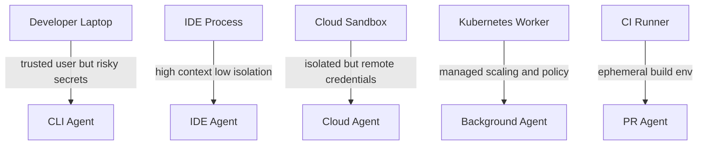

### Local execution

Pros:

- close to developer;
- has existing environment;
- fast iteration;
- easy to inspect diff.

Cons:

- secrets may exist locally;
- command can damage workspace;
- hard to centrally audit;
- environment may not be reproducible.

### Cloud sandbox

Pros:

- isolated;
- reproducible;
- parallelizable;
- suitable for async tasks.

Cons:

- credential management hard;
- network policy needed;
- environment parity problem;
- cost and quota management.

### CI runner

Pros:

- already tied to repo;
- good for verification;
- ephemeral;
- familiar permission model.

Cons:

- not designed for long agent loops;
- expensive if abused;
- hard for interactive context;
- supply-chain risk still exists.

---

## 16. Taxonomy by context source

Context determines quality.

| Context source | Used by | Strength | Risk |
|---|---|---|---|
| User prompt | all | intent | ambiguity |
| Open file | IDE | local precision | narrow scope |
| Repo search | CLI/cloud/background | real code | too much noise |
| Build logs | CLI/cloud/background | concrete failure | huge/noisy logs |
| Issue/PR discussion | cloud/background | requirement context | stale or contradictory |
| Ownership metadata | background/fleet | reviewer routing | stale org data |
| Dependency inventory | fleet | targeting | incomplete data |
| Docs/ADR | advanced agents | design intent | outdated docs |
| MCP tools/resources | advanced agents | structured integration | tool trust boundary |

The more autonomous the agent, the more curated its context must be.

Chat assistant can ask user for clarification. Fleet agent cannot ask 500 teams for every ambiguity. It needs task contract, metadata, and stop conditions.

---

## 17. Taxonomy by verifier strength

Agent autonomy should not exceed verifier strength.

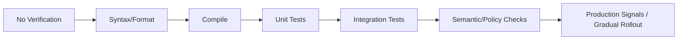

Guideline:

| Verifier level | Safe autonomy level |
|---|---|
| No verification | explanation/snippet only |
| Format/syntax | small local edits |
| Compile | simple refactor |
| Unit tests | PR for bounded change |
| Integration tests | moderate behavior change |
| Policy + semantic checks | background automation |
| Rollout signals | fleet/platform change |

If verifier is weak, autonomy must be low.

This is one of the most important rules in the whole series:

> Do not increase autonomy without increasing verification.

---

## 18. Taxonomy by failure mode

Each agent class fails differently.

| Agent type | Typical failure |
|---|---|
| Chat assistant | plausible but wrong answer |
| IDE assistant | bad inline completion accepted too quickly |
| CLI agent | destructive command, over-editing, local env mismatch |
| Cloud agent | sandbox missing dependency, wrong branch, PR noise |
| Background agent | weak task contract, hidden failure, bad PR artifact |
| Fleet agent | repeated wrong pattern across many repos |
| Reviewer agent | noisy false positive comments |
| Codemod bot | deterministic bug applied everywhere |
| Hybrid migration | agent repairs symptoms instead of root cause |

Failure modeling is not pessimism. It is architecture.

---

## 19. Where Honk-like fits

Our target system is not just a CLI agent and not just a cloud agent.

It is closer to:

```text
Background Agent + Fleet Agent + Hybrid Migration Agent + PR Orchestrator
```

Meaning:

- task can be triggered asynchronously;
- agent runs in managed sandbox;
- platform controls policy;
- output is PR/report;
- verifier is mandatory;
- judge decides accept/repair/reject;
- system can scale from one repo to many;
- deterministic codemod can be combined with agent repair;
- human review remains part of trust chain.

Diagram:

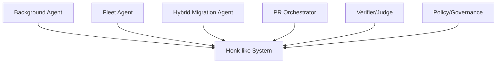

That means we should not optimize only for chat UX or local editing speed. We optimize for:

- repeatable task execution;
- safe automation;
- evidence-based PR;
- scalable rollout;
- auditability;
- low blast radius.

---

## 20. Choosing the right agent for a task

Use this decision table.

| Task | Best mechanism | Why |
|---|---|---|
| “Explain this stack trace” | Chat assistant / CLI read-only | No code change needed |
| “Implement this helper function” | IDE / CLI agent | Local context enough |
| “Fix failing unit test in this repo” | CLI/cloud agent | Needs command feedback |
| “Upgrade this one dependency” | Cloud/background agent | Bounded PR workflow |
| “Replace deprecated API across 200 repos” | Fleet hybrid migration | Needs campaign control |
| “Rename import package across codebase” | Codemod bot | Deterministic transform |
| “Migrate API with varied call patterns” | Hybrid agent | Codemod + adaptive repair |
| “Review this PR for risky changes” | PR reviewer agent | Review artifact exists |
| “Refactor core domain architecture” | Human-led with agent assist | Ambiguity too high |
| “Change production behavior with weak tests” | Human-led, add tests first | Verifier too weak |

A strong engineer does not ask “can an LLM do this?” first. They ask:

1. Is the change bounded?
2. Is the desired outcome observable?
3. Is verification strong enough?
4. Is blast radius controlled?
5. Is human review placed at the right point?

---

## 21. Anti-pattern: one agent to rule them all

Do not build a generic agent that can do anything across every repository with broad permissions.

That path leads to:

- unpredictable behavior;
- impossible debugging;
- high token cost;
- poor verifier fit;
- broad security exposure;
- reviewer distrust;
- many abandoned PRs.

Better pattern:

```text
Many narrow task modes + strong contracts + specific verifiers + controlled rollout
```

Examples:

- `dependency-upgrade-agent`;
- `api-migration-agent`;
- `test-repair-agent`;
- `config-modernization-agent`;
- `pr-review-agent`;
- `build-fix-agent`.

They can share the same platform, but each task mode should have its own:

- prompt contract;
- allowed paths;
- tool permissions;
- verifier pipeline;
- judge criteria;
- PR template;
- risk level.

---

## 22. Anti-pattern: treating fleet work as repeated single-repo work

A fleet campaign is not just many single-repo tasks.

Fleet work introduces new concerns:

| Concern | Why it appears at fleet scale |
|---|---|
| Target selection | Need know which repos are affected |
| Batching | Avoid huge blast radius |
| Ownership | PRs need correct reviewers |
| Rate limit | Git provider/CI/model quotas |
| Pattern drift | Edge cases differ per repo |
| Metrics | Need aggregate success/failure view |
| Halt condition | Stop if failure pattern emerges |
| Reviewer load | Too many PRs creates org friction |
| Duplicate work | Teams may already be migrating manually |

So the correct mental model is:

```text
single-repo agent = execution unit
fleet agent = campaign control system
```

The single-repo agent is a worker. The fleet system is the manager.

---

## 23. Anti-pattern: using LLM where compiler already knows the answer

If compiler, type checker, AST, schema validator, or formatter can solve it deterministically, use them.

Examples:

- format code → formatter;
- sort imports → IDE/compiler tool;
- rename symbol → language server/refactoring tool;
- update OpenAPI generated client → generator;
- validate JSON/YAML → schema validator;
- find old dependency → dependency parser;
- detect old import → grep/AST.

LLM should focus on adaptation and reasoning, not replace deterministic tools.

Best architecture:

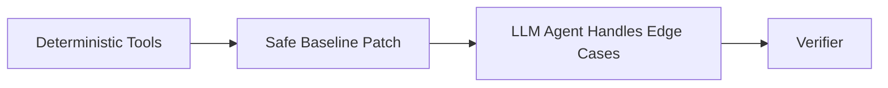

This pattern is essential for production-grade migration.

---

## 24. Agent class vs architecture requirements

| Requirement | Chat | IDE | CLI | Cloud | Background | Fleet |
|---|---:|---:|---:|---:|---:|---:|
| Tool registry | Low | Medium | High | High | High | High |
| Sandbox | None | Low | Medium | High | High | High |
| Central policy | None | Low | Medium | High | High | Very High |
| Queue | None | None | Low | Medium | High | Very High |
| Verifier | Low | Medium | High | High | Very High | Very High |
| Judge | Low | Low | Medium | High | High | Very High |
| PR orchestration | None | Low | Medium | High | High | Very High |
| Observability | Low | Low | Medium | High | Very High | Very High |
| Audit | Low | Low | Medium | High | Very High | Very High |
| Rollout control | None | None | None | Low | Medium | Very High |

This table tells us why Honk-like architecture is heavier. It needs more machinery because it takes more responsibility.

---

## 25. The practical build order

Given the taxonomy, we should not start with fleet campaign. We build layers.

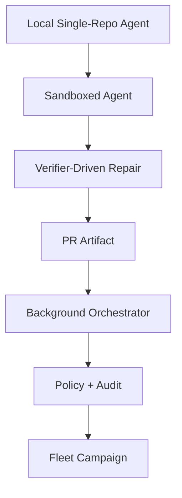

### Phase 1 — Local single-repo agent

Goal:

- read/search/edit/run command;
- produce diff;
- run verifier;
- generate report.

### Phase 2 — Sandboxed agent

Goal:

- isolate workspace;
- control command;
- enforce path policy;
- capture logs.

### Phase 3 — Verifier-driven repair

Goal:

- run build/test;
- summarize errors;
- feed back to agent;
- stop after bounded iterations.

### Phase 4 — PR artifact

Goal:

- generate branch/commit/PR body;
- include verification evidence;
- no auto-merge.

### Phase 5 — Background orchestrator

Goal:

- task API;
- queue;
- run state;
- worker;
- cancellation;
- audit.

### Phase 6 — Policy and governance

Goal:

- allowed paths;
- permissions;
- sandbox profiles;
- budgets;
- team rules.

### Phase 7 — Fleet campaign

Goal:

- target selection;
- batching;
- rollout metrics;
- halt condition;
- many PRs safely.

---

## 26. Design rule: autonomy must match evidence

This rule deserves repetition because it prevents bad platforms.

| If you have... | You may allow... |
|---|---|
| no verifier | explanation only |
| syntax verifier | small generated snippet |
| compile verifier | constrained code edit |
| test verifier | PR proposal |
| policy + test verifier | background PR creation |
| fleet metrics + canary | multi-repo rollout |

Do not build a fleet agent on top of weak tests and vibes.

---

## 27. Design rule: permission must match execution location

Permission that is acceptable locally may be unacceptable in cloud.

Example:

```text
Local developer runs: mvn test
```

Usually acceptable.

But background agent running arbitrary `mvn test` across untrusted repositories in shared infrastructure needs:

- container isolation;
- network control;
- CPU/memory limit;
- artifact redaction;
- dependency cache policy;
- no broad secret exposure.

The same command has different risk depending on where it runs.

---

## 28. Design rule: artifact determines workflow

If output is a chat answer, no PR process needed.

If output is a PR, then you need:

- branch naming;
- commit message;
- PR body;
- labels;
- reviewers;
- CI;
- run link;
- verification evidence;
- review response workflow.

If output is 300 PRs, you need campaign governance.

Artifact drives architecture.

---

## 29. The taxonomy we will use in this series

For this series, every component will be designed with the following target class:

```yaml
targetAgentClass:
  interactionMode: background
  executionLocation: sandboxed_worker
  scope: single_repo_first_then_fleet
  autonomy: create_reviewable_pr_not_auto_merge
  permissions:
    readRepository: true
    writeWorkspace: true
    runCommands: restricted
    network: restricted
    secrets: minimal_ephemeral
    pushBranch: controlled
  context:
    taskContract: required
    repositoryMap: required
    verifierFeedback: required
    platformMetadata: optional_then_required
  output:
    - diff
    - verificationReport
    - judgeVerdict
    - pullRequest
  governance:
    policyEngine: required
    auditTrail: required
    humanReview: required
```

This is the backbone for the rest of the course.

---

## 30. Summary

The taxonomy gives us a precise target.

We are not building:

- a pure chatbot;
- a simple autocomplete;
- a toy script that writes files;
- an uncontrolled terminal agent;
- a blind PR bot;
- a fleet campaign without rollout control.

We are building:

> A sandboxed, verifier-driven, policy-constrained, background coding agent platform that starts with one repository and can evolve into fleet-wide code change automation.

The key conclusion:

```text
Agent type determines architecture.
Architecture determines safety.
Safety determines whether humans trust the agent.
Trust determines whether the system survives production use.
```

---

## 31. Apa yang akan dilanjutkan di Part 005

Part 005 akan masuk ke domain problem: **code change automation**.

Kita akan membedah:

- kenapa perubahan kode otomatis sulit;
- jenis perubahan yang aman vs berbahaya;
- kenapa “compile pass” tidak cukup;
- bagaimana developer trust rusak;
- bagaimana PR agent bisa menjadi noise generator;
- bagaimana memilih use case awal yang realistis;
- bagaimana membuat sistem yang menghasilkan leverage tanpa merusak codebase.
