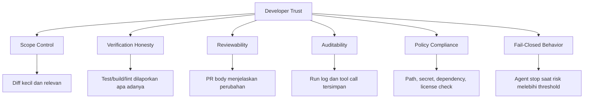
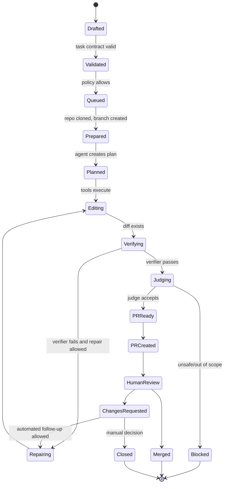
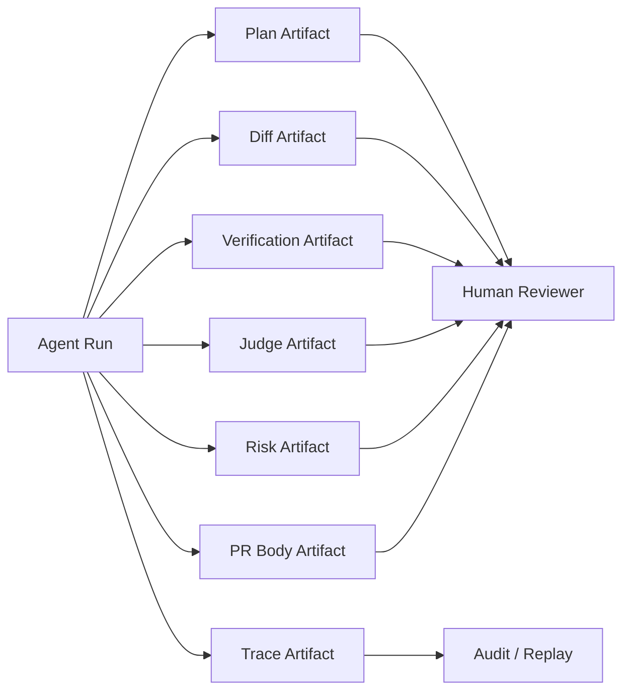
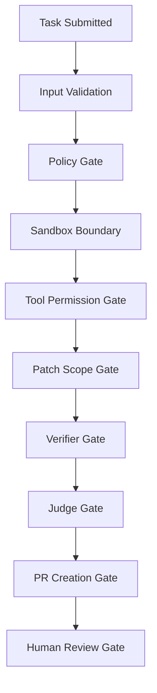

------
title: Learn AI Coding Agent From Scratch - Part 005
description: Memahami domain problem code-change automation: mengapa AI coding agent harus diperlakukan sebagai sistem perubahan kode yang terkontrol, bukan sekadar generator patch.
series: learn-ai-coding-agent
seriesTitle: Learn AI Coding Agent From Scratch
order: 5
partTitle: Problem Domain Code Change Automation
tags:
- ai-coding-agent
- code-change-automation
- software-maintenance
- trust
- governance
- engineering-process
date: 2026-07-03
---

# Part 005 — Problem Domain: Mengotomasi Perubahan Kode Tanpa Merusak Kepercayaan Developer

Kita sudah punya dua fondasi:

1. AI coding agent adalah **sistem perubahan kode otomatis**, bukan sekadar LLM yang menulis kode.
2. Honk-like agent adalah **background software maintenance platform**, bukan hanya plugin editor.

Sekarang kita masuk ke problem domain. Ini penting karena banyak implementasi agent gagal bukan karena modelnya lemah, tetapi karena problem yang dipilih salah, boundary-nya kabur, verifier-nya tidak cukup kuat, dan trust model-nya tidak dirancang.

Tujuan part ini:

> Membuat peta problem code-change automation yang cukup tajam sehingga kita tahu jenis pekerjaan apa yang layak diautomasi, apa risiko sebenarnya, apa invariant yang harus dijaga, dan mengapa developer tetap harus percaya pada hasil sistem.

Kita belum menulis banyak kode di part ini. Ini adalah part “domain modelling”. Tetapi jangan diremehkan: kalau model domain salah, agent loop yang paling canggih pun hanya akan menghasilkan PR yang terlihat produktif tetapi merusak sistem.

Referensi faktual yang relevan:

- Spotify Engineering — Honk diposisikan sebagai background coding agent untuk large-scale software maintenance dan PR workflow.  
  https://engineering.atspotify.com/2025/11/spotifys-background-coding-agent-part-1
- Claude Code Docs — agentic coding tool dapat membaca codebase, mengedit file, menjalankan command, dan terintegrasi dengan development tools.  
  https://code.claude.com/docs/en/overview
- Claude Code Sandboxing — filesystem dan network isolation diperlukan untuk mengurangi risiko agentic execution.  
  https://www.anthropic.com/engineering/claude-code-sandboxing
- Model Context Protocol — tools adalah fungsi yang dapat dieksekusi model terhadap sistem eksternal; resources dan prompts memberi konteks serta workflow template.  
  https://modelcontextprotocol.io/specification/2025-06-18
- OpenAI — “Harness engineering” menekankan repository knowledge, legibility, architecture/taste enforcement, dan perubahan merge philosophy dalam agent-first workflow.  
  https://openai.com/index/harness-engineering/

---

## 1. Problem sebenarnya: bukan “membuat AI bisa coding”

Kalimat “AI coding agent to perform code changes automatically” sering disalahpahami.

Versi dangkalnya:

> User memberi prompt. Model mengedit file. Test dijalankan. Jika hijau, buat PR.

Versi nyata di sistem produksi:

> Organisasi punya banyak repository, dependency, API, schema, test, owner, policy, dan release risk. Kita ingin mengotomasi kelas perubahan tertentu tanpa menghilangkan traceability, reviewability, security boundary, ownership, dan kepercayaan developer.

Perbedaannya besar.

Di level toy project, patch yang benar berarti “test pass”. Di level enterprise, patch yang benar berarti:

- scope sesuai task;
- tidak menyentuh area terlarang;
- tidak mengubah public contract tanpa alasan;
- tidak menyembunyikan error dengan menghapus test;
- tidak memasukkan dependency berbahaya;
- tidak bocorkan secret ke prompt atau log;
- tidak menghasilkan PR noise yang membebani reviewer;
- bisa diaudit: siapa meminta, agent apa yang jalan, tool apa yang dipakai, file apa yang berubah, verifier apa yang pass, dan alasan PR dianggap layak review.

Jadi problem domain kita bukan “code generation”. Problem domain kita adalah:

> **controlled code-change automation**.

Kata kuncinya: **controlled**.

---

## 2. Mengapa automation perubahan kode berbeda dari automation biasa

Automation biasa sering punya aksi yang sempit dan deterministic:

- rotate log;
- resize image;
- update config tertentu;
- generate report;
- deploy artifact yang sudah dibangun.

Code-change automation berbeda karena kode adalah sistem simbolik yang saling terhubung. Satu perubahan kecil bisa punya efek lintas file, lintas module, lintas runtime, lintas deployment, bahkan lintas tim.

Contoh sederhana:

```java
// before
public User findUser(String id) {
    return userRepository.findById(id).orElse(null);
}
```

Agent diminta “avoid returning null”. Ia mengubah menjadi:

```java
public Optional<User> findUser(String id) {
    return userRepository.findById(id);
}
```

Secara lokal terlihat lebih baik. Tetapi efeknya:

- public API berubah;
- semua call site bisa break;
- serialization layer mungkin berubah;
- OpenAPI contract mungkin tidak sinkron;
- test yang mock method lama gagal;
- consumer internal mungkin mengandalkan null;
- migration plan belum ada.

Inilah sifat code-change automation: perubahan syntactic bisa membawa konsekuensi semantic dan organizational.

Maka agent harus bekerja dengan tiga model sekaligus:

1. **Code model** — file, symbol, dependency, build graph, test graph.
2. **Process model** — branch, PR, reviewer, CI, release, ownership.
3. **Risk model** — blast radius, reversibility, security, contract compatibility.

Kalau hanya punya code model, agent bisa menghasilkan diff yang pintar tetapi prosesnya berbahaya. Kalau hanya punya process model, agent menjadi bot PR yang tidak paham semantik. Kalau hanya punya risk model tanpa kemampuan eksekusi, agent menjadi policy checker pasif.

Honk-like agent butuh ketiganya.

---

## 3. Trust adalah produk utama agent platform

Dalam platform seperti ini, output yang paling terlihat adalah PR. Tetapi produk sebenarnya adalah **trust**.

Developer akan percaya jika mereka melihat pola berikut secara konsisten:

- agent mengubah hal yang diminta, bukan hal random;
- PR kecil, jelas, dan reviewable;
- failure jujur, tidak ditutup-tutupi;
- test tidak dimanipulasi supaya hijau;
- PR body menjelaskan reasoning, verifier, dan known limitation;
- agent berhenti saat tidak yakin;
- setiap run bisa direplay atau ditelusuri;
- platform tidak membuat reviewer banjir PR sampah.

Tanpa trust, automation mati walaupun modelnya kuat.

Trust di sini bukan perasaan abstrak. Ia bisa dimodelkan sebagai serangkaian invariant.



Invariant awal yang harus kita pegang:

```text
A coding agent must never optimize for creating a PR.
A coding agent must optimize for creating a reviewable, verified, policy-compliant change.
```

Kalau agent tidak bisa mencapai itu, hasil yang benar adalah **tidak membuat PR**.

---

## 4. Unit kerja: bukan prompt, tetapi change request

Dalam sistem yang matang, input agent bukan prompt bebas. Input agent adalah **change request**.

Prompt bebas:

```text
Upgrade this repo to the new auth library.
```

Change request:

```yaml
id: CR-2026-000417
type: dependency-upgrade
repository: payments-api
base_branch: main
objective: Upgrade auth-client from 2.x to 3.x
scope:
  allowed_paths:
    - pom.xml
    - src/main/java/**
    - src/test/java/**
  forbidden_paths:
    - src/main/resources/db/migration/**
    - openapi/**
constraints:
  must_not_change_public_api: true
  must_not_delete_tests: true
  must_run:
    - mvn -q test
    - mvn -q -DskipITs=false verify
acceptance:
  - project compiles
  - existing tests pass
  - no new high severity dependency vulnerability
  - PR body includes migration note
risk:
  max_level: medium
owner: platform-auth-team
```

Perbedaan keduanya bukan kosmetik.

Prompt bebas membuat agent menebak:

- batas path;
- command verifier;
- definisi selesai;
- risiko yang boleh diambil;
- reviewer;
- apakah boleh mengubah test;
- apakah boleh menyentuh contract.

Change request mengubah agent dari “penebak niat user” menjadi “executor terhadap kontrak kerja”.

Ini salah satu mental model terpenting di seri ini:

> **Prompt is not enough. A production coding agent needs a task contract.**

---

## 5. Lifecycle perubahan kode otomatis

Satu automated code change memiliki lifecycle yang lebih panjang daripada satu model call.



Kita perlu menyimpan state ini karena:

- run bisa gagal di tengah;
- retry harus idempotent;
- audit butuh riwayat;
- PR yang ditolak perlu feedback;
- campaign fleet-wide butuh agregasi status;
- cost dan token perlu dihitung per run;
- failure pattern bisa dianalisis.

Dalam sistem kecil, kita bisa menaruh semua di memory. Dalam sistem serius, lifecycle ini harus punya database model.

Minimal entity yang nanti akan kita implementasikan:

| Entity | Fungsi |
|---|---|
| `task` | Permintaan perubahan kode yang stabil dan bisa diaudit. |
| `run` | Satu attempt menjalankan task pada repo/branch tertentu. |
| `step` | Unit observability: model call, tool call, verifier call, judge call. |
| `artifact` | Output run: plan, diff, log, summary, PR body, verdict. |
| `policy_decision` | Keputusan policy: allowed, denied, requires approval. |
| `verifier_result` | Hasil build/test/lint/static analysis. |
| `judge_result` | Evaluasi kesesuaian diff terhadap task contract. |

---

## 6. Kelas pekerjaan yang cocok untuk automation

Tidak semua pekerjaan coding cocok untuk Honk-like background agent.

Pekerjaan yang cocok biasanya punya karakteristik:

- objective jelas;
- acceptance bisa diverifikasi;
- scope bisa dibatasi;
- perubahan mirip di banyak tempat;
- failure bisa dideteksi oleh build/test/static analysis;
- risiko bisa dikurangi lewat PR review;
- rollback mudah;
- value repetitif cukup tinggi.

Contoh yang cocok:

1. dependency upgrade dengan breaking change kecil;
2. migration API internal;
3. mengganti annotation deprecated;
4. memperbaiki lint rule baru;
5. menambah missing test untuk bug terisolasi;
6. update config key yang berubah;
7. migrasi import/package;
8. memperbaiki compile error dari generated client baru;
9. menghapus dead flag setelah rollout selesai;
10. memperbarui CI workflow pattern.

Pekerjaan yang kurang cocok untuk awal:

1. redesign arsitektur besar;
2. perubahan business rule tanpa oracle kuat;
3. concurrency fix dengan race condition halus;
4. security-sensitive cryptographic change;
5. database migration destructive;
6. perubahan public API lintas consumer tanpa rollout plan;
7. performance optimization tanpa benchmark stabil;
8. refactor besar tanpa test coverage.

Bukan berarti agent tidak pernah bisa membantu. Tetapi untuk automation otomatis, kita perlu memulai dari area dengan verifier kuat dan blast radius kecil.

---

## 7. Blast radius: ukuran risiko yang sering dilupakan

Blast radius adalah seberapa luas dampak jika perubahan salah.

Untuk code-change automation, blast radius bisa dibaca dari beberapa dimensi:

| Dimensi | Pertanyaan |
|---|---|
| File scope | Berapa file berubah? Apakah file public contract ikut berubah? |
| Module scope | Satu module atau banyak module? |
| Runtime scope | Hanya test/helper atau production path? |
| Consumer scope | Internal saja atau external API? |
| Data scope | Menyentuh data persistence, schema, migration, atau tidak? |
| Security scope | Menyentuh auth, crypto, secret, permission, policy? |
| Release scope | Butuh coordinated deployment atau bisa standalone? |
| Reversibility | Bisa revert mudah atau ada data migration irreversible? |

Kita bisa mulai dengan scoring sederhana:

```text
blast_radius_score =
  file_count_score
+ module_count_score
+ public_contract_score
+ data_change_score
+ security_change_score
+ deployment_coupling_score
+ irreversibility_score
```

Contoh rough scoring:

| Faktor | 0 | 1 | 2 | 3 |
|---|---|---|---|---|
| File count | 1 file | 2–5 | 6–20 | >20 |
| Module count | 1 | 2 | 3–5 | >5 |
| Public contract | none | internal | partner/internal API | external API |
| Data change | none | read query | schema additive | destructive migration |
| Security | none | logging/headers | authz/authn path | crypto/secret/policy |
| Deployment | no coupling | same service | two services | coordinated fleet |
| Reversibility | trivial revert | simple revert | migration cleanup | irreversible/data loss |

Risk level awal:

| Total | Risk |
|---:|---|
| 0–3 | low |
| 4–7 | medium |
| 8–12 | high |
| >12 | blocked for autonomous mode |

Scoring ini tidak sempurna. Tetapi ia memberi struktur. Tanpa struktur, semua task terlihat seperti “mungkin bisa”.

---

## 8. Verifiability: apakah agent bisa membuktikan hasilnya?

Kecocokan automation sangat bergantung pada verifiability.

Pertanyaan kunci:

> Kalau agent membuat patch, apa bukti bahwa patch itu benar?

Jenis bukti:

| Bukti | Contoh | Kekuatan |
|---|---|---|
| Syntax check | parser/linter pass | lemah tapi murah |
| Compile check | `mvn test-compile` | kuat untuk typed language |
| Unit test | `mvn test` | kuat jika coverage relevan |
| Integration test | API/db/container test | lebih kuat tapi mahal |
| Static analysis | forbidden API, dependency, secret scan | bagus untuk policy |
| Snapshot/golden test | generated output sama | bagus untuk migration |
| Semantic oracle | business invariant diuji | paling kuat tapi sulit |
| Human review | reviewer membaca PR | wajib untuk risk tertentu |

Agent yang hanya mengandalkan “model yakin” tidak cukup. Kita perlu bukti eksternal.

Prinsip:

```text
The less verifiable a task is, the less autonomous the agent should be.
```

Maka task dengan verifiability lemah harus:

- dibuat lebih kecil;
- ditambah verifier;
- dialihkan ke draft mode;
- diberi human approval;
- atau ditolak dari autonomous lane.

---

## 9. Reviewability: PR harus bisa dibaca manusia

Agent yang menghasilkan diff raksasa bisa terlihat produktif, tetapi buruk untuk organisasi.

Reviewability dipengaruhi oleh:

- ukuran diff;
- jumlah topik perubahan;
- kualitas commit message;
- PR body;
- apakah perubahan mekanis atau kreatif dicampur;
- apakah test update jelas;
- apakah generated file dipisah;
- apakah alasan perubahan dijelaskan;
- apakah verifier command dicantumkan.

Batas awal yang sehat:

```yaml
reviewability_policy:
  max_files_changed_autonomous: 20
  max_non_generated_lines_changed: 400
  max_topics_per_pr: 1
  require_pr_body_sections:
    - Objective
    - What Changed
    - Verification
    - Risk and Rollback
    - Notes for Reviewer
```

PR body yang buruk:

```text
Updated auth client.
```

PR body yang baik:

```md
## Objective
Upgrade auth-client from 2.8.1 to 3.1.0 and adapt call sites to the new token validation API.

## What changed
- Replaced `TokenValidator#validate(String)` with `TokenValidator#validate(TokenRequest)`.
- Updated 4 call sites in the request authentication filter.
- Adjusted unit tests to construct `TokenRequest` explicitly.

## Verification
- `mvn -q test` passed.
- `mvn -q -DskipITs=false verify` passed.
- No production API contract files were changed.

## Risk and rollback
Risk is medium because this touches authentication request path.
Rollback is a normal git revert because no schema/data migration is included.

## Notes for reviewer
Please focus review on token claim mapping in `AuthenticationFilter`.
```

Agent harus dilatih oleh platform untuk menghasilkan artifact seperti ini, bukan hanya diff.

---

## 10. Failure modes yang spesifik untuk code-changing agent

Daftar failure mode awal:

| Failure mode | Contoh | Mitigasi |
|---|---|---|
| Scope creep | Task minta upgrade dependency, agent refactor unrelated classes | allowed paths, diff judge, PR size limit |
| Test deletion | Test gagal, agent menghapus/men-disable test | test policy, diff rule, judge |
| Semantic drift | Compile pass tapi behavior berubah | targeted tests, golden tests, reviewer note |
| Contract mismatch | Code berubah tapi OpenAPI/schema tidak | contract verifier |
| Log poisoning | Build log mengandung instruksi prompt injection | log sanitization, untrusted-output boundary |
| Tool overreach | Agent menjalankan command destructive | permission model, sandbox, allowlist |
| Secret exposure | Agent membaca `.env` atau SSH key | filesystem isolation, secret redaction |
| Dependency risk | Agent menambah package berbahaya | dependency policy, lockfile review |
| Infinite repair loop | Agent terus memperbaiki tanpa kemajuan | retry budget, progress heuristic |
| PR spam | Banyak PR low quality | quality gate, campaign throttle |
| Ownership bypass | PR dibuat tanpa owner relevan | CODEOWNERS integration |
| Build cheating | Agent mengubah build agar failure hilang | forbidden build config rules |

Failure ini harus masuk ke desain sejak awal. Jangan menunggu production incident.

---

## 11. “Correctness” dalam agent bukan boolean tunggal

Dalam software biasa, kita sering berkata “benar atau salah”. Untuk coding agent, correctness lebih berlapis.

Satu patch bisa:

- syntactically correct;
- compile-correct;
- test-correct;
- semantically suspicious;
- policy-violating;
- hard to review;
- too risky for autonomous lane.

Maka verdict kita nanti tidak cukup `pass/fail`.

Kita butuh verdict seperti:

```yaml
verdict:
  status: requires_human_review
  confidence: medium
  dimensions:
    syntax: pass
    compile: pass
    unit_tests: pass
    scope_control: pass
    policy: pass
    semantic_alignment: uncertain
    reviewability: pass
  reasons:
    - The change touches authentication path.
    - Existing tests pass, but no integration test covers expired token handling.
  recommended_next_action: create_pr_with_warning
```

Ini lebih realistis daripada “AI yakin 92%”.

---

## 12. Agent output harus berupa artifact, bukan hanya jawaban

Dalam chat, output utama adalah text. Dalam code-change automation, output utama adalah artifact.

Artifact minimal:

| Artifact | Isi |
|---|---|
| Plan | Rencana perubahan sebelum edit. |
| Diff | Patch final. |
| Verification log | Command, exit code, summarized output. |
| Failure analysis | Jika gagal, alasan dan next attempt. |
| PR body | Ringkasan reviewable. |
| Risk assessment | Blast radius, policy flags. |
| Tool trace | Tool call, input sanitized, output summarized. |
| Cost report | Token, duration, retries. |

Kenapa artifact penting?

Karena developer dan platform tidak bisa hanya percaya pada final answer. Mereka butuh bukti dan jejak.



---

## 13. Mengubah “developer intent” menjadi “machine-executable constraint”

Developer sering menulis intent seperti ini:

```text
Migrate this service to the new pricing API.
```

Agent platform harus mengubahnya menjadi constraint yang bisa dieksekusi:

```yaml
objective: migrate pricing client usage from v1 to v2
allowed_symbols:
  - com.company.pricing.v1.PriceClient
  - com.company.pricing.v2.PriceClient
allowed_paths:
  - src/main/java/**
  - src/test/java/**
forbidden_paths:
  - src/main/resources/db/migration/**
  - openapi/public/**
expected_operations:
  - replace v1 client import
  - adapt request object construction
  - update tests for new response type
must_not:
  - change public REST endpoint contract
  - delete tests
  - disable integration tests
verification:
  - mvn -q test
  - mvn -q -DskipITs=false verify
review_focus:
  - monetary rounding behavior
  - fallback behavior when pricing service times out
```

Ini adalah awal dari **task compiler**: komponen yang menerjemahkan human intent menjadi task contract.

Nanti task compiler bisa:

- mengambil template use case;
- membaca repo metadata;
- membaca CODEOWNERS;
- mengambil verifier command default;
- menambah risk tags;
- menentukan approval requirement.

---

## 14. Control points dalam sistem

Agar trust tidak bergantung pada “model baik-baik saja”, kita butuh control points.



Penjelasan:

| Gate | Menjawab pertanyaan |
|---|---|
| Input validation | Apakah task cukup jelas dan lengkap? |
| Policy gate | Apakah task boleh dijalankan agent? |
| Sandbox boundary | Apakah agent dieksekusi di environment aman? |
| Tool permission gate | Apakah aksi tool diizinkan? |
| Patch scope gate | Apakah diff masih dalam boundary? |
| Verifier gate | Apakah bukti teknis cukup? |
| Judge gate | Apakah perubahan sesuai objective dan tidak curang? |
| PR creation gate | Apakah PR layak dibuat? |
| Human review gate | Apakah manusia menyetujui merge? |

Jangan letakkan semua keamanan di satu tempat. Sistem yang baik punya defense-in-depth.

---

## 15. Jangan mengukur agent hanya dari merge count

Spotify menyebut angka PR merged sebagai sinyal keberhasilan Honk, tetapi angka seperti itu harus dibaca hati-hati. Merge count berguna, tetapi tidak cukup.

Metric yang lebih lengkap:

| Metric | Makna |
|---|---|
| PR created | Throughput awal. |
| PR merged | Hasil yang diterima. |
| Merge rate | Kualitas output relatif terhadap attempt. |
| Review iterations | Berapa banyak koreksi manusia. |
| Time to green | Berapa lama sampai verifier pass. |
| Time to merge | Dampak ke developer workflow. |
| Revert rate | Sinyal kualitas buruk setelah merge. |
| Escaped defect | Bug yang lolos akibat agent. |
| Reviewer burden | Apakah reviewer terbantu atau terbebani. |
| Scope violation rate | Seberapa sering agent keluar boundary. |
| Test cheating rate | Seberapa sering agent mengubah test/build secara suspicious. |
| Cost per merged PR | Ekonomi platform. |
| Human minutes saved | Value nyata. |

Metric penting yang sering dilupakan:

```text
reviewer_trust_delta = perceived_helpfulness - perceived_review_burden
```

Kalau agent membuat banyak PR tetapi reviewer merasa harus mengecek semuanya dari nol, value-nya turun.

---

## 16. Domain problem untuk engineer senior: bukan mengganti manusia, tetapi menaikkan leverage

Honk-like agent seharusnya mengotomasi pekerjaan yang:

- repetitif tetapi butuh konteks;
- bernilai tinggi jika dilakukan di banyak repo;
- terlalu mahal jika semua dilakukan manual;
- cukup aman jika diverifikasi dan direview;
- sering tertunda karena tidak ada owner yang punya waktu.

Contoh nyata di perusahaan besar:

- migrasi dari library internal lama ke library baru;
- rollout security header pattern ke semua service;
- upgrade framework minor version;
- mengganti endpoint internal karena platform API berubah;
- memperbaiki ribuan call site karena contract baru;
- menambahkan telemetry standar;
- menghapus feature flag setelah rollout;
- menyamakan CI workflow.

Agent menjadi force multiplier untuk platform engineering.

Di sinilah bedanya engineer biasa dan engineer top-tier: engineer biasa bertanya “bagaimana membuat AI mengubah kode?” Engineer top-tier bertanya:

> “Kelas perubahan kode apa yang dapat kita jadikan repeatable, observable, verifiable, governable, dan economically valuable?”

---

## 17. Model awal: code-change automation canvas

Setiap use case harus bisa diisi dalam canvas berikut.

```yaml
code_change_automation_canvas:
  name:
  business_value:
  repositories_targeted:
  change_type:
  examples:
  non_examples:
  allowed_paths:
  forbidden_paths:
  expected_diff_shape:
  forbidden_diff_shape:
  verifier_commands:
  semantic_oracles:
  risk_level:
  blast_radius:
  reversibility:
  human_approval_required:
  rollout_strategy:
  success_metrics:
  stop_conditions:
```

Contoh ringkas:

```yaml
name: Replace deprecated tracing annotation
business_value: remove deprecated internal API before platform cutoff
repositories_targeted: Java services using platform-tracing <= 2.x
change_type: annotation-migration
examples:
  - replace @TraceOperation with @ObservedOperation
  - update import package
non_examples:
  - redesign tracing spans
  - rename business methods
allowed_paths:
  - src/main/java/**
  - src/test/java/**
forbidden_paths:
  - pom.xml
  - openapi/**
expected_diff_shape:
  - import replacement
  - annotation name replacement
forbidden_diff_shape:
  - method body rewrite
  - test deletion
verifier_commands:
  - mvn -q test
semantic_oracles:
  - no public API change
risk_level: low
blast_radius: low
reversibility: normal_git_revert
human_approval_required: false_for_draft_pr_creation_true_for_merge
rollout_strategy: batch by repository owner
success_metrics:
  - compile pass rate
  - merge rate
  - reviewer comment rate
stop_conditions:
  - more than 20 files changed
  - verifier fails twice with unrelated errors
```

Canvas ini akan kita pakai lagi saat memilih use case di Part 006.

---

## 18. Anti-pattern: autonomous coding tanpa domain boundary

Beberapa anti-pattern umum:

### 18.1 “Give the agent repo access and see what happens”

Ini eksperimen, bukan platform. Cocok untuk demo, buruk untuk trust.

### 18.2 “As long as tests pass, PR is safe”

Test suite sering tidak lengkap. Test pass tidak berarti semantic correctness.

### 18.3 “The model can infer the right thing”

Kadang bisa. Tetapi sistem produksi tidak boleh bergantung pada tebakan saat kita bisa memberi kontrak eksplisit.

### 18.4 “More tools means better agent”

More tools berarti more attack surface, more nondeterminism, more failure mode. Tool harus diberi boundary.

### 18.5 “Large PR saves more time”

Large PR sering memindahkan beban dari implementer ke reviewer. Agent yang baik membuat PR reviewable, bukan sekadar besar.

### 18.6 “Human review solves everything”

Human review adalah gate terakhir, bukan satu-satunya gate. Kalau semua risiko dilempar ke reviewer, platform gagal.

---

## 19. Definisi berhasil untuk part ini

Setelah part ini, kita punya definisi domain yang jelas:

```text
A Honk-like AI coding agent is a controlled code-change automation system that converts a structured change request into a bounded, verified, reviewable, auditable pull request, or fails closed when the task exceeds its capability, policy, or risk threshold.
```

Kalimat ini akan menjadi “north star” kita.

Setiap komponen yang kita bangun nanti harus menjawab satu dari pertanyaan berikut:

- Bagaimana task dibuat jelas?
- Bagaimana scope dibatasi?
- Bagaimana agent mendapat konteks cukup?
- Bagaimana tool call diamankan?
- Bagaimana patch diverifikasi?
- Bagaimana risiko dinilai?
- Bagaimana PR dibuat reviewable?
- Bagaimana semua keputusan bisa diaudit?
- Bagaimana sistem berhenti saat tidak aman?

---

## 20. Checklist pemahaman

Sebelum lanjut, pastikan kamu bisa menjawab:

1. Mengapa code-change automation lebih sulit daripada code generation?
2. Mengapa trust adalah produk utama agent platform?
3. Apa perbedaan prompt bebas dan change request?
4. Apa itu blast radius dalam konteks automated code change?
5. Mengapa test pass tidak cukup sebagai definisi benar?
6. Apa artifact minimal dari agent run?
7. Gate apa saja yang harus ada sebelum PR dibuat?
8. Mengapa merge count bukan satu-satunya metric?
9. Use case seperti apa yang cocok untuk automation tahap awal?
10. Kapan agent harus fail closed?

---

## 21. Latihan kecil

Ambil satu repository yang kamu kenal. Pilih satu perubahan kecil, misalnya:

- mengganti annotation deprecated;
- upgrade dependency minor;
- memperbaiki lint rule;
- mengganti config key;
- menambah test untuk utility function.

Isi canvas berikut:

```yaml
name:
business_value:
change_type:
allowed_paths:
forbidden_paths:
expected_diff_shape:
forbidden_diff_shape:
verifier_commands:
risk_level:
blast_radius:
human_approval_required:
stop_conditions:
```

Jangan tulis prompt dulu. Tulis kontraknya dulu.

Itu kebiasaan penting dalam membangun agent serius.

---

## 22. Ringkasan

Code-change automation bukan sekadar membuat model mengedit file. Ia adalah domain dengan constraint kuat:

- code punya dependency dan semantik;
- proses engineering punya ownership dan review;
- organisasi punya policy dan risk appetite;
- developer trust harus dijaga;
- verifier harus memberi bukti;
- PR harus kecil dan reviewable;
- agent harus bisa berhenti saat tidak aman.

Di part berikutnya kita akan memilih use case awal dan membuat **risk classification**. Itu akan menentukan pekerjaan mana yang masuk autonomous lane, supervised lane, draft-only lane, atau blocked lane.

