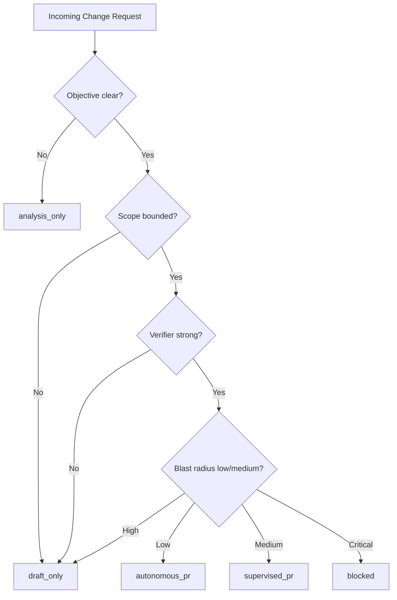
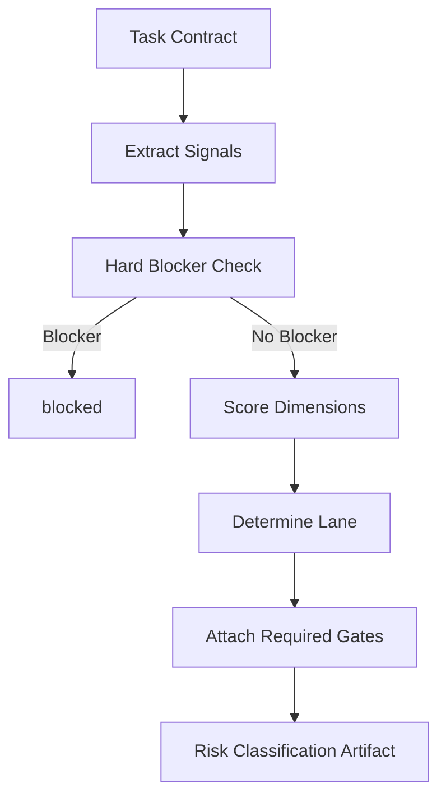
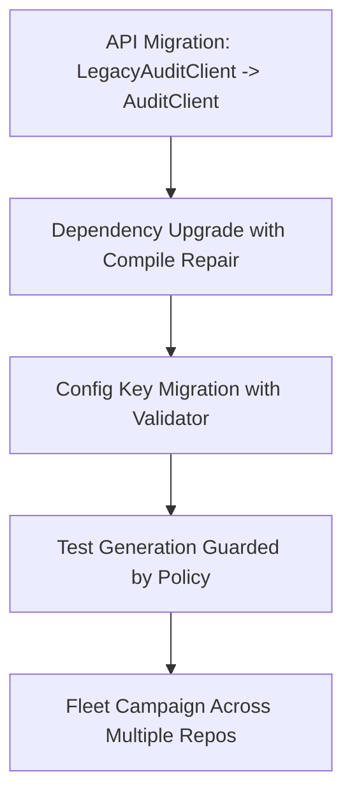

------
title: Learn AI Coding Agent From Scratch - Part 006
description: Memilih use case awal untuk AI coding agent dan membuat risk classification yang menentukan autonomous lane, supervised lane, draft-only lane, atau blocked lane.
series: learn-ai-coding-agent
seriesTitle: Learn AI Coding Agent From Scratch
order: 6
partTitle: Use Case Selection and Risk Classification
tags:
- ai-coding-agent
- risk-classification
- use-case-selection
- software-maintenance
- automation-strategy
- governance
date: 2026-07-03
---

# Part 006 — Use Case Selection and Risk Classification

Part sebelumnya menetapkan domain: kita membangun **controlled code-change automation system**. Sekarang kita harus memilih pekerjaan pertama yang layak diautomasi.

Ini keputusan arsitektural, bukan hanya product choice. Use case pertama akan menentukan:

- bentuk task contract;
- tool yang harus tersedia;
- verifier yang dibutuhkan;
- risiko yang harus dikontrol;
- data evaluasi awal;
- bagaimana developer menilai sistem;
- apakah platform mendapat trust atau langsung dianggap PR spammer.

Tujuan part ini:

> Membuat framework pemilihan use case dan risk classification agar agent tidak diberi pekerjaan yang terlalu kabur, terlalu berbahaya, atau terlalu sulit diverifikasi pada tahap awal.

Referensi faktual yang relevan:

- Spotify Engineering menunjukkan Honk dipakai untuk large-scale software maintenance dan PR workflow, terutama jenis pekerjaan yang berulang dan bisa diverifikasi.  
  https://engineering.atspotify.com/2025/11/spotifys-background-coding-agent-part-1
- Claude Code documentation menyatakan agent dapat membaca codebase, mengedit file, menjalankan command, dan terintegrasi dengan development tools. Ini menunjukkan capability dasar agent modern, tetapi capability tidak sama dengan risk approval.  
  https://code.claude.com/docs/en/overview
- Claude Code permission mode menyediakan pendekatan non-interactive restricted execution melalui pre-approved tools/permissions, relevan untuk CI atau background mode.  
  https://code.claude.com/docs/en/permission-modes
- Claude Code sandboxing menekankan filesystem dan network isolation sebagai kontrol keamanan untuk agentic execution.  
  https://www.anthropic.com/engineering/claude-code-sandboxing
- Model Context Protocol memisahkan tools, resources, dan prompts, yang berguna untuk membangun use-case-specific verifier dan context server.  
  https://modelcontextprotocol.io/specification/2025-06-18

---

## 1. Prinsip utama: pilih use case yang membangun trust

Use case pertama bukan harus yang paling impresif. Use case pertama harus yang paling mungkin menghasilkan:

- PR kecil;
- verifier kuat;
- acceptance jelas;
- risiko rendah;
- value nyata;
- review mudah;
- failure mudah dipahami.

Banyak tim salah memilih target awal. Mereka langsung memilih “agent bisa ambil issue bebas dan implement feature”. Itu menarik untuk demo, tetapi buruk untuk platform foundation.

Untuk Honk-like background agent, use case awal yang baik biasanya berbentuk **maintenance automation**, bukan greenfield feature development.

Maintenance automation punya keuntungan:

- objective biasanya lebih sempit;
- pola perubahan berulang;
- banyak contoh lama/baru;
- verifier lebih jelas;
- PR mudah direview;
- bisa dijalankan di banyak repo;
- value bisa dihitung dari waktu migrasi yang dihemat.

Prinsip:

```text
Start where the change pattern is repetitive, bounded, and externally verifiable.
Avoid starting where success depends mostly on subjective product judgment.
```

---

## 2. Use case lane: autonomous, supervised, draft-only, blocked

Kita tidak akan memberi semua task mode yang sama.

Kita butuh lane:

| Lane | Makna | Output |
|---|---|---|
| `autonomous_pr` | Agent boleh membuat PR jika gates pass. | PR siap review. |
| `supervised_pr` | Agent boleh jalan, tetapi butuh approval sebelum PR dibuat atau sebelum tool tertentu. | Draft diff atau PR setelah approval. |
| `draft_only` | Agent hanya membuat patch proposal, tidak membuat PR otomatis. | Diff artifact + explanation. |
| `analysis_only` | Agent hanya menganalisis repo dan membuat plan. | Report/plan. |
| `blocked` | Task tidak boleh dijalankan oleh agent. | Rejection with reason. |

Diagram keputusan awal:



Lane bukan status permanen. Use case bisa naik lane setelah sistem punya data:

```text
analysis_only -> draft_only -> supervised_pr -> autonomous_pr
```

Tetapi jangan lompat langsung ke autonomous untuk task berisiko tinggi.

---

## 3. Dimensi pemilihan use case

Kita gunakan delapan dimensi.

| Dimensi | Pertanyaan utama |
|---|---|
| Clarity | Apakah objective bisa ditulis jelas? |
| Boundedness | Apakah path/symbol/change shape bisa dibatasi? |
| Verifiability | Apakah hasil bisa dibuktikan dengan build/test/static analysis? |
| Repeatability | Apakah pattern muncul di banyak repo/file? |
| Value | Apakah automation menghemat waktu nyata? |
| Blast radius | Jika salah, seberapa luas dampaknya? |
| Reversibility | Apakah rollback mudah? |
| Reviewability | Apakah PR bisa dibaca cepat oleh reviewer? |

Scoring awal: 1 sampai 5.

| Skor | Arti |
|---:|---|
| 1 | buruk untuk automation |
| 2 | lemah, butuh supervision kuat |
| 3 | bisa dicoba sebagai draft/supervised |
| 4 | baik untuk automation |
| 5 | sangat cocok untuk automation |

Kita hitung dua skor:

```text
automation_fit = clarity + boundedness + verifiability + repeatability + value + reversibility + reviewability
risk_pressure = blast_radius_inverse_adjusted
```

Agar lebih jelas, kita pakai tabel scoring konkret.

---

## 4. Scoring table

### 4.1 Clarity

| Skor | Kriteria |
|---:|---|
| 1 | Objective subjektif: “improve design”, “make it better”. |
| 2 | Objective ada tetapi ambigu: “modernize auth”. |
| 3 | Objective cukup jelas tetapi detail acceptance kurang. |
| 4 | Objective jelas dan punya contoh before/after. |
| 5 | Objective jelas, punya migration guide, examples, forbidden changes. |

### 4.2 Boundedness

| Skor | Kriteria |
|---:|---|
| 1 | Bisa menyentuh seluruh repo tanpa batas. |
| 2 | Batas module ada tetapi path/symbol belum jelas. |
| 3 | Allowed path bisa ditentukan. |
| 4 | Allowed/forbidden path dan expected diff shape jelas. |
| 5 | Bisa dibatasi dengan symbol-level atau AST-level rules. |

### 4.3 Verifiability

| Skor | Kriteria |
|---:|---|
| 1 | Tidak ada test/build oracle yang relevan. |
| 2 | Hanya lint/syntax check. |
| 3 | Compile/build bisa dijalankan. |
| 4 | Unit test relevan tersedia. |
| 5 | Unit + integration/golden/static policy checks tersedia. |

### 4.4 Repeatability

| Skor | Kriteria |
|---:|---|
| 1 | One-off, unik. |
| 2 | Mirip di beberapa file. |
| 3 | Muncul di beberapa repo. |
| 4 | Pattern berulang di banyak repo. |
| 5 | Fleet-wide maintenance campaign. |

### 4.5 Value

| Skor | Kriteria |
|---:|---|
| 1 | Nice-to-have. |
| 2 | Menghemat sedikit waktu. |
| 3 | Menghapus backlog maintenance. |
| 4 | Menghindari deadline/platform cutoff. |
| 5 | Security/compliance/platform migration bernilai tinggi. |

### 4.6 Blast radius

Untuk blast radius, skor tinggi berarti lebih aman.

| Skor | Kriteria |
|---:|---|
| 1 | Critical: auth/crypto/data destructive/public API external. |
| 2 | High: production behavior lintas module/service. |
| 3 | Medium: production path terbatas. |
| 4 | Low: internal mechanical change. |
| 5 | Very low: test/config/docs/non-runtime atau generated safe. |

### 4.7 Reversibility

| Skor | Kriteria |
|---:|---|
| 1 | Tidak mudah rollback, data bisa berubah irreversible. |
| 2 | Rollback butuh coordinated deployment. |
| 3 | Normal revert tetapi ada runtime risk. |
| 4 | Normal git revert cukup. |
| 5 | No production effect sebelum merge/release. |

### 4.8 Reviewability

| Skor | Kriteria |
|---:|---|
| 1 | Diff besar, banyak topik, sulit direview. |
| 2 | Banyak file dan reviewer harus memahami konteks besar. |
| 3 | Medium PR, satu topik. |
| 4 | Small PR, expected shape jelas. |
| 5 | Mechanical diff, mudah dicek cepat. |

---

## 5. Decision rule awal

Kita bisa memakai rule sederhana:

```text
total_score = clarity + boundedness + verifiability + repeatability + value + blast_radius + reversibility + reviewability
```

Lane default:

| Total score | Lane default |
|---:|---|
| 34–40 | `autonomous_pr` kandidat kuat |
| 28–33 | `supervised_pr` |
| 21–27 | `draft_only` |
| 14–20 | `analysis_only` |
| <=13 | `blocked` atau reject |

Tetapi ada hard blocker yang override skor:

```yaml
hard_blockers:
  - destructive_database_migration
  - secret_or_credential_handling
  - production_authz_policy_change
  - cryptographic_algorithm_change
  - public_external_api_breaking_change_without_migration_plan
  - deletes_or_disables_tests_to_pass_verification
  - modifies_ci_to_skip_required_checks
  - requires_access_to_production_data
  - modifies_license_or_legal_files_without_approval
```

Jika hard blocker muncul, lane otomatis turun ke `blocked` atau minimal `draft_only` dengan explicit human approval.

---

## 6. Candidate use cases

Kita akan membahas lima keluarga use case utama:

1. dependency upgrade;
2. API migration;
3. config/schema migration;
4. mechanical refactor;
5. test fix/test generation.

Masing-masing punya shape, risiko, verifier, dan lane berbeda.

---

## 7. Use Case A — Dependency upgrade

### 7.1 Bentuk masalah

Dependency upgrade adalah target klasik untuk coding agent:

- update version di `pom.xml`, `build.gradle`, `package.json`, `go.mod`;
- build gagal karena API berubah;
- agent memperbaiki call site;
- test dijalankan;
- PR dibuat.

Contoh:

```xml
<!-- before -->
<dependency>
  <groupId>com.company.platform</groupId>
  <artifactId>auth-client</artifactId>
  <version>2.8.1</version>
</dependency>
```

```xml
<!-- after -->
<dependency>
  <groupId>com.company.platform</groupId>
  <artifactId>auth-client</artifactId>
  <version>3.1.0</version>
</dependency>
```

### 7.2 Mengapa cocok

Dependency upgrade cocok jika:

- migration guide ada;
- breaking change terbatas;
- compile error memberi feedback kuat;
- test suite cukup baik;
- versi target jelas;
- rollback mudah.

### 7.3 Risiko

| Risiko | Contoh |
|---|---|
| Transitive dependency conflict | Versi baru membawa dependency yang konflik. |
| Runtime behavior change | Compile pass tetapi behavior berubah. |
| Security regression | Dependency baru punya vulnerability. |
| Test adaptation cheating | Agent mengubah test agar tidak menguji behavior lama. |
| Lockfile noise | Banyak perubahan lockfile sulit direview. |

### 7.4 Verifier

Minimal:

```yaml
verification:
  - mvn -q test
  - mvn -q dependency:tree
  - dependency vulnerability scan
  - forbidden diff check for test deletion
```

Lebih kuat:

```yaml
verification:
  - mvn -q -DskipITs=false verify
  - contract tests
  - smoke test with containerized dependencies
  - dependency convergence check
```

### 7.5 Lane rekomendasi

| Kondisi | Lane |
|---|---|
| Patch version, no API changes | `autonomous_pr` |
| Minor version, compile fixes localized | `supervised_pr` |
| Major version with migration guide | `supervised_pr` atau `draft_only` |
| Security/auth/crypto dependency | `draft_only` dengan human approval |
| Unknown breaking changes | `analysis_only` dulu |

### 7.6 Task contract contoh

```yaml
id: CR-dep-auth-client-3
type: dependency_upgrade
repository: payments-api
objective: Upgrade auth-client from 2.8.1 to 3.1.0
allowed_paths:
  - pom.xml
  - src/main/java/**
  - src/test/java/**
forbidden_paths:
  - openapi/**
  - src/main/resources/db/migration/**
expected_diff_shape:
  - dependency version update
  - compile-error-driven call site adaptation
  - unit test updates only when API construction changed
forbidden_diff_shape:
  - deleting tests
  - disabling Maven plugins
  - skipping test phases
  - changing public REST contract
verifier_commands:
  - mvn -q test
  - mvn -q -DskipITs=false verify
risk:
  max_lane: supervised_pr
review_focus:
  - token validation behavior
  - exception mapping
```

---

## 8. Use Case B — API migration

### 8.1 Bentuk masalah

API migration terjadi ketika library/platform internal mengganti interface.

Contoh:

```java
// before
PriceResponse response = priceClient.calculate(userId, items);
```

```java
// after
PriceResponse response = priceClient.calculate(
    PriceRequest.builder()
        .userId(userId)
        .items(items)
        .build()
);
```

### 8.2 Mengapa cocok

API migration cocok jika:

- before/after jelas;
- pattern call site bisa ditemukan;
- compile error membantu;
- semantic mapping eksplisit;
- migration guide tersedia.

### 8.3 Risiko

| Risiko | Contoh |
|---|---|
| Semantic mismatch | Parameter lama dan field baru tidak satu-ke-satu. |
| Default value salah | Agent memilih default yang tidak sesuai bisnis. |
| Error handling berubah | Exception baru tidak dimap. |
| Performance change | API baru lebih mahal jika dipanggil dalam loop. |
| Partial migration | Beberapa call site tertinggal. |

### 8.4 Verifier

```yaml
verification:
  - compile
  - unit tests
  - grep forbidden old API usage
  - optional semantic test for mapping
```

Rule penting:

```text
No old API usage may remain unless explicitly allowed.
```

### 8.5 Lane rekomendasi

| Kondisi | Lane |
|---|---|
| Mechanical import/method rename | `autonomous_pr` |
| Constructor/request object adaptation | `supervised_pr` |
| Business semantic mapping | `draft_only` |
| Public API contract migration | `draft_only` or `blocked` without rollout plan |

### 8.6 Pattern detector

Sebelum agent mengedit, kita bisa scan call sites:

```bash
rg "priceClient\.calculate\(" src/main/java src/test/java
```

Atau AST-level detector:

```text
Find MethodInvocation where:
  receiver type = com.company.pricing.PriceClient
  method name = calculate
  argument count = 2
```

Semakin deterministic detector-nya, semakin aman automation-nya.

---

## 9. Use Case C — Config and schema migration

### 9.1 Bentuk masalah

Config migration:

```yaml
# before
tracing:
  enabled: true
  sampleRate: 0.1
```

```yaml
# after
observability:
  tracing:
    enabled: true
    sampling:
      rate: 0.1
```

Schema migration bisa berarti:

- OpenAPI field rename;
- JSON Schema version bump;
- Avro schema evolution;
- database migration;
- generated client update.

### 9.2 Mengapa menarik

Config/schema sering muncul fleet-wide. Satu platform team bisa butuh ratusan repo mengikuti format baru.

### 9.3 Mengapa berbahaya

Config terlihat kecil tetapi runtime-critical.

Risiko:

| Risiko | Contoh |
|---|---|
| Silent behavior change | Key salah membuat default dipakai. |
| Environment-specific issue | Dev pass, prod gagal karena env override. |
| Backward compatibility | Old config masih dibaca oleh service lama. |
| Schema compatibility | Consumer belum siap field baru. |
| Generated code noise | Diff besar dari generator. |

### 9.4 Verifier

Untuk config:

```yaml
verification:
  - config parser validation
  - application context startup test
  - schema validation
  - forbidden unknown key check
```

Untuk OpenAPI/JSON Schema/Avro:

```yaml
verification:
  - schema validation
  - backward compatibility check
  - generated code deterministic check
  - contract tests
```

Untuk database schema:

```yaml
verification:
  - migration applies cleanly on empty db
  - migration applies cleanly on previous schema snapshot
  - rollback strategy exists
  - destructive operation detection
```

Database destructive migration sebaiknya **bukan use case awal autonomous**.

### 9.5 Lane rekomendasi

| Kondisi | Lane |
|---|---|
| Non-runtime config rename with validator | `autonomous_pr` |
| Runtime config with startup test | `supervised_pr` |
| OpenAPI additive change | `supervised_pr` |
| Avro/Protobuf compatible evolution | `supervised_pr` |
| DB additive migration | `draft_only` atau `supervised_pr` dengan approval |
| DB destructive migration | `blocked` untuk autonomous |

---

## 10. Use Case D — Mechanical refactor

### 10.1 Bentuk masalah

Mechanical refactor adalah perubahan struktur kode tanpa niat mengubah behavior.

Contoh:

- rename package;
- replace deprecated annotation;
- convert field injection to constructor injection;
- replace utility method;
- normalize logger declaration;
- update import path;
- replace test assertion library syntax.

### 10.2 Mengapa cocok

Mechanical refactor cocok karena expected diff shape jelas.

Contoh:

```java
// before
@Inject
private PaymentService paymentService;
```

```java
// after
private final PaymentService paymentService;

@Inject
public PaymentController(PaymentService paymentService) {
    this.paymentService = paymentService;
}
```

Tetapi tidak semua mechanical refactor rendah risiko. Constructor injection bisa memengaruhi framework wiring.

### 10.3 Risiko

| Risiko | Contoh |
|---|---|
| Framework behavior | Annotation placement berubah efek runtime. |
| Reflection | Rename symbol merusak string-based lookup. |
| Serialization | Field/property name berubah. |
| Generated code | Agent mengedit file generated. |
| Over-refactor | Agent memperbaiki style unrelated. |

### 10.4 Verifier

```yaml
verification:
  - compile
  - unit tests
  - framework startup test
  - no generated file edit
  - no public contract diff
```

Untuk mechanical refactor yang sangat pattern-based, deterministic AST transform sering lebih baik daripada agent murni.

Prinsip:

```text
If a transformation can be expressed safely as AST rules, do not delegate the core transformation to an LLM.
Use the agent for discovery, repair, explanation, and edge cases.
```

---

## 11. Use Case E — Test fix and test generation

### 11.1 Bentuk masalah

Test-related automation ada beberapa jenis:

1. memperbaiki test yang gagal karena API migration;
2. menambah test untuk uncovered bug;
3. memperbaiki flaky test;
4. menulis characterization test sebelum refactor;
5. memperbarui snapshot/golden file.

### 11.2 Mengapa sulit

Test bisa meningkatkan trust, tetapi agent juga bisa menyalahgunakan test.

Failure mode serius:

- test dihapus;
- assertion dilemahkan;
- mock dibuat terlalu longgar;
- snapshot diperbarui tanpa memahami behavior;
- flaky test “fixed” dengan sleep lebih panjang;
- bug disesuaikan ke test, bukan behavior diperbaiki.

### 11.3 Lane rekomendasi

| Kondisi | Lane |
|---|---|
| Update test compile error akibat API signature berubah | `supervised_pr` |
| Add test for pure function with clear expected behavior | `supervised_pr` atau `autonomous_pr` setelah matang |
| Update snapshot with deterministic generator | `supervised_pr` |
| Fix flaky concurrency test | `draft_only` |
| Change test expectation for business rule | `draft_only` dengan owner approval |
| Delete/disable test | blocked unless explicit human approval |

### 11.4 Test policy

```yaml
test_policy:
  default_forbid:
    - deleting test files
    - disabling test classes
    - removing assertions without replacement
    - adding broad catch-ignore blocks
    - adding sleeps as primary flaky fix
    - changing expected business values without explanation
  allowed_when_justified:
    - adapting constructor setup to new API
    - updating imports
    - adding focused assertions
    - adding regression test for specified bug
```

---

## 12. Use case comparison matrix

| Use case | Fit awal | Risiko utama | Verifier utama | Lane awal |
|---|---:|---|---|---|
| Deprecated annotation replacement | sangat tinggi | reflection/framework nuance | compile + grep old usage | `autonomous_pr` |
| Dependency patch upgrade | tinggi | transitive dependency | test + dependency scan | `autonomous_pr` |
| Dependency major upgrade | medium | breaking behavior | verify + review | `supervised_pr` |
| Internal API method rename | tinggi | missed call sites | compile + grep | `autonomous_pr`/`supervised_pr` |
| Request object migration | medium | wrong field mapping | tests + judge | `supervised_pr` |
| Config key rename | medium | silent runtime default | config validation | `supervised_pr` |
| OpenAPI additive field | medium | consumer compatibility | schema compatibility | `supervised_pr` |
| DB additive migration | rendah-medium | deployment ordering | migration test | `draft_only` |
| DB destructive migration | rendah | data loss | not enough | `blocked` |
| Test generation for pure function | medium | weak assertions | mutation/coverage optional | `supervised_pr` |
| Flaky test fix | rendah | hiding real race | repeated test run | `draft_only` |
| Architecture redesign | rendah | subjective correctness | weak | `analysis_only` |

---

## 13. Pilihan use case pertama untuk seri ini

Untuk seri build-from-scratch ini, kita akan memulai dengan kombinasi berikut:

### Primary use case: Java internal API migration

Mengapa?

- cocok dengan background kamu sebagai Java/backend engineer;
- cukup realistis untuk enterprise codebase;
- punya compile feedback kuat;
- bisa dibuat dalam sample repo;
- bisa menunjukkan multi-file cascading change;
- bisa diperluas menjadi fleet migration;
- tidak perlu production secret atau cloud access.

Bentuknya:

```text
Migrate usage of deprecated `LegacyAuditClient.record(String actor, String action, String target)`
to `AuditClient.record(AuditEvent event)`.
```

Before:

```java
legacyAuditClient.record(userId, "APPROVE_CASE", caseId);
```

After:

```java
auditClient.record(
    AuditEvent.builder()
        .actor(userId)
        .action("APPROVE_CASE")
        .target(caseId)
        .source("case-management")
        .build()
);
```

Verifier:

```bash
mvn -q test
rg "LegacyAuditClient|legacyAuditClient\.record" src/main/java src/test/java
```

Risk:

- medium jika audit path production-critical;
- low-medium untuk sample repo;
- supervised initially;
- autonomous setelah policy/verifier/judge matang.

### Secondary use case: dependency upgrade

Nanti kita gunakan untuk menunjukkan build failure repair loop.

### Tertiary use case: config migration

Nanti kita gunakan untuk schema/config verifier dan fleet campaign.

---

## 14. Risk classification model

Kita akan membuat classification output seperti ini:

```yaml
risk_classification:
  level: medium
  lane: supervised_pr
  reasons:
    - touches production audit path
    - compile verifier available
    - old API usage can be detected deterministically
    - no database or public API change expected
  required_gates:
    - allowed_path_check
    - forbidden_diff_check
    - compile_test
    - old_api_absence_check
    - llm_diff_judge
    - human_review
  disallowed_actions:
    - delete_tests
    - modify_ci
    - change_public_api
    - edit_database_migrations
```

Classifier tidak harus ML. Untuk awal, rule-based lebih baik.

Rule-based classifier:



Signals:

```yaml
signals:
  touches_auth: false
  touches_authz: false
  touches_crypto: false
  touches_db_migration: false
  touches_public_api: false
  touches_ci: false
  touches_tests: true
  expected_file_count: 8
  has_compile_verifier: true
  has_unit_tests: true
  has_integration_tests: false
  old_api_detector_available: true
  rollback: git_revert
```

---

## 15. Policy mapping dari risk ke gates

| Risk level | Lane | Required gates |
|---|---|---|
| very low | `autonomous_pr` | path check, build/test, diff summary |
| low | `autonomous_pr` | path check, forbidden diff, build/test, simple judge |
| medium | `supervised_pr` | all low gates + risk explanation + human review focus |
| high | `draft_only` | analysis, patch proposal, no automatic PR |
| critical | `blocked` | explain rejection |

Contoh gate mapping:

```yaml
risk_gate_policy:
  low:
    - validate_task_contract
    - enforce_allowed_paths
    - enforce_forbidden_paths
    - run_verifier_commands
    - run_forbidden_diff_rules
    - create_pr_if_pass
  medium:
    - validate_task_contract
    - enforce_allowed_paths
    - enforce_forbidden_paths
    - run_verifier_commands
    - run_forbidden_diff_rules
    - run_llm_diff_judge
    - require_pr_body_risk_section
    - create_pr_with_supervised_label
  high:
    - validate_task_contract
    - run_analysis
    - optionally_generate_patch
    - do_not_create_pr_without_approval
  critical:
    - reject_or_manual_process
```

---

## 16. Dataset awal untuk evaluasi use case

Sebelum menjalankan agent di repo nyata, kita butuh evaluation dataset.

Untuk primary use case API migration, buat beberapa sample repo/task:

| Case | Deskripsi | Expected outcome |
|---|---|---|
| `simple-single-callsite` | Satu call site legacy API. | Patch berhasil. |
| `multiple-callsite` | Banyak call site di beberapa class. | Semua migrated. |
| `test-callsite` | Test juga memakai legacy API. | Test updated tanpa melemahkan assertion. |
| `ambiguous-field-mapping` | Parameter tidak jelas map ke field baru. | Agent stop atau ask approval. |
| `forbidden-path` | Legacy usage di generated file. | Tidak mengedit generated file. |
| `compile-failure-repair` | Perubahan awal compile fail. | Agent repair. |
| `no-tests` | Compile pass tapi tidak ada test relevan. | Lane turun atau warning. |
| `public-contract-risk` | Migration menyentuh API DTO. | Draft/supervised, tidak autonomous. |

Folder struktur nanti:

```text
evals/
  api-migration/
    simple-single-callsite/
      repo/
      task.yaml
      expected.patch
      rubric.yaml
    multiple-callsite/
      repo/
      task.yaml
      expected.patch
      rubric.yaml
```

Rubric contoh:

```yaml
rubric:
  must:
    - no usage of LegacyAuditClient remains in src/main/java
    - mvn test passes
    - no test file deleted
    - no public API files changed
  should:
    - PR body mentions audit event field mapping
    - diff changes fewer than 10 files
  must_not:
    - modify pom.xml
    - disable tests
    - change database migration files
```

---

## 17. Implementation preview: risk classifier interface

Kita belum implement full platform, tetapi shape awalnya bisa dirancang.

TypeScript-like model:

```ts
type Lane =
  | "autonomous_pr"
  | "supervised_pr"
  | "draft_only"
  | "analysis_only"
  | "blocked";

type RiskLevel = "very_low" | "low" | "medium" | "high" | "critical";

interface ChangeRequest {
  id: string;
  type: string;
  repository: string;
  objective: string;
  allowedPaths: string[];
  forbiddenPaths: string[];
  expectedDiffShape: string[];
  forbiddenDiffShape: string[];
  verifierCommands: string[];
  metadata: Record<string, unknown>;
}

interface RiskClassification {
  level: RiskLevel;
  lane: Lane;
  score: number;
  reasons: string[];
  hardBlockers: string[];
  requiredGates: string[];
  disallowedActions: string[];
}
```

Rule function:

```ts
function classifyRisk(request: ChangeRequest): RiskClassification {
  const signals = extractSignals(request);
  const hardBlockers = detectHardBlockers(signals, request);

  if (hardBlockers.length > 0) {
    return {
      level: "critical",
      lane: "blocked",
      score: 0,
      reasons: ["Hard blocker detected"],
      hardBlockers,
      requiredGates: ["manual_review"],
      disallowedActions: ["agent_execution"]
    };
  }

  const score = scoreAutomationFit(signals, request);
  const { level, lane } = mapScoreToLane(score, signals);

  return {
    level,
    lane,
    score,
    reasons: explainScore(score, signals),
    hardBlockers: [],
    requiredGates: gatesFor(level),
    disallowedActions: disallowedActionsFor(level)
  };
}
```

Kita akan implement detail seperti ini nanti saat membangun control plane.

---

## 18. Stop conditions per use case

Agent harus punya stop condition yang jelas.

Untuk API migration:

```yaml
stop_conditions:
  - verifier failed more than 3 times
  - diff touches forbidden paths
  - files changed exceeds 20
  - old API remains but no progress between iterations
  - agent wants to change public contract
  - agent wants to delete or disable tests
  - build failure unrelated to migration cannot be isolated
```

Untuk dependency upgrade:

```yaml
stop_conditions:
  - dependency resolution cannot converge
  - major version requires unsupported runtime upgrade
  - vulnerability scan fails for target version
  - generated lockfile diff too large for review policy
```

Untuk config migration:

```yaml
stop_conditions:
  - config parser unavailable
  - environment-specific values required
  - old and new keys need dual-write/dual-read rollout but task lacks rollout plan
```

Stop condition bukan kegagalan platform. Stop condition adalah safety feature.

---

## 19. PR label strategy berdasarkan lane

Agar reviewer langsung paham risiko, PR harus diberi label.

```yaml
labels:
  autonomous_pr:
    - ai-agent
    - automation
    - risk:low
  supervised_pr:
    - ai-agent
    - needs-owner-review
    - risk:medium
  draft_only:
    - ai-agent-proposal
    - do-not-merge
  high_risk:
    - risk:high
    - manual-approval-required
```

PR title pattern:

```text
[agent][api-migration] Migrate LegacyAuditClient usage to AuditClient in payments-api
```

Commit message pattern:

```text
Migrate LegacyAuditClient usage to AuditClient

Generated by ai-coding-agent run CR-2026-000123.
Verification:
- mvn -q test: passed
- legacy API grep: passed
```

Traceability harus terlihat dari PR tanpa membuka internal dashboard.

---

## 20. Recommendation final untuk urutan build

Kita akan membangun use case dalam urutan ini:



Alasannya:

1. **API migration** memberi kita agent loop, file edit, grep detector, compile verifier, forbidden diff rule.
2. **Dependency upgrade** menambah package/build complexity dan repair loop.
3. **Config migration** menambah schema/config validation dan runtime startup concern.
4. **Test generation** menambah policy untuk mencegah test cheating.
5. **Fleet campaign** menambah batching, targeting, rollout, backoff, dan metrics.

Ini progresif. Setiap use case menambah satu dimensi sistem tanpa membakar trust terlalu awal.

---

## 21. Template use case card

Setiap use case dalam platform harus punya card.

```yaml
use_case_card:
  id:
  name:
  owner_team:
  description:
  examples:
  non_examples:
  default_lane:
  allowed_repositories:
  allowed_paths:
  forbidden_paths:
  required_inputs:
  expected_diff_shape:
  forbidden_diff_shape:
  verifier_profile:
  risk_profile:
  stop_conditions:
  pr_template:
  success_metrics:
  rollout_policy:
```

Contoh:

```yaml
use_case_card:
  id: java-api-migration-legacy-audit
  name: Migrate LegacyAuditClient to AuditClient
  owner_team: platform-audit
  description: Replace deprecated audit client call sites with AuditEvent-based API.
  examples:
    - legacyAuditClient.record(userId, "APPROVE_CASE", caseId)
  non_examples:
    - redesign audit taxonomy
    - change audit event semantics
  default_lane: supervised_pr
  allowed_repositories:
    - java-service
  allowed_paths:
    - src/main/java/**
    - src/test/java/**
  forbidden_paths:
    - openapi/**
    - src/main/resources/db/migration/**
    - generated/**
  required_inputs:
    - sourceApplicationName
  expected_diff_shape:
    - replace legacy audit client injection
    - construct AuditEvent object
    - update tests for constructor/API change
  forbidden_diff_shape:
    - remove audit calls
    - replace audit with logging only
    - disable tests
  verifier_profile: java-maven-standard
  risk_profile: medium-production-audit-path
  stop_conditions:
    - more than 20 files changed
    - old API remains after 3 repair attempts
  pr_template: api-migration-pr-template-v1
  success_metrics:
    - no old API usage remains
    - mvn test pass
    - reviewer requests fewer than 2 changes
  rollout_policy:
    batch_size: 5
    require_owner_review: true
```

---

## 22. Checklist pemahaman

Sebelum lanjut, pastikan kamu bisa menjawab:

1. Mengapa use case pertama harus membangun trust, bukan sekadar terlihat canggih?
2. Apa perbedaan `autonomous_pr`, `supervised_pr`, `draft_only`, `analysis_only`, dan `blocked`?
3. Apa delapan dimensi pemilihan use case?
4. Mengapa dependency upgrade cocok tetapi tetap berisiko?
5. Mengapa API migration bisa menjadi use case awal yang baik?
6. Kapan config migration aman dan kapan berbahaya?
7. Mengapa test generation perlu policy khusus?
8. Apa hard blocker yang harus menurunkan lane ke blocked?
9. Mengapa stop condition adalah fitur keselamatan?
10. Mengapa deterministic AST transform kadang lebih baik daripada LLM agent?

---

## 23. Latihan kecil

Pilih tiga candidate use case dari pekerjaanmu sendiri. Isi tabel berikut:

| Use case | Clarity | Boundedness | Verifiability | Repeatability | Value | Blast radius safety | Reversibility | Reviewability | Lane |
|---|---:|---:|---:|---:|---:|---:|---:|---:|---|
|  |  |  |  |  |  |  |  |  |  |
|  |  |  |  |  |  |  |  |  |  |
|  |  |  |  |  |  |  |  |  |  |

Lalu tulis satu `use_case_card` untuk candidate terbaik.

Jangan mulai dari prompt. Mulai dari classification.

---

## 24. Ringkasan

Use case selection adalah guardrail pertama dari AI coding agent.

Kita memilih pekerjaan berdasarkan:

- objective clarity;
- bounded scope;
- verifier strength;
- repeatability;
- value;
- blast radius;
- reversibility;
- reviewability.

Kita tidak memberi semua pekerjaan mode yang sama. Kita memakai lane:

- `autonomous_pr`;
- `supervised_pr`;
- `draft_only`;
- `analysis_only`;
- `blocked`.

Untuk seri ini, use case utama kita adalah **Java internal API migration** karena ia cukup realistis, cukup menantang, tetapi masih bisa diverifikasi dengan compile/test/grep/policy/judge.

Di part berikutnya kita akan membuat requirements, non-functional requirements, invariant, dan acceptance criteria untuk platform ini. Itu akan mengubah domain model menjadi specification yang bisa diimplementasikan.

