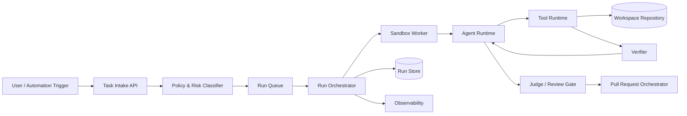
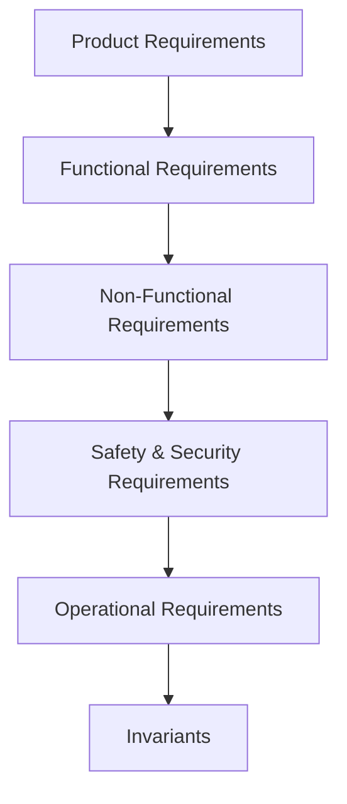
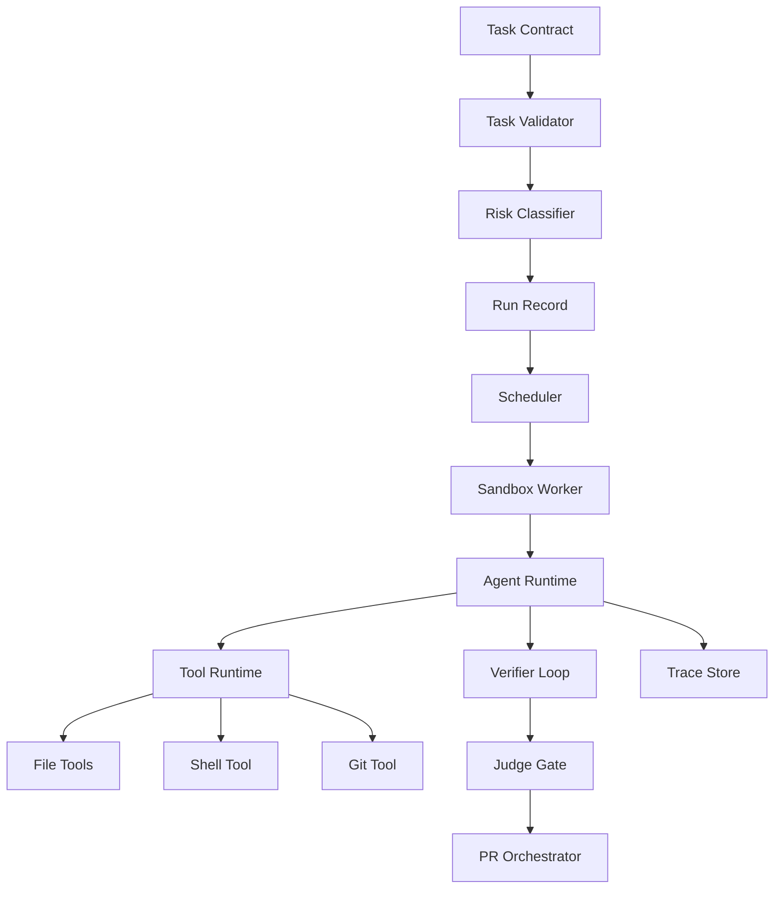

------
title: Learn AI Coding Agent From Scratch - Part 007
description: Menurunkan kebutuhan fungsional, non-fungsional, dan invariant untuk Honk-like AI coding agent agar sistem tidak hanya bisa mengubah kode, tetapi aman, terukur, dapat diaudit, dan layak dipercaya.
series: learn-ai-coding-agent
seriesTitle: Learn AI Coding Agent From Scratch
order: 7
partTitle: Requirements, Non-Functional Requirements, and Invariants
tags:
- ai-coding-agent
- requirements-engineering
- invariants
- system-design
- software-architecture
- governance
date: 2026-07-03
---

# Part 007 — Requirements, Non-Functional Requirements, and Invariants

Kita sudah punya peta skill, mental model, arsitektur high-level, taxonomy agent, domain problem, dan framework pemilihan use case. Sekarang kita masuk ke bagian yang sering diremehkan tetapi menentukan apakah sistem ini menjadi produk engineering yang serius atau hanya demo LLM yang kebetulan bisa membuat diff.

Bagian ini menjawab pertanyaan:

> Apa saja kebutuhan sistem Honk-like AI coding agent agar ia bisa menerima task, mengubah repository, memverifikasi hasil, membuat PR, dan tetap berada dalam batas keamanan, biaya, audit, serta kepercayaan developer?

Ini bukan daftar fitur. Ini adalah **contract** antara product, platform, security, developer experience, dan runtime agent.

Referensi faktual yang relevan:

- Spotify Engineering mendeskripsikan Honk sebagai background coding agent untuk software maintenance dan PR workflow, dengan konsep verifier/judge/feedback loop sebagai bagian penting dari operasi agent skala besar.  
  https://engineering.atspotify.com/2025/11/spotifys-background-coding-agent-part-1  
  https://engineering.atspotify.com/2025/12/feedback-loops-background-coding-agents-part-3
- MCP mendefinisikan model tools/resources/prompts yang memungkinkan aplikasi LLM terhubung dengan external systems secara terstruktur.  
  https://modelcontextprotocol.io/specification/2025-06-18
- OpenAI Codex documentation memosisikan Codex sebagai coding agent yang dapat membaca, mengedit, dan menjalankan kode, dengan sandbox sebagai boundary agar command dapat berjalan tanpa akses tidak terbatas ke mesin user.  
  https://developers.openai.com/codex/cloud  
  https://developers.openai.com/codex/concepts/sandboxing
- OWASP Top 10 for LLM Applications memasukkan prompt injection, insecure output handling, model denial of service, supply chain vulnerabilities, sensitive information disclosure, dan excessive agency sebagai kelas risiko yang relevan untuk agentic application.  
  https://owasp.org/www-project-top-10-for-large-language-model-applications/

---

## 1. Core framing: requirements untuk agent bukan requirements untuk chatbot

Kesalahan desain paling umum adalah memperlakukan AI coding agent seperti chatbot dengan tambahan `edit_file()` dan `run_shell()`.

Itu framing yang salah.

Chatbot menghasilkan jawaban. Coding agent menghasilkan **perubahan sistem**.

Perubahan sistem punya konsekuensi:

- file berubah;
- build bisa rusak;
- test bisa berubah;
- dependency bisa ikut berubah;
- CI bisa berjalan;
- PR bisa muncul di review queue manusia;
- secrets bisa terekspos;
- token bisa habis;
- repository bisa mendapat commit yang sulit dipahami;
- fleet repository bisa terkena perubahan massal.

Maka requirement untuk coding agent harus mencakup:

1. **capability** — apa yang boleh dan bisa dilakukan;
2. **boundary** — apa yang tidak boleh disentuh;
3. **evidence** — apa bukti bahwa perubahan benar;
4. **governance** — siapa boleh menjalankan apa;
5. **recovery** — apa yang terjadi saat gagal;
6. **auditability** — bagaimana kita menjelaskan keputusan dan tindakan agent.

Prinsip inti:

```text
An AI coding agent is not trustworthy because it can produce code.
It becomes trustworthy when every code change is bounded, verified, explainable, reversible, and reviewable.
```

---

## 2. Batas sistem yang sedang kita desain

Kita membangun platform dengan batas seperti ini:



Yang penting: requirement tidak hanya melekat pada `Agent Runtime`. Requirement tersebar di seluruh lifecycle:

- API harus menolak task yang tidak valid;
- policy harus menentukan lane eksekusi;
- scheduler harus menghindari duplikasi dan overload;
- sandbox harus membatasi side effect;
- tool runtime harus validasi command dan path;
- verifier harus menghasilkan evidence;
- judge harus menilai diff terhadap task contract;
- PR orchestrator harus hanya membuka PR saat gate terpenuhi;
- observability harus mampu mereplay keputusan.

---

## 3. Requirement layer

Kita pecah requirement menjadi enam layer.



Penjelasan singkat:

| Layer | Pertanyaan utama | Contoh |
|---|---|---|
| Product | Value apa yang diberikan? | Agent membuat PR migrasi dependency dengan bukti build/test. |
| Functional | Sistem bisa melakukan apa? | Clone repo, edit file, run test, create PR. |
| Non-functional | Seberapa baik/aman/cepat/andal? | Retry, timeout, cost budget, isolation, audit. |
| Safety & security | Apa yang tidak boleh terjadi? | Secret leakage, arbitrary network, destructive command. |
| Operational | Bagaimana sistem dijalankan? | Queue, capacity, monitoring, failure handling. |
| Invariants | Aturan yang selalu benar | Tidak ada PR tanpa verification record. |

Layer terakhir, **invariant**, adalah yang paling penting untuk platform agent. Invariant bukan aspirasi. Invariant adalah hukum sistem.

---

## 4. Product requirements: value yang harus terlihat oleh developer

Product requirement untuk Honk-like agent harus berpusat pada trust dan throughput.

### PR-001 — Agent menerima task perubahan kode yang bounded

Sistem harus menerima task dengan scope yang jelas:

- repository target;
- branch dasar;
- deskripsi perubahan;
- batas file/path;
- verifier yang harus dijalankan;
- mode eksekusi;
- kriteria selesai.

Task yang terlalu kabur tidak boleh langsung masuk autonomous lane.

Contoh task yang baik:

```yaml
repo: payments-service
baseBranch: main
goal: Replace deprecated PaymentClient.createCharge() with PaymentClient.createTransaction()
scope:
  includePaths:
    - src/main/java/**
    - src/test/java/**
  excludePaths:
    - src/main/resources/secrets/**
verifiers:
  - mvn -q -DskipITs test
  - mvn -q -DskipTests compile
mode: supervised_pr
maxIterations: 5
```

Contoh task yang buruk:

```text
Make the payment service better and fix any issue you find.
```

Task buruk ini tidak punya end state, tidak punya verifier, tidak punya boundary, dan terlalu mudah berubah menjadi uncontrolled exploration.

### PR-002 — Agent menghasilkan artifact yang bisa direview

Output minimum bukan hanya patch. Output minimum adalah:

- diff;
- run summary;
- files touched;
- verifier result;
- known limitations;
- confidence/risk note;
- PR body atau draft PR body.

Developer harus bisa menjawab cepat:

1. Apa yang diminta?
2. Apa yang diubah?
3. Kenapa file itu diubah?
4. Bukti apa yang sudah dijalankan?
5. Apa yang belum diverifikasi?

### PR-003 — Agent mengurangi toil tanpa mengambil ownership manusia

Agent boleh mengurangi pekerjaan mekanis, tetapi tidak boleh menghilangkan accountability.

Untuk pekerjaan risiko rendah, agent bisa membuat PR otomatis. Untuk pekerjaan risiko menengah, agent bisa membuat draft PR. Untuk pekerjaan risiko tinggi, agent hanya boleh membuat analysis atau migration plan.

Prinsip:

```text
Automation may perform work, but ownership remains explicit.
```

### PR-004 — Agent harus mendukung operasi bertahap

Platform harus bisa mulai dari satu repository, lalu berkembang ke banyak repository.

Roadmap product yang sehat:

```text
Single task → single repo → repeated task → repo cohort → fleet rollout → campaign automation
```

Jangan langsung membangun fleet-wide automation sebelum single-repo loop stabil.

---

## 5. Functional requirements: kemampuan sistem

Bagian ini daftar kemampuan utama yang wajib ada.

### FR-001 — Task intake

Sistem harus menyediakan mekanisme intake task:

- melalui API;
- melalui CLI;
- nantinya melalui Slack/GitHub issue/backstage plugin;
- dengan schema validasi;
- dengan idempotency key;
- dengan mode eksekusi eksplisit.

Minimal request:

```json
{
  "taskId": "task_123",
  "repo": "acme/payment-service",
  "baseBranch": "main",
  "goal": "Migrate deprecated charge API",
  "constraints": {
    "includePaths": ["src/main/java/**", "src/test/java/**"],
    "excludePaths": ["src/main/resources/**"]
  },
  "verifiers": ["mvn -q test"],
  "executionMode": "supervised_pr",
  "maxIterations": 5
}
```

Validation rule:

- `repo` wajib dikenal atau explicitly authorized;
- `goal` tidak boleh kosong;
- `executionMode` harus valid;
- autonomous mode butuh verifier;
- include/exclude path harus canonicalized;
- max iteration harus punya batas atas.

### FR-002 — Risk classification

Setiap task harus diklasifikasikan sebelum run dibuat.

Output classifier:

```json
{
  "riskLevel": "medium",
  "lane": "supervised_pr",
  "reasons": [
    "Changes production Java source",
    "Verifier available",
    "No database migration requested"
  ],
  "requiredGates": ["compile", "unit_test", "diff_judge", "human_review"]
}
```

Classifier boleh deterministic di awal. Jangan buru-buru memakai LLM untuk risk classification. Rules lebih mudah diaudit.

### FR-003 — Repository preparation

Worker harus bisa:

- clone repository;
- checkout base branch;
- create working branch;
- validate clean working tree;
- load repo instructions;
- identify build system;
- discover test commands;
- prepare dependency cache;
- record commit SHA awal.

Commit SHA awal penting agar patch selalu bisa ditrace ke source state tertentu.

### FR-004 — Agent runtime

Agent runtime harus menyediakan loop:

```text
observe → plan → act → inspect result → verify → repair → stop
```

Minimum capability:

- membaca file;
- mencari file;
- mengedit file;
- menjalankan command yang diizinkan;
- membaca error log;
- membuat summary;
- memutuskan stop saat verifier lulus atau budget habis.

### FR-005 — Tool runtime

Tool runtime harus mengelola:

- tool registry;
- schema validasi input;
- izin tool;
- timeout;
- output limit;
- redaction;
- error semantics;
- audit log.

Tool tidak boleh hanya fungsi bebas. Setiap tool adalah security boundary.

Contoh tool schema konseptual:

```json
{
  "name": "read_file",
  "input": {
    "path": "src/main/java/com/acme/PaymentService.java",
    "maxBytes": 20000
  },
  "policy": {
    "requiresWorkspacePath": true,
    "allowBinary": false,
    "redactSecrets": true
  }
}
```

### FR-006 — Patch management

Sistem harus menyimpan patch sebagai artifact first-class.

Patch artifact minimal:

- base commit;
- branch name;
- file list;
- line additions/deletions;
- unified diff;
- generated timestamp;
- tool calls yang menyebabkan perubahan;
- verifier status saat patch dibuat.

Patch tidak boleh hanya tersisa di working tree. Working tree bisa hilang; artifact harus survive.

### FR-007 — Verification loop

Verifier harus bisa dijalankan:

- sebelum agent mulai, untuk baseline opsional;
- selama agent loop, sebagai feedback;
- sebelum PR dibuat, sebagai gate wajib;
- setelah PR dibuat, sebagai CI outer loop.

Tipe verifier:

| Verifier | Contoh | Tujuan |
|---|---|---|
| Format | `mvn spotless:check` | konsistensi style |
| Compile | `mvn compile` | sintaks dan type correctness |
| Unit test | `mvn test` | regression lokal |
| Static analysis | `semgrep`, `spotbugs` | bug/security pattern |
| Secret scan | `gitleaks` | mencegah leakage |
| Custom verifier | script migrasi | domain-specific evidence |

### FR-008 — Judge / review gate

Judge tidak menggantikan verifier. Judge menilai aspek yang tidak mudah diverifikasi deterministically:

- apakah diff sesuai task;
- apakah agent overreach;
- apakah perubahan terlalu besar;
- apakah PR body jujur;
- apakah test yang ditambahkan relevan;
- apakah ada risk note yang hilang.

Judge bisa berupa:

- deterministic rule;
- LLM reviewer;
- kombinasi keduanya.

Untuk early platform, gunakan deterministic rule sebanyak mungkin, lalu LLM judge sebagai tambahan.

### FR-009 — PR orchestration

PR orchestrator harus:

- membuat branch dengan nama stabil;
- commit dengan message jelas;
- membuat PR body yang berisi evidence;
- menambahkan label;
- mengassign reviewer/owner bila metadata tersedia;
- menyertakan link run trace;
- tidak membuka PR bila gate wajib gagal.

PR body minimal:

```markdown
## Agent Task
Migrate deprecated PaymentClient.createCharge() usages to createTransaction().

## Changes
- Updated 4 call sites in payment orchestration.
- Updated 2 unit tests to use new response type.

## Verification
- mvn -q -DskipITs test: passed
- mvn -q -DskipTests compile: passed

## Risk Notes
- No database migration.
- No public API signature changed.

## Agent Run
run_20260703_abc123
```

### FR-010 — Observability and replay

Sistem harus menyimpan:

- step log;
- tool call input/output metadata;
- token usage;
- model id;
- prompt version;
- verifier command and result;
- diff timeline;
- final verdict.

Tujuannya bukan hanya debugging. Observability adalah bagian dari trust.

---

## 6. Non-functional requirements

Non-functional requirement menentukan apakah sistem layak production.

### NFR-001 — Safety by default

Default posture:

```text
deny network, deny secrets, deny destructive commands, deny PR creation until gates pass
```

Agent tidak boleh mendapat akses default yang sama dengan developer manusia.

### NFR-002 — Reproducibility

Setiap run harus bisa dijelaskan dengan data berikut:

- task input;
- repo + base commit;
- model/provider version jika tersedia;
- tool registry version;
- policy version;
- prompt template version;
- sandbox image digest;
- verifier command;
- final diff.

LLM output tidak deterministik sempurna. Tetapi sistem tetap harus reproducible pada level artifact dan decision trail.

### NFR-003 — Idempotency

Task submission harus idempotent.

Kasus:

- user klik submit dua kali;
- webhook retry;
- scheduler restart;
- worker crash lalu task diambil ulang.

Dengan idempotency key, platform harus tahu apakah run baru perlu dibuat atau request adalah duplikat.

### NFR-004 — Bounded execution

Setiap run harus punya batas:

- max wall-clock time;
- max tool calls;
- max shell commands;
- max verifier attempts;
- max tokens;
- max patch size;
- max files touched.

Tanpa batas ini, agent bisa menjadi cost sink dan operational risk.

### NFR-005 — Failure isolation

Failure satu run tidak boleh:

- mempengaruhi repository lain;
- menghabiskan quota semua tenant;
- meninggalkan workspace yang dapat dipakai ulang dengan state kotor;
- membuka PR parsial;
- menyimpan secret di log.

### NFR-006 — Auditability

Audit minimum:

- siapa/apa yang submit task;
- policy apa yang dipakai;
- agent melakukan command apa;
- file apa yang dibaca/diubah;
- verifier apa yang berjalan;
- siapa yang approve/merge PR;
- apakah ada manual override.

Audit log harus append-only atau minimal tamper-evident pada sistem production.

### NFR-007 — Developer reviewability

Diff harus kecil, jelas, dan terstruktur.

Reviewability dapat diukur dari:

- jumlah file touched;
- jumlah line changed;
- apakah perubahan bercampur unrelated cleanup;
- apakah test relevan;
- apakah PR body menjelaskan trade-off;
- apakah build evidence terlihat.

Agent yang benar tetapi menghasilkan diff sulit direview tetap buruk secara product.

### NFR-008 — Cost transparency

Setiap run harus menyimpan:

- token input/output;
- model cost estimate;
- tool runtime duration;
- verifier duration;
- retry count.

Fleet-wide agent tanpa cost accounting akan sulit dikendalikan.

### NFR-009 — Privacy and data minimization

Agent tidak boleh mengirim seluruh repository ke model bila tidak perlu.

Context harus minimal:

- file relevan;
- symbol relevan;
- error log relevan;
- policy relevan;
- task contract.

Data minimization bukan hanya security. Ini juga mengurangi noise dan cost.

### NFR-010 — Extensibility

Platform harus memungkinkan menambah:

- model provider;
- tool baru;
- verifier baru;
- repository context server;
- policy rule;
- risk lane;
- PR integration.

Tetapi extensibility harus melalui registry dan schema, bukan plugin bebas yang bypass audit.

---

## 7. Safety and security requirements

Bagian ini akan dibahas lebih dalam di Part 008, tetapi requirement awal harus sudah muncul di sini.

### SR-001 — Secret must not enter model context

Sistem harus:

- scan file sebelum dikirim ke model;
- redact output command;
- block path tertentu;
- block environment variable sensitive;
- jangan memasukkan token ke prompt;
- jangan menyimpan raw secret di trace.

### SR-002 — Tool execution must be policy checked

Setiap tool call harus melewati policy engine.

Contoh:

```text
Agent wants: run_shell("rm -rf ~/.m2")
Policy result: deny
Reason: command touches path outside workspace and destructive pattern detected
```

### SR-003 — Network default should be restricted

Network access harus explicit:

- package download mungkin diizinkan untuk build tertentu;
- arbitrary outbound HTTP tidak boleh default;
- access ke internal service harus sangat terbatas;
- metadata service cloud harus diblokir.

### SR-004 — MCP/tool metadata must be trusted carefully

MCP membuat integrasi tool lebih standar, tetapi tool descriptor tetap input yang dapat disalahgunakan bila berasal dari server tidak terpercaya. Tool registry harus punya approval, version pinning, dan audit.

### SR-005 — Prompt injection from repository content must be assumed

File repository, issue body, README, test output, commit message, dan PR comment bisa berisi instruksi berbahaya.

Agent harus memisahkan:

- trusted system/developer instructions;
- task instruction;
- untrusted repository content;
- untrusted tool output.

---

## 8. Invariants: hukum sistem

Invariant adalah aturan yang **selalu benar**. Jika invariant dilanggar, sistem dianggap bug walaupun task berhasil.

### INV-001 — No run without immutable task snapshot

Setiap run harus menyimpan snapshot task input saat run dimulai.

Kenapa?

Karena task bisa berubah. Jika user mengubah task setelah run dimulai, kita tetap perlu tahu agent menjalankan instruksi versi mana.

### INV-002 — No workspace write outside allowed root

Agent dan tool tidak boleh menulis di luar workspace root yang ditentukan.

Contoh prohibited:

```text
/var/run/docker.sock
~/.ssh/id_rsa
/tmp/shared-other-tenant
/etc/hosts
```

### INV-003 — No PR without final gate record

PR tidak boleh dibuat tanpa final gate record.

Final gate record minimal:

```json
{
  "runId": "run_abc",
  "baseCommit": "abc123",
  "headCommit": "def456",
  "requiredVerifiers": [
    {"name": "compile", "status": "passed"},
    {"name": "unit_test", "status": "passed"}
  ],
  "diffPolicy": "passed",
  "judge": "passed",
  "createdAt": "2026-07-03T00:00:00Z"
}
```

### INV-004 — No secret in prompt, tool output summary, or PR body

Secret leakage adalah invariant violation, bukan sekadar warning.

### INV-005 — Every tool call is attributable

Setiap tool call harus punya:

- run id;
- step id;
- tool name;
- input metadata;
- output metadata;
- policy decision;
- duration;
- exit status.

### INV-006 — Every file modification is attributable to a tool call

Jika file berubah tetapi tidak ada tool call yang menjelaskan perubahan, run harus dianggap corrupted.

### INV-007 — Run state transitions are monotonic

State transition harus mengikuti state machine.

Contoh valid:

```text
QUEUED → PREPARING → RUNNING → VERIFYING → JUDGING → PR_CREATED
```

Contoh invalid:

```text
FAILED → RUNNING
PR_CREATED → VERIFYING
```

Retry harus membuat attempt baru, bukan membalik state final secara diam-diam.

### INV-008 — Agent cannot self-approve restricted action

Agent tidak boleh memberi approval untuk dirinya sendiri pada aksi restricted.

Restricted action:

- push branch;
- create PR pada high-risk task;
- access network baru;
- read restricted path;
- use privileged tool;
- ignore failing verifier.

### INV-009 — Verification failure cannot be hidden

Jika verifier gagal pernah terjadi, riwayatnya tetap harus terlihat meskipun akhirnya lulus.

Ini penting karena failure history memberi konteks review.

### INV-010 — Final diff must be computed from clean base

Final diff harus terhadap base commit yang tercatat. Jangan membuat diff dari state ambigu.

### INV-011 — A run must stop when budget is exhausted

Budget exhaustion bukan saran. Itu hard stop.

Budget mencakup:

- token;
- waktu;
- tool call;
- shell command;
- verifier attempts;
- patch size.

### INV-012 — Human override must be explicit and audited

Jika manusia override gate, sistem harus mencatat:

- siapa;
- kapan;
- gate apa;
- alasan;
- dampak.

---

## 9. Requirement traceability matrix

Kita harus bisa men-trace requirement ke komponen dan test.

| ID | Requirement | Component | Test / Evidence |
|---|---|---|---|
| FR-001 | Task intake validasi request | API | invalid request rejected |
| FR-002 | Risk classification | Policy Engine | low/medium/high fixtures |
| FR-003 | Repo preparation | Worker | clone checkout branch test |
| FR-004 | Agent loop | Agent Runtime | fake model loop integration test |
| FR-005 | Tool runtime | Tool Registry | schema validation + timeout test |
| FR-006 | Patch artifact | Artifact Store | diff persisted after workspace deletion |
| FR-007 | Verification loop | Verifier | failing test returns structured result |
| FR-008 | Judge gate | Judge | overreach diff rejected |
| FR-009 | PR orchestration | PR Service | no PR when verifier fails |
| FR-010 | Observability | Trace Store | run replay contains all steps |
| NFR-003 | Idempotency | Task API | duplicate idempotency key returns same task |
| NFR-004 | Bounded execution | Orchestrator | run stopped at max iterations |
| SR-001 | No secret in context | Redactor | fixture secret redacted |
| INV-002 | No write outside workspace | File Tool | path traversal denied |
| INV-008 | No self approval | Policy Engine | restricted action requires human approval |

Traceability ini akan menjadi basis implementation checklist di part berikutnya.

---

## 10. Definition of Ready untuk task agent

Task boleh masuk execution lane jika memenuhi DoR.

### DoR minimal

```text
A task is ready when it has a target repo, base branch, bounded goal, allowed scope, execution mode, verifier strategy, and stop condition.
```

Checklist:

- [ ] repository valid;
- [ ] base branch valid;
- [ ] goal spesifik;
- [ ] include/exclude path jelas;
- [ ] risk lane diketahui;
- [ ] verifier tersedia atau alasan tidak tersedia tercatat;
- [ ] max iteration ditentukan;
- [ ] policy version ditentukan;
- [ ] expected output jelas: analysis, patch, draft PR, atau PR.

Task yang tidak ready tidak boleh dipaksa masuk agent. Ia harus dikembalikan ke user dengan feedback spesifik.

Contoh feedback:

```text
Task rejected for autonomous execution:
- No verifier provided.
- Scope includes database migration and production API changes.
- Goal is ambiguous: "improve checkout reliability".
Suggested next step: create analysis-only run or provide concrete failing test/error.
```

---

## 11. Definition of Done untuk run agent

Run dianggap selesai bukan ketika agent berhenti menulis. Run selesai ketika outcome tercatat.

Outcome valid:

| Outcome | Arti |
|---|---|
| `analysis_completed` | Agent hanya menghasilkan analisis/rencana. |
| `patch_created` | Patch dibuat tetapi belum PR. |
| `verification_failed` | Patch ada tetapi verifier gagal. |
| `judge_rejected` | Verifier mungkin lulus, tetapi judge/policy menolak. |
| `pr_created` | PR dibuat setelah gate lulus. |
| `blocked_by_policy` | Task/aksi diblokir policy. |
| `budget_exhausted` | Agent berhenti karena budget. |
| `infrastructure_failed` | Worker/tool/provider gagal. |

### DoD untuk PR-created lane

- [ ] final diff tersedia;
- [ ] required verifier lulus;
- [ ] judge/policy gate lulus;
- [ ] PR body berisi summary dan evidence;
- [ ] trace link tersedia;
- [ ] no secret detected;
- [ ] run state final;
- [ ] cost metrics tercatat.

---

## 12. Task contract versi awal

Kita akan memakai task contract konseptual ini sebagai pondasi implementasi.

```yaml
apiVersion: ai-agent.acme.dev/v1
kind: CodeChangeTask
metadata:
  id: task_20260703_001
  submittedBy: user:alice
  idempotencyKey: migrate-payment-api-001
spec:
  repository:
    provider: github
    owner: acme
    name: payment-service
    baseBranch: main
  goal:
    title: Migrate deprecated payment charge API
    description: |
      Replace usages of PaymentClient.createCharge() with
      PaymentClient.createTransaction() and update related tests.
  scope:
    includePaths:
      - src/main/java/**
      - src/test/java/**
    excludePaths:
      - src/main/resources/**
      - '**/*.pem'
  execution:
    mode: supervised_pr
    maxIterations: 5
    maxWallClockMinutes: 30
    maxFilesChanged: 20
    maxLinesChanged: 800
  verification:
    required:
      - name: compile
        command: mvn -q -DskipTests compile
      - name: unit-test
        command: mvn -q test
  policy:
    allowNetwork: package_registry_only
    allowSecrets: false
    allowDatabaseMigration: false
  output:
    desired: pull_request
```

Yang penting: task contract ini bukan prompt. Prompt akan diturunkan dari contract. Contract tetap menjadi source of truth.

---

## 13. Dari requirement ke komponen implementasi

Komponen awal yang akan kita bangun di seri ini:



Mapping requirement:

| Component | Tanggung jawab |
|---|---|
| Task Validator | Menolak task tidak valid sebelum resource dipakai. |
| Risk Classifier | Menentukan lane dan gate. |
| Run Store | Menyimpan immutable run snapshot. |
| Scheduler | Mengatur concurrency dan retry. |
| Sandbox Worker | Menyiapkan isolated workspace. |
| Agent Runtime | Mengelola loop reasoning/action. |
| Tool Runtime | Menjaga semua side effect terkontrol. |
| Verifier | Memberi feedback deterministik. |
| Judge | Menilai kesesuaian diff. |
| PR Orchestrator | Membuka PR hanya setelah gate. |
| Trace Store | Audit, replay, observability. |

---

## 14. Common requirement mistakes

### Mistake 1 — “Agent harus bisa mengerjakan semua issue”

Itu bukan requirement. Itu wishful thinking.

Requirement yang benar:

```text
Agent should handle bounded code-change tasks where scope, verifier, and stop condition are explicit.
```

### Mistake 2 — “Agent harus selalu berhasil”

Agent tidak harus selalu berhasil. Agent harus gagal dengan aman dan jelas.

Requirement yang benar:

```text
When the agent cannot produce a verified patch within budget, it must stop, preserve evidence, and explain the failure.
```

### Mistake 3 — “LLM judge cukup untuk security”

Tidak cukup. Security control harus deterministic sebanyak mungkin.

Requirement yang benar:

```text
Security-sensitive gates must be enforced by policy engine and sandbox controls; LLM judge may add review signal but must not be the sole enforcement mechanism.
```

### Mistake 4 — “CI hijau berarti benar”

CI hijau berarti perubahan melewati checker yang ada. Bukan berarti perubahan sesuai intent.

Requirement yang benar:

```text
PR creation requires both verifier evidence and task-alignment review.
```

### Mistake 5 — “Prompt bisa menggantikan policy”

Prompt adalah instruksi. Policy adalah enforcement.

Requirement yang benar:

```text
Restricted actions are blocked outside the model by the runtime, regardless of what the prompt says.
```

---

## 15. Minimal viable platform requirement

Untuk membangun versi awal yang serius, jangan langsung fleet-scale. MVP yang benar cukup mencakup:

1. satu repo;
2. satu task type;
3. satu model provider;
4. file read/search/edit tools;
5. shell verifier dengan allowlist;
6. patch artifact;
7. no automatic push;
8. final run summary;
9. basic trace;
10. strict sandbox boundary.

MVP yang tidak aman:

```text
Agent has repo access + shell access + GitHub token + no verifier + no audit + auto-push.
```

MVP yang aman:

```text
Agent runs in sandbox, edits workspace only, executes allowlisted commands, stores diff, runs verifier, and produces a reviewable patch.
```

---

## 16. Exercise: requirement review

Ambil task berikut:

```text
Upgrade our Spring Boot services to the latest version and fix anything that breaks.
```

Klasifikasikan:

1. Apakah task ini ready?
2. Apa missing requirement?
3. Apakah boleh autonomous?
4. Verifier apa yang wajib?
5. Apa stop condition?
6. Apa risk lane?

Jawaban yang kuat:

- task belum ready karena scope terlalu luas;
- “latest version” harus dikonkretkan;
- target repo/service harus jelas;
- breaking changes harus dibatasi;
- verifier compile/test wajib;
- autonomous fleet rollout tidak boleh;
- lane awal sebaiknya analysis-only atau supervised PR untuk satu repo.

---

## 17. Ringkasan part ini

Kita sudah menetapkan requirement untuk Honk-like AI coding agent:

- product requirement berpusat pada trust, throughput, dan bounded automation;
- functional requirement mencakup task intake, risk classifier, repo prep, agent loop, tool runtime, patch artifact, verifier, judge, PR orchestration, dan observability;
- non-functional requirement mencakup safety, reproducibility, idempotency, bounded execution, auditability, reviewability, cost, privacy, dan extensibility;
- security requirement menegaskan secret isolation, policy-checked tools, network restriction, MCP/tool trust, dan prompt-injection awareness;
- invariant menjadi hukum sistem: no PR without gate, no write outside workspace, every tool call logged, no self-approval, no hidden verifier failure.

Part berikutnya akan memperdalam ini menjadi **threat model dan failure model**. Kita akan melihat bukan hanya apa yang harus dilakukan sistem, tetapi bagaimana sistem bisa diserang, gagal diam-diam, menghasilkan PR salah, membocorkan secret, atau menghabiskan budget.
