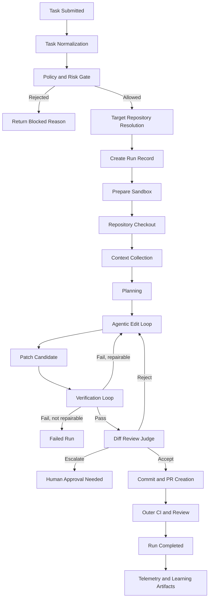
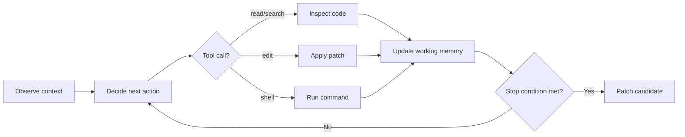
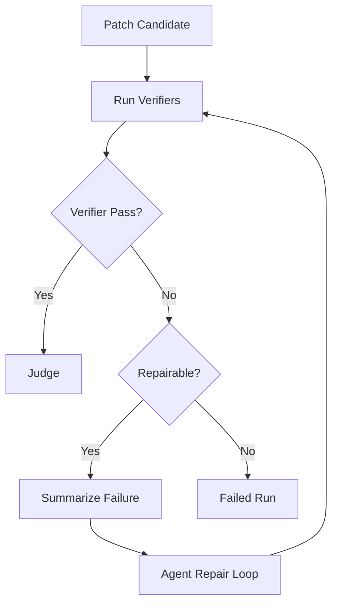
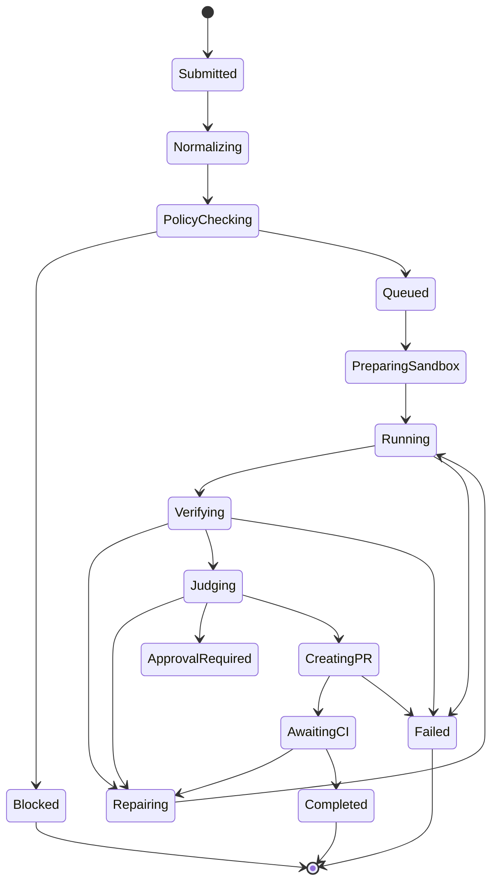
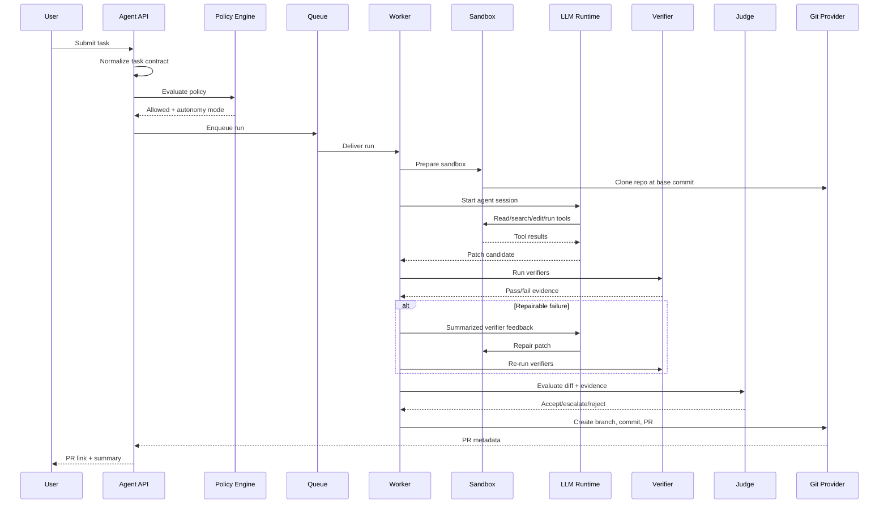

------
title: Learn AI Coding Agent From Scratch - Part 009
description: End-to-end reference flow untuk Honk-like AI coding agent: dari task intake, normalization, policy gate, repository preparation, planning, agent loop, patching, verification, judge, PR creation, human review, sampai learning feedback.
series: learn-ai-coding-agent
seriesTitle: Learn AI Coding Agent From Scratch
order: 9
partTitle: End-to-End Reference Flow
tags:
- ai-coding-agent
- architecture
- workflow
- orchestration
- verifier
- pull-request
- state-machine
date: 2026-07-03
---

# Part 009 — End-to-End Reference Flow

Kita sudah punya batas sistem, taxonomy, requirements, invariants, dan threat model. Sekarang kita masuk ke alur lengkap.

Pertanyaan inti part ini:

> Ketika user berkata “migrasikan semua service dari library A ke library B”, apa yang sebenarnya terjadi di dalam Honk-like AI coding agent sampai akhirnya sebuah pull request muncul?

Jawaban yang buruk biasanya berbunyi:

```text
Kirim prompt ke LLM, biarkan LLM edit file, jalankan test, lalu buat PR.
```

Jawaban itu terlalu pendek dan berbahaya. Sistem production-grade tidak boleh disusun sebagai “LLM diberi shell”. Yang kita bangun adalah pipeline perubahan kode terkontrol:

```text
Task request
  -> normalized task contract
  -> policy decision
  -> repository snapshot
  -> sandbox run
  -> planning
  -> tool-mediated edits
  -> verification feedback
  -> judge decision
  -> branch + commit + PR
  -> human review
  -> telemetry + learning artifact
```

Referensi faktual yang relevan:

- Spotify Engineering menjelaskan Honk sebagai background coding agent untuk large-scale software maintenance dan PR workflow; mereka juga menekankan feedback loop seperti verifier, judge, dan MCP-based integration.  
  https://engineering.atspotify.com/2025/11/spotifys-background-coding-agent-part-1  
  https://engineering.atspotify.com/2025/12/feedback-loops-background-coding-agents-part-3
- OpenAI Codex cloud mendeskripsikan coding agent yang dapat bekerja di background, paralel, dan menjalankan task di cloud environment sendiri.  
  https://developers.openai.com/codex/cloud
- MCP specification memisahkan tools, resources, dan prompts sebagai mekanisme integrasi model dengan external systems.  
  https://modelcontextprotocol.io/specification/2025-06-18
- Claude Code documentation memosisikan agent sebagai tool yang dapat bekerja dengan command, permissions, memory, MCP, dan repository context.  
  https://docs.anthropic.com/en/docs/claude-code/overview

Part ini belum menulis implementation detail penuh. Kita sedang membuat **reference flow** yang nanti akan diterjemahkan menjadi domain model, API, database schema, worker, sandbox, tool runtime, verifier, dan PR orchestrator.

---

## 1. Prinsip utama: flow harus deterministic di luar LLM

LLM boleh membantu reasoning dan editing, tetapi sistem di sekitarnya harus deterministic sejauh mungkin.

Artinya:

- siapa yang boleh membuat task ditentukan policy;
- repo mana yang boleh disentuh ditentukan target selector;
- branch mana yang dibuat ditentukan branch strategy;
- command mana yang boleh dijalankan ditentukan sandbox policy;
- perubahan mana yang boleh keluar ditentukan diff policy;
- hasil mana yang boleh dibuat PR ditentukan verifier dan judge;
- kapan human approval dibutuhkan ditentukan risk policy.

LLM tidak boleh menjadi satu-satunya sumber kebenaran untuk:

- izin;
- success criteria;
- safety;
- scope;
- readiness;
- mergeability;
- production risk.

Mental model-nya:

```text
LLM = heuristic worker inside a controlled change system.
System = source of authority.
```

Dalam engineering terms:

```text
Agent runtime produces proposals.
Control plane decides lifecycle.
Verifier produces evidence.
Judge evaluates evidence.
Human reviewer retains authority for high-risk changes.
```

---

## 2. The complete end-to-end flow

Diagram besar:



Kunci dari diagram ini bukan jumlah langkahnya. Kunci utamanya adalah setiap fase punya **input, output, authority, dan failure semantics**.

Kalau sebuah fase tidak punya failure semantics, agent akan masuk ke kondisi abu-abu:

```text
Tidak jelas apakah harus retry, stop, escalate, atau bikin PR draft.
```

Itu sumber banyak agent yang terasa “pintar”, tetapi tidak bisa dipercaya.

---

## 3. Stage 1 — Task submitted

Task adalah permintaan perubahan. Jangan mulai dari prompt. Mulai dari **task contract**.

Contoh input buruk:

```text
Upgrade library auth-nya ya.
```

Contoh input yang bisa dinormalisasi:

```yaml
taskType: dependency_upgrade
repository: payments-service
baseBranch: main
objective: Upgrade com.example:auth-client from 2.x to 3.x
scope:
  include:
    - pom.xml
    - src/main/java/**
    - src/test/java/**
  exclude:
    - database/migrations/**
    - deployment/**
constraints:
  - Keep public REST API backward compatible
  - Do not modify generated sources
  - Preserve existing authentication behavior
successCriteria:
  - mvn -q test passes
  - no forbidden path modified
  - PR summary explains migration decisions
riskLevel: medium
```

Sistem boleh menerima natural language, tetapi harus segera mengubahnya menjadi bentuk yang lebih ketat.

Task contract minimal:

| Field | Fungsi |
|---|---|
| `taskType` | Mengarahkan strategy dan verifier default |
| `repository` | Target perubahan |
| `baseBranch` | Snapshot awal |
| `objective` | Tujuan perubahan yang bisa diverifikasi |
| `scope.include` | Area yang boleh disentuh |
| `scope.exclude` | Area yang tidak boleh disentuh |
| `constraints` | Batas perilaku agent |
| `successCriteria` | Evidence yang harus dipenuhi |
| `riskLevel` | Menentukan autonomy level |
| `requestedBy` | Audit dan permission |

Invariant:

```text
No run without a normalized task contract.
```

Bukan karena natural language selalu buruk, tetapi karena natural language terlalu longgar untuk menjadi audit artifact.

---

## 4. Stage 2 — Task normalization

Task normalization mengubah permintaan user menjadi format operasional.

Tugas normalizer:

1. mengklasifikasikan jenis task;
2. mengekstrak target repo dan branch;
3. menentukan scope perubahan;
4. menebak verifier default;
5. mengidentifikasi risiko;
6. meminta klarifikasi hanya jika task tidak bisa dibuat aman;
7. menghasilkan task contract yang dapat disimpan.

Contoh normalizer output:

```json
{
  "taskType": "api_migration",
  "autonomyMode": "supervised_pr",
  "riskLevel": "medium",
  "targetRepositories": ["billing-service"],
  "baseBranch": "main",
  "allowedPaths": ["src/**", "pom.xml"],
  "blockedPaths": ["infra/**", "secrets/**", ".github/workflows/**"],
  "verifiers": ["format", "compile", "unit_test"],
  "requiresHumanApprovalBeforePR": false,
  "requiresHumanApprovalBeforeMerge": true
}
```

Perhatikan: output ini bukan prompt. Ini adalah **control-plane decision input**.

LLM bisa membantu normalization, tetapi hasilnya harus divalidasi secara deterministic:

- repo harus exist;
- branch harus exist;
- requester harus punya permission;
- blocked path tidak boleh overlap sembarangan;
- task type harus dikenal;
- verifier harus tersedia;
- autonomy mode harus valid.

Kalau normalizer gagal, sistem tidak boleh melanjutkan ke sandbox.

---

## 5. Stage 3 — Policy and risk gate

Policy gate menjawab:

```text
Apakah task ini boleh dijalankan?
Dengan mode autonomy apa?
Di environment apa?
Dengan tool permission apa?
Butuh approval di titik mana?
```

Contoh policy matrix:

| Risk | Example | Allowed mode | PR allowed? | Human gate |
|---|---|---|---|---|
| Low | format-only, docs typo | autonomous_pr | yes | after PR |
| Medium | dependency upgrade minor | supervised_pr | yes | before merge |
| High | auth flow change | draft_only | draft only | before PR and merge |
| Critical | secret handling, crypto, payment semantics | analysis_only or blocked | no | explicit architecture review |

Policy gate tidak boleh menerima jawaban LLM seperti:

```text
This looks safe.
```

Ia butuh evidence:

- task type;
- repo sensitivity;
- path sensitivity;
- dependency criticality;
- service ownership;
- blast radius;
- compliance tag;
- production tier;
- historical failure data;
- user role.

Contoh decision record:

```yaml
policyDecision:
  decision: allowed
  autonomyMode: supervised_pr
  reason:
    - task type dependency_upgrade is permitted
    - repository is non-critical tier 2
    - blocked paths exclude deployment and secrets
    - requester is repository maintainer
  requiredGates:
    - verifier_pass
    - diff_judge_pass
    - human_review_before_merge
```

Invariant:

```text
Agent runtime receives capabilities, not trust.
```

Jadi agent tidak diberi akses penuh karena “sepertinya task-nya sederhana”. Ia diberi capability yang dibatasi.

---

## 6. Stage 4 — Target repository resolution

Setelah policy allow, sistem harus memastikan target benar.

Untuk single repo:

```text
repository = github.com/org/payments-service
baseBranch = main
commit = 4f6a...c29
```

Untuk fleet change:

```yaml
selector:
  organization: platform
  repoQuery:
    language: java
    hasFile: pom.xml
    containsDependency: com.example:auth-client
    excludes:
      - archived repos
      - deprecated services
      - critical payment gateway
batching:
  maxReposPerBatch: 20
  stopOnFailureRateAbove: 0.25
```

Target resolution menghasilkan snapshot yang immutable:

```yaml
target:
  repo: payments-service
  baseBranch: main
  baseCommit: 4f6a921...
  resolvedAt: 2026-07-03T13:00:00+07:00
```

Kenapa base commit penting?

Karena branch `main` bergerak. Kalau run gagal dan direplay besok, kita harus tahu agent bekerja dari snapshot mana.

Invariant:

```text
Every run must bind to an immutable base commit.
```

---

## 7. Stage 5 — Create run record

Run record dibuat sebelum eksekusi.

Minimal fields:

```yaml
run:
  id: run_01J...
  taskId: task_01J...
  repository: payments-service
  baseCommit: 4f6a921...
  state: preparing
  autonomyMode: supervised_pr
  policyDecisionId: pol_01J...
  createdAt: 2026-07-03T13:01:00+07:00
```

Run record adalah ledger utama. Semua step, tool call, artifact, verifier result, patch, dan PR metadata menempel ke run ini.

Kenapa harus dibuat sebelum worker mulai?

Karena worker bisa mati. Tanpa run record, kita tidak tahu:

- task mana yang sedang diproses;
- sandbox mana yang dibuat;
- biaya token berapa;
- command apa yang sudah dijalankan;
- artifact apa yang hilang;
- apakah run aman untuk retry.

Rule:

```text
No execution without durable run identity.
```

---

## 8. Stage 6 — Prepare sandbox

Sandbox bukan detail ops. Sandbox adalah trust boundary.

Sandbox menyiapkan:

- filesystem workspace;
- repository checkout;
- dependency cache yang dikontrol;
- network policy;
- CPU/memory/time limit;
- secret policy;
- command policy;
- artifact export path;
- log capture;
- cleanup strategy.

Contoh sandbox policy:

```yaml
sandbox:
  image: ghcr.io/company/agent-java-runner:17
  cpu: 4
  memory: 8Gi
  timeoutMinutes: 45
  network:
    mode: restricted
    allowedHosts:
      - repo.maven.apache.org
      - internal-artifact-proxy.company.test
  secrets:
    mount: none
  filesystem:
    writable:
      - /workspace
    readonly:
      - /tools
  commands:
    allow:
      - git
      - mvn
      - java
      - rg
      - sed
      - awk
    deny:
      - curl
      - wget
      - ssh
      - nc
      - rm -rf /
```

Untuk production, policy ini tidak boleh hanya berada di prompt. Ia harus ditegakkan di runtime.

Salah:

```text
Prompt: please do not access the network.
```

Benar:

```text
Network namespace blocks unknown egress.
```

LLM instruction adalah soft control. Sandbox adalah hard control.

---

## 9. Stage 7 — Repository checkout

Worker melakukan checkout base commit.

Flow:

```text
clone repo
checkout base commit
create worktree or branch
validate clean status
load repository instructions
compute initial repository map
```

Contoh branch awal:

```text
agent/task-01j9-auth-client-upgrade
```

Sebelum agent membaca file, sistem perlu melakukan baseline scan:

- file count;
- language distribution;
- build files;
- test layout;
- generated directories;
- protected paths;
- repo instruction files seperti `AGENTS.md`, `CLAUDE.md`, atau internal policy file;
- dependency manifests;
- known verifier commands.

Output stage ini:

```yaml
repositorySnapshot:
  baseCommit: 4f6a921
  branch: agent/task-01j9-auth-client-upgrade
  buildSystem: maven
  languages:
    java: 0.82
    xml: 0.12
    yaml: 0.06
  protectedPaths:
    - .github/workflows/**
    - infra/**
    - secrets/**
  detectedCommands:
    compile: mvn -q -DskipTests compile
    test: mvn -q test
```

---

## 10. Stage 8 — Context collection

Agent tidak boleh membaca seluruh repository secara membabi buta.

Context collection bertujuan memberi agent konteks cukup untuk memulai tanpa memenuhi context window dengan noise.

Context awal biasanya mencakup:

- task contract;
- policy constraints;
- repository summary;
- relevant files;
- build files;
- dependency manifests;
- error logs kalau ini repair task;
- ownership/rules;
- examples dari repo;
- prior migration guide;
- verifier commands.

Contoh context packet:

```yaml
contextPacket:
  objective: Upgrade auth-client 2.x to 3.x
  relevantFiles:
    - pom.xml
    - src/main/java/com/acme/payment/security/AuthClientFactory.java
    - src/test/java/com/acme/payment/security/AuthClientFactoryTest.java
  repositoryRules:
    - Do not edit generated files
    - Use constructor injection
    - Prefer AssertJ in tests
  verifierCommands:
    - mvn -q -DskipTests compile
    - mvn -q test
```

Kesalahan umum:

```text
Masukkan semua file penting ke prompt awal.
```

Lebih baik:

```text
Mulai dengan map kecil, beri tool search/read, biarkan agent meminta file tambahan sesuai kebutuhan.
```

Ini membuat agent lebih hemat token, lebih traceable, dan lebih mudah dikontrol.

---

## 11. Stage 9 — Planning

Planning layer mengubah task menjadi langkah kerja.

Contoh plan:

```markdown
Plan:
1. Inspect current dependency version and usages of AuthClient.
2. Read migration notes for auth-client 3.x if available.
3. Update pom.xml dependency version.
4. Compile to discover breaking changes.
5. Update affected call sites.
6. Add or update tests for changed behavior.
7. Run unit tests.
8. Produce PR summary with changed files and verification evidence.
```

Plan harus dianggap sebagai artifact, bukan hanya private reasoning.

Kenapa?

Karena plan dipakai untuk:

- review trace;
- debugging run gagal;
- judge evaluation;
- cost estimation;
- stop condition;
- learning dataset;
- human approval.

Namun plan tidak boleh terlalu dipercaya. Agent boleh mengubah plan ketika evidence berubah, tetapi perubahan plan harus dicatat.

Rule:

```text
Plan is mutable, but plan changes are auditable.
```

---

## 12. Stage 10 — Agentic edit loop

Ini bagian yang paling sering disalahpahami.

Agentic loop bukan “LLM menulis semua kode sekali”. Ia adalah loop:

```text
observe -> decide -> tool call -> inspect result -> update plan -> continue
```

Diagram:



Tool calls harus typed dan logged.

Contoh tool call event:

```json
{
  "runId": "run_01J",
  "step": 17,
  "tool": "file.patch",
  "input": {
    "path": "src/main/java/com/acme/payment/security/AuthClientFactory.java",
    "patchType": "unified_diff"
  },
  "result": {
    "status": "applied",
    "linesAdded": 12,
    "linesRemoved": 8
  }
}
```

Loop harus punya batas:

- max steps;
- max tool calls;
- max command duration;
- max modified files;
- max diff size;
- max verifier retries;
- max cost;
- blocked paths.

Tanpa batas, agent bisa terus memperbaiki error baru yang ia buat sendiri.

Stop condition yang sehat:

```text
Stop when objective is satisfied and verifier evidence is sufficient.
```

Stop condition yang buruk:

```text
Stop when model says done.
```

---

## 13. Stage 11 — Patch candidate

Patch candidate adalah keadaan workspace setelah agent selesai mengedit sebelum verifier final dan PR.

Patch candidate harus diekspor sebagai artifact:

- unified diff;
- changed file list;
- added/deleted line counts;
- touched modules;
- dependency changes;
- generated files;
- lockfile changes;
- test changes;
- command history;
- explanation draft.

Contoh summary:

```yaml
patchCandidate:
  changedFiles:
    - pom.xml
    - src/main/java/com/acme/payment/security/AuthClientFactory.java
    - src/test/java/com/acme/payment/security/AuthClientFactoryTest.java
  stats:
    filesChanged: 3
    linesAdded: 34
    linesRemoved: 19
  categories:
    - dependency_manifest
    - production_code
    - test_code
  forbiddenPathTouched: false
```

Patch candidate belum tentu aman. Ia baru proposal.

Invariant:

```text
Patch is not accepted until policy, verifier, and judge pass.
```

---

## 14. Stage 12 — Verification loop

Verifier mengubah pertanyaan subjektif menjadi evidence.

Pertanyaan subjektif:

```text
Apakah perubahan ini benar?
```

Dipecah menjadi checks:

```text
Apakah format valid?
Apakah compile berhasil?
Apakah unit test berhasil?
Apakah forbidden path tidak tersentuh?
Apakah dependency lock konsisten?
Apakah secret scan bersih?
Apakah public API tidak berubah?
```

Contoh verifier chain:

```yaml
verifiers:
  - name: diff_policy
    command: internal
    required: true
  - name: format
    command: mvn -q spotless:check
    required: false
  - name: compile
    command: mvn -q -DskipTests compile
    required: true
  - name: unit_test
    command: mvn -q test
    required: true
  - name: secret_scan
    command: internal
    required: true
```

Verification result:

```yaml
verification:
  status: failed
  failedChecks:
    - name: compile
      summary: Constructor AuthClientConfig(String) no longer exists
      repairHint: AuthClientConfig now requires builder API
  repairable: true
```

Kalau failure repairable, output verifier masuk kembali ke agent loop.



Kunci desain:

```text
Verifier feedback must be short enough for LLM, complete enough for repair, and linked to raw logs for audit.
```

Jangan kirim 20.000 baris Maven log mentah ke LLM. Ringkas error yang relevan, sertakan file/line/symbol, dan simpan log penuh sebagai artifact.

---

## 15. Stage 13 — Diff review judge

Verifier membuktikan command pass. Judge mengevaluasi apakah perubahan masuk akal terhadap task.

Verifier bisa hijau tetapi diff salah.

Contoh:

- agent menghapus test yang gagal;
- agent mengganti assertion menjadi terlalu longgar;
- agent mengubah public API tanpa diminta;
- agent memodifikasi file infra;
- agent menambahkan workaround tidak maintainable;
- agent mengubah business behavior untuk membuat test pass.

Judge memeriksa:

| Dimension | Pertanyaan |
|---|---|
| Scope | Apakah diff hanya menyentuh area yang dibolehkan? |
| Intent alignment | Apakah perubahan sesuai objective? |
| Minimality | Apakah perubahan tidak berlebihan? |
| Test integrity | Apakah test diperkuat, bukan dilemahkan? |
| Safety | Apakah ada secret, unsafe command, suspicious code? |
| Maintainability | Apakah solusi readable dan idiomatic? |
| Evidence | Apakah verifier cukup membuktikan perubahan? |

Judge bisa deterministic, LLM-based, atau hybrid.

Contoh hybrid judge:

```yaml
judge:
  deterministicChecks:
    - forbidden_path_check
    - deleted_test_check
    - public_api_diff_check
    - secret_scan
  llmChecks:
    - intent_alignment
    - maintainability
    - pr_summary_quality
  finalVerdict: accept
```

Important:

```text
LLM judge is not a security boundary.
```

Gunakan LLM judge untuk semantic review assistance, bukan untuk menggantikan hard policy.

---

## 16. Stage 14 — Commit and PR creation

Jika verifier dan judge pass, sistem boleh membuat commit dan PR sesuai autonomy mode.

Commit message harus deterministic dan traceable:

```text
chore(auth): upgrade auth-client to 3.x

Generated by AI Coding Agent run run_01J...
Task: task_01J...
Verification:
- mvn -q -DskipTests compile: passed
- mvn -q test: passed
```

PR body minimal:

```markdown
## Summary
Upgrades `com.example:auth-client` from 2.x to 3.x and migrates affected call sites to the new builder-based configuration API.

## Changed files
- `pom.xml`
- `AuthClientFactory.java`
- `AuthClientFactoryTest.java`

## Verification
- `mvn -q -DskipTests compile` passed
- `mvn -q test` passed
- forbidden path check passed

## Agent metadata
- Task: `task_01J...`
- Run: `run_01J...`
- Base commit: `4f6a921...`
- Autonomy mode: `supervised_pr`

## Reviewer notes
Please verify that the new auth-client timeout defaults match production expectations.
```

PR bukan hanya output kode. PR adalah artifact komunikasi.

PR yang baik membantu reviewer menjawab:

- apa yang berubah;
- kenapa berubah;
- evidence apa yang sudah dikumpulkan;
- risiko apa yang tersisa;
- area mana yang perlu human judgment.

---

## 17. Stage 15 — Outer CI and review

Inner verifier berjalan di sandbox agent. Outer CI berjalan di platform PR.

Keduanya punya fungsi berbeda:

| Layer | Tujuan |
|---|---|
| Inner verifier | Cepat memberi feedback ke agent selama editing |
| Outer CI | Validasi resmi repository/platform sebelum merge |
| Human review | Validasi intent, maintainability, domain semantics |

Jangan menganggap inner verifier menggantikan CI.

Inner verifier bisa punya environment berbeda. Ia mungkin tidak punya semua secret, integration dependency, atau deployment checks.

Flow setelah PR dibuat:

```text
PR created
  -> CI starts
  -> reviewer notified
  -> agent monitors CI if allowed
  -> if CI fails and policy allows, agent creates follow-up commit
  -> if review comments actionable, agent may address comments
  -> merge remains human-controlled unless policy explicitly allows auto-merge
```

Untuk seri ini, default kita:

```text
Agent may create PR.
Agent may update PR after verifier/CI feedback.
Human owns merge decision.
```

---

## 18. Stage 16 — Telemetry and learning artifacts

Setiap run menghasilkan data pembelajaran.

Bukan untuk “melatih model” secara otomatis, tetapi untuk meningkatkan platform:

- task classification accuracy;
- verifier quality;
- prompt contracts;
- repo instruction quality;
- use case risk score;
- policy thresholds;
- cost prediction;
- failure pattern library;
- evaluation dataset.

Run artifact yang perlu disimpan:

```yaml
artifacts:
  - normalized_task.yaml
  - policy_decision.yaml
  - repository_snapshot.yaml
  - plan.md
  - tool_calls.jsonl
  - patch.diff
  - verifier_results.json
  - raw_logs.tar.gz
  - judge_report.md
  - pr_metadata.json
  - final_run_summary.md
```

Learning record:

```yaml
learningRecord:
  taskType: dependency_upgrade
  outcome: pr_created
  verifierRetries: 2
  humanReviewOutcome: changes_requested
  reviewThemes:
    - missing edge case test
    - PR summary needs rollout note
  futureImprovements:
    - add verifier for timeout default assertion
    - update prompt contract for auth-client migration
```

Inilah bedanya agent toy dan platform:

```text
Toy agent executes.
Production platform learns from execution.
```

---

## 19. State transition view

End-to-end flow perlu state machine, bukan hanya procedural code.



State penting karena:

- retry harus aman;
- worker bisa crash;
- user butuh status;
- audit butuh history;
- SLA butuh measurement;
- scheduler butuh tahu run mana yang stuck.

Contoh state semantics:

| State | Meaning | Retry safe? |
|---|---|---|
| `submitted` | Task diterima, belum diproses | yes |
| `normalizing` | Task sedang dibuat contract | yes, idempotent |
| `blocked` | Policy menolak task | no automatic retry |
| `queued` | Menunggu worker | yes |
| `preparing_sandbox` | Worker membuat environment | yes with cleanup |
| `running` | Agent loop aktif | maybe, needs checkpoint |
| `verifying` | Verifier berjalan | yes |
| `repairing` | Agent memperbaiki failure | bounded retry |
| `judging` | Diff dievaluasi | yes |
| `approval_required` | Menunggu human decision | no automatic progress |
| `creating_pr` | Branch/commit/PR dibuat | needs idempotency key |
| `completed` | Run selesai dengan outcome | no |
| `failed` | Run gagal terminal | manual or policy-based rerun |

---

## 20. Error handling model

Setiap failure harus masuk kategori.

| Failure | Example | Action |
|---|---|---|
| User input invalid | repo tidak ditemukan | return validation error |
| Policy denied | task menyentuh secrets | block |
| Sandbox setup failed | image tidak tersedia | retry infra |
| Tool failure | command timeout | retry or summarize |
| Compile failure | API breaking change | repair loop |
| Test failure | assertion gagal | repair loop if in scope |
| Diff policy violation | protected file modified | revert or fail |
| Judge rejection | overbroad change | repair or fail |
| PR creation failed | branch exists | idempotent retry |
| Cost exceeded | token budget habis | stop with partial artifact |

Jangan treat semua failure sebagai “try again”.

Retry buta berbahaya karena:

- biaya naik;
- state makin kacau;
- diff makin besar;
- reviewer sulit memahami;
- agent bisa memperbaiki error dengan cara destruktif.

Rule:

```text
Retry only when failure class is retryable and retry budget remains.
```

---

## 21. Idempotency model

Background agent sangat rentan duplikasi:

- user klik submit dua kali;
- queue redelivers message;
- worker crash setelah commit tapi sebelum update DB;
- PR creation timeout padahal PR sudah dibuat;
- scheduler restart.

Karena itu setiap side effect butuh idempotency key.

Contoh:

```yaml
idempotency:
  taskSubmitKey: requesterId + repository + objectiveHash
  runKey: taskId + baseCommit + attemptNumber
  branchName: agent/task-01j9-auth-client-upgrade
  commitTrailer: Agent-Run: run_01J...
  prSearchKey: Agent-Task: task_01J...
```

PR creation harus bisa melakukan:

```text
create if not exists
else attach existing PR to run
```

Bukan:

```text
always create new PR
```

Untuk fleet platform, idempotency menentukan apakah sistem akan membuat 10 PR rapi atau 10.000 PR duplikat.

---

## 22. Human touchpoints

Human-in-the-loop bukan berarti “tanya manusia setiap 5 menit”.

Human touchpoint yang sehat:

- sebelum task high-risk dijalankan;
- ketika policy tidak bisa menentukan risiko;
- ketika agent butuh domain decision;
- sebelum PR untuk critical repo;
- saat judge menemukan ambiguity;
- saat CI gagal karena external dependency;
- saat review comment butuh keputusan produk;
- sebelum merge.

Contoh escalation message:

```markdown
Agent cannot safely continue.

Reason:
`AuthClientConfig.timeout` default changed between v2 and v3. Existing tests do not specify expected timeout behavior.

Options:
1. Preserve old timeout explicitly in migrated config.
2. Accept new v3 default.
3. Stop migration for this repository.

Recommended: option 1, because task constraint says preserve authentication behavior.
```

Agent yang baik tidak selalu lanjut. Kadang agent yang baik berhenti dengan pertanyaan yang tepat.

---

## 23. Minimal implementation for the first prototype

Meskipun seri ini menuju production-grade, prototype pertama tidak perlu semua fitur.

Minimal viable flow:

```text
1. Accept task contract from CLI/API.
2. Clone repository into local sandbox directory.
3. Run agent loop with file read/search/patch and shell command tools.
4. Run verifier command.
5. Produce diff and run summary.
6. Stop before PR creation.
```

Kemudian naik level:

```text
Level 1: Local agent creates patch only.
Level 2: Agent creates branch and local commit.
Level 3: Agent opens draft PR.
Level 4: Agent reacts to verifier and CI feedback.
Level 5: Agent runs fleet-wide with batching and governance.
```

Jangan langsung bangun Level 5.

Reasoning-nya sederhana:

```text
If a single-repo patch-only run is not safe and explainable,
a fleet-wide PR platform will only amplify the problem.
```

---

## 24. Reference sequence diagram



---

## 25. Checklist: end-to-end flow readiness

Sebelum implementasi, pastikan jawaban untuk pertanyaan ini jelas:

- Apa bentuk task contract?
- Siapa yang menentukan risk level?
- Apa autonomy mode yang tersedia?
- Apa state machine run?
- Apa sandbox boundary?
- Tool apa yang tersedia untuk agent?
- Command apa yang boleh dijalankan?
- Bagaimana repository snapshot dibuat immutable?
- Bagaimana context awal dipilih?
- Apa stop condition agent?
- Apa verifier minimum?
- Bagaimana raw log disimpan dan diringkas?
- Apa bedanya verifier dan judge?
- Apa idempotency key untuk PR creation?
- Kapan human approval dibutuhkan?
- Artifact apa yang harus disimpan?
- Bagaimana run gagal bisa direplay?

Jika belum bisa menjawab ini, jangan mulai dari coding LLM loop. Mulai dari flow dan contract.

---

## 26. What we will build next

Part berikutnya akan masuk ke project skeleton dan repository layout.

Kita akan membuat struktur yang memisahkan:

- API/control plane;
- domain model;
- orchestrator;
- worker;
- sandbox;
- agent runtime;
- tool runtime;
- verifier;
- judge;
- git provider integration;
- persistence;
- telemetry.

Tujuannya bukan membuat folder banyak agar terlihat enterprise. Tujuannya agar setiap boundary jelas:

```text
Policy is not tool runtime.
Verifier is not judge.
Sandbox is not orchestrator.
Agent plan is not system authority.
PR creation is not patch generation.
```

---

## Ringkasan

End-to-end flow Honk-like AI coding agent adalah pipeline perubahan kode yang dikontrol, bukan sekadar prompt panjang.

Flow minimalnya:

```text
Task -> Normalize -> Policy -> Resolve Repo -> Create Run -> Sandbox -> Context -> Plan -> Agent Loop -> Patch -> Verify -> Judge -> PR -> Review -> Telemetry
```

Invariant utama:

```text
Every autonomous code change must be scoped, reproducible, verifiable, reviewable, and auditable.
```

Kalau sistem hanya bisa mengedit file tetapi tidak bisa menjelaskan scope, evidence, policy decision, dan failure path, sistem itu belum layak disebut production-grade coding agent.
