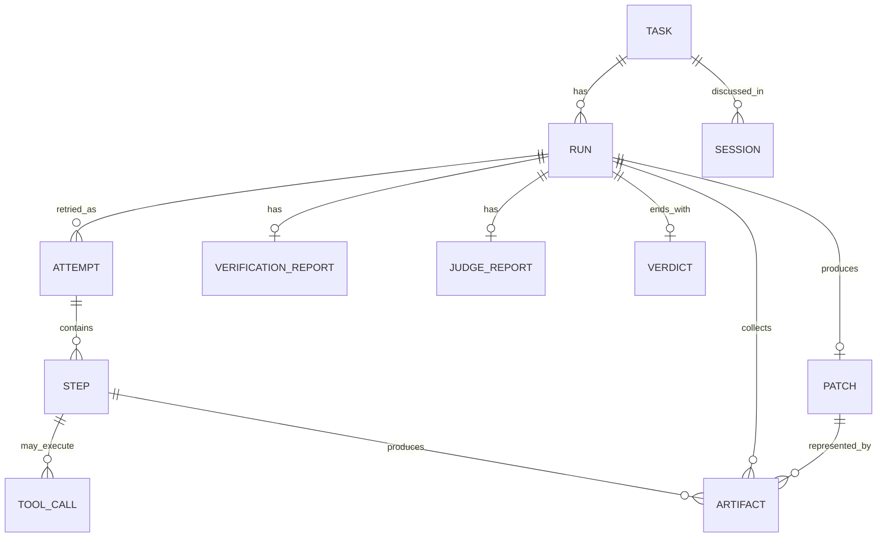
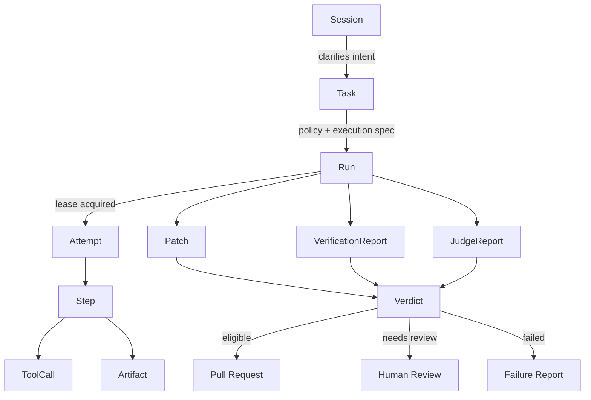
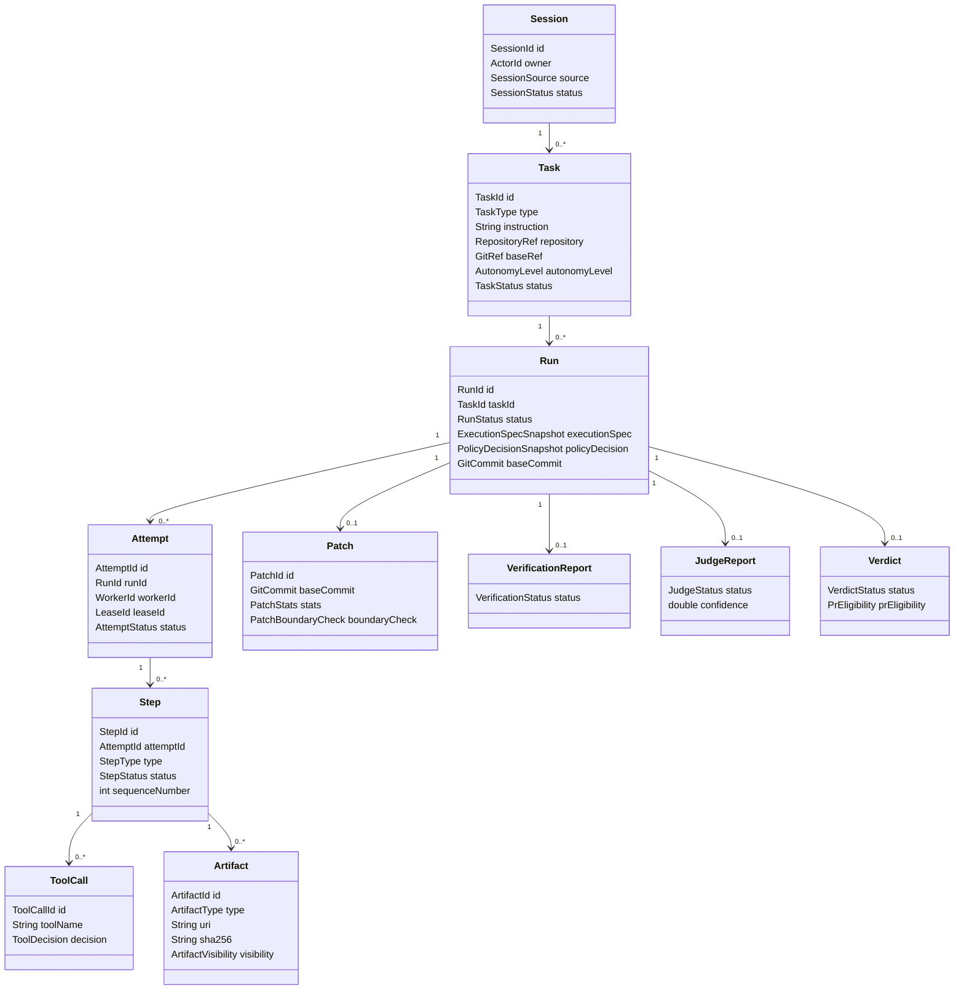

------
title: Learn AI Coding Agent From Scratch - Part 012
description: Domain model inti untuk Honk-like AI coding agent: Task, Session, Run, Attempt, Step, ToolCall, Artifact, Patch, VerificationReport, JudgeReport, Verdict, dan hubungan lifecycle antar entity.
series: learn-ai-coding-agent
seriesTitle: Learn AI Coding Agent From Scratch
order: 12
partTitle: Domain Model: Task, Session, Run, Step, Artifact, Patch, Verdict
tags:
- ai-coding-agent
- domain-model
- task
- run
- artifact
- patch
- verifier
- verdict
- state-machine
date: 2026-07-03
---

# Part 012 — Domain Model: Task, Session, Run, Step, Artifact, Patch, Verdict

Part sebelumnya memisahkan control plane dan execution plane. Sekarang kita butuh bahasa bersama untuk seluruh sistem.

Kalau domain model salah, semua layer berikutnya akan ikut kabur:

- API menjadi ambigu;
- database schema menjadi tambal sulam;
- worker sulit idempotent;
- retry sulit dibedakan dari run baru;
- artifact tidak bisa dilacak;
- PR tidak punya evidence;
- observability hanya menjadi log panjang;
- human reviewer tidak tahu apa yang sebenarnya dilakukan agent.

Karena itu part ini fokus pada model inti.

Kita akan membangun vocabulary berikut:

```text
Task
Session
Run
Attempt
Step
ToolCall
Artifact
Patch
VerificationReport
JudgeReport
Verdict
```

Model ini bukan sekadar class diagram. Ini adalah kontrak cara sistem berpikir tentang pekerjaan.

---

## 1. Masalah yang diselesaikan domain model

AI coding agent terlihat seperti satu percakapan:

```text
User: Upgrade dependency ini.
Agent: Done, ini PR-nya.
```

Namun di balik itu ada banyak kejadian:

- user membuat permintaan;
- sistem menormalisasi scope;
- policy menentukan batas;
- run dibuat;
- worker mengambil lease;
- repository di-clone;
- model membaca konteks;
- tool membaca file;
- tool mengedit file;
- shell command dijalankan;
- build gagal;
- agent memperbaiki compile error;
- test lulus;
- diff dibuat;
- judge menilai perubahan;
- PR dibuat;
- reviewer memberi komentar.

Kalau semua ini disimpan sebagai `conversation` string, sistem tidak bisa dipercaya.

Kita perlu entity yang bisa menjawab:

```text
Apa intent awalnya?
Run mana yang mengeksekusi?
Attempt mana yang crash?
Step mana yang mengedit file?
Tool apa yang dipakai?
Artifact mana yang membuktikan test lulus?
Patch mana yang dikirim ke PR?
Verdict siapa yang menyatakan layak?
```

---

## 2. Diagram domain inti



Cardinality yang penting:

```text
One Task can have many Runs.
One Run can have many Attempts.
One Attempt can have many Steps.
One Step can have zero or many ToolCalls.
One Run can produce zero or one final Patch.
One Run can have multiple Artifacts.
One Run ends with one effective Verdict.
```

Kenapa `Run` punya banyak `Attempt`?

Karena retry infrastructure berbeda dari user membuat task baru.

Contoh:

```text
Task: upgrade Jackson in payments-service
Run 1: execution spec for base commit abc123
Attempt 1: worker crash after clone
Attempt 2: worker re-runs and completes
```

Task dan Run tetap sama. Attempt berubah.

---

## 3. Task

`Task` adalah intent durable dari user atau system.

Task menjawab:

```text
Apa pekerjaan yang diminta?
Untuk repository atau target apa?
Dengan scope apa?
Siapa pemiliknya?
Autonomy level apa?
Kenapa pekerjaan ini ada?
```

Task bukan eksekusi. Task adalah permintaan kerja.

Contoh:

```json
{
  "taskId": "task_01J...",
  "createdBy": "user_123",
  "source": "cli",
  "taskType": "dependency_upgrade",
  "title": "Upgrade Jackson to 2.17.x in payments-service",
  "instruction": "Upgrade Jackson from 2.15.x to 2.17.x and fix compile/test failures.",
  "repository": "payments-service",
  "baseRef": "main",
  "autonomyLevel": "supervised_pr",
  "status": "accepted"
}
```

### 3.1 Task fields minimum

```java
public record Task(
    TaskId id,
    TaskSource source,
    ActorId createdBy,
    TaskType type,
    String title,
    String instruction,
    RepositoryRef repository,
    GitRef baseRef,
    AutonomyLevel autonomyLevel,
    TaskStatus status,
    Instant createdAt,
    Map<String, String> labels
) {}
```

### 3.2 TaskStatus

```java
public enum TaskStatus {
    DRAFT,
    ACCEPTED,
    POLICY_DENIED,
    READY_FOR_RUN,
    RUNNING,
    COMPLETED,
    FAILED,
    CANCELLED,
    ARCHIVED
}
```

Jangan terlalu banyak status di Task. Detail eksekusi ada di Run.

Task status adalah ringkasan lifecycle permintaan, bukan semua kejadian teknis.

### 3.3 Task invariant

```text
Task instruction cannot be empty.
Task repository must be resolved before READY_FOR_RUN.
Task policy denial must include reason.
Task cancellation must stop scheduling new runs.
Task does not store raw step logs.
```

---

## 4. Session

`Session` adalah konteks interaksi antara user dan sistem.

Session bisa ada sebelum task dibuat, atau setelah run gagal dan user memberi klarifikasi.

Contoh:

```text
User: Upgrade Jackson.
System: Repo mana?
User: payments-service dulu.
System: Boleh auto-PR kalau test lulus?
User: Ya, tapi jangan ubah infra.
```

Session menangkap percakapan, tetapi Task menangkap intent yang sudah distrukturkan.

### 4.1 Kenapa Session dipisah dari Task?

Karena satu session bisa menghasilkan beberapa task.

Contoh:

```text
Session: migrate logging across backend services
Task 1: migrate payments-service
Task 2: migrate invoice-service
Task 3: migrate identity-service
```

Sebaliknya satu task bisa dibahas dalam beberapa session.

Contoh:

```text
Session A: task dibuat
Session B: user approve scope tambahan
Session C: reviewer minta run ulang setelah base branch update
```

### 4.2 Session model

```java
public record Session(
    SessionId id,
    ActorId owner,
    SessionSource source,
    List<TaskId> relatedTasks,
    Instant createdAt,
    Instant lastActivityAt,
    SessionStatus status
) {}
```

Session message bisa disimpan terpisah:

```java
public record SessionMessage(
    SessionId sessionId,
    MessageId id,
    MessageRole role,
    String content,
    Instant createdAt,
    Map<String, String> metadata
) {}
```

### 4.3 Session invariant

```text
Session text may be messy.
Task must be structured.
Session can contain discussion.
Task must contain executable intent.
```

Ini penting. Jangan menjalankan worker langsung dari chat transcript.

---

## 5. Run

`Run` adalah satu eksekusi terencana dari Task dengan execution spec tertentu.

Run menjawab:

```text
Untuk task ini, dengan base commit ini, policy ini, budget ini, dan verifier ini,
apakah agent berhasil menghasilkan patch yang layak?
```

Run adalah entity terpenting untuk observability.

### 5.1 Run fields

```java
public record Run(
    RunId id,
    TaskId taskId,
    RunNumber number,
    RunStatus status,
    ExecutionSpecSnapshot executionSpec,
    PolicyDecisionSnapshot policyDecision,
    GitCommit baseCommit,
    Budget budget,
    Instant createdAt,
    Instant startedAt,
    Instant completedAt,
    FailureSummary failureSummary
) {}
```

Perhatikan `ExecutionSpecSnapshot` dan `PolicyDecisionSnapshot`.

Kenapa snapshot?

Karena policy bisa berubah besok. Run hari ini harus tetap bisa diaudit berdasarkan policy yang berlaku saat run dibuat.

### 5.2 RunStatus

```java
public enum RunStatus {
    CREATED,
    QUEUED,
    LEASED,
    PREPARING_WORKSPACE,
    RUNNING_AGENT,
    VERIFYING,
    JUDGING,
    COMPLETED,
    FAILED,
    CANCELLED,
    EXPIRED,
    NEEDS_APPROVAL
}
```

Status detail akan dibahas di Part 013. Untuk sekarang, pahami bahwa status Run adalah status lifecycle execution, bukan status Task.

### 5.3 Run invariant

```text
Run belongs to exactly one Task.
Run must have immutable execution spec.
Run must bind to a base commit before execution.
Run must not be completed without final verdict.
Run can fail without patch.
Run can complete with patch but still be not eligible for PR.
```

---

## 6. Attempt

`Attempt` adalah percobaan eksekusi teknis untuk satu Run.

Attempt dibutuhkan karena infrastructure failure tidak sama dengan agent failure.

Contoh:

```text
Run 12
- Attempt 1: worker node died
- Attempt 2: sandbox startup failed
- Attempt 3: completed, verifier passed
```

Tanpa Attempt, kita akan mencampur failure worker dengan failure code change.

### 6.1 Attempt model

```java
public record Attempt(
    AttemptId id,
    RunId runId,
    int attemptNumber,
    WorkerId workerId,
    LeaseId leaseId,
    AttemptStatus status,
    Instant startedAt,
    Instant lastHeartbeatAt,
    Instant endedAt,
    String failureCode
) {}
```

### 6.2 AttemptStatus

```java
public enum AttemptStatus {
    STARTING,
    ACTIVE,
    COMPLETED,
    FAILED,
    LEASE_EXPIRED,
    CANCELLED
}
```

### 6.3 Attempt invariant

```text
Only one active attempt per run is allowed.
Every worker event must be associated with current attempt/lease.
Expired attempt cannot complete the run.
Infrastructure failure can create new attempt.
Semantic failure should not be retried blindly.
```

---

## 7. Step

`Step` adalah unit observability dalam attempt.

Step bukan selalu tool call. Step bisa berupa:

- workspace preparation;
- repository clone;
- context gathering;
- model planning;
- file read;
- patch application;
- shell command;
- verification;
- judge evaluation;
- artifact upload;
- finalization.

Step menjawab:

```text
Apa yang terjadi, urutannya bagaimana, berapa lama, dan hasilnya apa?
```

### 7.1 Step model

```java
public record Step(
    StepId id,
    RunId runId,
    AttemptId attemptId,
    int sequenceNumber,
    StepType type,
    StepStatus status,
    String title,
    Instant startedAt,
    Instant endedAt,
    Map<String, Object> attributes,
    List<ArtifactRef> artifacts
) {}
```

### 7.2 StepType

```java
public enum StepType {
    PREPARE_WORKSPACE,
    CLONE_REPOSITORY,
    LOAD_CONTEXT,
    MODEL_PLANNING,
    TOOL_CALL,
    APPLY_PATCH,
    RUN_VERIFIER,
    SUMMARIZE_LOG,
    JUDGE_DIFF,
    COLLECT_ARTIFACTS,
    FINALIZE
}
```

### 7.3 StepStatus

```java
public enum StepStatus {
    STARTED,
    SUCCEEDED,
    FAILED,
    SKIPPED,
    DENIED,
    TIMED_OUT
}
```

### 7.4 Step invariant

```text
Step sequence number increases within an attempt.
Step status is append-only or transition-validated.
Failed step must include failure code or artifact.
Tool call step must reference ToolCall record.
Long output must be artifact, not only attribute.
```

---

## 8. ToolCall

`ToolCall` adalah aksi eksplisit yang diminta model atau runtime.

Tool call penting karena autonomous agent hanya aman jika aksinya terlihat dan divalidasi.

Contoh tool:

- `file.read`;
- `file.search`;
- `file.patch`;
- `git.diff`;
- `shell.run`;
- `verifier.run`;
- `mcp.call`.

### 8.1 ToolCall model

```java
public record ToolCall(
    ToolCallId id,
    StepId stepId,
    String toolName,
    String argumentsJson,
    ToolDecision decision,
    String denialReason,
    ToolResult result,
    Instant requestedAt,
    Instant completedAt
) {}
```

### 8.2 ToolDecision

```java
public enum ToolDecision {
    ALLOWED,
    DENIED_BY_POLICY,
    DENIED_BY_PATH_GUARD,
    DENIED_BY_COMMAND_GUARD,
    DENIED_BY_BUDGET,
    REQUIRES_APPROVAL
}
```

### 8.3 ToolCall invariant

```text
No side effect without ToolCall.
Every ToolCall must be validated before execution.
Denied ToolCall is still recorded.
Tool output must be bounded, redacted, and attributable.
ToolCall arguments must not contain secrets unless explicitly allowed.
```

Model output yang meminta aksi tidak sama dengan aksi yang dijalankan. Tool runtime adalah gate.

---

## 9. Artifact

`Artifact` adalah bukti durable yang dihasilkan sistem.

Artifact menjawab:

```text
Mana bukti konkret dari klaim agent?
```

Tanpa artifact, final summary hanyalah cerita.

### 9.1 Artifact types

```java
public enum ArtifactType {
    PATCH_UNIFIED_DIFF,
    PATCH_SUMMARY,
    TOUCHED_FILES,
    COMMAND_LOG,
    TEST_REPORT,
    BUILD_REPORT,
    STATIC_ANALYSIS_REPORT,
    MODEL_TRANSCRIPT_SUMMARY,
    VERIFIER_REPORT,
    JUDGE_REPORT,
    COST_REPORT,
    FAILURE_REPORT,
    PR_BODY_DRAFT
}
```

### 9.2 Artifact model

```java
public record Artifact(
    ArtifactId id,
    RunId runId,
    AttemptId attemptId,
    StepId producedByStep,
    ArtifactType type,
    String uri,
    String sha256,
    long sizeBytes,
    RedactionStatus redactionStatus,
    ArtifactVisibility visibility,
    Instant createdAt,
    Map<String, String> metadata
) {}
```

### 9.3 ArtifactVisibility

```java
public enum ArtifactVisibility {
    INTERNAL_ONLY,
    VISIBLE_TO_REQUESTER,
    SAFE_FOR_PR,
    SAFE_FOR_PUBLIC_LOG
}
```

Ini penting. Tidak semua artifact boleh masuk PR body.

Build log bisa mengandung path internal, token yang tidak sengaja tercetak, atau detail environment. Artifact harus bisa diberi visibility.

### 9.4 Artifact invariant

```text
Artifact must have content hash.
Artifact must have type.
Artifact must have producer.
Large data must be stored outside primary DB.
Artifact visibility must be explicit.
Unsafe artifact must not be copied into prompt or PR body.
```

---

## 10. Patch

`Patch` adalah representasi perubahan kode yang dihasilkan run.

Patch bukan hanya file `diff`.

Patch harus punya metadata:

- file apa yang berubah;
- berapa line added/deleted;
- apakah menyentuh path terlarang;
- apakah ada binary file;
- apakah ada generated file;
- apakah lockfile berubah;
- apakah test ikut ditambah;
- apakah patch bersih diterapkan ke base commit.

### 10.1 Patch model

```java
public record Patch(
    PatchId id,
    RunId runId,
    GitCommit baseCommit,
    ArtifactRef unifiedDiffArtifact,
    List<FileChange> fileChanges,
    PatchStats stats,
    PatchBoundaryCheck boundaryCheck,
    PatchApplyStatus applyStatus,
    Instant createdAt
) {}
```

### 10.2 FileChange

```java
public record FileChange(
    String path,
    ChangeType changeType,
    int additions,
    int deletions,
    boolean generated,
    boolean binary,
    boolean lockfile,
    boolean testFile,
    boolean forbiddenByPolicy
) {}
```

### 10.3 ChangeType

```java
public enum ChangeType {
    ADDED,
    MODIFIED,
    DELETED,
    RENAMED,
    COPIED
}
```

### 10.4 Patch boundary check

```java
public record PatchBoundaryCheck(
    boolean passed,
    List<String> allowedPathViolations,
    List<String> forbiddenPathViolations,
    List<String> unexpectedGeneratedFiles,
    List<String> unexpectedLockfileChanges
) {}
```

### 10.5 Patch invariant

```text
Patch must be tied to base commit.
Patch must have boundary check before PR.
Patch with forbidden path violation cannot be auto-PR.
Patch that cannot apply cleanly is not eligible.
Patch stats must be computed deterministically from diff.
```

Patch adalah artifact teknis sekaligus objek policy.

---

## 11. VerificationReport

`VerificationReport` adalah hasil pembuktian teknis.

Verifier bukan judge. Verifier menjalankan command atau check deterministik.

Contoh verifier:

- `mvn test`;
- `mvn -DskipTests compile`;
- `npm test`;
- `go test ./...`;
- `prettier --check`;
- `eslint`;
- `semgrep`;
- secret scan;
- license check.

### 11.1 VerificationReport model

```java
public record VerificationReport(
    VerificationReportId id,
    RunId runId,
    VerificationStatus status,
    List<VerificationCheck> checks,
    ArtifactRef fullReportArtifact,
    Instant startedAt,
    Instant endedAt
) {}
```

### 11.2 VerificationCheck

```java
public record VerificationCheck(
    String name,
    String command,
    VerificationCheckStatus status,
    int exitCode,
    Duration duration,
    ArtifactRef logArtifact,
    String summarizedFailure,
    boolean required
) {}
```

### 11.3 VerificationStatus

```java
public enum VerificationStatus {
    NOT_RUN,
    PASSED,
    FAILED,
    PARTIAL,
    TIMED_OUT,
    INFRA_FAILURE,
    SKIPPED_BY_POLICY
}
```

### 11.4 Verification invariant

```text
Required verifier failure blocks auto-PR.
Verifier command must come from verification plan.
Verifier output must be captured as artifact.
Verifier summary must cite concrete failing command/check.
Infra failure is not the same as code failure.
```

---

## 12. JudgeReport

`JudgeReport` adalah penilaian apakah patch sesuai intent dan tidak overreach.

Judge bisa berupa:

- LLM-as-judge;
- deterministic rules;
- hybrid evaluator;
- human review;
- policy checker.

Kita tidak boleh memperlakukan judge sebagai oracle sempurna. Judge adalah satu evidence layer.

### 12.1 JudgeReport model

```java
public record JudgeReport(
    JudgeReportId id,
    RunId runId,
    JudgeStatus status,
    List<JudgeFinding> findings,
    double confidence,
    ArtifactRef reportArtifact,
    Instant createdAt
) {}
```

### 12.2 JudgeFinding

```java
public record JudgeFinding(
    Severity severity,
    String category,
    String message,
    String filePath,
    Integer lineNumber,
    boolean blocksAutoPr
) {}
```

### 12.3 JudgeStatus

```java
public enum JudgeStatus {
    NOT_RUN,
    PASSED,
    PASSED_WITH_WARNINGS,
    FAILED,
    NEEDS_HUMAN_REVIEW,
    INCONCLUSIVE
}
```

### 12.4 Judge invariant

```text
Judge cannot override deterministic policy failure.
Judge report must be stored as artifact.
Low confidence judge cannot enable auto-PR.
Judge should evaluate diff against task intent and patch boundary.
Judge must not see secrets or unsafe artifacts.
```

---

## 13. Verdict

`Verdict` adalah keputusan akhir run.

Verdict bukan sekadar verifier status. Verdict menggabungkan:

- patch ada atau tidak;
- verifier result;
- boundary check;
- judge result;
- policy constraints;
- budget/cost status;
- human approval requirement;
- PR eligibility.

### 13.1 Verdict model

```java
public record Verdict(
    VerdictId id,
    RunId runId,
    VerdictStatus status,
    PrEligibility prEligibility,
    List<String> reasons,
    List<ArtifactRef> evidence,
    Instant decidedAt
) {}
```

### 13.2 VerdictStatus

```java
public enum VerdictStatus {
    SUCCESS,
    SUCCESS_NEEDS_REVIEW,
    FAILED_AGENT_COULD_NOT_COMPLETE,
    FAILED_VERIFICATION,
    FAILED_POLICY,
    FAILED_INFRASTRUCTURE,
    CANCELLED,
    INCONCLUSIVE
}
```

### 13.3 PrEligibility

```java
public enum PrEligibility {
    ELIGIBLE_FOR_AUTO_PR,
    ELIGIBLE_AFTER_HUMAN_APPROVAL,
    DRAFT_ONLY,
    NOT_ELIGIBLE
}
```

### 13.4 Verdict invariant

```text
Every terminal run must have verdict.
Verdict must list reasons.
Verdict must reference evidence artifacts.
Auto-PR eligibility requires deterministic checks to pass.
Human approval can allow PR, but cannot erase audit reasons.
```

Verdict adalah output yang control plane pakai untuk langkah berikutnya.

---

## 14. Hubungan lifecycle

Lihat flow berikut:



Satu hal penting:

```text
PR bukan bagian dari execution plane.
PR adalah downstream action berdasarkan Verdict.
```

PR akan punya model sendiri nanti, tetapi ia tidak boleh menggantikan Patch/Verdict.

---

## 15. Contoh konkret: dependency upgrade

Task:

```json
{
  "type": "dependency_upgrade",
  "repository": "payments-service",
  "instruction": "Upgrade Jackson to 2.17.x and fix compile/test failures.",
  "autonomyLevel": "supervised_pr"
}
```

Run:

```json
{
  "runId": "run_001",
  "taskId": "task_001",
  "baseCommit": "abc123",
  "status": "RUNNING_AGENT",
  "executionSpec": {
    "allowedPaths": ["pom.xml", "src/**", "test/**"],
    "forbiddenPaths": ["infra/**", ".github/**"],
    "verificationCommands": ["mvn -q test"]
  }
}
```

Steps:

```text
1. clone repository
2. inspect pom.xml
3. patch dependency version
4. run mvn test
5. read compile error
6. patch failing imports
7. run mvn test again
8. collect diff
9. generate final summary
```

Artifacts:

```text
- patch.diff
- mvn-test-attempt-1.log
- mvn-test-attempt-2.log
- touched-files.json
- verifier-report.json
- judge-report.json
```

Patch:

```text
Changed:
- pom.xml
- src/main/java/.../ObjectMapperConfig.java
- src/test/java/.../SerializationTest.java
Boundary: passed
Stats: +18 / -9
```

VerificationReport:

```text
mvn -q test: passed
```

JudgeReport:

```text
passed_with_warnings
Warning: changed one production config class; reviewer should inspect serialization behavior.
```

Verdict:

```text
SUCCESS_NEEDS_REVIEW
PR eligibility: ELIGIBLE_FOR_AUTO_PR or ELIGIBLE_AFTER_HUMAN_APPROVAL depending policy
Evidence: patch.diff, verifier-report.json, judge-report.json
```

---

## 16. Contoh konkret: scope violation

Agent diminta mengubah `src/**`, tetapi patch menyentuh `.github/workflows/deploy.yml`.

Patch boundary check:

```json
{
  "passed": false,
  "forbiddenPathViolations": [".github/workflows/deploy.yml"]
}
```

Verification bisa saja lulus. Judge bisa saja berkata perubahan masuk akal. Tetap tidak boleh auto-PR.

Verdict:

```text
FAILED_POLICY
PR eligibility: NOT_ELIGIBLE
Reason: patch touches forbidden path .github/workflows/deploy.yml
```

Ini contoh kenapa Verdict harus menggabungkan policy dan evidence, bukan hanya model confidence.

---

## 17. Contoh konkret: infra failure vs agent failure

Run gagal karena package registry down.

VerificationCheck:

```json
{
  "name": "mvn-test",
  "status": "INFRA_FAILURE",
  "exitCode": 1,
  "summarizedFailure": "Dependency download failed with repository timeout."
}
```

Verdict:

```text
FAILED_INFRASTRUCTURE
PR eligibility: NOT_ELIGIBLE
Retry: allowed with backoff
```

Berbeda dengan:

```text
FAILED_VERIFICATION
Reason: unit test failed due to assertion mismatch after code change
Retry: not automatic unless agent has remaining repair budget
```

Klasifikasi ini penting untuk scheduler dan user experience.

---

## 18. ID design

Gunakan opaque ID, bukan integer sequential yang mudah ditebak.

Contoh:

```text
task_01JZ9T...
run_01JZ9V...
attempt_01JZ9W...
step_01JZ9X...
artifact_01JZ9Y...
patch_01JZ9Z...
```

ID yang baik:

- unik secara global;
- sortable bila memakai ULID/UUIDv7;
- tidak mengekspos jumlah task;
- mudah dipakai di log.

Log line contoh:

```json
{
  "taskId": "task_01JZ9T",
  "runId": "run_01JZ9V",
  "attemptId": "attempt_01JZ9W",
  "stepId": "step_01JZ9X",
  "event": "tool_call_denied",
  "tool": "shell.run",
  "reason": "command_not_allowed"
}
```

---

## 19. Snapshot vs reference

Tidak semua field disimpan sebagai reference hidup.

Untuk audit, beberapa data harus di-snapshot.

Snapshot:

- execution spec;
- policy decision;
- model config;
- verifier plan;
- patch boundary;
- base commit;
- autonomy level.

Reference hidup:

- current repository metadata;
- current user profile;
- current team ownership;
- current policy version.

Kenapa?

Karena run harus bisa dijelaskan di masa depan.

Jika policy berubah setelah run, audit tetap harus tahu policy saat run dijalankan.

---

## 20. Event-first thinking

Walaupun kita punya entity, sistem agent lebih mudah dipahami sebagai event stream.

Contoh event:

```text
TaskSubmitted
TaskAccepted
RunCreated
RunQueued
LeaseAcquired
WorkspacePrepared
StepStarted
ToolCallRequested
ToolCallDenied
ToolCallCompleted
PatchProduced
VerifierStarted
VerifierCompleted
JudgeCompleted
VerdictDecided
PrRequested
PrCreated
RunCompleted
```

Entity adalah projection dari event.

Untuk implementasi awal, kita tidak harus memakai full event sourcing. Tetapi cara berpikir event-first membantu kita tidak kehilangan jejak.

---

## 21. Minimal class package

Dalam project skeleton, domain model bisa diletakkan di:

```text
libs/domain/src/main/java/dev/agent/domain/
  ids/
  task/
  session/
  run/
  attempt/
  step/
  tool/
  artifact/
  patch/
  verification/
  judge/
  verdict/
  event/
```

Contoh struktur:

```text
domain/
  ids/
    TaskId.java
    RunId.java
    AttemptId.java
  task/
    Task.java
    TaskStatus.java
    TaskType.java
  run/
    Run.java
    RunStatus.java
    ExecutionSpecSnapshot.java
  step/
    Step.java
    StepType.java
    StepStatus.java
  artifact/
    Artifact.java
    ArtifactType.java
  patch/
    Patch.java
    FileChange.java
    PatchBoundaryCheck.java
  verdict/
    Verdict.java
    VerdictStatus.java
    PrEligibility.java
```

Jangan letakkan dependency framework di domain.

Domain model sebaiknya tidak bergantung pada JPA annotation, HTTP DTO, atau queue library. Mapping bisa dibuat di adapter layer.

---

## 22. DTO vs domain object

Jangan mencampur API request dengan domain entity.

API request:

```java
public record SubmitTaskRequest(
    String repository,
    String baseRef,
    String taskType,
    String instruction,
    List<String> allowedPaths,
    List<String> forbiddenPaths,
    String autonomyLevel
) {}
```

Domain entity:

```java
public record Task(
    TaskId id,
    TaskSource source,
    ActorId createdBy,
    TaskType type,
    String title,
    String instruction,
    RepositoryRef repository,
    GitRef baseRef,
    AutonomyLevel autonomyLevel,
    TaskStatus status,
    Instant createdAt,
    Map<String, String> labels
) {}
```

Execution spec:

```java
public record ExecutionSpec(
    RunId runId,
    RepositoryRef repository,
    GitRef baseRef,
    PatchBoundary patchBoundary,
    ToolPolicy toolPolicy,
    VerificationPlan verificationPlan,
    Budget budget
) {}
```

Tiga bentuk ini berbeda karena dipakai di boundary berbeda.

---

## 23. Domain service minimum

Domain model butuh service kecil untuk menjaga invariant.

Contoh:

```java
public final class RunFactory {
    public Run createRun(Task task, PolicyDecision policy, RepositorySnapshot repo) {
        if (task.status() != TaskStatus.READY_FOR_RUN) {
            throw new IllegalStateException("Task is not ready for run");
        }
        if (!policy.allowed()) {
            throw new IllegalStateException("Policy denied task");
        }
        return Run.created(
            RunId.newId(),
            task.id(),
            policy.toExecutionSpecSnapshot(repo),
            policy.snapshot(),
            repo.baseCommit(),
            Instant.now()
        );
    }
}
```

Contoh lain:

```java
public final class VerdictDecider {
    public Verdict decide(
        Run run,
        Patch patch,
        VerificationReport verification,
        JudgeReport judge
    ) {
        if (!patch.boundaryCheck().passed()) {
            return Verdict.failedPolicy(run.id(), patch.boundaryCheck().reasons());
        }
        if (verification.status() != VerificationStatus.PASSED) {
            return Verdict.failedVerification(run.id(), verification.failureReasons());
        }
        if (judge.status() == JudgeStatus.FAILED) {
            return Verdict.needsReview(run.id(), judge.blockingReasons());
        }
        return Verdict.success(run.id(), PrEligibility.ELIGIBLE_FOR_AUTO_PR);
    }
}
```

Verdict decision harus bisa dites tanpa LLM.

---

## 24. Domain tests yang wajib ada

Sebelum implementasi worker, test domain invariant.

Contoh test cases:

```text
Task without repository cannot become READY_FOR_RUN.
Policy denied task cannot create run.
Run cannot complete without verdict.
Expired attempt cannot submit successful result.
Patch touching forbidden path produces FAILED_POLICY verdict.
Required verifier failure blocks auto-PR.
Judge warning changes eligibility to needs review if policy requires strict judge.
Artifact without hash is rejected.
ToolCall denied by command guard is recorded but not executed.
```

Test seperti ini memberi safety net sebelum agent loop menjadi kompleks.

---

## 25. Common modeling mistakes

### Mistake 1 — Menganggap Task sama dengan Run

Task adalah intent. Run adalah eksekusi.

Kalau dicampur, retry dan audit menjadi kacau.

### Mistake 2 — Menganggap chat transcript cukup

Chat transcript tidak cukup untuk automation. Ia tidak menyimpan policy, verifier, patch boundary, dan artifact evidence secara terstruktur.

### Mistake 3 — Menganggap patch hanya string diff

Diff perlu metadata agar bisa dipakai policy dan PR orchestration.

### Mistake 4 — Menganggap verifier pass berarti aman

Verifier pass hanya bukti command tertentu lulus. Bisa saja scope dilanggar atau intent tidak terpenuhi.

### Mistake 5 — Menganggap judge bisa mengganti policy

Judge membantu review. Policy menjaga boundary.

### Mistake 6 — Tidak membedakan infra failure dan semantic failure

Kalau package registry down, retry masuk akal. Kalau test gagal karena perubahan salah, retry harus lewat repair loop atau user intervention.

---

## 26. Data model ringkas

Ringkasan object:

| Entity | Tujuan | Owner utama | Durable? |
|---|---|---|---:|
| Session | Interaksi user/system | Control plane | Ya |
| Task | Intent kerja | Control plane | Ya |
| Run | Eksekusi terencana | Control plane | Ya |
| Attempt | Percobaan worker | Control + execution plane | Ya |
| Step | Timeline observability | Execution plane producer | Ya |
| ToolCall | Aksi agent | Execution plane producer | Ya |
| Artifact | Evidence | Execution plane producer, registry di control plane | Ya |
| Patch | Perubahan kode | Execution plane producer, validated by control plane | Ya |
| VerificationReport | Bukti deterministic | Verifier | Ya |
| JudgeReport | Penilaian semantik/policy-support | Judge | Ya |
| Verdict | Keputusan final run | Control plane | Ya |

---

## 27. Mermaid class diagram



---

## 28. Exercise: modeling review

Untuk task ini:

```text
Migrate all uses of oldFeatureFlagClient.isEnabled(flag) to newFeatureFlags.evaluate(flag, context) in payments-service. Add or update tests. Do not touch infra, deployment, or workflow files. Open PR only if mvn test passes.
```

Tentukan:

1. Task fields.
2. ExecutionSpec fields.
3. PatchBoundary.
4. VerificationPlan.
5. Minimal Step sequence.
6. Artifact yang wajib.
7. Kondisi Verdict `SUCCESS`.
8. Kondisi Verdict `FAILED_POLICY`.
9. Kondisi Verdict `FAILED_VERIFICATION`.
10. Kondisi `SUCCESS_NEEDS_REVIEW`.

Jawaban ringkas:

```text
Task:
- type: api_migration
- repo: payments-service
- instruction: migrate oldFeatureFlagClient usage
- autonomy: supervised_pr

PatchBoundary:
- allowed: src/**, test/**, pom.xml if needed
- forbidden: infra/**, .github/**, deployment/**

VerificationPlan:
- mvn -q test

Artifacts:
- patch.diff
- touched-files.json
- mvn-test.log
- verifier-report.json
- final-summary.md

SUCCESS:
- patch exists
- boundary passed
- mvn test passed
- judge passed or warning allowed

FAILED_POLICY:
- patch touches forbidden path

FAILED_VERIFICATION:
- required mvn test fails because of code/test failure

SUCCESS_NEEDS_REVIEW:
- tests pass but judge flags semantic risk or broad API behavior change
```

---

## 29. Checklist Part 012

Sebelum lanjut, kamu harus bisa membedakan:

- Session vs Task;
- Task vs Run;
- Run vs Attempt;
- Step vs ToolCall;
- Artifact vs log;
- Patch vs diff string;
- VerificationReport vs JudgeReport;
- Verdict vs verifier status;
- policy failure vs verification failure;
- infra failure vs semantic failure.

Kalau vocabulary ini sudah jelas, Part 013 tentang state machine akan jauh lebih mudah.

---

## 30. Ringkasan

Domain model adalah tulang belakang AI coding agent.

Model yang benar membuat sistem bisa:

- menerima intent manusia;
- mengubahnya menjadi execution spec;
- menjalankan worker secara idempotent;
- mencatat setiap step;
- menyimpan evidence;
- memvalidasi patch;
- membedakan failure;
- membuat verdict yang defensible;
- membuka PR hanya ketika evidence cukup.

Model inti kita:

```text
Session -> Task -> Run -> Attempt -> Step -> ToolCall/Artifact
Run -> Patch -> VerificationReport -> JudgeReport -> Verdict -> PR decision
```

Part berikutnya akan memperdalam state machine untuk Run. Di sana kita akan memastikan transisi status tidak ambigu, retry aman, cancellation jelas, dan terminal state tidak bocor.

---

## Referensi

- Spotify Engineering — “Spotify’s Journey with Our Background Coding Agent (Honk), Part 1”, 2025.
- Spotify Engineering — “Feedback Loops for Background Coding Agents, Part 3”, 2025.
- OpenAI Developers — Codex cloud documentation.
- OpenAI — “Introducing Codex”, 2025.
- Anthropic Claude Code Docs — permissions, security, and agentic coding workflow.
- Model Context Protocol Specification — tools/resources/prompts, 2025.
