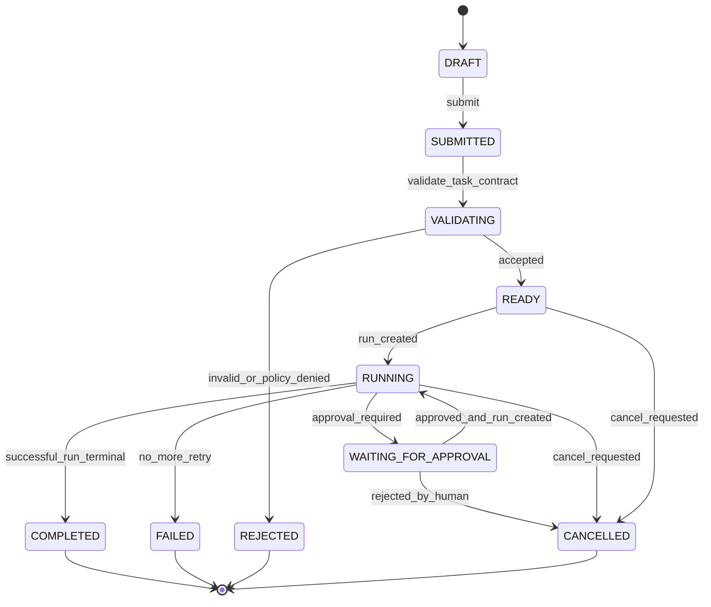
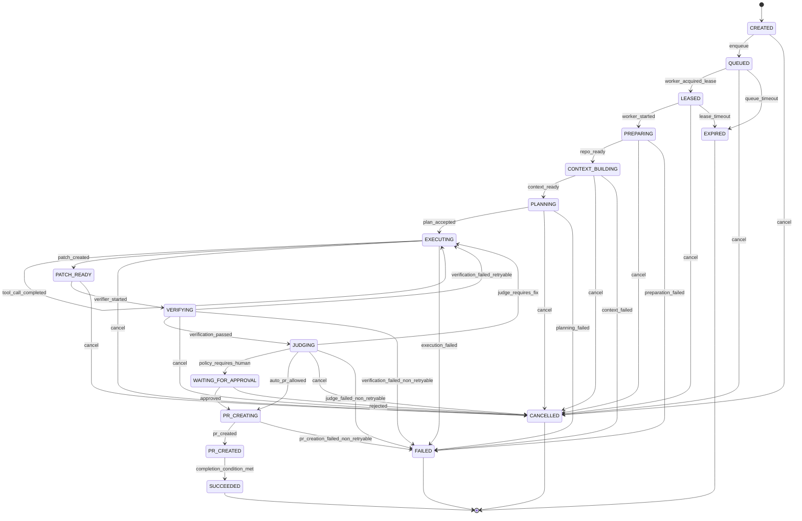
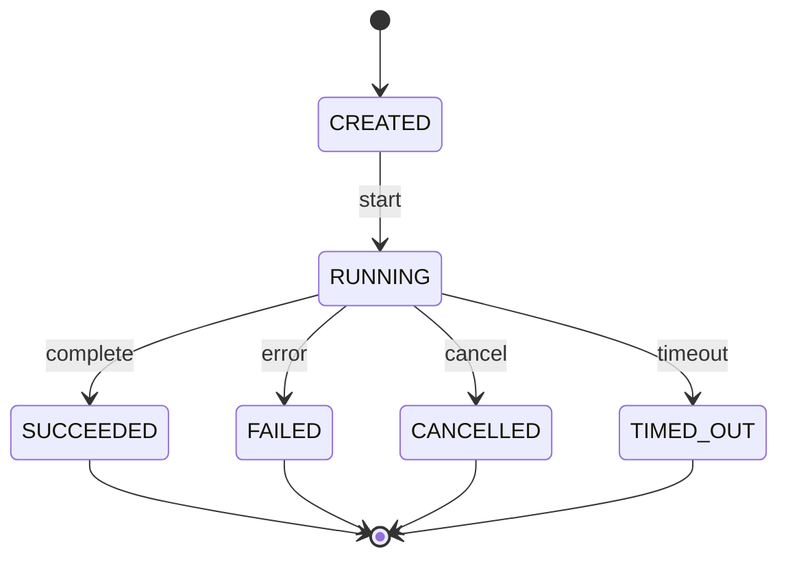
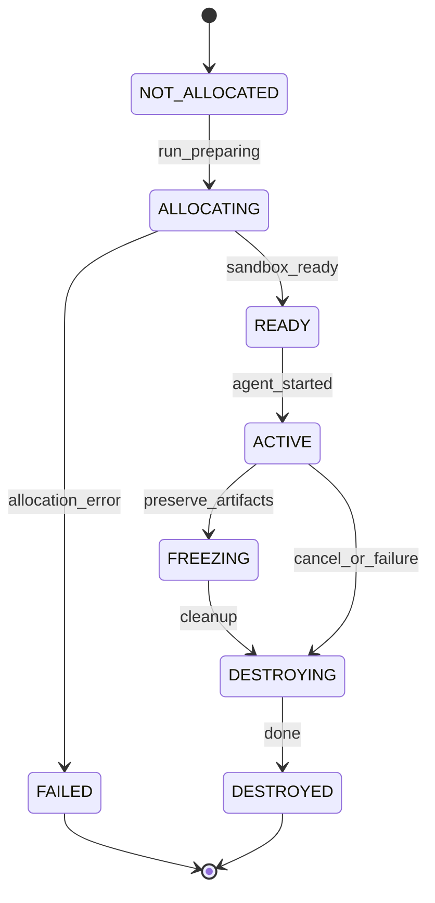
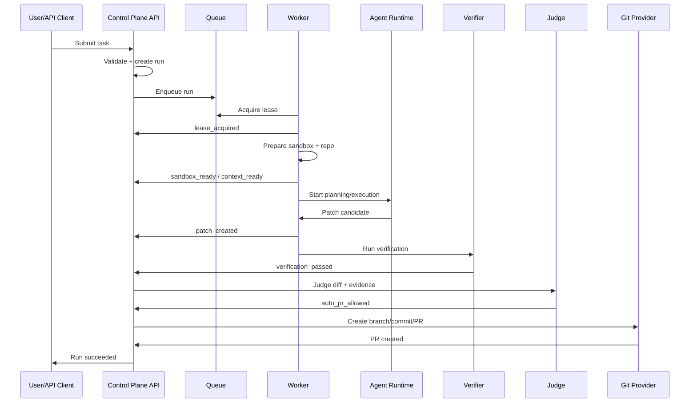
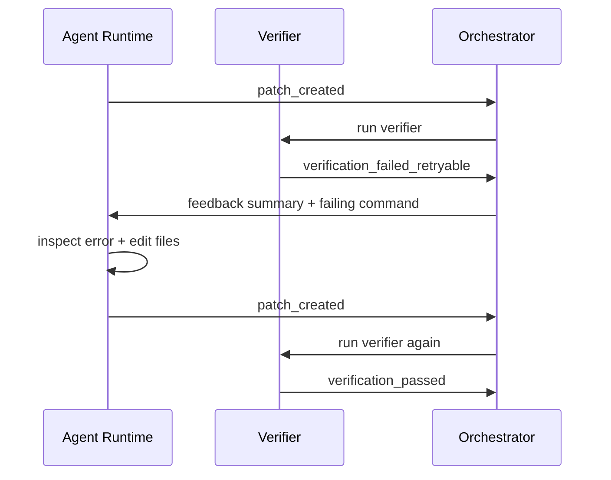

------
title: Learn AI Coding Agent From Scratch - Part 013
description: State machine agent run untuk Honk-like AI coding agent: lifecycle task, run, attempt, step, terminal state, retry, cancellation, timeout, lease, idempotency, dan invariant transisi.
series: learn-ai-coding-agent
seriesTitle: Learn AI Coding Agent From Scratch
order: 13
partTitle: State Machine for Agent Runs
tags:
- ai-coding-agent
- state-machine
- orchestration
- workflow
- retry
- idempotency
- sandbox
- verifier
- pr-orchestration
date: 2026-07-03
---

# Part 013 — State Machine for Agent Runs

Kita sudah punya domain model pada Part 012. Sekarang kita harus memberi domain model itu **gerak yang sah**.

AI coding agent bukan fungsi sederhana:

```text
input prompt -> output patch
```

Model itu terlalu naif. Sistem nyata punya queue, worker, sandbox, timeout, retry, cancellation, verifier, judge, human approval, PR creation, dan audit trail. Tanpa state machine, semua hal itu akan berubah menjadi kumpulan boolean yang saling bertabrakan:

```text
isRunning = true
isFinished = false
hasPatch = true
isVerified = false
isPrCreated = true
isCancelled = true
```

Status seperti itu tidak bisa dipertanggungjawabkan.

State machine membuat lifecycle agent menjadi eksplisit:

- state apa yang mungkin terjadi;
- transisi mana yang legal;
- siapa yang boleh memicu transisi;
- event apa yang harus dicatat;
- resource apa yang harus dilepas;
- retry mana yang aman;
- kapan run dianggap terminal;
- kapan manusia harus mengambil keputusan.

Untuk Honk-like background coding agent, state machine bukan detail implementasi. Ia adalah **kontrak keselamatan operasional**.

---

## 1. Tujuan state machine

State machine agent run menyelesaikan lima masalah utama.

Pertama, ia mencegah lifecycle kabur. Worker tidak boleh langsung membuat PR kalau task belum melewati policy gate. Verifier tidak boleh berjalan kalau tidak ada patch. Judge tidak boleh memberi verdict kalau verification report belum ada.

Kedua, ia membuat retry bisa dikontrol. Retry dari kegagalan clone berbeda dengan retry dari kegagalan test. Retry karena LLM timeout berbeda dengan retry karena policy violation.

Ketiga, ia membuat cancellation aman. Membatalkan task tidak sama dengan membunuh container secara kasar tanpa mencatat artifact. Sistem harus tahu apakah sedang aman untuk dihentikan, apakah perlu cleanup, dan apakah patch parsial harus disimpan.

Keempat, ia membuat observability menjadi terstruktur. Daripada membaca log mentah, kita bisa melihat transisi:

```text
QUEUED -> PREPARING -> RUNNING -> VERIFYING -> JUDGING -> PR_CREATED
```

Kelima, ia memberi dasar untuk governance. Tim platform bisa menetapkan policy seperti:

```text
Only low-risk tasks can transition from JUDGED_PASS to PR_CREATING automatically.
High-risk tasks must transition to HUMAN_APPROVAL_REQUIRED.
```

---

## 2. Prinsip desain state machine

State machine untuk AI coding agent harus memenuhi prinsip berikut.

### 2.1 State harus merepresentasikan kondisi sistem, bukan mood agent

Jangan membuat state seperti:

```text
THINKING
CONFUSED
TRYING_HARDER
```

State harus observable dari luar dan punya konsekuensi operasional.

Lebih baik:

```text
PLANNING
EDITING
VERIFYING
WAITING_FOR_APPROVAL
```

### 2.2 State harus punya owner yang jelas

Setiap state harus jelas dikendalikan oleh siapa:

| State group | Owner utama |
|---|---|
| Intake | API/control plane |
| Queue | scheduler |
| Execution | worker/execution plane |
| Verification | verifier runtime |
| Judge | judge service |
| Approval | human/platform policy |
| PR | git provider integration |
| Terminal | control plane |

Kalau owner tidak jelas, dua proses bisa mencoba mengubah state yang sama.

### 2.3 Terminal state harus final

Terminal state tidak boleh keluar lagi ke state aktif. Kalau task perlu dijalankan ulang, buat **Run baru**, bukan menghidupkan kembali run lama.

Contoh terminal state:

```text
SUCCEEDED
FAILED
CANCELLED
REJECTED
EXPIRED
```

### 2.4 Transisi harus divalidasi secara server-side

Client, worker, atau LLM tidak boleh bebas menulis status.

Jangan sediakan API seperti:

```http
PATCH /runs/{id}
{ "status": "PR_CREATED" }
```

Lebih aman:

```http
POST /runs/{id}/events
{ "type": "verification_passed", "verificationReportId": "..." }
```

Control plane yang menentukan state berikutnya.

### 2.5 State transition harus atomic

Transisi state biasanya harus terjadi bersama update metadata penting.

Contoh:

```text
RUNNING -> VERIFYING
```

harus disimpan bersama:

- patch id;
- diff summary;
- artifact location;
- worker id;
- timestamp;
- attempt number.

Kalau state berubah tanpa artifact, sistem akan kehilangan evidence.

---

## 3. Dua lifecycle: Task dan Run

Sebelum membuat state machine, pisahkan dua lifecycle:

```text
Task = permintaan kerja dari user/platform
Run  = satu eksekusi konkret untuk mencoba menyelesaikan Task
```

Satu Task bisa punya banyak Run.

Contoh:

```text
Task: Upgrade service A from library X 1.2 to 1.5
Run #1: failed because repository checkout failed
Run #2: failed because tests revealed breaking API
Run #3: succeeded and created PR
```

Jangan mencampur state task dan state run.

Task menjawab:

```text
Apakah permintaan ini masih aktif, ditolak, selesai, atau menunggu approval?
```

Run menjawab:

```text
Apa status satu percobaan eksekusi tertentu?
```

---

## 4. Task state machine

Task state machine relatif kecil.



### 4.1 Task states

| State | Meaning | Terminal? |
|---|---|---|
| `DRAFT` | Task dibuat tapi belum disubmit | No |
| `SUBMITTED` | Task diterima API | No |
| `VALIDATING` | Contract dan policy sedang diperiksa | No |
| `READY` | Task layak dibuatkan run | No |
| `RUNNING` | Ada run aktif atau scheduled | No |
| `WAITING_FOR_APPROVAL` | Butuh keputusan manusia | No |
| `COMPLETED` | Task selesai dengan hasil sah | Yes |
| `FAILED` | Task gagal setelah retry/attempt habis | Yes |
| `REJECTED` | Task ditolak sebelum eksekusi | Yes |
| `CANCELLED` | Task dibatalkan | Yes |

### 4.2 Kenapa Task tidak punya state `PR_CREATED`?

Karena PR adalah output dari Run, bukan selalu definisi selesai Task.

Ada task yang selesai ketika:

- analysis report dibuat;
- patch dibuat tapi tidak di-PR;
- PR dibuat;
- PR merged;
- migration batch selesai untuk banyak repo.

Task completion criterion harus berasal dari task contract:

```yaml
completionMode: pr_created
```

atau:

```yaml
completionMode: patch_ready_for_review
```

atau:

```yaml
completionMode: analysis_report_created
```

---

## 5. Run state machine

Run state machine lebih kaya. Ini lifecycle satu attempt eksekusi nyata.



Ini bukan satu-satunya possible design. Tetapi ini cukup kuat untuk platform produksi.

---

## 6. Run state catalog

### 6.1 `CREATED`

Run record sudah dibuat, tapi belum masuk queue.

Gunakan state ini untuk memastikan pembuatan run dan event awal bisa atomic.

Invariant:

```text
run.task_id exists
run.attempt_no assigned
run.status = CREATED
no worker lease exists
```

Transisi legal:

```text
CREATED -> QUEUED
CREATED -> CANCELLED
```

### 6.2 `QUEUED`

Run siap diambil worker.

Invariant:

```text
run has queue record
run has no active worker lease
run not terminal
```

Transisi legal:

```text
QUEUED -> LEASED
QUEUED -> CANCELLED
QUEUED -> EXPIRED
```

Jangan menjalankan pekerjaan langsung di API request. API hanya submit dan enqueue.

### 6.3 `LEASED`

Worker sudah mengambil run tetapi belum mulai eksekusi penuh.

State ini penting untuk distributed worker. Tanpa lease, dua worker bisa menjalankan run yang sama.

Invariant:

```text
lease.owner_worker_id is not null
lease.expires_at > now
run.status = LEASED
```

Transisi legal:

```text
LEASED -> PREPARING
LEASED -> CANCELLED
LEASED -> EXPIRED
```

### 6.4 `PREPARING`

Worker menyiapkan sandbox, repo clone, dependency cache, environment, dan policy runtime.

Invariant:

```text
sandbox allocation exists
repository checkout is in progress or done
no code edit has happened yet
```

Transisi legal:

```text
PREPARING -> CONTEXT_BUILDING
PREPARING -> FAILED
PREPARING -> CANCELLED
```

Kegagalan di state ini biasanya bukan kesalahan LLM. Contoh:

- repository tidak bisa di-clone;
- branch target tidak ada;
- Git provider token invalid;
- image sandbox gagal dibuat;
- disk quota habis;
- package registry unreachable.

### 6.5 `CONTEXT_BUILDING`

Sistem membuat repository map, membaca instruction file, menyiapkan search index, dan memilih context awal.

Invariant:

```text
repository exists in sandbox
agent has not modified files yet
context artifacts may be produced
```

Transisi legal:

```text
CONTEXT_BUILDING -> PLANNING
CONTEXT_BUILDING -> FAILED
CONTEXT_BUILDING -> CANCELLED
```

### 6.6 `PLANNING`

Agent menyusun rencana perubahan.

Invariant:

```text
task contract loaded
policy loaded
repo context available
plan artifact must be produced before leaving PLANNING successfully
```

Transisi legal:

```text
PLANNING -> EXECUTING
PLANNING -> FAILED
PLANNING -> CANCELLED
```

Planning tidak harus sempurna. Tetapi rencana minimal harus menjawab:

- file mana yang mungkin disentuh;
- verifier apa yang akan dijalankan;
- risiko apa yang terdeteksi;
- stop condition apa yang dipakai;
- perubahan apa yang tidak boleh dilakukan.

### 6.7 `EXECUTING`

Agent sedang membaca file, menjalankan search, mengedit kode, menjalankan command ringan, atau memperbaiki error.

Invariant:

```text
active sandbox exists
tool calls are recorded
file modifications are allowed only inside workspace boundary
```

Transisi legal:

```text
EXECUTING -> EXECUTING
EXECUTING -> PATCH_READY
EXECUTING -> FAILED
EXECUTING -> CANCELLED
```

Self-transition dipakai karena agentic loop berulang:

```text
observe -> act -> observe -> act
```

Tetapi self-transition tetap harus dicatat sebagai Step, bukan mengubah Run status setiap tool call.

### 6.8 `PATCH_READY`

Agent menghasilkan diff yang dianggap kandidat untuk diverifikasi.

Invariant:

```text
patch artifact exists
changed files list exists
no PR exists yet
```

Transisi legal:

```text
PATCH_READY -> VERIFYING
PATCH_READY -> CANCELLED
PATCH_READY -> FAILED
```

State ini memisahkan "agent selesai mengedit" dari "perubahan benar".

### 6.9 `VERIFYING`

Verifier menjalankan format, lint, compile, test, static analysis, atau verifier domain-specific.

Invariant:

```text
patch exists
verification command set determined
verification report will be produced
```

Transisi legal:

```text
VERIFYING -> EXECUTING
VERIFYING -> JUDGING
VERIFYING -> FAILED
VERIFYING -> CANCELLED
```

Kalau verifier gagal tetapi bisa diperbaiki, kembali ke `EXECUTING` dengan feedback.

Contoh:

```text
VERIFYING -> EXECUTING because maven compile failed with missing import
```

Kalau verifier gagal non-retryable, masuk `FAILED`.

Contoh:

```text
task asks to upgrade library but target version does not exist
```

### 6.10 `JUDGING`

Judge menilai apakah patch benar-benar memenuhi task contract, tidak overreach, dan punya evidence cukup.

Judge bisa deterministic, LLM-based, atau hybrid.

Invariant:

```text
verification report exists
patch exists
judge report must be created before transition out
```

Transisi legal:

```text
JUDGING -> EXECUTING
JUDGING -> WAITING_FOR_APPROVAL
JUDGING -> PR_CREATING
JUDGING -> FAILED
JUDGING -> CANCELLED
```

### 6.11 `WAITING_FOR_APPROVAL`

Sistem berhenti menunggu keputusan manusia.

Invariant:

```text
patch exists or report exists
approval request exists
no further code mutation while waiting
```

Transisi legal:

```text
WAITING_FOR_APPROVAL -> PR_CREATING
WAITING_FOR_APPROVAL -> EXECUTING
WAITING_FOR_APPROVAL -> CANCELLED
WAITING_FOR_APPROVAL -> FAILED
```

Kadang reviewer tidak hanya approve/reject, tetapi memberi instruction tambahan:

```text
Looks good, but do not update generated files.
```

Maka transisi bisa kembali ke `EXECUTING` dengan revised instruction.

### 6.12 `PR_CREATING`

Sistem membuat branch, commit, dan pull request.

Invariant:

```text
patch exists
commit message generated and approved by policy
git provider credentials scoped
no additional code changes should happen except git metadata operations
```

Transisi legal:

```text
PR_CREATING -> PR_CREATED
PR_CREATING -> FAILED
PR_CREATING -> CANCELLED
```

### 6.13 `PR_CREATED`

Pull request sudah dibuat.

Invariant:

```text
pull_request_url exists
commit_sha exists
branch_name exists
pr body contains evidence summary
```

Transisi legal:

```text
PR_CREATED -> SUCCEEDED
PR_CREATED -> FAILED
```

Dalam desain sederhana, `PR_CREATED` bisa langsung terminal. Namun lebih fleksibel menjadikannya intermediate agar completion mode bisa diperiksa.

### 6.14 `SUCCEEDED`

Run selesai sukses.

Invariant:

```text
terminal = true
no active lease
no active sandbox required
final verdict exists
```

### 6.15 `FAILED`

Run gagal.

Invariant:

```text
terminal = true
failure reason exists
failure category exists
retryability classified
```

### 6.16 `CANCELLED`

Run dibatalkan oleh user, policy, admin, atau parent task.

Invariant:

```text
terminal = true
cancel reason exists
cleanup attempted
```

### 6.17 `EXPIRED`

Run mati karena timeout queue, lease, atau heartbeat.

Invariant:

```text
terminal = true
expiration reason exists
```

`EXPIRED` berbeda dari `FAILED`. Expired sering berarti sistem kehilangan kepastian, bukan pekerjaan terbukti gagal secara semantik.

---

## 7. Transition table

Tabel berikut adalah versi ringkas dari transisi legal.

| From | Event | To | Actor |
|---|---|---|---|
| `CREATED` | `run_enqueued` | `QUEUED` | scheduler |
| `QUEUED` | `lease_acquired` | `LEASED` | worker |
| `LEASED` | `worker_started` | `PREPARING` | worker |
| `PREPARING` | `sandbox_ready` | `CONTEXT_BUILDING` | worker |
| `CONTEXT_BUILDING` | `context_ready` | `PLANNING` | worker |
| `PLANNING` | `plan_created` | `EXECUTING` | agent runtime |
| `EXECUTING` | `patch_created` | `PATCH_READY` | agent runtime |
| `PATCH_READY` | `verification_started` | `VERIFYING` | verifier |
| `VERIFYING` | `verification_failed_retryable` | `EXECUTING` | verifier/orchestrator |
| `VERIFYING` | `verification_passed` | `JUDGING` | verifier |
| `JUDGING` | `judge_requires_fix` | `EXECUTING` | judge/orchestrator |
| `JUDGING` | `human_approval_required` | `WAITING_FOR_APPROVAL` | policy |
| `JUDGING` | `auto_pr_allowed` | `PR_CREATING` | policy |
| `WAITING_FOR_APPROVAL` | `approved` | `PR_CREATING` | human |
| `PR_CREATING` | `pr_created` | `PR_CREATED` | git integration |
| `PR_CREATED` | `completion_condition_met` | `SUCCEEDED` | control plane |
| active state | `cancel_requested` | `CANCELLED` | user/admin/policy |
| active state | `non_retryable_failure` | `FAILED` | owner service |
| queue/lease state | `timeout` | `EXPIRED` | scheduler |

---

## 8. Event-driven transition, bukan direct status write

Desain buruk:

```sql
UPDATE runs SET status = 'SUCCEEDED' WHERE id = ?;
```

Kenapa buruk?

Karena tidak ada informasi:

- siapa yang mengubah;
- event apa yang terjadi;
- evidence apa yang mendukung;
- apakah transisi legal;
- apa side effect-nya;
- apakah event sudah pernah diproses.

Desain lebih baik:

```text
append event -> validate transition -> update aggregate -> emit side effects
```

Contoh event:

```json
{
  "eventId": "evt_01J...",
  "runId": "run_01J...",
  "type": "verification_passed",
  "actor": "verifier-service",
  "occurredAt": "2026-07-03T10:20:30Z",
  "payload": {
    "verificationReportId": "vr_01J...",
    "commands": ["mvn -q test"],
    "durationMs": 84231
  }
}
```

Control plane memutuskan:

```text
current state = VERIFYING
incoming event = verification_passed
next state = JUDGING
```

---

## 9. Transition validator

Implementasikan state machine sebagai library kecil di domain layer.

Contoh pseudo-Java:

```java
public enum RunStatus {
    CREATED,
    QUEUED,
    LEASED,
    PREPARING,
    CONTEXT_BUILDING,
    PLANNING,
    EXECUTING,
    PATCH_READY,
    VERIFYING,
    JUDGING,
    WAITING_FOR_APPROVAL,
    PR_CREATING,
    PR_CREATED,
    SUCCEEDED,
    FAILED,
    CANCELLED,
    EXPIRED;

    public boolean isTerminal() {
        return switch (this) {
            case SUCCEEDED, FAILED, CANCELLED, EXPIRED -> true;
            default -> false;
        };
    }
}
```

Event enum:

```java
public enum RunEventType {
    RUN_ENQUEUED,
    LEASE_ACQUIRED,
    WORKER_STARTED,
    SANDBOX_READY,
    CONTEXT_READY,
    PLAN_CREATED,
    PATCH_CREATED,
    VERIFICATION_STARTED,
    VERIFICATION_FAILED_RETRYABLE,
    VERIFICATION_PASSED,
    JUDGE_REQUIRES_FIX,
    HUMAN_APPROVAL_REQUIRED,
    AUTO_PR_ALLOWED,
    APPROVED,
    PR_CREATED,
    COMPLETION_CONDITION_MET,
    CANCEL_REQUESTED,
    NON_RETRYABLE_FAILURE,
    TIMEOUT
}
```

Transition function:

```java
public final class RunStateMachine {
    public RunStatus next(RunStatus current, RunEventType event) {
        if (current.isTerminal()) {
            throw new IllegalTransitionException(current, event);
        }

        return switch (current) {
            case CREATED -> switch (event) {
                case RUN_ENQUEUED -> RunStatus.QUEUED;
                case CANCEL_REQUESTED -> RunStatus.CANCELLED;
                default -> illegal(current, event);
            };
            case QUEUED -> switch (event) {
                case LEASE_ACQUIRED -> RunStatus.LEASED;
                case CANCEL_REQUESTED -> RunStatus.CANCELLED;
                case TIMEOUT -> RunStatus.EXPIRED;
                default -> illegal(current, event);
            };
            case LEASED -> switch (event) {
                case WORKER_STARTED -> RunStatus.PREPARING;
                case CANCEL_REQUESTED -> RunStatus.CANCELLED;
                case TIMEOUT -> RunStatus.EXPIRED;
                default -> illegal(current, event);
            };
            case PREPARING -> switch (event) {
                case SANDBOX_READY -> RunStatus.CONTEXT_BUILDING;
                case NON_RETRYABLE_FAILURE -> RunStatus.FAILED;
                case CANCEL_REQUESTED -> RunStatus.CANCELLED;
                default -> illegal(current, event);
            };
            case CONTEXT_BUILDING -> switch (event) {
                case CONTEXT_READY -> RunStatus.PLANNING;
                case NON_RETRYABLE_FAILURE -> RunStatus.FAILED;
                case CANCEL_REQUESTED -> RunStatus.CANCELLED;
                default -> illegal(current, event);
            };
            case PLANNING -> switch (event) {
                case PLAN_CREATED -> RunStatus.EXECUTING;
                case NON_RETRYABLE_FAILURE -> RunStatus.FAILED;
                case CANCEL_REQUESTED -> RunStatus.CANCELLED;
                default -> illegal(current, event);
            };
            case EXECUTING -> switch (event) {
                case PATCH_CREATED -> RunStatus.PATCH_READY;
                case NON_RETRYABLE_FAILURE -> RunStatus.FAILED;
                case CANCEL_REQUESTED -> RunStatus.CANCELLED;
                default -> illegal(current, event);
            };
            case PATCH_READY -> switch (event) {
                case VERIFICATION_STARTED -> RunStatus.VERIFYING;
                case NON_RETRYABLE_FAILURE -> RunStatus.FAILED;
                case CANCEL_REQUESTED -> RunStatus.CANCELLED;
                default -> illegal(current, event);
            };
            case VERIFYING -> switch (event) {
                case VERIFICATION_FAILED_RETRYABLE -> RunStatus.EXECUTING;
                case VERIFICATION_PASSED -> RunStatus.JUDGING;
                case NON_RETRYABLE_FAILURE -> RunStatus.FAILED;
                case CANCEL_REQUESTED -> RunStatus.CANCELLED;
                default -> illegal(current, event);
            };
            case JUDGING -> switch (event) {
                case JUDGE_REQUIRES_FIX -> RunStatus.EXECUTING;
                case HUMAN_APPROVAL_REQUIRED -> RunStatus.WAITING_FOR_APPROVAL;
                case AUTO_PR_ALLOWED -> RunStatus.PR_CREATING;
                case NON_RETRYABLE_FAILURE -> RunStatus.FAILED;
                case CANCEL_REQUESTED -> RunStatus.CANCELLED;
                default -> illegal(current, event);
            };
            case WAITING_FOR_APPROVAL -> switch (event) {
                case APPROVED -> RunStatus.PR_CREATING;
                case CANCEL_REQUESTED -> RunStatus.CANCELLED;
                case NON_RETRYABLE_FAILURE -> RunStatus.FAILED;
                default -> illegal(current, event);
            };
            case PR_CREATING -> switch (event) {
                case PR_CREATED -> RunStatus.PR_CREATED;
                case NON_RETRYABLE_FAILURE -> RunStatus.FAILED;
                case CANCEL_REQUESTED -> RunStatus.CANCELLED;
                default -> illegal(current, event);
            };
            case PR_CREATED -> switch (event) {
                case COMPLETION_CONDITION_MET -> RunStatus.SUCCEEDED;
                case NON_RETRYABLE_FAILURE -> RunStatus.FAILED;
                default -> illegal(current, event);
            };
            case SUCCEEDED, FAILED, CANCELLED, EXPIRED -> illegal(current, event);
        };
    }

    private RunStatus illegal(RunStatus current, RunEventType event) {
        throw new IllegalTransitionException(current, event);
    }
}
```

Catatan penting: ini contoh domain-level validator, bukan seluruh orchestration engine. Side effect seperti enqueue, cleanup, PR creation, dan event emission tetap dikelola service layer.

---

## 10. State machine dengan guard

Transisi tidak cukup hanya berdasarkan current state dan event. Kita butuh guard.

Contoh:

```text
JUDGING + AUTO_PR_ALLOWED -> PR_CREATING
```

Transisi ini hanya legal kalau:

- task risk level rendah atau sedang;
- verifier pass;
- judge confidence memenuhi threshold;
- changed files tidak menyentuh forbidden paths;
- no secret detected;
- no generated file policy violation;
- budget tidak terlampaui;
- user/task policy mengizinkan auto PR.

Representasi guard:

```java
public record TransitionContext(
    RiskLevel riskLevel,
    boolean verifierPassed,
    boolean judgePassed,
    boolean secretScanPassed,
    boolean changedForbiddenPath,
    boolean autoPrAllowedByTask,
    boolean budgetExceeded
) {}
```

Transition rule:

```java
public boolean canAutoCreatePr(TransitionContext ctx) {
    return ctx.verifierPassed()
        && ctx.judgePassed()
        && ctx.secretScanPassed()
        && !ctx.changedForbiddenPath()
        && ctx.autoPrAllowedByTask()
        && !ctx.budgetExceeded()
        && ctx.riskLevel() != RiskLevel.HIGH
        && ctx.riskLevel() != RiskLevel.CRITICAL;
}
```

State machine tanpa guard akan terlalu permisif.

---

## 11. Step lifecycle

Run state menggambarkan lifecycle besar. Step menggambarkan aksi granular.

Step bisa punya state sendiri:



Step bukan pengganti run state. Step adalah trace.

Contoh step:

```text
Step 001: read repository instructions
Step 002: search usages of deprecated API
Step 003: edit src/main/java/.../Foo.java
Step 004: run mvn -q -DskipTests compile
Step 005: fix compile error
Step 006: run mvn -q test
```

Run state mungkin tetap `EXECUTING` sepanjang Step 001–005.

---

## 12. Attempt lifecycle

Attempt berbeda dari retry internal.

Gunakan Attempt untuk percobaan besar yang pantas dilihat manusia.

Contoh:

```text
Run 1 Attempt 1:
  agent tries direct edit
  verifier fails
  agent repairs
  verifier fails again
  attempt exhausted

Run 1 Attempt 2:
  agent starts from clean checkout
  uses different strategy
  succeeds
```

Attempt punya state:

```text
STARTED
SUCCEEDED
FAILED
ABORTED
```

Invariant Attempt:

```text
attempt belongs to one run
attempt has monotonic attempt_no
attempt has bounded max_steps
attempt has bounded max_cost
attempt has bounded max_duration
```

Jangan membuat retry tanpa batas. AI agent yang tidak punya attempt budget akan menjadi cost sink.

---

## 13. Lease dan heartbeat

Dalam distributed worker, state `LEASED` dan heartbeat wajib ada.

Tanpa lease:

```text
Worker A picks run_123
Worker B also picks run_123
Both edit same repo
Both create different PRs
```

Lease record minimal:

```sql
CREATE TABLE run_leases (
    run_id TEXT PRIMARY KEY,
    worker_id TEXT NOT NULL,
    lease_token TEXT NOT NULL,
    acquired_at TIMESTAMPTZ NOT NULL,
    expires_at TIMESTAMPTZ NOT NULL,
    heartbeat_at TIMESTAMPTZ NOT NULL
);
```

Worker harus memperpanjang lease:

```text
every 15s: heartbeat(run_id, lease_token)
```

Control plane hanya menerima event dari worker yang punya lease token valid.

```text
if event.lease_token != active_lease.lease_token:
    reject event
```

Ini mencegah zombie worker mengirim hasil setelah lease hilang.

---

## 14. Idempotency

Distributed system akan mengirim event ganda. API client bisa retry. Worker bisa timeout setelah berhasil mengirim event tetapi sebelum menerima response.

Maka transition event harus idempotent.

Gunakan `event_id` atau `idempotency_key`.

```sql
CREATE TABLE run_events (
    event_id TEXT PRIMARY KEY,
    run_id TEXT NOT NULL,
    event_type TEXT NOT NULL,
    from_status TEXT NOT NULL,
    to_status TEXT NOT NULL,
    actor_type TEXT NOT NULL,
    actor_id TEXT NOT NULL,
    idempotency_key TEXT,
    payload JSONB NOT NULL,
    occurred_at TIMESTAMPTZ NOT NULL,
    recorded_at TIMESTAMPTZ NOT NULL,
    UNIQUE (run_id, idempotency_key)
);
```

Kalau event dengan idempotency key sama diterima lagi, response harus sama, bukan membuat transition baru.

```text
POST /runs/run_123/events
Idempotency-Key: verifier-run_123-report_456
```

---

## 15. Optimistic concurrency

State transition harus menjaga versi aggregate.

Kolom `version`:

```sql
ALTER TABLE runs ADD COLUMN version BIGINT NOT NULL DEFAULT 0;
```

Update:

```sql
UPDATE runs
SET status = :next_status,
    version = version + 1,
    updated_at = now()
WHERE id = :run_id
  AND status = :expected_status
  AND version = :expected_version;
```

Kalau affected rows = 0, berarti ada concurrent update.

Jangan diam-diam overwrite.

---

## 16. Failure classification

State `FAILED` saja tidak cukup. Kita butuh failure category.

| Category | Meaning | Retry? |
|---|---|---|
| `INFRASTRUCTURE` | Worker, sandbox, network, disk, provider down | Often |
| `REPOSITORY_ACCESS` | Clone/auth/branch error | Sometimes |
| `POLICY_DENIED` | Diblok policy | No |
| `PLANNING_FAILED` | Agent tidak bisa membuat plan valid | Sometimes |
| `TOOL_FAILED` | Tool call gagal | Depends |
| `VERIFICATION_FAILED` | Build/test/lint gagal | Sometimes |
| `JUDGE_REJECTED` | Patch tidak memenuhi task | Sometimes |
| `BUDGET_EXCEEDED` | Cost/step/time limit habis | Maybe with approval |
| `PR_CREATION_FAILED` | Git provider error | Often |
| `USER_CANCELLED` | User cancel | No |
| `UNKNOWN` | Tidak terklasifikasi | Manual review |

Failure detail:

```json
{
  "category": "VERIFICATION_FAILED",
  "retryable": true,
  "reason": "maven_compile_error",
  "summary": "Compilation failed because FooService still imports removed package",
  "evidenceArtifactId": "artifact_01J..."
}
```

State machine menentukan terminal. Failure classification menentukan next action.

---

## 17. Retry policy

Retry jangan disamakan dengan `while not success`.

Retry harus mempertimbangkan:

- state tempat gagal;
- failure category;
- jumlah attempt;
- cost yang sudah dipakai;
- task risk;
- apakah repo berubah sejak run dimulai;
- apakah failure deterministik;
- apakah instruksi perlu diubah.

Contoh retry matrix:

| Failed state | Failure category | Retry action |
|---|---|---|
| `PREPARING` | `INFRASTRUCTURE` | Retry same run or new run after backoff |
| `PREPARING` | `REPOSITORY_ACCESS` | Fail unless credential refreshed |
| `PLANNING` | `PLANNING_FAILED` | Retry with smaller context once |
| `EXECUTING` | `BUDGET_EXCEEDED` | Stop or require approval |
| `VERIFYING` | `VERIFICATION_FAILED` | Return to `EXECUTING` if budget remains |
| `JUDGING` | `JUDGE_REJECTED` | Return to `EXECUTING` with judge feedback |
| `PR_CREATING` | `INFRASTRUCTURE` | Retry PR creation idempotently |

Backoff:

```text
retry_delay = min(base * 2^attempt, max_delay)
```

Tapi untuk agent loop, retry bukan hanya delay. Kadang harus mengubah strategy.

---

## 18. Cancellation model

Cancellation harus bisa terjadi di banyak state, tetapi efeknya berbeda.

| Current state | Cancellation behavior |
|---|---|
| `QUEUED` | Remove from queue |
| `LEASED` | Mark cancel requested; worker should stop before work |
| `PREPARING` | Stop sandbox setup; cleanup partial resources |
| `EXECUTING` | Stop after current safe point; preserve logs and diff |
| `VERIFYING` | Stop command if safe; preserve partial report |
| `WAITING_FOR_APPROVAL` | Close approval request |
| `PR_CREATING` | Harder; may need reconcile if PR already created |
| `PR_CREATED` | Usually do not cancel run; create follow-up action if PR should close |

Cancellation should be cooperative first, forceful second.

```text
cancel_requested -> worker receives signal -> current tool call stops at boundary -> cleanup -> CANCELLED
```

For shell commands, use process group termination and timeout escalation.

---

## 19. Timeout model

Ada beberapa timeout yang berbeda.

| Timeout | Scope | Result |
|---|---|---|
| Queue timeout | Run terlalu lama menunggu worker | `EXPIRED` |
| Lease timeout | Worker hilang heartbeat | `EXPIRED` or retry |
| Step timeout | Tool call terlalu lama | Step `TIMED_OUT`, run may continue/fail |
| Command timeout | Shell command terlalu lama | Step fail, maybe retry |
| Attempt timeout | Satu attempt terlalu lama | Attempt fail |
| Run timeout | Seluruh run terlalu lama | `FAILED` or `EXPIRED` |
| Approval timeout | Manusia tidak merespons | cancel/fail/escalate |

Jangan pakai satu global timeout untuk semua. Itu membuat diagnosis buruk.

---

## 20. Sandbox lifecycle and state machine

Sandbox lifecycle terkait erat dengan Run state.



Rule praktis:

```text
Run terminal does not mean artifacts are gone.
Run terminal means mutation is no longer allowed.
```

Artifact harus disimpan sebelum sandbox dihancurkan.

---

## 21. PR lifecycle is not the same as Run lifecycle

Run bisa `SUCCEEDED` ketika PR dibuat. Tetapi PR sendiri punya lifecycle:

```text
OPEN
UPDATED
REVIEW_REQUESTED
CHANGES_REQUESTED
APPROVED
MERGED
CLOSED
```

Untuk seri ini, platform agent bertanggung jawab sampai PR dibuat dan evidence tersedia. Auto-update PR setelah review akan dibahas pada bagian PR orchestration.

Jangan membuat Run tetap `RUNNING` sampai PR merged. Itu akan membuat run lifecycle terlalu panjang dan rentan menggantung.

Buat entity terpisah:

```text
PullRequestRecord
ReviewFeedbackRun
FollowUpTask
```

---

## 22. Database schema dasar

Tabel `runs`:

```sql
CREATE TABLE runs (
    id TEXT PRIMARY KEY,
    task_id TEXT NOT NULL,
    attempt_no INTEGER NOT NULL,
    status TEXT NOT NULL,
    status_reason TEXT,
    worker_id TEXT,
    lease_token TEXT,
    started_at TIMESTAMPTZ,
    completed_at TIMESTAMPTZ,
    expires_at TIMESTAMPTZ,
    version BIGINT NOT NULL DEFAULT 0,
    created_at TIMESTAMPTZ NOT NULL,
    updated_at TIMESTAMPTZ NOT NULL,
    CONSTRAINT runs_status_check CHECK (status IN (
        'CREATED',
        'QUEUED',
        'LEASED',
        'PREPARING',
        'CONTEXT_BUILDING',
        'PLANNING',
        'EXECUTING',
        'PATCH_READY',
        'VERIFYING',
        'JUDGING',
        'WAITING_FOR_APPROVAL',
        'PR_CREATING',
        'PR_CREATED',
        'SUCCEEDED',
        'FAILED',
        'CANCELLED',
        'EXPIRED'
    ))
);
```

Index:

```sql
CREATE INDEX idx_runs_task_id ON runs(task_id);
CREATE INDEX idx_runs_status ON runs(status);
CREATE INDEX idx_runs_active ON runs(status, updated_at)
WHERE status NOT IN ('SUCCEEDED', 'FAILED', 'CANCELLED', 'EXPIRED');
```

Tabel event:

```sql
CREATE TABLE run_events (
    id TEXT PRIMARY KEY,
    run_id TEXT NOT NULL REFERENCES runs(id),
    event_type TEXT NOT NULL,
    from_status TEXT NOT NULL,
    to_status TEXT NOT NULL,
    actor_type TEXT NOT NULL,
    actor_id TEXT NOT NULL,
    idempotency_key TEXT,
    payload JSONB NOT NULL,
    recorded_at TIMESTAMPTZ NOT NULL,
    UNIQUE (run_id, idempotency_key)
);
```

---

## 23. Transition service

Service layer melakukan orchestration kecil:

```text
receive event
load run with version
check idempotency
validate actor/lease
validate transition
validate guard
write event
update run
commit transaction
emit domain event
trigger side effect
```

Pseudo-code:

```java
public TransitionResult applyEvent(RunEvent event) {
    return transaction.execute(() -> {
        Run run = runRepository.getForUpdate(event.runId());

        IdempotencyHit hit = eventRepository.findByIdempotencyKey(
            event.runId(),
            event.idempotencyKey()
        );
        if (hit.exists()) {
            return hit.previousResult();
        }

        leaseValidator.validate(event, run);

        RunStatus next = stateMachine.next(run.status(), event.type());
        transitionGuard.validate(run, event, next);

        RunEventRecord record = RunEventRecord.from(run, event, next);
        eventRepository.insert(record);

        run.transitionTo(next, event.reason());
        runRepository.save(run);

        outboxRepository.insert(DomainEvent.from(record));

        return TransitionResult.of(run.id(), run.status(), next);
    });
}
```

Gunakan transactional outbox agar event eksternal tidak hilang setelah DB commit.

---

## 24. Domain events dari transition

Setiap transition penting menghasilkan domain event.

Contoh:

```text
RunQueued
RunLeased
RunPreparing
RunContextReady
RunPlanCreated
RunPatchReady
RunVerificationStarted
RunVerificationPassed
RunJudgePassed
RunApprovalRequired
RunPrCreating
RunPrCreated
RunSucceeded
RunFailed
RunCancelled
RunExpired
```

Domain event dipakai oleh:

- notification;
- metrics;
- audit;
- UI timeline;
- artifact processor;
- scheduler;
- PR orchestrator;
- cleanup worker.

---

## 25. UI timeline dari state machine

State machine bisa langsung diterjemahkan menjadi timeline user-facing.

Contoh:

```text
10:00 Task accepted
10:01 Worker acquired run
10:01 Sandbox prepared
10:02 Repository context built
10:03 Plan created
10:04 Edited 6 files
10:06 Compile failed; agent repaired import
10:08 Tests passed
10:09 Judge approved patch
10:10 Pull request created
```

Ini lebih berguna daripada log mentah 20.000 baris.

---

## 26. Mermaid sequence untuk run sukses



---

## 27. Mermaid sequence untuk verifier repair loop



Inti desain Honk-like adalah feedback loop seperti ini: agent tidak dipercaya hanya karena menulis patch; patch harus diuji dan feedback dikembalikan secara terstruktur.

---

## 28. State machine anti-patterns

### 28.1 Boolean soup

```text
is_running
is_done
is_failed
is_waiting
is_pr_created
is_cancelled
```

Ini cepat rusak.

Gunakan enum status plus event log.

### 28.2 Terminal state yang bisa dibuka lagi

```text
FAILED -> RUNNING
```

Jangan. Buat run baru.

### 28.3 State terlalu granular

Jangan menjadikan setiap tool call sebagai Run status.

Buruk:

```text
READING_FILE
WRITING_FILE
RUNNING_GREP
RUNNING_MAVEN
```

Itu Step, bukan Run.

### 28.4 State terlalu abstrak

Buruk:

```text
IN_PROGRESS
DONE
ERROR
```

Terlalu sedikit untuk diagnosa dan policy.

### 28.5 LLM boleh menentukan state

LLM boleh memberi output:

```text
I think the patch is ready.
```

Tetapi sistem yang menentukan:

```text
EXECUTING -> PATCH_READY
```

### 28.6 Tidak ada lease

Tanpa lease, distributed worker akan membuat duplicate execution.

### 28.7 Tidak ada idempotency

Tanpa idempotency, retry API bisa membuat event ganda, PR ganda, atau state corrupt.

---

## 29. Exercise: desain state untuk task analysis-only

Tidak semua task menghasilkan PR.

Task:

```text
Analyze all usages of deprecated API X and produce migration report.
```

Completion mode:

```yaml
completionMode: analysis_report_created
```

Run flow:

```text
CREATED
QUEUED
LEASED
PREPARING
CONTEXT_BUILDING
PLANNING
EXECUTING
JUDGING
SUCCEEDED
```

Tidak perlu:

```text
PATCH_READY
VERIFYING
PR_CREATING
PR_CREATED
```

Pelajaran: state machine bisa punya optional path. Jangan memaksa semua task melewati PR.

---

## 30. Exercise: desain state untuk high-risk schema migration

Task:

```text
Migrate payment schema and update service code.
```

Flow:

```text
CREATED
QUEUED
LEASED
PREPARING
CONTEXT_BUILDING
PLANNING
WAITING_FOR_APPROVAL
EXECUTING
PATCH_READY
VERIFYING
JUDGING
WAITING_FOR_APPROVAL
PR_CREATING
PR_CREATED
SUCCEEDED
```

Ada dua approval:

1. approval plan sebelum eksekusi;
2. approval patch sebelum PR.

Untuk high-risk task, approval bukan gangguan. Approval adalah control point.

---

## 31. Minimal implementation plan

Untuk implementasi awal, jangan langsung membuat workflow engine kompleks.

Bangun bertahap:

### Step 1 — Enum dan transition validator

Implementasikan `RunStatus`, `RunEventType`, dan `RunStateMachine`.

### Step 2 — DB table runs dan run_events

Pastikan semua transition tercatat.

### Step 3 — API transition endpoint internal

Worker tidak update status langsung. Worker mengirim event.

### Step 4 — Lease sederhana

Tambahkan `worker_id`, `lease_token`, `heartbeat_at`, `expires_at`.

### Step 5 — Worker loop

Worker mengambil queued run, memperbarui state, dan menjalankan dummy execution.

### Step 6 — Verifier loop

Tambahkan path `PATCH_READY -> VERIFYING -> EXECUTING/JUDGING`.

### Step 7 — PR orchestration

Tambahkan path `JUDGING -> PR_CREATING -> PR_CREATED -> SUCCEEDED`.

### Step 8 — UI timeline

Render event log menjadi timeline.

---

## 32. Checklist desain state machine

Sebelum lanjut ke API design, pastikan jawaban ini jelas:

- Apa beda Task, Run, Attempt, dan Step?
- Apa terminal state untuk Run?
- Apakah terminal state benar-benar final?
- Siapa yang boleh memicu setiap transisi?
- Apakah transition divalidasi server-side?
- Apakah worker punya lease?
- Apakah zombie worker ditolak?
- Apakah event idempotent?
- Apakah failure diklasifikasi?
- Apakah retry punya budget?
- Apakah cancellation cooperative?
- Apakah verifier failure bisa kembali ke execution?
- Apakah judge bisa meminta fix?
- Apakah high-risk task bisa berhenti di approval gate?
- Apakah PR lifecycle dipisahkan dari Run lifecycle?
- Apakah UI bisa menjelaskan apa yang terjadi tanpa membaca log mentah?

---

## 33. Ringkasan

State machine adalah tulang punggung agent platform.

Untuk Honk-like AI coding agent, kita tidak boleh membangun sistem yang hanya berkata:

```text
running / done / failed
```

Kita butuh lifecycle yang memodelkan kenyataan:

```text
CREATED
QUEUED
LEASED
PREPARING
CONTEXT_BUILDING
PLANNING
EXECUTING
PATCH_READY
VERIFYING
JUDGING
WAITING_FOR_APPROVAL
PR_CREATING
PR_CREATED
SUCCEEDED
FAILED
CANCELLED
EXPIRED
```

State machine yang baik memberi:

- kontrol;
- auditability;
- retryability;
- cancellation safety;
- verifier feedback loop;
- human approval gate;
- PR orchestration yang aman;
- foundation untuk API dan database.

Part berikutnya akan membangun API OpenAPI-first di atas state machine ini. API itu akan menjadi kontrak resmi antara UI, CLI, scheduler, worker, verifier, judge, dan integration layer.

---

## References

- Spotify Engineering — Background coding agents and feedback loops for predictable results: `https://engineering.atspotify.com/2025/12/feedback-loops-background-coding-agents-part-3`
- OpenAI Codex sandboxing concept: `https://developers.openai.com/codex/concepts/sandboxing`
- OpenAI Codex cloud tasks and pull request workflow: `https://developers.openai.com/codex/cloud`
- Model Context Protocol specification: `https://modelcontextprotocol.io/specification/2025-06-18`
