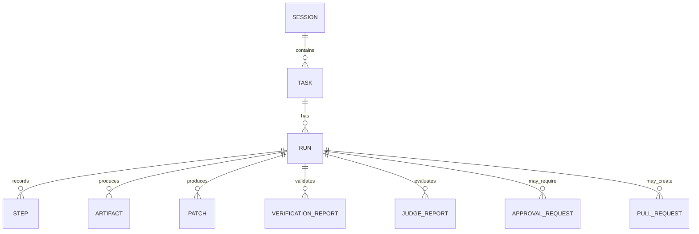
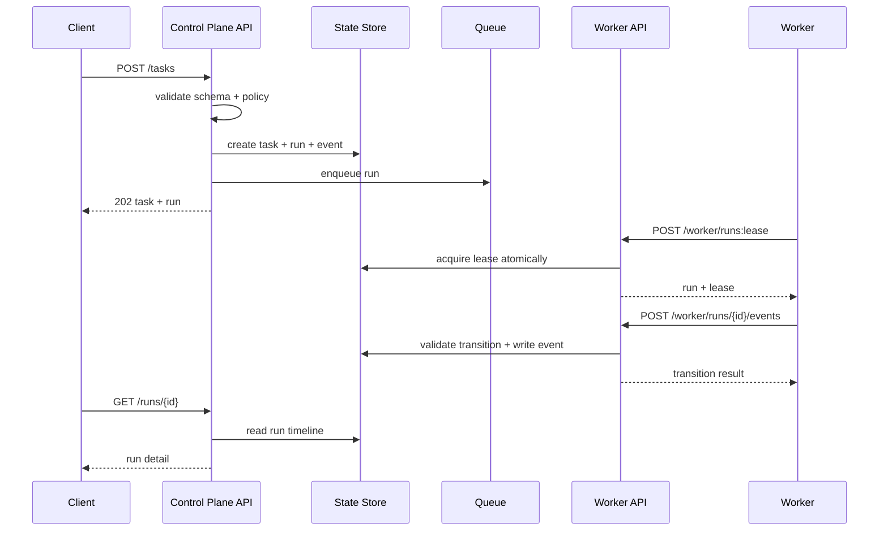

------
title: Learn AI Coding Agent From Scratch - Part 014
description: API design OpenAPI-first untuk Honk-like AI coding agent platform: resource model, endpoint, schema, idempotency, error model, auth scope, worker API, artifact API, event API, dan contract-first workflow.
series: learn-ai-coding-agent
seriesTitle: Learn AI Coding Agent From Scratch
order: 14
partTitle: API Design: OpenAPI-first Contract untuk Agent Platform
tags:
- ai-coding-agent
- openapi
- api-design
- contract-first
- rest-api
- idempotency
- problem-details
- control-plane
- worker-api
date: 2026-07-03
---

# Part 014 — API Design: OpenAPI-first Contract untuk Agent Platform

Part sebelumnya membuat state machine. Sekarang kita membuat pintu resmi untuk menggerakkan state machine itu.

Dalam Honk-like AI coding agent, API bukan sekadar CRUD:

```text
POST /tasks
GET /tasks/{id}
```

API adalah boundary antara:

- user dan task intake;
- UI dan timeline;
- CLI dan platform;
- scheduler dan worker;
- worker dan control plane;
- verifier dan run lifecycle;
- judge dan approval;
- artifact storage dan reviewer;
- git provider dan PR orchestration;
- policy/admin dan governance.

Kalau API kabur, worker akan mengambil shortcut. Kalau worker mengambil shortcut, state machine akan dilanggar. Kalau state machine dilanggar, agent tidak bisa diaudit.

Karena itu kita memakai pendekatan **OpenAPI-first**.

OpenAPI-first berarti kontrak API ditulis dan dipikirkan sebelum controller, service, database, atau UI dibuat. OpenAPI Specification mendefinisikan interface HTTP yang language-agnostic sehingga manusia dan mesin bisa memahami kapabilitas service tanpa membaca source code atau sniffing traffic. OpenAPI 3.1.1 adalah versi yang direkomendasikan untuk proyek baru pada saat rilis patch 2024.

---

## 1. Apa yang dimaksud API-first di seri ini?

API-first bukan berarti kita menulis YAML besar lalu berhenti.

API-first berarti:

```text
contract -> generated types -> server stubs -> client SDK -> contract tests -> implementation
```

Tujuannya:

- boundary eksplisit;
- resource naming stabil;
- schema tidak liar;
- error model konsisten;
- client bisa dibuat otomatis;
- worker tidak bergantung pada detail database;
- UI bisa dibangun parallel;
- compatibility bisa diuji;
- dokumentasi tidak tertinggal dari implementasi.

Dalam agent platform, kontrak API juga menjadi governance layer. API menentukan siapa boleh submit task, siapa boleh approve, siapa boleh cancel, worker mana boleh report event, dan artifact mana boleh dibaca.

---

## 2. API surface utama

Kita akan membagi API menjadi beberapa kelompok.

```text
Public Control Plane API
Internal Worker API
Artifact API
Approval API
Policy API
Webhook/Event API
Admin API
```

Tidak semua endpoint harus public.

### 2.1 Public Control Plane API

Dipakai oleh UI, CLI, internal portal, Slack bot, atau automation.

Contoh resource:

```text
/sessions
/tasks
/runs
/artifacts
/pull-requests
```

### 2.2 Internal Worker API

Dipakai worker untuk mengambil lease, mengirim heartbeat, mencatat step, mengirim event, dan upload artifact.

Contoh:

```text
/worker/runs:lease
/worker/runs/{runId}:heartbeat
/worker/runs/{runId}/events
/worker/runs/{runId}/steps
```

### 2.3 Artifact API

Dipakai untuk diff, log, verification report, judge report, plan, repository map, dan PR body draft.

Contoh:

```text
/artifacts/{artifactId}
/artifacts/{artifactId}/content
/runs/{runId}/artifacts
```

### 2.4 Approval API

Dipakai ketika state machine berhenti di approval gate.

Contoh:

```text
/approval-requests
/approval-requests/{id}:approve
/approval-requests/{id}:reject
/approval-requests/{id}:request-changes
```

### 2.5 Policy API

Dipakai admin/platform untuk mengelola capability, risk, allowed repo, forbidden path, budget, dan auto-PR policy.

Contoh:

```text
/policies
/policy-evaluations
```

### 2.6 Webhook/Event API

Dipakai untuk menerima callback dari Git provider atau mengirim event keluar.

Contoh:

```text
/webhooks/github
/events/subscriptions
```

---

## 3. Resource model

API harus mengikuti domain model yang sudah kita buat.



Resource utama:

| Resource | Meaning |
|---|---|
| `Session` | Konteks interaksi atau batch request |
| `Task` | Permintaan kerja yang dinormalisasi |
| `Run` | Eksekusi konkret atas task |
| `Step` | Aksi granular selama run |
| `Artifact` | Output immutable: diff, log, report, plan |
| `Patch` | Candidate code change |
| `VerificationReport` | Hasil verifier |
| `JudgeReport` | Hasil judge |
| `ApprovalRequest` | Gate keputusan manusia |
| `PullRequestRecord` | Metadata PR yang dibuat agent |
| `PolicyEvaluation` | Hasil evaluasi policy |

---

## 4. Naming convention endpoint

Gunakan resource nouns untuk operasi biasa:

```http
POST /tasks
GET /tasks/{taskId}
GET /tasks/{taskId}/runs
GET /runs/{runId}
GET /runs/{runId}/steps
GET /runs/{runId}/artifacts
```

Gunakan action suffix untuk command yang jelas bukan CRUD:

```http
POST /tasks/{taskId}:cancel
POST /runs/{runId}:cancel
POST /approval-requests/{approvalRequestId}:approve
POST /worker/runs:lease
POST /worker/runs/{runId}:heartbeat
```

Kenapa bukan `PATCH /runs/{id}` untuk cancel?

Karena cancel adalah command dengan invariant dan side effect:

- validasi state;
- tulis event;
- signal worker;
- cleanup;
- audit;
- notifikasi.

Command endpoint membuat maksud lebih jelas.

---

## 5. Versioning

Untuk awal:

```text
/api/v1
```

Contoh:

```http
POST /api/v1/tasks
GET /api/v1/runs/{runId}
```

Jangan version per endpoint terlalu dini. Tetapi rancang schema supaya evolvable:

- field baru additive;
- enum value baru harus dipertimbangkan client;
- deprecated field diberi lifecycle;
- breaking change hanya di major API version;
- response harus punya `schemaVersion` untuk artifact kompleks.

---

## 6. Authn dan authz scope

Agent platform berbahaya karena bisa membaca repo, menjalankan command, dan membuat PR. Maka API scope harus eksplisit.

Contoh scope:

| Scope | Capability |
|---|---|
| `agent.task.submit` | Submit task |
| `agent.task.read` | Read task |
| `agent.task.cancel` | Cancel task |
| `agent.run.read` | Read run |
| `agent.run.cancel` | Cancel run |
| `agent.artifact.read` | Read artifact metadata/content |
| `agent.approval.decide` | Approve/reject/request changes |
| `agent.policy.read` | Read policy |
| `agent.policy.write` | Modify policy |
| `agent.worker.lease` | Acquire worker lease |
| `agent.worker.report` | Report worker events |
| `agent.admin` | Admin operations |

Worker token tidak boleh punya scope user.

User token tidak boleh punya scope worker.

---

## 7. Idempotency key

Endpoint command harus mendukung idempotency.

Terutama:

```http
POST /tasks
POST /worker/runs/{runId}/events
POST /approval-requests/{id}:approve
POST /pull-requests
```

Header:

```http
Idempotency-Key: 01JZ4M9N5ZK4G2F3WQ6VR8S9A0
```

Response untuk retry dengan key sama harus sama secara semantik.

Idempotency penting karena:

- client network retry;
- worker crash setelah request berhasil;
- PR creation tidak boleh dobel;
- event transition tidak boleh dobel;
- billing/cost tidak boleh dihitung ganda.

---

## 8. Correlation ID dan trace ID

Setiap response harus membawa correlation id.

```http
X-Request-Id: req_01J...
X-Trace-Id: trace_01J...
```

Setiap resource penting juga punya id stabil:

```text
task_...
run_...
step_...
artifact_...
patch_...
vr_...
judge_...
approval_...
pr_...
```

Jangan memakai auto-increment integer untuk resource lintas sistem. ID harus aman diekspos di URL dan log.

---

## 9. Error model

Jangan mengembalikan error bebas seperti:

```json
{ "error": "failed" }
```

Gunakan shape konsisten, terinspirasi problem details.

```json
{
  "type": "https://agent.example.com/problems/illegal-transition",
  "title": "Illegal state transition",
  "status": 409,
  "detail": "Run run_123 is in VERIFYING and cannot accept event PR_CREATED.",
  "instance": "/api/v1/runs/run_123/events/evt_456",
  "code": "ILLEGAL_TRANSITION",
  "requestId": "req_01J...",
  "metadata": {
    "runId": "run_123",
    "currentStatus": "VERIFYING",
    "eventType": "PR_CREATED"
  }
}
```

Common error codes:

| HTTP | Code | Meaning |
|---|---|---|
| 400 | `INVALID_REQUEST` | Schema validasi gagal |
| 401 | `UNAUTHENTICATED` | Token tidak valid |
| 403 | `FORBIDDEN` | Scope/policy tidak mengizinkan |
| 404 | `NOT_FOUND` | Resource tidak ada atau tidak terlihat |
| 409 | `ILLEGAL_TRANSITION` | State transition tidak legal |
| 409 | `IDEMPOTENCY_CONFLICT` | Key sama dengan payload berbeda |
| 422 | `TASK_CONTRACT_INVALID` | Task secara domain tidak valid |
| 423 | `RESOURCE_LOCKED` | Run/approval sedang dikunci |
| 429 | `RATE_LIMITED` | Quota/rate limit |
| 500 | `INTERNAL_ERROR` | Error tak terduga |
| 503 | `SERVICE_UNAVAILABLE` | Dependency/service unavailable |

---

## 10. Pagination dan filtering

List endpoint harus punya pagination sejak awal.

```http
GET /api/v1/tasks?status=RUNNING&limit=50&pageToken=...
```

Response:

```json
{
  "items": [],
  "nextPageToken": "..."
}
```

Gunakan cursor/page token, bukan offset, untuk data yang aktif berubah.

Filtering umum:

```text
status
repository
createdBy
createdAfter
createdBefore
riskLevel
completionMode
```

Sorting default:

```text
createdAt desc
```

---

## 11. OpenAPI skeleton

Berikut skeleton awal `openapi.yaml`.

```yaml
openapi: 3.1.1
info:
  title: AI Coding Agent Platform API
  version: 1.0.0
  description: >
    Control plane API for a Honk-like background AI coding agent platform.
servers:
  - url: https://agent.example.com/api/v1
security:
  - bearerAuth: []
tags:
  - name: Tasks
  - name: Runs
  - name: Worker
  - name: Artifacts
  - name: Approvals
  - name: Policies
paths: {}
components:
  securitySchemes:
    bearerAuth:
      type: http
      scheme: bearer
      bearerFormat: JWT
```

Kita akan menambahkan paths dan schemas secara bertahap.

---

## 12. Schema: Task

Task adalah permintaan kerja yang sudah dinormalisasi.

```yaml
components:
  schemas:
    TaskStatus:
      type: string
      enum:
        - DRAFT
        - SUBMITTED
        - VALIDATING
        - READY
        - RUNNING
        - WAITING_FOR_APPROVAL
        - COMPLETED
        - FAILED
        - REJECTED
        - CANCELLED

    RiskLevel:
      type: string
      enum:
        - LOW
        - MEDIUM
        - HIGH
        - CRITICAL

    CompletionMode:
      type: string
      enum:
        - ANALYSIS_REPORT_CREATED
        - PATCH_READY_FOR_REVIEW
        - PR_CREATED
        - PR_MERGED

    Task:
      type: object
      required:
        - id
        - status
        - repository
        - instruction
        - riskLevel
        - completionMode
        - createdAt
        - updatedAt
      properties:
        id:
          type: string
          examples: [task_01JZ4N3YJ4T9K7C9S4YFXP4C5R]
        status:
          $ref: '#/components/schemas/TaskStatus'
        repository:
          $ref: '#/components/schemas/RepositoryRef'
        instruction:
          type: string
        riskLevel:
          $ref: '#/components/schemas/RiskLevel'
        completionMode:
          $ref: '#/components/schemas/CompletionMode'
        createdBy:
          type: string
        createdAt:
          type: string
          format: date-time
        updatedAt:
          type: string
          format: date-time
```

Repository ref:

```yaml
    RepositoryRef:
      type: object
      required:
        - provider
        - owner
        - name
        - defaultBranch
      properties:
        provider:
          type: string
          enum: [GITHUB, GITLAB, BITBUCKET, LOCAL]
        owner:
          type: string
        name:
          type: string
        defaultBranch:
          type: string
        targetBranch:
          type: string
        commitSha:
          type: string
```

---

## 13. Endpoint: submit task

```yaml
paths:
  /tasks:
    post:
      tags: [Tasks]
      operationId: createTask
      summary: Submit a coding-agent task
      security:
        - bearerAuth: [agent.task.submit]
      parameters:
        - $ref: '#/components/parameters/IdempotencyKey'
      requestBody:
        required: true
        content:
          application/json:
            schema:
              $ref: '#/components/schemas/CreateTaskRequest'
      responses:
        '202':
          description: Task accepted
          content:
            application/json:
              schema:
                $ref: '#/components/schemas/CreateTaskResponse'
        '400':
          $ref: '#/components/responses/BadRequest'
        '403':
          $ref: '#/components/responses/Forbidden'
        '422':
          $ref: '#/components/responses/UnprocessableEntity'
```

Request:

```yaml
components:
  schemas:
    CreateTaskRequest:
      type: object
      required:
        - repository
        - instruction
        - completionMode
      properties:
        repository:
          $ref: '#/components/schemas/RepositoryRef'
        instruction:
          type: string
          minLength: 20
          maxLength: 20000
        completionMode:
          $ref: '#/components/schemas/CompletionMode'
        riskHint:
          $ref: '#/components/schemas/RiskLevel'
        constraints:
          type: array
          items:
            type: string
        allowedPaths:
          type: array
          items:
            type: string
        forbiddenPaths:
          type: array
          items:
            type: string
        maxBudget:
          $ref: '#/components/schemas/BudgetLimit'
```

Response:

```yaml
    CreateTaskResponse:
      type: object
      required:
        - task
      properties:
        task:
          $ref: '#/components/schemas/Task'
        firstRun:
          $ref: '#/components/schemas/RunSummary'
```

Kenapa response `202`, bukan `201`?

Karena task diterima untuk diproses asynchronous. Resource memang dibuat, tetapi pekerjaan belum selesai.

---

## 14. Endpoint: get task

```yaml
  /tasks/{taskId}:
    get:
      tags: [Tasks]
      operationId: getTask
      summary: Get task details
      security:
        - bearerAuth: [agent.task.read]
      parameters:
        - $ref: '#/components/parameters/TaskId'
      responses:
        '200':
          description: Task details
          content:
            application/json:
              schema:
                $ref: '#/components/schemas/Task'
        '404':
          $ref: '#/components/responses/NotFound'
```

---

## 15. Endpoint: cancel task

```yaml
  /tasks/{taskId}:cancel:
    post:
      tags: [Tasks]
      operationId: cancelTask
      summary: Cancel a task and active runs
      security:
        - bearerAuth: [agent.task.cancel]
      parameters:
        - $ref: '#/components/parameters/TaskId'
        - $ref: '#/components/parameters/IdempotencyKey'
      requestBody:
        required: false
        content:
          application/json:
            schema:
              $ref: '#/components/schemas/CancelRequest'
      responses:
        '202':
          description: Cancellation accepted
          content:
            application/json:
              schema:
                $ref: '#/components/schemas/Task'
        '409':
          $ref: '#/components/responses/Conflict'
```

Cancel request:

```yaml
    CancelRequest:
      type: object
      properties:
        reason:
          type: string
          maxLength: 1000
```

---

## 16. Schema: Run

```yaml
components:
  schemas:
    RunStatus:
      type: string
      enum:
        - CREATED
        - QUEUED
        - LEASED
        - PREPARING
        - CONTEXT_BUILDING
        - PLANNING
        - EXECUTING
        - PATCH_READY
        - VERIFYING
        - JUDGING
        - WAITING_FOR_APPROVAL
        - PR_CREATING
        - PR_CREATED
        - SUCCEEDED
        - FAILED
        - CANCELLED
        - EXPIRED

    RunSummary:
      type: object
      required:
        - id
        - taskId
        - status
        - attemptNo
        - createdAt
        - updatedAt
      properties:
        id:
          type: string
        taskId:
          type: string
        status:
          $ref: '#/components/schemas/RunStatus'
        attemptNo:
          type: integer
          minimum: 1
        currentStep:
          type: string
        failure:
          $ref: '#/components/schemas/FailureSummary'
        createdAt:
          type: string
          format: date-time
        updatedAt:
          type: string
          format: date-time

    RunDetail:
      allOf:
        - $ref: '#/components/schemas/RunSummary'
        - type: object
          properties:
            timeline:
              type: array
              items:
                $ref: '#/components/schemas/RunTimelineEvent'
            latestPatch:
              $ref: '#/components/schemas/PatchSummary'
            latestVerificationReport:
              $ref: '#/components/schemas/VerificationReportSummary'
            latestJudgeReport:
              $ref: '#/components/schemas/JudgeReportSummary'
            pullRequest:
              $ref: '#/components/schemas/PullRequestSummary'
```

---

## 17. Endpoint: get run

```yaml
  /runs/{runId}:
    get:
      tags: [Runs]
      operationId: getRun
      summary: Get run detail
      security:
        - bearerAuth: [agent.run.read]
      parameters:
        - $ref: '#/components/parameters/RunId'
      responses:
        '200':
          description: Run detail
          content:
            application/json:
              schema:
                $ref: '#/components/schemas/RunDetail'
        '404':
          $ref: '#/components/responses/NotFound'
```

---

## 18. Endpoint: list run steps

```yaml
  /runs/{runId}/steps:
    get:
      tags: [Runs]
      operationId: listRunSteps
      summary: List run steps
      security:
        - bearerAuth: [agent.run.read]
      parameters:
        - $ref: '#/components/parameters/RunId'
        - $ref: '#/components/parameters/PageToken'
        - $ref: '#/components/parameters/Limit'
      responses:
        '200':
          description: Run steps
          content:
            application/json:
              schema:
                type: object
                required: [items]
                properties:
                  items:
                    type: array
                    items:
                      $ref: '#/components/schemas/Step'
                  nextPageToken:
                    type: string
```

Step schema:

```yaml
    Step:
      type: object
      required:
        - id
        - runId
        - type
        - status
        - startedAt
      properties:
        id:
          type: string
        runId:
          type: string
        type:
          type: string
          enum:
            - PLAN
            - TOOL_CALL
            - FILE_EDIT
            - SHELL_COMMAND
            - VERIFICATION
            - JUDGE
            - PR_OPERATION
            - SYSTEM
        status:
          type: string
          enum: [CREATED, RUNNING, SUCCEEDED, FAILED, CANCELLED, TIMED_OUT]
        title:
          type: string
        summary:
          type: string
        startedAt:
          type: string
          format: date-time
        completedAt:
          type: string
          format: date-time
        artifactIds:
          type: array
          items:
            type: string
```

---

## 19. Worker API: lease run

Worker tidak mencari run langsung dari database. Worker meminta lease lewat API internal.

```yaml
  /worker/runs:lease:
    post:
      tags: [Worker]
      operationId: leaseRun
      summary: Lease the next queued run for a worker
      security:
        - bearerAuth: [agent.worker.lease]
      requestBody:
        required: true
        content:
          application/json:
            schema:
              $ref: '#/components/schemas/LeaseRunRequest'
      responses:
        '200':
          description: A run was leased
          content:
            application/json:
              schema:
                $ref: '#/components/schemas/LeaseRunResponse'
        '204':
          description: No run available
```

Request:

```yaml
    LeaseRunRequest:
      type: object
      required:
        - workerId
        - capabilities
      properties:
        workerId:
          type: string
        capabilities:
          type: array
          items:
            type: string
        maxRiskLevel:
          $ref: '#/components/schemas/RiskLevel'
        supportedLanguages:
          type: array
          items:
            type: string
        supportedProviders:
          type: array
          items:
            type: string
            enum: [GITHUB, GITLAB, BITBUCKET, LOCAL]
```

Response:

```yaml
    LeaseRunResponse:
      type: object
      required:
        - run
        - lease
      properties:
        run:
          $ref: '#/components/schemas/RunDetail'
        task:
          $ref: '#/components/schemas/Task'
        lease:
          $ref: '#/components/schemas/RunLease'

    RunLease:
      type: object
      required:
        - leaseToken
        - expiresAt
      properties:
        leaseToken:
          type: string
        expiresAt:
          type: string
          format: date-time
        heartbeatIntervalSeconds:
          type: integer
```

---

## 20. Worker API: heartbeat

```yaml
  /worker/runs/{runId}:heartbeat:
    post:
      tags: [Worker]
      operationId: heartbeatRun
      summary: Renew worker lease heartbeat
      security:
        - bearerAuth: [agent.worker.report]
      parameters:
        - $ref: '#/components/parameters/RunId'
      requestBody:
        required: true
        content:
          application/json:
            schema:
              $ref: '#/components/schemas/HeartbeatRequest'
      responses:
        '204':
          description: Heartbeat accepted
        '409':
          $ref: '#/components/responses/Conflict'
```

```yaml
    HeartbeatRequest:
      type: object
      required:
        - workerId
        - leaseToken
      properties:
        workerId:
          type: string
        leaseToken:
          type: string
        currentStepId:
          type: string
```

---

## 21. Worker API: report run event

Worker reports event. It does not set status directly.

```yaml
  /worker/runs/{runId}/events:
    post:
      tags: [Worker]
      operationId: reportRunEvent
      summary: Report a run lifecycle event
      security:
        - bearerAuth: [agent.worker.report]
      parameters:
        - $ref: '#/components/parameters/RunId'
        - $ref: '#/components/parameters/IdempotencyKey'
      requestBody:
        required: true
        content:
          application/json:
            schema:
              $ref: '#/components/schemas/ReportRunEventRequest'
      responses:
        '202':
          description: Event accepted
          content:
            application/json:
              schema:
                $ref: '#/components/schemas/RunTransitionResponse'
        '409':
          $ref: '#/components/responses/Conflict'
```

```yaml
    ReportRunEventRequest:
      type: object
      required:
        - workerId
        - leaseToken
        - eventType
      properties:
        workerId:
          type: string
        leaseToken:
          type: string
        eventType:
          type: string
          enum:
            - WORKER_STARTED
            - SANDBOX_READY
            - CONTEXT_READY
            - PLAN_CREATED
            - PATCH_CREATED
            - VERIFICATION_STARTED
            - VERIFICATION_FAILED_RETRYABLE
            - VERIFICATION_PASSED
            - JUDGE_REQUIRES_FIX
            - HUMAN_APPROVAL_REQUIRED
            - AUTO_PR_ALLOWED
            - PR_CREATED
            - COMPLETION_CONDITION_MET
            - NON_RETRYABLE_FAILURE
        artifactIds:
          type: array
          items:
            type: string
        payload:
          type: object
          additionalProperties: true
```

Response:

```yaml
    RunTransitionResponse:
      type: object
      required:
        - runId
        - fromStatus
        - toStatus
      properties:
        runId:
          type: string
        fromStatus:
          $ref: '#/components/schemas/RunStatus'
        toStatus:
          $ref: '#/components/schemas/RunStatus'
        acceptedAt:
          type: string
          format: date-time
```

---

## 22. Artifact API

Artifact adalah immutable evidence. Jangan update artifact content setelah dibuat.

Artifact metadata:

```yaml
    Artifact:
      type: object
      required:
        - id
        - runId
        - type
        - contentType
        - sizeBytes
        - createdAt
      properties:
        id:
          type: string
        runId:
          type: string
        stepId:
          type: string
        type:
          type: string
          enum:
            - PLAN
            - REPOSITORY_MAP
            - DIFF
            - PATCH
            - COMMAND_LOG
            - VERIFICATION_REPORT
            - JUDGE_REPORT
            - PR_BODY
            - SCREENSHOT
            - OTHER
        contentType:
          type: string
        sha256:
          type: string
        sizeBytes:
          type: integer
          minimum: 0
        redactionStatus:
          type: string
          enum: [NOT_SCANNED, CLEAN, REDACTED, BLOCKED]
        createdAt:
          type: string
          format: date-time
```

Endpoint:

```yaml
  /runs/{runId}/artifacts:
    get:
      tags: [Artifacts]
      operationId: listRunArtifacts
      security:
        - bearerAuth: [agent.artifact.read]
      parameters:
        - $ref: '#/components/parameters/RunId'
      responses:
        '200':
          description: Artifact list
          content:
            application/json:
              schema:
                type: object
                required: [items]
                properties:
                  items:
                    type: array
                    items:
                      $ref: '#/components/schemas/Artifact'

  /artifacts/{artifactId}:
    get:
      tags: [Artifacts]
      operationId: getArtifact
      security:
        - bearerAuth: [agent.artifact.read]
      parameters:
        - $ref: '#/components/parameters/ArtifactId'
      responses:
        '200':
          description: Artifact metadata
          content:
            application/json:
              schema:
                $ref: '#/components/schemas/Artifact'

  /artifacts/{artifactId}/content:
    get:
      tags: [Artifacts]
      operationId: downloadArtifactContent
      security:
        - bearerAuth: [agent.artifact.read]
      parameters:
        - $ref: '#/components/parameters/ArtifactId'
      responses:
        '200':
          description: Artifact content
          content:
            application/octet-stream:
              schema:
                type: string
                format: binary
```

Artifact read harus menerapkan redaction policy. Jangan mengembalikan log mentah yang mungkin mengandung secret sebelum secret scan/redaction.

---

## 23. Approval API

Approval request dibuat ketika state machine masuk `WAITING_FOR_APPROVAL`.

Schema:

```yaml
    ApprovalRequest:
      type: object
      required:
        - id
        - taskId
        - runId
        - status
        - reason
        - createdAt
      properties:
        id:
          type: string
        taskId:
          type: string
        runId:
          type: string
        status:
          type: string
          enum: [OPEN, APPROVED, REJECTED, CHANGES_REQUESTED, EXPIRED]
        reason:
          type: string
        requestedDecision:
          type: string
          enum: [APPROVE_PR_CREATION, APPROVE_PLAN, APPROVE_RETRY, APPROVE_HIGH_RISK_CHANGE]
        artifactIds:
          type: array
          items:
            type: string
        createdAt:
          type: string
          format: date-time
        decidedAt:
          type: string
          format: date-time
```

Approve endpoint:

```yaml
  /approval-requests/{approvalRequestId}:approve:
    post:
      tags: [Approvals]
      operationId: approveRequest
      security:
        - bearerAuth: [agent.approval.decide]
      parameters:
        - $ref: '#/components/parameters/ApprovalRequestId'
        - $ref: '#/components/parameters/IdempotencyKey'
      requestBody:
        required: false
        content:
          application/json:
            schema:
              $ref: '#/components/schemas/ApprovalDecisionRequest'
      responses:
        '200':
          description: Approval accepted
          content:
            application/json:
              schema:
                $ref: '#/components/schemas/ApprovalRequest'
```

Request changes:

```yaml
  /approval-requests/{approvalRequestId}:request-changes:
    post:
      tags: [Approvals]
      operationId: requestApprovalChanges
      security:
        - bearerAuth: [agent.approval.decide]
      parameters:
        - $ref: '#/components/parameters/ApprovalRequestId'
        - $ref: '#/components/parameters/IdempotencyKey'
      requestBody:
        required: true
        content:
          application/json:
            schema:
              $ref: '#/components/schemas/RequestChangesRequest'
      responses:
        '200':
          description: Changes requested
          content:
            application/json:
              schema:
                $ref: '#/components/schemas/ApprovalRequest'
```

```yaml
    ApprovalDecisionRequest:
      type: object
      properties:
        comment:
          type: string
          maxLength: 4000

    RequestChangesRequest:
      type: object
      required:
        - instruction
      properties:
        instruction:
          type: string
          minLength: 5
          maxLength: 4000
```

---

## 24. Patch and verification schemas

Patch summary:

```yaml
    PatchSummary:
      type: object
      required:
        - id
        - runId
        - changedFiles
        - additions
        - deletions
        - artifactId
      properties:
        id:
          type: string
        runId:
          type: string
        changedFiles:
          type: array
          items:
            type: string
        additions:
          type: integer
        deletions:
          type: integer
        artifactId:
          type: string
        summary:
          type: string
```

Verification report:

```yaml
    VerificationReportSummary:
      type: object
      required:
        - id
        - runId
        - status
        - startedAt
        - completedAt
      properties:
        id:
          type: string
        runId:
          type: string
        status:
          type: string
          enum: [PASSED, FAILED, TIMED_OUT, CANCELLED]
        commands:
          type: array
          items:
            $ref: '#/components/schemas/VerificationCommandResult'
        summary:
          type: string
        startedAt:
          type: string
          format: date-time
        completedAt:
          type: string
          format: date-time

    VerificationCommandResult:
      type: object
      required:
        - command
        - status
        - durationMs
      properties:
        command:
          type: string
        status:
          type: string
          enum: [PASSED, FAILED, TIMED_OUT, SKIPPED]
        exitCode:
          type: integer
        durationMs:
          type: integer
        logArtifactId:
          type: string
```

Judge report:

```yaml
    JudgeReportSummary:
      type: object
      required:
        - id
        - runId
        - verdict
      properties:
        id:
          type: string
        runId:
          type: string
        verdict:
          type: string
          enum: [PASS, NEEDS_FIX, REJECT, NEEDS_HUMAN]
        confidence:
          type: number
          minimum: 0
          maximum: 1
        reasons:
          type: array
          items:
            type: string
        artifactId:
          type: string
```

---

## 25. Pull request record API

PR record bukan GitHub PR penuh. Ini metadata yang platform butuhkan.

```yaml
    PullRequestSummary:
      type: object
      required:
        - id
        - provider
        - url
        - branch
        - status
      properties:
        id:
          type: string
        provider:
          type: string
          enum: [GITHUB, GITLAB, BITBUCKET]
        externalId:
          type: string
        url:
          type: string
          format: uri
        branch:
          type: string
        baseBranch:
          type: string
        commitSha:
          type: string
        status:
          type: string
          enum: [CREATING, OPEN, UPDATED, MERGED, CLOSED, FAILED]
```

Endpoint:

```yaml
  /runs/{runId}/pull-request:
    get:
      tags: [Runs]
      operationId: getRunPullRequest
      security:
        - bearerAuth: [agent.run.read]
      parameters:
        - $ref: '#/components/parameters/RunId'
      responses:
        '200':
          description: Pull request record
          content:
            application/json:
              schema:
                $ref: '#/components/schemas/PullRequestSummary'
        '404':
          $ref: '#/components/responses/NotFound'
```

---

## 26. Policy evaluation API

Sebelum task jalan, policy harus bisa dievaluasi dan dijelaskan.

```yaml
  /policy-evaluations:
    post:
      tags: [Policies]
      operationId: evaluatePolicy
      summary: Evaluate whether a task is allowed
      security:
        - bearerAuth: [agent.policy.read]
      requestBody:
        required: true
        content:
          application/json:
            schema:
              $ref: '#/components/schemas/CreateTaskRequest'
      responses:
        '200':
          description: Policy evaluation result
          content:
            application/json:
              schema:
                $ref: '#/components/schemas/PolicyEvaluationResult'
```

Schema:

```yaml
    PolicyEvaluationResult:
      type: object
      required:
        - decision
        - riskLevel
        - reasons
      properties:
        decision:
          type: string
          enum: [ALLOW, ALLOW_WITH_APPROVAL, DENY]
        riskLevel:
          $ref: '#/components/schemas/RiskLevel'
        reasons:
          type: array
          items:
            type: string
        requiredApprovals:
          type: array
          items:
            type: string
        effectiveLimits:
          $ref: '#/components/schemas/BudgetLimit'
```

---

## 27. Budget schema

Agent API harus membuat budget eksplisit.

```yaml
    BudgetLimit:
      type: object
      properties:
        maxDurationSeconds:
          type: integer
          minimum: 1
        maxSteps:
          type: integer
          minimum: 1
        maxToolCalls:
          type: integer
          minimum: 1
        maxInputTokens:
          type: integer
          minimum: 1
        maxOutputTokens:
          type: integer
          minimum: 1
        maxCostUsd:
          type: number
          minimum: 0
```

Budget bukan optimisasi belakangan. Budget adalah safety control.

---

## 28. Common parameters

```yaml
components:
  parameters:
    IdempotencyKey:
      name: Idempotency-Key
      in: header
      required: false
      schema:
        type: string
        minLength: 8
        maxLength: 200

    TaskId:
      name: taskId
      in: path
      required: true
      schema:
        type: string

    RunId:
      name: runId
      in: path
      required: true
      schema:
        type: string

    ArtifactId:
      name: artifactId
      in: path
      required: true
      schema:
        type: string

    ApprovalRequestId:
      name: approvalRequestId
      in: path
      required: true
      schema:
        type: string

    PageToken:
      name: pageToken
      in: query
      required: false
      schema:
        type: string

    Limit:
      name: limit
      in: query
      required: false
      schema:
        type: integer
        minimum: 1
        maximum: 200
        default: 50
```

---

## 29. Common responses

```yaml
components:
  responses:
    BadRequest:
      description: Invalid request
      content:
        application/problem+json:
          schema:
            $ref: '#/components/schemas/Problem'
    Forbidden:
      description: Forbidden
      content:
        application/problem+json:
          schema:
            $ref: '#/components/schemas/Problem'
    NotFound:
      description: Not found
      content:
        application/problem+json:
          schema:
            $ref: '#/components/schemas/Problem'
    Conflict:
      description: Conflict
      content:
        application/problem+json:
          schema:
            $ref: '#/components/schemas/Problem'
    UnprocessableEntity:
      description: Domain validation failed
      content:
        application/problem+json:
          schema:
            $ref: '#/components/schemas/Problem'
```

Problem schema:

```yaml
    Problem:
      type: object
      required:
        - type
        - title
        - status
        - code
        - requestId
      properties:
        type:
          type: string
          format: uri
        title:
          type: string
        status:
          type: integer
        detail:
          type: string
        instance:
          type: string
        code:
          type: string
        requestId:
          type: string
        metadata:
          type: object
          additionalProperties: true
```

---

## 30. Example: submit task with curl

```bash
curl -X POST "https://agent.example.com/api/v1/tasks" \
  -H "Authorization: Bearer $TOKEN" \
  -H "Content-Type: application/json" \
  -H "Idempotency-Key: upgrade-service-a-20260703-001" \
  -d '{
    "repository": {
      "provider": "GITHUB",
      "owner": "example-org",
      "name": "service-a",
      "defaultBranch": "main"
    },
    "instruction": "Upgrade usage of deprecated FooClient v1 API to FooClient v2. Keep behavior compatible. Add or update tests if needed.",
    "completionMode": "PR_CREATED",
    "riskHint": "MEDIUM",
    "forbiddenPaths": ["infra/prod/**", "secrets/**"],
    "maxBudget": {
      "maxDurationSeconds": 1800,
      "maxSteps": 80,
      "maxCostUsd": 5.0
    }
  }'
```

Expected response:

```json
{
  "task": {
    "id": "task_01JZ4N3YJ4T9K7C9S4YFXP4C5R",
    "status": "READY",
    "repository": {
      "provider": "GITHUB",
      "owner": "example-org",
      "name": "service-a",
      "defaultBranch": "main"
    },
    "instruction": "Upgrade usage of deprecated FooClient v1 API to FooClient v2. Keep behavior compatible. Add or update tests if needed.",
    "riskLevel": "MEDIUM",
    "completionMode": "PR_CREATED",
    "createdBy": "user_123",
    "createdAt": "2026-07-03T10:00:00Z",
    "updatedAt": "2026-07-03T10:00:01Z"
  },
  "firstRun": {
    "id": "run_01JZ4N4C1KS6FW9XMBYK5J1E3B",
    "taskId": "task_01JZ4N3YJ4T9K7C9S4YFXP4C5R",
    "status": "QUEUED",
    "attemptNo": 1,
    "createdAt": "2026-07-03T10:00:01Z",
    "updatedAt": "2026-07-03T10:00:01Z"
  }
}
```

---

## 31. Example: worker lease

```bash
curl -X POST "https://agent.example.com/api/v1/worker/runs:lease" \
  -H "Authorization: Bearer $WORKER_TOKEN" \
  -H "Content-Type: application/json" \
  -d '{
    "workerId": "worker-java-001",
    "capabilities": ["java", "maven", "github", "container-sandbox"],
    "maxRiskLevel": "MEDIUM",
    "supportedLanguages": ["java", "typescript"],
    "supportedProviders": ["GITHUB"]
  }'
```

Expected response includes:

```json
{
  "lease": {
    "leaseToken": "lease_01JZ4N7N4TJ64E8MJGQ7TA8Y1X",
    "expiresAt": "2026-07-03T10:05:00Z",
    "heartbeatIntervalSeconds": 15
  }
}
```

---

## 32. Example: report patch created

```bash
curl -X POST "https://agent.example.com/api/v1/worker/runs/run_01JZ4N4C1KS6FW9XMBYK5J1E3B/events" \
  -H "Authorization: Bearer $WORKER_TOKEN" \
  -H "Content-Type: application/json" \
  -H "Idempotency-Key: run_01JZ4N4C_patch_001" \
  -d '{
    "workerId": "worker-java-001",
    "leaseToken": "lease_01JZ4N7N4TJ64E8MJGQ7TA8Y1X",
    "eventType": "PATCH_CREATED",
    "artifactIds": ["artifact_diff_001"],
    "payload": {
      "changedFiles": [
        "src/main/java/com/example/FooAdapter.java",
        "src/test/java/com/example/FooAdapterTest.java"
      ],
      "additions": 84,
      "deletions": 42
    }
  }'
```

Expected response:

```json
{
  "runId": "run_01JZ4N4C1KS6FW9XMBYK5J1E3B",
  "fromStatus": "EXECUTING",
  "toStatus": "PATCH_READY",
  "acceptedAt": "2026-07-03T10:18:22Z"
}
```

---

## 33. Contract tests

OpenAPI contract harus diuji.

Minimal test:

| Test | Purpose |
|---|---|
| request validation | invalid request ditolak |
| response validation | server tidak mengembalikan shape liar |
| enum compatibility | status baru tidak memecahkan client |
| idempotency | retry key sama tidak membuat resource ganda |
| auth scope | token salah ditolak |
| illegal transition | event salah menghasilkan 409 |
| pagination | list endpoint stabil |
| problem response | error shape konsisten |

Contract test flow:

```text
load openapi.yaml
start test server
send valid examples
send invalid examples
validate responses against spec
fail build if contract drift
```

---

## 34. Generated clients

Dari OpenAPI, kita bisa generate:

- TypeScript client untuk UI;
- Java client untuk worker;
- Go client untuk CLI;
- mock server untuk integration test;
- schema validator untuk request/response;
- API docs.

Tetapi jangan percaya generated code tanpa review. OpenAPI-first bukan berarti generated everything. Domain logic tetap handwritten.

---

## 35. API compatibility rules

Perubahan aman:

- tambah optional response field;
- tambah endpoint baru;
- tambah optional request field dengan default;
- tambah enum value jika client siap unknown value;
- tambah error code baru yang masih sesuai kategori HTTP.

Perubahan berbahaya:

- hapus field;
- ubah required field;
- ubah semantic enum;
- ubah status code sukses;
- ubah idempotency behavior;
- ubah pagination contract;
- ubah error shape.

Untuk enum, client harus defensif:

```text
unknown RunStatus -> display as UNKNOWN and do not crash
```

---

## 36. Security considerations in API design

Agent API harus menghindari beberapa bahaya.

### 36.1 Secret in request body

Jangan izinkan user menyisipkan credentials mentah di task instruction.

Buruk:

```json
{
  "instruction": "Use token ghp_xxx to clone repo..."
}
```

Lebih baik:

```json
{
  "repositoryCredentialRef": "cred_github_installation_123"
}
```

### 36.2 Artifact content leak

Log command bisa mengandung secret. Artifact content endpoint harus melewati redaction policy.

### 36.3 Worker privilege escalation

Worker token harus scoped ke worker API. Worker tidak boleh bisa approve high-risk change.

### 36.4 Repo path traversal

File path dalam artifact atau patch metadata harus dinormalisasi. Jangan percaya path dari worker begitu saja.

### 36.5 Event forgery

Worker event harus membawa lease token valid. Kalau lease expired, event ditolak.

---

## 37. Why API should not expose raw prompts by default

Prompt bisa mengandung:

- internal policy;
- repository instructions;
- summarized code context;
- user instruction;
- tool output;
- sensitive error log;
- security control text.

Jangan expose raw prompt di public API.

Lebih aman:

```text
GET /runs/{runId}/steps -> summarized step timeline
GET /artifacts/{id}/content -> redacted artifact based on permission
```

Raw prompt boleh ada di audit store dengan akses terbatas.

---

## 38. API lifecycle diagram



---

## 39. Minimal file layout for contracts

Letakkan contract di tempat yang jelas:

```text
contracts/
  openapi/
    agent-platform.v1.yaml
    components/
      task.yaml
      run.yaml
      artifact.yaml
      approval.yaml
      problem.yaml
  examples/
    create-task.request.json
    create-task.response.json
    run-detail.response.json
  tests/
    contract/
      create-task.test.ts
      run-transition.test.ts
```

Jangan biarkan OpenAPI tersimpan tersembunyi di controller annotation saja. Annotation boleh dipakai untuk membantu, tetapi source of truth sebaiknya file contract yang direview.

---

## 40. Implementation plan

Untuk part implementasi nanti, kita akan membangun API dengan urutan ini:

1. `agent-platform.v1.yaml` minimal;
2. schema `Task`, `Run`, `Problem`;
3. endpoint `POST /tasks`;
4. endpoint `GET /runs/{runId}`;
5. endpoint worker lease;
6. endpoint worker event;
7. idempotency middleware;
8. problem response mapper;
9. OpenAPI validation test;
10. generated client untuk worker.

Kita belum masuk code penuh di part ini karena tujuan part ini adalah desain kontrak.

---

## 41. Anti-patterns API agent platform

### 41.1 Generic update endpoint

Buruk:

```http
PATCH /runs/{id}
{ "status": "SUCCEEDED" }
```

Ini membypass state machine.

### 41.2 Satu endpoint super besar

Buruk:

```http
POST /agent/do-everything
```

Sulit diaudit, sulit di-retry, sulit di-secure.

### 41.3 Worker membaca database langsung

Ini mencampur execution plane dan control plane.

### 41.4 Tidak ada idempotency

Akan membuat duplicate task, duplicate event, duplicate PR.

### 41.5 Error response tidak konsisten

Client menjadi penuh parsing khusus.

### 41.6 Artifact mutable

Artifact adalah evidence. Kalau bisa diubah, audit trail rusak.

### 41.7 API mengekspos semua log dan prompt mentah

Ini membuka risiko secret leakage dan policy leakage.

---

## 42. Checklist API design

Sebelum lanjut ke database schema, pastikan:

- Apakah API mengikuti domain model?
- Apakah command endpoint tidak membypass state machine?
- Apakah worker API terpisah dari public API?
- Apakah worker butuh lease token?
- Apakah semua command endpoint punya idempotency?
- Apakah error model konsisten?
- Apakah artifact immutable?
- Apakah artifact content melewati redaction policy?
- Apakah scope authz cukup granular?
- Apakah list endpoint memakai pagination?
- Apakah OpenAPI menjadi source of truth?
- Apakah contract test bisa dijalankan di CI?
- Apakah enum evolution dipikirkan?
- Apakah raw prompt tidak terekspos sembarangan?
- Apakah cancellation dan approval adalah command, bukan update field?

---

## 43. Ringkasan

OpenAPI-first API design membuat Honk-like AI coding agent menjadi platform, bukan script.

API yang benar:

- menjaga boundary control plane;
- membuat task intake eksplisit;
- mengikat state machine;
- memisahkan worker capability;
- menyimpan artifact sebagai evidence;
- mendukung approval;
- memaksa idempotency;
- memberi error model stabil;
- memungkinkan client dan worker dibuat parallel;
- menjadi dasar contract test.

Part berikutnya akan masuk ke database schema. Kita akan menerjemahkan Task, Run, Step, Artifact, Patch, VerificationReport, JudgeReport, ApprovalRequest, PullRequestRecord, Event, Lease, dan IdempotencyKey menjadi schema relational yang tahan concurrency dan audit.

---

## References

- OpenAPI Specification v3.1.1: `https://spec.openapis.org/oas/v3.1.1.html`
- OpenAPI Initiative announcement for 3.0.4 and 3.1.1 patch releases: `https://www.openapis.org/blog/2024/10/25/announcing-openapi-specification-patch-releases`
- Model Context Protocol specification: `https://modelcontextprotocol.io/specification/2025-06-18`
- OpenAI Codex cloud tasks and pull request workflow: `https://developers.openai.com/codex/cloud`
- OpenAI Codex sandboxing concept: `https://developers.openai.com/codex/concepts/sandboxing`
