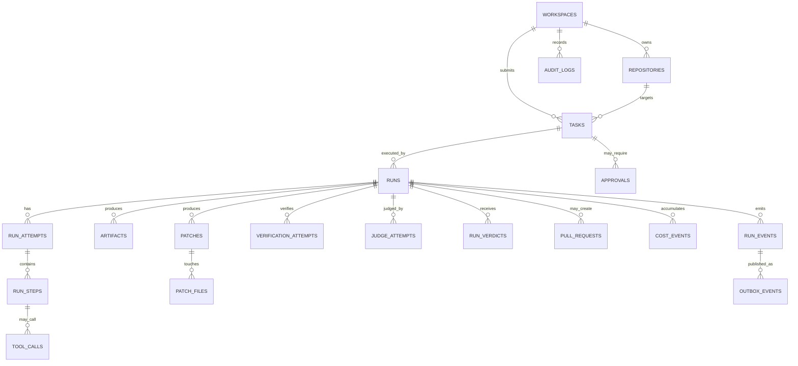
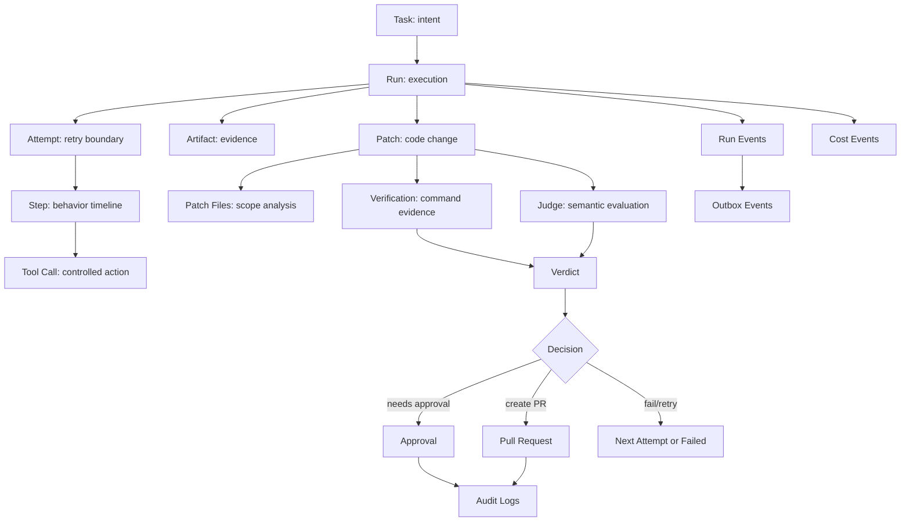

------
title: Learn AI Coding Agent From Scratch - Part 015
description: Database schema untuk Honk-like AI coding agent orchestration: task, run, lease, step, tool call, artifact, patch, verification, judge, approval, PR metadata, audit log, outbox, idempotency, dan retention.
series: learn-ai-coding-agent
seriesTitle: Learn AI Coding Agent From Scratch
order: 15
partTitle: Database Schema: Persistensi Task, Run, Step, Log, Cost, Verdict, PR Metadata
tags:
- ai-coding-agent
- database-schema
- postgresql
- orchestration
- state-machine
- audit-log
- outbox
- idempotency
- observability
- production-grade
date: 2026-07-03
---

# Part 015 — Database Schema: Persistensi Task, Run, Step, Log, Cost, Verdict, PR Metadata

Di part sebelumnya kita sudah membuat API contract. API memberi bentuk luar. State machine memberi aturan transisi. Sekarang kita membuat tulang punggung persistensinya.

Database untuk AI coding agent bukan sekadar tempat menyimpan `tasks`.

Database adalah:

- source of truth untuk lifecycle agent;
- guard agar worker tidak membuat state liar;
- bukti audit saat PR bermasalah;
- tempat idempotency dan retry dijaga;
- dasar observability dan replay;
- batas antara control plane dan execution plane;
- mekanisme agar event tidak hilang;
- fondasi cost accounting;
- fondasi policy enforcement;
- fondasi debugging ketika agent gagal di tengah jalan.

Kalau schema salah, agent terlihat bisa jalan saat demo, tetapi rapuh saat production.

Dalam Honk-like background coding agent, setiap perubahan kode harus bisa dijawab dengan pertanyaan berikut:

```text
Siapa meminta perubahan?
Apa scope-nya?
Repo dan commit mana yang dipakai?
Agent menjalankan langkah apa saja?
Tool apa yang dipanggil?
File apa yang dibaca dan diubah?
Patch apa yang dihasilkan?
Verifier apa yang dijalankan?
Judge memberi verdict apa?
PR dibuat di mana?
Kapan manusia approve atau reject?
Kenapa run berhenti?
Berapa cost-nya?
Apakah proses ini bisa direplay?
```

Schema di part ini dirancang untuk menjawab semua pertanyaan itu.

---

## 1. Prinsip desain schema

Kita tidak mulai dari tabel. Kita mulai dari invariant.

### 1.1 Invariant utama

```text
Task describes intent.
Run executes intent.
Step records agent behavior.
Artifact stores evidence.
Patch represents code change.
Verification proves basic correctness.
Judge evaluates semantic fit.
Verdict decides continuation.
PR exposes change for human review.
Audit log records governance.
Outbox publishes state changes reliably.
```

Kalau invariant ini kabur, schema akan berubah menjadi campuran antara todo list, log table, dan CI dashboard.

### 1.2 Jangan simpan semuanya sebagai JSON

Agent data memang semi-structured. Tetapi bukan berarti semua masuk `jsonb`.

Gunakan kolom typed untuk field yang:

- dipakai query rutin;
- dipakai constraint;
- dipakai join;
- dipakai ordering;
- dipakai filtering;
- menentukan lifecycle;
- menentukan authorization;
- menentukan retention.

Gunakan `jsonb` untuk:

- provider-specific metadata;
- variable tool arguments;
- non-critical diagnostic payload;
- snapshot schema yang sering berubah;
- result payload yang tidak menjadi primary query path.

PostgreSQL mendukung `jsonb` dan berbagai fungsi/operator JSON, tetapi penggunaan JSON tidak menggantikan model relasional untuk invariant inti. PostgreSQL juga mendukung generated columns yang bisa dihitung dari kolom lain dan dapat dipakai untuk membantu query/indexing bila dipakai secara hati-hati.

### 1.3 Append-only untuk perilaku agent

State terkini boleh mutable. Riwayat perilaku agent sebaiknya append-only.

Mutable:

- `tasks.status`
- `runs.status`
- `runs.lease_until`
- `runs.current_attempt_no`
- `pull_requests.status`

Append-only:

- `run_steps`
- `tool_calls`
- `run_events`
- `audit_logs`
- `verification_attempts`
- `judge_attempts`
- `cost_events`
- `outbox_events`

Kenapa?

Karena debugging agent hampir selalu membutuhkan timeline, bukan hanya state terakhir.

---

## 2. ERD konseptual



Perhatikan bentuknya: `run_steps`, `tool_calls`, `artifacts`, `patches`, `verification_attempts`, dan `judge_attempts` bukan detail kecil. Mereka adalah bukti bahwa perubahan kode dilakukan secara terkendali.

---

## 3. Naming convention dan tipe dasar

Kita gunakan PostgreSQL.

Untuk ID, gunakan UUID atau ULID. UUID lebih umum. ULID lebih enak untuk sorting berdasarkan waktu, tetapi membutuhkan extension/library tambahan. Untuk materi ini kita gunakan UUID agar portable.

Kita gunakan:

```sql
CREATE EXTENSION IF NOT EXISTS pgcrypto;
```

Lalu default ID:

```sql
id uuid PRIMARY KEY DEFAULT gen_random_uuid()
```

Tipe waktu:

```sql
created_at timestamptz NOT NULL DEFAULT now(),
updated_at timestamptz NOT NULL DEFAULT now()
```

Gunakan `timestamptz`, bukan `timestamp`, agar event timeline tidak ambigu lintas worker/timezone.

Status field disimpan sebagai `text` dengan `CHECK`, bukan PostgreSQL enum pada tahap awal. Alasannya: state machine agent masih akan berevolusi. PostgreSQL enum bisa dipakai, tetapi migration-nya lebih kaku untuk produk yang cepat berubah.

Contoh:

```sql
status text NOT NULL CHECK (status IN (
  'queued', 'preparing', 'running', 'verifying', 'judging',
  'waiting_approval', 'creating_pr', 'completed', 'failed', 'cancelled'
))
```

---

## 4. Schema namespace

Pisahkan schema database agar jelas boundary-nya.

```sql
CREATE SCHEMA IF NOT EXISTS agent;
```

Untuk contoh, semua tabel berada di schema `agent`.

Dalam production besar, kamu bisa memisahkan:

```text
agent_core      task, run, state
agent_trace     step, tool_call, event
agent_artifact  artifact metadata
agent_policy    policy, approval, audit
agent_billing   cost event
```

Tetapi untuk build from scratch, satu schema cukup.

---

## 5. Workspace dan repository

Agent hampir selalu multi-repo dan sering multi-tenant. Bahkan untuk single team, schema harus siap memisahkan workspace.

### 5.1 Workspaces

```sql
CREATE TABLE agent.workspaces (
  id uuid PRIMARY KEY DEFAULT gen_random_uuid(),
  slug text NOT NULL UNIQUE,
  display_name text NOT NULL,
  status text NOT NULL DEFAULT 'active' CHECK (status IN ('active', 'suspended', 'deleted')),
  policy jsonb NOT NULL DEFAULT '{}'::jsonb,
  created_at timestamptz NOT NULL DEFAULT now(),
  updated_at timestamptz NOT NULL DEFAULT now()
);
```

`policy` di sini bukan policy final. Ini snapshot konfigurasi level workspace, misalnya:

```json
{
  "maxParallelRuns": 20,
  "defaultRiskMode": "supervised_pr",
  "allowAutoPr": false,
  "allowedProviders": ["openai", "anthropic"],
  "networkPolicy": "restricted"
}
```

### 5.2 Repositories

```sql
CREATE TABLE agent.repositories (
  id uuid PRIMARY KEY DEFAULT gen_random_uuid(),
  workspace_id uuid NOT NULL REFERENCES agent.workspaces(id),
  provider text NOT NULL CHECK (provider IN ('github', 'gitlab', 'bitbucket', 'local')),
  external_id text,
  owner text NOT NULL,
  name text NOT NULL,
  default_branch text NOT NULL DEFAULT 'main',
  clone_url text NOT NULL,
  web_url text,
  visibility text NOT NULL DEFAULT 'private' CHECK (visibility IN ('private', 'internal', 'public')),
  repo_policy jsonb NOT NULL DEFAULT '{}'::jsonb,
  last_indexed_commit_sha text,
  last_indexed_at timestamptz,
  created_at timestamptz NOT NULL DEFAULT now(),
  updated_at timestamptz NOT NULL DEFAULT now(),
  UNIQUE (workspace_id, provider, owner, name)
);

CREATE INDEX repositories_workspace_idx ON agent.repositories(workspace_id);
CREATE INDEX repositories_provider_external_idx ON agent.repositories(provider, external_id);
```

`repo_policy` bisa menyimpan hal seperti:

```json
{
  "forbiddenPaths": ["infra/prod/**", ".github/workflows/**"],
  "requiredChecks": ["mvn test", "mvn verify"],
  "approvalRequiredFor": ["dependency_upgrade", "security_sensitive_change"],
  "instructionsFile": "AGENTS.md"
}
```

Jangan hanya menyimpan URL repo di task. Repo adalah entity karena policy, indexing, ownership, dan audit bergantung padanya.

---

## 6. Task table

Task adalah niat perubahan, bukan eksekusi.

Task harus bisa ada tanpa run. Task bisa ditolak sebelum worker mulai. Task juga bisa punya banyak run, misalnya retry, model berbeda, atau re-run setelah policy berubah.

```sql
CREATE TABLE agent.tasks (
  id uuid PRIMARY KEY DEFAULT gen_random_uuid(),
  workspace_id uuid NOT NULL REFERENCES agent.workspaces(id),
  repository_id uuid NOT NULL REFERENCES agent.repositories(id),

  title text NOT NULL,
  description text NOT NULL,
  task_type text NOT NULL CHECK (task_type IN (
    'dependency_upgrade',
    'api_migration',
    'config_migration',
    'schema_migration',
    'test_generation',
    'bug_fix',
    'review_feedback_fix',
    'mechanical_refactor',
    'custom'
  )),

  risk_level text NOT NULL CHECK (risk_level IN ('low', 'medium', 'high', 'critical')),
  execution_mode text NOT NULL CHECK (execution_mode IN (
    'analysis_only',
    'draft_patch',
    'supervised_pr',
    'autonomous_pr',
    'blocked'
  )),

  target_branch text NOT NULL,
  target_commit_sha text,
  scope jsonb NOT NULL DEFAULT '{}'::jsonb,
  constraints jsonb NOT NULL DEFAULT '{}'::jsonb,
  acceptance_criteria jsonb NOT NULL DEFAULT '[]'::jsonb,

  requested_by text NOT NULL,
  source text NOT NULL DEFAULT 'api' CHECK (source IN ('api', 'cli', 'ui', 'webhook', 'scheduled', 'batch')),
  idempotency_key text,

  status text NOT NULL DEFAULT 'submitted' CHECK (status IN (
    'submitted',
    'accepted',
    'rejected',
    'queued',
    'running',
    'completed',
    'failed',
    'cancelled'
  )),

  rejection_reason text,
  metadata jsonb NOT NULL DEFAULT '{}'::jsonb,
  created_at timestamptz NOT NULL DEFAULT now(),
  updated_at timestamptz NOT NULL DEFAULT now(),

  UNIQUE (workspace_id, idempotency_key)
);

CREATE INDEX tasks_workspace_status_idx ON agent.tasks(workspace_id, status, created_at DESC);
CREATE INDEX tasks_repository_idx ON agent.tasks(repository_id, created_at DESC);
CREATE INDEX tasks_type_risk_idx ON agent.tasks(task_type, risk_level, created_at DESC);
```

### 6.1 Kenapa `task_type` typed?

Karena `task_type` menentukan:

- prompt contract;
- allowed tools;
- verification strategy;
- risk policy;
- approval requirement;
- PR template;
- evaluator rubric;
- cost expectation.

Kalau `task_type` disimpan bebas dalam JSON, scheduler dan policy engine sulit membuat keputusan deterministik.

### 6.2 Scope dan constraints

Contoh `scope`:

```json
{
  "includePaths": ["services/billing/**"],
  "excludePaths": ["services/billing/src/main/resources/prod/**"],
  "symbols": ["LegacyInvoiceClient"],
  "maxFilesChanged": 20
}
```

Contoh `constraints`:

```json
{
  "doNotChangePublicApi": true,
  "doNotModifyDatabaseSchema": true,
  "mustPreserveBehavior": true,
  "allowedCommands": ["./mvnw test", "./mvnw -q -DskipITs verify"]
}
```

Contoh `acceptance_criteria`:

```json
[
  {
    "kind": "build_command_passes",
    "command": "./mvnw test"
  },
  {
    "kind": "no_forbidden_path_changed"
  },
  {
    "kind": "diff_matches_intent",
    "description": "Only migrate deprecated API call sites."
  }
]
```

---

## 7. Run table

Run adalah eksekusi konkret terhadap task.

Satu task bisa memiliki beberapa run:

- initial run;
- retry run;
- different model run;
- manual rerun;
- run after reviewer comment;
- run after verifier improvement.

```sql
CREATE TABLE agent.runs (
  id uuid PRIMARY KEY DEFAULT gen_random_uuid(),
  task_id uuid NOT NULL REFERENCES agent.tasks(id),
  workspace_id uuid NOT NULL REFERENCES agent.workspaces(id),
  repository_id uuid NOT NULL REFERENCES agent.repositories(id),

  run_no integer NOT NULL,
  status text NOT NULL CHECK (status IN (
    'queued',
    'preparing',
    'sandbox_allocating',
    'context_loading',
    'planning',
    'running',
    'verifying',
    'judging',
    'waiting_approval',
    'creating_pr',
    'completed',
    'failed',
    'cancelled',
    'timed_out'
  )),

  status_reason text,
  model_profile text NOT NULL,
  agent_version text NOT NULL,
  planner_version text,
  tool_runtime_version text,
  verifier_version text,
  judge_version text,

  base_branch text NOT NULL,
  base_commit_sha text NOT NULL,
  working_branch text,
  sandbox_id text,
  worker_id text,

  lease_owner text,
  lease_until timestamptz,
  heartbeat_at timestamptz,

  max_steps integer NOT NULL DEFAULT 80,
  step_count integer NOT NULL DEFAULT 0,
  max_wall_clock_seconds integer NOT NULL DEFAULT 3600,
  started_at timestamptz,
  completed_at timestamptz,

  final_verdict text CHECK (final_verdict IN (
    'none',
    'success',
    'needs_human_review',
    'failed_verification',
    'failed_judge',
    'policy_blocked',
    'cancelled',
    'timed_out'
  )),

  metadata jsonb NOT NULL DEFAULT '{}'::jsonb,
  created_at timestamptz NOT NULL DEFAULT now(),
  updated_at timestamptz NOT NULL DEFAULT now(),

  UNIQUE (task_id, run_no)
);

CREATE INDEX runs_workspace_status_idx ON agent.runs(workspace_id, status, created_at DESC);
CREATE INDEX runs_task_idx ON agent.runs(task_id, run_no DESC);
CREATE INDEX runs_lease_idx ON agent.runs(status, lease_until) WHERE status IN (
  'preparing', 'sandbox_allocating', 'context_loading', 'planning', 'running', 'verifying', 'judging', 'creating_pr'
);
CREATE INDEX runs_repository_commit_idx ON agent.runs(repository_id, base_commit_sha);
```

### 7.1 `model_profile`, bukan sekadar `model`

Jangan hanya simpan:

```text
model = gpt-x
```

Simpan profile:

```text
model_profile = coding-large-low-temperature-v3
```

Profile bisa memetakan ke:

```json
{
  "provider": "openai",
  "model": "...",
  "temperature": 0.1,
  "maxOutputTokens": 12000,
  "toolChoice": "auto",
  "reasoningEffort": "medium"
}
```

Kenapa? Karena reproducibility agent bergantung pada lebih dari nama model.

### 7.2 Lease untuk distributed worker

Worker tidak boleh mengambil run hanya dengan query sederhana:

```sql
SELECT * FROM runs WHERE status = 'queued' LIMIT 1;
```

Itu race condition.

Gunakan locking pattern:

```sql
WITH candidate AS (
  SELECT id
  FROM agent.runs
  WHERE status = 'queued'
  ORDER BY created_at ASC
  FOR UPDATE SKIP LOCKED
  LIMIT 1
)
UPDATE agent.runs r
SET status = 'preparing',
    lease_owner = :worker_id,
    lease_until = now() + interval '5 minutes',
    heartbeat_at = now(),
    started_at = COALESCE(started_at, now()),
    updated_at = now()
FROM candidate
WHERE r.id = candidate.id
RETURNING r.*;
```

Dengan pattern ini, banyak worker bisa mengambil pekerjaan tanpa memproses run yang sama.

---

## 8. Run attempts

Run bisa memiliki attempt karena verification gagal lalu agent memperbaiki patch.

```sql
CREATE TABLE agent.run_attempts (
  id uuid PRIMARY KEY DEFAULT gen_random_uuid(),
  run_id uuid NOT NULL REFERENCES agent.runs(id),
  attempt_no integer NOT NULL,
  reason text NOT NULL CHECK (reason IN (
    'initial',
    'verification_failed',
    'judge_failed',
    'tool_error',
    'model_retry',
    'manual_retry'
  )),
  started_at timestamptz NOT NULL DEFAULT now(),
  completed_at timestamptz,
  status text NOT NULL DEFAULT 'running' CHECK (status IN ('running', 'completed', 'failed', 'abandoned')),
  summary text,
  metadata jsonb NOT NULL DEFAULT '{}'::jsonb,
  UNIQUE (run_id, attempt_no)
);

CREATE INDEX run_attempts_run_idx ON agent.run_attempts(run_id, attempt_no);
```

Attempt berguna untuk membedakan:

```text
Run 12 attempt 1: agent membuat patch, build gagal.
Run 12 attempt 2: agent memperbaiki compile error, test gagal.
Run 12 attempt 3: agent memperbaiki test, judge pass.
```

Tanpa attempt, timeline menjadi kacau.

---

## 9. Run steps

Step adalah satu unit perilaku agent.

Jangan samakan step dengan tool call. Satu step bisa berupa:

- model reasoning turn;
- planning update;
- tool call;
- tool result observation;
- verifier feedback ingestion;
- patch summary;
- stop decision.

```sql
CREATE TABLE agent.run_steps (
  id uuid PRIMARY KEY DEFAULT gen_random_uuid(),
  run_id uuid NOT NULL REFERENCES agent.runs(id),
  attempt_id uuid REFERENCES agent.run_attempts(id),
  step_no integer NOT NULL,
  step_type text NOT NULL CHECK (step_type IN (
    'system_note',
    'context_loaded',
    'plan_created',
    'plan_updated',
    'model_message',
    'tool_call',
    'tool_result',
    'patch_created',
    'verification_feedback',
    'judge_feedback',
    'decision',
    'error'
  )),
  title text,
  summary text,
  input_ref uuid,
  output_ref uuid,
  token_input integer NOT NULL DEFAULT 0,
  token_output integer NOT NULL DEFAULT 0,
  latency_ms integer,
  created_at timestamptz NOT NULL DEFAULT now(),
  metadata jsonb NOT NULL DEFAULT '{}'::jsonb,
  UNIQUE (run_id, step_no)
);

CREATE INDEX run_steps_run_idx ON agent.run_steps(run_id, step_no);
CREATE INDEX run_steps_attempt_idx ON agent.run_steps(attempt_id, step_no);
CREATE INDEX run_steps_type_idx ON agent.run_steps(step_type, created_at DESC);
```

`input_ref` dan `output_ref` bisa menunjuk ke artifact besar, bukan menyimpan semua prompt/output langsung di table. Ini penting karena prompt dan result bisa sangat besar.

---

## 10. Tool calls

Tool call harus menjadi first-class record.

Mengapa?

Karena sebagian besar risiko agent berada pada tool boundary:

- read file;
- write file;
- run shell;
- search code;
- call MCP server;
- create patch;
- run test;
- create PR.

```sql
CREATE TABLE agent.tool_calls (
  id uuid PRIMARY KEY DEFAULT gen_random_uuid(),
  run_id uuid NOT NULL REFERENCES agent.runs(id),
  step_id uuid REFERENCES agent.run_steps(id),
  attempt_id uuid REFERENCES agent.run_attempts(id),

  tool_name text NOT NULL,
  tool_namespace text NOT NULL DEFAULT 'core',
  call_no integer NOT NULL,
  arguments jsonb NOT NULL DEFAULT '{}'::jsonb,
  arguments_hash text NOT NULL,

  status text NOT NULL DEFAULT 'pending' CHECK (status IN (
    'pending', 'running', 'succeeded', 'failed', 'blocked', 'timed_out', 'cancelled'
  )),

  result_summary text,
  result_ref uuid,
  error_code text,
  error_message text,
  started_at timestamptz,
  completed_at timestamptz,
  latency_ms integer,

  permission_decision text CHECK (permission_decision IN ('allowed', 'denied', 'requires_approval')),
  permission_reason text,

  metadata jsonb NOT NULL DEFAULT '{}'::jsonb,
  created_at timestamptz NOT NULL DEFAULT now(),

  UNIQUE (run_id, call_no)
);

CREATE INDEX tool_calls_run_idx ON agent.tool_calls(run_id, call_no);
CREATE INDEX tool_calls_tool_idx ON agent.tool_calls(tool_namespace, tool_name, created_at DESC);
CREATE INDEX tool_calls_status_idx ON agent.tool_calls(status, created_at DESC);
```

### 10.1 Jangan simpan output shell panjang di row

Shell output bisa ribuan baris. Simpan ringkasannya di `result_summary`, lalu output mentah di artifact.

```text
result_summary: Maven compilation failed in InvoiceServiceTest. 3 errors. First error: method map(...) cannot be applied to given types.
result_ref: artifact id pointing to full log
```

Agent butuh ringkasan. Auditor mungkin butuh log penuh.

---

## 11. Artifacts

Artifact adalah semua bukti besar yang dihasilkan atau dikonsumsi agent.

Contoh:

- prompt snapshot;
- model response;
- command stdout;
- command stderr;
- repository map;
- diff;
- patch file;
- test report;
- coverage report;
- judge rubric;
- screenshot;
- SBOM;
- generated PR body.

```sql
CREATE TABLE agent.artifacts (
  id uuid PRIMARY KEY DEFAULT gen_random_uuid(),
  workspace_id uuid NOT NULL REFERENCES agent.workspaces(id),
  run_id uuid REFERENCES agent.runs(id),
  task_id uuid REFERENCES agent.tasks(id),

  artifact_type text NOT NULL CHECK (artifact_type IN (
    'prompt_snapshot',
    'model_response',
    'tool_output',
    'command_log',
    'repository_map',
    'context_bundle',
    'diff',
    'patch',
    'test_report',
    'verification_report',
    'judge_report',
    'pr_body',
    'audit_attachment',
    'other'
  )),

  storage_backend text NOT NULL CHECK (storage_backend IN ('database', 'object_storage', 'filesystem')),
  storage_key text,
  content_type text NOT NULL DEFAULT 'application/octet-stream',
  byte_size bigint,
  sha256 text,
  redaction_status text NOT NULL DEFAULT 'not_scanned' CHECK (redaction_status IN (
    'not_scanned', 'clean', 'redacted', 'blocked'
  )),
  retention_class text NOT NULL DEFAULT 'standard' CHECK (retention_class IN (
    'short_lived', 'standard', 'audit', 'debug', 'legal_hold'
  )),

  summary text,
  metadata jsonb NOT NULL DEFAULT '{}'::jsonb,
  created_at timestamptz NOT NULL DEFAULT now()
);

CREATE INDEX artifacts_run_idx ON agent.artifacts(run_id, created_at DESC);
CREATE INDEX artifacts_task_idx ON agent.artifacts(task_id, created_at DESC);
CREATE INDEX artifacts_type_idx ON agent.artifacts(artifact_type, created_at DESC);
CREATE INDEX artifacts_sha_idx ON agent.artifacts(sha256);
```

Jika artifact kecil, kamu bisa menyimpan isi langsung:

```sql
CREATE TABLE agent.artifact_blobs (
  artifact_id uuid PRIMARY KEY REFERENCES agent.artifacts(id) ON DELETE CASCADE,
  content bytea NOT NULL
);
```

Tetapi untuk production, artifact besar sebaiknya ke object storage.

---

## 12. Patch dan patch files

Patch adalah perubahan kode yang dihasilkan agent.

Patch harus bisa dianalisis tanpa membaca seluruh diff mentah.

```sql
CREATE TABLE agent.patches (
  id uuid PRIMARY KEY DEFAULT gen_random_uuid(),
  run_id uuid NOT NULL REFERENCES agent.runs(id),
  task_id uuid NOT NULL REFERENCES agent.tasks(id),
  attempt_id uuid REFERENCES agent.run_attempts(id),

  patch_no integer NOT NULL,
  base_commit_sha text NOT NULL,
  head_commit_sha text,
  diff_artifact_id uuid REFERENCES agent.artifacts(id),

  files_changed integer NOT NULL DEFAULT 0,
  lines_added integer NOT NULL DEFAULT 0,
  lines_deleted integer NOT NULL DEFAULT 0,
  generated_by text NOT NULL DEFAULT 'agent',
  status text NOT NULL DEFAULT 'created' CHECK (status IN (
    'created', 'verified', 'rejected', 'superseded', 'published'
  )),

  summary text,
  risk_notes text,
  metadata jsonb NOT NULL DEFAULT '{}'::jsonb,
  created_at timestamptz NOT NULL DEFAULT now(),
  UNIQUE (run_id, patch_no)
);

CREATE INDEX patches_run_idx ON agent.patches(run_id, patch_no DESC);
CREATE INDEX patches_task_idx ON agent.patches(task_id, created_at DESC);
```

Per-file metadata:

```sql
CREATE TABLE agent.patch_files (
  id uuid PRIMARY KEY DEFAULT gen_random_uuid(),
  patch_id uuid NOT NULL REFERENCES agent.patches(id) ON DELETE CASCADE,
  path text NOT NULL,
  old_path text,
  change_type text NOT NULL CHECK (change_type IN (
    'added', 'modified', 'deleted', 'renamed', 'copied'
  )),
  language text,
  lines_added integer NOT NULL DEFAULT 0,
  lines_deleted integer NOT NULL DEFAULT 0,
  is_generated boolean NOT NULL DEFAULT false,
  is_forbidden_path boolean NOT NULL DEFAULT false,
  risk_flags jsonb NOT NULL DEFAULT '[]'::jsonb,
  created_at timestamptz NOT NULL DEFAULT now(),
  UNIQUE (patch_id, path)
);

CREATE INDEX patch_files_path_idx ON agent.patch_files(path);
CREATE INDEX patch_files_generated_idx ON agent.patch_files(is_generated);
CREATE INDEX patch_files_forbidden_idx ON agent.patch_files(is_forbidden_path) WHERE is_forbidden_path = true;
```

### 12.1 Kenapa `patch_files` penting?

Karena policy sering bergantung pada file path:

```text
Agent boleh mengubah src/main/java/**
Agent tidak boleh mengubah .github/workflows/**
Agent tidak boleh mengubah infra/prod/**
Agent boleh mengubah pom.xml hanya untuk dependency upgrade
Agent boleh mengubah lockfile hanya jika package manifest berubah
```

Tanpa `patch_files`, policy harus parsing diff berulang kali.

---

## 13. Verification attempts

Verifier bukan boolean.

Verifier adalah proses yang menghasilkan bukti.

```sql
CREATE TABLE agent.verification_attempts (
  id uuid PRIMARY KEY DEFAULT gen_random_uuid(),
  run_id uuid NOT NULL REFERENCES agent.runs(id),
  patch_id uuid REFERENCES agent.patches(id),
  attempt_id uuid REFERENCES agent.run_attempts(id),

  verifier_name text NOT NULL,
  verifier_version text NOT NULL,
  command text,
  status text NOT NULL CHECK (status IN (
    'queued', 'running', 'passed', 'failed', 'errored', 'timed_out', 'skipped'
  )),

  started_at timestamptz,
  completed_at timestamptz,
  duration_ms integer,
  exit_code integer,
  report_artifact_id uuid REFERENCES agent.artifacts(id),

  failure_category text CHECK (failure_category IN (
    'compile_error',
    'test_failure',
    'lint_failure',
    'format_failure',
    'policy_failure',
    'environment_failure',
    'timeout',
    'unknown'
  )),
  summary text,
  metadata jsonb NOT NULL DEFAULT '{}'::jsonb,
  created_at timestamptz NOT NULL DEFAULT now()
);

CREATE INDEX verification_run_idx ON agent.verification_attempts(run_id, created_at DESC);
CREATE INDEX verification_patch_idx ON agent.verification_attempts(patch_id, created_at DESC);
CREATE INDEX verification_status_idx ON agent.verification_attempts(status, created_at DESC);
```

### 13.1 Banyak verifier, bukan satu

Contoh verifier:

```text
format-check
lint
compile
unit-test
integration-test
static-analysis
secret-scan
license-check
forbidden-path-check
api-compatibility-check
```

Simpan tiap verifier sebagai record terpisah agar bisa menjawab:

```text
Apakah patch gagal karena test?
Atau karena environment?
Atau karena policy?
Atau karena secret scan?
```

---

## 14. Judge attempts

Verifier menjawab: “apakah command/check pass?”

Judge menjawab: “apakah patch ini memenuhi intent dan tidak overreach?”

Judge bisa deterministic atau LLM-based. Keduanya harus tercatat.

```sql
CREATE TABLE agent.judge_attempts (
  id uuid PRIMARY KEY DEFAULT gen_random_uuid(),
  run_id uuid NOT NULL REFERENCES agent.runs(id),
  patch_id uuid REFERENCES agent.patches(id),
  attempt_id uuid REFERENCES agent.run_attempts(id),

  judge_name text NOT NULL,
  judge_version text NOT NULL,
  judge_type text NOT NULL CHECK (judge_type IN ('deterministic', 'llm', 'human_assisted')),
  status text NOT NULL CHECK (status IN ('running', 'passed', 'failed', 'errored', 'skipped')),

  score numeric(5,2),
  verdict text CHECK (verdict IN (
    'pass',
    'fail',
    'needs_human_review',
    'policy_blocked',
    'inconclusive'
  )),
  rubric jsonb NOT NULL DEFAULT '{}'::jsonb,
  findings jsonb NOT NULL DEFAULT '[]'::jsonb,
  report_artifact_id uuid REFERENCES agent.artifacts(id),

  started_at timestamptz NOT NULL DEFAULT now(),
  completed_at timestamptz,
  metadata jsonb NOT NULL DEFAULT '{}'::jsonb
);

CREATE INDEX judge_run_idx ON agent.judge_attempts(run_id, started_at DESC);
CREATE INDEX judge_patch_idx ON agent.judge_attempts(patch_id, started_at DESC);
CREATE INDEX judge_verdict_idx ON agent.judge_attempts(verdict, started_at DESC);
```

Contoh findings:

```json
[
  {
    "severity": "medium",
    "category": "scope_overreach",
    "path": "README.md",
    "message": "Patch modifies documentation not requested by the task."
  },
  {
    "severity": "high",
    "category": "semantic_risk",
    "path": "src/main/java/com/acme/billing/InvoiceMapper.java",
    "message": "Mapping changed from amountGross to amountNet without acceptance criteria."
  }
]
```

---

## 15. Run verdicts

Verdict adalah keputusan lifecycle, bukan sekadar judge result.

Satu run bisa memiliki beberapa intermediate verdict:

- continue;
- retry with feedback;
- request approval;
- create PR;
- stop failed;
- stop cancelled.

```sql
CREATE TABLE agent.run_verdicts (
  id uuid PRIMARY KEY DEFAULT gen_random_uuid(),
  run_id uuid NOT NULL REFERENCES agent.runs(id),
  patch_id uuid REFERENCES agent.patches(id),
  verdict_type text NOT NULL CHECK (verdict_type IN (
    'continue',
    'retry_with_feedback',
    'request_approval',
    'create_pr',
    'complete_without_pr',
    'fail',
    'cancel'
  )),
  reason text NOT NULL,
  decided_by text NOT NULL CHECK (decided_by IN ('orchestrator', 'policy', 'verifier', 'judge', 'human', 'system')),
  evidence jsonb NOT NULL DEFAULT '{}'::jsonb,
  created_at timestamptz NOT NULL DEFAULT now()
);

CREATE INDEX run_verdicts_run_idx ON agent.run_verdicts(run_id, created_at DESC);
```

Verdict table membantu menjelaskan mengapa run berpindah state.

```text
Status says what happened.
Verdict explains why it happened.
```

---

## 16. Approvals

Human approval harus menjadi data model, bukan komentar Slack yang hilang.

```sql
CREATE TABLE agent.approvals (
  id uuid PRIMARY KEY DEFAULT gen_random_uuid(),
  workspace_id uuid NOT NULL REFERENCES agent.workspaces(id),
  task_id uuid REFERENCES agent.tasks(id),
  run_id uuid REFERENCES agent.runs(id),
  patch_id uuid REFERENCES agent.patches(id),

  approval_type text NOT NULL CHECK (approval_type IN (
    'run_start',
    'tool_permission',
    'network_access',
    'write_permission',
    'pr_creation',
    'policy_override'
  )),

  status text NOT NULL DEFAULT 'pending' CHECK (status IN (
    'pending', 'approved', 'rejected', 'expired', 'cancelled'
  )),

  requested_by text NOT NULL,
  requested_reason text NOT NULL,
  decided_by text,
  decision_reason text,
  expires_at timestamptz,
  decided_at timestamptz,
  metadata jsonb NOT NULL DEFAULT '{}'::jsonb,
  created_at timestamptz NOT NULL DEFAULT now()
);

CREATE INDEX approvals_workspace_status_idx ON agent.approvals(workspace_id, status, created_at DESC);
CREATE INDEX approvals_run_idx ON agent.approvals(run_id, created_at DESC);
```

Contoh approval request:

```json
{
  "tool": "shell.exec",
  "command": "./mvnw versions:use-latest-releases",
  "risk": "may modify many dependency versions",
  "requestedScope": ["pom.xml"]
}
```

---

## 17. Pull request metadata

PR bukan akhir sistem, tetapi artifact eksternal yang harus dilacak.

```sql
CREATE TABLE agent.pull_requests (
  id uuid PRIMARY KEY DEFAULT gen_random_uuid(),
  workspace_id uuid NOT NULL REFERENCES agent.workspaces(id),
  repository_id uuid NOT NULL REFERENCES agent.repositories(id),
  task_id uuid NOT NULL REFERENCES agent.tasks(id),
  run_id uuid NOT NULL REFERENCES agent.runs(id),
  patch_id uuid REFERENCES agent.patches(id),

  provider text NOT NULL CHECK (provider IN ('github', 'gitlab', 'bitbucket')),
  external_id text NOT NULL,
  number integer,
  url text NOT NULL,
  title text NOT NULL,
  body_artifact_id uuid REFERENCES agent.artifacts(id),

  source_branch text NOT NULL,
  target_branch text NOT NULL,
  head_commit_sha text,

  status text NOT NULL CHECK (status IN (
    'open', 'draft', 'ready_for_review', 'merged', 'closed', 'unknown'
  )),
  merge_commit_sha text,
  created_by_agent boolean NOT NULL DEFAULT true,
  created_at_external timestamptz,
  merged_at timestamptz,
  closed_at timestamptz,

  metadata jsonb NOT NULL DEFAULT '{}'::jsonb,
  created_at timestamptz NOT NULL DEFAULT now(),
  updated_at timestamptz NOT NULL DEFAULT now(),

  UNIQUE (provider, repository_id, external_id)
);

CREATE INDEX pull_requests_task_idx ON agent.pull_requests(task_id, created_at DESC);
CREATE INDEX pull_requests_run_idx ON agent.pull_requests(run_id, created_at DESC);
CREATE INDEX pull_requests_status_idx ON agent.pull_requests(status, created_at DESC);
```

Jangan mengandalkan provider sebagai source of truth tunggal. Provider bisa unavailable, webhook bisa terlambat, dan PR bisa berubah di luar agent. Simpan metadata lokal dan sinkronisasi secara periodik.

---

## 18. Cost events

Cost harus ditrack sebagai event, bukan hanya aggregate.

```sql
CREATE TABLE agent.cost_events (
  id uuid PRIMARY KEY DEFAULT gen_random_uuid(),
  workspace_id uuid NOT NULL REFERENCES agent.workspaces(id),
  task_id uuid REFERENCES agent.tasks(id),
  run_id uuid REFERENCES agent.runs(id),
  step_id uuid REFERENCES agent.run_steps(id),
  tool_call_id uuid REFERENCES agent.tool_calls(id),

  provider text NOT NULL,
  model text,
  cost_type text NOT NULL CHECK (cost_type IN (
    'llm_input_tokens',
    'llm_output_tokens',
    'tool_runtime_seconds',
    'sandbox_seconds',
    'storage_bytes',
    'network_egress',
    'other'
  )),

  quantity numeric(18,6) NOT NULL,
  unit text NOT NULL,
  estimated_cost_usd numeric(18,8),
  occurred_at timestamptz NOT NULL DEFAULT now(),
  metadata jsonb NOT NULL DEFAULT '{}'::jsonb
);

CREATE INDEX cost_workspace_time_idx ON agent.cost_events(workspace_id, occurred_at DESC);
CREATE INDEX cost_run_idx ON agent.cost_events(run_id, occurred_at DESC);
```

Aggregate view:

```sql
CREATE VIEW agent.run_cost_summary AS
SELECT
  run_id,
  SUM(estimated_cost_usd) AS estimated_cost_usd,
  SUM(CASE WHEN cost_type = 'llm_input_tokens' THEN quantity ELSE 0 END) AS input_tokens,
  SUM(CASE WHEN cost_type = 'llm_output_tokens' THEN quantity ELSE 0 END) AS output_tokens
FROM agent.cost_events
WHERE run_id IS NOT NULL
GROUP BY run_id;
```

Cost bukan masalah finance saja. Cost adalah safety signal.

Agent yang loop terlalu lama biasanya terlihat dari:

```text
high token usage + repeated verifier failure + no patch improvement
```

---

## 19. Run events

Run events adalah event internal append-only untuk timeline.

```sql
CREATE TABLE agent.run_events (
  id uuid PRIMARY KEY DEFAULT gen_random_uuid(),
  workspace_id uuid NOT NULL REFERENCES agent.workspaces(id),
  task_id uuid REFERENCES agent.tasks(id),
  run_id uuid REFERENCES agent.runs(id),

  event_type text NOT NULL,
  event_version integer NOT NULL DEFAULT 1,
  sequence_no bigint,
  actor_type text NOT NULL CHECK (actor_type IN ('user', 'system', 'worker', 'agent', 'verifier', 'judge', 'policy', 'webhook')),
  actor_id text,
  payload jsonb NOT NULL DEFAULT '{}'::jsonb,
  occurred_at timestamptz NOT NULL DEFAULT now(),
  created_at timestamptz NOT NULL DEFAULT now()
);

CREATE INDEX run_events_run_idx ON agent.run_events(run_id, occurred_at ASC);
CREATE INDEX run_events_task_idx ON agent.run_events(task_id, occurred_at ASC);
CREATE INDEX run_events_type_idx ON agent.run_events(event_type, occurred_at DESC);
```

Contoh event:

```json
{
  "event_type": "agent.tool_call.completed",
  "payload": {
    "toolName": "shell.exec",
    "status": "failed",
    "exitCode": 1,
    "summary": "Maven compile failed with 3 errors"
  }
}
```

Run events bisa dipakai untuk:

- UI timeline;
- audit reconstruction;
- troubleshooting;
- event publishing;
- replay;
- metric derivation.

---

## 20. Audit logs

Audit log berbeda dari run event.

Run event menjelaskan lifecycle teknis. Audit log menjelaskan tindakan governance/security.

```sql
CREATE TABLE agent.audit_logs (
  id uuid PRIMARY KEY DEFAULT gen_random_uuid(),
  workspace_id uuid NOT NULL REFERENCES agent.workspaces(id),
  actor_type text NOT NULL CHECK (actor_type IN ('user', 'service_account', 'worker', 'system')),
  actor_id text NOT NULL,
  action text NOT NULL,
  resource_type text NOT NULL,
  resource_id uuid,
  decision text CHECK (decision IN ('allowed', 'denied', 'approved', 'rejected', 'blocked')),
  reason text,
  ip_address inet,
  user_agent text,
  metadata jsonb NOT NULL DEFAULT '{}'::jsonb,
  occurred_at timestamptz NOT NULL DEFAULT now()
);

CREATE INDEX audit_workspace_time_idx ON agent.audit_logs(workspace_id, occurred_at DESC);
CREATE INDEX audit_actor_idx ON agent.audit_logs(actor_id, occurred_at DESC);
CREATE INDEX audit_resource_idx ON agent.audit_logs(resource_type, resource_id, occurred_at DESC);
```

Contoh audit actions:

```text
task.submit
task.reject
run.cancel
approval.approve
approval.reject
policy.override
tool.permission.deny
pr.create
secret.redact
artifact.read
```

---

## 21. Idempotency keys

Agent platform akan menerima retry dari CLI, UI, webhook, dan scheduler. Tanpa idempotency, task bisa dobel.

```sql
CREATE TABLE agent.idempotency_records (
  id uuid PRIMARY KEY DEFAULT gen_random_uuid(),
  workspace_id uuid NOT NULL REFERENCES agent.workspaces(id),
  idempotency_key text NOT NULL,
  request_hash text NOT NULL,
  resource_type text NOT NULL,
  resource_id uuid NOT NULL,
  response_status integer NOT NULL,
  response_body jsonb,
  expires_at timestamptz NOT NULL,
  created_at timestamptz NOT NULL DEFAULT now(),
  UNIQUE (workspace_id, idempotency_key)
);

CREATE INDEX idempotency_expires_idx ON agent.idempotency_records(expires_at);
```

Rule:

```text
Same idempotency key + same request hash  -> return same result
Same idempotency key + different hash     -> 409 Conflict
Expired key                               -> can be reused only after retention policy
```

---

## 22. Outbox events

Jika database update dan event publish dilakukan terpisah, kamu punya dual-write problem.

Contoh buruk:

```text
1. UPDATE runs SET status = 'completed'
2. Publish RunCompleted to broker
```

Kalau proses mati setelah step 1 sebelum step 2, database completed tetapi event tidak pernah keluar.

Transactional outbox menyelesaikan ini dengan menyimpan event di database yang sama dalam transaksi yang sama, lalu publisher async mengirim ke broker.

```sql
CREATE TABLE agent.outbox_events (
  id uuid PRIMARY KEY DEFAULT gen_random_uuid(),
  aggregate_type text NOT NULL,
  aggregate_id uuid NOT NULL,
  event_type text NOT NULL,
  event_version integer NOT NULL DEFAULT 1,
  payload jsonb NOT NULL,
  headers jsonb NOT NULL DEFAULT '{}'::jsonb,

  status text NOT NULL DEFAULT 'pending' CHECK (status IN (
    'pending', 'publishing', 'published', 'failed', 'dead_letter'
  )),
  attempts integer NOT NULL DEFAULT 0,
  next_attempt_at timestamptz NOT NULL DEFAULT now(),
  published_at timestamptz,
  last_error text,

  created_at timestamptz NOT NULL DEFAULT now(),
  updated_at timestamptz NOT NULL DEFAULT now()
);

CREATE INDEX outbox_pending_idx ON agent.outbox_events(status, next_attempt_at, created_at)
WHERE status IN ('pending', 'failed');
CREATE INDEX outbox_aggregate_idx ON agent.outbox_events(aggregate_type, aggregate_id, created_at);
```

Transaction example:

```sql
BEGIN;

UPDATE agent.runs
SET status = 'verifying', updated_at = now()
WHERE id = :run_id;

INSERT INTO agent.run_events (
  workspace_id, task_id, run_id, event_type, actor_type, payload
)
VALUES (
  :workspace_id,
  :task_id,
  :run_id,
  'run.verification.started',
  'worker',
  jsonb_build_object('verifier', 'maven-test')
);

INSERT INTO agent.outbox_events (
  aggregate_type, aggregate_id, event_type, payload
)
VALUES (
  'run',
  :run_id,
  'run.verification.started',
  jsonb_build_object('runId', :run_id, 'taskId', :task_id)
);

COMMIT;
```

Outbox publisher:

```sql
WITH batch AS (
  SELECT id
  FROM agent.outbox_events
  WHERE status IN ('pending', 'failed')
    AND next_attempt_at <= now()
  ORDER BY created_at ASC
  FOR UPDATE SKIP LOCKED
  LIMIT 100
)
UPDATE agent.outbox_events e
SET status = 'publishing',
    attempts = attempts + 1,
    updated_at = now()
FROM batch
WHERE e.id = batch.id
RETURNING e.*;
```

---

## 23. Transition function pattern

Jangan biarkan semua service mengupdate `runs.status` langsung.

Buat function atau service boundary:

```sql
CREATE TABLE agent.run_transition_rules (
  from_status text NOT NULL,
  to_status text NOT NULL,
  reason text,
  PRIMARY KEY (from_status, to_status)
);
```

Seed:

```sql
INSERT INTO agent.run_transition_rules (from_status, to_status, reason) VALUES
('queued', 'preparing', 'worker acquired run'),
('preparing', 'sandbox_allocating', 'sandbox allocation starts'),
('sandbox_allocating', 'context_loading', 'sandbox ready'),
('context_loading', 'planning', 'context loaded'),
('planning', 'running', 'plan accepted'),
('running', 'verifying', 'patch generated'),
('verifying', 'judging', 'verification passed'),
('judging', 'waiting_approval', 'human approval required'),
('judging', 'creating_pr', 'judge passed and PR allowed'),
('creating_pr', 'completed', 'PR created'),
('running', 'failed', 'agent failed'),
('verifying', 'failed', 'verification failed with no retry'),
('judging', 'failed', 'judge failed with no retry');
```

Application-level transition function:

```text
transitionRun(runId, expectedCurrentStatus, nextStatus, actor, reason, payload)
```

Itu harus:

1. lock run row;
2. validate current status;
3. validate transition rule;
4. update run;
5. insert run_event;
6. insert audit log jika governance action;
7. insert outbox event;
8. commit.

Pseudo-code:

```java
@Transactional
public Run transitionRun(TransitionCommand cmd) {
    Run run = runRepository.lockById(cmd.runId());

    if (!run.status().equals(cmd.expectedStatus())) {
        throw new ConflictException("Run status changed");
    }

    if (!transitionRules.isAllowed(run.status(), cmd.nextStatus())) {
        throw new InvalidTransitionException(run.status(), cmd.nextStatus());
    }

    run.transitionTo(cmd.nextStatus(), cmd.reason());
    runEvents.append(RunEvent.from(cmd));
    outbox.append(OutboxEvent.from(cmd));

    return runRepository.save(run);
}
```

---

## 24. Query patterns yang harus cepat

Schema bagus bukan hanya normal. Schema harus mendukung pertanyaan production.

### 24.1 Dashboard active runs

```sql
SELECT id, task_id, status, worker_id, lease_until, heartbeat_at, created_at
FROM agent.runs
WHERE workspace_id = :workspace_id
  AND status IN ('queued', 'preparing', 'running', 'verifying', 'judging', 'creating_pr')
ORDER BY created_at DESC
LIMIT 100;
```

### 24.2 Run timeline

```sql
SELECT event_type, actor_type, payload, occurred_at
FROM agent.run_events
WHERE run_id = :run_id
ORDER BY occurred_at ASC;
```

### 24.3 Tool failure hotspots

```sql
SELECT tool_namespace, tool_name, error_code, COUNT(*) AS failures
FROM agent.tool_calls
WHERE status IN ('failed', 'timed_out', 'blocked')
  AND created_at >= now() - interval '7 days'
GROUP BY tool_namespace, tool_name, error_code
ORDER BY failures DESC;
```

### 24.4 Verification failure categories

```sql
SELECT failure_category, COUNT(*) AS count
FROM agent.verification_attempts
WHERE status = 'failed'
  AND created_at >= now() - interval '7 days'
GROUP BY failure_category
ORDER BY count DESC;
```

### 24.5 Cost per task type

```sql
SELECT t.task_type, SUM(c.estimated_cost_usd) AS cost
FROM agent.cost_events c
JOIN agent.tasks t ON t.id = c.task_id
WHERE c.occurred_at >= now() - interval '30 days'
GROUP BY t.task_type
ORDER BY cost DESC;
```

---

## 25. Materialized views untuk reporting

Untuk dashboard berat, jangan query timeline mentah terus-menerus.

```sql
CREATE MATERIALIZED VIEW agent.daily_run_metrics AS
SELECT
  workspace_id,
  date_trunc('day', created_at) AS day,
  COUNT(*) AS runs_total,
  COUNT(*) FILTER (WHERE final_verdict = 'success') AS runs_success,
  COUNT(*) FILTER (WHERE final_verdict = 'failed_verification') AS runs_failed_verification,
  COUNT(*) FILTER (WHERE final_verdict = 'failed_judge') AS runs_failed_judge,
  AVG(EXTRACT(EPOCH FROM (completed_at - started_at))) AS avg_duration_seconds
FROM agent.runs
WHERE created_at >= now() - interval '90 days'
GROUP BY workspace_id, date_trunc('day', created_at);
```

Refresh via scheduled job:

```sql
REFRESH MATERIALIZED VIEW CONCURRENTLY agent.daily_run_metrics;
```

Untuk `CONCURRENTLY`, view perlu unique index.

---

## 26. Retention policy

Agent menghasilkan banyak data. Tanpa retention, database akan membengkak.

Classify:

| Data | Retention awal | Catatan |
|---|---:|---|
| task/run metadata | 1-3 tahun | perlu audit dan reporting |
| run_events | 6-12 bulan | bisa diarsipkan ke object storage |
| tool_calls | 6-12 bulan | penting untuk debugging |
| prompt/model response | 30-180 hari | sensitif, mahal, perlu redaction |
| command logs | 30-180 hari | tergantung compliance |
| artifacts diff/patch | 1-3 tahun | bukti PR/change |
| audit_logs | 3-7 tahun | tergantung governance |
| cost_events | 1-3 tahun | reporting/budget |
| outbox published | 7-30 hari | setelah publish sukses bisa dipangkas |

Retention bukan delete sembarang. Gunakan state:

```text
active -> archived -> deleted
```

Untuk artifact sensitif:

```text
raw -> redacted -> archived
```

---

## 27. Partitioning

Tabel yang akan tumbuh cepat:

- `run_events`
- `tool_calls`
- `cost_events`
- `audit_logs`
- `outbox_events`

Untuk awal, index cukup. Untuk skala besar, gunakan partition by time.

Contoh:

```sql
CREATE TABLE agent.run_events_partitioned (
  id uuid NOT NULL DEFAULT gen_random_uuid(),
  workspace_id uuid NOT NULL,
  task_id uuid,
  run_id uuid,
  event_type text NOT NULL,
  event_version integer NOT NULL DEFAULT 1,
  actor_type text NOT NULL,
  actor_id text,
  payload jsonb NOT NULL DEFAULT '{}'::jsonb,
  occurred_at timestamptz NOT NULL DEFAULT now(),
  created_at timestamptz NOT NULL DEFAULT now(),
  PRIMARY KEY (id, occurred_at)
) PARTITION BY RANGE (occurred_at);
```

Monthly partition:

```sql
CREATE TABLE agent.run_events_2026_07
PARTITION OF agent.run_events_partitioned
FOR VALUES FROM ('2026-07-01') TO ('2026-08-01');
```

Jangan mulai dengan partitioning jika belum perlu. Tetapi desain query dan retention harus siap.

---

## 28. Security dan redaction fields

Agent data bisa mengandung rahasia:

- environment variable;
- token di log;
- credential di config;
- internal URL;
- customer data;
- private source code;
- model prompt berisi instruksi rahasia.

Tambahkan redaction metadata pada artifact dan log.

```sql
CREATE TABLE agent.redaction_findings (
  id uuid PRIMARY KEY DEFAULT gen_random_uuid(),
  workspace_id uuid NOT NULL REFERENCES agent.workspaces(id),
  artifact_id uuid REFERENCES agent.artifacts(id),
  run_id uuid REFERENCES agent.runs(id),
  finding_type text NOT NULL CHECK (finding_type IN (
    'secret', 'token', 'private_key', 'password', 'pii', 'internal_url', 'unknown'
  )),
  severity text NOT NULL CHECK (severity IN ('low', 'medium', 'high', 'critical')),
  detector text NOT NULL,
  location jsonb NOT NULL DEFAULT '{}'::jsonb,
  status text NOT NULL DEFAULT 'open' CHECK (status IN ('open', 'redacted', 'false_positive', 'accepted_risk')),
  created_at timestamptz NOT NULL DEFAULT now()
);

CREATE INDEX redaction_artifact_idx ON agent.redaction_findings(artifact_id);
CREATE INDEX redaction_status_idx ON agent.redaction_findings(status, severity, created_at DESC);
```

Important invariant:

```text
Artifact with redaction_status = blocked must not be exposed to model, UI, or PR body.
```

---

## 29. Migration strategy

Gunakan migration tool seperti Flyway, Liquibase, Atlas, atau plain SQL migration.

Folder:

```text
infra/db/migrations/
  V001__create_agent_schema.sql
  V002__create_workspace_repository.sql
  V003__create_task_run.sql
  V004__create_steps_tools_artifacts.sql
  V005__create_patch_verification_judge.sql
  V006__create_pr_approval_audit.sql
  V007__create_outbox_idempotency.sql
```

Rule migration:

```text
Never edit applied migration.
Add forward migration.
Prefer additive changes.
Backfill in batches.
Do not add NOT NULL without default/backfill plan.
Do not create large indexes without considering lock impact.
```

Untuk production PostgreSQL, perubahan schema besar perlu dirancang agar tidak mengunci tabel terlalu lama.

---

## 30. Minimal seed data untuk local development

```sql
INSERT INTO agent.workspaces (slug, display_name)
VALUES ('local', 'Local Development')
ON CONFLICT (slug) DO NOTHING;

INSERT INTO agent.repositories (
  workspace_id,
  provider,
  owner,
  name,
  default_branch,
  clone_url,
  visibility
)
SELECT
  w.id,
  'local',
  'acme',
  'sample-java-service',
  'main',
  'file:///workspace/sample-java-service',
  'private'
FROM agent.workspaces w
WHERE w.slug = 'local'
ON CONFLICT DO NOTHING;
```

Test task:

```sql
INSERT INTO agent.tasks (
  workspace_id,
  repository_id,
  title,
  description,
  task_type,
  risk_level,
  execution_mode,
  target_branch,
  requested_by,
  scope,
  acceptance_criteria
)
SELECT
  w.id,
  r.id,
  'Replace deprecated LegacyClock usage',
  'Migrate LegacyClock.now() call sites to TimeProvider.now() in billing module only.',
  'api_migration',
  'medium',
  'supervised_pr',
  'main',
  'local-user',
  '{"includePaths":["src/main/java/com/acme/billing/**"],"maxFilesChanged":10}'::jsonb,
  '[{"kind":"build_command_passes","command":"./mvnw test"}]'::jsonb
FROM agent.workspaces w
JOIN agent.repositories r ON r.workspace_id = w.id
WHERE w.slug = 'local'
  AND r.name = 'sample-java-service';
```

---

## 31. Anti-pattern schema agent

### Anti-pattern 1: One giant `runs` JSON blob

```sql
CREATE TABLE runs (
  id uuid,
  payload jsonb
);
```

Ini terlihat fleksibel. Tetapi kamu kehilangan:

- constraint;
- queryability;
- audit clarity;
- index strategy;
- compatibility control;
- state transition enforcement.

### Anti-pattern 2: Log-only architecture

Semua disimpan sebagai log event tanpa current state.

Masalah:

- dashboard lambat;
- scheduler sulit;
- worker lease sulit;
- cancellation sulit;
- query active runs mahal.

Event log bagus. Tetapi tetap butuh aggregate state.

### Anti-pattern 3: PR sebagai source of truth

Mengandalkan GitHub/GitLab PR untuk mengetahui status run.

Masalah:

- webhook bisa terlambat;
- PR bisa diedit manusia;
- branch bisa dihapus;
- provider outage;
- metadata agent hilang;
- timeline internal tidak lengkap.

### Anti-pattern 4: Tidak menyimpan base commit

Tanpa `base_commit_sha`, patch tidak reproducible.

### Anti-pattern 5: Tidak menyimpan verifier version

Kalau verifier berubah, hasil lama dan hasil baru tidak bisa dibandingkan.

### Anti-pattern 6: Tidak memisahkan verifier dan judge

Build pass bukan berarti perubahan benar.

### Anti-pattern 7: Tidak ada outbox

Status update sukses tetapi event publish gagal. Sistem downstream kehilangan event.

---

## 32. Mental model schema final



Satu kalimat:

```text
Database schema untuk coding agent harus menyimpan bukan hanya hasil akhir, tetapi jejak keputusan yang membuat hasil itu layak dipercaya.
```

---

## 33. Checklist implementasi Part 015

Gunakan checklist ini sebelum lanjut:

- [ ] Ada schema `agent`.
- [ ] Ada `workspaces` dan `repositories`.
- [ ] Ada `tasks` sebagai intent.
- [ ] Ada `runs` sebagai execution.
- [ ] Ada `run_attempts` untuk retry loop.
- [ ] Ada `run_steps` untuk timeline agent.
- [ ] Ada `tool_calls` untuk tool boundary.
- [ ] Ada `artifacts` untuk evidence besar.
- [ ] Ada `patches` dan `patch_files`.
- [ ] Ada `verification_attempts`.
- [ ] Ada `judge_attempts`.
- [ ] Ada `run_verdicts`.
- [ ] Ada `approvals`.
- [ ] Ada `pull_requests`.
- [ ] Ada `cost_events`.
- [ ] Ada `run_events`.
- [ ] Ada `audit_logs`.
- [ ] Ada `idempotency_records`.
- [ ] Ada `outbox_events`.
- [ ] Ada lease query dengan `FOR UPDATE SKIP LOCKED`.
- [ ] Ada transition boundary di service/function.
- [ ] Ada retention policy.
- [ ] Ada redaction metadata.

---

## 34. Apa yang sengaja belum kita bahas?

Kita belum membahas:

- event taxonomy detail;
- event versioning;
- broker topic design;
- event replay;
- async worker orchestration;
- API callback/webhook;
- distributed saga untuk sandbox/PR;
- failure compensation.

Itu masuk Part 016.

---

## 35. Ringkasan

Di part ini kita membangun database schema untuk AI coding agent yang production-grade.

Intinya:

- task adalah intent;
- run adalah execution;
- step adalah behavior timeline;
- tool call adalah controlled action;
- artifact adalah evidence;
- patch adalah code change;
- verification adalah proof dari command/check;
- judge adalah evaluasi semantic fit;
- verdict adalah keputusan lifecycle;
- PR adalah publikasi eksternal;
- audit log adalah bukti governance;
- outbox menjaga event tidak hilang;
- idempotency menjaga retry tidak menggandakan task;
- lease menjaga worker tidak memproses run yang sama;
- retention menjaga sistem tidak tenggelam oleh log sendiri.

Database bukan storage pasif. Untuk Honk-like AI coding agent, database adalah control surface.

Part berikutnya akan membahas event model dan asynchronous orchestration.

---

## References

- PostgreSQL Documentation — JSON Types: https://www.postgresql.org/docs/current/datatype-json.html
- PostgreSQL Documentation — Generated Columns: https://www.postgresql.org/docs/current/ddl-generated-columns.html
- Microservices.io — Transactional Outbox Pattern: https://microservices.io/patterns/data/transactional-outbox.html
- CloudEvents Specification: https://github.com/cloudevents/spec
- AsyncAPI Initiative: https://www.asyncapi.com/
