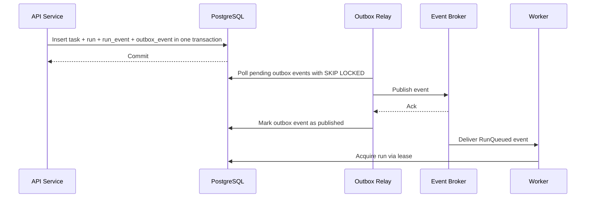
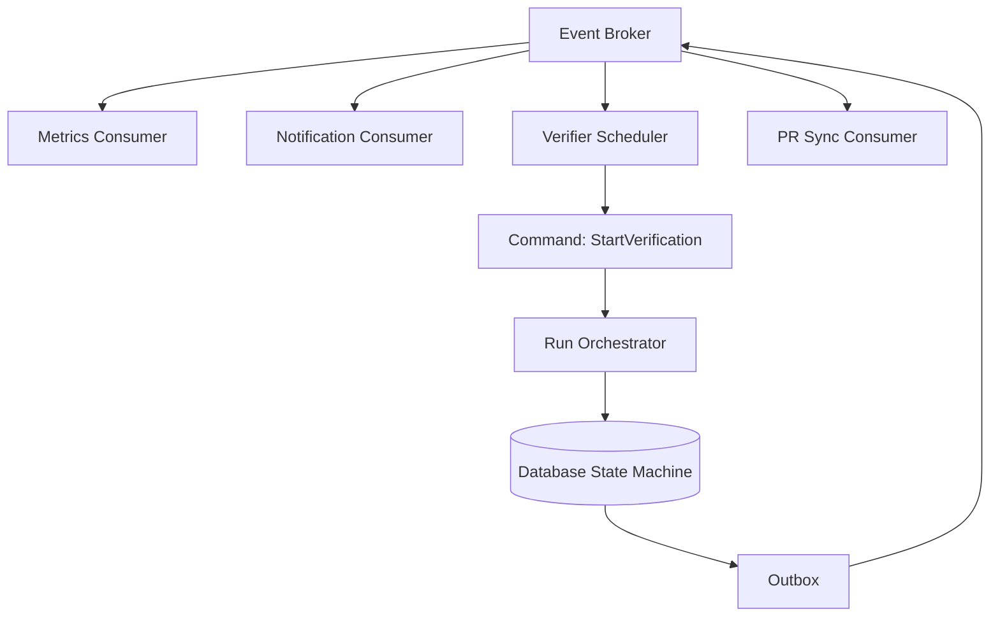
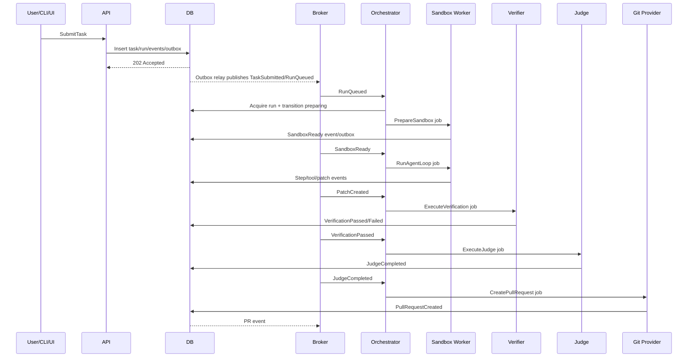
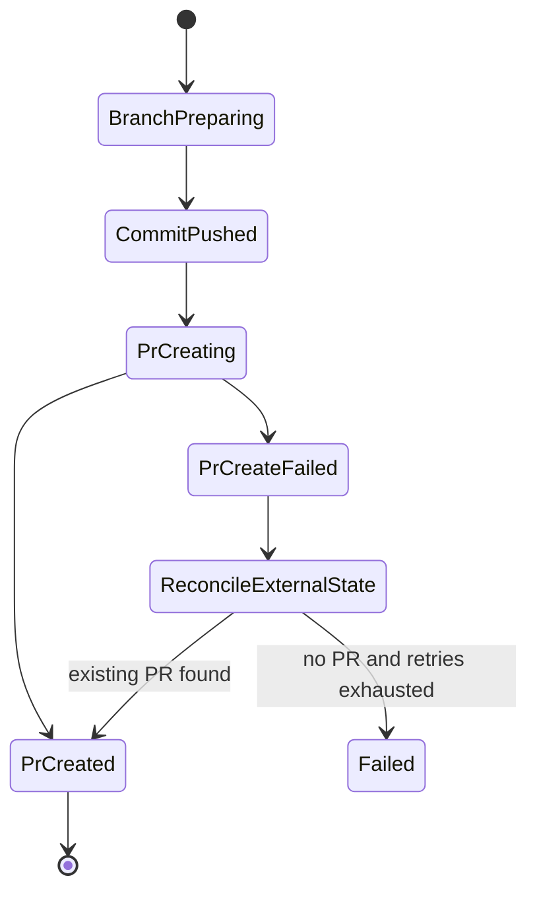
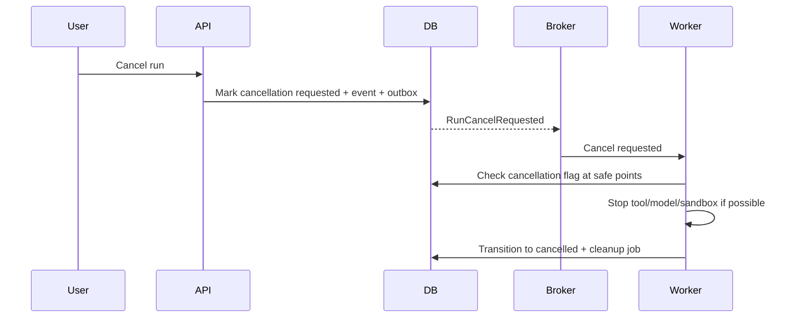
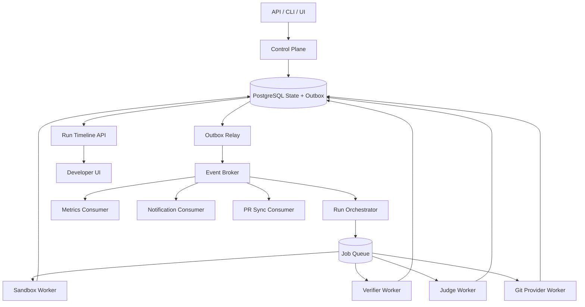

------
title: Learn AI Coding Agent From Scratch - Part 016
description: Event model dan asynchronous orchestration untuk Honk-like AI coding agent: domain events, command/event separation, topic design, outbox relay, worker orchestration, retries, idempotency, ordering, compensation, replay, dan observability.
series: learn-ai-coding-agent
seriesTitle: Learn AI Coding Agent From Scratch
order: 16
partTitle: Event Model: TaskSubmitted, RunStarted, ToolCalled, PatchCreated, VerificationFailed
tags:
- ai-coding-agent
- event-driven-architecture
- orchestration
- outbox
- cloudevents
- asyncapi
- kafka
- worker
- idempotency
- reliability
date: 2026-07-03
---

# Part 016 — Event Model: TaskSubmitted, RunStarted, ToolCalled, PatchCreated, VerificationFailed

Part 015 membuat database schema. Sekarang kita membuat sistem itu bergerak.

AI coding agent tidak cocok dibangun sebagai request-response panjang:

```text
POST /tasks -> wait 45 minutes -> return PR URL
```

Itu rapuh.

Agent run bisa butuh:

- clone repo;
- install dependency;
- build context;
- panggil model berkali-kali;
- edit file;
- menjalankan command;
- membaca log;
- memperbaiki patch;
- menjalankan test ulang;
- judge diff;
- minta approval;
- create PR;
- menunggu CI;
- merespons review feedback.

Itu workflow panjang, penuh kegagalan parsial, dan tidak boleh hilang saat process restart.

Karena itu kita butuh event model dan asynchronous orchestration.

---

## 1. Mental model: command, event, state

Ada tiga benda yang sering tertukar:

```text
Command = permintaan melakukan sesuatu.
Event   = fakta bahwa sesuatu sudah terjadi.
State   = kondisi terkini dari aggregate.
```

Contoh:

```text
Command: StartRun
Event:   RunStarted
State:   runs.status = 'running'
```

Command bisa ditolak. Event tidak boleh ditolak, karena event adalah fakta masa lalu.

Dalam agent platform:

```text
SubmitTask command -> TaskSubmitted event -> tasks.status = submitted
AcquireRun command -> RunAcquired event -> runs.status = preparing
ExecuteTool command -> ToolCallStarted/Completed events -> tool_calls.status = succeeded/failed
CreatePatch command -> PatchCreated event -> patches.status = created
VerifyPatch command -> VerificationPassed/Failed event -> verification_attempts.status = passed/failed
JudgePatch command -> JudgePassed/Failed event -> judge_attempts.verdict = pass/fail
CreatePullRequest command -> PullRequestCreated event -> pull_requests.status = open/draft
```

Kalau kamu mencampur command dan event, retry akan berbahaya.

---

## 2. Kenapa event-driven untuk coding agent?

Karena workflow agent memiliki karakter berikut:

| Karakter | Implikasi |
|---|---|
| Long-running | tidak boleh bergantung pada HTTP connection |
| Failure-prone | harus bisa retry step tertentu |
| Multi-worker | butuh lease, idempotency, dan ordering |
| Observable | UI butuh timeline real-time |
| Auditable | semua keputusan penting harus tercatat |
| Cost-sensitive | token/tool/sandbox usage harus dihitung |
| Policy-sensitive | approval bisa menghentikan workflow di tengah |
| External integration | Git provider, CI, MCP server, artifact storage bisa gagal |

Event-driven bukan berarti semua hal harus async. Event-driven berarti perubahan penting dipublikasikan sebagai fakta yang bisa dikonsumsi banyak komponen.

---

## 3. Bounded context event

Jangan mulai dengan satu topic `events` berisi semua payload random.

Pisahkan berdasarkan bounded context:

```text
agent.task.*
agent.run.*
agent.step.*
agent.tool.*
agent.patch.*
agent.verification.*
agent.judge.*
agent.approval.*
agent.pr.*
agent.policy.*
agent.cost.*
agent.audit.*
```

Contoh event:

```text
agent.task.submitted
agent.task.accepted
agent.task.rejected
agent.run.queued
agent.run.started
agent.run.heartbeat.missed
agent.run.failed
agent.tool.call.started
agent.tool.call.completed
agent.patch.created
agent.verification.started
agent.verification.failed
agent.judge.completed
agent.approval.requested
agent.pr.created
```

Rule:

```text
Event name harus menjelaskan fakta bisnis/operasional, bukan nama fungsi internal.
```

Buruk:

```text
agent.worker.methodX.done
agent.controller.postTask.called
```

Baik:

```text
agent.task.submitted
agent.run.started
agent.patch.created
```

---

## 4. Event envelope

Payload tiap event boleh berbeda. Envelope harus konsisten.

Kita bisa mengadopsi gaya CloudEvents karena CloudEvents mendefinisikan metadata event umum untuk interoperabilitas lintas service/platform. Tidak perlu memakai semua fitur sejak awal, tetapi field seperti `id`, `source`, `type`, `time`, `subject`, dan `datacontenttype` memberi struktur yang stabil.

Envelope:

```json
{
  "specversion": "1.0",
  "id": "018fd8bb-0d2a-78f2-91cc-d20f8fbb9a11",
  "source": "agent-control-plane",
  "type": "agent.run.started",
  "subject": "run/9d07b2f2-4f46-4d22-9d8f-9c7d67f8e6de",
  "time": "2026-07-03T12:00:00Z",
  "datacontenttype": "application/json",
  "dataschema": "https://schemas.acme.internal/agent/run-started.v1.json",
  "traceparent": "00-4bf92f3577b34da6a3ce929d0e0e4736-00f067aa0ba902b7-00",
  "workspaceId": "...",
  "taskId": "...",
  "runId": "...",
  "data": {
    "runNo": 1,
    "repositoryId": "...",
    "baseCommitSha": "abc123",
    "modelProfile": "coding-large-low-temperature-v3"
  }
}
```

Custom extension attributes:

```text
workspaceId
taskId
runId
attemptId
correlationId
causationId
actorType
actorId
```

### 4.1 Correlation dan causation

`correlationId` mengikat satu business flow.

`causationId` menjelaskan event mana yang menyebabkan event ini.

Contoh:

```text
TaskSubmitted correlationId = task id
RunQueued caused by TaskAccepted
RunStarted caused by RunQueued
PatchCreated caused by ToolCallCompleted
VerificationStarted caused by PatchCreated
```

Tanpa causation, timeline besar sulit dianalisis.

---

## 5. Event versioning

Event akan berubah. Jangan pura-pura tidak.

Gunakan versi di nama schema atau field:

```text
agent.run.started.v1
agent.run.started.v2
```

Atau:

```json
{
  "type": "agent.run.started",
  "eventVersion": 1
}
```

Pilih satu. Untuk readability topic, kita gunakan:

```json
{
  "type": "agent.run.started",
  "eventVersion": 1
}
```

Rule compatibility:

```text
Add optional field       -> compatible
Remove field             -> breaking
Rename field             -> breaking
Change semantic meaning  -> breaking
Change enum behavior     -> often breaking
```

Consumer harus mengabaikan unknown fields.

Producer tidak boleh mengubah meaning field lama diam-diam.

---

## 6. Core event catalog

### 6.1 Task events

```text
agent.task.submitted
agent.task.validated
agent.task.accepted
agent.task.rejected
agent.task.queued
agent.task.cancelled
agent.task.completed
agent.task.failed
```

`agent.task.submitted` data:

```json
{
  "taskId": "...",
  "repositoryId": "...",
  "taskType": "api_migration",
  "riskLevel": "medium",
  "executionMode": "supervised_pr",
  "targetBranch": "main",
  "requestedBy": "user:ari",
  "scopeSummary": "src/main/java/com/acme/billing/**"
}
```

`agent.task.rejected` data:

```json
{
  "taskId": "...",
  "reasonCode": "policy.execution_mode_not_allowed",
  "reason": "Autonomous PR is not allowed for high risk task."
}
```

### 6.2 Run events

```text
agent.run.queued
agent.run.acquired
agent.run.started
agent.run.heartbeat
agent.run.status.changed
agent.run.cancel.requested
agent.run.cancelled
agent.run.failed
agent.run.completed
agent.run.timed_out
```

`agent.run.status.changed` data:

```json
{
  "runId": "...",
  "fromStatus": "running",
  "toStatus": "verifying",
  "reason": "Patch generated and ready for verification",
  "workerId": "worker-17"
}
```

### 6.3 Step events

```text
agent.step.recorded
agent.plan.created
agent.plan.updated
agent.context.loaded
agent.model.turn.completed
```

Step event tidak harus selalu dikirim ke broker. Untuk traffic tinggi, cukup simpan ke database dan stream ke UI via internal subscription.

Rule:

```text
High-volume diagnostic event tidak wajib masuk broker global.
State-changing event wajib masuk outbox/broker.
```

### 6.4 Tool events

```text
agent.tool.call.requested
agent.tool.call.allowed
agent.tool.call.denied
agent.tool.call.started
agent.tool.call.completed
agent.tool.call.failed
agent.tool.call.timed_out
```

`agent.tool.call.requested` data:

```json
{
  "toolCallId": "...",
  "runId": "...",
  "toolNamespace": "core",
  "toolName": "shell.exec",
  "riskLevel": "medium",
  "argumentsHash": "sha256:...",
  "summary": "Run ./mvnw test"
}
```

Do not put full command output into event payload. Use artifact reference.

### 6.5 Patch events

```text
agent.patch.created
agent.patch.updated
agent.patch.superseded
agent.patch.policy_flagged
agent.patch.verified
agent.patch.rejected
agent.patch.published
```

`agent.patch.created` data:

```json
{
  "patchId": "...",
  "runId": "...",
  "attemptNo": 2,
  "filesChanged": 8,
  "linesAdded": 124,
  "linesDeleted": 87,
  "diffArtifactId": "...",
  "summary": "Migrated LegacyClock.now() call sites to TimeProvider.now()."
}
```

### 6.6 Verification events

```text
agent.verification.started
agent.verification.passed
agent.verification.failed
agent.verification.errored
agent.verification.timed_out
agent.verification.skipped
```

`agent.verification.failed` data:

```json
{
  "verificationAttemptId": "...",
  "verifierName": "maven-test",
  "exitCode": 1,
  "failureCategory": "compile_error",
  "reportArtifactId": "...",
  "summary": "Compilation failed in InvoiceMapperTest: incompatible types."
}
```

### 6.7 Judge events

```text
agent.judge.started
agent.judge.completed
agent.judge.failed
agent.judge.inconclusive
```

`agent.judge.completed` data:

```json
{
  "judgeAttemptId": "...",
  "judgeType": "llm",
  "score": 0.86,
  "verdict": "needs_human_review",
  "findingsCount": 2,
  "reportArtifactId": "..."
}
```

### 6.8 Approval events

```text
agent.approval.requested
agent.approval.approved
agent.approval.rejected
agent.approval.expired
```

### 6.9 Pull request events

```text
agent.pr.creation.requested
agent.pr.created
agent.pr.creation.failed
agent.pr.updated
agent.pr.merged
agent.pr.closed
```

---

## 7. Topic design

Topic design bergantung pada broker. Untuk Kafka-like broker:

```text
agent.task.events.v1
agent.run.events.v1
agent.tool.events.v1
agent.patch.events.v1
agent.verification.events.v1
agent.judge.events.v1
agent.approval.events.v1
agent.pr.events.v1
agent.audit.events.v1
```

Untuk awal, kamu bisa memakai satu topic:

```text
agent.events.v1
```

Tetapi gunakan partition key yang benar:

```text
partition key = runId, jika event terkait run
partition key = taskId, jika task belum punya run
partition key = repositoryId, jika event repo-level
```

Kenapa?

Karena ordering yang kita pedulikan biasanya per run.

```text
RunStarted -> ToolCallStarted -> ToolCallCompleted -> PatchCreated -> VerificationStarted
```

Ordering global tidak dibutuhkan dan mahal. Ordering per run cukup.

---

## 8. Outbox relay architecture

Kita sudah membuat `outbox_events` di Part 015. Sekarang kita gunakan.



Important detail:

```text
Worker should not trust broker event alone.
Worker must acquire/lock run in database before executing.
```

Broker event is notification. Database is source of truth.

---

## 9. At-least-once delivery dan idempotent consumer

Most reliable practical event systems are at-least-once.

Artinya event bisa diterima lebih dari satu kali.

Maka semua consumer harus idempotent.

### 9.1 Processed event table

```sql
CREATE TABLE agent.processed_events (
  consumer_name text NOT NULL,
  event_id uuid NOT NULL,
  processed_at timestamptz NOT NULL DEFAULT now(),
  PRIMARY KEY (consumer_name, event_id)
);
```

Consumer flow:

```text
Begin transaction
Insert into processed_events
If duplicate -> skip
Apply side effect
Commit
```

Pseudo-code:

```java
@Transactional
public void handle(Event event) {
    boolean first = processedEvents.tryInsert("verification-scheduler", event.id());
    if (!first) {
        return;
    }

    verificationService.scheduleIfNeeded(event.runId(), event.patchId());
}
```

### 9.2 Idempotent write rule

For every consumer, define natural idempotency key.

Examples:

| Consumer | Idempotency key |
|---|---|
| run scheduler | `taskId + runNo` |
| verifier scheduler | `runId + patchId + verifierName` |
| PR creator | `runId + patchId + provider` |
| cost aggregator | `costEventId` |
| notification sender | `eventId + channel` |

---

## 10. Orchestration vs choreography

Ada dua style event-driven workflow:

```text
Orchestration = satu orchestrator mengarahkan langkah.
Choreography  = service bereaksi ke event tanpa central controller.
```

Untuk AI coding agent, gunakan orchestration untuk lifecycle inti.

Kenapa?

Karena agent run memiliki state machine ketat:

```text
queued -> preparing -> context_loading -> planning -> running -> verifying -> judging -> creating_pr -> completed
```

Kalau semua service bebas bereaksi, mudah terjadi:

- verifier jalan sebelum patch siap;
- PR dibuat sebelum judge selesai;
- approval terlambat tetapi worker sudah lanjut;
- retry ganda;
- status bertabrakan;
- cost membengkak.

Pattern yang kita pakai:

```text
Central orchestrator controls lifecycle.
Events notify other components.
Consumers may propose commands.
Commands still pass through orchestrator/state machine.
```



---

## 11. Command queue

Events are facts. Commands are work requests.

Untuk worker, buat command queue atau job table.

Contoh command types:

```text
PrepareSandbox
LoadContext
RunAgentLoop
ExecuteVerifier
ExecuteJudge
CreatePullRequest
SyncPullRequestStatus
CancelRun
CleanupSandbox
```

Job table:

```sql
CREATE TABLE agent.jobs (
  id uuid PRIMARY KEY DEFAULT gen_random_uuid(),
  workspace_id uuid NOT NULL REFERENCES agent.workspaces(id),
  run_id uuid REFERENCES agent.runs(id),
  job_type text NOT NULL,
  payload jsonb NOT NULL DEFAULT '{}'::jsonb,
  status text NOT NULL DEFAULT 'queued' CHECK (status IN (
    'queued', 'leased', 'running', 'succeeded', 'failed', 'cancelled', 'dead_letter'
  )),
  priority integer NOT NULL DEFAULT 100,
  attempts integer NOT NULL DEFAULT 0,
  max_attempts integer NOT NULL DEFAULT 3,
  lease_owner text,
  lease_until timestamptz,
  available_at timestamptz NOT NULL DEFAULT now(),
  last_error text,
  created_at timestamptz NOT NULL DEFAULT now(),
  updated_at timestamptz NOT NULL DEFAULT now()
);

CREATE INDEX jobs_available_idx ON agent.jobs(status, available_at, priority, created_at)
WHERE status IN ('queued', 'failed');
```

Acquire job:

```sql
WITH candidate AS (
  SELECT id
  FROM agent.jobs
  WHERE status IN ('queued', 'failed')
    AND available_at <= now()
    AND attempts < max_attempts
  ORDER BY priority ASC, created_at ASC
  FOR UPDATE SKIP LOCKED
  LIMIT 1
)
UPDATE agent.jobs j
SET status = 'leased',
    lease_owner = :worker_id,
    lease_until = now() + interval '5 minutes',
    attempts = attempts + 1,
    updated_at = now()
FROM candidate
WHERE j.id = candidate.id
RETURNING j.*;
```

Event broker bisa memberi notification. Job table memberi durable work state.

---

## 12. End-to-end asynchronous flow



API returns quickly:

```http
HTTP/1.1 202 Accepted
Content-Type: application/json

{
  "taskId": "...",
  "runId": "...",
  "status": "queued"
}
```

User watches timeline via:

```text
GET /runs/{id}
GET /runs/{id}/events
WebSocket/SSE /runs/{id}/stream
```

---

## 13. Retry model

Tidak semua failure sama.

| Failure | Retry? | Strategy |
|---|---:|---|
| broker publish timeout | yes | retry outbox relay |
| worker crash | yes | lease expiry + reacquire |
| shell command test failed | maybe | agent repair attempt |
| compile error after patch | maybe | feedback loop |
| policy denied | no | stop or approval |
| forbidden path touched | maybe | ask agent to revert |
| secret detected | no | block and redact |
| provider rate limit | yes | exponential backoff |
| PR already exists | idempotent | return existing PR |
| malicious repo behavior | no | quarantine/block |

Retry rule:

```text
Retry infrastructure failures automatically.
Retry agent-correctable failures with feedback budget.
Never retry policy/security failures blindly.
```

### 13.1 Retry budget

Run-level budget:

```json
{
  "maxAgentAttempts": 3,
  "maxToolRetries": 2,
  "maxVerifierRetries": 1,
  "maxPrCreateRetries": 5,
  "maxWallClockSeconds": 3600,
  "maxEstimatedCostUsd": 3.00
}
```

Budget exhaustion emits:

```text
agent.run.failed
reason = retry_budget_exhausted
```

---

## 14. Backoff and dead letter

For transient failures:

```text
nextAttemptAt = now + min(maxDelay, baseDelay * 2^attempts + jitter)
```

Example:

```java
Duration computeBackoff(int attempts) {
    long base = 2;
    long max = 300;
    long seconds = Math.min(max, base * (1L << Math.min(attempts, 8)));
    long jitter = ThreadLocalRandom.current().nextLong(0, 5);
    return Duration.ofSeconds(seconds + jitter);
}
```

Dead letter when:

```text
attempts >= max_attempts
or non_retryable_error
or policy_blocked
```

Dead-letter event:

```json
{
  "type": "agent.job.dead_lettered",
  "data": {
    "jobId": "...",
    "jobType": "CreatePullRequest",
    "runId": "...",
    "attempts": 5,
    "lastError": "Git provider returned 403"
  }
}
```

Dead letter is not a trash bin. It is an operational queue requiring diagnosis.

---

## 15. Ordering model

Events can arrive out of order if:

- different partitions;
- retries;
- relay delay;
- consumer restart;
- external webhooks.

Design consumers to tolerate this.

### 15.1 Use database state before action

Bad consumer:

```text
On PatchCreated -> immediately create PR
```

Good consumer:

```text
On PatchCreated -> ask orchestrator to evaluate next step
Orchestrator reads DB:
  patch exists?
  verification passed?
  judge passed?
  approval required?
  run still active?
Then decides.
```

### 15.2 Sequence number per run

Optional but useful:

```sql
CREATE TABLE agent.run_sequences (
  run_id uuid PRIMARY KEY REFERENCES agent.runs(id),
  next_sequence bigint NOT NULL DEFAULT 1
);
```

When appending run event:

```sql
UPDATE agent.run_sequences
SET next_sequence = next_sequence + 1
WHERE run_id = :run_id
RETURNING next_sequence - 1 AS sequence_no;
```

Then event order per run is explicit.

---

## 16. Saga and compensation

Some steps cross external systems.

Example PR creation:

```text
1. create branch in git provider
2. push commit
3. create PR
4. update database
```

If step 3 succeeds but step 4 fails, external PR exists but database does not know.

Use idempotent external operation and reconciliation.

### 16.1 PR creation saga



Saga table:

```sql
CREATE TABLE agent.sagas (
  id uuid PRIMARY KEY DEFAULT gen_random_uuid(),
  run_id uuid NOT NULL REFERENCES agent.runs(id),
  saga_type text NOT NULL,
  status text NOT NULL CHECK (status IN ('running', 'completed', 'failed', 'compensating', 'compensated')),
  current_step text NOT NULL,
  payload jsonb NOT NULL DEFAULT '{}'::jsonb,
  created_at timestamptz NOT NULL DEFAULT now(),
  updated_at timestamptz NOT NULL DEFAULT now()
);
```

Not every workflow needs a saga table. But any multi-step external side effect should have explicit recovery strategy.

---

## 17. Webhook events from Git provider

External events:

```text
github.pull_request.opened
github.pull_request.synchronize
github.pull_request.closed
github.pull_request.merged
github.check_suite.completed
github.pull_request_review.submitted
```

Do not directly mutate run status from webhook handler.

Webhook handler should:

1. verify signature;
2. store raw event artifact if needed;
3. deduplicate by provider delivery ID;
4. map external event to internal command/event;
5. let orchestrator decide.

Dedup table:

```sql
CREATE TABLE agent.external_event_receipts (
  provider text NOT NULL,
  delivery_id text NOT NULL,
  received_at timestamptz NOT NULL DEFAULT now(),
  event_type text NOT NULL,
  payload_hash text NOT NULL,
  processed_at timestamptz,
  PRIMARY KEY (provider, delivery_id)
);
```

---

## 18. Event schema documentation with AsyncAPI

OpenAPI documents HTTP APIs. AsyncAPI documents asynchronous APIs and event-driven architecture contracts. For agent platform, AsyncAPI can document topics/channels, message schemas, producer/consumer responsibilities, and examples.

Minimal AsyncAPI sketch:

```yaml
asyncapi: 3.0.0
info:
  title: Agent Platform Events
  version: 1.0.0
channels:
  agent.run.events.v1:
    address: agent.run.events.v1
    messages:
      RunStarted:
        $ref: '#/components/messages/RunStarted'
      RunCompleted:
        $ref: '#/components/messages/RunCompleted'
operations:
  consumeRunEvents:
    action: receive
    channel:
      $ref: '#/channels/agent.run.events.v1'
components:
  messages:
    RunStarted:
      name: RunStarted
      contentType: application/json
      payload:
        type: object
        required: [specversion, id, type, source, time, data]
        properties:
          specversion:
            type: string
          id:
            type: string
            format: uuid
          type:
            const: agent.run.started
          source:
            type: string
          time:
            type: string
            format: date-time
          data:
            type: object
            required: [runId, taskId, repositoryId, baseCommitSha]
            properties:
              runId:
                type: string
                format: uuid
              taskId:
                type: string
                format: uuid
              repositoryId:
                type: string
                format: uuid
              baseCommitSha:
                type: string
```

AsyncAPI is not ceremony. It prevents consumers from guessing payloads.

---

## 19. Event-driven UI

UI should not poll every second for everything.

Options:

```text
SSE    good for run timeline stream
WebSocket good for interactive dashboard
Polling good fallback
```

For run detail page:

```text
GET /runs/{id}              -> current aggregate
GET /runs/{id}/events       -> historical timeline
GET /runs/{id}/artifacts    -> evidence list
SSE /runs/{id}/stream       -> new events
```

SSE payload:

```text
event: agent.run.status.changed
data: {"runId":"...","fromStatus":"running","toStatus":"verifying"}

```

UI timeline should group low-level events:

```text
Planning
  - repository map loaded
  - 14 relevant files selected
Editing
  - 8 files changed
Verification
  - mvn test failed
  - agent applied fix
  - mvn test passed
Judging
  - score 0.88, needs human review
PR
  - draft PR created
```

Raw event stream is for machines. Human timeline needs summarization.

---

## 20. Observability events vs domain events

Do not put everything in domain event broker.

Separate:

```text
Domain events      -> business/lifecycle facts
Trace spans        -> timing and call graph
Metrics            -> counters/gauges/histograms
Logs               -> diagnostic text
Audit logs         -> governance/security record
```

Example:

```text
agent.tool.call.completed is a domain event.
The HTTP latency to MCP server is a trace span.
The number of failed tool calls is a metric.
The raw stacktrace is a log/artifact.
The permission denial is an audit log.
```

Mixing all of them creates noisy, expensive, hard-to-query systems.

---

## 21. Metrics derived from events

Useful metrics:

```text
agent_tasks_submitted_total{task_type,risk_level}
agent_runs_started_total{model_profile,agent_version}
agent_runs_completed_total{final_verdict}
agent_run_duration_seconds{task_type}
agent_tool_calls_total{tool_name,status}
agent_verification_failures_total{failure_category}
agent_judge_verdict_total{verdict}
agent_pr_created_total{provider}
agent_outbox_lag_seconds
agent_job_queue_depth{job_type}
agent_cost_usd_total{workspace,task_type}
```

Outbox lag query:

```sql
SELECT EXTRACT(EPOCH FROM (now() - MIN(created_at))) AS lag_seconds
FROM agent.outbox_events
WHERE status IN ('pending', 'failed');
```

Queue depth:

```sql
SELECT job_type, COUNT(*)
FROM agent.jobs
WHERE status IN ('queued', 'failed')
  AND available_at <= now()
GROUP BY job_type;
```

---

## 22. Policy events

Policy decisions should emit events/audit.

Examples:

```text
agent.policy.evaluated
agent.policy.denied
agent.policy.override.requested
agent.policy.override.approved
```

Policy evaluated payload:

```json
{
  "policyId": "workspace-default-v4",
  "decision": "denied",
  "reasonCode": "forbidden_path",
  "resourceType": "patch",
  "resourceId": "...",
  "details": {
    "path": ".github/workflows/deploy-prod.yml"
  }
}
```

This matters because agent behavior is not enough. Governance decision must also be explainable.

---

## 23. Cancellation flow

Cancellation is hard because worker may be inside shell command or model call.

Flow:



Rules:

```text
Cancellation is cooperative where possible.
Long-running tools must have timeout.
Worker must check cancellation before each expensive action.
Sandbox cleanup must run even if cancellation fails midway.
```

Database field option:

```sql
ALTER TABLE agent.runs
ADD COLUMN cancellation_requested_at timestamptz,
ADD COLUMN cancellation_reason text,
ADD COLUMN cancellation_requested_by text;
```

---

## 24. Heartbeat and zombie detection

Worker can die silently.

Heartbeat:

```text
Worker updates runs.heartbeat_at every N seconds.
Lease expires after M seconds.
Reaper scans expired lease.
```

Reaper query:

```sql
SELECT id, status, lease_owner, lease_until, heartbeat_at
FROM agent.runs
WHERE status IN ('preparing','running','verifying','judging','creating_pr')
  AND lease_until < now();
```

Reaper decision:

```text
If job is safe to retry -> requeue
If sandbox unknown -> cleanup sandbox then requeue
If external side effect possible -> reconcile before retry
If attempts exceeded -> mark failed
```

Emit:

```text
agent.run.heartbeat.missed
agent.run.recovered
agent.run.failed
```

---

## 25. Backpressure

Agent platform can overload itself with:

- too many submitted tasks;
- too many token-heavy runs;
- too many sandbox containers;
- too many Maven builds;
- too many PR creations;
- external provider rate limits.

Backpressure controls:

```text
workspace max active runs
repository max active runs
task type concurrency limit
model provider token budget
sandbox pool capacity
job queue priority
rate limit per actor
cost budget per workspace
```

Admission control:

```java
public AdmissionDecision admit(Task task) {
    if (activeRunsForWorkspace(task.workspaceId()) >= workspaceLimit) {
        return defer("workspace_concurrency_limit");
    }
    if (activeRunsForRepository(task.repositoryId()) >= repositoryLimit) {
        return defer("repository_concurrency_limit");
    }
    if (estimatedCost(task).exceedsBudget()) {
        return reject("cost_budget_exceeded");
    }
    return accept();
}
```

Backpressure event:

```text
agent.task.deferred
reason = workspace_concurrency_limit
```

---

## 26. Priority model

Not all tasks equal.

Priority inputs:

```text
security migration > build break fix > dependency upgrade > style cleanup
small scoped task > large ambiguous task
human requested > scheduled batch
production impacting repo > playground repo
```

Job priority should be explicit, not hidden in queue order.

```text
0   emergency
10  security
50  human interactive
100 normal
200 batch
500 low priority maintenance
```

But priority must not starve batch forever. Add aging:

```text
effectivePriority = basePriority - floor(waitMinutes / 30)
```

---

## 27. Replay model

Replay means reconstructing or reprocessing events.

Types:

```text
UI replay       -> rebuild timeline
metric replay   -> recompute counters
consumer replay -> re-run consumer from event history
run replay      -> reproduce agent behavior as much as possible
```

Full run replay is hard because LLM output may not be deterministic. But you can replay:

- same task contract;
- same base commit;
- same context bundle;
- same tool outputs;
- same model responses if saved;
- same verifier logs;
- same patch.

Minimum replay artifacts:

```text
task snapshot
repo base commit
agent version
model profile
prompt snapshots
tool call arguments/results
patch diff
verifier reports
judge reports
```

That is why Part 015 insisted on artifacts.

---

## 28. Event compaction and snapshots

Event streams can grow huge.

Keep aggregate current state in tables.

For event replay, create snapshots:

```sql
CREATE TABLE agent.run_snapshots (
  run_id uuid NOT NULL REFERENCES agent.runs(id),
  sequence_no bigint NOT NULL,
  snapshot jsonb NOT NULL,
  created_at timestamptz NOT NULL DEFAULT now(),
  PRIMARY KEY (run_id, sequence_no)
);
```

Snapshot includes:

```json
{
  "status": "verifying",
  "attemptNo": 2,
  "stepCount": 37,
  "latestPatchId": "...",
  "verificationSummary": {
    "passed": 3,
    "failed": 1
  }
}
```

Use snapshots for replay optimization, not as replacement for source-of-truth tables.

---

## 29. Event contract tests

Every event producer should have contract tests.

Test shape:

```java
@Test
void runStartedEventMatchesSchema() {
    Event event = RunStartedEvent.of(run);
    JsonSchema schema = schemaRegistry.load("agent.run.started.v1");
    assertThat(schema.validate(event.toJson())).isEmpty();
}
```

Consumer contract test:

```java
@Test
void verificationSchedulerAcceptsRunPatchCreatedV1() {
    Event event = fixture("agent.patch.created.v1.json");
    scheduler.handle(event);
    assertThat(jobRepository.findByType("ExecuteVerification")).hasSize(1);
}
```

Golden fixtures:

```text
test-fixtures/events/
  agent.task.submitted.v1.json
  agent.run.started.v1.json
  agent.patch.created.v1.json
  agent.verification.failed.v1.json
  agent.judge.completed.v1.json
```

---

## 30. Testing asynchronous orchestration

### 30.1 Unit test state transition

```text
Given run.status = running
When PatchCreated
Then orchestrator schedules verification
And run.status becomes verifying
```

### 30.2 Integration test outbox

```text
Given SubmitTask transaction commits
Then outbox has TaskSubmitted and RunQueued
When relay runs
Then broker receives events
And outbox rows become published
```

### 30.3 Crash test

```text
Given worker acquired RunAgentLoop job
And worker created patch
And process crashes before publishing event
Then database still has patch and outbox event
And relay eventually publishes PatchCreated
```

### 30.4 Duplicate event test

```text
Given PatchCreated delivered twice
Then ExecuteVerification job is created once
```

### 30.5 Out-of-order event test

```text
Given VerificationPassed arrives before PatchCreated consumer processes
Then orchestrator reads DB and reaches correct state eventually
```

---

## 31. Implementation skeleton

Package layout:

```text
agent-platform/
  apps/
    api/
    worker/
    outbox-relay/
    event-consumer/
  modules/
    domain/
      Task.java
      Run.java
      RunStatus.java
      DomainEvent.java
    orchestration/
      RunOrchestrator.java
      TransitionService.java
      CommandDispatcher.java
    events/
      EventEnvelope.java
      EventPublisher.java
      EventSerializer.java
      SchemaValidator.java
    outbox/
      OutboxRepository.java
      OutboxRelay.java
    jobs/
      JobRepository.java
      JobWorker.java
      LeaseService.java
```

Domain event interface:

```java
public interface DomainEvent {
    UUID eventId();
    String type();
    int version();
    Instant occurredAt();
    UUID workspaceId();
    Optional<UUID> taskId();
    Optional<UUID> runId();
    JsonNode data();
}
```

Envelope builder:

```java
public final class EventEnvelope {
    private final String specversion = "1.0";
    private final UUID id;
    private final String source;
    private final String type;
    private final String subject;
    private final Instant time;
    private final String datacontenttype = "application/json";
    private final int eventVersion;
    private final UUID workspaceId;
    private final UUID correlationId;
    private final UUID causationId;
    private final JsonNode data;
}
```

Outbox append:

```java
public void append(DomainEvent event) {
    jdbc.update("""
        INSERT INTO agent.outbox_events (
          aggregate_type,
          aggregate_id,
          event_type,
          event_version,
          payload,
          headers
        ) VALUES (?, ?, ?, ?, ?::jsonb, ?::jsonb)
        """,
        event.aggregateType(),
        event.aggregateId(),
        event.type(),
        event.version(),
        serialize(event),
        serializeHeaders(event)
    );
}
```

---

## 32. Minimal orchestration pseudo-code

```java
public void onPatchCreated(EventEnvelope event) {
    UUID runId = event.runId();
    UUID patchId = event.data().get("patchId").asUuid();

    transitionService.withRunLock(runId, run -> {
        if (!run.isActive()) {
            return;
        }

        if (!run.status().equals(RunStatus.RUNNING)) {
            return; // duplicate or late event
        }

        transitionService.transition(
            run.id(),
            RunStatus.RUNNING,
            RunStatus.VERIFYING,
            "Patch created; verification required"
        );

        jobService.enqueueOnce(
            "ExecuteVerification",
            IdempotencyKey.of("verify", runId, patchId),
            Map.of("runId", runId, "patchId", patchId)
        );
    });
}
```

Key details:

- lock run;
- check current state;
- ignore duplicate/late event safely;
- transition through state machine;
- enqueue idempotent job;
- commit event/outbox together.

---

## 33. Failure scenario walkthrough

Scenario:

```text
Agent creates patch.
Verifier runs Maven test.
Maven test fails.
Agent receives summarized log.
Agent fixes compile error.
Verifier passes.
Judge says patch overreaches.
Agent reverts unrelated file.
Judge passes.
System creates draft PR.
```

Events:

```text
agent.patch.created attempt=1
agent.verification.started verifier=maven-test
agent.verification.failed failure_category=compile_error
agent.run.verdict.retry_with_feedback reason=verification_failed
agent.plan.updated reason=fix_compile_error
agent.patch.created attempt=2
agent.verification.started verifier=maven-test
agent.verification.passed
agent.judge.started
agent.judge.completed verdict=fail category=scope_overreach
agent.run.verdict.retry_with_feedback reason=judge_failed
agent.patch.created attempt=3
agent.verification.passed
agent.judge.completed verdict=pass
agent.pr.creation.requested
agent.pr.created
agent.run.completed
```

This is why event model matters. Without it, all you see is:

```text
Run completed after 43 minutes.
```

That is not enough for production.

---

## 34. Anti-pattern event model

### Anti-pattern 1: Events as debug logs

Event:

```text
worker printed: done
```

Bad. Event should be fact with stable meaning.

### Anti-pattern 2: No idempotency

Duplicate event creates duplicate PR.

### Anti-pattern 3: Consumer mutates state directly

Every consumer updates `runs.status`. State machine is bypassed.

### Anti-pattern 4: Full artifact in event payload

Huge build logs in broker. Expensive and unstable.

Use artifact reference.

### Anti-pattern 5: Global ordering assumption

Assuming event A always arrives before B across distributed systems. It will break.

### Anti-pattern 6: Event schema not versioned

Producer changes payload; consumer silently breaks.

### Anti-pattern 7: Broker as source of truth

Broker is transport/log. Database aggregate remains source of truth for orchestration decisions.

---

## 35. Final architecture after Part 016



This architecture gives us:

- durable state;
- asynchronous execution;
- idempotent jobs;
- observable timeline;
- recoverable worker crashes;
- safe retries;
- clear external integration;
- event contracts;
- auditability.

---

## 36. Checklist implementasi Part 016

- [ ] Pisahkan command, event, dan state.
- [ ] Definisikan event envelope konsisten.
- [ ] Gunakan event versioning.
- [ ] Buat event catalog untuk task/run/tool/patch/verification/judge/approval/PR.
- [ ] Gunakan outbox untuk publish event reliable.
- [ ] Jadikan database source of truth untuk orchestration.
- [ ] Jadikan broker sebagai notification/event transport, bukan state utama.
- [ ] Buat idempotent consumer.
- [ ] Buat processed event table.
- [ ] Buat job table atau durable command queue.
- [ ] Gunakan lease untuk job worker.
- [ ] Gunakan retry budget dan backoff.
- [ ] Buat dead-letter path.
- [ ] Toleransi duplicate event.
- [ ] Toleransi out-of-order event.
- [ ] Buat cancellation flow.
- [ ] Buat heartbeat dan zombie detection.
- [ ] Buat backpressure/admission control.
- [ ] Dokumentasikan event schema dengan AsyncAPI atau schema registry.
- [ ] Buat contract tests untuk producer dan consumer.
- [ ] Pisahkan domain events, metrics, trace, logs, dan audit.

---

## 37. Ringkasan

Event model membuat Honk-like AI coding agent menjadi sistem yang bisa berjalan lama tanpa kehilangan kontrol.

Intinya:

- command adalah permintaan;
- event adalah fakta;
- state adalah kondisi terkini;
- database adalah source of truth;
- outbox menjaga event tidak hilang;
- broker menyebarkan fakta;
- orchestrator menjaga state machine;
- jobs menjalankan pekerjaan durable;
- worker harus lease-based dan idempotent;
- retry harus punya budget;
- duplicate event harus aman;
- out-of-order event harus aman;
- external side effect butuh reconciliation;
- event schema harus versioned;
- timeline harus bisa direplay.

Dengan Part 015 dan 016, kita sekarang punya fondasi data dan event untuk membangun agent platform. Part berikutnya akan masuk ke worker queue dan run scheduler: bagaimana banyak worker mengambil, menjalankan, memperbarui heartbeat, recover dari crash, dan menjaga concurrency tanpa double execution.

---

## References

- CloudEvents Specification: https://github.com/cloudevents/spec
- CloudEvents Project Site: https://cloudevents.io/
- CNCF CloudEvents Project: https://www.cncf.io/projects/cloudevents/
- AsyncAPI Initiative: https://www.asyncapi.com/
- Microservices.io — Transactional Outbox Pattern: https://microservices.io/patterns/data/transactional-outbox.html
