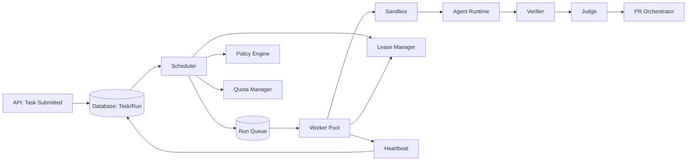
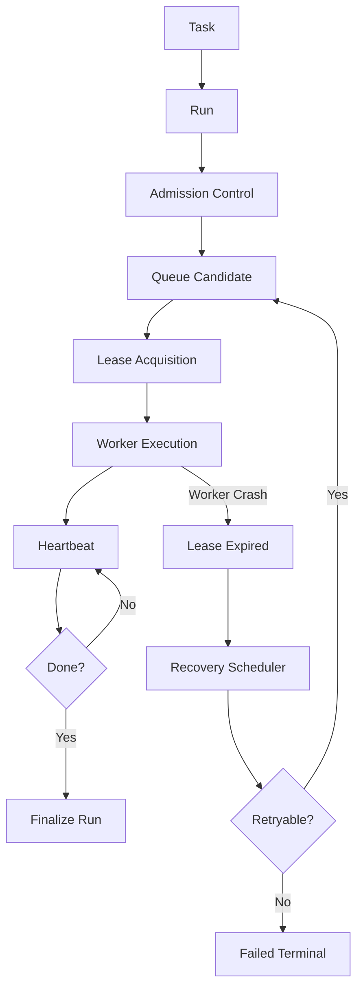
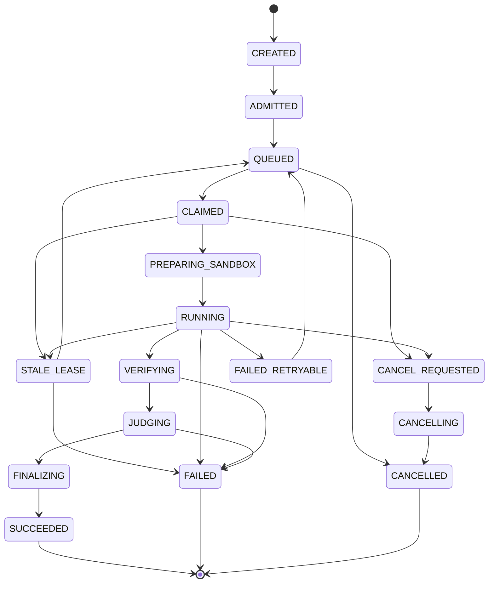
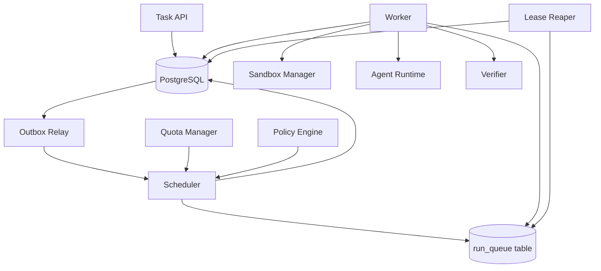
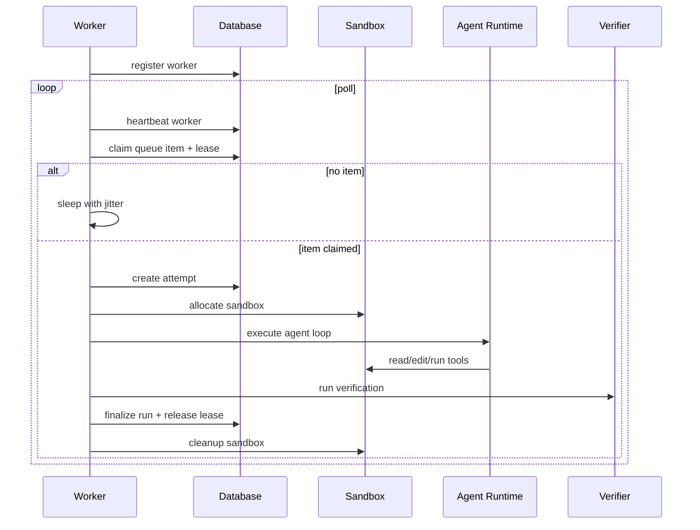
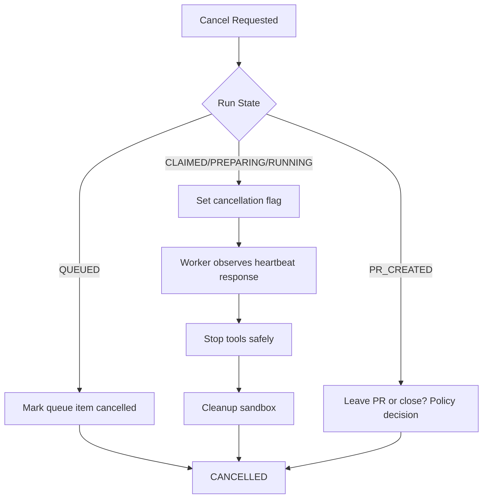
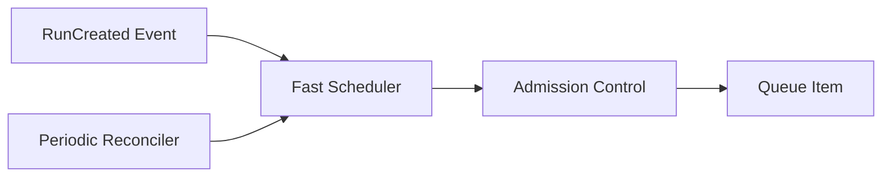

------
title: Learn AI Coding Agent From Scratch - Part 017
description: Worker queue dan run scheduler untuk menjalankan banyak agent run secara aman, terukur, idempotent, dan bisa dipulihkan setelah crash.
series: learn-ai-coding-agent
seriesTitle: Learn AI Coding Agent From Scratch
order: 17
partTitle: Worker Queue dan Run Scheduler
tags:
- ai-coding-agent
- coding-agent
- distributed-systems
- queue
- scheduler
- orchestration
- worker
- sandbox
- reliability
date: 2026-07-03
---

# Part 017 — Worker Queue dan Run Scheduler

Di part sebelumnya kita sudah punya dua fondasi besar:

1. **state machine `Run`**: perubahan status agent tidak boleh liar.
2. **API contract**: dunia luar membuat task lewat kontrak yang jelas.

Sekarang kita masuk ke bagian yang sering diremehkan tetapi menentukan apakah platform agent bisa dipakai di production: **worker queue dan run scheduler**.

AI coding agent bukan hanya fungsi `callLLM(task)`.

Ia adalah pekerjaan background yang panjang, mahal, bisa gagal, bisa timeout, bisa menciptakan branch, bisa mengubah ratusan file, bisa menjalankan command berbahaya, dan harus tetap recoverable ketika worker mati di tengah jalan.

Jadi pertanyaan inti part ini adalah:

> Bagaimana kita menjalankan banyak agent run secara asynchronous tanpa kehilangan kontrol, tanpa double execution yang merusak repo, tanpa infinite retry, dan tanpa membuat platform menjadi PR spam machine?

Kita akan membangun model scheduler dari nol.

---

## 1. Posisi Part Ini di Sistem

Pada arsitektur Honk-like background coding agent, queue dan scheduler duduk di antara **control plane** dan **execution plane**.



Kita belum membahas agent loop secara detail. Itu nanti di Part 021.

Di sini kita hanya memastikan satu hal:

> Ketika sebuah `Run` sudah boleh dieksekusi, platform punya mekanisme yang benar untuk memilih worker, memberi lease, memantau progress, membatalkan, retry, dan memulihkan run yang ditinggal mati worker.

---

## 2. Apa Itu Scheduler dalam AI Coding Agent?

Scheduler bukan sekadar queue.

Queue hanya menjawab:

> Item mana yang tersedia untuk diambil worker?

Scheduler menjawab lebih banyak:

1. Apakah run ini **boleh** dimulai sekarang?
2. Worker jenis apa yang bisa menjalankannya?
3. Berapa banyak run yang boleh aktif per organization, repository, user, model, sandbox pool, dan provider token?
4. Apakah run ini masih valid, atau sudah dibatalkan?
5. Apakah run ini retryable?
6. Apakah run ini lebih prioritas daripada run lain?
7. Bagaimana jika worker mati setelah membuat branch tetapi sebelum update database?
8. Bagaimana jika queue mengirim item yang sama dua kali?
9. Bagaimana jika task sudah selesai tetapi message lama masih ada di queue?
10. Bagaimana mencegah satu repo besar memonopoli semua worker?

Mental modelnya:



Scheduler adalah **traffic controller** untuk perubahan kode otomatis.

---

## 3. Kenapa Ini Penting untuk Coding Agent?

Coding agent berbeda dari job background biasa karena setiap job punya efek samping yang berisiko:

- clone repository;
- checkout branch;
- membuat branch baru;
- mengubah file;
- menjalankan build/test command;
- mengonsumsi token LLM;
- membaca log build;
- mungkin membuat commit;
- mungkin membuka pull request;
- mungkin memicu CI;
- mungkin mengirim komentar ke PR.

Kalau execution model buruk, failure-nya bukan hanya “job gagal”. Failure-nya bisa menjadi:

- PR duplikat;
- branch duplikat;
- biaya model membengkak;
- repo rate limit;
- CI queue penuh;
- task yang sudah dibatalkan tetap berjalan;
- worker terus retry perubahan yang deterministic gagal;
- agent memperbaiki hal di luar scope karena terlalu lama berjalan;
- reviewer manusia kehilangan trust.

Target kita bukan membuat queue yang “jalan”. Target kita membuat queue yang **defensible**.

---

## 4. Vocabulary Inti

Kita gunakan vocabulary berikut sepanjang seri.

| Istilah | Arti |
|---|---|
| `Task` | Permintaan perubahan kode dari user/system. |
| `Run` | Eksekusi konkret untuk satu task. Satu task bisa punya beberapa run. |
| `Attempt` | Percobaan eksekusi dari satu run. Retry menciptakan attempt baru. |
| `Worker` | Process yang mengambil run dan menjalankan execution plane. |
| `Queue Item` | Representasi run yang siap diklaim worker. |
| `Lease` | Hak sementara worker untuk mengeksekusi run. |
| `Heartbeat` | Bukti periodik bahwa worker masih hidup. |
| `Scheduler` | Komponen yang memasukkan run ke queue dan mengatur eligibility. |
| `Reaper` | Proses yang mengambil kembali lease expired/stuck. |
| `Admission Control` | Gate sebelum run masuk ke execution. |
| `Concurrency Limit` | Batas run aktif per dimensi tertentu. |
| `Retry Budget` | Batas jumlah retry dan biaya retry. |
| `Priority` | Urutan relatif ketika resource terbatas. |
| `Fairness` | Mekanisme agar satu tenant/repo tidak menghabiskan kapasitas. |

Perbedaan penting:

```text
Task  = apa yang diminta
Run   = satu eksekusi terkontrol untuk memenuhi task
Attempt = satu percobaan aktual menjalankan run
Lease = hak worker untuk menjalankan attempt saat ini
```

Jangan mencampur empat konsep ini. Banyak sistem background job rusak karena `task_id`, `run_id`, `job_id`, dan `worker_id` diperlakukan sebagai hal yang sama.

---

## 5. Invariant Scheduler

Ini invariant yang harus benar sepanjang waktu.

### 5.1 Queue Bukan Source of Truth

Queue adalah mekanisme delivery. Database adalah source of truth.

Artinya:

- worker boleh menerima message lama;
- message bisa dikirim dua kali;
- queue bisa reorder;
- queue bisa kehilangan visibility sementara;
- worker harus selalu membaca state terbaru dari database sebelum bertindak.

Rule:

> Tidak ada action berbahaya hanya karena queue message berkata “jalankan run ini”.

Worker harus memvalidasi:

- run masih `QUEUED` atau `READY_TO_START`;
- run belum terminal;
- task belum cancelled;
- policy masih mengizinkan;
- lease bisa didapat secara atomic.

### 5.2 Satu Run Hanya Punya Satu Active Lease

Pada satu waktu, satu `Run` tidak boleh dieksekusi oleh dua worker.

```text
run_id = R-123
active lease count must be 0 or 1
never 2
```

Ini harus ditegakkan di database, bukan hanya di memory.

### 5.3 Worker Crash Harus Recoverable

Kalau worker mati:

- run tidak boleh hilang;
- run tidak boleh stuck selamanya;
- lease harus expire;
- scheduler harus bisa retry atau fail terminal;
- artifact partial harus tetap bisa diaudit.

### 5.4 Cancellation Harus Monotonic

Kalau user membatalkan task, worker tidak boleh “menghidupkan” lagi run tersebut.

```text
CANCEL_REQUESTED -> CANCELLING -> CANCELLED
```

Tidak boleh:

```text
CANCELLED -> RUNNING
```

### 5.5 Retry Tidak Boleh Menghapus Bukti

Attempt gagal harus tetap disimpan.

Retry menciptakan attempt baru. Jangan overwrite log attempt sebelumnya.

```text
run R-123
  attempt 1: failed, verifier error
  attempt 2: failed, timeout
  attempt 3: succeeded
```

Trace ini penting untuk diagnosis, cost accounting, dan governance.

### 5.6 Scheduler Tidak Boleh Melanggar Policy

Policy gate harus dicek minimal pada tiga titik:

1. sebelum run masuk queue;
2. saat worker claim lease;
3. sebelum action irreversible seperti push branch atau create PR.

Policy bukan hanya pre-check. Policy adalah guard berlapis.

### 5.7 Timeout Bukan Error Biasa

Timeout adalah signal bahwa boundary sistem gagal dikendalikan.

Timeout harus menghasilkan:

- status jelas;
- artifact log;
- reason code;
- retry classification;
- cost accounting;
- cleanup sandbox.

### 5.8 Idempotency untuk Semua External Side Effect

External side effect meliputi:

- clone/fetch remote;
- create branch;
- push branch;
- create commit;
- create PR;
- post comment;
- trigger CI;
- upload artifact.

Setiap side effect harus punya idempotency key atau deterministic identity.

Contoh:

```text
branch name = agent/{task_id}/{run_id}
commit trailer = Agent-Run-ID: run_123
PR title/body contains stable marker: agent-run-id: run_123
artifact path = /artifacts/{run_id}/{attempt_no}/...
```

---

## 6. Minimal State Machine yang Dibutuhkan Scheduler

Part 013 sudah membahas state machine lengkap. Untuk scheduler, subset state yang paling penting adalah:



Catatan desain:

- `CLAIMED` berarti lease berhasil didapat, tetapi sandbox belum tentu siap.
- `RUNNING` berarti agent loop sedang aktif.
- `VERIFYING` dan `JUDGING` bisa dijalankan oleh worker yang sama atau worker berbeda.
- `STALE_LEASE` bukan terminal; itu recovery marker.
- `FAILED_RETRYABLE` bukan status final; ia transisi ke queue kalau retry budget masih ada.

---

## 7. Pilihan Teknologi Queue

Kita bisa memakai banyak teknologi. Tetapi untuk build from scratch, penting memahami trade-off.

| Opsi | Kapan Cocok | Kelebihan | Kekurangan |
|---|---|---|---|
| PostgreSQL queue dengan `FOR UPDATE SKIP LOCKED` | Platform awal, volume sedang, butuh source of truth sederhana | Simple, transactional, mudah audit | Tidak ideal untuk throughput sangat tinggi |
| Redis/BullMQ | Job pendek/menengah, ecosystem Node.js | Cepat, delayed job, retry | Perlu disiplin agar DB tetap source of truth |
| Kafka | Event stream besar, replay, banyak consumer | Durable log, ordering per partition | Tidak natural untuk long-running leased job |
| SQS/PubSub | Cloud-native simple queue | Managed, scalable | Visibility timeout harus hati-hati untuk job panjang |
| Temporal | Durable workflow dan activity orchestration | Retry, timer, state workflow, worker task queue | Menambah platform dependency dan konsep baru |
| Kubernetes Jobs | Eksekusi isolated per job | Natural untuk containerized workloads | Orchestration state tetap harus dirancang |

Untuk seri ini, kita akan mulai dari **PostgreSQL-backed scheduler** karena:

1. kita sudah punya domain database;
2. invariant bisa ditegakkan dengan transaction;
3. mudah dipahami dari nol;
4. cukup untuk platform awal;
5. nanti bisa diganti/di-wrap oleh Temporal, SQS, Kafka, atau Kubernetes Jobs.

Rule desain:

> Jangan mulai dengan Kafka/Temporal untuk menutupi domain model yang belum jelas. Mulai dari state dan invariant. Teknologi orchestration boleh berevolusi setelah model benar.

---

## 8. Scheduler Architecture Versi Pertama

Kita bangun komponen berikut.



Komponen:

1. **Task API** membuat `task` dan `run`.
2. **Outbox Relay** mengirim event internal seperti `RunCreated`.
3. **Scheduler** mengecek eligibility dan memasukkan run ke queue.
4. **Worker** mengambil queue item, claim lease, lalu eksekusi.
5. **Lease Reaper** memulihkan run yang ditinggal worker.
6. **Quota Manager** mengatur concurrency dan budget.
7. **Policy Engine** menentukan apakah run boleh dieksekusi.

---

## 9. Database Table untuk Queue dan Lease

Kita tidak perlu schema final dulu. Kita butuh schema yang cukup untuk invariant.

### 9.1 `agent_run_queue`

```sql
CREATE TABLE agent_run_queue (
    queue_id            UUID PRIMARY KEY,
    run_id              UUID NOT NULL REFERENCES agent_run(run_id),
    task_id             UUID NOT NULL REFERENCES agent_task(task_id),
    tenant_id           UUID NOT NULL,
    repository_id       UUID NOT NULL,

    queue_name          TEXT NOT NULL DEFAULT 'default',
    priority            INT NOT NULL DEFAULT 100,
    scheduled_at        TIMESTAMPTZ NOT NULL DEFAULT now(),
    visible_at          TIMESTAMPTZ NOT NULL DEFAULT now(),

    status              TEXT NOT NULL CHECK (status IN (
        'READY',
        'CLAIMED',
        'DONE',
        'CANCELLED',
        'DEAD'
    )),

    attempt_no          INT NOT NULL DEFAULT 1,
    max_attempts        INT NOT NULL DEFAULT 3,

    claimed_by_worker_id UUID,
    claimed_at          TIMESTAMPTZ,
    lease_expires_at    TIMESTAMPTZ,

    last_error_code     TEXT,
    last_error_message  TEXT,

    created_at          TIMESTAMPTZ NOT NULL DEFAULT now(),
    updated_at          TIMESTAMPTZ NOT NULL DEFAULT now()
);

CREATE INDEX idx_run_queue_ready
ON agent_run_queue (queue_name, status, visible_at, priority, scheduled_at)
WHERE status = 'READY';

CREATE INDEX idx_run_queue_lease
ON agent_run_queue (status, lease_expires_at)
WHERE status = 'CLAIMED';

CREATE UNIQUE INDEX uq_active_queue_item_per_run
ON agent_run_queue (run_id)
WHERE status IN ('READY', 'CLAIMED');
```

Poin penting:

- `visible_at` mendukung delayed retry/backoff.
- `lease_expires_at` mendukung recovery.
- unique index mencegah dua active queue item untuk run yang sama.

### 9.2 `agent_worker`

```sql
CREATE TABLE agent_worker (
    worker_id           UUID PRIMARY KEY,
    worker_name         TEXT NOT NULL,
    worker_version      TEXT NOT NULL,
    queue_name          TEXT NOT NULL,
    status              TEXT NOT NULL CHECK (status IN (
        'STARTING',
        'READY',
        'DRAINING',
        'STOPPED',
        'DEAD'
    )),
    max_concurrent_runs INT NOT NULL DEFAULT 1,
    active_runs         INT NOT NULL DEFAULT 0,
    capabilities        JSONB NOT NULL DEFAULT '{}'::jsonb,
    started_at          TIMESTAMPTZ NOT NULL DEFAULT now(),
    last_heartbeat_at   TIMESTAMPTZ NOT NULL DEFAULT now()
);

CREATE INDEX idx_agent_worker_status
ON agent_worker (queue_name, status, last_heartbeat_at);
```

Capabilities bisa berisi:

```json
{
  "languages": ["java", "typescript", "go"],
  "sandbox": "docker-rootless",
  "supports_network_policy": true,
  "max_workspace_gb": 20,
  "models": ["gpt-5.1", "claude-sonnet"],
  "tools": ["git", "maven", "node", "ripgrep"]
}
```

### 9.3 `agent_run_lease`

Kita bisa menyimpan lease di queue table, tetapi table terpisah memberi audit lebih jelas.

```sql
CREATE TABLE agent_run_lease (
    lease_id            UUID PRIMARY KEY,
    run_id              UUID NOT NULL REFERENCES agent_run(run_id),
    attempt_id          UUID NOT NULL REFERENCES agent_run_attempt(attempt_id),
    worker_id           UUID NOT NULL REFERENCES agent_worker(worker_id),
    acquired_at         TIMESTAMPTZ NOT NULL DEFAULT now(),
    expires_at          TIMESTAMPTZ NOT NULL,
    released_at         TIMESTAMPTZ,
    release_reason      TEXT,
    fencing_token       BIGINT NOT NULL,
    status              TEXT NOT NULL CHECK (status IN (
        'ACTIVE',
        'RELEASED',
        'EXPIRED',
        'REVOKED'
    ))
);

CREATE UNIQUE INDEX uq_one_active_lease_per_run
ON agent_run_lease (run_id)
WHERE status = 'ACTIVE';
```

`fencing_token` penting untuk mencegah worker lama menulis setelah lease direbut worker baru.

Contoh:

```text
worker A claim run, fencing_token = 10
worker A freeze karena GC/network
lease expired
worker B claim run, fencing_token = 11
worker A hidup lagi dan mencoba update run
DB menolak update karena token worker A sudah usang
```

Ini pola penting dalam distributed systems.

---

## 10. Claim Algorithm

Worker tidak boleh mengambil job hanya dengan `SELECT` lalu `UPDATE` terpisah tanpa lock.

Gunakan transaction.

```sql
WITH candidate AS (
    SELECT queue_id
    FROM agent_run_queue
    WHERE queue_name = :queue_name
      AND status = 'READY'
      AND visible_at <= now()
    ORDER BY priority ASC, scheduled_at ASC
    FOR UPDATE SKIP LOCKED
    LIMIT 1
)
UPDATE agent_run_queue q
SET status = 'CLAIMED',
    claimed_by_worker_id = :worker_id,
    claimed_at = now(),
    lease_expires_at = now() + interval '5 minutes',
    updated_at = now()
FROM candidate c
WHERE q.queue_id = c.queue_id
RETURNING q.*;
```

Tetapi ini belum cukup. Setelah queue item didapat, worker harus claim run lease.

Pseudo-flow:

```text
begin transaction
  queue_item = claim_ready_queue_item(...)
  if none: commit; sleep

  run = select run for update where run_id = queue_item.run_id

  if run.status not in allowed states:
      mark queue item DONE/CANCELLED/DEAD
      commit
      return no work

  if task cancelled:
      transition run to CANCELLED
      mark queue item CANCELLED
      commit
      return no work

  attempt = create attempt
  fencing_token = nextval(run_lease_fencing_seq)
  insert active lease(run, attempt, worker, fencing_token)
  transition run QUEUED -> CLAIMED
commit

execute run outside transaction
```

Kenapa eksekusi di luar transaction?

Karena agent run bisa berjalan menit sampai jam. Jangan memegang DB transaction selama itu.

---

## 11. Worker Lifecycle

Worker adalah process long-running.



Worker phases:

1. **Register**: worker membuat record dirinya.
2. **Advertise capabilities**: worker menyatakan queue, tool, language, sandbox support.
3. **Poll**: worker mencari run eligible.
4. **Claim**: worker mengambil lease dengan fencing token.
5. **Prepare**: worker menyiapkan workspace/sandbox.
6. **Execute**: worker menjalankan agent loop.
7. **Heartbeat**: worker memperpanjang lease periodik.
8. **Finalize**: worker menulis result, artifact, verdict.
9. **Cleanup**: worker menghapus sandbox/workspace ephemeral.
10. **Drain**: worker berhenti menerima job baru saat shutdown.

---

## 12. Heartbeat dan Lease Extension

Lease awal biasanya pendek, misalnya 5 menit. Tetapi run bisa berjalan 30 menit.

Jadi worker harus extend lease.

```sql
UPDATE agent_run_lease
SET expires_at = now() + interval '5 minutes'
WHERE lease_id = :lease_id
  AND run_id = :run_id
  AND worker_id = :worker_id
  AND fencing_token = :fencing_token
  AND status = 'ACTIVE'
  AND expires_at > now();
```

Kalau update count = 0, worker harus berhenti.

Artinya:

- lease sudah expired;
- lease sudah revoked;
- worker bukan owner lagi;
- fencing token tidak valid.

Rule:

> Worker yang gagal memperpanjang lease tidak boleh melanjutkan side effect.

Ia harus menghentikan execution secepat mungkin dan menandai dirinya kehilangan ownership.

---

## 13. Reaper: Mengambil Run yang Ditinggal Mati

Reaper adalah proses periodik yang mencari lease expired.

```sql
SELECT lease_id, run_id, attempt_id, worker_id
FROM agent_run_lease
WHERE status = 'ACTIVE'
  AND expires_at < now()
FOR UPDATE SKIP LOCKED
LIMIT 100;
```

Untuk setiap expired lease:

```text
begin transaction
  mark lease EXPIRED
  mark attempt FAILED with reason WORKER_LOST
  read run retry policy
  if retryable and attempt_no < max_attempts:
      transition run -> QUEUED
      insert new queue item with visible_at = now() + backoff
  else:
      transition run -> FAILED
  mark old queue item DEAD or DONE
commit
```

Jangan langsung retry semua expired lease tanpa backoff. Jika ada bug sistemik, retry langsung akan membuat storm.

---

## 14. Retry Classification

Tidak semua failure boleh retry.

| Failure | Retry? | Reason |
|---|---:|---|
| Worker process killed | Ya | Infrastruktur transient |
| Sandbox allocation timeout | Ya, dengan backoff | Resource transient |
| LLM provider 429 | Ya, dengan backoff/quota | Provider transient |
| Git provider rate limit | Ya, delayed | External quota |
| Build command timeout | Tergantung | Bisa repo besar atau agent salah |
| Compilation error after patch | Tergantung | Bisa bagian agent loop, bukan scheduler retry |
| Policy denied | Tidak | Deterministic |
| Forbidden path touched | Tidak, atau human review | Safety violation |
| Prompt injection detected | Tidak | Security risk |
| Invalid task contract | Tidak | User/task error |
| Repo not found | Tidak, kecuali provider outage | Deterministic/permission |
| Branch force-pushed during run | Ya, kalau strategy rebase/fresh run | Race condition |

Retry harus dikendalikan oleh `reason_code`, bukan string log.

Contoh reason code:

```text
WORKER_LOST
SANDBOX_START_TIMEOUT
PROVIDER_RATE_LIMIT
GIT_CLONE_FAILED_TRANSIENT
POLICY_DENIED
TASK_CONTRACT_INVALID
VERIFIER_FAILED
JUDGE_REJECTED
CANCELLED_BY_USER
```

---

## 15. Backoff Strategy

Gunakan exponential backoff dengan jitter.

```text
attempt 1 retry delay: 30s ± jitter
attempt 2 retry delay: 2m ± jitter
attempt 3 retry delay: 10m ± jitter
attempt 4 retry delay: 30m ± jitter
```

Pseudo-code:

```java
Duration retryDelay(int attemptNo, Duration base, Duration max) {
    long exponential = base.toMillis() * (1L << Math.min(attemptNo - 1, 10));
    long capped = Math.min(exponential, max.toMillis());
    long jitter = ThreadLocalRandom.current().nextLong(0, Math.max(1, capped / 4));
    return Duration.ofMillis(capped + jitter);
}
```

Untuk coding agent, retry budget bukan hanya jumlah attempt. Retry budget juga harus mempertimbangkan:

- token cost;
- wall-clock time;
- sandbox allocation;
- provider quota;
- CI load;
- branch/PR side effect.

Contoh policy:

```yaml
retryPolicy:
  maxAttempts: 3
  maxTotalRunTimeMinutes: 60
  maxModelCostUsd: 5.00
  retryableReasonCodes:
    - WORKER_LOST
    - SANDBOX_START_TIMEOUT
    - PROVIDER_RATE_LIMIT
    - GIT_CLONE_FAILED_TRANSIENT
```

---

## 16. Admission Control

Admission control menjawab:

> Apakah run boleh masuk queue sekarang?

Input:

- task type;
- repository risk;
- tenant quota;
- user permission;
- run priority;
- model budget;
- sandbox availability;
- provider availability;
- current incident mode;
- policy rules.

Contoh admission decision:

```json
{
  "decision": "ADMIT",
  "queueName": "java-medium-risk",
  "priority": 80,
  "maxAttempts": 3,
  "requiredCapabilities": {
    "languages": ["java"],
    "tools": ["git", "maven", "ripgrep"],
    "sandbox": "container"
  },
  "limits": {
    "maxRunMinutes": 45,
    "maxChangedFiles": 30,
    "maxModelCostUsd": 4.0
  }
}
```

Contoh denial:

```json
{
  "decision": "DENY",
  "reasonCode": "REPOSITORY_POLICY_BLOCKS_AUTONOMOUS_AGENT",
  "message": "This repository only allows analysis-only mode for AI agents."
}
```

Admission control harus deterministic dan auditable.

---

## 17. Capability Routing

Tidak semua worker sama.

Sebagian worker mungkin punya Java 21, sebagian punya Go, sebagian punya akses network disabled, sebagian punya sandbox besar.

Routing sederhana:

```text
required capabilities ⊆ worker capabilities
```

Contoh required capability:

```json
{
  "language": "java",
  "jdk": ">=21",
  "buildTools": ["maven"],
  "needsNetwork": false,
  "workspaceSizeGb": 12,
  "modelProvider": "openai",
  "sandboxProfile": "restricted"
}
```

Worker hanya boleh claim queue item yang cocok.

Dalam versi PostgreSQL sederhana, kita bisa memecah queue berdasarkan capability:

```text
queue.default
queue.java-small
queue.java-large
queue.typescript
queue.security-review
queue.verifier-only
```

Nanti bisa dibuat dynamic matching, tetapi jangan mulai terlalu kompleks.

---

## 18. Priority dan Fairness

Priority tanpa fairness akan membuat tenant besar memonopoli worker.

Fairness tanpa priority akan membuat urgent fix tertahan.

Kita butuh keduanya.

Dimensi fairness:

- tenant;
- organization;
- repository;
- task type;
- risk class;
- user;
- queue class.

Contoh limit:

```yaml
limits:
  globalMaxActiveRuns: 200
  perTenantMaxActiveRuns: 20
  perRepositoryMaxActiveRuns: 2
  perUserMaxActiveRuns: 5
  perHighRiskRunMaxActive: 10
```

Priority example:

| Priority | Meaning |
|---:|---|
| 10 | Security hotfix / incident migration |
| 30 | Production blocker |
| 50 | Fleet migration approved batch |
| 80 | Normal task |
| 120 | Opportunistic cleanup |
| 200 | Low priority evaluation |

Important:

> Priority should order eligible work. It should not bypass safety policy.

---

## 19. Concurrency Limits

AI coding agent punya banyak bottleneck:

1. worker CPU/memory;
2. sandbox capacity;
3. LLM provider quota;
4. Git provider API quota;
5. repository CI capacity;
6. database write capacity;
7. artifact storage bandwidth;
8. human reviewer capacity.

Concurrency harus multi-dimensional.

Contoh active counters:

```sql
CREATE TABLE scheduler_counter (
    counter_key     TEXT PRIMARY KEY,
    current_value   INT NOT NULL,
    limit_value     INT NOT NULL,
    updated_at      TIMESTAMPTZ NOT NULL DEFAULT now()
);
```

Counter key:

```text
global/runs
tenant/{tenant_id}/runs
repo/{repository_id}/runs
provider/openai/tokens_per_minute
sandbox/profile/restricted/slots
risk/high/runs
```

Untuk versi awal, counter bisa dihitung dari DB state:

```sql
SELECT count(*)
FROM agent_run
WHERE status IN ('CLAIMED', 'PREPARING_SANDBOX', 'RUNNING', 'VERIFYING', 'JUDGING');
```

Tetapi pada scale lebih besar, counter materialized lebih efisien.

---

## 20. Cancellation Model

Cancellation harus didesain sejak awal.

User bisa membatalkan task ketika:

- run masih queued;
- worker sudah claim;
- sandbox sedang clone;
- agent sedang edit file;
- verifier sedang running;
- branch sudah dipush;
- PR sudah dibuat.

Setiap fase punya cleanup berbeda.



Worker harus mengecek cancellation flag:

- sebelum menjalankan tool call;
- setelah tool call selesai;
- sebelum verifier;
- sebelum push branch;
- sebelum create PR;
- saat heartbeat.

Heartbeat response bisa membawa instruction:

```json
{
  "leaseExtended": true,
  "controlSignal": "CANCEL_REQUESTED"
}
```

---

## 21. Drain dan Deployment Aman

Worker harus bisa di-deploy ulang tanpa membunuh semua run.

Mode worker:

- `READY`: menerima job baru.
- `DRAINING`: tidak menerima job baru, menyelesaikan job aktif.
- `STOPPED`: process berhenti normal.
- `DEAD`: heartbeat hilang.

Shutdown flow:

```text
receive SIGTERM
mark worker DRAINING
stop polling new jobs
try finish active run until grace period
if grace exceeded:
    request cancellation / release retryable lease
cleanup sandbox
mark STOPPED
exit
```

Untuk run panjang, ada dua strategi:

1. **finish current run** jika grace cukup;
2. **checkpoint + retry** jika agent runtime mendukung checkpoint.

Versi awal seri ini tidak mengandalkan checkpoint penuh. Kita akan mengandalkan attempt log + retry.

---

## 22. Idempotency Pattern untuk Scheduler

### 22.1 Idempotent Enqueue

Ketika `RunCreated` event diterima dua kali, scheduler tidak boleh membuat dua queue item aktif.

Gunakan unique index:

```sql
CREATE UNIQUE INDEX uq_active_queue_item_per_run
ON agent_run_queue (run_id)
WHERE status IN ('READY', 'CLAIMED');
```

Insertion:

```sql
INSERT INTO agent_run_queue (...)
VALUES (...)
ON CONFLICT DO NOTHING;
```

### 22.2 Idempotent Finalization

Worker bisa mengirim finalize dua kali karena retry network.

Finalization harus guarded:

```sql
UPDATE agent_run
SET status = :terminal_status,
    completed_at = now()
WHERE run_id = :run_id
  AND active_fencing_token = :fencing_token
  AND status NOT IN ('SUCCEEDED', 'FAILED', 'CANCELLED');
```

Kalau row count = 0, worker harus read current state dan tidak memaksa update.

### 22.3 Idempotent External Side Effects

PR creation nanti dibahas detail di Part 061, tetapi scheduler harus menyimpan idempotency marker sejak awal.

```text
branch: agent/{task_id}/{run_id}
commit trailer: Agent-Run-ID: {run_id}
pr body marker: <!-- agent-run-id: {run_id} -->
```

Kalau worker retry setelah push sukses tetapi DB belum update, finalizer bisa mencari branch/PR dengan marker sebelum membuat baru.

---

## 23. Pseudo-code Worker Poller

```java
public final class AgentWorker {
    private final WorkerRegistry workerRegistry;
    private final QueueClient queueClient;
    private final RunExecutor runExecutor;
    private final LeaseClient leaseClient;
    private final Clock clock;

    public void start() {
        WorkerIdentity worker = workerRegistry.register(currentCapabilities());

        while (!Thread.currentThread().isInterrupted()) {
            workerRegistry.heartbeat(worker.id());

            if (workerRegistry.isDraining(worker.id())) {
                sleep(Duration.ofSeconds(2));
                continue;
            }

            Optional<ClaimedRun> claimed = queueClient.claimNext(worker);

            if (claimed.isEmpty()) {
                sleepWithJitter(Duration.ofSeconds(1), Duration.ofSeconds(5));
                continue;
            }

            try {
                runExecutor.execute(claimed.get());
            } catch (Throwable t) {
                leaseClient.failAttemptIfOwned(
                    claimed.get().runId(),
                    claimed.get().leaseId(),
                    claimed.get().fencingToken(),
                    FailureReason.fromThrowable(t)
                );
            }
        }
    }
}
```

Run executor:

```java
public final class RunExecutor {
    public void execute(ClaimedRun run) {
        try (LeaseHeartbeat heartbeat = leaseHeartbeat.start(run);
             SandboxHandle sandbox = sandboxManager.allocate(run)) {

            transition(run, "PREPARING_SANDBOX", "RUNNING");

            AgentResult agentResult = agentRuntime.execute(new AgentExecutionRequest(
                run.runId(),
                sandbox.workspacePath(),
                run.taskContract(),
                run.limits()
            ));

            transition(run, "RUNNING", "VERIFYING");
            VerificationReport verification = verifier.verify(sandbox, agentResult.patch());

            transition(run, "VERIFYING", "JUDGING");
            JudgeReport judge = judge.evaluate(run.taskContract(), agentResult.patch(), verification);

            transition(run, "JUDGING", "FINALIZING");
            finalizer.finalize(run, agentResult, verification, judge);

        } catch (CancellationObserved e) {
            finalizer.cancelIfOwned(run);
        }
    }
}
```

Poin penting:

- heartbeat berjalan paralel;
- semua transition harus memvalidasi fencing token;
- sandbox di-cleanup lewat `try-with-resources`;
- finalizer menjadi satu pintu terminal state.

---

## 24. Scheduler Loop

Scheduler menerima event atau polling DB.

Versi event-driven:

```text
on RunCreated(event):
  run = load run
  decision = admissionControl.evaluate(run)
  if decision DENY:
      mark run POLICY_DENIED
      return
  if quota unavailable:
      mark run WAITING_CAPACITY
      schedule retry
      return
  enqueue run with queueName/priority/visibleAt
  transition run ADMITTED -> QUEUED
```

Versi polling:

```sql
SELECT run_id
FROM agent_run
WHERE status = 'ADMITTED'
ORDER BY created_at
LIMIT 100
FOR UPDATE SKIP LOCKED;
```

Keduanya valid. Untuk awal, event + periodic reconciliation lebih aman:

1. event membuat sistem responsif;
2. reconciliation memperbaiki event yang hilang atau gagal.



---

## 25. Reconciliation Job

Distributed systems tidak boleh bergantung pada satu event.

Buat reconciler periodik:

```text
Every 1 minute:
  find runs in ADMITTED without active queue item
  find READY queue items whose run is terminal
  find CLAIMED queue items whose lease expired
  find RUNNING runs without active lease
  find workers with stale heartbeat
  find attempts active longer than max runtime
  repair or escalate
```

Reconciler harus konservatif. Jangan membuat perubahan besar tanpa reason code.

Contoh repair:

```sql
-- terminal run should not have ready queue item
UPDATE agent_run_queue q
SET status = 'DONE', updated_at = now()
FROM agent_run r
WHERE q.run_id = r.run_id
  AND q.status = 'READY'
  AND r.status IN ('SUCCEEDED', 'FAILED', 'CANCELLED');
```

---

## 26. Multi-Tenant Scheduling

Kalau platform dipakai banyak team, scheduler harus tenant-aware.

Minimal fields:

```text
tenant_id
organization_id
repository_id
user_id
risk_class
queue_name
priority
```

Policy examples:

```yaml
tenantPolicy:
  tenantId: platform-team
  maxActiveRuns: 20
  maxQueuedRuns: 500
  allowedRiskClasses:
    - LOW
    - MEDIUM
  requireApprovalFor:
    - HIGH
    - CRITICAL
  maxModelCostUsdPerDay: 200
```

Tanpa tenant isolation, satu batch migration ribuan repo bisa mematikan semua penggunaan lain.

---

## 27. Batch Scheduling untuk Fleet Change

Honk-like agent sering dipakai untuk fleet-wide maintenance. Ini bukan satu run. Ini banyak run yang berasal dari satu campaign.

Contoh:

```text
Campaign: migrate internal API X to Y
Targets: 800 repositories
Batch size: 20 concurrent repos
Stop condition: failure rate > 15% in last 50 runs
Rollout mode: canary -> ramp -> full
```

Model:

```text
Campaign
  Batch 1
    Task repo A
    Task repo B
  Batch 2
    Task repo C
    Task repo D
```

Scheduler harus mendukung:

- canary batch;
- ramp-up;
- pause campaign;
- stop on failure threshold;
- per-repo concurrency;
- per-owner notification;
- partial success summary.

Kita belum implement campaign penuh di part ini, tetapi scheduler harus tidak menutup jalan.

---

## 28. Handling Long-Running Runs

Agent run bisa panjang karena:

- repo besar;
- dependency download;
- build lambat;
- test integration;
- agent melakukan beberapa repair cycle;
- verifier menjalankan banyak command.

Limit yang harus ada:

```yaml
limits:
  maxWallClockMinutes: 45
  maxAgentIterations: 20
  maxToolCalls: 200
  maxShellCommandSeconds: 600
  maxVerifierMinutes: 20
  maxChangedFiles: 50
  maxDiffLines: 2000
  maxModelInputTokens: 500000
  maxModelOutputTokens: 100000
  maxCostUsd: 5.00
```

Scheduler harus menyimpan limit ini dalam run snapshot. Jangan mengambil policy terbaru secara liar di tengah run tanpa versi.

```text
run.policy_snapshot_version = policy_v17
run.limits_snapshot = {...}
```

Ini penting agar audit menjawab:

> Ketika run ini berjalan, policy apa yang berlaku?

---

## 29. Worker Pool Sizing

Sizing awal bisa sederhana:

```text
worker_count = min(
  sandbox_slots,
  model_quota_concurrency,
  db_capacity_estimate,
  expected_ci_capacity,
  budget_limit
)
```

Tetapi coding agent punya workload heterogeneous.

Saran praktis:

| Queue | Worker | Max Concurrent | Use Case |
|---|---:|---:|---|
| `analysis` | small | tinggi | repo scan, planning |
| `java-small` | medium | sedang | Maven module kecil |
| `java-large` | large | rendah | monorepo / build berat |
| `verifier` | medium | sedang | build/test/lint |
| `high-risk` | isolated | rendah | repo sensitif |
| `fleet-low-risk` | medium | batch-controlled | codemod luas |

Jangan campur high-risk run dengan low-risk batch di worker pool yang sama tanpa policy isolation.

---

## 30. Cost-Aware Scheduling

Setiap run harus punya budget.

Cost dimensions:

- model input tokens;
- model output tokens;
- tool runtime;
- sandbox CPU/memory;
- storage artifact;
- CI minutes;
- provider API calls;
- human review time.

Scheduler bisa menolak run kalau daily budget habis:

```json
{
  "decision": "DEFER",
  "reasonCode": "TENANT_DAILY_MODEL_BUDGET_EXCEEDED",
  "retryAfter": "2026-07-04T00:00:00+07:00"
}
```

Untuk platform awal, minimal catat:

```text
estimated_cost_usd
actual_cost_usd
max_cost_usd
cost_exceeded_at
```

Agent runtime nanti harus menembakkan event cost usage.

---

## 31. Observability untuk Scheduler

Metrics wajib:

```text
scheduler.admission.accepted.count
scheduler.admission.denied.count
scheduler.queue.depth{queue_name}
scheduler.queue.oldest_ready_age_seconds
scheduler.claim.success.count
scheduler.claim.empty.count
scheduler.lease.active.count
scheduler.lease.expired.count
scheduler.retry.count{reason_code}
scheduler.run.duration_seconds{status}
scheduler.worker.active.count
scheduler.worker.heartbeat.lag_seconds
scheduler.capacity.denied.count{dimension}
scheduler.cancellation.latency_seconds
```

Logs harus structured:

```json
{
  "event": "run_claimed",
  "runId": "run_123",
  "taskId": "task_456",
  "workerId": "worker_789",
  "leaseId": "lease_abc",
  "fencingToken": 42,
  "queueName": "java-small",
  "attemptNo": 1
}
```

Trace harus menghubungkan:

```text
task_id -> run_id -> attempt_id -> lease_id -> worker_id -> sandbox_id -> tool_call_id
```

Tanpa trace ini, debugging agent run akan menjadi tebak-tebakan.

---

## 32. Failure Drill

Sebelum melanjutkan ke part berikutnya, sistem scheduler harus lolos failure drill berikut.

### Drill 1 — Worker Mati Saat Running

Expected:

- heartbeat berhenti;
- lease expired;
- reaper mark attempt failed `WORKER_LOST`;
- run retry kalau budget masih ada;
- tidak ada dua active lease.

### Drill 2 — Queue Message Duplikat

Expected:

- worker pertama claim lease;
- worker kedua gagal claim;
- tidak ada double execution.

### Drill 3 — Cancellation Saat Agent Loop

Expected:

- cancel flag tersimpan;
- heartbeat response membawa cancel signal;
- worker berhenti sebelum side effect berikutnya;
- run terminal `CANCELLED`;
- artifact partial tetap ada.

### Drill 4 — DB Finalize Timeout Setelah PR Dibuat

Expected:

- retry finalization mencari PR marker;
- tidak membuat PR kedua;
- state run akhirnya konsisten.

### Drill 5 — Provider 429

Expected:

- failure classified `PROVIDER_RATE_LIMIT`;
- retry delayed;
- quota counter turun/tertahan;
- tidak busy-loop.

### Drill 6 — Policy Berubah Saat Run Queued

Expected:

- worker re-check policy saat claim;
- jika policy sekarang deny, run tidak dieksekusi;
- audit mencatat policy version.

---

## 33. Minimal Implementation Milestone

Untuk milestone pertama, implementasikan:

1. table `agent_run_queue`;
2. table `agent_worker`;
3. table `agent_run_lease`;
4. endpoint internal worker register/heartbeat;
5. scheduler enqueue idempotent;
6. worker claim transaction;
7. lease extension;
8. lease reaper;
9. retry classification;
10. cancellation flag;
11. structured log;
12. metrics dasar;
13. failure drill test.

Belum perlu:

- dynamic multi-objective scheduler;
- global distributed lock service;
- checkpoint agent memory;
- autoscaler kompleks;
- full campaign rollout.

Mulai dari invariant yang benar.

---

## 34. Anti-Pattern

### 34.1 Queue Message sebagai Kebenaran

Buruk:

```text
message says run R should execute -> execute immediately
```

Benar:

```text
message says maybe run R has work -> read DB -> claim lease -> execute only if allowed
```

### 34.2 Retry Semua Error

Buruk:

```text
catch Exception -> retry
```

Benar:

```text
classify failure -> retry only transient and budgeted failures
```

### 34.3 Satu Queue untuk Semua

Buruk:

```text
all runs -> default queue
```

Benar:

```text
route by capability, risk, tenant, and resource profile
```

### 34.4 Tidak Ada Fencing Token

Tanpa fencing token, worker lama bisa menulis state setelah lease expired.

### 34.5 Worker Membuat PR Tanpa Idempotency Marker

Ini penyebab PR duplikat setelah network failure.

### 34.6 Tidak Ada Reconciler

Event-driven system tanpa reconciler akan stuck ketika event hilang.

### 34.7 Scheduler Terlalu Pintar Terlalu Awal

Jangan membangun scheduler ML/optimization sebelum invariant dasar benar.

---

## 35. Model Kode Domain

Contoh model minimal:

```java
public record RunQueueItem(
    UUID queueId,
    UUID runId,
    UUID taskId,
    UUID tenantId,
    UUID repositoryId,
    String queueName,
    int priority,
    Instant visibleAt,
    int attemptNo,
    int maxAttempts
) {}

public record ClaimedRun(
    UUID runId,
    UUID taskId,
    UUID attemptId,
    UUID leaseId,
    UUID workerId,
    long fencingToken,
    RunLimits limits,
    TaskContract taskContract
) {}

public record WorkerCapabilities(
    Set<String> languages,
    Set<String> tools,
    String sandboxProfile,
    long maxWorkspaceGb,
    boolean supportsNetworkPolicy
) {}
```

Interface:

```java
public interface RunScheduler {
    AdmissionResult admit(UUID runId);
    EnqueueResult enqueue(UUID runId, QueueRouting routing);
    ReconciliationReport reconcile();
}

public interface RunQueue {
    Optional<ClaimedRun> claimNext(WorkerIdentity worker);
    void markDone(UUID queueId, UUID leaseId, long fencingToken);
    void reschedule(UUID runId, Duration delay, FailureReason reason);
}

public interface LeaseManager {
    LeaseHeartbeatResult heartbeat(UUID leaseId, long fencingToken);
    void release(UUID leaseId, long fencingToken, ReleaseReason reason);
    void expireStaleLeases();
}
```

---

## 36. Test yang Harus Ditulis

### Unit Test

- admission accepted;
- admission denied;
- retry delay calculation;
- failure classification;
- policy routing;
- priority ordering.

### Integration Test dengan Database

- two workers claim same queue item;
- expired lease recovered;
- terminal run removes active queue item;
- duplicate enqueue ignored;
- cancellation during queued state;
- fencing token rejects stale update.

### Chaos Test Ringan

- kill worker process mid-run;
- pause DB connection;
- duplicate queue event;
- delay heartbeat;
- simulate provider 429;
- simulate sandbox startup failure.

---

## 37. Checklist Kelulusan Part Ini

Kamu paham part ini jika bisa menjawab:

1. Kenapa queue bukan source of truth?
2. Apa bedanya run, attempt, queue item, dan lease?
3. Kenapa active lease harus ditegakkan di DB?
4. Apa fungsi fencing token?
5. Kenapa worker heartbeat tidak cukup tanpa lease expiration?
6. Error apa yang retryable dan tidak retryable?
7. Bagaimana cancellation bekerja saat worker sedang running?
8. Bagaimana mencegah PR duplikat setelah worker crash?
9. Kenapa scheduler harus tenant-aware?
10. Apa failure drill minimal sebelum agent boleh berjalan di repo nyata?

---

## 38. Referensi Faktual

- Temporal Task Queues: `https://docs.temporal.io/task-queue`
- Temporal Workers: `https://docs.temporal.io/workers`
- Docker Engine security overview: `https://docs.docker.com/engine/security/`
- Docker user namespace remap: `https://docs.docker.com/engine/security/userns-remap/`
- Docker rootless mode: `https://docs.docker.com/engine/security/rootless/`
- Docker seccomp security profiles: `https://docs.docker.com/engine/security/seccomp/`
- Spotify Engineering — Background Coding Agents / Honk series: `https://engineering.atspotify.com/`

Kita tidak memakai Temporal sebagai dependency wajib di seri ini, tetapi konsep task queue, worker polling, durable execution, retry, dan workflow recovery berguna sebagai pembanding desain. Untuk implementasi from scratch, PostgreSQL-backed queue cukup sebagai fondasi awal selama invariant lease, fencing, idempotency, dan recovery benar.

---

## 39. Penutup

Worker queue dan scheduler adalah tempat agent platform mulai menjadi distributed system sungguhan.

Kalau bagian ini lemah, agent mungkin terlihat pintar saat demo tetapi berbahaya saat production.

Kesimpulan desain:

1. database adalah source of truth;
2. queue hanya delivery mechanism;
3. lease harus atomic;
4. worker harus heartbeat;
5. lease expired harus direcover;
6. retry harus budgeted dan classified;
7. cancellation harus monotonic;
8. side effect harus idempotent;
9. scheduler harus memahami quota, policy, priority, fairness;
10. semua harus observable dan auditable.

Di part berikutnya kita masuk ke **repository ingestion dan target selection**: bagaimana agent mengambil repo, checkout branch yang benar, membuat workspace aman, dan menentukan area kode yang relevan sebelum agent loop mulai berpikir.

**Status seri:** belum selesai. Lanjut ke Part 018.
