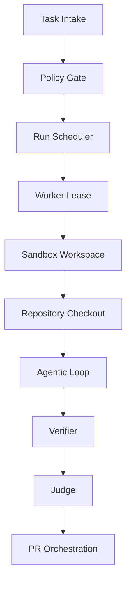
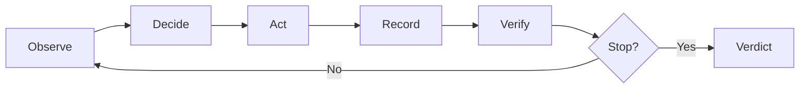
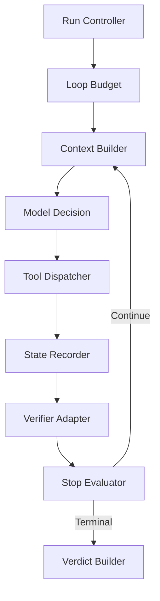
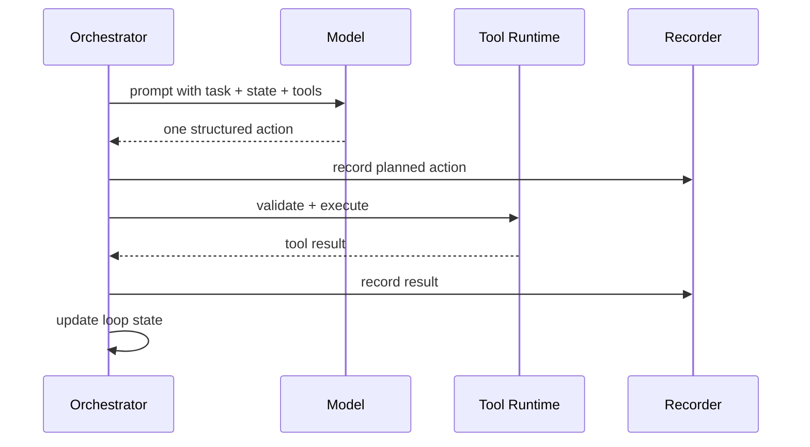
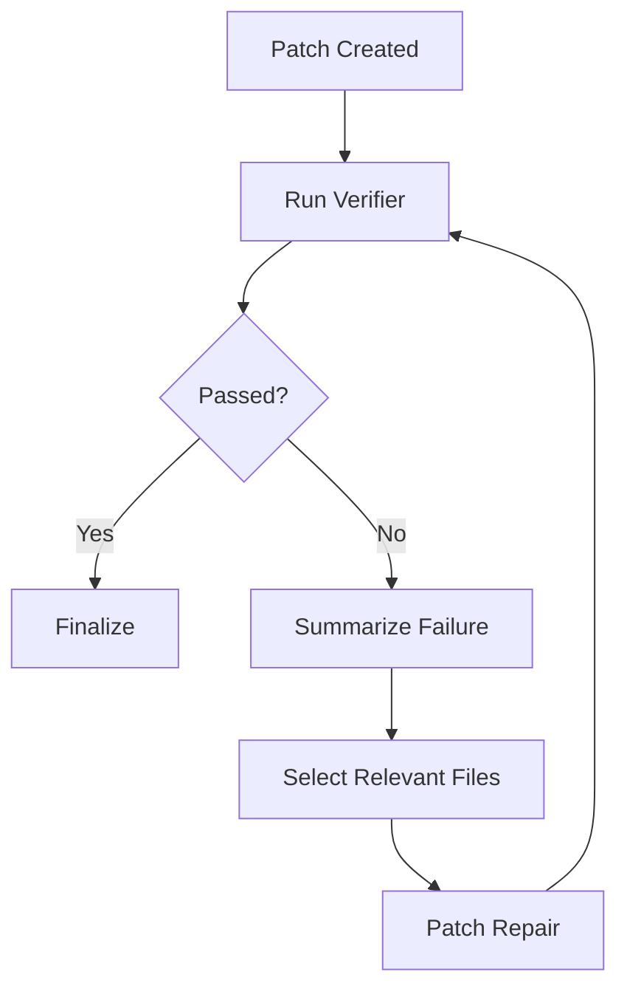
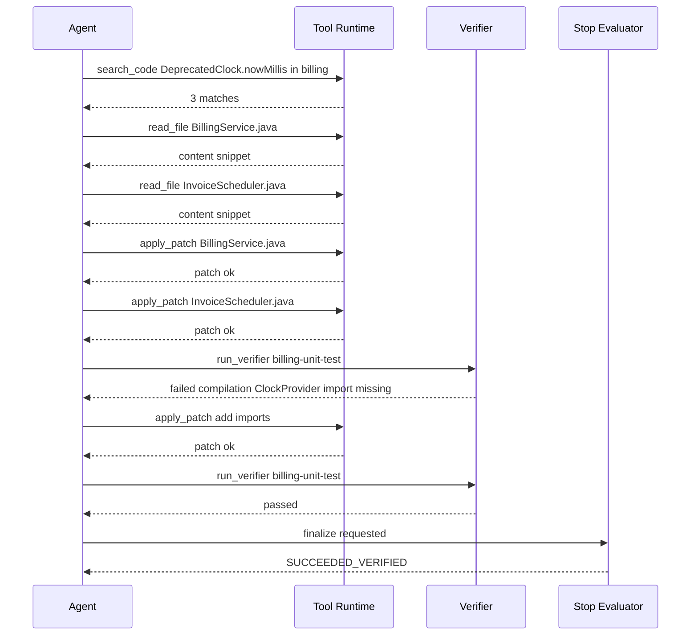
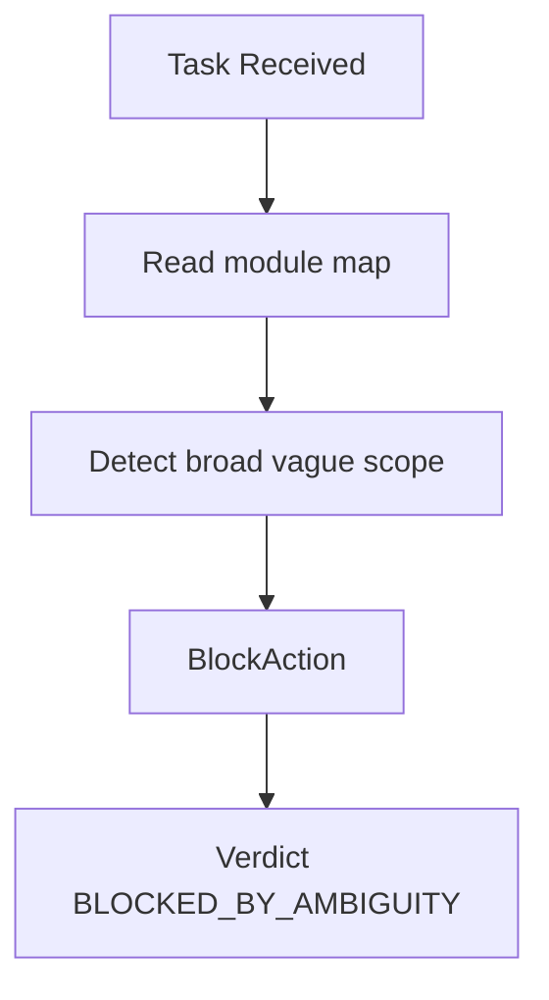
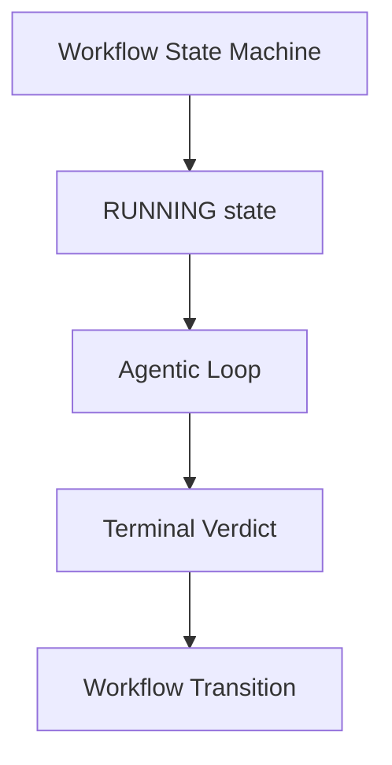

------
title: Learn AI Coding Agent From Scratch - Part 021
description: Membangun agentic loop dari nol untuk Honk-like AI coding agent: observe, plan, act, verify, repair, stop, dan menghasilkan artifact yang bisa diaudit.
series: learn-ai-coding-agent
seriesTitle: Learn AI Coding Agent From Scratch
order: 21
partTitle: Agentic Loop From Scratch
tags:
- ai-coding-agent
- agentic-loop
- code-automation
- verifier
- sandbox
- series
date: 2026-07-03
---

# Part 021 — Agentic Loop From Scratch

Di part sebelumnya kita sudah punya substrate eksekusi: repository ingestion, sandbox foundation, dan permission model. Sekarang kita mulai membangun bagian yang sering disalahpahami sebagai “inti agent”: **agentic loop**.

Yang akan kita bangun bukan sekadar:

> kirim prompt ke LLM → terima jawaban → tulis file.

Itu terlalu rapuh untuk sistem yang boleh mengubah repository nyata.

Yang kita butuhkan adalah loop perubahan kode yang:

1. menerima task yang scoped,
2. membaca konteks secara bertahap,
3. membuat rencana yang bisa diuji,
4. memilih tool secara eksplisit,
5. mengeksekusi perubahan di sandbox,
6. menjalankan verifier,
7. memperbaiki error secara iteratif,
8. berhenti dengan alasan yang jelas,
9. menghasilkan artifact yang bisa direview manusia.

Mental model utamanya:

> Agentic loop bukan “LLM yang bebas bekerja”. Agentic loop adalah **control loop deterministik** yang memakai LLM sebagai policy/planning/editing component di bawah batasan state machine, permission, budget, verifier, dan audit.

Kita akan membangun dari kecil, tetapi setiap bagian harus production-shaped.

---

## 1. Posisi Part Ini Dalam Arsitektur

Sampai sekarang arsitektur kita seperti ini:



Part ini fokus pada node `Agentic Loop`.

Namun loop tidak berdiri sendiri. Ia harus tunduk pada komponen lain:

| Komponen | Apa yang Dibatasi |
|---|---|
| Policy gate | Apakah task boleh dijalankan |
| Permission model | Tool apa yang boleh dipakai |
| Sandbox | File/network/process boundary |
| Scheduler | Berapa lama run boleh hidup |
| Budget manager | Token, cost, tool call, retry |
| Verifier | Bukti bahwa perubahan valid |
| Judge | Apakah diff sesuai intent |
| Artifact registry | Semua bukti kerja tersimpan |

Kalau agentic loop tidak tunduk pada batas ini, ia berubah menjadi automation risk.

---

## 2. Definisi Agentic Loop

Kita definisikan agentic loop sebagai:

> Siklus berulang yang mengubah state repository menuju target task melalui observasi, keputusan model, pemanggilan tool, interpretasi hasil, dan verifikasi, sampai mencapai terminal verdict.

Bentuk minimalnya:



Loop ini mirip feedback control system:

| Control system | Coding agent |
|---|---|
| Target state | Task success criteria |
| Sensor | File read, search, test output, git diff |
| Controller | Agent runtime + LLM decision |
| Actuator | Tool calls: read, write, patch, shell, git |
| Feedback | Tool result + verifier output |
| Error signal | Difference between expected and actual state |
| Stop condition | Verified success, blocked, failed, budget exhausted |

Dengan model ini, kita tidak menanyakan “bagaimana membuat agent pintar?” terlebih dahulu.

Kita menanyakan:

> Feedback apa yang agent butuhkan agar bisa mengoreksi dirinya sendiri tanpa melewati batas aman?

---

## 3. Loop Bukan Reasoning Trace

Dalam implementasi nyata, jangan menyamakan agentic loop dengan chain-of-thought.

Yang perlu disimpan dan diaudit adalah:

1. input task,
2. instruksi sistem,
3. context yang diberikan,
4. tool yang dipanggil,
5. argument tool,
6. output tool,
7. patch/diff,
8. hasil verifier,
9. keputusan stop,
10. summary langkah.

Yang tidak perlu dijadikan artifact publik adalah private hidden reasoning model.

Untuk sistem enterprise, artifact yang berguna bukan “isi pikiran model”, tetapi:

> mengapa tool tertentu dipanggil, apa hasilnya, perubahan apa yang terjadi, bukti apa yang mendukung verdict.

Kita akan membuat `StepSummary`, bukan reasoning transcript.

---

## 4. Invariant Agentic Loop

Sebelum menulis loop, tetapkan invariant.

Invariant minimum:

1. **No invisible mutation** — setiap perubahan file harus muncul di diff artifact.
2. **No unbounded loop** — loop harus punya max step, max time, max token, max retry.
3. **No direct host execution** — semua command berjalan di sandbox.
4. **No tool without permission** — tool call divalidasi sebelum dispatch.
5. **No success without verification** — status success butuh minimal verifier yang relevan.
6. **No PR from dirty unknown state** — PR hanya boleh dibuat dari branch, base SHA, dan diff yang diketahui.
7. **No swallowed failure** — error tool/verifier harus menjadi step artifact.
8. **No context amnesia without summary** — context compression harus meninggalkan summary yang bisa diaudit.
9. **No model-only authority** — LLM boleh mengusulkan, orchestrator yang memutuskan transition.
10. **No secret in model context** — secret tidak boleh masuk prompt/tool result yang dikirim ke model.

Loop yang melanggar invariant ini tidak layak disebut production-grade.

---

## 5. Terminal State

Agentic loop harus punya terminal state yang eksplisit.

Jangan hanya `done` atau `failed`.

Gunakan verdict yang menjelaskan *kenapa* loop berhenti:

| Verdict | Arti |
|---|---|
| `SUCCEEDED_VERIFIED` | Perubahan dibuat dan verifier relevan lolos |
| `SUCCEEDED_WITH_WARNINGS` | Verifier utama lolos, tetapi ada warning non-blocking |
| `NO_CHANGE_NEEDED` | Task valid, repo sudah memenuhi target |
| `BLOCKED_BY_POLICY` | Permission/policy mencegah aksi |
| `BLOCKED_BY_AMBIGUITY` | Task tidak cukup jelas untuk perubahan aman |
| `BLOCKED_BY_MISSING_CONTEXT` | Repo/instruksi/dependency tidak cukup |
| `FAILED_VERIFICATION` | Agent membuat patch tetapi verifier tetap gagal |
| `FAILED_TOOL_ERROR` | Tool/sandbox error mencegah progress |
| `FAILED_BUDGET_EXHAUSTED` | Step/time/token/retry budget habis |
| `FAILED_INTERNAL_ERROR` | Bug platform/orchestrator |

Perbedaan ini penting untuk observability dan improvement loop.

`FAILED_VERIFICATION` berarti agent bisa saja perlu model lebih baik atau feedback verifier lebih baik.

`BLOCKED_BY_POLICY` berarti sistem bekerja benar.

`FAILED_INTERNAL_ERROR` berarti bug platform.

Jangan campur semuanya menjadi satu `failed`.

---

## 6. Struktur Loop yang Akan Dibangun

Kita akan membagi loop menjadi enam layer:



### 6.1 Run Controller

Mengikat loop ke run state machine.

Tugasnya:

1. memastikan run masih punya lease,
2. memeriksa cancellation,
3. membuka sandbox session,
4. memulai loop,
5. menulis terminal verdict,
6. membersihkan resource.

### 6.2 Loop Budget

Mengontrol batas:

1. max steps,
2. max tool calls,
3. max LLM calls,
4. max verifier attempts,
5. max wall-clock duration,
6. max token input/output,
7. max cost,
8. max patch size,
9. max changed files.

### 6.3 Context Builder

Menyusun input model dari:

1. task contract,
2. repository instructions,
3. run state summary,
4. available tools,
5. relevant file snippets,
6. previous step summaries,
7. verifier output terakhir,
8. current diff summary.

### 6.4 Model Decision

Meminta LLM memilih next action:

1. read/search more context,
2. edit file,
3. run verifier,
4. summarize progress,
5. declare blocked,
6. declare ready for final verification.

### 6.5 Tool Dispatcher

Menjalankan tool secara aman:

1. validate schema,
2. check permission,
3. normalize path,
4. enforce timeout,
5. execute in sandbox,
6. redact output,
7. persist result.

### 6.6 Stop Evaluator

Bukan model yang memutuskan success final sendirian.

Stop evaluator memakai bukti:

1. latest diff,
2. verifier report,
3. policy checks,
4. budget,
5. model final answer,
6. judge optional.

---

## 7. Data Model Runtime

Kita mulai dari record sederhana.

```java
public record AgentRunContext(
    RunId runId,
    TaskContract task,
    RepoWorkspace workspace,
    PermissionProfile permissions,
    LoopBudget budget,
    AgentMemory memory,
    ToolRegistry tools,
    VerifierRegistry verifiers
) {}
```

`AgentRunContext` bukan tempat menyimpan semua log. Ia adalah handle runtime.

State persistent tetap berada di database/artifact store.

```java
public record LoopState(
    int stepIndex,
    int llmCallCount,
    int toolCallCount,
    int verifierAttemptCount,
    long startedAtEpochMillis,
    DiffSummary currentDiff,
    VerificationReport latestVerification,
    List<StepSummary> recentSteps,
    boolean cancellationRequested
) {}
```

`LoopState` harus kecil dan bisa diserialisasi.

Kalau worker crash, kita harus bisa reconstruct state dari database.

---

## 8. Action Model

LLM tidak boleh mengembalikan teks bebas yang langsung dieksekusi.

Ia harus memilih action dari contract.

```java
public sealed interface AgentAction permits
    ReadFileAction,
    SearchCodeAction,
    ApplyPatchAction,
    RunCommandAction,
    RunVerifierAction,
    SummarizeAction,
    FinalizeAction,
    BlockAction {
}
```

Contoh action:

```java
public record ReadFileAction(
    String path,
    int startLine,
    int endLine,
    String purpose
) implements AgentAction {}

public record ApplyPatchAction(
    String path,
    String unifiedDiff,
    String purpose
) implements AgentAction {}

public record RunVerifierAction(
    String verifierId,
    String purpose
) implements AgentAction {}

public record FinalizeAction(
    String claimedOutcome,
    List<String> evidenceRefs
) implements AgentAction {}

public record BlockAction(
    String reasonCode,
    String explanation,
    List<String> missingInputs
) implements AgentAction {}
```

Perhatikan field `purpose`.

Ini bukan untuk membuat model “lebih sopan”. Ini untuk audit.

Ketika agent memanggil command berat, kita ingin tahu:

> Command ini dipanggil untuk membuktikan apa?

---

## 9. Tool Result Semantics

Tool result tidak cukup hanya stdout/stderr.

Kita perlu status yang bermakna.

```java
public record ToolResult(
    ToolCallId id,
    ToolName toolName,
    ToolStatus status,
    String summary,
    String stdoutRef,
    String stderrRef,
    List<ArtifactRef> artifacts,
    Duration duration,
    boolean redacted,
    Optional<String> policyDecisionId
) {}
```

Status:

| Status | Arti |
|---|---|
| `OK` | Tool berhasil secara teknis |
| `USER_ERROR` | Argumen salah, file tidak ada, command invalid |
| `POLICY_DENIED` | Permission menolak tool call |
| `TIMEOUT` | Tool melewati batas waktu |
| `SANDBOX_ERROR` | Sandbox gagal menjalankan tool |
| `OUTPUT_TRUNCATED` | Output dipotong tetapi artifact penuh disimpan |
| `INTERNAL_ERROR` | Bug platform |

Jangan langsung mengirim output besar ke model.

Gunakan tiga level:

1. short summary untuk model,
2. truncated output untuk context,
3. full artifact untuk audit.

---

## 10. Skeleton Agentic Loop

Berikut skeleton awal.

```java
public final class AgentLoopRunner {
    private final ContextBuilder contextBuilder;
    private final LlmClient llmClient;
    private final ActionParser actionParser;
    private final ToolDispatcher toolDispatcher;
    private final VerifierRunner verifierRunner;
    private final StopEvaluator stopEvaluator;
    private final RunRecorder recorder;
    private final Clock clock;

    public RunVerdict run(AgentRunContext ctx) {
        LoopState state = LoopState.initial(clock.millis());

        while (true) {
            BudgetDecision budgetDecision = ctx.budget().evaluate(state, clock.millis());
            if (budgetDecision.exhausted()) {
                return recorder.finish(ctx.runId(), RunVerdict.budgetExhausted(budgetDecision.reason()));
            }

            if (recorder.isCancellationRequested(ctx.runId())) {
                return recorder.finish(ctx.runId(), RunVerdict.cancelledByUser());
            }

            StopDecision stop = stopEvaluator.evaluate(ctx, state);
            if (stop.terminal()) {
                return recorder.finish(ctx.runId(), stop.toVerdict());
            }

            AgentPrompt prompt = contextBuilder.build(ctx, state);
            LlmResponse response = llmClient.complete(prompt);
            AgentAction action = actionParser.parse(response);

            StepRecord step = recorder.startStep(ctx.runId(), state.stepIndex(), action);

            StepOutcome outcome;
            try {
                outcome = executeAction(ctx, state, action);
            } catch (Exception ex) {
                outcome = StepOutcome.internalError(ex);
            }

            recorder.finishStep(step.id(), outcome);
            state = state.next(outcome);
        }
    }

    private StepOutcome executeAction(AgentRunContext ctx, LoopState state, AgentAction action) {
        return switch (action) {
            case ReadFileAction a -> toolDispatcher.dispatch(ctx, a);
            case SearchCodeAction a -> toolDispatcher.dispatch(ctx, a);
            case ApplyPatchAction a -> toolDispatcher.dispatch(ctx, a);
            case RunCommandAction a -> toolDispatcher.dispatch(ctx, a);
            case RunVerifierAction a -> verifierRunner.run(ctx, a);
            case SummarizeAction a -> StepOutcome.memoryUpdated(a.summary());
            case FinalizeAction a -> StepOutcome.finalizeRequested(a);
            case BlockAction a -> StepOutcome.blockRequested(a);
        };
    }
}
```

Ada satu prinsip penting:

> LLM hanya menghasilkan action. Orchestrator tetap mengontrol loop.

---

## 11. Mengapa StopEvaluator Dipanggil Sebelum Model?

Perhatikan skeleton tadi: `stopEvaluator.evaluate()` dipanggil sebelum membuat LLM call berikutnya.

Alasannya:

1. menghemat biaya,
2. mencegah loop terus berjalan setelah success terbukti,
3. mencegah model memperbesar scope setelah task selesai,
4. memberi determinisme pada terminal condition,
5. mencegah model “ingin mencoba sedikit lagi” tanpa manfaat.

Contoh:

Agent sudah membuat diff, menjalankan `mvn test`, verifier lolos, judge lolos. Tidak perlu memanggil model lagi hanya untuk bertanya “apakah selesai?”.

Stop evaluator bisa langsung terminal:

```java
if (state.latestVerification().passed()
    && state.currentDiff().withinPolicy()
    && state.hasFinalizeRequested()) {
    return StopDecision.succeededVerified();
}
```

Namun untuk beberapa mode, kita boleh mensyaratkan final summary dari model.

Misalnya PR body butuh penjelasan human-readable.

Tetapi summary bukan otoritas success.

---

## 12. Action Parser

LLM output harus diparse secara ketat.

Jangan biarkan output ambigu seperti:

```text
I will update UserService.java and then run tests.
```

Itu bukan action.

Action harus structured.

Contoh bentuk JSON internal:

```json
{
  "action": "read_file",
  "path": "src/main/java/com/acme/UserService.java",
  "startLine": 1,
  "endLine": 220,
  "purpose": "Inspect current API usage before migration"
}
```

Parser harus menolak:

1. action tidak dikenal,
2. path absolut,
3. path keluar workspace,
4. missing required field,
5. command kosong,
6. patch tanpa purpose,
7. tool call berantai dalam satu response jika policy hanya mengizinkan satu action per step.

Parser mengubah LLM response menjadi `AgentAction` atau `InvalidAction`.

`InvalidAction` juga harus masuk loop sebagai feedback.

```java
public sealed interface ParsedActionResult permits ParsedAction, InvalidAction {}

public record ParsedAction(AgentAction action) implements ParsedActionResult {}

public record InvalidAction(
    String reason,
    String rawResponseArtifactRef
) implements ParsedActionResult {}
```

Dengan begitu model bisa dikoreksi:

> Your previous action was invalid because `path` escaped the workspace. Choose a valid repository-relative path.

---

## 13. One Action Per Step vs Multi Action Per Step

Untuk implementasi awal, gunakan **one action per step**.

Kenapa?

1. audit lebih jelas,
2. permission check lebih mudah,
3. rollback mental lebih sederhana,
4. output tool bisa menjadi feedback sebelum action berikutnya,
5. mencegah model membuat batch action yang salah semua.

Multi-action bisa dipakai nanti untuk optimasi, misalnya beberapa read-only search parallel.

Tapi default untuk code mutation harus satu action per step.



---

## 14. Context Builder

Context builder adalah bagian yang menentukan kualitas agent.

LLM yang sama bisa terlihat pintar atau bodoh tergantung konteks.

Kita jangan memasukkan seluruh repository. Kita memasukkan konteks yang diperlukan untuk step berikutnya.

Komponen prompt:

```text
SYSTEM:
You are a coding agent running inside a sandbox. You may only act through tools.
You must preserve task scope and produce verifiable changes.

DEVELOPER POLICY:
- Do not edit files outside allowed paths.
- Do not introduce secrets.
- Prefer minimal diff.
- Run relevant verifier before finalizing.

TASK CONTRACT:
...

REPOSITORY INSTRUCTIONS:
...

CURRENT STATE:
- step: 7/40
- changed files: 2
- latest verifier: failed: compilation error in UserMapperTest

AVAILABLE TOOLS:
- read_file
- search_code
- apply_patch
- run_verifier

RECENT OBSERVATIONS:
...

CURRENT DIFF SUMMARY:
...

REQUEST:
Choose exactly one next action as JSON.
```

Kunci penting:

1. context harus menyebut **batas**, bukan hanya tujuan,
2. context harus menyebut **state**, bukan hanya task awal,
3. context harus menyebut **feedback verifier terakhir**,
4. context harus menyebut **tool contract**,
5. context harus memaksa output structured.

---

## 15. Agent Memory

Untuk part ini, memory cukup berupa:

1. `TaskSummary`,
2. `RepoSummary`,
3. `ProgressSummary`,
4. `KnownFacts`,
5. `FailedAttempts`,
6. `DecisionLog`,
7. `OpenQuestions`.

Contoh:

```java
public record AgentMemory(
    String taskSummary,
    String repoSummary,
    List<String> knownFacts,
    List<String> failedAttempts,
    List<String> openQuestions,
    List<StepSummary> compressedHistory
) {}
```

Memory bukan tempat menyimpan semua file.

Memory adalah ringkasan yang membantu agent tetap konsisten ketika context window terbatas.

Rule penting:

> Jika sebuah fakta dipakai untuk mengubah kode, fakta itu harus bisa ditelusuri ke artifact: file read, search result, verifier output, atau diff.

Jadi `knownFacts` sebaiknya punya reference:

```java
public record KnownFact(
    String statement,
    List<ArtifactRef> evidence
) {}
```

---

## 16. Verifier Sebagai Tool Khusus

Verifier bukan shell command biasa.

Verifier adalah tool dengan semantics khusus:

1. punya nama stabil,
2. punya purpose,
3. punya timeout,
4. punya expected signal,
5. output-nya diringkas untuk feedback,
6. hasilnya dipakai stop evaluator.

Contoh verifier:

```java
public record VerifierSpec(
    String id,
    String displayName,
    List<String> command,
    Duration timeout,
    List<String> expectedArtifacts,
    boolean blocking
) {}
```

Contoh:

```yaml
verifiers:
  - id: maven-test
    displayName: Maven test
    command: ["./mvnw", "test"]
    timeoutSeconds: 600
    blocking: true
  - id: format-check
    displayName: Format check
    command: ["./mvnw", "spotless:check"]
    timeoutSeconds: 300
    blocking: false
```

Kenapa verifier tidak cukup `run_command`?

Karena `run_command` hanya menghasilkan exit code.

Verifier menghasilkan **evidence**.

---

## 17. Repair Loop

Agent coding yang serius harus bisa memperbaiki error dari verifier.

Repair loop umum:



Namun repair loop harus punya batas.

Contoh policy:

| Failure type | Max repair attempt |
|---|---:|
| Formatting | 3 |
| Compilation | 5 |
| Unit test assertion | 4 |
| Integration environment | 2 |
| Flaky test suspected | 1 |
| Unknown failure | 2 |

Jangan biarkan agent memperbaiki tanpa batas.

Kalau error terus berubah dan diff makin besar, agent mungkin sedang tersesat.

Gunakan stop heuristic:

1. patch size tumbuh cepat,
2. changed files melewati threshold,
3. error berpindah ke area tidak terkait,
4. agent mengubah test untuk menyesuaikan bug tanpa alasan,
5. verifier gagal dengan root cause sama lebih dari N kali.

---

## 18. Diff-Aware Loop State

Loop harus tahu diff saat ini.

Tidak cukup menyimpan “agent sudah mengedit file”.

Kita butuh:

```java
public record DiffSummary(
    int changedFileCount,
    int addedLines,
    int deletedLines,
    List<ChangedFileSummary> files,
    boolean touchesForbiddenPath,
    boolean touchesTestOnly,
    boolean includesLockfile,
    boolean includesGeneratedFile
) {}
```

Ini dipakai untuk:

1. policy check,
2. judge prompt,
3. PR body,
4. stop evaluator,
5. anomaly detection.

Contoh failure:

Task: “migrate one deprecated API usage”.

Agent mengubah 27 file dan memperbarui framework version.

Verifier mungkin hijau, tetapi diff melanggar scope.

Diff-aware stop evaluator harus menolak.

---

## 19. Step Recording

Setiap step harus terekam.

Minimal:

```java
public record StepRecord(
    StepId id,
    RunId runId,
    int stepIndex,
    StepType type,
    Instant startedAt,
    Instant finishedAt,
    String actionJson,
    String actionPurpose,
    StepStatus status,
    List<ArtifactRef> inputArtifacts,
    List<ArtifactRef> outputArtifacts,
    String summary
) {}
```

Step bukan hanya log. Step adalah audit unit.

Gunanya:

1. replay run,
2. debug failure,
3. train evaluator,
4. build dashboard,
5. detect repeated failure,
6. produce PR explanation.

---

## 20. Minimal Tool Set Untuk Loop Awal

Jangan mulai dengan terlalu banyak tool.

Minimal tool set:

| Tool | Purpose |
|---|---|
| `read_file` | Membaca file spesifik |
| `search_code` | Mencari symbol/text |
| `list_files` | Navigasi repo terbatas |
| `apply_patch` | Mengubah file via patch |
| `run_verifier` | Menjalankan verifier terdaftar |
| `git_diff` | Melihat diff saat ini |
| `summarize_progress` | Memperbarui memory |
| `finalize` | Meminta terminal evaluation |
| `block` | Menghentikan karena alasan eksplisit |

Hindari memberi shell bebas di tahap awal.

Shell bebas memperbesar kapabilitas agent secara drastis:

1. bisa mengunduh package,
2. bisa menjalankan script repo,
3. bisa membaca banyak file,
4. bisa menulis file tidak lewat patch tool,
5. bisa menghasilkan output besar.

Kita akan tetap punya shell tool di part lain, tetapi agentic loop dasar harus bisa bekerja dengan tool minimal.

---

## 21. Implementasi Apply Patch

Untuk coding agent, `apply_patch` lebih aman daripada `write_file` penuh.

Kenapa?

1. diff terlihat eksplisit,
2. konflik bisa dideteksi,
3. perubahan lebih kecil,
4. bisa divalidasi terhadap file version,
5. patch bisa ditolak jika menyentuh area terlarang.

Contract:

```java
public record ApplyPatchRequest(
    String path,
    String baseSha256,
    String unifiedDiff,
    String purpose
) {}
```

`baseSha256` memastikan agent mengedit versi file yang sama dengan yang dibaca.

Kalau file sudah berubah, patch ditolak:

```text
Patch rejected: file content hash mismatch. Re-read the file before patching.
```

Ini mencegah agent membuat patch dari konteks stale.

---

## 22. Failure Feedback Untuk Model

Feedback ke model harus ringkas dan actionable.

Jangan kirim 20.000 baris Maven log mentah.

Gunakan format:

```text
Verifier `maven-test` failed.

Primary error:
- Compilation failure in UserMapperTest.java:42
- Cannot find symbol: method toDtoV2(User)

Likely relevant files:
- src/main/java/com/acme/UserMapper.java
- src/test/java/com/acme/UserMapperTest.java

Full log artifact:
- artifact://run/123/verifier/maven-test/stderr

Choose one next action.
```

Feedback yang buruk:

```text
Tests failed. Try again.
```

Itu membuat model menebak.

Feedback yang terlalu panjang juga buruk karena menghabiskan context window dan menyembunyikan signal.

---

## 23. Handling Ambiguity

Agent tidak selalu harus mengubah kode.

Untuk task ambiguity tinggi, action terbaik adalah `block`.

Contoh:

> Upgrade authentication logic to the new secure way.

Ini terlalu ambigu.

Agent boleh melakukan analysis-only, tetapi tidak boleh autonomous PR kecuali task contract jelas.

Block response:

```json
{
  "action": "block",
  "reasonCode": "BLOCKED_BY_AMBIGUITY",
  "explanation": "The task does not specify the target authentication API, expected behavior, or verifier.",
  "missingInputs": [
    "target API or library version",
    "expected authentication flow",
    "relevant tests or acceptance criteria"
  ]
}
```

Dalam platform Honk-like, blocked run bukan kegagalan.

Itu safety outcome.

---

## 24. Handling No-Change Needed

Agent juga harus bisa menyimpulkan tidak perlu perubahan.

Contoh task:

> Replace all usage of deprecated FooClient#executeLegacy with FooClient#execute.

Agent search code dan tidak menemukan `executeLegacy`.

Terminal verdict:

```text
NO_CHANGE_NEEDED
Evidence:
- search_code result: 0 matches for executeLegacy
- repository base SHA: abc123
```

Jangan membuat PR kosong kecuali workflow memang membutuhkan record.

---

## 25. Budget Model

Budget bukan hanya token.

```java
public record LoopBudget(
    int maxSteps,
    int maxLlmCalls,
    int maxToolCalls,
    int maxVerifierRuns,
    int maxChangedFiles,
    int maxAddedLines,
    int maxDeletedLines,
    Duration maxDuration,
    BigDecimal maxCostUsd
) {}
```

Budget harus dievaluasi sebelum action dan setelah action.

Kenapa setelah action?

Karena satu patch bisa tiba-tiba mengubah banyak file.

Kalau melewati budget, stop dengan evidence.

---

## 26. Stop Evaluator Detail

Pseudo-code:

```java
public StopDecision evaluate(AgentRunContext ctx, LoopState state) {
    if (ctx.budget().isExhausted(state)) {
        return StopDecision.terminal(VerdictCode.FAILED_BUDGET_EXHAUSTED);
    }

    if (state.currentDiff().touchesForbiddenPath()) {
        return StopDecision.terminal(VerdictCode.BLOCKED_BY_POLICY);
    }

    if (state.latestOutcome() instanceof BlockRequested block) {
        return StopDecision.terminal(block.toVerdict());
    }

    if (state.latestOutcome() instanceof FinalizeRequested) {
        if (state.currentDiff().isEmpty() && state.hasNoChangeEvidence()) {
            return StopDecision.terminal(VerdictCode.NO_CHANGE_NEEDED);
        }

        if (state.latestVerification().passed() && state.currentDiff().withinScope()) {
            return StopDecision.terminal(VerdictCode.SUCCEEDED_VERIFIED);
        }

        return StopDecision.continueWithHint("Final verification is missing or failing.");
    }

    if (state.repeatedSameVerifierFailureTooOften()) {
        return StopDecision.terminal(VerdictCode.FAILED_VERIFICATION);
    }

    return StopDecision.continueLoop();
}
```

Key point:

> `FinalizeRequested` dari model bukan final. Itu permintaan untuk dievaluasi.

---

## 27. Contoh Loop: API Migration Kecil

Task:

```text
Replace usage of DeprecatedClock.nowMillis() with ClockProvider.currentMillis() in module billing.
Do not change behavior. Run unit tests for billing module.
```

Flow:



Agent tidak “langsung tahu”. Agent bergerak melalui feedback.

---

## 28. Contoh Loop: Blocked By Scope

Task:

```text
Modernize the whole payment module.
```

Agent boleh inspect repository.

Tetapi untuk autonomous PR, task ini terlalu luas.

Flow:



Output bukan “saya tidak bisa”. Output harus actionable:

1. scope terlalu luas,
2. acceptance criteria tidak jelas,
3. suggested decomposition:
   - dependency upgrade,
   - deprecated API migration,
   - test coverage gap,
   - config cleanup.

---

## 29. Agentic Loop vs Workflow Engine

Loop ini bukan pengganti workflow engine.

Gunakan workflow/state machine untuk lifecycle besar:

1. queued,
2. preparing,
3. running,
4. verifying,
5. judging,
6. waiting approval,
7. PR created,
8. completed.

Gunakan agentic loop untuk pekerjaan di dalam `running`.



Jangan biarkan LLM mengontrol state machine global.

LLM hanya memberi action proposal di dalam boundary.

---

## 30. Local Prototype Architecture

Untuk prototype lokal:

```text
apps/
  worker/
    AgentWorker.java
core/
  agent-runtime/
    AgentLoopRunner.java
    ContextBuilder.java
    StopEvaluator.java
    ActionParser.java
  tool-runtime/
    ToolDispatcher.java
    ReadFileTool.java
    SearchCodeTool.java
    ApplyPatchTool.java
  verifier/
    VerifierRunner.java
    MavenVerifier.java
  recorder/
    RunRecorder.java
```

Prototype pertama tidak perlu Kafka, Kubernetes, atau multi-tenant.

Tetapi interface-nya harus tidak mengunci ke lokal.

---

## 31. Testing Agentic Loop

Jangan test agentic loop hanya dengan live LLM.

Buat fake model.

```java
public final class ScriptedLlmClient implements LlmClient {
    private final Queue<LlmResponse> responses;

    public ScriptedLlmClient(List<LlmResponse> responses) {
        this.responses = new ArrayDeque<>(responses);
    }

    @Override
    public LlmResponse complete(AgentPrompt prompt) {
        if (responses.isEmpty()) {
            throw new IllegalStateException("No scripted response left");
        }
        return responses.remove();
    }
}
```

Test case:

1. model memilih `read_file`, tool sukses,
2. model memilih patch invalid, parser menolak,
3. model memilih forbidden path, policy menolak,
4. verifier gagal lalu model repair,
5. verifier lolos lalu finalize,
6. max step habis,
7. cancellation diterima,
8. repeated same failure menyebabkan terminal failed.

Agent platform yang tidak bisa dites deterministik akan sulit dioperasikan.

---

## 32. Anti-Pattern

### Anti-pattern 1 — Model owns the loop

```text
Please solve this task. You may run commands as needed.
```

Tanpa structured action, budget, permission, dan verifier.

Ini cocok untuk eksperimen lokal, bukan background agent fleet.

### Anti-pattern 2 — Verifier hanya di akhir

Jika verifier hanya dipakai setelah diff besar, repair menjadi mahal.

Gunakan verifier bertahap:

1. compile setelah perubahan API,
2. unit test setelah compile,
3. full suite sebelum finalize.

### Anti-pattern 3 — Semua output tool masuk context

Output panjang membuat model kehilangan signal.

Gunakan summarizer dan artifact references.

### Anti-pattern 4 — Agent boleh mengubah test tanpa aturan

Agent bisa “membuat test hijau” dengan merusak test.

Policy harus membedakan:

1. boleh update test karena behavior berubah secara sengaja,
2. boleh add regression test,
3. tidak boleh delete assertion tanpa justification,
4. tidak boleh skip/disable test tanpa approval.

### Anti-pattern 5 — Success berdasarkan model confidence

“Looks good” bukan evidence.

Success butuh verifier, diff scope, dan judge/policy check.

---

## 33. Checklist Implementasi Part Ini

Agentic loop minimum siap jika:

- [ ] punya `AgentLoopRunner`,
- [ ] action output structured,
- [ ] one action per step,
- [ ] tool dispatch lewat permission check,
- [ ] semua step persisted,
- [ ] patch memakai diff/hash guard,
- [ ] verifier punya semantics khusus,
- [ ] stop evaluator deterministik,
- [ ] budget dievaluasi,
- [ ] cancellation dicek,
- [ ] full artifact disimpan,
- [ ] context ke model sudah diringkas,
- [ ] no success tanpa verification,
- [ ] fake LLM test tersedia.

---

## 34. Failure Drill

Jalankan drill berikut saat implementasi:

### Drill 1 — Model memanggil forbidden path

Task meminta ubah `src/main`, model mencoba edit `.github/workflows/deploy.yml`.

Expected:

1. `apply_patch` ditolak policy,
2. step tercatat `POLICY_DENIED`,
3. model mendapat feedback,
4. jika berulang, terminal `BLOCKED_BY_POLICY` atau `FAILED_POLICY_REPEATED`.

### Drill 2 — Verifier gagal terus

Model memperbaiki compile error lima kali, error sama tetap muncul.

Expected:

1. repeated failure detected,
2. loop berhenti,
3. artifact menyimpan semua attempt,
4. verdict `FAILED_VERIFICATION`,
5. PR tidak dibuat otomatis.

### Drill 3 — Agent membuat diff terlalu besar

Task kecil, diff melewati 20 files.

Expected:

1. diff budget violated,
2. terminal blocked/failed,
3. patch artifact tetap disimpan,
4. tidak ada PR autonomous.

### Drill 4 — No change needed

Search menunjukkan target deprecated API sudah tidak ada.

Expected:

1. no patch,
2. evidence search artifact,
3. verdict `NO_CHANGE_NEEDED`.

---

## 35. Ringkasan

Agentic loop yang layak production bukan loop bebas yang “membiarkan LLM bekerja”.

Ia adalah:

1. stateful,
2. budgeted,
3. tool-constrained,
4. sandboxed,
5. verifier-driven,
6. diff-aware,
7. auditable,
8. stoppable,
9. testable secara deterministik.

Kalau satu kalimat yang perlu diingat:

> LLM boleh memilih langkah berikutnya, tetapi platform harus mengontrol batas, bukti, dan keputusan akhir.

Di part berikutnya kita akan membangun abstraction layer untuk LLM provider. Ini penting karena agentic loop tidak boleh bergantung pada satu API shape. Kita butuh interface yang bisa menormalisasi message, tool call, streaming, structured output, usage, retry, dan provider-specific behavior.
