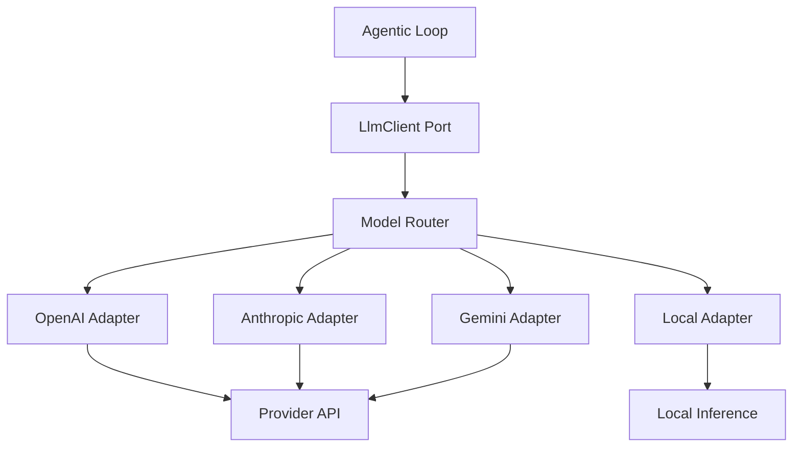
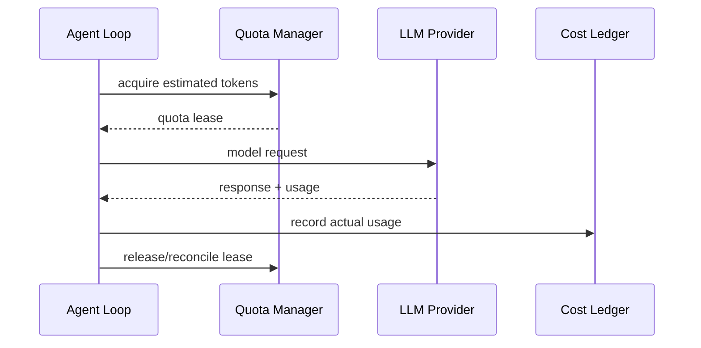

------
title: Learn AI Coding Agent From Scratch - Part 022
description: Mendesain abstraction layer untuk LLM provider agar AI coding agent bisa memakai OpenAI, Anthropic, Gemini, local model, retry, streaming, tool calling, structured output, token accounting, dan provider fallback dengan aman.
series: learn-ai-coding-agent
seriesTitle: Learn AI Coding Agent From Scratch
order: 22
partTitle: LLM Provider Abstraction
tags:
- ai-coding-agent
- llm-provider
- tool-calling
- openai
- anthropic
- gemini
- abstraction
- series
date: 2026-07-03
---

# Part 022 — LLM Provider Abstraction

Di part sebelumnya kita membangun agentic loop. Loop itu membutuhkan `LlmClient`.

Sekarang kita desain `LlmClient` dengan benar.

Kesalahan umum dalam membangun coding agent adalah langsung menulis kode seperti:

```java
OpenAIClient client = new OpenAIClient(apiKey);
String answer = client.chat(prompt);
```

Ini mungkin cukup untuk demo.

Untuk Honk-like coding agent, itu terlalu sempit.

Agent kita butuh LLM provider abstraction karena:

1. provider punya API shape berbeda,
2. format tool calling berbeda,
3. streaming event berbeda,
4. token accounting berbeda,
5. error/rate limit berbeda,
6. model capability berubah,
7. fallback butuh normalisasi,
8. evaluation butuh replay,
9. enterprise deployment bisa memakai provider berbeda,
10. local/offline mode butuh fake/model adapter.

Kita tidak ingin agentic loop tahu apakah model berasal dari OpenAI Responses API, Anthropic Messages API, Gemini API, atau local inference server.

Agentic loop harus bicara dengan **domain interface** milik kita.

---

## 1. Prinsip Desain

LLM provider abstraction bukan sekadar wrapper HTTP.

Ia harus menjadi boundary antara:

| Internal agent platform | External model provider |
|---|---|
| Task contract | Provider request body |
| Tool registry | Provider-specific tool schema |
| Agent action schema | Function/tool call format |
| Usage accounting | Provider usage metrics |
| Retry policy | Provider error semantics |
| Streaming assembler | Provider event stream |
| Safety policy | Provider-specific settings |
| Audit artifact | Raw request/response redacted |

Prinsip utamanya:

> Agent runtime bergantung pada capability contract, bukan vendor contract.

---

## 2. Fakta Provider Modern yang Perlu Diakomodasi

Per 2026, agent platform modern perlu mengakomodasi beberapa pola nyata:

1. OpenAI menyediakan Responses API dan tool/function calling; tools didefinisikan memakai schema dan model dapat menghasilkan tool call untuk dieksekusi aplikasi.
2. Anthropic Claude API memakai Messages API; aplikasi membangun conversation state dan mengelola tool loop sendiri.
3. Gemini API mendukung function calling dan built-in tools; dokumentasi Gemini juga mengarah ke interface yang lebih agent-oriented.
4. Coding agent seperti Codex/Claude Code menunjukkan bahwa sandbox, approvals, command execution, dan tool integration adalah bagian dari desain agent, bukan hanya model call.
5. MCP memberi pola integrasi tools/resources/prompts yang makin umum untuk agent ecosystem.

Implikasinya:

> Provider abstraction harus cukup umum untuk tool calling dan structured interaction, tetapi cukup ketat agar agentic loop tetap deterministik.

---

## 3. Anti-Goal

Kita tidak sedang membangun abstraction yang menyembunyikan semua perbedaan provider.

Itu mustahil dan biasanya berbahaya.

Yang kita lakukan:

1. menormalisasi bagian yang dibutuhkan agentic loop,
2. mengekspos capability secara eksplisit,
3. membiarkan provider-specific feature dipakai lewat extension point,
4. mencatat provider detail untuk audit,
5. membuat fallback berdasarkan capability, bukan asumsi.

Jangan membuat interface terlalu miskin seperti:

```java
String complete(String prompt);
```

Itu membuang informasi penting: tool call, usage, finish reason, safety block, structured output error, retry metadata, dan provider trace id.

---

## 4. Domain Interface Minimum

Kita mulai dari port:

```java
public interface LlmClient {
    LlmResponse complete(LlmRequest request);

    default Flow.Publisher<LlmStreamEvent> stream(LlmRequest request) {
        throw new UnsupportedOperationException("Streaming is not supported by this provider");
    }

    LlmProviderDescriptor descriptor();
}
```

Descriptor:

```java
public record LlmProviderDescriptor(
    String providerId,
    String displayName,
    List<ModelDescriptor> models,
    ProviderCapabilities capabilities
) {}
```

Capabilities:

```java
public record ProviderCapabilities(
    boolean supportsToolCalling,
    boolean supportsStructuredOutput,
    boolean supportsStreaming,
    boolean supportsReasoningBudget,
    boolean supportsPromptCaching,
    boolean supportsJsonSchema,
    boolean supportsParallelToolCalls,
    boolean supportsBuiltInTools,
    boolean supportsRemoteMcp,
    boolean supportsVision,
    boolean supportsLargeContext
) {}
```

Capability penting karena fallback tidak boleh buta.

Jika task membutuhkan tool calling dan provider target tidak mendukung tool calling, fallback harus ditolak sebelum request dikirim.

---

## 5. Request Model

```java
public record LlmRequest(
    ModelSelection model,
    List<AgentMessage> messages,
    List<ToolDefinition> tools,
    Optional<ResponseSchema> responseSchema,
    LlmGenerationConfig config,
    LlmRequestMetadata metadata
) {}
```

### 5.1 ModelSelection

```java
public record ModelSelection(
    String logicalModel,
    Optional<String> providerModelOverride,
    ModelPurpose purpose
) {}

public enum ModelPurpose {
    PLANNING,
    CODE_EDITING,
    LOG_SUMMARIZATION,
    DIFF_JUDGING,
    PR_DESCRIPTION,
    EMBEDDING
}
```

Jangan hardcode model langsung di loop.

Loop meminta `CODE_EDITING` atau `LOG_SUMMARIZATION`.

Model router menentukan provider/model konkret.

### 5.2 AgentMessage

```java
public sealed interface AgentMessage permits
    SystemMessage,
    DeveloperMessage,
    UserMessage,
    AssistantMessage,
    ToolResultMessage {
    String content();
}
```

Kita sengaja membedakan `SystemMessage` dan `DeveloperMessage`.

Beberapa provider punya role berbeda; beberapa tidak. Adapter bertugas memetakan.

Internal kita tetap mempertahankan semantics.

### 5.3 ToolDefinition

```java
public record ToolDefinition(
    String name,
    String description,
    JsonSchema inputSchema,
    ToolExecutionPolicy executionPolicy
) {}
```

Tool schema harus berasal dari tool registry internal, bukan ditulis manual di adapter provider.

---

## 6. Response Model

```java
public record LlmResponse(
    LlmResponseId id,
    String providerId,
    String modelId,
    List<LlmOutputItem> output,
    FinishReason finishReason,
    Usage usage,
    SafetySignal safetySignal,
    Optional<String> providerTraceId,
    ArtifactRef rawResponseArtifact
) {}
```

Output item:

```java
public sealed interface LlmOutputItem permits
    TextOutput,
    ToolCallOutput,
    StructuredOutput,
    RefusalOutput,
    ReasoningSummaryOutput {
}

public record TextOutput(String text) implements LlmOutputItem {}

public record ToolCallOutput(
    String callId,
    String toolName,
    String argumentsJson
) implements LlmOutputItem {}

public record StructuredOutput(
    String json
) implements LlmOutputItem {}

public record RefusalOutput(
    String reason
) implements LlmOutputItem {}

public record ReasoningSummaryOutput(
    String summary
) implements LlmOutputItem {}
```

Jangan asumsikan response hanya text.

Agent loop butuh tool call sebagai first-class output.

---

## 7. Finish Reason Normalization

Provider punya finish reason berbeda. Normalisasi ke internal enum:

```java
public enum FinishReason {
    STOP,
    TOOL_CALL,
    LENGTH,
    CONTENT_FILTER,
    SAFETY_BLOCKED,
    RATE_LIMITED,
    ERROR,
    UNKNOWN
}
```

Mapping harus konservatif.

Kalau provider mengembalikan alasan yang tidak dikenal, jangan anggap success.

Gunakan `UNKNOWN` dan record raw response.

---

## 8. Usage Accounting

Untuk platform agent, usage bukan nice-to-have.

Ia dipakai untuk:

1. budget enforcement,
2. cost dashboard,
3. anomaly detection,
4. provider comparison,
5. evaluation harness,
6. chargeback internal.

```java
public record Usage(
    long inputTokens,
    long outputTokens,
    long cachedInputTokens,
    long reasoningTokens,
    long toolCallCount,
    BigDecimal estimatedCostUsd
) {}
```

Tidak semua provider mengembalikan semua field.

Gunakan nullable? Lebih baik gunakan `OptionalLong` atau sentinel dengan source.

```java
public record UsageMetric(
    OptionalLong value,
    UsageMetricSource source
) {}

public enum UsageMetricSource {
    PROVIDER_REPORTED,
    PLATFORM_ESTIMATED,
    NOT_AVAILABLE
}
```

Untuk budgeting real-time, provider-reported usage setelah response bisa terlambat. Maka platform bisa juga estimasi pre-flight token.

---

## 9. Tool Calling Normalization

Tool calling adalah area paling penting.

Internal loop mengharapkan:

```java
public record NormalizedToolCall(
    String callId,
    String toolName,
    JsonNode arguments,
    boolean argumentsValid,
    List<String> validationErrors
) {}
```

Adapter provider melakukan:

1. extract tool call dari response,
2. normalize call id,
3. parse arguments JSON,
4. validate terhadap schema internal,
5. return validation error sebagai feedback jika invalid.

Jangan mengirim tool call invalid ke tool dispatcher.

```java
public final class ToolCallNormalizer {
    public NormalizedToolCall normalize(ToolCallOutput output, ToolRegistry registry) {
        ToolDefinition tool = registry.get(output.toolName())
            .orElseThrow(() -> new UnknownToolException(output.toolName()));

        JsonNode args = parseJson(output.argumentsJson());
        List<String> errors = JsonSchemaValidator.validate(tool.inputSchema(), args);

        return new NormalizedToolCall(
            output.callId(),
            output.toolName(),
            args,
            errors.isEmpty(),
            errors
        );
    }
}
```

---

## 10. Structured Output vs Tool Calling

Untuk agentic loop, ada dua cara meminta model menghasilkan action:

### Option A — Structured output

Model diminta mengembalikan JSON sesuai schema `AgentAction`.

Kelebihan:

1. sederhana,
2. semua action terlihat seragam,
3. tidak tergantung tool calling provider.

Kekurangan:

1. provider mungkin tidak menjamin schema penuh,
2. model bisa menghasilkan JSON invalid,
3. tool semantics tidak native.

### Option B — Tool calling

Setiap action didefinisikan sebagai tool.

Kelebihan:

1. provider punya mekanisme native,
2. schema lebih eksplisit,
3. cocok untuk real tool invocation.

Kekurangan:

1. provider berbeda format,
2. parallel tool call harus dikontrol,
3. beberapa provider punya limitation berbeda.

Untuk seri ini, gunakan pendekatan hybrid:

| Action | Mekanisme |
|---|---|
| Read/search/patch/verifier | Tool calling |
| Final summary | Structured output/text |
| Judge verdict | Structured output |
| Log summary | Structured output |

---

## 11. Provider Adapter Pattern



Each adapter does:

1. validate capability,
2. convert internal messages,
3. convert tools,
4. send request,
5. parse response,
6. normalize output,
7. record raw artifact,
8. map errors,
9. report usage.

---

## 12. OpenAI Adapter Shape

OpenAI's modern API surface includes Responses API and tool/function calling. Untuk platform kita, adapter OpenAI harus mengubah `LlmRequest` menjadi request provider dengan messages/input, tools, model, config, dan response constraints.

Pseudo-code:

```java
public final class OpenAiLlmClient implements LlmClient {
    private final OpenAiHttpClient http;
    private final OpenAiMapper mapper;
    private final RawArtifactRecorder artifactRecorder;

    @Override
    public LlmResponse complete(LlmRequest request) {
        ensureSupported(request);

        OpenAiRequest providerRequest = mapper.toProviderRequest(request);
        RawHttpResponse raw = http.createResponse(providerRequest);
        ArtifactRef rawRef = artifactRecorder.recordRedacted(raw);

        return mapper.toLlmResponse(raw, rawRef);
    }

    private void ensureSupported(LlmRequest request) {
        if (!request.tools().isEmpty() && !descriptor().capabilities().supportsToolCalling()) {
            throw new UnsupportedCapabilityException("tool calling");
        }
    }
}
```

OpenAI function/tool calling umumnya memakai schema untuk tool/function parameter. Adapter kita tidak boleh menyebarkan schema provider ke domain. Domain tetap memakai `ToolDefinition` internal.

---

## 13. Anthropic Adapter Shape

Anthropic Messages API menekankan bahwa aplikasi mengelola conversation dan tool loop sendiri. Ini cocok dengan arsitektur kita karena agentic loop memang milik platform, bukan provider.

Adapter Anthropic harus:

1. memetakan role internal ke format message Anthropic,
2. mengubah `ToolDefinition` ke tool schema Anthropic,
3. membaca response content block,
4. mengekstrak tool use block,
5. mengubah tool result internal ke message berikutnya.

Pseudo-code:

```java
public final class AnthropicLlmClient implements LlmClient {
    private final AnthropicHttpClient http;
    private final AnthropicMapper mapper;
    private final RawArtifactRecorder artifactRecorder;

    @Override
    public LlmResponse complete(LlmRequest request) {
        ensureSupported(request);

        AnthropicMessageRequest providerRequest = mapper.toProviderRequest(request);
        RawHttpResponse raw = http.createMessage(providerRequest);
        ArtifactRef rawRef = artifactRecorder.recordRedacted(raw);

        return mapper.toLlmResponse(raw, rawRef);
    }
}
```

Karena tool loop dikelola aplikasi, kita tetap memakai one-action-per-step policy dari Part 021.

Jika provider mengembalikan lebih dari satu tool call, adapter boleh:

1. menolak sebagai invalid jika policy `singleToolCallOnly`, atau
2. mengembalikan list dan agent runtime memilih strategi.

Untuk awal, pilih reject/ask model retry.

---

## 14. Gemini Adapter Shape

Gemini API mendukung function calling dan built-in tools. Dokumentasi Gemini 2026 juga menampilkan arah agent-oriented dengan interface baru untuk interaction.

Adapter Gemini harus dirancang dengan capability flags karena fitur built-in tools, grounding, code execution, dan function calling bisa punya kombinasi dukungan berbeda per model/API version.

Pseudo-code:

```java
public final class GeminiLlmClient implements LlmClient {
    private final GeminiHttpClient http;
    private final GeminiMapper mapper;
    private final RawArtifactRecorder artifactRecorder;

    @Override
    public LlmResponse complete(LlmRequest request) {
        CapabilityCheckResult check = mapper.checkCapabilities(request, descriptor());
        if (!check.allowed()) {
            throw new UnsupportedCapabilityException(check.reason());
        }

        GeminiRequest providerRequest = mapper.toProviderRequest(request);
        RawHttpResponse raw = http.generate(providerRequest);
        ArtifactRef rawRef = artifactRecorder.recordRedacted(raw);

        return mapper.toLlmResponse(raw, rawRef);
    }
}
```

Jangan asumsikan semua Gemini model mendukung kombinasi tool yang sama.

Capability registry harus model-specific.

---

## 15. Local Model Adapter

Local model adapter berguna untuk:

1. offline development,
2. privacy-sensitive environment,
3. fallback murah untuk summarization,
4. deterministic testing dengan fake model,
5. evaluation harness.

Namun local model sering punya kelemahan:

1. structured output kurang stabil,
2. tool call tidak native,
3. context window terbatas,
4. code editing quality bervariasi,
5. usage/cost tidak provider-reported.

Adapter local tetap harus mematuhi interface yang sama.

```java
public final class LocalOpenAiCompatibleClient implements LlmClient {
    private final URI endpoint;
    private final OpenAiCompatibleMapper mapper;

    @Override
    public LlmResponse complete(LlmRequest request) {
        // Many local servers emulate OpenAI-style APIs,
        // but capability still must be checked explicitly.
        ensureSupported(request);
        return mapper.call(endpoint, request);
    }
}
```

Jangan memberi local model permission lebih besar hanya karena berjalan lokal.

Permission berada di agent platform, bukan provider.

---

## 16. Model Router

Agentic loop tidak memanggil provider langsung.

Ia memanggil `ModelRouter`.

```java
public interface ModelRouter {
    LlmClient selectClient(LlmRequest request);
}
```

Router mempertimbangkan:

1. task risk,
2. model purpose,
3. required capabilities,
4. context size,
5. latency target,
6. cost budget,
7. provider availability,
8. data residency,
9. enterprise policy,
10. experiment assignment.

Contoh:

```java
public final class PolicyAwareModelRouter implements ModelRouter {
    private final List<LlmClient> clients;
    private final ModelPolicy policy;

    @Override
    public LlmClient selectClient(LlmRequest request) {
        return clients.stream()
            .filter(c -> policy.providerAllowed(c.descriptor().providerId(), request.metadata()))
            .filter(c -> supports(c.descriptor().capabilities(), request))
            .sorted(policy.preferenceOrder(request))
            .findFirst()
            .orElseThrow(() -> new NoModelAvailableException(request.model().purpose()));
    }
}
```

---

## 17. Capability-Based Fallback

Fallback yang salah bisa merusak agent.

Contoh:

Primary model mendukung native tool calling dan structured output.

Fallback model hanya text completion.

Jika fallback tetap dipakai, action parser mungkin menerima output ambigu.

Maka fallback harus berbasis capability:

```text
Required capability for this request:
- tool calling: yes
- JSON schema output: yes
- max input tokens >= 80k
- no training retention policy: required
```

Jika tidak ada provider memenuhi, terminal outcome sebaiknya `FAILED_NO_MODEL_AVAILABLE`, bukan memaksa fallback lemah.

---

## 18. Retry Policy

Retry tidak boleh asal mengulang.

Klasifikasi error:

| Error | Retry? | Catatan |
|---|---:|---|
| HTTP 429 rate limit | Ya, dengan backoff dan respect retry-after |
| HTTP 500/502/503 | Ya, bounded retry |
| Timeout | Ya, jika idempotent dan budget cukup |
| Invalid request | Tidak | Bug mapper/request |
| Context too long | Tidak langsung | Perlu context compression |
| Safety blocked | Tidak | Perlu terminal/safe handling |
| Tool schema rejected | Tidak | Bug schema/adapter |
| Auth error | Tidak | Misconfiguration/secret issue |

Retry wrapper:

```java
public final class RetryingLlmClient implements LlmClient {
    private final LlmClient delegate;
    private final RetryPolicy retryPolicy;

    @Override
    public LlmResponse complete(LlmRequest request) {
        int attempt = 0;
        while (true) {
            try {
                return delegate.complete(request);
            } catch (LlmProviderException ex) {
                RetryDecision decision = retryPolicy.evaluate(ex, attempt, request);
                if (!decision.retry()) {
                    throw ex;
                }
                sleep(decision.delay());
                attempt++;
            }
        }
    }
}
```

Jangan retry kalau request mungkin menciptakan side effect di provider.

LLM call biasanya side-effectless dari perspektif repo, tetapi tetap ada cost side effect.

Semua retry harus masuk cost accounting.

---

## 19. Timeout Policy

Timeout harus dibagi:

1. connect timeout,
2. request timeout,
3. stream idle timeout,
4. total call timeout,
5. agent step timeout.

```java
public record LlmTimeoutConfig(
    Duration connectTimeout,
    Duration firstByteTimeout,
    Duration streamIdleTimeout,
    Duration totalTimeout
) {}
```

Untuk streaming, `totalTimeout` saja tidak cukup.

Jika stream berhenti tanpa selesai, kita butuh idle timeout.

---

## 20. Streaming

Streaming berguna untuk UI dan long response, tetapi agent loop biasanya butuh final structured result.

Gunakan streaming untuk:

1. operator visibility,
2. early cancellation,
3. long PR summary,
4. progress telemetry.

Jangan dispatch tool sebelum response lengkap kecuali adapter mendukung incremental tool call dengan benar.

Internal stream event:

```java
public sealed interface LlmStreamEvent permits
    StreamStarted,
    TextDelta,
    ToolCallDelta,
    UsageDelta,
    StreamCompleted,
    StreamFailed {
}
```

Assembler:

```java
public final class LlmStreamAssembler {
    public LlmResponse assemble(List<LlmStreamEvent> events) {
        // Combine provider events into the same LlmResponse shape
        // used by non-streaming complete().
    }
}
```

Invariant:

> Streaming and non-streaming paths must produce equivalent `LlmResponse` semantics.

Kalau tidak, agent behavior akan berbeda tergantung mode observability.

---

## 21. Request/Response Artifact Redaction

Raw provider request/response berguna untuk debugging.

Tetapi jangan menyimpan secret atau sensitive content sembarangan.

Artifact recorder harus:

1. redact API key,
2. redact secret-looking strings,
3. redact tool output yang classified secret,
4. preserve structure,
5. store hash of raw payload if full raw cannot be stored,
6. tag retention class.

```java
public interface RawArtifactRecorder {
    ArtifactRef recordRedacted(RawHttpRequest request, RawHttpResponse response);
}
```

Redaction bukan pengganti “jangan kirim secret ke model”.

Redaction adalah lapisan defense tambahan.

---

## 22. Provider Error Model

Buat error internal.

```java
public sealed class LlmProviderException extends RuntimeException permits
    LlmRateLimitException,
    LlmTimeoutException,
    LlmInvalidRequestException,
    LlmAuthenticationException,
    LlmSafetyBlockedException,
    LlmServerException,
    LlmUnknownException {
}
```

Setiap error membawa:

```java
public record LlmErrorContext(
    String providerId,
    String modelId,
    Optional<String> providerRequestId,
    Optional<Integer> httpStatus,
    boolean retryable,
    boolean billableMaybe,
    ArtifactRef rawErrorArtifact
) {}
```

`billableMaybe` penting karena timeout setelah provider memproses request bisa tetap dikenakan biaya.

---

## 23. Prompt Cache dan Context Reuse

Beberapa provider menawarkan mekanisme caching atau optimasi input berulang.

Dari sisi platform, jangan mengikat langsung ke fitur spesifik.

Buat abstraction:

```java
public record PromptCacheHint(
    String cacheKey,
    List<MessageRange> cacheableMessageRanges,
    Duration expectedReuseWindow
) {}
```

Kandidat cache:

1. repository instructions,
2. static tool definitions,
3. long architecture summary,
4. dependency manifest summary,
5. task family prompt.

Jangan cache:

1. secret,
2. per-run ephemeral token,
3. user-private content tanpa policy,
4. highly dynamic verifier logs.

---

## 24. Model Selection by Purpose

Tidak semua subtask butuh model terbaik.

| Purpose | Requirement | Bisa lebih murah? |
|---|---|---:|
| Planning | reasoning, context understanding | Tergantung risk |
| Code editing | precise diff, code semantics | Biasanya butuh kuat |
| Log summarization | extract error signal | Ya |
| Diff judging | careful comparison | Medium/high |
| PR description | concise explanation | Ya |
| Test generation | code reasoning | Medium/high |

Policy contoh:

```yaml
modelPolicies:
  CODE_EDITING:
    requiredCapabilities: [tool_calling, structured_output]
    preferredModels:
      - provider: openai
        model: gpt-5.1-codex
      - provider: anthropic
        model: claude-sonnet-latest
  LOG_SUMMARIZATION:
    preferredModels:
      - provider: local
        model: qwen-coder-small
      - provider: openai
        model: small-reasoning
```

Nama model di atas contoh konfigurasi, bukan hard dependency seri.

Yang penting adalah desain policy-nya.

---

## 25. Data Residency dan Enterprise Policy

Dalam enterprise, provider selection tidak hanya soal kualitas.

Pertimbangkan:

1. data residency,
2. retention policy,
3. training usage policy,
4. customer data classification,
5. source code classification,
6. regulatory constraints,
7. audit requirement,
8. contract/SLA,
9. allowed region,
10. allowed model family.

Internal metadata:

```java
public record LlmRequestMetadata(
    RunId runId,
    TaskId taskId,
    TenantId tenantId,
    DataClassification dataClassification,
    Set<String> policyTags,
    Optional<PromptCacheHint> cacheHint,
    boolean storeRawArtifacts
) {}
```

Router harus membaca metadata ini.

Jika repo `HIGHLY_CONFIDENTIAL`, provider public mungkin dilarang.

---

## 26. Rate Limit dan Quota Management

LLM provider punya rate limit. Agent fleet bisa mudah menabrak quota.

Jangan menunggu provider menolak.

Buat platform-side limiter:

```java
public interface LlmQuotaManager {
    QuotaLease acquire(QuotaRequest request);
}

public record QuotaRequest(
    String providerId,
    String modelId,
    TenantId tenantId,
    long estimatedInputTokens,
    long estimatedOutputTokens,
    ModelPurpose purpose
) {}
```

Quota lease:

```java
public record QuotaLease(
    String leaseId,
    Instant expiresAt,
    long reservedInputTokens,
    long reservedOutputTokens
) {}
```

Setelah response, reconcile estimated vs actual usage.



---

## 27. Idempotency dan Replay

LLM calls are not deterministic by default.

Tetapi platform harus bisa replay run untuk debugging.

Simpan:

1. normalized request,
2. redacted raw provider request,
3. normalized response,
4. redacted raw provider response,
5. model id,
6. provider id,
7. config,
8. tool definitions hash,
9. prompt hash,
10. sampling params.

Untuk replay, ada dua mode:

| Mode | Arti |
|---|---|
| `REPLAY_RECORDED` | Pakai response lama, tanpa panggil provider |
| `REPLAY_LIVE` | Panggil provider lagi dengan request setara |

`REPLAY_RECORDED` penting untuk deterministic test.

`REPLAY_LIVE` berguna untuk melihat apakah model baru lebih baik.

---

## 28. Sampling Config

Coding agent biasanya butuh stabilitas.

```java
public record LlmGenerationConfig(
    double temperature,
    double topP,
    int maxOutputTokens,
    Optional<Integer> reasoningBudgetTokens,
    boolean allowParallelToolCalls,
    boolean requireToolChoice,
    Optional<String> forcedToolName,
    Optional<Long> seed
) {}
```

Default untuk code-change action:

```yaml
temperature: 0.1
topP: 1.0
allowParallelToolCalls: false
requireToolChoice: true
maxOutputTokens: 4096
```

Untuk brainstorming plan, temperature bisa sedikit lebih tinggi.

Untuk judge verdict, structured output + low temperature.

---

## 29. Safety Signal

Provider bisa mengembalikan safety refusal/block.

Internal bentuknya:

```java
public record SafetySignal(
    SafetyStatus status,
    List<String> categories,
    String explanation
) {}

public enum SafetyStatus {
    NONE,
    REFUSED,
    FILTERED,
    PARTIAL,
    UNKNOWN
}
```

Agent loop harus memperlakukan safety block sebagai signal.

Jangan retry berkali-kali dengan prompt makin memaksa.

Untuk coding agent, safety block bisa muncul karena:

1. repo mengandung malicious content,
2. prompt injection meminta credential exfiltration,
3. task meminta tindakan berbahaya,
4. tool output berisi content yang provider filter.

Terminal yang mungkin:

1. `BLOCKED_BY_SAFETY`,
2. `BLOCKED_BY_POLICY`,
3. `FAILED_PROVIDER_SAFETY_BLOCK`.

---

## 30. Testing Provider Abstraction

Layer ini wajib punya test tanpa provider live.

### 30.1 Contract test untuk mapper

Input internal request → provider request snapshot.

Provider response fixture → normalized `LlmResponse`.

```java
@Test
void mapsToolCallResponseToNormalizedToolCall() {
    RawHttpResponse raw = fixture("openai-tool-call-response.json");
    LlmResponse response = mapper.toLlmResponse(raw, ArtifactRef.fake());

    assertThat(response.output()).hasAtLeastOneElementOfType(ToolCallOutput.class);
}
```

### 30.2 Capability test

```java
@Test
void rejectsToolCallingWhenProviderDoesNotSupportTools() {
    LlmClient client = localTextOnlyClient();
    LlmRequest request = requestWithTools();

    assertThrows(UnsupportedCapabilityException.class, () -> client.complete(request));
}
```

### 30.3 Retry test

```java
@Test
void retriesRateLimitWithBoundedAttempts() {
    FakeProvider provider = new FakeProvider()
        .thenRateLimit()
        .thenSuccess(toolCallResponse());

    LlmClient client = new RetryingLlmClient(provider, RetryPolicy.bounded(2));

    LlmResponse response = client.complete(validRequest());

    assertThat(response.finishReason()).isEqualTo(FinishReason.TOOL_CALL);
    assertThat(provider.callCount()).isEqualTo(2);
}
```

### 30.4 Replay test

```java
@Test
void replayRecordedDoesNotCallProvider() {
    RecordedLlmStore store = storeWithRecordedResponse();
    LlmClient client = new ReplayLlmClient(store);

    LlmResponse response = client.complete(recordedRequest());

    assertThat(response.providerId()).isEqualTo("replay");
}
```

---

## 31. Observability

Metrics:

1. calls by provider/model/purpose,
2. latency p50/p95/p99,
3. input/output tokens,
4. estimated cost,
5. rate limit count,
6. timeout count,
7. safety block count,
8. invalid tool call count,
9. structured output parse failure,
10. fallback count,
11. retry count,
12. context too long count.

Trace attributes:

```text
llm.provider=openai
llm.model=...
llm.purpose=CODE_EDITING
llm.input_tokens=...
llm.output_tokens=...
llm.finish_reason=TOOL_CALL
llm.tool_call_count=1
llm.retry_attempt=0
run.id=...
task.id=...
```

Do not log raw prompt into normal application logs.

Raw prompt belongs in controlled artifact store with redaction and retention policy.

---

## 32. Putting It Together

Agent loop dari Part 021 sekarang berubah dari:

```java
LlmResponse response = llmClient.complete(prompt);
```

menjadi:

```java
LlmRequest request = LlmRequestBuilder.forPurpose(ModelPurpose.CODE_EDITING)
    .withMessages(contextBuilder.buildMessages(ctx, state))
    .withTools(toolRegistry.definitionsFor(ctx.permissions()))
    .withResponseSchema(AgentActionSchemas.nextAction())
    .withConfig(configForCodeEditing())
    .withMetadata(metadataFor(ctx))
    .build();

QuotaLease lease = quotaManager.acquire(QuotaRequest.from(request));
try {
    LlmClient selected = modelRouter.selectClient(request);
    LlmResponse response = selected.complete(request);
    usageLedger.record(ctx.runId(), response.usage());
    return actionParser.parse(response);
} finally {
    quotaManager.release(lease);
}
```

This is the boundary we want.

The agent loop remains stable even if provider changes.

---

## 33. Implementation Checklist

LLM provider abstraction siap untuk platform awal jika:

- [ ] `LlmClient` domain interface tersedia,
- [ ] request/response internal tidak vendor-specific,
- [ ] message roles internal jelas,
- [ ] tool call output first-class,
- [ ] structured output didukung,
- [ ] provider capability registry tersedia,
- [ ] model router berbasis purpose/capability/policy,
- [ ] retry wrapper bounded,
- [ ] timeout config jelas,
- [ ] usage accounting tersedia,
- [ ] raw request/response redacted artifact,
- [ ] provider error dinormalisasi,
- [ ] streaming path punya assembler,
- [ ] fake/scripted provider untuk test,
- [ ] recorded replay mode tersedia,
- [ ] quota manager tersedia minimal per provider/model.

---

## 34. Anti-Pattern

### Anti-pattern 1 — Vendor SDK masuk ke agent loop

Kalau `AgentLoopRunner` mengimport SDK provider, boundary sudah bocor.

### Anti-pattern 2 — Fallback tanpa capability

Fallback ke model yang tidak mendukung tool calling bisa membuat parser menerima teks bebas.

### Anti-pattern 3 — Tidak menyimpan raw artifact

Saat model membuat tool call aneh, debugging hampir mustahil tanpa raw response.

### Anti-pattern 4 — Semua provider dianggap sama

Provider berbeda dalam tool call, streaming, limits, safety behavior, dan usage report.

Abstraction harus menormalisasi, bukan menghapus realitas.

### Anti-pattern 5 — Tidak ada fake provider

Jika semua test butuh API live, agent platform akan lambat, mahal, dan flaky.

---

## 35. Referensi Praktis

Gunakan referensi resmi ketika mengimplementasikan adapter konkret:

1. OpenAI API — tools/function calling dan Responses API documentation.
2. Anthropic Claude API — Messages API, streaming, dan tool use documentation.
3. Google Gemini API — function calling, tools, dan Interactions API documentation.
4. OpenAI Codex documentation — sandboxing, approval, dan local coding agent behavior.
5. Model Context Protocol specification — tools, resources, prompts, dan client-server boundary.

Versi dan capability provider bisa berubah. Karena itu abstraction layer harus membaca configuration/capability registry, bukan mengandalkan asumsi hardcoded.

---

## 36. Ringkasan

LLM provider abstraction yang baik membuat agent platform:

1. portable,
2. testable,
3. auditable,
4. cost-aware,
5. policy-aware,
6. resilient terhadap perubahan provider,
7. siap untuk fallback,
8. siap untuk evaluation harness.

Kalimat kunci:

> Jangan desain coding agent di sekitar satu model API. Desain coding agent di sekitar action, evidence, policy, verifier, dan capability.

Di part berikutnya kita akan masuk ke message protocol dan session memory. Setelah provider abstraction stabil, kita perlu mendesain bagaimana message, tool result, summary, dan context history disusun agar agent bisa bekerja lama tanpa kehilangan jejak.
