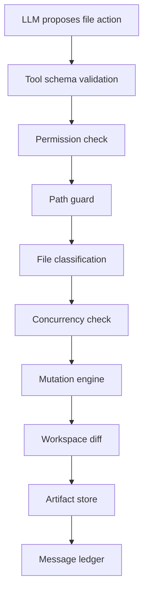
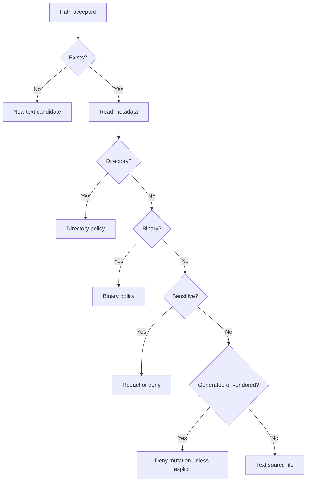
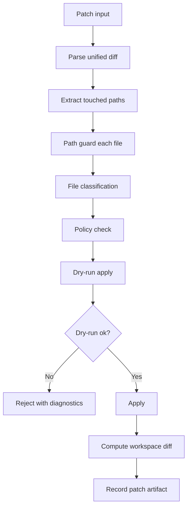

------
title: Learn AI Coding Agent From Scratch - Part 025
description: Membangun file tools untuk Honk-like AI coding agent: read, write, patch, search, diff, path guard, binary policy, optimistic concurrency, artifactization, dan safety invariant.
series: learn-ai-coding-agent
seriesTitle: Learn AI Coding Agent From Scratch
order: 25
partTitle: File Tools: Read, Write, Patch, Search
tags:
- ai-coding-agent
- file-tools
- patch
- diff
- workspace
- sandbox
- safety
- series
date: 2026-07-03
---

# Part 025 — File Tools: Read, Write, Patch, Search

Di part sebelumnya kita membangun **tool calling runtime**.

Sekarang kita masuk ke tool paling sering dipakai oleh coding agent: **file tools**.

Coding agent tidak bisa memperbaiki codebase jika ia tidak bisa membaca file, mencari teks, membuat patch, dan melihat diff. Tetapi begitu agent bisa menulis file, sistem berubah dari “assistant yang memberi saran” menjadi “aktor yang mengubah state repository”.

Itu sebabnya file tools harus didesain seperti komponen infrastruktur kritis, bukan helper function biasa.

Target part ini:

1. membangun mental model file tools sebagai **controlled mutation boundary**,
2. mendesain API tool untuk read, list, search, write, patch, dan diff,
3. membuat path guard agar agent tidak bisa keluar dari workspace,
4. menghindari race condition dengan snapshot dan optimistic concurrency,
5. membedakan text file, binary file, generated file, lockfile, secret file, dan forbidden file,
6. membuat patch application yang aman, dry-run-able, dan auditable,
7. menyiapkan interface Java yang nanti bisa dihubungkan ke agentic loop.

Kita tidak akan mengulang materi Git, shell, AST, semantic search, atau context window management secara penuh. Part ini fokus ke **file mutation primitive**.

---

## 1. Masalah sebenarnya

Pertanyaan yang kelihatannya sederhana:

> “Bagaimana agent membaca dan menulis file?”

Pertanyaan yang benar:

> “Bagaimana agent boleh membaca dan menulis bagian tertentu dari workspace, dengan bukti, batas, audit, rollback, dan semantik kegagalan yang deterministic?”

Perbedaannya besar.

Jika implementasinya terlalu naif, agent bisa:

- membaca file rahasia yang tidak perlu,
- menulis file di luar repo lewat path traversal,
- mengikuti symlink ke host path,
- menghapus file yang tidak masuk scope,
- overwrite perubahan lain karena stale context,
- menulis binary file sebagai teks,
- memodifikasi generated file yang seharusnya dihasilkan ulang,
- membuat diff terlalu besar untuk direview,
- menghapus test agar verifier hijau,
- mengubah lockfile tanpa dependency command yang jelas,
- menyembunyikan perubahan di file yang jarang dilihat reviewer.

File tool bukan sekadar `Files.readString()` dan `Files.writeString()`.

File tool adalah boundary antara **niat model** dan **state repository**.



Invariant utama:

> Agent tidak boleh mengubah file hanya karena model “ingin”. Agent hanya boleh mengubah file jika path, mode, permission, expected state, dan policy semuanya valid.

---

## 2. Peran file tools dalam Honk-like agent

Dalam background coding agent, file tools dipakai di hampir semua fase.

| Fase | File tool yang dipakai | Tujuan |
|---|---|---|
| Repo understanding | `list_dir`, `search_text`, `read_file` | Menemukan struktur kode |
| Planning | `read_file`, `search_text` | Mengumpulkan evidence |
| Editing | `apply_patch`, `write_file`, `replace_range` | Membuat perubahan |
| Repair loop | `read_file`, `search_text`, `apply_patch` | Memperbaiki compile/test failure |
| Verification | `diff_workspace`, `read_file` | Memberi bukti ke verifier/judge |
| PR creation | `diff_workspace`, `read_file` | Menyusun summary dan risk note |
| Audit | semua | Merekam siapa/apa/kapan/kenapa |

Honk-like agent berbeda dari code editor biasa karena ia bisa berjalan di background. Maka sistem harus bisa menjawab setelah run selesai:

- file apa saja yang dibaca?
- file apa saja yang ditulis?
- kenapa file itu ditulis?
- versi file apa yang dilihat agent sebelum menulis?
- apakah patch diterapkan ke base yang sama?
- apakah agent mencoba mengubah path terlarang?
- apakah diff final sesuai scope?

Tanpa jawaban ini, PR dari agent sulit dipercaya.

---

## 3. Tool surface minimal

Jangan mulai dengan 30 file tools.

Mulai dengan surface kecil dan jelas.

```yaml
tools:
  list_dir:
    purpose: inspect directory structure
    mutates: false
  read_file:
    purpose: read bounded text range
    mutates: false
  search_text:
    purpose: search text with scope and limits
    mutates: false
  write_file:
    purpose: create or replace one text file with optimistic concurrency
    mutates: true
  apply_patch:
    purpose: apply unified diff with dry-run and policy checks
    mutates: true
  diff_workspace:
    purpose: inspect current workspace diff
    mutates: false
```

Kenapa minimal?

Karena setiap tool baru menambah:

1. attack surface,
2. prompt complexity,
3. policy complexity,
4. audit complexity,
5. evaluation surface.

Tool seperti `delete_file`, `rename_file`, `chmod`, `copy_tree`, `format_file`, `download_file`, dan `extract_archive` boleh ada nanti, tetapi harus masuk capability level lebih tinggi.

---

## 4. Workspace sebagai root of authority

Semua file operation harus relatif terhadap satu **workspace root**.

Contoh layout:

```text
/workspaces/run-0183/
  repo/                  # checked out repository
  tmp/                   # temporary files owned by runner
  artifacts/             # immutable run artifacts
  tool-cache/            # optional local cache
```

File tools untuk codebase hanya boleh beroperasi di:

```text
/workspaces/run-0183/repo
```

Jangan izinkan model memberi absolute path seperti:

```text
/etc/passwd
/home/runner/.ssh/id_rsa
/workspaces/run-0183/artifacts/report.json
../../host/file
```

Tool input harus memakai logical path relatif repo:

```json
{
  "path": "src/main/java/com/acme/OrderService.java"
}
```

Runtime yang mengubah logical path menjadi physical path.

---

## 5. Path guard

Path guard adalah komponen kecil yang mencegah bencana besar.

Tugasnya:

1. reject absolute path,
2. normalize `.` dan `..`,
3. reject path traversal,
4. resolve symlink secara aman,
5. memastikan target tetap di bawah repo root,
6. menolak path dengan karakter aneh jika policy mengharuskan,
7. membedakan existing path dan path baru.

### 5.1 Aturan path

Gunakan aturan ketat:

| Input | Keputusan | Alasan |
|---|---|---|
| `src/App.java` | allow | relatif dan normal |
| `./src/App.java` | allow setelah normalize | aman |
| `src/../pom.xml` | allow setelah normalize menjadi `pom.xml` | masih di root |
| `../../etc/passwd` | reject | traversal |
| `/etc/passwd` | reject | absolute path |
| `src/link-to-host/secrets` | reject jika symlink keluar root | escape |
| `.git/config` | reject by default | git internals |
| `.env` | reject/read-redacted by default | secret risk |
| `target/generated-sources/x.java` | deny mutation by default | generated output |

### 5.2 Java PathGuard

```java
package agent.workspace;

import java.io.IOException;
import java.nio.file.Files;
import java.nio.file.LinkOption;
import java.nio.file.Path;
import java.util.Objects;

public final class PathGuard {
    private final Path repoRootReal;

    public PathGuard(Path repoRoot) throws IOException {
        Objects.requireNonNull(repoRoot, "repoRoot");
        this.repoRootReal = repoRoot.toRealPath(LinkOption.NOFOLLOW_LINKS);
    }

    public ResolvedPath resolveExisting(String logicalPath) throws IOException {
        Path normalized = normalizeLogical(logicalPath);
        Path physical = repoRootReal.resolve(normalized).normalize();

        Path real = physical.toRealPath(LinkOption.NOFOLLOW_LINKS);
        if (!real.startsWith(repoRootReal)) {
            throw new PathRejectedException("Path escapes repository root: " + logicalPath);
        }

        return new ResolvedPath(normalized.toString(), real);
    }

    public ResolvedPath resolveForCreateOrReplace(String logicalPath) throws IOException {
        Path normalized = normalizeLogical(logicalPath);
        Path physical = repoRootReal.resolve(normalized).normalize();

        if (!physical.startsWith(repoRootReal)) {
            throw new PathRejectedException("Path escapes repository root: " + logicalPath);
        }

        Path parent = physical.getParent();
        if (parent == null) {
            throw new PathRejectedException("Path has no parent: " + logicalPath);
        }

        Path parentReal = parent.toRealPath(LinkOption.NOFOLLOW_LINKS);
        if (!parentReal.startsWith(repoRootReal)) {
            throw new PathRejectedException("Parent escapes repository root: " + logicalPath);
        }

        return new ResolvedPath(normalized.toString(), physical);
    }

    private static Path normalizeLogical(String logicalPath) {
        if (logicalPath == null || logicalPath.isBlank()) {
            throw new PathRejectedException("Path is blank");
        }

        Path raw = Path.of(logicalPath);
        if (raw.isAbsolute()) {
            throw new PathRejectedException("Absolute path is not allowed: " + logicalPath);
        }

        Path normalized = raw.normalize();
        if (normalized.startsWith("..")) {
            throw new PathRejectedException("Path traversal is not allowed: " + logicalPath);
        }

        String s = normalized.toString();
        if (s.equals(".") || s.isBlank()) {
            throw new PathRejectedException("Path resolves to repository root");
        }

        return normalized;
    }
}

record ResolvedPath(String logicalPath, Path physicalPath) {}

class PathRejectedException extends RuntimeException {
    PathRejectedException(String message) {
        super(message);
    }
}
```

Catatan penting:

- `normalize()` hanya manipulasi string path; ia tidak membuktikan target aman.
- `toRealPath()` menyelesaikan symlink, tetapi hanya bisa dipakai untuk path yang sudah ada.
- Untuk path baru, resolve parent directory yang sudah ada.
- Jangan mengandalkan string prefix seperti `path.startsWith(root.toString())`.

---

## 6. File classification

Sebelum membaca atau menulis, klasifikasikan file.



Classification fields:

```java
public enum FileKind {
    TEXT_SOURCE,
    TEXT_CONFIG,
    TEXT_DOC,
    LOCKFILE,
    GENERATED,
    VENDORED,
    SECRET_LIKE,
    BINARY,
    DIRECTORY,
    GIT_INTERNAL,
    UNKNOWN
}

public record FileClassification(
    String logicalPath,
    FileKind kind,
    boolean readable,
    boolean writable,
    boolean redacted,
    String reason
) {}
```

### 6.1 Secret-like files

Default deny or redact:

```text
.env
.env.*
*.pem
*.key
*.p12
*.jks
id_rsa
id_ed25519
secrets.yml
application-prod.yml
```

Jangan membaca secret ke LLM context.

Jika agent perlu tahu “ada konfigurasi environment”, cukup tampilkan metadata:

```json
{
  "path": ".env",
  "kind": "SECRET_LIKE",
  "readable": false,
  "reason": "secret-like filename; content not exposed"
}
```

### 6.2 Generated files

Default deny mutation:

```text
target/
build/
dist/
node_modules/
generated-sources/
*.pb.go
*.generated.java
openapi/generated/
```

Bukan berarti agent tidak boleh mengubah generated output selamanya. Tetapi cara benar biasanya:

1. ubah source schema/template,
2. jalankan generator,
3. verifikasi generated diff.

### 6.3 Lockfiles

Lockfile tidak selalu forbidden, tetapi harus diberi policy khusus.

Contoh:

```text
package-lock.json
pnpm-lock.yaml
yarn.lock
poetry.lock
Cargo.lock
go.sum
```

Untuk Maven, `pom.xml` bukan lockfile, tetapi dependency tree tetap perlu verifier.

Rule yang baik:

> Agent boleh mengubah lockfile hanya jika ada command verifier/package-manager yang menghasilkan perubahan itu, atau approval eksplisit.

---

## 7. Read tool

Read tool harus bounded.

Jangan izinkan agent membaca file 8 MB penuh ke context.

### 7.1 Contract

```json
{
  "name": "read_file",
  "input": {
    "path": "src/main/java/com/acme/OrderService.java",
    "startLine": 1,
    "maxLines": 200
  }
}
```

Response:

```json
{
  "path": "src/main/java/com/acme/OrderService.java",
  "startLine": 1,
  "endLine": 120,
  "totalLines": 120,
  "sha256": "...",
  "truncated": false,
  "content": "..."
}
```

### 7.2 Rules

- `maxLines` default kecil, misalnya 200.
- hard limit, misalnya 1000 lines atau 64 KB per call.
- binary file tidak dibaca sebagai teks.
- secret-like file tidak dibaca.
- very large file butuh chunking.
- response selalu menyertakan file hash.

Hash penting untuk optimistic concurrency. Agent membaca file versi X; saat menulis, ia harus menyebut expected hash X.

### 7.3 Java implementation sketch

```java
public record ReadFileCommand(
    String path,
    int startLine,
    int maxLines
) {}

public record ReadFileResult(
    String path,
    int startLine,
    int endLine,
    int totalLines,
    String sha256,
    boolean truncated,
    String content
) {}

public final class FileReadTool {
    private static final int DEFAULT_MAX_LINES = 200;
    private static final int HARD_MAX_LINES = 1000;

    private final PathGuard pathGuard;
    private final FileClassifier classifier;
    private final Hashing hashing;

    public ReadFileResult read(ReadFileCommand command) throws IOException {
        int start = Math.max(command.startLine(), 1);
        int max = command.maxLines() <= 0 ? DEFAULT_MAX_LINES : command.maxLines();
        if (max > HARD_MAX_LINES) {
            max = HARD_MAX_LINES;
        }

        ResolvedPath resolved = pathGuard.resolveExisting(command.path());
        FileClassification classification = classifier.classify(resolved);
        if (!classification.readable()) {
            throw new ToolRejectedException("File is not readable: " + classification.reason());
        }

        String sha = hashing.sha256(resolved.physicalPath());
        List<String> allLines = Files.readAllLines(resolved.physicalPath());
        int total = allLines.size();
        int from = Math.min(start - 1, total);
        int to = Math.min(from + max, total);

        String content = renderNumberedLines(allLines.subList(from, to), start);
        boolean truncated = to < total;

        return new ReadFileResult(
            resolved.logicalPath(),
            start,
            to,
            total,
            sha,
            truncated,
            content
        );
    }

    private static String renderNumberedLines(List<String> lines, int startLine) {
        StringBuilder sb = new StringBuilder();
        for (int i = 0; i < lines.size(); i++) {
            sb.append(String.format("%6d | %s%n", startLine + i, lines.get(i)));
        }
        return sb.toString();
    }
}
```

Line numbers membantu agent mengacu ke lokasi spesifik, tetapi jangan jadikan line number sebagai satu-satunya dasar edit. Line number bisa berubah.

---

## 8. List directory tool

Agent perlu tahu struktur repo tanpa membaca semuanya.

### 8.1 Contract

```json
{
  "name": "list_dir",
  "input": {
    "path": ".",
    "maxDepth": 2,
    "includeHidden": false,
    "maxEntries": 300
  }
}
```

Response:

```json
{
  "path": ".",
  "entries": [
    { "path": "pom.xml", "type": "file", "kind": "TEXT_CONFIG", "sizeBytes": 4311 },
    { "path": "src", "type": "directory" },
    { "path": "README.md", "type": "file", "kind": "TEXT_DOC", "sizeBytes": 920 }
  ],
  "truncated": false
}
```

### 8.2 Jangan tampilkan semuanya

Repo besar bisa punya puluhan ribu file. `list_dir` harus:

- punya `maxDepth`,
- punya `maxEntries`,
- menghormati ignore patterns,
- tidak masuk `.git`, `target`, `node_modules`, `build`, `dist` secara default,
- mengembalikan `truncated=true` jika output dipotong.

---

## 9. Search tool

Search tool adalah mata agent.

Tanpa search, agent cenderung membaca file acak atau mengandalkan tebakan.

### 9.1 Contract

```json
{
  "name": "search_text",
  "input": {
    "query": "OrderStatus",
    "path": "src/main/java",
    "mode": "literal",
    "includeGlob": "**/*.java",
    "maxMatches": 100,
    "contextLines": 2
  }
}
```

Response:

```json
{
  "query": "OrderStatus",
  "matches": [
    {
      "path": "src/main/java/com/acme/OrderStatus.java",
      "line": 7,
      "snippet": "public enum OrderStatus {"
    }
  ],
  "truncated": false
}
```

### 9.2 Ripgrep wrapper, bukan shell string

Gunakan `ProcessBuilder` atau library. Jangan membuat command string seperti:

```java
// Buruk
Runtime.getRuntime().exec("rg " + userQuery + " " + path);
```

Gunakan argv:

```java
List<String> argv = List.of(
    "rg",
    "--line-number",
    "--no-heading",
    "--color", "never",
    "--fixed-strings",
    query,
    searchRoot.toString()
);

ProcessBuilder pb = new ProcessBuilder(argv);
pb.directory(repoRoot.toFile());
```

Kenapa?

Karena command injection sering terjadi saat input tidak terpercaya digabungkan ke shell command. OWASP menyarankan menghindari OS command jika ada API/library yang memadai; jika harus menjalankan command, input harus divalidasi dan tidak diperlakukan sebagai shell grammar.

### 9.3 Search result harus context-aware

Agent perlu cukup konteks, tetapi jangan terlalu banyak.

Good default:

- max 100 matches,
- context 0–3 lines,
- max output bytes,
- truncate with reason,
- include file hash optionally,
- include classification.

Search response bukan artifact final. Ia adalah **evidence candidate**.

Agent harus membaca file terkait sebelum mengubahnya.

---

## 10. Write file tool

`write_file` adalah mutation tool paling sederhana dan paling berbahaya.

Gunakan untuk:

- membuat file baru,
- mengganti file kecil secara penuh,
- menulis generated report internal,
- menyimpan doc/test kecil.

Jangan gunakan untuk edit file besar jika patch lebih aman.

### 10.1 Contract

```json
{
  "name": "write_file",
  "input": {
    "path": "src/test/java/com/acme/OrderServiceTest.java",
    "content": "...",
    "mode": "CREATE_OR_REPLACE",
    "expectedSha256": "abc123...",
    "reason": "Add regression test for cancelled order validation"
  }
}
```

Untuk file baru:

```json
{
  "mode": "CREATE_NEW",
  "expectedSha256": null
}
```

Untuk replace file existing:

```json
{
  "mode": "REPLACE_EXISTING",
  "expectedSha256": "sha-of-file-that-agent-read"
}
```

### 10.2 Optimistic concurrency

Rule:

> Jika agent mengganti file yang sudah ada, expected hash wajib cocok dengan hash file saat ini.

Ini mencegah stale write.

```mermaid
sequenceDiagram
    participant A as Agent
    participant F as File Tool
    participant W as Workspace

    A->>F: read_file(OrderService.java)
    F->>W: read current file
    F-->>A: content + sha=H1
    A->>F: write_file(expectedSha=H1)
    F->>W: read current hash
    alt current hash == H1
        F->>W: write temp file + atomic move
        F-->>A: success + new sha=H2
    else current hash != H1
        F-->>A: conflict; reread required
    end
```

### 10.3 Atomic write

Jangan langsung menulis file target.

Gunakan temp file di directory yang sama lalu atomic move jika filesystem mendukung.

```java
Path target = resolved.physicalPath();
Path parent = target.getParent();
Path temp = Files.createTempFile(parent, ".agent-write-", ".tmp");

try {
    Files.writeString(temp, content, StandardCharsets.UTF_8);
    Files.move(temp, target,
        StandardCopyOption.REPLACE_EXISTING,
        StandardCopyOption.ATOMIC_MOVE);
} finally {
    Files.deleteIfExists(temp);
}
```

Atomic move mengurangi risiko file setengah tertulis jika proses mati.

---

## 11. Patch tool

Untuk coding agent, `apply_patch` biasanya lebih baik daripada `write_file`.

Alasannya:

- diff lebih mudah direview,
- scope perubahan terlihat,
- patch punya konteks,
- lebih kecil dari full file rewrite,
- bisa dry-run,
- bisa ditolak jika menyentuh file terlarang.

Unified diff format umum dipakai untuk patch. GNU diffutils mendeskripsikan unified format sebagai variasi context format yang lebih ringkas, dengan header file dan hunk yang menunjukkan range perubahan.

### 11.1 Contract

```json
{
  "name": "apply_patch",
  "input": {
    "patch": "--- a/src/main/java/...\n+++ b/src/main/java/...\n@@ ...",
    "expectedBaseCommit": "9f72...",
    "dryRun": false,
    "reason": "Replace deprecated API call with new method"
  }
}
```

Response:

```json
{
  "applied": true,
  "dryRun": false,
  "filesTouched": [
    "src/main/java/com/acme/OrderService.java",
    "src/test/java/com/acme/OrderServiceTest.java"
  ],
  "insertions": 22,
  "deletions": 8,
  "warnings": [],
  "newWorkspaceDiffSha256": "..."
}
```

### 11.2 Patch pipeline



Never apply patch before extracting and checking touched paths.

### 11.3 Reject dangerous patch features

Reject by default:

- patch touching `.git/`,
- patch with absolute paths,
- patch with `../`,
- patch that changes file mode unless explicitly allowed,
- patch deleting many files,
- patch modifying binary files,
- patch creating symlink,
- patch touching secret-like files,
- patch touching generated/vendor directories unless allowed,
- patch with too many files or too many changed lines.

### 11.4 Patch size budget

Example policy:

```yaml
patchBudget:
  maxFilesTouched: 20
  maxInsertions: 800
  maxDeletions: 800
  maxBytes: 200000
  requireApprovalIf:
    - touchesBuildFile
    - touchesSecuritySensitivePath
    - deletesFile
    - changesPublicApi
```

Small patch is not automatically safe. But huge patch is automatically review risk.

---

## 12. Diff workspace tool

Agent must see what it changed.

`diff_workspace` returns current diff against base checkout.

### 12.1 Contract

```json
{
  "name": "diff_workspace",
  "input": {
    "statOnly": false,
    "maxBytes": 120000
  }
}
```

Response:

```json
{
  "baseCommit": "9f72...",
  "filesChanged": 2,
  "insertions": 22,
  "deletions": 8,
  "stat": "...",
  "diff": "...",
  "truncated": false,
  "diffSha256": "..."
}
```

### 12.2 Important rule

`diff_workspace` should use Git as source of truth when repository is Git-backed.

But still path-filter output.

Do not expose ignored untracked files containing secrets.

Useful commands internally:

```bash
git status --porcelain=v1
git diff --stat
git diff --no-ext-diff --src-prefix=a/ --dst-prefix=b/
git diff --cached
```

In implementation, use argv and fixed command profiles, not arbitrary shell string.

---

## 13. Tool result projection to model

The tool result stored in backend can be rich. The result sent back to model should be bounded.

Full internal artifact:

```json
{
  "toolCallId": "tc_123",
  "path": "src/main/java/com/acme/OrderService.java",
  "oldSha256": "...",
  "newSha256": "...",
  "classification": "TEXT_SOURCE",
  "bytesWritten": 5821,
  "fullDiffArtifactUri": "artifact://run-1/diff-3.patch",
  "policyDecisions": [...],
  "warnings": [...]
}
```

Model projection:

```json
{
  "ok": true,
  "path": "src/main/java/com/acme/OrderService.java",
  "newSha256": "...",
  "summary": "Updated 1 file. Current workspace diff has 14 insertions and 3 deletions.",
  "warnings": []
}
```

Do not dump giant diffs into model context repeatedly. Store artifact once, project summary, and allow targeted read/diff retrieval.

---

## 14. Permission integration

File tools must ask policy engine before executing.

Example permission names:

```text
file:list
file:read
file:search
file:write:create
file:write:replace
file:patch:apply
file:diff
```

Policy input:

```json
{
  "runId": "run_123",
  "tool": "apply_patch",
  "paths": ["pom.xml", "src/main/java/com/acme/App.java"],
  "fileKinds": ["TEXT_CONFIG", "TEXT_SOURCE"],
  "mutation": true,
  "patchStats": {
    "filesTouched": 2,
    "insertions": 18,
    "deletions": 6
  },
  "taskRisk": "SUPERVISED_PR"
}
```

Policy result:

```json
{
  "decision": "ALLOW",
  "reasons": ["within task scope", "patch below budget"],
  "requiresApproval": false
}
```

Reject means tool does not execute.

Require approval means tool pauses the run.

Allow means proceed and record audit.

---

## 15. Audit log

Every file tool call should produce audit data.

Minimum fields:

```json
{
  "runId": "run_123",
  "stepId": "step_9",
  "toolCallId": "tc_77",
  "toolName": "apply_patch",
  "timestamp": "2026-07-03T10:15:00Z",
  "pathsRead": [],
  "pathsWritten": ["src/main/java/com/acme/OrderService.java"],
  "oldSha256": "...",
  "newSha256": "...",
  "policyDecision": "ALLOW",
  "artifactUris": ["artifact://run_123/patch-77.diff"]
}
```

Audit bukan hanya untuk compliance. Audit juga mempercepat debugging saat agent membuat PR aneh.

---

## 16. Failure semantics

Tool failure harus informatif, bukan stack trace mentah.

| Failure | Tool response ke agent | Sistem behavior |
|---|---|---|
| Path traversal | `PATH_REJECTED` | no retry unless path corrected |
| Secret file | `POLICY_DENIED_SECRET` | no retry unless task changed |
| File too large | `FILE_TOO_LARGE` | suggest narrower range/search |
| Stale hash | `WRITE_CONFLICT` | reread file |
| Patch does not apply | `PATCH_CONFLICT` | inspect current file and regenerate patch |
| Binary file | `UNSUPPORTED_BINARY` | require specialized tool/approval |
| Too many changed files | `PATCH_BUDGET_EXCEEDED` | split task or ask approval |

Example response:

```json
{
  "ok": false,
  "code": "WRITE_CONFLICT",
  "message": "File changed since it was read. Reread file and retry with new expectedSha256.",
  "path": "src/main/java/com/acme/OrderService.java",
  "currentSha256": "new-hash"
}
```

This is agent-useful.

A raw exception is not.

---

## 17. Testing file tools

Test path guard aggressively.

### 17.1 Path test matrix

```text
allow: src/App.java
allow: ./src/App.java
allow normalized: src/../pom.xml -> pom.xml
reject: ../../etc/passwd
reject: /etc/passwd
reject: .git/config
reject symlink escape: src/out -> /tmp/outside
reject secret: .env
reject generated mutation: target/generated/X.java
```

### 17.2 Mutation tests

- writing existing file without expected hash fails,
- writing with wrong expected hash fails,
- writing with correct hash succeeds,
- write uses atomic temp file,
- patch dry-run does not mutate workspace,
- patch touching forbidden path fails before application,
- patch exceeding budget fails,
- diff_workspace reflects mutation,
- audit record created for every mutation,
- file content not exposed for secret-like path.

### 17.3 Property-style tests

Good invariant:

> For any logical path input, resolved physical path must either be rejected or remain under repo root real path.

Another:

> A denied mutation must not change workspace diff.

Another:

> A failed dry-run patch must not change file hashes.

---

## 18. Common mistakes

### Mistake 1: Treating path normalization as security

`normalize()` is not enough. Symlink can still escape.

### Mistake 2: Letting model pass absolute paths

Absolute path leaks infrastructure shape and increases blast radius.

### Mistake 3: Reading entire files by default

This wastes context and increases data exposure.

### Mistake 4: `write_file` without expected hash

That creates stale overwrite risk.

### Mistake 5: Applying patch before policy check

You must parse paths and inspect patch first.

### Mistake 6: Exposing secret file content “because it is in repo”

Repository content is not automatically safe for LLM context.

### Mistake 7: Hiding file tool failures from agent

Agent needs actionable error codes to repair.

---

## 19. Minimal implementation roadmap

Build in this order:

1. `PathGuard`
2. `FileClassifier`
3. `list_dir`
4. `read_file`
5. `search_text`
6. `diff_workspace`
7. `write_file` with expected hash
8. `apply_patch` with dry-run
9. audit and artifact store
10. policy integration
11. evaluation tests

Do not build `delete_file` early.

Do not build arbitrary file system access.

Do not expose workspace absolute path to model.

---

## 20. Acceptance criteria

Part ini selesai jika sistem punya file tool runtime dengan invariant berikut:

- semua path logical dan relatif repo,
- semua physical path dijaga oleh path guard,
- secret-like file tidak masuk model context,
- binary file tidak dibaca sebagai teks,
- write existing file butuh expected hash,
- patch path diperiksa sebelum apply,
- patch bisa dry-run,
- mutation menghasilkan audit event,
- mutation menghasilkan artifact/diff,
- denied mutation tidak mengubah workspace,
- tool errors punya machine-readable code.

---

## 21. Latihan

Bangun `PathGuard` dan test matrix-nya.

Lalu bangun `read_file` dengan:

- line range,
- max lines,
- SHA-256,
- secret deny,
- binary deny.

Setelah itu bangun `write_file` dengan expected hash.

Jangan lanjut ke patch tool sebelum tiga komponen ini benar.

---

## 22. Referensi

- GNU Diffutils manual — Unified Format: https://www.gnu.org/software/diffutils/manual/html_node/Unified-Format.html
- GNU Diffutils manual — Detailed Unified Format: https://www.gnu.org/software/diffutils/manual/html_node/Detailed-Unified.html
- OWASP OS Command Injection Defense Cheat Sheet: https://cheatsheetseries.owasp.org/cheatsheets/OS_Command_Injection_Defense_Cheat_Sheet.html
- Python subprocess security considerations: https://docs.python.org/3/library/subprocess.html#security-considerations
- OpenAI Codex sandboxing and approvals: https://developers.openai.com/codex/concepts/sandboxing

---

## 23. Transisi ke part berikutnya

File tools memberi agent kemampuan membaca dan mengubah workspace.

Tetapi agent juga butuh menjalankan command:

- compile,
- test,
- lint,
- format,
- grep,
- dependency analysis,
- code generation.

Command execution jauh lebih berbahaya daripada file read/write.

Di part berikutnya kita membangun **Shell Tool: Safe Command Execution**.
