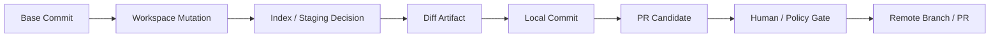
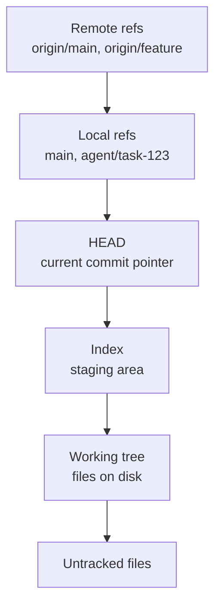
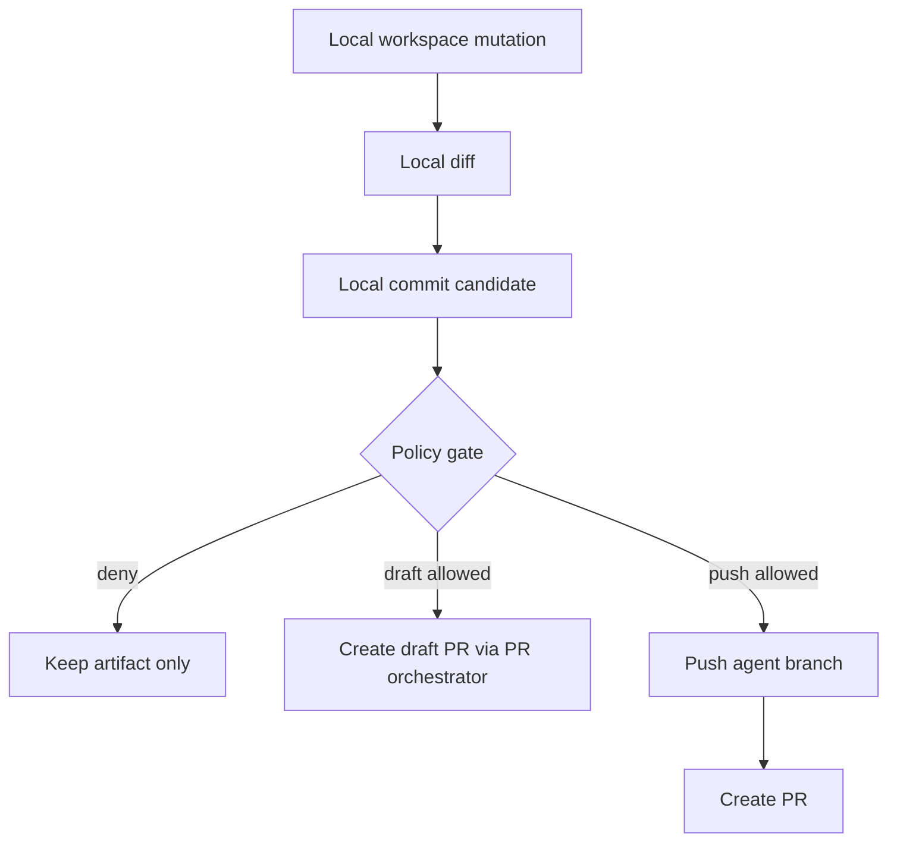
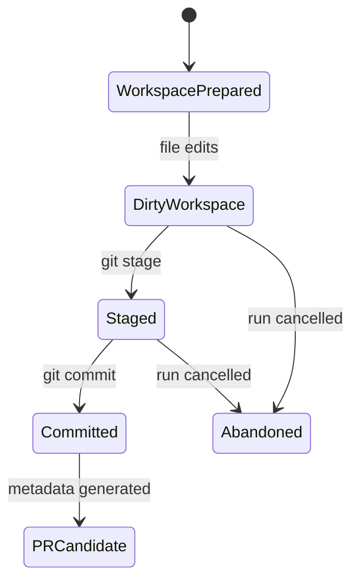
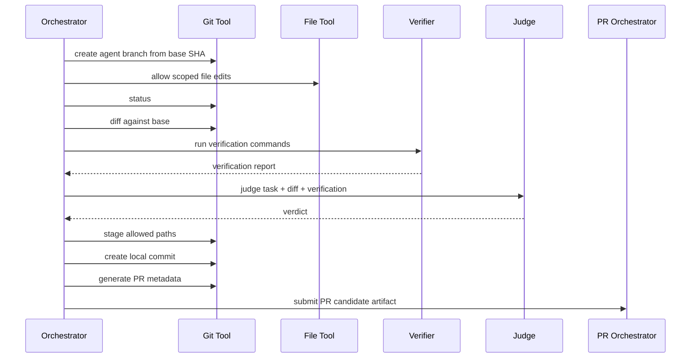

------
title: Learn AI Coding Agent From Scratch - Part 027
description: Build a controlled Git tool boundary for a Honk-like AI coding agent: branch, status, diff, commit, and PR metadata without uncontrolled remote mutation.
series: learn-ai-coding-agent
seriesTitle: Learn AI Coding Agent From Scratch
order: 27
partTitle: Git Tool: Branch, Diff, Commit, Status, No-Push Boundary, PR Metadata
tags:
- ai-coding-agent
- git
- agent-runtime
- sandbox
- pull-request
- software-engineering
date: 2026-07-03
---

# Part 027 — Git Tool: Branch, Diff, Commit, Status, No-Push Boundary, PR Metadata

> Target part ini: kita membangun **Git boundary** untuk agent. Bukan wrapper `git` bebas. Bukan memberi shell ke model lalu berharap dia sopan. Kita ingin agent dapat melihat status, membuat branch kerja, membaca diff, membuat commit lokal, dan menyiapkan metadata PR — tetapi tidak boleh melakukan remote mutation tanpa policy gate.

Pada part sebelumnya kita sudah punya file tools dan shell tool. Sekarang kita naik satu level: perubahan file harus masuk ke **model perubahan versi**. Agent coding yang serius tidak cukup hanya bisa `write_file`. Ia harus bisa menjawab:

- file apa yang berubah?
- kenapa berubah?
- apakah perubahan itu masih dalam scope task?
- apakah ada file generated/secret/lockfile yang tersentuh?
- apakah diff bisa direview manusia?
- apakah commit/branch dapat direproduksi?
- apakah PR aman dibuat?

Git tool adalah boundary antara **workspace mutation** dan **reviewable software change**.

---

## 1. Core Premise

Agent tidak boleh memandang Git sebagai command-line convenience.

Agent harus memandang Git sebagai:



Setiap panah adalah **state transition** yang harus:

1. punya precondition,
2. punya postcondition,
3. tercatat di audit log,
4. dapat direplay atau setidaknya didiagnosis,
5. bisa dibatalkan tanpa merusak repo asli.

Ini berbeda dari human developer yang bisa menjalankan command ad hoc. Agent harus lebih ketat karena:

- agent tidak punya judgment sosial seperti manusia,
- agent dapat melakukan banyak operasi lebih cepat dari manusia,
- agent bisa salah memahami prompt,
- agent bisa terkena prompt injection dari repo,
- agent bisa membuat diff besar yang tampak masuk akal tetapi semantiknya salah.

Git tool adalah salah satu tempat kita menurunkan risiko itu.

---

## 2. Git Mental Model untuk Agent

Minimal agent harus mengerti lima lapisan Git berikut.



Human sering menganggap `git status` hanya sebagai informasi. Untuk agent, `git status` adalah **state sensor**.

Human sering menganggap `git diff` hanya sebagai tampilan perubahan. Untuk agent, `git diff` adalah **primary review artifact**.

Human sering menganggap commit sebagai snapshot biasa. Untuk agent, commit adalah **claim**:

> “Perubahan ini sengaja, terbatas, dan menjawab task contract.”

Itu sebabnya commit message agent tidak boleh generik seperti:

```txt
fix changes
```

Commit message agent harus menyatakan:

- intent,
- affected subsystem,
- safety boundary,
- verification yang sudah dijalankan.

---

## 3. Boundary yang Kita Mau

Git tool pada platform ini tidak memberi semua command Git.

Kita hanya expose capability yang dibutuhkan agent.

| Capability | Agent boleh? | Catatan |
|---|---:|---|
| Read status | Ya | Selalu aman jika path output disanitasi |
| Read diff | Ya | Harus bisa dibatasi path dan ukuran |
| Create local branch | Ya | Dengan naming convention terkendali |
| Stage selected files | Ya | Hanya file yang lolos policy |
| Create local commit | Ya | Setelah verifier minimal lewat |
| Push branch | Tidak default | Butuh policy gate / PR orchestration layer |
| Force push | Tidak | Hampir selalu blocked |
| Merge | Tidak | Tidak dilakukan oleh agent runtime |
| Rebase | Umumnya tidak | Bisa dipakai di controlled maintenance job, bukan default |
| Reset hard | Tidak default | Hanya sandbox cleanup internal, bukan agent action |
| Clean untracked | Tidak default | Berisiko menghapus artifact diagnosis |
| Tag release | Tidak | Release bukan domain Git tool agent |

Prinsipnya:

> Agent boleh membuat **candidate change**. Agent tidak otomatis mengubah **shared history**.

---

## 4. Kenapa No-Push Boundary Penting

Push adalah remote mutation. PR creation juga remote mutation, tetapi lebih reviewable daripada direct push ke branch utama.

Dalam Honk-like background coding agent, kita ingin agent bisa berjalan di banyak repo dan banyak task. Kalau push tidak dikontrol, failure mode-nya besar:

- agent membuat ratusan branch spam,
- agent push diff yang belum diverifikasi,
- agent overwrite branch yang dipakai manusia,
- agent mengekspos secret di remote branch,
- agent membuat PR dari base commit yang stale,
- agent membuat PR dengan scope terlalu luas,
- agent mengirim noise ke reviewer.

Maka Git tool harus membedakan:



Git tool sendiri berhenti di **local branch + local commit + PR metadata package**.

Push/PR creation sebaiknya dilakukan oleh **PR orchestration service** yang punya:

- token GitHub/GitLab/Bitbucket terbatas,
- repo allowlist,
- branch allowlist,
- reviewer policy,
- label policy,
- rate limit,
- audit trail.

Kita akan membahas PR orchestration penuh di Part 061. Di part ini, kita menyiapkan boundary-nya.

---

## 5. Domain Object Git Tool

Kita mulai dari domain object, bukan command.

```java
public record GitRepositoryRef(
    String provider,
    String owner,
    String repo,
    String remoteUrl,
    String baseBranch,
    String baseCommitSha
) {}

public record GitWorkspaceRef(
    UUID runId,
    Path workspaceRoot,
    String currentBranch,
    String baseCommitSha
) {}

public record GitStatusReport(
    String branch,
    String headSha,
    boolean detachedHead,
    boolean clean,
    List<GitFileChange> changes,
    List<String> warnings
) {}

public record GitFileChange(
    String path,
    GitChangeKind kind,
    boolean staged,
    boolean generated,
    boolean binary,
    boolean allowedByPolicy
) {}

public enum GitChangeKind {
    ADDED,
    MODIFIED,
    DELETED,
    RENAMED,
    COPIED,
    UNTRACKED,
    TYPE_CHANGED
}
```

Tool output tidak boleh hanya raw stdout.

Raw stdout boleh disimpan sebagai artifact, tetapi model harus menerima structured report yang sudah:

- diparse,
- disanitasi,
- dibatasi ukuran,
- diberi warning,
- diberi policy decision.

---

## 6. Command Surface yang Aman

Kita akan membangun Git tool dengan command kecil berikut.

```txt
GitStatusTool
GitDiffTool
GitCreateBranchTool
GitStageTool
GitCommitTool
GitRestoreTool           optional / restricted
GitPatchSummaryTool
GitPrMetadataTool
```

Jangan expose generic:

```txt
git <anything>
```

Itu sama saja memberi shell baru dengan permission lebih berbahaya.

---

## 7. GitStatusTool

### 7.1 Tujuan

`GitStatusTool` menjawab:

- repo ada di branch apa?
- HEAD commit apa?
- apakah workspace bersih?
- file apa saja yang berubah?
- apakah ada perubahan di luar scope?
- apakah ada file yang tidak boleh disentuh?

### 7.2 Command internal

Gunakan output porcelain agar stabil untuk diparse.

```bash
git status --porcelain=v1 -z --branch
```

Kenapa `-z`?

Karena path file bisa punya spasi, newline, quote, atau karakter aneh. Format null-delimited lebih aman diparse dibanding line-based naive parsing.

### 7.3 Output ke model

```json
{
  "branch": "agent/task-123-upgrade-jackson",
  "headSha": "abc1234",
  "clean": false,
  "changes": [
    {
      "path": "pom.xml",
      "kind": "MODIFIED",
      "staged": false,
      "generated": false,
      "binary": false,
      "allowedByPolicy": true
    },
    {
      "path": "src/main/java/com/acme/api/UserController.java",
      "kind": "MODIFIED",
      "staged": false,
      "generated": false,
      "binary": false,
      "allowedByPolicy": true
    }
  ],
  "warnings": []
}
```

### 7.4 Invariant

```txt
GitStatusTool must not mutate repository state.
```

Kalau status tool mengubah workspace, misalnya menjalankan hook atau command lain, itu bug.

---

## 8. GitDiffTool

### 8.1 Tujuan

`GitDiffTool` menghasilkan diff artifact yang bisa dipakai oleh:

- agent untuk self-review,
- verifier untuk scope check,
- judge untuk menilai kesesuaian task,
- PR orchestrator untuk body,
- human reviewer untuk diagnosis.

### 8.2 Diff yang dibutuhkan

Kita butuh beberapa jenis diff:

| Diff | Tujuan |
|---|---|
| `workingDiff` | Perubahan working tree yang belum staged |
| `stagedDiff` | Perubahan yang akan masuk commit |
| `baseDiff` | Semua perubahan relatif terhadap base commit |
| `nameStatus` | Ringkasan path dan jenis perubahan |
| `stat` | Ukuran perubahan |
| `numstat` | Line added/deleted untuk scoring |

### 8.3 Command internal

```bash
git diff --no-ext-diff --binary -- <paths>
git diff --cached --no-ext-diff --binary -- <paths>
git diff --name-status <baseSha>...HEAD -- <paths>
git diff --stat <baseSha> -- <paths>
git diff --numstat <baseSha> -- <paths>
```

`--no-ext-diff` penting agar Git tidak memanggil external diff tool dari konfigurasi repo/user.

Untuk sandbox agent, kita tidak ingin command Git memanggil program eksternal yang tidak kita kontrol.

### 8.4 Size Limit

Diff bisa sangat besar. Tool harus punya limit:

```yaml
gitDiffPolicy:
  maxFiles: 100
  maxPatchBytesForModel: 120000
  maxPatchBytesAsArtifact: 10000000
  includeBinaryPatchInModel: false
  includeGeneratedFilesInModel: false
```

Jika diff terlalu besar:

- simpan full diff sebagai artifact,
- kirim summary ke model,
- minta agent mempersempit scope,
- jangan dump semua diff ke context.

### 8.5 Diff Summary

```json
{
  "baseCommitSha": "abc123",
  "headSha": "def456",
  "filesChanged": 4,
  "insertions": 82,
  "deletions": 31,
  "files": [
    {
      "path": "pom.xml",
      "kind": "MODIFIED",
      "insertions": 3,
      "deletions": 1,
      "risk": "MEDIUM",
      "reason": "dependency change"
    },
    {
      "path": "src/test/java/com/acme/UserControllerTest.java",
      "kind": "MODIFIED",
      "insertions": 45,
      "deletions": 10,
      "risk": "LOW",
      "reason": "test update"
    }
  ],
  "warnings": [
    "Diff omitted for generated file target/generated-sources/openapi/Api.java"
  ]
}
```

---

## 9. Create Branch Tool

Agent harus bekerja di branch khusus.

Jangan izinkan agent mengedit langsung di `main`, `master`, `develop`, atau branch manusia.

### 9.1 Branch naming

Contoh naming convention:

```txt
agent/{taskId}/{short-slug}
```

Contoh:

```txt
agent/TASK-1842/upgrade-jackson-2-17
agent/run-01HYZ7D6PZC2/refactor-auth-filter
```

Syarat branch:

- hanya prefix `agent/`,
- tidak mengandung `..`, `~`, `^`, `:`, `?`, `*`, `[`, `\`, spasi raw,
- panjang dibatasi,
- slug berasal dari task title yang disanitasi,
- tidak boleh sama dengan branch existing kecuali run melakukan resume miliknya sendiri.

### 9.2 Command internal

```bash
git checkout -B agent/TASK-1842/upgrade-jackson-2-17 <baseCommitSha>
```

Tetapi sebelum ini:

- pastikan workspace clean,
- pastikan `baseCommitSha` cocok dengan resolved commit dari ingestion,
- pastikan tidak detached di state aneh,
- simpan current HEAD.

### 9.3 Output

```json
{
  "branch": "agent/TASK-1842/upgrade-jackson-2-17",
  "baseCommitSha": "abc123",
  "headSha": "abc123",
  "created": true
}
```

---

## 10. Stage Tool

Staging adalah decision boundary.

Agent tidak boleh otomatis stage semua file dengan `git add .` tanpa policy.

### 10.1 Kenapa `git add .` berbahaya?

Karena bisa memasukkan:

- temporary file,
- log file,
- local config,
- generated file yang tidak semestinya,
- secret yang tidak sengaja muncul,
- artifact test,
- file hasil command package manager yang tidak dimaksud.

### 10.2 Stage by allowlisted path

```java
public record GitStageRequest(
    UUID runId,
    List<String> paths,
    boolean allowLockfile,
    boolean allowGenerated,
    String reason
) {}
```

Precondition:

```txt
for each path:
  path must be inside workspace
  path must not be symlink escape
  path must pass write policy
  path must be changed
  path must not be denied by task scope
```

Command internal:

```bash
git add -- path1 path2 path3
```

Selalu gunakan `--` sebelum path agar path tidak diparse sebagai option.

---

## 11. Commit Tool

Commit adalah artifact semantik.

Agent boleh commit lokal jika:

1. ada staged diff,
2. staged diff lolos policy,
3. verifier minimal telah dijalankan atau policy mengizinkan commit sebelum verify,
4. commit message memenuhi template,
5. tidak ada denied file di staged diff.

### 11.1 Commit message contract

Format sederhana:

```txt
<type>(<scope>): <summary>

Task: <task-id>
Intent: <one sentence>
Verification:
- <command>: <result>
Risk:
- <risk note>
```

Contoh:

```txt
fix(auth): update token filter for new principal API

Task: TASK-1842
Intent: Replace deprecated principal extraction with the new AuthContext API.
Verification:
- mvn -pl auth-service test: passed
- mvn -pl api-service test: passed
Risk:
- Touches authentication path; requires human review before merge.
```

### 11.2 Jangan berbohong di commit message

Kalau test belum dijalankan, jangan tulis `tests passed`.

Tulis:

```txt
Verification:
- not run: verifier failed before Maven execution due to missing dependency cache
```

Agent yang berbohong lebih buruk daripada agent yang gagal.

### 11.3 Command internal

```bash
git commit --no-gpg-sign -m "..."
```

Atau gunakan file message agar quoting aman:

```bash
git commit --no-gpg-sign -F /tmp/commit-message.txt
```

Jangan mengizinkan hook repo berjalan bebas kecuali memang bagian dari verifier policy. Untuk initial agent commit, biasanya gunakan:

```bash
git commit --no-verify --no-gpg-sign -F /tmp/commit-message.txt
```

Tetapi ini harus dicatat sebagai policy decision:

```json
{
  "commitHookPolicy": "SKIPPED_REPO_HOOKS",
  "reason": "Repository hooks are untrusted inside agent sandbox; verifier commands run explicitly."
}
```

---

## 12. PR Metadata Tool

Part ini belum membuat PR remote. Kita hanya menyiapkan metadata.

```java
public record PullRequestCandidate(
    String title,
    String body,
    String baseBranch,
    String headBranch,
    String headCommitSha,
    List<String> labels,
    List<String> reviewers,
    boolean draft,
    DiffSummary diffSummary,
    VerificationReport verification,
    JudgeReport judge
) {}
```

PR body minimal:

```md
## Summary
- Replace deprecated principal extraction with AuthContext API.
- Update affected tests.

## Scope
- auth-service
- api-service tests

## Verification
- `mvn -pl auth-service test` ✅
- `mvn -pl api-service test` ✅

## Agent Notes
- No generated files changed.
- No lockfiles changed.
- Authentication path touched; human review required.

## Risk
Medium: authentication behavior can affect request authorization.
```

### 12.1 PR Metadata bukan PR Creation

Tool ini tidak memanggil GitHub/GitLab API.

Ia hanya membuat artifact:

```txt
artifacts/pr-candidate.json
artifacts/pr-body.md
artifacts/diff-summary.json
```

PR orchestration layer nanti membaca artifact ini.

---

## 13. Scope Guard

Git tool harus bisa menolak perubahan di luar task scope.

Misalnya task:

```yaml
allowedPaths:
  - pom.xml
  - src/main/java/com/acme/auth/**
  - src/test/java/com/acme/auth/**
deniedPaths:
  - src/main/resources/prod-secrets.yml
  - infra/terraform/**
  - .github/workflows/**
```

Jika diff menyentuh `.github/workflows/deploy.yml`, Git stage/commit harus block.

```txt
Denied staged path: .github/workflows/deploy.yml
Reason: CI/CD workflow changes require explicit human approval.
```

Jangan hanya minta agent “jangan sentuh file itu”. Policy harus enforced oleh runtime.

---

## 14. Generated File Policy

Generated file sering membuat diff besar dan noise.

Tetapi kadang memang harus berubah, misalnya:

- OpenAPI generated client,
- protobuf generated class,
- JOOQ generated code,
- lockfile,
- snapshot test.

Policy jangan naif.

```yaml
generatedFilePolicy:
  default: deny
  allowWhen:
    - taskType: OPENAPI_MIGRATION
      paths:
        - generated/openapi/**
    - taskType: PROTOBUF_SCHEMA_CHANGE
      paths:
        - src/generated/proto/**
```

Git diff summary harus menandai generated file terpisah.

```json
{
  "path": "target/generated-sources/openapi/UserApi.java",
  "generated": true,
  "includedInModelContext": false,
  "includedAsArtifact": true
}
```

---

## 15. Lockfile Policy

Lockfile adalah high-signal file. Perubahannya bisa benar, bisa juga supply-chain risk.

Contoh:

- `package-lock.json`
- `pnpm-lock.yaml`
- `yarn.lock`
- `poetry.lock`
- `Cargo.lock`
- `go.sum`

Untuk Maven, dependency resolution lebih banyak di `pom.xml`, tetapi perubahan plugin/dependency management tetap perlu diaudit.

Policy:

```yaml
lockfilePolicy:
  default: require_verification
  requireExplanation: true
  requireDependencyDiff: true
  blockIfUnexpectedRegistry: true
```

Agent boleh mengubah lockfile hanya jika task memang dependency-related atau verifier membuktikan perubahan itu konsekuensi dari command package manager yang sah.

---

## 16. Secret Scan Before Commit

Sebelum commit lokal, jalankan secret scan minimal.

Tidak harus sempurna, tetapi Git tool harus punya gate:

```txt
staged diff -> secret scanner -> policy verdict -> commit allowed/blocked
```

Contoh scanner internal sederhana:

- high entropy string,
- AWS key pattern,
- GitHub token pattern,
- private key header,
- `.env` addition,
- password-like key in config.

Kalau ditemukan potensi secret:

```json
{
  "verdict": "BLOCKED",
  "reason": "Potential secret in staged diff",
  "path": "src/test/resources/application-test.yml",
  "line": 42,
  "redactedPreview": "apiKey: ghp_****"
}
```

Jangan kirim secret penuh ke model.

---

## 17. Implementation Skeleton

### 17.1 GitCommandRunner

```java
public final class GitCommandRunner {
    private final SafeProcessRunner processRunner;
    private final Path workspaceRoot;

    public CommandResult runGit(List<String> args, Duration timeout) {
        List<String> command = new ArrayList<>();
        command.add("git");
        command.add("-c");
        command.add("core.hooksPath=/dev/null");
        command.add("-c");
        command.add("diff.external=");
        command.add("-c");
        command.add("pager.diff=false");
        command.addAll(args);

        return processRunner.run(new ProcessRequest(
            command,
            workspaceRoot,
            minimalGitEnvironment(),
            timeout,
            OutputLimit.ofBytes(2_000_000)
        ));
    }

    private Map<String, String> minimalGitEnvironment() {
        return Map.of(
            "GIT_TERMINAL_PROMPT", "0",
            "GIT_CONFIG_NOSYSTEM", "1",
            "HOME", workspaceRoot.resolve(".agent-home").toString()
        );
    }
}
```

### 17.2 Kenapa set config via `-c`?

Karena repo bisa punya config atau hooks yang memanggil tool eksternal.

Agent runtime harus menghindari behavior implicit.

Kita ingin command Git deterministic dan minimal.

---

## 18. GitStatusService

```java
public final class GitStatusService {
    private final GitCommandRunner git;
    private final GitStatusParser parser;
    private final PathPolicy pathPolicy;

    public GitStatusReport getStatus(UUID runId) {
        CommandResult result = git.runGit(
            List.of("status", "--porcelain=v1", "-z", "--branch"),
            Duration.ofSeconds(10)
        );

        if (!result.success()) {
            throw new GitToolException("git status failed", result.redactedStderr());
        }

        GitStatusReport raw = parser.parsePorcelainV1NullDelimited(result.stdoutBytes());

        List<GitFileChange> checked = raw.changes().stream()
            .map(change -> change.withAllowedByPolicy(pathPolicy.canWrite(change.path())))
            .toList();

        return new GitStatusReport(
            raw.branch(),
            raw.headSha(),
            raw.detachedHead(),
            checked.isEmpty(),
            checked,
            collectWarnings(checked)
        );
    }
}
```

---

## 19. GitDiffService

```java
public final class GitDiffService {
    private final GitCommandRunner git;
    private final DiffLimiter limiter;
    private final ArtifactStore artifacts;

    public DiffReport diffAgainstBase(String baseSha, List<String> paths) {
        CommandResult stat = git.runGit(
            concat(List.of("diff", "--numstat", baseSha, "--"), paths),
            Duration.ofSeconds(20)
        );

        CommandResult patch = git.runGit(
            concat(List.of("diff", "--no-ext-diff", "--binary", baseSha, "--"), paths),
            Duration.ofSeconds(30)
        );

        ArtifactRef fullPatch = artifacts.writeBytes(
            "diff/full.patch",
            patch.stdoutBytes(),
            "text/x-diff"
        );

        DiffSummary summary = limiter.summarize(stat.stdoutText(), patch.stdoutText());
        String modelPatch = limiter.truncatePatchForModel(patch.stdoutText());

        return new DiffReport(summary, fullPatch, modelPatch);
    }
}
```

Important detail:

- full diff disimpan,
- model hanya menerima truncated/model-safe diff,
- artifact tetap dapat dibuka human/verifier,
- truncated diff harus ditandai jelas agar model tidak mengira itu full picture.

---

## 20. GitCommitService

```java
public final class GitCommitService {
    private final GitCommandRunner git;
    private final GitPolicy policy;
    private final SecretScanner secretScanner;
    private final VerificationStore verificationStore;

    public CommitResult commit(UUID runId, CommitRequest request) {
        GitStatusReport status = getStatus(runId);

        if (status.clean()) {
            throw new PolicyDeniedException("No staged changes to commit.");
        }

        StagedDiff staged = getStagedDiff();
        policy.assertStagedDiffAllowed(staged);
        secretScanner.assertNoSecrets(staged);
        verificationStore.assertMinimumVerification(runId, request.requiredVerificationLevel());

        Path messageFile = writeCommitMessage(request.message());

        CommandResult result = git.runGit(
            List.of("commit", "--no-verify", "--no-gpg-sign", "-F", messageFile.toString()),
            Duration.ofSeconds(30)
        );

        if (!result.success()) {
            throw new GitToolException("git commit failed", result.redactedStderr());
        }

        String headSha = revParseHead();
        return new CommitResult(headSha, request.message(), staged.summary());
    }
}
```

---

## 21. Change Boundary Scoring

Git tool harus memberi sinyal risiko.

Contoh scoring sederhana:

```txt
risk = 0
+1 per production source file
+2 if auth/security/payment path
+2 if migration file
+3 if CI/CD workflow
+3 if dependency manifest
+3 if lockfile
+5 if deleted file
+5 if public API signature changed
+8 if secret-like pattern
+10 if denied path
```

Output:

```json
{
  "riskScore": 11,
  "riskLevel": "HIGH",
  "reasons": [
    "public API signature changed",
    "authentication package touched",
    "dependency manifest changed"
  ],
  "requiredGate": "HUMAN_APPROVAL_BEFORE_PR"
}
```

Risk scoring bukan pengganti review, tetapi membantu routing.

---

## 22. Self-Review Prompt Input

Setelah diff dibuat, agent perlu melakukan self-review.

Tetapi jangan kirim raw repo besar. Kirim contract:

```md
You are reviewing your own patch before verification.

Task:
- TASK-1842: Replace deprecated principal extraction with AuthContext API.

Allowed scope:
- src/main/java/com/acme/auth/**
- src/test/java/com/acme/auth/**
- pom.xml

Diff summary:
- 4 files changed
- 82 insertions, 31 deletions
- Risk: MEDIUM

Patch excerpt:
```diff
...
```

Check:
1. Did you change only what the task requires?
2. Did you update tests where behavior changed?
3. Did you avoid generated files and secrets?
4. What verifier should run next?
```
```

Self-review output harus structured:

```json
{
  "scopeCompliant": true,
  "knownRisks": ["Authentication behavior touched"],
  "recommendedVerification": [
    "mvn -pl auth-service test",
    "mvn -pl api-service test"
  ],
  "needsMoreEdits": false
}
```

---

## 23. Dirty Workspace Recovery

Agent run bisa crash setelah edit sebelum commit.

Recovery harus jelas:



Jika worker restart:

1. baca run state dari DB,
2. baca workspace manifest,
3. jalankan GitStatusTool,
4. bandingkan dengan recorded patch artifacts,
5. jika sesuai, resume,
6. jika tidak sesuai, mark `NEEDS_RECONCILIATION`.

Jangan langsung `git reset --hard` karena bisa menghapus evidence failure.

---

## 24. Handling Merge Base and Stale Base

Agent harus menyimpan base commit saat ingestion.

```json
{
  "baseBranch": "main",
  "baseCommitSha": "abc123",
  "resolvedAt": "2026-07-03T10:15:00Z"
}
```

Saat akan membuat PR candidate, cek apakah base branch sudah maju.

Jika remote `main` berubah:

- low-risk small diff: boleh rebase/re-run verifier via orchestrator policy,
- medium/high-risk: mark stale dan minta rerun,
- fleet migration: schedule new run batch.

Git tool tidak mengambil keputusan rebase sendiri. Ia hanya melaporkan:

```json
{
  "baseStale": true,
  "originalBase": "abc123",
  "currentBase": "def456",
  "recommendedAction": "RERUN_FROM_CURRENT_BASE"
}
```

---

## 25. Submodule and Worktree Risks

Submodule adalah repo lain di dalam repo.

Policy default:

```yaml
submodulePolicy:
  default: read_only
  allowMutation: false
```

Agent tidak boleh diam-diam mengubah pointer submodule karena itu bisa mengubah dependency source besar.

Worktree juga perlu hati-hati. Untuk sandbox agent, lebih mudah:

- satu run = satu fresh clone/workspace,
- tidak berbagi worktree antar run,
- tidak menggunakan global Git state.

---

## 26. Local Git Identity

Commit agent harus punya identitas jelas.

```bash
git config user.name "Acme Coding Agent"
git config user.email "coding-agent@acme.example"
```

Tetapi jangan set global config. Set local config di workspace atau via `-c`.

Commit metadata harus transparan bahwa ini dibuat agent.

Contoh trailer:

```txt
Generated-by: acme-coding-agent
Run-id: 01J1Y7W87YQK7MR6Q9G6N5R9NV
Task-id: TASK-1842
```

---

## 27. Audit Events

Setiap Git action menghasilkan event.

```json
{
  "eventType": "GitCommitCreated",
  "runId": "01J1Y7W87YQK7MR6Q9G6N5R9NV",
  "branch": "agent/TASK-1842/upgrade-jackson",
  "commitSha": "def456",
  "filesChanged": 4,
  "riskLevel": "MEDIUM",
  "verificationIds": ["verif-001", "verif-002"],
  "timestamp": "2026-07-03T10:42:00Z"
}
```

Audit log bukan optional. Ketika agent membuat PR yang salah, tim harus bisa menjawab:

- prompt apa yang dipakai?
- file apa yang dibaca?
- tool apa yang dipanggil?
- command apa yang dijalankan?
- diff apa yang dibuat?
- verifier apa yang lewat/gagal?
- kenapa policy mengizinkan commit/PR?

---

## 28. Anti-Patterns

### 28.1 Expose raw shell as Git tool

Buruk:

```txt
Tool: run_shell("git push origin main")
```

Baik:

```txt
Tool: create_pr_candidate(runId)
Policy: requires PR orchestrator approval
```

### 28.2 Commit everything

Buruk:

```bash
git add .
git commit -m "update"
```

Baik:

```bash
git add -- pom.xml src/main/java/com/acme/auth/AuthFilter.java
git commit -F commit-message.txt
```

### 28.3 Diff only after PR

Buruk:

```txt
Agent edits -> push -> PR -> reviewer discovers huge scope creep
```

Baik:

```txt
Agent edits -> local diff summary -> scope gate -> verifier -> judge -> PR candidate
```

### 28.4 Let model decide push policy

Model can recommend. Runtime decides.

---

## 29. Minimal End-to-End Flow



---

## 30. Exercises

### Exercise 1 — Implement status parser

Implement parser untuk:

```bash
git status --porcelain=v1 -z --branch
```

Acceptance criteria:

- path dengan spasi bisa diparse,
- rename bisa diparse,
- untracked file terdeteksi,
- branch dan detached HEAD terdeteksi,
- output menjadi `GitStatusReport`.

### Exercise 2 — Implement stage policy

Buat policy:

```yaml
allowedPaths:
  - src/main/java/**
  - src/test/java/**
deniedPaths:
  - .github/workflows/**
  - infra/**
```

Test:

- stage `src/main/java/App.java` allowed,
- stage `.github/workflows/deploy.yml` denied,
- stage `../outside.txt` denied,
- stage symlink escape denied.

### Exercise 3 — Commit only after verification

Buat `GitCommitService` yang menolak commit jika:

- tidak ada staged diff,
- secret scanner menemukan secret,
- verifier minimal belum lewat,
- commit message kosong,
- denied path ada di staged diff.

### Exercise 4 — PR metadata artifact

Generate:

```txt
artifacts/pr-candidate.json
artifacts/pr-body.md
artifacts/diff-summary.json
```

Jangan call remote API.

---

## 31. Checklist Part 027

Kamu selesai dengan part ini jika bisa menjelaskan dan mengimplementasikan:

- kenapa Git tool bukan raw `git` wrapper,
- kenapa no-push boundary penting,
- cara membuat branch agent dari base commit,
- cara membaca status dan diff secara parseable,
- cara stage path secara policy-aware,
- cara membuat commit lokal dengan verification evidence,
- cara menghasilkan PR metadata tanpa remote mutation,
- cara menangani generated file, lockfile, secret, stale base, submodule,
- cara menyimpan audit event untuk setiap Git transition.

---

## 32. References

- Git documentation: `git diff` supports comparing working tree/index/commits and `--cached`/`--staged` for staged changes.
- Pro Git book: `git status` and `git diff` are core commands for observing repository changes.
- Git commit manual: commit creates a new commit from the index content and updates the current branch when not detached.
- GitHub REST API documentation: pull request endpoints provide API operations to list, create, update, and merge pull requests.
- OWASP guidance on command injection remains relevant because Git tool internally invokes a process and must avoid shell interpolation.

Ingat: agent boleh membuat perubahan. Tetapi platform harus membuat perubahan itu **bounded, reviewable, reproducible, and policy-controlled**.
