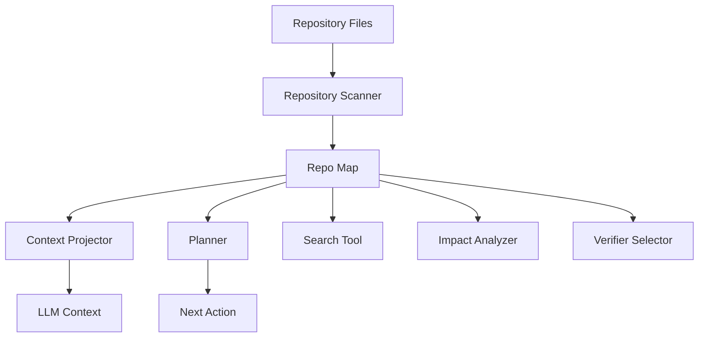
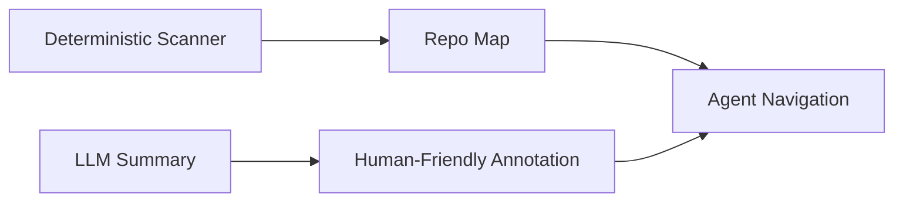
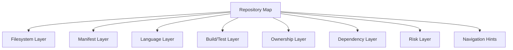
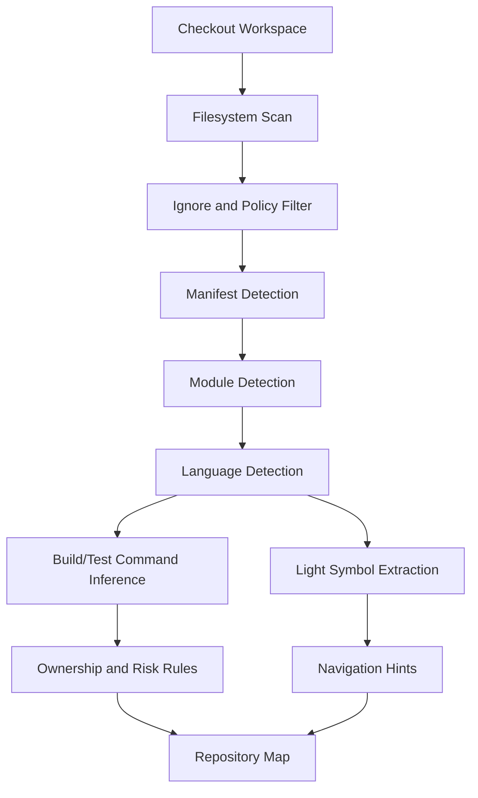
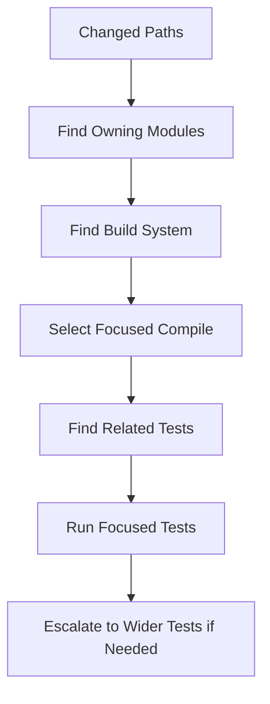

------
title: Learn AI Coding Agent From Scratch - Part 029
description: Build a repository map and code navigation layer for a Honk-like AI coding agent so it can understand large codebases without reading every file.
series: learn-ai-coding-agent
seriesTitle: Learn AI Coding Agent From Scratch
order: 29
partTitle: Repository Map and Code Navigation
tags:
- ai-coding-agent
- repository-map
- code-navigation
- codebase-understanding
- agent-runtime
- software-engineering
date: 2026-07-03
---

# Part 029 — Repository Map: Membantu Agent Memahami Struktur Kode Tanpa Membaca Semua File

> Target part ini: kita membangun **repository map** untuk AI coding agent. Bukan embedding dulu. Bukan RAG dulu. Bukan memasukkan semua file ke context. Repository map adalah peta struktural minimum yang membuat agent tahu **di mana harus mencari**, **apa yang penting**, dan **file mana yang kemungkinan besar harus disentuh**.

Pada Part 028 kita membahas context window management. Di sana kita membuat aturan bagaimana context dipilih dan dikemas untuk satu LLM call.

Part ini membahas sumber context yang lebih fundamental: **peta repo**.

Agent yang tidak punya repository map akan berperilaku seperti developer yang baru masuk repo besar tanpa IDE, tanpa `find usages`, tanpa struktur folder, tanpa ownership, tanpa dependency graph, dan hanya bisa membuka file satu per satu.

Itu bisa bekerja untuk repo kecil. Untuk repo production, itu mahal, lambat, dan sering salah.

---

## 1. Premise Utama

Repository map adalah representasi ringkas dari codebase yang menjawab pertanyaan:

> “Apa saja bagian penting di repo ini, bagaimana hubungannya, dan dari mana agent sebaiknya mulai membaca?”

Ia bukan pengganti file content.

Ia adalah **navigation layer**.



Repository map yang baik membuat agent mampu:

- memahami struktur project tanpa membaca semua file,
- mengenali build system,
- menemukan entrypoint,
- mengenali modul/submodule,
- mengenali area test,
- menemukan source set,
- membedakan generated/vendor/build output,
- memilih command verifier yang relevan,
- menemukan file paling mungkin terkait task,
- menjelaskan kenapa ia membuka file tertentu.

Ini penting untuk agent background seperti Honk-like system karena agent akan berjalan di repo yang tidak selalu pernah dilihat sebelumnya.

---

## 2. Jangan Salah Kaprah: Repo Map Bukan “Summarize Seluruh Repo”

Kesalahan umum:

> “Kita suruh LLM membaca semua file lalu membuat summary repo.”

Masalahnya:

1. terlalu mahal,
2. tidak reproducible,
3. cepat stale,
4. sulit di-diff,
5. summary LLM bisa hallucinate,
6. tidak cukup presisi untuk navigation,
7. tidak bisa menjadi basis policy.

Repository map harus dibangun dari fakta deterministik sebanyak mungkin.

LLM boleh membantu memberi ringkasan tingkat tinggi, tetapi core map harus berasal dari:

- path,
- file type,
- manifest,
- import/dependency,
- symbol extraction,
- build config,
- test layout,
- ownership metadata,
- Git metadata,
- code search result,
- static parsing.

Mental modelnya:



Bagian yang dipakai untuk keputusan agent harus dapat ditelusuri ke evidence.

---

## 3. Repository Map sebagai Index, Bukan Memory

Repo map sering disalahartikan sebagai memory agent. Ini berbahaya.

| Konsep | Fungsi | Staleness Risk |
|---|---|---|
| Repo Map | Peta struktur repo saat checkout tertentu | Harus invalid saat commit berubah |
| Session Memory | Ringkasan pengalaman agent selama run | Bisa salah jika tidak evidence-bound |
| Semantic Index | Retrieval berdasarkan kemiripan makna | Bisa miss/false positive |
| Symbol Index | Struktur definisi dan referensi | Harus sesuai parser/language server |
| Context Projection | Paket context untuk satu LLM call | Dibuat ulang per step |

Repo map harus selalu punya identitas:

```yaml
repository: github.com/acme/order-service
baseRef: main
baseCommit: 9f3a2c...
scanStartedAt: 2026-07-03T10:15:00Z
scanCompletedAt: 2026-07-03T10:15:14Z
scannerVersion: repo-map-scanner/0.1.0
workspaceDigest: sha256:...
```

Jika `baseCommit` berubah, map lama tidak boleh dianggap valid untuk run baru.

---

## 4. Apa yang Harus Ada di Repository Map?

Minimal production-grade repo map berisi beberapa layer.



### 4.1 Filesystem Layer

Filesystem layer menjawab:

- folder top-level apa saja,
- file mana yang terlalu besar,
- file mana yang binary,
- file mana yang generated,
- file mana yang vendored,
- file mana yang hidden,
- file mana yang symlink,
- area mana yang boleh dibaca/ditulis.

Contoh output:

```json
{
  "topLevelDirs": ["src", "config", "db", "docs", ".github"],
  "importantFiles": ["pom.xml", "README.md", "Dockerfile", "openapi.yaml"],
  "ignoredDirs": ["target", "node_modules", ".git"],
  "largeFiles": [
    { "path": "docs/generated/api.html", "sizeBytes": 8400000 }
  ],
  "symlinks": [
    { "path": "config/current", "target": "../prod", "withinWorkspace": true }
  ]
}
```

Filesystem layer harus deterministic dan cepat.

Jangan panggil LLM untuk ini.

---

### 4.2 Manifest Layer

Manifest layer mengenali file konfigurasi yang memberi petunjuk besar tentang repo.

Contoh:

| Ecosystem | Manifest |
|---|---|
| Java Maven | `pom.xml` |
| Java Gradle | `build.gradle`, `settings.gradle`, `build.gradle.kts` |
| Node | `package.json`, `pnpm-lock.yaml`, `yarn.lock`, `package-lock.json` |
| Go | `go.mod`, `go.sum` |
| Python | `pyproject.toml`, `requirements.txt`, `poetry.lock` |
| Rust | `Cargo.toml`, `Cargo.lock` |
| .NET | `.csproj`, `.sln`, `Directory.Build.props` |
| Docker | `Dockerfile`, `compose.yaml` |
| Kubernetes | `kustomization.yaml`, `Chart.yaml`, manifests |
| CI | `.github/workflows/*.yml`, `.gitlab-ci.yml`, `Jenkinsfile` |

Manifest layer menjawab:

- ini repo bahasa apa,
- build system apa,
- dependency manager apa,
- test command apa yang mungkin,
- module boundaries apa,
- generated code berasal dari mana,
- deployment path apa.

---

### 4.3 Language Layer

Language layer menjawab:

- source root,
- test root,
- package/module name,
- import style,
- class/function/symbol top-level,
- entrypoint,
- framework signal.

Untuk Java Maven:

```json
{
  "language": "java",
  "buildSystem": "maven",
  "sourceRoots": ["src/main/java"],
  "testRoots": ["src/test/java"],
  "resources": ["src/main/resources"],
  "mainPackages": ["com.acme.order"],
  "frameworkSignals": ["jax-rs", "jpa", "mapstruct"],
  "testFrameworkSignals": ["junit-jupiter", "mockito"]
}
```

Language layer tidak harus sempurna di awal. Tetapi harus cukup untuk navigation.

---

### 4.4 Build/Test Layer

Build/test layer menjawab:

- command format apa,
- command compile apa,
- command unit test apa,
- command focused test apa,
- module-specific command apa,
- apakah repo multi-module,
- apakah ada generated source step,
- apakah build butuh network.

Contoh Maven multi-module:

```json
{
  "buildProfiles": [
    {
      "name": "maven-default",
      "compileCommand": ["mvn", "-q", "-DskipTests", "compile"],
      "unitTestCommand": ["mvn", "-q", "test"],
      "focusedTestTemplate": ["mvn", "-q", "-Dtest={className}", "test"]
    }
  ],
  "modules": [
    { "path": "common", "artifactId": "common" },
    { "path": "order-api", "artifactId": "order-api" },
    { "path": "order-service", "artifactId": "order-service" }
  ]
}
```

Ini nanti dipakai verifier di Part 048 dan Part 049.

---

### 4.5 Ownership Layer

Ownership layer menjawab:

- siapa owner area tertentu,
- CODEOWNERS match apa,
- file mana high-risk,
- PR reviewer default siapa,
- apakah path butuh approval khusus.

Contoh:

```json
{
  "ownershipRules": [
    { "pattern": "src/main/java/com/acme/payment/**", "owners": ["@payments-team"] },
    { "pattern": "db/migration/**", "owners": ["@database-reviewers"] },
    { "pattern": "security/**", "owners": ["@security-team"] }
  ]
}
```

Agent tidak harus otomatis mention reviewer di part ini, tetapi PR orchestration nanti memakai data ini.

---

### 4.6 Dependency Layer

Dependency layer menjawab:

- modul mana bergantung pada modul mana,
- package/class mana mengimpor apa,
- file mana kemungkinan terdampak bila symbol berubah,
- test mana yang relevan.

Level dependency bisa bertahap:

| Level | Isi | Biaya |
|---|---|---|
| L0 | Folder/module relation | rendah |
| L1 | Manifest dependency | rendah-sedang |
| L2 | Import graph | sedang |
| L3 | Symbol reference graph | tinggi |
| L4 | Call graph | tinggi dan language-specific |

Untuk coding agent, mulai dari L0-L2 sudah memberi benefit besar.

---

### 4.7 Risk Layer

Risk layer menjawab:

- file mana tidak boleh disentuh tanpa approval,
- file mana generated,
- file mana security-sensitive,
- file mana deployment-sensitive,
- file mana schema/db-sensitive,
- file mana legal/license-sensitive.

Contoh:

```json
{
  "riskRules": [
    { "pattern": "db/migration/**", "risk": "high", "reason": "database migration" },
    { "pattern": "src/main/java/**/Security*.java", "risk": "high", "reason": "security path" },
    { "pattern": "pom.xml", "risk": "medium", "reason": "dependency/build config" },
    { "pattern": "target/**", "risk": "blocked", "reason": "build output" }
  ]
}
```

Risk layer menghubungkan repo map dengan permission model dari Part 020.

---

## 5. Repository Map Schema

Kita butuh schema yang sederhana tapi cukup kaya.

```typescript
type RepositoryMap = {
  repository: RepositoryIdentity;
  scan: ScanMetadata;
  filesystem: FilesystemMap;
  manifests: ManifestRecord[];
  languages: LanguageProfile[];
  build: BuildProfile[];
  modules: ModuleRecord[];
  symbolsSummary: SymbolSummary;
  ownership: OwnershipRule[];
  risk: RiskRule[];
  navigationHints: NavigationHint[];
  evidence: EvidenceRecord[];
};
```

Contoh detail:

```typescript
type ModuleRecord = {
  id: string;
  path: string;
  name?: string;
  language?: string;
  buildSystem?: string;
  sourceRoots: string[];
  testRoots: string[];
  manifests: string[];
  dependsOn: string[];
};

type NavigationHint = {
  kind: "entrypoint" | "api" | "config" | "test" | "schema" | "migration" | "generated";
  path: string;
  confidence: number;
  reason: string;
  evidenceRefs: string[];
};

type EvidenceRecord = {
  id: string;
  path: string;
  type: "manifest" | "file_pattern" | "parsed_symbol" | "ownership" | "build_config";
  extractor: string;
  digest: string;
};
```

Perhatikan `evidenceRefs`. Agent harus bisa menjelaskan:

> “Saya membuka `order-service/src/main/java/.../OrderController.java` karena repo map menandainya sebagai JAX-RS API entrypoint berdasarkan annotation `@Path`.”

Tanpa evidence, repo map berubah menjadi tebakan.

---

## 6. Scanner Pipeline

Scanner pipeline sebaiknya bertahap.



### 6.1 Stage 1 — Filesystem Scan

Tujuan:

- cepat,
- tidak menjalankan kode,
- tidak membaca file besar penuh,
- menghormati ignore policy,
- mendeteksi binary/symlink.

Pseudo-code:

```java
RepositoryFileInventory scanFiles(Path root, ScanPolicy policy) {
    var inventory = new RepositoryFileInventory();

    Files.walkFileTree(root, Set.of(FileVisitOption.FOLLOW_LINKS), policy.maxDepth(),
        new SimpleFileVisitor<>() {
            @Override
            public FileVisitResult preVisitDirectory(Path dir, BasicFileAttributes attrs) {
                var rel = root.relativize(dir).toString();
                if (policy.isBlockedDirectory(rel)) return FileVisitResult.SKIP_SUBTREE;
                if (policy.isIgnoredDirectory(rel)) return FileVisitResult.SKIP_SUBTREE;
                inventory.addDirectory(rel);
                return FileVisitResult.CONTINUE;
            }

            @Override
            public FileVisitResult visitFile(Path file, BasicFileAttributes attrs) {
                var rel = root.relativize(file).toString();
                if (!policy.isAllowedPath(rel)) return FileVisitResult.CONTINUE;
                inventory.addFile(FileRecord.from(rel, attrs));
                return FileVisitResult.CONTINUE;
            }
        });

    return inventory;
}
```

Untuk production, jangan `FOLLOW_LINKS` sembarangan. Symlink harus dicek agar tidak keluar workspace.

---

### 6.2 Stage 2 — Manifest Detection

Manifest detection menentukan strategi berikutnya.

```java
List<ManifestRecord> detectManifests(RepositoryFileInventory inventory) {
    return inventory.files().stream()
        .filter(file -> isKnownManifest(file.path()))
        .map(file -> parseManifestLightweight(file.path()))
        .toList();
}
```

`parseManifestLightweight` berarti:

- baca sebagian kalau file besar,
- parse format yang aman,
- jangan menjalankan build script,
- jangan resolve dependency remote dulu,
- catat error parse sebagai artifact, bukan throw fatal kecuali manifest utama corrupt.

---

### 6.3 Stage 3 — Module Detection

Untuk Maven multi-module, parent `pom.xml` bisa memberi daftar module.

Contoh:

```xml
<modules>
  <module>common</module>
  <module>order-api</module>
  <module>order-service</module>
</modules>
```

Repo map harus menyimpan module boundary:

```json
{
  "modules": [
    {
      "id": "maven:order-service",
      "path": "order-service",
      "sourceRoots": ["order-service/src/main/java"],
      "testRoots": ["order-service/src/test/java"],
      "manifests": ["order-service/pom.xml"]
    }
  ]
}
```

Tanpa module boundary, agent sering menjalankan verifier terlalu luas atau mengedit file di module yang salah.

---

### 6.4 Stage 4 — Light Symbol Extraction

Part 030 akan membahas symbol indexing lebih dalam. Di part ini, kita cukup ambil symbol top-level:

- Java class/interface/enum/record,
- method public penting,
- REST endpoint annotation,
- Spring bean annotation,
- test class,
- migration file,
- OpenAPI path,
- protobuf service,
- GraphQL schema type.

Light extraction bisa memakai:

- regex terbatas untuk signal cepat,
- parser seperti Tree-sitter,
- LSP server jika tersedia,
- compiler index untuk language tertentu.

Jangan membuat scanner awal bergantung pada satu teknologi parsing sempurna.

Prinsipnya:

> “Good enough map first, deeper index when needed.”

---

## 7. Navigation Hint

Navigation hint adalah output paling berguna untuk agent.

Agent tidak perlu melihat semua detail scanner. Agent perlu petunjuk:

> “Untuk task jenis ini, mulai dari file ini, lalu cek file itu.”

Contoh:

```json
[
  {
    "kind": "api",
    "path": "order-service/src/main/java/com/acme/order/api/OrderResource.java",
    "confidence": 0.92,
    "reason": "JAX-RS resource detected via @Path annotation",
    "evidenceRefs": ["ev-102"]
  },
  {
    "kind": "test",
    "path": "order-service/src/test/java/com/acme/order/api/OrderResourceTest.java",
    "confidence": 0.83,
    "reason": "test class name matches OrderResource",
    "evidenceRefs": ["ev-231"]
  },
  {
    "kind": "config",
    "path": "order-service/src/main/resources/application.yaml",
    "confidence": 0.74,
    "reason": "service runtime configuration",
    "evidenceRefs": ["ev-044"]
  }
]
```

Navigation hint bisa dibuat oleh deterministic rules.

LLM boleh dipakai untuk memperbaiki prioritas, tetapi hasil LLM harus diberi label `inferred`, bukan `detected`.

---

## 8. Task-Aware Navigation

Repo map yang sama harus diproyeksikan berbeda untuk task yang berbeda.

Contoh task:

> “Migrate deprecated `javax.ws.rs` imports to `jakarta.ws.rs`.”

Navigation strategy:

1. cari manifest Java/Maven,
2. cek dependency JAX-RS/Jakarta,
3. search `javax.ws.rs`,
4. cari source roots,
5. cari tests yang memakai resource/controller,
6. cek build profile.

Contoh task lain:

> “Upgrade PostgreSQL JDBC driver.”

Navigation strategy:

1. cari manifest dependency,
2. cari lockfile/BOM/parent POM,
3. cari datasource config,
4. cari integration tests,
5. cari DB compatibility notes,
6. pilih verifier compile + focused tests.

Jadi repo map harus mendukung query seperti:

```text
find relevant files for taskType=DEPENDENCY_UPGRADE dependency=postgresql
find tests related to src/main/java/com/acme/order/OrderService.java
find config files in module order-service
find manifest owning dependency groupId=org.postgresql
```

---

## 9. Code Navigation Query Model

Daripada memberi agent command bebas, buat query API.

```typescript
type RepoNavigationQuery =
  | { type: "find_files_by_pattern"; pattern: string; limit: number }
  | { type: "find_entrypoints"; module?: string; framework?: string }
  | { type: "find_related_tests"; path: string; limit: number }
  | { type: "find_manifest_for_path"; path: string }
  | { type: "find_module_for_path"; path: string }
  | { type: "find_risky_paths"; changedPaths: string[] }
  | { type: "explain_path"; path: string };
```

Tool response harus ringkas dan evidence-based:

```json
{
  "query": { "type": "find_related_tests", "path": "src/main/java/com/acme/OrderService.java" },
  "results": [
    {
      "path": "src/test/java/com/acme/OrderServiceTest.java",
      "score": 0.91,
      "reason": "name match and same package",
      "evidence": ["same_package", "test_suffix"]
    }
  ]
}
```

Agent tidak boleh dipaksa menebak dari raw directory listing setiap kali.

---

## 10. Repo Map Storage

Repo map bisa disimpan sebagai artifact JSON.

Untuk platform production, simpan juga di database.

Schema sederhana:

```sql
create table repository_maps (
    id uuid primary key,
    repository_id uuid not null,
    base_commit text not null,
    scanner_version text not null,
    workspace_digest text not null,
    map_json jsonb not null,
    created_at timestamptz not null default now(),
    unique(repository_id, base_commit, scanner_version)
);

create table repository_map_items (
    id uuid primary key,
    repository_map_id uuid not null references repository_maps(id),
    item_type text not null,
    path text,
    symbol_name text,
    module_id text,
    risk_level text,
    payload jsonb not null
);

create index idx_repo_map_items_path
on repository_map_items(repository_map_id, path);

create index idx_repo_map_items_type
on repository_map_items(repository_map_id, item_type);
```

Untuk tahap awal, JSON artifact cukup. Untuk fleet-scale, database item index membantu query cepat.

---

## 11. Cache dan Invalidation

Repo map boleh di-cache, tetapi invalidation harus ketat.

Cache key minimal:

```text
repository_id + base_commit + scanner_version + policy_version
```

Jika policy berubah, map lama mungkin tidak valid karena:

- path yang dulu allowed sekarang blocked,
- risk classification berubah,
- generated-file rule berubah,
- secret scanning rule berubah,
- module detection logic berubah.

Pseudo-code:

```java
Optional<RepositoryMap> loadReusableMap(Repo repo, String commit, String scannerVersion, String policyVersion) {
    return repositoryMapStore.find(repo.id(), commit, scannerVersion, policyVersion)
        .filter(map -> map.status() == COMPLETE)
        .filter(map -> !map.hasCriticalScannerWarnings());
}
```

Jangan reuse map hanya berdasarkan branch name.

Branch name bisa bergerak.

Commit SHA adalah anchor.

---

## 12. Membuat Repo Map untuk Java Maven Repo

Kita ambil contoh repo Java Maven.

### 12.1 Input

```text
repo/
  pom.xml
  order-api/
    pom.xml
    src/main/java/com/acme/order/api/OrderRequest.java
  order-service/
    pom.xml
    src/main/java/com/acme/order/OrderService.java
    src/main/java/com/acme/order/api/OrderResource.java
    src/test/java/com/acme/order/OrderServiceTest.java
  db/
    migration/V001__init.sql
  .github/workflows/ci.yml
```

### 12.2 Output Map Ringkas

```json
{
  "languages": [
    { "language": "java", "confidence": 0.98 }
  ],
  "build": [
    {
      "buildSystem": "maven",
      "rootManifest": "pom.xml",
      "compileCommand": ["mvn", "-q", "-DskipTests", "compile"],
      "testCommand": ["mvn", "-q", "test"]
    }
  ],
  "modules": [
    {
      "id": "order-api",
      "path": "order-api",
      "sourceRoots": ["order-api/src/main/java"],
      "testRoots": []
    },
    {
      "id": "order-service",
      "path": "order-service",
      "sourceRoots": ["order-service/src/main/java"],
      "testRoots": ["order-service/src/test/java"]
    }
  ],
  "navigationHints": [
    {
      "kind": "api",
      "path": "order-service/src/main/java/com/acme/order/api/OrderResource.java",
      "confidence": 0.92,
      "reason": "contains JAX-RS @Path annotation"
    },
    {
      "kind": "test",
      "path": "order-service/src/test/java/com/acme/order/OrderServiceTest.java",
      "confidence": 0.86,
      "reason": "JUnit-style test class"
    },
    {
      "kind": "migration",
      "path": "db/migration/V001__init.sql",
      "confidence": 0.8,
      "reason": "Flyway-style migration path"
    }
  ]
}
```

Agent bisa memakai map ini untuk memulai eksplorasi tanpa membaca seluruh repo.

---

## 13. Repository Map dan Context Projector

Repo map tidak semuanya dikirim ke LLM.

Context projector memilih bagian relevan.

Untuk task dependency upgrade:

```text
Relevant context projection:
- detected build system: Maven
- root pom: pom.xml
- modules: order-api, order-service
- dependency locations: root pom, module poms
- test command: mvn -q test
- high-risk paths: pom.xml, db/migration/**
```

Untuk task REST endpoint migration:

```text
Relevant context projection:
- source roots
- REST resource candidates
- related test candidates
- dependency hints for JAX-RS/Jakarta
- package/import search hints
```

Jadi repo map adalah input ke Part 028.

---

## 14. Repository Map dan Planner

Planner memakai repo map untuk membuat todo yang tidak buta.

Tanpa repo map:

```text
1. Search for relevant files.
2. Open files.
3. Modify.
4. Run tests.
```

Dengan repo map:

```text
1. Inspect Maven parent POM and module POMs because repo map detected Maven multi-module.
2. Search only under Java source roots for deprecated imports.
3. Open matching resource/service classes.
4. Open related tests detected by naming/package relation.
5. Apply scoped import migration.
6. Run focused module compile, then selected tests.
```

Perbedaannya besar.

Yang kedua punya scope dan alasan.

---

## 15. Repository Map dan Verifier Selection

Verifier tidak boleh selalu menjalankan seluruh test suite.

Repo map membantu memilih verifier bertahap:



Contoh:

| Changed Path | Module | First Verifier |
|---|---|---|
| `order-service/src/main/java/...` | `order-service` | `mvn -pl order-service -DskipTests compile` |
| `order-service/src/test/java/...` | `order-service` | `mvn -pl order-service test` |
| `pom.xml` root | all modules | `mvn -q -DskipTests compile` |
| `db/migration/...` | db | migration lint + integration test gate |

Ini akan diperluas di Part 048 dan 049.

---

## 16. Jangan Membuat Repo Map Terlalu Pintar Terlalu Awal

Anti-pattern:

1. membangun knowledge graph besar sebelum ada use case,
2. mengindeks seluruh token file tanpa filtering,
3. memakai embedding sebagai satu-satunya navigation,
4. mengandalkan LLM summary untuk fakta struktural,
5. tidak menyimpan commit SHA,
6. tidak punya evidence,
7. tidak membedakan generated/vendor/source,
8. tidak punya risk classification,
9. tidak punya invalidation,
10. tidak bisa menjelaskan kenapa file relevan.

Repo map harus dimulai sederhana:

```text
files + manifests + modules + source roots + test roots + build commands + risk + navigation hints
```

Baru setelah itu tambah symbol index, semantic index, call graph, dan ownership intelligence.

---

## 17. Implementation Slice: Repo Map Service

Kita desain service kecil.

```java
public interface RepositoryMapService {
    RepositoryMap buildMap(WorkspaceRef workspace, RepoMapPolicy policy);
    Optional<RepositoryMap> findReusableMap(RepositoryRef repo, CommitSha commit, PolicyVersion policyVersion);
    NavigationResult query(RepositoryMapId mapId, RepoNavigationQuery query);
}
```

Komponen:

```text
repo-map/
  RepositoryMapService.java
  RepositoryScanner.java
  FileInventoryScanner.java
  ManifestDetector.java
  ModuleDetector.java
  LanguageDetector.java
  BuildProfileInferer.java
  OwnershipScanner.java
  RiskClassifier.java
  NavigationHintBuilder.java
  RepositoryMapStore.java
```

Flow:

```java
public RepositoryMap buildMap(WorkspaceRef workspace, RepoMapPolicy policy) {
    var files = fileInventoryScanner.scan(workspace.path(), policy);
    var manifests = manifestDetector.detect(workspace.path(), files, policy);
    var modules = moduleDetector.detect(workspace.path(), manifests, files);
    var languages = languageDetector.detect(files, manifests, modules);
    var buildProfiles = buildProfileInferer.infer(manifests, modules, languages);
    var ownership = ownershipScanner.scan(workspace.path(), files);
    var risk = riskClassifier.classify(files, manifests, ownership, policy);
    var hints = navigationHintBuilder.build(files, manifests, modules, languages, risk);

    return RepositoryMap.create(
        workspace.identity(), files, manifests, modules,
        languages, buildProfiles, ownership, risk, hints
    );
}
```

Semua stage harus menghasilkan warning, bukan langsung fatal, kecuali invariant workspace rusak.

---

## 18. Repo Map Artifact

Setiap run harus menyimpan repo map sebagai artifact.

```json
{
  "artifactType": "repository_map",
  "path": "artifacts/repository-map.json",
  "digest": "sha256:...",
  "visibility": "internal",
  "redaction": "none",
  "createdByStep": "step-scan-repo"
}
```

Kenapa?

Karena saat PR agent dipertanyakan, kita bisa replay:

- task input,
- base commit,
- repo map,
- context projection,
- tool calls,
- patches,
- verifier logs,
- judge verdict.

Tanpa repo map artifact, keputusan awal agent sulit diaudit.

---

## 19. Failure Mode Repository Map

| Failure | Dampak | Guard |
|---|---|---|
| Generated file dianggap source | Agent edit output build | generated path classifier |
| Module salah | Verifier salah scope | manifest parser + changed path mapping |
| Test root tidak terdeteksi | Agent tidak run test relevan | naming fallback + build profile |
| Repo map stale | Agent navigasi file lama | commit SHA + digest invalidation |
| Symlink escape | baca file luar workspace | realpath guard |
| Vendor dir masuk map | context penuh noise | ignore rules |
| LLM summary hallucinate | navigation salah | summary bukan source of truth |
| Risk path tidak ditandai | perubahan high-risk lolos | risk policy + CODEOWNERS |

---

## 20. Drill: Bangun Repo Map Manual

Ambil repo Java yang kamu punya.

Tanpa menjalankan LLM, buat JSON map berisi:

1. top-level directories,
2. manifests,
3. language profile,
4. modules,
5. source roots,
6. test roots,
7. build command,
8. focused test command template,
9. risky paths,
10. navigation hints.

Lalu jawab:

- file mana yang agent harus baca pertama untuk dependency upgrade?
- file mana yang agent harus baca pertama untuk REST API migration?
- command verifier mana yang aman dijalankan pertama?
- path mana yang tidak boleh ditulis agent?

Kalau kamu belum bisa menjawab, repo map belum cukup berguna.

---

## 21. Invariant Part Ini

Repository map harus memenuhi invariant berikut:

1. **Commit-bound**: map terikat ke commit SHA, bukan branch name.
2. **Evidence-bound**: setiap hint penting punya evidence.
3. **Policy-aware**: map tahu path allowed, risky, dan blocked.
4. **Deterministic-first**: fakta struktural tidak diserahkan ke LLM.
5. **Projection-ready**: map bisa dipakai context projector.
6. **Verifier-ready**: map bisa membantu memilih command build/test.
7. **Auditable**: map disimpan sebagai artifact.
8. **Invalidatable**: map punya scanner/policy version.

---

## 22. Ringkasan

Repository map adalah peta navigasi codebase untuk agent.

Ia bukan RAG, bukan memory, bukan summary bebas.

Ia adalah struktur deterministic yang menghubungkan:

- filesystem,
- manifest,
- module,
- source root,
- test root,
- build command,
- ownership,
- risk,
- navigation hint,
- evidence.

Dengan repo map, agent tidak perlu “berjalan di gelap”.

Agent bisa mulai dari file yang benar, memilih verifier yang benar, membatasi blast radius, dan menjelaskan alasannya.

Part berikutnya akan masuk lebih dalam ke **symbol indexing dan semantic code search**: bagaimana agent menemukan definisi, referensi, call site, dan konsep yang tidak bisa ditemukan hanya dari path/manifest.

---

## Sumber Faktual

- Tree-sitter documentation: parser generator and incremental parsing library for concrete syntax trees.
- Microsoft Language Server Protocol specification 3.17: protocol for language features such as document symbols and workspace symbols.
- ripgrep project documentation: recursive regex search that respects gitignore and skips hidden/binary files by default.
- OpenAI embeddings documentation: embeddings measure relatedness of text strings and are commonly used for search, clustering, recommendations, anomaly detection, and classification.
