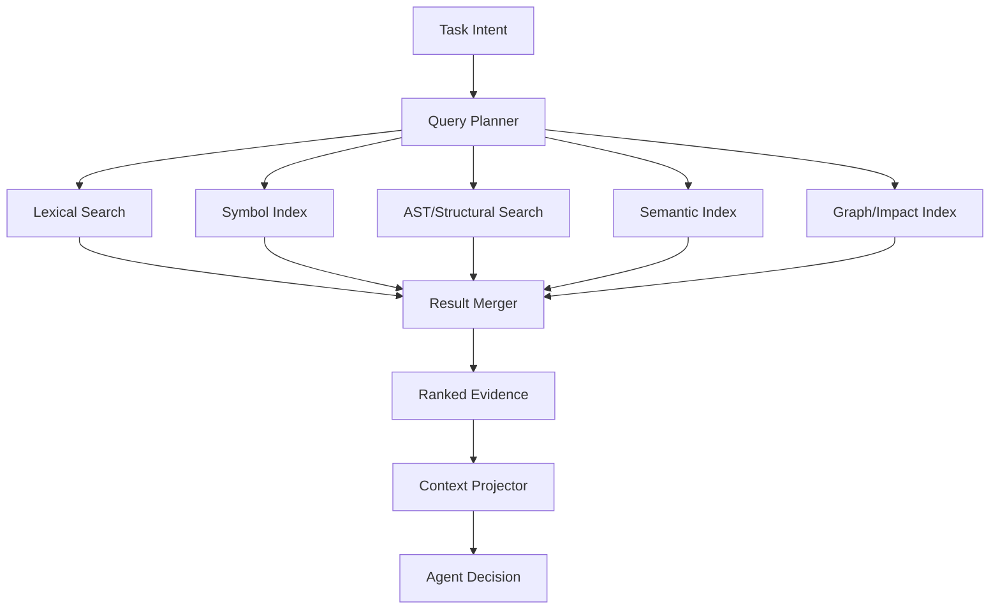
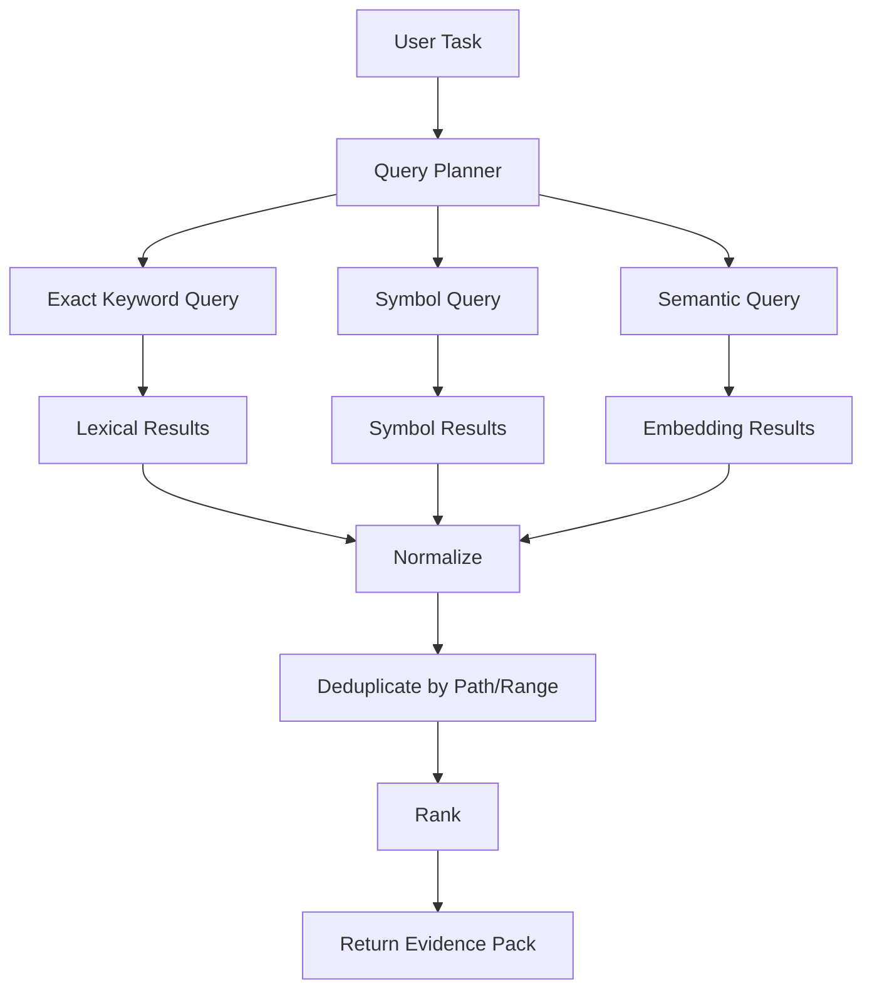
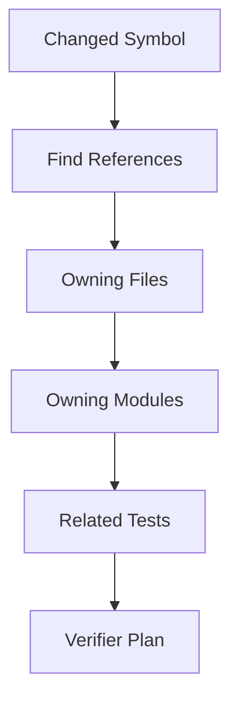
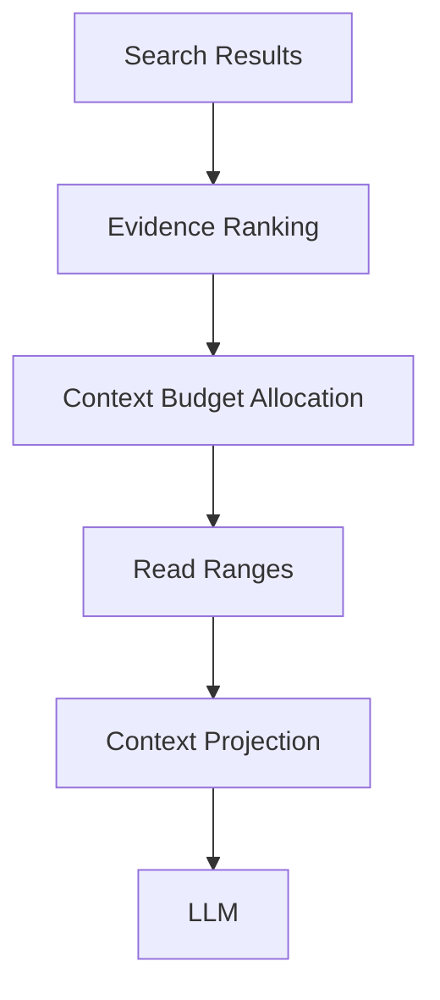

------
title: Learn AI Coding Agent From Scratch - Part 030
description: Design symbol indexing and semantic code search for a Honk-like AI coding agent using ripgrep, AST parsing, LSP, embeddings, hybrid retrieval, and call-site discovery.
series: learn-ai-coding-agent
seriesTitle: Learn AI Coding Agent From Scratch
order: 30
partTitle: Symbol Indexing and Semantic Code Search
tags:
- ai-coding-agent
- symbol-indexing
- semantic-search
- tree-sitter
- lsp
- embeddings
- code-navigation
- software-engineering
date: 2026-07-03
---

# Part 030 — Symbol Indexing dan Semantic Code Search: Ripgrep, AST, Embedding, Call Site Discovery

> Target part ini: kita membangun search layer untuk AI coding agent. Agent harus bisa menemukan **definisi**, **referensi**, **call site**, **test terkait**, dan **konsep domain** tanpa membaca seluruh repo. Kita akan membedakan lexical search, structural search, symbol search, dan semantic search, lalu menggabungkannya menjadi hybrid retrieval yang bisa diaudit.

Part 029 membangun repository map: peta struktur repo.

Part ini membangun kemampuan berikutnya:

> “Ketika agent tahu area repo, bagaimana ia menemukan symbol dan kode yang benar?”

Ini bukan sekadar `grep`.

Coding agent butuh beberapa jenis pencarian:

| Search Type | Cocok Untuk | Contoh |
|---|---|---|
| Lexical search | string literal, import, config key, exact API | `javax.ws.rs`, `OrderService`, `timeoutMs` |
| Structural search | bentuk syntax/AST | method annotated `@Transactional` |
| Symbol search | definition/reference | class `OrderService`, method `submitOrder` |
| Semantic search | konsep yang tidak exact string | “retry policy for failed payment” |
| Graph search | impact/call chain | callers of `calculatePrice` |
| Test relation search | regression target | tests related to changed class |

Agent yang hanya punya lexical search akan sering miss.

Agent yang hanya punya embedding akan sering false positive.

Production-grade agent perlu hybrid.

---

## 1. Mental Model: Search Layer sebagai Evidence Retrieval System

Search layer bukan “fitur convenience”.

Search layer adalah sistem evidence retrieval.



Prinsip utamanya:

> Search result harus menjadi evidence yang bisa ditelusuri, bukan potongan context anonim.

Setiap result minimal punya:

```json
{
  "path": "src/main/java/com/acme/order/OrderService.java",
  "range": { "startLine": 42, "endLine": 71 },
  "kind": "symbol_definition",
  "score": 0.91,
  "reason": "exact symbol definition match",
  "extractor": "tree-sitter-java",
  "digest": "sha256:..."
}
```

---

## 2. Lexical Search: Foundation yang Tidak Boleh Diremehkan

Lexical search adalah lapisan pertama.

Gunakan untuk:

- exact imports,
- deprecated API,
- config key,
- feature flag,
- string literal,
- annotation name,
- SQL table name,
- HTTP path,
- exception class,
- package name.

Tool seperti ripgrep sangat berguna karena cepat, recursive, menghormati `.gitignore`, dan secara default melewati hidden/binary file.

Contoh command internal:

```bash
rg --line-number --column --hidden --glob '!target/**' --glob '!node_modules/**' 'javax\.ws\.rs' .
```

Tetapi agent tidak seharusnya diberi command bebas.

Buat API:

```typescript
type LexicalSearchRequest = {
  query: string;
  regex?: boolean;
  paths?: string[];
  includeGlobs?: string[];
  excludeGlobs?: string[];
  maxResults: number;
  contextLines: number;
};
```

Response:

```json
{
  "query": "javax.ws.rs",
  "results": [
    {
      "path": "order-service/src/main/java/com/acme/order/api/OrderResource.java",
      "line": 3,
      "column": 8,
      "preview": "import javax.ws.rs.Path;",
      "score": 1.0,
      "reason": "exact literal match"
    }
  ],
  "truncated": false
}
```

Lexical search harus selalu punya output limit.

Jika result terlalu banyak, jangan masukkan semua ke model. Kembalikan ringkasan:

```json
{
  "query": "Order",
  "totalMatches": 1847,
  "topPaths": [
    { "path": "order-service/src/main/java/...", "matches": 412 },
    { "path": "order-api/src/main/java/...", "matches": 260 }
  ],
  "recommendation": "narrow_query"
}
```

---

## 3. Symbol Index: Definisi dan Referensi

Lexical search mencari string. Symbol index mencari entity bahasa pemrograman.

Contoh symbol:

```json
{
  "symbolId": "java:com.acme.order.OrderService#submitOrder(OrderRequest)",
  "name": "submitOrder",
  "kind": "method",
  "language": "java",
  "path": "order-service/src/main/java/com/acme/order/OrderService.java",
  "range": { "startLine": 52, "endLine": 88 },
  "container": "com.acme.order.OrderService",
  "visibility": "public",
  "signature": "public Order submitOrder(OrderRequest request)",
  "annotations": ["@Transactional"],
  "module": "order-service"
}
```

Symbol index menjawab query:

```text
find definition of OrderService
find method submitOrder in package com.acme.order
find classes annotated with @Path
find tests referencing OrderService
find all references to calculatePrice
```

---

## 4. Sumber Symbol: Regex, AST, LSP, Compiler

Ada beberapa level akurasi.

| Source | Akurasi | Biaya | Catatan |
|---|---:|---:|---|
| Regex heuristic | rendah-sedang | rendah | cepat, cukup untuk signal awal |
| Tree-sitter AST | sedang-tinggi | sedang | lintas bahasa, syntax-level |
| LSP | tinggi | sedang-tinggi | butuh server per bahasa |
| Compiler index | sangat tinggi | tinggi | language-specific, build-aware |
| Runtime reflection | khusus | tinggi | jarang untuk static code agent |

Untuk agent platform, jangan mulai dari compiler index penuh.

Mulai dari:

1. lexical search,
2. repository map,
3. Tree-sitter/AST top-level symbols,
4. LSP optional,
5. compiler-aware index untuk bahasa/use case tertentu.

---

## 5. Tree-sitter untuk Structural Parsing

Tree-sitter berguna karena dapat membangun concrete syntax tree untuk file source dan mendukung incremental parsing.

Dalam coding agent, Tree-sitter cocok untuk:

- menemukan class/function/method,
- menemukan import,
- menemukan annotation/decorator,
- mengambil range symbol,
- membuat chunk code yang syntax-aware,
- membedakan comment/string/code,
- melakukan lightweight structural query lintas bahasa.

Contoh query konseptual untuk Java:

```scheme
(class_declaration
  name: (identifier) @class.name)

(method_declaration
  name: (identifier) @method.name)

(import_declaration) @import
```

Output index:

```json
{
  "path": "src/main/java/com/acme/order/OrderService.java",
  "symbols": [
    {
      "name": "OrderService",
      "kind": "class",
      "range": { "startLine": 14, "endLine": 140 }
    },
    {
      "name": "submitOrder",
      "kind": "method",
      "range": { "startLine": 52, "endLine": 88 }
    }
  ],
  "imports": [
    "com.acme.order.api.OrderRequest",
    "jakarta.transaction.Transactional"
  ]
}
```

Tree-sitter tidak memberi semantic type resolution sempurna. Ia tahu syntax, bukan selalu meaning compiler-level.

Jadi jangan overclaim.

---

## 6. LSP untuk Language Intelligence

Language Server Protocol menyediakan cara standar bagi editor/tool untuk meminta fitur bahasa seperti document symbols, workspace symbols, definition, references, hover, rename, dan diagnostics.

Untuk coding agent, LSP berguna saat:

- repo language server bisa dijalankan di sandbox,
- project bisa di-load dengan dependencies cukup,
- kita butuh definition/reference yang lebih akurat,
- task membutuhkan refactor yang symbol-aware.

Query penting:

```text
textDocument/documentSymbol
workspace/symbol
textDocument/definition
textDocument/references
textDocument/diagnostic
```

Tetapi LSP punya biaya dan risiko:

- server startup lambat,
- butuh dependency/build setup,
- bisa menjalankan plugin atau membaca config,
- bisa membutuhkan network/cache,
- hasil bisa tidak stabil jika project belum compile,
- tiap bahasa punya behavior berbeda.

Maka LSP harus dijalankan sebagai tool permissioned di sandbox, bukan otomatis tanpa batas.

---

## 7. Semantic Search: Untuk Intent yang Tidak Exact String

Semantic search memakai embedding untuk mencari potongan kode/dokumen yang maknanya dekat dengan query.

Cocok untuk:

- “where do we handle failed payments?”
- “retry policy for downstream API calls”
- “authorization check before approving case”
- “order cancellation workflow”
- “audit trail writing logic”

Tidak cocok sebagai satu-satunya cara untuk:

- exact API migration,
- import replacement,
- dependency version update,
- method rename yang harus compiler-safe,
- security-sensitive exact policy.

Embeddings mengukur relatedness antar teks dan umum dipakai untuk search. Tetapi relatedness bukan correctness.

Semantic result harus dikombinasikan dengan lexical/symbol evidence.

---

## 8. Code Chunking untuk Embedding

Jangan embed seluruh file mentah tanpa struktur.

Chunk yang baik untuk code search:

| Chunk | Cocok | Masalah |
|---|---|---|
| Full file | file kecil | terlalu noisy untuk file besar |
| Fixed token window | mudah | bisa memotong function/class |
| Symbol chunk | function/class-level | butuh parser |
| Section chunk | config/docs | butuh format-aware parser |
| Hybrid chunk | paling fleksibel | lebih kompleks |

Untuk code, gunakan symbol-aware chunk.

```json
{
  "chunkId": "chunk-ordsvc-submitorder",
  "path": "order-service/src/main/java/com/acme/order/OrderService.java",
  "range": { "startLine": 52, "endLine": 88 },
  "symbolId": "java:com.acme.order.OrderService#submitOrder(OrderRequest)",
  "kind": "method",
  "text": "public Order submitOrder(...) { ... }",
  "metadata": {
    "module": "order-service",
    "language": "java",
    "annotations": ["@Transactional"],
    "imports": ["..."]
  }
}
```

Embedding chunk harus punya path/range/digest.

Kalau file berubah, chunk harus invalid.

---

## 9. Index Schema

Pisahkan beberapa index.

```sql
create table code_symbols (
    id uuid primary key,
    repository_map_id uuid not null,
    symbol_id text not null,
    language text not null,
    kind text not null,
    name text not null,
    container text,
    path text not null,
    start_line int not null,
    end_line int not null,
    signature text,
    annotations jsonb not null default '[]',
    imports jsonb not null default '[]',
    digest text not null
);

create index idx_code_symbols_name
on code_symbols(repository_map_id, name);

create index idx_code_symbols_path
on code_symbols(repository_map_id, path);
```

Embedding chunks:

```sql
create table code_chunks (
    id uuid primary key,
    repository_map_id uuid not null,
    path text not null,
    start_line int not null,
    end_line int not null,
    symbol_id text,
    chunk_kind text not null,
    text_digest text not null,
    metadata jsonb not null,
    embedding_model text,
    embedding vector
);
```

Jika tidak memakai pgvector, bisa simpan embedding di vector store atau search engine lain. Yang penting metadata tetap lengkap.

---

## 10. Hybrid Retrieval

Hybrid retrieval menggabungkan beberapa sinyal.



Ranking bisa memakai formula sederhana:

```text
score =
  0.35 * exact_match_score +
  0.25 * symbol_score +
  0.20 * semantic_score +
  0.10 * recency_or_changed_path_score +
  0.10 * test_or_entrypoint_boost -
  risk_penalty - generated_penalty
```

Jangan terlalu cepat membuat ranking ML kompleks.

Mulai dari transparent scoring agar agent bisa menjelaskan hasil.

---

## 11. Query Planner

Agent sering memberi query natural language.

Search layer harus memecahnya.

Task:

> “Migrate JAX-RS imports from javax to jakarta.”

Query plan:

```json
{
  "lexical": [
    { "query": "javax.ws.rs", "paths": ["src/main/java", "src/test/java"] },
    { "query": "jakarta.ws.rs", "paths": ["src/main/java", "src/test/java"] }
  ],
  "symbol": [
    { "kind": "annotation", "name": "Path" },
    { "kind": "annotation", "name": "GET" },
    { "kind": "annotation", "name": "POST" }
  ],
  "semantic": [
    { "query": "JAX-RS REST resource endpoints" }
  ]
}
```

Task:

> “Find where failed payment retry is implemented.”

Query plan:

```json
{
  "lexical": [
    { "query": "retry" },
    { "query": "payment" },
    { "query": "failed" }
  ],
  "symbol": [
    { "nameContains": "Payment" },
    { "nameContains": "Retry" }
  ],
  "semantic": [
    { "query": "failed payment retry policy downstream charge attempts" }
  ]
}
```

The query planner can be deterministic first. LLM can suggest query expansions, but runtime should validate and limit them.

---

## 12. Call Site Discovery

Call site discovery menjawab:

> “Siapa yang memanggil function ini?”

Ada beberapa level.

### 12.1 Lexical Approximation

Cari nama method:

```bash
rg --line-number 'submitOrder\s*\(' src/main/java src/test/java
```

Cepat, tetapi false positive:

- method dengan nama sama di class lain,
- comment,
- string,
- overload ambiguity.

### 12.2 AST-Based Approximation

Parse method invocation node.

Contoh pseudo-query:

```scheme
(method_invocation
  name: (identifier) @method.name)
```

Lebih baik karena bisa menghindari comment/string.

Masih belum resolve type.

### 12.3 LSP References

Gunakan `textDocument/references` untuk symbol tertentu.

Lebih akurat jika language server berhasil load project.

### 12.4 Compiler-Aware Graph

Untuk Java, bisa memakai compiler/indexer yang tahu type, overload, inheritance, generics.

Paling akurat, tetapi paling mahal.

Untuk agent, strategi realistis:

```text
lexical candidate -> AST filter -> optional LSP confirm -> verifier compile/test
```

Jangan menunggu perfect call graph sebelum agent mulai bekerja.

---

## 13. Related Test Discovery

Agent yang mengubah kode harus tahu test mana yang relevan.

Sinyal terkait test:

| Signal | Contoh |
|---|---|
| Naming | `OrderService` → `OrderServiceTest` |
| Package mirror | `src/main/java/a/b/C.java` → `src/test/java/a/b/CTest.java` |
| Import/reference | test import class under test |
| Annotation | `@SpringBootTest`, `@QuarkusTest`, `@ExtendWith` |
| Build tool | Maven `-Dtest=OrderServiceTest` |
| Historical data | test failed when file changed before |

Response:

```json
{
  "sourcePath": "order-service/src/main/java/com/acme/order/OrderService.java",
  "relatedTests": [
    {
      "path": "order-service/src/test/java/com/acme/order/OrderServiceTest.java",
      "score": 0.94,
      "signals": ["name_match", "package_mirror", "references_symbol"]
    }
  ]
}
```

Ini nanti dipakai verifier selection.

---

## 14. Impact Analysis

Impact analysis menjawab:

> “Jika file/symbol ini berubah, area mana yang mungkin ikut terdampak?”

Mulai dari sederhana:



Impact pack:

```json
{
  "changedPath": "order-service/src/main/java/com/acme/order/OrderService.java",
  "owningModule": "order-service",
  "referencingFiles": [
    "order-service/src/main/java/com/acme/order/api/OrderResource.java",
    "order-service/src/test/java/com/acme/order/OrderServiceTest.java"
  ],
  "recommendedVerifier": [
    ["mvn", "-q", "-pl", "order-service", "-DskipTests", "compile"],
    ["mvn", "-q", "-pl", "order-service", "-Dtest=OrderServiceTest", "test"]
  ]
}
```

Akurasi impact analysis tidak harus sempurna. Tetapi ia harus conservative.

Jika ragu, perluas verifier scope.

---

## 15. Search Result Contract untuk Agent

Jangan kembalikan raw dump panjang.

Gunakan contract:

```typescript
type CodeSearchResult = {
  resultId: string;
  path: string;
  range: LineRange;
  kind: "lexical" | "symbol" | "semantic" | "reference" | "test_relation";
  score: number;
  confidence: "low" | "medium" | "high";
  preview: string;
  reason: string;
  evidence: Evidence[];
  actions: SuggestedAction[];
};
```

Contoh suggested action:

```json
{
  "actions": [
    { "type": "read_range", "path": ".../OrderService.java", "startLine": 40, "endLine": 95 },
    { "type": "find_references", "symbolId": "java:...#submitOrder" },
    { "type": "find_related_tests", "path": ".../OrderService.java" }
  ]
}
```

Search tool harus membantu agent mengambil next action yang benar.

---

## 16. Index Build Pipeline

```mermaid
flowchart TD
    A[Repository Map] --> B[Select Indexable Files]
    B --> C[Lexical Metadata]
    B --> D[AST Parse]
    D --> E[Symbol Extraction]
    E --> F[Symbol Index]
    E --> G[Code Chunks]
    G --> H[Embedding Queue]
    H --> I[Embedding Index]
    F --> J[Reference Approximation]
    J --> K[Impact Index]
```



Pipeline rules:

1. index only allowed files,
2. skip binary/generated/vendor by default,
3. cap max file size,
4. store parser errors,
5. hash file content,
6. incremental rebuild only changed files,
7. record extractor version,
8. keep source-of-truth in workspace, not index.

---

## 17. Incremental Indexing

Untuk background agent, full indexing setiap run bisa mahal.

Cache per commit:

```text
repo_id + commit_sha + indexer_version + policy_version
```

Untuk working tree setelah agent edit:

```text
base index + changed file overlay
```

Pseudo-code:

```java
CodeIndex getIndexForWorkspace(Workspace workspace) {
    var base = indexStore.loadBaseIndex(workspace.repository(), workspace.baseCommit());
    var changedFiles = gitTool.changedFiles(workspace.path());
    var overlay = indexer.indexFiles(workspace.path(), changedFiles);
    return base.withOverlay(overlay);
}
```

Jangan memakai stale index untuk file yang sudah diedit agent.

Jika `text_digest` berubah, chunk/symbol harus rebuilt.

---

## 18. Combining Search with Context Window Management

Search result tidak otomatis masuk context.

Flow yang benar:



Search result hanya memberi candidate.

File range yang akan dimasukkan harus:

- relevan,
- cukup lengkap secara syntax,
- punya path/range,
- tidak terlalu panjang,
- tidak mengandung secret,
- tidak stale,
- sesuai permission.

---

## 19. Semantic Search Failure Modes

Semantic search kuat, tetapi riskan.

| Failure | Contoh | Guard |
|---|---|---|
| False positive | chunk “payment” tapi bukan retry logic | combine lexical/symbol |
| False negative | konsep memakai nama domain berbeda | query expansion |
| Stale embedding | file berubah tapi embedding lama | digest invalidation |
| Oversized chunk | banyak konsep campur | symbol-aware chunking |
| Secret leakage | chunk berisi credential | redaction before indexing |
| Generated code noise | generated client mendominasi result | generated classifier |
| Test/source confusion | test dianggap implementation | metadata filter |
| Similarity over correctness | related text bukan target edit | require evidence before patch |

Rule penting:

> Agent tidak boleh mengedit hanya berdasarkan semantic search result. Ia harus membaca file/range source-of-truth dulu.

---

## 20. Example: Deprecated API Migration

Task:

```text
Replace deprecated com.acme.legacy.ClockProvider with java.time.Clock.
```

Hybrid search plan:

```json
{
  "lexical": [
    "com.acme.legacy.ClockProvider",
    "ClockProvider"
  ],
  "symbol": [
    { "name": "ClockProvider", "kind": "class" },
    { "name": "now", "container": "ClockProvider" }
  ],
  "semantic": [
    "legacy time provider current timestamp abstraction"
  ]
}
```

Result:

```json
[
  {
    "path": "common/src/main/java/com/acme/legacy/ClockProvider.java",
    "kind": "symbol_definition",
    "score": 0.98,
    "reason": "exact class definition"
  },
  {
    "path": "order-service/src/main/java/com/acme/order/OrderService.java",
    "kind": "reference",
    "score": 0.93,
    "reason": "imports and calls ClockProvider.now"
  },
  {
    "path": "order-service/src/test/java/com/acme/order/OrderServiceTest.java",
    "kind": "test_relation",
    "score": 0.88,
    "reason": "test references OrderService and mocks ClockProvider"
  }
]
```

Agent next action:

1. read definition,
2. read call sites,
3. read related tests,
4. patch smallest scope,
5. run focused compile/test,
6. expand search for remaining references.

---

## 21. Search Tool API

```typescript
type CodeSearchRequest = {
  repositoryMapId: string;
  workspaceId: string;
  query: string;
  mode: "lexical" | "symbol" | "semantic" | "hybrid";
  scope?: {
    modules?: string[];
    includePaths?: string[];
    excludePaths?: string[];
    languages?: string[];
    includeTests?: boolean;
  };
  limit: number;
};
```

Response:

```typescript
type CodeSearchResponse = {
  queryId: string;
  rewrittenQueries: string[];
  results: CodeSearchResult[];
  totalCandidates: number;
  truncated: boolean;
  warnings: SearchWarning[];
};
```

Tool names:

```text
code.search
code.find_definition
code.find_references
code.find_related_tests
code.explain_symbol
code.impact_analysis
```

Agent harus diberi tool yang semantik, bukan command mentah.

---

## 22. Java-Focused Symbol Extraction Slice

Untuk Java awal, ambil:

- package declaration,
- imports,
- class/interface/enum/record,
- method declarations,
- annotations,
- field declarations penting,
- test annotations,
- REST annotations,
- transaction annotations.

Pseudo-code:

```java
public ParsedJavaFile parseJavaFile(Path file) {
    var content = Files.readString(file);
    var tree = treeSitterParser.parse(content);

    var packageName = query(tree, "package_declaration");
    var imports = query(tree, "import_declaration");
    var types = query(tree, "class_declaration | interface_declaration | enum_declaration | record_declaration");
    var methods = query(tree, "method_declaration");
    var annotations = query(tree, "annotation");

    return new ParsedJavaFile(file, packageName, imports, types, methods, annotations, digest(content));
}
```

LSP/Java compiler integration bisa datang kemudian.

Yang penting agent sudah punya symbol-level range.

---

## 23. Ranking Heuristics yang Berguna

Untuk coding agent, ranking bukan hanya “similarity”.

Boost:

- exact import match,
- exact symbol name match,
- same module as changed path,
- source file over generated file,
- related test for changed source,
- entrypoint for API task,
- manifest for dependency task,
- recent changed files in current run,
- files with compile errors.

Penalty:

- generated/vendor/build output,
- large files,
- binary/minified files,
- low confidence parser result,
- semantic-only match with no lexical/symbol support,
- blocked/risky path.

Transparent ranking helps debugging.

---

## 24. Observability untuk Search

Setiap search harus terekam.

```json
{
  "stepId": "step-17",
  "tool": "code.search",
  "mode": "hybrid",
  "query": "failed payment retry policy",
  "rewrittenQueries": ["retry", "payment", "failed", "failed payment retry policy downstream charge attempts"],
  "candidateCount": 142,
  "returnedCount": 10,
  "durationMs": 312,
  "indexesUsed": ["lexical", "symbol", "embedding"],
  "warnings": []
}
```

Tanpa telemetry, kamu tidak tahu kenapa agent membuka file salah.

---

## 25. Security dan Policy

Search index tidak boleh menjadi jalan belakang untuk membaca file terlarang.

Rules:

1. file blocked tidak di-index,
2. secret redaction sebelum embedding,
3. search result mengikuti permission caller,
4. generated/vendor excluded by default,
5. prompt injection di comments/docs diberi trust label rendah,
6. result preview dibatasi,
7. index artifact tidak boleh bocor ke PR body,
8. embedding provider eksternal harus mengikuti data policy organisasi.

Jika organisasi melarang source code dikirim ke embedding provider eksternal, gunakan embedding lokal atau non-semantic search.

---

## 26. Drill: Build Hybrid Search Mini

Buat mini search layer untuk repo Java:

1. scan source roots dari repo map,
2. jalankan lexical search via ripgrep wrapper,
3. parse Java file untuk package/import/class/method,
4. simpan symbol index JSON,
5. buat query `find_definition(name)`,
6. buat query `find_references(name)` lexical + AST filter,
7. buat `find_related_tests(path)`,
8. buat ranking transparent,
9. kembalikan result dengan path/range/reason,
10. jangan patch apa pun sebelum membaca source range.

Acceptance criteria:

- query exact symbol menemukan definition,
- query reference tidak mengembalikan comment/string sebagai result utama,
- related test discovery bekerja untuk naming/package mirror,
- result punya evidence dan score,
- stale file digest membuat index invalid.

---

## 27. Invariant Part Ini

Search/index layer harus memenuhi:

1. **Source-of-truth invariant**: patch hanya boleh dibuat setelah membaca file/range aktual.
2. **Digest invariant**: index result punya digest dan invalid jika file berubah.
3. **Permission invariant**: index tidak boleh expose path yang tidak boleh dibaca.
4. **Evidence invariant**: result punya reason dan extractor.
5. **Hybrid invariant**: semantic search tidak boleh menjadi satu-satunya evidence untuk edit berisiko.
6. **Bounded invariant**: setiap query punya limit dan truncation signal.
7. **Auditable invariant**: search query/result terekam sebagai step/tool artifact.
8. **Conservative impact invariant**: jika impact tidak pasti, verifier scope diperluas.

---

## 28. Ringkasan

Symbol indexing dan semantic code search adalah navigation intelligence untuk coding agent.

Lexical search memberi exact evidence.

AST/symbol search memberi struktur.

LSP/compiler-aware search memberi akurasi semantic bahasa.

Embedding memberi discovery untuk konsep yang tidak exact string.

Hybrid retrieval menggabungkan semuanya menjadi evidence pack yang bisa dipakai context projector dan planner.

Agent yang baik tidak sekadar “mencari lalu mengedit”.

Agent yang baik:

1. menyusun query,
2. mencari dengan beberapa strategi,
3. memberi ranking transparan,
4. membaca source-of-truth,
5. menemukan referensi dan test,
6. memperkirakan impact,
7. memilih verifier,
8. baru melakukan patch.

Part berikutnya akan membahas **planning layer dan task decomposition**: bagaimana agent mengubah task besar menjadi langkah kecil yang bisa diverifikasi tanpa tersesat.

---

## Sumber Faktual

- ripgrep project documentation: line-oriented recursive regex search that respects gitignore and skips hidden/binary files by default.
- Tree-sitter documentation: parser generator and incremental parsing library that builds concrete syntax trees for source files.
- Microsoft Language Server Protocol specification 3.17: protocol for editor/language tooling features including document/workspace symbols, definitions, references, and diagnostics.
- OpenAI embeddings documentation: embeddings measure relatedness of text strings and are commonly used for search and other retrieval/classification tasks.
