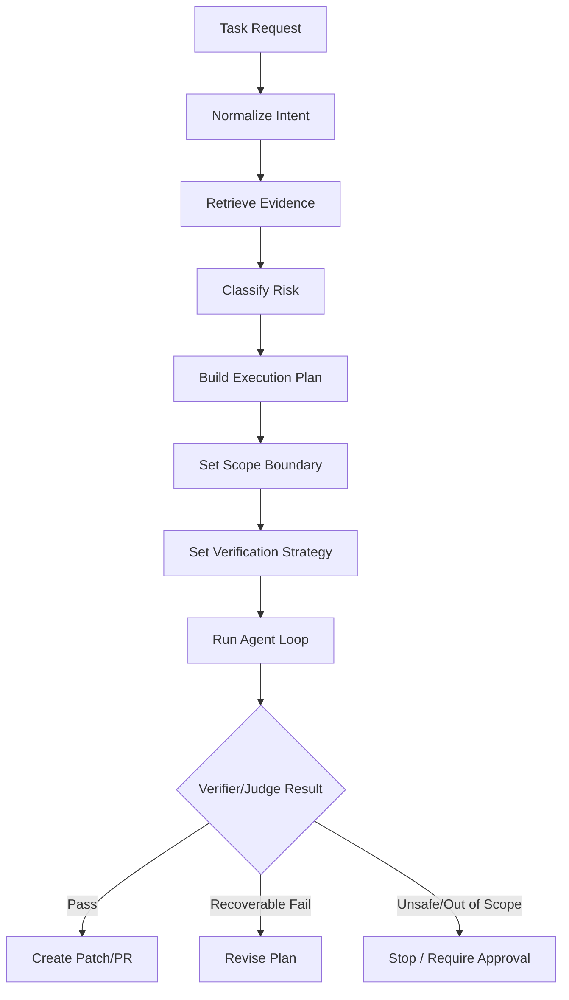
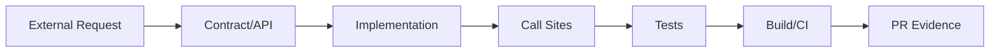
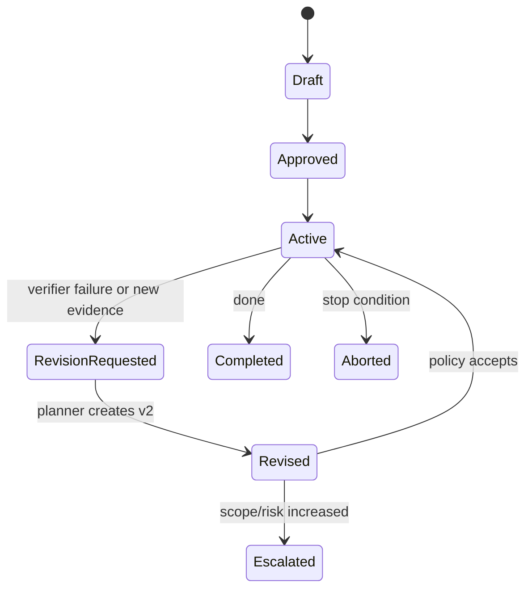
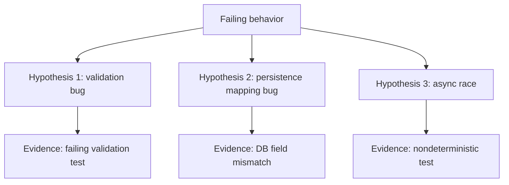

------
title: Learn AI Coding Agent From Scratch - Part 031
description: Build the planning layer for a Honk-like AI coding agent: task decomposition, milestones, constraints, stop conditions, retry strategy, and execution control.
series: learn-ai-coding-agent
seriesTitle: Learn AI Coding Agent From Scratch
order: 31
partTitle: Planning Layer: Task Decomposition
tags:
- ai-coding-agent
- planning
- task-decomposition
- agentic-loop
- orchestration
- verifier-driven-development
- software-engineering
date: 2026-07-03
---

# Part 031 — Planning Layer: Task Decomposition, Todo, Milestone, Stop Condition, Retry Strategy

> Target part ini: kita membangun **planning layer** untuk AI coding agent. Agent tidak boleh langsung mengedit kode setelah menerima task. Ia harus mengubah natural language request menjadi rencana kerja yang bisa diaudit, dieksekusi bertahap, diverifikasi, direvisi, dan dihentikan dengan alasan yang jelas.

Pada part sebelumnya kita membangun search/index layer.

Sekarang kita masuk ke pertanyaan yang lebih sulit:

> “Setelah agent menemukan kode yang relevan, bagaimana ia memutuskan urutan kerja yang benar?”

Planning layer adalah bagian yang mengubah agent dari “LLM yang punya tools” menjadi **software change operator**.

---

## 1. Mental Model: Planner Bukan Generator Todo Biasa

Banyak implementasi agent gagal karena menganggap planning hanya berarti:

```text
Ask model: "Make a plan"
Execute plan step by step.
```

Itu terlalu lemah.

Untuk coding agent production-grade, planner harus menghasilkan **execution contract**.

Execution contract menjawab:

1. Apa tujuan perubahan?
2. File/area mana yang boleh disentuh?
3. File/area mana yang tidak boleh disentuh?
4. Apa bukti bahwa perubahan selesai?
5. Apa bukti bahwa perubahan salah?
6. Kapan agent harus berhenti?
7. Kapan agent boleh retry?
8. Kapan agent harus meminta approval?
9. Kapan agent harus downgrade dari autonomous ke supervised?
10. Bagaimana hasilnya ditinjau ulang?

Jadi planner bukan hanya “membagi task”. Planner adalah **risk-aware control layer**.



---

## 2. Kenapa Planning Layer Penting untuk Honk-like Agent

Honk-like background agent bekerja tanpa developer terus-menerus duduk di sampingnya.

Itu berarti agent harus punya mekanisme internal untuk:

- membatasi perubahan;
- menjaga PR tetap reviewable;
- tidak mengejar solusi liar;
- tidak memperbaiki hal di luar scope;
- tidak “memenangkan verifier” dengan menghapus test;
- tidak mengubah kontrak publik tanpa explicit approval;
- menghasilkan evidence yang cukup untuk reviewer.

Planning layer adalah tempat kita menanam prinsip:

> Agent boleh kreatif dalam mencari solusi, tetapi tidak boleh kreatif dalam melanggar batas.

---

## 3. Input Planner

Planner tidak boleh hanya menerima prompt user mentah.

Input planner harus sudah dinormalisasi oleh intake + repository ingestion + search layer.

Contoh struktur input:

```ts
export type PlannerInput = {
  taskId: string;
  taskKind:
    | "dependency_upgrade"
    | "api_migration"
    | "config_migration"
    | "test_fix"
    | "bug_fix"
    | "mechanical_refactor"
    | "analysis_only";

  userGoal: string;
  normalizedGoal: string;

  repository: {
    provider: "github" | "gitlab" | "bitbucket" | "local";
    owner: string;
    name: string;
    baseRef: string;
    baseCommitSha: string;
    defaultBranch: string;
    languageHints: string[];
    buildSystemHints: string[];
  };

  scope: {
    includePaths: string[];
    excludePaths: string[];
    maxFilesChanged: number;
    maxLinesChanged: number;
    allowGeneratedFiles: boolean;
    allowLockfileChange: boolean;
    allowPublicApiChange: boolean;
  };

  evidence: EvidenceItem[];
  repositoryMapRef: string;
  symbolIndexRef?: string;
  policySnapshotRef: string;

  risk: {
    initialLevel: "low" | "medium" | "high" | "blocked";
    reasons: string[];
  };
};
```

Key idea:

> Planner tidak boleh berimprovisasi dari prompt kosong. Planner harus bekerja dari normalized task + evidence + policy.

---

## 4. Output Planner: Execution Plan

Output planner harus machine-readable.

Jangan hanya menyimpan Markdown plan.

Markdown plan bagus untuk manusia, tetapi runtime butuh object yang bisa dipakai scheduler, verifier, judge, dan audit layer.

```ts
export type ExecutionPlan = {
  planId: string;
  taskId: string;
  version: number;
  status: "draft" | "approved" | "active" | "superseded" | "aborted" | "completed";

  intent: {
    goal: string;
    nonGoals: string[];
    expectedOutcome: string;
  };

  scopeBoundary: {
    allowedPaths: string[];
    forbiddenPaths: string[];
    allowedOperations: AgentOperation[];
    forbiddenOperations: AgentOperation[];
  };

  milestones: Milestone[];
  verificationStrategy: VerificationStrategy;
  stopConditions: StopCondition[];
  retryPolicy: RetryPolicy;
  escalationPolicy: EscalationPolicy;
  reviewerNotes: string[];
};
```

Plan yang baik tidak hanya mengatakan “edit file A”.

Ia mengatakan:

- mengapa file A relevan;
- apa yang boleh diubah di file A;
- test apa yang harus dijalankan setelahnya;
- failure apa yang bisa direpair;
- failure apa yang harus menghentikan run.

---

## 5. Anatomy Milestone

Milestone adalah unit kerja yang lebih besar dari tool call tetapi lebih kecil dari task.

Contoh:

```ts
export type Milestone = {
  id: string;
  title: string;
  purpose: string;
  status: "pending" | "active" | "done" | "failed" | "skipped";

  preconditions: string[];
  actions: PlannedAction[];
  expectedArtifacts: string[];
  localVerification: string[];

  allowedFailureModes: string[];
  escalationTriggers: string[];
};
```

Contoh milestone untuk API migration:

```yaml
id: M2
judul: Replace deprecated API calls in service layer
purpose: Migrate call sites from LegacyUserClient#getUser to UserDirectoryClient#findUser
preconditions:
  - UserDirectoryClient exists and is injectable in the affected modules
  - LegacyUserClient#getUser call sites have been enumerated
allowed actions:
  - read files under src/main/java
  - edit files under src/main/java/com/acme/user
  - edit tests under src/test/java/com/acme/user
forbidden actions:
  - modify database migration
  - remove tests
  - change public REST response schema
local verification:
  - mvn -pl user-service test
  - mvn -pl user-service -DskipITs compile
escalation triggers:
  - migration requires changing public DTO
  - new API lacks equivalent behavior
  - more than 12 files need modification
```

Milestone memaksa agent menjelaskan **jalan semantik**, bukan hanya urutan command.

---

## 6. Planning Modes

Tidak semua task butuh planning yang sama.

Gunakan mode yang berbeda berdasarkan risiko.

| Mode | Cocok Untuk | Output | Approval |
|---|---|---|---|
| `tiny_patch` | typo, single config, small test fix | simple plan | usually no |
| `mechanical` | rename/import/API replacement deterministic | plan + file set | optional |
| `exploratory` | bug fix, failing test unknown cause | hypothesis tree | often yes |
| `migration` | broad API/dependency migration | staged plan | yes for medium/high |
| `fleet` | many repos | rollout plan | required |
| `analysis_only` | estimate/blast-radius | report | no write |

Jangan memakai satu agent behavior untuk semua task.

Task kecil akan lambat jika diperlakukan seperti migration besar.

Task besar akan berbahaya jika diperlakukan seperti patch kecil.

---

## 7. Decomposition Strategy

Decomposition yang baik mengikuti dependency, bukan mengikuti urutan prompt.

Pola decomposition:

```text
1. Understand task and constraints
2. Discover impacted code
3. Build minimal change hypothesis
4. Apply smallest safe patch
5. Verify locally
6. Repair failures within scope
7. Summarize diff and evidence
8. Stop or escalate
```

Untuk code change, decomposition sebaiknya mengikuti graph:



Banyak agent salah karena mulai dari implementation tanpa memahami contract.

Rule praktis:

> Jika perubahan menyentuh boundary publik, mulai dari contract. Jika perubahan internal, mulai dari call site dan tests.

---

## 8. Planning by Risk

Planner harus menambahkan kontrol berdasarkan risiko.

Contoh risk rules:

```ts
function classifyPlanningMode(input: PlannerInput): PlanningMode {
  if (input.risk.initialLevel === "blocked") return "analysis_only";

  if (input.taskKind === "dependency_upgrade") {
    if (input.scope.allowLockfileChange) return "migration";
    return "mechanical";
  }

  if (input.taskKind === "api_migration") {
    if (!input.scope.allowPublicApiChange) return "mechanical";
    return "migration";
  }

  if (input.taskKind === "bug_fix") return "exploratory";

  if (input.scope.maxFilesChanged <= 2) return "tiny_patch";

  return "exploratory";
}
```

Planning bukan hanya reasoning model.

Planning juga policy code.

Semakin banyak policy bisa dibuat deterministic, semakin sedikit risiko diserahkan ke LLM.

---

## 9. Stop Conditions

Stop condition adalah inti agent safety.

Agent yang tidak tahu kapan berhenti akan terus “memperbaiki” hingga membuat kerusakan baru.

Contoh stop condition:

```ts
export type StopCondition =
  | { kind: "verification_passed" }
  | { kind: "max_iterations_reached"; maxIterations: number }
  | { kind: "max_files_changed_exceeded"; maxFiles: number }
  | { kind: "forbidden_path_touched"; paths: string[] }
  | { kind: "public_api_change_detected" }
  | { kind: "secret_detected" }
  | { kind: "destructive_command_requested" }
  | { kind: "repeated_same_failure"; threshold: number }
  | { kind: "insufficient_evidence" }
  | { kind: "requires_human_decision"; reason: string };
```

Stop condition harus dievaluasi setelah:

- plan dibuat;
- setiap file mutation;
- setiap shell execution;
- setiap verifier run;
- sebelum commit;
- sebelum PR.

Stop condition bukan final gate saja. Ia adalah **continuous guard**.

---

## 10. Retry Strategy

Retry agent tidak sama dengan retry HTTP request.

Retry harus tahu failure class.

| Failure | Retry? | Strategy |
|---|---:|---|
| transient package download | yes | rerun verifier once with same patch |
| compile error from changed file | yes | feed summarized error to agent |
| unrelated failing test | limited | classify as pre-existing if reproducible on base |
| test removed to pass | no | fail policy |
| forbidden file touched | no | rollback/escalate |
| public API change needed | no autonomous | require approval |
| repeated same error | stop | avoid infinite loop |
| model produced invalid patch | yes | ask for minimal patch format |

Retry policy example:

```ts
export type RetryPolicy = {
  maxAgentIterations: number;
  maxVerifierRetries: number;
  maxSameFailureCount: number;
  allowPlanRevision: boolean;
  allowedRepairKinds: Array<
    | "compile_error"
    | "test_failure"
    | "format_failure"
    | "lint_failure"
    | "dependency_resolution_failure"
  >;
};
```

Rule penting:

> Retry boleh memperbaiki kegagalan yang disebabkan oleh patch agent. Retry tidak boleh memperluas scope hanya untuk membuat verifier hijau.

---

## 11. Plan Revision

Plan pertama sering salah.

Tetapi revisi plan harus eksplisit.

Jangan biarkan agent diam-diam berubah arah.



Setiap revisi plan harus mencatat:

- evidence baru;
- assumption lama yang salah;
- perubahan scope;
- risiko baru;
- verifier baru;
- apakah approval baru dibutuhkan.

Contoh:

```json
{
  "fromPlanVersion": 1,
  "toPlanVersion": 2,
  "reason": "Compile error shows migrated method returns Optional<User> instead of User",
  "newEvidence": ["artifact:compile-log-001"],
  "scopeChange": "No new path added; adjust call sites to handle Optional.empty",
  "approvalRequired": false
}
```

---

## 12. Hypothesis Tree untuk Exploratory Bug Fix

Bug fix sering tidak deterministic.

Planner harus membuat hypothesis tree.



Hypothesis item:

```ts
export type Hypothesis = {
  id: string;
  statement: string;
  confidence: "low" | "medium" | "high";
  evidenceFor: string[];
  evidenceAgainst: string[];
  cheapestExperiment: string;
  expectedSignal: string;
};
```

Agent harus menjalankan eksperimen murah dulu.

Urutan yang baik:

1. baca failing test/log;
2. temukan entrypoint;
3. cari recent change atau related symbol;
4. jalankan test paling kecil;
5. buat patch kecil;
6. jalankan test terkait;
7. baru jalankan broader verifier.

Jangan mulai dari full build jika satu test bisa memberi signal.

---

## 13. Planning untuk Migration

Migration berbeda dari bug fix.

Migration butuh repeatability.

Contoh API migration:

```text
Legacy:  LegacyUserClient#getUser(String id) -> User
New:     UserDirectoryClient#findUser(UserId id) -> Optional<User>
Goal:    Replace internal service-layer calls without changing REST response schema.
```

Plan yang bagus:

1. identify old API imports;
2. classify call sites by return handling;
3. update dependency injection;
4. replace call sites;
5. update tests;
6. run compile;
7. repair type errors;
8. run relevant tests;
9. create diff summary grouped by semantic category.

Plan yang buruk:

```text
Search and replace getUser with findUser.
```

Kenapa buruk?

Karena return type berubah. Semantik error handling berubah. Import berubah. Test fixture berubah. Null behavior berubah.

Migration planner harus mengekstrak **semantic delta**.

```yaml
semantic_delta:
  input_type:
    old: string
    new: UserId
  return_type:
    old: User
    new: Optional<User>
  error_behavior:
    old: throws UserNotFoundException
    new: Optional.empty
  dependency_injection:
    old: LegacyUserClient
    new: UserDirectoryClient
```

Tanpa semantic delta, agent akan membuat patch dangkal.

---

## 14. Todo List vs Plan

Todo list berguna untuk agent loop.

Tetapi todo list bukan plan.

| Todo | Plan |
|---|---|
| volatile | versioned |
| untuk agent saat ini | untuk audit dan control plane |
| bisa berubah cepat | perubahan harus dicatat |
| level tindakan | level intent + verification |
| tidak cukup untuk approval | bisa dipakai untuk approval |

Contoh todo runtime:

```json
[
  { "id": "T1", "text": "Inspect old API call sites", "status": "done" },
  { "id": "T2", "text": "Update UserService dependency", "status": "active" },
  { "id": "T3", "text": "Run user-service compile", "status": "pending" }
]
```

Todo boleh dibuat oleh agent.

Execution plan harus disetujui oleh planner/policy layer.

---

## 15. Plan Quality Rubric

Gunakan rubric untuk judge plan sebelum execution.

| Dimension | Pertanyaan |
|---|---|
| Goal clarity | Apakah outcome jelas dan testable? |
| Scope control | Apakah allowed/forbidden path jelas? |
| Evidence | Apakah plan merujuk evidence nyata? |
| Minimality | Apakah plan menghindari perubahan tidak perlu? |
| Verification | Apakah verifier relevan dan cukup murah? |
| Risk | Apakah risk/escalation trigger eksplisit? |
| Reviewability | Apakah PR nanti mudah direview? |
| Reversibility | Apakah patch bisa dibatalkan tanpa side effect? |

Plan tidak boleh dieksekusi jika:

- tidak menyebut stop condition;
- tidak punya verification strategy;
- tidak punya forbidden path;
- menyentuh public API tanpa approval;
- mengandalkan “model confidence” sebagai bukti utama;
- tidak bisa menjelaskan file target.

---

## 16. Implementation: Planner Service

Planner service bisa dibuat sebagai kombinasi deterministic rules dan LLM planning.

```ts
export class PlannerService {
  constructor(
    private readonly policy: PolicyService,
    private readonly repoMap: RepositoryMapService,
    private readonly search: CodeSearchService,
    private readonly llm: LlmClient,
    private readonly planJudge: PlanJudge,
  ) {}

  async createPlan(input: PlannerInput): Promise<ExecutionPlan> {
    const mode = classifyPlanningMode(input);
    const deterministicBoundary = await this.policy.buildScopeBoundary(input);
    const evidencePack = await this.collectPlanningEvidence(input, mode);

    const draft = await this.llmDraftPlan({
      input,
      mode,
      deterministicBoundary,
      evidencePack,
    });

    const normalized = normalizePlan(draft, deterministicBoundary);
    const verdict = await this.planJudge.judge(normalized, input);

    if (!verdict.accepted) {
      throw new PlanRejectedError(verdict.reasons);
    }

    return normalized;
  }
}
```

Important detail:

```text
LLM drafts the plan.
Policy owns the boundary.
Judge validates the plan.
Runtime executes only validated plan.
```

Jangan biarkan LLM menentukan batas keamanan sendirian.

---

## 17. Planner Prompt Contract

Planner prompt harus meminta output structured.

Contoh ringkas:

```text
You are creating an execution plan for an autonomous coding agent.

Goal:
{{normalized_goal}}

Repository evidence:
{{evidence_pack}}

Non-negotiable constraints:
{{policy_constraints}}

Return JSON matching ExecutionPlan.
Do not invent files.
Every milestone must reference evidence item ids.
Every write action must be within allowed paths.
Every milestone must include local verification or explain why none is possible.
Set escalationRequired=true if the change needs public API, schema, secret, or destructive operation.
```

Prompt ini bukan “please be careful”.

Prompt ini adalah contract.

Jika output tidak match schema, planner gagal.

---

## 18. Verification Strategy dari Planner

Planner harus memilih verifier berdasarkan task.

```ts
export type VerificationStrategy = {
  prePatchChecks: VerifierCommand[];
  postPatchChecks: VerifierCommand[];
  targetedChecks: VerifierCommand[];
  fullChecks: VerifierCommand[];
  passCriteria: string[];
  knownPreExistingFailures?: string[];
};
```

Contoh:

```yaml
verification_strategy:
  pre_patch_checks:
    - mvn -pl user-service -DskipTests compile
  targeted_checks:
    - mvn -pl user-service -Dtest=UserServiceTest test
  post_patch_checks:
    - mvn -pl user-service test
  full_checks:
    - mvn test
  pass_criteria:
    - compile succeeds
    - related tests pass
    - no test deleted
    - no public response schema changed
```

Pre-patch check penting untuk membedakan:

- failure karena repo sudah rusak;
- failure karena patch agent.

Tanpa baseline check, agent bisa disalahkan untuk failure yang sudah ada, atau sebaliknya agent bisa menyembunyikan failure baru sebagai “pre-existing”.

---

## 19. Evidence-Bound Planning

Planner harus evidence-bound.

Artinya setiap keputusan penting harus menunjuk evidence.

Contoh buruk:

```json
{
  "action": "Modify OrderService because it seems related"
}
```

Contoh baik:

```json
{
  "action": "Modify OrderService.submitOrder",
  "evidence": [
    "symbol-ref:OrderService.submitOrder",
    "search-hit:LegacyPricingClient usage in OrderService.java:42",
    "test-ref:OrderServiceTest.shouldApplyDiscount"
  ]
}
```

Evidence-bound planning mengurangi hallucination.

Juga membuat reviewer bisa memahami alasan patch.

---

## 20. Plan Storage

Plan harus disimpan append-only.

Schema sederhana:

```sql
create table agent_plan (
  id uuid primary key,
  task_id uuid not null,
  run_id uuid,
  version int not null,
  status text not null,
  planning_mode text not null,
  plan_json jsonb not null,
  created_by text not null,
  created_at timestamptz not null default now(),
  supersedes_plan_id uuid,
  unique(task_id, version)
);

create table agent_plan_event (
  id uuid primary key,
  plan_id uuid not null references agent_plan(id),
  event_type text not null,
  event_json jsonb not null,
  created_at timestamptz not null default now()
);
```

Kenapa append-only?

Karena kita butuh audit:

- plan awal apa;
- kapan plan berubah;
- evidence apa yang memicu revisi;
- siapa/apa yang menyetujui;
- apakah agent melewati batas.

---

## 21. Planner Failure Modes

| Failure Mode | Gejala | Guard |
|---|---|---|
| Over-planning | task kecil jadi lambat | planning mode tiny_patch |
| Under-planning | perubahan besar tanpa boundary | risk classification |
| Hallucinated file | plan menyebut file tidak ada | repository evidence validation |
| Scope creep | agent memperluas perubahan | forbidden path + max diff |
| Verification mismatch | verifier tidak membuktikan goal | plan judge |
| Infinite repair | agent mengulang error sama | repeated failure stop |
| Hidden public contract change | DTO/API berubah | contract scan |
| Test gaming | test dihapus/di-skip | deterministic policy check |

Planning layer bukan menjamin agent benar.

Planning layer membuat kesalahan agent **terlihat, terbatas, dan dapat dihentikan**.

---

## 22. Mini Case Study: Dependency Upgrade

Task:

```text
Upgrade jackson-databind from 2.14.x to 2.17.x in billing-service.
```

Plan skeleton:

```yaml
intent:
  goal: Upgrade jackson-databind in billing-service while preserving JSON serialization behavior.
  non_goals:
    - change API schema
    - refactor unrelated JSON code
    - upgrade unrelated dependencies
scope_boundary:
  allowed_paths:
    - billing-service/pom.xml
    - billing-service/src/test/**
    - billing-service/src/main/**
  forbidden_paths:
    - db/migration/**
    - api/openapi/**
    - infra/**
milestones:
  - inspect current dependency graph
  - update dependency version
  - run compile and JSON-related tests
  - repair serialization incompatibilities if any
verification:
  - mvn -pl billing-service dependency:tree
  - mvn -pl billing-service test
stop_conditions:
  - public API schema changed
  - more than 8 files modified
  - dependency convergence failure requires parent BOM change
```

Perhatikan bahwa plan tidak hanya “ubah version”.

Ia menyebut risiko utama: behavior JSON serialization.

---

## 23. Mini Case Study: Failing Test

Task:

```text
Fix failing test PaymentRetryPolicyTest.shouldStopAfterThreeAttempts.
```

Plan skeleton:

```yaml
mode: exploratory
hypotheses:
  - retry counter off-by-one
  - test fixture no longer matches retry config
  - async scheduler executes extra attempt
first_experiment:
  command: mvn -pl payment -Dtest=PaymentRetryPolicyTest#shouldStopAfterThreeAttempts test
expected_signal:
  - exact assertion failure
  - stack trace location
scope:
  allowed_paths:
    - payment/src/main/java/**
    - payment/src/test/java/**
  forbidden_actions:
    - delete test
    - relax assertion without code evidence
    - disable retry behavior
stop_conditions:
  - failure is flaky/timing dependent and needs design decision
  - fix requires changing public retry contract
```

Bug fix harus hypothesis-driven.

Kalau tidak, agent akan mengedit random kode sampai test lewat.

---

## 24. Checklist Planner Production-Grade

Sebelum lanjut ke part berikutnya, pastikan planning layer punya:

- [ ] normalized task input;
- [ ] planning mode;
- [ ] deterministic scope boundary;
- [ ] evidence pack;
- [ ] structured execution plan;
- [ ] milestone model;
- [ ] stop conditions;
- [ ] retry policy;
- [ ] escalation policy;
- [ ] verification strategy;
- [ ] plan judge;
- [ ] plan versioning;
- [ ] append-only audit;
- [ ] plan revision semantics;
- [ ] failure classification.

---

## 25. Ringkasan

Planning layer adalah salah satu pembeda utama antara demo agent dan production-grade coding agent.

Agent yang baik tidak hanya bisa mengedit kode.

Agent yang baik tahu:

- apa yang sedang dikerjakan;
- apa yang tidak sedang dikerjakan;
- bukti apa yang diperlukan;
- batas apa yang tidak boleh dilewati;
- kapan memperbaiki;
- kapan berhenti;
- kapan meminta manusia.

Pada part berikutnya kita akan membangun **context engineering for code changes**: bagaimana menyusun prompt, evidence, constraints, examples, repository instructions, dan testable goal agar planner/agent mendapat konteks yang tepat tanpa membanjiri context window.
