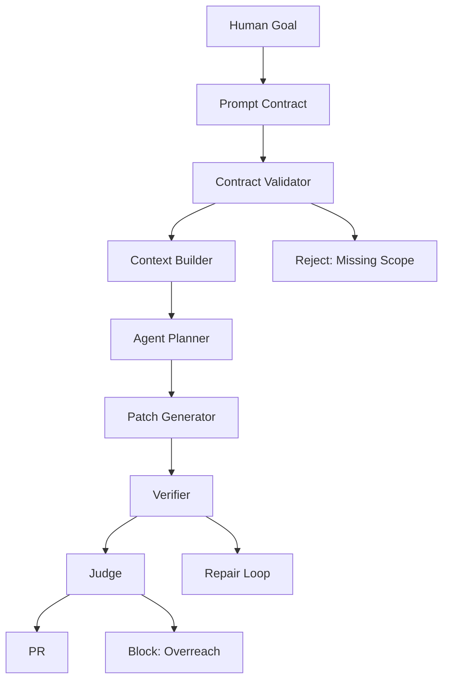
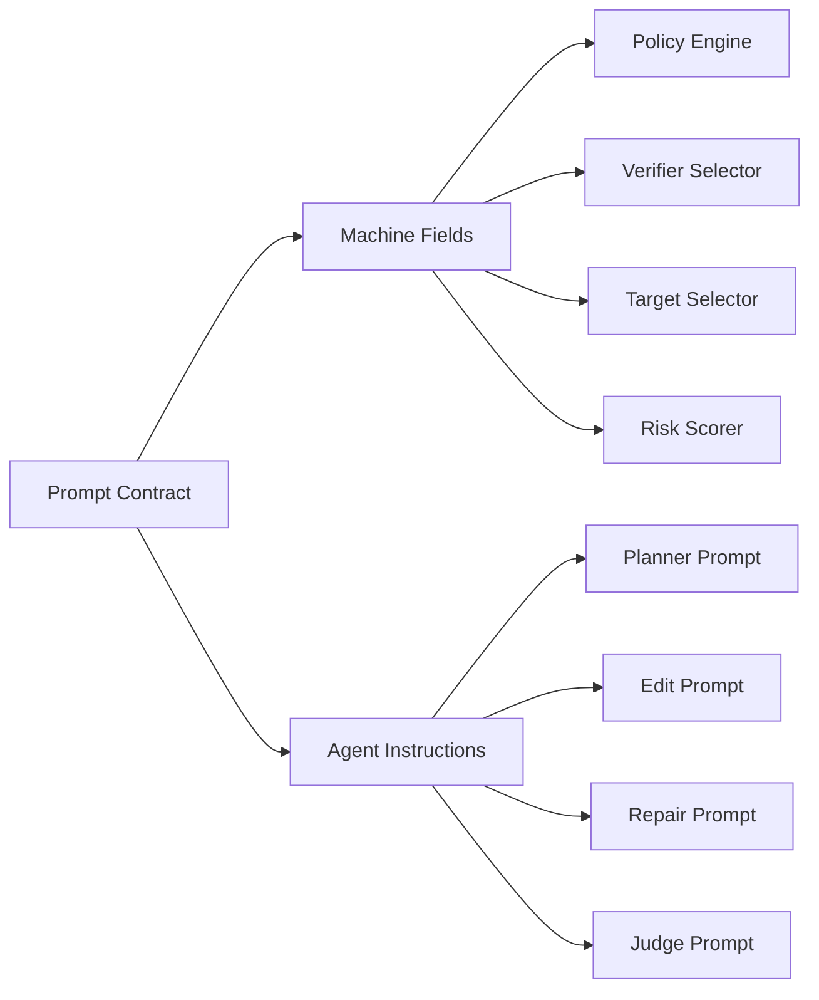
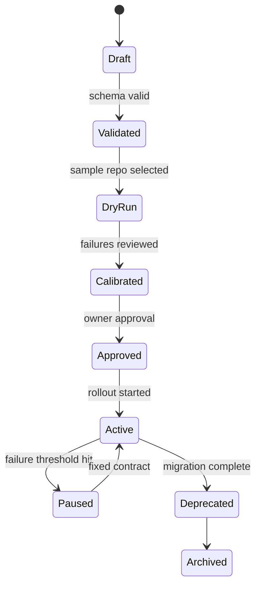
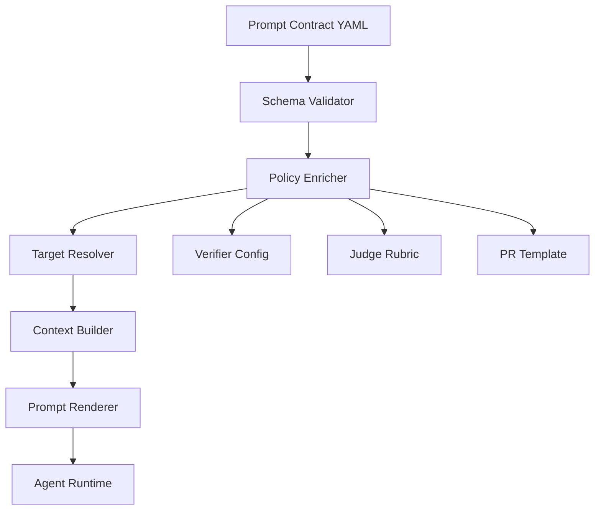
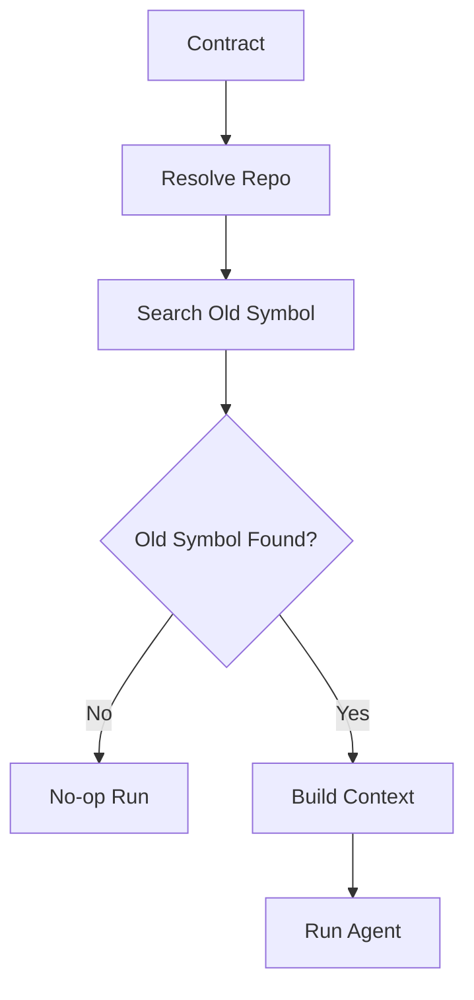
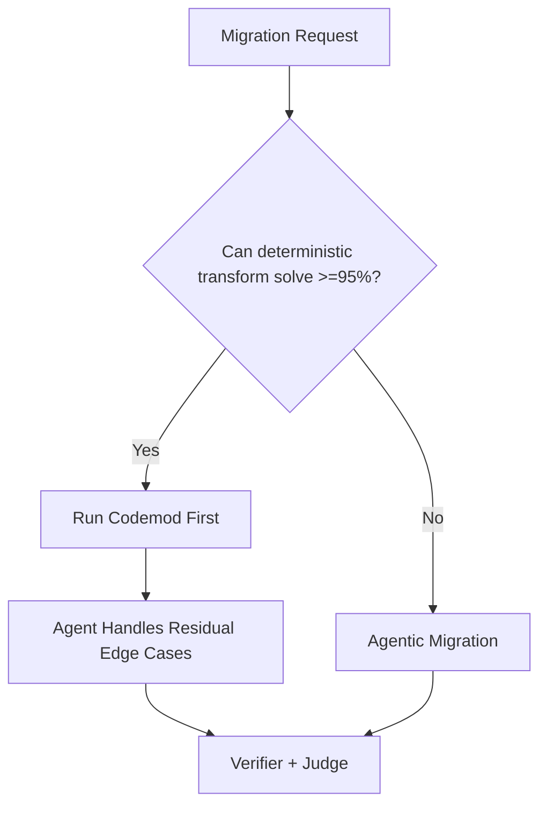

------
title: Learn AI Coding Agent From Scratch - Part 033
description: Learn how to design prompt contracts for repeatable code migrations: scope, constraints, examples, expected diffs, verifier commands, idempotency, and rollout safety.
series: learn-ai-coding-agent
seriesTitle: Learn AI Coding Agent From Scratch
order: 33
partTitle: Prompt Contracts for Repeatable Migrations
tags:
- ai-coding-agent
- prompt-contract
- code-migration
- context-engineering
- verifier-driven-development
- honk-like-agent
- software-maintenance
- automation
- mdx
- series
date: 2026-07-03
---

# Part 033 — Prompt Contracts untuk Repeatable Migrations: Input, Scope, Constraints, Expected Diff

> Target part ini: kita membangun **prompt contract** untuk migrasi kode berulang. Bukan prompt bebas. Bukan instruksi panjang yang kabur. Prompt contract adalah spesifikasi perubahan yang bisa divalidasi, diulang, diaudit, di-score, dan dipakai oleh agent untuk membuat PR lintas repo dengan risiko terkendali.

Part 032 membahas context engineering.

Sekarang kita masuk ke pertanyaan yang lebih tajam:

> “Bagaimana membuat prompt yang cukup ekspresif untuk agent, tetapi cukup ketat untuk dijadikan kontrak perubahan kode?”

Dalam sistem Honk-like, prompt bukan chat message.

Prompt adalah **change contract**.

Kalau prompt tidak bisa diuji, ia belum layak menjadi input background agent.

---

## 1. Mental Model: Prompt Bukan Permintaan, Prompt adalah Kontrak

Developer biasa menulis:

> “Please migrate all usages of old dataset API to the new one and fix tests.”

Untuk manusia, ini mungkin cukup.

Untuk background coding agent, ini terlalu longgar.

Masalahnya bukan karena model “bodoh”. Masalahnya karena instruksi tersebut tidak menjawab hal-hal yang menentukan safety:

- API lama yang mana?
- API baru yang mana?
- call site mana yang in-scope?
- file mana yang tidak boleh diubah?
- lockfile boleh berubah atau tidak?
- test apa yang wajib jalan?
- apakah agent boleh menambah dependency?
- apakah agent boleh mengubah behavior error handling?
- kalau verifier gagal, agent boleh retry berapa kali?
- kalau ada call site ambigu, stop atau tebak?

Prompt contract mengubah permintaan menjadi struktur seperti ini:



Rule utama:

> Prompt contract adalah boundary antara niat manusia dan eksekusi mesin.

Kalau boundary ini kabur, seluruh downstream system akan menebak.

Agent yang menebak di production repo adalah liability.

---

## 2. Apa Itu Repeatable Migration?

Repeatable migration adalah perubahan yang pola logikanya sama, tetapi targetnya banyak.

Contoh:

- mengganti API lama ke API baru di 500 service;
- mengubah format config lintas repo;
- upgrade dependency dengan breaking change kecil;
- mengganti deprecated annotation;
- menghapus library internal lama;
- migrasi endpoint client;
- migrasi schema name;
- memperbarui test helper;
- menyesuaikan CI workflow;
- mengubah import package akibat module split.

Yang membuatnya sulit:

1. repo berbeda punya variasi struktur;
2. build system berbeda;
3. test coverage tidak konsisten;
4. gaya kode berbeda;
5. API usage sering punya edge case lokal;
6. deterministic codemod tidak selalu cukup;
7. PR tetap harus kecil, reviewable, dan benar.

Di sinilah coding agent berguna.

Tetapi agent tidak boleh diberi misi global tanpa kontrak.

---

## 3. Prompt Ad-hoc vs Prompt Contract

| Dimensi | Prompt Ad-hoc | Prompt Contract |
|---|---|---|
| Bentuk | natural language bebas | structured specification + natural language section |
| Validasi | sulit | bisa divalidasi sebelum run |
| Scope | sering implisit | eksplisit |
| Repeatability | rendah | tinggi |
| Audit | lemah | kuat |
| Risk scoring | sulit | bisa dihitung |
| Verifier mapping | manual | built-in |
| Judge mapping | subjektif | berbasis acceptance criteria |
| Fleet rollout | berisiko | bisa dibatch dan distop |

Prompt ad-hoc cocok untuk eksperimen lokal.

Prompt contract cocok untuk background agent.

---

## 4. Contract Harus Memiliki Dua Lapisan

Prompt contract yang baik punya dua lapisan:

1. **Machine-readable layer**  
   Dipakai scheduler, policy engine, context builder, verifier, judge, dan dashboard.

2. **Agent-readable layer**  
   Dipakai model untuk memahami niat, reasoning constraint, contoh, dan exception.

Contoh mental model:



Jangan pilih salah satu.

Kalau hanya machine-readable, agent kehilangan nuance.

Kalau hanya natural language, platform kehilangan kontrol.

---

## 5. Minimum Viable Prompt Contract

Untuk versi awal, kita pakai field berikut:

```yaml
id: migrate-user-client-v1-to-v2
version: 1
kind: code_migration
risk_class: supervised_pr

objective: >
  Replace usages of LegacyUserClient.fetch(String userId) with
  UserClient.getById(UserId.of(userId)) while preserving observable behavior.

scope:
  include:
    languages: [java]
    paths:
      - "src/main/java/**/*.java"
      - "src/test/java/**/*.java"
  exclude:
    paths:
      - "**/generated/**"
      - "**/target/**"
      - "**/build/**"
      - "**/*.pb.java"

migration_rule:
  from:
    symbol: "com.acme.legacy.LegacyUserClient.fetch"
    signature: "User fetch(String userId)"
  to:
    symbol: "com.acme.user.UserClient.getById"
    signature: "User getById(UserId userId)"
  transform:
    - "Wrap String userId using UserId.of(userId)."
    - "Preserve null-handling behavior; do not introduce silent default values."
    - "Preserve exception propagation unless existing code catches and translates exceptions."

constraints:
  allowed_changes:
    - "Java source files containing direct old API usage."
    - "Tests that directly assert old API behavior and need update."
  forbidden_changes:
    - "Do not change public REST API contracts."
    - "Do not change database schema."
    - "Do not add new runtime dependencies."
    - "Do not reformat unrelated files."
    - "Do not update lockfiles unless dependency metadata actually changes."

verification:
  commands:
    - "mvn -q -DskipITs test"
  required_evidence:
    - "git diff only contains in-scope files"
    - "old symbol no longer appears in changed production code"
    - "tests pass"

acceptance_criteria:
  - "All direct calls to LegacyUserClient.fetch in included paths are migrated."
  - "No unrelated refactor is introduced."
  - "Behavioral error handling remains equivalent."
  - "PR body explains changed files and verifier result."

ambiguous_case_policy: ask_or_block
max_agent_attempts: 3
```

Ini belum sempurna.

Tetapi ini sudah jauh lebih baik daripada prompt bebas.

---

## 6. Contract Field by Field

### 6.1 `id`

`id` adalah stable identifier untuk migration template.

Gunakan format yang bisa dibaca:

```yaml
id: migrate-dataset-api-v2-to-v3
```

Jangan gunakan ID random sebagai primary label manusia.

Random ID boleh ada sebagai internal UUID, tetapi operator membutuhkan nama yang bermakna.

---

### 6.2 `version`

Migration prompt harus versioned.

Alasannya sederhana:

- prompt v1 mungkin terlalu longgar;
- v2 mungkin menambah forbidden paths;
- v3 mungkin mengubah verifier command;
- hasil run lama harus bisa direplay dengan contract lama.

Rule:

> Setiap perubahan semantik pada contract harus menaikkan version.

---

### 6.3 `kind`

`kind` membantu policy dan verifier memilih pipeline.

Contoh:

```yaml
kind: code_migration
```

Nilai umum:

- `dependency_upgrade`
- `api_migration`
- `config_migration`
- `schema_migration`
- `test_repair`
- `mechanical_refactor`
- `bug_fix`
- `documentation_update`

Jangan semua task diperlakukan sama.

Migrate API dan update docs punya risk profile berbeda.

---

### 6.4 `risk_class`

Risk class menentukan apakah agent boleh membuat PR otomatis, butuh approval, atau hanya analysis.

Contoh:

```yaml
risk_class: supervised_pr
```

Nilai yang disarankan:

| Risk Class | Makna |
|---|---|
| `analysis_only` | agent hanya menganalisis, tidak edit |
| `draft_patch` | agent edit lokal, tidak PR |
| `supervised_pr` | agent boleh buka PR setelah verifier lulus |
| `autonomous_pr` | agent boleh buka PR tanpa approval manual per run |
| `blocked` | platform menolak eksekusi |

Untuk tahap awal, gunakan `supervised_pr`.

---

### 6.5 `objective`

`objective` menjelaskan outcome.

Ia harus pendek, spesifik, dan testable.

Buruk:

```yaml
objective: Make the code better and migrate old API.
```

Lebih baik:

```yaml
objective: >
  Replace direct usages of LegacyUserClient.fetch(String) with
  UserClient.getById(UserId) without changing externally observable behavior.
```

Objective harus menjawab:

- apa yang berubah;
- dari apa ke apa;
- apa yang harus tetap sama.

---

### 6.6 `scope`

Scope adalah pagar.

Tanpa scope, agent bisa melakukan “sekalian beresin”.

Untuk manusia, niat itu terlihat helpful.

Untuk platform, itu overreach.

Contoh:

```yaml
scope:
  include:
    languages: [java]
    paths:
      - "src/main/java/**/*.java"
      - "src/test/java/**/*.java"
  exclude:
    paths:
      - "**/generated/**"
      - "**/target/**"
```

Scope harus divalidasi oleh file tool dan judge.

Agent tidak cukup hanya “diingatkan”.

---

### 6.7 `migration_rule`

Ini inti kontrak.

Migration rule harus menjelaskan mapping lama-ke-baru dan aturan transformasi.

```yaml
migration_rule:
  from:
    symbol: "com.acme.legacy.LegacyUserClient.fetch"
    signature: "User fetch(String userId)"
  to:
    symbol: "com.acme.user.UserClient.getById"
    signature: "User getById(UserId userId)"
  transform:
    - "Wrap String userId using UserId.of(userId)."
```

Untuk migrasi yang kompleks, tambahkan:

- import rule;
- exception rule;
- nullability rule;
- async/sync rule;
- transactional boundary rule;
- logging rule;
- test adaptation rule;
- rollback rule.

---

### 6.8 `constraints`

Constraint adalah hal yang tidak boleh dikorbankan.

Ini berbeda dari acceptance criteria.

Acceptance criteria mendefinisikan sukses.

Constraint mendefinisikan boundary.

```yaml
constraints:
  forbidden_changes:
    - "Do not change public REST API contracts."
    - "Do not modify database migrations."
```

Constraint harus dipakai oleh:

- context builder;
- file tool;
- git diff checker;
- judge;
- PR body generator.

---

### 6.9 `verification`

Verifier bukan afterthought.

Verifier adalah bagian dari contract.

```yaml
verification:
  commands:
    - "mvn -q -DskipITs test"
  required_evidence:
    - "tests pass"
    - "no old symbol remains in production code"
```

Jangan biarkan agent memilih sendiri semua verifier.

Agent boleh menyarankan verifier tambahan, tetapi contract harus menentukan minimum.

---

### 6.10 `acceptance_criteria`

Acceptance criteria dipakai oleh judge.

Ia harus bisa diperiksa dari evidence.

Buruk:

```yaml
acceptance_criteria:
  - "Code should be clean."
```

Lebih baik:

```yaml
acceptance_criteria:
  - "No direct invocation of LegacyUserClient.fetch remains in included production paths."
  - "No file outside allowed scope is modified."
  - "Verifier commands complete successfully."
```

---

### 6.11 `ambiguous_case_policy`

Ini salah satu field paling penting.

Jika agent menemukan situasi ambigu, apa yang harus dilakukan?

Pilihan:

| Policy | Perilaku |
|---|---|
| `ask_or_block` | stop dan butuh human clarification |
| `skip_with_note` | jangan ubah call site ambigu, catat di PR |
| `best_effort` | coba selesaikan dengan reasoning |
| `fail_run` | gagal total bila ada ambiguity |

Untuk production migration, default yang aman:

```yaml
ambiguous_case_policy: ask_or_block
```

---

## 7. Contract Lifecycle

Prompt contract punya lifecycle.



Jangan langsung menjalankan prompt baru ke ribuan repo.

Lakukan:

1. draft;
2. schema validation;
3. dry run di repo kecil;
4. review diff;
5. adjust prompt;
6. limited rollout;
7. observe failure rate;
8. expand batch;
9. freeze setelah selesai.

---

## 8. Contract Compiler

Prompt contract tidak langsung dikirim ke model.

Ia dikompilasi menjadi beberapa artifact:

- normalized contract;
- policy decision;
- target repo list;
- context manifest;
- planning prompt;
- edit prompt;
- repair prompt;
- judge prompt;
- verifier config;
- PR template.



Compiler membuat kontrak menjadi operational.

Tanpa compiler, prompt contract hanya dokumen.

---

## 9. JSON Schema untuk Prompt Contract

Kita bisa mulai dengan schema sederhana:

```json
{
  "$schema": "https://json-schema.org/draft/2020-12/schema",
  "title": "PromptContract",
  "type": "object",
  "required": ["id", "version", "kind", "objective", "scope", "constraints", "verification", "acceptance_criteria"],
  "properties": {
    "id": {
      "type": "string",
      "pattern": "^[a-z0-9][a-z0-9-]{2,100}$"
    },
    "version": {
      "type": "integer",
      "minimum": 1
    },
    "kind": {
      "type": "string",
      "enum": [
        "dependency_upgrade",
        "api_migration",
        "config_migration",
        "schema_migration",
        "test_repair",
        "mechanical_refactor",
        "bug_fix",
        "documentation_update"
      ]
    },
    "risk_class": {
      "type": "string",
      "enum": ["analysis_only", "draft_patch", "supervised_pr", "autonomous_pr", "blocked"]
    },
    "objective": {
      "type": "string",
      "minLength": 20
    },
    "scope": {
      "type": "object"
    },
    "constraints": {
      "type": "object"
    },
    "verification": {
      "type": "object"
    },
    "acceptance_criteria": {
      "type": "array",
      "items": { "type": "string" },
      "minItems": 1
    },
    "ambiguous_case_policy": {
      "type": "string",
      "enum": ["ask_or_block", "skip_with_note", "best_effort", "fail_run"]
    }
  }
}
```

Schema ini tidak menangkap semua semantik.

Tetapi ia menangkap bentuk dasar.

Semantik tambahan dicek oleh policy validator.

---

## 10. Prompt Contract sebagai Domain Object

Di platform kita, prompt contract bukan file YAML saja.

Ia domain object.

```java
public record PromptContract(
    ContractId id,
    int version,
    ContractKind kind,
    RiskClass riskClass,
    String objective,
    ScopeSpec scope,
    MigrationRule migrationRule,
    ConstraintSpec constraints,
    VerificationSpec verification,
    List<String> acceptanceCriteria,
    AmbiguousCasePolicy ambiguousCasePolicy,
    int maxAgentAttempts
) {
    public ContractFingerprint fingerprint() {
        return ContractFingerprint.sha256(canonicalJson());
    }
}
```

Fingerprint penting untuk reproducibility.

Run harus menyimpan:

- contract ID;
- contract version;
- contract fingerprint;
- rendered prompt fingerprint;
- base commit SHA;
- model version;
- tool version;
- verifier version.

Tanpa ini, replay menjadi kabur.

---

## 11. Database Table

Minimal table:

```sql
create table prompt_contracts (
    id text not null,
    version int not null,
    kind text not null,
    risk_class text not null,
    title text not null,
    body_yaml text not null,
    canonical_json jsonb not null,
    fingerprint text not null,
    status text not null,
    created_by text not null,
    created_at timestamptz not null default now(),
    approved_by text,
    approved_at timestamptz,
    primary key (id, version)
);

create unique index ux_prompt_contract_fingerprint
on prompt_contracts(fingerprint);
```

Run table harus mereferensikan contract:

```sql
alter table agent_runs
add column prompt_contract_id text,
add column prompt_contract_version int,
add column prompt_contract_fingerprint text;
```

Ini memudahkan audit:

> “PR ini dibuat oleh contract versi berapa?”

---

## 12. From Contract to Planning Prompt

Contract tidak langsung dikirim apa adanya.

Planning prompt harus fokus pada rencana.

Contoh template:

```text
You are running a supervised code migration.

Contract:
- id: {{contract.id}}
- version: {{contract.version}}
- objective: {{contract.objective}}
- risk class: {{contract.risk_class}}

Scope:
{{scope_summary}}

Migration rule:
{{migration_rule_summary}}

Forbidden changes:
{{forbidden_changes}}

Repository evidence:
{{repo_map_summary}}
{{search_results}}

Plan requirements:
1. Identify files that likely require change.
2. Explain why each file is in scope.
3. Identify verifier commands to run.
4. Identify ambiguity. Do not guess if ambiguity violates policy.
5. Produce a bounded plan. Do not edit yet.
```

Planning prompt tidak boleh meminta edit.

Pisahkan planning dan editing.

Kenapa?

Karena plan bisa divalidasi sebelum mutation.

---

## 13. From Contract to Edit Prompt

Edit prompt harus lebih sempit.

```text
Apply the approved plan for this migration.

Allowed files:
{{allowed_files}}

Do:
{{migration_steps}}

Do not:
{{forbidden_changes}}

Patch rules:
- Minimize diff.
- Preserve behavior.
- Do not reformat unrelated code.
- Do not modify generated files.
- If you encounter ambiguity, stop and report it.

After editing:
- Show changed files.
- Explain each change.
- Do not claim verification success unless verifier output confirms it.
```

Edit prompt tidak perlu membawa seluruh repo map.

Ia perlu allowed files, relevant snippets, migration rule, dan constraints.

---

## 14. From Contract to Repair Prompt

Saat verifier gagal, agent butuh feedback.

Tetapi jangan lempar log mentah 20.000 baris.

Gunakan repair prompt:

```text
The previous patch failed verification.

Contract objective:
{{objective}}

Verifier command:
{{command}}

Failure summary:
{{failure_summary}}

Relevant error excerpts:
{{error_excerpts}}

Current diff summary:
{{diff_summary}}

Repair rules:
- Fix only errors caused by your patch.
- Do not broaden scope.
- Do not suppress tests.
- Do not delete assertions to make tests pass.
- If the failure reveals ambiguity, stop and report.
```

Repair prompt harus anti-cheat.

Agent tidak boleh “membuat test hijau” dengan menghapus test bermakna.

---

## 15. From Contract to Judge Prompt

Judge prompt menilai hasil.

```text
You are reviewing an AI-generated code migration.

Evaluate against the contract only.

Inputs:
- Contract objective
- Scope rules
- Forbidden changes
- Acceptance criteria
- Diff summary
- Full diff or selected diff chunks
- Verification report

Return:
- PASS if all acceptance criteria are satisfied.
- FAIL if any criterion is violated.
- NEEDS_HUMAN if evidence is insufficient or ambiguity remains.

Do not reward unrelated improvements.
Do not ignore scope violations even if tests pass.
```

Judge tidak boleh menjadi rubber stamp.

Judge harus lebih konservatif daripada edit agent.

---

## 16. Expected Diff: Konsep yang Sering Diabaikan

Prompt contract tidak harus tahu exact diff.

Tetapi harus tahu **shape** diff yang diharapkan.

Contoh expected diff:

```yaml
expected_diff:
  allowed_file_patterns:
    - "src/main/java/**/*.java"
    - "src/test/java/**/*.java"
  expected_operations:
    - "replace old API call"
    - "add import for UserId if needed"
    - "update mocks/tests referencing old method"
  suspicious_operations:
    - "delete test file"
    - "change public endpoint"
    - "add dependency"
    - "large unrelated formatting diff"
  max_changed_files_soft: 8
  max_changed_lines_soft: 300
```

Soft limit bukan hard block.

Kadang perubahan valid memang besar.

Tetapi soft limit memicu review ekstra.

---

## 17. Examples dan Counterexamples

Agent sering membaik jika diberi contoh.

Tetapi contoh harus singkat dan tepat.

### 17.1 Positive Example

```yaml
examples:
  positive:
    - before: |
        User user = legacyUserClient.fetch(userId);
      after: |
        User user = userClient.getById(UserId.of(userId));
```

### 17.2 Counterexample

```yaml
examples:
  negative:
    - before: |
        User user = legacyUserClient.fetch(userId);
      bad_after: |
        User user = userClient.getById(UserId.of(userId == null ? "unknown" : userId));
      reason: "Changes null behavior by substituting default value."
```

Counterexample sangat berguna untuk edge case.

Model perlu tahu bukan hanya “apa yang benar”, tetapi juga “apa yang terlihat benar namun salah”.

---

## 18. Idempotency

Prompt contract harus mendorong perubahan idempotent.

Artinya:

- kalau migration sudah diterapkan, agent tidak membuat perubahan baru;
- kalau run diulang pada base commit sama, diff semantik sama;
- kalau sebagian call site sudah migrated, agent hanya menyelesaikan sisanya;
- agent tidak menambah import duplikat;
- agent tidak mengubah formatting berulang-ulang.

Acceptance criteria:

```yaml
idempotency:
  expected_behavior:
    - "If no old API usage remains, no code changes should be made."
    - "Do not duplicate imports or helper methods."
    - "Do not rewrite already migrated call sites."
```

Idempotency penting untuk retry.

Background agent pasti mengalami retry.

Retry tanpa idempotency menghasilkan diff noise.

---

## 19. Deterministic Pre-Check Sebelum Agent

Sebelum agent dipanggil, jalankan deterministic pre-check.

Contoh:



Jika old symbol tidak ditemukan, tidak perlu memanggil LLM.

Ini menghemat cost dan mengurangi PR kosong.

Pre-check yang umum:

- search old symbol;
- check dependency version;
- check language/build system;
- check generated file ratio;
- check repo archived atau read-only;
- check CI status baseline;
- check conflicting open PR.

---

## 20. No-op adalah Outcome Valid

Agent platform yang baik harus mengakui no-op.

Contoh no-op:

- repo tidak memakai API lama;
- repo sudah migrated;
- repo tidak match target language;
- repo tidak bisa diverifikasi;
- repo punya manual exclusion;
- repo punya conflicting branch.

No-op harus tercatat:

```yaml
run_result:
  outcome: no_op
  reason: old_symbol_not_found
  evidence:
    - "ripgrep returned zero matches for LegacyUserClient.fetch"
```

No-op bukan failure.

No-op adalah informasi rollout.

---

## 21. Ambiguity Taxonomy

Tidak semua ambiguity sama.

| Ambiguity | Contoh | Default |
|---|---|---|
| Symbol ambiguity | dua class bernama sama | ask/block |
| Semantic ambiguity | API baru beda exception | ask/block |
| Test ambiguity | test gagal sebelum patch | mark baseline issue |
| Scope ambiguity | call site di generated file | skip/report |
| Ownership ambiguity | repo tidak punya owner | supervised only |
| Dependency ambiguity | perlu dependency baru | ask/block |

Contract harus menentukan default behavior.

Jangan biarkan agent mengarang kebijakan.

---

## 22. Contract-Level Risk Scoring

Sebelum dijalankan, contract diberi risk score.

Contoh faktor:

```text
risk_score =
  base(kind)
  + scope_width_score
  + dependency_change_score
  + public_api_touch_score
  + database_touch_score
  + test_absence_score
  + verifier_weakness_score
  + ambiguity_score
```

Mapping:

| Score | Action |
|---:|---|
| 0–20 | autonomous PR allowed |
| 21–50 | supervised PR |
| 51–75 | dry-run only first |
| 76–100 | architecture review required |

Risk scoring tidak menggantikan judgment manusia.

Ia mencegah task berbahaya masuk pipeline otomatis.

---

## 23. Rollout Contract

Untuk fleet migration, contract harus punya rollout policy.

```yaml
rollout:
  batch_size: 10
  max_parallel_runs: 3
  pause_on:
    verifier_failure_rate_gt: 0.35
    judge_failure_rate_gt: 0.15
    human_rejection_rate_gt: 0.20
  expand_when:
    min_successful_prs: 20
    verifier_failure_rate_lt: 0.10
```

Ini membuat migration berubah dari “run script besar” menjadi rollout terkendali.

---

## 24. Contract Output Schema untuk Agent

Agent harus mengeluarkan output structured.

Contoh setelah planning:

```json
{
  "plan_status": "ready",
  "target_files": [
    {
      "path": "src/main/java/com/acme/UserService.java",
      "reason": "contains direct LegacyUserClient.fetch usage"
    }
  ],
  "ambiguities": [],
  "expected_verifiers": ["mvn -q -DskipITs test"]
}
```

Setelah edit:

```json
{
  "edit_status": "patched",
  "changed_files": [
    "src/main/java/com/acme/UserService.java",
    "src/test/java/com/acme/UserServiceTest.java"
  ],
  "summary": "Migrated direct fetch usage and updated mock expectations.",
  "requires_verification": true
}
```

Structured output memudahkan orchestrator.

Jangan mengandalkan parsing narasi bebas.

---

## 25. Contract-Aware PR Body

PR body harus berasal dari contract dan evidence.

Template:

```markdown
## Summary
Migrated direct usages of `LegacyUserClient.fetch(String)` to `UserClient.getById(UserId)`.

## Contract
- Contract: `migrate-user-client-v1-to-v2`
- Version: `1`
- Risk class: `supervised_pr`

## Changed Files
- `src/main/java/com/acme/UserService.java` — migrated production call site
- `src/test/java/com/acme/UserServiceTest.java` — updated mock expectation

## Verification
- `mvn -q -DskipITs test` — passed

## Scope Guard
- No generated files changed
- No dependency files changed
- No public API contracts changed

## Notes
No ambiguous call sites were found.
```

PR body adalah artifact review.

Jangan isi dengan marketing text.

---

## 26. Prompt Contract Anti-Patterns

### 26.1 “Do Everything” Contract

Buruk:

```yaml
objective: Modernize this service.
```

Masalah:

- tidak testable;
- scope tidak jelas;
- PR akan besar;
- review sulit;
- judge tidak punya rubric.

---

### 26.2 Hidden Scope

Buruk:

```yaml
objective: Migrate API usage.
```

Tetapi di luar contract, operator berharap agent juga update docs, dashboards, tests, config, dan deploy script.

Jangan taruh requirement penting di luar contract.

---

### 26.3 Excessive Context

Buruk:

```yaml
background: |
  Berikut seluruh sejarah sistem, semua meeting note, seluruh desain lama, dan semua edge case masa lalu...
```

Prompt panjang tidak otomatis lebih baik.

Context harus relevan dan evidence-bound.

---

### 26.4 Vague Quality Terms

Buruk:

- “make it clean”;
- “follow best practices”;
- “improve architecture”;
- “make tests better”.

Ganti dengan:

- “do not change public method signatures”;
- “keep diff under in-scope call sites”;
- “add/update tests only when behavior assertion references old API”.

---

### 26.5 Letting Agent Choose Safety Policy

Buruk:

```yaml
ambiguous_case_policy: use_your_judgment
```

Agent boleh bernalar.

Tetapi safety policy harus milik platform.

---

## 27. Quality Rubric untuk Prompt Contract

Gunakan checklist ini sebelum contract approved.

| Check | Pertanyaan |
|---|---|
| Objective | Apakah outcome spesifik dan testable? |
| Scope | Apakah include/exclude jelas? |
| Boundary | Apakah forbidden changes eksplisit? |
| Migration rule | Apakah mapping lama-ke-baru jelas? |
| Examples | Apakah ada contoh dan counterexample untuk edge case? |
| Verifier | Apakah minimum verifier ditentukan? |
| Acceptance | Apakah judge bisa menilai dari evidence? |
| Ambiguity | Apakah policy ambigu jelas? |
| Idempotency | Apakah no-op dan rerun aman? |
| Rollout | Apakah batch dan pause condition ada? |
| Audit | Apakah version/fingerprint disimpan? |

Skor sederhana:

```text
A = safe for limited rollout
B = safe for dry run
C = needs contract refinement
D = not executable by background agent
```

---

## 28. Micro Case Study: API Migration

Task:

> Migrasi `legacyUserClient.fetch(userId)` ke `userClient.getById(UserId.of(userId))`.

### 28.1 Repository Evidence

Search result:

```text
src/main/java/com/acme/order/OrderService.java:42: legacyUserClient.fetch(userId)
src/test/java/com/acme/order/OrderServiceTest.java:88: when(legacyUserClient.fetch("u1"))
```

### 28.2 Agent Plan

```json
{
  "target_files": [
    {
      "path": "src/main/java/com/acme/order/OrderService.java",
      "reason": "production direct call site"
    },
    {
      "path": "src/test/java/com/acme/order/OrderServiceTest.java",
      "reason": "test mock for old call site"
    }
  ],
  "steps": [
    "replace production call",
    "add UserId import if missing",
    "update test mock to expect UserId.of equivalent or argument matcher",
    "run mvn test"
  ],
  "ambiguities": []
}
```

### 28.3 Expected Patch Shape

```diff
- User user = legacyUserClient.fetch(userId);
+ User user = userClient.getById(UserId.of(userId));
```

Test mock might need argument matcher:

```diff
- when(legacyUserClient.fetch("u1")).thenReturn(user);
+ when(userClient.getById(UserId.of("u1"))).thenReturn(user);
```

But only if `UserId` equality is value-based.

If not, ambiguity.

Contract should say:

```yaml
ambiguous_cases:
  - condition: "UserId equality semantics unknown in tests"
    action: "inspect UserId.equals/hashCode; if absent, use ArgumentCaptor or matcher; if still unclear, stop"
```

---

## 29. Micro Case Study: Config Migration

Task:

```yaml
old:
  user-service:
    timeoutMs: 2000
new:
  userService:
    timeout: 2s
```

Config migration contract:

```yaml
kind: config_migration
objective: >
  Rename user-service.timeoutMs to userService.timeout and convert integer milliseconds
  to duration string in seconds where exactly divisible by 1000.

migration_rule:
  transform:
    - "user-service.timeoutMs: 2000 becomes userService.timeout: 2s"
    - "If value is not divisible by 1000, preserve milliseconds using ms suffix."
    - "Remove old key only after new key is added."

constraints:
  forbidden_changes:
    - "Do not reorder unrelated config sections."
    - "Do not change environment-specific values."

verification:
  commands:
    - "./gradlew test"
    - "./gradlew validateConfig"
```

Config diff mudah terlihat kecil, tetapi bisa merusak runtime.

Verifier harus punya config validation.

---

## 30. Prompt Contract dan Deterministic Codemod

Jangan selalu pakai LLM untuk semua perubahan.

Decision rule:



Prompt contract bisa menyatakan strategy:

```yaml
strategy:
  mode: hybrid
  deterministic_prepass: true
  agent_residual_handling: true
```

Ini sangat penting untuk scale.

LLM mahal dan non-deterministic.

Codemod murah dan predictable.

Agent unggul pada long tail.

---

## 31. Contract Traceability

Setiap output harus bisa ditelusuri ke contract.

| Artifact | Trace Field |
|---|---|
| run | contract id/version/fingerprint |
| plan | rendered planning prompt hash |
| diff | base SHA + contract fingerprint |
| verifier report | verifier config hash |
| judge report | acceptance criteria hash |
| PR | contract summary + run link |

Traceability bukan birokrasi.

Ini cara debugging ketika ada PR salah.

---

## 32. Failure Drill

### Scenario

Agent mengubah file di luar scope karena menemukan helper lama yang “terlihat relevan”.

### Expected Defense

1. File tool menolak path kalau outside allowed scope.
2. Diff checker mendeteksi file outside scope.
3. Judge menandai scope violation.
4. PR orchestration block.
5. Run menghasilkan failure reason `scope_violation`.

### Lesson

Prompt instruction saja tidak cukup.

Contract harus ditegakkan oleh platform.

---

## 33. Production Checklist

Sebelum prompt contract boleh active:

- schema valid;
- objective testable;
- scope include/exclude jelas;
- old/new rule jelas;
- verifier minimum ada;
- acceptance criteria bisa dijudge;
- examples/counterexamples ada untuk edge case penting;
- ambiguity policy tidak kosong;
- no-op behavior jelas;
- rollout policy ada;
- owner dan approver ada;
- fingerprint disimpan;
- dry run sudah dilakukan;
- failure threshold diset;
- PR template tersedia.

---

## 34. Latihan Implementasi

Bangun modul berikut:

```text
agent-contract/
  src/main/java/.../PromptContract.java
  src/main/java/.../PromptContractParser.java
  src/main/java/.../PromptContractValidator.java
  src/main/java/.../PromptContractCompiler.java
  src/main/java/.../RenderedPrompt.java
  src/test/java/.../PromptContractValidatorTest.java
```

Minimal behavior:

1. load YAML contract;
2. validate required fields;
3. compute canonical fingerprint;
4. reject missing verifier;
5. reject empty forbidden changes untuk risk tinggi;
6. render planning prompt;
7. render edit prompt;
8. render judge prompt.

Test cases:

- valid API migration contract;
- missing scope rejected;
- missing acceptance criteria rejected;
- high risk contract without verifier rejected;
- same semantic contract produces same fingerprint;
- changed contract produces different fingerprint.

---

## 35. Ringkasan

Prompt contract adalah pusat kendali repeatable migration.

Ia mengikat:

- objective;
- scope;
- migration rule;
- constraints;
- examples;
- verifier;
- judge;
- rollout;
- audit.

Tanpa prompt contract, background agent hanya menjalankan niat manusia yang terlalu longgar.

Dengan prompt contract, agent menjadi bagian dari sistem perubahan kode yang bisa dikontrol.

Mental model yang harus dibawa:

> Prompt contract bukan cara membuat model patuh. Prompt contract adalah cara membuat seluruh platform tahu apa arti “perubahan yang benar”.

---

## 36. Referensi Faktual

- Spotify Engineering, **Background Coding Agents: Context Engineering (Honk, Part 2)** — membahas context engineering, migration prompt, dan tool design untuk background coding agents.
- Spotify Engineering, **Background Coding Agents: Predictable Results Through Strong Feedback Loops (Honk, Part 3)** — membahas verifier/feedback loop untuk membuat hasil agent lebih predictable.
- Spotify Engineering, **Background Coding Agents: Supercharging Downstream Dataset Migrations (Honk, Part 4)** — case study migrasi dataset skala besar dengan Honk, Backstage, dan Fleet Management.
- OpenAI Codex documentation, **Custom instructions with AGENTS.md** — menjelaskan repository/user instructions untuk mengarahkan coding agent.
- OpenAI Codex documentation, **Sandbox** dan **Agent approvals & security** — menjelaskan perbedaan sandbox boundary dan approval policy.
- Model Context Protocol specification 2025-06-18 — mendefinisikan resources, prompts, dan tools sebagai primitives integrasi LLM application.

---

## 37. Apa Berikutnya?

Part 034 akan membahas konflik instruksi:

- instruction dari platform;
- instruction dari organisasi;
- instruction dari repository;
- instruction dari user;
- instruction dari tool/MCP server;
- instruction yang muncul dari file tidak terpercaya.

Kita akan membuat **instruction hierarchy** agar agent tidak bingung ketika `AGENTS.md`, prompt user, policy security, dan repo docs saling bertentangan.
