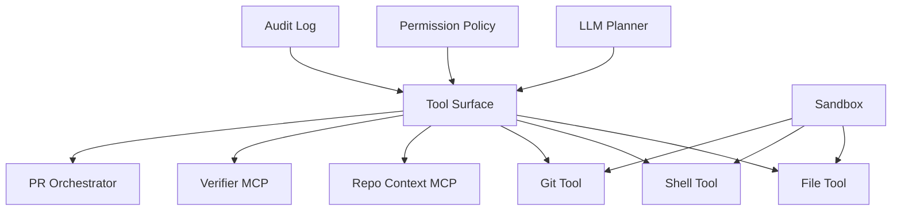
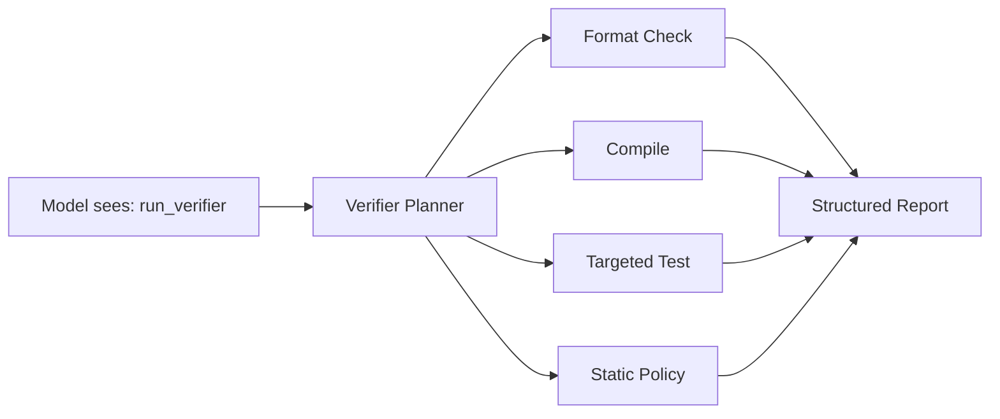
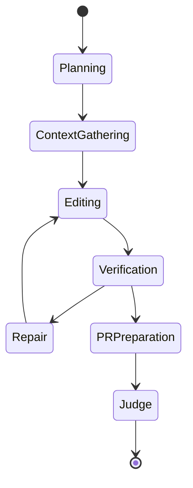
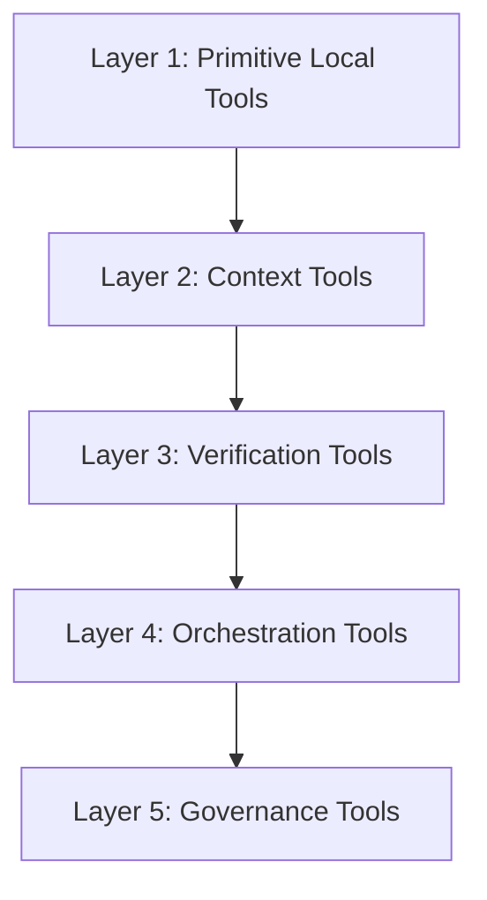
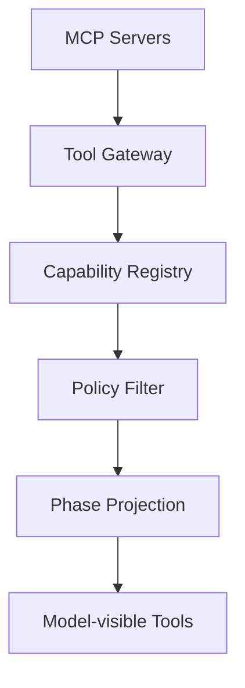

------
title: Learn AI Coding Agent From Scratch - Part 038
description: Understand the trade-off between tool minimalism and tool richness in AI coding agents: tool surface design, abstraction level, selection accuracy, cost, latency, safety, and governance.
series: learn-ai-coding-agent
seriesTitle: Learn AI Coding Agent From Scratch
order: 38
partTitle: Tool Minimalism vs Tool Richness
tags:
- ai-coding-agent
- tool-runtime
- mcp
- context-engineering
- safety
- agent-design
- architecture
- series
date: 2026-07-03
---

# Part 038 — Tool Minimalism vs Tool Richness: Mengurangi Unpredictability Tanpa Membatasi Kapabilitas

> Target part ini: memahami trade-off paling penting dalam desain agent runtime: **berapa banyak tool yang perlu diberikan kepada agent, pada level abstraksi apa, dan dengan permission apa**. Terlalu sedikit tool membuat agent lumpuh. Terlalu banyak tool membuat agent lambat, mahal, sulit diaudit, dan mudah salah memilih aksi.

Di Part 037 kita membangun repository context server.

Sekarang pertanyaannya:

> Apakah semua capability harus menjadi tool yang terlihat model?

Jawaban pendek: tidak.

Jawaban engineering: tool surface harus dirancang seperti public API untuk model. Ia perlu minimal, stabil, jelas, policy-aware, observable, dan tidak tumpang tindih.

Tool bukan sekadar fungsi.

Tool adalah interface antara model non-deterministic dan sistem deterministic.

Kalau interface ini buruk, model yang bagus pun terlihat bodoh.

---

## 1. Mental Model: Tool Surface sebagai Operating System untuk Agent

Agent runtime mirip OS kecil.

- model adalah planner/decision maker;
- tools adalah syscall;
- permission model adalah kernel policy;
- sandbox adalah process boundary;
- verifier adalah test harness;
- audit log adalah flight recorder.



Tool surface menentukan apa yang bisa dilakukan agent dan bagaimana ia memahami dunia.

Desain tool yang buruk menyebabkan:

- tool selection error;
- repeated failed calls;
- hallucinated arguments;
- over-broad mutation;
- excessive context usage;
- high token cost;
- unsafe command execution;
- audit log tidak berguna;
- verifier tidak cukup evidence;
- human reviewer tidak percaya.

---

## 2. Dua Ekstrem yang Sama-sama Buruk

### 2.1 Tool Minimalism yang Terlalu Miskin

Contoh:

```text
Tools:
- bash(command: string)
```

Ini terlihat sederhana. Tetapi sebenarnya terlalu berbahaya.

Semua hal menjadi raw shell:

- membaca file;
- mencari code;
- edit file;
- menjalankan test;
- git diff;
- parsing log;
- memanggil network;
- memanipulasi workspace.

Masalahnya:

- sulit membedakan read vs write;
- sulit memberi approval granular;
- sulit audit semantic action;
- raw command injection lebih mudah;
- model harus mengingat syntax semua command;
- output command panjang dan noisy;
- policy hanya bisa regex command, bukan intent.

Ini bukan minimalism yang baik. Ini menyerahkan terlalu banyak detail ke model.

### 2.2 Tool Richness yang Terlalu Ramai

Contoh:

```text
Tools:
- readJavaFile
- readYamlFile
- readJsonFile
- searchController
- searchService
- searchRepository
- findMavenTests
- findGradleTests
- runMavenTest
- runGradleTest
- runUnitTest
- runIntegrationTest
- createBranch
- switchBranch
- stageFile
- unstageFile
- commitFile
- openPullRequest
- updatePullRequest
- addReviewer
- addLabel
- parseCompileError
- parseTestError
- parseLintError
- summarizeDiff
- summarizeFile
- checkGeneratedFile
- checkSecret
- checkLicense
- ...
```

Ini terlihat lengkap. Tetapi terlalu ramai.

Masalahnya:

- model bingung memilih tool;
- banyak tool tumpang tindih;
- schema context membengkak;
- latency dan cost naik;
- tool descriptions saling konflik;
- permission surface besar;
- audit log granular tapi tidak bermakna;
- maintenance runtime berat.

Ini bukan richness yang baik. Ini tool soup.

---

## 3. Definisi Minimalism yang Benar

Minimalism bukan berarti tool sedikit secara absolut.

Minimalism berarti:

> Jumlah tool yang terlihat model cukup kecil, tetapi setiap tool merepresentasikan intent yang stabil, aman, dan berguna.

Tool minimal yang baik:

- punya nama jelas;
- punya input schema ketat;
- punya output terstruktur;
- punya permission class jelas;
- tidak tumpang tindih;
- tidak memaksa model melakukan parsing noise;
- tidak menyembunyikan risk boundary;
- menghasilkan evidence.

Contoh tool minimal yang baik untuk coding agent:

| Tool | Intent | Permission |
|---|---|---|
| `search_code` | cari evidence | read |
| `read_file` / `get_file_slice` | baca file/slice | read |
| `apply_patch` | mutasi file dengan diff | write |
| `run_verifier` | jalankan build/test/lint profile | execute-controlled |
| `git_diff` | lihat perubahan | read-git |
| `create_pr_draft` | serahkan artifact ke PR layer | remote-write-gated |

Enam tool ini lebih kuat daripada 40 wrapper kecil yang tidak jelas boundary-nya.

---

## 4. Richness yang Benar

Richness bukan berarti semua fungsi diekspos ke model.

Richness berarti:

> Tool sedikit, tetapi di baliknya ada sistem deterministic yang kaya.

Contoh:

- `run_verifier(profile: "targeted")` di belakang layar memilih Maven/Gradle/Node/Go command;
- `search_code(mode: "hybrid")` di belakang layar memakai lexical + symbol + semantic retrieval;
- `get_change_impact_context` di belakang layar menggabungkan call site, related tests, owners, risk map;
- `apply_patch` di belakang layar melakukan path guard, content hash check, dry-run, generated-file policy, audit.

Model tidak perlu melihat semua sub-step sebagai tool terpisah.



Tool surface minimal. Internal capability rich.

---

## 5. Dimensions of Tool Design

Setiap tool harus dinilai dari beberapa dimensi.

### 5.1 Abstraction Level

Tool bisa low-level atau high-level.

| Level | Contoh | Kelebihan | Risiko |
|---|---|---|---|
| Low-level | `read_file`, `apply_patch` | fleksibel, mudah dipahami | banyak langkah, agent harus orkestrasi |
| Mid-level | `search_code`, `run_verifier` | intent jelas, output kaya | perlu desain internal baik |
| High-level | `fix_bug`, `migrate_api` | mudah dipanggil | menyembunyikan reasoning, sulit audit |

Untuk Honk-like agent, default terbaik adalah **mid-level tools**.

High-level tool cocok bila workflow sudah sangat stabil dan deterministic.

### 5.2 Permission Class

Tool harus punya permission class:

- read-only;
- write-local;
- execute-controlled;
- network;
- remote-write;
- destructive;
- secret-access;
- admin.

Jangan punya tool dengan permission campuran kecuali benar-benar perlu.

Buruk:

```text
repo_tool(action: string, args: object)
```

Karena satu tool bisa read, write, delete, push, dan create PR.

Lebih baik:

```text
search_code(...)
apply_patch(...)
run_verifier(...)
create_pr_draft(...)
```

### 5.3 Determinism

Tool harus sebisa mungkin deterministic.

| Tool | Determinism |
|---|---:|
| `get_file_slice` | tinggi |
| `git_diff` | tinggi |
| `search_code` lexical | tinggi |
| `search_code` semantic | sedang |
| `summarize_error_with_llm` | rendah/sedang |
| `fix_bug` | rendah |

Tool non-deterministic boleh ada, tetapi harus diberi label dan tidak menjadi satu-satunya gate.

### 5.4 Output Shape

Output string bebas adalah musuh agent observability.

Buruk:

```text
Build failed. See logs.
```

Baik:

```json
{
  "status": "failed",
  "phase": "compile",
  "primaryError": {
    "file": "src/main/java/.../QuoteService.java",
    "line": 72,
    "message": "cannot find symbol: method getQuoteV2"
  },
  "summary": "Compilation failed because QuoteService calls a method not present on PricingGateway.",
  "rawLogArtifactId": "artifact_123"
}
```

### 5.5 Cost and Context Load

Setiap tool definition masuk ke konteks atau discovery mechanism. Banyak tool berarti:

- schema lebih banyak;
- description lebih panjang;
- model selection lebih sulit;
- prompt caching lebih kompleks;
- output lebih banyak;
- trace lebih noisy.

Tool surface harus hemat.

---

## 6. Tool Selection Accuracy

Model memilih tool berdasarkan:

- nama tool;
- description;
- schema;
- contoh penggunaan;
- conversation state;
- prior tool result;
- hidden model capability.

Tool selection error meningkat ketika:

- tool terlalu banyak;
- nama mirip;
- description overlap;
- input schema longgar;
- output tidak konsisten;
- satu tool bisa melakukan terlalu banyak hal;
- tool yang tepat tidak terlihat pada step itu.

Contoh overlap buruk:

```text
search_code
find_code
lookup_code
semantic_code_search
grep_repo
find_symbol
search_symbol
```

Agent bisa bingung kapan memakai yang mana.

Solusi:

- konsolidasi tool;
- gunakan mode enum;
- tulis decision rule di description;
- expose subset tool per phase;
- gunakan planner/router deterministic bila perlu.

---

## 7. Phase-specific Tool Projection

Tidak semua tool perlu terlihat setiap saat.

Agent run punya fase:

- intake;
- planning;
- context gathering;
- editing;
- verification;
- repair;
- PR preparation;
- review/judge.

Tool projection harus mengikuti fase.



| Phase | Tool yang terlihat |
|---|---|
| Planning | `get_task_context`, `get_repo_map`, `search_code` |
| ContextGathering | `search_code`, `get_file_slice`, `find_related_tests` |
| Editing | `read_file`, `apply_patch`, `diff_workspace` |
| Verification | `run_verifier`, `get_verification_report` |
| Repair | `get_file_slice`, `apply_patch`, `run_verifier` |
| PRPreparation | `git_diff`, `create_pr_draft` |
| Judge | `get_diff_summary`, `get_verification_report`, `get_task_context` |

Ini mengurangi tool confusion dan memperkuat policy.

---

## 8. Tool Namespace Design

Nama tool harus pendek, spesifik, dan intent-based.

### 8.1 Naming Rule

Gunakan format:

```text
verb_noun
```

Contoh:

- `search_code`
- `get_file_slice`
- `apply_patch`
- `run_verifier`
- `get_git_diff`
- `create_pr_draft`

Hindari:

- `do_repo_thing`
- `smart_fix`
- `execute`
- `agent_helper`
- `run_command_for_me`
- `super_tool`

### 8.2 Tool Description Rule

Description harus menjawab:

1. kapan digunakan;
2. kapan tidak digunakan;
3. efek samping;
4. permission class;
5. output utama.

Contoh:

```text
Use apply_patch to modify repository files by applying a unified diff to the local workspace. This tool performs path guard, generated-file policy, and content hash checks. It does not commit, push, or create a pull request.
```

Ini jauh lebih baik daripada:

```text
Apply a patch.
```

---

## 9. Tool Granularity: Split atau Merge?

Gunakan pertanyaan ini.

### 9.1 Split Tool Jika Permission Berbeda

Read dan write harus dipisah.

Buruk:

```text
file(action: "read" | "write" | "delete")
```

Baik:

```text
read_file
apply_patch
```

Delete file sebaiknya policy-gated atau bagian dari patch dengan explicit deletion.

### 9.2 Split Tool Jika Failure Semantics Berbeda

`search_code` dan `run_verifier` berbeda total. Split.

### 9.3 Merge Tool Jika Hanya Variasi Mode

`search_java`, `search_yaml`, `search_docs` bisa menjadi:

```text
search_code(query, mode, paths, includeDocs)
```

### 9.4 Merge Tool Jika Model Tidak Perlu Memilih Sub-step

`run_maven_compile`, `run_maven_test`, `run_gradle_test`, `run_node_test` bisa menjadi:

```text
run_verifier(profile: "targeted" | "full" | "format_only")
```

Verifier server yang memilih command berdasarkan repo map.

### 9.5 Split Tool Jika Audit Membutuhkan Semantic Event

`create_pr_draft` harus terpisah dari `git_commit`, karena remote side effect berbeda.

---

## 10. The Five Tool Layers

Untuk platform ini, kita pakai lima layer.



### Layer 1 — Primitive Local Tools

- `read_file`
- `apply_patch`
- `diff_workspace`

Dekat dengan filesystem. Harus deterministic.

### Layer 2 — Context Tools

- `search_code`
- `get_repo_map`
- `find_related_tests`
- `get_task_context`

Membantu agent memilih area kerja.

### Layer 3 — Verification Tools

- `run_verifier`
- `get_verification_report`

Membuktikan patch.

### Layer 4 — Orchestration Tools

- `create_pr_draft`
- `update_pr_body`
- `request_review`

Remote side effect. Harus gated.

### Layer 5 — Governance Tools

- `request_approval`
- `get_policy_decision`
- `record_risk_acceptance`

Biasanya tidak perlu langsung terlihat ke model kecuali agent memang harus meminta approval.

---

## 11. Tool Policy Matrix

Buat matrix sebelum implementasi.

| Tool | Read | Write local | Execute | Network | Remote write | Approval |
|---|---:|---:|---:|---:|---:|---|
| `search_code` | yes | no | no | no | no | no |
| `get_file_slice` | yes | no | no | no | no | no |
| `apply_patch` | yes | yes | no | no | no | maybe |
| `run_verifier` | yes | no | controlled | no/default | no | maybe |
| `run_shell_command` | yes | maybe | yes | maybe | no | often |
| `create_pr_draft` | yes | no | no | yes | yes | yes |
| `request_approval` | yes | no | no | yes | yes | no |

Matrix ini harus masuk ke code, bukan hanya dokumentasi.

---

## 12. Anti-pattern: The Universal Shell

Universal shell terasa powerful. Untuk local developer CLI, shell tool mungkin dapat diterima dengan approval. Untuk background fleet agent, universal shell harus sangat dibatasi.

Masalah universal shell:

- model bisa membuat command tidak terduga;
- command bisa membaca file sensitif;
- command bisa network egress;
- command bisa mutate workspace secara tidak tercatat;
- output sulit diparse;
- replay tidak semantik;
- approval fatigue meningkat.

Solusi:

- shell tetap ada untuk escape hatch;
- default tool untuk build/test adalah verifier;
- default tool untuk file mutation adalah patch tool;
- default tool untuk search adalah context server;
- shell command profile harus allowlisted.

---

## 13. Anti-pattern: The Mega Tool

Mega tool biasanya berbentuk:

```json
{
  "name": "repository_action",
  "input": {
    "action": "string",
    "args": "object"
  }
}
```

Ini buruk karena schema sebenarnya dipindah ke runtime text. Model tidak mendapat kontrak kuat. Policy juga sulit.

Lebih baik punya beberapa tool dengan schema ketat.

Mega tool hanya bisa diterima bila model tidak langsung memilih action; misalnya internal orchestrator deterministic yang memanggil sub-action berdasarkan state machine.

---

## 14. Anti-pattern: Tool Description sebagai Prompt Panjang

Kadang developer memasukkan semua instruksi agent ke description tool.

Masalah:

- context bengkak;
- instruction hierarchy kacau;
- description tool sulit diuji;
- model mengabaikan detail;
- perubahan policy tersebar.

Tool description harus pendek dan kontraktual. Instruksi workflow masuk prompt contract atau phase instruction.

---

## 15. Anti-pattern: Tool yang Mengembalikan Essay

Tool output yang terlalu naratif membuat agent sulit mengambil aksi.

Buruk:

```text
I looked around the repository and it seems like there are several relevant tests. You may want to consider running QuoteServiceTest because it appears relevant...
```

Baik:

```json
{
  "tests": [
    {
      "path": "pricing-core/src/test/java/.../QuoteServiceTest.java",
      "confidence": "high",
      "reasons": ["same-package", "imports-source-symbol"],
      "commandHint": "./mvnw -pl pricing-core -Dtest=QuoteServiceTest test"
    }
  ]
}
```

Agent boleh mendapat summary, tetapi summary harus mendampingi structured data.

---

## 16. Tool Output Budgeting

Tool output adalah context. Context mahal.

Setiap tool harus punya:

- max result;
- max line;
- max bytes;
- truncation flag;
- artifact id untuk raw output panjang;
- summary untuk model;
- raw log disimpan di artifact store.

Contoh verifier output:

```json
{
  "status": "failed",
  "summary": "Compilation failed in QuoteService.java at line 72.",
  "primaryErrors": [
    {
      "path": "pricing-core/src/main/java/.../QuoteService.java",
      "line": 72,
      "message": "cannot find symbol"
    }
  ],
  "rawLogArtifactId": "artifact_verifier_log_123",
  "truncated": true
}
```

Jangan mengirim 20.000 baris log ke model.

---

## 17. Tool Discovery vs Static Tool List

Ada dua pendekatan.

### 17.1 Static Tool List

Semua tool diberikan di awal.

Kelebihan:

- sederhana;
- predictable;
- mudah debug untuk MVP.

Kekurangan:

- context besar;
- tool yang tidak relevan tetap terlihat;
- sulit scaling ke banyak MCP server.

### 17.2 Dynamic Tool Projection

Tool yang terlihat disesuaikan fase dan policy.

Kelebihan:

- lebih hemat;
- lebih aman;
- selection lebih mudah.

Kekurangan:

- runtime lebih kompleks;
- perlu state machine yang jelas;
- perlu logging projection.

Untuk platform ini:

- MVP boleh static kecil;
- production harus dynamic projection.

---

## 18. MCP dan Tool Scaling

MCP membuat ekosistem tool lebih modular. Tetapi modularitas bisa memperburuk tool overload bila semua server dan semua tool langsung diekspos.

Prinsipnya:

> MCP server adalah supplier capability. Agent runtime tetap harus menjadi curator.

Jangan hubungkan 20 MCP server lalu memproyeksikan semua tool ke model.

Buat tool gateway:



Tool gateway menyaring berdasarkan:

- run phase;
- task type;
- repo language;
- permission;
- risk level;
- user approval;
- model capability;
- observed failure.

---

## 19. Tool Facade Pattern

Tool facade menyembunyikan banyak backend tool.

Contoh:

```text
run_verifier(profile="targeted")
```

Di belakang layar:

- baca repo map;
- pilih module;
- pilih build system;
- pilih command;
- jalankan sandbox command;
- parse log;
- simpan artifact;
- kembalikan structured result.

Model melihat satu tool. Runtime mengelola kompleksitas.

Facade cocok untuk workflow yang deterministic.

Jangan pakai facade untuk keputusan yang membutuhkan reasoning produk yang belum stabil.

---

## 20. Tool Router Pattern

Tool router adalah komponen deterministic/LLM-assisted yang memilih tool subset sebelum model utama bekerja.

Input:

- phase;
- task type;
- repo metadata;
- risk level;
- previous failures.

Output:

- visible tool list;
- tool budget;
- permission envelope.

Pseudo-code:

```ts
type ToolProjection = {
  tools: string[];
  permissions: PermissionEnvelope;
  reason: string;
};

function projectTools(ctx: RunContext): ToolProjection {
  if (ctx.phase === "planning") {
    return {
      tools: ["get_task_context", "get_repo_map", "search_code"],
      permissions: { read: true, write: false, execute: false },
      reason: "Planning phase should collect evidence only."
    };
  }

  if (ctx.phase === "editing") {
    return {
      tools: ["get_file_slice", "apply_patch", "diff_workspace"],
      permissions: { read: true, write: true, execute: false },
      reason: "Editing phase can modify local workspace but cannot execute commands."
    };
  }

  if (ctx.phase === "verification") {
    return {
      tools: ["run_verifier", "get_verification_report"],
      permissions: { read: true, write: false, execute: true },
      reason: "Verification phase runs controlled verifier only."
    };
  }

  throw new Error(`No tool projection for phase ${ctx.phase}`);
}
```

---

## 21. Designing Tool Schemas for Models

Schema bukan hanya validasi. Schema adalah affordance untuk model.

### 21.1 Use Enums for Intent

Baik:

```json
{
  "profile": {
    "type": "string",
    "enum": ["format_check", "compile", "targeted_test", "full"]
  }
}
```

Buruk:

```json
{
  "command": { "type": "string" }
}
```

### 21.2 Avoid Ambiguous Booleans

Buruk:

```json
{
  "safe": true,
  "deep": false,
  "fast": true
}
```

Lebih baik:

```json
{
  "scope": "targeted",
  "riskMode": "no_network_no_destructive"
}
```

### 21.3 Make Destructive Intent Explicit

Contoh patch deletion:

```json
{
  "patch": "...",
  "intent": "remove_deprecated_call_site",
  "allowFileDeletion": false
}
```

### 21.4 Add Idempotency and Preconditions

```json
{
  "path": "src/main/java/.../QuoteService.java",
  "expectedContentHash": "sha256:...",
  "patch": "..."
}
```

Ini mencegah patch diterapkan ke file yang sudah berubah.

---

## 22. Tool Result Semantics

Setiap tool result harus bisa masuk state machine.

Minimal status:

- `ok`;
- `failed_retryable`;
- `failed_non_retryable`;
- `blocked_policy`;
- `requires_approval`;
- `truncated`;
- `stale_context`.

Contoh:

```json
{
  "ok": false,
  "status": "blocked_policy",
  "reasonCode": "NETWORK_EGRESS_NOT_ALLOWED",
  "message": "The requested command would access the network, but this run has no network permission.",
  "approvalRequestHint": {
    "permission": "network_egress",
    "justificationRequired": true
  }
}
```

Jangan membuat semua failure menjadi exception string.

---

## 23. Tool Governance

Tool governance menjawab:

- siapa boleh memakai tool apa;
- kapan approval dibutuhkan;
- output apa yang boleh masuk model;
- side effect apa yang dicatat;
- tool mana deprecated;
- tool mana experimental;
- tool mana disabled untuk fleet run.

Tool registry harus punya metadata:

```yaml
tools:
  apply_patch:
    permissionClass: write-local
    sideEffects:
      - workspace-mutation
    approval:
      requiredWhen:
        - riskLevel >= high
        - touchesGeneratedFile == true
    maxCallsPerRun: 20
    enabledForFleet: true

  run_shell_command:
    permissionClass: execute
    sideEffects:
      - process-execution
    approval:
      requiredAlways: true
    enabledForFleet: false
```

---

## 24. Measuring Tool Surface Quality

Jangan menebak. Ukur.

Metrics:

- average tool calls per successful run;
- failed tool call ratio;
- policy-blocked call ratio;
- repeated same-tool loop count;
- average output tokens per tool;
- tool selection correction count;
- time to first patch;
- verifier pass rate after first patch;
- repair loop count;
- human review rejection reason;
- PR overreach rate.

Jika `search_code` dipanggil 30 kali per run, mungkin context server kurang baik.

Jika `run_shell_command` sering dipakai, mungkin verifier/context tools kurang expressive.

Jika `apply_patch` gagal karena stale hash, mungkin context freshness salah.

---

## 25. Evolution Strategy

Tool surface harus berevolusi perlahan.

### 25.1 Start Small

MVP:

- `get_task_context`
- `search_code`
- `get_file_slice`
- `apply_patch`
- `run_verifier`
- `get_git_diff`

### 25.2 Add Tool Only with Evidence

Tambahkan tool baru jika:

- ada failure pattern berulang;
- existing tool terlalu noisy;
- permission boundary butuh dipisah;
- workflow sudah cukup stabil;
- tool bisa diuji dan diaudit.

### 25.3 Deprecate Tool

Tool harus bisa deprecated.

Metadata:

```yaml
status: deprecated
replacement: run_verifier
sunsetDate: 2026-10-01
```

Jangan biarkan tool lama menjadi compatibility trap.

---

## 26. Case Study: API Migration Tool Surface

Task:

> Migrate all `LegacyPricingClient#getQuote` usages to `PricingGateway#quote` in one module.

Tool projection ideal:

### Planning

- `get_task_context`
- `get_repo_map`
- `search_code`

### Context Gathering

- `find_symbol`
- `search_code`
- `get_file_slice`
- `find_related_tests`

### Editing

- `apply_patch`
- `diff_workspace`

### Verification

- `run_verifier(profile="targeted")`
- `run_verifier(profile="compile")`

### PR

- `get_git_diff`
- `create_pr_draft`

Tool yang tidak perlu terlihat:

- raw shell;
- network browser;
- package install;
- delete file;
- admin policy;
- production deployment.

Ini mengurangi chance agent melakukan hal aneh.

---

## 27. Case Study: Dependency Upgrade Tool Surface

Dependency upgrade lebih berisiko karena package manager/network/lockfile terlibat.

Tool projection:

- `get_dependency_manifest`
- `get_dependency_policy`
- `apply_patch`
- `run_verifier`
- `get_git_diff`
- `create_pr_draft`

Network/package manager action harus gated.

Jangan beri raw `npm install`/`mvn versions:use-latest-releases` bebas kecuali sandbox dan policy jelas.

---

## 28. Case Study: Test Fix Tool Surface

Test fix sering butuh membaca failure log.

Tool projection:

- `get_verification_report`
- `get_file_slice`
- `find_related_tests`
- `apply_patch`
- `run_verifier`

Jangan beri PR creation sampai verifier pass atau human override.

---

## 29. Practical Design Heuristics

Gunakan heuristik ini:

1. **Tool yang bisa mengubah dunia harus sedikit.**
2. **Read tool boleh lebih banyak, tetapi tetap perlu output budget.**
3. **Shell adalah escape hatch, bukan primary API.**
4. **Verifier lebih baik daripada raw build command.**
5. **Context server lebih baik daripada agent grep manual terus-menerus.**
6. **Tool description harus pendek dan kontraktual.**
7. **Output harus structured dan artifact-aware.**
8. **Tool projection harus phase-specific.**
9. **Permission class harus explicit.**
10. **Tambahkan tool berdasarkan failure data, bukan rasa ingin lengkap.**

---

## 30. Production Checklist

Sebelum tool surface dianggap production-ready:

- [ ] setiap tool punya owner;
- [ ] setiap tool punya schema ketat;
- [ ] setiap tool punya permission class;
- [ ] setiap tool punya side effect declaration;
- [ ] setiap tool punya timeout;
- [ ] setiap tool punya output budget;
- [ ] setiap tool punya audit event;
- [ ] tool projection per phase tersedia;
- [ ] remote-write tool membutuhkan approval;
- [ ] destructive tool disabled by default;
- [ ] shell disabled untuk fleet run kecuali allowlisted;
- [ ] output raw panjang menjadi artifact;
- [ ] failed tool call ratio dimonitor;
- [ ] tool usage bisa direplay;
- [ ] deprecated tool bisa dihapus;
- [ ] security review dilakukan untuk MCP server baru.

---

## 31. Latihan

1. Ambil tool catalog dari Part 024 sampai Part 037.
2. Buat tool policy matrix untuk semuanya.
3. Tandai tool yang read-only, write-local, execute, network, remote-write, destructive.
4. Buat projection untuk phase planning/editing/verification/PR.
5. Hapus tool yang overlap.
6. Ubah 10 tool kecil menjadi 3 tool mid-level dengan mode enum.
7. Buat metric untuk mendeteksi tool confusion.
8. Jalankan simulasi task API migration dan catat tool sequence ideal.

---

## 32. Ringkasan Part 038

Tool minimalism dan tool richness bukan lawan mutlak.

Desain terbaik adalah:

> model-visible tool surface minimal, internal capability rich, permission explicit, output structured, phase projection strict.

Yang harus dihindari:

- universal shell sebagai primary interface;
- mega tool dengan action string;
- tool soup;
- description tool terlalu panjang;
- output essay;
- remote-write tanpa approval;
- semua MCP tool langsung diproyeksikan ke model.

Prinsip paling penting:

> Tool adalah public API untuk model. Public API yang buruk membuat sistem sulit dipercaya.

Di Part 039 kita akan masuk ke strategi patch generation: direct edit, unified diff, AST transform, dan hybrid agentic edit.

---

## Referensi

- Model Context Protocol Specification — https://modelcontextprotocol.io/specification/2025-06-18
- MCP Tools Specification — https://modelcontextprotocol.io/specification/2025-06-18/server/tools
- Anthropic Engineering, “Code execution with MCP: building more efficient AI agents” — https://www.anthropic.com/engineering/code-execution-with-mcp
- OpenAI Codex, “Sandboxing” — https://developers.openai.com/codex/concepts/sandboxing
- OpenAI Codex, “Agent approvals & security” — https://developers.openai.com/codex/agent-approvals-security
- Spotify Engineering, “Background Coding Agents: Context Engineering (Honk, Part 2)” — https://engineering.atspotify.com/2025/11/context-engineering-background-coding-agents-part-2
