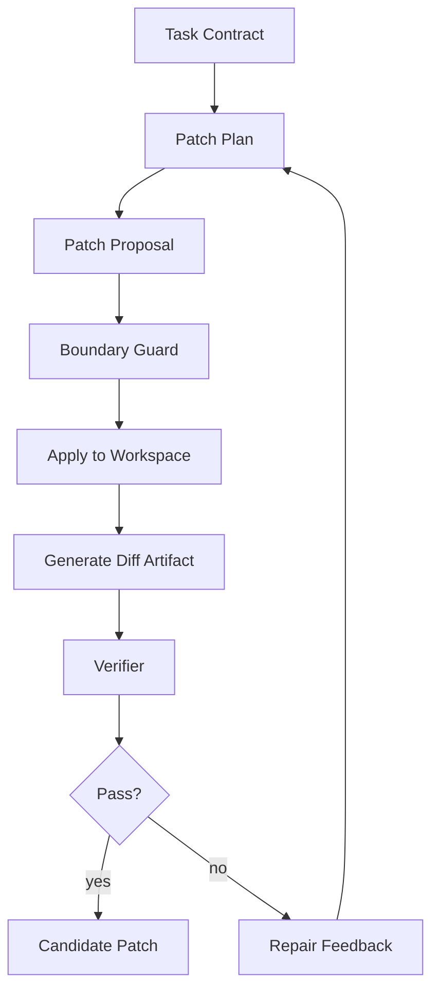
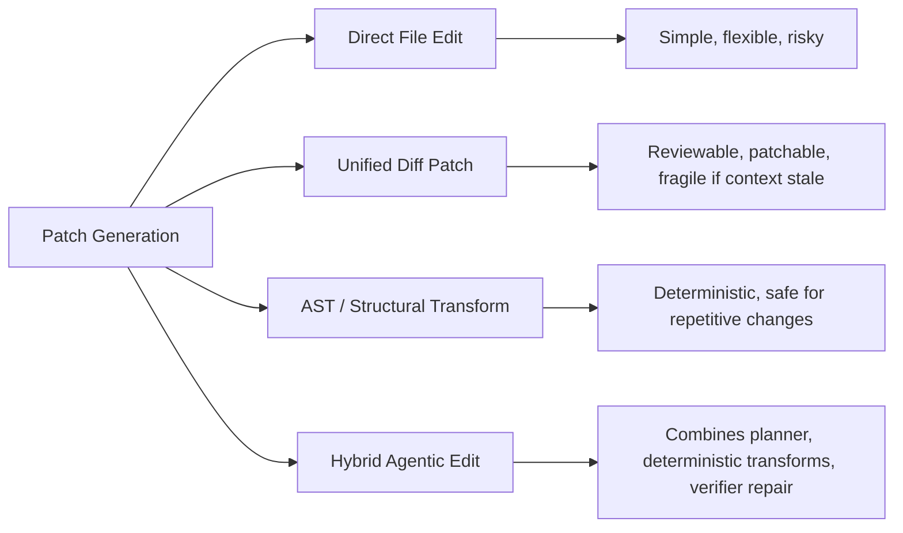
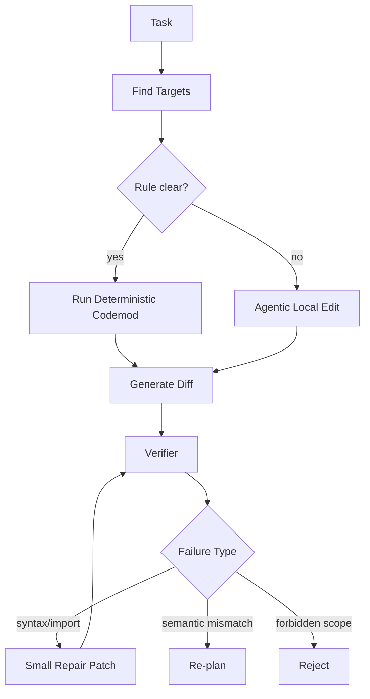
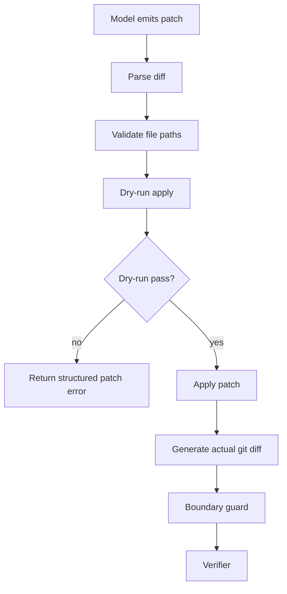
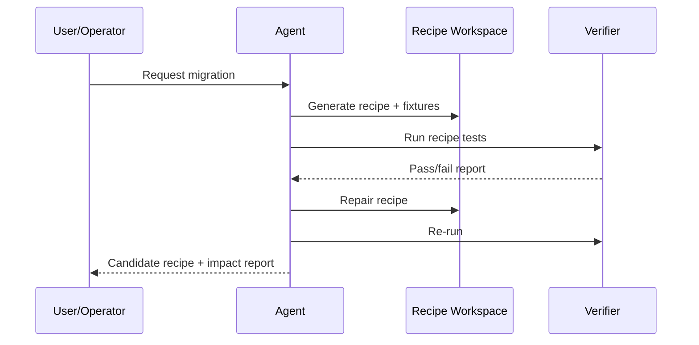
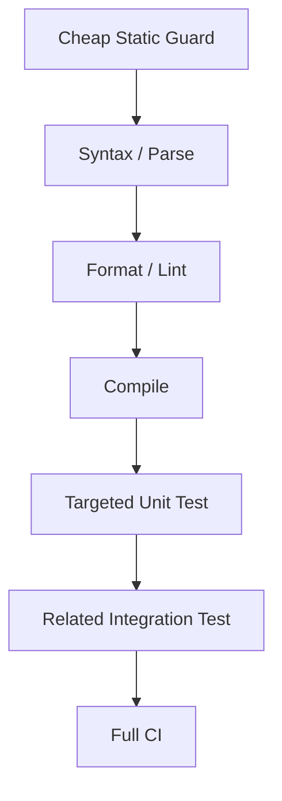

------
title: Learn AI Coding Agent From Scratch - Part 039
description: Learn patch generation strategies for AI coding agents: direct edit, unified diff, AST transform, deterministic codemod, and hybrid agentic edit with verifier-driven repair.
series: learn-ai-coding-agent
seriesTitle: Learn AI Coding Agent From Scratch
order: 39
partTitle: Patch Generation Strategies
tags:
- ai-coding-agent
- patch-generation
- code-modification
- diff
- ast
- codemod
- verifier
- agent-design
- series
date: 2026-07-03
---

# Part 039 — Patch Generation Strategies: Direct Edit, Unified Diff, AST Transform, Hybrid Agentic Edit

> Target part ini: kamu memahami cara agent menghasilkan perubahan kode secara aman, terukur, dan bisa diverifikasi. Kita tidak hanya bertanya “bagaimana model menulis kode?”, tetapi “bagaimana sistem mengubah repository dengan kontrol, bukti, dan rollback boundary yang jelas?”.

Di Part 038 kita membahas desain tool surface.

Sekarang kita masuk ke aksi paling penting:

> Bagaimana agent benar-benar mengubah kode?

Jawaban yang terlihat sederhana adalah: model menulis file.

Jawaban yang benar untuk sistem production-grade adalah: agent menghasilkan **change proposal** melalui salah satu strategi patch, lalu runtime melakukan validasi, apply, diffing, verification, dan judging.

Model tidak boleh menjadi satu-satunya otoritas mutasi.

Model boleh mengusulkan perubahan.

Runtime yang memutuskan apakah perubahan itu diterima ke workspace.

---

## 1. Mental Model: Patch sebagai Transaksi Perubahan Kode

Jangan pikirkan patch sebagai teks.

Pikirkan patch sebagai transaksi.

Sebuah patch punya:

- input state;
- intended change;
- touched files;
- mutation primitive;
- precondition;
- postcondition;
- verification evidence;
- rollback strategy;
- audit trail.



Dalam sistem Honk-like, patch bukan hasil akhir.

Patch adalah kandidat yang harus melewati:

1. **scope guard** — apakah file yang disentuh sesuai kontrak?
2. **syntax guard** — apakah file masih valid?
3. **semantic guard** — apakah compile/test/lint lewat?
4. **behavior guard** — apakah test relevan tetap hijau?
5. **review guard** — apakah diff dapat dipahami manusia?
6. **policy guard** — apakah tidak melanggar security, license, dependency, ownership?

Agent yang bagus bukan agent yang paling banyak mengubah kode.

Agent yang bagus adalah agent yang menghasilkan perubahan minimum yang cukup, bisa diverifikasi, dan mudah direview.

---

## 2. Empat Strategi Utama Patch Generation

Ada empat strategi besar.



### 2.1 Direct File Edit

Agent membaca file lalu menulis ulang file penuh atau sebagian.

Contoh:

```json
{
  "tool": "write_file",
  "arguments": {
    "path": "src/main/java/com/acme/Foo.java",
    "content": "...full rewritten content...",
    "expectedSha256": "abc123"
  }
}
```

Kelebihan:

- mudah diimplementasikan;
- cocok untuk file kecil;
- cocok untuk generated artifact kecil;
- cocok untuk dokumen, config kecil, test kecil;
- model bisa memperbaiki struktur secara bebas.

Kekurangan:

- rawan menghapus detail yang tidak dibaca model;
- rawan formatting drift;
- sulit membedakan perubahan yang disengaja vs collateral;
- mahal secara token untuk file besar;
- sulit review jika perubahan tersebar.

Gunakan direct edit jika:

- file kecil;
- perubahan lokal;
- file dibaca penuh;
- `expectedSha256` cocok;
- diff setelah write kecil;
- verifier murah.

Jangan gunakan direct edit untuk:

- file besar;
- file dengan banyak area unrelated;
- file yang sering berubah;
- generated file besar;
- lockfile;
- schema canonical;
- file binary;
- file yang berisi secret.

### 2.2 Unified Diff Patch

Agent menghasilkan patch dalam format unified diff.

Unified diff umum dipakai karena menyertakan konteks sebelum/sesudah perubahan, sehingga patch bisa dicek dan direview.

Contoh:

```diff
--- a/src/main/java/com/acme/UserService.java
+++ b/src/main/java/com/acme/UserService.java
@@ -21,7 +21,7 @@ public class UserService {
-    return repository.findByUsername(username);
+    return repository.findByUsername(normalizeUsername(username));
 }
```

Kelebihan:

- reviewable;
- natural untuk PR;
- bisa dry-run dengan `git apply --check`;
- mudah disimpan sebagai artifact;
- cocok untuk perubahan lokal multi-file.

Kekurangan:

- patch bisa gagal jika context stale;
- model sering salah line number;
- diff bisa malformed;
- whitespace/context mismatch sering terjadi;
- sulit untuk refactor struktural besar.

Gunakan unified diff jika:

- perubahan kecil sampai medium;
- file sudah dibaca sebagian dengan konteks cukup;
- perlu review detail;
- patch bisa dicek sebelum apply;
- runtime punya repair path jika patch gagal.

### 2.3 AST / Structural Transform

Perubahan dilakukan melalui parser/AST/codemod, bukan sekadar teks.

Contoh Java-like pseudo-transform:

```java
class ReplaceDeprecatedApiRecipe extends Recipe {
    @Override
    public JavaVisitor<ExecutionContext> getVisitor() {
        return new JavaVisitor<>() {
            @Override
            public J.MethodInvocation visitMethodInvocation(J.MethodInvocation method, ExecutionContext ctx) {
                J.MethodInvocation m = super.visitMethodInvocation(method, ctx);
                if (matches("com.acme.LegacyApi oldCall(..)", m)) {
                    return JavaTemplate.builder("newCall(#{any()})")
                        .build()
                        .apply(getCursor(), m.getCoordinates().replace(), m.getArguments().get(0));
                }
                return m;
            }
        };
    }
}
```

Kelebihan:

- deterministic;
- repeatable;
- cocok untuk migrasi lintas repo;
- bisa preserve semantics lebih baik;
- bisa dibuat idempotent;
- lebih mudah diberi test transform;
- baik untuk migration rule yang jelas.

Kekurangan:

- butuh parser/tooling per bahasa;
- mahal membuat recipe awal;
- tidak cocok untuk perubahan kreatif/ambigu;
- coverage terbatas pada pattern yang dimodelkan;
- formatting/import handling perlu perhatian.

Gunakan AST transform jika:

- perubahan berulang;
- rule jelas;
- pattern syntactic/semantic bisa dideteksi;
- target banyak repo/file;
- risiko perubahan tinggi;
- perlu idempotency kuat.

### 2.4 Hybrid Agentic Edit

Strategi ini menggabungkan beberapa primitive.

Agent tidak langsung mengedit semua hal.

Agent memilih primitive yang sesuai.

Contoh:

- gunakan semantic search untuk menemukan call site;
- gunakan AST transform untuk perubahan utama;
- gunakan direct edit untuk menambahkan test kecil;
- gunakan unified diff untuk perbaikan minor;
- gunakan verifier untuk compile/test;
- gunakan repair loop untuk error yang muncul.



Ini strategi paling realistis untuk Honk-like agent.

Kenapa?

Karena perubahan software production jarang murni deterministic atau murni creative.

Contoh migrasi API:

- 70% call site bisa diubah dengan rule;
- 20% butuh import/test update;
- 10% butuh judgment karena adapter/custom wrapper.

Agent yang matang tidak memaksa satu pendekatan.

Ia memilih strategi berdasarkan risiko, bukti, dan verifier feedback.

---

## 3. Patch Strategy Decision Matrix

| Kondisi | Strategi terbaik | Alasan |
|---|---|---|
| File kecil, perubahan jelas | Direct edit atau unified diff | Cepat, reviewable |
| File besar, perubahan lokal | Unified diff | Menghindari rewrite penuh |
| Migrasi API berulang | AST transform | Deterministic dan idempotent |
| Dependency upgrade dengan compile errors | Hybrid | Codemod + repair loop |
| Config key rename | Structured transform | Parser YAML/JSON lebih aman dari text replace |
| README/docs update | Direct edit | Semantik non-code, verifier ringan |
| Lockfile update | Build-tool command | Jangan tulis manual |
| Generated source | Regenerate | Jangan edit manual |
| Large-scale fleet migration | AST/deterministic first, agentic fallback | Cost dan risk control |
| Unknown legacy code | Analysis-only dulu | Jangan mutate sebelum evidence cukup |

Rule sederhana:

> Semakin berulang dan semakin berisiko perubahan, semakin deterministic strategi patch yang perlu dipakai.

---

## 4. Patch Proposal Contract

Kita butuh kontrak internal.

Model boleh menghasilkan patch, tapi runtime butuh metadata.

```ts
export type PatchStrategy =
  | "DIRECT_FILE_EDIT"
  | "UNIFIED_DIFF"
  | "AST_TRANSFORM"
  | "BUILD_TOOL_GENERATED"
  | "HYBRID";

export type PatchProposal = {
  proposalId: string;
  runId: string;
  attemptNo: number;
  strategy: PatchStrategy;
  objective: string;
  rationale: string;
  expectedFiles: string[];
  forbiddenFiles: string[];
  preconditions: PatchPrecondition[];
  operations: PatchOperation[];
  expectedPostconditions: PatchPostcondition[];
  verificationPlan: VerificationPlan;
  risk: PatchRisk;
};

export type PatchOperation =
  | DirectWriteOperation
  | UnifiedDiffOperation
  | AstTransformOperation
  | CommandGeneratedOperation;

export type PatchPrecondition = {
  type: "FILE_HASH_MATCH" | "FILE_EXISTS" | "PATH_ALLOWED" | "BASE_COMMIT_MATCH";
  path?: string;
  value?: string;
};

export type PatchPostcondition = {
  type:
    | "NO_FORBIDDEN_PATH_CHANGED"
    | "DIFF_MAX_FILES"
    | "COMPILES"
    | "TESTS_PASS"
    | "NO_SECRET_ADDED"
    | "NO_BINARY_CHANGED";
  value?: string | number | boolean;
};
```

Kenapa model tidak cukup mengembalikan diff saja?

Karena diff tanpa metadata tidak menjawab:

- kenapa file itu disentuh;
- apakah file itu boleh disentuh;
- verifier apa yang harus dijalankan;
- apakah perubahan ini bagian objective;
- apakah patch ini idempotent;
- apa yang harus dilakukan jika apply gagal.

Patch proposal membuat perubahan kode bisa diproses sebagai object lifecycle.

---

## 5. Direct Edit yang Aman

Direct edit tidak otomatis buruk.

Yang buruk adalah direct edit tanpa guard.

### 5.1 Kontrak `write_file`

```ts
export type WriteFileRequest = {
  path: string;
  content: string;
  expectedSha256: string;
  reason: string;
  maxDiffLines?: number;
  allowCreate?: boolean;
  allowDelete?: boolean;
};
```

Guard penting:

- path harus di dalam workspace;
- path tidak boleh symlink escape;
- file hash harus sama dengan file yang dibaca;
- content tidak boleh kosong kecuali explicit delete;
- file size limit;
- binary detection;
- secret scan;
- generated-file guard;
- diff budget;
- language syntax check jika tersedia.

### 5.2 Safe Write Algorithm

```ts
async function writeFileSafely(req: WriteFileRequest, ctx: ToolContext): Promise<ToolResult> {
  const path = ctx.pathGuard.resolve(req.path);

  await ctx.policy.assertCanWrite(path);

  const before = await ctx.fs.readText(path);
  const beforeHash = sha256(before);

  if (beforeHash !== req.expectedSha256) {
    return fail("STALE_FILE", {
      message: "File changed since agent read it",
      expected: req.expectedSha256,
      actual: beforeHash
    });
  }

  if (looksBinary(req.content)) {
    return fail("BINARY_CONTENT_NOT_ALLOWED");
  }

  await ctx.fs.writeTextAtomic(path, req.content);

  const diff = await ctx.git.diffPath(path);
  const boundary = await ctx.boundaryGuard.evaluateDiff(diff);

  if (!boundary.allowed) {
    await ctx.fs.writeTextAtomic(path, before);
    return fail("CHANGE_BOUNDARY_VIOLATION", boundary);
  }

  return ok({ path, diffSummary: summarizeDiff(diff) });
}
```

Perhatikan detail paling penting: jika boundary guard gagal, runtime melakukan rollback.

Model tidak diminta “tolong jangan overreach”.

Runtime memaksa invariant.

---

## 6. Unified Diff Patch yang Aman

Unified diff lebih reviewable, tetapi rawan format error.

Karena itu diff patch harus melewati pipeline.



### 6.1 Jangan Percaya Header Path dari Model

Patch bisa berisi:

```diff
--- a/../../etc/passwd
+++ b/../../etc/passwd
```

Atau:

```diff
--- a/src/Main.java
+++ b/secrets/prod.env
```

Runtime harus normalize dan validate path.

```ts
function normalizeDiffPath(path: string): string {
  return path
    .replace(/^a\//, "")
    .replace(/^b\//, "")
    .trim();
}

function assertSafeDiffPath(path: string, policy: ChangePolicy): void {
  if (path.includes("..")) throw new Error("path traversal");
  if (path.startsWith("/")) throw new Error("absolute path not allowed");
  if (!policy.writeScope.matches(path)) throw new Error("outside write scope");
  if (policy.forbiddenPaths.matches(path)) throw new Error("forbidden path");
}
```

### 6.2 Structured Patch Error

Jangan kirim raw error besar ke model.

Kirim error terstruktur.

```json
{
  "errorCode": "PATCH_CONTEXT_MISMATCH",
  "file": "src/main/java/com/acme/UserService.java",
  "hunk": 2,
  "message": "The patch hunk did not match the current file content.",
  "hint": "Re-read the target region before generating a new patch.",
  "currentFileHash": "...",
  "safeExcerpt": "..."
}
```

Ini membuat repair loop lebih stabil.

Model tidak perlu melihat 500 baris error `patch does not apply`.

Ia butuh diagnosis kecil dan actionable.

---

## 7. AST Transform dan Codemod

AST transform adalah strategi paling kuat untuk perubahan berulang.

Contoh use case:

- rename method call;
- replace deprecated API;
- add annotation;
- change import;
- migrate framework version;
- update configuration DSL;
- replace assertion library;
- enforce security API usage.

### 7.1 Codemod sebagai Tool, Bukan Prompt

Jangan minta model melakukan 500 perubahan pattern yang sama secara manual.

Buat codemod tool.

```json
{
  "tool": "run_codemod",
  "arguments": {
    "recipe": "replace-legacy-id-generator",
    "scope": ["src/main/java"],
    "dryRun": true
  }
}
```

Agent memakai tool ini untuk:

1. menemukan impact;
2. menjalankan dry-run;
3. membaca report;
4. memutuskan apakah perlu apply;
5. memperbaiki edge case.

### 7.2 Recipe Contract

```yaml
recipeId: replace-legacy-id-generator
language: java
summary: Replace LegacyIdGenerator.generate() with IdGenerator.nextId()
preconditions:
  - fileExists: pom.xml
  - dependencyPresent: com.acme:identity-api
scope:
  include:
    - src/main/java/**/*.java
  exclude:
    - src/test-fixtures/**
operations:
  - type: methodInvocationReplace
    from: com.acme.legacy.LegacyIdGenerator generate()
    to: com.acme.identity.IdGenerator nextId()
imports:
  remove:
    - com.acme.legacy.LegacyIdGenerator
  add:
    - com.acme.identity.IdGenerator
postconditions:
  - compiles
  - noReference: com.acme.legacy.LegacyIdGenerator
idempotency:
  rerunProducesNoDiff: true
```

A good recipe is a small compiler pass.

Ia punya input grammar, transform rule, dan postcondition.

### 7.3 Kapan Agent Membuat Recipe?

Agent boleh membantu menulis recipe jika:

- rule berulang;
- dataset target besar;
- perubahan manual terlalu mahal;
- ada contoh sebelum/sesudah;
- ada verifier kuat;
- recipe bisa diuji di fixture kecil.

Flow-nya:



Ini lebih baik daripada agent mengedit ribuan file langsung.

---

## 8. Command-Generated Patch

Beberapa perubahan tidak boleh ditulis manual.

Contoh:

- `package-lock.json`;
- `pnpm-lock.yaml`;
- `go.sum`;
- generated OpenAPI client;
- protobuf generated source;
- formatted source;
- migration checksum file;
- dependency lockfile.

Untuk ini, patch harus dihasilkan oleh command resmi.

```json
{
  "tool": "run_verified_command",
  "arguments": {
    "profile": "maven-update-locks",
    "command": ["mvn", "-q", "versions:use-dep-version", "-Dincludes=com.acme:foo", "-DdepVersion=2.1.0"],
    "expectedChangedPaths": ["pom.xml"],
    "forbiddenChangedPaths": ["src/main/**"]
  }
}
```

Aturan:

- agent tidak boleh menulis lockfile manual;
- agent boleh menjalankan package manager dengan profile terbatas;
- diff hasil command tetap dicek boundary;
- command harus deterministic atau artifact harus diberi nondeterminism warning;
- output harus diringkas untuk feedback loop.

---

## 9. Hybrid Patch Pipeline Production-Grade

Sekarang kita gabungkan.

```ts
async function generatePatch(task: Task, ctx: AgentContext): Promise<PatchCandidate> {
  const plan = await ctx.planner.createPlan(task);

  for (const milestone of plan.milestones) {
    const strategy = await ctx.strategySelector.select(milestone, ctx.repoFacts);

    const proposal = await ctx.patchGenerator.generate({
      milestone,
      strategy,
      context: await ctx.contextEngine.projectFor(milestone)
    });

    const applyResult = await ctx.patchRuntime.applyProposal(proposal);

    if (!applyResult.ok) {
      await ctx.memory.recordPatchFailure(proposal, applyResult.error);
      await ctx.planner.reviseFromFailure(applyResult.error);
      continue;
    }

    const verification = await ctx.verifier.run(milestone.verificationProfile);

    if (!verification.pass) {
      await ctx.memory.recordVerificationFailure(verification);
      await ctx.repairLoop.repair(verification);
      continue;
    }
  }

  return await ctx.patchRuntime.freezeCandidate();
}
```

Production nuance:

- patch generation dan patch application harus dipisah;
- `applyProposal` harus idempotent;
- setiap proposal menghasilkan artifact;
- setiap failure menghasilkan structured feedback;
- repair loop harus punya budget;
- patch candidate harus difreeze sebelum judge/PR.

---

## 10. Strategy Selector

Agent perlu memilih strategi.

Kita bisa mulai dengan heuristic deterministic.

```ts
export function selectPatchStrategy(input: StrategyInput): PatchStrategy {
  if (input.fileClasses.some(f => f.kind === "LOCKFILE")) {
    return "BUILD_TOOL_GENERATED";
  }

  if (input.changePattern.repeatCount >= 5 && input.languageSupport.astTransform) {
    return "AST_TRANSFORM";
  }

  if (input.expectedFiles.length <= 3 && input.maxFileSizeLines <= 400) {
    return "UNIFIED_DIFF";
  }

  if (input.changeKind === "DOCS" || input.changeKind === "SMALL_CONFIG") {
    return "DIRECT_FILE_EDIT";
  }

  return "HYBRID";
}
```

Nanti selector bisa lebih pintar, tetapi jangan mulai dengan LLM-only selector.

Risk policy harus tetap deterministic.

---

## 11. Patch Verification Pyramid

Tidak semua patch butuh verifier yang sama.



Mapping strategi ke verification:

| Strategi | Minimum verifier | Preferred verifier |
|---|---|---|
| Direct docs edit | markdown lint | link check |
| Direct config edit | schema validation | app config load test |
| Unified diff Java source | compile | targeted tests |
| AST transform Java source | recipe test + compile | targeted + related tests |
| Build-tool generated | command success | compile/test |
| Hybrid migration | compile + targeted tests | full CI/PR checks |

Patch tanpa verifier hanya cocok untuk draft analysis.

Untuk autonomous PR, verifier bukan optional.

---

## 12. Patch Quality Rubric

Sebelum patch naik menjadi candidate, nilai kualitasnya.

| Dimensi | Pertanyaan |
|---|---|
| Minimality | Apakah diff hanya menyentuh hal yang perlu? |
| Locality | Apakah perubahan dekat dengan target? |
| Intent clarity | Apakah PR reviewer bisa melihat tujuan perubahan? |
| Reversibility | Apakah perubahan bisa di-revert bersih? |
| Idempotency | Jika agent jalan lagi, apakah diff kosong/stabil? |
| Verifiability | Apakah ada verifier yang benar-benar relevan? |
| Determinism | Apakah hasil tidak bergantung randomness/time/network? |
| Formatting | Apakah formatter/lint dijalankan dengan benar? |
| Boundary | Apakah tidak menyentuh path forbidden/generated/secret? |
| Semantic safety | Apakah compile/test cukup membuktikan perubahan? |

Rubric ini nantinya dipakai oleh LLM-as-judge dan deterministic policy check.

---

## 13. Common Failure Modes

### 13.1 Full File Rewrite Drift

Agent membaca 30% file, lalu menulis ulang 100% file.

Gejala:

- imports berubah tidak perlu;
- komentar hilang;
- formatting berubah besar;
- unrelated method tersentuh;
- reviewer sulit memahami diff.

Mitigasi:

- gunakan unified diff;
- enforce max unrelated hunks;
- require file hash;
- reject if touched lines outside target regions.

### 13.2 Patch Applies but Semantics Wrong

Patch berhasil apply, compile hijau, tapi behavior salah.

Mitigasi:

- targeted test discovery;
- add regression test;
- judge objective alignment;
- require domain invariant check.

### 13.3 Codemod Overreach

AST recipe mengubah pattern yang mirip tetapi semantik berbeda.

Mitigasi:

- precondition lebih ketat;
- negative fixtures;
- semantic type matching;
- sampled manual review;
- rollout batch kecil.

### 13.4 Lockfile Manual Edit

Agent mengubah lockfile dengan teks.

Mitigasi:

- classify lockfile;
- forbid manual write;
- only allow package-manager profile.

### 13.5 Generated File Manual Edit

Agent mengedit generated code tanpa source-of-truth.

Mitigasi:

- generated-file detector;
- require regenerate command;
- include generator version artifact.

---

## 14. Implementation Milestone untuk Project Kita

Setelah part ini, implementasi minimal harus punya:

```txt
packages/
  patch-runtime/
    PatchProposal.ts
    PatchStrategy.ts
    PatchRuntime.ts
    DirectWriteApplier.ts
    UnifiedDiffApplier.ts
    BoundaryGuard.ts
    PatchArtifactStore.ts
    PatchFailure.ts
  codemod-runtime/
    RecipeRegistry.ts
    RecipeRunner.ts
    RecipeReport.ts
  verifier/
    VerificationProfile.ts
```

Milestone 1:

- implement `PatchProposal`;
- implement `DirectWriteApplier` dengan file hash guard;
- implement `UnifiedDiffApplier` dengan dry-run;
- generate actual git diff artifact setelah apply.

Milestone 2:

- implement `BoundaryGuard`;
- detect forbidden path;
- detect generated file;
- detect binary file;
- enforce max changed files/lines.

Milestone 3:

- implement strategy selector sederhana;
- add verifier hook;
- add structured patch failure;
- add replay artifact.

Milestone 4:

- integrate AST/codemod runner;
- add fixtures;
- add recipe report;
- add idempotency check.

---

## 15. Latihan

### Latihan 1 — Patch Contract

Ambil satu task kecil:

> Replace deprecated `UserRepository.findOne(id)` with `findById(id).orElseThrow()`.

Tulis `PatchProposal` lengkap:

- strategy;
- expected files;
- preconditions;
- operations;
- postconditions;
- verifier profile;
- risk level.

### Latihan 2 — Strategy Decision

Klasifikasikan strategi untuk perubahan berikut:

1. rename config key di 40 YAML files;
2. update Maven dependency minor version;
3. replace deprecated Java method di 300 call sites;
4. add one missing null check in one file;
5. regenerate OpenAPI client;
6. add unit test for a bug fix.

Untuk setiap jawaban, jelaskan kenapa strategi itu dipilih dan verifier apa yang wajib.

### Latihan 3 — Failure Drill

Simulasikan patch apply gagal karena context mismatch.

Buat structured error yang akan dikirim ke model.

Jangan kirim raw shell output penuh.

---

## 16. Checklist Pemahaman

Kamu dianggap paham part ini jika bisa menjawab:

- Kenapa patch harus diperlakukan sebagai transaksi, bukan teks?
- Kapan direct file edit aman?
- Kapan unified diff lebih baik?
- Kapan AST transform lebih aman daripada agentic edit?
- Kenapa lockfile dan generated file tidak boleh diedit manual?
- Apa isi minimal `PatchProposal`?
- Apa bedanya patch generation dan patch application?
- Kenapa verifier harus masuk pipeline patch?
- Bagaimana membuat repair feedback yang actionable?
- Kenapa large-scale migration harus deterministic-first?

---

## 17. Ringkasan

Patch generation adalah jantung AI coding agent.

Namun patch generation yang production-grade tidak berarti membiarkan model menulis kode sesukanya.

Yang kita bangun adalah sistem:

- menerima task contract;
- memilih strategi patch;
- menghasilkan proposal;
- memvalidasi boundary;
- menerapkan perubahan secara aman;
- menghasilkan diff artifact;
- menjalankan verifier;
- melakukan repair dengan feedback terstruktur;
- menyiapkan candidate patch untuk judge dan PR.

Strategi terbaik bukan selalu LLM edit.

Kadang direct edit cukup.

Kadang unified diff lebih reviewable.

Kadang AST transform jauh lebih aman.

Untuk Honk-like background agent, pendekatan paling kuat adalah hybrid: deterministic where possible, agentic where necessary, verifier-driven always.

---

## References

- GNU diffutils manual — Unified Format: https://www.gnu.org/s/diffutils/manual/html_node/Unified-Format.html
- Git documentation — git apply: https://git-scm.com/docs/git-apply
- OpenRewrite documentation: https://docs.openrewrite.org/
- OpenRewrite recipes: https://docs.openrewrite.org/concepts-and-explanations/recipes
- GitHub Docs — Reviewing proposed changes in a pull request: https://docs.github.com/en/pull-requests/collaborating-with-pull-requests/reviewing-changes-in-pull-requests/reviewing-proposed-changes-in-a-pull-request
