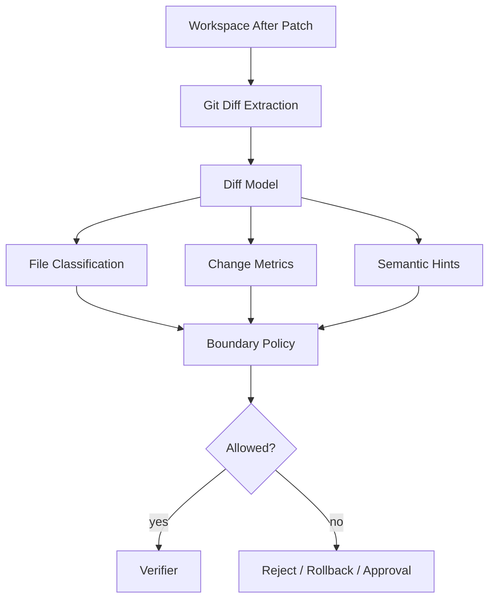
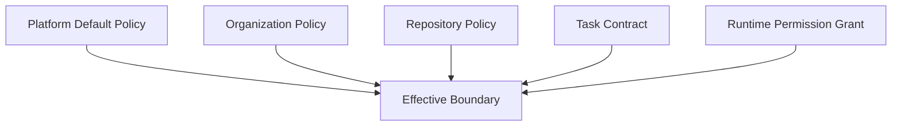
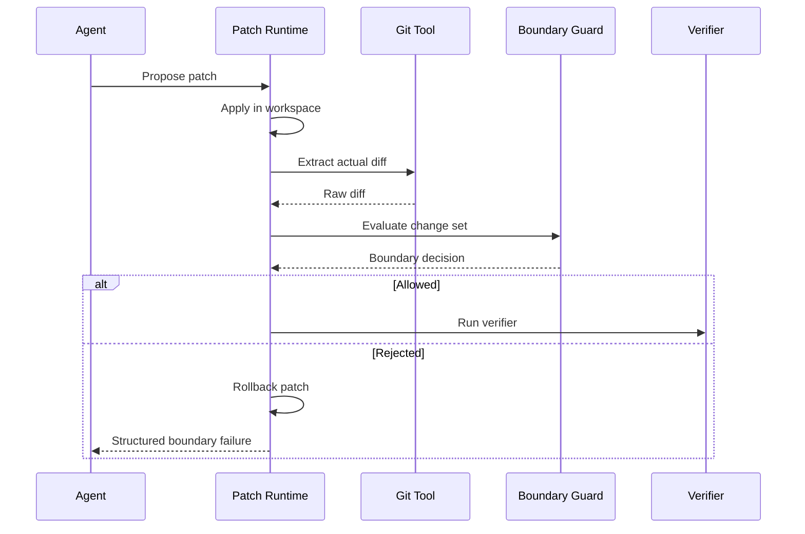

------
title: Learn AI Coding Agent From Scratch - Part 040
description: Design a production-grade diff model and change boundary for AI coding agents: scope control, forbidden paths, generated files, lockfiles, risk scoring, and policy enforcement.
series: learn-ai-coding-agent
seriesTitle: Learn AI Coding Agent From Scratch
order: 40
partTitle: Diff Model and Change Boundary
tags:
- ai-coding-agent
- diff-model
- change-boundary
- policy
- git
- safety
- pr-review
- architecture
- series
date: 2026-07-03
---

# Part 040 — Diff Model dan Change Boundary: Scope Control, Forbidden Paths, Generated Files, Lockfiles

> Target part ini: kamu mampu mendesain lapisan yang menjawab pertanyaan paling penting setelah agent mengubah kode: “apakah perubahan ini masih berada di dalam batas yang diizinkan?”. Tanpa diff model dan change boundary, agent hanya menjadi generator patch yang sulit dipercaya.

Di Part 039 kita belajar strategi menghasilkan patch.

Sekarang kita membahas pagar sistemnya.

Patch yang berhasil apply belum tentu boleh diterima.

Compile yang hijau belum tentu cukup.

Test yang pass belum tentu membuktikan bahwa agent tidak menyentuh file berbahaya.

Yang kita butuhkan adalah **diff model** dan **change boundary**.

Diff model menjelaskan apa yang berubah.

Change boundary menjelaskan apakah perubahan itu boleh.

---

## 1. Mental Model: Diff sebagai Evidence, Boundary sebagai Policy



Diff model bukan hanya `git diff` string.

Ia adalah representasi terstruktur dari perubahan.

Change boundary bukan hanya allowlist path.

Ia adalah kontrak policy yang menggabungkan:

- task scope;
- repository policy;
- organization policy;
- file classification;
- risk level;
- permission grant;
- reviewer requirement;
- verification requirement.

Keduanya harus deterministic.

LLM boleh membantu menjelaskan diff.

LLM tidak boleh menjadi satu-satunya penjaga boundary.

---

## 2. Kenapa Diff Boundary Penting?

AI coding agent punya failure mode khas:

1. agent menyelesaikan masalah tetapi mengubah terlalu banyak file;
2. agent memperbaiki test dengan melemahkan assertion;
3. agent menghapus error handling agar compile lewat;
4. agent mengubah config production tanpa diminta;
5. agent mengedit generated file alih-alih source-of-truth;
6. agent mengubah lockfile secara manual;
7. agent menambah dependency berisiko;
8. agent menyentuh file rahasia atau credential template;
9. agent melakukan formatting massal sehingga diff sulit direview;
10. agent membuat PR hijau tetapi tidak sesuai objective.

Boundary layer mencegah agent “menang dengan cara yang salah”.

Dalam sistem background/fleet agent, boundary lebih penting lagi karena perubahan bisa terjadi pada banyak repository.

Satu bug policy bisa menjadi ribuan PR buruk.

---

## 3. Diff Model: Dari Text Diff ke Structured Change Set

Mulai dari Git diff, tetapi jangan berhenti di sana.

Kita butuh model seperti ini:

```ts
export type ChangeSet = {
  baseCommit: string;
  headCommit?: string;
  workspaceId: string;
  generatedAt: string;
  files: FileChange[];
  totals: DiffTotals;
  classifications: ChangeSetClassification;
  risks: RiskFinding[];
  provenance: ChangeProvenance[];
};

export type FileChange = {
  path: string;
  oldPath?: string;
  status: "ADDED" | "MODIFIED" | "DELETED" | "RENAMED" | "COPIED";
  fileKind: FileKind;
  language?: string;
  isBinary: boolean;
  isGenerated: boolean;
  isLockfile: boolean;
  isSecretLike: boolean;
  additions: number;
  deletions: number;
  hunks: DiffHunk[];
  operations?: SemanticOperation[];
};

export type DiffHunk = {
  oldStart: number;
  oldLines: number;
  newStart: number;
  newLines: number;
  header?: string;
  changedLines: ChangedLine[];
};

export type ChangedLine = {
  kind: "ADD" | "DELETE" | "CONTEXT";
  oldLine?: number;
  newLine?: number;
  text: string;
  redacted?: boolean;
};
```

Diff string tetap disimpan sebagai artifact.

Tetapi policy harus membaca structured model.

Kenapa?

Karena pertanyaan policy biasanya bukan “apa text diff-nya?”, tetapi:

- file apa yang berubah?
- berapa banyak line berubah?
- apakah ada file forbidden?
- apakah ada lockfile?
- apakah ada secret-like content?
- apakah test diubah?
- apakah generated file tersentuh?
- apakah ada deletion besar?
- apakah file config production berubah?
- apakah perubahan berada di scope prompt contract?

---

## 4. File Classification

Boundary yang bagus dimulai dari klasifikasi file.

```ts
export type FileKind =
  | "SOURCE"
  | "TEST"
  | "CONFIG"
  | "SCHEMA"
  | "MIGRATION"
  | "BUILD_MANIFEST"
  | "LOCKFILE"
  | "GENERATED"
  | "DOCUMENTATION"
  | "CI_CONFIG"
  | "SECRET_OR_CREDENTIAL"
  | "BINARY"
  | "UNKNOWN";
```

### 4.1 Heuristic Awal

| Pattern | Kind | Default policy |
|---|---|---|
| `src/main/**/*.java` | SOURCE | allowed if task scope includes source |
| `src/test/**/*.java` | TEST | allowed for test-related or regression guard |
| `pom.xml`, `build.gradle` | BUILD_MANIFEST | needs dependency/build policy |
| `package-lock.json`, `pnpm-lock.yaml`, `go.sum` | LOCKFILE | command-generated only |
| `target/**`, `build/**`, `dist/**` | GENERATED | usually forbidden |
| `openapi.yaml`, `*.proto`, `*.xsd` | SCHEMA | high review requirement |
| `db/migration/**` | MIGRATION | high risk, special verifier |
| `.github/workflows/**` | CI_CONFIG | restricted |
| `.env`, `*.pem`, `id_rsa` | SECRET_OR_CREDENTIAL | forbidden |
| `*.png`, `*.jar`, `*.class` | BINARY | forbidden unless explicit |

Heuristic tidak sempurna.

Tetapi lebih baik punya conservative classifier daripada membiarkan agent menyentuh semua file.

### 4.2 Generated File Detection

Generated file tidak selalu berada di folder `generated`.

Gunakan kombinasi:

- path pattern;
- header comment;
- repository config;
- build manifest;
- known generator output;
- file extension;
- high churn/generated marker.

Contoh marker:

```txt
// Code generated by protoc-gen-go. DO NOT EDIT.
// <auto-generated>
// Generated by OpenAPI Generator
# This file is generated. Do not edit manually.
```

Policy default:

> Generated file tidak boleh diedit manual. Jika perlu berubah, ubah source-of-truth lalu regenerate.

---

## 5. Change Boundary Policy

Boundary policy menjawab “boleh atau tidak?”.

```ts
export type ChangeBoundaryPolicy = {
  policyId: string;
  taskId: string;
  baseCommit: string;
  writeScope: PathRule[];
  readScope: PathRule[];
  forbiddenPaths: PathRule[];
  fileKindRules: FileKindRule[];
  maxChangedFiles: number;
  maxAdditions: number;
  maxDeletions: number;
  maxHunksPerFile?: number;
  allowDeletes: boolean;
  allowRenames: boolean;
  allowLockfileChanges: LockfilePolicy;
  allowGeneratedFileChanges: GeneratedFilePolicy;
  allowBuildManifestChanges: BuildManifestPolicy;
  requireApprovalFor: ApprovalTrigger[];
  requireVerifierFor: VerifierTrigger[];
};
```

Boundary policy berasal dari beberapa sumber:



Rule penting:

> Effective boundary harus makin ketat saat policy digabung, kecuali ada explicit approval yang menaikkan permission.

Jangan biarkan task prompt melemahkan org policy.

---

## 6. Scope Control

Scope control adalah bentuk boundary paling dasar.

Contoh task:

> Replace deprecated `LegacyIdGenerator.generate()` usage in `src/main/java` and add targeted tests. Do not change production config, CI, database migrations, or dependency versions.

Effective boundary:

```yaml
writeScope:
  include:
    - src/main/java/**/*.java
    - src/test/java/**/*.java
  exclude:
    - src/main/resources/application-prod.yml
    - .github/workflows/**
    - db/migration/**
    - pom.xml
    - package-lock.json
maxChangedFiles: 20
maxAdditions: 500
maxDeletions: 500
allowDeletes: false
allowRenames: false
allowLockfileChanges: command_generated_only
allowGeneratedFileChanges: source_of_truth_only
requireVerifierFor:
  - source_changed: maven-test
  - test_changed: maven-test
```

Scope bukan hanya path.

Scope juga mencakup:

- jenis perubahan;
- ukuran perubahan;
- file kind;
- operation type;
- verifier requirement;
- approval requirement.

---

## 7. Forbidden Paths

Forbidden paths harus diperlakukan sebagai hard stop.

Contoh:

```yaml
forbiddenPaths:
  - .env
  - .env.*
  - '**/*.pem'
  - '**/*.key'
  - '**/id_rsa'
  - secrets/**
  - infra/prod/**
  - .github/workflows/deploy-prod.yml
  - db/migration/**/V*_prod_*.sql
```

Jika diff menyentuh forbidden path:

- jangan lanjut verifier;
- rollback workspace jika patch baru saja diterapkan;
- catat policy violation;
- minta approval hanya jika policy mengizinkan override;
- jangan kirim isi file sensitif ke model.

Structured result:

```json
{
  "allowed": false,
  "decision": "REJECT",
  "reasonCode": "FORBIDDEN_PATH_CHANGED",
  "findings": [
    {
      "path": "infra/prod/terraform.tfvars",
      "fileKind": "CONFIG",
      "severity": "BLOCKER",
      "message": "Production infrastructure config cannot be changed by this task."
    }
  ]
}
```

---

## 8. Lockfile Policy

Lockfile adalah special case.

Lockfile changes bisa valid, tetapi agent tidak boleh mengarang isi lockfile.

Policy yang disarankan:

```ts
export type LockfilePolicy =
  | "FORBIDDEN"
  | "COMMAND_GENERATED_ONLY"
  | "ALLOWED_WITH_DEPENDENCY_TASK"
  | "REQUIRES_APPROVAL";
```

### 8.1 Kenapa Lockfile Manual Edit Berbahaya?

Karena lockfile merepresentasikan resolution graph, integrity hash, transitive dependencies, dan sometimes platform-specific metadata.

Manual edit bisa:

- membuat install gagal;
- melewatkan integrity hash;
- mengubah transitive dependency tanpa sadar;
- menyembunyikan supply-chain risk;
- membuat diff besar yang sulit direview.

### 8.2 Lockfile Boundary Algorithm

```ts
function evaluateLockfileChange(file: FileChange, ctx: BoundaryContext): Finding[] {
  if (!file.isLockfile) return [];

  if (ctx.policy.allowLockfileChanges === "FORBIDDEN") {
    return [blocker(file.path, "LOCKFILE_FORBIDDEN")];
  }

  if (ctx.policy.allowLockfileChanges === "COMMAND_GENERATED_ONLY") {
    const provenance = ctx.provenance.find(p => p.path === file.path);
    if (!provenance || provenance.kind !== "COMMAND_OUTPUT") {
      return [blocker(file.path, "LOCKFILE_NOT_COMMAND_GENERATED")];
    }
  }

  return [];
}
```

Provenance penting.

Bukan cukup melihat file berubah.

Kita perlu tahu siapa atau apa yang menghasilkan perubahan.

---

## 9. Generated File Policy

Generated file policy mirip lockfile.

```ts
export type GeneratedFilePolicy =
  | "FORBIDDEN"
  | "REGENERATE_ONLY"
  | "ALLOWED_IF_SOURCE_OF_TRUTH_CHANGED"
  | "REQUIRES_APPROVAL";
```

Contoh valid:

- agent mengubah `api/openapi.yaml`;
- runtime menjalankan `make generate-client`;
- generated client berubah;
- provenance menunjukkan generated files berasal dari command.

Contoh invalid:

- agent langsung mengedit `src/generated/java/ApiClient.java`;
- source OpenAPI tidak berubah;
- verifier compile hijau;
- boundary tetap reject karena source-of-truth dilanggar.

Policy result:

```json
{
  "allowed": false,
  "decision": "REJECT",
  "reasonCode": "GENERATED_FILE_MANUAL_EDIT",
  "message": "Generated file changed without generator provenance or source-of-truth change."
}
```

---

## 10. Diff Size Budget

Agent harus punya diff budget.

Diff budget mencegah:

- accidental formatting massal;
- vendor/generated file tersentuh;
- over-broad refactor;
- task kecil menjadi rewrite besar;
- PR tidak reviewable.

```yaml
maxChangedFiles: 12
maxAdditions: 400
maxDeletions: 400
maxHunksPerFile: 8
maxUnrelatedDirectories: 3
maxFormattingOnlyFiles: 0
```

Diff budget tidak selalu hard reject.

Bisa menjadi approval trigger.

```ts
if (changeSet.totals.changedFiles > policy.maxChangedFiles) {
  return approvalRequired("DIFF_TOO_LARGE", {
    changedFiles: changeSet.totals.changedFiles,
    maxChangedFiles: policy.maxChangedFiles
  });
}
```

Untuk fleet migration, budget bisa dinamis:

- repo kecil: max 10 files;
- repo medium: max 30 files;
- codemod approved: max 200 files tetapi only matching pattern;
- generated update: budget khusus.

---

## 11. Semantic Boundary

Path boundary tidak cukup.

Agent bisa mengubah file yang benar, tetapi melakukan perubahan yang salah.

Contoh task:

> Add validation for negative amount.

Agent mengubah test menjadi:

```java
assertTrue(true);
```

Path-nya benar.

Diff size kecil.

Compile hijau.

Tapi semantic boundary dilanggar.

Semantic boundary bisa dideteksi dengan kombinasi:

- deterministic heuristics;
- forbidden line patterns;
- test weakening detector;
- mutation pattern detector;
- LLM-as-judge;
- reviewer approval.

### 11.1 Test Weakening Detector

Heuristic awal:

```ts
function detectTestWeakening(file: FileChange): Finding[] {
  if (file.fileKind !== "TEST") return [];

  const added = file.hunks.flatMap(h => h.changedLines)
    .filter(l => l.kind === "ADD")
    .map(l => l.text);

  const deleted = file.hunks.flatMap(h => h.changedLines)
    .filter(l => l.kind === "DELETE")
    .map(l => l.text);

  const suspiciousAdds = [
    "assertTrue(true)",
    "// TODO",
    "@Disabled",
    "@Ignore",
    "return;"
  ];

  if (added.some(line => suspiciousAdds.some(p => line.includes(p)))) {
    return [warning(file.path, "POSSIBLE_TEST_WEAKENING")];
  }

  if (deleted.some(line => line.includes("assert")) && !added.some(line => line.includes("assert"))) {
    return [warning(file.path, "ASSERTION_REMOVED")];
  }

  return [];
}
```

Heuristic tidak sempurna, tetapi menangkap banyak cheat pattern.

### 11.2 Security Weakening Detector

Cari pattern seperti:

- disabling TLS verification;
- broadening CORS;
- removing auth checks;
- catching and swallowing exceptions;
- logging secrets;
- changing permission defaults;
- replacing safe parser with unsafe parser.

Boundary bisa mengembalikan `REQUIRES_SECURITY_REVIEW`, bukan langsung reject.

---

## 12. Change Provenance

Untuk setiap file berubah, kita perlu provenance.

```ts
export type ChangeProvenance = {
  path: string;
  producedBy:
    | "MODEL_DIRECT_WRITE"
    | "MODEL_UNIFIED_DIFF"
    | "AST_RECIPE"
    | "FORMATTER"
    | "BUILD_TOOL"
    | "GENERATOR"
    | "MANUAL_APPROVAL";
  stepId: string;
  toolCallId?: string;
  command?: string[];
  recipeId?: string;
  inputArtifactIds: string[];
  outputArtifactIds: string[];
};
```

Provenance menjawab:

- apakah lockfile dihasilkan package manager?
- apakah generated file dihasilkan generator?
- apakah formatting massal berasal dari formatter?
- apakah perubahan test berasal dari model langsung?
- tool mana yang membuat perubahan?
- step mana yang perlu direplay?

Tanpa provenance, boundary hanya melihat hasil akhir.

Dengan provenance, boundary bisa menilai proses.

---

## 13. Boundary Decision Model

Boundary tidak hanya boolean.

```ts
export type BoundaryDecision =
  | "ALLOW"
  | "ALLOW_WITH_WARNING"
  | "REQUIRES_APPROVAL"
  | "REQUIRES_ADDITIONAL_VERIFICATION"
  | "REJECT";

export type BoundaryEvaluation = {
  decision: BoundaryDecision;
  allowed: boolean;
  findings: BoundaryFinding[];
  requiredApprovals: ApprovalRequest[];
  requiredVerifiers: VerificationProfile[];
  safeSummary: string;
};
```

Contoh mapping:

| Finding | Decision |
|---|---|
| forbidden path | REJECT |
| secret-like addition | REJECT |
| generated file manual edit | REJECT |
| lockfile from package manager | REQUIRES_ADDITIONAL_VERIFICATION |
| diff too large | REQUIRES_APPROVAL |
| test weakening suspicious | REQUIRES_APPROVAL / security review |
| build manifest changed | REQUIRES_ADDITIONAL_VERIFICATION |
| source + test small change | ALLOW |

Ini penting karena tidak semua risk harus block.

Tetapi semua risk harus eksplisit.

---

## 14. Boundary Evaluator Pipeline

```ts
export async function evaluateBoundary(
  changeSet: ChangeSet,
  policy: ChangeBoundaryPolicy,
  ctx: BoundaryContext
): Promise<BoundaryEvaluation> {
  const findings: BoundaryFinding[] = [];

  findings.push(...checkBaseCommit(changeSet, policy));
  findings.push(...checkPathScope(changeSet, policy));
  findings.push(...checkForbiddenPaths(changeSet, policy));
  findings.push(...checkFileKinds(changeSet, policy));
  findings.push(...checkDiffBudget(changeSet, policy));
  findings.push(...checkLockfiles(changeSet, policy, ctx));
  findings.push(...checkGeneratedFiles(changeSet, policy, ctx));
  findings.push(...checkSecrets(changeSet, ctx));
  findings.push(...checkTestWeakening(changeSet));
  findings.push(...checkSecurityWeakening(changeSet));

  const decision = combineFindings(findings, policy);

  return {
    decision,
    allowed: decision === "ALLOW" || decision === "ALLOW_WITH_WARNING",
    findings,
    requiredApprovals: deriveApprovals(findings),
    requiredVerifiers: deriveVerifiers(changeSet, findings, policy),
    safeSummary: summarizeForModel(changeSet, findings)
  };
}
```

Ordering matters.

Run cheap deterministic checks first.

Do not run expensive verifier if hard boundary already failed.

Do not send sensitive diff to model if secret detector triggers.

---

## 15. Safe Summary for Model

Jika boundary gagal, agent butuh feedback untuk repair.

Tetapi feedback harus aman.

Bad feedback:

```txt
Here is the full diff including secret-like lines...
```

Good feedback:

```json
{
  "errorCode": "CHANGE_BOUNDARY_VIOLATION",
  "decision": "REJECT",
  "repairable": true,
  "findings": [
    {
      "reasonCode": "FORBIDDEN_PATH_CHANGED",
      "path": ".github/workflows/deploy-prod.yml",
      "safeMessage": "This task is not allowed to modify production deployment workflow. Revert this file."
    }
  ],
  "suggestedNextAction": "Revert forbidden file changes and regenerate a smaller patch limited to src/main/java and src/test/java."
}
```

Principle:

> Model gets enough information to repair, not enough information to leak sensitive content or bypass policy.

---

## 16. Integration dengan Patch Runtime

Boundary guard harus dipanggil setelah setiap mutation.



Boundary harus memakai actual diff dari workspace, bukan hanya proposal diff dari model.

Kenapa?

Karena command/formatter/generator bisa menghasilkan perubahan tambahan.

Proposal adalah niat.

Actual diff adalah fakta.

Policy harus menilai fakta.

---

## 17. Integration dengan PR Orchestration

Boundary result harus muncul di PR body.

Contoh:

```md
## Change Boundary

- Base commit: `abc123`
- Changed files: 4
- Additions/deletions: +72/-31
- Forbidden path changes: none
- Lockfile changes: none
- Generated file changes: none
- Build manifest changes: none
- Test weakening findings: none
- Required verification: `mvn test -Dtest=UserServiceTest`

## Verification

- Compile: passed
- Targeted tests: passed
- Secret scan: passed
```

Reviewer tidak perlu membaca log agent lengkap untuk tahu apakah boundary aman.

Mereka perlu summary yang bisa dipercaya.

---

## 18. Anti-Patterns

### 18.1 Boundary di Prompt Saja

Buruk:

```txt
Do not modify production configs.
```

Prompt instruction perlu, tetapi tidak cukup.

Runtime harus enforce.

### 18.2 Boundary Setelah PR Dibuat

Jika boundary baru dijalankan setelah PR dibuat, agent bisa menghasilkan PR buruk/spam.

Boundary harus berada sebelum candidate patch dan sebelum PR orchestration.

### 18.3 Diff String sebagai Satu-Satunya Model

Raw diff bagus untuk manusia.

Policy perlu structured representation.

### 18.4 Allowlist Terlalu Longgar

```yaml
writeScope:
  include:
    - '**/*'
```

Ini bukan scope.

Ini menyerah.

### 18.5 Auto-Format Seluruh Repo

Formatter boleh dipakai, tetapi harus scoped.

Jika task menyentuh satu file, jangan format seluruh repo kecuali repository convention mengharuskan dan approval ada.

---

## 19. Implementation Milestone untuk Project Kita

Tambahkan modul:

```txt
packages/
  diff-model/
    ChangeSet.ts
    FileChange.ts
    DiffParser.ts
    FileClassifier.ts
    DiffMetrics.ts
    ChangeProvenance.ts
  boundary/
    ChangeBoundaryPolicy.ts
    BoundaryEvaluator.ts
    PathRule.ts
    Finding.ts
    DecisionCombiner.ts
    SafeBoundarySummary.ts
    rules/
      ForbiddenPathRule.ts
      DiffBudgetRule.ts
      LockfileRule.ts
      GeneratedFileRule.ts
      SecretLikeRule.ts
      TestWeakeningRule.ts
      BuildManifestRule.ts
```

Minimum behavior:

1. parse `git diff --numstat` dan `git diff --name-status`;
2. classify file path;
3. enforce write scope;
4. block forbidden paths;
5. block binary/secret-like/generated manual edit;
6. enforce max changed files/lines;
7. produce structured boundary result;
8. integrate with patch runtime rollback;
9. store boundary report artifact;
10. include boundary summary in PR body.

---

## 20. Example Boundary Report

```json
{
  "decision": "REQUIRES_ADDITIONAL_VERIFICATION",
  "allowed": false,
  "totals": {
    "changedFiles": 3,
    "additions": 91,
    "deletions": 28
  },
  "findings": [
    {
      "severity": "INFO",
      "reasonCode": "SOURCE_CHANGED",
      "path": "src/main/java/com/acme/UserService.java"
    },
    {
      "severity": "INFO",
      "reasonCode": "TEST_CHANGED",
      "path": "src/test/java/com/acme/UserServiceTest.java"
    },
    {
      "severity": "WARNING",
      "reasonCode": "BUILD_MANIFEST_CHANGED",
      "path": "pom.xml",
      "message": "Build manifest changed; dependency verifier required."
    }
  ],
  "requiredVerifiers": [
    {
      "profile": "maven-test",
      "command": "mvn test"
    },
    {
      "profile": "dependency-tree-diff",
      "command": "mvn dependency:tree"
    }
  ]
}
```

Notice: `allowed: false` bukan berarti reject selamanya.

Decision-nya menunjukkan agent harus menjalankan verifier tambahan dulu.

---

## 21. Latihan

### Latihan 1 — Buat Boundary Policy

Buat policy untuk task:

> Migrate deprecated API usage in Java source. Agent may edit source and tests. Agent may not change dependency versions, CI, deployment config, database migrations, or generated files.

Tulis:

- write scope;
- forbidden paths;
- max diff budget;
- lockfile policy;
- generated file policy;
- required verifier.

### Latihan 2 — Classify File Changes

Klasifikasikan perubahan berikut:

1. `src/main/java/com/acme/OrderService.java`
2. `src/test/java/com/acme/OrderServiceTest.java`
3. `pom.xml`
4. `package-lock.json`
5. `target/generated-sources/openapi/Client.java`
6. `.github/workflows/deploy.yml`
7. `db/migration/V20260703__add_order_status.sql`
8. `.env.example`

Untuk tiap file, tentukan default decision.

### Latihan 3 — Boundary Failure Feedback

Buat safe model feedback untuk situasi:

- agent mengubah `src/main/java` sesuai scope;
- agent juga mengubah `.github/workflows/deploy-prod.yml`;
- agent menambah `@Disabled` ke test.

Feedback harus actionable, tetapi tidak boleh mengirim full diff workflow production.

---

## 22. Checklist Pemahaman

Kamu dianggap paham part ini jika bisa menjawab:

- Kenapa patch apply sukses belum cukup?
- Apa beda diff string dan structured diff model?
- Apa saja field minimal `ChangeSet`?
- Bagaimana mengklasifikasi lockfile dan generated file?
- Kenapa provenance penting?
- Kapan boundary harus reject vs require approval?
- Kenapa actual diff lebih penting dari proposal diff?
- Bagaimana mendeteksi test weakening secara heuristik?
- Bagaimana boundary result masuk ke PR body?
- Kenapa boundary harus deterministic?

---

## 23. Ringkasan

Diff model dan change boundary adalah lapisan trust untuk AI coding agent.

Patch generation menjawab “bagaimana mengubah kode”.

Boundary menjawab “apakah perubahan ini boleh”.

Sistem production-grade harus:

- mengekstrak actual diff dari workspace;
- mengubah diff menjadi structured change set;
- mengklasifikasi file;
- mengevaluasi path scope, forbidden paths, diff budget, lockfile, generated file, secret-like content, dan semantic risk;
- menghasilkan decision yang bukan sekadar boolean;
- memberi feedback aman ke agent;
- menyimpan report sebagai artifact;
- memasukkan summary ke PR.

Tanpa boundary, agent bisa terlihat berhasil tetapi merusak trust.

Dengan boundary, agent menjadi sistem perubahan kode yang bisa dikontrol, diaudit, dan diskalakan.

---

## References

- Git documentation — git diff: https://git-scm.com/docs/git-diff
- Git documentation — git status: https://git-scm.com/docs/git-status
- Git documentation — git apply: https://git-scm.com/docs/git-apply
- GNU diffutils manual — Unified Format: https://www.gnu.org/s/diffutils/manual/html_node/Unified-Format.html
- GitHub Docs — Reviewing proposed changes in a pull request: https://docs.github.com/en/pull-requests/collaborating-with-pull-requests/reviewing-changes-in-pull-requests/reviewing-proposed-changes-in-a-pull-request
