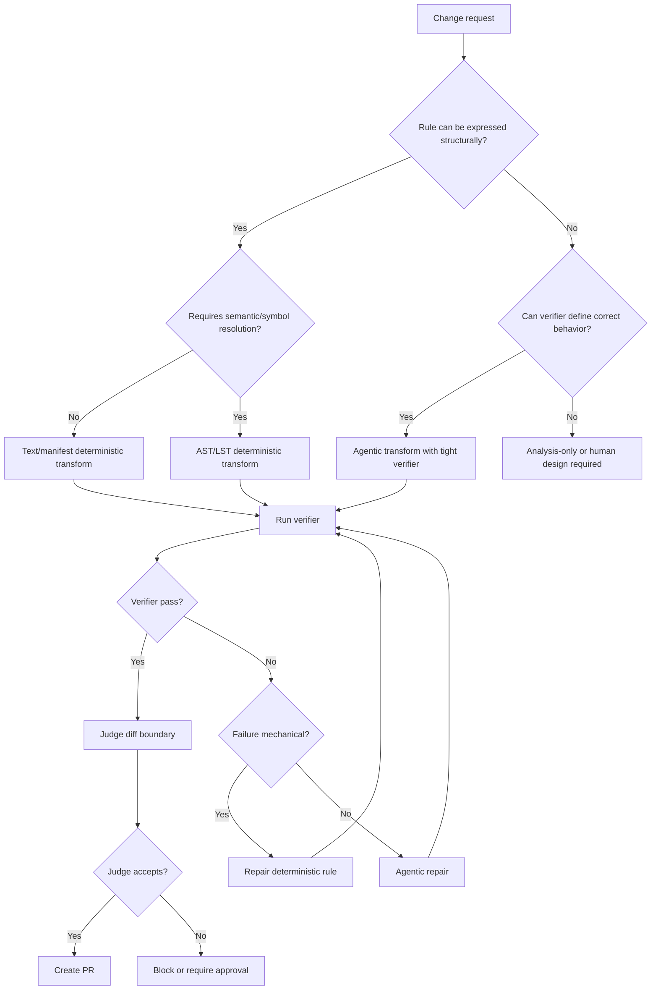
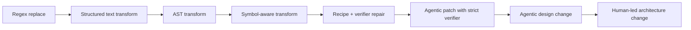
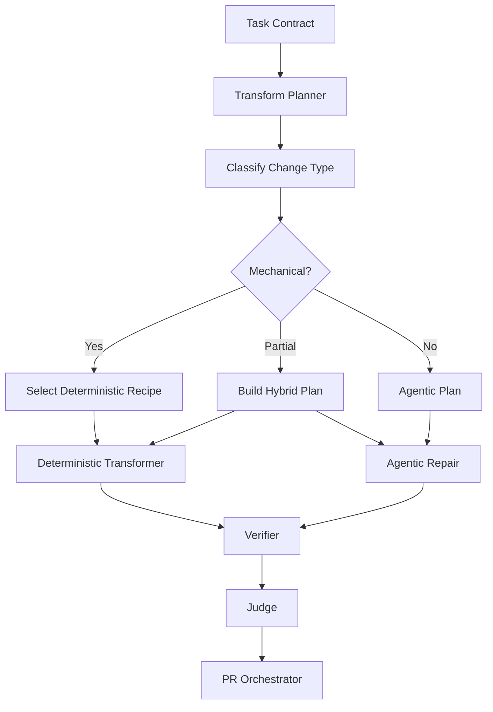
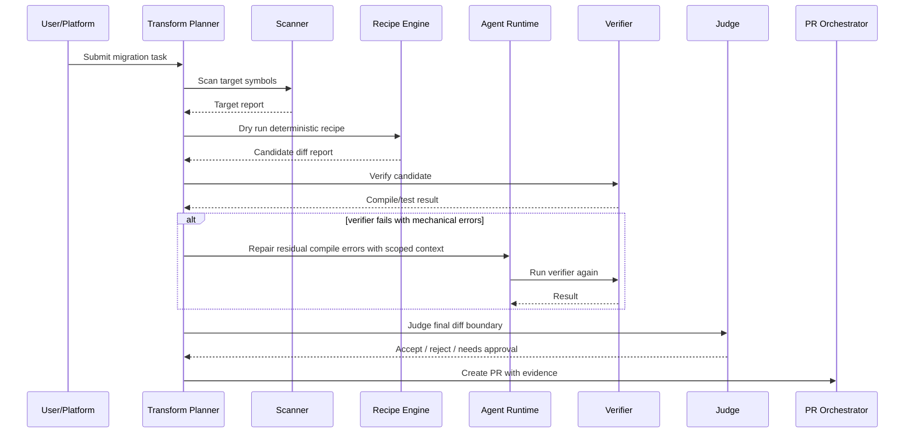

------
title: Learn AI Coding Agent From Scratch - Part 041
description: Membedakan deterministic transform dan agentic transform dalam Honk-like AI coding agent, termasuk decision matrix, hybrid pipeline, AST/codemod architecture, failure model, dan policy boundary.
series: learn-ai-coding-agent
seriesTitle: Learn AI Coding Agent From Scratch
order: 41
partTitle: Deterministic Transform vs Agentic Transform
slug: deterministic-transform-vs-agentic-transform
tags:
  - ai-coding-agent
  - code-modification
  - refactoring
  - ast
  - codemod
  - java
  - openrewrite
  - software-engineering
date: 2026-07-03
---

# Part 041 — Deterministic Transform vs Agentic Transform

Di part sebelumnya kita sudah membahas strategi patch generation dan change boundary. Sekarang kita masuk ke keputusan yang lebih penting: **kapan perubahan kode harus dilakukan oleh transformasi deterministic, kapan boleh dilakukan oleh LLM agent, dan kapan harus memakai hybrid pipeline**.

Ini bukan sekadar pilihan tool. Ini adalah keputusan arsitektur yang menentukan apakah agent kita akan menjadi sistem perubahan kode yang bisa dipercaya, atau hanya “LLM yang kebetulan bisa edit file”.

Mental model utama part ini:

> Untuk perubahan kode yang memiliki aturan jelas, deterministik, dan bisa dinyatakan sebagai transformasi struktural, gunakan deterministic transform. Untuk perubahan yang membutuhkan penalaran lokal, interpretasi maksud, atau adaptasi terhadap variasi desain, gunakan agentic transform. Untuk migrasi production-grade, hampir selalu gunakan hybrid: deterministic untuk bagian mekanis, agentic untuk gap, repair, dan explanation.

Kita sedang membangun Honk-like background coding agent. Agent seperti ini tidak hanya menjawab pertanyaan. Ia membuat branch, mengubah kode, menjalankan verifier, membuat PR, dan mungkin bekerja di ratusan repository. Semakin besar skala perubahan, semakin mahal akibat dari randomness, overreach, dan patch yang sulit direview. Karena itu, deterministic transform adalah salah satu senjata paling penting.

---

## 1. Problem yang sedang kita pecahkan

Bayangkan ada permintaan:

> Migrasikan semua pemanggilan `LegacyClient.fetchUser(String id)` ke `UserGateway.getUser(UserId id)`.

Ada beberapa kemungkinan implementasi agent:

1. LLM membaca repo, mencari `fetchUser`, lalu mengedit file satu per satu.
2. Script regex mengganti semua string `fetchUser(` menjadi `getUser(`.
3. AST transformer menemukan method invocation dengan resolved symbol tertentu, lalu mengganti call expression secara aman.
4. Deterministic transformer melakukan perubahan mekanis, lalu LLM memperbaiki compile error dan edge case.

Pilihan ke-2 terlalu rapuh. Pilihan ke-1 terlalu bebas untuk perubahan mekanis yang luas. Pilihan ke-3 aman bila aturan migrasi jelas. Pilihan ke-4 biasanya paling realistis untuk production-scale migration.

Masalah dasarnya bukan “mana yang paling pintar”. Masalahnya:

- perubahan mana yang bisa dibuat **repeatable**,
- perubahan mana yang bisa dibuat **explainable**,
- perubahan mana yang bisa dibuat **bounded**,
- perubahan mana yang bisa diverifikasi dengan **oracle deterministic**,
- perubahan mana yang memang membutuhkan judgment.

---

## 2. Definisi kerja

### 2.1 Deterministic transform

Deterministic transform adalah perubahan kode yang output-nya ditentukan oleh:

- input source tree,
- rule/recipe eksplisit,
- konfigurasi transform,
- versi tool,
- environment yang dikontrol.

Untuk input yang sama dan konfigurasi yang sama, output seharusnya sama.

Contoh:

- rename import `javax.validation` ke `jakarta.validation`,
- ganti annotation tertentu,
- ubah method invocation tertentu berdasarkan symbol resolution,
- update dependency version di `pom.xml`,
- hapus unused import setelah transform,
- apply format otomatis.

Deterministic transform cocok untuk perubahan yang bisa dijelaskan sebagai:

```txt
match condition -> rewrite operation -> post condition
```

### 2.2 Agentic transform

Agentic transform adalah perubahan kode yang dibuat oleh loop agent:

```txt
observe -> reason -> edit -> verify -> repair -> stop
```

Output-nya dipengaruhi oleh model, prompt, context projection, tool call, intermediate result, dan kadang variasi non-deterministic dari inference.

Contoh:

- memahami maksud business rule lalu memperbaiki implementasi,
- menulis adapter baru karena API lama dan baru tidak isomorphic,
- memilih test yang tepat untuk perubahan perilaku,
- memperbaiki compile error yang muncul karena desain repo berbeda,
- menulis migration guide dalam PR body.

Agentic transform cocok untuk bagian yang membutuhkan interpretation, local design judgment, atau adaptation.

### 2.3 Hybrid transform

Hybrid transform adalah pipeline yang menggabungkan keduanya:

1. deterministic detector menemukan target,
2. deterministic transformer melakukan perubahan yang pasti,
3. verifier menjalankan build/test,
4. LLM agent memperbaiki residual problem,
5. judge memastikan perubahan tidak overreach,
6. PR dibuat dengan evidence.

Untuk Honk-like agent, hybrid adalah default mental model.

---

## 3. Diagram keputusan



Diagram ini penting karena ia memaksa kita tidak memperlakukan LLM sebagai tool pertama untuk semua masalah. LLM adalah komponen kuat, tetapi bukan satu-satunya komponen.

---

## 4. Invariant utama

Untuk platform agent yang sehat, pegang invariant berikut.

### Invariant 1 — deterministic transform harus lebih diutamakan untuk perubahan mekanis berskala besar

Jika perubahan bisa diekspresikan sebagai recipe, jangan beri LLM kebebasan mengedit manual semua file.

Alasannya:

- deterministic transform lebih mudah direview,
- lebih mudah diulang di banyak repo,
- lebih mudah diuji pada fixture,
- lebih mudah di-debug,
- lebih rendah risiko overreach.

### Invariant 2 — agentic transform harus dibatasi oleh evidence dan verifier

LLM boleh mengubah kode, tetapi tidak boleh menjadi satu-satunya sumber kebenaran.

Agentic transform minimal harus punya:

- task contract,
- allowed path,
- diff budget,
- verifier profile,
- stop condition,
- judge boundary,
- audit trace.

### Invariant 3 — setiap transform harus menghasilkan artifact, bukan hanya diff

Patch tanpa explanation tidak cukup. Transform harus menghasilkan:

- target detection report,
- applied rule report,
- skipped target report,
- changed file list,
- verification report,
- residual risk report,
- PR summary.

### Invariant 4 — random reasoning tidak boleh menggantikan structural matching

Jika kita ingin mengganti method `oldApi()` yang berasal dari class `com.acme.LegacyApi`, jangan hanya search string `oldApi(`. Banyak method bisa bernama sama.

Minimal gunakan:

- import analysis,
- fully qualified type,
- method signature,
- receiver type,
- overload resolution,
- compile feedback.

### Invariant 5 — transform harus idempotent

Jika transform dijalankan dua kali, run kedua tidak boleh menghasilkan perubahan baru yang tidak perlu.

Ini penting untuk:

- retry,
- fleet rollout,
- rerun after conflict,
- PR update,
- debugging.

---

## 5. Decision matrix

Gunakan matrix ini saat menerima change request.

| Kondisi | Pilihan utama | Kenapa |
|---|---|---|
| Perubahan berbasis string sederhana di file konfigurasi | Deterministic text/structured config transform | Cepat, repeatable, low variance |
| Perubahan Java import/package/class/method dengan type information | AST/LST deterministic transform | Butuh structural correctness |
| Perubahan dependency version dan plugin config | Deterministic manifest transform | Manifest punya struktur jelas |
| Perubahan API yang 1:1 dan semua argumen map jelas | Deterministic AST transform | Tidak perlu judgment model |
| Perubahan API 70% mekanis, 30% edge case | Hybrid | Deterministic untuk majority, agentic untuk residual |
| Perubahan desain internal class | Agentic with verifier | Butuh local reasoning |
| Perubahan business semantics | Human-guided agentic | Correctness tidak cukup dari compile/test |
| Perubahan security/authorization logic | Conservative hybrid atau human approval | Risiko tinggi, perlu review manusia |
| Repo tidak punya test/verifier reliable | Analysis-only/draft-only | Tidak ada oracle cukup kuat |
| Perubahan lint/style global | Deterministic formatter/linter | Jangan pakai LLM untuk format |

Satu kesalahan umum: menganggap perubahan “mudah” berarti aman untuk LLM. Banyak perubahan mudah justru sebaiknya deterministic karena skalanya besar.

---

## 6. Spectrum transform

Tidak ada binary mutlak antara deterministic dan agentic. Ada spectrum.



Semakin ke kanan:

- kebutuhan reasoning naik,
- variance naik,
- review burden naik,
- failure mode makin semantik,
- human approval makin penting.

Semakin ke kiri:

- rule clarity naik,
- repeatability naik,
- fleet-safety naik,
- automation confidence naik.

---

## 7. Apa itu deterministic transform yang baik?

Deterministic transform yang baik bukan sekadar script. Ia punya contract.

```yaml
id: migrate-legacy-user-client-v1
kind: java-symbol-transform
version: 1
scope:
  include:
    - "src/main/java/**/*.java"
    - "src/test/java/**/*.java"
  exclude:
    - "**/generated/**"
    - "**/target/**"
match:
  language: java
  receiverType: "com.acme.legacy.LegacyUserClient"
  methodName: "fetchUser"
  parameterTypes:
    - "java.lang.String"
rewrite:
  replacementType: "com.acme.user.UserGateway"
  replacementMethod: "getUser"
  argumentMapping:
    - expression: "UserId.of($0)"
postconditions:
  noReferenceTo:
    - "com.acme.legacy.LegacyUserClient.fetchUser(java.lang.String)"
verification:
  commands:
    - "mvn -q -DskipTests compile"
    - "mvn -q test"
risk:
  requireApprovalIf:
    changedFilesGreaterThan: 50
    touchesPackages:
      - "com.acme.auth"
      - "com.acme.billing"
```

Recipe ini menjawab:

- target apa yang boleh diubah,
- target apa yang tidak boleh diubah,
- match berdasarkan apa,
- rewrite seperti apa,
- bagaimana membuktikan hasil,
- kapan harus meminta approval.

Tanpa contract seperti ini, transform sulit diproduksi ulang.

---

## 8. Tool landscape untuk Java transform

Kita tidak harus memakai semua tool ini, tetapi penting memahami kategorinya.

### 8.1 OpenRewrite

OpenRewrite adalah ecosystem automated refactoring yang memakai recipe untuk melakukan perubahan kode, dependency, framework migration, security fixes, dan style consistency. Konsep pentingnya adalah recipe dan visitor terhadap tree representation.

Cocok untuk:

- migration berskala banyak repo,
- dependency/framework upgrade,
- Java/Spring/Maven/Gradle/YAML transform,
- recipe yang bisa dites,
- enterprise migration.

Kelebihan:

- recipe reusable,
- punya Maven/Gradle plugin,
- cocok untuk fleet-wide codemod,
- bisa menghasilkan diff yang reviewable.

Trade-off:

- perlu menulis recipe dengan benar,
- edge case perlu test fixture,
- tidak semua perubahan bisa dinyatakan sebagai recipe sederhana.

### 8.2 Error Prone Refaster

Refaster mendefinisikan before/after template untuk transformasi Java source. Ia kuat untuk pattern kecil yang jelas.

Cocok untuk:

- mengganti idiom lama ke idiom baru,
- pattern expression yang berulang,
- small mechanical refactor.

Keterbatasan:

- bukan general agent framework,
- tidak cocok untuk perubahan arsitektur besar,
- butuh compile/type context.

### 8.3 Spoon

Spoon adalah library untuk analyze, rewrite, transform, dan transpile Java source code berbasis AST. Ia memberi API analisis dan transformasi yang kuat.

Cocok untuk:

- custom Java source analysis,
- AST traversal,
- transform rule yang spesifik,
- eksperimen research/engineering codemod.

### 8.4 JavaParser

JavaParser menyediakan AST untuk kode Java. Dengan symbol solver, ia bisa membantu resolved reference/type analysis.

Cocok untuk:

- parser/analysis custom,
- tool internal ringan,
- detector untuk repository context server,
- transform sederhana sampai menengah.

### 8.5 IDE/LSP refactoring

Language Server Protocol menyediakan konsep symbol, references, definition, diagnostics, dan code action. Untuk agent, LSP berguna sebagai context/navigation layer, tetapi refactoring LSP bisa berbeda-beda kualitasnya per language server.

Cocok untuk:

- go to definition,
- find references,
- diagnostics,
- quick fix,
- related symbol discovery.

---

## 9. Decision rule: bukan “LLM atau codemod”, tetapi “oracle apa yang kita punya?”

Pertanyaan yang lebih akurat:

> Oracle apa yang bisa membuktikan perubahan ini benar?

Beberapa jenis oracle:

| Oracle | Contoh | Kekuatan | Kelemahan |
|---|---|---|---|
| Text oracle | Tidak ada string lama tersisa | Cepat | Bisa false confidence |
| AST oracle | Tidak ada invocation lama tersisa | Lebih akurat | Butuh parser/resolution |
| Type oracle | Compile pass | Sangat penting | Tidak membuktikan behavior |
| Test oracle | Unit/integration tests pass | Bagus bila test reliable | Coverage bisa kurang |
| Snapshot oracle | Golden output sama | Baik untuk pure transform | Sulit untuk behavior kompleks |
| Policy oracle | Tidak menyentuh forbidden path | Boundary kuat | Tidak membuktikan correctness |
| Judge oracle | LLM review diff | Bagus untuk semantic review tambahan | Tidak boleh jadi satu-satunya oracle |
| Human oracle | Code review | Paling kontekstual | Mahal, lambat |

Deterministic transform cocok saat oracle deterministic kuat. Agentic transform boleh dipakai saat oracle masih cukup untuk mengendalikan output.

---

## 10. Architecture: transform planner

Kita tambahkan komponen baru di agent platform: **Transform Planner**.



Transform Planner tidak mengedit file. Ia membuat keputusan:

- apakah ada recipe yang cocok,
- apakah perubahan perlu AST/type information,
- apakah agent boleh mengedit setelah recipe,
- verifier apa yang wajib jalan,
- risk class apa yang berlaku,
- approval apa yang dibutuhkan.

---

## 11. Transform plan schema

Simpan keputusan planner sebagai artifact.

```json
{
  "taskId": "task_20260703_041",
  "planKind": "HYBRID_TRANSFORM",
  "riskClass": "MEDIUM",
  "primaryStrategy": "DETERMINISTIC_AST_RECIPE",
  "fallbackStrategy": "AGENTIC_COMPILE_REPAIR",
  "recipes": [
    {
      "id": "migrate-legacy-user-client-v1",
      "version": "1.0.0",
      "engine": "openrewrite-compatible",
      "scope": ["src/main/java", "src/test/java"],
      "expectedTargets": "unknown-before-scan"
    }
  ],
  "agentPermissions": {
    "canRead": ["src/**", "pom.xml"],
    "canWrite": ["src/main/java/**", "src/test/java/**", "pom.xml"],
    "canExecute": ["mvn -q -DskipTests compile", "mvn -q test"],
    "requiresApprovalFor": ["dependency-change", "public-api-change"]
  },
  "verificationProfile": "java-maven-compile-test",
  "judgeProfile": "diff-boundary-api-migration",
  "stopConditions": [
    "compile_passes",
    "tests_pass",
    "no_legacy_symbol_reference",
    "diff_boundary_accepted"
  ]
}
```

Kenapa disimpan? Karena saat PR gagal review, kita ingin tahu apakah masalahnya:

- recipe salah,
- target detection salah,
- repo punya edge case,
- agentic repair overreach,
- verifier terlalu lemah.

---

## 12. Deterministic transform pipeline

Pipeline minimal:

```txt
load repo
  -> scan target
  -> dry run recipe
  -> produce candidate diff
  -> validate boundary
  -> apply recipe
  -> format/import cleanup
  -> run verifier
  -> generate report
```

### 12.1 Scanner

Scanner menemukan target tanpa mengubah file.

Output scanner:

```json
{
  "scannerId": "legacy-user-client-scanner",
  "targets": [
    {
      "file": "src/main/java/com/acme/order/OrderService.java",
      "line": 42,
      "symbol": "com.acme.legacy.LegacyUserClient#fetchUser(java.lang.String)",
      "confidence": "HIGH",
      "reason": "resolved receiver type and method signature"
    }
  ],
  "ambiguous": [
    {
      "file": "src/main/java/com/acme/demo/Demo.java",
      "line": 17,
      "text": "fetchUser(id)",
      "reason": "unresolved receiver type"
    }
  ]
}
```

Agent boleh melihat report ini, tetapi tidak boleh menganggap ambiguous target aman.

### 12.2 Dry run

Dry run menghasilkan diff tanpa commit.

Tujuannya:

- menghitung blast radius,
- mengecek forbidden path,
- mengecek generated file,
- estimasi review burden,
- meminta approval jika perlu.

### 12.3 Apply

Apply baru dilakukan setelah policy gate menerima dry-run result.

### 12.4 Verify

Verifikasi minimal:

- format/import cleanup,
- compile,
- test relevan,
- search no old symbol,
- changed file policy,
- secret scan.

---

## 13. Agentic transform pipeline

Agentic transform tidak boleh dimulai dengan “edit apa pun yang menurutmu perlu”. Ia harus dimulai dengan **bounded action plan**.

```txt
prepare context
  -> generate plan
  -> approve/auto-approve plan
  -> edit small batch
  -> verify
  -> repair if evidence-bound
  -> judge
```

### 13.1 Agentic edit budget

Contoh budget:

```json
{
  "maxChangedFiles": 8,
  "maxAddedFiles": 2,
  "maxDeletedFiles": 0,
  "maxToolCalls": 40,
  "maxRepairCycles": 3,
  "allowedPaths": ["src/main/java/**", "src/test/java/**"],
  "forbiddenPaths": ["infra/**", ".github/**", "secrets/**"],
  "mustRun": ["mvn -q -DskipTests compile"],
  "mayRun": ["mvn -q test"],
  "mustNotRun": ["curl *", "rm -rf *", "git push *"]
}
```

Budget bukan formalitas. Budget adalah cara kita mencegah agent membuat patch yang terlalu besar untuk direview.

### 13.2 Evidence-bound repair

Agent hanya boleh memperbaiki error yang ada evidence-nya.

Buruk:

> Compile gagal, coba refactor package agar lebih modern.

Baik:

> Compile gagal karena `UserId` belum diimport di `OrderService.java`. Tambahkan import yang diperlukan.

---

## 14. Hybrid pipeline yang realistis

Untuk API migration, hybrid pipeline biasanya seperti ini:



Hybrid bukan kompromi lemah. Hybrid adalah cara menggabungkan repeatability deterministic dan fleksibilitas agentic.

---

## 15. Pattern: deterministic first, agentic residual

Ini adalah pattern paling penting.

### Step 1 — deterministic scanner

Cari semua target yang jelas.

### Step 2 — deterministic transform

Ubah semua target yang aman.

### Step 3 — verifier

Biarkan compiler/test memberi evidence.

### Step 4 — agentic residual repair

LLM hanya menangani bagian yang tidak terselesaikan:

- import missing,
- overload mismatch,
- generic type inference,
- changed return type,
- test fixture adjustment,
- adapter glue code.

### Step 5 — judge

LLM/judge mengecek apakah patch sesuai task dan tidak overreach, tetapi judge tidak menggantikan compiler/test/policy.

---

## 16. Pattern: agentic detector, deterministic applier

Kadang target tidak mudah ditemukan dengan rule sederhana. Agent bisa membantu menemukan kandidat, tetapi apply tetap deterministic.

Contoh:

- “Cari semua penggunaan API lama untuk payment hold yang tidak selalu bernama `PaymentHoldClient`.”
- Agent mencari concept/call-flow.
- Kandidat disimpan sebagai target list.
- Manusia atau deterministic validator menerima target.
- Transformer menerapkan perubahan.

Ini mengurangi risiko LLM membuat patch bebas.

---

## 17. Pattern: deterministic transform with agentic explanation

Untuk fleet migration, PR reviewer sering butuh explanation:

- kenapa file ini berubah,
- rule apa yang diterapkan,
- bagaimana diverifikasi,
- risiko residual apa.

LLM sangat baik untuk merangkum evidence menjadi PR body. Tetapi diff tetap deterministic.

Ini pattern low-risk high-value.

---

## 18. Anti-pattern

### 18.1 Regex global replace untuk source code berbahasa typed

Regex replace bisa berguna untuk file sederhana. Tetapi untuk Java source code, regex tidak tahu:

- import,
- overload,
- receiver type,
- comments vs code,
- string literal,
- generated source,
- annotation semantics.

Gunakan regex sebagai scanner awal, bukan final applier untuk API migration typed.

### 18.2 LLM manual edit untuk 500 file

Jika perubahan menyentuh 500 file, patch harus hampir pasti deterministic atau codemod-driven. LLM bisa membuat plan dan repair, bukan menjadi editor manual untuk semua file.

### 18.3 Tool terlalu powerful

Tool seperti `run_any_command` dan `write_any_file` membuat agent sulit dibatasi. Untuk transform, lebih baik expose tool spesifik:

- `scan_symbol_usage`,
- `apply_recipe_dry_run`,
- `apply_recipe`,
- `run_verifier_profile`,
- `summarize_transform_report`.

### 18.4 Judge-only correctness

LLM judge bisa membantu review diff, tetapi tidak boleh menjadi satu-satunya bukti correctness untuk perubahan source code.

### 18.5 Idempotency tidak dites

Recipe yang tidak idempotent akan merusak retry dan fleet rollout.

Test wajib:

```txt
apply once -> diff A
apply twice -> no additional diff
```

---

## 19. Designing a transform engine abstraction

Kita butuh abstraction supaya platform bisa memakai OpenRewrite, JavaParser, Spoon, atau internal script.

```java
public interface TransformEngine {
    TransformDryRunResult dryRun(TransformRequest request);
    TransformApplyResult apply(TransformRequest request);
    TransformValidationResult validate(TransformRequest request);
}

public record TransformRequest(
    String runId,
    Path workspaceRoot,
    TransformRecipeRef recipe,
    List<String> includeGlobs,
    List<String> excludeGlobs,
    Map<String, String> parameters,
    TransformPolicy policy
) {}

public record TransformDryRunResult(
    String recipeId,
    List<DetectedTarget> targets,
    List<ChangedFilePreview> changedFiles,
    List<SkippedTarget> skippedTargets,
    List<TransformWarning> warnings,
    DiffStat diffStat
) {}
```

Perhatikan: engine tidak menerima prompt bebas. Engine menerima recipe/config eksplisit.

---

## 20. Transform artifact contract

Setiap transform menghasilkan artifact.

```json
{
  "artifactType": "TRANSFORM_REPORT",
  "recipeId": "migrate-legacy-user-client-v1",
  "engine": "openrewrite-compatible",
  "engineVersion": "x.y.z",
  "targetsDetected": 73,
  "targetsChanged": 69,
  "targetsSkipped": 4,
  "filesChanged": 22,
  "warnings": [
    {
      "kind": "AMBIGUOUS_SYMBOL",
      "file": "src/main/java/com/acme/demo/Demo.java",
      "line": 17,
      "message": "Method name matched textually but symbol could not be resolved. Skipped."
    }
  ],
  "postconditions": [
    {
      "name": "noLegacySymbolReference",
      "status": "PASSED"
    }
  ]
}
```

Report ini dipakai oleh:

- verifier,
- judge,
- PR body generator,
- audit,
- fleet dashboard.

---

## 21. How to classify a task automatically

Transform Planner bisa memakai rule sederhana dahulu.

```kotlin
fun classify(task: ChangeTask): TransformClass {
    if (task.hasExplicitRecipeId()) return DETERMINISTIC

    if (task.description.containsAny("rename package", "replace import", "upgrade dependency")) {
        return PROBABLY_DETERMINISTIC
    }

    if (task.description.containsAny("migrate API", "replace deprecated method")) {
        return HYBRID_CANDIDATE
    }

    if (task.description.containsAny("change behavior", "fix bug", "implement feature")) {
        return AGENTIC_WITH_VERIFIER
    }

    return NEEDS_ANALYSIS
}
```

Namun classification tidak boleh hanya string matching. Lebih baik gunakan:

- task contract field,
- known recipe catalog,
- repo language metadata,
- risk policy,
- available verifier strength,
- owner approval rule.

---

## 22. Recipe catalog

Buat catalog recipe internal.

```yaml
recipes:
  - id: java.replace-method-invocation
    type: java-ast
    risk: medium
    supports:
      - method-invocation
      - static-method-invocation
      - import-change
    requires:
      - java-parser
      - symbol-resolution
      - compile-verifier
    disallows:
      - behavior-change-without-test

  - id: maven.upgrade-dependency
    type: maven-model
    risk: low-to-medium
    supports:
      - dependency-version
      - plugin-version
      - property-version
    requires:
      - effective-pom-analysis
      - dependency-tree
      - compile-verifier

  - id: java.agentic-api-migration-repair
    type: agentic-repair
    risk: medium-high
    requires:
      - compile-error-evidence
      - diff-boundary-policy
      - max-repair-cycles
```

Catalog memberi platform kemampuan untuk memilih tool tanpa memberi model daftar tool mentah yang terlalu banyak.

---

## 23. Testing deterministic transform

Setiap recipe harus punya fixture.

Struktur:

```txt
recipes/
  migrate-legacy-user-client-v1/
    recipe.yaml
    before/
      src/main/java/com/acme/OrderService.java
      pom.xml
    after/
      src/main/java/com/acme/OrderService.java
      pom.xml
    expected-report.json
    tests.md
```

Test cases minimal:

1. happy path,
2. no-op bila target tidak ada,
3. idempotency,
4. overloaded method tidak ikut berubah,
5. method dengan nama sama tapi receiver type berbeda tidak ikut berubah,
6. generated file tidak berubah,
7. forbidden path tidak berubah,
8. compile pass after transform.

---

## 24. Testing agentic transform

Agentic transform tidak bisa dites hanya dengan exact diff, karena output bisa bervariasi. Gunakan evaluation berbasis property.

Contoh expected properties:

```yaml
must:
  - compilePasses: true
  - testsPass: true
  - noForbiddenPathChanged: true
  - noLegacySymbolReference: true
  - publicApiChange: false
  - maxChangedFiles: 8
should:
  - addsRegressionTest: true
  - preservesExistingStyle: true
  - prSummaryIncludesVerification: true
mustNot:
  - introduceNetworkCall: true
  - modifyCiConfig: true
  - deleteTests: true
```

Agentic eval harus menyimpan trace agar kegagalan bisa dianalisis.

---

## 25. Verifier design per transform type

| Transform type | Verifier wajib | Verifier tambahan |
|---|---|---|
| Import/package rename | compile, no old import | test subset |
| Method invocation migration | compile, symbol scan, tests | generated golden diff |
| Dependency upgrade | dependency tree, compile, tests | vulnerability/license scan |
| Config migration | schema validate, app boot smoke | integration test |
| Test generation | test compile, test run | mutation score/coverage heuristic |
| Agentic feature patch | compile, tests, policy, judge | human review |

Verifier harus dipilih berdasarkan risiko, bukan satu command global yang sama untuk semua task.

---

## 26. Judge design for transform selection

Judge tidak hanya menilai hasil akhir. Judge bisa menilai apakah strategy selection masuk akal.

Pertanyaan judge:

- Apakah task ini seharusnya deterministic?
- Apakah agentic edit digunakan terlalu luas?
- Apakah diff menyentuh file di luar scope?
- Apakah transform report menjelaskan skipped target?
- Apakah verifier cukup kuat untuk risiko perubahan?
- Apakah PR butuh approval manual?

Contoh judge verdict:

```json
{
  "verdict": "NEEDS_APPROVAL",
  "reason": "Recipe changed 148 files across 32 modules. Compile passed, but tests were skipped by policy due time budget. Manual approval required before PR creation.",
  "riskFactors": [
    "large_diff",
    "test_not_run",
    "public_api_surface_changed"
  ]
}
```

---

## 27. Fleet-wide consideration

Saat transform dijalankan di banyak repo, deterministic transform makin penting.

Untuk fleet migration:

- satu recipe bisa dites di fixture,
- pilot repo bisa dipilih,
- output bisa dibandingkan antar repo,
- failure pattern bisa dikumpulkan,
- skipped target bisa dikategorikan,
- recipe bisa diperbaiki lalu rerun.

Agentic transform fleet-wide lebih sulit karena setiap repo bisa memunculkan patch berbeda. Karena itu agentic component sebaiknya dipakai untuk:

- target discovery,
- residual repair,
- PR explanation,
- failure summarization,
- reviewer response.

Bukan untuk uncontrolled global editing.

---

## 28. Governance model

Policy harus bisa mengatakan:

```yaml
policies:
  deterministicTransforms:
    autoPrAllowedForRisk:
      - low
      - medium
    requireApprovalWhen:
      filesChangedGreaterThan: 100
      touchesCriticalPackage: true
      verifierSkipped: true

  agenticTransforms:
    autoPrAllowedForRisk:
      - low
    requireApprovalWhen:
      risk: medium
      publicApiChanged: true
      testsMissing: true
    blockedWhen:
      touchesSecurityCriticalLogic: true
      noVerifierAvailable: true
```

Ini bukan birokrasi. Ini cara menjaga kepercayaan organisasi terhadap agent.

---

## 29. Implementation slice for our platform

Untuk seri ini, kita akan membangun abstraction sederhana:

```txt
agent-platform/
  modules/
    transform-planner/
    transform-engine-api/
    transform-engine-java/
    transform-engine-manifest/
    agentic-repair/
    verifier/
    judge/
```

Minimal capability:

1. scan Java method usage by text + simple AST,
2. apply simple method invocation transform,
3. run Maven compile verifier,
4. let agent repair imports/compile errors,
5. judge diff boundary,
6. generate PR artifact.

Kita tidak perlu langsung membangun OpenRewrite clone. Yang penting adalah mental model dan boundary-nya benar.

---

## 30. Failure drills

### Drill 1 — recipe mengubah method dengan nama sama tapi class berbeda

Expected behavior:

- symbol-aware scanner mencegah perubahan,
- ambiguous target report dibuat,
- agent tidak boleh mengubah ambiguous target tanpa evidence.

### Drill 2 — deterministic transform compile pass tetapi behavior salah

Expected behavior:

- test/golden behavior dibutuhkan,
- judge memberi risk warning,
- manual approval jika behavior oracle lemah.

### Drill 3 — agentic repair mengubah file di luar scope

Expected behavior:

- diff boundary evaluator reject,
- patch rollback atau require approval,
- trace menunjukkan step yang melanggar.

### Drill 4 — recipe tidak idempotent

Expected behavior:

- idempotency verifier gagal,
- PR tidak dibuat,
- recipe harus diperbaiki.

### Drill 5 — target terlalu banyak

Expected behavior:

- dry run menghasilkan blast radius report,
- scheduler meminta approval/pilot rollout,
- tidak langsung membuat PR besar.

---

## 31. Practical checklist

Sebelum memilih agentic transform, tanya:

- Apakah perubahan bisa ditulis sebagai recipe?
- Apakah target bisa ditemukan dengan symbol resolution?
- Apakah mapping argumen/return type jelas?
- Apakah output harus sama untuk input yang sama?
- Apakah perubahan akan dijalankan di banyak repo?
- Apakah reviewer lebih percaya diff recipe daripada diff LLM?
- Apakah verifier cukup kuat jika LLM membuat judgment?

Sebelum memilih deterministic transform, tanya:

- Apakah rule terlalu banyak edge case?
- Apakah API lama dan baru benar-benar isomorphic?
- Apakah transform bisa mempertahankan formatting/import?
- Apakah test fixture cukup?
- Apakah skipped target dilaporkan?
- Apakah recipe idempotent?

---

## 32. Ringkasan

Deterministic transform dan agentic transform bukan musuh. Mereka adalah dua kelas mekanisme perubahan kode dengan karakteristik risiko berbeda.

Gunakan deterministic transform ketika:

- rule jelas,
- struktur bisa di-match,
- skala besar,
- idempotency penting,
- PR harus sangat reviewable.

Gunakan agentic transform ketika:

- perubahan butuh reasoning,
- edge case repo-specific,
- verifier memberi feedback kuat,
- diff kecil dan bounded,
- human review/approval tersedia.

Gunakan hybrid ketika:

- migrasi mayoritas mekanis tetapi punya residual compile/design issue,
- ingin fleet-safe sekaligus fleksibel,
- ingin deterministic evidence dan agentic repair.

Untuk Honk-like agent, strategi default adalah:

```txt
Detect structurally -> transform deterministically -> verify -> repair agentically -> judge -> PR with evidence
```

Itulah cara kita menjaga agent tetap powerful tanpa kehilangan kontrol.

---

## 33. Sumber faktual

- OpenRewrite documentation — https://docs.openrewrite.org/
- OpenRewrite recipes concept — https://docs.openrewrite.org/concepts-and-explanations/recipes
- Error Prone Refaster — https://errorprone.info/docs/refaster
- Spoon Java source analysis/transformation — https://spoon.gforge.inria.fr/
- JavaParser — https://javaparser.org/
- GNU diffutils unified format — https://www.gnu.org/software/diffutils/manual/html_node/Unified-Format.html
- Git documentation — https://git-scm.com/docs
- Model Context Protocol specification — https://modelcontextprotocol.io/specification/2025-06-18

---

## 34. Status seri

Part ini adalah **Part 041 dari 064**. Seri belum selesai.
