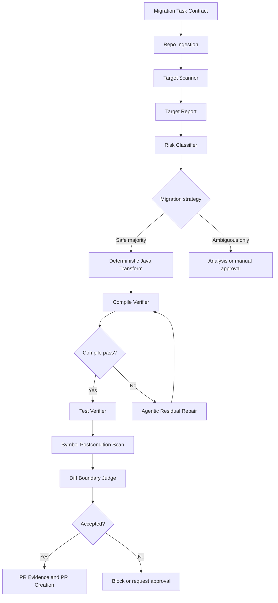
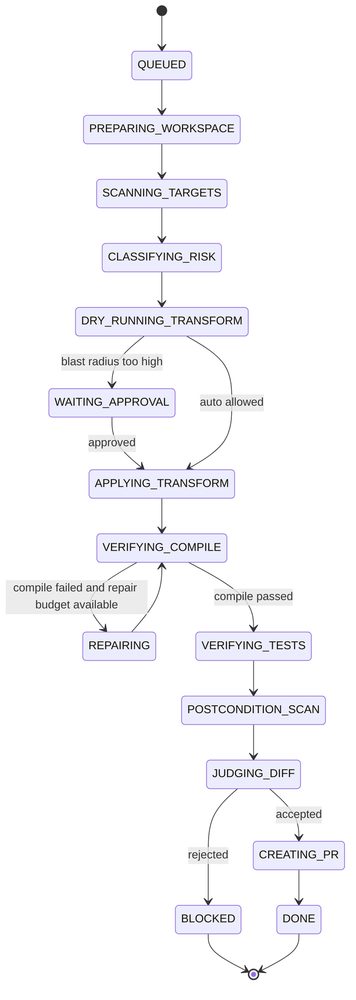

------
title: Learn AI Coding Agent From Scratch - Part 042
description: Case study production-grade untuk Java API migration menggunakan Honk-like AI coding agent, dari task contract, target scan, deterministic transform, agentic repair, verifier, judge, hingga PR evidence.
series: learn-ai-coding-agent
seriesTitle: Learn AI Coding Agent From Scratch
order: 42
partTitle: Java Case Study API Migration
slug: java-case-study-api-migration
tags:
  - ai-coding-agent
  - java
  - api-migration
  - refactoring
  - openrewrite
  - maven
  - verifier
  - pull-request
date: 2026-07-03
---

# Part 042 — Java Case Study: API Migration

Sekarang kita terapkan mental model dari Part 041 ke sebuah case study Java yang production-like. Target kita bukan membuat demo kecil yang hanya mengganti nama method. Target kita adalah membangun alur yang bisa dipakai oleh Honk-like AI coding agent untuk melakukan **API migration otomatis** dengan batas yang jelas, evidence yang kuat, verifier, judge, dan PR yang bisa direview.

Kita akan memakai contoh API internal supaya tidak bergantung pada framework tertentu:

```txt
Legacy API:
  LegacyUserClient.fetchUser(String userId): UserDto

New API:
  UserGateway.getUser(UserId userId): UserProfile
```

Migrasi ini sengaja tidak 1:1 sempurna. Ada perubahan:

- receiver type berubah,
- argument type berubah dari `String` ke value object `UserId`,
- return type berubah dari `UserDto` ke `UserProfile`,
- beberapa call site hanya membaca field sederhana,
- beberapa call site meneruskan DTO ke method lain,
- beberapa test harus diperbaiki,
- beberapa area harus diskip karena ambiguous.

Ini mirip real migration: sebagian mekanis, sebagian butuh reasoning lokal.

---

## 1. Goal pembelajaran

Setelah part ini, kita ingin bisa membangun pipeline berikut:

```txt
Task Contract
  -> Repository Ingestion
  -> Target Scan
  -> Risk Classification
  -> Deterministic Transform
  -> Compile Verification
  -> Agentic Residual Repair
  -> Test Verification
  -> Diff Boundary Judge
  -> PR Evidence
```

Kita akan lihat:

- bagaimana mendesain migration contract,
- bagaimana menemukan target dengan aman,
- bagaimana membedakan safe target dan ambiguous target,
- bagaimana membuat deterministic transform untuk mayoritas perubahan,
- bagaimana memberi ruang agentic repair tanpa membuka scope terlalu besar,
- bagaimana menulis verifier dan judge,
- bagaimana menghasilkan PR yang dipercaya reviewer.

---

## 2. Starting point: contoh kode legacy

Misalkan repo punya kode seperti ini.

```java
package com.acme.order;

import com.acme.legacy.LegacyUserClient;
import com.acme.legacy.UserDto;

public class OrderService {
    private final LegacyUserClient userClient;
    private final OrderRepository orderRepository;

    public OrderService(LegacyUserClient userClient, OrderRepository orderRepository) {
        this.userClient = userClient;
        this.orderRepository = orderRepository;
    }

    public OrderSummary getOrderSummary(String orderId, String userId) {
        UserDto user = userClient.fetchUser(userId);
        Order order = orderRepository.findById(orderId);

        return new OrderSummary(
            order.id(),
            user.getDisplayName(),
            user.getEmail()
        );
    }
}
```

API baru:

```java
package com.acme.user;

public interface UserGateway {
    UserProfile getUser(UserId userId);
}
```

```java
package com.acme.user;

public record UserId(String value) {
    public static UserId of(String value) {
        if (value == null || value.isBlank()) {
            throw new IllegalArgumentException("userId must not be blank");
        }
        return new UserId(value);
    }
}
```

```java
package com.acme.user;

public record UserProfile(
    UserId id,
    String displayName,
    String emailAddress
) {}
```

Desired result untuk happy path:

```java
package com.acme.order;

import com.acme.user.UserGateway;
import com.acme.user.UserId;
import com.acme.user.UserProfile;

public class OrderService {
    private final UserGateway userGateway;
    private final OrderRepository orderRepository;

    public OrderService(UserGateway userGateway, OrderRepository orderRepository) {
        this.userGateway = userGateway;
        this.orderRepository = orderRepository;
    }

    public OrderSummary getOrderSummary(String orderId, String userId) {
        UserProfile user = userGateway.getUser(UserId.of(userId));
        Order order = orderRepository.findById(orderId);

        return new OrderSummary(
            order.id(),
            user.displayName(),
            user.emailAddress()
        );
    }
}
```

Perhatikan migrasi ini bukan sekadar rename. Kita mengubah:

- field type,
- constructor parameter,
- method call,
- argument wrapping,
- return type,
- accessor method.

Sebagian bisa deterministic, tetapi tidak semuanya aman bila digeneralisasi secara buta.

---

## 3. Task contract

Kita mulai dari task contract. Jangan mulai dari prompt bebas.

```yaml
id: migrate-legacy-user-client-to-user-gateway
kind: java-api-migration
riskClass: medium
objective: >
  Replace usage of LegacyUserClient.fetchUser(String) with UserGateway.getUser(UserId)
  where the mapping is clear and verifiable.
legacyApi:
  ownerType: com.acme.legacy.LegacyUserClient
  method: fetchUser
  parameters:
    - java.lang.String
  returnType: com.acme.legacy.UserDto
newApi:
  ownerType: com.acme.user.UserGateway
  method: getUser
  parameters:
    - com.acme.user.UserId
  returnType: com.acme.user.UserProfile
argumentMapping:
  - from: "$0"
    to: "UserId.of($0)"
returnMapping:
  getDisplayName(): "displayName()"
  getEmail(): "emailAddress()"
scope:
  include:
    - "src/main/java/**/*.java"
    - "src/test/java/**/*.java"
  exclude:
    - "**/generated/**"
    - "**/target/**"
    - "**/build/**"
policy:
  maxChangedFilesWithoutApproval: 25
  maxRepairCycles: 3
  allowDependencyChange: false
  allowPublicApiChange: false
verification:
  commands:
    - "mvn -q -DskipTests compile"
    - "mvn -q test"
postconditions:
  - no_reference_to_legacy_fetch_user
  - compile_passes
  - tests_pass
```

Contract ini sengaja explicit. Ia memberi agent boundary.

---

## 4. Pipeline keseluruhan



Pipeline ini mengandung prinsip dari part sebelumnya:

```txt
deterministic first -> verifier -> agentic repair -> judge -> PR
```

---

## 5. Repository fixture

Untuk membangun agent from scratch, kita butuh fixture realistis.

```txt
examples/java-api-migration/
  pom.xml
  src/main/java/com/acme/legacy/
    LegacyUserClient.java
    UserDto.java
  src/main/java/com/acme/user/
    UserGateway.java
    UserId.java
    UserProfile.java
  src/main/java/com/acme/order/
    OrderService.java
    OrderSummary.java
    OrderRepository.java
  src/main/java/com/acme/billing/
    BillingService.java
  src/test/java/com/acme/order/
    OrderServiceTest.java
  src/test/java/com/acme/billing/
    BillingServiceTest.java
```

Fixture harus berisi beberapa variasi:

1. happy path,
2. overloaded method dengan nama sama,
3. local variable bernama `fetchUser` tetapi bukan target,
4. static import unrelated,
5. method chain,
6. test mock,
7. ambiguous unresolved symbol,
8. file generated yang harus diskip.

Jangan pakai fixture terlalu steril. Agent yang bagus harus diuji dengan repo yang “sedikit kotor”.

---

## 6. Target scanner

Scanner bertugas menemukan call site lama.

Scanner output:

```json
{
  "migrationId": "migrate-legacy-user-client-to-user-gateway",
  "targets": [
    {
      "id": "target_001",
      "file": "src/main/java/com/acme/order/OrderService.java",
      "line": 17,
      "kind": "METHOD_INVOCATION",
      "expression": "userClient.fetchUser(userId)",
      "resolvedOwnerType": "com.acme.legacy.LegacyUserClient",
      "resolvedMethod": "fetchUser(java.lang.String)",
      "confidence": "HIGH",
      "safeForDeterministicTransform": true
    }
  ],
  "skipped": [
    {
      "file": "src/main/java/com/acme/demo/DemoService.java",
      "line": 31,
      "expression": "client.fetchUser(id)",
      "confidence": "LOW",
      "reason": "receiver type unresolved"
    }
  ]
}
```

Scanner harus memisahkan:

- `HIGH` confidence target,
- `MEDIUM` confidence candidate,
- `LOW` confidence ambiguous,
- skipped target.

Rule:

> Transformer hanya boleh mengubah target `HIGH` confidence kecuali ada approval atau verifier khusus.

---

## 7. Scanner implementation mental model

Minimal scanner bisa mulai dari lexical search:

```txt
rg "fetchUser\s*\(" src/main/java src/test/java
```

Tetapi lexical search hanya candidate discovery. Setelah itu perlu AST/symbol validation.

Pseudo-flow:

```java
List<Candidate> lexicalCandidates = ripgrep("fetchUser\\s*\\(");

for (Candidate candidate : lexicalCandidates) {
    CompilationUnit ast = parseJava(candidate.file());
    MethodCallExpr call = findCallAtLine(ast, candidate.line());

    Optional<ResolvedMethod> resolved = symbolSolver.resolve(call);

    if (resolved.matches("com.acme.legacy.LegacyUserClient", "fetchUser", "java.lang.String")) {
        targets.add(highConfidenceTarget(call));
    } else if (resolved.isEmpty()) {
        skipped.add(unresolvedCandidate(call));
    } else {
        skipped.add(nonTargetSameName(call, resolved.get()));
    }
}
```

Dalam production, kita bisa memakai OpenRewrite, Spoon, JavaParser, compiler API, atau LSP. Yang penting bukan tool-nya, tetapi invariant: **jangan ubah target yang tidak terbukti target**.

---

## 8. Risk classification per target

Tidak semua target sama risikonya.

| Target pattern | Risk | Strategy |
|---|---:|---|
| Direct assignment `UserDto u = client.fetchUser(id)` | Low | deterministic |
| Direct field access/accessor `u.getEmail()` | Low-medium | deterministic mapping |
| Method argument `send(client.fetchUser(id))` | Medium | deterministic if expected type clear |
| Return statement `return client.fetchUser(id)` | Medium-high | may change public method return type, likely block |
| Generic container `List<UserDto>` | Medium-high | agentic/human review |
| Serialization boundary | High | human approval |
| Public API DTO response | High | blocked unless explicit contract |
| Auth/security/payment path | High | require approval |

Risk classifier harus melihat:

- file path,
- package criticality,
- public API surface,
- method visibility,
- test coverage,
- changed type escaping method boundary,
- downstream call graph.

---

## 9. Deterministic transform: happy path

Transform happy path:

Before:

```java
UserDto user = userClient.fetchUser(userId);
return user.getEmail();
```

After:

```java
UserProfile user = userGateway.getUser(UserId.of(userId));
return user.emailAddress();
```

Rules:

1. `LegacyUserClient` field becomes `UserGateway` field.
2. Constructor parameter type changes.
3. Variable type `UserDto` becomes `UserProfile` only when initialized from migrated call.
4. Method invocation changes.
5. `String` argument wrapped in `UserId.of(...)`.
6. Accessor mapping changes:
   - `getDisplayName()` -> `displayName()`
   - `getEmail()` -> `emailAddress()`
7. Imports updated.
8. Unused legacy imports removed.

This is codemod-friendly.

---

## 10. Deterministic transform is not allowed to infer business behavior

Suppose legacy DTO has:

```java
user.getStatus().equals("ACTIVE")
```

New API has:

```java
user.accountStatus().isActive()
```

This might be mappable, but only if contract explicitly defines it. Otherwise deterministic transform must skip or flag.

Good skipped target:

```json
{
  "file": "src/main/java/com/acme/billing/BillingService.java",
  "line": 44,
  "reason": "Legacy return value participates in status mapping not defined by migration contract",
  "recommendedAction": "agentic_repair_or_manual_mapping_required"
}
```

This is how trust is preserved.

---

## 11. Before/after example with field injection

Before:

```java
public class BillingService {
    private final LegacyUserClient userClient;
    private final InvoiceRepository invoiceRepository;

    public BillingService(LegacyUserClient userClient, InvoiceRepository invoiceRepository) {
        this.userClient = userClient;
        this.invoiceRepository = invoiceRepository;
    }

    public InvoiceView getInvoice(String invoiceId, String userId) {
        UserDto user = userClient.fetchUser(userId);
        Invoice invoice = invoiceRepository.findById(invoiceId);
        return new InvoiceView(invoice.id(), user.getDisplayName(), user.getEmail());
    }
}
```

After:

```java
public class BillingService {
    private final UserGateway userGateway;
    private final InvoiceRepository invoiceRepository;

    public BillingService(UserGateway userGateway, InvoiceRepository invoiceRepository) {
        this.userGateway = userGateway;
        this.invoiceRepository = invoiceRepository;
    }

    public InvoiceView getInvoice(String invoiceId, String userId) {
        UserProfile user = userGateway.getUser(UserId.of(userId));
        Invoice invoice = invoiceRepository.findById(invoiceId);
        return new InvoiceView(invoice.id(), user.displayName(), user.emailAddress());
    }
}
```

This can be deterministic if:

- field is only used for target API,
- constructor parameter corresponds to field,
- all accessors have explicit mapping,
- new dependency injection binding exists or compile repair can add it.

---

## 12. Where deterministic transform should stop

Case:

```java
public UserDto getUserForExport(String userId) {
    return userClient.fetchUser(userId);
}
```

Naively changing return type to `UserProfile` is a public API change if method is public and used externally.

Policy should say:

```json
{
  "target": "ExportService.getUserForExport",
  "action": "SKIP",
  "reason": "Migrating this call would change public method return type from UserDto to UserProfile",
  "requires": "explicit public API migration contract"
}
```

Agent must not “helpfully” change public API unless the task says so.

---

## 13. OpenRewrite-like recipe skeleton

Kita tidak perlu mengimplementasikan full OpenRewrite di sini, tetapi recipe mental model-nya berguna.

Pseudo-code:

```java
public final class MigrateLegacyUserClientRecipe extends Recipe {
    @Override
    public String getDisplayName() {
        return "Migrate LegacyUserClient.fetchUser to UserGateway.getUser";
    }

    @Override
    public TreeVisitor<?, ExecutionContext> getVisitor() {
        return new JavaIsoVisitor<ExecutionContext>() {
            @Override
            public J.MethodInvocation visitMethodInvocation(J.MethodInvocation method, ExecutionContext ctx) {
                J.MethodInvocation m = super.visitMethodInvocation(method, ctx);

                if (!isLegacyFetchUser(m)) {
                    return m;
                }

                Expression arg = m.getArguments().get(0);

                return buildMethodInvocation(
                    "userGateway.getUser(UserId.of(" + print(arg) + "))"
                ).withPrefix(m.getPrefix());
            }
        };
    }
}
```

Production implementation harus lebih kuat dari string builder:

- preserve formatting,
- update imports,
- resolve symbol,
- handle receiver rename,
- track variable type,
- update accessor calls,
- emit report.

---

## 14. Simpler transformer for our from-scratch platform

Untuk seri ini, kita bisa mulai dengan transformer yang lebih sederhana:

```java
public interface JavaMigrationRule {
    ScanReport scan(Path workspace);
    DryRunReport dryRun(Path workspace, ScanReport scanReport);
    ApplyReport apply(Path workspace, ScanReport scanReport);
}
```

Rule implementation:

```java
public final class LegacyUserClientMigrationRule implements JavaMigrationRule {
    @Override
    public ScanReport scan(Path workspace) {
        // 1. lexical search fetchUser(
        // 2. parse Java files
        // 3. classify high-confidence vs skipped target
        // 4. return scan report
    }

    @Override
    public DryRunReport dryRun(Path workspace, ScanReport scanReport) {
        // 1. compute candidate edits
        // 2. estimate diff stats
        // 3. validate boundary
        // 4. do not mutate files
    }

    @Override
    public ApplyReport apply(Path workspace, ScanReport scanReport) {
        // 1. apply approved edits
        // 2. update imports
        // 3. write files atomically
        // 4. return applied edit report
    }
}
```

Kita bisa membangun minimal viable transformer dahulu, lalu mengganti engine di belakangnya dengan OpenRewrite/Spoon/JavaParser lebih matang.

---

## 15. Import and dependency handling

Migrasi API sering gagal karena import.

Before imports:

```java
import com.acme.legacy.LegacyUserClient;
import com.acme.legacy.UserDto;
```

After imports:

```java
import com.acme.user.UserGateway;
import com.acme.user.UserId;
import com.acme.user.UserProfile;
```

Rule:

- remove legacy imports only if no references remain,
- add new imports only if used,
- do not reorder manually if formatter/import optimizer will handle it,
- do not add wildcard import,
- detect naming collision.

Naming collision example:

```java
import com.other.UserProfile;
```

If `com.acme.user.UserProfile` conflicts, transformer should either:

- use fully qualified name, or
- skip and let agentic repair handle with compile evidence, or
- require manual approval depending policy.

---

## 16. Constructor injection migration

Changing field type creates constructor changes.

Before:

```java
private final LegacyUserClient userClient;

public OrderService(LegacyUserClient userClient, OrderRepository orderRepository) {
    this.userClient = userClient;
    this.orderRepository = orderRepository;
}
```

After:

```java
private final UserGateway userGateway;

public OrderService(UserGateway userGateway, OrderRepository orderRepository) {
    this.userGateway = userGateway;
    this.orderRepository = orderRepository;
}
```

This is safe only if:

- field has single responsibility,
- field is only used for migrated call,
- constructor assignment is simple,
- no framework annotation depends on old type,
- DI container has bean/provider for new type.

If the field has mixed usage:

```java
userClient.fetchUser(userId);
userClient.updateUser(userDto);
```

Do not replace the field entirely. Better create side-by-side injection:

```java
private final LegacyUserClient userClient;
private final UserGateway userGateway;
```

This is a perfect example of hybrid repair. Deterministic rule can migrate call site but may need agentic reasoning to decide field strategy.

---

## 17. Accessor mapping

Legacy DTO:

```java
public class UserDto {
    public String getDisplayName() { ... }
    public String getEmail() { ... }
}
```

New record:

```java
public record UserProfile(String displayName, String emailAddress) {}
```

Mapping:

```yaml
returnMapping:
  getDisplayName(): displayName()
  getEmail(): emailAddress()
```

Transformer can rewrite:

```java
user.getDisplayName()
```

to:

```java
user.displayName()
```

But only when `user` variable is known to be migrated from `UserDto` to `UserProfile`. Do not rewrite every `getEmail()` in the file.

---

## 18. Compile verifier

After deterministic transform, run:

```bash
mvn -q -DskipTests compile
```

Verifier parses result into structured error.

Example compile error:

```json
{
  "command": "mvn -q -DskipTests compile",
  "status": "FAILED",
  "errors": [
    {
      "file": "src/main/java/com/acme/order/OrderService.java",
      "line": 12,
      "kind": "CANNOT_FIND_SYMBOL",
      "symbol": "class UserGateway",
      "probableCause": "missing import"
    }
  ]
}
```

This structured error is safe input for agentic repair.

---

## 19. Agentic residual repair

Agentic repair prompt should be narrow.

Bad prompt:

```txt
Fix the migration.
```

Good prompt:

```txt
You are repairing compile errors after deterministic API migration.
Do not change migration scope.
Do not modify files outside the listed files.
Use only the compile errors and migration contract as evidence.
Allowed files:
- src/main/java/com/acme/order/OrderService.java
- src/test/java/com/acme/order/OrderServiceTest.java

Compile errors:
- OrderService.java: cannot find symbol UserGateway
- OrderServiceTest.java: constructor OrderService expects UserGateway but test passes LegacyUserClient

Migration contract:
- LegacyUserClient.fetchUser(String) -> UserGateway.getUser(UserId)
- UserDto.getEmail() -> UserProfile.emailAddress()
- UserDto.getDisplayName() -> UserProfile.displayName()
```

Agentic repair should be limited to:

- missing import,
- test mock update,
- constructor injection update,
- accessor update missed by recipe,
- variable type correction.

It should not:

- change CI,
- skip tests,
- delete tests,
- introduce dependency unless allowed,
- change public API unless contract allows.

---

## 20. Test repair example

Before test:

```java
class OrderServiceTest {
    private final LegacyUserClient userClient = mock(LegacyUserClient.class);
    private final OrderRepository orderRepository = mock(OrderRepository.class);

    @Test
    void returnsOrderSummary() {
        when(userClient.fetchUser("u-1"))
            .thenReturn(new UserDto("User One", "u1@example.com"));

        OrderService service = new OrderService(userClient, orderRepository);

        OrderSummary summary = service.getOrderSummary("o-1", "u-1");

        assertEquals("User One", summary.displayName());
        assertEquals("u1@example.com", summary.email());
    }
}
```

After repair:

```java
class OrderServiceTest {
    private final UserGateway userGateway = mock(UserGateway.class);
    private final OrderRepository orderRepository = mock(OrderRepository.class);

    @Test
    void returnsOrderSummary() {
        when(userGateway.getUser(UserId.of("u-1")))
            .thenReturn(new UserProfile(UserId.of("u-1"), "User One", "u1@example.com"));

        OrderService service = new OrderService(userGateway, orderRepository);

        OrderSummary summary = service.getOrderSummary("o-1", "u-1");

        assertEquals("User One", summary.displayName());
        assertEquals("u1@example.com", summary.email());
    }
}
```

This repair is reasonable if verifier confirms tests pass.

Potential issue: `UserId.of("u-1")` creates a new record with value equality, so Mockito matching works if `UserId` is a record. If `UserId` did not implement equality correctly, the repair should use `eq(UserId.of("u-1"))` or argument matcher. This is why compile is not enough; tests matter.

---

## 21. Postcondition scan

After compile/test pass, run postcondition scan.

Postconditions:

```yaml
- no method invocation resolved to com.acme.legacy.LegacyUserClient#fetchUser(java.lang.String)
- no import com.acme.legacy.UserDto in changed files unless justified
- no forbidden path changed
- no generated file changed
- no public method return type changed unless approved
```

Example output:

```json
{
  "postconditions": [
    {
      "name": "no_legacy_fetch_user_reference",
      "status": "PASSED",
      "matches": 0
    },
    {
      "name": "no_forbidden_path_changed",
      "status": "PASSED"
    },
    {
      "name": "public_api_not_changed",
      "status": "WARNING",
      "details": "One package-private method return type changed; no public methods changed."
    }
  ]
}
```

---

## 22. Diff boundary judge

Judge prompt should be evidence-heavy.

Inputs:

- task contract,
- transform report,
- verification report,
- diff stat,
- changed file list,
- skipped target report,
- final diff.

Judge questions:

1. Does the diff implement only the requested migration?
2. Did the agent alter unrelated behavior?
3. Are skipped targets explained?
4. Were tests updated only where necessary?
5. Did the patch delete or weaken tests?
6. Is manual approval required based on policy?

Example verdict:

```json
{
  "verdict": "ACCEPT",
  "confidence": "HIGH",
  "summary": "The diff replaces LegacyUserClient.fetchUser usages in OrderService and BillingService with UserGateway.getUser(UserId). Tests were updated to mock UserGateway. Compile and tests passed. No forbidden paths changed.",
  "riskNotes": [
    "One ambiguous call site was skipped because receiver type could not be resolved."
  ],
  "requiredHumanAttention": [
    "Review skipped target in DemoService if migration coverage must be complete."
  ]
}
```

---

## 23. PR body generated from evidence

A good PR body is not marketing text. It is an evidence artifact.

```md
## Summary

Migrates high-confidence usages of `LegacyUserClient.fetchUser(String)` to `UserGateway.getUser(UserId)`.

## What changed

- Replaced constructor-injected `LegacyUserClient` with `UserGateway` where the legacy field was only used for `fetchUser`.
- Wrapped string user IDs with `UserId.of(...)`.
- Replaced `UserDto` usage with `UserProfile` at migrated call sites.
- Replaced known accessor mappings:
  - `getDisplayName()` -> `displayName()`
  - `getEmail()` -> `emailAddress()`
- Updated affected unit tests to mock `UserGateway`.

## Verification

- `mvn -q -DskipTests compile` passed.
- `mvn -q test` passed.
- Postcondition scan found 0 high-confidence references to `LegacyUserClient.fetchUser(String)` in migrated scope.

## Skipped targets

- `src/main/java/com/acme/demo/DemoService.java:31` was skipped because the receiver type could not be resolved.

## Risk notes

- No public API return type was changed.
- No generated files were modified.
- No dependency changes were made.
```

This PR body helps human reviewers trust the agent.

---

## 24. Handling ambiguous call sites

Ambiguous code:

```java
public Object load(Object client, String id) {
    return client.fetchUser(id);
}
```

This may not even compile depending type, but dynamic/legacy patterns exist.

Policy:

- Do not transform if receiver type unresolved.
- Report it.
- Optionally let agent propose manual migration in separate PR.

This prevents dangerous false positives.

---

## 25. Handling overloaded methods

Legacy API:

```java
UserDto fetchUser(String userId);
UserDto fetchUser(UUID userId);
```

Task only says `fetchUser(String)`.

Transformer must not migrate `fetchUser(UUID)` unless contract defines mapping.

Skipped report:

```json
{
  "file": "src/main/java/com/acme/report/ReportService.java",
  "line": 28,
  "reason": "Method name matched but parameter type was java.util.UUID, not java.lang.String"
}
```

---

## 26. Handling method chain

Before:

```java
String email = userClient.fetchUser(userId).getEmail();
```

After:

```java
String email = userGateway.getUser(UserId.of(userId)).emailAddress();
```

This is deterministic if accessor mapping exists.

But if chain is longer:

```java
String domain = userClient.fetchUser(userId).getEmail().split("@")[1];
```

Still possible, but risk slightly higher. The transformer should preserve expression structure and only replace known subexpressions.

---

## 27. Handling null behavior

Legacy API may allow null user ID. New `UserId.of` rejects blank/null.

This is semantic behavior change.

The migration contract must decide:

```yaml
nullBehavior:
  legacy: unknown
  new: reject_null
  allowedBehaviorChange: false
```

If behavior change is not allowed, target should be flagged when userId can be null.

Static null analysis may be hard. At minimum:

- if argument is literal `null`, skip,
- if argument is annotated `@Nullable`, skip or require approval,
- if code checks null before call, preserve behavior,
- if no evidence, mention residual risk.

Agent must not silently change null semantics.

---

## 28. Handling public API boundary

Before:

```java
public UserDto findUser(String userId) {
    return userClient.fetchUser(userId);
}
```

A deterministic transform might produce:

```java
public UserProfile findUser(String userId) {
    return userGateway.getUser(UserId.of(userId));
}
```

This may break downstream consumers.

Policy should classify:

```json
{
  "risk": "HIGH",
  "reason": "public method return type would change",
  "defaultAction": "SKIP"
}
```

Alternative adapter if contract allows preserving old return type:

```java
public UserDto findUser(String userId) {
    UserProfile profile = userGateway.getUser(UserId.of(userId));
    return new UserDto(profile.displayName(), profile.emailAddress());
}
```

But adapter creation is behavior/design decision. It should be explicit in contract.

---

## 29. Handling dependency injection wiring

If project uses Spring-like DI, changing constructor type may require bean availability. If `UserGateway` bean already exists, compile/test may pass. If not, compile might still pass but runtime boot fails.

Add verifier:

```bash
mvn -q -DskipTests compile
mvn -q test
mvn -q -DskipITs=false verify
```

Or targeted app context test if available.

If no runtime verifier exists, PR body must disclose:

```md
Runtime DI wiring was not verified because no application context test or integration verifier is configured for this module.
```

This honesty is essential.

---

## 30. Agent permission profile for this case

```yaml
permissionProfile: java-api-migration-medium
read:
  - "src/main/java/**"
  - "src/test/java/**"
  - "pom.xml"
write:
  - "src/main/java/**"
  - "src/test/java/**"
execute:
  allowed:
    - "mvn -q -DskipTests compile"
    - "mvn -q test"
network:
  default: disabled
approvalRequired:
  - dependency_change
  - public_api_change
  - generated_file_change
  - files_changed_greater_than_25
blocked:
  - "git push"
  - "rm -rf"
  - "curl"
  - "mvn deploy"
```

Notice: network disabled by default. API migration should not need arbitrary network.

---

## 31. State machine for this migration run



This state machine gives observability and resume behavior.

---

## 32. Data artifacts produced

This one migration should produce:

```txt
artifacts/
  task-contract.yaml
  repository-report.json
  scan-report.json
  risk-report.json
  dry-run-diff.patch
  dry-run-report.json
  apply-report.json
  compile-report.json
  repair-trace.jsonl
  test-report.json
  postcondition-report.json
  judge-report.json
  pr-body.md
  final-diff.patch
```

If a PR reviewer asks “kenapa agent mengubah file ini?”, answer should be in artifacts.

---

## 33. Minimal implementation plan

### Step 1 — build fixture

Create example Maven project with legacy/new API.

### Step 2 — implement lexical scanner

Use `ripgrep` or Java file walker to find `fetchUser(`.

### Step 3 — implement AST validation

Start simple:

- parse Java file,
- find method invocations,
- inspect receiver variable,
- inspect field declaration type/import.

Later improve with symbol solver.

### Step 4 — implement deterministic patch

For controlled fixture:

- replace import,
- replace field type/name,
- replace constructor param,
- replace method invocation,
- replace accessor mapping.

### Step 5 — run compile verifier

Capture Maven output.

### Step 6 — agentic repair loop

Let agent fix only compile errors in changed files.

### Step 7 — run tests

Capture surefire output.

### Step 8 — postcondition scan

Search old symbol/import.

### Step 9 — judge

Use structured evidence.

### Step 10 — create PR artifact

Generate PR body and final diff.

---

## 34. Verifier profile

```yaml
id: java-maven-api-migration
commands:
  - name: compile
    argv: ["mvn", "-q", "-DskipTests", "compile"]
    timeoutSeconds: 180
    required: true
    parse: maven-compiler
  - name: tests
    argv: ["mvn", "-q", "test"]
    timeoutSeconds: 300
    required: true
    parse: surefire
  - name: postcondition-search
    tool: symbol-scan
    required: true
    rules:
      - noLegacyFetchUser
      - noForbiddenPathChanged
```

Verifier output must be machine-readable.

---

## 35. Judge profile

```yaml
id: diff-boundary-api-migration
inputs:
  - task-contract
  - scan-report
  - apply-report
  - verification-report
  - final-diff
checks:
  - objective-alignment
  - scope-boundary
  - no-public-api-change-without-approval
  - no-test-weakening
  - skipped-targets-explained
  - verification-sufficient
verdicts:
  - ACCEPT
  - NEEDS_APPROVAL
  - REJECT
```

Judge harus bisa reject walaupun tests pass jika diff overreach.

---

## 36. Example final judge reject

Diff includes:

```diff
- assertEquals("u1@example.com", summary.email());
+ // removed because migration changed email behavior
```

Tests may pass if assertion removed. Judge should reject:

```json
{
  "verdict": "REJECT",
  "reason": "The patch removed an assertion instead of preserving behavior. This weakens the test suite and is outside the migration contract.",
  "violations": ["test_weakening", "behavior_not_preserved"]
}
```

This is a core safety behavior.

---

## 37. Example final judge approval with note

```json
{
  "verdict": "ACCEPT",
  "confidence": "MEDIUM_HIGH",
  "summary": "The migration is scoped to LegacyUserClient.fetchUser call sites. Compile and tests pass. No public API return types changed.",
  "notes": [
    "One unresolved call site was skipped and documented.",
    "DI runtime boot was not separately verified."
  ],
  "recommendedPrLabels": ["api-migration", "agent-generated", "needs-owner-review"]
}
```

Acceptance does not mean zero risk. It means risk is bounded and disclosed.

---

## 38. Production pitfalls

### 38.1 Compile pass is not behavior pass

Compile only proves type correctness. It does not prove old behavior preserved.

### 38.2 Unit tests may be too shallow

If tests only assert non-null result, behavior regression can slip.

### 38.3 DTO mapping may hide semantic differences

`getEmail()` vs `emailAddress()` looks obvious, but maybe one is normalized and one is raw.

### 38.4 Public API changes leak blast radius

Changing return type in public methods can break other modules or clients.

### 38.5 DI wiring may fail at runtime

Compile does not always prove bean availability.

### 38.6 Generated files should not be edited directly

If generated sources reference legacy API, update generator/source schema instead.

### 38.7 Agent may “fix” by weakening tests

Always detect deleted/relaxed assertions.

---

## 39. How this maps to Honk-like background agent

A background coding agent working on API migration needs stronger controls than local manual coding.

Mapping:

| Honk-like capability | This case study implementation |
|---|---|
| Background task | migration task contract |
| Fleet-safe targeting | scan report and risk classifier |
| Code change automation | deterministic transform |
| Feedback loop | compile/test/postcondition verifier |
| Agentic reasoning | residual repair only |
| Judge | diff boundary review |
| PR workflow | evidence-rich PR body |
| Governance | approval policy and risk gates |
| Observability | artifacts and state machine |

This is exactly the kind of use case where coding agents can produce high leverage: repetitive migration with enough structure to verify.

---

## 40. What not to do

Do not build this as:

```txt
Prompt: Please migrate all LegacyUserClient usage to UserGateway.
Tool: full shell + full file write.
Verifier: run tests maybe.
PR: whatever diff comes out.
```

That is not a platform. That is a gambling loop.

Build it as:

```txt
contract -> scan -> classify -> deterministic transform -> verify -> scoped agentic repair -> judge -> PR evidence
```

---

## 41. Extension exercises

To make this part real, implement these exercises:

1. Add a second legacy method overload and prove transformer skips it.
2. Add generated source file and prove transformer refuses to edit it.
3. Add public method returning `UserDto` and prove migration blocks it.
4. Add test using Mockito and repair it with agentic compile feedback.
5. Add one ambiguous receiver type and include it in skipped target report.
6. Add a postcondition scan that fails if `LegacyUserClient.fetchUser` remains.
7. Add judge rule that rejects deleted assertions.
8. Add PR body generator from artifacts.

These exercises are more valuable than adding more LLM cleverness.

---

## 42. Ringkasan

API migration adalah sweet spot untuk Honk-like AI coding agent karena:

- target bisa ditemukan secara struktural,
- transform bisa deterministic untuk mayoritas perubahan,
- compile/test memberi feedback kuat,
- agentic repair berguna untuk edge case,
- PR evidence bisa dibuat jelas,
- perubahan bisa diulang lintas repo.

Formula yang harus diingat:

```txt
API migration production-grade = structural target scan + deterministic transform + verifier + scoped repair + judge + evidence PR
```

Kita tidak membangun agent agar terlihat pintar. Kita membangun agent agar perubahan kode bisa dipercaya.

---

## 43. Sumber faktual

- OpenRewrite documentation — https://docs.openrewrite.org/
- OpenRewrite recipes concept — https://docs.openrewrite.org/concepts-and-explanations/recipes
- Error Prone Refaster — https://errorprone.info/docs/refaster
- Spoon Java source analysis/transformation — https://spoon.gforge.inria.fr/
- JavaParser — https://javaparser.org/
- Maven Surefire Plugin — https://maven.apache.org/surefire/maven-surefire-plugin/
- Maven Compiler Plugin — https://maven.apache.org/plugins/maven-compiler-plugin/
- Git diff documentation — https://git-scm.com/docs/git-diff
- GitHub pull request review documentation — https://docs.github.com/en/pull-requests

---

## 44. Status seri

Part ini adalah **Part 042 dari 064**. Seri belum selesai.
