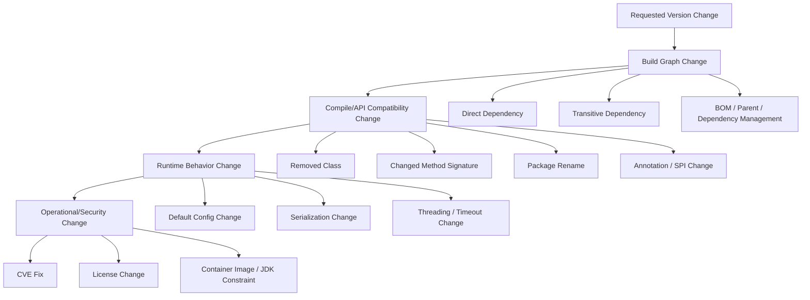
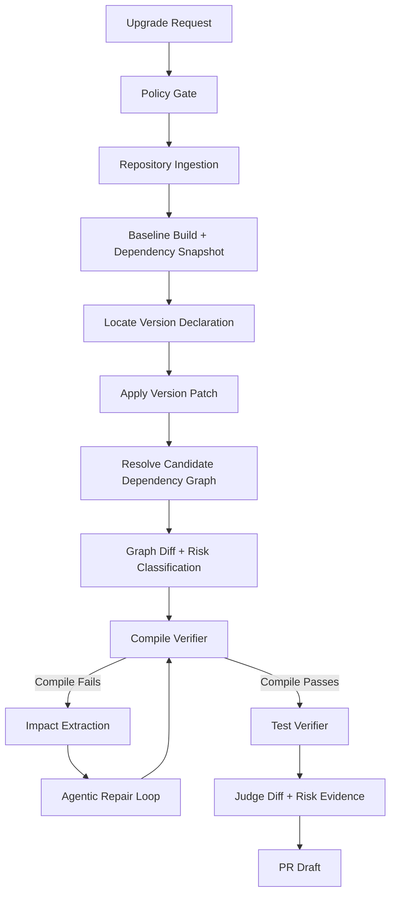
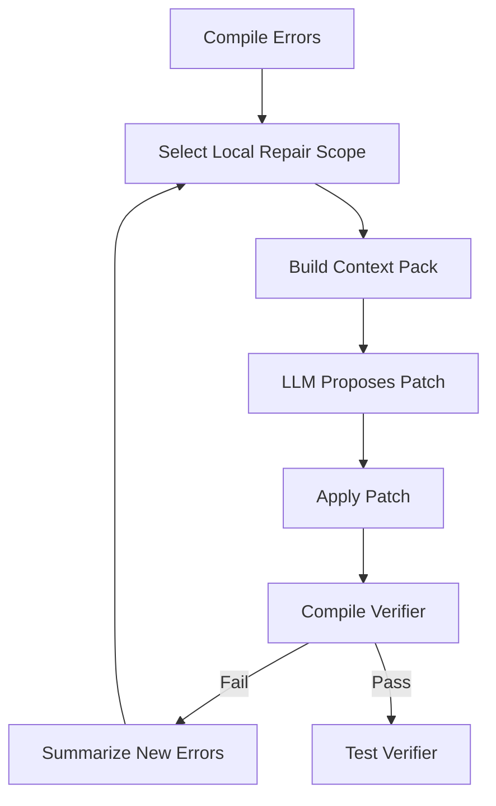

------
title: Learn AI Coding Agent From Scratch - Part 043
description: Case study production-grade untuk Maven dependency upgrade dengan breaking change menggunakan Honk-like AI coding agent, dari dependency graph, risk classification, patch strategy, verifier, agentic repair, hingga PR evidence.
series: learn-ai-coding-agent
seriesTitle: Learn AI Coding Agent From Scratch
order: 43
partTitle: Java Case Study Dependency Upgrade
slug: java-case-study-dependency-upgrade
tags:
  - ai-coding-agent
  - java
  - maven
  - dependency-upgrade
  - breaking-change
  - verifier
  - supply-chain
  - pull-request
date: 2026-07-04
---

# Part 043 — Java Case Study: Maven Dependency Upgrade dengan Breaking Change

Dependency upgrade terlihat sederhana dari luar: ubah angka versi, jalankan test, buat PR.

Untuk manusia senior, itu jelas tidak cukup. Untuk AI coding agent, itu bahkan berbahaya.

Dependency upgrade adalah **perubahan supply-chain + perubahan API + perubahan runtime behavior**. Kadang diff-nya hanya satu baris di `pom.xml`, tetapi dampaknya bisa masuk ke transitive dependency, classpath conflict, serialization behavior, security posture, startup behavior, memory footprint, dan compatibility dengan framework lain.

Di part ini kita membangun pipeline Honk-like untuk dependency upgrade Java/Maven yang production-grade. Bukan sekadar:

```xml
<version>1.2.3</version>
```

menjadi:

```xml
<version>2.0.0</version>
```

Target kita adalah agent yang bisa:

- memahami bagaimana dependency dinyatakan di Maven,
- membedakan direct dependency, transitive dependency, parent, property, BOM, dan dependency management,
- mengklasifikasikan risiko upgrade,
- menjalankan baseline verifier sebelum perubahan,
- membuat patch minimal,
- memperbaiki compile error akibat breaking change,
- tidak menyembunyikan risiko transitive dependency,
- menghasilkan PR evidence yang bisa dipercaya reviewer.

---

## 1. Mental model: dependency upgrade bukan “version bump”

Dependency upgrade memiliki empat layer dampak.



Agent yang hanya mengedit versi tidak sedang melakukan engineering. Ia hanya melakukan mutation.

Agent yang baik memperlakukan dependency upgrade sebagai **controlled graph transition**:

```txt
DependencyGraph(base) + UpgradeRequest + Policy
  -> DependencyGraph(candidate)
  -> GraphDiff
  -> SourceImpact
  -> VerificationReport
  -> RiskVerdict
  -> PR
```

Ingat invariant utama:

> Agent boleh mengubah dependency hanya jika perubahan graph, source impact, dan verification evidence dapat dijelaskan.

---

## 2. Scope case study

Kita gunakan contoh fiktif tetapi realistis:

```txt
Project:
  payment-orchestrator

Build:
  Maven multi-module
  Java 17
  JUnit 5
  Spring-like application, tetapi case study tidak bergantung pada Spring

Upgrade request:
  Upgrade com.acme:fraud-client from 1.8.7 to 2.1.0

Known breaking changes:
  - FraudClient.check(TransactionRequest) diganti menjadi FraudGateway.assess(FraudAssessmentRequest)
  - FraudResult.getScore() berubah dari int 0..100 menjadi RiskScore value object
  - FraudResult.isBlocked() diganti menjadi decision() == Decision.BLOCK
  - Timeout default berubah dari 500ms ke 2s
  - Package com.acme.fraud.client.* pindah ke com.acme.fraud.api.*
```

Ini bukan “toy rename”. Perubahan menyentuh:

- Maven metadata,
- import,
- object construction,
- return type handling,
- test fixture,
- default behavior,
- config.

Kita akan membangun pipeline agent untuk menyelesaikan upgrade ini secara bertahap.

---

## 3. Hal yang tidak boleh diasumsikan agent

AI coding agent sering gagal di dependency upgrade karena membuat asumsi yang kelihatan masuk akal tetapi salah.

| Asumsi lemah | Kenapa berbahaya |
|---|---|
| SemVer major pasti breaking, minor pasti aman | Banyak library tidak mematuhi SemVer sempurna. Bahkan patch release bisa mengubah behavior. |
| Compile hijau berarti aman | Runtime behavior, serialization, config default, dan transitive conflict bisa berubah. |
| Direct dependency adalah satu-satunya dependency yang penting | Transitive dependency dapat berubah dan memengaruhi classpath. |
| Release notes cukup | Release notes bisa tidak lengkap; verifier tetap wajib. |
| Test existing cukup | Test coverage mungkin tidak menyentuh affected path. |
| Agent boleh upgrade banyak dependency sekaligus | Blast radius membesar dan root cause sulit dibuktikan. |
| Jika dependency tree lebih baru, berarti lebih baik | Versi baru bisa membawa incompatibility, license change, atau vulnerability baru. |

Agent harus mulai dari sikap defensif:

```txt
Every dependency upgrade is guilty until verified.
```

---

## 4. Maven dependency resolution yang perlu dipahami agent

Kita tidak akan mengulang Maven basic. Kita hanya ambil bagian yang penting untuk agent.

Maven dapat menarik dependency transitif: dependency dari dependency juga masuk ke project. Maven juga memiliki mekanisme mediasi ketika ada beberapa versi artifact yang sama di graph. Karena itu, perubahan satu versi dapat mengubah banyak artifact di effective dependency graph.

Ada beberapa lokasi versi bisa berasal:

```txt
pom.xml direct dependency
pom.xml property
parent pom
imported BOM
<dependencyManagement>
plugin dependency
profile-specific dependency
module-specific dependency
```

Agent harus membedakan **where version is declared** dan **where dependency is used**.

Contoh:

```xml
<properties>
  <fraud-client.version>1.8.7</fraud-client.version>
</properties>

<dependencyManagement>
  <dependencies>
    <dependency>
      <groupId>com.acme</groupId>
      <artifactId>fraud-client</artifactId>
      <version>${fraud-client.version}</version>
    </dependency>
  </dependencies>
</dependencyManagement>

<dependencies>
  <dependency>
    <groupId>com.acme</groupId>
    <artifactId>fraud-client</artifactId>
  </dependency>
</dependencies>
```

Jika agent mengubah module-level dependency yang tidak punya `<version>`, patch-nya salah. Ia harus mengubah property atau BOM/parent yang benar.

---

## 5. Domain model untuk dependency upgrade

Tambahkan domain object khusus. Jangan menaruh semua ini sebagai string di prompt.

```java
public record DependencyCoordinate(
    String groupId,
    String artifactId,
    String version,
    String classifier,
    String type,
    String scope
) {}

public record UpgradeRequest(
    String repositoryId,
    String baseRef,
    DependencyCoordinate from,
    DependencyCoordinate to,
    UpgradeReason reason,
    UpgradeRiskMode riskMode,
    List<String> allowedModules,
    List<String> forbiddenPaths,
    VerificationProfile verificationProfile
) {}

public enum UpgradeReason {
    SECURITY_FIX,
    PLATFORM_STANDARDIZATION,
    FEATURE_REQUIRED,
    END_OF_LIFE,
    FRAMEWORK_MIGRATION,
    MANUAL_REQUEST
}

public enum UpgradeRiskMode {
    PATCH_ONLY,
    MINOR_ALLOWED,
    MAJOR_WITH_REPAIR,
    SECURITY_EMERGENCY,
    ANALYSIS_ONLY
}
```

Lalu graph-level artifact:

```java
public record DependencyGraphSnapshot(
    String repoId,
    String commitSha,
    String module,
    List<ResolvedDependency> resolvedDependencies,
    List<DependencyDeclaration> declarations,
    List<BomImport> bomImports,
    List<ParentPom> parents,
    String rawTreeArtifactUri
) {}

public record DependencyGraphDiff(
    DependencyGraphSnapshot before,
    DependencyGraphSnapshot after,
    List<DependencyVersionChange> versionChanges,
    List<ResolvedDependency> added,
    List<ResolvedDependency> removed,
    List<PotentialConflict> conflicts
) {}
```

Dan source impact:

```java
public record SourceImpactReport(
    List<SymbolReference> directApiReferences,
    List<CompilationError> compileErrorsAfterUpgrade,
    List<TestFailure> testFailuresAfterUpgrade,
    List<ConfigImpact> configImpacts,
    List<RiskNote> unresolvedRisks
) {}
```

Dengan model ini, agent tidak sekadar bilang “I upgraded dependency”. Agent bisa menjawab:

```txt
Dependency declaration changed at root pom property fraud-client.version.
Resolved graph changed in modules payment-core and payment-service.
17 source references were impacted.
13 repaired deterministically/agentically.
4 were skipped because they belong to forbidden module legacy-adapter.
Compile passed. Unit tests passed. Integration tests not run by policy.
```

---

## 6. Pipeline end-to-end



Perhatikan dua baseline:

1. **Baseline before change**: memastikan repo memang sehat sebelum agent bekerja.
2. **Candidate after change**: memastikan perubahan agent tidak merusak build.

Tanpa baseline, agent bisa dituduh merusak build yang sebenarnya sudah rusak dari awal.

---

## 7. Step 1 — Policy gate

Upgrade request harus dicek sebelum sandbox dibuat.

```yaml
policy:
  dependencyUpgrade:
    maxDirectDependenciesPerRun: 1
    allowMajorUpgradeWithoutApproval: false
    requireBaselineVerification: true
    requireDependencyGraphDiff: true
    requireLicenseScan: true
    requireVulnerabilityScan: true
    allowedScopes:
      - compile
      - runtime
      - test
    forbiddenArtifacts:
      - groupId: "javax.servlet"
        artifactId: "javax.servlet-api"
        reason: "managed by platform"
```

Policy gate menghasilkan keputusan:

```txt
APPROVED_FOR_ANALYSIS
APPROVED_FOR_PATCH
REQUIRES_APPROVAL
BLOCKED
```

Untuk major upgrade, default sehat adalah:

```txt
APPROVED_FOR_ANALYSIS -> human approval -> APPROVED_FOR_PATCH
```

Honk-like agent bisa sangat produktif, tetapi authority tetap harus jelas.

---

## 8. Step 2 — Baseline verifier

Sebelum versi diubah, jalankan baseline.

Minimal:

```bash
mvn -q -DskipTests compile
mvn -q test
mvn -q dependency:tree -DoutputFile=target/agent/dependency-tree-before.txt
```

Untuk multi-module besar, jangan selalu jalankan semua test secara buta. Gunakan profile.

```yaml
verificationProfile:
  baseline:
    commands:
      - name: compile-all
        argv: ["mvn", "-q", "-DskipTests", "compile"]
        timeoutSeconds: 900
      - name: unit-test-affected-later
        strategy: defer
      - name: dependency-tree
        argv: ["mvn", "-q", "dependency:tree", "-DoutputFile=target/agent/dependency-tree-before.txt"]
        timeoutSeconds: 300
```

Baseline report harus eksplisit:

```json
{
  "baselineStatus": "PASSED",
  "commitSha": "abc123",
  "commands": [
    { "name": "compile-all", "status": "PASSED", "durationMs": 412000 },
    { "name": "dependency-tree", "status": "PASSED", "artifact": "artifact://..." }
  ]
}
```

Jika baseline gagal, agent tidak boleh langsung memperbaiki semuanya. Ia harus mengklasifikasikan:

```txt
BASELINE_FAILED_UNRELATED
BASELINE_FAILED_RELATED_TO_TARGET
BASELINE_FAILED_INFRA
```

Untuk upgrade dependency, baseline gagal biasanya berarti run harus berhenti atau turun menjadi analysis-only.

---

## 9. Step 3 — Locate version declaration

Agent harus menemukan lokasi perubahan yang benar.

Urutan pencarian:

```txt
1. direct dependency version in module pom
2. property used by dependency version
3. dependencyManagement in parent/root pom
4. imported BOM version
5. parent POM version
6. profile-specific declaration
7. plugin dependency declaration
```

Representasikan hasilnya:

```json
{
  "coordinate": "com.acme:fraud-client",
  "effectiveVersion": "1.8.7",
  "declarationKind": "PROPERTY",
  "file": "pom.xml",
  "propertyName": "fraud-client.version",
  "currentValue": "1.8.7",
  "candidateValue": "2.1.0",
  "affectedModules": ["payment-core", "payment-service"]
}
```

Jangan edit XML dengan regex rapuh. Gunakan XML parser yang preserve formatting bila memungkinkan. Kalau harus patch teks, gunakan range spesifik dan verify hasilnya dengan Maven effective model.

Patch minimal:

```diff
diff --git a/pom.xml b/pom.xml
--- a/pom.xml
+++ b/pom.xml
@@ -18,7 +18,7 @@
   <properties>
     <java.version>17</java.version>
-    <fraud-client.version>1.8.7</fraud-client.version>
+    <fraud-client.version>2.1.0</fraud-client.version>
   </properties>
```

Setelah patch, jangan percaya file. Jalankan resolve.

---

## 10. Step 4 — Candidate dependency graph

Setelah versi berubah:

```bash
mvn -q -DskipTests compile dependency:tree -DoutputFile=target/agent/dependency-tree-after.txt
```

Graph diff harus menjawab:

```txt
Apa dependency langsung yang berubah?
Apa transitive dependency yang ikut berubah?
Apakah ada artifact baru?
Apakah ada artifact hilang?
Apakah ada versi turun/downgrade?
Apakah ada scope berubah?
Apakah ada duplicate class risk?
Apakah ada dependency conflict yang sebelumnya tidak ada?
```

Contoh report:

```json
{
  "directChange": {
    "coordinate": "com.acme:fraud-client",
    "from": "1.8.7",
    "to": "2.1.0"
  },
  "transitiveChanges": [
    {
      "coordinate": "com.acme:fraud-model",
      "from": "1.3.0",
      "to": "2.0.1",
      "risk": "MAJOR_VERSION_CHANGE"
    },
    {
      "coordinate": "com.fasterxml.jackson.core:jackson-databind",
      "from": "2.14.2",
      "to": "2.15.4",
      "risk": "MINOR_VERSION_CHANGE"
    }
  ],
  "removed": [],
  "added": [
    {
      "coordinate": "com.acme:fraud-spi:2.1.0",
      "scope": "compile"
    }
  ]
}
```

Graph diff adalah salah satu evidence paling penting di PR.

---

## 11. Step 5 — Risk classification

Agent menilai upgrade dari beberapa dimensi.

| Dimension | Signal | Risk |
|---|---|---|
| Version delta | `1.8.7 -> 2.1.0` | Major upgrade, high risk |
| Scope | compile/runtime | Higher than test-only |
| Transitive delta | major transitive changes | Higher risk |
| Source references | many call sites | Higher risk |
| Public API exposure | dependency types leak into public API | Higher risk |
| Runtime config change | timeout default changed | Higher risk |
| Security reason | CVE fix | May justify faster rollout |
| Test coverage | affected path untested | Higher risk |

Risk output:

```json
{
  "riskLevel": "HIGH",
  "reasons": [
    "Direct dependency major version upgrade",
    "Public API source references found",
    "Default timeout behavior changed",
    "Transitive major upgrade com.acme:fraud-model 1.x -> 2.x"
  ],
  "allowedMode": "SUPERVISED_PR",
  "requiresHumanReview": true
}
```

Risk classification tidak menghentikan agent secara otomatis. Ia menentukan **mode operasi**.

```txt
LOW       -> autonomous PR possible
MEDIUM    -> supervised PR, strict verifier
HIGH      -> draft PR, human review mandatory
CRITICAL  -> analysis-only unless explicit approval
```

---

## 12. Step 6 — Source impact scan

Setelah graph berubah atau sebelum compile repair, scan source.

Pakai kombinasi:

```txt
lexical search     -> cepat, recall tinggi
symbol index       -> import/type/method reference
compiler errors    -> authoritative untuk source incompatibility
test failure       -> behavioral signal
```

Query contoh:

```txt
com.acme.fraud.client
FraudClient
FraudResult
getScore(
isBlocked(
TransactionRequest
```

Report:

```json
{
  "directApiReferences": [
    {
      "file": "payment-core/src/main/java/acme/payment/FraudCheckService.java",
      "line": 17,
      "symbol": "FraudClient",
      "kind": "TYPE_REFERENCE"
    },
    {
      "file": "payment-core/src/main/java/acme/payment/FraudCheckService.java",
      "line": 44,
      "symbol": "FraudResult.isBlocked",
      "kind": "METHOD_CALL"
    }
  ],
  "testReferences": [
    {
      "file": "payment-core/src/test/java/acme/payment/FraudCheckServiceTest.java",
      "symbol": "FraudClient"
    }
  ]
}
```

Compiler errors kemudian menjadi repair queue.

---

## 13. Step 7 — Compile after version bump

Jalankan compile setelah versi berubah.

Error contoh:

```txt
[ERROR] FraudCheckService.java:[12,28] package com.acme.fraud.client does not exist
[ERROR] FraudCheckService.java:[21,19] cannot find symbol: class FraudClient
[ERROR] FraudCheckService.java:[44,21] cannot find symbol: method isBlocked()
[ERROR] FraudCheckService.java:[45,28] bad operand types for binary operator '>='
  first type:  RiskScore
  second type: int
```

Jangan kirim full log mentah ke model. Buat structured compile error.

```json
{
  "errors": [
    {
      "file": "payment-core/src/main/java/acme/payment/FraudCheckService.java",
      "line": 12,
      "type": "MISSING_PACKAGE",
      "message": "package com.acme.fraud.client does not exist",
      "likelyCause": "Package renamed in fraud-client 2.x"
    },
    {
      "file": "payment-core/src/main/java/acme/payment/FraudCheckService.java",
      "line": 44,
      "type": "MISSING_METHOD",
      "symbol": "FraudResult.isBlocked",
      "likelyReplacement": "FraudResult.decision() == Decision.BLOCK"
    }
  ]
}
```

Structured error membuat agent lebih presisi.

---

## 14. Step 8 — Migration knowledge

Agent butuh knowledge tentang breaking change. Ada beberapa sumber:

```txt
1. release notes/changelog
2. migration guide
3. generated compile errors
4. source code/javadoc dari dependency bila tersedia
5. examples/test fixtures
6. manually supplied prompt contract
```

Untuk platform internal, kita sebaiknya membuat migration contract eksplisit:

```yaml
migrationContract:
  dependency:
    groupId: com.acme
    artifactId: fraud-client
    fromRange: "[1.0.0,2.0.0)"
    toRange: "[2.0.0,3.0.0)"

  rules:
    - id: package-rename
      from: "com.acme.fraud.client"
      to: "com.acme.fraud.api"
      type: import-rewrite

    - id: client-type
      from: "FraudClient"
      to: "FraudGateway"
      type: type-rewrite
      notes: "Constructor/injection may differ by module. Prefer existing bean if available."

    - id: blocked-decision
      from: "result.isBlocked()"
      to: "result.decision() == Decision.BLOCK"
      type: expression-rewrite

    - id: risk-score
      from: "result.getScore() >= N"
      to: "result.score().value() >= N"
      type: expression-rewrite
      guard: "Only if value() returns same scale 0..100. Otherwise ask for review."

  configChanges:
    - from: "fraud.timeout-ms"
      to: "fraud.client.timeout-ms"
      defaultChanged:
        from: 500
        to: 2000
      policy: "Preserve old effective behavior unless task explicitly requests new default."
```

Ini membuat agent tidak perlu menebak.

---

## 15. Step 9 — Deterministic repair first

Sama seperti Part 041: jangan gunakan LLM untuk semua hal.

Deterministic rules:

```txt
import com.acme.fraud.client.* -> import com.acme.fraud.api.*
FraudResult.isBlocked()       -> FraudResult.decision() == Decision.BLOCK
result.getScore()             -> result.score().value() when context confirms 0..100
config fraud.timeout-ms       -> fraud.client.timeout-ms preserving value
```

Patch contoh:

```diff
-import com.acme.fraud.client.FraudClient;
-import com.acme.fraud.client.FraudResult;
+import com.acme.fraud.api.Decision;
+import com.acme.fraud.api.FraudGateway;
+import com.acme.fraud.api.FraudResult;

 public final class FraudCheckService {
-  private final FraudClient fraudClient;
+  private final FraudGateway fraudGateway;

-  public FraudCheckService(FraudClient fraudClient) {
-    this.fraudClient = fraudClient;
+  public FraudCheckService(FraudGateway fraudGateway) {
+    this.fraudGateway = fraudGateway;
   }

   public FraudDecision check(Transaction transaction) {
-    FraudResult result = fraudClient.check(toRequest(transaction));
-    if (result.isBlocked()) {
+    FraudResult result = fraudGateway.assess(toAssessmentRequest(transaction));
+    if (result.decision() == Decision.BLOCK) {
       return FraudDecision.blocked();
     }
-    if (result.getScore() >= 80) {
+    if (result.score().value() >= 80) {
       return FraudDecision.review();
     }
```

Jika constructor/injection berubah terlalu banyak, agentic repair boleh masuk.

---

## 16. Step 10 — Agentic residual repair

Agentic repair hanya diberi problem terlokalisasi.

Jangan beri instruksi:

```txt
Fix the build.
```

Itu terlalu luas.

Beri instruksi seperti:

```txt
Repair compile errors in payment-core/src/main/java/acme/payment/FraudCheckService.java caused by fraud-client 2.x migration.
Allowed files:
- payment-core/src/main/java/acme/payment/FraudCheckService.java
- payment-core/src/test/java/acme/payment/FraudCheckServiceTest.java
- payment-core/src/main/resources/application.yml

Migration rules:
- FraudClient -> FraudGateway
- FraudClient.check(TransactionRequest) -> FraudGateway.assess(FraudAssessmentRequest)
- FraudResult.isBlocked() -> FraudResult.decision() == Decision.BLOCK
- FraudResult.getScore() -> FraudResult.score().value() only if preserving 0..100 scale

Do not change unrelated payment behavior.
Do not relax tests.
Run compile verifier after patch.
```

Loop:



Bound repair iteration:

```yaml
agenticRepair:
  maxIterations: 4
  maxFilesPerIteration: 5
  maxAddedLines: 300
  forbiddenActions:
    - skip-tests
    - delete-tests
    - broad-formatting
    - change-public-api-without-approval
```

---

## 17. Step 11 — Test repair tanpa test laundering

Test sering gagal setelah dependency upgrade. Itu normal.

Yang tidak normal adalah agent memperbaiki test dengan cara menghilangkan assertion.

Contoh anti-pattern:

```diff
- assertEquals(FraudDecision.BLOCKED, decision);
+ assertNotNull(decision);
```

Itu test laundering.

Policy:

```yaml
testPolicy:
  disallowAssertionWeakening: true
  disallowTestDeletion: true
  disallowDisabledTests: true
  requireBehavioralEquivalenceNote: true
```

Test repair yang valid:

```diff
- when(fraudClient.check(any())).thenReturn(FraudResult.blocked(95));
+ when(fraudGateway.assess(any())).thenReturn(
+     FraudResult.of(Decision.BLOCK, RiskScore.of(95))
+ );

  FraudDecision decision = service.check(transaction);
  assertEquals(FraudDecision.BLOCKED, decision);
```

Verifier harus mencari sinyal buruk:

```txt
@Disabled baru
Assumption baru
assertTrue(true)
assertNotNull menggantikan assertion spesifik
penghapusan test file
perubahan threshold tanpa alasan
```

LLM-as-judge boleh membantu menilai test semantics, tetapi deterministic policy tetap wajib.

---

## 18. Step 12 — Runtime behavior guard

Compile/test passing tidak cukup jika dependency mengubah default behavior.

Dalam contoh kita:

```txt
fraud-client 1.x default timeout = 500ms
fraud-client 2.x default timeout = 2000ms
```

Jika target upgrade adalah security fix, mungkin kita ingin preserving behavior.

Patch config:

```diff
 fraud:
-  timeout-ms: 500
+  client:
+    timeout-ms: 500
```

PR evidence:

```md
Runtime behavior note:
- fraud-client 2.x changes default timeout from 500ms to 2000ms.
- This PR preserves the previous effective timeout by migrating config key `fraud.timeout-ms` to `fraud.client.timeout-ms` with value 500.
```

Agent harus membedakan:

```txt
API compatibility repair
Runtime behavior preservation
Intentional behavior adoption
Unknown behavior risk
```

Jika tidak tahu, tulis unknown risk. Jangan pura-pura aman.

---

## 19. Step 13 — Dependency graph judge

Buat judge khusus untuk dependency diff.

Input:

```txt
Upgrade request
Before dependency tree
After dependency tree
POM diff
Source diff
Verification report
```

Checks:

```txt
1. Apakah target dependency benar berubah ke versi yang diminta?
2. Apakah hanya satu direct dependency yang diubah?
3. Apakah transitive changes dijelaskan?
4. Apakah ada downgrade tidak disengaja?
5. Apakah ada artifact baru high-risk?
6. Apakah scope berubah?
7. Apakah dependency test-only bocor ke compile/runtime?
8. Apakah public API project sekarang mengekspos dependency baru?
```

Structured output:

```json
{
  "verdict": "PASS_WITH_NOTES",
  "notes": [
    "Target dependency upgraded correctly",
    "Transitive major upgrade com.acme:fraud-model included",
    "No dependency scope expansion detected",
    "Runtime timeout default preserved via config migration"
  ],
  "requiresHumanAttention": [
    "fraud-spi added as compile dependency; reviewer should confirm expected"
  ]
}
```

---

## 20. Step 14 — Diff boundary judge

Dependency upgrade PR harus kecil dan explainable.

Allowed files:

```txt
pom.xml
module pom.xml files
source files with direct API references
test files with direct API references
config files containing migrated config keys
migration evidence artifacts, if committed by policy
```

Suspicious files:

```txt
unrelated service classes
large formatting-only changes
generated code without generator command evidence
CI config unrelated to build failure
README mass rewrite
lock/config file with no explanation
```

Judge prompt:

```txt
Review whether this diff stays within the dependency upgrade boundary.
The task is upgrading com.acme:fraud-client 1.8.7 -> 2.1.0.
Allowed change types:
- Maven declaration/version update
- source repairs caused by fraud-client API changes
- test fixture updates caused by fraud-client API changes
- config key migration for fraud-client timeout
Reject if:
- unrelated business logic changed
- tests were weakened
- broad formatting hides semantic changes
- dependency scope expanded without explanation
Return structured verdict.
```

---

## 21. PR body template

PR yang baik tidak hanya berkata “updated dependency”.

```md
## Summary
Upgrades `com.acme:fraud-client` from `1.8.7` to `2.1.0`.

## Why
Requested dependency upgrade: SECURITY_FIX / PLATFORM_STANDARDIZATION.

## Dependency graph impact
- Direct dependency changed: `com.acme:fraud-client 1.8.7 -> 2.1.0`
- Transitive changes:
  - `com.acme:fraud-model 1.3.0 -> 2.0.1`
  - `com.acme:fraud-spi 2.1.0` added
- No dependency scope expansion detected.

## Source changes
- Migrated `FraudClient` usage to `FraudGateway`.
- Replaced `FraudResult.isBlocked()` with `decision() == Decision.BLOCK`.
- Replaced score access with `score().value()` where scale preservation was verified.
- Updated affected tests without weakening assertions.

## Runtime behavior
- Preserved previous effective timeout of 500ms by migrating config key.

## Verification
- Baseline compile before change: PASS
- Baseline dependency tree captured: PASS
- Compile after upgrade: PASS
- Unit tests affected modules: PASS
- Diff boundary judge: PASS_WITH_NOTES

## Reviewer notes
Please confirm that added transitive dependency `com.acme:fraud-spi` is expected for fraud-client 2.x.
```

Ini adalah evidence-oriented PR.

---

## 22. Implementation sketch: orchestrator

```java
public final class DependencyUpgradeOrchestrator {

  public RunResult run(UpgradeRequest request) {
    PolicyDecision policy = policyGate.evaluate(request);
    if (!policy.canAnalyze()) {
      return RunResult.blocked(policy.reason());
    }

    Workspace workspace = repositoryIngestion.prepare(request.repositoryId(), request.baseRef());

    VerificationReport baseline = verifier.runBaseline(workspace, request.verificationProfile());
    if (!baseline.passed()) {
      return RunResult.analysisOnly("Baseline failed", baseline);
    }

    DependencyGraphSnapshot before = dependencyAnalyzer.snapshot(workspace);
    VersionDeclaration declaration = dependencyAnalyzer.locateDeclaration(workspace, request.from());

    Patch versionPatch = pomEditor.updateVersion(declaration, request.to().version());
    patchService.apply(workspace, versionPatch);

    DependencyGraphSnapshot after = dependencyAnalyzer.snapshot(workspace);
    DependencyGraphDiff graphDiff = dependencyAnalyzer.diff(before, after);

    RiskAssessment risk = riskClassifier.classify(request, graphDiff);
    if (!policy.canPatch(risk)) {
      return RunResult.analysisOnly("Risk requires approval", graphDiff, risk);
    }

    RepairLoopResult repair = repairLoop.repairUntilCompilePasses(workspace, request, graphDiff);
    VerificationReport tests = verifier.runTests(workspace, request.verificationProfile());

    JudgeReport judge = judge.evaluate(workspace, request, graphDiff, repair, tests);

    if (!judge.allowsPr()) {
      return RunResult.failed("Judge rejected diff", judge);
    }

    PullRequestDraft pr = prBuilder.build(request, graphDiff, repair, tests, judge);
    return RunResult.prReady(pr);
  }
}
```

Perhatikan tidak ada `llm.fixEverything()`.

LLM hanya masuk pada repair loop yang scope-nya sudah dipersempit.

---

## 23. Failure model khusus dependency upgrade

| Failure | Penyebab | Guard |
|---|---|---|
| Wrong declaration edited | Versi berasal dari parent/BOM/property | Effective model + declaration locator |
| Build already broken | Tidak ada baseline | Baseline verifier wajib |
| Hidden transitive risk | Hanya lihat direct dependency | Graph snapshot before/after |
| Test laundering | Agent melemahkan assertion | Test diff policy + judge |
| Unrelated refactor | Agent memperbaiki build terlalu luas | Diff boundary |
| Runtime regression | Default config berubah | Migration guide + config impact scan |
| Dependency scope leak | Test dep jadi compile dep | Scope diff check |
| Version downgrade | Mediation berubah | Graph diff detects downgrade |
| PR unreviewable | Terlalu banyak dependency sekaligus | Max 1 direct dependency per run |
| Security theater | CVE fix tapi vulnerable transitive tetap reachable | Vulnerability scan + reachability note bila tersedia |

---

## 24. Strong invariant checklist

Sebelum PR dibuat, semua ini harus benar:

```txt
[ ] Baseline status diketahui.
[ ] Target dependency declaration ditemukan dengan provenance.
[ ] Patch versi minimal dan benar.
[ ] Dependency graph before/after tersimpan sebagai artifact.
[ ] Transitive changes diringkas.
[ ] Compile verifier pass setelah upgrade/repair.
[ ] Test verifier dijalankan sesuai profile.
[ ] Tidak ada test weakening yang terdeteksi.
[ ] Runtime config impact dinyatakan.
[ ] Diff boundary judge pass.
[ ] PR body menyebut unresolved risk.
```

Jika salah satu tidak terpenuhi, jangan buat PR sebagai “ready”. Turunkan menjadi draft atau analysis-only.

---

## 25. Apa yang harus dicatat ke database

Tambahkan artifact records:

```sql
create table dependency_upgrade_reports (
  id uuid primary key,
  run_id uuid not null,
  target_group_id text not null,
  target_artifact_id text not null,
  from_version text not null,
  to_version text not null,
  declaration_kind text not null,
  declaration_file text not null,
  before_tree_artifact_id uuid not null,
  after_tree_artifact_id uuid not null,
  graph_diff_artifact_id uuid not null,
  risk_level text not null,
  created_at timestamptz not null default now()
);
```

Dan audit event:

```json
{
  "eventType": "DependencyUpgradeGraphDiffCreated",
  "runId": "...",
  "target": "com.acme:fraud-client",
  "from": "1.8.7",
  "to": "2.1.0",
  "riskLevel": "HIGH",
  "directChanges": 1,
  "transitiveChanges": 12,
  "artifactUri": "artifact://runs/.../dependency-graph-diff.json"
}
```

Dependency upgrade adalah perubahan supply-chain. Audit-nya harus first-class.

---

## 26. Latihan implementasi

Untuk menguasai part ini, jangan langsung pakai repo besar.

Buat repo kecil dengan 3 module:

```txt
payment-parent
  payment-api
  payment-core
  payment-service
```

Buat library lokal versi 1 dan versi 2:

```txt
fraud-client-v1
fraud-client-v2
```

Publikasikan ke local Maven repository:

```bash
mvn install
```

Lalu buat agent task:

```yaml
task:
  type: DEPENDENCY_UPGRADE
  dependency: com.acme:fraud-client
  from: 1.8.7
  to: 2.1.0
  mode: MAJOR_WITH_REPAIR
```

Target kelulusan:

```txt
1. Agent mengubah versi di lokasi yang benar.
2. Agent menghasilkan dependency graph diff.
3. Agent memperbaiki compile error.
4. Agent tidak mengubah file unrelated.
5. Agent memperbarui test tanpa melemahkan assertion.
6. Agent menghasilkan PR body evidence-oriented.
```

---

## 27. Ringkasan

Dependency upgrade otomatis adalah salah satu use case terbaik untuk Honk-like AI coding agent karena:

- repetitive,
- bernilai tinggi,
- punya verifier jelas,
- bisa dibatasi scope-nya,
- cocok untuk PR workflow.

Tetapi ia juga salah satu use case yang paling mudah diremehkan.

Mental model yang harus dipegang:

```txt
Dependency upgrade = graph transition + source repair + runtime risk management.
```

Agent yang matang tidak hanya mengubah versi. Ia membuktikan:

```txt
Apa yang berubah?
Kenapa berubah?
Apa dampaknya?
Apa yang diverifikasi?
Apa risiko yang tersisa?
```

Di part berikutnya kita akan memperluas dari dependency/code API migration ke **config dan schema migration**: YAML, JSON, OpenAPI, dan database schema. Ini lebih sulit karena compatibility-nya tidak hanya compile-time, tetapi juga melibatkan producer-consumer contract, rollout bertahap, dan backward compatibility.

---

## Referensi

- Apache Maven — Introduction to the Dependency Mechanism: https://maven.apache.org/guides/introduction/introduction-to-dependency-mechanism.html
- Semantic Versioning 2.0.0: https://semver.org/
- OpenRewrite Documentation: https://docs.openrewrite.org/
- GitHub Pull Request Review Documentation: https://docs.github.com/en/pull-requests
