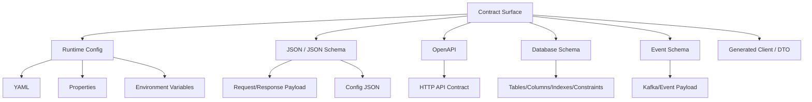
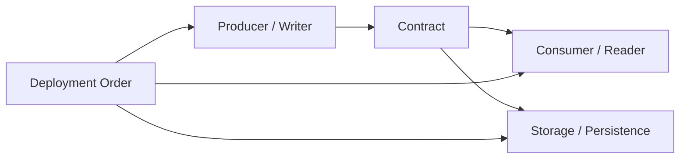
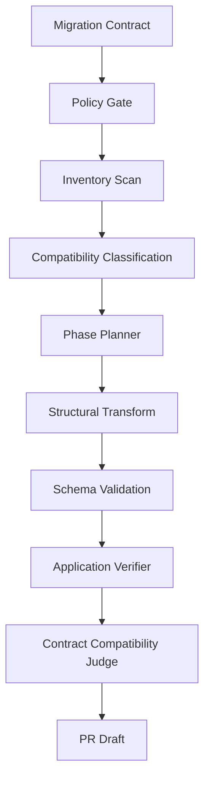

------
title: Learn AI Coding Agent From Scratch - Part 044
description: Config dan schema migration untuk Honk-like AI coding agent, meliputi YAML, JSON, OpenAPI, database migration, backward compatibility, expand-contract rollout, verifier, judge, dan PR evidence.
series: learn-ai-coding-agent
seriesTitle: Learn AI Coding Agent From Scratch
order: 44
partTitle: Config and Schema Migration
slug: config-and-schema-migration
tags:
  - ai-coding-agent
  - schema-migration
  - configuration
  - yaml
  - json-schema
  - openapi
  - database-migration
  - backward-compatibility
  - verifier
date: 2026-07-04
---

# Part 044 — Config dan Schema Migration: YAML, JSON, OpenAPI, DB Migration, Backward Compatibility

Kita sudah membahas API migration dan dependency upgrade. Sekarang kita masuk ke kategori perubahan yang lebih licin: **config dan schema migration**.

Ini lebih sulit karena compiler sering tidak membantu.

Kalau Java API berubah, compile bisa gagal. Tetapi kalau YAML key salah, JSON schema terlalu permisif, OpenAPI field berubah tanpa client update, atau database column di-drop terlalu cepat, sistem bisa tetap build hijau lalu gagal di runtime atau merusak data.

AI coding agent yang matang harus memperlakukan config dan schema migration sebagai **contract migration**, bukan text rewrite.

```txt
Bad mental model:
  Replace old key with new key.

Better mental model:
  Migrate a contract while preserving compatibility across readers, writers, deploy order, and rollback path.
```

---

## 1. Bentuk contract yang akan kita migrasikan

Di platform software modern, “schema” bukan hanya database.



Kita akan fokus pada empat area:

1. YAML/config migration,
2. JSON/JSON Schema migration,
3. OpenAPI contract migration,
4. database schema migration.

Event schema akan disentuh sebagai mental model, tetapi deep dive-nya bisa menjadi seri tersendiri.

---

## 2. Kenapa config/schema migration berbahaya untuk agent

AI coding agent cenderung kuat pada text transformation. Config/schema migration sering terlihat seperti text transformation.

Contoh:

```yaml
fraud:
  timeout-ms: 500
```

menjadi:

```yaml
fraud:
  client:
    timeout-ms: 500
```

Kelihatannya mudah. Tetapi realita:

| Risiko | Contoh |
|---|---|
| Semantik berubah | Default timeout baru berbeda dari lama |
| Key lama masih dibaca service versi lama | Rolling deployment butuh dual-read |
| YAML comments hilang | Operator kehilangan penjelasan production config |
| Anchor/merge key rusak | Config environment override berubah diam-diam |
| JSON schema terlalu longgar | Invalid config lolos validasi |
| OpenAPI change breaking | Client lama gagal deserialize |
| DB migration irreversible | Column drop menghapus data sebelum semua reader pindah |
| Rollback gagal | Aplikasi versi lama tidak bisa membaca schema baru |

Agent tidak boleh sekadar “mencari dan mengganti”. Agent harus tahu **compatibility window**.

---

## 3. Mental model: producer, consumer, storage, rollout

Setiap contract punya pihak yang membaca dan menulis.



Untuk config:

```txt
Producer = config author/operator/platform default
Consumer = application runtime
Storage = repository/config server/secret manager
```

Untuk OpenAPI:

```txt
Producer = service responding / accepting request
Consumer = API client
Contract = OpenAPI spec + generated client + runtime behavior
```

Untuk database:

```txt
Writer = application version N/N+1
Reader = application version N/N+1/reporting job
Storage = database table/index/constraint
```

Pertanyaan penting:

```txt
Apakah reader lama masih bisa membaca data/config baru?
Apakah writer baru masih bisa menulis format yang reader lama pahami?
Apakah rollback aplikasi aman?
Apakah migrasi data bisa diulang?
Apakah migration idempotent?
Apakah data loss mungkin terjadi?
```

---

## 4. Compatibility modes

Definisikan mode sejak awal.

```yaml
compatibilityMode:
  type: BACKWARD_COMPATIBLE
  rollout: EXPAND_CONTRACT
  rollbackRequired: true
  dualReadRequired: true
  dualWriteRequired: false
```

Mode umum:

| Mode | Makna | Contoh |
|---|---|---|
| Backward-compatible | Consumer lama tetap berjalan | Add optional field, add nullable DB column |
| Forward-compatible | Consumer baru bisa membaca data lama | New app handles missing field |
| Full compatible | Old/new bisa hidup bersamaan | Rolling deployment safe |
| Breaking | Membutuhkan coordinated release | Remove required field, drop column, rename path |
| Expand-contract | Tambah dulu, migrasi, baru hapus | DB rename column aman |
| Dual-read | App membaca key/field lama dan baru | Config key rename |
| Dual-write | App menulis format lama dan baru | Event/database migration sementara |

Untuk agent, compatibility mode menentukan allowed patch.

---

## 5. Case study utama

Kita gunakan case study yang mencakup config, OpenAPI, dan DB.

```txt
Problem:
  Platform ingin mengganti model fraud decision config dan storage.

Old config:
  fraud.timeout-ms: 500
  fraud.block-threshold: 80

New config:
  fraud.client.timeout-ms: 500
  fraud.decision.block-threshold: 80

Old API response:
  {
    "blocked": true,
    "score": 95
  }

New API response:
  {
    "decision": "BLOCK",
    "riskScore": { "value": 95, "scale": "PERCENT_0_100" }
  }

Old DB:
  fraud_check(blocked boolean, score integer)

New DB target:
  fraud_check(decision varchar, risk_score_value integer, risk_score_scale varchar)
```

Ini tidak boleh dilakukan dalam satu PR besar yang langsung menghapus lama.

Aman secara rollout:

```txt
PR 1 — Expand
  Add new config keys while supporting old keys.
  Add new DB columns nullable.
  Add API fields while keeping old fields if external clients exist.

PR 2 — Migrate/Backfill
  Backfill DB columns.
  Update writers to write new fields.
  Readers dual-read old/new.

PR 3 — Contract
  Remove old fields/columns only after usage evidence says safe.
```

Agent harus bisa menghasilkan plan multi-phase, bukan memaksa semuanya selesai di satu run.

---

## 6. Migration contract

Buat contract eksplisit.

```yaml
migrationContract:
  id: fraud-decision-schema-v2
  mode: EXPAND_CONTRACT
  targetCompatibility: FULL_COMPATIBLE_DURING_ROLLOUT

  config:
    mappings:
      - oldKey: fraud.timeout-ms
        newKey: fraud.client.timeout-ms
        preserveValue: true
        dualReadRequired: true
      - oldKey: fraud.block-threshold
        newKey: fraud.decision.block-threshold
        preserveValue: true
        dualReadRequired: true

  api:
    responseMappings:
      - oldField: blocked
        newField: decision
        transform: "blocked == true ? BLOCK : ALLOW"
        keepOldFieldDuringRollout: true
      - oldField: score
        newField: riskScore.value
        keepOldFieldDuringRollout: true

  database:
    table: fraud_check
    expand:
      - addColumn: decision varchar(20) null
      - addColumn: risk_score_value integer null
      - addColumn: risk_score_scale varchar(30) null
    backfill:
      - decision = case when blocked then 'BLOCK' else 'ALLOW' end
      - risk_score_value = score
      - risk_score_scale = 'PERCENT_0_100'
    contractLater:
      - dropColumn: blocked
      - dropColumn: score
```

Ini bukan prompt bebas. Ini input structured untuk agent.

---

## 7. Pipeline agent untuk config/schema migration



Artifacts wajib:

```txt
inventory-report.json
migration-plan.json
config-diff.json
schema-diff.json
db-migration-report.json
compatibility-report.json
verification-report.json
judge-report.json
```

---

## 8. Inventory scan

Jangan mulai rewrite sebelum inventory.

Cari semua surface:

```txt
YAML/properties config files
Java config binding classes
OpenAPI specs
JSON schema files
DTO/request/response classes
DB migration files
SQL queries/MyBatis mapper/JPA entity
tests/fixtures/docs
```

Scanner output:

```json
{
  "configKeys": [
    {
      "key": "fraud.timeout-ms",
      "file": "payment-service/src/main/resources/application.yml",
      "line": 12,
      "value": 500
    }
  ],
  "apiFields": [
    {
      "field": "blocked",
      "schema": "FraudDecisionResponse",
      "file": "contracts/openapi.yml"
    }
  ],
  "dbColumns": [
    {
      "table": "fraud_check",
      "column": "blocked",
      "references": [
        "db/changelog/001-create-fraud-check.sql",
        "payment-core/src/main/resources/mapper/FraudCheckMapper.xml"
      ]
    }
  ]
}
```

Inventory adalah evidence awal. Kalau inventory tidak lengkap, migration patch berisiko.

---

## 9. YAML/config migration

YAML punya jebakan:

```yaml
common: &common
  fraud:
    timeout-ms: 500

prod:
  <<: *common
  fraud:
    block-threshold: 90
```

Jika agent rewrite naif, merge behavior bisa berubah.

Rules:

```txt
1. Preserve comments where possible.
2. Preserve anchors/aliases/merge keys.
3. Preserve scalar type: string "500" vs integer 500 matters.
4. Preserve environment-specific overrides.
5. Do not move secrets into model-visible context.
6. Validate effective config after migration.
```

Config mapping example:

```diff
 fraud:
-  timeout-ms: 500
-  block-threshold: 80
+  client:
+    timeout-ms: 500
+  decision:
+    block-threshold: 80
```

But application code may need dual-read:

```java
public record FraudProperties(
    Client client,
    Decision decision,
    @Deprecated Integer timeoutMs,
    @Deprecated Integer blockThreshold
) {
  public Duration effectiveTimeout() {
    if (client != null && client.timeoutMs() != null) {
      return Duration.ofMillis(client.timeoutMs());
    }
    if (timeoutMs != null) {
      return Duration.ofMillis(timeoutMs);
    }
    return Duration.ofMillis(500);
  }

  public int effectiveBlockThreshold() {
    if (decision != null && decision.blockThreshold() != null) {
      return decision.blockThreshold();
    }
    if (blockThreshold != null) {
      return blockThreshold;
    }
    return 80;
  }
}
```

Config migration without code compatibility is incomplete.

---

## 10. JSON dan JSON Schema migration

JSON migration lebih strict dari YAML dalam syntax, tetapi compatibility-nya tetap tricky.

Old schema:

```json
{
  "type": "object",
  "required": ["blocked", "score"],
  "properties": {
    "blocked": { "type": "boolean" },
    "score": { "type": "integer", "minimum": 0, "maximum": 100 }
  },
  "additionalProperties": false
}
```

New compatible phase schema:

```json
{
  "type": "object",
  "required": [],
  "properties": {
    "blocked": { "type": "boolean", "deprecated": true },
    "score": { "type": "integer", "minimum": 0, "maximum": 100, "deprecated": true },
    "decision": { "type": "string", "enum": ["ALLOW", "REVIEW", "BLOCK"] },
    "riskScore": {
      "type": "object",
      "properties": {
        "value": { "type": "integer", "minimum": 0, "maximum": 100 },
        "scale": { "type": "string", "const": "PERCENT_0_100" }
      },
      "required": ["value", "scale"],
      "additionalProperties": false
    }
  },
  "additionalProperties": false
}
```

Perhatikan: pada fase expand, field lama masih ada. Field baru bisa optional dulu jika client lama dan service baru harus co-exist.

Breaking change examples:

| Change | Biasanya breaking untuk consumer? |
|---|---|
| Remove field | Ya |
| Rename field | Ya, kecuali dual field |
| Add required field to request | Ya |
| Add optional response field | Umumnya aman, kecuali consumer strict terhadap unknown fields |
| Narrow enum | Ya |
| Widen enum | Bisa breaking untuk exhaustive consumer |
| Change numeric type | Ya |
| Set `additionalProperties: false` pada schema yang sebelumnya bebas | Bisa breaking |

Agent harus menghasilkan compatibility report, bukan hanya schema diff.

---

## 11. OpenAPI migration

OpenAPI adalah contract HTTP API. Ia bisa digunakan untuk manusia, generator client, testing, dan governance.

Untuk agent, OpenAPI migration wajib mempertimbangkan:

```txt
request compatibility
response compatibility
status code compatibility
header/query/path compatibility
schema component reuse
generated client impact
server implementation alignment
contract test
```

Old component:

```yaml
components:
  schemas:
    FraudDecisionResponse:
      type: object
      required:
        - blocked
        - score
      properties:
        blocked:
          type: boolean
        score:
          type: integer
          minimum: 0
          maximum: 100
```

Expand-phase component:

```yaml
components:
  schemas:
    FraudDecisionResponse:
      type: object
      properties:
        blocked:
          type: boolean
          deprecated: true
        score:
          type: integer
          minimum: 0
          maximum: 100
          deprecated: true
        decision:
          type: string
          enum:
            - ALLOW
            - REVIEW
            - BLOCK
        riskScore:
          $ref: '#/components/schemas/RiskScore'

    RiskScore:
      type: object
      required:
        - value
        - scale
      properties:
        value:
          type: integer
          minimum: 0
          maximum: 100
        scale:
          type: string
          enum:
            - PERCENT_0_100
```

Policy:

```yaml
openApiPolicy:
  allowAddOptionalResponseField: true
  allowRemoveResponseField: false
  allowAddRequiredRequestField: false
  allowEnumWideningWithoutReview: false
  requireDeprecatedFlagForOldField: true
  requireContractTests: true
```

OpenAPI diff judge harus memahami direction:

```txt
Response additive != request additive.
Optional != required.
Enum widening can still break exhaustive clients.
Deprecated != removed.
```

---

## 12. Database migration: expand-contract

Database migration adalah bagian paling berbahaya karena data loss bisa irreversible.

Bad migration:

```sql
alter table fraud_check rename column blocked to decision;
alter table fraud_check rename column score to risk_score_value;
```

Kenapa buruk?

- app versi lama mungkin masih membaca `blocked`,
- value boolean tidak sama dengan decision enum,
- rollback sulit,
- tidak ada scale untuk score,
- migration tidak menjelaskan backfill semantics.

Better: expand first.

```sql
alter table fraud_check add column decision varchar(20);
alter table fraud_check add column risk_score_value integer;
alter table fraud_check add column risk_score_scale varchar(30);
```

Backfill:

```sql
update fraud_check
set
  decision = case
    when blocked = true then 'BLOCK'
    else 'ALLOW'
  end,
  risk_score_value = score,
  risk_score_scale = 'PERCENT_0_100'
where decision is null;
```

Constraint later, after backfill and app rollout:

```sql
alter table fraud_check alter column decision set not null;
alter table fraud_check alter column risk_score_value set not null;
alter table fraud_check alter column risk_score_scale set not null;
```

Drop old columns only in contract phase:

```sql
alter table fraud_check drop column blocked;
alter table fraud_check drop column score;
```

Agent harus bisa menolak contract-phase destructive migration jika task-nya hanya expand-phase.

---

## 13. DB migration policy

```yaml
databaseMigrationPolicy:
  disallowDropColumnInExpandPhase: true
  disallowRenameColumnWithoutCompatibilityPlan: true
  requireBackfillForDerivedColumns: true
  requireRollbackPlan: true
  requireIdempotencyWherePossible: true
  requireLargeTableSafetyNotes: true
  requireIndexCreationStrategy: true
  requireDataLossReview: true
```

Large table safety notes:

```txt
Is table large?
Will update lock too many rows?
Should backfill be batched?
Should index be created concurrently?
Will migration block writes?
Is rollback data-preserving?
```

Agent tidak selalu bisa tahu ukuran table. Jika tidak tahu, PR harus menyatakan unknown.

```md
Operational note:
The agent could not determine table size for `fraud_check`. If this table is large, the backfill should be batched or run via an operational migration job instead of a single transaction.
```

---

## 14. Code compatibility: dual-read and dual-write

Schema migration tidak selesai di migration file.

Reader:

```java
public FraudDecision map(FraudCheckRow row) {
  if (row.decision() != null) {
    return FraudDecision.from(row.decision(), row.riskScoreValue(), row.riskScoreScale());
  }

  // Compatibility path for old rows during rollout/backfill.
  if (row.blocked() != null) {
    return row.blocked()
        ? FraudDecision.block(row.score())
        : FraudDecision.allow(row.score());
  }

  throw new IllegalStateException("Fraud decision is missing both new and legacy fields");
}
```

Writer during transition:

```java
public FraudCheckRow toRow(FraudDecision decision) {
  return new FraudCheckRow(
      decision.value().name(),
      decision.riskScore().value(),
      decision.riskScore().scale().name(),
      decision.isBlocked(),              // legacy field during dual-write phase
      decision.riskScore().value()       // legacy field during dual-write phase
  );
}
```

Dual-write is not always required, but when rollback must be safe, it often is.

---

## 15. Agent phase planner

Agent should produce phase plan:

```json
{
  "migrationId": "fraud-decision-schema-v2",
  "recommendedPhases": [
    {
      "phase": "EXPAND",
      "allowedChanges": [
        "add new config keys",
        "add new OpenAPI response fields as optional",
        "add nullable DB columns",
        "add dual-read code"
      ],
      "forbiddenChanges": [
        "drop old DB columns",
        "remove old API fields",
        "make new DB columns not null before backfill"
      ]
    },
    {
      "phase": "MIGRATE",
      "allowedChanges": [
        "backfill new DB columns",
        "dual-write new and old fields",
        "update internal consumers"
      ]
    },
    {
      "phase": "CONTRACT",
      "allowedChanges": [
        "remove legacy fields after usage evidence",
        "drop old columns after retention window"
      ],
      "requiresEvidence": [
        "no legacy reads observed",
        "all clients upgraded",
        "rollback window closed"
      ]
    }
  ]
}
```

For this part, our agent should implement **EXPAND** only unless user explicitly asks for later phase.

---

## 16. Structural transform strategy

Do not use regex as primary migration tool for structured files.

| Surface | Safer approach |
|---|---|
| YAML | YAML parser that preserves comments/order if possible |
| JSON | JSON parser + JSON Pointer patches |
| OpenAPI | OpenAPI parser/model + schema diff |
| SQL migration | SQL parser or strict template generation |
| Java config binding | AST/symbol-aware change if possible |
| MyBatis XML | XML parser with namespace awareness |

Example JSON Patch style:

```json
[
  { "op": "add", "path": "/properties/decision", "value": { "type": "string", "enum": ["ALLOW", "REVIEW", "BLOCK"] } },
  { "op": "add", "path": "/properties/blocked/deprecated", "value": true }
]
```

Patch generation should emit both:

```txt
human-readable diff
machine-readable migration operations
```

This helps judge and replay.

---

## 17. Verification profile

Config/schema migration needs more than compile.

```yaml
verificationProfile:
  commands:
    - name: yaml-parse
      type: structural-validation
    - name: json-schema-validation
      type: schema-validation
    - name: openapi-validate
      type: contract-validation
    - name: db-migration-validate
      type: migration-validation
    - name: compile
      argv: ["mvn", "-q", "-DskipTests", "compile"]
    - name: unit-test
      argv: ["mvn", "-q", "test"]
    - name: contract-test
      strategy: affected-if-available
```

Verifier output:

```json
{
  "yamlParse": "PASSED",
  "jsonSchemaValidation": "PASSED",
  "openApiValidation": "PASSED",
  "dbMigrationValidation": "PASSED",
  "compile": "PASSED",
  "unitTests": "PASSED",
  "compatibilityJudge": "PASS_WITH_NOTES"
}
```

---

## 18. Compatibility judge

LLM-as-judge berguna jika output-nya structured dan berbasis evidence.

Prompt judge:

```txt
You are reviewing a config/schema migration diff.
The requested phase is EXPAND.
Reject if the diff removes old fields, drops columns, makes new required fields without rollout plan, weakens validation silently, or changes unrelated behavior.
Use the migration contract and schema diff as evidence.
Return structured JSON.
```

Output:

```json
{
  "verdict": "PASS_WITH_NOTES",
  "phaseCompliance": "EXPAND_ONLY",
  "backwardCompatibility": "LIKELY_COMPATIBLE",
  "notes": [
    "Old API fields kept and marked deprecated",
    "New DB columns are nullable",
    "Config dual-read implemented",
    "No drop column detected"
  ],
  "requiresHumanAttention": [
    "Enum widening may affect exhaustive generated clients",
    "Table size unknown for fraud_check backfill"
  ]
}
```

Do not let judge hide uncertainty. Unknowns must remain visible.

---

## 19. PR body template

```md
## Summary
Performs EXPAND phase for fraud decision schema v2.

## Config migration
- Migrates `fraud.timeout-ms` to `fraud.client.timeout-ms`.
- Migrates `fraud.block-threshold` to `fraud.decision.block-threshold`.
- Adds dual-read compatibility in `FraudProperties`.
- Preserves existing effective values.

## OpenAPI migration
- Adds `decision` and `riskScore` response fields.
- Keeps legacy `blocked` and `score` fields and marks them deprecated.
- Does not remove existing fields in this phase.

## Database migration
- Adds nullable columns:
  - `decision`
  - `risk_score_value`
  - `risk_score_scale`
- Adds backfill statement derived from legacy columns.
- Does not drop old columns.

## Compatibility
- Intended phase: EXPAND.
- Backward compatibility: maintained for old readers during rollout.
- Rollback: old fields/columns retained.

## Verification
- YAML parse: PASS
- OpenAPI validation: PASS
- DB migration validation: PASS
- Compile: PASS
- Unit tests: PASS
- Compatibility judge: PASS_WITH_NOTES

## Reviewer notes
- Please confirm whether `fraud_check` is large enough to require batched backfill.
- Please confirm whether external clients use exhaustive enum handling for fraud decision responses.
```

This is the level of clarity required for trust.

---

## 20. Anti-patterns

### 20.1 Rename instead of expand

```sql
alter table fraud_check rename column blocked to decision;
```

Bad because it breaks old app versions.

### 20.2 Removing old API fields immediately

```diff
- blocked:
-   type: boolean
- score:
-   type: integer
```

Bad in expand phase.

### 20.3 Making new request field required

```yaml
required:
  - newRequiredField
```

Usually breaking for old clients.

### 20.4 Regex rewrite of YAML

Regex can break anchors, indentation, comments, scalar types, and environment-specific overrides.

### 20.5 Hiding unknown operational risk

Agent must not write:

```txt
This migration is safe.
```

if it does not know table size, client population, rollout topology, or rollback requirements.

Better:

```txt
This migration is structurally compatible for expand phase. Operational safety depends on table size and deployment order, which were not available to the agent.
```

---

## 21. Database records for schema migration

```sql
create table schema_migration_reports (
  id uuid primary key,
  run_id uuid not null,
  migration_id text not null,
  phase text not null,
  compatibility_mode text not null,
  config_report_artifact_id uuid,
  api_schema_diff_artifact_id uuid,
  db_migration_report_artifact_id uuid,
  compatibility_report_artifact_id uuid not null,
  created_at timestamptz not null default now()
);
```

Audit event:

```json
{
  "eventType": "SchemaMigrationPlanned",
  "runId": "...",
  "migrationId": "fraud-decision-schema-v2",
  "phase": "EXPAND",
  "compatibilityMode": "FULL_COMPATIBLE_DURING_ROLLOUT",
  "destructiveChangesDetected": false,
  "requiresHumanAttention": [
    "table-size-unknown",
    "enum-client-impact-unknown"
  ]
}
```

---

## 22. Failure model

| Failure | Example | Guard |
|---|---|---|
| Config key removed too early | Old app version still reads old key | dual-read, expand phase |
| YAML semantics broken | anchor/merge key changed | structural parser + effective config validation |
| Schema too strict | `additionalProperties` changed | schema compatibility diff |
| API breaking change | response field removed | OpenAPI policy gate |
| DB data loss | drop old column | disallow destructive change in expand phase |
| Backfill unsafe | huge table single update | operational note + approval |
| Rollback unsafe | new app writes only new columns | dual-write where required |
| Test false confidence | tests only compile schema | contract tests + sample payload validation |
| Agent overreach | modifies unrelated domain logic | diff boundary judge |
| Unknown client impact hidden | enum widening | judge note + reviewer escalation |

---

## 23. Strong invariant checklist

```txt
[ ] Migration contract exists.
[ ] Inventory scan completed.
[ ] Migration phase is explicit.
[ ] Destructive operations are blocked unless phase allows them.
[ ] Old contract is preserved during expand phase.
[ ] New fields/columns are added safely.
[ ] Backfill semantics are documented.
[ ] Rollback path is stated.
[ ] Config effective values are preserved unless intentionally changed.
[ ] Schema/OpenAPI validation passes.
[ ] Application compile/test verifier passes.
[ ] Compatibility judge output is stored.
[ ] Unknown operational risks are visible in PR.
```

---

## 24. Latihan implementasi

Buat repo kecil:

```txt
fraud-platform
  contracts/openapi.yml
  src/main/resources/application.yml
  src/main/java/.../FraudProperties.java
  src/main/java/.../FraudDecisionResponse.java
  db/changelog/001-create-fraud-check.sql
  db/changelog/002-agent-expand-fraud-decision-v2.sql
```

Buat task:

```yaml
task:
  type: CONFIG_SCHEMA_MIGRATION
  migrationId: fraud-decision-schema-v2
  phase: EXPAND
  compatibility: FULL_COMPATIBLE_DURING_ROLLOUT
```

Target agent:

```txt
1. Mendeteksi semua config key lama.
2. Menghasilkan migration plan.
3. Memigrasikan YAML tanpa menghapus nilai lama secara unsafe.
4. Mengubah config binding menjadi dual-read.
5. Menambah field OpenAPI baru tanpa menghapus field lama.
6. Menambah DB columns nullable dan backfill.
7. Menolak drop column pada phase EXPAND.
8. Menghasilkan compatibility report dan PR body.
```

---

## 25. Ringkasan

Config/schema migration adalah perubahan contract.

Mental model yang benar:

```txt
Schema migration = compatibility-managed contract evolution.
```

Agent yang baik tidak hanya bertanya:

```txt
File mana yang perlu diubah?
```

Ia bertanya:

```txt
Siapa reader-nya?
Siapa writer-nya?
Apakah versi lama dan baru bisa hidup bersama?
Apakah rollback aman?
Apakah data loss mungkin terjadi?
Apakah perubahan ini expand, migrate, atau contract?
```

Dalam Honk-like system, config/schema migration harus berjalan dengan:

- migration contract,
- inventory scan,
- phase planner,
- structural transform,
- compatibility verifier,
- destructive-change policy,
- explicit PR evidence.

Di part berikutnya kita masuk ke **test generation dan regression guard**: bagaimana agent tidak hanya mengubah kode, tetapi juga menambah bukti agar perubahan tidak regresi.

---

## Referensi

- OpenAPI Specification: https://swagger.io/specification/
- OpenAPI Initiative: https://www.openapis.org/
- JSON Schema: https://json-schema.org/
- Liquibase Rollback Documentation: https://docs.liquibase.com/secure/reference-guide-5-1-1/init-update-and-rollback-commands/rollback
- Liquibase Project: https://github.com/liquibase/liquibase
