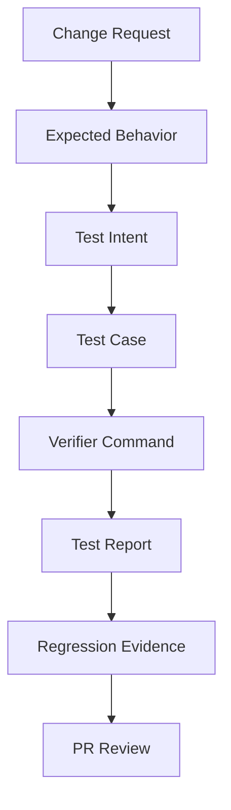
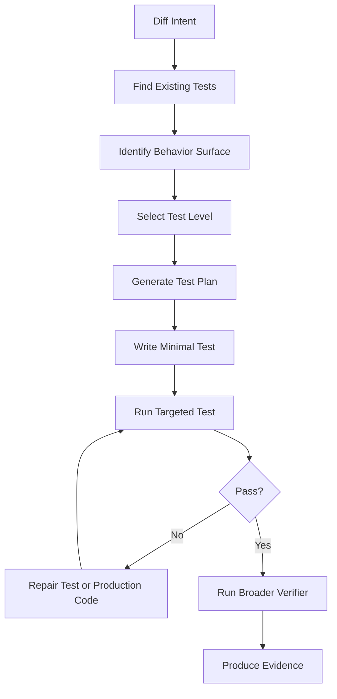
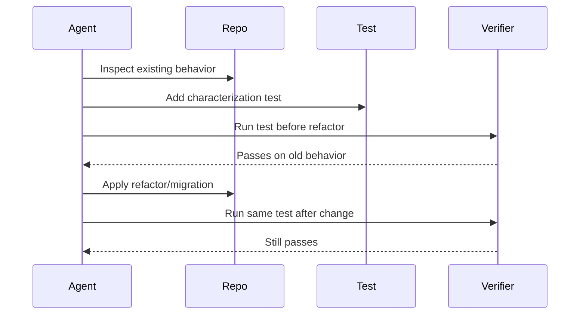
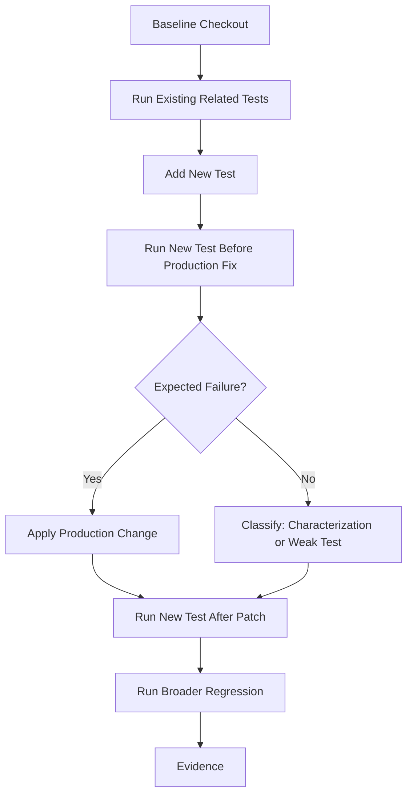

------
title: Learn AI Coding Agent From Scratch - Part 045
description: Test generation dan regression guard untuk Honk-like AI coding agent, meliputi test intent, baseline capture, characterization test, negative test, mutation thinking, flaky test control, coverage signal, verifier integration, dan PR evidence.
series: learn-ai-coding-agent
seriesTitle: Learn AI Coding Agent From Scratch
order: 45
partTitle: Test Generation and Regression Guard
slug: test-generation-and-regression-guard
tags:
  - ai-coding-agent
  - test-generation
  - regression-guard
  - junit
  - jacoco
  - verifier
  - java
  - software-testing
date: 2026-07-04
---

# Part 045 — Test Generation dan Regression Guard: Agent Tidak Hanya Mengubah Kode, Tapi Membuktikan

Di part sebelumnya kita sudah membuat agent mampu melakukan API migration, dependency upgrade, dan contract migration. Tetapi ada masalah besar: **perubahan kode yang terlihat benar belum tentu benar**.

Compile hijau hanya membuktikan program masih bisa dikompilasi. Lint hijau hanya membuktikan style dan beberapa rule statis terpenuhi. Unit test hijau hanya membuktikan test yang sudah ada masih lolos. Tidak satu pun dari itu otomatis membuktikan bahwa perubahan agent menjaga behavior yang penting.

Di sinilah test generation dan regression guard masuk.

```txt
Bad mental model:
  Agent mengubah kode, lalu menjalankan test.

Better mental model:
  Agent mengubah kode, lalu membangun bukti regresi: apa behavior yang dijaga,
  bagaimana behavior itu diuji, dan kenapa diff ini tidak sekadar compile-green.
```

Untuk Honk-like coding agent, test bukan aksesoris. Test adalah **safety instrument**.

Agent yang tidak bisa menambah, memilih, atau memperbaiki guard akan sering menghasilkan PR yang tampak rapi tetapi tidak layak dipercaya.

---

## 1. Apa target part ini

Kita akan membangun model praktis untuk membuat agent mampu:

1. memahami test yang sudah ada,
2. menemukan celah regression guard,
3. menambah test yang relevan,
4. menghindari test palsu yang hanya mengejar coverage,
5. menjalankan verifier yang tepat,
6. menyajikan evidence pada PR.

Yang tidak kita lakukan di sini:

- mengulang dasar JUnit,
- mengulang dasar mocking,
- membuat tutorial testing umum,
- mengejar coverage percentage secara membabi buta.

Kita akan fokus pada satu pertanyaan:

> Bagaimana agent bisa membuktikan bahwa perubahan kode tidak merusak behavior penting?

---

## 2. Mental model: test sebagai contract executable

Untuk agent, test harus dipahami sebagai **executable contract**.



Test yang baik menjawab:

1. behavior apa yang dilindungi,
2. input apa yang memicu behavior itu,
3. output atau efek apa yang diharapkan,
4. failure apa yang ingin dicegah,
5. kenapa test ini relevan dengan diff.

Test yang buruk hanya menjawab:

> Baris baru ini sekarang ke-cover.

Untuk agent, ini perbedaan besar.

Coverage adalah sinyal. Test intent adalah bukti.

---

## 3. Vocabulary: guard, test, verifier, evidence

Sebelum desain, kita rapikan istilah.

| Istilah | Arti |
|---|---|
| Regression guard | Mekanisme yang mencegah perubahan merusak behavior lama |
| Test case | Eksekusi spesifik untuk mengecek behavior |
| Characterization test | Test yang mengunci behavior existing sebelum refactor/migration |
| Golden test | Test yang membandingkan output terhadap expected artifact |
| Negative test | Test yang membuktikan kasus salah ditolak |
| Contract test | Test yang mengecek kesesuaian contract antar boundary |
| Verifier | Runner yang menjalankan build/test/lint/static analysis |
| Evidence | Artifact yang bisa direview: test file, report, command, coverage delta, failure history |

Dalam platform agent, regression guard bukan hanya file test. Guard bisa berupa:

- unit test,
- integration test,
- compile check,
- schema compatibility check,
- snapshot/golden output,
- static assertion,
- mutation-style scenario,
- reviewer checklist,
- LLM judge dengan evidence.

Tetapi test tetap komponen utama karena test bisa dieksekusi ulang.

---

## 4. Mengapa agent sering menghasilkan test buruk

LLM bisa menulis test yang tampak meyakinkan. Masalahnya, test yang tampak meyakinkan bisa tetap tidak berguna.

Failure mode umum:

| Failure | Contoh |
|---|---|
| Mirror implementation | Test meniru logic production sehingga bug ikut disalin |
| Assert too weak | Hanya `assertNotNull` atau hanya mengecek size |
| Mock everything | Test tidak benar-benar menguji behavior penting |
| Test after patch only | Tidak tahu apakah test akan gagal sebelum perubahan |
| Brittle snapshot | Snapshot terlalu besar dan mudah pecah karena noise |
| Coverage theater | Coverage naik, regression risk tidak turun |
| Hidden flakiness | Test bergantung waktu, urutan, network, random, timezone |
| Wrong level | Unit test dipaksa menguji behavior integration |
| No negative case | Hanya happy path |
| Verifier mismatch | Agent menjalankan test subset yang tidak merepresentasikan CI |

Karena itu kita perlu pipeline test generation yang lebih ketat.

---

## 5. Rule utama: test harus punya failure-before/failure-after story

Regression guard paling kuat adalah test yang:

1. gagal sebelum fix atau sebelum migration selesai,
2. lulus setelah perubahan,
3. menjelaskan behavior yang dilindungi.

Tidak semua test baru harus benar-benar dieksekusi sebelum patch, terutama untuk migration mekanis lintas repo. Tetapi agent harus minimal bisa menyatakan salah satu dari tiga tipe ini:

| Tipe | Makna |
|---|---|
| Red-green test | Test gagal sebelum patch, lulus setelah patch |
| Characterization test | Test mengunci behavior lama sebelum refactor |
| Invariant test | Test mengecek property yang wajib selalu benar |

Jika test tidak masuk salah satu kategori, test perlu dicurigai.

```txt
Bad PR evidence:
  Added tests.

Better PR evidence:
  Added regression test for null legacy config key fallback.
  The test would fail if the migration removed backward-compatible reads.
```

---

## 6. Test generation pipeline untuk agent

Pipeline minimal:



Agent tidak boleh langsung menulis test dari prompt. Ia harus menemukan:

- production file yang berubah,
- existing test convention,
- naming convention,
- framework,
- fixtures,
- helper utilities,
- test runner command,
- module boundary,
- CI expectation.

Test yang tidak mengikuti gaya repo akan meningkatkan review cost.

---

## 7. Test intent object

Sebelum menulis test, agent membuat `TestIntent`.

```json
{
  "id": "ti_legacy_config_fallback",
  "change_id": "chg_config_key_migration",
  "behavior": "Reader must accept old config key during transition window",
  "risk": "Removing fallback breaks existing deployments that have not migrated config",
  "test_level": "unit",
  "target_class": "ConfigReader",
  "existing_test_style": "JUnit 5 + AssertJ",
  "pre_patch_expected": "may pass if fallback already exists; otherwise fails",
  "post_patch_expected": "passes",
  "negative_cases": [
    "invalid value still rejected",
    "new key has priority over old key when both exist"
  ],
  "verifier_command": "mvn -pl config-service -Dtest=ConfigReaderTest test"
}
```

Kenapa ini penting?

Karena test intent memaksa agent menjelaskan **kenapa** test dibuat.

Tanpa ini, agent bisa menambah test asal-asalan.

---

## 8. Test level selection

Agent harus memilih level test dengan sengaja.

| Level | Cocok untuk | Tidak cocok untuk |
|---|---|---|
| Unit test | Pure logic, mapper, validator, parser, edge case | Full wiring, DB, network |
| Integration test | DB interaction, serialization, HTTP boundary, config loading | Fast inner loop jika terlalu berat |
| Contract test | API/schema compatibility, consumer/provider expectation | Internal algorithm detail |
| Golden/snapshot test | Stable generated output, migration output | Output yang sering berubah/noisy |
| End-to-end test | Critical user journey | Setiap perubahan kecil |

Heuristic:

```txt
If change affects pure function:
  prefer unit test.

If change affects serialization/config/schema:
  prefer contract or integration test.

If change affects database migration:
  prefer migration verification + integration test.

If change affects public API behavior:
  prefer contract test + unit tests for edge cases.

If change is mechanical rename only:
  existing compile/test may be enough, unless behavior path changed.
```

Agent yang selalu memilih unit test belum matang. Agent yang selalu memilih integration test juga belum matang.

---

## 9. Existing test discovery

Agent perlu menemukan test yang relevan sebelum membuat test baru.

Sources:

1. naming convention,
2. package mirror,
3. build tool configuration,
4. changed production symbols,
5. imports,
6. call graph,
7. historical tests around similar classes,
8. test utility classes,
9. fixture directories,
10. CI command.

Example search flow:

```txt
Changed file:
  src/main/java/com/acme/config/ConfigReader.java

Search candidates:
  src/test/java/com/acme/config/ConfigReaderTest.java
  src/test/java/com/acme/config/*Test.java
  rg "ConfigReader" src/test
  rg "legacyConfigKey" src/test
  rg "ConfigReader" .github workflows pom.xml
```

Tool-level API:

```json
{
  "tool": "find_related_tests",
  "input": {
    "changed_files": ["src/main/java/com/acme/config/ConfigReader.java"],
    "symbols": ["ConfigReader", "readConfig", "ConfigKey"]
  }
}
```

Output:

```json
{
  "direct_tests": [
    "src/test/java/com/acme/config/ConfigReaderTest.java"
  ],
  "indirect_tests": [
    "src/test/java/com/acme/config/ConfigModuleTest.java"
  ],
  "test_style": {
    "framework": "junit-jupiter",
    "assertion_library": "assertj",
    "mocking": "mockito"
  },
  "commands": [
    "mvn -pl config-service -Dtest=ConfigReaderTest test"
  ]
}
```

---

## 10. Build tool integration: Maven example

Untuk Java/Maven, agent biasanya memakai Surefire untuk unit test dan Failsafe untuk integration test. Maven Surefire memiliki convention include/exclude untuk test class, dan dokumentasi Surefire menjelaskan pola inclusion/exclusion test. Ini penting karena agent perlu tahu command mana yang menjalankan test tertentu.

Command examples:

```bash
mvn test
mvn -pl config-service test
mvn -pl config-service -Dtest=ConfigReaderTest test
mvn -pl config-service -Dtest=ConfigReaderTest#readsLegacyKey test
```

Agent harus merekam command sebagai artifact:

```json
{
  "command": "mvn -pl config-service -Dtest=ConfigReaderTest test",
  "purpose": "targeted regression test",
  "exit_code": 0,
  "duration_ms": 8421,
  "stdout_artifact": "artifact://runs/123/tests/config-reader.out",
  "stderr_artifact": "artifact://runs/123/tests/config-reader.err"
}
```

Jangan hanya mencatat “tests passed”. Review butuh command dan scope.

---

## 11. JUnit 5 style inference

JUnit 5/Jupiter adalah salah satu basis test modern Java. Dokumentasi JUnit User Guide memosisikan dokumen tersebut sebagai referensi untuk programmer yang menulis test, extension author, engine author, build tool, dan IDE vendor.

Agent tidak perlu menghafal semua fitur JUnit. Agent perlu menginfer style repo:

- apakah menggunakan `@Test`, `@ParameterizedTest`, `@Nested`, `@TempDir`, `@BeforeEach`,
- assertion library apa,
- apakah pakai AssertJ atau built-in assertions,
- apakah test display name dipakai,
- apakah mocking dihindari untuk class tertentu,
- apakah test package mirror production package.

Bad:

```java
@Test
void testConfig() {
    ConfigReader reader = new ConfigReader();
    assertNotNull(reader.read("legacy.timeout"));
}
```

Better:

```java
@Test
void readsLegacyTimeoutKeyDuringMigrationWindow() {
    ConfigReader reader = new ConfigReader(Map.of("legacy.timeout", "30s"));

    Duration timeout = reader.readTimeout();

    assertThat(timeout).isEqualTo(Duration.ofSeconds(30));
}
```

Even better when migration semantics matter:

```java
@Test
void newTimeoutKeyTakesPrecedenceWhenBothKeysExist() {
    ConfigReader reader = new ConfigReader(Map.of(
        "legacy.timeout", "30s",
        "service.timeout", "45s"
    ));

    Duration timeout = reader.readTimeout();

    assertThat(timeout).isEqualTo(Duration.ofSeconds(45));
}
```

Kenapa lebih baik?

- nama test menjelaskan behavior,
- input jelas,
- expected output kuat,
- migration precedence diuji,
- tidak sekadar `notNull`.

---

## 12. Characterization test sebelum refactor

Saat agent melakukan refactor besar atau migration mekanis, sering kali behavior lama tidak terdokumentasi dengan baik. Characterization test mengunci behavior existing sebelum perubahan.

Flow:



Rule:

```txt
Characterization test should not encode desired new behavior.
It encodes current behavior that must survive the transformation.
```

Example:

```java
@Test
void preservesCaseInsensitiveHeaderLookup() {
    HeaderMap headers = new HeaderMap();
    headers.put("X-Request-Id", "abc");

    assertThat(headers.get("x-request-id")).isEqualTo("abc");
}
```

Jika agent refactor `HeaderMap`, test ini menjaga behavior subtle.

---

## 13. Negative tests

Agent sering menulis happy path. Production bug sering muncul di edge path.

Untuk migration, negative tests penting:

| Migration | Negative case |
|---|---|
| Config key migration | Invalid old value tetap ditolak |
| API migration | Null/error response tetap dipetakan benar |
| Dependency upgrade | Exception baru tidak ditelan diam-diam |
| Schema migration | Unknown field policy tetap sesuai contract |
| Auth logic | Unauthorized path tetap ditolak |

Example:

```java
@Test
void rejectsInvalidLegacyTimeoutValue() {
    ConfigReader reader = new ConfigReader(Map.of("legacy.timeout", "soon"));

    assertThatThrownBy(reader::readTimeout)
        .isInstanceOf(ConfigException.class)
        .hasMessageContaining("legacy.timeout");
}
```

Negative test mencegah agent membuat fallback terlalu permisif.

---

## 14. Metamorphic/property-style thinking

Tidak semua behavior cocok diuji dengan satu expected output. Kadang lebih kuat memakai invariant.

Example untuk migration formatter:

```txt
Invariant:
  parse(render(x)) == x for supported schema subset.
```

Example untuk idempotent migration:

```txt
Invariant:
  migrate(migrate(file)) == migrate(file)
```

Pseudo-test:

```java
@Test
void migrationIsIdempotent() {
    String once = migrator.migrate(oldConfig);
    String twice = migrator.migrate(once);

    assertThat(twice).isEqualTo(once);
}
```

Untuk agent, invariant test sangat berguna karena agent bisa menjelaskan property, bukan hanya contoh.

---

## 15. Coverage signal: pakai, tapi jangan disembah

JaCoCo menghitung coverage metrics dari Java class files, termasuk bytecode instruction dan debug information. Ini kuat karena coverage bisa dikumpulkan via instrumentation, bahkan ketika source mapping hanya sampai level tertentu.

Tetapi coverage tidak membuktikan correctness.

Agent harus memperlakukan coverage sebagai:

- indikator area yang belum tersentuh,
- sanity check test relevance,
- regression signal kalau coverage turun drastis,
- evidence tambahan, bukan verdict utama.

Bad policy:

```txt
Reject PR if coverage below 80% globally.
```

Better policy:

```txt
For changed high-risk files, require either:
  - related test exists and passes, or
  - explicit no-test justification approved by judge/human.
If coverage on changed file drops significantly, require explanation.
```

Coverage delta artifact:

```json
{
  "changed_file": "src/main/java/com/acme/config/ConfigReader.java",
  "line_coverage_before": 0.82,
  "line_coverage_after": 0.86,
  "branch_coverage_before": 0.61,
  "branch_coverage_after": 0.68,
  "interpretation": "New tests exercise legacy-key fallback and new-key precedence."
}
```

---

## 16. Rotten green tests dan false confidence

Ada kategori test yang hijau tetapi tidak benar-benar menjalankan assertion penting. Literatur menyebut salah satu bentuknya sebagai “rotten green tests”: test yang passing meskipun setidaknya satu assertion tidak dieksekusi. Ini adalah contoh bagus kenapa “test passed” tidak cukup.

Agent harus menjaga diri dari false confidence:

- assertion berada di callback yang tidak terpanggil,
- exception path membuat test selesai sebelum assert,
- mock verification tidak pernah relevan,
- async test tidak menunggu future selesai,
- `try/catch` menelan error,
- snapshot di-update tanpa alasan.

Heuristic static check:

```txt
Reject newly generated tests when:
  - test has no assertion/verification,
  - only assertNotNull on object under test,
  - catches Exception without failing,
  - sleeps fixed duration for async behavior,
  - updates golden file without showing semantic diff.
```

---

## 17. Test generation prompt contract

Agent harus menulis test melalui prompt contract yang ketat.

```md
You are adding regression tests for a code change.

Goal:
- Protect the behavior described in TEST_INTENT.

Rules:
- Follow existing test style in TEST_STYLE.
- Prefer minimal, behavior-focused tests.
- Do not mock the unit under test.
- Do not assert only non-null unless nullness is the behavior.
- Include at least one negative or edge case when risk says so.
- Do not modify production code in this step.
- Do not update snapshots unless explicitly allowed.

Inputs:
- CHANGE_SUMMARY
- TEST_INTENT
- EXISTING_TESTS
- PRODUCTION_SNIPPETS
- BUILD_COMMANDS

Output:
- Patch only for test files.
- Explain which behavior each test protects.
```

Ini bukan prompt kosmetik. Ini safety guard.

---

## 18. Test file mutation policy

Agent perlu policy khusus untuk test files.

| Action | Policy |
|---|---|
| Add new focused unit test | Usually allowed |
| Modify existing assertion | Requires explanation |
| Delete test | Requires human approval |
| Disable test | Usually blocked |
| Add `@Disabled` | Blocked unless explicit approval |
| Loosen assertion | Requires judge escalation |
| Update snapshot | Requires semantic diff and approval policy |
| Add sleep/time dependency | Strongly discouraged/block |

Agen yang memperbaiki build dengan melemahkan test adalah agent berbahaya.

```txt
Invariant:
  Agent may strengthen tests autonomously.
  Agent may not weaken tests autonomously.
```

---

## 19. Running test before and after patch

Ideal pipeline:



Tidak semua task memungkinkan red-green murni. Tetapi agent harus tahu statusnya.

Evidence examples:

```json
{
  "new_tests": [
    {
      "name": "readsLegacyTimeoutKeyDuringMigrationWindow",
      "type": "regression",
      "pre_patch_result": "failed",
      "post_patch_result": "passed",
      "protected_behavior": "legacy config key fallback"
    }
  ]
}
```

Atau:

```json
{
  "new_tests": [
    {
      "name": "preservesCaseInsensitiveHeaderLookup",
      "type": "characterization",
      "pre_patch_result": "passed",
      "post_patch_result": "passed",
      "protected_behavior": "existing case-insensitive header lookup"
    }
  ]
}
```

---

## 20. Flaky test control

Agent bisa memperburuk repo dengan test flakey. Karena itu test generation perlu flakiness guard.

Risk factors:

- real time clock,
- timezone,
- random values,
- network,
- filesystem global state,
- test order dependency,
- parallel execution race,
- fixed sleep,
- shared static state,
- Docker/external service unavailable.

Policy:

```txt
Generated tests must avoid:
  - Thread.sleep for synchronization,
  - real network call,
  - current time without injected clock,
  - random without fixed seed,
  - order-dependent global state.
```

Example repair:

Bad:

```java
Thread.sleep(1000);
assertThat(cache.get("k")).isNull();
```

Better:

```java
Ticker ticker = new FakeTicker();
Cache cache = new Cache(ticker, Duration.ofSeconds(1));

cache.put("k", "v");
ticker.advance(Duration.ofSeconds(2));

assertThat(cache.get("k")).isNull();
```

---

## 21. Test oracle quality

Test oracle adalah mekanisme yang menentukan pass/fail. Agent perlu menilai oracle strength.

| Oracle | Strength | Catatan |
|---|---:|---|
| `assertNotNull` | Low | Sering terlalu lemah |
| exact output | High | Bagus jika output stabil |
| exception type + message key | Medium/High | Jangan terlalu brittle pada full text jika tidak stabil |
| state transition assertion | High | Bagus untuk lifecycle |
| interaction verification only | Medium | Lemah jika tidak cek outcome |
| snapshot besar | Medium | Perlu diff review |
| property/invariant | High | Bagus untuk transform/migration |

Agent judge harus bertanya:

```txt
Would this test fail if the important behavior were broken?
```

Jika jawabannya “tidak jelas”, test bukan guard yang kuat.

---

## 22. Regression guard untuk code migration

Untuk API migration, test generation berbeda dari feature development.

Target guard:

1. public behavior unchanged,
2. migration rule applied correctly,
3. old edge cases preserved,
4. new API semantics handled,
5. no fallback removal terlalu cepat,
6. compile/test pass.

Example test intent:

```json
{
  "behavior": "Token parser preserves rejection of expired token after library upgrade",
  "risk": "New library exception type may cause expired tokens to be treated as malformed instead of expired",
  "test_level": "unit",
  "negative_case": true
}
```

Test:

```java
@Test
void expiredTokenStillProducesExpiredTokenFailure() {
    TokenParser parser = parserWithClock(fixedClockAfterExpiry());

    TokenFailure failure = parser.parse(expiredToken()).left();

    assertThat(failure.reason()).isEqualTo(TokenFailureReason.EXPIRED);
}
```

Ini jauh lebih kuat daripada hanya compile setelah dependency upgrade.

---

## 23. Regression guard untuk config/schema migration

Untuk config/schema migration, guard sering berupa compatibility test.

Example:

```java
@Test
void acceptsBothLegacyAndNewConfigKeysDuringTransition() {
    ConfigSchema schema = ConfigSchema.loadCurrent();

    assertThat(schema.validate(Map.of("legacy.timeout", "30s"))).isValid();
    assertThat(schema.validate(Map.of("service.timeout", "30s"))).isValid();
}
```

Precedence:

```java
@Test
void newKeyTakesPrecedenceWhenBothKeysArePresent() {
    RuntimeConfig config = RuntimeConfig.from(Map.of(
        "legacy.timeout", "30s",
        "service.timeout", "45s"
    ));

    assertThat(config.timeout()).isEqualTo(Duration.ofSeconds(45));
}
```

Rollback guard:

```java
@Test
void serializedConfigRemainsReadableByPreviousVersionSchema() {
    String generated = CurrentConfigWriter.write(exampleConfig());

    assertThat(previousSchema.validate(generated)).isValid();
}
```

---

## 24. Agent test planner pseudo-code

```ts
type TestPlan = {
  intents: TestIntent[];
  filesToModify: string[];
  commands: string[];
  risk: "low" | "medium" | "high";
  needsHumanApproval: boolean;
};

async function planRegressionGuards(change: ChangeContext): Promise<TestPlan> {
  const relatedTests = await testDiscovery.findRelatedTests(change.changedSymbols);
  const style = await testDiscovery.inferTestStyle(relatedTests);
  const behaviorSurfaces = await impactAnalyzer.behaviorSurfaces(change);

  const intents = behaviorSurfaces.map(surface => ({
    id: makeId(surface),
    behavior: surface.behavior,
    risk: surface.risk,
    testLevel: chooseTestLevel(surface),
    existingTestStyle: style,
    verifierCommand: chooseCommand(surface, relatedTests)
  }));

  return {
    intents,
    filesToModify: chooseTestFiles(intents, relatedTests),
    commands: [...new Set(intents.map(i => i.verifierCommand))],
    risk: maxRisk(intents),
    needsHumanApproval: intents.some(i => i.risk === "high" && i.testLevel === "e2e")
  };
}
```

---

## 25. Agent test writer pseudo-code

```ts
async function addRegressionTests(run: Run, plan: TestPlan): Promise<TestPatch> {
  const projection = await contextBuilder.forTestWriting(plan);

  const patch = await llm.generatePatch({
    system: TEST_WRITER_SYSTEM_PROMPT,
    context: projection,
    outputFormat: "unified_diff"
  });

  const policy = await testPolicy.evaluatePatch(patch);
  if (!policy.allowed) {
    throw new PolicyViolation(policy.reasons);
  }

  await fileTools.applyPatch(patch);

  const results = [];
  for (const command of plan.commands) {
    results.push(await verifier.run(command));
  }

  return {
    patch,
    results,
    evidence: await evidenceBuilder.fromTestResults(results)
  };
}
```

---

## 26. Repair loop untuk test failure

Saat test gagal, agent harus mengklasifikasikan failure.

| Failure type | Action |
|---|---|
| Test compile error | Repair test syntax/import/style |
| Wrong expectation | Re-check behavior; do not blindly change expected |
| Production bug exposed | Repair production code |
| Fixture missing | Add minimal fixture |
| Flaky failure | Stabilize test or mark requires human review |
| Environment failure | Retry if transient; otherwise infrastructure failure |

Important invariant:

```txt
Agent must not repair a failing regression test by weakening the assertion
unless it can prove the original expectation was incorrect and preserve evidence.
```

Repair prompt should include:

- failing command,
- error excerpt,
- test intent,
- related production code,
- diff so far,
- allowed files,
- forbidden actions.

---

## 27. LLM-as-judge untuk test quality

Selain menjalankan test, kita bisa memakai judge untuk menilai test quality. Judge tidak menggantikan verifier. Judge membaca evidence.

Judge questions:

1. Apakah test baru relevan dengan change request?
2. Apakah assertion cukup kuat?
3. Apakah test akan gagal jika behavior penting rusak?
4. Apakah test mengikuti style repo?
5. Apakah test melemahkan guard existing?
6. Apakah ada flakiness risk?
7. Apakah test hanya coverage theater?

Output:

```json
{
  "verdict": "pass",
  "confidence": 0.83,
  "findings": [
    {
      "severity": "info",
      "message": "New test covers legacy key fallback and precedence."
    }
  ],
  "required_actions": []
}
```

If failing:

```json
{
  "verdict": "fail",
  "confidence": 0.91,
  "findings": [
    {
      "severity": "high",
      "message": "New test only asserts non-null and would not fail if timeout precedence were wrong."
    }
  ],
  "required_actions": [
    "Strengthen assertion to check selected timeout value."
  ]
}
```

---

## 28. PR evidence template

Agent PR body harus menunjukkan guard, bukan hanya “tests added”.

```md
## Regression Guard

Added:
- `ConfigReaderTest#readsLegacyTimeoutKeyDuringMigrationWindow`
- `ConfigReaderTest#newTimeoutKeyTakesPrecedenceWhenBothKeysExist`
- `ConfigReaderTest#rejectsInvalidLegacyTimeoutValue`

Why:
- Protects backward-compatible config migration.
- Ensures new key precedence.
- Prevents invalid legacy values from being silently accepted.

Verification:
- `mvn -pl config-service -Dtest=ConfigReaderTest test` ✅
- `mvn -pl config-service test` ✅

Evidence:
- Targeted test report: `artifact://runs/123/tests/config-reader.xml`
- Diff boundary report: `artifact://runs/123/diff-boundary.json`
```

Ini menurunkan review cost.

---

## 29. Database schema for test evidence

Tambahkan table atau document model:

```sql
create table run_test_intent (
  id uuid primary key,
  run_id uuid not null,
  change_id text,
  behavior text not null,
  risk text not null,
  test_level text not null,
  target_file text,
  verifier_command text,
  created_at timestamptz not null default now()
);

create table run_test_result (
  id uuid primary key,
  run_id uuid not null,
  test_intent_id uuid,
  command text not null,
  exit_code int not null,
  duration_ms bigint not null,
  report_artifact_uri text,
  pre_patch_result text,
  post_patch_result text,
  created_at timestamptz not null default now()
);
```

Kenapa simpan intent dan result terpisah?

Karena test result menjawab “apa yang terjadi”, sedangkan intent menjawab “kenapa test ini ada”.

---

## 30. Failure drill

### Drill 1 — Agent menambah test yang selalu pass

Signal:

- tidak ada assertion kuat,
- hanya `assertNotNull`,
- judge gagal.

Response:

- reject patch,
- minta stronger oracle,
- simpan finding.

### Drill 2 — Agent menghapus failing test

Signal:

- diff menghapus test atau menambahkan `@Disabled`,
- no approval.

Response:

- block policy,
- mark run failed or requires human approval.

### Drill 3 — Test hijau lokal, gagal CI

Signal:

- verifier command subset berbeda dengan CI,
- environment mismatch.

Response:

- parse CI failure,
- add missing verifier profile,
- rerun with closer environment.

### Drill 4 — Test flakey

Signal:

- pass/fail inconsistent on rerun,
- time/random/network dependency.

Response:

- repair test determinism,
- if not possible, block autonomous PR.

---

## 31. Implementation checklist

Sebelum lanjut, platform kita harus punya:

- [ ] related test discovery,
- [ ] test style inference,
- [ ] `TestIntent` model,
- [ ] test mutation policy,
- [ ] targeted verifier command,
- [ ] broader verifier command,
- [ ] test quality judge,
- [ ] flaky risk detector,
- [ ] test evidence artifact,
- [ ] PR regression guard section.

---

## 32. Kesimpulan

Test generation bukan fitur “nice to have”. Untuk AI coding agent, test generation adalah bagian dari trust model.

Agent yang matang tidak berpikir:

```txt
Saya sudah mengubah kode. Sekarang jalankan test.
```

Agent yang matang berpikir:

```txt
Saya mengubah behavior surface tertentu.
Saya harus membuktikan behavior penting tetap aman.
Saya perlu guard yang kuat, relevan, executable, dan bisa direview.
```

Inilah perbedaan antara code generator dan code-change system.

Di part berikutnya, kita naik tingkat: perubahan tidak selalu lokal. Satu perubahan kecil bisa menyebar ke banyak file, public API, call site, test, config, dan build module. Kita akan membahas **multi-file cascading change**.

---

## References

- JUnit User Guide — Overview: https://docs.junit.org/6.1.0/overview.html
- Maven Surefire Plugin — Inclusions and Exclusions of Tests: https://maven.apache.org/surefire/maven-surefire-plugin/examples/inclusion-exclusion.html
- JaCoCo — Coverage Counters: https://www.eclemma.org/jacoco/trunk/doc/counters.html
- RTj: a Java framework for detecting and refactoring rotten green test cases: https://arxiv.org/abs/1912.07322
