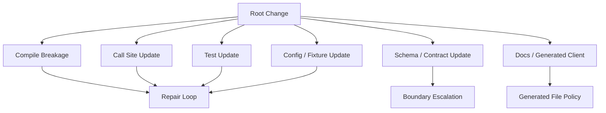
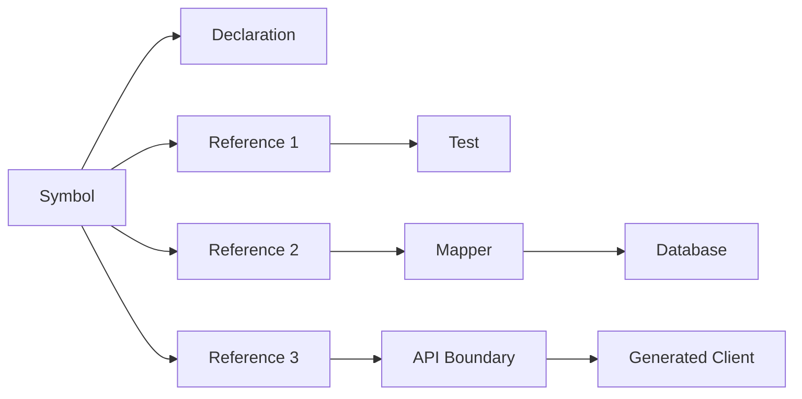
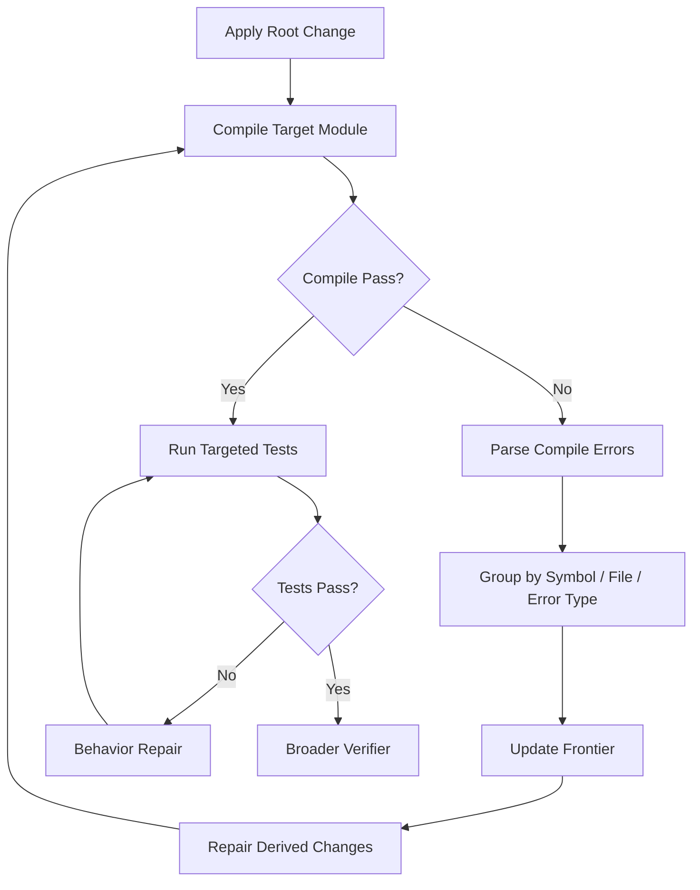
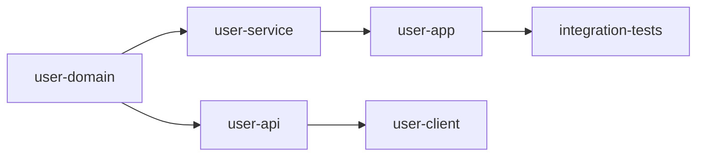
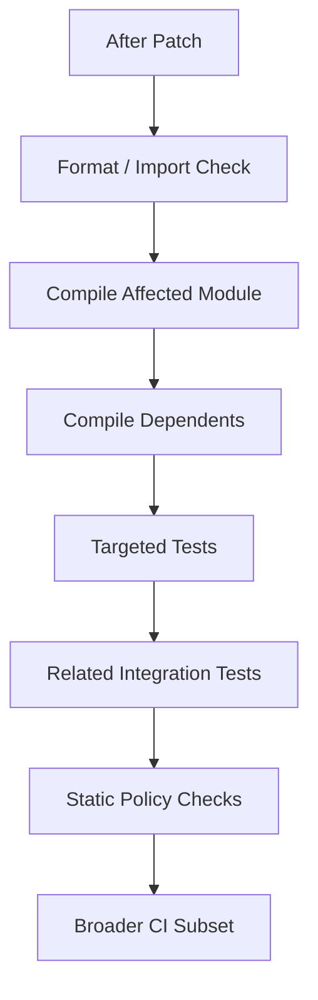

------
title: Learn AI Coding Agent From Scratch - Part 046
description: Multi-file cascading change untuk Honk-like AI coding agent, meliputi impact analysis, symbol graph, public API propagation, compile-driven repair, batching, change frontier, blast radius, verifier loop, dan PR evidence.
series: learn-ai-coding-agent
seriesTitle: Learn AI Coding Agent From Scratch
order: 46
partTitle: Multi-File Cascading Change
slug: multi-file-cascading-change
tags:
  - ai-coding-agent
  - cascading-change
  - impact-analysis
  - java
  - refactoring
  - verifier
  - call-graph
  - multi-file-change
date: 2026-07-04
---

# Part 046 — Multi-File Cascading Change: Public API, Call Sites, Compile Errors, Iterative Repair

Sampai titik ini, kita sudah punya banyak komponen: sandbox, permission model, file tools, shell tools, Git tool, context engine, planning layer, MCP verifier, patch generator, diff boundary, dan regression guard.

Sekarang kita masuk ke realitas codebase besar:

> Perubahan kode jarang benar-benar lokal.

Mengganti method signature bisa merusak call site. Mengubah DTO bisa merusak serializer, mapper, test, OpenAPI schema, fixture, dan documentation. Mengubah exception type bisa merusak error handler. Mengubah enum bisa merusak switch, database value, frontend client, dan analytics pipeline.

Inilah **multi-file cascading change**.

```txt
Bad mental model:
  Find file, edit file, run test.

Better mental model:
  Change creates a propagation frontier. Agent must discover, constrain,
  repair, verify, and stop before crossing unsafe boundaries.
```

---

## 1. Apa yang dimaksud cascading change

Cascading change adalah perubahan yang memaksa perubahan turunan di tempat lain.



Contoh:

```java
// before
User findUser(String id);

// after
Optional<User> findUser(UserId id);
```

Cascading impact:

- every caller must wrap `String` into `UserId`,
- null handling changes,
- tests must update expectation,
- serialization may change,
- public API may need compatibility adapter,
- documentation may need update,
- database mapper may need conversion.

Agent yang hanya mengedit declaration akan gagal compile. Agent yang auto-fix semua call site tanpa boundary bisa overreach.

---

## 2. Cascading change sebagai graph problem

Pikirkan codebase sebagai graph.



Root change menyentuh satu node. Dampaknya menyebar melalui edge:

- call edge,
- type dependency,
- import dependency,
- serialization dependency,
- schema dependency,
- test dependency,
- build dependency,
- ownership dependency.

Agent harus mengelola **change frontier**.

```txt
Change frontier:
  Himpunan node/file/symbol yang perlu dievaluasi karena root change.
```

Cascading change yang baik bukan memperluas frontier terus-menerus. Ia memperluas hanya saat evidence memaksa.

---

## 3. Root change vs derived change

Setiap diff harus diklasifikasikan.

| Tipe | Arti | Contoh |
|---|---|---|
| Root change | Perubahan utama yang diminta | Change method signature |
| Derived change | Perubahan yang diperlukan agar root change valid | Update callers |
| Guard change | Test/regression evidence | Add unit test |
| Mechanical change | Format/import generated by tooling | Organize imports |
| Opportunistic change | Tidak diperlukan | Rename unrelated variable |
| Boundary-crossing change | Masuk area contract/deployment/data | Update OpenAPI/database schema |

Policy:

```txt
Autonomous agent may apply root, derived, guard, and mechanical changes.
Autonomous agent must justify or block opportunistic changes.
Boundary-crossing changes require explicit task scope or approval.
```

---

## 4. Multi-file planning model

Agent perlu membuat plan yang eksplisit.

```json
{
  "root_change": {
    "symbol": "UserRepository.findUser",
    "from": "User findUser(String id)",
    "to": "Optional<User> findUser(UserId id)"
  },
  "expected_frontier": [
    "UserService",
    "UserController",
    "UserRepositoryTest",
    "UserServiceTest"
  ],
  "boundary_risks": [
    "UserController public response semantics may change"
  ],
  "repair_strategy": "compile-driven iterative repair",
  "stop_condition": "compile and targeted tests pass; no unresolved references to old signature"
}
```

Plan yang bagus menahan agent dari “sekalian refactor”.

---

## 5. Impact analysis sources

Untuk menemukan cascading impact, agent memakai beberapa sumber.

| Source | Kegunaan |
|---|---|
| Lexical search | Menemukan text reference cepat |
| Symbol index | Menemukan declaration/reference lebih presisi |
| LSP references | Menemukan reference bahasa-aware |
| AST parser | Memahami type/signature/import |
| Build compiler | Menemukan unresolved symbols/type mismatch |
| Test failure | Menemukan behavior mismatch |
| Dependency graph | Menemukan module boundary |
| Ownership metadata | Menemukan review boundary |
| Git history | Menemukan pola perubahan sejenis |

Tidak ada satu source yang cukup.

Lexical search cepat tetapi noisy. Symbol index lebih presisi tetapi bisa stale. Compiler kuat untuk static errors tetapi tidak menangkap semantic regressions. Test menangkap behavior yang diwakili test saja.

Agent matang memakai hybrid.

---

## 6. Compile-driven repair loop

Untuk Java, compile adalah feedback loop kuat.



Compile errors harus dipakai sebagai structured signal, bukan raw log panjang.

Example parsed error:

```json
{
  "file": "src/main/java/com/acme/user/UserService.java",
  "line": 42,
  "symbol": "findUser",
  "error_type": "method_signature_mismatch",
  "message": "method findUser in interface UserRepository cannot be applied to given types",
  "expected": "UserId",
  "actual": "String",
  "suggested_repair": "wrap String id with UserId.of(id)"
}
```

Agent harus memperbaiki berdasarkan error cluster.

---

## 7. Error clustering

Jika ada 300 compile errors, bukan berarti ada 300 masalah. Sering kali satu root change menciptakan banyak instance error yang sama.

```txt
Raw errors:
  87 call sites pass String to UserId
  14 tests expect User instead of Optional<User>
  3 imports unused
  2 mapper methods return null

Clusters:
  C1: convert String id to UserId at call sites
  C2: unwrap Optional with explicit not-found handling
  C3: update tests for Optional result
  C4: cleanup imports
```

Repair sebaiknya cluster-based, bukan line-by-line.

Pseudo-code:

```ts
function clusterCompileErrors(errors: CompileError[]): ErrorCluster[] {
  return groupBy(errors, e => [
    e.errorType,
    e.symbol,
    e.expectedType,
    e.actualType
  ].join("|"));
}
```

---

## 8. Change frontier expansion

Frontier tidak boleh liar.

```ts
type FrontierItem = {
  file: string;
  symbol?: string;
  reason: "root" | "reference" | "compile_error" | "test_failure" | "schema_dependency";
  risk: "low" | "medium" | "high";
  allowedActions: string[];
};
```

Expansion rules:

```txt
Add file to frontier if:
  - it directly references changed symbol,
  - compiler reports error in file,
  - targeted test fails due to changed behavior,
  - schema/config artifact explicitly depends on changed type.

Do not add file if:
  - only similar text appears in comment,
  - change would cross contract boundary not in task scope,
  - file is generated and source generator not updated,
  - owner boundary requires approval.
```

---

## 9. Public API boundary

Cascading changes are most dangerous at public boundaries.

Boundary examples:

- REST API request/response,
- public Java library API,
- database schema,
- event schema,
- CLI interface,
- config keys,
- generated clients,
- authentication/authorization semantics.

Policy:

```txt
If root change modifies internal private method:
  repair callers autonomously.

If root change modifies public API:
  require compatibility strategy or explicit breaking-change approval.
```

Public API migration options:

| Strategy | Meaning |
|---|---|
| Adapter method | Keep old method and delegate to new method |
| Overload | Add new signature while preserving old |
| Deprecation | Mark old API with migration path |
| Dual read/write | Support old and new field/key |
| Versioned endpoint | Introduce `/v2` without breaking `/v1` |
| Breaking change | Requires explicit scope and release coordination |

Agent harus menghindari breaking change by accident.

---

## 10. Example: safe signature migration

Before:

```java
public interface UserRepository {
    User findUser(String id);
}
```

Naive after:

```java
public interface UserRepository {
    Optional<User> findUser(UserId id);
}
```

Safer transitional after:

```java
public interface UserRepository {
    Optional<User> findUser(UserId id);

    @Deprecated(forRemoval = false)
    default User findUser(String id) {
        return findUser(UserId.of(id)).orElse(null);
    }
}
```

This may or may not be the right design. But the point is the agent must ask:

```txt
Is this API public to other modules/repositories?
Can all callers be updated in one PR?
What compatibility behavior must remain?
```

If all callers are inside one module and no public boundary exists, direct migration can be acceptable. If external clients exist, direct breaking change is unsafe.

---

## 11. Module boundary and build graph

Multi-file change often becomes multi-module change.



Agent harus tahu:

- module yang mendefinisikan root symbol,
- module yang bergantung padanya,
- test module yang relevan,
- apakah build bisa dijalankan per-module,
- apakah downstream module perlu ikut diverifikasi.

Maven command strategy:

```bash
# compile affected module
mvn -pl user-domain compile

# compile affected module plus dependents when known
mvn -pl user-domain,user-service,user-api -am compile

# targeted tests
mvn -pl user-service -Dtest=UserServiceTest test

# broader verification
mvn -pl user-domain,user-service,user-api -am test
```

`-am` atau “also make” berguna saat membangun module dan dependency yang dibutuhkan, tetapi agent harus memahami repo policy, bukan asal menambahkan flag.

---

## 12. Change budget

Cascading change bisa membesar tanpa batas. Karena itu perlu budget.

```json
{
  "max_files_changed": 25,
  "max_lines_changed": 800,
  "max_compile_repair_iterations": 5,
  "max_boundary_crossings": 0,
  "requires_approval_above_risk": "medium"
}
```

Budget bukan karena agent malas. Budget menjaga PR tetap reviewable.

Jika budget terlampaui:

- stop,
- summarize current state,
- create draft PR or report,
- ask human for scope split.

Dalam automation platform, ini menjadi status:

```txt
NEEDS_SCOPE_SPLIT
```

bukan “failed” biasa.

---

## 13. Batch strategy

Untuk banyak call site, agent harus memilih batch.

| Strategy | Cocok untuk |
|---|---|
| Single-file batch | Risiko tinggi, perlu step-by-step |
| Cluster batch | Banyak error sejenis |
| Module batch | Perubahan per module |
| All-at-once codemod | Mechanical transform sangat jelas |
| Hybrid | Deterministic transform dulu, agent repair residual |

Example:

```txt
C1: 87 call sites need UserId.of(id)
  -> deterministic AST rewrite if pattern clear.

C2: 14 tests expect User but method returns Optional<User>
  -> agentic repair because semantics differ per test.

C3: public controller not-found behavior
  -> human/judge escalation because API semantics may change.
```

---

## 14. Cascading change prompt contract

```md
You are performing a bounded multi-file code migration.

Root change:
- ROOT_CHANGE

Allowed derived changes:
- Update direct call sites.
- Update imports caused by changed call sites.
- Update tests directly covering changed behavior.
- Add regression tests for changed behavior.

Forbidden unless explicitly approved:
- Public API breaking changes outside ROOT_CHANGE.
- Deleting tests.
- Disabling tests.
- Large unrelated refactors.
- Updating generated files without updating their source generator.
- Changing database/schema/config contracts outside task scope.

Process:
1. Inspect frontier.
2. Apply minimal patch.
3. Run verifier.
4. Use verifier errors to expand frontier.
5. Stop when verifier passes or budget is exceeded.

Output:
- Patch.
- Frontier report.
- Verification report.
- Boundary risk report.
```

---

## 15. Frontier report

PR reviewer needs to know why many files changed.

```json
{
  "root_change": "UserRepository.findUser(String) -> findUser(UserId)",
  "changed_files": [
    {
      "path": "UserRepository.java",
      "classification": "root",
      "reason": "method signature migration"
    },
    {
      "path": "UserService.java",
      "classification": "derived",
      "reason": "direct caller compile error"
    },
    {
      "path": "UserServiceTest.java",
      "classification": "guard",
      "reason": "test expectation updated and regression case added"
    }
  ],
  "boundary_risks": [
    {
      "path": "UserController.java",
      "risk": "public HTTP not-found behavior",
      "decision": "preserved existing 404 behavior"
    }
  ]
}
```

This report prevents reviewer confusion.

---

## 16. Detecting overreach

Overreach patterns:

- unrelated rename,
- formatting entire repo,
- dependency upgrade not requested,
- test deletion,
- snapshot mass update,
- public API redesign,
- architecture change while fixing compile error,
- moving files across packages unnecessarily.

Diff boundary judge should flag:

```json
{
  "verdict": "fail",
  "findings": [
    {
      "severity": "high",
      "path": "src/main/java/com/acme/payment/PaymentService.java",
      "message": "File does not reference changed symbol and no verifier error pointed to it. Change appears unrelated."
    }
  ]
}
```

---

## 17. Handling generated files

Generated files are tricky.

Policy:

```txt
If generated file changes:
  require source generator input change or generated artifact regeneration command.
```

Examples:

| File | Source should change |
|---|---|
| OpenAPI generated client | OpenAPI spec |
| protobuf generated Java | `.proto` file |
| JOOQ generated classes | DB schema/codegen config |
| annotation processor output | source annotations |

Agent should not hand-edit generated files unless task explicitly says so.

Generated file detector:

- file header contains “generated”,
- path matches `target/generated-sources`,
- repo config marks generated paths,
- language-specific codegen markers,
- `.gitattributes` linguist-generated.

---

## 18. Handling tests during cascading change

Test updates during multi-file change are dangerous because agent may change expected behavior to match its patch.

Rules:

```txt
Allowed:
  - update test setup for new type/signature,
  - add regression test,
  - update expectation only when behavior intentionally changed and evidence exists.

Blocked or escalated:
  - remove assertion,
  - loosen assertion,
  - delete failing test,
  - disable test,
  - update snapshot with no semantic explanation.
```

Example acceptable:

```java
// before
User user = repository.findUser("u-1");
assertThat(user.name()).isEqualTo("Ana");

// after
User user = repository.findUser(UserId.of("u-1")).orElseThrow();
assertThat(user.name()).isEqualTo("Ana");
```

Behavior preserved.

Example suspicious:

```java
// after
Optional<User> user = repository.findUser(UserId.of("u-1"));
assertThat(user).isPresent();
```

This weakens assertion: name no longer checked.

---

## 19. Semantic repair vs syntactic repair

Compile errors often need syntactic repair. Test failures often need semantic repair.

| Repair | Example | Risk |
|---|---|---|
| Add import | syntactic | low |
| Wrap `id` with `UserId.of(id)` | mostly syntactic if clear | low/medium |
| Change null behavior to Optional | semantic | medium/high |
| Change HTTP 404 to 200 empty body | semantic | high |
| Change exception mapping | semantic | high |

Agent should classify before editing.

```json
{
  "repair": "change controller not-found handling",
  "classification": "semantic",
  "risk": "high",
  "requires": "explicit behavior decision"
}
```

---

## 20. Iterative repair pseudo-code

```ts
async function performCascadingChange(task: Task): Promise<RunResult> {
  const plan = await planner.createMultiFilePlan(task);
  const frontier = new Frontier(plan.rootFiles);

  await applyRootChange(plan.rootChange);

  for (let i = 0; i < plan.maxIterations; i++) {
    const verification = await verifier.compile(frontier.affectedModules());

    if (verification.passed) {
      const tests = await verifier.runTargetedTests(frontier.relatedTests());
      if (tests.passed) {
        return await finalizeWithBroaderVerification(frontier);
      }
      const testRepairs = await classifyTestFailures(tests.failures);
      await applyAllowedRepairs(testRepairs, frontier);
      continue;
    }

    const clusters = clusterCompileErrors(verification.errors);
    const repairs = await proposeRepairs(clusters, frontier, plan.policy);

    const policy = await policyEngine.evaluateRepairs(repairs);
    if (!policy.allowed) {
      return await stopForApproval(policy, frontier);
    }

    await applyRepairs(repairs);
    frontier.expandFromRepairs(repairs);

    if (frontier.exceedsBudget(plan.budget)) {
      return await stopForScopeSplit(frontier);
    }
  }

  return await stopForIterationLimit(frontier);
}
```

---

## 21. Verifier strategy

Cascading change verifier should run in tiers.



Do not start with full CI every iteration if full CI takes 45 minutes. Use staged verification.

But before PR, run a sufficiently broad verifier to avoid local optimum.

---

## 22. Handling partial success

Agent may reach partial success:

- root module compiles,
- several call sites repaired,
- one boundary risk unresolved,
- budget exceeded.

Bad behavior:

```txt
Continue editing until something works.
```

Good behavior:

```txt
Stop, summarize unresolved frontier, ask for scope split or approval.
```

Run status:

| Status | Meaning |
|---|---|
| `COMPLETED` | Verifier and judge pass |
| `NEEDS_SCOPE_SPLIT` | Change too large for autonomous PR |
| `NEEDS_HUMAN_DECISION` | Semantic/boundary choice required |
| `FAILED_VERIFICATION` | Could not repair within budget |
| `BLOCKED_BY_POLICY` | Requested/derived change violates policy |

---

## 23. Multi-file PR body

```md
## Root Change

Migrated `UserRepository.findUser(String)` to `findUser(UserId)` internally.

## Derived Changes

Updated direct call sites in:
- `UserService`
- `UserController`
- `UserRepositoryTest`
- `UserServiceTest`

## Boundary Decisions

- Preserved HTTP 404 behavior for missing users.
- Did not change OpenAPI response schema.
- Kept deprecated compatibility overload for callers outside this module.

## Regression Guard

Added:
- `UserServiceTest#returnsNotFoundWhenUserMissingAfterUserIdMigration`

## Verification

- `mvn -pl user-domain,user-service -am compile` ✅
- `mvn -pl user-service -Dtest=UserServiceTest test` ✅
- `mvn -pl user-domain,user-service -am test` ✅

## Frontier Report

See `artifact://runs/456/frontier-report.json`.
```

This is reviewable. A reviewer can see what changed and why.

---

## 24. Case study: enum migration

Suppose we migrate:

```java
public enum CaseStatus {
    OPEN,
    CLOSED
}
```

To:

```java
public enum CaseStatus {
    DRAFT,
    ACTIVE,
    RESOLVED,
    CLOSED
}
```

Impact surfaces:

- switch statements,
- database persisted values,
- JSON serialization,
- OpenAPI enum,
- frontend dropdown,
- analytics dashboards,
- tests,
- migration script.

This is not a simple Java change. It crosses data and API boundaries.

Agent should likely classify as high risk:

```json
{
  "risk": "high",
  "reason": "Enum is serialized and persisted",
  "autonomous_allowed": false,
  "required_plan": [
    "compatibility mapping",
    "database migration",
    "OpenAPI update",
    "consumer rollout",
    "rollback behavior"
  ]
}
```

This is exactly why change boundary matters.

---

## 25. Case study: internal mapper change

Suppose:

```java
Money toMoney(BigDecimal amount, String currency)
```

becomes:

```java
Money toMoney(BigDecimal amount, CurrencyCode currency)
```

If all call sites are internal and `CurrencyCode.of(currency)` is deterministic, agent can likely perform bounded cascading change.

Plan:

1. change mapper signature,
2. update direct call sites,
3. compile,
4. repair imports,
5. add/adjust tests for invalid currency,
6. run targeted tests,
7. run module test.

This is good autonomous scope.

---

## 26. Data model additions

Add frontier tables/artifacts.

```sql
create table run_frontier_item (
  id uuid primary key,
  run_id uuid not null,
  path text not null,
  symbol text,
  reason text not null,
  risk text not null,
  status text not null,
  created_at timestamptz not null default now()
);

create table run_repair_cluster (
  id uuid primary key,
  run_id uuid not null,
  error_type text not null,
  symbol text,
  file_count int not null,
  risk text not null,
  decision text not null,
  created_at timestamptz not null default now()
);
```

Artifacts:

```txt
artifact://runs/{runId}/frontier-report.json
artifact://runs/{runId}/compile-errors.json
artifact://runs/{runId}/repair-clusters.json
artifact://runs/{runId}/boundary-risk-report.json
```

---

## 27. Failure drills

### Drill 1 — Compile errors explode

Signal:

- error count grows after each iteration,
- frontier expands beyond budget.

Response:

- rollback last repair,
- cluster errors,
- stop with `NEEDS_SCOPE_SPLIT`.

### Drill 2 — Agent crosses public boundary accidentally

Signal:

- OpenAPI/schema/public interface changed without task scope,
- judge flags boundary crossing.

Response:

- revert boundary change,
- use compatibility adapter or escalate.

### Drill 3 — Test assertion weakened

Signal:

- diff changes exact assertion to weak presence/null assertion.

Response:

- block patch,
- require behavior-preserving test update.

### Drill 4 — Generated file hand-edited

Signal:

- generated file changed but generator input unchanged.

Response:

- block or require regeneration command evidence.

### Drill 5 — Infinite semantic repair loop

Signal:

- compile passes, targeted test fails, repeated expectation changes.

Response:

- stop for human decision,
- summarize semantic conflict.

---

## 28. Checklist for multi-file cascading change

Before autonomous PR:

- [ ] root change identified,
- [ ] derived changes classified,
- [ ] frontier report generated,
- [ ] public boundary checked,
- [ ] generated file policy checked,
- [ ] compile errors resolved,
- [ ] targeted tests pass,
- [ ] regression guard added or no-test justification recorded,
- [ ] diff boundary judge passes,
- [ ] PR body explains root/derived/guard changes.

---

## 29. Kesimpulan

Multi-file cascading change adalah tempat agent terlihat pintar atau berbahaya.

Agent yang lemah:

```txt
Keeps editing until build passes.
```

Agent yang kuat:

```txt
Understands the root change, tracks the propagation frontier,
classifies derived changes, respects boundaries, uses compiler/test feedback,
and stops when the change becomes unsafe or too large.
```

Kunci part ini adalah **frontier discipline**.

Tanpa frontier discipline, agent akan overreach. Dengan frontier discipline, agent bisa menyelesaikan perubahan multi-file secara sistematis dan reviewable.

Di part berikutnya kita akan membahas long-horizon change management: apa yang terjadi ketika cascading change tidak cukup diselesaikan dalam satu loop pendek, tetapi membutuhkan beberapa milestone, checkpoint, dan strategi navigasi agar agent tidak tersesat.

---

## References

- OpenRewrite Documentation: https://docs.openrewrite.org/
- JavaParser Documentation: https://javaparser.org/
- Tree-sitter Documentation: https://tree-sitter.github.io/
- Maven Introduction to the Build Lifecycle: https://maven.apache.org/guides/introduction/introduction-to-the-lifecycle.html
- GitHub Docs — Reviewing proposed changes in a pull request: https://docs.github.com/en/pull-requests/collaborating-with-pull-requests/reviewing-changes-in-pull-requests/reviewing-proposed-changes-in-a-pull-request
