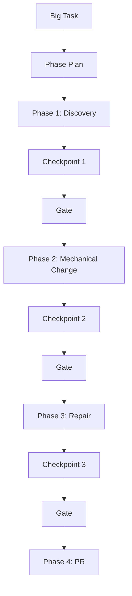
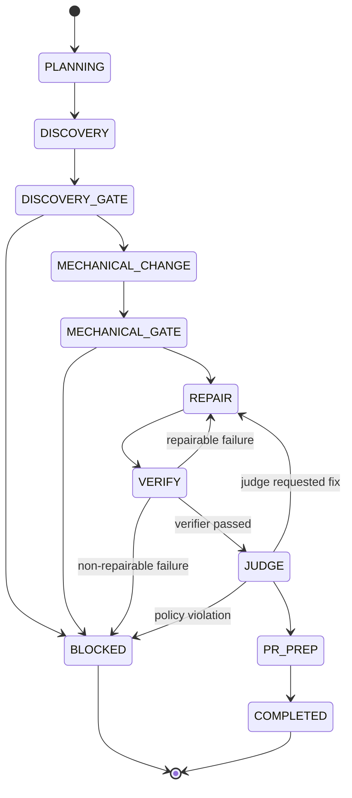
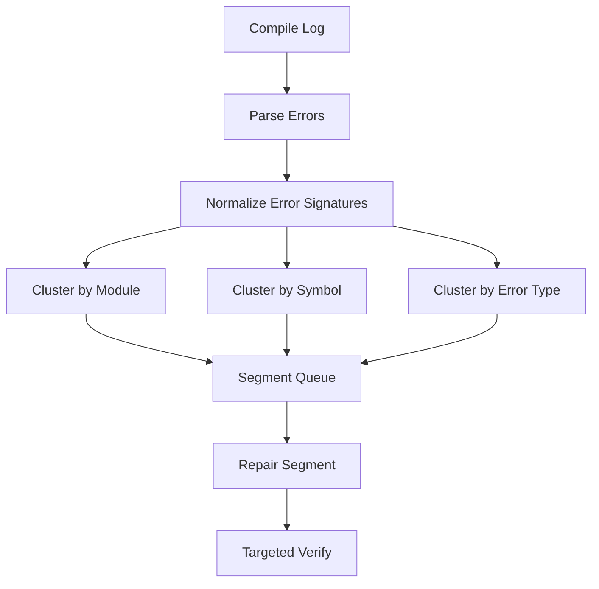
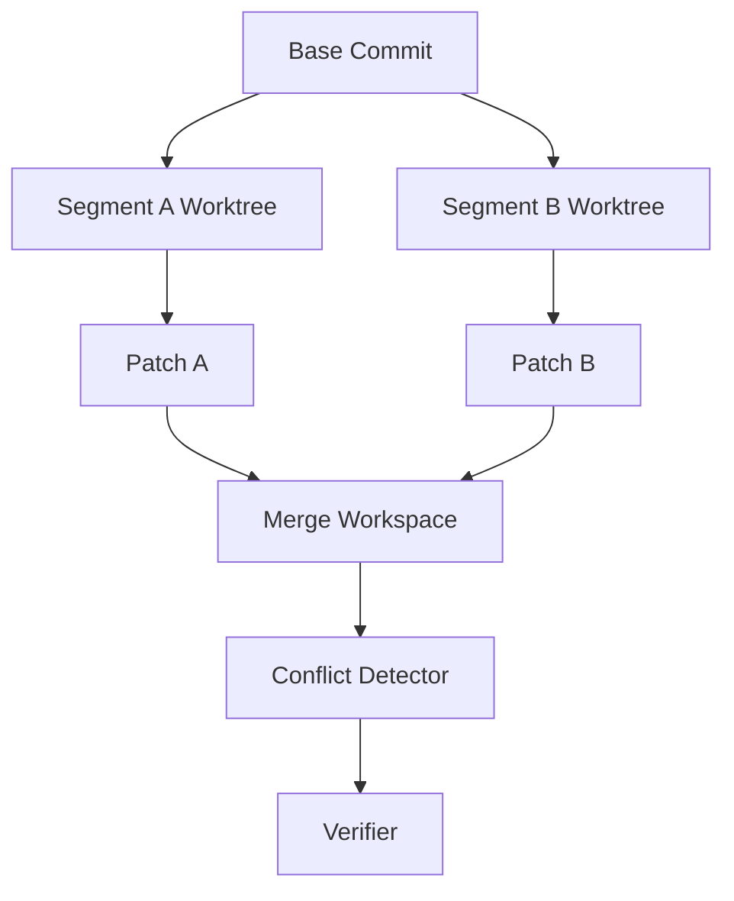
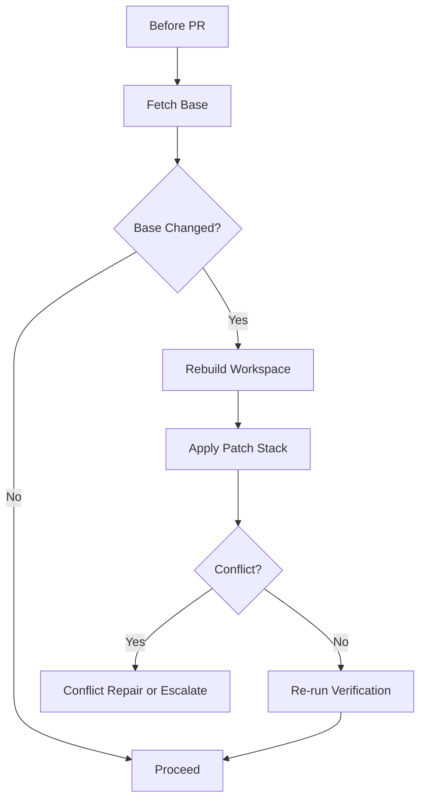

------
title: Learn AI Coding Agent From Scratch - Part 047
description: Long-horizon change management untuk Honk-like AI coding agent, meliputi decomposition, checkpoint, scope guard, drift control, resumability, phase-based execution, child runs, verification gates, dan rollback strategy.
series: learn-ai-coding-agent
seriesTitle: Learn AI Coding Agent From Scratch
order: 47
partTitle: Long-Horizon Change Management
slug: long-horizon-change-management
tags:
  - ai-coding-agent
  - long-horizon-agent
  - orchestration
  - planning
  - verification
  - resumability
  - code-migration
  - agent-runtime
date: 2026-07-04
---

# Part 047 — Long-Horizon Change Management: Menghindari Agent Tersesat di Perubahan Besar

Kita sudah membahas cascading change di Part 046. Sekarang kita naik satu level.

Cascading change menjawab pertanyaan:

> Bagaimana agent menangani efek turunan dari satu perubahan?

Long-horizon change menjawab pertanyaan yang lebih besar:

> Bagaimana agent menyelesaikan pekerjaan panjang tanpa kehilangan scope, tanpa lupa alasan perubahan, tanpa menumpuk patch liar, dan tanpa membuat PR yang tidak bisa direview?

Ini penting karena Honk-like background coding agent bukan hanya dipakai untuk task kecil seperti “rename variable”. Target realistisnya adalah:

- migrasi API lintas banyak module,
- dependency upgrade yang menimbulkan banyak compile error,
- perubahan config dan schema bertahap,
- perbaikan test suite setelah perubahan behavior,
- cleanup teknis berbasis policy organisasi,
- automated maintenance lintas repository.

Pada task kecil, agent bisa berhasil dengan loop sederhana:

```txt
read -> edit -> test -> fix -> done
```

Pada task panjang, loop itu cepat gagal karena agent mulai mengalami:

- scope drift,
- context overflow,
- repeated repair tanpa arah,
- fix yang membatalkan fix sebelumnya,
- patch terlalu besar,
- verification lama,
- artifact tidak bisa dijelaskan,
- PR tidak bisa dipercaya reviewer.

Long-horizon management adalah disiplin untuk membuat pekerjaan besar tetap **terpecah, terukur, terverifikasi, dan bisa dihentikan**.

```txt
Bad mental model:
  Give model a big task and wait until it figures everything out.

Better mental model:
  Convert big task into controlled phases, each producing evidence, checkpoint,
  and a bounded diff. Agent does not wander; agent advances through gates.
```

---

## 1. Definisi long-horizon change

Long-horizon change adalah perubahan yang membutuhkan lebih dari satu siklus sederhana observe-edit-verify.

Ciri-cirinya:

| Ciri | Dampak |
|---|---|
| Banyak file | Review sulit, context besar |
| Banyak module | Build/test mahal |
| Banyak error turunan | Agent mudah memperbaiki symptom, bukan root cause |
| Banyak tahap | State harus dipersist |
| Banyak keputusan | Butuh approval/policy gate |
| Banyak verifier | Perlu urutan verification yang efisien |
| Kemungkinan interruption | Harus bisa resume |

Contoh task:

```txt
Upgrade Spring Boot minor version across this service and fix required API changes.
Run relevant tests, update configuration if required, and open a PR.
```

Task ini bukan satu perubahan. Ia berisi beberapa subproblem:

1. baca build file,
2. identifikasi versi saat ini,
3. ubah dependency/plugin,
4. refresh lockfile bila ada,
5. run compile,
6. klasifikasi error,
7. repair source code,
8. run test,
9. repair test/config,
10. evaluate diff,
11. tulis PR evidence.

Jika agent menjalankan semua ini dalam satu prompt panjang, probabilitas drift tinggi.

Solusinya: jadikan task panjang sebagai **execution program**.

---

## 2. Long-horizon bukan berarti agent bebas bekerja lama

Kesalahan desain umum adalah menganggap long-horizon berarti:

> “Agent diberi waktu lebih lama dan token lebih banyak.”

Itu salah.

Long-horizon agent bukan agent yang “lebih bebas”. Ia justru harus **lebih terkekang**.



Setiap phase harus punya:

- input yang jelas,
- output yang jelas,
- allowed tools,
- allowed files,
- budget,
- verifier,
- stop condition,
- checkpoint artifact.

Long-horizon management adalah seni **membuat agent bekerja lama tanpa memperbesar agency secara liar**.

---

## 3. Unit kerja: Task, Run, Phase, Segment, Step

Kita perlu vocabulary yang lebih presisi.

```txt
Task
  User-level request.

Run
  Satu eksekusi task oleh platform.

Phase
  Tahap besar dengan goal dan gate.

Segment
  Potongan kerja dalam phase, biasanya bounded by file set/module/error cluster.

Step
  Satu action kecil: read file, apply patch, run command, summarize log.
```

Contoh:

```txt
Task:
  Upgrade library X from 1.x to 2.x.

Run:
  Attempt #1 on repo A at base commit abc123.

Phase 1:
  Discovery.

Segment 1:
  Inspect Maven dependency declarations.

Step:
  read pom.xml
```

Mengapa perlu segment?

Karena phase seperti “repair compile errors” bisa terlalu besar. Kita perlu memecah error menjadi cluster:

- cluster berdasarkan symbol,
- cluster berdasarkan module,
- cluster berdasarkan package,
- cluster berdasarkan error type,
- cluster berdasarkan ownership.

---

## 4. State machine long-horizon run

State machine Part 013 masih berlaku, tetapi long-horizon execution butuh substate.



Kuncinya bukan hanya state. Kuncinya adalah **gate**.

Gate adalah titik keputusan yang menjawab:

- apakah phase berikutnya boleh dimulai?
- apakah scope masih valid?
- apakah diff masih dalam budget?
- apakah ada failure yang butuh approval?
- apakah run harus dihentikan?

---

## 5. Phase contract

Setiap phase harus didefinisikan sebagai contract.

```yaml
phase: discovery
goal: Understand target change and affected surface before editing.
allowed_tools:
  - repo_map.query
  - code_search.search
  - file.read
  - git.status
forbidden_tools:
  - file.write
  - shell.run.mutate
  - git.commit
outputs:
  - discovery_report
  - target_files
  - risk_assessment
stop_conditions:
  - target surface found
  - no target found
  - ambiguity requires human approval
budgets:
  max_steps: 30
  max_tokens: 50000
  max_wall_clock_minutes: 10
```

Phase contract mencegah agent melakukan editing saat masih discovery.

Ini terlihat sederhana, tapi efeknya besar: agent tidak bisa “sekalian memperbaiki” saat masih mengumpulkan evidence.

---

## 6. Canonical phase model untuk coding agent

Untuk Honk-like agent, fase default yang bagus adalah:

```txt
1. Intake Normalization
2. Discovery
3. Planning
4. Baseline Verification
5. Mechanical Change
6. Local Repair
7. Regression Verification
8. Diff Boundary Review
9. Judge Review
10. PR Preparation
```

Bukan semua task butuh semua phase. Namun platform sebaiknya punya model default.

### 6.1 Intake Normalization

Tujuan:

- mengubah prompt user menjadi task contract,
- menentukan risk class,
- menentukan approval mode,
- menentukan allowed repository/ref,
- menentukan expected output.

Output:

```yaml
task_contract:
  objective: migrate deprecated FooClient usage to BarClient
  repositories:
    - payments-service
  base_ref: main
  allowed_paths:
    - src/main/java/**
    - src/test/java/**
  forbidden_paths:
    - infra/prod/**
    - secrets/**
  expected_output: pull_request
  autonomy_level: supervised_pr
```

### 6.2 Discovery

Tujuan:

- menemukan target,
- memahami dependency,
- membaca instruksi repo,
- mencari test terkait,
- mengukur risk.

Discovery tidak boleh mengedit file.

### 6.3 Planning

Tujuan:

- membuat phase plan,
- membuat segment plan,
- memilih strategy deterministic/agentic/hybrid,
- memilih verifier.

### 6.4 Baseline Verification

Tujuan:

- mengetahui kondisi repo sebelum perubahan,
- membedakan failure lama dan failure akibat agent.

Tanpa baseline verification, agent bisa membuang waktu memperbaiki test yang memang sudah gagal sebelum task dimulai.

### 6.5 Mechanical Change

Tujuan:

- melakukan perubahan utama,
- idealnya deterministic bila rule jelas.

### 6.6 Local Repair

Tujuan:

- memperbaiki compile/test failure yang muncul akibat perubahan.

### 6.7 Regression Verification

Tujuan:

- membuktikan perubahan tidak merusak area relevan.

### 6.8 Diff Boundary Review

Tujuan:

- memeriksa patch tetap dalam scope.

### 6.9 Judge Review

Tujuan:

- menilai apakah objective terpenuhi,
- apakah patch overreach,
- apakah evidence cukup.

### 6.10 PR Preparation

Tujuan:

- membuat branch/commit/PR body yang reviewable,
- menyertakan evidence.

---

## 7. Checkpoint sebagai artifact, bukan memory abstrak

Pada long-horizon task, agent tidak boleh hanya “mengingat” progress di conversation.

Progress harus dipersist sebagai checkpoint artifact.

```yaml
checkpoint:
  run_id: run_123
  phase: discovery
  phase_version: 1
  base_commit: abc123
  workspace_hash: ws_789
  summary: Found 12 deprecated FooClient usages in 4 files.
  evidence:
    - artifact://search-results/foo-client-usages.json
    - artifact://repo-map/payments-service.json
  decisions:
    - Use deterministic replacement for constructor injection.
    - Use agentic repair for error handling differences.
  next_phase: baseline_verification
  risks:
    - BarClient returns Optional instead of nullable value.
```

Checkpoint punya dua fungsi:

1. membantu agent melanjutkan pekerjaan,
2. membantu manusia mengaudit keputusan.

Long-horizon agent tanpa checkpoint adalah agent yang tidak bisa dipercaya.

---

## 8. Context drift

Context drift adalah kondisi ketika agent mulai bekerja berdasarkan ringkasan lama, asumsi, atau tujuan yang bergeser dari task awal.

Gejala:

- agent mengedit file yang tidak ada di plan,
- agent memperbaiki style unrelated,
- agent mengganti API yang tidak diminta,
- agent menghapus test agar hijau,
- agent menambah abstraction baru tanpa alasan,
- agent lupa constraint forbidden path,
- agent mengulang search yang sama terus menerus.

Penyebab:

- context window penuh,
- prompt terlalu longgar,
- error log noisy,
- phase output tidak structured,
- verifier feedback tidak diklasifikasi,
- plan tidak dipakai sebagai contract.

Solusi:

```txt
Every phase starts from:
  task contract + current phase contract + latest checkpoint + relevant artifacts

Not from:
  raw entire conversation history
```

---

## 9. Scope guard

Scope guard adalah evaluator deterministic yang berjalan setelah setiap segment atau phase.

Ia memeriksa:

- file yang berubah,
- jumlah line berubah,
- jenis perubahan,
- forbidden path,
- generated file,
- lockfile,
- secret-like content,
- dependency declaration,
- deletion besar,
- unrelated formatting.

Contoh policy:

```yaml
scope_guard:
  allowed_paths:
    - src/main/java/**
    - src/test/java/**
    - pom.xml
  forbidden_paths:
    - infra/prod/**
    - .github/workflows/**
  max_files_changed: 20
  max_lines_changed: 800
  allow_lockfile_change: false
  allow_generated_file_change: false
```

Pseudocode:

```java
ScopeVerdict evaluateScope(TaskContract task, DiffSummary diff) {
    for (ChangedFile file : diff.files()) {
        if (matchesAny(file.path(), task.forbiddenPaths())) {
            return ScopeVerdict.block("Forbidden path changed: " + file.path());
        }
        if (!matchesAny(file.path(), task.allowedPaths())) {
            return ScopeVerdict.requireApproval("Out-of-scope path: " + file.path());
        }
        if (file.isGenerated() && !task.policy().allowGeneratedFileChange()) {
            return ScopeVerdict.block("Generated file changed: " + file.path());
        }
    }

    if (diff.files().size() > task.policy().maxFilesChanged()) {
        return ScopeVerdict.requireApproval("File change budget exceeded");
    }

    return ScopeVerdict.pass();
}
```

Scope guard bukan judge LLM. Scope guard harus deterministic.

---

## 10. Plan drift

Plan drift berbeda dari context drift.

Context drift adalah agent kehilangan konteks. Plan drift adalah plan tidak lagi sesuai realitas.

Contoh:

- plan mengira hanya ada 5 usage, discovery lanjutan menemukan 80 usage,
- plan mengira change mechanical, compile error menunjukkan semantic change,
- plan mengira test cepat, ternyata integration test butuh service eksternal,
- plan mengira satu module, dependency graph menunjukkan banyak module.

Plan drift tidak selalu buruk. Realitas bisa berubah setelah evidence baru ditemukan.

Yang buruk adalah agent mengubah plan diam-diam.

Solusi: **explicit plan revision**.

```yaml
plan_revision:
  previous_plan_id: plan_v1
  new_plan_id: plan_v2
  reason: Compile verification found BarClient error behavior differs from FooClient.
  changed_segments:
    - add error mapping repair segment
    - add test update segment
  approval_required: true
```

---

## 11. Segmenting large repairs

Setelah compile gagal, jangan kirim seluruh log ke agent dan minta “fix all”.

Cluster error dulu.



Contoh error cluster:

```json
{
  "clusterId": "missing-method-FooClient-getUser",
  "errorType": "METHOD_NOT_FOUND",
  "symbol": "FooClient.getUser",
  "files": [
    "src/main/java/com/acme/payments/UserPaymentService.java",
    "src/test/java/com/acme/payments/UserPaymentServiceTest.java"
  ],
  "suggestedStrategy": "replace with BarClient.fetchUser and adapt Optional handling"
}
```

Agent memperbaiki satu cluster, lalu menjalankan verifier target.

Ini lebih stabil daripada memperbaiki 50 error sekaligus.

---

## 12. Long-horizon memory: ledger, not vibes

Memory untuk long-horizon task harus berupa ledger append-only.

```txt
Run Ledger
  - task contract accepted
  - repo cloned at abc123
  - discovery found 12 usages
  - baseline compile passed
  - mechanical transform changed 4 files
  - compile failed with 3 error clusters
  - cluster A repaired
  - compile passed
  - unit tests failed in UserPaymentServiceTest
  - test expectation updated
  - targeted unit tests passed
  - full module test passed
  - judge passed
```

Setiap entry perlu:

- timestamp,
- actor,
- input artifact,
- output artifact,
- decision,
- reason,
- policy result.

Pseudocode:

```java
record LedgerEntry(
    UUID runId,
    Instant timestamp,
    Actor actor,
    String phase,
    String eventType,
    Map<String, Object> payload,
    List<ArtifactRef> evidence
) {}
```

Ledger bukan hanya log observability. Ledger adalah source untuk resume dan PR evidence.

---

## 13. Resume after interruption

Background agent bisa terputus karena:

- worker crash,
- provider timeout,
- quota exhausted,
- sandbox node restart,
- verifier hang,
- human approval pending,
- rebase conflict,
- cancellation.

Long-horizon run harus bisa resume.

Resume membutuhkan:

1. persisted task contract,
2. latest checkpoint,
3. workspace snapshot atau reproducible patch stack,
4. base commit,
5. phase state,
6. ledger,
7. artifact references,
8. budget state.

Ada dua strategi workspace resume:

### 13.1 Snapshot resume

Simpan filesystem snapshot/workspace layer.

Kelebihan:

- cepat,
- state sama persis.

Kekurangan:

- storage mahal,
- sulit audit,
- snapshot bisa mengandung transient garbage.

### 13.2 Rebuild resume

Clone ulang base commit, lalu apply patch stack dari artifact.

Kelebihan:

- reproducible,
- lebih audit-friendly.

Kekurangan:

- lebih lambat,
- patch stack bisa conflict bila base berubah.

Untuk platform awal, gunakan rebuild resume.

---

## 14. Worktree isolation untuk parallel segment

Kadang long-horizon task bisa diparalelkan:

- update usage di module A dan B,
- repair test di dua package berbeda,
- run verifier lint dan unit test paralel.

Tetapi paralel edit pada working tree yang sama rawan conflict.

Solusi: gunakan isolated worktree/branch per segment.

```txt
main workspace:
  base commit abc123

segment workspace A:
  branch agent/run123/segment-a

segment workspace B:
  branch agent/run123/segment-b

merge workspace:
  apply segment patches in controlled order
```

Jangan biarkan dua agent menulis file yang sama tanpa lock.



---

## 15. Patch stack, bukan satu diff raksasa

Long-horizon task sebaiknya menyimpan patch sebagai stack.

```txt
patch-001-baseline-mechanical-change.diff
patch-002-repair-user-service.diff
patch-003-repair-tests.diff
patch-004-format.diff
```

Manfaat:

- mudah rollback segment,
- mudah review progress,
- mudah isolate regression,
- mudah resume,
- mudah generate PR explanation.

Namun final PR tidak harus punya banyak commit. Tergantung policy:

- satu commit untuk small/medium change,
- beberapa commit untuk migration besar,
- squash bila organisasi memilih squash merge.

Yang penting: internal artifact tetap patch stack.

---

## 16. Budget management

Long-horizon task harus punya budget multi-dimensi.

| Budget | Fungsi |
|---|---|
| Token budget | Mencegah cost runaway |
| Step budget | Mencegah infinite loop |
| Tool call budget | Mengontrol runtime |
| Wall-clock budget | Mencegah worker stuck |
| Diff budget | Mengontrol reviewability |
| Retry budget | Mencegah repair loop liar |
| Error budget | Menentukan kapan escalate |
| Approval budget | Menentukan kapan perlu human |

Contoh:

```yaml
budgets:
  max_total_steps: 250
  max_model_calls: 80
  max_shell_calls: 40
  max_wall_clock_minutes: 90
  max_files_changed: 30
  max_lines_changed: 1200
  max_repair_iterations_per_cluster: 3
  max_full_test_runs: 2
```

Saat budget hampir habis, agent tidak boleh improvisasi. Ia harus membuat partial report.

```txt
I completed discovery and mechanical migration for 8/12 usages.
Remaining usages are blocked by unclear behavior change in FooError mapping.
No PR was opened because completion criteria were not met.
```

Untuk autonomous PR, partial completion biasanya tidak boleh membuat PR kecuali task contract mengizinkan partial PR.

---

## 17. Stop condition

Stop condition harus explicit.

Contoh stop condition buruk:

```txt
Stop when done.
```

Contoh stop condition baik:

```yaml
stop_when:
  - no remaining deprecated FooClient usage under src/main/java
  - mvn -q -DskipITs test passes in changed module
  - diff boundary judge passes
  - no forbidden path changed
  - PR evidence generated
```

Stop condition harus bisa dievaluasi oleh verifier/judge.

---

## 18. Escalation condition

Long-horizon agent harus tahu kapan berhenti dan meminta bantuan.

Escalate bila:

- objective ambigu,
- perubahan melewati allowed scope,
- behavior change tidak bisa dibuktikan,
- verifier butuh secret/prod dependency,
- destructive migration terdeteksi,
- generated file harus diperbarui tapi generator tidak tersedia,
- test failure tidak terkait task,
- base branch berubah signifikan,
- budget habis,
- policy conflict.

```yaml
escalation:
  type: human_approval_required
  reason: "BarClient maps 404 to exception, FooClient returned null. Behavior decision required."
  options:
    - preserve old null behavior using adapter
    - propagate exception
    - return Optional.empty
  recommended: preserve old null behavior using adapter
  evidence:
    - artifact://source/foo-client-behavior.md
    - artifact://compile-error-cluster.json
```

Escalation yang bagus tidak hanya bilang “saya bingung”. Ia memberi pilihan, risiko, dan evidence.

---

## 19. Avoiding “green by cheating”

Pada pekerjaan panjang, agent bisa tergoda membuat verifier hijau dengan cara buruk:

- menghapus test,
- melemahkan assertion,
- skip test,
- menambah `@Disabled`,
- mengubah production behavior tanpa alasan,
- mengubah CI config,
- menurunkan dependency check,
- menambah catch-all exception,
- mock terlalu banyak,
- menambah timeout besar.

Policy harus memblokir pola ini.

Contoh detector:

```yaml
anti_cheat_checks:
  forbidden_test_annotations:
    - org.junit.jupiter.api.Disabled
  suspicious_changes:
    - "assertTrue(true)"
    - "// TODO fix later"
    - "catch (Exception ignored)"
    - "maven.test.skip"
    - "skipTests"
```

Ini tidak sempurna, tapi menjadi defense awal sebelum judge.

---

## 20. Rebase dan stale base

Background agent bisa bekerja lama. Sementara itu, base branch berubah.

Stale base risk:

- patch conflict,
- verifier result tidak lagi valid,
- PR dibuat dari commit lama,
- test hijau di base lama tapi merah di base baru.

Policy:

```yaml
base_freshness:
  max_base_age_minutes: 120
  require_rebase_before_pr: true
  reverify_after_rebase: true
```

Rebase flow:



Agent tidak boleh menganggap verifier lama masih valid setelah rebase.

---

## 21. Long-horizon run report

Setiap long-horizon run perlu report.

Minimal:

```markdown
## Objective
Migrate FooClient usage to BarClient.

## Scope
- Changed 6 files under src/main/java and src/test/java.
- Did not change infra, CI, generated files, or production config.

## Strategy
- Deterministic replacement for constructor injection.
- Agentic repair for Optional handling.

## Verification
- Baseline compile: passed.
- Targeted module test: passed.
- Full test: skipped by policy due to duration; module test used instead.

## Risks
- Behavior for 404 preserved by adapter.

## Evidence
- discovery_report.json
- verification_report.json
- judge_report.json
```

Report ini bisa menjadi PR body atau lampiran PR.

---

## 22. Implementation: long-horizon orchestrator

Pseudocode:

```java
RunResult executeLongHorizonRun(RunId runId) {
    RunContext ctx = loadRunContext(runId);

    while (!ctx.isTerminal()) {
        Phase phase = phasePlanner.nextPhase(ctx);
        PhaseContract contract = phaseRegistry.contractFor(phase);

        PhaseStartDecision start = gate.evaluateBeforePhase(ctx, contract);
        if (start.isBlocked()) {
            return blockRun(ctx, start.reason());
        }

        PhaseResult result = executePhase(ctx, contract);
        appendCheckpoint(ctx, result.checkpoint());

        ScopeVerdict scope = scopeGuard.evaluate(ctx.taskContract(), diffService.currentDiff(ctx));
        if (scope.isBlocked()) {
            return blockRun(ctx, scope.reason());
        }
        if (scope.requiresApproval()) {
            return pauseForApproval(ctx, scope.reason());
        }

        GateVerdict gateVerdict = gate.evaluateAfterPhase(ctx, contract, result);
        if (gateVerdict.isBlocked()) {
            return blockRun(ctx, gateVerdict.reason());
        }
        if (gateVerdict.requiresPlanRevision()) {
            ctx = revisePlan(ctx, gateVerdict.evidence());
        } else {
            ctx = advance(ctx, phase);
        }
    }

    return completeRun(ctx);
}
```

Notice:

- phase planner tidak langsung menjalankan tool,
- gate ada sebelum dan sesudah phase,
- scope guard berjalan berulang,
- checkpoint dibuat setelah phase,
- plan revision explicit.

---

## 23. Implementation: phase executor

```java
PhaseResult executePhase(RunContext ctx, PhaseContract contract) {
    ToolProjection tools = toolProjector.project(ctx, contract.allowedTools());
    ContextProjection context = contextEngine.project(
        ctx.taskContract(),
        ctx.latestCheckpoint(),
        contract,
        ctx.relevantArtifacts()
    );

    Budget budget = budgetManager.allocate(ctx, contract);

    while (!contract.stopCondition().isSatisfied(ctx) && budget.hasRemaining()) {
        AgentAction action = agent.decide(context, tools, budget.remaining());
        AuthorizationDecision auth = permissionEngine.authorize(action, contract);

        if (!auth.allowed()) {
            return PhaseResult.blocked(auth.reason());
        }

        ToolResult toolResult = toolRuntime.execute(action.toolCall());
        ledger.append(action, toolResult);

        context = contextEngine.update(context, action, toolResult);
        budget = budget.consume(action, toolResult);

        if (toolResult.isFatal()) {
            return PhaseResult.failed(toolResult.failure());
        }
    }

    return contract.stopCondition().isSatisfied(ctx)
        ? PhaseResult.completed(checkpointBuilder.from(ctx))
        : PhaseResult.budgetExceeded(checkpointBuilder.from(ctx));
}
```

---

## 24. Human-in-the-loop pada long-horizon run

Human approval tidak boleh berupa prompt kosong:

```txt
Should I continue?
```

Itu buruk karena manusia tidak punya cukup informasi.

Approval request yang baik:

```markdown
Agent needs approval to update `src/main/resources/application.yml`.

Reason:
The dependency upgrade requires replacing deprecated config key:
`foo.client.timeoutMs` -> `bar.client.timeout`.

Risk:
This is runtime config, not only source code.

Options:
1. Allow config change in this PR.
2. Keep source migration only and block config change.
3. Stop run.

Evidence:
- migration guide excerpt
- config usage search result
- verifier error
```

Human approval harus structured supaya bisa dicatat di ledger.

---

## 25. Metrics untuk long-horizon management

Kita perlu mengukur bukan hanya success rate.

| Metric | Makna |
|---|---|
| phase completion rate | phase mana paling sering gagal |
| average repair iterations | apakah agent muter-muter |
| scope violation rate | apakah prompt/plan terlalu longgar |
| verifier pass after first patch | kualitas patch awal |
| judge rejection reason | jenis masalah diff |
| human approval frequency | titik ambigu |
| resume success rate | kemampuan tahan crash |
| rebase conflict rate | freshness strategy |
| patch size distribution | reviewability |
| cost per accepted PR | economic viability |

Untuk fleet platform, metric ini menentukan use case mana layak diotomasi.

---

## 26. Case study: migration yang terlalu besar

Misal task:

```txt
Migrate all usages of LegacyPaymentGateway to NewPaymentGateway in payments-service.
```

Discovery menemukan:

```txt
- 87 usages
- 14 files
- 5 modules
- behavior difference on timeout handling
- tests rely on old exception type
```

Agent tidak boleh langsung mengedit semuanya.

Lebih baik:

```yaml
plan:
  - phase: discovery
  - phase: baseline_verification
  - phase: mechanical_adapter_introduction
  - phase: migrate_low_risk_module
  - phase: verify_low_risk_module
  - phase: migrate_remaining_modules
    requires_approval: true
```

Atau agent membuat PR pertama yang lebih kecil:

```txt
PR 1: introduce adapter preserving old behavior.
PR 2: migrate module A and B.
PR 3: migrate remaining modules.
```

Long-horizon management bukan berarti satu task harus menjadi satu PR raksasa.

Kadang output terbaik adalah **PR plan**, bukan patch penuh.

---

## 27. Anti-pattern

### 27.1 One giant prompt

```txt
Please do the whole migration and fix everything.
```

Masalah:

- tidak ada phase gate,
- tidak ada budget,
- tidak ada evidence,
- tidak bisa resume.

### 27.2 Infinite repair loop

Agent terus:

```txt
run test -> edit -> run test -> edit -> run test
```

Tanpa error clustering dan retry budget.

### 27.3 Patch size denial

Agent berkata “done” walaupun mengubah 80 file.

Reviewability adalah requirement, bukan nice-to-have.

### 27.4 Hidden plan revision

Agent diam-diam mengubah strategy saat error muncul.

Plan revision harus explicit.

### 27.5 PR without evidence

PR body hanya:

```txt
Updated migration.
```

Itu tidak cukup untuk background agent.

---

## 28. Checklist desain

Sebelum mengizinkan long-horizon autonomous PR, pastikan:

- [ ] task punya contract jelas,
- [ ] phase plan persisted,
- [ ] every phase has allowed tools,
- [ ] every phase has stop condition,
- [ ] discovery phase cannot mutate files,
- [ ] baseline verification exists,
- [ ] checkpoint artifact exists,
- [ ] scope guard runs after mutation,
- [ ] diff budget enforced,
- [ ] repair loop has retry budget,
- [ ] error clustering exists,
- [ ] plan revision explicit,
- [ ] resume strategy exists,
- [ ] stale base policy exists,
- [ ] PR evidence generated,
- [ ] human approval request is structured.

---

## 29. Latihan

### Latihan 1

Ambil satu migration task nyata di repo Java. Tulis phase contract untuk:

- discovery,
- baseline verification,
- mechanical change,
- repair,
- PR preparation.

Jangan menulis kode dulu.

### Latihan 2

Buat schema JSON untuk checkpoint artifact.

Minimal field:

- run id,
- phase,
- base commit,
- diff hash,
- summary,
- evidence,
- decisions,
- risks,
- next action.

### Latihan 3

Ambil compile log panjang. Cluster error berdasarkan:

- module,
- symbol,
- error type.

Tentukan segment repair order.

### Latihan 4

Rancang policy untuk menghentikan agent bila patch terlalu besar.

Tuliskan:

- max files,
- max lines,
- forbidden path,
- lockfile rule,
- generated file rule,
- escalation behavior.

---

## 30. Ringkasan

Long-horizon coding agent bukan agent yang dibiarkan bekerja lebih lama.

Long-horizon coding agent adalah agent yang bekerja dalam:

- phase,
- segment,
- gate,
- checkpoint,
- budget,
- scope guard,
- verifier,
- judge,
- approval boundary.

Mental model akhirnya:

```txt
A long-horizon change is not a long conversation.
It is a controlled execution program whose intermediate states are persisted,
verified, bounded, and reviewable.
```

Bagian berikutnya akan membahas verification loop secara mendalam: format, lint, compile, unit test, integration test, static analysis, log summarization, repair feedback, dan bagaimana verifier harus dirancang agar agent tidak hanya “berusaha”, tetapi benar-benar membuktikan patch-nya.

---

## Referensi

- Spotify Engineering — Background Coding Agents: Predictable Results Through Strong Feedback Loops: https://engineering.atspotify.com/2025/12/feedback-loops-background-coding-agents-part-3
- Spotify Engineering — Context Engineering for Background Coding Agents: https://engineering.atspotify.com/2025/11/context-engineering-background-coding-agents-part-2
- OpenAI Codex — Agent approvals and security: https://developers.openai.com/codex/agent-approvals-security
- OpenAI Codex — Sandboxing: https://developers.openai.com/codex/concepts/sandboxing
- Anthropic Claude Code — Hooks Guide: https://code.claude.com/docs/en/hooks-guide
- Git — git worktree documentation: https://git-scm.com/docs/git-worktree
