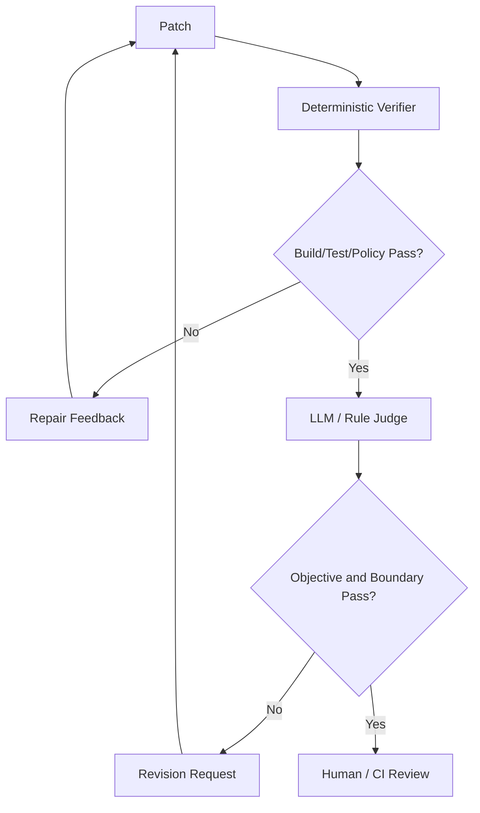
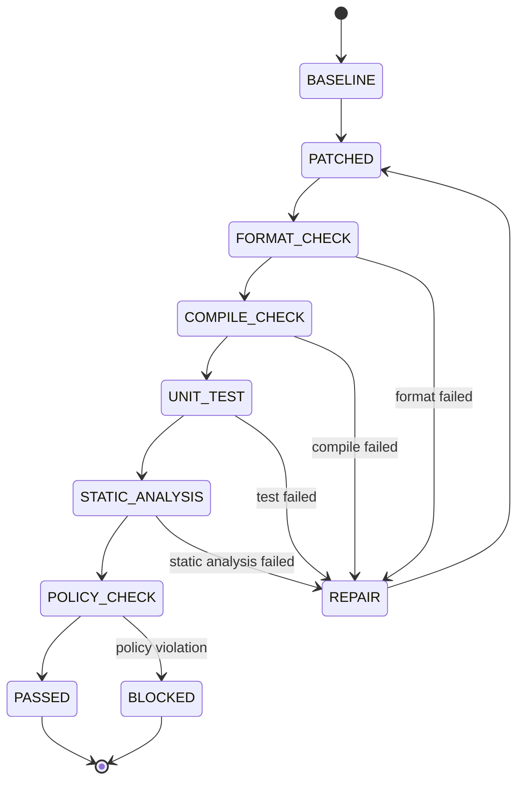
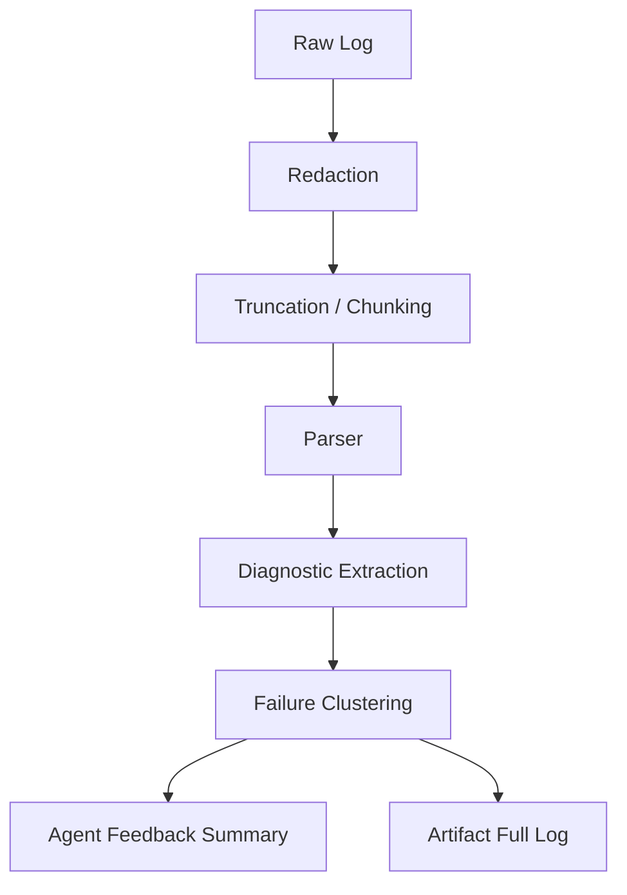
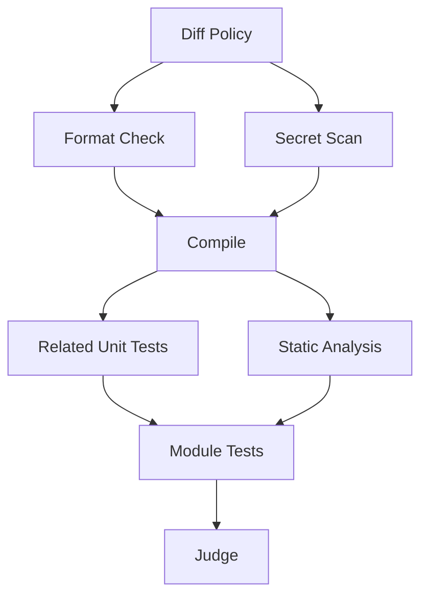

------
title: Learn AI Coding Agent From Scratch - Part 048
description: Verification loop design untuk Honk-like AI coding agent, meliputi format, lint, compile, unit test, integration test, static analysis, baseline verification, failure classification, repair feedback, flaky test handling, dan evidence report.
series: learn-ai-coding-agent
seriesTitle: Learn AI Coding Agent From Scratch
order: 48
partTitle: Verification Loop Design
slug: verification-loop-design
tags:
  - ai-coding-agent
  - verifier
  - testing
  - ci
  - static-analysis
  - build-system
  - feedback-loop
  - quality-gate
date: 2026-07-04
---

# Part 048 — Verification Loop Design: Format, Lint, Compile, Unit Test, Integration Test, Static Analysis

Agent yang bisa mengedit kode belum tentu agent yang layak membuka PR.

Perbedaan utamanya adalah **verification**.

Tanpa verifier, agent hanya menghasilkan patch. Dengan verifier, agent menghasilkan patch plus evidence.

```txt
Bad mental model:
  Agent writes code, then runs tests.

Better mental model:
  Agent participates in a feedback loop where deterministic verifiers classify
  the patch's current state and return actionable, bounded feedback.
```

Verification loop adalah salah satu komponen paling penting pada Honk-like background coding agent. Spotify juga menekankan strong feedback loops untuk membuat background coding agent menghasilkan hasil yang lebih predictable, bukan hanya kreatif.

Di bagian ini kita akan membangun mental model dan desain konkret verification loop.

---

## 1. Verifier bukan CI biasa

CI dan verifier mirip, tapi tidak sama.

| Aspek | CI | Agent Verifier |
|---|---|---|
| Trigger | Setelah push/PR | Selama agent bekerja |
| Audience | Developer/reviewer | Agent runtime + orchestrator |
| Output | Log/check status | Structured feedback |
| Goal | Gate merge | Guide repair loop |
| Scope | Usually broad | Adaptive/targeted |
| Runtime | Bisa lama | Harus budget-aware |
| Failure format | Manusia baca log | Agent butuh normalized diagnosis |

CI menjawab:

> Apakah perubahan ini boleh merge?

Verifier agent menjawab:

> Apa state patch sekarang, apa failure-nya, apakah repairable, dan feedback apa yang perlu diberikan ke agent?

---

## 2. Tiga lapis pembuktian: verifier, judge, reviewer

Jangan campur semua evaluasi dalam satu mekanisme.



### 2.1 Verifier

Deterministic, tool-based, repeatable.

Contoh:

- format check,
- lint,
- compile,
- unit test,
- static analysis,
- secret scan,
- dependency policy.

### 2.2 Judge

Menilai kesesuaian dengan objective dan scope.

Contoh:

- apakah prompt contract terpenuhi,
- apakah patch overreach,
- apakah test meaningful,
- apakah PR body jujur.

Judge bisa memakai LLM, rule, atau kombinasi.

### 2.3 Human reviewer

Memutuskan acceptance di context organisasi.

Verifier hijau bukan berarti reviewer harus merge.

---

## 3. Verification loop sebagai state machine



Pada implementation nyata, urutannya bisa berbeda. Namun prinsipnya sama:

1. mulai dari baseline,
2. jalankan verifier murah dulu,
3. jalankan verifier mahal setelah cheap gates lulus,
4. klasifikasi failure,
5. berikan feedback yang bounded,
6. batasi repair iteration,
7. simpan evidence.

---

## 4. Baseline verification

Sebelum agent mengubah kode, jalankan baseline.

Tujuan:

- mengetahui kondisi repo awal,
- membedakan existing failure dari agent-introduced failure,
- memilih verifier profile yang realistis,
- mencegah agent memperbaiki masalah unrelated.

Contoh:

```yaml
baseline:
  command: mvn -q -DskipITs test
  result: failed
  failures:
    - test: LegacyPaymentServiceTest.shouldRetryTimeout
      status: existing_failure
```

Setelah patch, jika test yang sama masih gagal dengan signature sama, agent tidak perlu memperbaikinya kecuali task contract memang meminta.

Baseline failure harus disimpan sebagai artifact.

---

## 5. Verification profile

Tidak semua task perlu full test suite.

Verification profile menentukan verifier mana yang dijalankan.

```yaml
verification_profile:
  id: java_maven_standard
  phases:
    - name: format_check
      command: mvn -q spotless:check
      timeout_seconds: 120
      cost: cheap
    - name: compile
      command: mvn -q -DskipTests compile
      timeout_seconds: 300
      cost: medium
    - name: unit_tests_targeted
      command: mvn -q -Dtest=UserPaymentServiceTest test
      timeout_seconds: 300
      cost: medium
    - name: unit_tests_module
      command: mvn -q test
      timeout_seconds: 900
      cost: expensive
```

Profile bisa dipilih berdasarkan:

- language,
- build tool,
- files changed,
- risk class,
- autonomy level,
- time budget,
- repository instruction,
- historical CI data.

---

## 6. Cheap-to-expensive ordering

Verifier harus disusun dari murah ke mahal.

```txt
1. Diff policy / forbidden path
2. Format check / generated file check
3. Static parse / syntax check
4. Compile
5. Targeted tests
6. Module tests
7. Integration tests
8. Full CI equivalent
```

Mengapa?

Karena tidak masuk akal menjalankan integration test 20 menit jika compile saja gagal.

Cheap verifier menghemat:

- waktu,
- token,
- cost provider,
- queue capacity,
- developer patience.

---

## 7. Verifier output harus structured

Raw log tidak cukup.

Output verifier harus punya schema.

```json
{
  "verifierId": "maven_compile",
  "status": "failed",
  "startedAt": "2026-07-04T10:15:00Z",
  "durationMs": 184000,
  "command": "mvn -q -DskipTests compile",
  "exitCode": 1,
  "failureClass": "compile_error",
  "repairability": "repairable_by_agent",
  "summary": "3 compile errors caused by missing BarClient method adaptation.",
  "diagnostics": [
    {
      "file": "src/main/java/com/acme/payments/UserPaymentService.java",
      "line": 42,
      "symbol": "BarClient.getUser",
      "message": "cannot find symbol method getUser(String)",
      "suggestedFocus": "Use fetchUser(UserId) and handle Optional<User>."
    }
  ],
  "artifacts": [
    "artifact://logs/maven-compile-run-17.txt"
  ]
}
```

Agent menerima summary + diagnostic relevan, bukan log mentah 30.000 baris.

---

## 8. Failure classification

Verifier harus mengklasifikasi failure.

| Failure class | Contoh | Action |
|---|---|---|
| `format_error` | Spotless/checkstyle failed | auto-format or repair |
| `syntax_error` | parser failed | repair source |
| `compile_error` | Java symbol/type error | repair source |
| `unit_test_failure` | assertion failed | inspect behavior/test |
| `integration_failure` | external dependency missing | maybe block/escalate |
| `flaky_test` | intermittent | rerun with policy |
| `environment_failure` | network/cache/tool unavailable | retry infra |
| `policy_violation` | forbidden path/secret | block |
| `baseline_failure` | existed before patch | ignore or report |
| `unknown` | unparsed failure | summarize and escalate/repair cautiously |

Repairability harus explicit:

```yaml
repairability:
  - repairable_by_agent
  - repairable_with_human_decision
  - infra_retry
  - not_repairable_in_scope
  - block_immediately
```

Ini mencegah agent memperbaiki hal yang bukan wewenangnya.

---

## 9. Compile verifier

Compile adalah verifier paling penting untuk bahasa typed seperti Java.

Compile menjawab:

- apakah symbol tersedia,
- apakah type match,
- apakah signature benar,
- apakah module dependency valid,
- apakah generated source tersedia.

Untuk Maven:

```bash
mvn -q -DskipTests compile
```

Namun untuk multi-module repo, bisa lebih efisien:

```bash
mvn -q -pl payments-service -am -DskipTests compile
```

`-pl` memilih project/module, `-am` juga membangun required projects.

Verifier harus tahu kapan menjalankan full compile dan kapan targeted module compile.

---

## 10. Test verifier

Test verifier tidak hanya menjalankan test. Ia harus memilih test yang relevan.

Tingkat test:

| Level | Tujuan | Kapan dipakai |
|---|---|---|
| related test | feedback cepat | setelah patch kecil |
| changed module test | confidence sedang | sebelum judge |
| full unit test | confidence lebih besar | sebelum PR untuk medium risk |
| integration test | contract/runtime confidence | high risk change |
| full CI equivalent | merge confidence | sebelum auto-merge, jika diizinkan |

Contoh Maven targeted test:

```bash
mvn -q -Dtest=UserPaymentServiceTest test
```

Surefire mendukung menjalankan test tertentu melalui property `test`, berguna untuk inner loop agent.

---

## 11. Static analysis verifier

Static analysis menangkap masalah yang compile/test tidak selalu tangkap.

Contoh:

- nullness,
- bug pattern,
- unsafe API,
- dependency vulnerability,
- style/convention,
- forbidden imports,
- dead code,
- concurrency misuse,
- resource leak.

Tool contoh:

- Checkstyle,
- SpotBugs,
- Error Prone,
- PMD,
- Semgrep,
- custom organization rule.

Untuk agent platform, static analysis berguna karena outputnya bisa dipetakan ke file/line.

Namun jangan memasukkan semua static analysis ke every inner loop. Pilih sesuai risk dan budget.

---

## 12. Format verifier

Format verifier mencegah PR noisy.

Ada dua mode:

### 12.1 Check mode

```bash
mvn -q spotless:check
```

Jika gagal, agent diberi feedback.

### 12.2 Apply mode

```bash
mvn -q spotless:apply
```

Tool memperbaiki format otomatis.

Untuk agent, apply mode boleh jika:

- formatter deterministic,
- allowed by repo instruction,
- output diff tetap dalam scope,
- formatter tidak menyentuh unrelated massive files.

Jika formatter mengubah 200 file, block.

---

## 13. Policy verifier

Policy verifier bukan build/test. Ia memeriksa batas organisasi.

Contoh:

- forbidden path changed,
- secret-like content introduced,
- license risk,
- dangerous dependency,
- CI workflow changed,
- test disabled,
- generated file changed without generator,
- production config changed without approval,
- lockfile changed unexpectedly,
- delete large file,
- chmod executable added.

Policy verifier harus berjalan sebelum PR.

Sebagian policy verifier juga harus berjalan setelah setiap patch segment.

---

## 14. Verifier command spec

Jangan simpan verifier hanya sebagai string shell.

Gunakan command spec.

```yaml
command_spec:
  id: maven_compile
  argv:
    - mvn
    - -q
    - -DskipTests
    - compile
  working_directory: /workspace/repo
  timeout_seconds: 300
  network: disabled
  env:
    MAVEN_OPTS: "-Xmx2g"
  output:
    max_bytes: 200000
    redact: true
  classify_with: maven_compile_parser_v1
```

Mengapa argv, bukan shell string?

Karena verifier tidak boleh membuka command injection surface yang tidak perlu.

---

## 15. Log parsing dan summarization

Verifier harus mengubah log menjadi diagnostic.

Pipeline:



Important rule:

> Full log disimpan sebagai artifact, tapi agent hanya mendapat subset yang relevan.

Ini mengurangi noise dan prompt injection risk dari log.

---

## 16. Repair feedback

Feedback ke agent harus actionable.

Buruk:

```txt
Tests failed. Fix it.
```

Baik:

```yaml
repair_feedback:
  failure_class: compile_error
  cluster: optional-handling-after-client-migration
  affected_files:
    - src/main/java/com/acme/payments/UserPaymentService.java
  diagnosis: BarClient.fetchUser returns Optional<User>, but migrated code still expects User.
  constraints:
    - Preserve old behavior: missing user should return null to caller for now.
    - Do not change public API of UserPaymentService.
    - Do not modify tests until production behavior compiles.
  next_verifier: maven_compile_targeted
```

Repair feedback harus mengarahkan agent ke cluster, bukan seluruh repo.

---

## 17. Repair loop budget

Tanpa budget, repair loop bisa infinite.

```yaml
repair_budget:
  max_iterations_total: 8
  max_iterations_per_cluster: 3
  max_same_failure_repetition: 2
  stop_on_policy_violation: true
```

Jika failure signature sama muncul dua kali, jangan terus mencoba dengan prompt sama.

Action:

- revise diagnosis,
- request more context,
- escalate,
- stop.

---

## 18. Handling flaky tests

Flaky tests adalah musuh verifier.

Salah satu bahaya: agent menganggap flaky failure sebagai akibat patch dan mengubah kode/test yang tidak perlu.

Policy:

```yaml
flaky_policy:
  rerun_failed_test_once: true
  rerun_same_seed_if_available: true
  compare_with_baseline_failures: true
  max_flaky_reruns: 2
  mark_as_inconclusive_after_budget: true
```

Classification:

```txt
failed -> rerun -> passed = suspected flaky
failed -> rerun -> failed with same signature = stable failure
failed -> rerun -> different failure = unstable environment or flaky suite
```

Agent tidak boleh melemahkan test hanya karena flaky.

---

## 19. Environment failure

Tidak semua verifier failure adalah code failure.

Contoh:

- Maven Central unreachable,
- Docker daemon unavailable,
- testcontainer tidak bisa start,
- port conflict,
- disk full,
- out of memory,
- dependency cache corrupted,
- secret missing.

Environment failure harus diklasifikasi sebagai `infra_retry` atau `blocked`, bukan `repairable_by_agent`.

Jika secret diperlukan, agent tidak boleh meminta secret dimasukkan ke prompt. Ia harus memakai secret lease/approval mechanism dari platform.

---

## 20. Integration test boundary

Integration test sering mahal dan butuh external service.

Untuk agent, integration test harus dikontrol:

```yaml
integration_test_policy:
  default: disabled
  allow_when:
    - risk_class: high
    - task_contract.requires_runtime_verification: true
  requires:
    - sandbox_network_profile: internal_test_only
    - ephemeral_credentials: true
    - timeout_seconds: 1800
```

Integration test tidak boleh diam-diam mengakses production.

---

## 21. Verification evidence report

Setiap verifier run menghasilkan evidence.

```json
{
  "verificationReportId": "ver_123",
  "runId": "run_456",
  "baseCommit": "abc123",
  "patchHash": "diff789",
  "profile": "java_maven_standard",
  "results": [
    {
      "id": "diff_policy",
      "status": "passed",
      "durationMs": 120
    },
    {
      "id": "maven_compile",
      "status": "passed",
      "durationMs": 183000
    },
    {
      "id": "targeted_unit_test",
      "status": "passed",
      "durationMs": 91000
    }
  ],
  "conclusion": "passed_with_limited_scope",
  "limitations": [
    "Integration tests were not run by profile policy."
  ]
}
```

Conclusion harus jujur.

Jangan tulis “all tests passed” jika hanya targeted test yang jalan.

---

## 22. Verifier profile selection

Profile selection bisa deterministic.

```java
VerificationProfile selectProfile(TaskContract task, DiffSummary diff, RepoMetadata repo) {
    if (diff.touches("pom.xml") || diff.touches("build.gradle")) {
        return profiles.javaDependencyUpgrade();
    }

    if (diff.onlyTouchesTests()) {
        return profiles.testOnlyChange();
    }

    if (task.riskClass() == RiskClass.HIGH) {
        return profiles.fullModuleWithIntegrationOption();
    }

    if (repo.language() == Language.JAVA && repo.buildTool() == BuildTool.MAVEN) {
        return profiles.javaMavenStandard();
    }

    return profiles.genericCompileAndTest();
}
```

LLM boleh memberi rekomendasi, tetapi final profile selection sebaiknya policy-driven.

---

## 23. Verification graph, bukan linear list

Kadang verifier punya dependency graph.



Graph memungkinkan parallelism.

Contoh:

- secret scan bisa jalan parallel dengan format check,
- static analysis bisa jalan setelah compile,
- targeted tests bisa jalan sebelum module tests,
- judge hanya jalan setelah deterministic gates pass.

---

## 24. Incremental verification

Long-horizon task tidak harus menjalankan full verifier setelah setiap edit.

Gunakan incremental strategy:

```txt
After small file edit:
  syntax/compile targeted

After repair cluster:
  compile targeted + related test

After phase complete:
  module test + static analysis

Before PR:
  full required profile
```

Ini membuat agent cepat namun tetap aman.

---

## 25. Test selection

Test selection bisa memakai:

- file naming convention,
- module mapping,
- code ownership,
- symbol references,
- previous coverage data,
- build tool metadata,
- historical CI impact,
- dependency graph.

Contoh heuristic awal:

```txt
Changed file:
  src/main/java/com/acme/payments/UserPaymentService.java

Candidate tests:
  src/test/java/com/acme/payments/UserPaymentServiceTest.java
  src/test/java/com/acme/payments/*Payment*Test.java
  module payments-service test suite
```

Heuristic tidak sempurna. Report harus menyebut limitation.

---

## 26. Verifier should not mutate source by default

Verifier mode default adalah read-only terhadap source.

Exception:

- formatter apply,
- code generator,
- dependency lock refresh.

Mutating verifier harus explicit:

```yaml
mutates_workspace: true
mutation_type: formatting
allowed_paths:
  - src/main/java/**
  - src/test/java/**
post_mutation_scope_guard: true
```

Jika verifier mengubah file, perubahan itu harus masuk patch stack sebagai artifact.

---

## 27. Preventing verifier gaming

Agent bisa belajar melewati verifier dengan cara buruk.

Contoh:

- skip test,
- ubah test expectation tanpa alasan,
- add `@Disabled`,
- remove code path,
- catch exception silently,
- make method return constant,
- change verifier config.

Solusi:

1. policy verifier,
2. diff boundary judge,
3. test quality judge,
4. forbidden pattern scanner,
5. reviewer evidence,
6. separate permission for changing build/CI/test config.

Verifier hijau tanpa policy guard bisa menipu.

---

## 28. PR verification vs inner-loop verification

Inner-loop verifier membantu agent memperbaiki patch.

PR verifier memberi reviewer confidence.

| Stage | Profile | Tujuan |
|---|---|---|
| inner loop | cheap targeted | cepat memperbaiki |
| phase gate | medium scoped | memastikan phase valid |
| pre-PR | required profile | evidence untuk PR |
| CI | org standard | merge gate |

Agent tidak boleh mengklaim melewati CI jika hanya menjalankan inner-loop verifier.

---

## 29. Example: Java Maven verifier profile

```yaml
id: java_maven_dependency_upgrade
language: java
build_tool: maven
steps:
  - id: diff_policy
    type: policy
    timeout_seconds: 10

  - id: secret_scan
    type: policy
    timeout_seconds: 60

  - id: maven_validate
    argv: ["mvn", "-q", "validate"]
    timeout_seconds: 180
    classify_with: maven_parser

  - id: maven_compile
    argv: ["mvn", "-q", "-DskipTests", "compile"]
    timeout_seconds: 600
    classify_with: maven_compile_parser

  - id: targeted_tests
    argv: ["mvn", "-q", "-Dtest=${relatedTests}", "test"]
    timeout_seconds: 600
    when: relatedTests.exists
    classify_with: surefire_parser

  - id: module_tests
    argv: ["mvn", "-q", "test"]
    timeout_seconds: 1200
    classify_with: surefire_parser

conclusion_policy:
  require_pass:
    - diff_policy
    - secret_scan
    - maven_compile
  allow_inconclusive:
    - targeted_tests
  require_or_explain:
    - module_tests
```

---

## 30. Example: verifier service interface

```java
public interface VerifierService {
    VerificationReport verify(VerificationRequest request);
}

public record VerificationRequest(
    UUID runId,
    String baseCommit,
    String patchHash,
    VerificationProfileId profileId,
    Path workspace,
    Map<String, String> parameters,
    VerificationBudget budget
) {}

public record VerificationReport(
    UUID reportId,
    VerificationStatus status,
    List<VerifierStepResult> steps,
    List<Diagnostic> diagnostics,
    List<ArtifactRef> artifacts,
    List<String> limitations,
    Instant startedAt,
    Instant finishedAt
) {}
```

---

## 31. Example: repair loop with verifier feedback

```java
RepairResult repairUntilVerified(RunContext ctx, VerificationProfile profile) {
    int iteration = 0;
    FailureSignature previous = null;
    int repeated = 0;

    while (iteration < ctx.policy().maxRepairIterations()) {
        VerificationReport report = verifier.verify(ctx.workspace(), profile);

        if (report.status() == VerificationStatus.PASSED) {
            return RepairResult.verified(report);
        }

        if (report.status() == VerificationStatus.BLOCKED) {
            return RepairResult.blocked(report);
        }

        FailureSignature current = signatureOf(report);
        repeated = current.equals(previous) ? repeated + 1 : 0;
        previous = current;

        if (repeated >= ctx.policy().maxSameFailureRepetition()) {
            return RepairResult.escalate("Same verifier failure repeated", report);
        }

        RepairFeedback feedback = feedbackBuilder.from(report, ctx.taskContract());
        PatchResult patch = agent.repair(ctx, feedback);

        ScopeVerdict scope = scopeGuard.evaluate(ctx.taskContract(), patch.diff());
        if (!scope.allowedToContinue()) {
            return RepairResult.blocked(scope.reason(), report);
        }

        iteration++;
    }

    return RepairResult.escalate("Repair budget exhausted");
}
```

---

## 32. Observability untuk verification loop

Trace minimal:

```txt
verification.step.started
verification.step.completed
verification.step.failed
verification.failure.classified
verification.feedback.generated
repair.iteration.started
repair.iteration.completed
repair.budget.exhausted
```

Metric:

| Metric | Makna |
|---|---|
| verifier pass rate | kualitas patch awal |
| mean time to feedback | seberapa cepat agent mendapat signal |
| failure class distribution | area paling sering gagal |
| repair success after compile failure | efektivitas repair loop |
| repeated failure rate | agent stuck |
| flaky classification rate | kualitas test suite |
| environment failure rate | reliability sandbox/build |
| verifier cost per PR | economic viability |

---

## 33. Case study: compile fails after API migration

Patch awal:

```java
BarClient client;
User user = client.getUser(id);
```

Compile failure:

```txt
cannot find symbol: method getUser(String)
```

Verifier parser menghasilkan:

```yaml
failure_class: compile_error
repairability: repairable_by_agent
cluster: barclient-method-migration
diagnosis: BarClient exposes fetchUser(UserId), not getUser(String).
constraints:
  - preserve method public signature
  - do not update tests yet
suggested_context:
  - BarClient.java
  - UserId.java
  - UserPaymentService.java
```

Agent repair:

```java
Optional<User> user = client.fetchUser(UserId.of(id));
return user.orElse(null);
```

Verifier berikutnya:

```txt
compile passed
related unit test failed: expected timeout exception
```

Failure berganti dari compile ke behavior test. Repair strategy juga harus berubah.

---

## 34. Anti-pattern

### 34.1 Raw log dumping

Memberi seluruh log ke model tanpa parsing menghasilkan noise, cost tinggi, dan prompt injection risk.

### 34.2 Full test every iteration

Membuang waktu dan queue capacity.

### 34.3 No baseline

Agent memperbaiki failure lama yang tidak terkait task.

### 34.4 Verifier mutates secretly

Formatter/generator mengubah file tanpa dicatat.

### 34.5 LLM judge replaces deterministic verifier

LLM tidak boleh menggantikan compile/test/scan.

### 34.6 Green means correct

Test hijau tidak membuktikan objective terpenuhi. Tetap perlu judge dan review.

---

## 35. Checklist desain

Sebelum menggunakan verifier untuk autonomous PR:

- [ ] baseline verification tersedia,
- [ ] verifier profile dipilih berdasarkan task/diff/risk,
- [ ] cheap-to-expensive ordering diterapkan,
- [ ] command spec berbasis argv, bukan shell string,
- [ ] output log dibatasi dan disimpan sebagai artifact,
- [ ] diagnostic structured,
- [ ] failure classification tersedia,
- [ ] repairability explicit,
- [ ] repair loop punya budget,
- [ ] repeated failure detection tersedia,
- [ ] flaky policy tersedia,
- [ ] environment failure dibedakan dari code failure,
- [ ] policy verifier berjalan,
- [ ] mutating verifier explicit,
- [ ] PR report jujur tentang verifier yang dijalankan,
- [ ] verifier result menyertakan limitation.

---

## 36. Latihan

### Latihan 1

Buat `VerificationProfile` untuk Java Maven service yang mendukung:

- compile,
- targeted test,
- module test,
- Spotless check,
- secret scan,
- forbidden path policy.

### Latihan 2

Ambil satu Maven failure log. Buat parser sederhana yang menghasilkan:

- file,
- line,
- error type,
- message,
- suggested focus.

### Latihan 3

Desain repair loop budget untuk dependency upgrade high risk.

Tentukan:

- max iteration,
- max same failure repetition,
- when to run full test,
- when to escalate.

### Latihan 4

Tulis PR verification report yang jujur untuk kondisi:

- compile passed,
- targeted test passed,
- module test skipped karena timeout budget,
- integration test not run.

---

## 37. Ringkasan

Verification loop adalah pembeda antara coding agent yang sekadar menulis patch dan coding agent yang bisa dipercaya.

Desain yang benar:

```txt
baseline -> cheap verifier -> compile -> targeted tests -> broader tests
         -> policy checks -> structured diagnostics -> bounded repair
         -> evidence report -> judge -> PR
```

Verifier harus:

- deterministic,
- structured,
- budget-aware,
- failure-aware,
- repair-oriented,
- honest about limitations,
- tidak mudah digame oleh agent.

Mental model utama:

```txt
Verifier is not a test command.
Verifier is a feedback protocol between the codebase, the sandbox, the agent,
and the human reviewer.
```

Bagian berikutnya akan memperdalam build-system verifier untuk Maven, Gradle, Node, Go, dan multi-module repository, karena setiap build system punya cara berbeda untuk memberi feedback yang bisa dimanfaatkan agent.

---

## Referensi

- Spotify Engineering — Background Coding Agents: Predictable Results Through Strong Feedback Loops: https://engineering.atspotify.com/2025/12/feedback-loops-background-coding-agents-part-3
- Apache Maven Surefire Plugin — Running a Single Test: https://maven.apache.org/surefire/maven-surefire-plugin/examples/single-test.html
- Apache Maven — Guide to Working with Multiple Modules: https://maven.apache.org/guides/mini/guide-multiple-modules.html
- OpenAI Codex — Agent approvals and security: https://developers.openai.com/codex/agent-approvals-security
- OpenAI Codex — Sandboxing: https://developers.openai.com/codex/concepts/sandboxing
- Anthropic Claude Code — Hooks Guide: https://code.claude.com/docs/en/hooks-guide
- OWASP — OS Command Injection Defense Cheat Sheet: https://cheatsheetseries.owasp.org/cheatsheets/OS_Command_Injection_Defense_Cheat_Sheet.html
