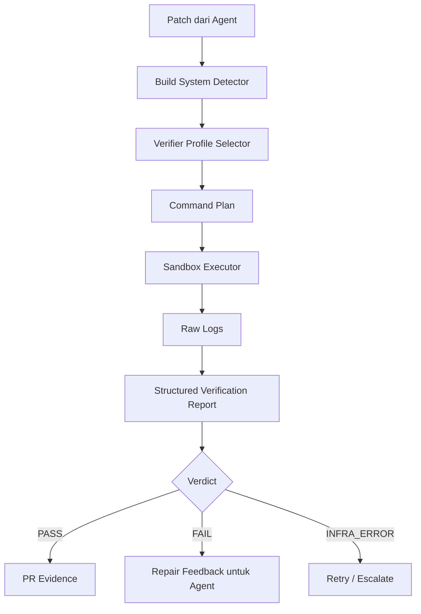
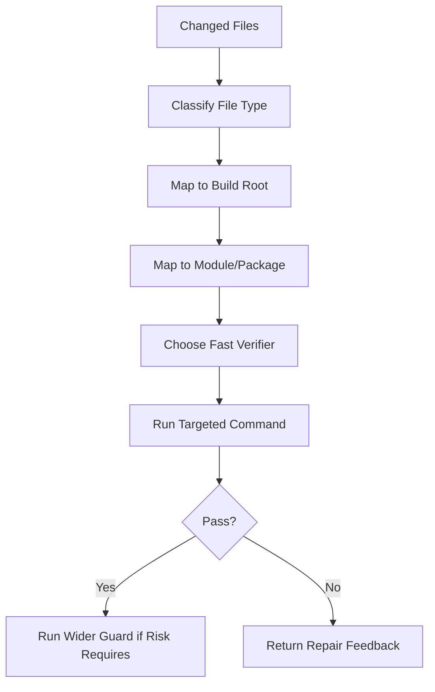
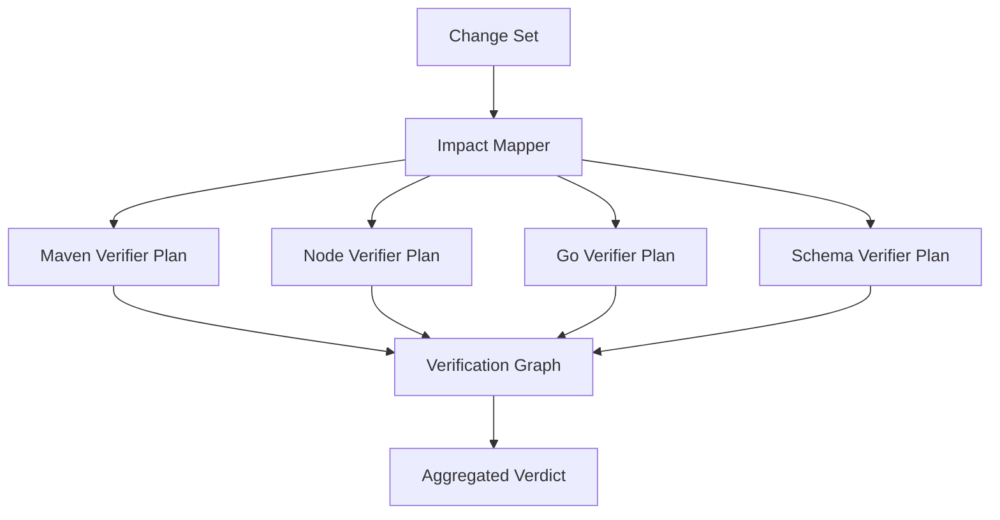
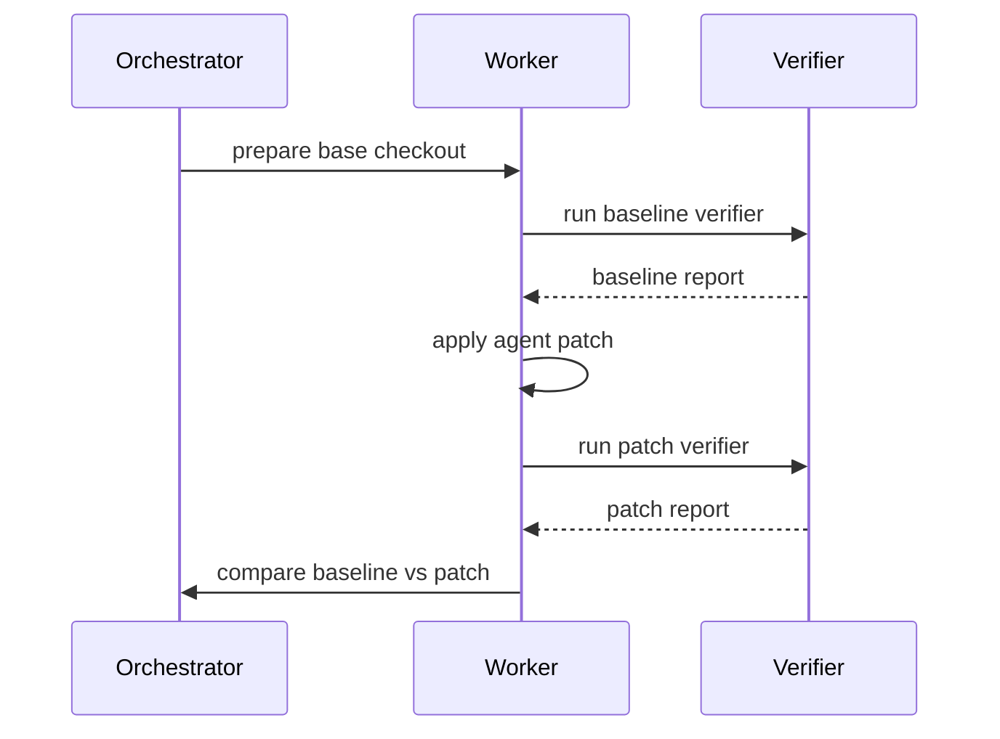

------
title: Learn AI Coding Agent From Scratch - Part 049
description: Build system verifier untuk Maven, Gradle, Node, Go, dan multi-module repository agar AI coding agent dapat membuktikan perubahan kode dengan command yang benar, repeatable, aman, dan bisa diaudit.
series: learn-ai-coding-agent
seriesTitle: Learn AI Coding Agent From Scratch
order: 49
partTitle: Build System Verifier: Maven, Gradle, Node, Go, Multi-Module Repo
tags:
- ai-coding-agent
- verifier
- build-system
- maven
- gradle
- nodejs
- go
- ci
- sandbox
- series
date: 2026-07-04
---

# Part 049 — Build System Verifier: Maven, Gradle, Node, Go, Multi-Module Repo

Di part sebelumnya kita membangun **verification loop design**. Sekarang kita turun satu level lebih konkret: bagaimana verifier benar-benar menjalankan build ecosystem nyata seperti Maven, Gradle, Node, Go, dan repository multi-module.

Target bagian ini bukan membuat agent tahu command hafalan seperti `mvn test` atau `npm test`. Itu terlalu dangkal.

Targetnya adalah membangun **build system verifier**: komponen yang menerima patch dari agent, memahami jenis project, memilih command yang tepat, menjalankan command dalam sandbox, mengubah output menjadi artifact, dan mengembalikan verdict yang bisa dipakai agent untuk repair atau dipakai manusia untuk review PR.

Kalau bagian ini salah, agent akan terlihat pintar tetapi rapuh. Ia bisa membuat PR yang compile di satu module tetapi merusak module lain, menambahkan test yang tidak pernah dijalankan, mengubah lockfile tanpa sadar, atau menganggap error dependency sebagai error kode.

Verifier yang bagus membuat AI coding agent berubah dari:

> “Saya sudah mengubah kode, semoga benar.”

menjadi:

> “Saya mengubah file ini, menjalankan verifier ini, command ini pass/fail, evidence-nya ada, dan failure berikut perlu diperbaiki.”

---

## 1. Mental Model: Build System Verifier Adalah Adapter Antara Patch dan Bukti

Agent menghasilkan **hypothesis** dalam bentuk patch.

Verifier menguji hypothesis itu terhadap kenyataan.



Build system verifier bukan satu command. Ia adalah pipeline:

1. **detect**: repo ini pakai build system apa?
2. **scope**: perubahan ini berdampak ke module/package mana?
3. **select**: verifier profile mana yang cukup kuat tetapi tidak boros?
4. **execute**: jalankan command dengan sandbox policy.
5. **capture**: simpan stdout, stderr, exit code, duration, environment, dan artifact.
6. **classify**: compile error, test failure, lint failure, dependency failure, flaky test, infra failure, timeout, atau policy violation.
7. **report**: kembalikan evidence terstruktur.

Invariant-nya sederhana:

> Tidak ada patch yang dianggap benar hanya karena agent yakin. Patch hanya naik level bila verifier menghasilkan evidence yang bisa direproduksi.

---

## 2. Design Goals

Build verifier untuk AI coding agent harus memenuhi beberapa goal.

### 2.1 Repeatable

Command yang dijalankan harus bisa diulang oleh developer lokal atau CI. Karena itu verifier report wajib mencatat:

- working directory,
- command argv,
- environment penting,
- selected modules,
- timeout,
- exit code,
- hash workspace sebelum/sesudah verifier bila perlu,
- artifact path.

### 2.2 Bounded

Agent tidak boleh menjalankan semua hal setiap kali tanpa batas. Repository besar bisa punya test suite berjam-jam. Verifier harus punya profile:

- `baseline`,
- `format`,
- `compile`,
- `unit_test_targeted`,
- `unit_test_all`,
- `integration_test`,
- `static_analysis`,
- `full_ci_like`.

### 2.3 Safe

Build command bisa menjalankan arbitrary code melalui plugin, lifecycle hook, npm script, Gradle task, Maven plugin, atau generated code. Jadi build verifier harus tetap tunduk pada sandbox dan permission model dari Part 019–020.

### 2.4 Evidence-Oriented

Verifier bukan hanya memberi `success: false`. Ia harus memberi diagnostic yang actionable:

```json
{
  "kind": "COMPILE_ERROR",
  "file": "src/main/java/com/acme/UserService.java",
  "line": 42,
  "message": "cannot find symbol method getEmailAddress()",
  "likely_owner": "agent_patch",
  "suggested_next_action": "Inspect call site and replacement API contract"
}
```

### 2.5 Honest

Verifier harus bisa bilang:

- `PASS`,
- `FAIL_PATCH_RELATED`,
- `FAIL_BASELINE_EXISTING`,
- `FAIL_INFRASTRUCTURE`,
- `FAIL_POLICY`,
- `INCONCLUSIVE`.

`FAIL` tidak selalu berarti agent salah. Bisa saja baseline repo memang rusak sebelum patch. Karena itu baseline verification penting.

---

## 3. Generic Verifier Contract

Sebelum masuk Maven/Gradle/Node/Go, kita definisikan kontrak umum.

```ts
type BuildSystem =
  | "MAVEN"
  | "GRADLE"
  | "NODE_NPM"
  | "NODE_PNPM"
  | "NODE_YARN"
  | "GO"
  | "MULTI"
  | "UNKNOWN";

type VerifierIntent =
  | "FORMAT_CHECK"
  | "COMPILE"
  | "UNIT_TEST"
  | "INTEGRATION_TEST"
  | "STATIC_ANALYSIS"
  | "PACKAGE"
  | "FULL";

type VerificationVerdict =
  | "PASS"
  | "FAIL_PATCH_RELATED"
  | "FAIL_BASELINE_EXISTING"
  | "FAIL_INFRASTRUCTURE"
  | "FAIL_POLICY"
  | "TIMEOUT"
  | "INCONCLUSIVE";

interface VerifierProfile {
  id: string;
  buildSystem: BuildSystem;
  intent: VerifierIntent;
  description: string;
  workingDirectory: string;
  command: string[];
  timeoutSeconds: number;
  networkPolicy: "OFF" | "ALLOW_PACKAGE_REGISTRY" | "ALLOW_CONFIGURED";
  mutatesWorkspace: boolean;
  expectedArtifacts: string[];
  outputParsers: string[];
}

interface VerificationReport {
  runId: string;
  attemptId: string;
  profileId: string;
  buildSystem: BuildSystem;
  command: string[];
  workingDirectory: string;
  startedAt: string;
  finishedAt: string;
  durationMs: number;
  exitCode: number | null;
  verdict: VerificationVerdict;
  summary: string;
  diagnostics: DiagnosticEvent[];
  artifacts: ArtifactRef[];
  workspaceMutation: WorkspaceMutationReport;
}
```

Perhatikan field `mutatesWorkspace`. Banyak command build menulis file:

- `target/`,
- `build/`,
- `node_modules/`,
- `coverage/`,
- `.gradle/`,
- `.m2/`,
- `go test` cache,
- generated sources.

Verifier harus membedakan **allowed build artifact** dan **unexpected source mutation**.

---

## 4. Build System Detection

Detector tidak boleh hanya melihat satu file. Repository modern sering polyglot.

```ts
interface BuildSystemSignal {
  type: BuildSystem;
  path: string;
  confidence: number;
  evidence: string;
}

function detectBuildSystems(files: string[]): BuildSystemSignal[] {
  const signals: BuildSystemSignal[] = [];

  for (const path of files) {
    if (path.endsWith("pom.xml")) {
      signals.push({
        type: "MAVEN",
        path,
        confidence: 0.95,
        evidence: "pom.xml found"
      });
    }
    if (path.endsWith("build.gradle") || path.endsWith("build.gradle.kts") || path.endsWith("settings.gradle") || path.endsWith("settings.gradle.kts")) {
      signals.push({
        type: "GRADLE",
        path,
        confidence: 0.95,
        evidence: "Gradle build/settings file found"
      });
    }
    if (path.endsWith("package.json")) {
      signals.push({
        type: "NODE_NPM",
        path,
        confidence: 0.85,
        evidence: "package.json found"
      });
    }
    if (path.endsWith("pnpm-lock.yaml")) {
      signals.push({
        type: "NODE_PNPM",
        path,
        confidence: 0.95,
        evidence: "pnpm lockfile found"
      });
    }
    if (path.endsWith("yarn.lock")) {
      signals.push({
        type: "NODE_YARN",
        path,
        confidence: 0.95,
        evidence: "yarn lockfile found"
      });
    }
    if (path.endsWith("go.mod")) {
      signals.push({
        type: "GO",
        path,
        confidence: 0.95,
        evidence: "go.mod found"
      });
    }
  }

  return signals;
}
```

Akan tetapi detector juga harus memahami hierarchy.

Contoh:

```txt
repo/
  pom.xml
  services/billing/pom.xml
  services/identity/pom.xml
  web/package.json
  tools/migration/go.mod
```

Ini bukan “repo Maven”. Ini **multi-build-system repo**.

Output detector sebaiknya seperti ini:

```json
{
  "repo_kind": "MULTI",
  "roots": [
    { "build_system": "MAVEN", "root": ".", "manifest": "pom.xml" },
    { "build_system": "NODE_NPM", "root": "web", "manifest": "web/package.json" },
    { "build_system": "GO", "root": "tools/migration", "manifest": "tools/migration/go.mod" }
  ]
}
```

---

## 5. Change Impact to Verifier Selection

Verifier harus memilih command berdasarkan file yang berubah.



Contoh rule:

| Changed file | Likely verifier |
|---|---|
| `src/main/java/**` | compile + targeted tests |
| `src/test/java/**` | test compile + targeted test |
| `pom.xml` | dependency graph + compile + tests |
| `package.json` | install check + script test/build |
| `go.mod` | `go test ./...` + module graph check |
| `openapi.yaml` | schema validation + generated client/server compile |
| `.github/workflows/**` | workflow lint/static validation, no local compile guarantee |

Rule penting:

> Jika perubahan menyentuh build manifest atau lockfile, verifier harus memperluas scope.

Perubahan dependency tidak cukup diverifikasi dengan compile file target. Ia bisa mengubah transitive graph, plugin behavior, generated code, atau runtime behavior.

---

## 6. Maven Verifier

Maven punya lifecycle. Dokumentasi Maven menjelaskan lifecycle seperti `default`, `clean`, dan `site`, dengan phase yang berjalan berurutan sampai phase yang diminta. Ini penting untuk agent karena `mvn test` bukan hanya “test”; ia juga menjalankan fase sebelumnya seperti compile sesuai lifecycle.

### 6.1 Maven Signals

Detector Maven melihat:

- `pom.xml`,
- `.mvn/maven.config`,
- `mvnw`,
- parent POM,
- `<modules>` dalam POM,
- plugin penting seperti Surefire, Failsafe, Checkstyle, SpotBugs, JaCoCo, OpenAPI generator.

### 6.2 Command Matrix

| Intent | Command awal | Catatan |
|---|---|---|
| compile | `./mvnw -q -DskipTests compile` | Cepat untuk source compile |
| test compile | `./mvnw -q -DskipTests test-compile` | Berguna saat test berubah |
| unit test | `./mvnw -q test` | Surefire biasanya menjalankan unit test |
| integration test | `./mvnw -q verify` | Failsafe lazimnya berjalan di `integration-test`/`verify` |
| package | `./mvnw -q package` | Bisa menghasilkan artifact |
| dependency tree | `./mvnw -q dependency:tree` | Untuk dependency upgrade evidence |

Jangan selalu memakai `-q`. Untuk repair loop, log terlalu singkat bisa menghilangkan diagnostic. Strategi yang lebih baik:

1. command pertama normal atau semi-quiet,
2. kalau gagal, rerun targeted dengan output yang lebih detail,
3. simpan raw log sebagai artifact,
4. kirim ringkasan structured ke agent.

### 6.3 Maven Wrapper Policy

Prioritas command:

1. `./mvnw` bila ada dan executable,
2. `mvn` dari base image bila wrapper tidak ada,
3. block jika policy mewajibkan wrapper.

Kenapa wrapper penting? Karena wrapper mengikat versi Maven yang diharapkan repo.

Verifier profile:

```json
{
  "id": "maven-compile-fast",
  "buildSystem": "MAVEN",
  "intent": "COMPILE",
  "workingDirectory": ".",
  "command": ["./mvnw", "-B", "-DskipTests", "compile"],
  "timeoutSeconds": 600,
  "networkPolicy": "ALLOW_PACKAGE_REGISTRY",
  "mutatesWorkspace": true,
  "outputParsers": ["maven-compiler", "maven-surefire", "maven-dependency"]
}
```

`-B` atau batch mode penting agar command tidak interaktif.

### 6.4 Multi-Module Maven

Multi-module Maven tidak boleh diperlakukan sebagai folder biasa.

Contoh:

```xml
<modules>
  <module>domain</module>
  <module>service</module>
  <module>api</module>
</modules>
```

Jika file berubah di `service`, verifier bisa memakai:

```bash
./mvnw -B -pl service -am test
```

Makna praktis:

- `-pl service`: pilih module `service`,
- `-am`: juga build module yang dibutuhkan oleh module tersebut.

Namun agent harus hati-hati. Jika perubahan menyentuh parent POM, plugin management, dependency management, atau shared module, verifier harus naik ke root-level.

Rule:

```ts
function selectMavenScope(change: ChangeSet): MavenScope {
  if (change.touches("pom.xml") && change.path === "pom.xml") return { mode: "ROOT" };
  if (change.touchesAny(["**/pom.xml", ".mvn/**"])) return { mode: "AFFECTED_PLUS_ROOT_GUARD" };
  if (change.touchesAny(["*/src/main/java/**", "*/src/test/java/**"])) return { mode: "MODULE", module: inferModule(change) };
  return { mode: "ROOT_FAST" };
}
```

### 6.5 Maven Failure Classification

Common Maven failure classes:

| Pattern | Classification |
|---|---|
| `Compilation failure` | compile error |
| `cannot find symbol` | Java API mismatch |
| `Failed to execute goal ... surefire` | unit test failure or test infrastructure |
| `Could not resolve dependencies` | dependency resolution/network/repository issue |
| `Non-resolvable parent POM` | POM hierarchy issue |
| `There are test failures` | test failure |

Verifier harus membedakan:

- **compilation failure in changed file**,
- **compilation failure in downstream call site**,
- **test assertion failure**,
- **dependency resolution failure**,
- **plugin execution failure**,
- **network failure**.

---

## 7. Gradle Verifier

Gradle berbeda dari Maven. Gradle membangun task graph dari task dependencies. Dokumentasi Gradle menjelaskan build lifecycle meliputi initialization, configuration, dan execution; dalam configuration phase Gradle mengevaluasi build file dan membangun task graph berdasarkan dependency input/output task.

### 7.1 Gradle Signals

Detector melihat:

- `settings.gradle`,
- `settings.gradle.kts`,
- `build.gradle`,
- `build.gradle.kts`,
- `gradlew`,
- `gradle.properties`,
- `buildSrc/`,
- version catalog `gradle/libs.versions.toml`.

### 7.2 Command Matrix

| Intent | Command |
|---|---|
| compile Java | `./gradlew compileJava` |
| compile tests | `./gradlew testClasses` |
| unit test | `./gradlew test` |
| check | `./gradlew check` |
| assemble | `./gradlew assemble` |
| full build | `./gradlew build` |

Recommended verifier flags:

```bash
./gradlew --no-daemon --console=plain test
```

Kenapa?

- `--no-daemon`: lebih predictable di ephemeral sandbox,
- `--console=plain`: log lebih mudah diparse,
- no interactive terminal assumption.

### 7.3 Gradle Multi-Project

Gradle project bisa seperti ini:

```txt
repo/
  settings.gradle.kts
  build.gradle.kts
  services/billing/build.gradle.kts
  libs/common/build.gradle.kts
```

Targeted command:

```bash
./gradlew --no-daemon --console=plain :services:billing:test
```

Namun sama seperti Maven, perubahan di root build file, convention plugin, version catalog, atau `buildSrc` harus memperluas scope.

Rule:

| Change | Scope |
|---|---|
| `services/billing/src/**` | `:services:billing:test` |
| `libs/common/src/**` | `:libs:common:test` + dependent modules jika bisa diidentifikasi |
| `settings.gradle*` | root `check` atau `build` |
| `buildSrc/**` | root `check` |
| `gradle/libs.versions.toml` | root dependency/build guard |

### 7.4 Gradle Failure Classification

Common failure pattern:

| Pattern | Classification |
|---|---|
| `Execution failed for task ':x:compileJava'` | compile task failure |
| `Compilation failed; see the compiler error output` | compile error |
| `Execution failed for task ':x:test'` | test task failure |
| `Could not resolve all files for configuration` | dependency resolution |
| `Plugin ... was not found` | plugin resolution |
| `Task ... not found` | verifier profile mismatch |

Gradle logs kadang terlalu noisy. Parser harus mengambil:

- failed task,
- exception root cause,
- compiler diagnostic,
- test report path,
- build scan link jika ada tetapi jangan bergantung pada network.

---

## 8. Node Verifier

Node ecosystem lebih heterogen. `package.json` memiliki `scripts` property untuk lifecycle dan arbitrary scripts. NPM docs menjelaskan bahwa `scripts` mendukung built-in scripts, lifecycle events, dan arbitrary scripts.

Karena script bisa menjalankan apa pun, verifier harus lebih policy-driven.

### 8.1 Node Signals

Detector melihat:

- `package.json`,
- `package-lock.json`,
- `npm-shrinkwrap.json`,
- `pnpm-lock.yaml`,
- `yarn.lock`,
- `turbo.json`,
- `nx.json`,
- `lerna.json`,
- `tsconfig.json`,
- `vite.config.*`,
- `jest.config.*`,
- `vitest.config.*`.

### 8.2 Package Manager Selection

Rule umum:

| Signal | Package manager |
|---|---|
| `pnpm-lock.yaml` | pnpm |
| `yarn.lock` | yarn |
| `package-lock.json` | npm |
| only `package.json` | npm default, or repo policy |

Do not mix package managers unless policy allows.

### 8.3 Install Strategy

For verifier:

```bash
npm ci
npm test
npm run build
```

`npm ci` lebih cocok untuk CI-like environment karena memakai lockfile dan clean install behavior, tetapi bisa mahal. Jika sandbox punya dependency cache yang aman, verifier bisa menggunakan cache volume terisolasi per trust boundary.

Untuk pnpm/yarn, profile bisa menjadi:

```bash
pnpm install --frozen-lockfile
pnpm test
pnpm build
```

atau:

```bash
yarn install --frozen-lockfile
yarn test
yarn build
```

Tetapi jangan hardcode. Baca script yang tersedia.

### 8.4 Script Discovery

```ts
interface PackageScripts {
  hasBuild: boolean;
  hasTest: boolean;
  hasLint: boolean;
  hasTypecheck: boolean;
}

function discoverScripts(pkg: any): PackageScripts {
  const scripts = pkg.scripts ?? {};
  return {
    hasBuild: Boolean(scripts.build),
    hasTest: Boolean(scripts.test),
    hasLint: Boolean(scripts.lint),
    hasTypecheck: Boolean(scripts.typecheck || scripts["type-check"])
  };
}
```

Command plan:

| Available script | Verifier intent |
|---|---|
| `typecheck` / `type-check` | static type guard |
| `test` | unit test |
| `build` | compile/bundle guard |
| `lint` | style/static guard |

Jangan otomatis menjalankan script seperti:

- `deploy`,
- `publish`,
- `release`,
- `postinstall` berbahaya tanpa policy,
- script yang mengandung `curl | sh`,
- script yang menulis ke remote.

### 8.5 Node Workspace

Node monorepo bisa memakai npm workspaces, pnpm workspace, Yarn workspaces, Nx, Turborepo, atau Lerna.

Verifier harus membangun affected package map.

Example:

```txt
repo/
  package.json
  pnpm-workspace.yaml
  packages/api/package.json
  packages/ui/package.json
  packages/shared/package.json
```

Jika file berubah di `packages/shared`, verifier tidak cukup menjalankan `shared` test. Ia harus menjalankan dependent package bila graph tersedia.

Minimal strategy:

1. run changed package verifier,
2. run root typecheck/build if available,
3. run root test for high-risk changes.

### 8.6 Node Failure Classification

| Pattern | Classification |
|---|---|
| `TS2304`, `TS2339`, `TS2322` | TypeScript compile/type error |
| `Cannot find module` | module resolution/dependency error |
| `npm ERR! code ERESOLVE` | dependency conflict |
| `Jest` assertion failure | test assertion failure |
| `SyntaxError` | syntax/transpile failure |
| `ELIFECYCLE` | script failure wrapper |

Node logs often wrap original error. Parser harus mencari root diagnostic, bukan hanya `npm ERR!` wrapper.

---

## 9. Go Verifier

Go ecosystem cenderung lebih unified karena `go` command resmi mencakup build/test/fmt/vet/module operation. Dokumentasi Go menyatakan package `testing` digunakan bersama `go test`, yang mengeksekusi test function dengan bentuk `func TestXxx(*testing.T)`.

### 9.1 Go Signals

Detector melihat:

- `go.mod`,
- `go.sum`,
- `*.go`,
- `*_test.go`,
- `go.work`,
- generated file markers.

### 9.2 Command Matrix

| Intent | Command |
|---|---|
| format check | `gofmt -w` is mutating; use diff/check wrapper |
| compile packages | `go test ./...` often compiles and tests |
| unit test package | `go test ./path/to/package` |
| all tests | `go test ./...` |
| vet | `go vet ./...` |
| module tidy check | `go mod tidy` plus mutation check |

A practical verifier for Go often starts with:

```bash
go test ./...
```

For targeted repair:

```bash
go test ./internal/billing
```

### 9.3 Go Module Mutation Policy

`go mod tidy` can modify `go.mod` and `go.sum`. That may be correct, but verifier must not silently accept it.

Policy:

- If agent intentionally changes dependencies, allow `go mod tidy` mutation and report it.
- If patch does not touch dependencies, run tidy in dry-run-like mode by copying workspace or checking diff after command.
- Unexpected `go.mod`/`go.sum` mutation should be surfaced.

### 9.4 Go Failure Classification

| Pattern | Classification |
|---|---|
| `undefined: X` | compile error |
| `cannot use ... as ...` | type mismatch |
| `FAIL package` | package test failure |
| `panic:` | runtime panic in test |
| `missing go.sum entry` | module metadata issue |
| `updates to go.mod needed` | module tidy issue |

---

## 10. Multi-Module and Polyglot Repository Verifier

Real enterprise repos rarely obey one simple build system.

```txt
repo/
  backend/pom.xml
  frontend/package.json
  cli/go.mod
  infra/helm/
  openapi/api.yaml
```

A Honk-like coding agent needs **verifier composition**.



### 10.1 Verification Graph

Verifier should model checks as DAG:

```json
{
  "nodes": [
    { "id": "maven-compile", "dependsOn": [] },
    { "id": "maven-test", "dependsOn": ["maven-compile"] },
    { "id": "node-typecheck", "dependsOn": [] },
    { "id": "node-test", "dependsOn": ["node-typecheck"] },
    { "id": "contract-compat", "dependsOn": ["maven-compile", "node-typecheck"] }
  ]
}
```

If compile fails, running full integration tests may be wasteful. If format fails, compile may still be useful for repair but less important for PR verdict.

### 10.2 Aggregated Verdict Rule

```ts
function aggregate(reports: VerificationReport[]): VerificationVerdict {
  if (reports.some(r => r.verdict === "FAIL_POLICY")) return "FAIL_POLICY";
  if (reports.some(r => r.verdict === "FAIL_PATCH_RELATED")) return "FAIL_PATCH_RELATED";
  if (reports.every(r => r.verdict === "PASS")) return "PASS";
  if (reports.some(r => r.verdict === "FAIL_INFRASTRUCTURE")) return "INCONCLUSIVE";
  if (reports.some(r => r.verdict === "TIMEOUT")) return "INCONCLUSIVE";
  return "INCONCLUSIVE";
}
```

Do not collapse everything into a boolean. A failed package registry download is not semantically equivalent to a Java compile error caused by the patch.

---

## 11. Baseline Verification

Before blaming patch, verify baseline when practical.



Baseline is expensive, so use it selectively:

| Situation | Baseline needed? |
|---|---:|
| unknown repo health | yes |
| first run for repo/ref/profile | yes |
| cached baseline exists for same commit/profile | use cache |
| quick repair iteration | maybe no |
| dependency registry issue | yes, to classify infra/baseline |

Baseline cache key:

```txt
repo_id + base_commit_sha + verifier_profile_id + container_image_digest + dependency_cache_policy
```

If base fails and patched fails same way, verdict may be `FAIL_BASELINE_EXISTING` or `INCONCLUSIVE`, not necessarily `FAIL_PATCH_RELATED`.

---

## 12. Command Executor Integration

All verifier command execution must go through the shell/process tool from Part 026.

Bad:

```ts
exec(`cd ${dir} && ${command}`)
```

Good:

```ts
await processExecutor.run({
  argv: ["./mvnw", "-B", "test"],
  cwd: workspace.resolve("."),
  timeoutSeconds: 900,
  env: {
    "CI": "true",
    "MAVEN_OPTS": "-Xmx2g"
  },
  networkPolicy: "ALLOW_PACKAGE_REGISTRY",
  outputLimitBytes: 5_000_000,
  redactionPolicy: "STANDARD"
});
```

Important executor controls:

- no shell interpolation by default,
- path guard,
- timeout,
- output cap,
- redaction,
- environment allowlist,
- network policy,
- resource limit,
- artifact capture.

---

## 13. Workspace Mutation Report

After verifier runs, compare workspace diff.

Expected mutations:

- build output directories,
- downloaded dependency cache outside source tree,
- coverage report if configured,
- generated sources if allowed,
- lockfile changes only if task allows.

Unexpected mutations:

- source file changed by build script,
- generated file changed without source schema change,
- `.env` created,
- hidden config modified,
- lockfile changed unexpectedly,
- test snapshot updated without explicit approval.

Example report:

```json
{
  "allowed": [
    "target/**",
    "build/**",
    "coverage/**"
  ],
  "unexpectedChangedFiles": [
    "src/main/java/com/acme/GeneratedClient.java"
  ],
  "verdictImpact": "FAIL_POLICY"
}
```

This matters because build systems can mutate source through formatters, generators, or scripts. Sometimes that is desired. But it must be explicit.

---

## 14. Verifier Profile Catalog

A practical first catalog:

```yaml
profiles:
  - id: maven_compile_fast
    detect: MAVEN
    command: ["./mvnw", "-B", "-DskipTests", "compile"]
    timeoutSeconds: 600

  - id: maven_test_module
    detect: MAVEN
    commandTemplate: ["./mvnw", "-B", "-pl", "{{module}}", "-am", "test"]
    timeoutSeconds: 1200

  - id: gradle_test_plain
    detect: GRADLE
    command: ["./gradlew", "--no-daemon", "--console=plain", "test"]
    timeoutSeconds: 1200

  - id: npm_typecheck
    detect: NODE_NPM
    command: ["npm", "run", "typecheck", "--if-present"]
    timeoutSeconds: 600

  - id: npm_test
    detect: NODE_NPM
    command: ["npm", "test", "--", "--runInBand"]
    timeoutSeconds: 1200

  - id: go_test_all
    detect: GO
    command: ["go", "test", "./..."]
    timeoutSeconds: 900
```

This catalog is not static. It should be overridden by repository instructions or organization policy.

---

## 15. Verifier Selection Algorithm

```ts
function selectVerifierPlan(input: {
  repoMap: RepoMap;
  changeSet: ChangeSet;
  risk: RiskClassification;
  taskIntent: TaskIntent;
}): VerificationPlan {
  const impactedRoots = mapChangedFilesToBuildRoots(input.repoMap, input.changeSet);
  const nodes: VerificationNode[] = [];

  for (const root of impactedRoots) {
    if (root.buildSystem === "MAVEN") {
      nodes.push(...selectMavenProfiles(root, input.changeSet, input.risk));
    }
    if (root.buildSystem === "GRADLE") {
      nodes.push(...selectGradleProfiles(root, input.changeSet, input.risk));
    }
    if (root.buildSystem === "NODE_NPM" || root.buildSystem === "NODE_PNPM" || root.buildSystem === "NODE_YARN") {
      nodes.push(...selectNodeProfiles(root, input.changeSet, input.risk));
    }
    if (root.buildSystem === "GO") {
      nodes.push(...selectGoProfiles(root, input.changeSet, input.risk));
    }
  }

  if (input.risk.level >= 4) {
    nodes.push(...selectCrossRootGuards(input.repoMap));
  }

  return buildVerificationGraph(nodes);
}
```

The risk score should come from Part 006:

- low risk: targeted compile/test,
- medium risk: affected module + root guard,
- high risk: full build-like verifier + human review,
- forbidden risk: block.

---

## 16. Example: Java Maven API Migration

Change:

```txt
billing-service/src/main/java/com/acme/billing/InvoiceClient.java
billing-service/src/test/java/com/acme/billing/InvoiceClientTest.java
```

Build root:

```txt
pom.xml
billing-service/pom.xml
common/pom.xml
```

Verifier plan:

```yaml
- id: maven_baseline_compile_billing
  command: ["./mvnw", "-B", "-pl", "billing-service", "-am", "-DskipTests", "compile"]

- id: maven_test_billing
  command: ["./mvnw", "-B", "-pl", "billing-service", "-am", "test"]

- id: postcondition_scan_deprecated_api
  command: ["agent-internal", "scan", "--pattern", "OldInvoiceApi"]
```

If compile fails with `cannot find symbol`, return to agent:

```json
{
  "verdict": "FAIL_PATCH_RELATED",
  "summary": "Maven compile failed in billing-service after migration.",
  "diagnostics": [
    {
      "kind": "COMPILE_ERROR",
      "file": "billing-service/src/main/java/com/acme/billing/InvoiceClient.java",
      "line": 87,
      "message": "cannot find symbol: method fetchInvoice(String)",
      "evidence": "maven_compile_billing.log#L241-L250"
    }
  ]
}
```

Agent does not need 20,000 lines of Maven output. It needs this.

---

## 17. Common Anti-Patterns

### Anti-Pattern 1: Always Run Full CI

Full CI is too expensive for inner loop. It may be appropriate before final PR but not after every small patch.

Better:

- targeted compile/test,
- repair,
- wider guard,
- final CI-like verifier.

### Anti-Pattern 2: Trust Exit Code Only

Exit code says command failed. It does not say why.

A good verifier produces structured diagnostic.

### Anti-Pattern 3: Ignore Baseline

If baseline already fails, blaming the agent can create useless repair loops.

### Anti-Pattern 4: Treat Build Scripts as Safe

Build scripts execute code. They require sandbox policy.

### Anti-Pattern 5: Let Agent Invent Verifier Command Freely

Agent can suggest a command, but platform should decide whether it is allowed and whether a known verifier profile is safer.

---

## 18. Practical Implementation Skeleton

```ts
class BuildVerifierService {
  constructor(
    private detector: BuildSystemDetector,
    private impactMapper: ImpactMapper,
    private profileCatalog: VerifierProfileCatalog,
    private executor: SafeProcessExecutor,
    private logParser: BuildLogParser,
    private workspaceInspector: WorkspaceInspector
  ) {}

  async verify(request: VerifyRequest): Promise<VerificationAggregateReport> {
    const buildSystems = await this.detector.detect(request.workspace);
    const impact = await this.impactMapper.map(request.changeSet, buildSystems);
    const plan = this.profileCatalog.select({
      buildSystems,
      impact,
      risk: request.risk,
      intent: request.intent
    });

    const reports: VerificationReport[] = [];

    for (const node of plan.nodesInExecutionOrder()) {
      if (!plan.dependenciesPassed(node, reports)) {
        reports.push(skippedReport(node, "Dependency verifier failed"));
        continue;
      }

      const before = await this.workspaceInspector.snapshot(request.workspace);
      const result = await this.executor.run(node.commandSpec);
      const after = await this.workspaceInspector.snapshot(request.workspace);

      const diagnostics = await this.logParser.parse({
        buildSystem: node.buildSystem,
        stdout: result.stdout,
        stderr: result.stderr,
        exitCode: result.exitCode
      });

      reports.push(toVerificationReport(node, result, diagnostics, diffSnapshots(before, after)));
    }

    return aggregateReports(reports);
  }
}
```

---

## 19. Failure Drills

Use these drills to test your verifier.

### Drill 1: Baseline Already Fails

- Base branch has failing test.
- Agent changes unrelated README.
- Verifier must not blame patch.

Expected verdict: `FAIL_BASELINE_EXISTING` or `INCONCLUSIVE`.

### Drill 2: Maven Multi-Module Downstream Break

- Agent changes shared module API.
- Shared module test passes.
- Downstream service compile fails.

Expected verifier must run affected downstream or root guard.

### Drill 3: Node Script Tries to Deploy

- `package.json` test script runs `npm run deploy`.
- Permission policy forbids deploy-like command.

Expected verdict: `FAIL_POLICY`.

### Drill 4: Go Mod Unexpected Mutation

- Agent changes source file only.
- `go test ./...` or tidy updates `go.mod`.

Expected report surfaces unexpected mutation.

### Drill 5: Gradle Task Not Found

- Verifier selects `:service:test`, but actual path is `:services:billing:test`.

Expected classification: verifier profile mismatch, not code failure.

---

## 20. Checklist

A production-grade build verifier should answer:

- What build systems exist in this repo?
- Which build roots are impacted by the patch?
- Which verifier profile was selected and why?
- Which command ran?
- Was network allowed?
- Did the command mutate workspace?
- Did baseline pass?
- Did patch pass?
- If failed, is it patch-related, baseline, infra, policy, or inconclusive?
- Are diagnostics structured enough for repair?
- Is the raw log stored as artifact?
- Can a human reproduce the command locally?

---

## 21. Source Notes

Key external facts used in this part:

- Apache Maven documents standard build lifecycles and ordered phases.
- Gradle documents initialization/configuration/execution lifecycle and task graph construction.
- npm documents `package.json` scripts as built-in lifecycle and arbitrary scripts.
- Go documents `testing` package usage with the `go test` command.

The implementation decisions here are not copied from those tools. They are derived from the invariant of a background coding agent: **patches must be verified by bounded, repeatable, auditable build-system evidence.**

---

## 22. What We Have Built in This Part

You now have the design for a verifier that can:

- detect Maven, Gradle, Node, Go, and multi-build repositories,
- choose verifier profiles from changed files and risk,
- run targeted and wider checks,
- classify failures,
- compare baseline vs patch,
- detect unexpected workspace mutation,
- generate structured verification reports.

In the next part, we solve the next bottleneck: build logs are huge. The agent does not need raw noise. It needs **compressed, structured, evidence-bound feedback**.
