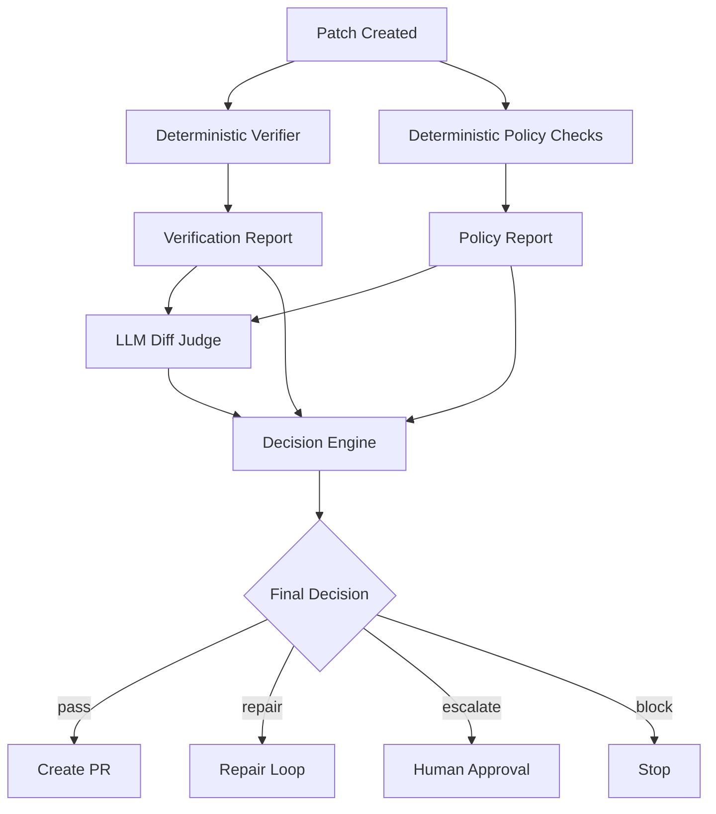
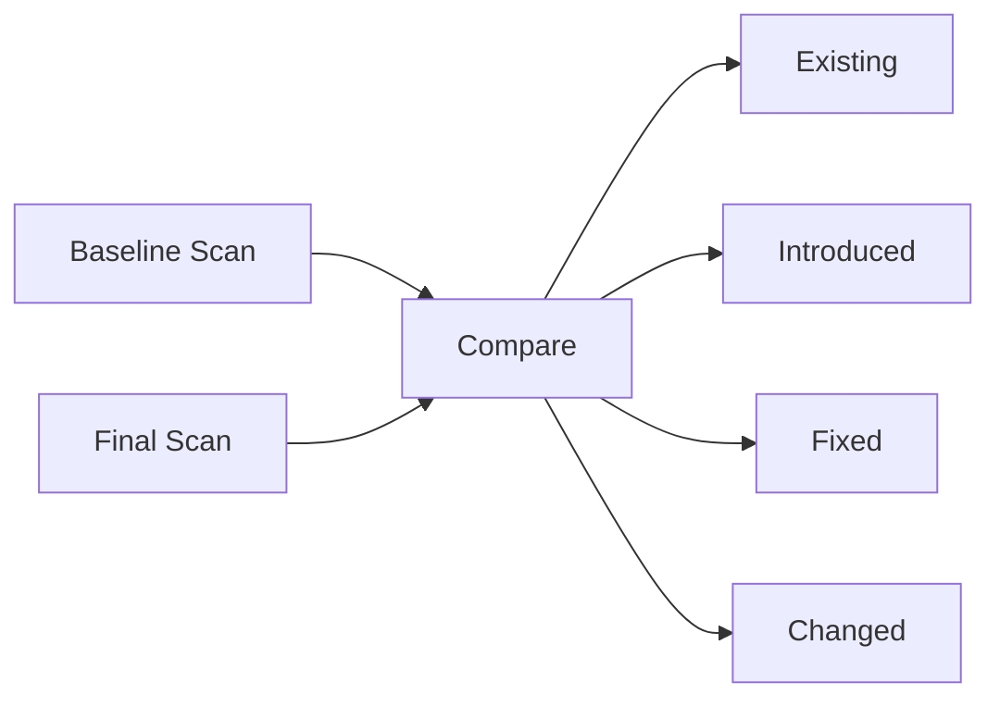
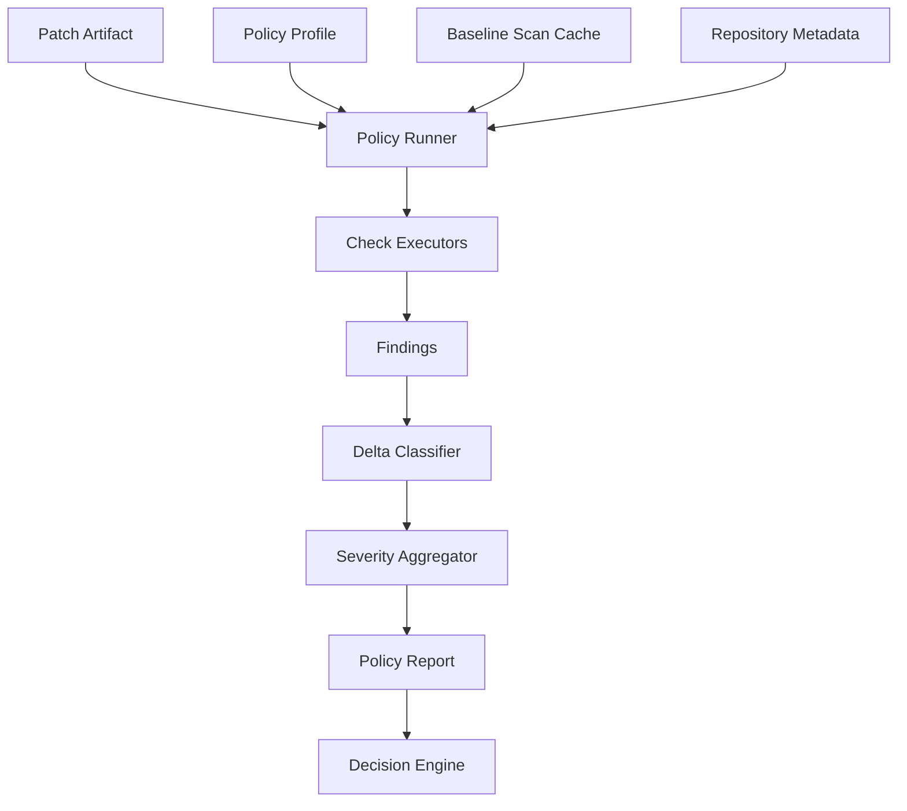

------
title: Learn AI Coding Agent From Scratch - Part 052
description: Desain deterministic policy checks untuk AI coding agent: secret scan, license, dangerous code, dependency risk, forbidden path, generated file, lockfile, supply chain, dan rule engine yang tidak bergantung pada judgement model.
series: learn-ai-coding-agent
seriesTitle: Learn AI Coding Agent From Scratch
order: 52
partTitle: Deterministic Policy Checks
tags:
- ai-coding-agent
- policy-engine
- deterministic-checks
- security
- secret-scanning
- supply-chain
- governance
- series
date: 2026-07-04
---

# Part 052 — Deterministic Policy Checks: Secret Scan, License, Dangerous Code, Dependency Risk

Part sebelumnya membahas **LLM-as-Judge** untuk diff review.

Sekarang kita masuk ke boundary yang lebih keras.

Ada kategori risiko yang tidak boleh diserahkan ke opini model.

Contoh:

- apakah patch mengandung secret?
- apakah agent mengubah file forbidden?
- apakah test dimatikan?
- apakah dependency baru punya vulnerability known?
- apakah license dependency kompatibel?
- apakah Dockerfile menjadi privileged?
- apakah GitHub Actions workflow menambahkan secret exposure?
- apakah Maven config men-skip test?
- apakah package script menjalankan command berbahaya?
- apakah generated file berubah padahal dilarang?

Untuk hal-hal ini, kita butuh **deterministic policy checks**.

Mental model:

> Judge memberi penilaian. Policy check memberi constraint.

Policy check harus:

- repeatable,
- auditable,
- machine-readable,
- diff-aware,
- severity-aware,
- bisa dijalankan sebelum dan sesudah patch,
- bisa memberi error yang actionable,
- tidak bergantung pada “model merasa aman”.

---

## 1. Posisi Deterministic Policy dalam Pipeline

Pipeline lengkap sekarang:



Policy checks tidak menunggu judge.

Bahkan beberapa policy check harus jalan sebelum agent mengedit:

- repository allowlist,
- branch protection metadata,
- forbidden path rules,
- generated file detection,
- baseline secret scan,
- baseline vulnerability snapshot.

Setelah patch dibuat, policy check membandingkan baseline dan final state.

---

## 2. Policy Check Bukan Satu Tool

Policy check adalah kelompok check.

```text
policy-checks/
  forbidden-path-check
  generated-file-check
  secret-scan
  dependency-vulnerability-check
  license-check
  dangerous-code-check
  test-integrity-check
  build-config-integrity-check
  ci-workflow-check
  package-script-check
  container-security-check
  iac-safety-check
  binary-file-check
  lockfile-drift-check
  pr-metadata-check
```

Setiap check menghasilkan structured finding.

Jangan membuat satu check besar bernama `security_check`.

Itu tidak bisa di-debug.

---

## 3. Policy Report Schema

Minimal schema:

```json
{
  "policyReportId": "pol_123",
  "runId": "run_123",
  "patchId": "patch_123",
  "policyProfile": "default-autonomous-pr-v1",
  "status": "failed",
  "summary": {
    "critical": 1,
    "high": 2,
    "medium": 3,
    "low": 0
  },
  "checks": [
    {
      "checkId": "secret-scan",
      "version": "gitleaks-8.x-profile-v1",
      "status": "failed",
      "durationMs": 2140,
      "findings": [
        {
          "severity": "critical",
          "category": "secret",
          "path": "src/test/resources/application-local.yml",
          "line": 12,
          "fingerprint": "sha256:...",
          "message": "Potential API token introduced in patch",
          "evidence": "redacted token-like value",
          "recommendation": "Remove the secret and use test fixture placeholders or environment variables.",
          "introducedByPatch": true,
          "blocking": true
        }
      ]
    }
  ],
  "finalDecisionHint": "block"
}
```

Semua check harus menghasilkan:

- `checkId`,
- `version`,
- `status`,
- `finding severity`,
- `path`,
- `line` jika ada,
- `introducedByPatch`,
- `blocking`,
- `recommendation`,
- `fingerprint`.

Fingerprint penting untuk suppression dan deduplication.

---

## 4. Policy Profile

Tidak semua task punya policy sama.

Task low-risk documentation update tidak sama dengan dependency upgrade auth service.

Buat policy profile.

```yaml
policy_profiles:
  autonomous_pr_low_risk:
    block_on:
      - critical
      - high
    require_checks:
      - forbidden_path
      - secret_scan
      - generated_file
      - test_integrity
      - build_config_integrity

  supervised_pr_medium_risk:
    block_on:
      - critical
    escalate_on:
      - high
    require_checks:
      - forbidden_path
      - secret_scan
      - generated_file
      - dependency_vulnerability
      - license
      - test_integrity
      - ci_workflow

  security_sensitive:
    block_on:
      - critical
      - high
    escalate_on:
      - medium
    require_human: true
    require_checks:
      - forbidden_path
      - secret_scan
      - dangerous_code
      - dependency_vulnerability
      - license
      - test_integrity
      - build_config_integrity
      - ci_workflow
      - container_security
```

Policy profile dipilih dari risk classification Part 006.

---

## 5. Diff-Scoped vs Repo-Scoped Checks

Ada dua mode.

### 5.1 Diff-Scoped Check

Hanya menganalisis perubahan patch.

Cocok untuk:

- forbidden path,
- generated file modified,
- secret introduced,
- test disabled,
- build config changed,
- dangerous new code pattern,
- package script changed.

Kelebihan:

- cepat,
- rendah noise,
- cocok untuk gate PR.

Kelemahan:

- tidak melihat risiko yang sudah ada.

### 5.2 Repo-Scoped Check

Menganalisis seluruh repo/workspace.

Cocok untuk:

- baseline secret inventory,
- dependency vulnerability,
- license inventory,
- SAST scan,
- OpenSSF-style security posture,
- container image scanning.

Kelebihan:

- coverage lebih luas.

Kelemahan:

- banyak findings lama,
- lebih mahal,
- perlu baseline/suppression.

Untuk agent PR, rule praktis:

> Block introduced risk. Report existing risk separately.

Jangan memblokir agent karena repo sudah punya 200 vulnerability lama, kecuali task-nya memang dependency/security remediation.

---

## 6. Baseline and Delta

Policy check yang matang membedakan:

- existing finding,
- fixed finding,
- introduced finding,
- modified finding.



Pseudo-code:

```java
PolicyDelta computeDelta(List<Finding> baseline, List<Finding> current) {
    Map<String, Finding> baseByFp = indexByFingerprint(baseline);
    Map<String, Finding> curByFp = indexByFingerprint(current);

    List<Finding> introduced = curByFp.keySet().stream()
        .filter(fp -> !baseByFp.containsKey(fp))
        .map(curByFp::get)
        .toList();

    List<Finding> fixed = baseByFp.keySet().stream()
        .filter(fp -> !curByFp.containsKey(fp))
        .map(baseByFp::get)
        .toList();

    return new PolicyDelta(introduced, fixed);
}
```

Fingerprint harus stabil.

Misalnya:

```text
check_id + normalized_path + normalized_rule_id + normalized_sink/source + secret_hash_prefix
```

Jangan memasukkan nomor line mentah sebagai satu-satunya fingerprint. Line bisa berubah.

---

## 7. Forbidden Path Check

Forbidden path check adalah check termurah dan paling penting.

Contoh rules:

```yaml
forbidden_paths:
  - pattern: "**/.github/workflows/**"
    action: escalate
    reason: "CI workflow changes require human review"
  - pattern: "**/src/main/resources/db/migration/**"
    action: escalate
    reason: "Database migration requires schema review"
  - pattern: "**/generated/**"
    action: block
    reason: "Generated files must not be edited directly"
  - pattern: "**/target/**"
    action: block
    reason: "Build output must not be committed"
  - pattern: "**/.env*"
    action: block
    reason: "Environment files may contain secrets"
```

Implementation:

```java
for (ChangedFile file : diff.changedFiles()) {
    for (PathRule rule : rules) {
        if (glob(rule.pattern()).matches(file.path())) {
            findings.add(Finding.of(
                rule.action().severity(),
                "forbidden_path",
                file.path(),
                rule.reason()
            ));
        }
    }
}
```

Invariant:

> Agent should not discover forbidden path only after PR creation.

Cek ini segera setelah patch dibuat.

---

## 8. Generated File Check

Generated file sering besar, noisy, dan tidak reviewable.

Agent boleh mengubah generated file hanya jika task dan policy mengizinkan.

Deteksi generated file dari:

- path convention: `generated`, `target`, `build`, `dist`, `.openapi-generator`,
- header: `Generated by`, `DO NOT EDIT`,
- tool metadata,
- file size/pattern,
- known generator config.

Rule:

```yaml
generated_file_policy:
  default: block
  allow_if:
    - task_tag: regenerate_client
    - verifier_profile: openapi_client_regeneration
```

Finding:

```json
{
  "severity": "high",
  "category": "generated_file_modified",
  "path": "src/generated/java/com/acme/Client.java",
  "message": "Generated file modified without regeneration profile.",
  "recommendation": "Modify the source schema/template and run the approved generator."
}
```

---

## 9. Secret Scan

Secret scan wajib.

Agent yang bisa membaca repo, menjalankan tool, dan membuat patch punya risiko memasukkan credential ke diff.

Gunakan tool deterministik seperti:

- GitHub Secret Scanning untuk platform GitHub,
- Gitleaks untuk local/repo/file scan,
- TruffleHog atau scanner lain sesuai policy organisasi.

Mode minimum:

```bash
gitleaks detect --source . --redact --report-format json --report-path artifacts/gitleaks.json
```

Untuk diff-scoped scan, scan hanya changed files atau patch text.

Tetapi hati-hati: secret bisa muncul di file baru atau renamed file.

Policy:

```yaml
secret_scan:
  block_on_introduced: true
  redact_evidence: true
  allow_test_placeholders:
    - "example-token"
    - "dummy-secret"
  require_explicit_suppression_reason: true
```

Suppression harus jarang.

Contoh suppression aman:

```yaml
suppressions:
  - fingerprint: "sha256:abc123"
    reason: "Documented fake AWS key from AWS docs used in scanner test fixture"
    expires: "2026-08-01"
    approved_by: "security-team"
```

Suppression tanpa expiry adalah smell.

---

## 10. Dangerous Code Check

Dangerous code check mendeteksi pattern yang sering tidak tertangkap compile/test.

Contoh Java:

```yaml
dangerous_code_rules:
  - id: java-runtime-exec
    pattern: "Runtime.getRuntime().exec(...)"
    severity: high
    action: escalate
  - id: java-process-builder
    pattern: "new ProcessBuilder(...)"
    severity: medium
    action: escalate
  - id: java-disable-cert-validation
    pattern: "TrustManager[]"
    severity: critical
    action: block
  - id: java-catch-ignore-security
    pattern: "catch ($EXCEPTION e) { }"
    severity: medium
    action: escalate
```

Gunakan Semgrep atau AST scanner.

Contoh Semgrep rule sederhana:

```yaml
rules:
  - id: java-runtime-exec-introduced
    languages: [java]
    message: "Runtime.exec introduced. Requires security review."
    severity: ERROR
    pattern: Runtime.getRuntime().exec(...)
```

Command:

```bash
semgrep --config policy/semgrep/ --json --output artifacts/semgrep.json .
```

Diff-aware mode bisa dibuat dengan membandingkan findings baseline dan final.

---

## 11. Test Integrity Check

Agent tidak boleh membuat verifier hijau dengan merusak test.

Check pattern:

- `@Disabled`,
- `@Ignore`,
- `Assume.assumeTrue(false)`,
- assertion dihapus,
- assertion diganti terlalu general,
- test file dihapus,
- test include/exclude diubah,
- coverage threshold diturunkan,
- flaky retry dinaikkan tanpa alasan.

Contoh patterns:

```yaml
test_integrity:
  block_patterns:
    - "@Disabled"
    - "@Ignore"
    - "skipTests>true</skipTests>"
  escalate_patterns:
    - "assertTrue(true)"
    - "catch (Exception ignored)"
    - "TODO remove later"
```

Implementation tidak harus sempurna.

Mulai dari rules yang jelas, lalu tambah berdasarkan incident.

Finding:

```json
{
  "severity": "critical",
  "category": "test_disabled",
  "path": "src/test/java/com/acme/AuthGatewayTest.java",
  "line": 41,
  "message": "Patch introduces @Disabled on existing test.",
  "recommendation": "Remove @Disabled and fix production code or update test with explicit approved behavior change."
}
```

---

## 12. Build Config Integrity Check

Agent sering memperbaiki build dengan mengubah build config.

Kadang benar. Sering berbahaya.

Perhatikan:

### Maven

- `skipTests`,
- `maven.test.skip`,
- Surefire excludes,
- plugin version changes,
- compiler source/target downgrade,
- dependency scope changed from `test` to `compile`,
- repository URL added,
- plugin repository added.

### Gradle

- `enabled = false` untuk test,
- exclude test task,
- custom task yang bypass check,
- insecure repository,
- dependency substitution.

### Node

- `scripts.test` diubah menjadi noop,
- `preinstall/postinstall` ditambah,
- package manager lockfile drift,
- registry custom.

Check contoh:

```yaml
build_config_integrity:
  block:
    - id: maven-skip-tests
      file: "**/pom.xml"
      contains:
        - "<skipTests>true</skipTests>"
        - "<maven.test.skip>true</maven.test.skip>"
    - id: npm-test-noop
      file: "**/package.json"
      json_path: "$.scripts.test"
      forbidden_values:
        - "echo ok"
        - "true"
        - "exit 0"
  escalate:
    - id: new-maven-repository
      file: "**/pom.xml"
      xpath: "//repositories/repository/url"
```

---

## 13. Dependency Vulnerability Check

Dependency upgrade bisa memperbaiki vulnerability, tetapi juga bisa menambah vulnerability.

Gunakan scanner seperti:

- OSV-Scanner,
- OWASP Dependency-Check,
- Snyk/Dependabot/internal SCA sesuai organisasi.

Minimum open-source path:

```bash
osv-scanner scan source --format json --output artifacts/osv.json .
```

Policy:

```yaml
dependency_vulnerability:
  block_introduced:
    severity_at_least: critical
  escalate_introduced:
    severity_at_least: high
  allow_existing: true
  require_advisory_link: true
```

Important:

- use lockfiles/manifests,
- compare baseline vs final,
- ignore existing unless task is security remediation,
- block introduced critical,
- treat unknown severity carefully.

Finding:

```json
{
  "severity": "high",
  "category": "dependency_vulnerability_introduced",
  "path": "pom.xml",
  "message": "Patch introduces com.example:unsafe-lib:1.2.3 with known CVE.",
  "recommendation": "Use a patched version or remove the dependency."
}
```

---

## 14. License Check

License policy bukan opini model.

Agent yang menambah dependency harus melewati license gate.

Policy contoh:

```yaml
license_policy:
  allowed:
    - Apache-2.0
    - MIT
    - BSD-2-Clause
    - BSD-3-Clause
  escalate:
    - MPL-2.0
    - EPL-2.0
  block:
    - GPL-2.0
    - GPL-3.0
    - AGPL-3.0
  unknown: escalate
```

License check harus:

- membaca dependency inventory,
- membandingkan baseline/final,
- mendeteksi dependency baru,
- resolve license dari metadata/SBOM/SCA tool,
- handle unknown license sebagai escalation.

Jangan minta LLM menebak license dari nama package.

---

## 15. Lockfile Drift Check

Lockfile adalah artifact penting.

Policy tergantung ecosystem.

Contoh:

| Situation | Action |
|---|---|
| `package.json` berubah tapi lockfile tidak | fail/repair |
| lockfile berubah tapi manifest tidak | escalate |
| Maven `pom.xml` berubah | no universal lockfile, but dependency tree snapshot useful |
| Go `go.mod` berubah tapi `go.sum` tidak sesuai | fail/repair |
| Gradle dependency lock enabled and lockfile changed unexpectedly | escalate |

Check:

```yaml
lockfile_policy:
  npm:
    manifest: "package.json"
    lockfiles:
      - "package-lock.json"
      - "pnpm-lock.yaml"
      - "yarn.lock"
    require_lockfile_update_if_manifest_dependency_changed: true
  go:
    manifest: "go.mod"
    lockfiles:
      - "go.sum"
    require_go_mod_tidy_verifier: true
```

---

## 16. CI Workflow Check

`.github/workflows`, GitLab CI, Jenkinsfile, Azure Pipelines, CircleCI config adalah high-risk.

Risiko:

- secret exfiltration,
- permission escalation,
- untrusted pull_request_target,
- external action unpinned,
- curl pipe bash,
- workflow disables tests,
- deploy step changed.

Policy minimal:

```yaml
ci_workflow_policy:
  default_action_on_change: escalate
  block_patterns:
    - "pull_request_target"
    - "curl .* | bash"
    - "permissions: write-all"
    - "secrets."
  require_human_for:
    - ".github/workflows/**"
    - "Jenkinsfile"
    - ".gitlab-ci.yml"
```

Even if tests pass, CI workflow changes need review.

---

## 17. Package Script Check

Node ecosystem punya attack surface besar di scripts.

Check `package.json`:

- `preinstall`,
- `postinstall`,
- `prepare`,
- `test` changed to noop,
- `lint` changed to noop,
- external curl/wget,
- shell redirection to env/secrets,
- registry config.

Finding contoh:

```json
{
  "severity": "high",
  "category": "package_script_introduced",
  "path": "package.json",
  "message": "Patch introduces postinstall script.",
  "recommendation": "Remove the lifecycle script or require human security review."
}
```

---

## 18. Container Security Check

Untuk Dockerfile/Kubernetes:

Check Dockerfile:

- `USER root`,
- `--privileged`,
- `curl | bash`,
- package install tanpa pinning,
- secret copied into image,
- `ADD` remote URL,
- exposing unexpected ports.

Check Kubernetes manifest:

- privileged container,
- hostPath,
- hostNetwork,
- runAsRoot,
- added cluster-admin binding,
- secret mounted broadly,
- automountServiceAccountToken.

Policy:

```yaml
container_security:
  escalate_on_change:
    - "Dockerfile"
    - "k8s/**/*.yaml"
  block_patterns:
    - "privileged: true"
    - "hostNetwork: true"
    - "runAsUser: 0"
```

Ini sangat relevan untuk agent yang bisa mengubah infra config.

---

## 19. IaC Safety Check

Infrastructure-as-Code harus high-risk by default.

Check Terraform/Pulumi/CloudFormation:

- deletion of databases/buckets,
- public access change,
- IAM wildcard,
- security group open to `0.0.0.0/0`,
- KMS disabled,
- logging disabled,
- backup disabled.

Policy:

```yaml
iac_policy:
  require_plan: true
  require_human: true
  block:
    - public_s3_bucket
    - iam_policy_wildcard_admin
    - security_group_world_open_ssh
  escalate:
    - database_replacement
    - backup_disabled
```

Agent boleh membuat PR untuk IaC, tetapi tidak boleh auto-merge atau auto-apply.

---

## 20. Binary File Check

Binary diff sulit direview.

Policy:

```yaml
binary_policy:
  default_action: escalate
  block_extensions:
    - ".pem"
    - ".p12"
    - ".key"
    - ".keystore"
  allow_extensions:
    - ".png"
    - ".jpg"
  max_size_delta_bytes: 1048576
```

Check:

- binary file added,
- large file added,
- credential-like extension,
- artifact build output,
- image changed in code migration task.

---

## 21. Policy-as-Code vs Policy-as-Data

Ada dua pendekatan.

### Policy-as-Code

Pakai OPA/Rego, custom Java rules, Semgrep rules.

Kelebihan:

- expressive,
- reusable,
- cocok untuk org besar.

Kelemahan:

- lebih sulit dipahami semua engineer,
- butuh governance.

### Policy-as-Data

YAML/JSON rules sederhana.

Kelebihan:

- mudah mulai,
- mudah direview,
- cocok untuk agent platform awal.

Kelemahan:

- ekspresivitas terbatas.

Untuk build-from-scratch seri ini, mulai dengan policy-as-data:

```yaml
rules:
  - id: no-env-files
    check: forbidden_path
    pattern: "**/.env*"
    severity: critical
    action: block
    message: "Environment files must not be committed."

  - id: github-workflows-human-review
    check: forbidden_path
    pattern: ".github/workflows/**"
    severity: high
    action: escalate
    message: "CI workflow changes require human review."
```

Nanti bisa evolve ke policy-as-code.

---

## 22. Policy Engine Architecture



Components:

```text
packages/policy
  PolicyProfileLoader
  PolicyRunner
  CheckExecutor
  FindingNormalizer
  DeltaClassifier
  SeverityAggregator
  SuppressionRegistry
  PolicyReportWriter
```

Interface:

```java
public interface PolicyCheck {
    String id();
    PolicyCheckResult run(PolicyCheckContext context);
}
```

Context:

```java
public record PolicyCheckContext(
    RunId runId,
    Path workspace,
    Patch patch,
    DiffSummary diff,
    PolicyProfile profile,
    Optional<BaselineScan> baseline,
    ArtifactWriter artifacts
) {}
```

Result:

```java
public record PolicyCheckResult(
    String checkId,
    String version,
    CheckStatus status,
    List<PolicyFinding> findings,
    Duration duration
) {}
```

---

## 23. Command Wrapper untuk External Scanners

External scanner harus dijalankan lewat shell tool/verifier runner yang sama aman.

Jangan raw exec bebas.

Command profile:

```yaml
commands:
  gitleaks:
    argv:
      - "gitleaks"
      - "detect"
      - "--source"
      - "."
      - "--redact"
      - "--report-format"
      - "json"
      - "--report-path"
      - "artifacts/gitleaks.json"
    timeout_seconds: 120
    network: false
    write_paths:
      - "artifacts/gitleaks.json"

  osv_scanner:
    argv:
      - "osv-scanner"
      - "scan"
      - "source"
      - "--format"
      - "json"
      - "."
    timeout_seconds: 180
    network: true
    network_profile: "vulnerability-db-only"
```

Beberapa scanner butuh network. Jangan beri internet bebas.

Gunakan egress profile.

---

## 24. Suppression Registry

Suppression diperlukan, tetapi berbahaya.

Suppression harus:

- spesifik,
- beralasan,
- punya owner,
- punya expiry,
- diaudit,
- tidak dibuat otomatis oleh agent tanpa approval.

Schema:

```sql
create table policy_suppressions (
  id uuid primary key,
  check_id text not null,
  finding_fingerprint text not null,
  reason text not null,
  approved_by text not null,
  expires_at timestamptz not null,
  created_at timestamptz not null default now()
);
```

Rule:

> Agent may suggest suppression. Agent may not approve suppression.

---

## 25. Decision Aggregation

Severity saja tidak cukup.

Action ditentukan oleh:

- severity,
- category,
- introduced vs existing,
- task risk class,
- policy profile,
- human approval state,
- suppression state.

Pseudo-code:

```java
FinalPolicyDecision decide(PolicyReport report, PolicyProfile profile) {
    for (PolicyFinding finding : report.findings()) {
        if (finding.blocking() && finding.introducedByPatch() && !finding.suppressed()) {
            return FinalPolicyDecision.block(finding);
        }
    }

    if (report.hasIntroducedSeverityAtLeast(profile.escalateThreshold())) {
        return FinalPolicyDecision.escalate(report.highestIntroducedFinding());
    }

    if (report.hasRequiredCheckMissing()) {
        return FinalPolicyDecision.block("required policy check missing");
    }

    return FinalPolicyDecision.pass();
}
```

Important:

> Missing required check is failure.

Kalau secret scan tidak jalan karena tool error, jangan pass.

---

## 26. Policy Failure as Agent Feedback

Policy finding harus bisa dipakai agent untuk repair.

Buruk:

```text
Policy failed.
```

Baik:

```json
{
  "repairable": true,
  "finding": {
    "category": "test_disabled",
    "path": "src/test/java/AuthGatewayTest.java",
    "line": 42,
    "message": "@Disabled introduced on existing test.",
    "requiredAction": "Remove @Disabled and fix the underlying test failure."
  }
}
```

Policy finding bisa diklasifikasikan:

| Category | Repairable by Agent? | Needs Human? |
|---|---|---|
| secret introduced | yes, remove secret | maybe if real secret exposed |
| forbidden path modified | yes, revert file | maybe |
| CI workflow changed | maybe | usually yes |
| license blocked | yes, choose different dependency | legal may review |
| IaC public exposure | maybe | yes |
| test disabled | yes | no, unless disputed |

---

## 27. Agent Prompt Projection

Jangan kirim seluruh policy report mentah ke agent repair jika mengandung sensitive detail.

Kirim sanitized repair packet.

```json
{
  "policyRepairPacket": {
    "objective": "Fix blocking policy findings without expanding scope.",
    "findings": [
      {
        "category": "secret_introduced",
        "path": "src/test/resources/application-local.yml",
        "line": 12,
        "message": "A token-like value was introduced. The value is redacted.",
        "requiredAction": "Remove the token-like value and use a placeholder."
      }
    ],
    "constraints": [
      "Do not add new dependencies",
      "Do not modify CI workflow",
      "Do not suppress policy findings"
    ]
  }
}
```

Secret value harus tetap redacted.

---

## 28. Policy Checks dalam PR Body

PR body harus menyertakan ringkasan policy.

Contoh:

```md
## Policy Checks
- Secret scan: passed
- Forbidden path check: passed
- Generated file check: passed
- Dependency vulnerability delta: no introduced high/critical findings
- License delta: no new blocked licenses
- Test integrity: passed

## Notes
Existing repo-level vulnerability findings were not modified by this PR.
```

Jangan tampilkan detail sensitive.

Untuk secret scan, cukup:

```md
- Secret scan: passed
```

Jika failed, PR tidak boleh dibuat kecuali policy mode mengizinkan draft-only untuk human remediation.

---

## 29. Storage Schema

```sql
create table policy_reports (
  id uuid primary key,
  run_id uuid not null references runs(id),
  patch_id uuid not null references patches(id),
  profile_id text not null,
  status text not null,
  final_decision_hint text not null,
  summary_json jsonb not null,
  report_json jsonb not null,
  created_at timestamptz not null default now()
);

create table policy_findings (
  id uuid primary key,
  policy_report_id uuid not null references policy_reports(id),
  check_id text not null,
  fingerprint text not null,
  severity text not null,
  category text not null,
  path text,
  line integer,
  message text not null,
  recommendation text,
  introduced_by_patch boolean not null,
  blocking boolean not null,
  suppressed boolean not null default false,
  created_at timestamptz not null default now()
);
```

Index:

```sql
create index idx_policy_findings_report on policy_findings(policy_report_id);
create index idx_policy_findings_fingerprint on policy_findings(fingerprint);
create index idx_policy_findings_category on policy_findings(category);
```

---

## 30. Testing Policy Engine

Policy engine harus punya unit test dan fixture.

Fixture:

```text
policy-fixtures/
  secret-introduced/
    before/
    after/
    expected.json
  disabled-test/
    before/
    after/
    expected.json
  generated-file-modified/
    before/
    after/
    expected.json
  package-script-postinstall/
    before/
    after/
    expected.json
```

Test:

```java
@Test
void blocksDisabledJUnitTest() {
    PolicyReport report = runFixture("disabled-test");

    assertThat(report.status()).isEqualTo(FAILED);
    assertThat(report.findings())
        .anyMatch(f -> f.category().equals("test_disabled") && f.blocking());
}
```

Policy checks yang tidak dites akan menjadi false confidence.

---

## 31. Failure Modes

### 31.1 Scanner Not Installed

Jika required scanner tidak ada, policy check failed.

Bukan warning.

### 31.2 Scanner Timeout

Kalau scanner timeout, status `inconclusive`.

Policy profile menentukan block/escalate.

Untuk high-risk: block.

### 31.3 Too Many Existing Findings

Repo lama punya banyak masalah.

Gunakan baseline delta.

Jangan memblokir introduced patch karena existing noise.

### 31.4 False Positive Secret

Gunakan suppression dengan expiry dan approval.

Jangan biarkan agent auto-suppress.

### 31.5 Model Tries to Bypass Policy

Agent mungkin mengedit config policy.

Policy files sendiri harus protected path.

### 31.6 Tool Output Injection

Scanner output bisa berisi file content.

Jangan masukkan raw scanner output ke model tanpa sanitization.

### 31.7 Missing Lockfile

Jika manifest dependency berubah tapi lockfile tidak berubah, agent harus repair dengan package manager command atau escalate.

### 31.8 Generated File Confusion

Generated file kadang perlu berubah. Policy harus punya explicit regeneration profile.

---

## 32. Minimal Implementation Roadmap

Urutan implementasi yang masuk akal:

1. forbidden path check,
2. generated file check,
3. test integrity check,
4. build config integrity check,
5. secret scan wrapper,
6. policy report schema,
7. policy decision aggregator,
8. repair packet,
9. baseline/delta support,
10. dependency vulnerability scanner,
11. license check,
12. CI workflow check,
13. container/IaC checks.

Jangan mulai dari SCA paling kompleks.

Mulai dari check yang paling murah dan paling sering mencegah incident.

---

## 33. Checklist

Deterministic policy layer siap dipakai jika:

- [ ] policy profile dipilih dari risk class,
- [ ] required check missing dianggap failure,
- [ ] findings punya severity dan action,
- [ ] findings punya fingerprint stabil,
- [ ] baseline dan final scan bisa dibandingkan,
- [ ] introduced critical/high bisa block/escalate,
- [ ] secret evidence selalu redacted,
- [ ] forbidden path check berjalan cepat,
- [ ] generated file policy jelas,
- [ ] test/build integrity check mencegah cheating,
- [ ] dependency/license delta tidak bergantung pada LLM,
- [ ] suppression butuh approval dan expiry,
- [ ] policy report disimpan sebagai artifact,
- [ ] repair packet sanitized,
- [ ] PR body menyertakan policy summary,
- [ ] policy config sendiri protected.

---

## 34. Kesimpulan

LLM judge membantu menilai intent, scope, dan reviewability.

Tetapi security dan governance tidak boleh bergantung pada opini model.

Deterministic policy checks adalah pagar keras untuk AI coding agent.

Prinsip utamanya:

1. scan before and after,
2. compare baseline and final,
3. block introduced hard violations,
4. escalate ambiguous/high-risk changes,
5. redact sensitive evidence,
6. keep suppression human-approved,
7. make findings actionable,
8. treat missing required checks as failure,
9. store reports for audit,
10. never let judge override policy.

Dengan Part 051 dan Part 052, pipeline kita sekarang punya dua lapis kualitas:

- **LLM judge** untuk semantic review,
- **deterministic policy** untuk hard constraints.

Part berikutnya akan membahas **CI inner loop vs outer loop**: bagaimana local verifier, PR checks, auto-fix, dan human review disusun agar agent tidak hanya bagus di sandbox tetapi juga valid di CI nyata.

---

## Referensi Faktual

- GitHub Docs — Supported secret scanning patterns: https://docs.github.com/en/code-security/reference/secret-security/supported-secret-scanning-patterns
- Gitleaks — Secret scanner: https://github.com/gitleaks/gitleaks
- Semgrep Docs — SAST, SCA, and secrets scanning: https://docs.semgrep.dev/
- OSV-Scanner — Vulnerability scanning: https://google.github.io/osv-scanner/
- OpenSSF Scorecard — Automated security checks: https://scorecard.dev/
- OWASP Top 10 for LLM Applications: https://owasp.org/www-project-top-10-for-large-language-model-applications/
