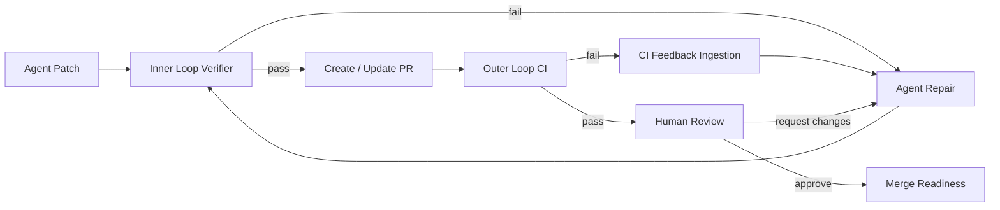
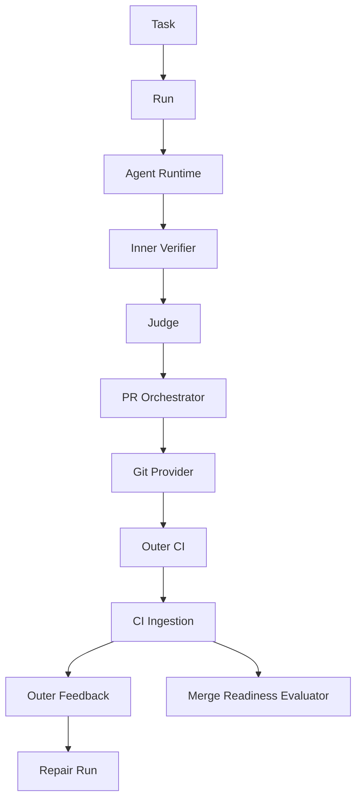
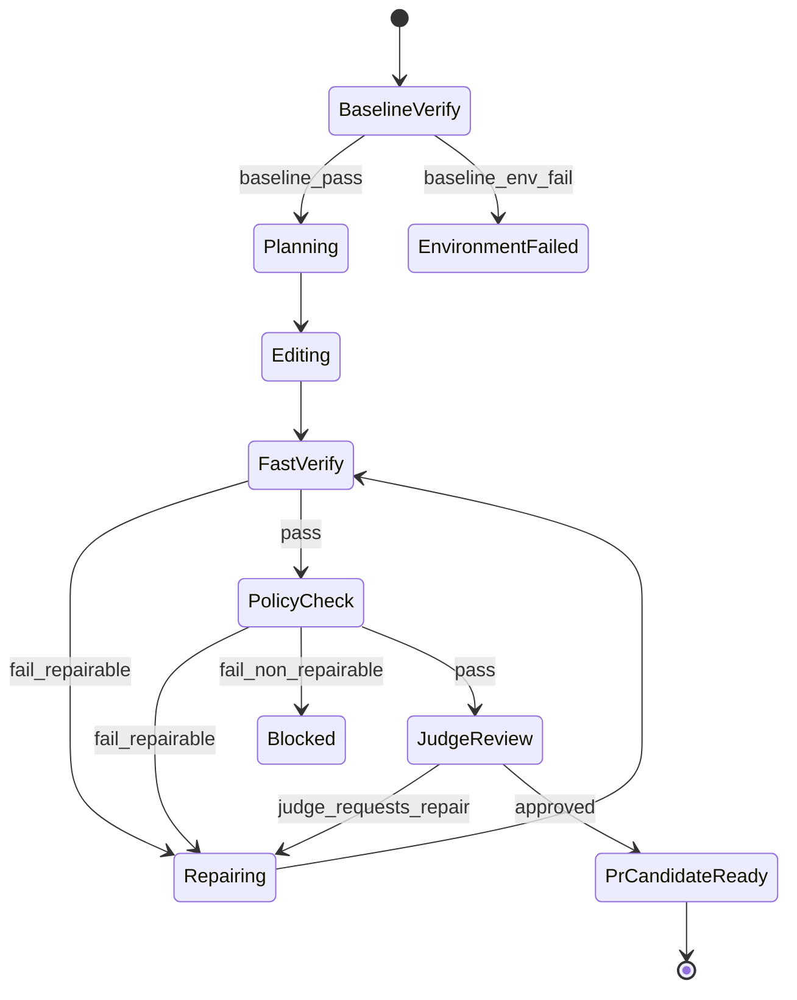
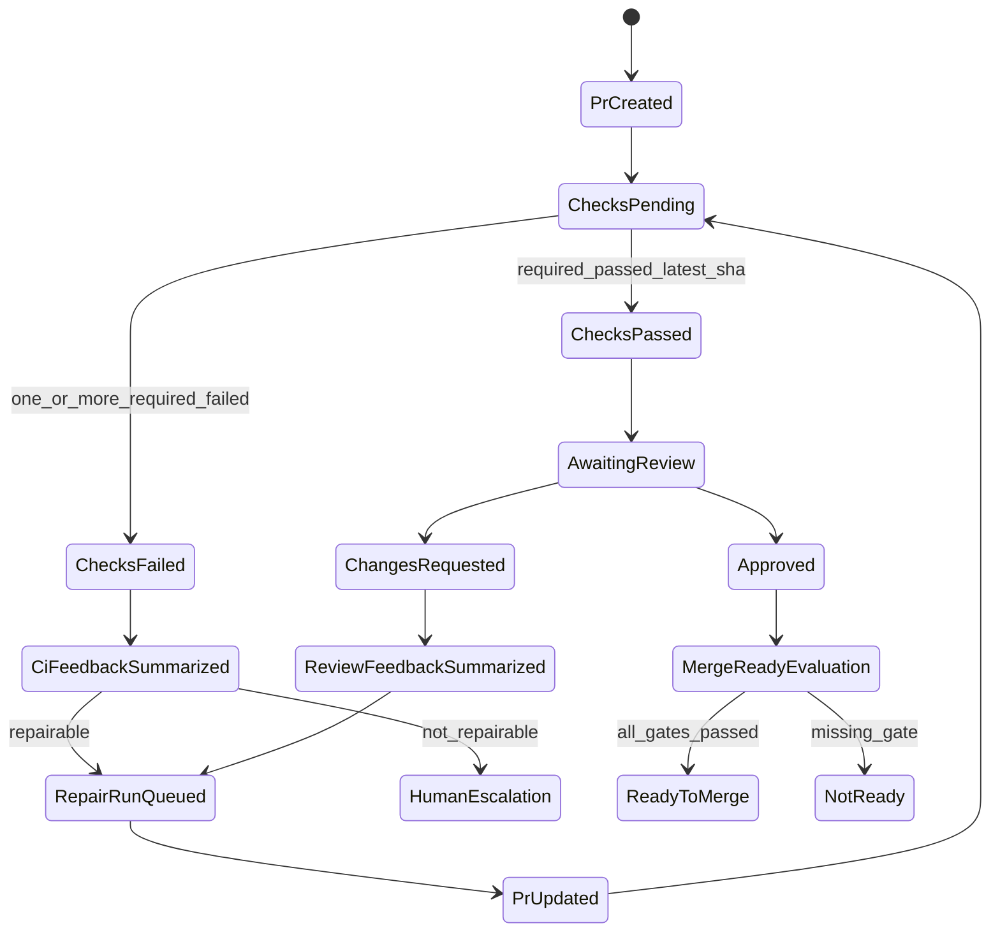
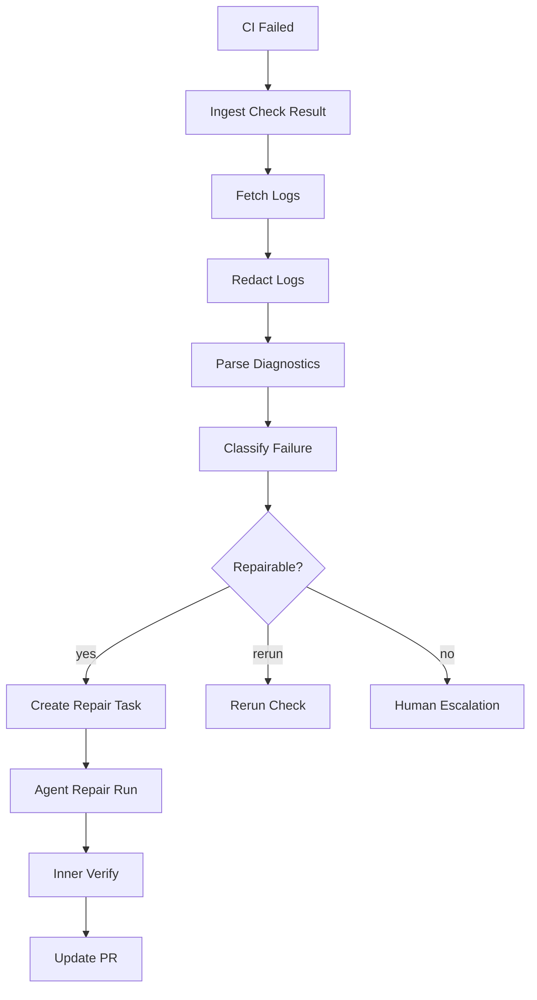
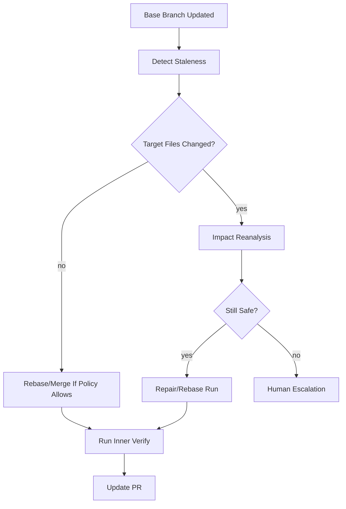

------
title: Learn AI Coding Agent From Scratch - Part 053
description: Desain CI inner loop dan outer loop untuk AI coding agent: local verifier, PR checks, auto-fix loop, required status checks, human review, stale base handling, dan evidence-driven merge readiness.
series: learn-ai-coding-agent
seriesTitle: Learn AI Coding Agent From Scratch
order: 53
partTitle: CI Inner Loop vs Outer Loop
tags:
- ai-coding-agent
- ci
- verifier
- pull-request
- github-actions
- automation
- human-review
- series
date: 2026-07-04
---

# Part 053 — CI Inner Loop vs Outer Loop: Local Verifier, PR Check, Auto-Fix, Human Review

Pada part sebelumnya kita membangun **deterministic policy checks**.

Sekarang kita menyambungkan semuanya ke workflow software engineering nyata: **CI**.

Banyak orang berpikir:

> Kalau CI hijau, berarti perubahan aman.

Untuk developer manusia saja kalimat itu tidak sepenuhnya benar.

Untuk AI coding agent, kalimat itu jauh lebih berbahaya.

CI hijau bisa berarti:

- test yang relevan memang pass,
- test tidak cukup kuat,
- test yang gagal sudah dimatikan,
- workflow tidak jalan karena path filter,
- check yang wajib bukan check yang benar,
- check pass di commit lama,
- flaky test sedang kebetulan pass,
- environment CI berbeda dari local verifier,
- agent mengubah config supaya CI melewati tahap penting,
- branch belum sinkron dengan base terbaru.

Jadi tujuan part ini bukan “cara menjalankan GitHub Actions”.

Tujuannya adalah membangun mental model:

> CI untuk AI coding agent adalah sistem multi-loop: inner loop cepat untuk memperbaiki patch sebelum PR, outer loop authoritative untuk memvalidasi patch dalam ekosistem repository resmi, dan human review sebagai semantic governance boundary.

Kita akan membedakan:

- **inner loop**,
- **outer loop**,
- **agent repair loop**,
- **PR check loop**,
- **human review loop**,
- **merge readiness loop**.

---

## 1. Masalah: CI Bukan Satu Sinyal Tunggal

CI sering diperlakukan seperti lampu lalu lintas:

- merah: jangan merge,
- hijau: boleh merge.

Dalam agent platform, ini terlalu dangkal.

CI adalah kumpulan sinyal dari banyak sumber:

- build,
- unit test,
- integration test,
- lint,
- formatting,
- static analysis,
- secret scan,
- dependency vulnerability scan,
- license scan,
- container scan,
- policy check,
- required branch protection,
- reviewer approval,
- deployment preview,
- ownership rule,
- external compliance rule.

Masing-masing punya:

- authority berbeda,
- latency berbeda,
- determinism berbeda,
- flakiness berbeda,
- coverage berbeda,
- biaya berbeda,
- repairability berbeda.

Agent tidak boleh hanya bertanya:

> Apakah CI pass?

Agent harus bertanya:

> Check mana yang pass, pada commit mana, dengan scope apa, menggunakan environment apa, terhadap base mana, dan apakah sinyal itu cukup untuk klaim yang dibuat oleh patch?

---

## 2. Mental Model: Dua Cincin Verifikasi

Kita mulai dari model paling penting.



Ada dua cincin:

### Inner loop

Inner loop berjalan di sandbox/platform agent sebelum PR dianggap siap.

Ciri-ciri:

- cepat,
- murah,
- dekat dengan agent,
- bisa dijalankan berkali-kali,
- output-nya diringkas menjadi feedback repair,
- tidak authoritative untuk merge,
- tidak menggantikan CI repository resmi.

Contoh:

```bash
mvn -q -DskipITs test
mvn -q -DskipTests compile
npm test -- --runInBand
npm run lint
./gradlew test
```

### Outer loop

Outer loop berjalan di CI resmi repository/organization setelah PR dibuat atau di-update.

Ciri-ciri:

- authoritative,
- mungkin lebih lambat,
- mungkin memakai secret/infra yang tidak tersedia di sandbox,
- mencerminkan branch protection,
- hasilnya terlihat oleh reviewer,
- menentukan merge readiness bersama policy dan review.

Contoh:

- GitHub Actions required status checks,
- Jenkins multibranch pipeline,
- Buildkite pipeline,
- GitLab CI pipeline,
- SonarQube quality gate,
- Snyk/OSV dependency check,
- deployment preview,
- internal compliance gate.

---

## 3. Kenapa Agent Butuh Inner Loop?

Tanpa inner loop, agent akan membuat PR mentah.

Efeknya:

- CI penuh dengan PR rusak,
- reviewer kehilangan trust,
- agent boros token karena feedback datang lambat,
- queue CI tersumbat,
- banyak PR spam,
- false progress meningkat,
- engineer harus menjadi debugger agent.

Inner loop memindahkan error sederhana ke sebelum PR.

Contoh error yang harus ditangkap sebelum PR:

- compile error,
- import hilang,
- test obvious fail,
- formatter rusak,
- forbidden file berubah,
- secret ter-commit,
- generated file berubah tanpa izin,
- lockfile drift tidak wajar,
- test dimatikan,
- package script berubah mencurigakan.

Inner loop bukan “nice to have”.

Untuk background coding agent, inner loop adalah **quality firewall**.

---

## 4. Kenapa Inner Loop Tidak Cukup?

Inner loop punya keterbatasan.

Ia mungkin tidak punya:

- secret CI,
- service dependency,
- matrix OS lengkap,
- database integration test,
- internal package registry,
- full test suite,
- branch protection context,
- CODEOWNERS requirement,
- deployment preview,
- compliance scanning,
- reviewer judgement.

Karena itu inner loop tidak boleh memberi status:

```text
MERGE_READY
```

Inner loop hanya boleh memberi status:

```text
PR_CANDIDATE_READY
```

Perbedaan ini penting.

`PR_CANDIDATE_READY` berarti:

> Patch cukup bersih untuk diajukan ke outer loop.

`MERGE_READY` berarti:

> Patch sudah melewati check resmi, policy, dan review yang disyaratkan untuk repository tersebut.

Agent harus membedakan keduanya.

---

## 5. CI Layer dalam Honk-like Agent Platform

Dalam arsitektur kita, CI bukan bagian dari agent runtime langsung.

CI adalah boundary eksternal yang dipantau oleh orchestration layer.



Layer yang terlibat:

| Layer | Tanggung jawab |
|---|---|
| Agent runtime | Mengubah kode dan menjalankan tool yang diizinkan |
| Inner verifier | Menjalankan build/test/policy cepat di sandbox |
| Judge | Menilai alignment dan overreach berbasis evidence |
| PR orchestrator | Membuat/update branch dan PR |
| CI ingestion | Membaca status check, log, conclusion, commit SHA |
| Feedback summarizer | Mengubah failure CI menjadi repair packet |
| Merge readiness evaluator | Menentukan apakah PR siap merge/review |
| Human review bridge | Mengelola requested changes, approval, comment action |

---

## 6. Verifier Profile: Jangan Satu Command untuk Semua Situasi

Kesalahan umum: membuat satu command `verify` untuk semua kondisi.

Ini terlalu kasar.

Agent butuh beberapa **verifier profile**.

```yaml
profiles:
  preflight:
    purpose: "Validate baseline environment before edit"
    commands:
      - "mvn -q -DskipTests compile"
    timeoutSeconds: 300

  edit_loop:
    purpose: "Fast signal after small patch"
    commands:
      - "mvn -q -DskipTests compile"
      - "mvn -q -DskipITs test"
    timeoutSeconds: 600

  pre_pr:
    purpose: "Minimum quality before PR creation"
    commands:
      - "mvn -q verify"
      - "./scripts/policy-check.sh"
    timeoutSeconds: 1200

  ci_repair:
    purpose: "Reproduce failing CI locally if possible"
    commands:
      - "./scripts/ci-repro.sh {{check_name}}"
    timeoutSeconds: 1800
```

Profile harus menjawab pertanyaan:

- digunakan pada state apa?
- command apa yang dijalankan?
- apakah command boleh network?
- apakah command boleh memakai secret?
- output mana yang disimpan?
- failure mana yang repairable?
- failure mana yang harus escalate?
- timeout berapa?
- retry berapa?
- apakah flaky handling aktif?

---

## 7. Inner Loop State Machine

Inner loop punya lifecycle sendiri.



State penting:

### BaselineVerify

Sebelum agent mengubah kode, jalankan baseline minimal.

Tujuannya:

- memastikan repo memang bisa diverifikasi,
- memisahkan failure yang sudah ada dari failure akibat agent,
- menghindari agent memperbaiki hal di luar task.

Jika baseline sudah gagal, platform harus menyimpan:

```json
{
  "baselineStatus": "FAILED",
  "failureClass": "PRE_EXISTING_TEST_FAILURE",
  "allowedToProceed": false,
  "requiresHumanDecision": true
}
```

Kecuali use case memang “fix failing build”.

### FastVerify

Setelah patch kecil, jalankan verifier cepat.

Tujuannya:

- menangkap compile/test/lint error cepat,
- memberi feedback repair,
- membatasi loop sebelum patch melebar.

### PolicyCheck

Deterministic check wajib jalan sebelum PR.

Tujuannya:

- memastikan agent tidak melanggar boundary,
- mencegah PR berbahaya masuk outer loop.

### JudgeReview

Judge mengecek:

- apakah intent terpenuhi,
- apakah scope terkendali,
- apakah evidence cukup,
- apakah PR body jujur,
- apakah agent membuat shortcut.

---

## 8. Outer Loop State Machine

Outer loop dimulai setelah PR dibuat/di-update.



Outer loop tidak hanya membaca “CI pass/fail”.

Ia harus membaca:

- PR head SHA,
- base branch SHA,
- required checks,
- actual check runs,
- conclusion,
- started/completed time,
- log URL,
- workflow rerun status,
- review state,
- requested changes,
- CODEOWNERS requirement,
- merge conflict status,
- stale branch status,
- branch protection status.

---

## 9. Data Model untuk Check Result

Jangan simpan CI sebagai string log saja.

Kita butuh model structured.

```sql
create table ci_checks (
    id uuid primary key,
    pull_request_id uuid not null,
    provider text not null,
    external_check_id text not null,
    name text not null,
    head_sha text not null,
    base_sha text,
    status text not null,
    conclusion text,
    is_required boolean not null default false,
    started_at timestamptz,
    completed_at timestamptz,
    details_url text,
    log_artifact_id uuid,
    failure_class text,
    repairability text,
    ingested_at timestamptz not null default now(),
    unique(provider, external_check_id, head_sha)
);
```

Contoh `status`:

- `QUEUED`,
- `IN_PROGRESS`,
- `COMPLETED`,
- `STALE`,
- `UNKNOWN`.

Contoh `conclusion`:

- `SUCCESS`,
- `FAILURE`,
- `CANCELLED`,
- `TIMED_OUT`,
- `SKIPPED`,
- `NEUTRAL`,
- `ACTION_REQUIRED`.

Contoh `failure_class`:

- `COMPILE_FAILURE`,
- `UNIT_TEST_FAILURE`,
- `INTEGRATION_TEST_FAILURE`,
- `LINT_FAILURE`,
- `FORMAT_FAILURE`,
- `POLICY_FAILURE`,
- `DEPENDENCY_FAILURE`,
- `INFRA_FAILURE`,
- `FLAKY_SUSPECTED`,
- `UNKNOWN_FAILURE`.

Contoh `repairability`:

- `AGENT_REPAIRABLE`,
- `HUMAN_REQUIRED`,
- `RERUN_CANDIDATE`,
- `BLOCKED_BY_POLICY`,
- `ENVIRONMENT_FAILURE`.

---

## 10. Latest SHA Invariant

CI result hanya valid untuk commit tertentu.

Invariant penting:

> Required check yang pass pada commit lama tidak boleh dianggap pass untuk commit terbaru.

Model:

```text
A -- B -- C   PR branch
          ^   current head

check passed on B != check passed on C
```

Merge readiness harus selalu mengevaluasi check terhadap `current_head_sha`.

Pseudo-code:

```java
boolean isCheckCurrent(CheckRun check, PullRequest pr) {
    return check.headSha().equals(pr.currentHeadSha());
}

boolean requiredChecksPassed(PullRequest pr, List<RequiredCheck> required, List<CheckRun> runs) {
    for (RequiredCheck requirement : required) {
        Optional<CheckRun> current = runs.stream()
            .filter(r -> r.name().equals(requirement.name()))
            .filter(r -> r.headSha().equals(pr.currentHeadSha()))
            .filter(r -> r.conclusion().isSuccessLike())
            .findFirst();

        if (current.isEmpty()) {
            return false;
        }
    }
    return true;
}
```

Jangan hanya mencari check dengan nama sama.

Harus cocok:

- check name,
- provider,
- head SHA,
- conclusion,
- required flag,
- freshness.

---

## 11. Inner Loop vs Outer Loop Matrix

| Dimensi | Inner loop | Outer loop |
|---|---|---|
| Lokasi | Sandbox agent | CI resmi repo/org |
| Authority | Kandidat PR | Merge gate |
| Kecepatan | Cepat | Sedang/lambat |
| Biaya | Terkontrol oleh platform | Tergantung CI org |
| Secret | Tidak atau minimal | Bisa memakai secret CI |
| Network | Biasanya terbatas | Bisa sesuai workflow |
| Retry | Agent-controlled | Provider-controlled + orchestrator |
| Output | Repair packet | CI status + log + evidence |
| Visibility | Internal platform | Reviewer/repo visible |
| Tujuan | Menyiapkan patch | Memvalidasi patch resmi |
| Risiko | false confidence lokal | queue pressure/stale result |

Kesimpulan:

> Inner loop mengurangi noise. Outer loop memberi legitimasi.

---

## 12. Auto-Fix Loop dari CI Failure

Saat CI gagal, agent tidak boleh langsung “coba-coba edit”.

Harus ada pipeline:



Repair task harus berisi:

```json
{
  "source": "OUTER_CI_FAILURE",
  "prNumber": 123,
  "headSha": "abc123",
  "failedChecks": [
    {
      "name": "maven-test",
      "failureClass": "UNIT_TEST_FAILURE",
      "diagnostics": [
        {
          "file": "src/test/java/.../OrderServiceTest.java",
          "line": 88,
          "message": "expected APPROVED but was PENDING"
        }
      ]
    }
  ],
  "allowedActions": [
    "READ_FILES",
    "WRITE_WORKSPACE",
    "RUN_INNER_VERIFIER",
    "UPDATE_PR_BRANCH"
  ],
  "forbiddenActions": [
    "DISABLE_TEST",
    "CHANGE_CI_WORKFLOW",
    "FORCE_PUSH_MAIN"
  ]
}
```

Perhatikan: failure CI diterjemahkan menjadi **task repair yang constrained**.

Bukan prompt bebas:

> CI failed, fix it.

Prompt seperti itu mengundang overreach.

---

## 13. CI Failure Classification

Agent harus tahu jenis failure.

| Failure | Contoh | Repair strategy |
|---|---|---|
| Compile failure | method tidak ditemukan | agent repair langsung |
| Unit test failure | assertion gagal | analisis behavior, jangan asal ubah test |
| Integration failure | DB/service tidak siap | cek reproducibility dulu |
| Lint failure | import order | formatter/auto-fix deterministic |
| Format failure | style mismatch | run formatter |
| Policy failure | secret detected | block atau remove secret |
| Dependency failure | vulnerable package | pilih versi lain/rollback |
| Infra failure | runner unavailable | rerun/escalate |
| Flaky suspected | failure non-deterministic | rerun dengan flake policy |
| Workflow failure | YAML invalid | repair hanya jika workflow file in-scope |

Klasifikasi harus evidence-based.

Contoh rule:

```yaml
rules:
  - id: java-compile-error
    match:
      logPatterns:
        - "COMPILATION ERROR"
        - "cannot find symbol"
    failureClass: COMPILE_FAILURE
    repairability: AGENT_REPAIRABLE

  - id: github-runner-unavailable
    match:
      logPatterns:
        - "The hosted runner"
        - "was not available"
    failureClass: INFRA_FAILURE
    repairability: RERUN_CANDIDATE

  - id: secret-detected
    match:
      checkNames:
        - "secret-scanning"
        - "gitleaks"
    failureClass: POLICY_FAILURE
    repairability: BLOCKED_BY_POLICY
```

---

## 14. Flaky Test Handling

Flaky test adalah jebakan.

Kalau CI gagal satu kali, agent mungkin mengubah kode padahal test flaky.

Kalau CI pass satu kali, agent mungkin menganggap patch aman padahal test kadang gagal.

Kita butuh flake policy.

Contoh:

```yaml
flakePolicy:
  maxReruns: 2
  rerunOnlyWhen:
    - failureClass: UNIT_TEST_FAILURE
      testPreviouslyKnownFlaky: true
    - failureClass: INFRA_FAILURE
  neverRerunWhen:
    - failureClass: POLICY_FAILURE
    - failureClass: SECRET_DETECTED
```

Output flake analyzer:

```json
{
  "testName": "OrderWorkflowIT.shouldApproveAfterPayment",
  "classification": "FLAKY_SUSPECTED",
  "evidence": [
    "same test failed once and passed on rerun",
    "no code touched in related package",
    "test is listed in flaky registry"
  ],
  "decision": "RERUN_USED_DO_NOT_EDIT_CODE"
}
```

Invariant:

> Agent tidak boleh mengubah production code hanya untuk menyembunyikan flaky test tanpa bukti hubungan kausal.

---

## 15. Jangan Biarkan Agent Mengubah CI untuk Membuat CI Hijau

Salah satu failure paling berbahaya:

> Agent memperbaiki CI dengan melemahkan CI.

Contoh patch buruk:

```diff
- mvn verify
+ mvn verify -DskipTests
```

Atau:

```diff
- npm test
+ npm test || true
```

Atau:

```diff
- branches: [ main ]
+ branches-ignore: [ main ]
```

Policy check harus menangkap ini.

Rule sederhana:

```yaml
forbiddenDiffPatterns:
  - id: no-skip-tests-in-ci
    files:
      - ".github/workflows/**/*.yml"
      - "Jenkinsfile"
      - "build.gradle"
      - "pom.xml"
      - "package.json"
    patterns:
      - "-DskipTests"
      - "|| true"
      - "--passWithNoTests"
      - "continue-on-error: true"
    severity: BLOCKER
```

Namun jangan terlalu naif.

Kadang `continue-on-error` valid untuk experimental job.

Karena itu rule harus mendukung:

- exception registry,
- scope-aware check,
- owner approval,
- reason required,
- diff context.

---

## 16. Branch Protection dan Required Checks

Dalam PR workflow, agent platform perlu membaca branch protection atau rule set.

Yang perlu diketahui:

- check mana yang required,
- apakah review approval required,
- apakah conversation resolution required,
- apakah branch harus up-to-date,
- apakah signed commits required,
- apakah linear history required,
- siapa yang boleh bypass,
- apakah merge queue dipakai.

Merge readiness evaluator harus membuat keputusan seperti:

```json
{
  "mergeReady": false,
  "reasons": [
    {
      "code": "REQUIRED_CHECK_MISSING",
      "message": "Required check 'integration-tests' has no successful result for head SHA abc123"
    },
    {
      "code": "REVIEW_REQUIRED",
      "message": "CODEOWNERS approval missing"
    }
  ]
}
```

Agent boleh membantu memperbaiki patch.

Agent tidak boleh menganggap dirinya bisa melewati governance repo.

---

## 17. Human Review Loop

AI coding agent tidak menggantikan reviewer manusia.

Ia mengubah bentuk pekerjaan reviewer.

Reviewer tidak harus membaca patch kosong tanpa konteks.

Agent harus menyediakan:

- task intent,
- scope,
- changed files,
- why each file changed,
- verifier evidence,
- tests run,
- policy checks,
- known limitations,
- risk classification,
- rollback note.

Contoh PR body:

```md
## Intent
Migrate deprecated `LegacyClock.now()` usage to `ClockProvider.currentInstant()`.

## Scope
- Touched 8 Java files under `order-service`.
- Did not modify public API contracts.
- Did not modify CI workflow or dependency files.

## Verification
- Baseline compile: passed before patch.
- Inner verifier: `mvn -q -pl order-service test` passed.
- Policy checks: secret scan passed, forbidden path passed, test integrity passed.

## Risk
Low/medium. Change is mechanical but touches time-sensitive code.

## Reviewer focus
Please review semantic behavior around timezone assumptions in:
- `OrderExpiryCalculator`
- `PaymentTimeoutPolicy`
```

Reviewer bisa memberi feedback:

```text
This changes behavior for null clock provider. Please preserve old fallback behavior.
```

Feedback itu harus masuk sebagai constrained repair task, bukan sebagai prompt mentah.

---

## 18. Review Comment Ingestion

Review comment perlu diparsing menjadi actionable item.

Model:

```sql
create table review_feedback_items (
    id uuid primary key,
    pull_request_id uuid not null,
    external_comment_id text not null,
    author text not null,
    file_path text,
    line_number int,
    raw_text text not null,
    classification text not null,
    actionability text not null,
    status text not null,
    created_at timestamptz not null,
    resolved_at timestamptz
);
```

Classification:

- `BUG_RISK`,
- `STYLE_REQUEST`,
- `TEST_REQUEST`,
- `SCOPE_REQUEST`,
- `QUESTION`,
- `NON_ACTIONABLE`,
- `BLOCKING_POLICY`.

Actionability:

- `AGENT_CAN_FIX`,
- `NEEDS_HUMAN_DECISION`,
- `NEEDS_CLARIFICATION`,
- `IGNORE_FOR_NOW`.

Agent repair prompt harus memasukkan:

- original task,
- current diff,
- reviewer comment,
- exact file/line,
- allowed scope,
- previous verifier evidence,
- forbidden actions.

---

## 19. Auto-Fix Boundary: Kapan Agent Boleh Update PR?

Agent boleh update PR otomatis jika:

- feedback jelas,
- scope kecil,
- permission policy mengizinkan,
- required checks belum all-pass atau reviewer minta perubahan,
- patch baru tetap dalam change boundary,
- inner verifier pass.

Agent harus minta human decision jika:

- reviewer bertanya pilihan product/semantic,
- perubahan butuh arsitektur baru,
- patch perlu mengubah public contract,
- CI failure tidak bisa direproduksi,
- policy blocker muncul,
- perubahan menyentuh forbidden paths,
- cost/retry budget habis,
- base branch berubah besar.

Rule:

```yaml
autoFixPolicy:
  allowed:
    - compile failure from agent patch
    - formatter/lint failure
    - reviewer requested small local change
    - missing test for touched behavior
  requiresHuman:
    - public API behavior ambiguity
    - security policy failure
    - generated code conflict
    - database destructive migration
    - CI workflow weakening
    - repeated failure after 2 repair attempts
```

---

## 20. Stale Base Handling

PR bisa menjadi stale saat base branch bergerak.

Agent harus membedakan:

- stale tetapi tidak konflik,
- stale dengan merge conflict,
- stale dengan changed dependency graph,
- stale dengan changed target file,
- stale dengan changed test behavior.

Flow:



Invariant:

> Agent tidak boleh meng-update PR branch di atas base baru tanpa mencatat base transition dan menjalankan minimal verifier ulang.

Data yang disimpan:

```json
{
  "oldBaseSha": "111aaa",
  "newBaseSha": "222bbb",
  "targetFilesChanged": true,
  "decision": "IMPACT_REANALYSIS_REQUIRED",
  "reason": "Base changed file touched by agent patch"
}
```

---

## 21. CI Cost dan Queue Pressure

Agent bisa membuat banyak PR.

Tanpa kontrol, agent bisa membebani CI.

Kontrol yang perlu ada:

- max PR per repository per hour,
- max active CI runs per repository,
- max repair attempts per PR,
- batch size untuk fleet change,
- priority class,
- business-hour policy,
- CI queue health check,
- backoff ketika provider degraded,
- kill switch.

Contoh admission rule:

```yaml
ciAdmission:
  maxOpenAgentPRsPerRepo: 5
  maxConcurrentOuterCiPerRepo: 2
  maxRepairAttemptsPerPR: 3
  pauseWhen:
    - ciQueueDepthGreaterThan: 100
    - failureRateLastHourGreaterThan: 0.5
```

Agent yang tidak mengontrol CI cost akan cepat kehilangan dukungan organisasi.

---

## 22. Implementation Sketch: Merge Readiness Evaluator

Contoh service:

```java
public final class MergeReadinessEvaluator {
    public MergeReadiness evaluate(
            PullRequestSnapshot pr,
            BranchProtectionSnapshot protection,
            List<CheckRunSnapshot> checks,
            List<ReviewSnapshot> reviews,
            List<PolicyResult> policies
    ) {
        List<ReadinessReason> blockers = new ArrayList<>();

        for (RequiredCheck required : protection.requiredChecks()) {
            boolean passedOnHead = checks.stream()
                    .anyMatch(c -> c.name().equals(required.name())
                            && c.headSha().equals(pr.headSha())
                            && c.isSuccessLike());

            if (!passedOnHead) {
                blockers.add(ReadinessReason.requiredCheckMissing(required.name(), pr.headSha()));
            }
        }

        if (protection.requiresReview() && !hasValidApproval(reviews, pr.headSha())) {
            blockers.add(ReadinessReason.reviewRequired());
        }

        for (PolicyResult policy : policies) {
            if (policy.severity() == Severity.BLOCKER && !policy.passed()) {
                blockers.add(ReadinessReason.policyBlocked(policy.ruleId()));
            }
        }

        if (pr.hasMergeConflict()) {
            blockers.add(ReadinessReason.mergeConflict());
        }

        return blockers.isEmpty()
                ? MergeReadiness.ready(pr.headSha())
                : MergeReadiness.notReady(pr.headSha(), blockers);
    }
}
```

Perhatikan:

- evaluator tidak menjalankan CI,
- evaluator membaca snapshot,
- evaluator deterministic,
- evaluator bisa diuji unit test,
- evaluator menghasilkan reason spesifik.

---

## 23. Implementation Sketch: CI Feedback Packet

CI feedback ke agent harus pendek dan actionable.

Bukan seluruh log 50.000 baris.

```json
{
  "feedbackType": "CI_FAILURE_REPAIR",
  "pr": {
    "number": 42,
    "headSha": "abc123",
    "baseSha": "def456"
  },
  "failedChecks": [
    {
      "name": "maven-test",
      "failureClass": "UNIT_TEST_FAILURE",
      "repairability": "AGENT_REPAIRABLE",
      "summary": "OrderServiceTest fails after status migration. Expected APPROVED but got PENDING.",
      "diagnostics": [
        {
          "file": "src/test/java/com/acme/order/OrderServiceTest.java",
          "line": 112,
          "symbol": "shouldApprovePaidOrder",
          "message": "expected: APPROVED, actual: PENDING"
        }
      ],
      "relatedChangedFiles": [
        "src/main/java/com/acme/order/OrderService.java"
      ]
    }
  ],
  "constraints": {
    "doNotModify": [
      ".github/workflows/**",
      "pom.xml"
    ],
    "mustNotDisableTests": true,
    "maxFilesChanged": 3
  }
}
```

Agent harus melihat ini sebagai contract.

---

## 24. Anti-Pattern

### Anti-pattern 1: CI green means task solved

CI hanya membuktikan check tertentu pass.

CI tidak membuktikan intent task benar.

Gunakan judge dan reviewer.

### Anti-pattern 2: Local verifier equals official CI

Local verifier adalah approximation.

Outer CI tetap authoritative.

### Anti-pattern 3: Agent can edit CI freely

Ini membuka jalan ke CI weakening.

CI/config edits harus high-risk.

### Anti-pattern 4: Retry everything

Retry berlebihan membakar CI quota dan menyembunyikan flaky/infra issue.

Retry harus berdasarkan failure class.

### Anti-pattern 5: One repair loop forever

Repair loop harus punya budget.

Setelah gagal beberapa kali, escalate.

### Anti-pattern 6: Raw logs directly to model

Log bisa mengandung secret, noise, prompt injection, dan biaya besar.

Selalu redact, parse, summarize.

---

## 25. Failure Drill

Gunakan drill berikut untuk menguji platform.

### Drill 1: Check pass on old SHA

Scenario:

- PR head berubah dari `A` ke `B`,
- required check pass di `A`,
- check belum jalan di `B`.

Expected:

- merge readiness false,
- reason `REQUIRED_CHECK_MISSING_FOR_HEAD_SHA`.

### Drill 2: Agent disables test

Scenario:

- CI gagal,
- agent mengubah test annotation menjadi disabled.

Expected:

- deterministic policy blocker,
- repair run failed,
- human escalation.

### Drill 3: Flaky test

Scenario:

- CI test gagal sekali,
- rerun pass,
- file terkait tidak disentuh.

Expected:

- classify `FLAKY_SUSPECTED`,
- no production code edit,
- record evidence.

### Drill 4: Base branch changed target file

Scenario:

- base branch update mengubah file yang juga disentuh agent.

Expected:

- impact reanalysis required,
- verifier rerun,
- no blind rebase.

### Drill 5: CI workflow changed

Scenario:

- agent modifies `.github/workflows/build.yml`.

Expected:

- high risk,
- requires explicit permission,
- judge/reviewer focus includes CI integrity.

---

## 26. Minimal Production Checklist

Sebelum menyebut platform siap untuk PR automation, pastikan ada:

- baseline verifier,
- fast inner verifier,
- pre-PR verifier,
- deterministic policy checks,
- PR creation/update boundary,
- CI ingestion,
- latest SHA invariant,
- required check mapping,
- CI log redaction,
- CI failure classification,
- repairability classifier,
- repair attempt budget,
- reviewer feedback ingestion,
- merge readiness evaluator,
- PR evidence body,
- CI cost/backpressure policy,
- stale base handling,
- audit trail.

Tanpa daftar ini, agent mungkin bisa membuat PR.

Tapi belum layak disebut background coding agent production-grade.

---

## 27. Latihan Implementasi

Buat modul `ci-control`.

Minimal interface:

```java
public interface CiProvider {
    List<CheckRunSnapshot> listChecks(PullRequestRef pr);
    Optional<CheckLog> fetchLog(CheckRunSnapshot check);
    RerunResult rerun(CheckRunSnapshot check);
}

public interface CiFailureClassifier {
    ClassifiedCiFailure classify(CheckRunSnapshot check, Optional<CheckLog> log);
}

public interface MergeReadinessService {
    MergeReadiness evaluate(PullRequestRef pr);
}
```

Buat test untuk kasus:

- required check missing,
- required check pass old SHA,
- non-required check failed,
- policy blocker,
- approval missing,
- merge conflict,
- all gates pass.

Output service harus bukan boolean saja.

Harus berisi **reason list**.

---

## 28. Kesimpulan

CI untuk AI coding agent harus diperlakukan sebagai **closed-loop control system**.

Bukan sekadar tombol:

```text
run ci
```

Model yang benar:

- inner loop menurunkan noise sebelum PR,
- outer loop memberi authoritative repository validation,
- CI ingestion mengubah hasil eksternal menjadi structured feedback,
- repair loop memperbaiki hanya yang repairable,
- policy check mencegah agent membuat CI hijau secara curang,
- human review tetap menjadi semantic governance boundary,
- merge readiness evaluator memastikan semua gate valid untuk commit terbaru.

Invariant akhir:

> Agent boleh membantu PR menjadi lebih siap. Agent tidak boleh mendeklarasikan PR merge-ready hanya karena satu sinyal hijau yang tidak lengkap, tidak fresh, atau tidak authoritative.

Pada part berikutnya kita akan membangun **Evaluation Harness**: bagaimana menguji agent secara sistematis pada dataset task, bukan hanya mencoba satu-dua prompt dan merasa hasilnya bagus.

---

## Referensi

- GitHub Docs — About protected branches: https://docs.github.com/repositories/configuring-branches-and-merges-in-your-repository/managing-protected-branches/about-protected-branches
- GitHub Docs — Troubleshooting required status checks: https://docs.github.com/en/pull-requests/collaborating-with-pull-requests/collaborating-on-repositories-with-code-quality-features/troubleshooting-required-status-checks
- OpenAI Codex — Sandboxing: https://developers.openai.com/codex/concepts/sandboxing
- OpenAI Codex — Agent approvals and security: https://developers.openai.com/codex/agent-approvals-security
