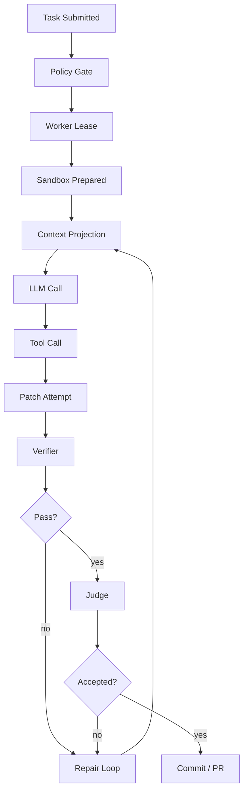
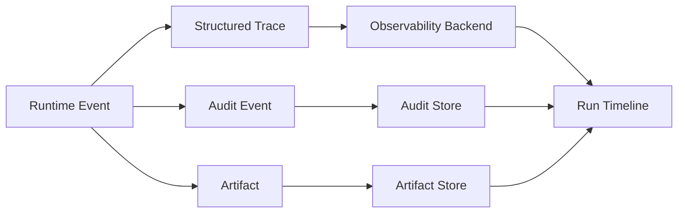
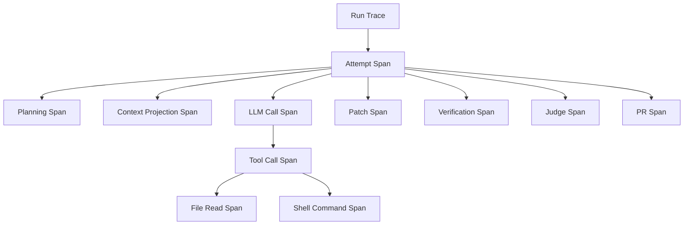
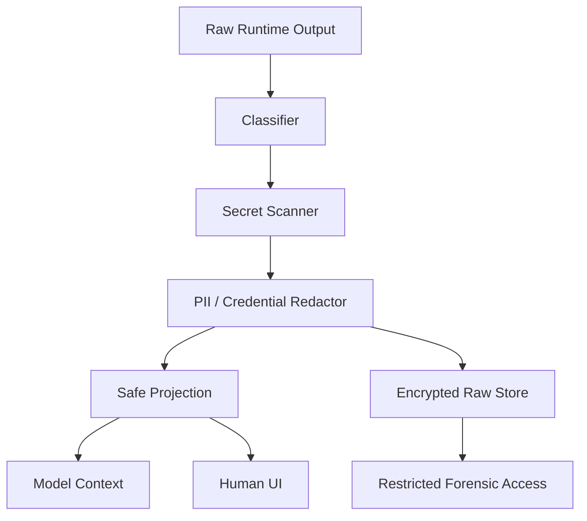
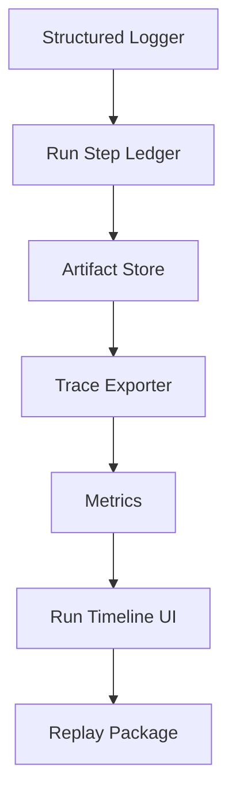

------
title: Learn AI Coding Agent From Scratch - Part 059
description: Observability, tracing, replay, dan failure diagnosis untuk Honk-like AI coding agent: trace per run, tool call ledger, diff timeline, artifact correlation, privacy, redaction, dan deterministic replay.
series: learn-ai-coding-agent
seriesTitle: Learn AI Coding Agent From Scratch
order: 59
partTitle: Observability, Tracing, and Replay
tags:
- ai-coding-agent
- observability
- tracing
- replay
- opentelemetry
- audit
- telemetry
- series
date: 2026-07-04
---

# Part 059 — Observability, Tracing, and Replay

Part sebelumnya membahas **human-in-the-loop approval design**.

Sekarang kita masuk ke pertanyaan yang menentukan apakah agent bisa dipakai di production:

> Ketika agent membuat PR yang salah, mahal, lambat, atau berhenti di tengah jalan, bagaimana kita tahu apa yang sebenarnya terjadi?

AI coding agent bukan request-response API biasa.

Satu run bisa berisi:

- puluhan LLM call,
- ratusan file read,
- beberapa patch attempt,
- command execution,
- verifier failure,
- judge feedback,
- approval pause,
- branch mutation,
- PR creation,
- dan repair loop berulang.

Kalau observability hanya berupa `console.log`, sistem akan gagal di production.

Kita butuh observability yang bisa menjawab:

1. **Apa yang agent coba lakukan?**
2. **Informasi apa yang agent lihat?**
3. **Tool apa yang dipanggil?**
4. **File apa yang berubah?**
5. **Verifier apa yang gagal?**
6. **Mengapa agent memilih langkah berikutnya?**
7. **Berapa biaya token dan wall-clock time?**
8. **Apakah run bisa direplay untuk debugging?**
9. **Apakah ada data sensitif yang masuk context/log?**
10. **Apakah failure berasal dari model, tool, sandbox, repo, CI, policy, atau manusia?**

Observability untuk Honk-like agent bukan dashboard cantik.

Observability adalah **truth system**.

---

## 1. Mental Model: Agent Run Adalah Distributed Transaction yang Tidak Sepenuhnya Deterministic

Satu agent run menyerupai distributed workflow:



Tetapi berbeda dari workflow deterministic biasa:

- LLM output bisa berubah antar waktu.
- Tool result bisa berubah jika repo, package registry, network, atau clock berubah.
- Verifier bisa flaky.
- Context projection bisa berbeda jika index berubah.
- Human approval bisa datang terlambat.
- Provider bisa rate limit.
- Sandbox bisa kehabisan memory.

Jadi observability harus menangkap dua hal sekaligus:

| Dimensi | Pertanyaan |
|---|---|
| Execution trace | Apa yang benar-benar terjadi? |
| Replay package | Apa yang diperlukan untuk merekonstruksi atau mendekati kejadian itu lagi? |

Kita tidak selalu bisa membuat LLM run 100% deterministic.

Tetapi kita bisa membuat run **auditable, explainable, comparable, and replayable enough**.

---

## 2. Observability Bukan Audit, Tapi Keduanya Harus Terhubung

Bedakan tiga jenis catatan:

| Jenis | Tujuan | Contoh |
|---|---|---|
| Telemetry | Debug dan operasi sistem | latency, token usage, queue wait, command duration |
| Audit | Accountability dan compliance | siapa approve, policy apa yang mengizinkan, PR apa yang dibuat |
| Artifact | Evidence teknis | patch, diff, logs, verification report, judge report |

Anti-pattern umum:

> Semua dimasukkan ke log.

Masalahnya:

- log terlalu besar,
- sulit dicari,
- raw log berpotensi mengandung secret,
- tidak ada schema stabil,
- tidak bisa jadi dasar approval,
- tidak cocok untuk replay.

Desain yang benar:



Satu kejadian bisa menghasilkan telemetry, audit, dan artifact sekaligus, tetapi jangan campur schema dan retention policy-nya.

---

## 3. Core Unit: Run Trace

Unit observability utama adalah **run trace**.

Bukan request trace HTTP.

Bukan job log.

Run trace adalah timeline eksekusi agent dari awal sampai akhir.

Contoh struktur minimal:

```json
{
  "trace_id": "trc_01J...",
  "task_id": "task_01J...",
  "run_id": "run_01J...",
  "attempt_id": "att_01J...",
  "repo": "github.com/org/service-a",
  "base_ref": "main",
  "base_sha": "f9a...",
  "agent_version": "agent-runtime@0.12.0",
  "policy_version": "policy@2026-07-04",
  "started_at": "2026-07-04T10:00:00+07:00",
  "ended_at": "2026-07-04T10:14:23+07:00",
  "status": "PR_CREATED"
}
```

Trace harus punya correlation key yang konsisten:

| Key | Fungsi |
|---|---|
| `task_id` | Intent user/orchestrator. |
| `run_id` | Eksekusi tertentu untuk task. |
| `attempt_id` | Percobaan dalam run, terutama setelah retry/resume. |
| `step_id` | Unit langkah agent. |
| `tool_call_id` | Pemanggilan tool. |
| `artifact_id` | File/log/diff/report yang dihasilkan. |
| `approval_id` | Approval yang mempengaruhi transisi. |
| `pr_id` | Pull request result. |

Tanpa correlation key, debugging akan berubah menjadi forensik manual.

---

## 4. Trace Hierarchy

Trace agent harus hierarkis:



Dalam OpenTelemetry, kita bisa memodelkan ini sebagai trace dengan span.

Tetapi jangan memaksakan semua hal menjadi span.

Gunakan prinsip:

| Data | Bentuk |
|---|---|
| Durasi operasi | Span |
| Counter/ratio | Metric |
| Event penting dalam span | Span event |
| Output besar | Artifact |
| Keputusan policy | Audit event |
| Error/failure | Structured diagnostic + span status |

OpenTelemetry menyediakan konsep traces, metrics, logs, semantic conventions, dan resources. Untuk agent platform, kita bisa memakai OpenTelemetry sebagai transport/standard observability, tetapi tetap perlu semantic convention internal khusus agent.

---

## 5. Agent Semantic Convention Internal

Kita buat semantic attributes sendiri yang konsisten.

Contoh naming:

```yaml
agent.task.id: task_01J...
agent.run.id: run_01J...
agent.attempt.id: att_01J...
agent.step.id: step_01J...
agent.phase: verification
agent.model.provider: openai
agent.model.name: gpt-5.1-codex
agent.model.call.kind: planning
agent.tool.name: shell.exec
agent.tool.permission_class: execute.safe
agent.repo.provider: github
agent.repo.full_name: org/service-a
agent.repo.base_sha: f9a...
agent.patch.files_changed: 4
agent.patch.lines_added: 22
agent.patch.lines_deleted: 11
agent.verifier.profile: maven-compile-unit
agent.verifier.status: failed
agent.policy.version: policy@2026-07-04
agent.cost.input_tokens: 18420
agent.cost.output_tokens: 1350
agent.cost.cached_input_tokens: 12000
```

Jangan pakai attribute ad hoc seperti:

```yaml
thing: run
kind: llm
value: ok
misc: something
```

Itu tidak bisa dianalisis.

Semantic convention internal harus menjawab query operasional:

- Model mana paling sering gagal pada repair loop?
- Tool mana paling mahal?
- Repo mana paling banyak timeout?
- Prompt contract mana paling banyak overreach?
- Policy mana paling banyak memblokir run?
- Verifier mana paling banyak flaky?
- Context projection mana yang menghasilkan success rate tertinggi?

---

## 6. Step Log: Event-Sourced Ledger untuk Agent

Selain trace, agent butuh **step ledger**.

Trace berguna untuk observability backend.

Step ledger berguna untuk domain-level replay.

Contoh table:

```sql
CREATE TABLE agent_run_steps (
    id              UUID PRIMARY KEY,
    run_id          UUID NOT NULL,
    attempt_id      UUID NOT NULL,
    sequence_no     BIGINT NOT NULL,
    phase           TEXT NOT NULL,
    step_type       TEXT NOT NULL,
    status          TEXT NOT NULL,
    started_at      TIMESTAMPTZ NOT NULL,
    ended_at        TIMESTAMPTZ,
    input_ref       TEXT,
    output_ref      TEXT,
    error_ref       TEXT,
    trace_id        TEXT,
    span_id         TEXT,
    created_at      TIMESTAMPTZ NOT NULL DEFAULT now(),
    UNIQUE(run_id, attempt_id, sequence_no)
);
```

`sequence_no` sangat penting.

Tanpa urutan deterministik, replay dan UI timeline akan ambigu.

Step type minimal:

| Step type | Contoh |
|---|---|
| `PLAN_CREATED` | Agent membuat plan awal. |
| `CONTEXT_PROJECTED` | Runtime memilih context untuk LLM call. |
| `MODEL_CALLED` | LLM call dengan request/response metadata. |
| `TOOL_CALLED` | Tool dipanggil. |
| `PATCH_APPLIED` | Workspace berubah. |
| `VERIFIER_RUN` | Build/test/lint dijalankan. |
| `JUDGE_RUN` | Diff dinilai. |
| `APPROVAL_REQUESTED` | Butuh approval. |
| `PR_CREATED` | PR berhasil dibuat. |
| `RUN_TERMINATED` | Run selesai/gagal/dibatalkan. |

---

## 7. Tool Call Ledger

Tool call adalah tempat failure paling banyak terjadi.

Setiap tool call harus dicatat sebagai structured ledger:

```json
{
  "tool_call_id": "tc_01J...",
  "run_id": "run_01J...",
  "step_id": "step_01J...",
  "tool_name": "shell.exec",
  "permission_class": "execute.safe",
  "approval_id": null,
  "input_schema_version": "shell.exec@1",
  "input_redacted_ref": "artifact://tc/input-redacted.json",
  "output_redacted_ref": "artifact://tc/output-redacted.json",
  "raw_output_ref": "artifact://tc/raw-output.enc",
  "started_at": "2026-07-04T10:02:01+07:00",
  "ended_at": "2026-07-04T10:02:05+07:00",
  "exit_code": 1,
  "timeout": false,
  "status": "FAILED",
  "diagnostic_ref": "artifact://diagnostics/mvn-error.json"
}
```

Catatan penting:

- input/output yang ditampilkan ke model harus **redacted**,
- raw output boleh disimpan encrypted dengan retention pendek,
- setiap output besar menjadi artifact, bukan inline row,
- command stdout/stderr harus punya byte limit,
- secret scan harus berjalan sebelum output masuk log atau prompt.

---

## 8. Diff Timeline

Untuk coding agent, observability paling penting adalah perubahan diff dari waktu ke waktu.

Kita butuh **diff timeline**.

Contoh:

| Sequence | Event | Files changed | Summary |
|---:|---|---:|---|
| 12 | patch applied | 2 | Rename deprecated API usage. |
| 15 | verifier failed | 2 | Compile error in `OrderMapperTest`. |
| 18 | patch applied | 3 | Fix test fixture. |
| 21 | verifier passed | 3 | Maven test passed. |
| 23 | judge rejected | 3 | Agent modified unrelated config. |
| 25 | patch reverted | 2 | Removed unrelated config change. |

Diff timeline menjawab:

> Bagaimana perubahan berkembang sampai final PR?

Ini berbeda dari final diff.

Final diff hanya menunjukkan hasil akhir.

Diff timeline menunjukkan proses dan membantu mendeteksi:

- overreach yang sempat terjadi lalu direvert,
- agent bolak-balik mengubah file yang sama,
- patch churn tinggi,
- repeated repair tanpa progress,
- perubahan test yang mencurigakan,
- verifier gaming.

Schema artifact:

```json
{
  "diff_snapshot_id": "ds_01J...",
  "run_id": "run_01J...",
  "sequence_no": 18,
  "base_sha": "f9a...",
  "workspace_tree_hash": "a91...",
  "files": [
    {
      "path": "src/main/java/app/OrderService.java",
      "status": "MODIFIED",
      "lines_added": 8,
      "lines_deleted": 3,
      "classification": "source"
    }
  ],
  "diff_ref": "artifact://diffs/run-18.patch"
}
```

---

## 9. Artifact Store sebagai Evidence Layer

Artifact bukan storage sampingan.

Artifact adalah bukti.

Jenis artifact:

| Artifact | Retention | Sensitive? | Dipakai untuk |
|---|---:|---|---|
| Task contract | panjang | medium | audit, replay |
| Context manifest | panjang | medium | debugging, eval |
| Model request redacted | sedang | high | replay terbatas |
| Model response redacted | sedang | medium | debugging |
| Tool input/output redacted | sedang | medium | debugging |
| Raw command log encrypted | pendek | high | incident forensic |
| Patch snapshot | panjang | low/medium | PR evidence |
| Verification report | panjang | low | PR evidence |
| Judge report | panjang | low/medium | review |
| Approval record | panjang | medium | compliance |

Artifact store harus punya metadata:

```json
{
  "artifact_id": "art_01J...",
  "run_id": "run_01J...",
  "kind": "verification-report",
  "content_type": "application/json",
  "sha256": "...",
  "size_bytes": 18420,
  "storage_uri": "s3://agent-artifacts/...",
  "redaction_level": "safe-for-human-review",
  "retention_class": "long",
  "created_at": "2026-07-04T10:10:00+07:00"
}
```

Invariant:

> Tidak ada step penting tanpa artifact atau structured event yang bisa diaudit.

---

## 10. Replay: Apa yang Bisa dan Tidak Bisa Direplay

Jangan menjanjikan replay sempurna.

Replay agent punya level:

| Level | Nama | Penjelasan |
|---:|---|---|
| 0 | Timeline replay | Menampilkan apa yang terjadi. |
| 1 | Tool replay | Menjalankan ulang tool deterministic dengan input sama. |
| 2 | Verifier replay | Menjalankan ulang build/test pada snapshot sama. |
| 3 | Model-response replay | Menggunakan response LLM yang direkam, tanpa call provider. |
| 4 | Model-call replay | Memanggil model lagi dengan prompt sama. |
| 5 | Full environment replay | Recreate repo, image, env, tool, model config, dan policy. |

Level 4 tidak menjamin output sama.

Level 5 pun bisa berubah jika:

- model provider berubah,
- package registry berubah,
- dependency tidak dipin,
- test flaky,
- system clock berpengaruh,
- network call non-deterministic.

Target practical:

> Agent platform harus minimal mendukung Level 0-3 untuk debugging dan Level 2 untuk verifier forensic.

---

## 11. Replay Package

Setiap run harus bisa menghasilkan replay package.

```yaml
replay_package:
  run_id: run_01J...
  base_repo:
    provider: github
    full_name: org/service-a
    base_sha: f9a...
  runtime:
    agent_version: agent-runtime@0.12.0
    policy_version: policy@2026-07-04
    verifier_version: verifier@0.9.0
    sandbox_image: ghcr.io/org/agent-java17@sha256:...
  inputs:
    task_contract_ref: artifact://task.json
    prompt_contract_ref: artifact://prompt-contract.yaml
    context_manifest_ref: artifact://context-manifest.json
  steps:
    ledger_ref: artifact://steps.ndjson
  outputs:
    final_patch_ref: artifact://final.patch
    verification_ref: artifact://verification.json
    judge_ref: artifact://judge.json
```

Replay package tidak harus mengandung semua raw content inline.

Ia harus menjadi manifest yang menunjuk artifact immutable.

---

## 12. Context Manifest

Untuk agent, observability tanpa context manifest tidak cukup.

Kita perlu tahu **apa yang model lihat**.

Context manifest tidak harus menyimpan seluruh prompt raw.

Minimal:

```json
{
  "context_projection_id": "ctx_01J...",
  "run_id": "run_01J...",
  "step_id": "step_01J...",
  "model_call_id": "mc_01J...",
  "total_tokens_estimated": 18200,
  "items": [
    {
      "kind": "system-instruction",
      "trust_level": "platform",
      "sha256": "...",
      "tokens": 1400
    },
    {
      "kind": "repository-file-slice",
      "path": "src/main/java/app/OrderService.java",
      "start_line": 20,
      "end_line": 92,
      "trust_level": "repository",
      "sha256": "...",
      "tokens": 2100
    },
    {
      "kind": "tool-output-summary",
      "tool_call_id": "tc_01J...",
      "trust_level": "tool-output",
      "sha256": "...",
      "tokens": 700
    }
  ]
}
```

Context manifest berguna untuk:

- debugging wrong answer,
- detecting missing context,
- measuring context bloat,
- investigating prompt injection,
- reproducing judge decision,
- comparing prompt contract variants.

---

## 13. Model Call Observability

Setiap LLM call harus punya metadata:

```json
{
  "model_call_id": "mc_01J...",
  "provider": "openai",
  "model": "gpt-5.1-codex",
  "purpose": "repair-planning",
  "input_tokens": 18420,
  "cached_input_tokens": 12000,
  "output_tokens": 1350,
  "temperature": 0.2,
  "tool_choice": "auto",
  "timeout_ms": 120000,
  "latency_ms": 18450,
  "finish_reason": "tool_calls",
  "status": "OK",
  "request_ref": "artifact://model/mc-request-redacted.json",
  "response_ref": "artifact://model/mc-response-redacted.json"
}
```

Jangan hanya mencatat total token per run.

Kita butuh breakdown per purpose:

| Purpose | Kenapa penting |
|---|---|
| planning | Mengukur planning overhead. |
| code-edit | Mengukur edit cost. |
| repair | Mengukur verifier feedback quality. |
| judge | Mengukur review cost. |
| summarization | Mengukur context compression overhead. |

Query yang harus bisa dijawab:

```sql
SELECT purpose, sum(input_tokens), sum(output_tokens), avg(latency_ms)
FROM model_calls
WHERE created_at >= now() - interval '7 days'
GROUP BY purpose;
```

---

## 14. Metrics yang Benar-Benar Berguna

Metric jangan terlalu banyak di awal.

Mulai dari metric yang mempengaruhi operasi.

### Throughput

| Metric | Makna |
|---|---|
| `agent.tasks.submitted` | Task masuk. |
| `agent.runs.started` | Run mulai. |
| `agent.runs.completed` | Run selesai. |
| `agent.pr.created` | PR dibuat. |
| `agent.pr.merged` | PR merged. |

### Reliability

| Metric | Makna |
|---|---|
| `agent.run.success_rate` | Run yang berhasil sampai target state. |
| `agent.verifier.pass_rate` | Verifier pass. |
| `agent.judge.accept_rate` | Judge accept. |
| `agent.repair.iterations` | Jumlah repair loop. |
| `agent.tool.failure_rate` | Tool failure. |

### Cost

| Metric | Makna |
|---|---|
| `agent.cost.usd` | Estimasi biaya. |
| `agent.tokens.input` | Input token. |
| `agent.tokens.output` | Output token. |
| `agent.tokens.cached_input` | Cached input token. |
| `agent.cost.per_pr` | Biaya per PR created. |

### Latency

| Metric | Makna |
|---|---|
| `agent.queue.wait_ms` | Waktu menunggu worker. |
| `agent.sandbox.prepare_ms` | Waktu prepare sandbox. |
| `agent.model.latency_ms` | Latency model call. |
| `agent.tool.latency_ms` | Latency tool. |
| `agent.verifier.latency_ms` | Latency verifier. |
| `agent.run.duration_ms` | Total run duration. |

### Safety

| Metric | Makna |
|---|---|
| `agent.policy.blocked` | Policy block. |
| `agent.approval.requested` | Approval request. |
| `agent.secret.redacted` | Redaction event. |
| `agent.prompt_injection.detected` | Detection signal. |
| `agent.forbidden_path.attempt` | Attempt ke path terlarang. |

---

## 15. High-Cardinality Trap

Jangan memasukkan data high-cardinality sembarangan ke metric label.

Buruk:

```text
agent.tool.latency_ms{run_id="run_...", file_path="src/main/java/..."}
```

Ini bisa meledakkan cardinality.

Lebih baik:

```text
agent.tool.latency_ms{tool="shell.exec", repo_language="java", phase="verification"}
```

Detail seperti run_id, file path, atau artifact_id masuk trace/log/artifact, bukan metric label.

---

## 16. Run Timeline UI

Observability harus bisa dipakai manusia.

Minimal run page:

```text
Run: run_01J...
Status: PR_CREATED
Repo: org/service-a
Base SHA: f9a...
Branch: agent/task-123
Cost: $1.42
Duration: 14m23s

Timeline:
[10:00] Task accepted
[10:01] Sandbox prepared
[10:02] Repository map built
[10:03] Plan created
[10:05] Patch applied: 2 files
[10:06] Maven test failed: OrderMapperTest
[10:08] Repair patch applied: 1 file
[10:10] Maven test passed
[10:11] Judge rejected: unrelated config change
[10:12] Config change reverted
[10:13] Judge accepted
[10:14] PR created
```

Setiap row harus punya drilldown:

- prompt/context manifest,
- tool call input/output,
- diff snapshot,
- verifier log,
- judge report,
- approval record.

Developer tidak mau membaca 40.000 baris log.

Developer ingin timeline yang bisa dipercaya.

---

## 17. Failure Diagnosis Taxonomy

Setiap failure harus diklasifikasikan.

Jangan hanya `FAILED`.

Taxonomy awal:

| Class | Contoh |
|---|---|
| `TASK_INVALID` | Requirement ambigu, target repo tidak ada. |
| `POLICY_BLOCKED` | Scope terlalu berisiko. |
| `SANDBOX_FAILURE` | Container gagal start. |
| `REPO_FAILURE` | Clone gagal, submodule gagal. |
| `CONTEXT_FAILURE` | File target tidak ditemukan. |
| `MODEL_FAILURE` | Provider timeout, malformed tool call. |
| `TOOL_FAILURE` | Command exit nonzero tidak ter-handle. |
| `PATCH_FAILURE` | Patch tidak apply. |
| `VERIFIER_FAILURE` | Compile/test/static analysis gagal. |
| `JUDGE_REJECTED` | Diff tidak sesuai rubric. |
| `APPROVAL_TIMEOUT` | Human approval tidak diberikan. |
| `PR_FAILURE` | PR API gagal. |
| `BUDGET_EXCEEDED` | Token/cost/time budget habis. |
| `CANCELLED` | User/system cancel. |

Klasifikasi failure memungkinkan improvement loop.

Kalau 40% failure adalah `CONTEXT_FAILURE`, jangan mengganti model.

Perbaiki context retrieval.

Kalau 30% failure adalah `VERIFIER_FAILURE` karena test flaky, jangan memperbesar token budget.

Perbaiki verifier dan flake handling.

---

## 18. Redaction Pipeline

Observability bisa menjadi sumber data leakage.

Semua event/log/artifact harus melewati redaction policy.



Policy:

| Output | Ke model | Ke UI | Raw store |
|---|---|---|---|
| Build error | yes, summarized | yes | optional |
| Env vars | no | redacted | short retention encrypted |
| Git remote URL | maybe redacted | redacted | encrypted |
| Stack trace | yes after scan | yes | optional |
| Test fixture data | depends | depends | depends |
| Token/secret | never | never | incident-only if needed |

Invariant:

> Tidak ada raw output langsung masuk prompt tanpa redaction dan trust wrapping.

---

## 19. Debugging Playbooks

### Playbook A: Agent Membuat PR yang Terlalu Besar

Cek:

1. task contract scope,
2. prompt contract constraints,
3. context manifest,
4. plan steps,
5. diff timeline,
6. boundary judge report,
7. approval decision.

Kemungkinan akar masalah:

- target selector terlalu luas,
- repository instructions ambigu,
- judge terlalu longgar,
- tool `write_file` diberi permission terlalu besar,
- generated file tidak diklasifikasikan,
- repair loop memperbaiki error dengan cara overreach.

### Playbook B: Agent Selalu Gagal Compile

Cek:

1. baseline verifier sebelum patch,
2. build profile,
3. Java/Maven version sandbox,
4. dependency cache,
5. diagnostic summarizer,
6. repair prompt,
7. repeated error cluster.

Kemungkinan akar masalah:

- baseline sudah merah,
- sandbox tidak cocok dengan repo,
- tool output dipotong terlalu pendek,
- agent tidak diberi file call site yang benar,
- repair loop kehilangan konteks.

### Playbook C: Cost Meledak

Cek:

1. model call breakdown by purpose,
2. context manifest size,
3. cached input tokens,
4. repair iteration count,
5. verifier failure loop,
6. judge retry,
7. tool output size.

Kemungkinan akar masalah:

- context projection terlalu besar,
- prompt cache prefix sering berubah,
- repair loop tidak punya stop condition,
- logs terlalu panjang masuk prompt,
- model mahal dipakai untuk semua phase.

---

## 20. Minimal Implementation Plan

Untuk implementasi awal, bangun observability dalam 7 layer:



### Step 1 — Structured event helper

```ts
type AgentEvent = {
  eventId: string;
  taskId: string;
  runId: string;
  attemptId?: string;
  stepId?: string;
  type: string;
  phase: string;
  severity: "debug" | "info" | "warn" | "error";
  timestamp: string;
  attributes: Record<string, unknown>;
  artifactRefs?: string[];
};
```

### Step 2 — Span wrapper

```ts
async function withAgentSpan<T>(
  name: string,
  attrs: Record<string, unknown>,
  fn: () => Promise<T>
): Promise<T> {
  const span = tracer.startSpan(name, { attributes: attrs });
  try {
    const result = await fn();
    span.setStatus({ code: SpanStatusCode.OK });
    return result;
  } catch (err) {
    span.recordException(err as Error);
    span.setStatus({ code: SpanStatusCode.ERROR });
    throw err;
  } finally {
    span.end();
  }
}
```

### Step 3 — Artifact writer

```ts
type ArtifactWriteRequest = {
  runId: string;
  kind: string;
  contentType: string;
  bytes: Uint8Array;
  redactionLevel: "public" | "review" | "restricted" | "encrypted-raw";
  retentionClass: "short" | "medium" | "long";
};
```

### Step 4 — Timeline query

```sql
SELECT sequence_no, phase, step_type, status, started_at, ended_at, output_ref, error_ref
FROM agent_run_steps
WHERE run_id = $1
ORDER BY sequence_no ASC;
```

### Step 5 — Failure summary

```sql
SELECT failure_class, count(*)
FROM agent_runs
WHERE created_at >= now() - interval '7 days'
GROUP BY failure_class
ORDER BY count(*) DESC;
```

---

## 21. Production Invariants

Sistem observability agent harus memegang invariant ini:

1. **Every run has a trace.**
2. **Every important transition has a step ledger row.**
3. **Every tool call has structured input/output metadata.**
4. **Every patch has a diff artifact.**
5. **Every verifier failure has a diagnostic artifact.**
6. **Every judge decision has a rubric report.**
7. **Every approval decision is auditable.**
8. **No raw secret enters logs, prompt, or UI.**
9. **Replay package can be generated for completed and failed runs.**
10. **Metrics do not use high-cardinality labels.**

---

## 22. Common Anti-Patterns

| Anti-pattern | Akibat |
|---|---|
| Only console logs | Tidak bisa audit/replay. |
| Storing raw prompts forever | Privacy dan compliance risk. |
| No context manifest | Tidak tahu model melihat apa. |
| No diff timeline | Sulit melihat overreach dan churn. |
| No failure taxonomy | Improvement menjadi tebak-tebakan. |
| Metrics with run_id labels | Cardinality explosion. |
| Raw tool output to model | Prompt injection dan secret leakage. |
| Trace tanpa artifacts | Span ada, bukti teknis hilang. |
| Artifact tanpa hash | Evidence tidak immutable. |
| No replay package | Debugging incident mahal. |

---

## 23. Checklist Part 059

Sebelum lanjut, pastikan desainmu bisa menjawab:

- Apakah setiap run punya trace ID dan run ID konsisten?
- Apakah step ledger menyimpan urutan langkah deterministik?
- Apakah setiap model call mencatat purpose, token, latency, dan artifact ref?
- Apakah context manifest menyimpan item yang dilihat model?
- Apakah tool call output melewati redaction?
- Apakah diff timeline tersedia?
- Apakah verifier dan judge menghasilkan artifact terstruktur?
- Apakah failure diklasifikasikan?
- Apakah replay package bisa dibuat?
- Apakah raw artifact punya retention dan access class?

---

## 24. Referensi

- OpenTelemetry Documentation — https://opentelemetry.io/docs/
- OpenTelemetry Semantic Conventions — https://opentelemetry.io/docs/concepts/semantic-conventions/
- OpenTelemetry Specification — https://opentelemetry.io/docs/specs/
- Spotify Engineering: Feedback Loops for Background Coding Agents — https://engineering.atspotify.com/2025/12/feedback-loops-background-coding-agents-part-3
- OpenAI Codex Sandboxing — https://developers.openai.com/codex/concepts/sandboxing
- OWASP Top 10 for LLM Applications — https://owasp.org/www-project-top-10-for-large-language-model-applications/

---

## 25. Penutup

Observability untuk AI coding agent bukan aksesori.

Ia adalah bagian dari correctness model.

Agent yang tidak observable tidak bisa dipercaya, meskipun kadang menghasilkan PR yang benar.

Di Part 060, kita akan membahas **cost, latency, dan quota management**: bagaimana mengendalikan token, model selection, prompt caching, rate limit, retry budget, parallelism, dan provider failover tanpa mengorbankan kualitas perubahan kode.
