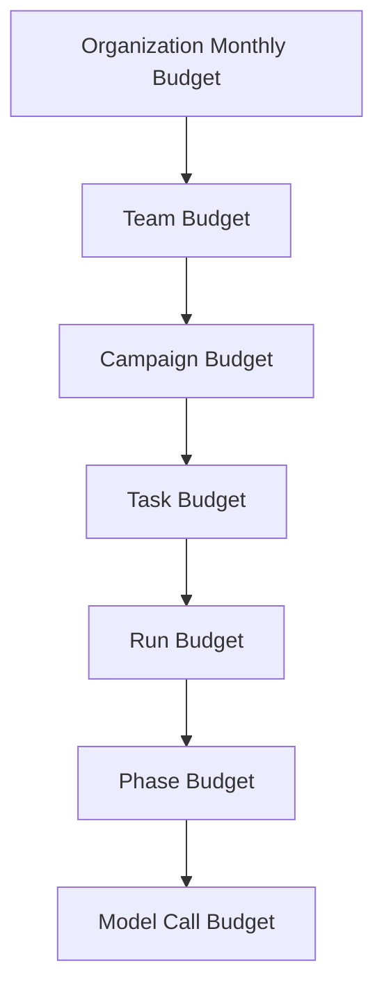
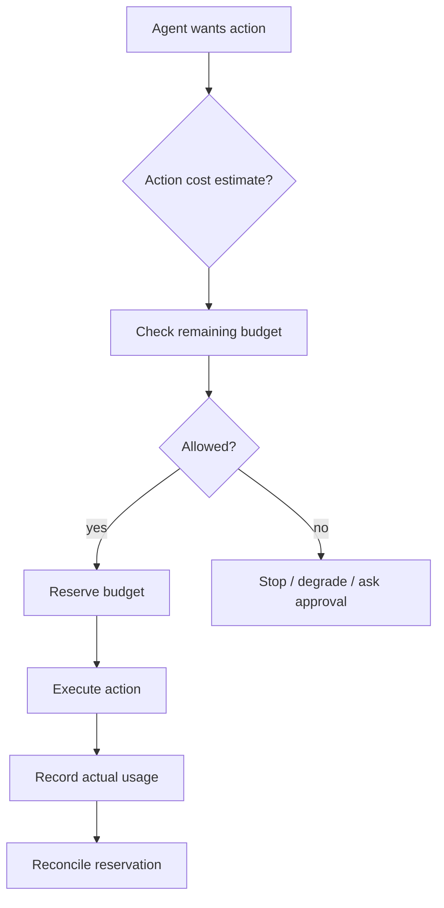
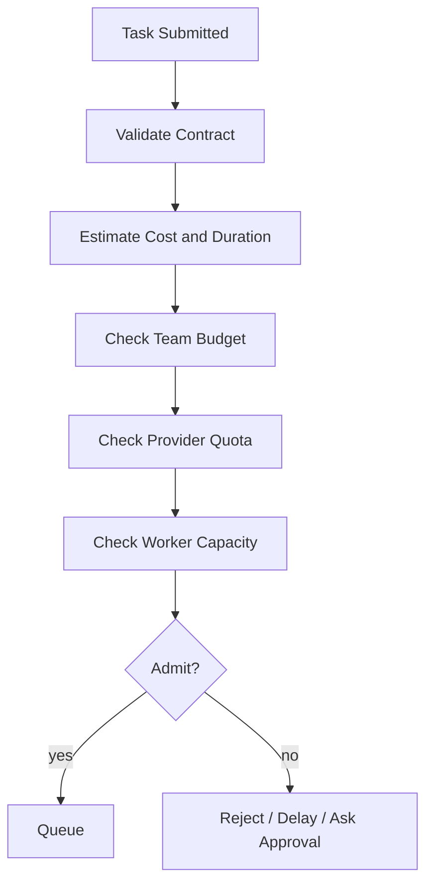
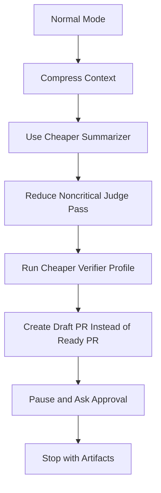
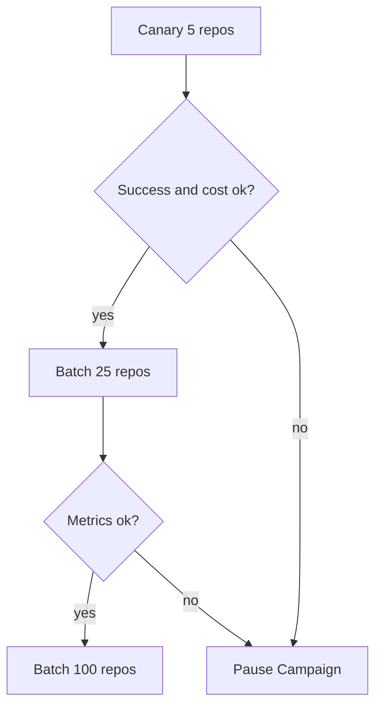

------
title: Learn AI Coding Agent From Scratch - Part 060
description: Cost, latency, quota, token budget, retry budget, prompt caching, model routing, parallelism, provider failover, dan financial control plane untuk Honk-like AI coding agent.
series: learn-ai-coding-agent
seriesTitle: Learn AI Coding Agent From Scratch
order: 60
partTitle: Cost, Latency, and Quota Management
tags:
- ai-coding-agent
- cost-management
- latency
- quota
- rate-limit
- prompt-caching
- model-routing
- series
date: 2026-07-04
---

# Part 060 — Cost, Latency, and Quota Management

Part sebelumnya membahas **observability, tracing, dan replay**.

Sekarang kita bahas masalah yang biasanya muncul setelah agent mulai berjalan nyata:

> Sistem bekerja, tetapi terlalu mahal, terlalu lambat, dan sering kena rate limit.

AI coding agent punya pola cost yang berbeda dari chatbot.

Chatbot biasanya:

- satu user,
- satu conversation,
- beberapa turn,
- latency terlihat langsung.

Background coding agent biasanya:

- banyak repo,
- banyak task,
- banyak worker,
- banyak tool call,
- context panjang,
- verifier loop,
- judge loop,
- retry,
- PR orchestration,
- dan bisa berjalan paralel.

Jika cost/latency/quota tidak didesain sebagai control plane, agent akan menjadi tidak predictable.

Target part ini:

> Membangun financial and capacity control plane untuk agent, bukan sekadar menghitung token setelah tagihan datang.

---

## 1. Mental Model: Cost Adalah Resource, Bukan Efek Samping

Di sistem agent, cost harus diperlakukan seperti CPU, memory, disk, dan network.

Ia punya:

- budget,
- quota,
- reservation,
- consumption,
- throttling,
- priority,
- backpressure,
- audit,
- dan policy.

Kalau cost hanya dihitung di akhir, sistem sudah terlambat.

Agent harus bisa berkata:

> Task ini belum selesai, tetapi budget sudah tidak sebanding dengan expected value. Stop atau minta approval.

Ini sama pentingnya dengan sandbox.

Sandbox membatasi aksi teknis.

Cost control membatasi aksi ekonomi.

---

## 2. Tiga Dimensi: Cost, Latency, Quota

Jangan mencampur tiga hal ini.

| Dimensi | Pertanyaan | Contoh |
|---|---|---|
| Cost | Berapa biaya uang/token/compute? | `$1.40 per PR` |
| Latency | Berapa lama user/CI menunggu? | `14 menit per run` |
| Quota | Apakah provider/runtime mengizinkan throughput ini? | `429 rate limit` |

Tiga dimensi ini sering trade-off.

Contoh:

- Model lebih murah bisa lebih lambat karena butuh repair lebih banyak.
- Model lebih mahal bisa lebih murah total jika success first-pass lebih tinggi.
- Parallelism menurunkan latency tetapi menaikkan quota pressure.
- Prompt caching menurunkan cost/latency tetapi butuh prompt layout stabil.
- Verifier lebih lengkap menaikkan latency tetapi menurunkan PR gagal di outer CI.

Jangan optimasi token cost secara sempit.

Optimasi **cost of accepted correct change**.

---

## 3. Unit Ekonomi yang Benar

Metric yang dangkal:

```text
cost per model call
```

Metric yang lebih berguna:

```text
cost per run completed
cost per PR created
cost per PR merged
cost per successful migration target
cost per human-reviewed accepted PR
cost per avoided manual hour
```

Untuk platform internal, unit ekonomi paling penting biasanya:

| Unit | Makna |
|---|---|
| `cost_per_task_submitted` | Semua task, termasuk invalid. |
| `cost_per_run_success` | Run yang selesai sesuai target state. |
| `cost_per_pr_created` | Output reviewable. |
| `cost_per_pr_merged` | Output benar-benar masuk. |
| `cost_per_repo_migrated` | Fleet campaign. |
| `cost_per_human_review_minute_saved` | ROI developer productivity. |

Agent yang menghasilkan banyak PR tapi tidak merged mungkin terlihat produktif, tetapi economically bad.

---

## 4. Token Accounting Model

Setiap model call harus dicatat.

```sql
CREATE TABLE model_call_usage (
    id                    UUID PRIMARY KEY,
    run_id                UUID NOT NULL,
    step_id               UUID,
    provider              TEXT NOT NULL,
    model                 TEXT NOT NULL,
    purpose               TEXT NOT NULL,
    input_tokens          BIGINT NOT NULL DEFAULT 0,
    cached_input_tokens   BIGINT NOT NULL DEFAULT 0,
    output_tokens         BIGINT NOT NULL DEFAULT 0,
    reasoning_tokens      BIGINT NOT NULL DEFAULT 0,
    billable_units_json   JSONB NOT NULL DEFAULT '{}',
    price_version         TEXT NOT NULL,
    estimated_cost_usd    NUMERIC(18,8) NOT NULL DEFAULT 0,
    latency_ms            BIGINT NOT NULL,
    status                TEXT NOT NULL,
    created_at            TIMESTAMPTZ NOT NULL DEFAULT now()
);
```

Jangan hanya simpan total tokens.

Simpan:

- provider,
- model,
- purpose,
- token category,
- price version,
- estimated cost,
- latency,
- cache signal,
- status.

Kenapa `price_version` penting?

Karena harga provider berubah.

Cost historical harus bisa dijelaskan berdasarkan harga saat call terjadi, bukan harga saat laporan dibaca.

---

## 5. Budget Hierarchy

Budget harus bertingkat.



Contoh:

```yaml
budget:
  organization:
    monthly_usd: 20000
  team:
    platform:
      monthly_usd: 3000
  campaign:
    spring-boot-3-migration:
      max_usd: 500
      max_repos: 120
  task:
    max_usd: 5
    max_duration_minutes: 45
  run:
    max_model_calls: 60
    max_repair_iterations: 6
  phase:
    planning:
      max_usd: 0.30
    editing:
      max_usd: 2.00
    verification_repair:
      max_usd: 2.00
    judge:
      max_usd: 0.50
```

Invariant:

> Tidak ada agent run tanpa budget envelope.

---

## 6. Budget Enforcement Point

Budget harus dicek sebelum melakukan aksi mahal.



Aksi yang perlu budget gate:

| Action | Kenapa |
|---|---|
| LLM call | Token/cost langsung. |
| Large context projection | Akan menaikkan input token. |
| Expensive model switch | Biaya per call naik. |
| Long verifier | Compute/time cost. |
| Parallel repo fan-out | Quota dan total cost. |
| Retry/repair loop | Risiko infinite spend. |
| Judge re-run | Tambahan model call. |

---

## 7. Cost Estimation Sebelum Call

Sebelum call model, runtime harus mengestimasi.

```ts
type ModelCallEstimate = {
  provider: string;
  model: string;
  purpose: string;
  estimatedInputTokens: number;
  estimatedOutputTokens: number;
  estimatedCachedInputTokens: number;
  estimatedCostUsd: number;
  estimatedLatencyMsP50: number;
  estimatedLatencyMsP95: number;
};
```

Estimation tidak harus sempurna.

Ia harus cukup baik untuk policy:

- allow,
- downgrade model,
- compress context,
- split task,
- ask approval,
- atau stop.

---

## 8. Model Routing Berdasarkan Purpose

Jangan pakai model paling kuat untuk semua hal.

Coding agent punya phase berbeda:

| Purpose | Kebutuhan | Model strategy |
|---|---|---|
| repo summarization | murah, long context | cheaper/fast model |
| planning | reasoning sedang | balanced model |
| risky code edit | reasoning tinggi | strong coding model |
| simple mechanical edit | deterministic/script first | no LLM atau cheap model |
| log summarization | murah, robust | cheap model + parser |
| repair complex compile error | reasoning tinggi | strong model |
| judge final diff | strict rubric | strong or calibrated judge model |
| PR body generation | murah | cheap model/template |

Model router bisa memakai rule awal:

```yaml
routing:
  planning:
    default: balanced-coding
  edit.simple:
    default: cheap-coding
    fallback: balanced-coding
  edit.risky:
    default: strong-coding
  repair.compile:
    default: strong-coding
  summarize.log:
    default: cheap-long-context
  judge.diff:
    default: strong-judge
```

Kemudian tingkatkan ke routing berbasis eval.

---

## 9. Jangan Salah Membaca “Murah”

Model murah yang gagal tiga kali bisa lebih mahal daripada model mahal yang berhasil sekali.

Bandingkan:

| Strategy | Cost/call | Calls | PR success | Total useful cost |
|---|---:|---:|---:|---:|
| Cheap model | $0.10 | 12 | 20% | buruk |
| Balanced model | $0.35 | 5 | 55% | sedang |
| Strong model | $1.00 | 2 | 80% | mungkin terbaik |

Optimasi harus berbasis:

```text
expected_cost_to_accepted_pr = average_cost_per_attempt / probability_of_acceptance
```

Bukan:

```text
cheapest_model_price
```

---

## 10. Prompt Caching Strategy

Prompt caching dapat menurunkan latency dan cost jika prompt layout stabil.

Provider modern seperti OpenAI dan Anthropic mendokumentasikan prompt caching untuk repeated content seperti system instructions, tool definitions, large context, dan conversation prefixes. Google/Gemini juga memiliki dokumentasi token counting/rate limit dan context-size behavior yang harus diperhitungkan.

Untuk coding agent, candidate cacheable prefix:

- platform system instruction,
- agent operating manual,
- tool definitions,
- repository instructions,
- prompt contract static part,
- coding style guide,
- verifier rubric,
- judge rubric.

Dynamic content sebaiknya di bagian akhir:

- latest tool output,
- current error,
- current diff,
- latest plan revision,
- selected file slices.

Struktur prompt:

```text
[CACHEABLE: platform policy]
[CACHEABLE: agent role and protocol]
[CACHEABLE: tool schemas]
[CACHEABLE: prompt contract static rules]
[CACHEABLE-ish: repository instructions]
[DYNAMIC: task instance]
[DYNAMIC: context manifest]
[DYNAMIC: current diff]
[DYNAMIC: verifier feedback]
```

Anti-pattern:

```text
[DYNAMIC timestamp]
[CACHEABLE system instruction]
[DYNAMIC random run id]
[CACHEABLE tool definitions]
[DYNAMIC log output]
```

Dynamic content di awal bisa merusak prefix caching.

---

## 11. Context Budgeting

Context window besar tidak berarti harus dipakai penuh.

Context besar:

- menaikkan cost,
- menaikkan latency,
- memperbesar distraction,
- memperbesar risiko prompt injection,
- bisa menurunkan precision jika retrieval buruk.

Buat budget per projection:

```yaml
context_budget:
  planning:
    max_tokens: 24000
    allocation:
      task_contract: 2000
      repo_map: 6000
      relevant_files: 10000
      instructions: 4000
      slack: 2000
  repair:
    max_tokens: 18000
    allocation:
      verifier_diagnostic: 4000
      changed_files: 8000
      related_tests: 4000
      instructions: 2000
```

Context budget harus observable.

Setiap model call harus punya context manifest dan token allocation.

---

## 12. Latency Budgeting

Background agent tidak selalu butuh latency sub-second.

Tetapi ia tetap butuh SLO.

Contoh SLO:

| Task class | P50 | P95 | Max |
|---|---:|---:|---:|
| simple style fix | 2 min | 8 min | 15 min |
| dependency upgrade | 10 min | 45 min | 90 min |
| API migration single repo | 15 min | 60 min | 120 min |
| fleet migration batch | hours | day-scale | campaign policy |

Latency budget per phase:

```yaml
latency_budget:
  sandbox_prepare_ms: 120000
  repo_ingestion_ms: 180000
  planning_ms: 180000
  edit_loop_ms: 1800000
  verification_ms: 1800000
  judge_ms: 300000
  pr_creation_ms: 120000
```

Jika latency budget habis, pilihan:

- stop dengan partial artifact,
- create draft PR,
- request approval to continue,
- reduce verifier profile,
- split task,
- requeue lower priority.

Jangan infinite run.

---

## 13. Quota dan Rate Limit Model

Provider quota biasanya punya beberapa dimensi:

- requests per minute,
- tokens per minute,
- tokens per day/month,
- concurrent request,
- context size,
- output size,
- model-specific limit,
- organization/project tier.

Representasikan quota sebagai resource pool:

```ts
type QuotaPool = {
  provider: string;
  model: string;
  window: "minute" | "hour" | "day";
  requestLimit: number;
  inputTokenLimit: number;
  outputTokenLimit: number;
  concurrentLimit: number;
  reservedRequests: number;
  reservedTokens: number;
};
```

Scheduler tidak boleh buta terhadap quota.

Jika worker memulai 100 task sekaligus dan semua memakai model yang sama, rate limit akan muncul sebagai failure loop.

Quota harus masuk admission control.

---

## 14. Rate Limit Handling

429 bukan error biasa.

Ia adalah signal kapasitas.

Policy:

| Situation | Response |
|---|---|
| Single call transient 429 | exponential backoff with jitter. |
| Sustained provider quota | throttle queue. |
| Campaign-level pressure | reduce concurrency. |
| Low-priority task | pause/requeue. |
| High-priority task | switch provider/model if allowed. |
| Budget near limit | do not retry blindly. |

Pseudocode:

```ts
async function callModelWithQuota(req: ModelRequest): Promise<ModelResponse> {
  await quotaGate.reserve(req.provider, req.model, estimateTokens(req));

  try {
    return await retry.withBudget(async () => provider.call(req), {
      maxAttempts: 3,
      retryOn: ["429", "timeout", "5xx"],
      jitter: true,
      totalTimeoutMs: req.timeoutMs
    });
  } catch (error) {
    quotaGate.recordPressure(req.provider, req.model, error);
    throw error;
  } finally {
    quotaGate.reconcileActualUsage();
  }
}
```

Retry harus punya budget.

Tanpa retry budget, rate limit berubah menjadi cost amplifier.

---

## 15. Retry Budget

Retry tidak gratis.

Retry budget harus mencakup:

- model retry,
- tool retry,
- verifier retry,
- repair iteration,
- PR API retry.

Contoh:

```yaml
retry_budget:
  model_call:
    max_attempts: 3
    retryable: [timeout, rate_limit, provider_5xx]
  repair_loop:
    max_iterations: 6
    stop_if_same_error_repeats: 2
  verifier:
    flaky_retry: 2
    environment_retry: 1
    compile_failure_retry: 0
  pr_api:
    max_attempts: 3
```

Jangan retry compile failure tanpa patch baru.

Jangan retry judge rejection tanpa diff baru.

Jangan retry prompt injection block.

---

## 16. Parallelism Control

Parallelism punya dua level:

1. **Inter-run parallelism**: banyak task berjalan sekaligus.
2. **Intra-run parallelism**: satu task menjalankan subtask paralel.

Inter-run parallelism dikendalikan scheduler.

Intra-run parallelism harus lebih hati-hati.

Contoh aman:

- parallel repo indexing read-only,
- parallel verifier untuk module independen,
- parallel static analysis,
- parallel candidate search.

Contoh berisiko:

- dua agent mengedit workspace yang sama,
- dua repair loop pada branch sama,
- parallel judge atas diff yang berubah,
- parallel package install dengan shared cache tidak aman.

Invariant:

> Satu workspace mutable hanya boleh punya satu writer aktif.

---

## 17. Admission Control

Sebelum task masuk queue, lakukan admission control.



Admission decision:

| Decision | Makna |
|---|---|
| `ADMIT_NOW` | Jalankan segera. |
| `ADMIT_DELAYED` | Queue tapi rate-limited. |
| `REQUIRE_APPROVAL` | Perlu approval biaya/risiko. |
| `REJECT_BUDGET` | Budget tidak cukup. |
| `REJECT_POLICY` | Task tidak diizinkan. |
| `SPLIT_REQUIRED` | Scope terlalu besar. |

---

## 18. Degradation Strategy

Saat budget/quota/latency pressure muncul, jangan langsung gagal.

Gunakan degradation ladder:



Tetapi degradation tidak boleh melanggar safety.

Tidak boleh:

- mematikan secret scanning,
- melewati forbidden path policy,
- skip required verifier untuk high-risk task,
- menghapus human approval untuk credential/network/destructive action,
- membuat PR ready padahal verifier wajib belum berjalan.

---

## 19. Provider Failover

Failover bukan sekadar mengganti endpoint.

Provider berbeda punya:

- tool calling schema berbeda,
- context behavior berbeda,
- token counting berbeda,
- output style berbeda,
- safety behavior berbeda,
- pricing berbeda,
- caching behavior berbeda,
- rate limit berbeda.

Failover harus berbasis capability:

```yaml
models:
  strong-coding:
    primary: openai:gpt-5.1-codex
    fallback:
      - anthropic:claude-sonnet-x
      - google:gemini-x-pro
    required_capabilities:
      - tool_calling
      - long_context
      - structured_output
      - code_reasoning
```

Saat failover, catat:

- reason,
- previous provider/model,
- new provider/model,
- capability difference,
- cost difference,
- expected quality risk.

Jangan failover judge model tanpa recalibration.

---

## 20. Cost Ledger

Cost harus masuk ledger immutable.

```sql
CREATE TABLE cost_ledger_entries (
    id                 UUID PRIMARY KEY,
    org_id             UUID NOT NULL,
    team_id            UUID,
    campaign_id        UUID,
    task_id            UUID,
    run_id             UUID,
    source_type        TEXT NOT NULL,
    source_id          UUID NOT NULL,
    provider           TEXT,
    model              TEXT,
    purpose            TEXT,
    amount_usd         NUMERIC(18,8) NOT NULL,
    estimated          BOOLEAN NOT NULL,
    price_version      TEXT NOT NULL,
    usage_json         JSONB NOT NULL,
    created_at         TIMESTAMPTZ NOT NULL DEFAULT now()
);
```

Ledger properties:

- append-only,
- corrections as new entries,
- linked to run/model call/tool/verifier,
- queryable by team/campaign/task,
- exportable for finance/chargeback.

---

## 21. Budget Policy Examples

### Policy A — Single Repo Safe Task

```yaml
policy: single-repo-safe-task
max_usd: 3
max_duration_minutes: 30
max_model_calls: 30
max_repair_iterations: 4
allowed_models:
  - cheap-coding
  - balanced-coding
requires_approval_if:
  estimated_usd_gt: 3
  duration_gt_minutes: 30
```

### Policy B — High-Risk Dependency Upgrade

```yaml
policy: dependency-upgrade-high-risk
max_usd: 15
max_duration_minutes: 120
required_verifiers:
  - compile
  - unit-test
  - dependency-vulnerability-scan
  - license-check
allowed_models:
  - balanced-coding
  - strong-coding
requires_approval_if:
  lockfile_changed: true
  transitive_dependency_count_gt: 50
  estimated_usd_gt: 10
```

### Policy C — Fleet Campaign

```yaml
policy: fleet-migration
campaign_budget_usd: 500
max_concurrent_runs: 10
batch_size: 25
stop_campaign_if:
  pr_rejection_rate_gt: 0.30
  avg_cost_per_pr_gt: 8
  verifier_failure_rate_gt: 0.50
  prompt_injection_detected: true
```

---

## 22. PR-Level Cost Report

Setiap PR agent harus punya cost summary.

Contoh PR body section:

```md
## Agent Run Cost

- Estimated model cost: $1.42
- Model calls: 14
- Input tokens: 182,400
- Cached input tokens: 96,000
- Output tokens: 12,300
- Verifier runtime: 8m12s
- Repair iterations: 2
- Budget policy: dependency-upgrade-medium@2026-07-04
```

Untuk organisasi tertentu, angka cost mungkin tidak ditampilkan di PR publik/internal umum.

Tetapi harus tetap ada di audit dashboard.

---

## 23. Campaign Cost Management

Honk-like fleet agent sering dipakai untuk banyak repo.

Campaign harus punya rollout cost control:



Campaign gate:

| Metric | Gate example |
|---|---|
| PR created rate | `>= 70%` |
| PR rejected rate | `<= 20%` |
| avg cost per PR | `<= $8` |
| verifier pass rate | `>= 60%` |
| human review complaints | `<= threshold` |
| policy block rate | investigate if high |

Jangan menjalankan 1.000 repo sekaligus berdasarkan prompt yang belum canary.

---

## 24. Latency Optimization yang Aman

Urutan optimasi yang aman:

1. deterministic parsing sebelum LLM,
2. repo map cache,
3. dependency/build cache,
4. prompt caching,
5. context trimming,
6. log summarization deterministic,
7. phase-specific model routing,
8. verifier profile ordering,
9. parallel read-only indexing,
10. batch campaign scheduling.

Urutan optimasi yang buruk:

1. skip verifier,
2. skip judge,
3. disable policy check,
4. remove human approval,
5. let agent run arbitrary shell,
6. hide failures.

Latency optimization tidak boleh menghilangkan evidence.

---

## 25. Cost Anomaly Detection

Tambahkan detector:

| Anomaly | Signal |
|---|---|
| context bloat | input token P95 naik tajam. |
| repair loop stuck | same verifier error repeated. |
| provider degradation | latency/timeout naik. |
| prompt cache broken | cached input token ratio turun. |
| tool output explosion | log artifact size naik. |
| model regression | cost per accepted PR naik setelah upgrade. |
| campaign runaway | cost high + PR accept low. |

Contoh query:

```sql
SELECT date_trunc('hour', created_at) AS hour,
       purpose,
       avg(estimated_cost_usd) AS avg_cost,
       percentile_cont(0.95) WITHIN GROUP (ORDER BY latency_ms) AS p95_latency
FROM model_call_usage
WHERE created_at >= now() - interval '24 hours'
GROUP BY hour, purpose
ORDER BY hour DESC;
```

---

## 26. Stop Conditions

Cost control harus punya stop condition eksplisit.

Stop jika:

- budget habis,
- repair iteration habis,
- same verifier error berulang,
- context budget tidak cukup untuk evidence minimal,
- model provider tidak tersedia,
- quota pressure tinggi dan task low priority,
- expected value rendah,
- policy risk meningkat,
- human approval timeout.

Stop bukan kegagalan buruk jika menghasilkan artifact yang berguna.

Output stop yang baik:

- partial patch,
- failure diagnosis,
- verifier log,
- recommended next action,
- cost used,
- reason stopped.

---

## 27. Minimal Implementation Plan

### Step 1 — Usage Recorder

Implementasi wrapper semua LLM call:

```ts
async function trackedModelCall(req: ModelRequest): Promise<ModelResponse> {
  const estimate = estimator.estimate(req);
  await budget.reserve(req.runId, estimate);

  const started = Date.now();
  try {
    const res = await provider.call(req);
    const usage = normalizeUsage(req.provider, res.usage);
    await usageStore.record({
      runId: req.runId,
      provider: req.provider,
      model: req.model,
      purpose: req.purpose,
      inputTokens: usage.inputTokens,
      cachedInputTokens: usage.cachedInputTokens,
      outputTokens: usage.outputTokens,
      reasoningTokens: usage.reasoningTokens,
      latencyMs: Date.now() - started,
      status: "OK"
    });
    await budget.reconcile(req.runId, estimate, usage);
    return res;
  } catch (err) {
    await usageStore.recordFailure(req, err, Date.now() - started);
    await budget.releaseOrChargeFailure(req.runId, estimate, err);
    throw err;
  }
}
```

### Step 2 — Budget Gate

```ts
function assertBudgetAllowed(run: RunBudget, estimate: ModelCallEstimate) {
  if (run.remainingUsd < estimate.estimatedCostUsd) {
    throw new BudgetExceededError({
      remainingUsd: run.remainingUsd,
      estimatedUsd: estimate.estimatedCostUsd
    });
  }
}
```

### Step 3 — Quota Gate

```ts
await quotaGate.acquire({
  provider,
  model,
  estimatedRequests: 1,
  estimatedInputTokens,
  estimatedOutputTokens,
  priority: task.priority
});
```

### Step 4 — Model Router

```ts
const model = modelRouter.select({
  purpose: "repair.compile",
  riskLevel: task.riskLevel,
  remainingBudget: run.remainingBudget,
  quotaPressure: quota.currentPressure(),
  requiredCapabilities: ["tool_calling", "structured_output", "code_reasoning"]
});
```

### Step 5 — Dashboard

Minimal dashboard:

- spend per day,
- spend per team,
- cost per PR,
- cost per merged PR,
- token by purpose,
- model latency P50/P95,
- quota pressure,
- cache hit/cached token ratio,
- repair iteration distribution,
- campaign cost burn-down.

---

## 28. Production Invariants

1. **No run without budget envelope.**
2. **No model call without usage recording.**
3. **No retry without retry budget.**
4. **No campaign without cost canary.**
5. **No provider failover without capability check.**
6. **No high-risk task downgraded below required verifier/model policy.**
7. **No context expansion without budget check.**
8. **No quota error treated as normal agent failure.**
9. **No cost report without price version.**
10. **No optimization that disables safety evidence.**

---

## 29. Common Anti-Patterns

| Anti-pattern | Akibat |
|---|---|
| Pakai model terkuat untuk semua phase | Biaya meledak. |
| Pakai model termurah untuk semua phase | Repair loop banyak, PR rendah. |
| Tidak mencatat purpose model call | Tidak tahu cost berasal dari mana. |
| Retry tanpa budget | Cost amplifier. |
| Parallelism tanpa quota gate | 429 storm. |
| Prompt layout sering berubah | Prompt caching tidak efektif. |
| Context selalu penuh | Mahal dan distractive. |
| Skip verifier untuk hemat waktu | PR salah masuk review. |
| Campaign tanpa canary | Fleet-wide waste. |
| Cost hanya dilihat di invoice | Tidak bisa mengendalikan runtime. |

---

## 30. Checklist Part 060

Sebelum lanjut, pastikan platform agent punya:

- budget envelope per task/run,
- token/cost usage table,
- model call purpose taxonomy,
- price versioning,
- quota gate,
- retry budget,
- prompt caching layout,
- context budget,
- latency budget,
- model router,
- provider failover policy,
- campaign canary gate,
- cost anomaly detection,
- PR/run cost report,
- stop condition ketika cost tidak sebanding.

---

## 31. Referensi

- OpenAI Prompt Caching — https://developers.openai.com/api/docs/guides/prompt-caching
- Anthropic Prompt Caching — https://platform.claude.com/docs/en/build-with-claude/prompt-caching
- Anthropic Rate Limits — https://platform.claude.com/docs/en/api/rate-limits
- Gemini API Rate Limits — https://ai.google.dev/gemini-api/docs/rate-limits
- Gemini Token Counting — https://ai.google.dev/gemini-api/docs/tokens
- OpenTelemetry Metrics — https://opentelemetry.io/docs/concepts/signals/metrics/
- Spotify Engineering: Context Engineering for Background Coding Agents — https://engineering.atspotify.com/2025/11/context-engineering-background-coding-agents-part-2

---

## 32. Penutup

Cost, latency, dan quota bukan urusan billing belakangan.

Untuk Honk-like AI coding agent, tiga hal ini adalah control plane.

Agent yang tidak punya cost control akan sulit diskalakan.

Agent yang tidak punya latency budget akan sulit dipakai developer.

Agent yang tidak punya quota gate akan rapuh saat workload naik.

Di Part 061, kita akan membahas **pull request orchestration**: branch naming, commit convention, PR body, labels, reviewers, evidence section, draft vs ready PR, update existing PR, dan merge-readiness boundary.
