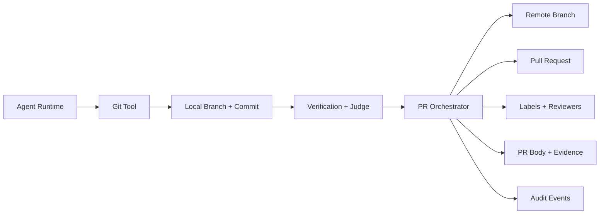
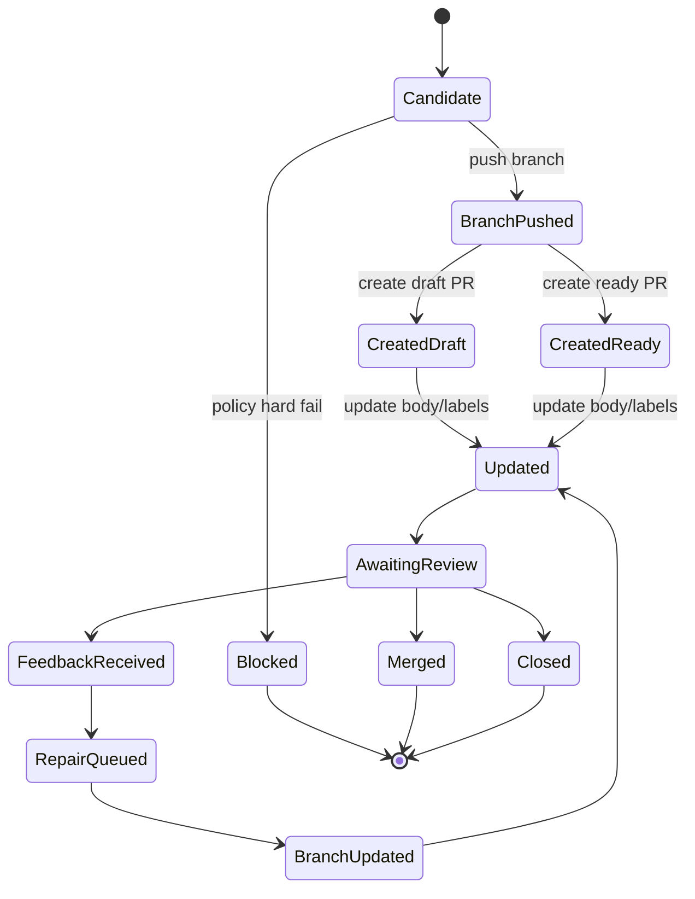
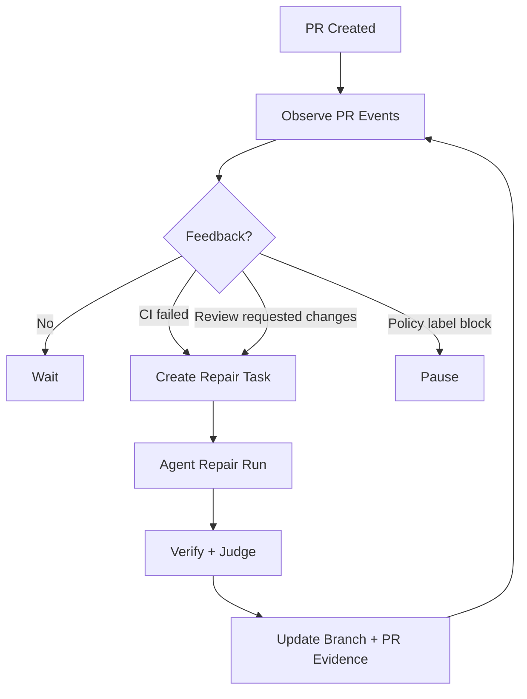
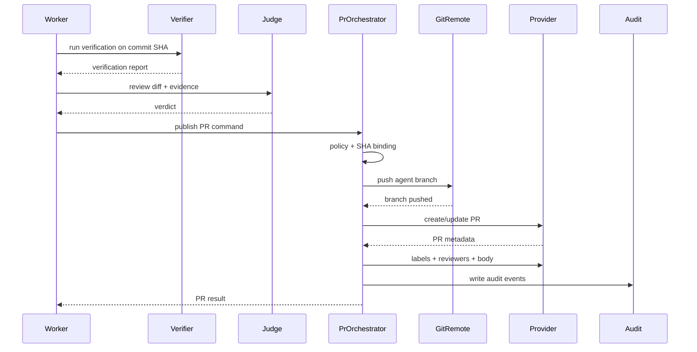

------
title: Learn AI Coding Agent From Scratch - Part 061
description: Pull Request Orchestration untuk Honk-like AI coding agent: branch naming, commit convention, PR body, labels, reviewers, evidence, review feedback, dan invariant agar perubahan agent bisa dipercaya.
series: learn-ai-coding-agent
seriesTitle: Learn AI Coding Agent From Scratch
order: 61
partTitle: Pull Request Orchestration
tags:
- ai-coding-agent
- pull-request
- github
- git
- automation
- software-engineering
date: 2026-07-04
---

# Part 061 — Pull Request Orchestration

Pada bagian sebelumnya kita sudah membangun banyak komponen internal: sandbox, tool runtime, verifier, judge, policy checks, cost control, dan observability. Semua itu belum cukup jika output akhirnya dilempar ke developer dalam bentuk PR yang buruk.

PR adalah titik temu antara agent dan engineering organization.

Agent boleh pintar. Verifier boleh hijau. Judge boleh memberi skor tinggi. Tapi jika PR-nya sulit dibaca, tidak menjelaskan scope, tidak menunjukkan evidence, tidak jelas siapa reviewer-nya, atau menimpa perubahan manusia, maka sistem akan kehilangan trust.

Di part ini kita membangun **Pull Request Orchestration Layer**.

Layer ini bukan sekadar fungsi `createPullRequest()`. Ia adalah boundary terakhir sebelum hasil kerja agent masuk ke workflow review manusia.

Tujuan kita:

1. Agent tidak langsung melakukan remote mutation tanpa policy.
2. Branch, commit, PR body, label, reviewer, dan metadata dibuat secara konsisten.
3. Setiap PR membawa evidence yang cukup: apa yang diubah, kenapa, bagaimana diverifikasi, risiko apa yang tersisa.
4. Review feedback bisa menjadi input repair loop tanpa menghancurkan state kerja sebelumnya.
5. PR bisa diaudit, direplay, dan dikaitkan ke task/run/verdict.

---

## 1. Masalah yang Sering Disalahpahami

Banyak prototype coding agent berhenti di titik ini:

```txt
agent edits files
agent runs tests
agent commits
agent opens PR
```

Itu terlalu dangkal.

Dalam sistem production-grade, PR creation bukan satu command. PR creation adalah **state transition** dari dunia agent ke dunia human review.

Sebelum PR dibuat, sistem harus menjawab:

- Apakah perubahan masih berada dalam scope task?
- Apakah diff sudah diverifikasi?
- Apakah ada deterministic policy yang gagal?
- Apakah judge menyatakan PR layak review?
- Apakah branch base masih fresh?
- Apakah target repository mengizinkan branch/PR dari token agent?
- Apakah reviewer bisa ditentukan?
- Apakah PR harus draft atau ready?
- Apakah label/metadata sudah benar?
- Apakah PR body cukup menjelaskan evidence?
- Apakah ada artifact yang harus dilampirkan?
- Apakah ini campaign/fleet PR yang harus dikaitkan ke wave tertentu?

Jika pertanyaan ini tidak dijawab oleh orchestration layer, agent akan terasa seperti bot yang “melempar pekerjaan ke manusia”.

---

## 2. Mental Model: PR sebagai Reviewable Change Package

Jangan pikirkan PR sebagai “diff di GitHub”.

Pikirkan PR sebagai paket:

```txt
PullRequestPackage =
  Intent
+ ChangeSet
+ Evidence
+ Risk
+ ReviewRouting
+ LifecycleState
+ AuditLink
```

PR yang bagus menjawab enam hal:

| Dimensi | Pertanyaan |
|---|---|
| Intent | Perubahan ini ingin mencapai apa? |
| Scope | File/area apa yang disentuh dan tidak disentuh? |
| Mechanism | Bagaimana agent melakukan perubahan? |
| Evidence | Verifier apa yang dijalankan dan hasilnya apa? |
| Risk | Risiko residual apa yang harus dicek reviewer? |
| Next action | Reviewer harus melakukan apa? |

Agent yang baik tidak hanya membuat kode berubah. Agent yang baik membuat manusia bisa menilai perubahan dengan cepat.

---

## 3. Boundary: Git Tool vs PR Orchestrator

Kita sudah membahas Git Tool pada Part 027. Git Tool mengelola local branch, diff, commit, dan status.

PR Orchestrator berbeda.



Git Tool menjawab:

- apa status working tree?
- apa diff lokal?
- apa commit lokal?
- apakah branch bersih?

PR Orchestrator menjawab:

- bolehkah commit ini dipublikasikan?
- branch remote apa yang dipakai?
- PR harus draft atau ready?
- reviewer siapa?
- label apa?
- body seperti apa?
- artifact evidence apa yang ditautkan?
- bagaimana jika PR sudah ada?
- bagaimana jika feedback review masuk?

Prinsipnya:

> Git Tool melakukan local source control operation. PR Orchestrator melakukan collaboration workflow operation.

---

## 4. Invariant Utama PR Orchestration

Sebelum menulis kode, tetapkan invariant.

### Invariant 1 — PR Tidak Dibuat dari Working Tree Kotor

PR harus dibuat dari commit yang jelas, bukan working directory acak.

```txt
working_tree_clean == true
index_clean == true
head_commit_sha == patch.commit_sha
```

Jika tidak, sistem tidak tahu persis artifact mana yang sedang dipublikasikan.

### Invariant 2 — PR Tidak Dibuat Tanpa Verdict

Minimal harus ada verdict eksplisit:

```txt
verdict in [APPROVED_FOR_DRAFT_PR, APPROVED_FOR_READY_PR]
```

Jika verifier gagal, judge gagal, atau policy gagal, PR tidak boleh ready.

Boleh saja membuat draft PR untuk debugging internal, tetapi state-nya harus eksplisit:

```txt
verdict = APPROVED_FOR_DRAFT_PR
reason = "compile fails but user requested draft for inspection"
```

### Invariant 3 — Remote Mutation Harus Diaudit

Push branch, create PR, update PR body, add label, request reviewer, comment — semua adalah remote mutation.

Setiap remote mutation harus menghasilkan audit event:

```json
{
  "eventType": "REMOTE_MUTATION_PERFORMED",
  "runId": "run_123",
  "mutation": "CREATE_PULL_REQUEST",
  "repository": "acme/billing-service",
  "actor": "agent-platform",
  "requestId": "req_789",
  "result": "SUCCESS"
}
```

### Invariant 4 — PR Body Harus Evidence-Bound

PR body tidak boleh berisi klaim yang tidak punya evidence.

Contoh buruk:

```md
All tests pass and the migration is safe.
```

Contoh lebih baik:

```md
Verification:
- `mvn -q -DskipITs test` passed on commit `abc1234`
- policy check `forbidden-paths` passed
- judge verdict: `READY_FOR_REVIEW`, confidence `0.83`

Not run:
- integration tests requiring external database
```

### Invariant 5 — Agent Tidak Boleh Menimpa Perubahan Manusia Tanpa Rebase/Review

Jika PR sudah ada dan manusia menambahkan commit atau mengedit branch, agent tidak boleh force-push begitu saja.

```txt
if remote_head_sha != last_agent_pushed_sha:
    block_or_require_human_approval()
```

### Invariant 6 — Latest SHA Binding

Setiap verdict, verification report, judge report, dan PR body harus mengacu ke commit SHA yang sama.

```txt
verification.commit_sha == judge.commit_sha == pr.head_sha
```

Jika commit berubah setelah verification, evidence invalid.

---

## 5. Domain Model

Mari definisikan model inti.

```ts
export type PullRequestMode =
  | "DRAFT"
  | "READY_FOR_REVIEW"
  | "INTERNAL_ONLY";

export type PullRequestIntent = {
  taskId: string;
  runId: string;
  repository: string;
  baseBranch: string;
  headBranch: string;
  headSha: string;
  title: string;
  body: string;
  mode: PullRequestMode;
  labels: string[];
  reviewers: string[];
  teamReviewers: string[];
  assignees: string[];
  evidenceArtifactIds: string[];
  riskLevel: "LOW" | "MEDIUM" | "HIGH" | "BLOCKED";
};
```

Lalu orchestration result:

```ts
export type PullRequestResult = {
  provider: "github" | "gitlab" | "bitbucket";
  repository: string;
  pullRequestNumber: number;
  pullRequestUrl: string;
  baseBranch: string;
  headBranch: string;
  headSha: string;
  mode: PullRequestMode;
  created: boolean;
  updated: boolean;
  labelsApplied: string[];
  reviewersRequested: string[];
  auditEventIds: string[];
};
```

Dan state table:

```sql
create table pull_request_records (
  id uuid primary key,
  task_id uuid not null,
  run_id uuid not null,
  repository_full_name text not null,
  provider text not null,
  base_branch text not null,
  head_branch text not null,
  head_sha text not null,
  pr_number integer,
  pr_url text,
  mode text not null,
  lifecycle_state text not null,
  created_at timestamptz not null default now(),
  updated_at timestamptz not null default now(),
  last_agent_pushed_sha text,
  last_observed_remote_sha text,
  unique(repository_full_name, head_branch)
);
```

---

## 6. Branch Naming Convention

Branch name adalah bagian dari auditability.

Branch yang buruk:

```txt
fix-stuff
agent-update
migration
```

Branch yang baik:

```txt
agent/honk/run-01HZ8Q7P2A/migrate-junit-4-to-5
agent/fleet/cmp-20260704-018/wave-01/billing-service
agent/deps/run-01HZ8Q7P2A/upgrade-jackson-2-17
```

Format yang direkomendasikan:

```txt
agent/<mode>/<run-or-campaign-id>/<short-slug>
```

Contoh:

| Segmen | Contoh | Makna |
|---|---|---|
| `agent` | `agent` | branch dibuat sistem agent |
| mode | `honk`, `fleet`, `deps`, `api-migration` | tipe kerja |
| id | `run-01HZ8Q7P2A` | trace ke run/campaign |
| slug | `replace-deprecated-client` | mudah dibaca manusia |

Validasi:

```ts
function buildBranchName(input: {
  mode: string;
  id: string;
  slug: string;
}): string {
  const safeMode = sanitizeSegment(input.mode);
  const safeId = sanitizeSegment(input.id);
  const safeSlug = sanitizeSegment(input.slug).slice(0, 60);
  return `agent/${safeMode}/${safeId}/${safeSlug}`;
}
```

Rules:

1. Tidak boleh mengandung spasi.
2. Tidak boleh mengandung `..`.
3. Tidak boleh diawali slash.
4. Tidak boleh menabrak protected branch.
5. Maksimal panjang wajar, misalnya 180 karakter.
6. Harus deterministik untuk idempotency.

---

## 7. Commit Strategy

Ada tiga strategi umum.

### Strategi A — Single Commit

Cocok untuk small/medium change.

```txt
chore(agent): migrate deprecated billing client
```

Kelebihan:

- mudah direview;
- mudah revert;
- PR bersih.

Kekurangan:

- kehilangan detail fase kerja agent.

### Strategi B — Patch Stack

Cocok untuk long-horizon change.

```txt
chore(agent): prepare migration scaffolding
refactor(agent): replace deprecated client usage
fix(agent): update tests for new client behavior
```

Kelebihan:

- perubahan besar bisa dipisah;
- reviewer bisa membaca per lapisan.

Kekurangan:

- agent harus menjaga commit boundary;
- repair loop bisa mengaburkan histori.

### Strategi C — Squash Before PR

Agent boleh membuat banyak checkpoint commit internal, tetapi PR dipublikasikan sebagai satu commit bersih.

Kelebihan:

- PR bersih;
- internal checkpoint tetap ada di artifact, bukan Git history.

Kekurangan:

- butuh artifact timeline untuk audit.

Rekomendasi awal untuk sistem kita:

```txt
Default: single commit for one task/run.
Advanced: patch stack only for high-complexity tasks with explicit phase contract.
Never: noisy commit history with every agent step.
```

---

## 8. Commit Message Contract

Commit message agent harus jujur dan traceable.

Template:

```txt
<type>(agent): <short objective>

<one paragraph explaining the change>

Task: <task-id>
Run: <run-id>
Verification:
- <verifier-profile>: <passed/failed/not-run>

Generated-by: <agent-platform-name>
```

Contoh:

```txt
refactor(agent): migrate billing client to v2 API

Replaces deprecated BillingClient#charge calls with BillingClientV2#submitCharge
and updates affected unit tests.

Task: task_01J1Y3J3HB
Run: run_01J1Y3M3XS
Verification:
- maven-unit: passed
- policy-checks: passed

Generated-by: honk-like-agent
```

Hindari:

```txt
fix
update
AI changes
```

Hindari juga klaim palsu:

```txt
All tests pass
```

Jika tidak semua test dijalankan, tulis jelas.

---

## 9. PR Title Contract

PR title harus cukup spesifik untuk reviewer.

Format:

```txt
[agent] <verb> <target> <reason/context>
```

Contoh:

```txt
[agent] Migrate BillingClient usage to v2 API
[agent] Upgrade Jackson from 2.15 to 2.17 in invoice-service
[agent] Replace deprecated retry config keys in payment services
```

Untuk fleet campaign:

```txt
[agent][campaign CMP-20260704-018] Migrate RetryPolicy config to v2
```

Jangan:

```txt
[agent] Update code
[agent] Fix issue
[agent] Changes from AI
```

---

## 10. PR Body sebagai Evidence Packet

PR body adalah interface utama ke manusia.

Template minimal:

```md
## Summary
<what changed>

## Why
<reason / linked task / migration goal>

## Scope
Changed:
- <files/modules/features>

Not changed:
- <explicit boundaries>

## Verification
- ✅ `<command>` — passed on `<sha>`
- ⚠️ `<command>` — not run: `<reason>`

## Risk
- <residual risk>

## Reviewer guide
Please focus on:
- <specific area>

## Agent trace
- Task: `<task-id>`
- Run: `<run-id>`
- Commit: `<sha>`
```

Untuk agent PR, body harus lebih eksplisit daripada PR manusia, karena reviewer perlu tahu apakah ia sedang membaca perubahan deterministic, agentic, atau hybrid.

Tambahkan section:

```md
## Change method
- Detection: deterministic scanner
- Rewrite: AST transform + agentic residual repair
- Judge: passed scope and intent rubric
```

Tambahkan untuk dependency/config migration:

```md
## Compatibility notes
- Backward compatible: yes/no/unknown
- Runtime config changed: yes/no
- Migration required: yes/no
```

Tambahkan untuk fleet campaign:

```md
## Campaign
- Campaign: `CMP-20260704-018`
- Wave: `1`
- Target reason: repository imports `legacy-retry-config`
- Rollout state: canary
```

---

## 11. PR Body Generator

Jangan minta LLM bebas menulis PR body tanpa struktur.

Gunakan generator deterministik yang mengisi field dari artifact.

```ts
function renderPrBody(input: PrBodyInput): string {
  return [
    renderSummary(input.summary),
    renderWhy(input.task),
    renderScope(input.diffSummary),
    renderVerification(input.verificationReports),
    renderPolicy(input.policyReports),
    renderJudge(input.judgeReport),
    renderRisk(input.risk),
    renderReviewerGuide(input.reviewerGuide),
    renderAgentTrace(input.trace),
  ].join("\n\n");
}
```

LLM boleh membantu menyusun summary, tetapi final PR body harus melewati schema dan evidence validation.

```ts
type PrSummaryDraft = {
  summary: string;
  why: string;
  reviewerFocus: string[];
  residualRisks: string[];
  evidenceRefs: string[];
};
```

Rules:

1. Semua command di section verification harus berasal dari `verification_reports`.
2. Semua artifact link harus berasal dari `artifact_registry`.
3. Semua file summary harus berasal dari `diff_summary`.
4. Semua risk harus berasal dari risk classifier atau judge.
5. Tidak boleh ada klaim “safe”, “complete”, “all tests pass” tanpa evidence.

---

## 12. Label Strategy

Label membantu triage.

Contoh label:

```txt
agent-generated
agent:ready-for-review
agent:draft
agent:needs-human-attention
agent:policy-warning
campaign:CMP-20260704-018
risk:low
risk:medium
risk:high
area:dependencies
area:api-migration
```

Label harus deterministik.

```ts
function computeLabels(input: PullRequestIntent): string[] {
  const labels = ["agent-generated"];

  if (input.mode === "DRAFT") labels.push("agent:draft");
  if (input.mode === "READY_FOR_REVIEW") labels.push("agent:ready-for-review");

  labels.push(`risk:${input.riskLevel.toLowerCase()}`);

  for (const area of input.changeAreas) {
    labels.push(`area:${area}`);
  }

  if (input.campaignId) {
    labels.push(`campaign:${input.campaignId}`);
  }

  return labels;
}
```

Jangan membuat label terlalu banyak.

Label bukan log. Label adalah routing signal.

---

## 13. Reviewer Selection

Reviewer selection tidak boleh asal.

Sumber sinyal:

1. `CODEOWNERS`.
2. repository ownership metadata.
3. recent contributors pada file terkait.
4. team mapping.
5. service catalog owner.
6. campaign-specific reviewer.
7. explicit user request.

Prioritas:

```txt
explicit task reviewer
> campaign reviewer
> CODEOWNERS
> service owner
> recent file owner
> default triage team
```

Model:

```ts
type ReviewerCandidate = {
  login: string;
  source: "EXPLICIT" | "CODEOWNERS" | "SERVICE_CATALOG" | "RECENT_CONTRIBUTOR" | "DEFAULT_TEAM";
  confidence: number;
  reason: string;
};
```

Reviewer guide harus menjelaskan kenapa mereka dipilih:

```md
Reviewers requested:
- `@payments-platform`: owns `billing-client` integration according to service catalog
- `@alice`: recent maintainer of changed test files
```

Jangan assign reviewer jika sinyalnya lemah dan repo punya aturan sosial spesifik. Lebih baik assign default triage team.

---

## 14. Draft vs Ready PR

Tidak semua PR agent harus ready.

Gunakan matrix:

| Kondisi | Mode |
|---|---|
| verifier passed, policy passed, judge ready | ready for review |
| verifier partially passed, user requested inspection | draft |
| risky diff, reviewer required before CI | draft |
| policy failed hard | no PR |
| secret detected | no PR |
| destructive change | no PR unless explicit approval |

Decision function:

```ts
function decidePrMode(input: PrReadinessInput): PullRequestMode | "NO_PR" {
  if (input.policy.hasHardFailure) return "NO_PR";
  if (input.secretScan.detected) return "NO_PR";
  if (!input.verification.requiredPassed) return "DRAFT";
  if (input.judge.verdict !== "READY_FOR_REVIEW") return "DRAFT";
  if (input.riskLevel === "HIGH") return "DRAFT";
  return "READY_FOR_REVIEW";
}
```

Dalam fleet campaign, default yang sehat:

```txt
canary wave: draft or ready depending risk
broad rollout: ready only after campaign gate
high-risk repo: draft
```

---

## 15. Idempotent PR Creation

Agent platform akan retry. Network bisa gagal. API bisa timeout. Karena itu PR creation harus idempotent.

Key:

```txt
repository + head_branch
```

atau:

```txt
repository + task_id + run_id
```

Flow:

```ts
async function ensurePullRequest(intent: PullRequestIntent): Promise<PullRequestResult> {
  const existing = await prStore.findByRepoAndHeadBranch(intent.repository, intent.headBranch);

  if (existing?.prNumber) {
    return await updateExistingPr(existing, intent);
  }

  const remoteExisting = await provider.findOpenPrByHeadBranch(
    intent.repository,
    intent.headBranch
  );

  if (remoteExisting) {
    await prStore.attachRemote(intent, remoteExisting);
    return await updateExistingPr(remoteExisting, intent);
  }

  await pushBranchIfAllowed(intent);
  const created = await provider.createPullRequest(intent);
  await prStore.recordCreated(intent, created);
  return created;
}
```

Idempotency checks:

- Jika branch sudah ada dengan SHA sama, jangan push ulang.
- Jika branch sudah ada dengan SHA berbeda dan bukan agent-owned, block.
- Jika PR sudah ada, update body/labels secara aman.
- Jika API create PR timeout, query remote sebelum retry.

---

## 16. Remote Branch Push Policy

Remote push adalah tindakan berisiko.

Policy:

```txt
allow push only when:
- branch prefix is allowed
- branch is not protected
- branch is owned by this run/campaign or absent
- local HEAD SHA matches verified SHA
- no human commit exists on remote branch
```

Pseudo-code:

```ts
async function pushBranchIfAllowed(intent: PullRequestIntent) {
  assertBranchPrefix(intent.headBranch, "agent/");
  assertVerifiedSha(intent.headSha);

  const remote = await gitRemote.getBranch(intent.headBranch);

  if (!remote.exists) {
    await gitRemote.pushNewBranch(intent.headBranch, intent.headSha);
    return;
  }

  if (remote.sha === intent.headSha) {
    return;
  }

  if (remote.sha !== intent.lastAgentPushedSha) {
    throw new HumanMutationDetectedError(remote.sha);
  }

  await requireApproval("UPDATE_REMOTE_AGENT_BRANCH", {
    previousSha: remote.sha,
    nextSha: intent.headSha,
  });

  await gitRemote.pushUpdate(intent.headBranch, intent.headSha);
}
```

Default: jangan force-push setelah PR ready.

Boleh force-push hanya jika:

1. branch agent-owned;
2. remote head sama dengan last agent pushed SHA;
3. approval policy mengizinkan;
4. event diaudit.

---

## 17. Create PR Adapter: GitHub Example

PR Orchestrator sebaiknya punya provider adapter.

```ts
type PullRequestProvider = {
  findOpenPrByHeadBranch(repo: string, head: string): Promise<RemotePullRequest | null>;
  createPullRequest(input: CreatePullRequestInput): Promise<RemotePullRequest>;
  updatePullRequest(input: UpdatePullRequestInput): Promise<RemotePullRequest>;
  addLabels(input: AddLabelsInput): Promise<void>;
  requestReviewers(input: RequestReviewersInput): Promise<void>;
  createComment(input: CreateCommentInput): Promise<void>;
};
```

GitHub notes:

- Pull requests dapat dikelola melalui REST API.
- Label untuk PR menggunakan Issues API karena pull request juga issue pada model GitHub.
- Review request/review memiliki endpoint terpisah.
- Draft PR support bisa berbeda tergantung API/version/provider; abstraction harus menyembunyikan detail ini.

Jangan biarkan domain layer bergantung langsung pada response shape provider.

Buat canonical model internal.

```ts
export type RemotePullRequest = {
  provider: "github";
  repository: string;
  number: number;
  url: string;
  state: "OPEN" | "CLOSED" | "MERGED";
  draft: boolean;
  baseBranch: string;
  headBranch: string;
  headSha: string;
};
```

---

## 18. PR Lifecycle State Machine



State table:

| State | Meaning | Allowed next |
|---|---|---|
| `CANDIDATE` | run has publishable patch | blocked, branch pushed |
| `BLOCKED` | cannot publish | terminal |
| `BRANCH_PUSHED` | remote branch exists | draft, ready |
| `CREATED_DRAFT` | PR exists as draft | updated, closed |
| `CREATED_READY` | PR exists ready | updated, awaiting review |
| `UPDATED` | metadata synced | awaiting review |
| `AWAITING_REVIEW` | human/CI review pending | feedback, merged, closed |
| `FEEDBACK_RECEIVED` | review feedback captured | repair queued |
| `REPAIR_QUEUED` | new agent run needed | branch updated |
| `MERGED` | PR merged | terminal |
| `CLOSED` | PR closed without merge | terminal |

---

## 19. Updating an Existing PR

Agent sering perlu memperbaiki PR setelah CI/review feedback.

Rules:

1. Jangan hapus komentar manusia.
2. Jangan overwrite body jika manusia mengedit manual tanpa mencatat merge strategy.
3. Update section agent-owned saja.
4. Gunakan markers.

PR body dengan agent-owned marker:

```md
## Summary
Human-editable summary can remain here.

<!-- agent:begin evidence -->
## Verification
- ✅ `mvn test` passed on `abc1234`

## Agent trace
- Run: `run_456`
<!-- agent:end evidence -->
```

Updater:

```ts
function updateAgentManagedSection(existingBody: string, newEvidence: string): string {
  const start = "<!-- agent:begin evidence -->";
  const end = "<!-- agent:end evidence -->";

  if (!existingBody.includes(start) || !existingBody.includes(end)) {
    return existingBody + "\n\n" + start + "\n" + newEvidence + "\n" + end;
  }

  return replaceBetween(existingBody, start, end, newEvidence);
}
```

---

## 20. Review Feedback Loop

PR orchestration tidak berhenti saat PR dibuat.

Ia perlu membaca feedback:

- review comments;
- issue comments;
- requested changes;
- failed CI checks;
- code owner review;
- labels seperti `agent:needs-repair`;
- reviewer assignment.

Flow:



Review feedback packet:

```ts
type ReviewFeedbackPacket = {
  pullRequestNumber: number;
  headSha: string;
  feedbackType: "CI_FAILURE" | "REQUEST_CHANGES" | "COMMENT" | "LABEL_BLOCK";
  comments: Array<{
    author: string;
    path?: string;
    line?: number;
    body: string;
    trusted: boolean;
  }>;
  checkRuns: Array<{
    name: string;
    conclusion: string;
    summary: string;
    logArtifactId?: string;
  }>;
};
```

Important: reviewer comments are trusted as human input, but still not blindly executable. A comment can say “run curl this URL”. Agent must route it through policy.

---

## 21. PR Comments by Agent

Agent comments should be rare and useful.

Good cases:

- explain repair commit;
- ask for approval on risky action;
- summarize CI failure triage;
- explain why it paused;
- link to evidence artifact.

Bad cases:

- comment every step;
- paste giant logs;
- argue with reviewer;
- claim certainty without evidence.

Template repair comment:

```md
I applied a repair based on the failing `maven-unit` check.

What changed:
- Updated `BillingClientV2Test` expectation for new error mapping.

Verification:
- ✅ `mvn -pl billing-service test` passed on `def5678`

Remaining notes:
- Integration tests requiring external DB were not run in sandbox.
```

---

## 22. Merge Policy

Default recommendation:

> Agent creates PR. Human or existing repo policy merges PR.

Do not let early versions auto-merge.

Auto-merge requires stronger controls:

- low-risk task class;
- deterministic transform;
- all required checks passed;
- code owner approval not required or already granted;
- no unresolved conversations;
- campaign gate open;
- rollback path known;
- organization approval.

Even then, auto-merge should be an explicit platform feature, not accidental side effect.

---

## 23. Audit Events

Every PR lifecycle action should emit event.

```txt
PR_CANDIDATE_CREATED
REMOTE_BRANCH_PUSH_REQUESTED
REMOTE_BRANCH_PUSHED
PULL_REQUEST_CREATED
PULL_REQUEST_UPDATED
LABELS_APPLIED
REVIEWERS_REQUESTED
PR_COMMENT_CREATED
PR_FEEDBACK_OBSERVED
PR_REPAIR_TASK_CREATED
PR_MERGED_OBSERVED
PR_CLOSED_OBSERVED
```

Example:

```json
{
  "eventType": "PULL_REQUEST_CREATED",
  "taskId": "task_01J1Y3J3HB",
  "runId": "run_01J1Y3M3XS",
  "repository": "acme/billing-service",
  "prNumber": 4821,
  "headBranch": "agent/honk/run-01J1Y3M3XS/migrate-billing-client",
  "headSha": "abc1234",
  "mode": "DRAFT",
  "actor": "agent-platform",
  "timestamp": "2026-07-04T10:15:00Z"
}
```

---

## 24. Error Handling

### Case 1 — Branch Already Exists

If same SHA: continue.

If different SHA and last agent SHA: update allowed only by policy.

If human SHA: block.

### Case 2 — PR Already Exists

Attach to existing record and update agent-managed sections.

### Case 3 — Label Missing

Options:

- create label if platform allowed;
- skip with warning;
- fallback label.

Do not fail PR creation only because optional label missing.

### Case 4 — Reviewer Not Found

Fallback to team/default reviewer or leave review request empty with warning.

### Case 5 — Provider Rate Limit

Retry with backoff. Do not create duplicate branches/PRs.

### Case 6 — Base Branch Moved

If base branch moved after verification:

- mark evidence stale;
- optionally rebase and rerun verifier;
- do not publish ready PR from stale base.

### Case 7 — CI Workflow Changed by Agent

High risk. Require policy approval and reviewer guide.

---

## 25. Implementation Sketch

```ts
export class PullRequestOrchestrator {
  constructor(
    private readonly gitRemote: GitRemoteService,
    private readonly provider: PullRequestProvider,
    private readonly policy: PrPolicyService,
    private readonly bodyRenderer: PrBodyRenderer,
    private readonly audit: AuditWriter,
    private readonly store: PullRequestStore,
  ) {}

  async publish(input: PublishPrCommand): Promise<PullRequestResult> {
    const decision = await this.policy.evaluate(input);

    if (decision.action === "BLOCK") {
      await this.audit.write("PR_PUBLICATION_BLOCKED", decision);
      throw new PrPublicationBlocked(decision.reason);
    }

    const intent = await this.buildIntent(input, decision);

    await this.assertLatestShaBinding(intent);
    await this.assertWorkingTreeClean(input.runId);

    const record = await this.store.beginPublication(intent);

    await this.pushBranch(intent, record);

    const remotePr = await this.ensureRemotePr(intent);

    await this.syncLabels(remotePr, intent);
    await this.syncReviewers(remotePr, intent);
    await this.syncAgentManagedBody(remotePr, intent);

    await this.store.markPublished(record.id, remotePr);
    await this.audit.write("PULL_REQUEST_PUBLISHED", { intent, remotePr });

    return toResult(remotePr, intent);
  }
}
```

---

## 26. PR Readiness Rubric

Gunakan rubric ini sebelum publish.

| Check | Required for Draft | Required for Ready |
|---|---:|---:|
| working tree clean | yes | yes |
| commit exists | yes | yes |
| diff summary exists | yes | yes |
| hard policy passed | yes | yes |
| secret scan passed | yes | yes |
| required verifier passed | optional | yes |
| judge passed | optional | yes |
| PR body evidence complete | yes | yes |
| reviewer routing available | optional | recommended |
| latest base verified | recommended | yes |

---

## 27. Testing PR Orchestration

Unit tests:

- branch name sanitizer;
- PR body renderer;
- label computation;
- reviewer candidate ranking;
- mode decision;
- idempotency behavior.

Integration tests with fake provider:

```ts
it("does not create duplicate PR when provider create times out", async () => {
  provider.createPullRequest.mockTimeoutOnce();
  provider.findOpenPrByHeadBranch.mockReturn(existingPr);

  const result = await orchestrator.publish(command);

  expect(result.pullRequestNumber).toBe(existingPr.number);
  expect(provider.createPullRequest).toHaveBeenCalledTimes(1);
});
```

Failure drills:

1. Remote branch exists with human commit.
2. PR body manually edited by human.
3. Reviewer no longer exists.
4. Label missing.
5. Base branch moved.
6. Provider rate limit.
7. Verification report SHA mismatch.
8. Policy report expired.
9. Artifact link unavailable.
10. PR closed manually before repair completes.

---

## 28. Common Anti-Patterns

### Anti-pattern 1 — PR Body Written Entirely by LLM

LLM can summarize. It should not invent evidence.

### Anti-pattern 2 — Force-Push on Every Repair

This destroys reviewer context and can overwrite human work.

### Anti-pattern 3 — One Giant PR for Fleet Campaign

Fleet campaign should create one PR per repo or per bounded target, not a mega PR across unrelated systems.

### Anti-pattern 4 — Auto-Assign Everyone

Too many reviewers causes diffusion of responsibility.

### Anti-pattern 5 — Treating CI Green as Full Safety

CI green means selected checks passed. It does not mean semantic correctness.

### Anti-pattern 6 — Not Linking PR to Run Trace

Without trace, production debugging becomes archaeology.

---

## 29. Minimal Build Target for This Part

Implement:

1. `PullRequestIntent` model.
2. `PrPolicyService`.
3. `PrBodyRenderer`.
4. `LabelPlanner`.
5. `ReviewerPlanner`.
6. `PullRequestProvider` fake adapter.
7. `PullRequestOrchestrator.publish()`.
8. Idempotency test.
9. SHA binding test.
10. Human remote mutation block test.

Do not integrate real GitHub first. Build provider abstraction and fake tests first.

---

## 30. Mermaid: PR Orchestration Sequence



---

## 31. Checklist Kelulusan Part 061

Kamu selesai dengan part ini jika bisa menjelaskan dan mengimplementasikan:

- kenapa PR orchestration berbeda dari Git tool;
- invariant latest SHA binding;
- draft vs ready PR decision;
- idempotent PR creation;
- remote branch push policy;
- PR body evidence packet;
- label dan reviewer planning;
- safe update existing PR;
- review feedback loop;
- audit event untuk remote mutation;
- test suite untuk branch collision, duplicate PR, stale SHA, dan human remote mutation.

---

## 32. Kesimpulan

PR orchestration adalah trust boundary.

Agent yang hanya membuat diff belum cukup. Agent production-grade harus bisa mengubah diff menjadi **reviewable change package**: branch jelas, commit jelas, PR body evidence-bound, reviewer tepat, label berguna, lifecycle terkontrol, dan semua remote mutation diaudit.

Di part berikutnya kita naik skala: dari satu PR untuk satu repo menjadi **fleet-wide code change platform** yang bisa menjalankan campaign ke puluhan, ratusan, atau ribuan repository tanpa menghasilkan chaos.
